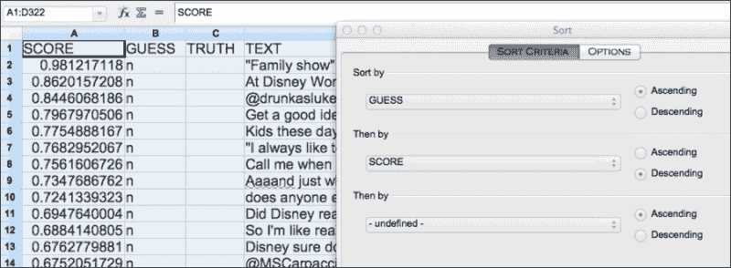
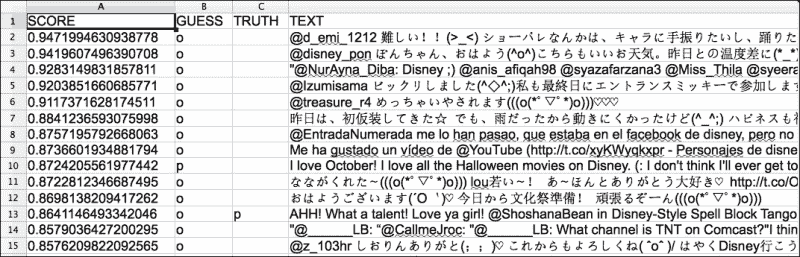
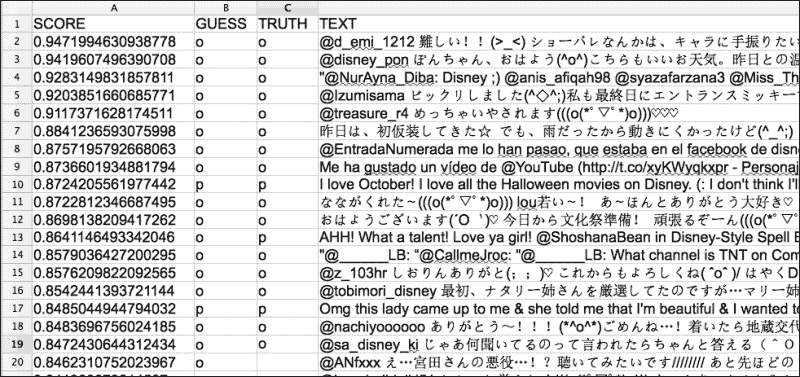
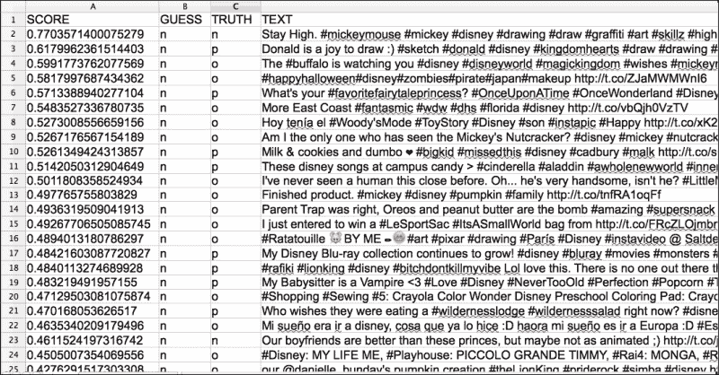

# 第三章。高级分类器

本章将介绍以下内容：

+   一个简单的分类器

+   带有标记的语言模型分类器

+   朴素贝叶斯

+   特征提取器

+   逻辑回归

+   多线程交叉验证

+   逻辑回归中的调参

+   自定义特征提取

+   结合特征提取器

+   分类器构建生命周期

+   语言调优

+   阈值分类器

+   训练一点，学习一点——主动学习

+   注释

# 介绍

本章介绍了使用不同学习技术以及关于数据（特征）的更丰富观察的更复杂的分类器。我们还将讨论构建机器学习系统的最佳实践，以及数据注释和减少所需训练数据量的方法。

# 一个简单的分类器

这个方法是一个思想实验，应该有助于清楚地了解机器学习的作用。回顾第一章中的*训练你自己的语言模型分类器*，在该方法中训练自己的情感分类器。考虑一下针对同一问题的保守方法——从输入构建`Map<String,String>`到正确的类别。这个方法将探讨这种方式如何工作以及可能带来的后果。

## 如何实现...

做好准备；这将是极其愚蠢的，但希望能带来一些信息。

1.  在命令行中输入以下内容：

    ```py
    java -cp lingpipe-cookbook.1.0.jar:lib/lingpipe-4.1.0.jar:lib/opencsv-2.4.jar com.lingpipe.cookbook.chapter3.OverfittingClassifier

    ```

1.  出现了一个常见的无力提示，并伴随一些用户输入：

    ```py
    Training
    Type a string to be classified. Empty string to quit.
    When all else fails #Disney
    Category is: e
    ```

1.  它正确地将语言识别为`e`或英语。然而，其他部分即将失败。接下来，我们将使用以下代码：

    ```py
    Type a string to be classified. Empty string to quit.
    When all else fails #Disne
    Category is: n
    ```

    我们刚刚去掉了`#Disney`的最后一个`y`，结果得到了一个大混乱的分类器。发生了什么？

## 它是如何工作的...

本节实际上应该叫做*它是如何不工作的*，不过让我们还是深入探讨一下细节。

为了明确，这个方法并不推荐作为解决任何需要灵活性的分类问题的实际方案。然而，它介绍了如何使用 LingPipe 的`Classification`类的一个最小示例，并清晰地展示了过拟合的极端情况；这反过来有助于展示机器学习与大多数标准计算机工程的不同之处。

从`main()`方法开始，我们将进入一些标准代码操作，这些应该是你从第一章，*简单分类器*中熟悉的内容：

```py
String dataPath = args.length > 0 ? args[0] : "data/disney_e_n.csv";
List<String[]> annotatedData = Util.readAnnotatedCsvRemoveHeader(new File(dataPath));

OverfittingClassifier classifier = new OverfittingClassifier();
System.out.println("Training");
for (String[] row: annotatedData) {
  String truth = row[Util.ANNOTATION_OFFSET];
  String text = row[Util.TEXT_OFFSET];
  classifier.handle(text,new Classification(truth));
}
Util.consoleInputBestCategory(classifier);
```

这里没有什么新奇的内容——我们只是在训练一个分类器，如在第一章中所示的*简单分类器*，然后将该分类器提供给`Util.consoleInputBestCategory()`方法。查看类代码可以揭示发生了什么：

```py
public class OverfittingClassifier implements BaseClassifier<CharSequence> {

  Map<String,Classification> mMap 
         = new HashMap<String,Classification>();  

   public void handle(String text, Classification classification) {mMap.put(text, classification);
  }
```

所以，`handle()`方法接受`text`和`classification`对，并将它们存入`HashMap`。分类器没有其他操作来从数据中学习，因此训练仅仅是对数据的记忆：

```py
@Override
public Classification classify(CharSequence text) {
  if (mMap.containsKey(text)) {
    return mMap.get(text);
  }
  return new Classification("n");
}
```

`classify()`方法只是进行一次`Map`查找，如果找到对应的值，则返回该值，否则我们将返回类别`n`作为分类结果。

前面代码的优点是，你有一个`BaseClassifier`实现的最简示例，并且可以看到`handle()`方法是如何将数据添加到分类器中的。

前面代码的缺点是训练数据与类别之间的映射完全僵化。如果训练中没有看到确切的示例，那么就会假定为`n`类别。

这是过拟合的极端示例，但它本质上传达了过拟合模型的含义。过拟合模型过于贴合训练数据，无法很好地对新数据进行泛化。

让我们再想想前面语言识别分类器到底有什么问题——问题在于，整个句子/推文是错误的处理单位。单词/标记才是衡量使用何种语言的更好方式。一些将在后续方法中体现的改进包括：

+   将文本分解为单词/标记。

+   不仅仅是匹配/不匹配的决策，考虑一种更微妙的方法。简单的*哪个语言匹配更多单词*将是一个巨大的改进。

+   随着语言的接近，例如英式英语与美式英语，可以为此调用概率。注意可能的区分词。

尽管这个方法可能对眼前的任务来说有些滑稽不合适，但考虑尝试情感分析来做一个更荒谬的例子。它体现了计算机科学中的一个核心假设，即输入的世界是离散且有限的。机器学习可以被视为对这个假设不成立的世界的回应。

## 还有更多……

奇怪的是，我们在商业系统中经常需要这种分类器——我们称之为管理分类器；它会预先在数据上运行。曾经发生过某个高级副总裁对系统输出中的某个示例不满。然后可以使用这个分类器训练精确的案例，从而立即修复系统并让副总裁满意。

# 带有标记的语言模型分类器

第一章，*简单分类器*，讲解了在不知道标记/单词是什么的情况下进行分类，每个类别都有一个语言模型——我们使用字符切片或 n-gram 来建模文本。第二章，*寻找和处理单词*，详细讨论了在文本中寻找标记的过程，现在我们可以利用这些标记来构建分类器。大多数时候，我们将标记化输入提供给分类器，因此这个方法是对概念的一个重要介绍。

## 如何做……

这个食谱将告诉我们如何训练和使用一个分词的语言模型分类器，但它会忽略评估、序列化、反序列化等问题。你可以参考第一章中的食谱，*简单分类器*，获取示例。本食谱的代码在`com.lingpipe.cookbook.chapter3.TrainAndRunTokenizedLMClassifier`中：

1.  以下代码的例外情况与第一章中的*训练你自己的语言模型分类器*食谱中的内容相同，*简单分类器*。`DynamicLMClassifier`类提供了一个静态方法，用于创建一个分词的语言模型分类器。需要一些设置。`maxTokenNgram`变量设置了分类器中使用的最大令牌序列大小——较小的数据集通常从较低阶（令牌数量）n-gram 中受益。接下来，我们将设置一个`tokenizerFactory`方法，选择第二章中所用的主力分词器，*查找和使用词汇*。最后，我们将指定分类器使用的类别：

    ```py
    int maxTokenNGram = 2;
    TokenizerFactory tokenizerFactory = IndoEuropeanTokenizerFactory.INSTANCE;
    String[] categories = Util.getCategories(annotatedData);
    ```

1.  接下来，构建分类器：

    ```py
    DynamicLMClassifier<TokenizedLM> classifier = DynamicLMClassifier.createTokenized(categories,tokenizerFactory,maxTokenNGram);
    ```

1.  从命令行或你的 IDE 中运行代码：

    ```py
    java -cp lingpipe-cookbook.1.0.jar:lib/lingpipe-4.1.0.jar:lib/opencsv-2.4.jar com.lingpipe.cookbook.chapter3.TrainAndRunTokenizedLMClassifier
    ```

## 还有更多...

在实际应用中，`DynamicLMClassifier`分类器在商业应用中并没有得到广泛使用。这个分类器可能是进行作者识别分类的一个不错选择（即用于判断给定文本是某个作者写的，还是其他人写的），该分类器对于措辞和精确用词非常敏感。建议查阅 Javadoc，了解该类的具体功能。

# 朴素贝叶斯

朴素贝叶斯可能是世界上最著名的分类技术，为了让你保持警觉，我们提供了两个独立的实现，具有很高的可配置性。朴素贝叶斯分类器的一个最著名应用是用于电子邮件中的垃圾邮件过滤。

使用*naïve*（天真）一词的原因是，该分类器假设词汇（特征）是相互独立的——这一假设显然是天真的，但许多有用或不那么有用的技术都是基于这一方法的。一些传统朴素贝叶斯的显著特征包括：

+   字符序列被转换为带有计数的词袋。空格不被考虑，词项的顺序不重要。

+   朴素贝叶斯分类器需要两个或更多类别，用于将输入文本分类。这些类别必须是完整的且互相排斥的。这意味着用于训练的文档必须只属于一个类别。

+   数学非常简单：`p(category|tokens) = p(category,tokens)/p(tokens)`。

+   该类可以根据各种未知令牌模型进行配置。

朴素贝叶斯分类器估计两个方面的内容。首先，它估计每个类别的概率，独立于任何标记。这是根据每个类别提供的训练示例数量来进行的。其次，对于每个类别，它估计在该类别中看到每个标记的概率。朴素贝叶斯如此有用且重要，以至于我们将向你展示它如何工作，并逐步讲解公式。我们使用的例子是基于文本分类热天气和冷天气。

首先，我们将计算出给定单词序列时，类别的概率。其次，我们将插入一个例子，并使用我们构建的分类器进行验证。

## 准备开始

让我们列出计算给定文本输入时类别概率的基本公式。基于标记的朴素贝叶斯分类器通过以下方式计算联合标记计数和类别概率：

```py
p(tokens,cat) = p(tokens|cat) * p(cat)
```

1.  条件概率是通过应用贝叶斯规则来逆转概率计算得到的：

    ```py
    p(cat|tokens) = p(tokens,cat) / p(tokens)
                   = p(tokens|cat) * p(cat) / p(tokens)
    ```

1.  现在，我们将扩展所有这些术语。如果我们看一下`p(tokens|cat)`，这是朴素假设发挥作用的地方。我们假设每个标记是独立的，因此所有标记的概率是每个标记概率的乘积：

    ```py
    p(tokens|cat) = p(tokens[0]|cat) * p(tokens[1]|cat) * . . . * p(tokens[n]|cat)
    ```

    标记本身的概率，即`p(tokens)`，是前面方程中的分母。这只是它们在每个类别中的概率总和，并根据类别本身的概率加权：

    ```py
    p(tokens) = p(tokens|cat1) * p(cat1) + p(tokens|cat2) * p(cat2) + . . . + p(tokens|catN) * p(catN)
    ```

    ### 注意

    在构建朴素贝叶斯分类器时，`p(tokens)`不需要显式计算。相反，我们可以使用`p(tokens|cat) * p(cat)`，并将标记分配给具有更高乘积的类别。

1.  现在我们已经列出了方程的每个元素，可以看看这些概率是如何计算的。我们可以通过简单的频率来计算这两个概率。

    类别的概率是通过计算该类别在训练实例中出现的次数除以训练实例的总数来计算的。我们知道，朴素贝叶斯分类器具有穷尽且互斥的类别，因此每个类别的频率总和必须等于训练实例的总数：

    ```py
    p(cat) = frequency(cat) / (frequency(cat1) + frequency(cat2) + . . . + frequency(catN))
    ```

    类别中标记的概率是通过计算标记在该类别中出现的次数除以所有其他标记在该类别中出现的总次数来计算的：

    ```py
    p(token|cat) = frequency(token,cat)/(frequency(token1,cat) + frequency(token2,cat) + . . . + frequency(tokenN,cat)
    ```

    这些概率的计算提供了所谓的**最大似然估计**模型。不幸的是，这些估计对于训练中未出现的标记提供零概率。你可以很容易地通过计算一个未见过的标记的概率看到这一点。由于它没有出现，它的频率计数为 0，因此原始方程的分子也变为 0。

    为了克服这个问题，我们将使用一种称为**平滑**的技术，它分配一个先验，然后计算最大后验估计，而不是最大似然估计。一种非常常见的平滑技术叫做加法平滑，它只是将一个先验计数加到训练数据中的每个计数上。有两个计数集合被加上：第一个是加到所有标记频率计算中的标记计数，第二个是加到所有类别计数计算中的类别计数。

    这显然会改变`p(cat)`和`p(token|cat)`的值。我们将添加到类别计数的`alpha`先验和添加到标记计数的`beta`先验称为先验。当我们调用`alpha`先验时，之前的计算会变成：

    ```py
    p(cat) = frequency(cat) + alpha / [(frequency(cat1) + alpha) + (frequency(cat2)+alpha) + . . . + (frequency(catN) + alpha)]
    ```

    当我们调用`beta`先验时，计算会变成：

    ```py
    p(token|cat) = (frequency(token,cat)+beta) / [(frequency(token1,cat)+beta) + frequency(token2,cat)+beta) + . . . + (frequency(tokenN,cat) + beta)]
    ```

1.  现在我们已经设置好了方程式，让我们来看一个具体的例子。

    我们将构建一个分类器，基于一组短语来分类天气预报是热还是冷。

    ```py
    hot : super steamy today
    hot : boiling out
    hot : steamy out

    cold : freezing out
    cold : icy
    ```

    在这五个训练项中总共有七个标记：

    +   `super`

    +   `steamy`

    +   `today`

    +   `boiling`

    +   `out`

    +   `freezing`

    +   `icy`

    在这些数据中，所有的标记都出现一次，除了`steamy`，它在`hot`类别中出现了两次，而`out`则在每个类别中各出现了一次。这就是我们的训练数据。现在，让我们计算输入文本属于`hot`类别或`cold`类别的概率。假设我们的输入是单词`super`。我们将类别先验`alpha`设置为`1`，标记先验`beta`也设置为`1`。

1.  所以，我们将计算`p(hot|super)`和`p(cold|super)`的概率：

    ```py
    p(hot|super) = p(super|hot) * p(hot)/ p(super)

    p(super|hot) = (freq(super,hot) + beta) / [(freq(super|hot)+beta) + (freq(steamy|hot) + beta) + . . . + (freq(freezing|hot)+beta)
    ```

    我们将考虑所有标记，包括那些在`hot`类别中没有出现的标记：

    ```py
    freq(super|hot) + beta = 1 + 1 = 2
    freq(steamy|hot) + beta = 2 + 1 = 3
    freq(today|hot) + beta = 1 + 1 = 2
    freq(boiling|hot) + beta = 1 + 1 = 2
    freq(out|hot) + beta = 1 + 1 = 2
    freq(freezing|hot) + beta = 0 + 1 = 1
    freq(icy|hot) + beta = 0 + 1 = 1
    ```

    这将给我们一个分母，等于这些输入的总和：

    ```py
    2+3+2+2+2+1+1 = 13
    ```

1.  现在，`p(super|hot) = 2/13`是方程的一部分。我们仍然需要计算`p(hot)`和`p(super)`：

    ```py
    p(hot) = (freq(hot) + alpha) / 
                        ((freq(hot) + alpha) + freq(cold)+alpha)) 
    ```

    对于`hot`类别，我们的训练数据中有三个文档或案例，而对于`cold`类别，我们有两个文档。所以，`freq(hot) = 3`，`freq(cold) = 2`：

    ```py
    p(hot) = (3 + 1) / (3 + 1) + (2 +1) = 4/7
    Similarly p(cold) = (2 + 1) / (3 + 1) + (2 +1) = 3/7
    Please note that p(hot) = 1 – p(cold)

    p(super) = p(super|hot) * p(hot) + p(super|cold) + p(cold)
    ```

    要计算`p(super|cold)`，我们需要重复相同的步骤：

    ```py
    p(super|cold) = (freq(super,cold) + beta) / [(freq(super|cold)+beta) + (freq(steamy|cold) + beta) + . . . + (freq(freezing|cold)+beta)

    freq(super|cold) + beta = 0 + 1 = 1
    freq(steamy|cold) + beta = 0 + 1 = 1
    freq(today|cold) + beta = 0 + 1 = 1
    freq(boiling|cold) + beta = 0 + 1 = 1
    freq(out|cold) + beta = 1 + 1 = 2
    freq(freezing|cold) + beta = 1 + 1 = 2
    freq(icy|cold) + beta = 1 + 1 = 2

    p(super|cold) = freq(super|cold)+beta/sum of all terms above

                  = 0 + 1 / (1+1+1+1+2+2+2) = 1/10
    ```

    这会给我们标记`super`的概率：

    ```py
    P(super) = p(super|hot) * p(hot) + p(super|cold) * p(cold)
             = 2/13 * 4/7 + 1/10 * 3/7
    ```

    现在我们已经将所有部分整合在一起，来计算`p(hot|super)`和`p(cold|super)`：

    ```py
    p(hot|super) = p(super|hot) * p(hot) / p(super)
                 = (2/13 * 4/7) / (2/13 * 4/7 + 1/10 * 3/7)

                 = 0.6722
    p(cold|super) = p(super|cold) * p(cold) /p(super)
                 = (1/10 * 3/7) / (2/13 * 4/7 + 1/10 * 3/7)
                 = 0.3277

    Obviously, p(hot|super) = 1 – p(cold|super)
    ```

    如果我们想对输入流`super super`重复此过程，可以使用以下计算：

    ```py
    p(hot|super super) = p(super super|hot) * p(hot) / p(super super)
                 = (2/13 * 2/13 * 4/7) / (2/13 * 2/13 * 4/7 + 1/10 * 1/10 * 3/7)
                 = 0.7593
    p(cold|super super) = p(super super|cold) * p(cold) /p(super super)
                 = (1/10 * 1/10 * 3/7) / (2/13 * 2/13 * 4/7 + 1/10 * 1/10 * 3/7)
                 = 0.2406
    ```

    记住我们的朴素假设：标记的概率是概率的乘积，因为我们假设它们彼此独立。

让我们通过训练朴素贝叶斯分类器并使用相同的输入来验证我们的计算。

## 如何做...

让我们在代码中验证这些计算：

1.  在你的 IDE 中，运行本章代码包中的`TrainAndRunNaiveBayesClassifier`类，或者使用命令行输入以下命令：

    ```py
    java -cp lingpipe-cookbook.1.0.jar:lib/lingpipe-4.1.0.jar:lib/opencsv-2.4.jar com.lingpipe.cookbook.chapter3.TrainAndRunNaiveBayesClassifier

    ```

1.  在提示中，我们使用第一个例子，`super`：

    ```py
    Type a string to be classified
    super
    h 0.67   
    c 0.33   
    ```

1.  正如我们所看到的，我们的计算是正确的。对于一个在我们的训练集中不存在的单词`hello`，我们将回退到由类别的先验计数修正的类别的普遍性：

    ```py
    Type a string to be classified
    hello
    h 0.57   
    c 0.43
    ```

1.  同样，对于`super super`的情况，我们的计算是正确的。

    ```py
    Type a string to be classified
    super super

    ```

    ```py
    h 0.76   
    c 0.24    
    ```

1.  生成前述输出的源代码位于`src/com/lingpipe/chapter3/TrainAndRunNaiveBays.java`。这段代码应该很直观，因此我们在本食谱中不会详细讲解。

## 另请参见

+   有关配置朴素贝叶斯的更多细节，包括长度归一化，请参考 Javadoc：[`alias-i.com/lingpipe/docs/api/index.html?com/aliasi/classify/TradNaiveBayesClassifier.html`](http://alias-i.com/lingpipe/docs/api/index.html?com/aliasi/classify/TradNaiveBayesClassifier.html)

+   你可以参考期望最大化教程，网址为[`alias-i.com/lingpipe/demos/tutorial/em/read-me.html`](http://alias-i.com/lingpipe/demos/tutorial/em/read-me.html)

# 特征提取器

到目前为止，我们一直在使用字符和单词来训练我们的模型。接下来，我们将引入一个分类器（逻辑回归），它可以让数据的其他观察结果来影响分类器——例如，一个单词是否实际上是一个日期。特征提取器在 CRF 标注器和 K-means 聚类中都有应用。本食谱将介绍独立于任何使用它们的技术的特征提取器。

## 如何做…

这个食谱不复杂，但接下来的*逻辑回归*食谱有许多动态部分，而这正是其中之一。

1.  启动你的 IDE 或在命令行中输入：

    ```py
    java -cp lingpipe-cookbook.1.0.jar:lib/lingpipe-4.1.0.jar com.lingpipe.cookbook.chapter3.SimpleFeatureExtractor

    ```

1.  在我们的标准 I/O 循环中输入一个字符串：

    ```py
    Type a string to see its features
    My first feature extraction!
    ```

1.  然后生成特征：

    ```py
    !=1
    My=1
    extraction=1
    feature=1
    first=1
    ```

1.  请注意，这里没有顺序信息。它是否保持计数？

    ```py
    Type a string to see its features
    My my my what a nice feature extractor.
    my=2
    .=1
    My=1
    a=1
    extractor=1
    feature=1
    nice=1
    what=1
    ```

1.  特征提取器使用`my=2`来保持计数，并且不规范化大小写（`My`与`my`是不同的）。有关如何修改特征提取器的更多信息，请参阅本章稍后的食谱——它们非常灵活。

## 它是如何工作的…

LingPipe 为创建特征提取器提供了坚实的基础设施。本食谱的代码位于`src/com/lingipe/chapter3/SimpleFeatureExtractor.java`：

```py
public static void main(String[] args) throws IOException {
  TokenizerFactory tokFact 
    = IndoEuropeanTokenizerFactory.INSTANCE;
  FeatureExtractor<CharSequence> tokenFeatureExtractor 
    = new TokenFeatureExtractor(tokFact);
```

前面的代码使用`TokenizerFactory`构建了`TokenFeatureExtractor`。这是 LingPipe 中提供的 13 种`FeatureExtractor`实现之一。

接下来，我们将应用 I/O 循环并打印出特征，它是`Map<String, ? extends Number>`。`String`元素是特征名称。在这种情况下，实际的标记是名称。映射的第二个元素是一个扩展了`Number`的值，在这种情况下，就是标记在文本中出现的次数。

```py
BufferedReader reader 
  = new BufferedReader(new   InputStreamReader(System.in));
while (true) {
  System.out.println("\nType a string to see its features");
  String text = reader.readLine();
  Map<String, ? extends Number > features 
    = tokenFeatureExtractor.features(text);
  System.out.println(features);
}
```

特征名称只需是唯一的——我们本可以在每个特征名称前加上`SimpleFeatExt_`，以跟踪特征的来源，这在复杂的特征提取场景中很有帮助。

# 逻辑回归

逻辑回归可能是大多数工业分类器的基础，唯一的例外可能是朴素贝叶斯分类器。它几乎肯定是性能最好的分类器之一，尽管代价是训练过程较慢且配置和调优较为复杂。

逻辑回归也被称为最大熵、单神经元的神经网络分类等。到目前为止，本书中的分类器基于底层的字符或词元，但逻辑回归使用的是不受限的特征提取，这允许在分类器中编码任意的情况观察。

本教程与[`alias-i.com/lingpipe/demos/tutorial/logistic-regression/read-me.html`](http://alias-i.com/lingpipe/demos/tutorial/logistic-regression/read-me.html)中的一个更完整的教程非常相似。

## 逻辑回归如何工作

逻辑回归所做的就是对数据进行特征权重的向量运算，应用系数向量，并进行一些简单的数学计算，最终得出每个训练类的概率。复杂的部分在于如何确定系数。

以下是我们为 21 条推文（标注为英文`e`和非英文`n`）的训练结果所生成的一些特征。由于我们的先验会将特征权重推向`0.0`，因此特征相对较少，一旦某个权重为`0.0`，该特征就会被移除。请注意，类别`n`的所有特征都被设置为`0.0`，这与逻辑回归过程的特性有关，它将一类特征固定为`0.0`，并根据此调整其他类别的特征：

```py
FEATURE    e          n
I :   0.37    0.0
! :   0.30    0.0
Disney :   0.15    0.0
" :   0.08    0.0
to :   0.07    0.0
anymore : 0.06    0.0
isn :   0.06    0.0
' :   0.06    0.0
t :   0.04    0.0
for :   0.03    0.0
que :   -0.01    0.0
moi :   -0.01    0.0
_ :   -0.02    0.0
, :   -0.08    0.0
pra :   -0.09    0.0
? :   -0.09    0.0
```

以字符串`I luv Disney`为例，它将只具有两个非零特征：`I=0.37`和`Disney=0.15`（对于`e`），`n`类的特征全为零。由于没有与`luv`匹配的特征，它会被忽略。该推文为英文的概率可以分解为：

*vectorMultiply(e,[I,Disney]) = exp(.37*1 + .15*1) = 1.68*

*vectorMultiply(n,[I,Disney]) = exp(0*1 + 0*1) = 1*

我们将通过求和结果并进行归一化，得到最终的概率：

*p(e|,[I,Disney]) = 1.68/(1.68 +1) = 0.62*

*p(e|,[I,Disney]) = 1/(1.68 +1) = 0.38*

这就是运行逻辑回归模型时数学运算的原理。训练则是完全不同的问题。

## 准备工作

本教程假设使用与我们一直以来相同的框架，从`.csv`文件中获取训练数据，训练分类器，并通过命令行运行它。

设置分类器的训练有点复杂，因为训练过程中使用了大量的参数和对象。我们将讨论在`com.lingpipe.cookbook.chapter3.TrainAndRunLogReg`中训练方法的 10 个参数。

`main()`方法从应该熟悉的类和方法开始——如果它们不熟悉，可以看看*如何通过交叉验证进行训练和评估*以及*引入分词器工厂——在字符流中查找单词*，这些都是第一章 *简单分类器*和第二章 *查找与处理单词*中的配方：

```py
public static void main(String[] args) throws IOException {
  String trainingFile = args.length > 0 ? args[0] 
           : "data/disney_e_n.csv";
  List<String[]> training 
    = Util.readAnnotatedCsvRemoveHeader(new File(trainingFile));

  int numFolds = 0;
  XValidatingObjectCorpus<Classified<CharSequence>> corpus 
    = Util.loadXValCorpus(training,numFolds);

  TokenizerFactory tokenizerFactory 
    = IndoEuropeanTokenizerFactory.INSTANCE;
```

请注意，我们使用的是`XValidatingObjectCorpus`，而使用像`ListCorpus`这样更简单的实现就足够了。我们不会利用它的任何交叉验证功能，因为`numFolds`参数为`0`时训练会遍历整个语料库。我们试图将新的类别数量保持在最小，并且在实际工作中，我们总是倾向于使用这种实现。

现在，我们将开始为我们的分类器构建配置。`FeatureExtractor<E>`接口提供了从数据到特征的映射；这将用于训练和运行分类器。在本例中，我们使用`TokenFeatureExtractor()`方法，它基于构造时提供的分词器找到的标记来创建特征。这与朴素贝叶斯的推理方式类似。如果不清楚，前面的配方会更详细地说明特征提取器的作用：

```py
FeatureExtractor<CharSequence> featureExtractor
  = new TokenFeatureExtractor(tokenizerFactory);
```

`minFeatureCount`项通常设置为大于 1 的数字，但对于小的训练集，这个设置是提高性能所必需的。过滤特征计数的思路是，逻辑回归往往会过拟合低频特征，这些特征仅因偶然出现在某个类别的训练数据中而存在。随着训练数据量的增加，`minFeatureCount`值通常会根据交叉验证性能进行调整：

```py
int minFeatureCount = 1;
```

`addInterceptFeature`布尔值控制是否存在一个类别特征，表示该类别在训练数据中的普遍性。默认的截距特征名称是`*&^INTERCEPT%$^&**`，如果它被使用，你会在权重向量输出中看到它。根据惯例，截距特征对于所有输入的值被设置为`1.0`。其理念是，如果某个类别非常常见或非常稀有，则应有一个特征专门捕捉这一事实，而不受其他可能分布不均的特征的影响。这某种程度上建模了朴素贝叶斯中的类别概率，但逻辑回归算法会像对待其他特征一样决定它的有用性：

```py
boolean addInterceptFeature = true;
boolean noninformativeIntercept = true;
```

这些布尔值控制截距特征被使用时会发生什么。如果此参数为真，通常不会将先验应用于截距特征；如果将布尔值设置为`false`，则先验将应用于截距。

接下来是`RegressionPrior`实例，它控制模型的拟合方式。你需要知道的是，先验帮助防止逻辑回归对数据的过拟合，通过将系数推向 0。这里有一个非信息性先验，它不会这样做，结果是如果有特征仅适用于一个类别，它将被缩放到无穷大，因为模型在系数增加时会不断更好地拟合数值估计。先验，在这个上下文中，作为一种方式，避免对世界的观察过于自信。

`RegressionPrior`实例中的另一个维度是特征的期望方差。低方差会更积极地将系数推向零。由静态`laplace()`方法返回的先验在 NLP 问题中通常效果很好。关于这里发生了什么，更多信息请参考相关的 Javadoc 和在本配方开始时提到的逻辑回归教程——虽然有很多内容，但无需深入理论理解也能管理。此外，见本章中的*逻辑回归中的参数调优*配方。

```py
double priorVariance = 2;
RegressionPrior prior 
  = RegressionPrior.laplace(priorVariance,
          noninformativeIntercept);
```

接下来，我们将控制算法如何搜索答案。

```py
AnnealingSchedule annealingSchedule
  = AnnealingSchedule.exponential(0.00025,0.999);
double minImprovement = 0.000000001;
int minEpochs = 100;
int maxEpochs = 2000;
```

`AnnealingSchedule`最好通过查阅 Javadoc 来理解，但它的作用是改变拟合模型时允许系数变化的程度。`minImprovement`参数设置模型拟合必须改进的量，才不会终止搜索，因为算法已经收敛。`minEpochs`参数设置最小迭代次数，`maxEpochs`设置一个上限，如果搜索没有收敛（根据`minImprovement`判断）。

接下来是一些允许基本报告/日志记录的代码。`LogLevel.INFO`将报告关于分类器尝试收敛过程中的大量信息：

```py
PrintWriter progressWriter = new PrintWriter(System.out,true);
progressWriter.println("Reading data.");
Reporter reporter = Reporters.writer(progressWriter);
reporter.setLevel(LogLevel.INFO);  
```

这里是我们最复杂类之一的*准备就绪*部分的结束——接下来，我们将训练并运行分类器。

## 如何操作…

设置训练和运行这个类确实有一些工作。我们将逐步介绍如何启动它；接下来的配方将涉及其调优和评估：

1.  请注意，还有一个更复杂的 14 参数训练方法，以及一个扩展配置能力的方法。这是 10 参数版本：

    ```py
    LogisticRegressionClassifier<CharSequence> classifier
        = LogisticRegressionClassifier.
            <CharSequence>train(corpus,
            featureExtractor,
            minFeatureCount,
            addInterceptFeature,
            prior,
            annealingSchedule,
            minImprovement,
            minEpochs,
            maxEpochs,
            reporter);
    ```

1.  `train()`方法，根据`LogLevel`常量的不同，会从`LogLevel.NONE`的空输出到`LogLevel.ALL`的巨大输出。

1.  虽然我们不会使用它，但我们展示如何将训练好的模型序列化到磁盘。*如何序列化 LingPipe 对象——分类器示例*配方在第一章，*简单分类器*中解释了发生了什么：

    ```py
    AbstractExternalizable.compileTo(classifier,
      new File("models/myModel.LogisticRegression"));
    ```

1.  一旦训练完成，我们将应用标准分类循环，包含：

    ```py
    Util.consoleInputPrintClassification(classifier);
    ```

1.  在你选择的 IDE 中运行前面的代码，或使用命令行命令：

    ```py
    java -cp lingpipe-cookbook.1.0.jar:lib/lingpipe-4.1.0.jar:lib/opencsv-2.4.jar com.lingpipe.cookbook.chapter3.TrainAndRunLogReg

    ```

1.  结果是关于训练的一个大量信息输出：

    ```py
    Reading data.
    :00 Feature Extractor class=class com.aliasi.tokenizer.TokenFeatureExtractor
    :00 min feature count=1
    :00 Extracting Training Data
    :00 Cold start
    :00 Regression callback handler=null
    :00 Logistic Regression Estimation
    :00 Monitoring convergence=true
    :00 Number of dimensions=233
    :00 Number of Outcomes=2
    :00 Number of Parameters=233
    :00 Number of Training Instances=21
    :00 Prior=LaplaceRegressionPrior(Variance=2.0, noninformativeIntercept=true)
    :00 Annealing Schedule=Exponential(initialLearningRate=2.5E-4, base=0.999)
    :00 Minimum Epochs=100
    :00 Maximum Epochs=2000
    :00 Minimum Improvement Per Period=1.0E-9
    :00 Has Informative Prior=true
    :00 epoch=    0 lr=0.000250000 ll=   -20.9648 lp= -232.0139 llp=  -252.9787 llp*=  -252.9787
    :00 epoch=    1 lr=0.000249750 ll=   -20.9406 lp= -232.0195 llp=  -252.9602 llp*=  -252.9602
    ```

1.  `epoch`报告会一直进行，直到达到设定的周期数或者搜索收敛。在以下情况下，周期数已满足：

    ```py
    :00 epoch= 1998 lr=0.000033868 ll=   -15.4568 lp=  -233.8125 llp=  -249.2693 llp*=  -249.2693
    :00 epoch= 1999 lr=0.000033834 ll=   -15.4565 lp=  -233.8127 llp=  -249.2692 llp*=  -249.2692
    ```

1.  现在，我们可以稍微玩一下分类器：

    ```py
    Type a string to be classified. Empty string to quit.
    I luv Disney
    Rank  Category  Score  P(Category|Input)
    0=e 0.626898085027528 0.626898085027528
    1=n 0.373101914972472 0.373101914972472
    ```

1.  这应该看起来很熟悉；它与食谱开始时的示例结果完全相同。

就这样！你已经训练并使用了世界上最相关的工业分类器。不过，要充分利用这个“猛兽”的力量，还有很多内容要掌握。

# 多线程交叉验证

交叉验证（请参阅第一章中的*如何使用交叉验证进行训练和评估*食谱，*简单分类器*）可能非常慢，这会干扰系统的调优。这个食谱将展示一种简单但有效的方法，帮助你利用系统上的所有可用核心，更快速地处理每个折叠。

## 如何做…

这个食谱在下一个食谱的背景下解释了多线程交叉验证，所以不要被相同类名的重复所困惑。

1.  启动你的 IDE 或在命令行中输入：

    ```py
    java -cp lingpipe-cookbook.1.0.jar:lib/lingpipe-4.1.0.jar:lib/opencsv-2.4.jar com.lingpipe.cookbook.chapter3.TuneLogRegParams

    ```

1.  系统随后会返回以下输出（你可能需要滚动到窗口顶部）：

    ```py
    Reading data.
    RUNNING thread Fold 5 (1 of 10)
    RUNNING thread Fold 9 (2 of 10)
    RUNNING thread Fold 3 (3 of 10)
    RUNNING thread Fold 4 (4 of 10)
    RUNNING thread Fold 0 (5 of 10)
    RUNNING thread Fold 2 (6 of 10)
    RUNNING thread Fold 8 (7 of 10)
    RUNNING thread Fold 6 (8 of 10)
    RUNNING thread Fold 7 (9 of 10)
    RUNNING thread Fold 1 (10 of 10)
    reference\response
              \e,n,
             e 11,0,
             n 6,4,
    ```

1.  默认的训练数据是 21 条带有英语`e`和非英语`n`标注的推文。在之前的输出中，我们看到每个作为线程运行的折叠报告和结果混淆矩阵。就是这样！我们刚刚完成了多线程交叉验证。让我们来看看它是如何工作的。

## 它是如何工作的……

所有的操作都发生在`Util.xvalLogRegMultiThread()`方法中，我们从`src/com/lingpipe/cookbook/chapter3/TuneLogRegParams.java`中调用它。`TuneLogRegParams`的细节将在下一个食谱中讲解。本食谱将重点介绍`Util`方法：

```py
int numThreads = 2;
int numFolds = 10;
Util.xvalLogRegMultiThread(corpus,
        featureExtractor,
        minFeatureCount,
        addInterceptFeature,
        prior,
        annealingSchedule,
        minImprovement,
        minEpochs,
        maxEpochs,
        reporter,
        numFolds,
        numThreads,
        categories);
```

用于配置逻辑回归的所有 10 个参数都是可控的（你可以参考前一个食谱了解解释），此外还新增了`numFolds`，用于控制有多少个折叠，`numThreads`，控制可以同时运行多少个线程，最后是`categories`。

如果我们查看`src/com/lingpipe/cookbook/Util.java`中的相关方法，我们会看到：

```py
public static <E> ConditionalClassifierEvaluator<E> xvalLogRegMultiThread(
    final XValidatingObjectCorpus<Classified<E>> corpus,
    final FeatureExtractor<E> featureExtractor,
    final int minFeatureCount, 
    final boolean addInterceptFeature,
    final RegressionPrior prior, 
    final AnnealingSchedule annealingSchedule,
    final double minImprovement, 
    final int minEpochs, final int maxEpochs,
    final Reporter reporter, 
    final int numFolds, 
    final int numThreads, 
    final String[] categories) {
```

1.  该方法首先匹配逻辑回归的配置参数以及运行交叉验证。由于交叉验证最常用于系统调优，因此所有相关部分都暴露出来以供修改。由于我们使用了匿名内部类来创建线程，所以所有内容都是最终的。

1.  接下来，我们将设置`crossFoldEvaluator`来收集每个线程的结果：

    ```py
    corpus.setNumFolds(numFolds);
    corpus.permuteCorpus(new Random(11211));
    final boolean storeInputs = true;
    final ConditionalClassifierEvaluator<E> crossFoldEvaluator
      = new ConditionalClassifierEvaluator<E>(null, categories, storeInputs);
    ```

1.  现在，我们将开始为每个折叠`i`创建线程的工作：

    ```py
    List<Thread> threads = new ArrayList<Thread>();
    for (int i = 0; i < numFolds; ++i) {
      final XValidatingObjectCorpus<Classified<E>> fold 
        = corpus.itemView();
      fold.setFold(i);
    ```

    `XValidatingObjectCorpus`类通过创建一个线程安全的语料库版本来设置多线程访问，该版本用于读取，方法为`itemView()`。此方法返回一个可以设置折叠的语料库，但无法添加数据。

    每个线程是一个`runnable`对象，实际的训练和评估工作在`run()`方法中完成：

    ```py
    Runnable runnable 
      = new Runnable() {
        @Override
        public void run() {
        try {
          LogisticRegressionClassifier<E> classifier
            = LogisticRegressionClassifier.<E>train(fold,
                    featureExtractor,
                    minFeatureCount,
                    addInterceptFeature,
                    prior,
                    annealingSchedule,
                    minImprovement,
                    minEpochs,
                    maxEpochs,
                    reporter);
    ```

    在这段代码中，我们首先训练分类器，而这又需要一个 `try/catch` 语句来处理由 `LogisticRegressionClassifier.train()` 方法抛出的 `IOException`。接下来，我们将创建 `withinFoldEvaluator`，它将在没有同步问题的情况下在线程中填充：

    ```py
    ConditionalClassifierEvaluator<E> withinFoldEvaluator 
      = new ConditionalClassifierEvaluator<E>(classifier, categories, storeInputs);
    fold.visitTest(withinFoldEvaluator);
    ```

    重要的是，`storeInputs` 必须为 `true`，这样才能将折叠结果添加到 `crossFoldEvaluator` 中：

    ```py
    addToEvaluator(withinFoldEvaluator,crossFoldEvaluator);
    ```

    这个方法，位于 `Util` 中，遍历每个类别的真正例和假阴性，并将它们添加到 `crossFoldEvaluator` 中。请注意，这是同步的：这意味着一次只有一个线程可以访问这个方法，但由于分类已经完成，所以这不应成为瓶颈：

    ```py
    public synchronized static <E> void addToEvaluator(BaseClassifierEvaluator<E> foldEval, ScoredClassifierEvaluator<E> crossFoldEval) {
      for (String category : foldEval.categories()) {
       for (Classified<E> classified : foldEval.truePositives(category)) {
        crossFoldEval.addClassification(category,classified.getClassification(),classified.getObject());
       }
       for (Classified<E> classified : foldEval.falseNegatives(category)) {
        crossFoldEval.addClassification(category,classified.getClassification(),classified.getObject());
       }
      }
     }
    ```

    该方法从每个类别中获取真正例和假阴性，并将它们添加到 `crossFoldEval` 评估器中。这些本质上是复制操作，计算时间非常短。

1.  返回到 `xvalLogRegMultiThread`，我们将处理异常并将完成的 `Runnable` 添加到我们的 `Thread` 列表中：

    ```py
        catch (Exception e) {
          e.printStackTrace();
        }
      }
    };
    threads.add(new Thread(runnable,"Fold " + i));
    ```

1.  设置好所有线程后，我们将调用 `runThreads()` 并打印出结果的混淆矩阵。我们不会深入讨论 `runThreads()` 的源码，因为它是一个简单的 Java 线程管理，而 `printConfusionMatrix` 已在第一章中讲解过了，*简单分类器*：

    ```py

      runThreads(threads,numThreads); 
      printConfusionMatrix(crossFoldEvaluator.confusionMatrix());
    }
    ```

这就是在多核机器上真正加速交叉验证的所有内容。调优系统时，它能带来很大的差异。

# 调整逻辑回归中的参数

逻辑回归提供了一系列令人头疼的参数，用于调整以提高性能，处理它有点像黑魔法。虽然我们已经构建了数千个此类分类器，但我们仍在学习如何做得更好。这个食谱会为你指引一个大致的方向，但这个话题可能值得单独一本书来讲解。

## 如何操作……

这个食谱涉及对 `src/com/lingpipe/chapter3/TuneLogRegParams.java` 源代码的大量修改。我们这里只运行它的一个配置，大部分内容都在 *它是如何工作的……* 部分中阐述。

1.  启动你的 IDE 或在命令行中输入以下命令：

    ```py
    java -cp lingpipe-cookbook.1.0.jar:lib/lingpipe-4.1.0.jar:lib/opencsv-2.4.jar com.lingpipe.cookbook.chapter3.TuneLogRegParams

    ```

1.  系统随后会响应并返回我们在 `data/disney_e_n.csv` 中默认数据的交叉验证输出混淆矩阵：

    ```py
    reference\response
              \e,n,
             e 11,0,
             n 6,4,
    ```

1.  接下来，我们将报告每个类别的假阳性——这将涵盖所有错误：

    ```py
    False Positives for e
    ES INSUPERABLE DISNEY !! QUIERO VOLVER:( : n
    @greenath_ t'as de la chance d'aller a Disney putain : n 
    jamais été moi. : n
    @HedyHAMIDI au quartier pas a Disney moi: n
    …
    ```

1.  该输出后面是特征、它们的系数以及一个计数——记住，我们将看到 `n-1` 类别，因为其中一个类别的特征对所有特征都设置为 `0.0`：

    ```py
    Feature coefficients for category e
    I : 0.36688604
    ! : 0.29588525
    Disney : 0.14954419
    " : 0.07897427
    to : 0.07378086
    …
    Got feature count: 113
    ```

1.  最后，我们有了标准的输入/输出，允许测试示例：

    ```py
    Type a string to be classified
    I luv disney
    Rank  Category  Score  P(Category|Input)
    0=e 0.5907060507161321 0.5907060507161321
    1=n 0.40929394928386786 0.40929394928386786
    ```

1.  这是我们将要使用的基本结构。在接下来的章节中，我们将更仔细地探讨调整参数的影响。

## 它是如何工作的……

本食谱假设你已经熟悉两道食谱前的逻辑回归训练和配置，以及交叉验证，即前一篇食谱。代码的整体结构以大纲形式呈现，并保留了调优参数。每个参数的修改将在本食谱后续讨论——下面我们从`main()`方法开始，忽略了一些代码，如标记的`...`，并显示了用于分词和特征提取的可调代码：

```py
public static void main(String[] args) throws IOException {
    …
  TokenizerFactory tokenizerFactory 
     = IndoEuropeanTokenizerFactory.INSTANCE;
  FeatureExtractor<CharSequence> featureExtractor
     = new TokenFeatureExtractor(tokenizerFactory);
  int minFeatureCount = 1;
  boolean addInterceptFeature = false;
```

接下来设置先验：

```py
  boolean noninformativeIntercept = true;
  double priorVariance = 2 ;
  RegressionPrior prior 
    = RegressionPrior.laplace(priorVariance,
            noninformativeIntercept);
```

先验对行为系数的分配有很大影响：

```py
  AnnealingSchedule annealingSchedule
    = AnnealingSchedule.exponential(0.00025,0.999);
  double minImprovement = 0.000000001;
  int minEpochs = 10;
  int maxEpochs = 20;
```

前面的代码控制了逻辑回归的搜索空间：

```py
Util.xvalLogRegMultiThread(corpus,…);
```

前面的代码运行交叉验证，以查看系统的表现——请注意省略的参数`...`。

在以下代码中，我们将折叠数设置为`0`，这将使训练方法遍历整个语料库：

```py
corpus.setNumFolds(0);
LogisticRegressionClassifier<CharSequence> classifier
  = LogisticRegressionClassifier.<CharSequence>train(corpus,…
```

然后，对于每个类别，我们将打印出刚刚训练的分类器的特征及其系数：

```py
int featureCount = 0;
for (String category : categories) {
  ObjectToDoubleMap<String> featureCoeff 
    = classifier.featureValues(category);
  System.out.println("Feature coefficients for category " 
        + category);
  for (String feature : featureCoeff.keysOrderedByValueList()) {
    System.out.print(feature);
    System.out.printf(" :%.8f\n",featureCoeff.getValue(feature));
    ++featureCount;
  }
}
System.out.println("Got feature count: " + featureCount);
```

最后，我们将进行常规的控制台分类器输入输出：

```py
Util.consoleInputPrintClassification(classifier);    
```

### 调优特征提取

输入到逻辑回归中的特征对系统性能有着巨大的影响。我们将在后续的食谱中详细讨论特征提取，但在这里我们将运用一种非常有用且有些反直觉的方法，因为它非常容易执行——使用字符 n-gram 而不是单词/标记。让我们来看一个例子：

```py
Type a string to be classified. Empty string to quit.
The rain in Spain
Rank  Category  Score  P(Category|Input)
0=e 0.5 0.5
1=n 0.5 0.5
```

该输出表示分类器在`e`英语和`n`非英语之间做出决策时出现了纠结。回顾特征，我们会发现输入中的任何词汇都没有匹配项。英文学方面，有一些子串匹配。`The`包含了`he`，这是特征词`the`的子串。对于语言识别，考虑子序列是合理的，但根据经验，这对情感分析和其他问题也会有很大帮助。

修改分词器为二到四字符的 n-gram 可以按如下方式进行：

```py
int min = 2;
int max = 4;
TokenizerFactory tokenizerFactory 
  = new NGramTokenizerFactory(min,max);
```

这样就能正确地区分：

```py
Type a string to be classified. Empty string to quit.
The rain in Spain
Rank  Category  Score  P(Category|Input)
0=e 0.5113903651380305 0.5113903651380305
1=n 0.4886096348619695 0.4886096348619695
```

在交叉验证中的总体表现略有下降。对于非常小的训练集，如 21 条推文，这是意料之中的。通常，通过查看错误的样子并观察误报，交叉验证的表现将有助于引导这个过程。

观察误报时，很明显`Disney`是问题的来源，因为特征上的系数表明它是英语的证据。部分误报包括：

```py
False Positives for e
@greenath_ t'as de la chance d'aller a Disney putain j'y ai jamais été moi. : n
@HedyHAMIDI au quartier pas a Disney moi : n
Prefiro gastar uma baba de dinheiro pra ir pra cancun doq pra Disney por exemplo : n
```

以下是`e`的特征：

```py
Feature coefficients for category e
I : 0.36688604
! : 0.29588525
Disney : 0.14954419
" : 0.07897427
to : 0.07378086
```

在缺乏更多训练数据的情况下，特征`!`、`Disney`和`"`应当移除，以帮助分类器更好地表现，因为这些特征并不具有语言特异性，而`I`和`to`则有，尽管它们并不独特于英语。可以通过过滤数据或创建合适的分词器工厂来实现这一点，但最好的做法可能是获取更多数据。

当数据量大得多时，`minFeature`计数变得有用，因为你不希望逻辑回归专注于一个非常少量的现象，因为这往往会导致过拟合。

将`addInterceptFeature`参数设置为`true`将添加一个始终触发的特征。这将使逻辑回归具有一个对每个类别示例数量敏感的特征。它不是该类别的边际似然，因为逻辑回归会像对待其他特征一样调整权重——但以下的先验展示了如何进一步调优：

```py
de : -0.08864114
( : -0.10818647
*&^INTERCEPT%$^&** : -0.17089337
```

最终，截距是最强的特征，而整体交叉验证性能在这种情况下受到了影响。

### 先验

先验的作用是限制逻辑回归完美拟合训练数据的倾向。我们使用的先验在不同程度上尝试将系数推向零。我们将从`nonInformativeIntercept`先验开始，它控制截距特征是否受到先验的归一化影响——如果为`true`，则截距不受先验的影响，这在前面的例子中是这样的。将其设置为`false`后，截距从`-0.17`接近零：

```py
*&^INTERCEPT%$^&** : -0.03874782
```

接下来，我们将调整先验的方差。这为权重设置了一个预期的变异值。较低的方差意味着系数预期不会与零有太大变化。在前面的代码中，方差被设置为`2`。将其设置为`.01`后，结果如下：

```py
Feature coefficients for category e
' : -0.00003809
Feature coefficients for category n
```

这是从方差为`2`的 104 个特征减少到方差为`.01`时的一个特征，因为一旦某个特征的值降为`0`，它将被移除。

增加方差将我们的前`e`个特征从`2`变为`4`：

```py
Feature coefficients for category e
I : 0.36688604
! : 0.29588525
Disney : 0.14954419

I : 0.40189501
! : 0.31387376
Disney : 0.18255271
```

这是 119 个特征的总数。

假设方差为`2`，并且使用`高斯`先验：

```py
boolean noninformativeIntercept = false;
double priorVariance = 2;
RegressionPrior prior 
  = RegressionPrior.gaussian(priorVariance,
    noninformativeIntercept);
```

我们将得到以下输出：

```py
I : 0.38866670
! : 0.27367013
Disney : 0.22699340
```

奇怪的是，我们很少担心使用哪种先验，但方差在性能中起着重要作用，因为它可以迅速减少特征空间。拉普拉斯先验是自然语言处理应用中常见的先验。

请参考 Javadoc 和逻辑回归教程获取更多信息。

### 退火计划和迭代次数

随着逻辑回归的收敛，退火计划控制了搜索空间的探索和终止：

```py
AnnealingSchedule annealingSchedule
    = AnnealingSchedule.exponential(0.00025,0.999);
  double minImprovement = 0.000000001;
  int minEpochs = 10;
  int maxEpochs = 20;
```

在调整时，如果搜索时间过长，我们将按数量级增大退火计划的第一个参数（`.0025, .025, ..`）——通常，我们可以在不影响交叉验证性能的情况下提高训练速度。此外，`minImprovement`值可以增加，以便更早结束收敛，这可以同时提高训练速度并防止模型过拟合——这被称为**早停**。在这种情况下，你的指导原则是在做出改变时查看交叉验证性能。

达到收敛所需的训练轮次可能会相当高，因此如果分类器迭代到`maxEpochs -1`，这意味着需要更多的轮次来收敛。确保设置`reporter.setLevel(LogLevel.INFO);`属性或更详细的级别，以获取收敛报告。这是另外一种强制早停的方法。

参数调优是一门黑艺术，只能通过实践来学习。训练数据的质量和数量可能是分类器性能的主要因素，但调优也能带来很大差异。

# 自定义特征提取

逻辑回归允许使用任意特征。特征是指可以对待分类数据进行的任何观察。一些例子包括：

+   文本中的单词/标记。

+   我们发现字符 n-gram 比单词或词干化后的单词效果更好。对于小数据集（少于 10,000 个训练单词），我们将使用 2-4 克。更大的训练数据集可以适合使用更长的 gram，但我们从未在 8-gram 字符以上获得过好结果。

+   来自另一个组件的输出可以是一个特征，例如，词性标注器。

+   关于文本的元数据，例如，推文的位置或创建时间。

+   从实际值中抽象出的日期和数字的识别。

## 如何实现…

这个食谱的来源在`src/com/lingpipe/cookbook/chapter3/ContainsNumberFeatureExtractor.java`中。

1.  特征提取器非常容易构建。以下是一个返回`CONTAINS_NUMBER`特征，权重为`1`的特征提取器：

    ```py
    public class ContainsNumberFeatureExtractor implements FeatureExtractor<CharSequence> {
      @Override
      public Map<String,Counter> features(CharSequence text) {
             ObjectToCounterMap<String> featureMap 
             = new ObjectToCounterMap<String>();
        if (text.toString().matches(".*\\d.*")) {
          featureMap.set("CONTAINS_NUMBER", 1);
        }
        return featureMap;  }
    ```

1.  通过添加`main()`方法，我们可以测试特征提取器：

    ```py
    public static void main(String[] args) {
      FeatureExtractor<CharSequence> featureExtractor 
             = new ContainsNumberFeatureExtractor();
      System.out.println(featureExtractor.features("I have a number 1"));
    }
    ```

1.  现在运行以下命令：

    ```py
    java -cp lingpipe-cookbook.1.0.jar:lib/lingpipe-4.1.0.jar:lib/opencsv-2.4.jar com.lingpipe.cookbook.chapter3.ContainsNumberFeatureExtractor

    ```

1.  上述代码产生以下输出：

    ```py
    CONTAINS_NUMBER=1

    ```

就这样。下一个食谱将展示如何组合特征提取器。

## 还有更多…

设计特征有点像艺术创作。逻辑回归应该能够应对无关特征，但如果用非常低级的特征来压倒它，可能会影响性能。

你可以通过思考需要哪些特征来决定文本或环境中的哪些证据帮助你（人类）做出正确的分类决定。查看文本时，尽量忽略你的世界知识。如果世界知识（例如，法国是一个国家）很重要，那么尝试用地名词典来建模这种世界知识，以生成`CONTAINS_COUNTRY_MENTION`。

注意，特征是字符串，等价的唯一标准是完全匹配的字符串。`12:01pm`特征与`12:02pm`特征完全不同，尽管对人类而言，这两个字符串非常接近，因为我们理解时间。要获得这两个特征的相似性，必须有类似`LUNCH_TIME`的特征，通过时间计算得出。

# 组合特征提取器

特征提取器可以像第二章中讲解的分词器一样组合使用，*查找与处理单词*。

## 如何实现…

本食谱将向你展示如何将前一个食谱中的特征提取器与一个常见的字符 n-gram 特征提取器结合使用。

1.  我们将从`src/com/lingpipe/cookbook/chapter3/CombinedFeatureExtractor.java`中的`main()`方法开始，使用它来运行特征提取器。以下行设置了通过 LingPipe 类`TokenFeatureExtractor`使用分词器产生的特征：

    ```py
    public static void main(String[] args) {
       int min = 2;
      int max = 4;
      TokenizerFactory tokenizerFactory 
         = new NGramTokenizerFactory(min,max);
      FeatureExtractor<CharSequence> tokenFeatures 
    = new TokenFeatureExtractor(tokenizerFactory);
    ```

1.  然后，我们将构建前一个食谱中的特征提取器。

    ```py
    FeatureExtractor<CharSequence> numberFeatures 
    = new ContainsNumberFeatureExtractor();
    ```

1.  接下来，LingPipe 类`AddFeatureExtractor`将两个特征提取器结合成第三个：

    ```py
    FeatureExtractor<CharSequence> joinedFeatureExtractors 
      = new AddFeatureExtractor<CharSequence>(
              tokenFeatures,numberFeatures);
    ```

1.  剩下的代码获取特征并打印出来：

    ```py
    String input = "show me 1!";
    Map<String,? extends Number> features 
       = joinedFeatureExtractors.features(input);
    System.out.println(features);
    ```

1.  运行以下命令

    ```py
    java -cp lingpipe-cookbook.1.0.jar:lib/lingpipe-4.1.0.jar:lib/opencsv-2.4.jar com.lingpipe.cookbook.chapter3.CombinedFeatureExtractor

    ```

1.  输出结果如下所示：

    ```py
    {me =1.0,  m=1.0, me 1=1.0, e =1.0, show=1.0,  me =1.0, ho=1.0, ow =1.0, e 1!=1.0, sho=1.0,  1=1.0, me=1.0, how =1.0, CONTAINS_NUMBER=1.0, w me=1.0,  me=1.0, how=1.0,  1!=1.0, sh=1.0, ow=1.0, e 1=1.0, w m=1.0, ow m=1.0, w =1.0, 1!=1.0}

    ```

## 还有更多内容…

Javadoc 引用了广泛的特征提取器和组合器/过滤器，以帮助管理特征提取任务。这个类的一个稍微令人困惑的方面是，`FeatureExtractor`接口位于`com.aliasi.util`包中，而实现类都在`com.aliasi.features`中。

# 分类器构建生命周期

在顶层构建中，分类器通常按以下步骤进行：

1.  创建训练数据—有关更多信息，请参阅以下食谱。

1.  构建训练和评估基础设施并进行合理性检查。

1.  建立基准性能。

1.  为分类器选择优化指标——这是分类器的目标，将引导调优过程。

1.  通过以下技术优化分类器：

    +   参数调优

    +   阈值处理

    +   语言调优

    +   添加训练数据

    +   精细化分类器定义

本食谱将具体呈现前四个步骤，并且本章有优化步骤的食谱。

## 准备工作

没有训练数据，分类器什么也做不了。请参考本章末尾的*注解*食谱，获取创建训练数据的提示。你也可以使用主动学习框架逐步生成训练语料库（稍后在本章中介绍），这就是本食谱中使用的数据。

接下来，通过从最简单的实现开始，减少风险，确保所解决的问题被正确界定，并且整体架构合理。用简单的代码将假设的输入与假设的输出连接起来。我们保证大多数情况下，输入或输出之一不会是你预期的。

本食谱假设你已经熟悉第一章中的评估概念，如交叉验证和混淆矩阵，以及目前为止介绍的逻辑回归食谱。

整个源代码位于`src/com/lingpipe/cookbook/chapter3/ClassifierBuilder.java`。

本食谱还假设你可以在你首选的开发环境中编译和运行代码。我们所做的所有更改的结果位于`src/com/lingpipe/cookbook/chapter3/ClassifierBuilderFinal.java`。

### 注意

本食谱中的一个重要警告——我们使用的是一个小型数据集来阐明分类器构建的基本要点。我们尝试构建的情感分类器如果有 10 倍的数据，将会受益匪浅。

## 如何进行操作…

我们从一组已经去重的推文开始，这些推文是*训练一点，学习一点——主动学习*食谱的结果，并且会遵循本食谱。食谱的起始点是以下代码：

```py
public static void main(String[] args) throws IOException {
  String trainingFile = args.length > 0 ? args[0] 
    : "data/activeLearningCompleted/"
    + "disneySentimentDedupe.2.csv";
  int numFolds = 10;
  List<String[]> training 
    = Util.readAnnotatedCsvRemoveHeader(new File(trainingFile));
  String[] categories = Util.getCategories(training);
  XValidatingObjectCorpus<Classified<CharSequence>> corpus 
  = Util.loadXValCorpus(training,numFolds);
TokenizerFactory tokenizerFactory 
  = IndoEuropeanTokenizerFactory.INSTANCE;
PrintWriter progressWriter = new PrintWriter(System.out,true);
Reporter reporter = Reporters.writer(progressWriter);
reporter.setLevel(LogLevel.WARN);
boolean storeInputs = true;
ConditionalClassifierEvaluator<CharSequence> evaluator 
    = new ConditionalClassifierEvaluator<CharSequence>(null, categories, storeInputs);
corpus.setNumFolds(0);
LogisticRegressionClassifier<CharSequence> classifier = Util.trainLogReg(corpus, tokenizerFactory, progressWriter);
evaluator.setClassifier(classifier);
System.out.println("!!!Testing on training!!!");
Util.printConfusionMatrix(evaluator.confusionMatrix());
}
```

### 理智检查——在训练数据上进行测试

第一步是让系统运行起来，并在训练数据上进行测试：

1.  我们留下了一个打印语句，用来展示正在发生的事情：

    ```py
    System.out.println("!!!Testing on training!!!");
    corpus.visitTrain(evaluator);
    ```

1.  运行`ClassifierBuilder`将得到以下结果：

    ```py
    !!!Testing on training!!!
    reference\response
              \p,n,o,
             p 67,0,3,
             n 0,30,2,
             o 2,1,106,
    ```

1.  上述的混淆矩阵几乎是完美的系统输出，验证了系统基本正常工作。这是你能见到的最佳系统输出；永远不要让管理层看到它，否则他们会认为这种性能水平要么是可以实现的，要么是已经实现的。

### 通过交叉验证和指标建立基准

现在是时候看看实际情况了。

1.  如果数据量较小，则将折数设置为`10`，这样 90%的数据用于训练。如果数据量较大或者时间非常紧迫，则将折数设置为`2`：

    ```py
    static int NUM_FOLDS = 10;
    ```

1.  注释掉或移除测试代码中的训练部分：

    ```py
    //System.out.println("!!!Testing on training!!!");
    //corpus.visitTrain(evaluator);
    ```

1.  插入交叉验证循环，或者只需取消注释我们源代码中的循环：

    ```py
    corpus.setNumFolds(numFolds);
    for (int i = 0; i < numFolds; ++i) {
     corpus.setFold(i);
      LogisticRegressionClassifier<CharSequence> classifier 
         = Util.trainLogReg(corpus, tokenizerFactory, progressWriter);
      evaluator.setClassifier(classifier);
     corpus.visitTest(evaluator);
    }
    ```

1.  重新编译并运行代码将得到以下输出：

    ```py
    reference\response
              \p,n,o,
             p 45,8,17,
             n 16,13,3,
             o 18,3,88,
    ```

1.  分类器标签表示`p=positiveSentiment`（正面情感），`n=negativeSentiment`（负面情感），`o=other`（其他），其中`o`涵盖了其他语言或中性情感。混淆矩阵的第一行表明，系统识别出`45`个真正的正例（true positives），`8`个被错误识别为`n`的负例（false negatives），以及`17`个被错误识别为`o`的负例：

    ```py
    reference\response
          \p,n,o,
        p 45,8,17,
    ```

1.  要获取`p`的假阳性（false positives），我们需要查看第一列。我们看到系统错误地将`16`个`n`标注为`p`，并且将`18`个`o`标注为`p`：

    ```py
    reference\response
              \p,
             p 45
             n 16
             o 18
    ```

    ### 提示

    混淆矩阵是查看/展示分类器结果最诚实、最直接的方式。像精确度、召回率、F 值和准确率等性能指标都是非常不稳定的，且经常被错误使用。展示结果时，始终准备好混淆矩阵，因为如果我们是观众或像我们一样的人，我们会要求查看它。

1.  对其他类别执行相同的分析，你将能够评估系统的性能。

### 选择一个单一的指标进行优化

执行以下步骤：

1.  虽然混淆矩阵能建立分类器的整体性能，但它太复杂，无法作为调优指南。你不希望每次调整特征时都需要分析整个矩阵。你和你的团队必须达成一致，选定一个单一的数字，如果这个数字上升，系统就被认为变得更好。以下指标适用于二分类器；如果类别超过两个，你需要以某种方式对其求和。我们常见的一些指标包括：

    +   **F-measure**：F-measure 试图同时减少假阴性和假阳性的出现，从而给予奖励。

        *F-measure = 2*TP / (2*TP + FP + FN)*

        这主要是一个学术性指标，用于宣称一个系统比另一个系统更好。在工业界几乎没有什么用处。

    +   **90%精度下的召回率**：目标是提供尽可能多的覆盖范围，同时不产生超过 10%的假阳性。这适用于那些不希望系统经常出错的场景；比如拼写检查器、问答系统和情感仪表盘。

    +   **99.9%召回率下的精度**：这个指标适用于*大海捞针*或*针堆中的针*类型的问题。用户无法容忍遗漏任何信息，并愿意通过大量假阳性来换取不遗漏任何内容。如果假阳性率较低，系统会更好。典型的使用案例包括情报分析员和医学研究人员。

1.  确定这个指标需要结合业务/研究需求、技术能力、可用资源和意志力。如果客户希望系统实现高召回率和高精度，我们的第一个问题会是询问每个文档的预算是多少。如果预算足够高，我们会建议聘请专家来纠正系统输出，这是计算机擅长的（全面性）和人类擅长的（区分能力）最好的结合。通常，预算无法支持这种方式，因此需要进行平衡，但我们已经以这种方式部署了系统。

1.  对于这个配方，我们将选择在`n`（负面）上以 50%的精度最大化召回率，因为我们希望确保拦截任何负面情绪，并且可以容忍假阳性。我们将选择 65%的`p`（正面），因为好消息的可操作性较低，谁不喜欢迪士尼呢？我们不关心`o`（其他性能）——这个类别存在是出于语言学原因，与业务使用无关。这个指标是情感仪表盘应用程序可能采用的指标。这意味着系统在每两次负面情绪类别的预测中会出一个错误，在 20 次正面情绪的预测中会有 13 次正确。

### 实现评估指标

执行以下步骤以实现评估指标：

1.  在打印出混淆矩阵后，我们将使用`Util.printPrecRecall`方法报告所有类别的精度/召回率：

    ```py
    Util.printConfusionMatrix(evaluator.confusionMatrix());
    Util.printPrecRecall(evaluator);

    ```

1.  输出现在看起来是这样的：

    ```py
    reference\response
              \p,n,o,
             p 45,8,17,
             n 16,13,3,
             o 18,3,88,
    Category p
    Recall: 0.64
    Prec  : 0.57
    Category n
    Recall: 0.41
    Prec  : 0.54
    Category o
    Recall: 0.81
    Prec  : 0.81
    ```

1.  `n`的精度超过了我们的目标`.5`——因为我们希望在`.5`时最大化召回率，所以在达到限制之前我们可以多犯一些错误。你可以参考*阈值分类器*配方，了解如何做到这一点。

1.  `p`的精度为 57%，对于我们的商业目标来说，这个精度太低。然而，逻辑回归分类器提供的条件概率可能允许我们仅通过关注概率就能满足精度需求。添加以下代码行将允许我们查看按条件概率排序的结果：

    ```py
    Util.printPRcurve(evaluator);

    ```

1.  上面的代码行首先从评估器获取一个`ScoredPrecisionRecallEvaluation`值。然后，从该对象获取一个双重得分曲线（`[][]`），并将布尔插值设置为 false，因为我们希望曲线保持原样。你可以查看 Javadoc 以了解发生了什么。接着，我们将使用同一类中的打印方法打印出该曲线。输出将如下所示：

    ```py
    reference\response
              \p,n,o,
             p 45,8,17,
             n 16,13,3,
             o 18,3,88,
    Category p
    Recall: 0.64
    Prec  : 0.57
    Category n
    Recall: 0.41
    Prec  : 0.54
    Category o
    Recall: 0.81
    Prec  : 0.81
    PR Curve for Category: p
      PRECI.   RECALL    SCORE
    0.000000 0.000000 0.988542
    0.500000 0.014286 0.979390
    0.666667 0.028571 0.975054
    0.750000 0.042857 0.967286
    0.600000 0.042857 0.953539
    0.666667 0.057143 0.942158
    0.571429 0.057143 0.927563
    0.625000 0.071429 0.922381
    0.555556 0.071429 0.902579
    0.600000 0.085714 0.901597
    0.636364 0.100000 0.895898
    0.666667 0.114286 0.891566
    0.615385 0.114286 0.888831
    0.642857 0.128571 0.884803
    0.666667 0.142857 0.877658
    0.687500 0.157143 0.874135
    0.647059 0.157143 0.874016
    0.611111 0.157143 0.871183
    0.631579 0.171429 0.858999
    0.650000 0.185714 0.849296
    0.619048 0.185714 0.845691
    0.636364 0.200000 0.810079
    0.652174 0.214286 0.807661
    0.666667 0.228571 0.807339
    0.640000 0.228571 0.799474
    0.653846 0.242857 0.753967
    0.666667 0.257143 0.753169
    0.678571 0.271429 0.751815
    0.655172 0.271429 0.747515
    0.633333 0.271429 0.745660
    0.645161 0.285714 0.744455
    0.656250 0.300000 0.738555
    0.636364 0.300000 0.736310
    0.647059 0.314286 0.705090
    0.628571 0.314286 0.694125
    ```

1.  输出按得分排序，得分列在第三列，在这种情况下，它恰好是一个条件概率，所以最大值是 1，最小值是 0。注意，随着正确的案例被发现（第二行），召回率不断上升，并且永远不会下降。然而，当发生错误时，例如在第四行，精度降到了`.6`，因为目前为止 5 个案例中有 3 个是正确的。在找到最后一个值之前，精度实际上会低于`.65`——它以`.73`的得分加粗显示。

1.  所以，在没有任何调优的情况下，我们可以报告，在接受的 65%精度限制下，我们能够达到`p`的 30%召回率。这要求我们将分类器的阈值设置为`.73`，即如果我们拒绝`p`的得分低于`.73`，一些评论是：

    +   我们运气不错。通常，第一次运行分类器时，默认值不会立即揭示出有用的阈值。

    +   逻辑回归分类器有一个非常好的特性，它提供条件概率估计来进行阈值设置。并不是所有分类器都有这个特性——语言模型和朴素贝叶斯分类器通常将得分推向 0 或 1，这使得阈值设置变得困难。

    +   由于训练数据高度偏倚（这是接下来*训练一点，学习一点——主动学习*食谱中的内容），我们不能相信这个阈值。分类器必须指向新数据来设定阈值。请参考*阈值分类器*食谱，了解如何做到这一点。

    +   这个分类器看到的数据非常少，尽管支持评估，它仍然不是一个适合部署的好候选者。我们会更愿意至少有来自不同日期的 1,000 条推文。

在这个过程中，我们要么通过验证新数据上的表现来接受结果，要么通过本章其他食谱中的技术来改进分类器。食谱的最后一步是用所有训练数据训练分类器并写入磁盘：

```py
corpus.setNumFolds(0);
LogisticRegressionClassifier<CharSequence> classifier 
  = Util.trainLogReg(corpus, tokenizerFactory, progressWriter);
AbstractExternalizable.compileTo(classifier, 
  new File("models/ClassifierBuilder.LogisticRegression"));
```

我们将在*阈值分类器*的食谱中使用生成的模型。

# 语言调优

这个方法将通过关注系统的错误并通过调整参数和特征进行语言学调整，来解决调优分类器的问题。我们将继续使用前一个方法中的情感分析用例，并使用相同的数据。我们将从`src/com/lingpipe/cookbook/chapter3/LinguisticTuning.java`开始。

我们的数据非常少。在现实世界中，我们会坚持要求更多的训练数据——至少需要 100 个最小类别的负面数据，并且正面数据和其他类别要有自然的分布。

## 如何做……

我们将直接开始运行一些数据——默认文件是`data/activeLearningCompleted/disneySentimentDedupe.2.csv`，但你也可以在命令行中指定自己的文件。

1.  在命令行或 IDE 中运行以下命令：

    ```py
    java -cp lingpipe-cookbook.1.0.jar:lib/lingpipe-4.1.0.jar:lib/opencsv-2.4.jar com.lingpipe.cookbook.chapter3.LinguisticTuning

    ```

1.  对于每一折，分类器的特征将被打印出来。每个类别的输出将如下所示（每个类别仅显示前几个特征）：

    ```py
    Training on fold 0
    ######################Printing features for category p NON_ZERO 
    ?: 0.52
    !: 0.41
    love: 0.37
    can: 0.36
    my: 0.36
    is: 0.34
    in: 0.29
    of: 0.28
    I: 0.28
    old: 0.26
    me: 0.25
    My: 0.25
    ?: 0.25
    wait: 0.24
    ?: 0.23
    an: 0.22
    out: 0.22
    movie: 0.22
    ?: 0.21
    movies: 0.21
    shirt: 0.21
    t: 0.20
    again: 0.20
    Princess: 0.19
    i: 0.19 
    …
    ######################Printing features for category o NON_ZERO 
    :: 0.69
    /: 0.52
    *&^INTERCEPT%$^&**: 0.48
    @: 0.41
    *: 0.36
    (: 0.35
    …
    ######################Printing features for category n ZERO
    ```

1.  从`n`类别开始，注意到没有特征。这是逻辑回归的一个特性，一个类别的所有特征都被设置为`0.0`，其余`n-1`个类别的特征会相应地偏移。这个问题无法控制，这有点令人烦恼，因为`n`或负面类别可以成为语言学调优的重点，考虑到它在示例中的表现非常差。但我们不灰心，我们继续前进。

1.  请注意，输出旨在使使用`find`命令定位特征输出变得容易。在广泛的报告输出中，可以通过`category <特征名称>`来查找特征，看看是否有非零报告，或者通过`category <特征名称> NON_ZERO`来进行搜索。

1.  我们在这些特征中寻找几个方面的东西。首先，显然有一些奇怪的特征得到了很高的分数——输出按类别从正到负排序。我们想要寻找的是特征权重中的某些信号——因此`love`作为与正面情绪相关联是有道理的。查看这些特征可能会令人感到惊讶且反直觉。大写字母的`I`和小写字母的`i`表明文本应该转换为小写。我们将进行此更改，看看它是否有所帮助。我们当前的表现是：

    ```py
    Category p
    Recall: 0.64
    Prec  : 0.57
    ```

1.  代码修改是将一个`LowerCaseTokenizerFactory`项添加到当前的`IndoEuropeanTokenizerFactory`类中：

    ```py
    TokenizerFactory tokenizerFactory 
      = IndoEuropeanTokenizerFactory.INSTANCE;
    tokenizerFactory = new   LowerCaseTokenizerFactory(tokenizerFactory);
    ```

1.  运行代码后，我们将提升一些精确度和召回率：

    ```py
    Category p
    Recall: 0.69
    Prec  : 0.59
    ```

1.  特征如下：

    ```py
    Training on fold 0
    ######################Printing features for category p NON_ZERO 
    ?: 0.53
    my: 0.49
    love: 0.43
    can: 0.41
    !: 0.39
    i: 0.35
    is: 0.31
    of: 0.28
    wait: 0.27
    old: 0.25
    ♥: 0.24
    an: 0.22
    ```

1.  下一步该怎么做？`minFeature`计数非常低，仅为`1`。我们将其提高到`2`，看看会发生什么：

    ```py
    Category p
    Recall: 0.67
    Prec  : 0.58
    ```

1.  这样做会使性能下降几个案例，所以我们将返回到`1`。然而，经验表明，随着更多数据的获取，最小计数会增加，以防止过拟合。

1.  是时候使用秘密武器了——将分词器更改为`NGramTokenizer`；它通常比标准分词器表现更好——我们现在使用以下代码：

    ```py
    TokenizerFactory tokenizerFactory 
      = new NGramTokenizerFactory(2,4);
    tokenizerFactory 
    = new LowerCaseTokenizerFactory(tokenizerFactory);
    ```

1.  这样做有效。我们将继续处理更多的情况：

    ```py
    Category p
    Recall: 0.71
    Prec  : 0.64
    ```

1.  然而，现在的特征非常难以扫描：

    ```py
    #########Printing features for category p NON_ZERO 
    ea: 0.20
    !!: 0.20
    ov: 0.17
    n : 0.16
    ne: 0.15
     ?: 0.14
    al: 0.13
    rs: 0.13
    ca: 0.13
    ! : 0.13
    ol: 0.13
    lo: 0.13
     m: 0.13
    re : 0.12
    so: 0.12
    i : 0.12
    f : 0.12
     lov: 0.12 
    ```

1.  我们发现，在一段时间的工作中，字符 n-gram 是文本分类问题的首选特征。它们几乎总是有帮助，而且这次也帮助了。查看这些特征，你可以发现`love`仍然在贡献，但仅以小部分的形式，如`lov`、`ov`和`lo`。

1.  另有一种方法值得一提，即`IndoEuropeanTokenizerFactory`生成的一些标记很可能是无用的，它们只会让问题更加复杂。使用停用词列表，专注于更有用的标记化，并且可能应用像 Porter 词干提取器这样的工具也可能有效。这是解决此类问题的传统方法——我们从未对此有过太多的好运。

1.  现在是检查`n`类别性能的好时机；我们已经对模型进行了一些修改，应该检查一下：

    ```py
    Category n
    Recall: 0.41
    Prec  : 0.72
    ```

1.  输出还报告了`p`和`n`的假阳性。我们对`o`并不太关心，除非它作为其他类别的假阳性出现：

    ```py
    False Positives for p
    *<category> is truth category

    I was really excited for Disney next week until I just read that it's "New Jersey" week. #noooooooooo
     p 0.8434727204351016
     o 0.08488521562829848
    *n 0.07164206393660003

    "Why worry? If you've done the best you can, worrying won't make anything better." ~Walt Disney
     p 0.4791823543407749
    *o 0.3278392260935065
     n 0.19297841956571868
    ```

1.  查看假阳性时，我们可以建议更改特征提取。识别`~Walt Disney`的引号可能有助于分类器识别`IS_DISNEY_QUOTE`。

1.  此外，查看错误可以指出标注中的问题，可以说以下情况实际上是积极的：

    ```py
    Cant sleep so im watching.. Beverley Hills Chihuahua.. Yep thats right, I'm watching a Disney film about talking dogs.. FML!!!
     p 0.6045997587907997
     o 0.3113342571409484
    *n 0.08406598406825164
    ```

    此时，系统已经做了一些调优。配置应该保存到某个地方，并考虑接下来的步骤。它们包括：

    +   宣布胜利并部署。在部署之前，务必使用所有训练数据来测试新数据。*阈值分类器*配方将非常有用。

    +   标注更多数据。使用以下配方中的主动学习框架帮助识别高置信度的正确和错误案例。这可能比任何事情都能更好地提升性能，尤其是在我们处理的低计数数据上。

    +   看着 epoch 报告，系统始终没有自行收敛。将限制提高到 10,000，看看是否能有所帮助。

    我们的调优努力的结果是将性能从：

    ```py
    reference\response
              \p,n,o,
             p 45,8,17,
             n 16,13,3,
             o 18,3,88,
    Category p
    Recall: 0.64
    Prec  : 0.57
    Category n
    Recall: 0.41
    Prec  : 0.54
    Category o
    Recall: 0.81
    Prec  : 0.81
    ```

    接下来是：

    ```py
    reference\response
              \p,n,o,
             p 50,3,17,
             n 14,13,5,
             o 14,2,93,
    Category p
    Recall: 0.71
    Prec  : 0.64
    Category n
    Recall: 0.41
    Prec  : 0.72
    Category o
    Recall: 0.85
    Prec  : 0.81
    ```

    通过查看一些数据并思考如何帮助分类器完成任务，这种性能的提升并不算坏。

# 阈值分类器

逻辑回归分类器通常通过阈值进行部署，而不是使用`classifier.bestCategory()`方法。此方法选择具有最高条件概率的类别，而在一个三分类器中，这个概率可能刚刚超过三分之一。这个配方将展示如何通过显式控制最佳类别的确定方式来调整分类器性能。

这个配方将考虑具有`p`、`n`和`o`标签的三分类问题，并与本章早些时候的*分类器构建生命周期*配方中产生的分类器一起工作。交叉验证评估结果为：

```py
Category p
Recall: 0.64
Prec  : 0.57
Category n
Recall: 0.41
Prec  : 0.54
Category o
Recall: 0.81
Prec  : 0.81
```

我们将运行新的数据来设置阈值。

## 如何做到...

我们的业务用例是，回忆率被最大化，同时`p`的精度为`.65`，`n`的精度为`.5`，具体原因请参见*分类器构建生命周期*部分。`o`类别在此情况下并不重要。`p`类别的精度似乎过低，只有`.57`，而`n`类别可以通过提高精度（超过`.5`）来增加回忆率。

1.  除非小心地生成了适当的标注分布，否则我们不能使用交叉验证结果——所使用的主动学习方法往往不能生成这样的分布。即使有了良好的分布，分类器可能也已经通过交叉验证进行了调整，这意味着它很可能对那个数据集进行了过拟合，因为调优决策是为了最大化那些并不适用于新数据的集合的性能。

1.  我们需要将训练好的分类器应用于新数据——经验法则是，不惜一切代价进行训练，但始终在新数据上进行阈值调整。我们遵循了第一章、*简单分类器*中的*从 Twitter API 获取数据*方法，并使用`disney`查询从 Twitter 下载了新的数据。距离我们最初的搜索已经快一年了，所以这些推文很可能没有重叠。最终得到的 1,500 条推文被保存在`data/freshDisney.csv`文件中。

1.  确保不要在未备份数据的情况下运行此代码。I/O 操作比较简单而不够健壮。此代码会覆盖输入文件。

1.  在你的 IDE 中调用`RunClassifier`，或者运行以下命令：

    ```py
    java -cp lingpipe-cookbook.1.0.jar:lib/lingpipe-4.1.0.jar:lib/opencsv-2.4.jar com.lingpipe.cookbook.chapter3/RunClassifier
    Data is: data/freshDisney.csv model is: models/ClassifierBuilder.LogisticRegression
    No annotations found, not evaluating
    writing scored output to data/freshDisney.csv

    ```

1.  在你喜欢的电子表格中打开`.csv`文件。所有推文应具有得分和猜测的类别，格式符合标准标注格式。

1.  首先按`GUESS`列进行升序或降序排序，然后按`SCORE`列进行降序排序。结果应是每个类别的得分从高到低排列。这就是我们如何设置自上而下的标注。

    为自上而下的标注设置数据排序。所有类别被分组在一起，并根据得分进行降序排序。

1.  对于你关心的类别，在本例中是`p`和`n`，从最高得分到最低得分进行标注，直到可能达到精度目标。例如，标注`n`类别，直到你用完所有`n`类别的猜测，或者你已经有了足够多的错误，使得精度降至`.50`。错误是指实际类别是`o`或`p`。对`p`类别做同样的标注，直到精度达到`.65`，或者`p`类别的数量用完。对于我们的示例，我们已将标注数据放入`data/freshDisneyAnnotated.csv`。

1.  运行以下命令或在你的 IDE 中运行等效命令（注意我们提供了输入文件，而不是使用默认文件）：

    ```py
    java -cp lingpipe-cookbook.1.0.jar:lib/lingpipe-4.1.0.jar:lib/opencsv-2.4.jar com.lingpipe.cookbook.chapter3/RunClassifier data/freshDisneyAnnotated.csv

    ```

1.  该命令将生成以下输出：

    ```py
    Data is: data/freshDisneyAnnotated.csv model is: models/ClassifierBuilder.LogisticRegression
    reference\response
     \p,n,o,
     p 141,25,0,
     n 39,37,0,
     o 51,28,0,
    Category p
    Recall: 0.85
    Prec  : 0.61
    Category n
    Recall: 0.49
    Prec  : 0.41
    Category o
    Recall: 0.00
    Prec  : NaN

    ```

1.  首先，对于我们这个训练最小化的分类器来说，系统性能出乎意料地好。`p` 在没有阈值化的情况下接近目标精度 `.65`，覆盖率也不差：在 1,500 条推文中找到了 141 个真正的正例。由于我们没有标注所有的 1,500 条推文，因此无法准确地说出分类器的召回率是多少，所以这个术语在日常使用中是被滥用的。`n` 类别的表现没那么好，但仍然相当不错。我们没有对 `o` 类别进行任何标注，因此系统这一列全是零。

1.  接下来，我们将查看用于阈值设定指导的精度/召回率/分数曲线：

    ```py
    PR Curve for Category: p
      PRECI.   RECALL    SCORE
    1.000000 0.006024 0.976872
    1.000000 0.012048 0.965248
    1.000000 0.018072 0.958461
    1.000000 0.024096 0.947749
    1.000000 0.030120 0.938152
    1.000000 0.036145 0.930893
    1.000000 0.042169 0.928653
    …
    0.829268 0.204819 0.781308
    0.833333 0.210843 0.777209
    0.837209 0.216867 0.776252
    0.840909 0.222892 0.771287
    0.822222 0.222892 0.766425
    0.804348 0.222892 0.766132
    0.808511 0.228916 0.764918
    0.791667 0.228916 0.761848
    0.795918 0.234940 0.758419
    0.780000 0.234940 0.755753
    0.784314 0.240964 0.755314
    …
    0.649746 0.771084 0.531612
    0.651515 0.777108 0.529871
    0.653266 0.783133 0.529396
    0.650000 0.783133 0.528988
    0.651741 0.789157 0.526603
    0.648515 0.789157 0.526153
    0.650246 0.795181 0.525740
    0.651961 0.801205 0.525636
    0.648780 0.801205 0.524874
    ```

1.  为了节省空间，前面的输出中大部分值都被省略了。我们看到，分类器在精度达到 `.65` 时的分数是 `.525`。这意味着，如果我们将阈值设置为 `.525`，就可以预期得到 65%的精度，但有一些附加条件：

    +   这是一个没有置信度估计的单点样本。还有更复杂的方法来确定阈值，但它超出了本食谱的范围。

    +   时间是影响性能方差的一个重要因素。

    +   对于经过充分开发的分类器，10%的性能方差在实践中并不少见。需要将这一点考虑到性能要求中。

1.  前面的曲线的一个优点是，看起来我们可以在 `.76` 的阈值下提供一个 `.80` 精度的分类器，且覆盖率几乎为 `.65` 精度分类器的 30%，如果我们决定要求更高的精度。

1.  `n` 类别的情况呈现出如下曲线：

    ```py
    PR Curve for Category: n
      PRECI.   RECALL    SCORE
    1.000000 0.013158 0.981217
    0.500000 0.013158 0.862016
    0.666667 0.026316 0.844607
    0.500000 0.026316 0.796797
    0.600000 0.039474 0.775489
    0.500000 0.039474 0.768295
    …
    0.468750 0.197368 0.571442
    0.454545 0.197368 0.571117
    0.470588 0.210526 0.567976
    0.485714 0.223684 0.563354
    0.500000 0.236842 0.552538
    0.486486 0.236842 0.549950
    0.500000 0.250000 0.549910
    0.487179 0.250000 0.547843
    0.475000 0.250000 0.540650
    0.463415 0.250000 0.529589
    ```

1.  看起来 `.549` 的阈值能够完成任务。接下来的步骤将展示如何在确定了阈值之后设置阈值分类器。

`RunClassifier.java` 背后的代码在本章的上下文中没有什么新意，因此它留给你自己去研究。

## 它是如何工作的…

目标是创建一个分类器，如果某个类别的分数高于 `.525`，则将 `p` 分配给该推文，如果分数高于 `.549`，则分配 `n`；否则，分配 `o`。错误……管理层看到了精度/召回曲线，现在坚持要求 `p` 必须达到 80%的精度，这意味着阈值将是 `.76`。

解决方案非常简单。如果 `p` 的分数低于 `.76`，则它将被重新评分为 `0.0`。同样，如果 `n` 的分数低于 `.54`，则它也将被重新评分为 `0.0`。这样做的效果是，对于所有低于阈值的情况，`o` 将是最佳类别，因为 `.75` 的 `p` 最多只能是 `.25` 的 `n`，这仍然低于 `n` 的阈值，而 `.53` 的 `n` 最多只能是 `.47` 的 `p`，这也低于该类别的阈值。如果对所有类别都设定阈值，或者阈值较低，这可能会变得复杂。

回过头来看，我们正在处理一个条件分类器，在这个分类器中所有类别的得分之和必须为 1，我们打破了这一契约，因为我们会将任何`p`值低于`.76`的估算值降为`0.0`。`n`也有类似的情况。最终得到的分类器必须是`ScoredClassifier`，因为这是 LingPipe API 中我们能遵循的下一个最具体的契约。

这个类的代码在`src/com/lingpipe/cookbook/chapter3/ThresholdedClassifier`中。在顶层，我们有类、相关的成员变量和构造函数：

```py
public class ThresholdedClassifier<E> implements  ScoredClassifier<E> {

  ConditionalClassifier<E> mNonThresholdedClassifier;

  public ThresholdedClassifier (ConditionalClassifier<E> classifier) {
    mNonThresholdedClassifier = classifier;
  }
```

接下来，我们将实现`ScoredClassification`的唯一必需方法，这就是魔法发生的地方：

```py
@Override
public ScoredClassification classify(E input) {
  ConditionalClassification classification 
    = mNonThresholdedClassifier.classify(input);
  List<ScoredObject<String>> scores 
      = new ArrayList<ScoredObject<String>>();
  for (int i = 0; i < classification.size(); ++i) {
    String category = classification.category(i);
    Double score = classification.score(i);
     if (category.equals("p") && score < .76d) {
       score = 0.0;
     }
    if (category.equals("n") && score < .549d) {
       score = 0.0;
     }
     ScoredObject<String> scored 
      = new ScoredObject<String>(category,score);
    scores.add(scored);
  }
  ScoredClassification thresholded 
    = ScoredClassification.create(scores);
  return thresholded;
}
```

关于得分分类的复杂之处在于，即使得分为`0.0`，也必须为所有类别分配得分。从条件分类映射中得知，所有得分之和为`1.0`，而这种映射并不适合通用解决方案，这也是为什么使用前述临时实现的原因。

还包括一个`main()`方法，它初始化了`ThresholdedClassifier`的相关部分并加以应用：

```py
java -cp lingpipe-cookbook.1.0.jar:lib/lingpipe-4.1.0.jar:lib/opencsv-2.4.jar com.lingpipe.cookbook.chapter3/ThresholdedClassifier data/freshDisneyAnnotated.csv 
Data is: data/freshDisneyAnnotated.csv model is: models/ClassifierBuilder.LogisticRegression

reference\response
 \p,n,o,
 p 38,14,114,
 n 5,19,52,
 o 5,5,69,
Category p
Recall: 0.23
Prec  : 0.79
Category n
Recall: 0.25
Prec  : 0.50
Category o
Recall: 0.87
Prec  : 0.29

```

阈值正如设计时所预期的那样；`p`是`.79`的精度，这对于咨询来说已经足够接近，而`n`则完全准确。考虑到本章的背景，`main()`方法的源码应该是直观的。

就是这样。几乎从不发布没有阈值的分类器，最佳实践要求在保留数据上设置阈值，最好是来自比训练数据晚的时期。逻辑回归对偏斜的训练数据非常鲁棒，但清洗偏斜数据缺陷的良方是使用从上到下标注的全新数据，以实现精度目标。是的，使用交叉验证也可以进行阈值设定，但它会受到过拟合的缺陷，且会弄乱你的分布。以召回为导向的目标则是另一回事。

# 训练一点，学习一点——主动学习

主动学习是快速开发分类器的超级能力。它已经挽救了许多现实世界的项目。其思想非常简单，可以分解为以下几点：

1.  汇总一批远大于你能够手动标注的原始数据。

1.  标注一些尴尬的少量原始数据。

1.  在那少得可怜的训练数据上训练分类器。

1.  在所有数据上运行训练好的分类器。

1.  将分类器输出保存到一个`.csv`文件中，按最佳类别的置信度进行排名。

1.  修正另一些尴尬的少量数据，从最自信的分类开始。

1.  评估性能。

1.  重复这个过程，直到性能可接受，或者数据耗尽为止。

1.  如果成功，确保在新数据上进行评估/阈值调整，因为主动学习过程可能会给评估带来偏差。

此过程的作用是帮助分类器区分其做出高置信度错误并进行更正的案例。它还可以作为某种分类驱动的搜索引擎，其中正面训练数据充当查询，而剩余数据则充当正在搜索的索引。

传统上，主动学习被应用于分类器不确定正确类别的接近失误案例。在这种情况下，更正将适用于最低置信分类。我们提出了高置信度更正方法，因为我们面临的压力是使用仅接受高置信度决策的分类器来提高精度。

## 准备就绪

这里正在使用分类器来查找更多类似其所知数据的数据。对于目标类在未注释数据中罕见的问题，它可以帮助系统快速识别该类的更多示例。例如，在原始数据中二元分类任务中，目标类的边际概率为 1%时，这几乎肯定是应该采取的方法。随着时间的推移，您无法要求注释者可靠地标记 1/100 的现象。虽然这是正确的做法，但最终结果是由于所需的工作量而未完成。

像大多数作弊、捷径和超能力一样，要问的问题是付出的代价是什么。在精度和召回的二元对立中，召回率会因此方法而受到影响。这是因为这种方法偏向于已知案例的注释。很难发现具有非常不同措辞的案例，因此覆盖面可能会受到影响。

## 如何做到这一点…

让我们开始主动学习吧：

1.  从第一章的*简单分类器*中收集我们的`.csv`格式的培训数据，或使用我们在`data/activeLearning/disneyDedupe.0.csv`中的示例数据。我们的数据基于第一章的迪士尼推文。情感是主动学习的良好候选，因为它受益于高质量的培训数据，而创建高质量的培训数据可能很困难。如果您正在使用自己的数据，请使用 Twitter 搜索下载程序的`.csv`文件格式。

1.  运行来自第一章的*用 Jaccard 距离消除近似重复*食谱中的`.csv`重复消除例程，*简单分类器*，以消除近似重复的推文。我们已经对我们的示例数据执行了此操作。我们从 1,500 条推文减少到了 1,343 条。

1.  如果您有自己的数据，请根据标准注释在`TRUTH`列中注释大约 25 个示例：

    +   `p`代表积极情绪

    +   `n`代表负面情绪

    +   `o`代表其他，这意味着未表达情绪，或推文不是英文

    +   确保每个类别都有几个示例

    我们的示例数据已经为此步骤进行了注释。如果你使用的是自己的数据，请务必使用第一个文件的格式（即`0.csv`格式），路径中不能有其他的`.`。

    

    注释推文的示例。请注意，所有类别都有示例。

1.  运行以下命令。请勿在自己注释过的数据上执行此操作，除非先备份文件。我们的输入/输出例程是为了简化，而不是为了健壮性。你已被警告：

    ```py
    java -cp lingpipe-cookbook.1.0.jar:lib/lingpipe-4.1.0.jar:lib/opencsv-2.4.jar: com.lingpipe.cookbook.chapter3.ActiveLearner 

    ```

1.  指向提供的注释数据，这将向控制台打印以下内容，并给出最终建议：

    ```py
    reference\response
              \p,n,o,
             p 7,0,1,
             n 1,0,3,
             o 2,0,11,
    Category p
    Recall: 0.88
    Prec  : 0.70
    Category n
    Recall: 0.00
    Prec  : NaN
    Category o
    Recall: 0.85
    Prec  : 0.73
    Writing to file: data/activeLearning/disneySentimentDedupe.1.csv
    Done, now go annotate and save with same file name
    ```

1.  这个配方将展示如何通过智能的方式将其做得更好，主要是通过智能地扩展它。让我们看看当前的进展：

    +   数据已经为三个类别进行了少量注释

    +   在 1,343 条推文中，有 25 条被注释，其中 13 条是`o`，由于使用案例的关系我们并不特别关心这些，但它们仍然很重要，因为它们不是`p`或`n`

    +   这还远远不足以构建一个可靠的分类器，但我们可以用它来帮助注释更多的数据

    +   最后一行鼓励更多的注释，并注明要注释的文件名

1.  报告了每个类别的精确度和召回率，也就是对训练数据进行交叉验证的结果。还有一个混淆矩阵。在这一点上，我们不指望有非常好的表现，但`p`和`o`表现得相当不错。`n`类别的表现则非常差。

    接下来，打开一个电子表格，使用 UTF-8 编码导入并查看指定的`.csv`文件。OpenOffice 会显示以下内容：

    

    活跃学习方法的初始输出

1.  从左到右阅读，我们会看到`SCORE`列，它反映了分类器的信心；其最可能的类别，显示在`GUESS`列中，是正确的。下一个列是`TRUTH`类，由人工确定。最后的`TEXT`列是正在分类的推文。

1.  所有 1,343 条推文已经按照两种方式之一进行分类：

    +   如果推文有注释，即`TRUTH`列中有条目，那么该注释是在推文处于 10 折交叉验证的测试折叠时进行的。第 13 行就是这样的情况。在这种情况下，分类结果为`o`，但真实值是`p`，因此它会是`p`的假阴性。

    +   如果推文没有注释，即`TRUTH`列没有条目，那么它是使用所有可用的训练数据进行分类的。显示的电子表格中的所有其他示例都是这种处理方式。它们不会对评估产生任何影响。我们将注释这些推文，以帮助提高分类器的性能。

1.  接下来，我们将注释高置信度的推文，不管它们属于哪个类别，如下截图所示：

    活跃学习输出的修正结果。注意`o`类别的主导地位。

1.  注释到第 19 行时，我们会注意到大多数推文是`o`，它们主导了整个过程。只有三个`p`，没有`n`。我们需要一些`n`注释。

1.  我们可以通过选择整个表格（不包括标题），然后按**B**列或`GUESS`列排序，来专注于可能的`n`注释。滚动到`n`猜测时，我们应该看到最高置信度的示例。在下图中，我们已经注释了所有的`n`猜测，因为该类别需要数据。我们的注释位于`data/activeLearningCompleted/disneySentimentDedupe.1.csv`中。如果你想严格按照本教程操作，你需要将该文件复制到`activeLearning`目录中。

    按类别排序的注释中，负例或`n`类别非常少。

1.  滚动到`p`猜测，我们也注释了一些。

    带有修正的正例标签和令人惊讶的负例数量

1.  我们在`p`猜测中找到了八个负例，这些负例与大量的`p`和一些`o`注释混合在一起。

1.  我们将保存文件，不更改文件名，并像之前一样运行程序：

    ```py
    java -cp lingpipe-cookbook.1.0.jar:lib/lingpipe-4.1.0.jar:lib/opencsv-2.4.jar: com.lingpipe.cookbook.chapter3.ActiveLearner 

    ```

1.  输出结果如下：

    ```py
    First file: data/activeLearning2/disneySentimentDedupe.0.csv
    Reading from file data/activeLearning2/disneySentimentDedupe.1.csv
    reference\response
              \p,n,o,
             p 17,1,20,
             n 9,1,5,
             o 9,1,51,
    Category p
    Recall: 0.45
    Prec  : 0.49
    Category n
    Recall: 0.07
    Prec  : 0.33
    Category o
    Recall: 0.84
    Prec  : 0.67
    Corpus is: 114
    Writing to file: data/activeLearning2/disneySentimentDedupe.2.csv
    Done, now go annotate and save with same file name
    ```

1.  这是注释过程早期的典型输出。正例`p`（简单类别）以 49%的精准度和 45%的召回率拖慢了进度。负例`n`的表现更差。我们毫不气馁，计划对输出文件做另一轮注释，专注于`n`猜测，帮助这个类别提高表现。我们将保存并重新运行该文件：

    ```py
    First file:  data/activeLearning2/disneySentimentDedupe.0.csv
    Reading from file data/activeLearning2/disneySentimentDedupe.2.csv
    reference\response
              \p,n,o,
             p 45,8,17,
             n 16,13,3,
             o 18,3,88,
    Category p
    Recall: 0.64
    Prec  : 0.57
    Category n
    Recall: 0.41
    Prec  : 0.54
    Category o
    Recall: 0.81
    Prec  : 0.81
    ```

1.  这最后一轮注释让我们突破了瓶颈（如果你是严格按照这个流程进行的，请记得从`activeLearningCompleted/disneySentimentDedupe.2.csv`复制我们的注释）。我们从`p`和`n`中注释了高置信度的示例，增加了近 100 个示例。`n`类别的最佳注释达到 50%以上的精准度和 41%的召回率。我们假设会有一个可调阈值，满足`p`的 80%要求，并在 211 步内完成胜利，这比总共的 1,343 个注释要少得多。

1.  就这样。这是一个真实的示例，也是我们为这本书尝试的第一个示例，所以数据没有经过修改。这个方法通常有效，尽管不能保证；一些数据即便是经过训练有素的计算语言学家的高度集中努力，也会抵抗分析。

1.  请确保将最终的`.csv`文件存储在安全的位置。丢失所有这些定向注释可惜至极。

1.  在发布这个分类器之前，我们希望在新文本上运行该分类器，训练它以验证性能并设置阈值。这个注释过程会对数据引入偏差，而这些偏差在现实世界中是无法反映的。特别是，我们对`n`和`p`的注释是有偏向的，并且在看到`o`时也进行了注释。这并不是实际的数据分布。

## 它是如何工作的...

这个配方有一些微妙之处，因为它同时评估并为注释创建排名输出。代码从应该对你熟悉的构造开始：

```py
public static void main(String[] args) throws IOException {
  String fileName = args.length > 0 ? args[0] 
    : "data/activeLearning/disneySentimentDedupe.0.csv"; 
  System.out.println("First file:  " + fileName);
  String latestFile = getLatestEpochFile(fileName);
```

`getLatestEpochFile`方法查找以`csv`结尾的最高编号文件，且该文件与文件名共享根目录，并返回该文件。我们绝不会将此例程用于任何严肃的事情。该方法是标准 Java 方法，因此我们不会详细介绍它。

一旦获取到最新的文件，我们将进行一些报告，读取标准的`.csv`注释文件，并加载交叉验证语料库。所有这些例程都在`Util`源代码中其他地方进行了详细说明。最后，我们将获取`.csv`注释文件中找到的类别：

```py
List<String[]> data 
  = Util.readCsvRemoveHeader(new File(latestFile));
int numFolds = 10;
XValidatingObjectCorpus<Classified<CharSequence>> corpus 
  = Util.loadXValCorpus(data,numFolds);
String[] categories = Util.getCategoryArray(corpus);
```

接下来，我们将配置一些标准的逻辑回归训练参数，并创建交叉折叠评估器。请注意，`storeInputs`的布尔值是`true`，这将有助于记录结果。第一章中的*如何进行交叉验证训练和评估*部分，*简单分类器*，提供了完整的解释：

```py
PrintWriter progressWriter = new PrintWriter(System.out,true);
boolean storeInputs = true;
ConditionalClassifierEvaluator<CharSequence> evaluator 
  = new ConditionalClassifierEvaluator<CharSequence>(null, categories, storeInputs);
TokenizerFactory tokFactory 
  = IndoEuropeanTokenizerFactory.INSTANCE;
```

然后，我们将执行标准的交叉验证：

```py
for (int i = 0; i < numFolds; ++i) {
  corpus.setFold(i);
  final LogisticRegressionClassifier<CharSequence> classifier 
    = Util.trainLogReg(corpus,tokFactory, progressWriter);
  evaluator.setClassifier(classifier);
  corpus.visitTest(evaluator);
}
```

在交叉验证结束时，评估器已将所有分类存储在`visitTest()`中。接下来，我们将把这些数据转移到一个累加器中，该累加器创建并存储将放入输出电子表格的行，并冗余存储得分；此得分将用于排序，以控制注释输出的顺序：

```py
final ObjectToDoubleMap<String[]> accumulator 
  = new ObjectToDoubleMap<String[]>();
```

然后，我们将遍历每个类别，并为该类别创建假阴性和真正阳性的列表——这些是实际类别与类别标签一致的案例：

```py
for (String category : categories) {
List<Classified<CharSequence>> inCategory
   = evaluator.truePositives(category);    
inCategory.addAll(evaluator.falseNegatives(category));
```

接下来，所有类别内的测试案例将用于为累加器创建行：

```py
for (Classified<CharSequence> testCase : inCategory) {
   CharSequence text = testCase.getObject();
  ConditionalClassification classification 
    = (ConditionalClassification)                  testCase.getClassification();
  double score = classification.conditionalProbability(0);
  String[] xFoldRow = new String[Util.TEXT_OFFSET + 1];
  xFoldRow[Util.SCORE] = String.valueOf(score);
  xFoldRow[Util.GUESSED_CLASS] = classification.bestCategory();
  xFoldRow[Util.ANNOTATION_OFFSET] = category;
  xFoldRow[Util.TEXT_OFFSET] = text.toString();
  accumulator.set(xFoldRow,score);
}
```

接下来，代码将打印出一些标准的评估输出：

```py
Util.printConfusionMatrix(evaluator.confusionMatrix());
Util.printPrecRecall(evaluator);  
```

所有上述步骤仅适用于注释数据。现在我们将转向获取所有未注释数据的最佳类别和得分，这些数据存储在`.csv`文件中。

首先，我们将交叉验证语料库的折数设置为`0`，这意味着`vistTrain()`将访问整个注释语料库——未注释的数据不包含在语料库中。逻辑回归分类器按通常的方式训练：

```py
corpus.setNumFolds(0);
final LogisticRegressionClassifier<CharSequence> classifier
  = Util.trainLogReg(corpus,tokFactory,progressWriter);
```

配备了分类器后，代码会逐行遍历所有`data`项。第一步是检查是否有注释。如果该值不是空字符串，那么数据就存在于上述语料库中，并被用作训练数据，此时循环将跳到下一行：

```py
for (String[] csvData : data) {
   if (!csvData[Util.ANNOTATION_OFFSET].equals("")) {
    continue;
   }
   ScoredClassification classification = classifier.classify(csvData[Util.TEXT_OFFSET]);
   csvData[Util.GUESSED_CLASS] = classification.category(0);
   double estimate = classification.score(0);
   csvData[Util.SCORE] = String.valueOf(estimate);
   accumulator.set(csvData,estimate);
  }
```

如果该行未注释，那么得分和`bestCategory()`方法会被添加到适当的位置，并且该行会与得分一起添加到累加器中。

其余的代码会递增文件名的索引，并输出累加器数据，并附带一些报告：

```py
String outfile = incrementFileName(latestFile);
Util.writeCsvAddHeader(accumulator.keysOrderedByValueList(), 
        new File(outfile));    
System.out.println("Corpus size: " + corpus.size());
System.out.println("Writing to file: " + outfile);
System.out.println("Done, now go annotate and save with same" 
          + " file name");
```

这就是它的工作方式。记住，这种方法引入的偏差会使评估结果失效。一定要在新的保留数据上进行测试，以正确评估分类器的性能。

# 标注

我们提供的最有价值的服务之一是教客户如何创建黄金标准数据，也就是训练数据。几乎每一个成功驱动的 NLP 项目都涉及大量客户主导的标注工作。NLP 的质量完全取决于训练数据的质量。创建训练数据是一个相对直接的过程，但它需要细致的关注和大量资源。从预算角度来看，你可以预期在标注上的开支将与开发团队一样多，甚至更多。

## 如何做到这一点...

我们将使用推文的情感分析作为例子，并假设这是一个商业情境，但即便是学术性的努力也有类似的维度。

1.  获取 10 个你预期系统处理的示例。以我们的例子来说，这意味着获取 10 条反映系统预期范围的推文。

1.  花些力气从你预期的输入/输出范围中进行选择。可以随意挑选一些强有力的示例，但不要编造例子。人类在创建示例数据方面做得很糟糕。说真的，不要这么做。

1.  对这些推文进行预期类别的标注。

1.  与所有相关方开会讨论标注工作。这些相关方包括用户体验设计师、业务人员、开发人员和最终用户。会议的目标是让所有相关方了解系统实际会做什么——系统将处理 10 个示例并生成类别标签。你会惊讶于这一步骤能带来多少清晰度。以下是几种清晰度：

    +   分类器的上游/下游用户将清楚他们需要生产或消费什么。例如，系统接受 UTF-8 编码的英文推文，并生成一个 ASCII 单字符的`p`、`n`或`u`。

    +   对于情感分析，人们往往希望有一个严重程度评分，而这非常难以获得。你可以预期标注成本至少会翻倍。值得吗？你可以提供一个置信度评分，但那只是关于类别是否正确的置信度，而不是情感的严重程度。这次会议将迫使大家讨论这一点。

    +   在这次会议中，解释每个类别可能需要至少 100 个示例，甚至可能需要 500 个，才能做到合理的标注。同时解释，切换领域可能需要新的标注。自然语言处理（NLP）对你的同事来说非常简单，因此他们往往低估了构建系统所需的工作量。

    +   不要忽视涉及到为这些内容付费的人。我想，如果这是你的本科论文，你应该避免让父母参与其中。

1.  写下一个注释标准，解释每个类别背后的意图。它不需要非常复杂，但必须存在。注释标准应当在相关人员之间传阅。如果你在提到的会议上就有一个标准，那将加分；即使如此，最终它可能会有所不同，但这也没关系。一个例子是：

    +   如果一条推文对迪士尼的情感是明确正面的，那么它就是正向`p`推文。对于非迪士尼的推文，如果情感为正，但适用的情境为非迪士尼推文，则为`u`。例如，`n`推文明显表达了对迪士尼的负面意图。其他所有推文都为`u`。

    +   注释标准中的例子在传达意图方面做得最好。根据我们的经验，人类更擅长通过例子而非描述来理解。

1.  创建你自己的未标注数据集。这里的最佳实践是从预期来源中随机选择数据。这对于数据中类别明显占优的情况（例如 10％或更多）效果良好，但我们也曾构建过问答系统的分类器，类别出现频率为 1/2,000,000。对于稀有类别，你可以使用搜索引擎帮助寻找该类别的实例—例如搜索`luv`来查找正向推文。或者，你可以使用在少量示例上训练的分类器，运行在数据上并查看高得分的正向结果—我们在之前的配方中讲过这个方法。

1.  至少招募两名注释员进行数据标注。我们需要至少两名的原因是，任务必须能够被证明是人类可重复执行的。如果人类无法可靠地完成此任务，那么也无法指望计算机完成它。这时我们会执行一些代码。请在命令行中输入以下命令，或者在 IDE 中调用你的注释员—这将使用我们的默认文件运行：

    ```py
    java -cp lingpipe-cookbook.1.0.jar:lib/lingpipe-4.1.0.jar:lib/opencsv-2.4.jar com.lingpipe.cookbook.chapter3.InterAnnotatorAgreement

    ```

    ```py
    data/disney_e_n.csv treated as truth 
    data/disney1_e_n.csv treated as response
    Disagreement: n x e for: When all else fails #Disney
    Disagreement: e x n for: 昨日の幸せな気持ちのまま今日はLANDにいっ
    reference\response
     \e,n,
     e 10,1,
     n 1,9, 
    Category: e Precision: 0.91, Recall: 0.91 
    Category: n Precision: 0.90, Recall: 0.90

    ```

1.  该代码报告分歧并打印出混淆矩阵。精确度和召回率也是有用的评估指标。

## 它是如何工作的……

在`src/com/lingpipe/cookbook/chapter3/InterAnnotatorAgreement.java`中的代码几乎没有新颖的数据。一个小的变化是我们使用`BaseClassifierEvaluator`来进行评估工作，而从未指定分类器—创建方式如下：

```py
BaseClassifierEvaluator<CharSequence> evaluator 
  = new BaseClassifierEvaluator<CharSequence>(null, 
                categories, storeInputs);
```

评估器直接使用分类结果进行填充，而不是书中其他地方常用的`Corpus.visitTest()`方法：

```py
evaluator.addClassification(truthCategory, 
          responseClassification, text);
```

如果这个配方需要进一步的解释，请参考第一章中的*分类器评估—混淆矩阵*配方，*简单分类器*。

## 还有更多……

注释是一个非常复杂的领域，值得出一本专门的书，幸运的是，确实有一本好书，*《机器学习中的自然语言注释》*，*James Pustejovsky 和 Amber Stubbs*，*O'Reilly Media*。要完成注释，可以使用亚马逊的 Mechanical Turk 服务，也有一些专门创建训练数据的公司，如 CrowdFlower。然而，外包时要小心，因为分类器的效果非常依赖数据的质量。

注释者之间的冲突解决是一个具有挑战性的领域。许多错误是由于注意力不集中造成的，但有些将持续作为合法的分歧领域。两种简单的解决策略是要么丢弃数据，要么保留两个注释。
