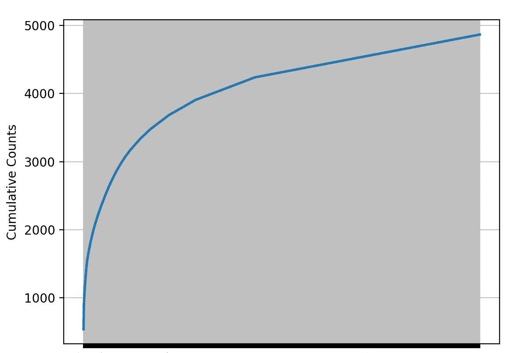

# 第一章：语料库与 WordNet

在本章中，我们将涵盖以下示例：

+   访问内置语料库

+   下载外部语料库，加载并访问它

+   计算布朗语料库中三个不同类型的`wh`词的数量

+   探索对某个网页和聊天文本语料库文件进行频率分布操作

+   选取一个模糊的词，并使用 WordNet 探索其所有含义

+   选择两个不同的同义词集并使用 WordNet 探索下义词和上义词的概念

+   根据 WordNet 计算名词、动词、形容词和副词的平均多义性

# 介绍

为了解决任何实际的**自然语言处理**（**NLP**）问题，您需要处理大量数据。这些数据通常以语料库的形式存在于开放的分布中，并作为 NLTK 包的附加组件提供。例如，如果您想创建一个拼写检查器，您需要一个庞大的单词语料库进行匹配。

本章的目标是涵盖以下内容：

+   介绍 NLTK 提供的各种有用文本语料库

+   如何从 Python 访问这些内置语料库

+   使用频率分布

+   WordNet 及其词汇特性简介

我们将从实践的角度来理解这些问题。我们将通过一些练习，借助我们的示例来实现这些目标。

# 访问内置语料库

如前所述，我们有许多可用于 NLTK 的语料库。我们假设您已经在计算机上下载并安装了 NLTK 数据。如果没有，您可以在[`www.nltk.org/data.html`](http://www.nltk.org/data.html)找到相应的内容。另外，您可以在[`www.nltk.org/nltk_data/`](http://www.nltk.org/nltk_data/)查看 NLTK 数据中可用的语料库完整列表。

现在，我们的第一个任务/示例是学习如何访问这些语料库中的任何一个。我们决定对 Reuters 语料库进行一些测试，或者说，使用它。我们将把语料库导入到程序中，并尝试以不同的方式访问它。

# 如何实现...

1.  创建一个名为`reuters.py`的新文件，并在文件中添加以下导入语句。这将专门允许我们的程序从整个 NLTK 数据中访问仅`reuters`语料库：

```py
from nltk.corpus import reuters
```

1.  现在我们想检查这个语料库中究竟有哪些内容。最简单的方法是调用语料库对象的`fileids()`函数。在您的程序中添加以下代码：

```py
files = reuters.fileids()
print(files)
```

1.  现在运行程序，您将得到类似这样的输出：

```py
['test/14826', 'test/14828', 'test/14829', 'test/14832', 'test/14833', 'test/14839',
```

这些是`reuters`语料库中各文件及其相对路径的列表。

1.  现在我们将访问这些文件的实际内容。为此，我们将使用`words()`函数对语料库对象进行操作，如下所示，我们将访问`test/16097`文件：

```py
words16097 = reuters.words(['test/16097'])
print(words16097)
```

1.  再次运行程序，将会出现一行新的输出：

```py
['UGANDA', 'PULLS', 'OUT', 'OF', 'COFFEE', 'MARKET', ...]
```

如您所见，`test/16097`文件中的单词列表已显示。尽管列表被截断，但所有单词都已加载到内存对象中。

1.  现在我们想要从同一个文件中获取特定数量的单词（`20`），文件名为`test/16097`。没错！我们可以指定想要获取的单词数，并将其存储在一个列表中以供使用。请在代码中添加以下两行：

```py
words20 = reuters.words(['test/16097'])[:20]
print(words20)
```

运行此代码后，输出中将附加一行额外的内容，如下所示：

```py
['UGANDA', 'PULLS', 'OUT', 'OF', 'COFFEE', 'MARKET', '-', 'TRADE', 'SOURCES', 'Uganda', "'", 's', 'Coffee', 'Marketing', 'Board', '(', 'CMB', ')', 'has', 'stopped']
```

1.  接下来，`reuters`语料库不仅仅是一个文件列表，它还被层级地分类为 90 个主题。每个主题都有许多相关文件。这意味着，当你访问某个主题时，实际上是访问与该主题相关的所有文件。我们首先通过添加以下代码来输出主题列表：

```py
reutersGenres = reuters.categories()
print(reutersGenres)
```

运行代码后，控制台中将添加以下输出内容：

```py
['acq', 'alum', 'barley', 'bop', 'carcass', 'castor-oil', 'cocoa', 'coconut', 'coconut-oil', ...
```

显示所有 90 个类别。

1.  最后，我们将编写四行简单的代码，这不仅能访问两个主题，还会将单词以松散的句子形式一行一行地打印出来。请在 Python 文件中添加以下代码：

```py
for w in reuters.words(categories=['bop','cocoa']):
  print(w+' ',end='')
  if(w is '.'):
    print()
```

1.  简单来说，我们首先选择了`'bop'`和`'cocoa'`这两个类别，并打印了这两个类别文件中的每个单词。每次遇到句号（`.`）时，我们都会插入一个换行符。运行代码后，控制台中会输出如下内容：

```py
['test/14826', 'test/14828', 'test/14829', 'test/14832', 'test/14833', 'test/14839', ...
['UGANDA', 'PULLS', 'OUT', 'OF', 'COFFEE', 'MARKET', ...]
['UGANDA', 'PULLS', 'OUT', 'OF', 'COFFEE', 'MARKET', '-', 'TRADE', 'SOURCES', 'Uganda', "'", 's', 'Coffee', 'Marketing', 'Board', '(', 'CMB', ')', 'has', 'stopped']
['acq', 'alum', 'barley', 'bop', 'carcass', 'castor-oil', 'cocoa', 'coconut', 'coconut-oil', ...
SOUTH KOREA MOVES TO SLOW GROWTH OF TRADE SURPLUS South Korea ' s trade surplus is growing too fast and the government has started taking steps to slow it down , Deputy Prime Minister Kim Mahn-je said .
He said at a press conference that the government planned to increase investment , speed up the opening of the local market to foreign imports, and gradually adjust its currency to hold the surplus " at a proper level ." But he said the government would not allow the won to appreciate too much in a short period of time .
South Korea has been under pressure from Washington to revalue the won .
The U .
S .
Wants South Korea to cut its trade surplus with the U .
S ., Which rose to 7 .
4 billion dlrs in 1986 from 4 .
3 billion dlrs in 1985 .
.
.
.
```

# 下载外部语料库、加载并访问它

现在我们已经学习了如何加载和访问内置语料库，接下来我们将学习如何下载外部语料库以及如何加载和访问它们。许多内置语料库非常适合用于训练，但如果要解决实际的现实问题，通常需要使用外部数据集。本教程中我们将使用**康奈尔电影**评论语料库，它已经标注了正面和负面评论，广泛用于训练情感分析模型。

# 准备工作

首先，你需要从互联网上下载数据集。链接如下：[`www.cs.cornell.edu/people/pabo/movie-review-data/mix20_rand700_tokens_cleaned.zip`](http://www.cs.cornell.edu/people/pabo/movie-review-data/mix20_rand700_tokens_cleaned.zip)。下载数据集，解压，并将解压后的`Reviews`目录保存在计算机的安全位置。

# 如何做...

1.  创建一个名为`external_corpus.py`的新文件，并在其中添加以下导入行：

```py
from nltk.corpus import CategorizedPlaintextCorpusReader
```

由于我们下载的语料库已经按类别进行了分类，我们将使用`CategorizedPlaintextCorpusReader`来读取和加载给定的语料库。这样，我们就可以确保语料库的类别被捕获，在本例中是正面和负面。

1.  现在我们将读取语料库。我们需要知道从康奈尔下载的已解压`Reviews`文件夹的绝对路径。请添加以下四行代码：

```py
reader = CategorizedPlaintextCorpusReader(r'/Volumes/Data/NLP-CookBook/Reviews/txt_sentoken', r'.*\.txt', cat_pattern=r'(\w+)/*')
print(reader.categories())
print(reader.fileids())
```

第一行是通过调用`CategorizedPlaintextCorpusReader`构造函数来读取语料库。三个参数从左到右分别是计算机中`txt_sentoken`文件夹的绝对路径、`txt_sentoken`文件夹中的所有样本文档名以及给定语料库中的类别（在我们的例子中是`'pos'`和`'neg'`）。如果你仔细观察，你会发现这三个参数都是正则表达式模式。接下来的两行将验证语料库是否正确加载，打印语料库的相关类别和文件名。运行程序后，你应该看到类似以下内容：

```py
['austen-emma.txt', 'austen-persuasion.txt', 'austen-sense.txt', 'bible-kjv.txt',....]
[['The', 'Fulton', 'County', 'Grand', 'Jury', 'said', 'Friday', 'an', 'investigation', 'of',...]]
```

1.  现在我们已经确认语料库加载正确，接下来让我们从两个类别中访问任意一个样本文档。为此，首先创建一个包含`'pos'`和`'neg'`类别样本的列表。添加以下两行代码：

```py
posFiles = reader.fileids(categories='pos')
negFiles = reader.fileids(categories='neg')
```

`reader.fileids()`方法接受类别名称作为参数。如你所见，前两行代码的目的非常直接且直观。

1.  现在让我们从`posFiles`和`negFiles`的文件列表中随机选择一个文件。为此，我们将需要 Python 的`random`库中的`randint()`函数。添加以下代码行，我们将在接下来详细说明我们所做的工作：

```py
from random import randint
fileP = posFiles[randint(0,len(posFiles)-1)]
fileN = negFiles[randint(0, len(posFiles) - 1)]
print(fileP)
print(fileN)
```

第一行从`random`库中导入了`randint()`函数。接下来的两行代码从正面和负面类别评论集中随机选择一个文件。最后两行代码仅仅是打印文件名。

1.  现在我们已经选择了这两个文件，让我们逐句访问它们，并在控制台中打印出来。我们将使用在第一个食谱中使用的方法，按行输出。追加以下代码行：

```py
for w in reader.words(fileP):
  print(w + ' ', end='')
  if (w is '.'):
    print()
for w in reader.words(fileN):
  print(w + ' ', end='')
  if (w is '.'):
    print()
```

这些`for`循环逐个读取每个文件，并按行在控制台打印。完整食谱的输出应类似于以下内容：

```py
['neg', 'pos']
['neg/cv000_29416.txt', 'neg/cv001_19502.txt', 'neg/cv002_17424.txt', ...]
pos/cv182_7281.txt
neg/cv712_24217.txt
the saint was actually a little better than i expected it to be , in some ways .
in this theatrical remake of the television series the saint...
```

# 它是如何工作的……

这个食谱的核心成分是 NLTK 的`CategorizedPlaintextCorpusReader`类。因为我们已经知道下载的语料库是分类的，所以在创建`reader`对象时只需要提供适当的参数。`CategorizedPlaintextCorpusReader`类的实现会在内部处理样本的加载，并将其放入适当的桶中（在本例中为`'pos'`和`'neg'`）。

# 统计布朗语料库中三个不同类型的 wh 词

Brown 语料库是 NLTK 数据包的一部分。它是布朗大学组建的最古老的文本语料库之一。它包含了 500 篇文本，广泛地分为 15 个不同的类别/体裁，如新闻、幽默、宗教等。这个语料库是展示分类纯文本语料库的一个很好的用例，它已经为每篇文本分配了主题/概念（有时会有重叠）；因此，您在其上进行的任何分析都可以遵循所附的主题。

# 准备开始

这个小节的目标是让你在任何给定的语料库上执行一个简单的计数任务。我们将在这里使用 `nltk` 库的 `FreqDist` 对象来实现这一点，但对于 `FreqDist` 的强大功能，我们将在下一篇小节中做更详细的讲解。在这里，我们将专注于应用问题。

# 如何进行...

1.  创建一个名为 `BrownWH.py` 的新文件，并添加以下 `import` 语句来开始：

```py
import nltk
from nltk.corpus import brown
```

我们已经导入了 `nltk` 库和 Brown 语料库。

1.  接下来，我们将检查语料库中的所有体裁，并从中选择任意三个类别来继续我们的任务：

```py
print(brown.categories())
```

`brown.categories()` 函数调用将返回 Brown 语料库中所有体裁的列表。当你运行这一行时，你将看到如下输出：

```py
['adventure', 'belles_lettres', 'editorial', 'fiction', 'government', 'hobbies', 'humor', 'learned', 'lore', 'mystery', 'news', 'religion', 'reviews', 'romance', 'science_fiction']
```

1.  现在让我们从这个列表中挑选三个 `genres`——`fiction`（小说）、`humor`（幽默）和 `romance`（浪漫）——以及我们希望从这三个 `genres` 的文本中统计的 `whwords`：

```py
genres = ['fiction', 'humor', 'romance']
whwords = ['what', 'which', 'how', 'why', 'when', 'where', 'who']
```

我们创建了一个包含三个选择的 `genres` 列表，以及另一个包含七个 `whwords` 的列表。

你的列表可以更长或更短，取决于你认为哪些是 `whwords`。

1.  由于我们已经将 `genres` 和我们想要计数的单词放入列表中，因此我们将广泛使用 `for` 循环来遍历它们，并优化代码行数。所以首先，我们在 `genres` 列表上写一个 `for` 循环：

```py
for i in range(0,len(genres)):genre = genres[i]
print()
print("Analysing '"+ genre + "' wh words")
genre_text = brown.words(categories = genre)
```

这四行代码只会开始遍历 `genres` 列表，并将每个体裁的整个文本加载到 `genre_text` 变量中，作为一个连续的单词列表。

1.  接下来是一个复杂的小语句，我们将使用 `nltk` 库的 `FreqDist` 对象。现在，我们先了解语法和它的粗略输出：

```py
fdist = nltk.FreqDist(genre_text)
```

`FreqDist()` 接受一个单词列表，并返回一个包含单词及其在输入单词列表中相应频率的对象。在这里，`fdist` 对象将包含 `genre_text` 单词列表中每个唯一单词的频率。

1.  我相信你已经猜到我们接下来的步骤是什么了。我们将简单地访问由 `FreqDist()` 返回的 `fdist` 对象，并获取每个 `wh` 单词的计数。我们开始吧：

```py
for wh in whwords:
print(wh + ':', fdist[wh], end=' ')
```

我们正在遍历 `whwords` 单词列表，使用每个 `wh` 单词作为索引访问 `fdist` 对象，获取它们的频率/计数并将其打印出来。

运行完整的程序后，你将得到以下输出：

```py
['adventure', 'belles_lettres', 'editorial', 'fiction', 'government', 'hobbies', 'humor', 'learned', 'lore', 'mystery', 'news', 'religion', 'reviews', 'romance', 'science_fiction']

Analysing 'fiction' wh words

what: 128 which: 123 how: 54 why: 18 when: 133 where: 76 who: 103

Analysing 'humor' wh words

what: 36 which: 62 how: 18 why: 9 when: 52 where: 15 who: 48

Analysing 'romance' wh words

what: 121 which: 104 how: 60 why: 34 when: 126 where: 54 who: 89
```

# 它是如何工作的...

通过分析输出，你可以清楚地看到我们在控制台中得到了三个选定`genres`中所有七个`wh`词的词频。通过统计`wh`词的数量，你可以在一定程度上判断给定文本中相对从句或疑问句的使用频率。同样，你也可以列出一个重要单词的本体列表，统计这些单词的词频，以便了解给定文本与本体的相关性。统计单词的数量并分析词频分布是文本分析中最古老、最简单、最常用的技巧之一。

# 在一个网页和聊天文本语料库文件上探索频率分布操作

网页和聊天文本语料库是非正式文学，顾名思义，包含来自 Firefox 讨论论坛、电影剧本、葡萄酒评论、个人广告和偷听到的对话的内容。在本食谱中，我们的目标是理解频率分布的使用及其特性/功能。

# 准备工作

根据本食谱的目标，我们将在`nltk.corpus.webtext`中的个人广告文件上运行频率分布。接着，我们将探索`nltk.FreqDist`对象的各种功能，比如不同单词的计数、10 个最常见的单词、最大频率单词、频率分布图和表格等。

# 如何操作…

1.  创建一个名为`webtext.py`的新文件，并向其中添加以下三行代码：

```py
import nltk
from nltk.corpus import webtext
print(webtext.fileids())
```

我们刚刚导入了所需的库和`webtext`语料库；同时，我们还打印出了组成文件的名称。运行程序，你将看到以下输出：

```py
['firefox.txt', 'grail.txt', 'overheard.txt', 'pirates.txt', 'singles.txt', 'wine.txt']
```

1.  现在，我们将选择包含个人广告数据的文件，并对其进行频率分布处理。为此，添加以下三行代码：

```py
fileid = 'singles.txt'
wbt_words = webtext.words(fileid)
fdist = nltk.FreqDist(wbt_words)
```

`singles.txt`包含我们的目标数据，因此我们从该文件加载了单词到`wbt_words`中，并对其进行了频率分布操作，得到了`FreqDist`对象`fdist`。

1.  添加以下代码，这将显示最常出现的单词（使用`fdist.max()`函数）以及该单词的计数（使用`fdist[fdist.max()]`操作）：

```py
print('Count of the maximum appearing token "',fdist.max(),'" : ', fdist[fdist.max()])
```

1.  以下这行将通过`fdist.N()`函数显示我们频率分布包中不同单词的计数。在你的代码中添加这一行：

```py
print('Total Number of distinct tokens in the bag : ', fdist.N())
```

1.  现在，让我们找出所选语料库包中最常见的 10 个单词。`fdist.most_common()`函数将为我们完成这个任务。在代码中添加以下两行：

```py
print('Following are the most common 10 words in the bag')
 print(fdist.most_common(10))
```

1.  让我们使用`fdist.tabulate()`函数列出整个频率分布。在代码中添加这些行：

```py
print('Frequency Distribution on Personal Advertisements')
 print(fdist.tabulate())
```

1.  现在，我们将使用`fdist.plot()`函数绘制带有`cumulative`频率的频率分布图：

```py
fdist.plot(cumulative=True)
```

让我们运行程序并查看输出；我们将在下一节中讨论该输出：

```py
['firefox.txt', 'grail.txt', 'overheard.txt', 'pirates.txt', 'singles.txt', 'wine.txt']

Count of the maximum appearing token " , " : 539

Total Number of distinct tokens in the bag : 4867

Following are the most common 10 words in the bag

[(',', 539), ('.', 353), ('/', 110), ('for', 99), ('and', 74), ('to', 

4), ('lady', 68), ('-', 66), ('seeks', 60), ('a', 52)]

Frequency Distribution on Personal Advertisements

, . / for and to lady .........

539 353 110 99 74 74 .........

None
```

你还将看到以下图表弹出：

>

# 它是如何工作的…

在分析输出后，我们意识到所有内容都非常直观。但奇怪的是，其中大多数并没有什么意义。出现频率最高的标记是`,`。当你查看`10`个最常见的标记时，仍然无法从目标数据集中获取太多信息。原因是语料库没有经过预处理。在第三章中，我们将学习一种最基础的预处理步骤，称为停用词处理，并且我们还将看到它带来的差异。

# 使用 WordNet 探索一个模糊词汇的所有含义

从这个配方开始，我们将把注意力转向 WordNet。正如标题中所说，我们将探索什么是词义。概述一下，英语是一种非常模糊的语言。几乎每个词在不同的上下文中都有不同的意思。例如，让我们以最简单的词之一*bat*为例，这是几乎在地球上任何语言课程中都会教授的前 10 个英语单词之一。第一个含义是用来击球的球棒，广泛应用于板球、棒球、网球、壁球等多种运动。

现在，*bat* 还可以指代一种夜间活动的哺乳动物，它在夜间飞行。*Bat* 也是根据 DC 漫画，蝙蝠侠首选并最先进的交通工具。这些都是名词的变体；让我们来考虑动词的可能性。*Bat* 还可以指稍微眨一下眼睛（bat an eyelid）。因此，它还可以意味着在打斗或竞赛中把某人打得粉碎。我们认为这已经足够做为介绍；接下来我们将进入实际的配方。

# 准备中

牢记配方的目标，我们需要选择一个单词，来探索 WordNet 理解下的各种含义。是的，NLTK 已经内置了 WordNet，你不必担心安装任何额外的库。所以，让我们选择另一个简单的词，*CHAIR*，作为本配方的示例。

# 如何实现...

1.  创建一个名为`ambiguity.py`的新文件，并添加以下代码行作为起点：

```py
from nltk.corpus import wordnet as wn
chair = 'chair'
```

在这里，我们导入了所需的 NLTK 语料库读取器`wordnet`作为`wn`对象。我们可以像使用其他任何语料库读取器一样导入它。为了准备接下来的步骤，我们创建了一个包含单词`chair`的字符串变量。

1.  现在是最重要的步骤。让我们添加两行代码，我会详细说明我们正在做的事情：

```py
chair_synsets = wn.synsets(chair)
print('Synsets/Senses of Chair :', chair_synsets, '\n\n')
```

第一行，尽管看起来很简单，实际上是访问内部 WordNet 数据库并提取与单词`chair`相关的所有含义的 API 接口。WordNet 将每个这样的含义称为`synsets`。接下来的一行只是要求解释器打印它提取的内容。运行这一部分，你应该得到类似的输出：

```py
Synsets/Senses of Chair : [Synset('chair.n.01'), Synset('professorship.n.01'), Synset('president.n.04'), Synset('electric_chair.n.01'), Synset('chair.n.05'), Synset('chair.v.01'), Synset('moderate.v.01')]
```

如你所见，列表中包含七个`Synsets`，这意味着在 WordNet 数据库中存在七种不同的`Chair`的含义。

1.  我们将添加以下`for`循环，它将遍历我们获取的`synsets`列表并执行某些操作：

```py
for synset in chair_synsets:
  print(synset, ': ')
  print('Definition: ', synset.definition())
  print('Lemmas/Synonymous words: ', synset.lemma_names())
  print('Example: ', synset.examples(), '\n')
```

我们正在遍历`synsets`列表并打印每个意义的定义，相关的 Lemmas/同义词以及每个意义在句子中的示例用法。一个典型的迭代将打印类似于这样的内容：

```py
Synset('chair.v.01') :

Definition: act or preside as chair, as of an academic department in a university

Lemmas/Synonymous words: ['chair', 'chairman']

Example: ['She chaired the department for many years']
```

第一行是`Synset`的名称，第二行是这个意义/`Synset`的定义，第三行包含与这个`Synset`相关的`Lemmas`，第四行是一个示例句子。

我们将获得以下输出：

```py
Synsets/Senses of Chair : [Synset('chair.n.01'), Synset('professorship.n.01'), Synset('president.n.04'), Synset('electric_chair.n.01'), Synset('chair.n.05'), Synset('chair.v.01'), Synset('moderate.v.01')]

Synset('chair.n.01') :

Definition: a seat for one person, with a support for the back

Lemmas/Synonymous words: ['chair']

Example: ['he put his coat over the back of the chair and sat down']

Synset('professorship.n.01') :

Definition: the position of professor

Lemmas/Synonymous words: ['professorship', 'chair']

Example: ['he was awarded an endowed chair in economics']

Synset('president.n.04') :

Definition: the officer who presides at the meetings of an organization

Lemmas/Synonymous words: ['president', 'chairman', 'chairwoman', 

chair', 'chairperson']

Example: ['address your remarks to the chairperson']

Synset('electric_chair.n.01') :

Definition: an instrument of execution by electrocution; resembles an ordinary seat for one person

Lemmas/Synonymous words: ['electric_chair', 'chair', 'death_chair', 'hot_seat']

Example: ['the murderer was sentenced to die in the chair']

Synset('chair.n.05') :

Definition: a particular seat in an orchestra

Lemmas/Synonymous words: ['chair']

Example: ['he is second chair violin']

Synset('chair.v.01') :

Definition: act or preside as chair, as of an academic department in a university

Lemmas/Synonymous words: ['chair', 'chairman']

Example: ['She chaired the department for many years']

Synset('moderate.v.01') :

Definition: preside over

Lemmas/Synonymous words: ['moderate', 'chair', 'lead']

Example: ['John moderated the discussion']
```

# 工作原理...

正如您所看到的，单词`chair`的七个意义的定义、Lemmas 和示例句子都在输出中看到。每个操作都有直接的 API 接口，如前面代码示例中所详细阐述的。现在，让我们稍微谈一下 WordNet 是如何得出这样的结论的。WordNet 是一个按层次结构存储所有关于单词的信息的数据库。如果我们看一下当前示例，写一下关于`synsets`和 WordNet 存储的层次性质。以下图表将更详细地解释这一点。

# 选择两个不同的 synsets 并使用 WordNet 探索下义词和上义词的概念

下义词是一个比更通用的词（如*bat*）更具体含义的词，我们在前一篇食谱的介绍部分探讨过。我们所说的*更具体*是指，例如，板球拍、棒球棒、食肉蝙蝠、壁球拍等。这些在传达我们确切意图方面更具体。

与下义词相反，上义词是同一概念的更一般形式或词语。以*bat*为例，它是一个更通用的词，可以表示棍棒、球棒、器物、哺乳动物、动物或有机体。我们可以将其泛化为物理实体、生物体或物体，仍然被视为*bat*的上义词。

# 准备工作

为了探索下义词和上义词的概念，我们决定选择`bed.n.01`（bed 的第一个词义）和`woman.n.01`（woman 的第二个词义）这两个同义词集。现在我们将在实际的步骤部分解释上义词和下义词 API 的用法和含义。

# 如何做...

1.  创建一个名为`HypoNHypernyms.py`的新文件，并添加以下三行：

```py
from nltk.corpus import wordnet as wn
woman = wn.synset(woman.n.02')
bed = wn.synset('bed.n.01')
```

我们已经导入了库并初始化了稍后将在处理中使用的两个 synsets。

1.  添加以下两行：

```py
print(woman.hypernyms())
woman_paths = woman.hypernym_paths()
```

这是对 woman `Synset`上的`hypernyms()` API 函数的简单调用；它将返回直接父级的同义词集。然而，`hypernym_paths()`函数有点棘手。它将返回一组集合。每个集合包含从根节点到 woman `Synset`的路径。当您运行这两个语句时，您将在控制台中看到`Synset` woman 的两个直接父级如下：

```py
[Synset('adult.n.01'), Synset('female.n.02')]
```

在 WordNet 数据库的层级结构中，"woman"属于成人和女性类别。

1.  现在我们将尝试打印从根节点到`woman.n.01`节点的路径。为此，添加以下几行代码并嵌套`for`循环：

```py
for idx, path in enumerate(woman_paths):
  print('\n\nHypernym Path :', idx + 1)
for synset in path:
  print(synset.name(), ', ', end='')
```

如前所述，返回的对象是一个按特定顺序排列的集合列表，这个顺序精确地跟随从根节点到`woman.n.01`节点的路径，正如它在 WordNet 层级中存储的那样。当你运行时，下面是一个示例`Path`：

```py
Hypernym Path : 1

entity.n.01 , physical_entity.n.01 , causal_agent.n.01 , person.n.01 , adult.n.01 , woman.n.01
```

1.  现在让我们来处理`hyponyms`。添加以下两行代码，它们将获取`bed.n.01`的`hyponyms`并打印到控制台：

```py
types_of_beds = bed.hyponyms()
print('\n\nTypes of beds(Hyponyms): ', types_of_beds)
```

如前所述，运行它们，你将看到以下 20 个 synset 作为输出：

```py
Types of beds(Hyponyms): [Synset('berth.n.03'), Synset('built-in_bed.n.01'), Synset('bunk.n.03'), Synset('bunk_bed.n.01'), Synset('cot.n.03'), Synset('couch.n.03'), Synset('deathbed.n.02'), Synset('double_bed.n.01'), Synset('four-poster.n.01'), Synset('hammock.n.02'), Synset('marriage_bed.n.01'), Synset('murphy_bed.n.01'), Synset('plank-bed.n.01'), Synset('platform_bed.n.01'), Synset('sickbed.n.01'), Synset('single_bed.n.01'), Synset('sleigh_bed.n.01'), Synset('trundle_bed.n.01'), Synset('twin_bed.n.01'), Synset('water_bed.n.01')]
```

这些是 WordNet 中`sense`为`bed.n.01`的`Hyponyms`，即更具体的术语。

1.  现在让我们打印实际的词汇或`lemmas`，这些词汇对于人类来说更有意义。添加以下一行代码：

```py
print(sorted(set(lemma.name() for synset in types_of_beds for lemma in synset.lemmas())))
```

这行代码和我们之前在超类示例中的嵌套`for`循环非常相似，四行代码合并成一行（换句话说，我们在这里展示了 Python 的技巧）。它将打印出 26 个非常有意义且具体的`lemmas`。现在，让我们看看最终输出：

```py
Output: [Synset('adult.n.01'), Synset('female.n.02')]
Hypernym Path : 1
entity.n.01 , physical_entity.n.01 , causal_agent.n.01 , person.n.01 , adult.n.01 , woman.n.01 ,
Hypernym Path : 2
entity.n.01 , physical_entity.n.01 , object.n.01 , whole.n.02 , living_thing.n.01 , organism.n.01 , person.n.01 , adult.n.01 , woman.n.01 ,
Hypernym Path : 3
entity.n.01 , physical_entity.n.01 , causal_agent.n.01 , person.n.01 , female.n.02 , woman.n.01 ,
Hypernym Path : 4
entity.n.01 , physical_entity.n.01 , object.n.01 , whole.n.02 , living_thing.n.01 , organism.n.01 , person.n.01 , female.n.02 , woman.n.01 ,

Types of beds(Hyponyms): [Synset('berth.n.03'), Synset('built-in_bed.n.01'), Synset('bunk.n.03'), Synset('bunk_bed.n.01'), Synset('cot.n.03'), Synset('couch.n.03'), Synset('deathbed.n.02'), Synset('double_bed.n.01'), Synset('four-poster.n.01'), Synset('hammock.n.02'), Synset('marriage_bed.n.01'), Synset('murphy_bed.n.01'), Synset('plank-bed.n.01'), Synset('platform_bed.n.01'), Synset('sickbed.n.01'), Synset('single_bed.n.01'), Synset('sleigh_bed.n.01'), Synset('trundle_bed.n.01'), Synset('twin_bed.n.01'), Synset('water_bed.n.01')]

['Murphy_bed', 'berth', 'built-in_bed', 'built_in_bed', 'bunk', 'bunk_bed', 'camp_bed', 'cot', 'couch', 'deathbed', 'double_bed', 'four-poster', 'hammock', 'marriage_bed', 'plank-bed', 'platform_bed', 'sack', 'sickbed', 'single_bed', 'sleigh_bed', 'truckle', 'truckle_bed', 'trundle', 'trundle_bed', 'twin_bed', 'water_bed']
```

# 工作原理...

如你所见，`woman.n.01`有两个上位词，分别是成人和女性，但它在 WordNet 数据库的层级结构中从根节点`entity`到`woman`有四条不同的路径，正如输出中所示。

类似地，Synset `bed.n.01`有 20 个下位词；它们更为具体且不那么模糊（毕竟英语中没有绝对不模糊的词）。通常，这些下位词对应的是叶节点或靠近叶节点的节点，因为它们是最不模糊的词。

# 根据 WordNet 计算名词、动词、形容词和副词的平均多义性。

首先，让我们理解什么是多义性。多义性意味着一个词或短语有多种可能的含义。正如我们已经看到的，英语是一种模糊的语言，对于层级中的大多数词汇，通常会有不止一个含义。现在，回到问题陈述，我们必须根据 WordNet 中所有词汇的特定语言学属性来计算平均多义性。正如我们将看到的，这个配方不同于之前的配方。它不仅仅是一个 API 概念的发现，而是我们将发现一个语言学概念（我激动得终于有机会在这一章中做这件事）。

# 准备中

我决定编写程序计算任何词性类型词汇的多义性，并将其余三个类型的计算留给大家修改。我是说，我们不应该什么都喂给你们对吧？别担心！我会在实际代码中提供足够的提示，让你们更容易理解（对于那些觉得已经不太直观的人）。那么，让我们开始实际的代码吧；我们将单独计算名词的平均多义性。

# 如何操作...

1.  创建一个新的文件，命名为`polysemy.py`，并添加以下两行初始化代码：

```py
from nltk.corpus import wordnet as wn
type = 'n'
```

我们已经初始化了我们感兴趣的词性类型，当然，也导入了所需的库。为了更具描述性，`n`代表名词。

1.  这是这段配方中最重要的代码行：

```py
synsets = wn.all_synsets(type)
```

这个 API 返回 WordNet 数据库中所有类型为`n`（名词）的`synsets`，实现全覆盖。同样，如果你将词性类型更改为动词、副词或形容词，API 将返回相应类型的所有单词（提示#1）。

1.  现在，我们将把每个`synset`中的所有`lemmas`合并成一个单一的超大列表，供我们进一步处理。添加以下代码来实现这一点：

```py
lemmas = []
for synset in synsets:
  for lemma in synset.lemmas():
    lemmas.append(lemma.name())
```

这段代码非常直观；我们有一个嵌套的`for`循环，它遍历`synsets`列表和每个`synset`中的`lemmas`，并将它们加到我们的超大列表`lemmas`中。

1.  虽然我们在超大列表中拥有所有`lemmas`，但是有一个问题。由于它是一个列表，其中存在一些重复项。让我们移除这些重复项并统计不同的`lemmas`数量：

```py
lemmas = set(lemmas)
```

将列表转换为集合会自动去重（是的，这是一个有效的英语单词，我发明的）列表。

1.  现在，配方中的第二个最重要的步骤。我们在 WordNet 数据库中统计每个`lemma`的词义：

```py
count = 0
for lemma in lemmas:
  count = count + len(wn.synsets(lemma, type))
```

大部分代码是直观的；我们来专注于 API `wn.synsets(lemma, type)`。这个 API 接受一个单词/词元（作为第一个参数）和它所属的词性类型，并返回所有属于该`lemma`单词的词义（`synsets`）。注意，根据你提供的词性类型，它只会返回该类型的词义（提示#2）。

1.  我们已经得到了计算平均多义性所需的所有计数。现在我们直接计算并打印到控制台：

```py
print('Total distinct lemmas: ', len(lemmas))
print('Total senses :',count)
print('Average Polysemy of ', type,': ' , count/len(lemmas))
```

这将打印出名词类型`n`的所有不同词元的总数、词义的计数以及平均多义性：

```py
Output: Total distinct lemmas: 119034
Total senses : 152763
Average Polysemy of n : 1.2833560159282222
```

# 它是如何工作的...

这一部分没什么太多要说的，所以我会给你一些关于如何计算其他类型多义性的更多信息。正如你所看到的，*名词 -> 'n'*。同样，*动词 -> 'v'*，*副词 -> 'r'*，*形容词 -> 'a'*（提示#3）。

现在，我希望我已经给了你足够的提示，帮助你自己动手编写一个 NLP 程序，而不依赖于配方的推送。
