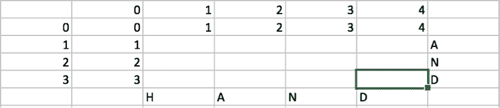

# 第三章：预处理

在本章中，我们将涵盖以下几个步骤：

+   分词 – 学习使用 NLTK 的内置分词器

+   词干提取 – 学习使用 NLTK 的内置词干提取器

+   词形还原 – 学习使用 NLTK 的 WordnetLemmatizer

+   停用词 – 学习使用停用词语料库并查看它能带来的差异

+   编辑距离 – 编写你自己的算法来计算两个字符串之间的编辑距离

+   处理两个短篇故事并提取它们之间的共同词汇

# 介绍

在上一章中，我们学习了如何读取、规范化并将来自不同形式和格式的原始数据整理成统一格式。在本章中，我们将迈出更大的一步，为我们的 NLP 应用准备数据。预处理是任何数据处理任务中最重要的步骤，否则我们就会陷入计算机科学中的老生常谈——*垃圾进，垃圾出*。本章的目标是介绍一些关键的预处理步骤，如分词、词干提取、词形还原等。

在本章中，我们将看到六个不同的步骤。我们将通过执行每个预处理任务来逐步构建本章内容——分词、词干提取、词形还原、停用词处理和编辑距离，按此顺序进行。在最后一个步骤中，我们将展示如何结合一些预处理技术来找出两个自由文本之间的共同词汇。

# 分词 – 学习使用 NLTK 的内置分词器

理解分词的含义，为什么我们需要它，以及如何进行分词。

# 准备工作

首先，让我们看看什么是 token。当你收到一份文档或一串你想要处理或操作的长字符串时，首先要做的就是将其分解成单词和标点符号。这就是我们所说的分词过程。我们将会看到 NLTK 提供了哪些类型的分词器，并且实现它们。

# 如何做……

1.  创建一个名为`tokenizer.py`的文件，并添加以下导入行：

```py
from nltk.tokenize import LineTokenizer, SpaceTokenizer, TweetTokenizer
from nltk import word_tokenize
```

导入我们将在本章中探索的四种不同类型的分词器。

1.  我们将从`LineTokernizer`开始。添加以下两行：

```py
lTokenizer = LineTokenizer();
print("Line tokenizer output :",lTokenizer.tokenize("My name is Maximus Decimus Meridius, commander of the Armies of the North, General of the Felix Legions and loyal servant to the true emperor, Marcus Aurelius. \nFather to a murdered son, husband to a murdered wife. \nAnd I will have my vengeance, in this life or the next."))
```

1.  顾名思义，这个分词器应该将输入字符串分割成行（注意：不是句子！）。让我们看看输出结果以及分词器的作用：

```py
Line tokenizer output : ['My name is Maximus Decimus Meridius, commander of the Armies of the North, General of the Felix Legions and loyal servant to the true emperor, Marcus Aurelius. ', 'Father to a murdered son, husband to a murdered wife. ', 'And I will have my vengeance, in this life or the next.']
```

如你所见，它返回了一个包含三个字符串的列表，意味着给定的输入已经根据换行符分成了三行。`LineTokenizer`仅仅是将给定的输入字符串按换行符分割成新行。

1.  现在我们来看看`SpaceTokenizer`。顾名思义，它应该按照空格字符进行分割。添加以下代码行：

```py
rawText = "By 11 o'clock on Sunday, the doctor shall open the dispensary."
sTokenizer = SpaceTokenizer()
print("Space Tokenizer output :",sTokenizer.tokenize(rawText))
```

1.  `sTokenizer`对象是`SpaceTokenize`的一个实例。我们已经调用了`tokenize()`方法，现在来看看输出结果：

```py
Space Tokenizer output : ['By', '11', "o'clock", 'on', 'Sunday,', 'the', 'doctor', 'shall', 'open', 'the', 'dispensary.']
```

1.  正如预期的那样，输入的`rawText`是以空格字符 `""` 为分隔符进行拆分的。接下来是`word_tokenize()`方法。添加以下代码行：

```py
print("Word Tokenizer output :", word_tokenize(rawText))
```

1.  看看这里的区别。前面我们看到的另外两个是类，而这是`nltk`模块的方法。这是我们接下来会用到的方法，因为它恰好完成了我们定义的分词任务。它将单词和标点符号分开。让我们看看输出：

```py
Word Tokenizer output : ['By', '11', "o'clock", 'on', 'Sunday', ',', 'the', 'doctor', 'shall', 'open', 'the', 'dispensary', '.']
```

1.  如你所见，`SpaceTokenizer`和`word_tokenize()`之间的区别非常明显。

1.  现在，进入最后一项。有一个特殊的`TweetTokernizer`，我们可以在处理特殊字符串时使用：

```py
tTokenizer = TweetTokenizer()
print("Tweet Tokenizer output :",tTokenizer.tokenize("This is a cooool #dummysmiley: :-) :-P <3"))
```

1.  推文包含特殊词语、特殊字符、标签和表情符号，我们希望它们保持原样。让我们看一下这两行代码的输出：

```py
Tweet Tokenizer output : ['This', 'is', 'a', 'cooool', '#dummysmiley', ':', ':-)', ':-P', '<3']
```

如我们所见，`Tokenizer`保留了标签词不变，没有将其拆分；表情符号也被完整保留，没有丢失。这是一个在需要时可以使用的特殊小类。

1.  这是程序的完整输出。我们已经详细查看过它，所以我不会再重复讲解：

```py
Line tokenizer output : ['My name is Maximus Decimus Meridius, commander of the Armies of the North, General of the Felix Legions and loyal servant to the true emperor, Marcus Aurelius. ', 'Father to a murdered son, husband to a murdered wife. ', 'And I will have my vengeance, in this life or the next.']
Space Tokenizer output : ['By', '11', "o'clock", 'on', 'Sunday,', 'the', 'doctor', 'shall', 'open', 'the', 'dispensary.']
Word Tokenizer output : ['By', '11', "o'clock", 'on', 'Sunday', ',', 'the', 'doctor', 'shall', 'open', 'the', 'dispensary', '.']
Tweet Tokenizer output : ['This', 'is', 'a', 'cooool', '#dummysmiley', ':', ':-)', ':-P', '<3']
```

# 它是如何工作的…

我们看到在 NLTK 模块中实现了三种分词类和一个方法来完成这项工作。理解该怎么做并不困难，但值得了解的是我们为什么要这么做。语言处理任务中的最小处理单元是一个 token。这有点像分而治之的策略，我们尝试从细粒度的层面理解最小的单元，然后逐渐汇总起来，从而理解句子、段落、文档以及语料库（如果有的话）的语义。

# 词干提取 – 学习使用 NLTK 内建的词干提取器

让我们理解一下词干的概念和词干提取的过程。我们将学习为什么需要做词干提取以及如何使用内建的 NLTK 词干提取类来执行。

# 准备工作

那么，词干究竟是什么呢？词干是一个词的基本形式，不包含任何后缀。而词干提取器就是去除后缀并返回词干的工具。让我们来看一下 NLTK 提供了哪些类型的词干提取器。

# 如何做…

1.  创建一个名为`stemmers.py`的文件，并添加以下导入行：

```py
from nltk import PorterStemmer, LancasterStemmer, word_tokenize
```

导入我们将在本教程中探索的四种不同类型的分词器

1.  在应用任何词干之前，我们需要先对输入文本进行分词。我们可以通过以下代码快速完成这项任务：

```py
raw = "My name is Maximus Decimus Meridius, commander of the Armies of the North, General of the Felix Legions and loyal servant to the true emperor, Marcus Aurelius. Father to a murdered son, husband to a murdered wife. And I will have my vengeance, in this life or the next."
tokens = word_tokenize(raw)
```

token 列表包含从`raw`输入字符串生成的所有`tokens`。

1.  首先我们来看`seePorterStemmer`。让我们添加以下三行代码：

```py
porter = PorterStemmer()
pStems = [porter.stem(t) for t in tokens]
print(pStems)
```

1.  首先，我们初始化词干提取器对象。然后，我们将词干提取器应用到输入文本的所有`tokens`上，最后输出结果。让我们来看一下输出，我们就会知道更多：

```py
['My', 'name', 'is', 'maximu', 'decimu', 'meridiu', ',', 'command', 'of', 'the', 'armi', 'of', 'the', 'north', ',', 'gener', 'of', 'the', 'felix', 'legion', 'and', 'loyal', 'servant', 'to', 'the', 'true', 'emperor', ',', 'marcu', 'aureliu', '.', 'father', 'to', 'a', 'murder', 'son', ',', 'husband', 'to', 'a', 'murder', 'wife', '.', 'and', 'I', 'will', 'have', 'my', 'vengeanc', ',', 'in', 'thi', 'life', 'or', 'the', 'next', '.']
```

如你所见，输出中的所有单词都去除了结尾的`'s'`、`'es'`、`'e'`、`'ed'`、`'al'`等。

1.  下一个是`LancasterStemmer`。它应该比`porter`更容易出错，因为它包含了更多需要去除的后缀：

```py
lancaster = LancasterStemmer()
lStems = [lancaster.stem(t) for t in tokens]
print(lStems)
```

1.  一样的操作！只不过这次我们使用的是`LancasterStemmer`而不是`PorterStemmer`。让我们看看输出：

```py
['my', 'nam', 'is', 'maxim', 'decim', 'meridi', ',', 'command', 'of', 'the', 'army', 'of', 'the', 'nor', ',', 'gen', 'of', 'the', 'felix', 'leg', 'and', 'loy', 'serv', 'to', 'the', 'tru', 'emp', ',', 'marc', 'aureli', '.', 'fath', 'to', 'a', 'murd', 'son', ',', 'husband', 'to', 'a', 'murd', 'wif', '.', 'and', 'i', 'wil', 'hav', 'my', 'veng', ',', 'in', 'thi', 'lif', 'or', 'the', 'next', '.']
```

我们将在输出部分讨论区别，但可以看出，`LancasterStemmer`去掉的后缀比`Porter`要多。比如：`'us'`，`'e'`，`'th'`，`'eral'`，`"ered"`等等！

1.  这是程序的完整输出。我们将比较两个词干提取器的输出：

```py
['My', 'name', 'is', 'maximu', 'decimu', 'meridiu', ',', 'command', 'of', 'the', 'armi', 'of', 'the', 'north', ',', 'gener', 'of', 'the', 'felix', 'legion', 'and', 'loyal', 'servant', 'to', 'the', 'true', 'emperor', ',', 'marcu', 'aureliu', '.', 'father', 'to', 'a', 'murder', 'son', ',', 'husband', 'to', 'a', 'murder', 'wife', '.', 'and', 'I', 'will', 'have', 'my', 'vengeanc', ',', 'in', 'thi', 'life', 'or', 'the', 'next', '.']
['my', 'nam', 'is', 'maxim', 'decim', 'meridi', ',', 'command', 'of', 'the', 'army', 'of', 'the', 'nor', ',', 'gen', 'of', 'the', 'felix', 'leg', 'and', 'loy', 'serv', 'to', 'the', 'tru', 'emp', ',', 'marc', 'aureli', '.', 'fath', 'to', 'a', 'murd', 'son', ',', 'husband', 'to', 'a', 'murd', 'wif', '.', 'and', 'i', 'wil', 'hav', 'my', 'veng', ',', 'in', 'thi', 'lif', 'or', 'the', 'next', '.']
```

当我们比较两个词干提取器的输出时，发现`LancasterStemmer`显然是更“贪婪”的，去除后缀时它尽可能地移除尽量多的字符，而`PorterStemmer`则是非贪婪的，尽量少移除字符。

# 它是如何工作的…

对于某些语言处理任务，我们忽略输入文本中的形式，而是使用词干。例如，当你在互联网上搜索*cameras*时，结果会包括包含单词*camera*和*cameras*的文档，反之亦然。回想起来，这两个词是相同的；词干是*camera*。

话虽如此，我们可以清楚地看到，这种方法相当容易出错，因为在进行词干提取后，单词的拼写会被大幅篡改。有时候这种情况可能没关系，但如果你真想理解语义，这里会有很多数据丢失。因此，接下来我们将介绍**词形还原**。

# 词形还原 – 学习如何使用 NLTK 的 WordnetLemmatizer

了解什么是词元和词形还原。学习词形还原如何与词干提取不同，为什么我们需要它，以及如何使用`nltk`库中的`WordnetLemmatizer`来实现它。

# 准备工作

词元是词典中的词头或更简单地说，单词的基本形式。我们已经了解了什么是词干，但词元是与词典匹配的基本形式，不同于通过去除/替换后缀得到的词干。由于它是与词典匹配的，词形还原比词干提取更慢。

# 如何操作…

1.  创建一个名为`lemmatizer.py`的文件，并向其中添加以下导入语句：

```py
from nltk import word_tokenize, PorterStemmer, WordNetLemmatizer
```

我们需要先对句子进行分词，然后使用`PorterStemmer`来比较输出结果。

1.  在我们进行任何词干提取之前，需要先对输入文本进行分词。让我们通过以下代码快速完成这一步：

```py
raw = "My name is Maximus Decimus Meridius, commander of the armies of the north, General of the Felix legions and loyal servant to the true emperor, Marcus Aurelius. Father to a murdered son, husband to a murdered wife. And I will have my vengeance, in this life or the next."
tokens = word_tokenize(raw)
```

token 列表包含从`raw`输入字符串生成的所有词元。

1.  首先，我们将`applyPorterStemmer`，这个我们已经在前面的教程中看过了。我们来添加以下三行：

```py
porter = PorterStemmer()
stems = [porter.stem(t) for t in tokens]
print(stems)
```

首先，我们初始化词干提取器对象。然后我们对输入文本的所有`tokens`应用词干提取器，最后打印输出。我们将在教程的最后查看输出。

1.  现在我们应用`lemmatizer`。添加以下三行：

```py
lemmatizer = WordNetLemmatizer()
lemmas = [lemmatizer.lemmatize(t) for t in tokens]
print(lemmas)
```

1.  运行之后，这三行代码的输出将是这样的：

```py
['My', 'name', 'is', 'Maximus', 'Decimus', 'Meridius', ',', 'commander', 'of', 'the', 'army', 'of', 'the', 'north', ',', 'General', 'of', 'the', 'Felix', 'legion', 'and', 'loyal', 'servant', 'to', 'the', 'true', 'emperor', ',', 'Marcus', 'Aurelius', '.', 'Father', 'to', 'a', 'murdered', 'son', ',', 'husband', 'to', 'a', 'murdered', 'wife', '.', 'And', 'I', 'will', 'have', 'my', 'vengeance', ',', 'in', 'this', 'life', 'or', 'the', 'next', '.']
```

正如你所看到的，它理解到对于名词，它不需要去掉结尾的`'s'`。但是对于非名词，例如“legions”和“armies”，它会移除后缀并进行替换。然而，它基本上是在进行字典匹配。我们将在输出部分讨论其差异。

1.  这是程序的完整输出。我们将比较两种词干提取器的输出：

```py
['My', 'name', 'is', 'maximu', 'decimu', 'meridiu', ',', 'command', 'of', 'the', 'armi', 'of', 'the', 'north', ',', 'gener', 'of', 'the', 'felix', 'legion', 'and', 'loyal', 'servant', 'to', 'the', 'true', 'emperor', ',', 'marcu', 'aureliu', '.', 'father', 'to', 'a', 'murder', 'son', ',', 'husband', 'to', 'a', 'murder', 'wife', '.', 'and', 'I', 'will', 'have', 'my', 'vengeanc', ',', 'in', 'thi', 'life', 'or', 'the', 'next', '.']
['My', 'name', 'is', 'Maximus', 'Decimus', 'Meridius', ',', 'commander', 'of', 'the', 'army', 'of', 'the', 'north', ',', 'General', 'of', 'the', 'Felix', 'legion', 'and', 'loyal', 'servant', 'to', 'the', 'true', 'emperor', ',', 'Marcus', 'Aurelius', '.', 'Father', 'to', 'a', 'murdered', 'son', ',', 'husband', 'to', 'a', 'murdered', 'wife', '.', 'And', 'I', 'will', 'have', 'my', 'vengeance', ',', 'in', 'this', 'life', 'or', 'the', 'next', '.']
```

当我们比较词干提取器和`词形还原器`的输出时，我们发现词干提取器犯了很多错误，而`词形还原器`则几乎没有错误。然而，它对于单词`'murdered'`没有做任何处理，这是一个错误。不过，作为最终的产物，`词形还原器`在获取词根形式方面要比词干提取器做得好得多。

# 它是如何工作的…

`WordNetLemmatizer`只会在能够在字典中找到结果单词时，才会去除词缀。这使得词形还原的过程比词干提取要慢。此外，它还会将大写单词视为特殊单词；它不会对这些单词进行任何处理，直接返回原样。为了解决这个问题，你可以考虑将输入字符串转换为小写，然后再进行词形还原。

一切完成后，词形还原仍然不完美，依然会犯错误。检查输入字符串和本教程的结果；它未能将`'murdered'`转换为`'murder'`。类似地，它能够正确处理单词`'women'`，但无法处理`'men'`。

# 停用词——学习如何使用停用词语料库并看到它能带来的不同

在本教程中，我们将使用古腾堡语料库作为示例。古腾堡语料库是 NLTK 数据模块的一部分。它包含了来自古腾堡项目文本档案的约 25,000 本电子书中的 18 个文本选集。它是`PlainTextCorpus`，意味着该语料库中没有类别。它最适合用来在不关心文本与任何特定话题之间的关联的情况下，玩转单词/标记。这个小教程的一个目标也是介绍文本分析中最重要的预处理步骤之一——停用词处理。

根据目标，我们将使用这个语料库详细阐述在停用词上下文中，如何使用 NLTK 模块的频率分布功能。简单来说，停用词是指那些在句子构建中虽然具有重要的句法价值，但语义价值非常微弱或几乎没有的单词。当你使用词袋模型（例如，TF/IDF）进行分析而不是关注句法时，去除停用词是有意义的，除了你特别关注的那些词。

# 准备就绪

`nltk.corpus.stopwords`也是 NLTK 数据模块中的一个语料库，我们将在本教程中与`nltk.corpus.gutenberg`一起使用。

# 如何做到这一点...

1.  创建一个新的文件，命名为`Gutenberg.py`，并向其中添加以下三行代码：

```py
import nltk
from nltk.corpus import gutenberg
print(gutenberg.fileids())
```

1.  在这里，我们在前两行导入了所需的库和古腾堡语料库。第二行用于检查语料库是否成功加载。在 Python 解释器中运行文件，你应该会得到类似以下的输出：

```py
['austen-emma.txt', 'austen-persuasion.txt', 'austen-sense.txt', 'bible-kjv.txt', 'blake-poems.txt', 'bryant-stories.txt', 'burgess-busterbrown.txt', 'carroll-alice.txt', 'chesterton-ball.txt', 'chesterton-brown.txt', 'chesterton-thursday.txt', 'edgeworth-parents.txt', 'melville-moby_dick.txt', 'milton-paradise.txt', 'shakespeare-caesar.txt', 'shakespeare-hamlet.txt', 'shakespeare-macbeth.txt', 'whitman-leaves.txt']
```

正如你所看到的，所有 18 本古腾堡文本的名称都打印在了控制台上。

1.  添加以下两行代码，我们在对语料库中的所有单词列表进行一些预处理：

```py
gb_words = gutenberg.words('bible-kjv.txt')
words_filtered = [e for e in gb_words if len(e) >= 3]
```

第一行简单地将所有单词的列表从示例圣经——`kjv.txt`中的语料库复制到`gb_words`变量中。第二个有趣的步骤是，我们遍历古腾堡中所有单词的列表，丢弃所有长度小于或等于两个字符的单词/标记。

1.  现在我们将访问`nltk.corpus.stopwords`，并对之前过滤过的单词列表进行`stopwords`处理。为此，添加以下几行代码：

```py
stopwords = nltk.corpus.stopwords.words('english')
words = [w for w in words_filtered if w.lower() not in stopwords]
```

第一行简单地将停用词语料库中的单词加载到`stopwords`变量中，适用于`english`语言。第二行则是在过滤掉前面示例中我们已处理的单词列表中的所有`stopwords`。

1.  现在我们将简单地将`nltk.FreqDist`应用于预处理后的`words`列表和原始的`words`列表。添加以下几行来实现相同的功能：

```py
fdistPlain = nltk.FreqDist(words)
fdist = nltk.FreqDist(gb_words)
```

通过传递我们在步骤 2 和 3 中制定的单词列表作为参数来创建`FreqDist`对象。

1.  现在我们想看看我们刚刚制作的频率分布的一些特征。请添加以下四行代码，我们将看到每一行的作用：

```py
print('Following are the most common 10 words in the bag')
print(fdistPlain.most_common(10))
print('Following are the most common 10 words in the bag minus the stopwords')
print(fdist.most_common(10))
```

`most_common(10)`函数将返回正在被频率分布处理的单词包中最常见的`10`个单词。我们将讨论和详细阐述它的输出内容。

1.  运行此程序后，你应该会得到类似以下的输出：

```py
['austen-emma.txt', 'austen-persuasion.txt', 'austen-sense.txt', 'bible-kjv.txt', 'blake-poems.txt', 'bryant-stories.txt', 'burgess-busterbrown.txt', 'carroll-alice.txt', 'chesterton-ball.txt', 'chesterton-brown.txt', 'chesterton-thursday.txt', 'edgeworth-parents.txt', 'melville-moby_dick.txt', 'milton-paradise.txt', 'shakespeare-caesar.txt', 'shakespeare-hamlet.txt', 'shakespeare-macbeth.txt', 'whitman-leaves.txt']

Following are the most common 10 words in the bag

[(',', 70509), ('the', 62103), (':', 43766), ('and', 38847), ('of', 34480), ('.', 26160), ('to', 13396), ('And', 12846), ('that', 12576), ('in', 12331)]

Following are the most common 10 words in the bag minus the stopwords

[('shall', 9838), ('unto', 8997), ('lord', 7964), ('thou', 5474), ('thy', 4600), ('god', 4472), ('said', 3999), ('thee', 3827), ('upon', 2748), ('man', 2735)]
```

# 它是如何工作的...

如果你仔细查看输出，未处理的或原始单词列表中最常见的 10 个单词可能没有太大意义。而从预处理后的单词包中，最常见的 10 个单词，如`god`、`lord`和`man`，迅速让我们意识到这是一篇与信仰或宗教相关的文本。

本例的主要目标是向你介绍停用词处理的概念，这是一种文本预处理技术，在你对数据进行复杂分析之前，你很可能需要进行此操作。NLTK 的停用词语料库包含 11 种语言的停用词。当你试图分析文本分析应用程序中关键字的重要性时，正确处理停用词会帮助你走得更远。频率分布将帮助你了解单词的重要性。从统计学角度看，如果你在频率和单词重要性这两个维度的平面上绘制它，这个分布理想情况下应该呈钟形曲线。

# 编辑距离——编写你自己的算法来计算两个字符串之间的编辑距离

编辑距离，也叫**莱文斯坦距离**，是一种衡量两个字符串相似度的度量。实质上，它是通过计算多少次编辑操作（删除、插入或替换）能够将给定的字符串`A`转化为字符串`B`。我们将编写自己的算法来计算编辑距离，然后与`nltk.metrics.distance.edit_distance()`进行对比，进行准确性检查。

# 准备中

你可能想进一步了解莱文斯坦距离部分的数学公式。我们将查看 Python 中的算法实现以及我们为什么要这样做，但可能无法全面覆盖其背后的完整数学原理。这里有一个维基百科的链接：[`en.wikipedia.org/wiki/Levenshtein_distance`](https://en.wikipedia.org/wiki/Levenshtein_distance)。

# 如何操作…

1.  创建一个名为`edit_distance_calculator.py`的文件，并在其中添加以下导入行：

```py
from nltk.metrics.distance import edit_distance
```

我们刚刚从内置的`nltk`库的`nltk.metrics.distance`模块中导入了`edit_distance`函数。

1.  让我们定义一个方法，接受两个字符串并计算它们之间的编辑距离。`str1`和`str2`是该函数接受的两个字符串，我们将返回一个整数的距离值：

```py
def my_edit_distance(str1, str2):
```

1.  下一步是获取两个输入字符串的长度。我们将使用这些长度来创建一个*m x n*的表格，其中`m`和`n`分别是两个字符串`s1`和`s2`的长度：

```py
m=len(str1)+1
n=len(str2)+1
```

1.  现在我们将创建`table`并初始化第一行和第一列：

```py
    table = {}
    for i in range(m): table[i,0]=i
    for j in range(n): table[0,j]=j
```

1.  这将初始化二维数组，内容将在内存中呈现如下表格：



请注意，这是在一个函数内部，我使用了将要传递给该函数的示例字符串来阐述算法。

1.  现在是难点部分。我们将使用公式填充矩阵：

```py
for i in range(1, m):
  for j in range(1, n):
    cost = 0 if str1[i-1] == str2[j-1] else 1
    table[i,j] = min(table[i, j-1]+1, table[i-1, j]+1, table[i-1, j-1]+cost)
```

`cost` 是通过判断争议中的字符是否相同或进行编辑，具体来说是删除或插入来计算的。下一行的公式用于计算矩阵中单元格的值，前两个处理替换，第三个用于替换。我们还会将前一步的成本加到其中，并取三个中的最小值。

1.  最后，我们返回最后一个单元格的值，也就是`table[m,n]`，作为最终的编辑距离值：

```py
return table[i,j]
```

1.  现在，我们将调用我们的函数和`nltk`库的`edit_distance()`函数，对两个字符串进行计算并检查输出：

```py
print("Our Algorithm :",my_edit_distance("hand", "and"))
print("NLTK Algorithm :",edit_distance("hand", "and"))
```

1.  我们的词是`hand`和`and`。只需在第一个字符串上执行一次删除操作或在第二个字符串上执行一次插入操作，就可以得到匹配。因此，预期的莱文斯坦得分是`1`。

1.  这是程序的输出：

```py
Our Algorithm : 1
NLTK Algorithm : 1
```

正如预期的那样，NLTK 的`edit_distance()`返回`1`，我们的算法也是如此。可以公平地说，我们的算法按预期运行，但我建议大家通过运行更多的示例来进一步测试它。

# 它是如何工作的…

我已经简要介绍了算法，现在让我们看看算法是如何填充矩阵*表格*的。请查看附带的表格：


你已经看到我们是如何初始化矩阵的。然后我们使用算法中的公式填充矩阵。你看到的黄色路径是关键的数字。在第一次迭代之后，你可以看到距离在朝着 1 的方向不断变化，最终返回的值由绿色背景的单元格表示。

现在，编辑距离算法的应用是多方面的。首先，它被用于拼写检查器和文本编辑器中的自动建议、搜索引擎以及许多基于文本的应用程序中。由于比较的成本等于要比较的字符串长度的乘积，所以在比较大型文本时，应用它有时并不实际。

# 处理两篇短篇故事并提取它们之间的共同词汇

这个流程旨在给你一个如何处理典型文本分析问题的思路。我们将使用多种预处理技术来得到结果。这个流程最终会以一个重要的预处理任务结束，而不是实际的文本分析应用。我们将使用来自[`www.english-for-students.com/`](http://www.english-for-students.com/)的几篇短篇故事。

# 准备工作

我们将在这个过程中移除所有特殊字符、拆分单词、进行大小写折叠以及进行一些集合和列表操作。我们不会使用任何特殊的库，只会用 Python 编程技巧。

# 如何实现…

1.  创建一个名为`lemmatizer.py`的文件，并创建几个包含短篇故事或新闻文章的长字符串：

```py
story1 = """In a far away kingdom, there was a river. This river was home to many golden swans. The swans spent most of their time on the banks of the river. Every six months, the swans would leave a golden feather as a fee for using the lake. The soldiers of the kingdom would collect the feathers and deposit them in the royal treasury.
One day, a homeless bird saw the river. "The water in this river seems so cool and soothing. I will make my home here," thought the bird.
As soon as the bird settled down near the river, the golden swans noticed her. They came shouting. "This river belongs to us. We pay a golden feather to the King to use this river. You can not live here."
"I am homeless, brothers. I too will pay the rent. Please give me shelter," the bird pleaded. "How will you pay the rent? You do not have golden feathers," said the swans laughing. They further added, "Stop dreaming and leave once." The humble bird pleaded many times. But the arrogant swans drove the bird away.
"I will teach them a lesson!" decided the humiliated bird.
She went to the King and said, "O King! The swans in your river are impolite and unkind. I begged for shelter but they said that they had purchased the river with golden feathers."
The King was angry with the arrogant swans for having insulted the homeless bird. He ordered his soldiers to bring the arrogant swans to his court. In no time, all the golden swans were brought to the King’s court.
"Do you think the royal treasury depends upon your golden feathers? You can not decide who lives by the river. Leave the river at once or you all will be beheaded!" shouted the King.
The swans shivered with fear on hearing the King. They flew away never to return. The bird built her home near the river and lived there happily forever. The bird gave shelter to all other birds in the river. """
story2 = """Long time ago, there lived a King. He was lazy and liked all the comforts of life. He never carried out his duties as a King. “Our King does not take care of our needs. He also ignores the affairs of his kingdom." The people complained.
One day, the King went into the forest to hunt. After having wandered for quite sometime, he became thirsty. To his relief, he spotted a lake. As he was drinking water, he suddenly saw a golden swan come out of the lake and perch on a stone. “Oh! A golden swan. I must capture it," thought the King.
But as soon as he held his bow up, the swan disappeared. And the King heard a voice, “I am the Golden Swan. If you want to capture me, you must come to heaven."
Surprised, the King said, “Please show me the way to heaven." “Do good deeds, serve your people and the messenger from heaven would come to fetch you to heaven," replied the voice.
The selfish King, eager to capture the Swan, tried doing some good deeds in his Kingdom. “Now, I suppose a messenger will come to take me to heaven," he thought. But, no messenger came.
The King then disguised himself and went out into the street. There he tried helping an old man. But the old man became angry and said, “You need not try to help. I am in this miserable state because of out selfish King. He has done nothing for his people."
Suddenly, the King heard the golden swan’s voice, “Do good deeds and you will come to heaven." It dawned on the King that by doing selfish acts, he will not go to heaven.
He realized that his people needed him and carrying out his duties was the only way to heaven. After that day he became a responsible King.
"""
```

这里是来自前面提到的网站的两篇短篇故事！

1.  首先，我们将移除文本中的一些特殊字符。我们将移除所有换行符（`'\n'`）、逗号、句号、感叹号、问号等等。最后，我们使用`casefold()`函数将整个字符串转换为小写：

```py
story1 = story1.replace(",", "").replace("\n", "").replace('.', '').replace('"', '').replace("!","").replace("?","").casefold()
story2 = story2.replace(",", "").replace("\n", "").replace('.', '').replace('"', '').replace("!","").replace("?","").casefold()
```

1.  接下来，我们将把文本拆分成单词：

```py
story1_words = story1.split(" ")
print("First Story words :",story1_words)
story2_words = story2.split(" ")
print("Second Story words :",story2_words)
```

1.  使用`split`方法对`""`字符进行拆分，得到`story1`和`story2`的单词列表。让我们看看这一步后的输出：

```py
First Story words : ['in', 'a', 'far', 'away', 'kingdom', 'there', 'was', 'a', 'river', 'this', 'river', 'was', 'home', 'to', 'many', 'golden', 'swans', 'the', 'swans', 'spent', 'most', 'of', 'their', 'time', 'on', 'the', 'banks', 'of', 'the', 'river', 'every', 'six', 'months', 'the', 'swans', 'would', 'leave', 'a', 'golden', 'feather', 'as', 'a', 'fee', 'for', 'using', 'the', 'lake', 'the', 'soldiers', 'of', 'the', 'kingdom', 'would', 'collect', 'the', 'feathers', 'and', 'deposit', 'them', 'in', 'the', 'royal', 'treasury', 'one', 'day', 'a', 'homeless', 'bird', 'saw', 'the', 'river', 'the', 'water', 'in', 'this', 'river', 'seems', 'so', 'cool', 'and', 'soothing', 'i', 'will', 'make', 'my', 'home', 'here', 'thought', 'the', 'bird', 'as', 'soon', 'as', 'the', 'bird', 'settled', 'down', 'near', 'the', 'river', 'the', 'golden', 'swans', 'noticed', 'her', 'they', 'came', 'shouting', 'this', 'river', 'belongs', 'to', 'us', 'we', 'pay', 'a', 'golden', 'feather', 'to', 'the', 'king', 'to', 'use', 'this', 'river', 'you', 'can', 'not', 'live', 'here', 'i', 'am', 'homeless', 'brothers', 'i', 'too', 'will', 'pay', 'the', 'rent', 'please', 'give', 'me', 'shelter', 'the', 'bird', 'pleaded', 'how', 'will', 'you', 'pay', 'the', 'rent', 'you', 'do', 'not', 'have', 'golden', 'feathers', 'said', 'the', 'swans', 'laughing', 'they', 'further', 'added', 'stop', 'dreaming', 'and', 'leave', 'once', 'the', 'humble', 'bird', 'pleaded', 'many', 'times', 'but', 'the', 'arrogant', 'swans', 'drove', 'the', 'bird', 'away', 'i', 'will', 'teach', 'them', 'a', 'lesson', 'decided', 'the', 'humiliated', 'bird', 'she', 'went', 'to', 'the', 'king', 'and', 'said', 'o', 'king', 'the', 'swans', 'in', 'your', 'river', 'are', 'impolite', 'and', 'unkind', 'i', 'begged', 'for', 'shelter', 'but', 'they', 'said', 'that', 'they', 'had', 'purchased', 'the', 'river', 'with', 'golden', 'feathers', 'the', 'king', 'was', 'angry', 'with', 'the', 'arrogant', 'swans', 'for', 'having', 'insulted', 'the', 'homeless', 'bird', 'he', 'ordered', 'his', 'soldiers', 'to', 'bring', 'the', 'arrogant', 'swans', 'to', 'his', 'court', 'in', 'no', 'time', 'all', 'the', 'golden', 'swans', 'were', 'brought', 'to', 'the', 'king’s', 'court', 'do', 'you', 'think', 'the', 'royal', 'treasury', 'depends', 'upon', 'your', 'golden', 'feathers', 'you', 'can', 'not', 'decide', 'who', 'lives', 'by', 'the', 'river', 'leave', 'the', 'river', 'at', 'once', 'or', 'you', 'all', 'will', 'be', 'beheaded', 'shouted', 'the', 'king', 'the', 'swans', 'shivered', 'with', 'fear', 'on', 'hearing', 'the', 'king', 'they', 'flew', 'away', 'never', 'to', 'return', 'the', 'bird', 'built', 'her', 'home', 'near', 'the', 'river', 'and', 'lived', 'there', 'happily', 'forever', 'the', 'bird', 'gave', 'shelter', 'to', 'all', 'other', 'birds', 'in', 'the', 'river', ''] Second Story words : ['long', 'time', 'ago', 'there', 'lived', 'a', 'king', 'he', 'was', 'lazy', 'and', 'liked', 'all', 'the', 'comforts', 'of', 'life', 'he', 'never', 'carried', 'out', 'his', 'duties', 'as', 'a', 'king', '“our', 'king', 'does', 'not', 'take', 'care', 'of', 'our', 'needs', 'he', 'also', 'ignores', 'the', 'affairs', 'of', 'his', 'kingdom', 'the', 'people', 'complained', 'one', 'day', 'the', 'king', 'went', 'into', 'the', 'forest', 'to', 'hunt', 'after', 'having', 'wandered', 'for', 'quite', 'sometime', 'he', 'became', 'thirsty', 'to', 'his', 'relief', 'he', 'spotted', 'a', 'lake', 'as', 'he', 'was', 'drinking', 'water', 'he', 'suddenly', 'saw', 'a', 'golden', 'swan', 'come', 'out', 'of', 'the', 'lake', 'and', 'perch', 'on', 'a', 'stone', '“oh', 'a', 'golden', 'swan', 'i', 'must', 'capture', 'it', 'thought', 'the', 'king', 'but', 'as', 'soon', 'as', 'he', 'held', 'his', 'bow', 'up', 'the', 'swan', 'disappeared', 'and', 'the', 'king', 'heard', 'a', 'voice', '“i', 'am', 'the', 'golden', 'swan', 'if', 'you', 'want', 'to', 'capture', 'me', 'you', 'must', 'come', 'to', 'heaven', 'surprised', 'the', 'king', 'said', '“please', 'show', 'me', 'the', 'way', 'to', 'heaven', '“do', 'good', 'deeds', 'serve', 'your', 'people', 'and', 'the', 'messenger', 'from', 'heaven', 'would', 'come', 'to', 'fetch', 'you', 'to', 'heaven', 'replied', 'the', 'voice', 'the', 'selfish', 'king', 'eager', 'to', 'capture', 'the', 'swan', 'tried', 'doing', 'some', 'good', 'deeds', 'in', 'his', 'kingdom', '“now', 'i', 'suppose', 'a', 'messenger', 'will', 'come', 'to', 'take', 'me', 'to', 'heaven', 'he', 'thought', 'but', 'no', 'messenger', 'came', 'the', 'king', 'then', 'disguised', 'himself', 'and', 'went', 'out', 'into', 'the', 'street', 'there', 'he', 'tried', 'helping', 'an', 'old', 'man', 'but', 'the', 'old', 'man', 'became', 'angry', 'and', 'said', '“you', 'need', 'not', 'try', 'to', 'help', 'i', 'am', 'in', 'this', 'miserable', 'state', 'because', 'of', 'out', 'selfish', 'king', 'he', 'has', 'done', 'nothing', 'for', 'his', 'people', 'suddenly', 'the', 'king', 'heard', 'the', 'golden', 'swan’s', 'voice', '“do', 'good', 'deeds', 'and', 'you', 'will', 'come', 'to', 'heaven', 'it', 'dawned', 'on', 'the', 'king', 'that', 'by', 'doing', 'selfish', 'acts', 'he', 'will', 'not', 'go', 'to', 'heaven', 'he', 'realized', 'that', 'his', 'people', 'needed', 'him', 'and', 'carrying', 'out', 'his', 'duties', 'was', 'the', 'only', 'way', 'to', 'heaven', 'after', 'that', 'day', 'he', 'became', 'a', 'responsible', 'king', '']
```

如你所见，所有特殊字符都被移除，并且生成了一个单词列表。

1.  现在，让我们从这个单词列表中创建一个词汇表。词汇表是一个单词的集合，不允许重复！

```py
story1_vocab = set(story1_words)
print("First Story vocabulary :",story1_vocab)
story2_vocab = set(story2_words)
print("Second Story vocabulary",story2_vocab)
```

1.  调用 Python 内置的`set()`函数对列表进行去重，将其转换为集合：

```py
First Story vocabulary : {'', 'king’s', 'am', 'further', 'having', 'river', 'he', 'all', 'feathers', 'banks', 'at', 'shivered', 'other', 'are', 'came', 'here', 'that', 'soon', 'lives', 'unkind', 'by', 'on', 'too', 'kingdom', 'never', 'o', 'make', 'every', 'will', 'said', 'birds', 'teach', 'away', 'hearing', 'humble', 'but', 'deposit', 'them', 'would', 'leave', 'return', 'added', 'were', 'fear', 'bird', 'lake', 'my', 'settled', 'or', 'pleaded', 'in', 'so', 'use', 'was', 'me', 'us', 'laughing', 'bring', 'rent', 'have', 'how', 'lived', 'of', 'seems', 'gave', 'day', 'no', 'months', 'down', 'this', 'the', 'her', 'decided', 'angry', 'built', 'cool', 'think', 'golden', 'spent', 'time', 'noticed', 'lesson', 'many', 'near', 'once', 'collect', 'who', 'your', 'flew', 'fee', 'six', 'most', 'had', 'to', 'please', 'purchased', 'happily', 'depends', 'belongs', 'give', 'begged', 'there', 'she', 'i', 'times', 'dreaming', 'as', 'court', 'their', 'you', 'shouted', 'shelter', 'forever', 'royal', 'insulted', 'they', 'with', 'live', 'far', 'water', 'king', 'shouting', 'a', 'brothers', 'drove', 'arrogant', 'saw', 'soldiers', 'stop', 'home', 'upon', 'can', 'decide', 'beheaded', 'do', 'for', 'homeless', 'ordered', 'be', 'using', 'not', 'feather', 'soothing', 'swans', 'humiliated', 'treasury', 'thought', 'one', 'and', 'we', 'impolite', 'brought', 'went', 'pay', 'his'}
Second Story vocabulary {'', 'needed', 'having', 'am', 'he', 'all', 'way', 'spotted', 'voice', 'realized', 'also', 'came', 'that', '“our', 'soon', '“oh', 'by', 'on', 'has', 'complained', 'never', 'ago', 'kingdom', '“do', 'capture', 'said', 'into', 'long', 'will', 'liked', 'disappeared', 'but', 'would', 'must', 'stone', 'lake', 'from', 'messenger', 'eager', 'deeds', 'fetch', 'carrying', 'in', 'because', 'perch', 'responsible', 'was', 'me', 'disguised', 'take', 'comforts', 'lived', 'of', 'tried', 'day', 'no', 'street', 'good', 'bow', 'the', 'need', 'this', 'helping', 'angry', 'out', 'thirsty', 'relief', 'wandered', 'old', 'golden', 'acts', 'time', 'an', 'needs', 'suddenly', 'state', 'serve', 'affairs', 'ignores', 'does', 'people', 'want', 'your', 'dawned', 'man', 'to', 'miserable', 'became', 'swan', 'there', 'hunt', 'show', 'i', 'heaven', 'as', 'selfish', 'after', 'suppose', 'you', 'only', 'done', 'drinking', 'then', 'care', 'it', 'him', 'come', 'swan’s', 'if', 'water', 'himself', 'nothing', '“please', 'carried', 'king', 'help', 'heard', 'up', 'try', 'a', 'held', 'saw', 'life', 'surprised', 'go', '“i', 'for', 'doing', 'our', 'some', '“now', 'sometime', 'forest', 'lazy', 'not', '“you', 'replied', 'quite', 'duties', 'thought', 'one', 'and', 'went', 'his'}
```

这是去重后的词汇集合，包含了两个故事的词汇。

1.  现在，最后一步。生成这两个故事之间的共同词汇：

```py
common_vocab = story1_vocab & story2_vocab
print("Common Vocabulary :",common_vocab)
```

1.  Python 允许使用集合操作符`&`（AND），我们用它来找到这两个词汇集合之间的共同项。让我们看看最终步骤的输出：

```py
Common Vocabulary : {'', 'king', 'am', 'having', 'he', 'all', 'your', 'in', 'was', 'me', 'a', 'to', 'came', 'that', 'lived', 'soon', 'saw', 'of', 'by', 'on', 'day', 'no', 'never', 'kingdom', 'there', 'for', 'i', 'said', 'will', 'the', 'this', 'as', 'angry', 'you', 'not', 'but', 'would', 'golden', 'thought', 'time', 'one', 'and', 'lake', 'went', 'water', 'his'}
```

就是这样，目标完成。

以下是输出结果：

```py
I won't be dumping the output of the entire program again here. It's huge so let’s save some trees!
```

# 它是如何工作的…

所以在这里，我们展示了如何从几个叙述中找到它们之间的共同词汇。我们没有使用任何复杂的库，也没有进行任何复杂的操作。但我们构建了一个基础，从这个基础出发，我们可以利用这些词袋进行许多后续操作。

从这里开始，我们可以想到许多不同的应用场景，比如文本相似度、搜索引擎标签、文本摘要等等。
