# 第五章：词性标注和语法

在本章中，我们将涵盖以下内容：

+   探索内置标注器

+   编写自己的标注器

+   训练自己的标注器

+   学习编写自己的语法

+   编写概率上下文无关语法（CFG）

+   编写递归 CFG

# 介绍

本章主要聚焦于使用 Python NLTK 学习以下内容：

+   标注器

+   CFG

标注是使用**词性**（**POS**）对给定句子中的单词进行分类的过程。帮助实现这一过程的软件称为**标注器**。NLTK 支持多种标注器。我们将在本章中介绍以下标注器：

+   内置标注器

+   默认标注器

+   正则表达式标注器

+   查找标注器

CFG 描述了一组规则，可以在正式语言规范中应用于文本，以生成新的文本集。

语言中的 CFG 包含以下内容：

+   启动标记

+   一组终结符（结束符号）的标记

+   一组非终结符（非结束符号）的标记

+   定义重写规则的规则或产生式，帮助将非终结符转换为终结符或非终结符

# 探索内置标注器

在以下实例中，我们使用 Python NLTK 库来了解给定文本中的词性标注功能。

我们将使用 Python NLTK 库中的以下技术：

+   Punkt 英语分词器

+   平均感知标注器

这些标注器的数据集可以通过在 Python 提示符下调用`nltk.download()`从你的 NLTK 分发包中下载。

# 准备工作

你应该在系统中安装工作中的 Python（推荐 Python 3.6），并配备 NLTK 库及其所有集合，以获得最佳体验。

# 如何操作...

1.  打开 atom 编辑器（或喜欢的编程编辑器）。

1.  创建一个名为`Exploring.py`的新文件。

1.  输入以下源代码：

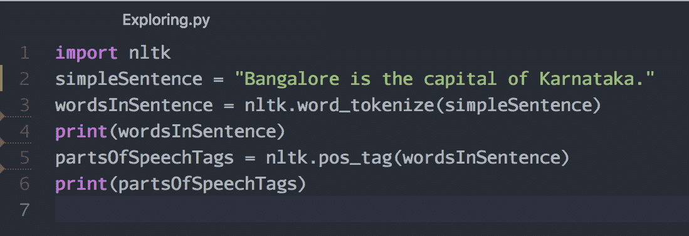

1.  保存文件。

1.  使用 Python 解释器运行程序。

1.  你将看到以下输出：

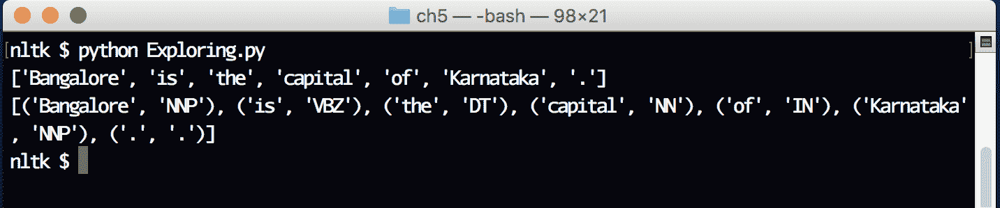

# 它是如何工作的...

现在，让我们回顾一下我们刚刚编写的程序，并深入了解细节：

```py
import nltk
```

这是我们程序中的第一条指令，它指示 Python 解释器从磁盘加载模块到内存，并使得 NLTK 库在程序中可用：

```py
simpleSentence = "Bangalore is the capital of Karnataka."
```

在本指令中，我们创建了一个名为`simpleSentence`的变量，并为其分配了一个硬编码的字符串：

```py
wordsInSentence = nltk.word_tokenize(simpleSentence)
```

在本指令中，我们调用了 NLTK 的内置分词函数`word_tokenize()`；它将给定句子分解为单词，并返回一个 Python `list`数据类型。一旦函数计算完结果，我们使用`=`（等号）操作符将结果赋值给一个名为`wordsInSentence`的变量：

```py
print(wordsInSentence)
```

在这条指令中，我们调用了 Python 内置的`print()`函数，它会将给定的数据结构显示在屏幕上。在我们的例子中，我们显示了所有分词后的单词列表。仔细观察输出；我们正在屏幕上显示一个 Python `list` 数据结构，它由用逗号分隔的所有字符串组成，所有列表元素都被方括号括起来：

```py
partsOfSpeechTags = nltk.pos_tag(wordsInSentence)
```

在这条指令中，我们调用了 NLTK 内置的标注器`pos_tag()`，它接受`wordsInSentence`变量中的单词列表并识别词性。一旦识别完成，将返回一个元组列表，每个元组包含分词后的单词和词性标识符：

```py
print(partsOfSpeechTags)
```

在这条指令中，我们调用了 Python 内置的`print()`函数，它将给定的参数打印到屏幕上。在我们的例子中，我们可以看到一个元组列表，每个元组包含原始单词和词性标识符。

# 编写你自己的标注器

在接下来的示例中，我们将通过编写自己的标注器来探索 NLTK 库。我们将编写以下类型的标注器：

+   默认标注器

+   正则表达式标注器

+   查找标注器

# 正在准备

你应该在系统中安装一个工作中的 Python（推荐 Python 3.6），以及 NLTK 库及其所有集合，以获得最佳体验。

你还应该安装`python-crfsuite`以运行这个示例。

# 如何操作...

1.  打开你的 Atom 编辑器（或你喜欢的编程编辑器）。

1.  创建一个名为`OwnTagger.py`的新文件。

1.  输入以下源代码：

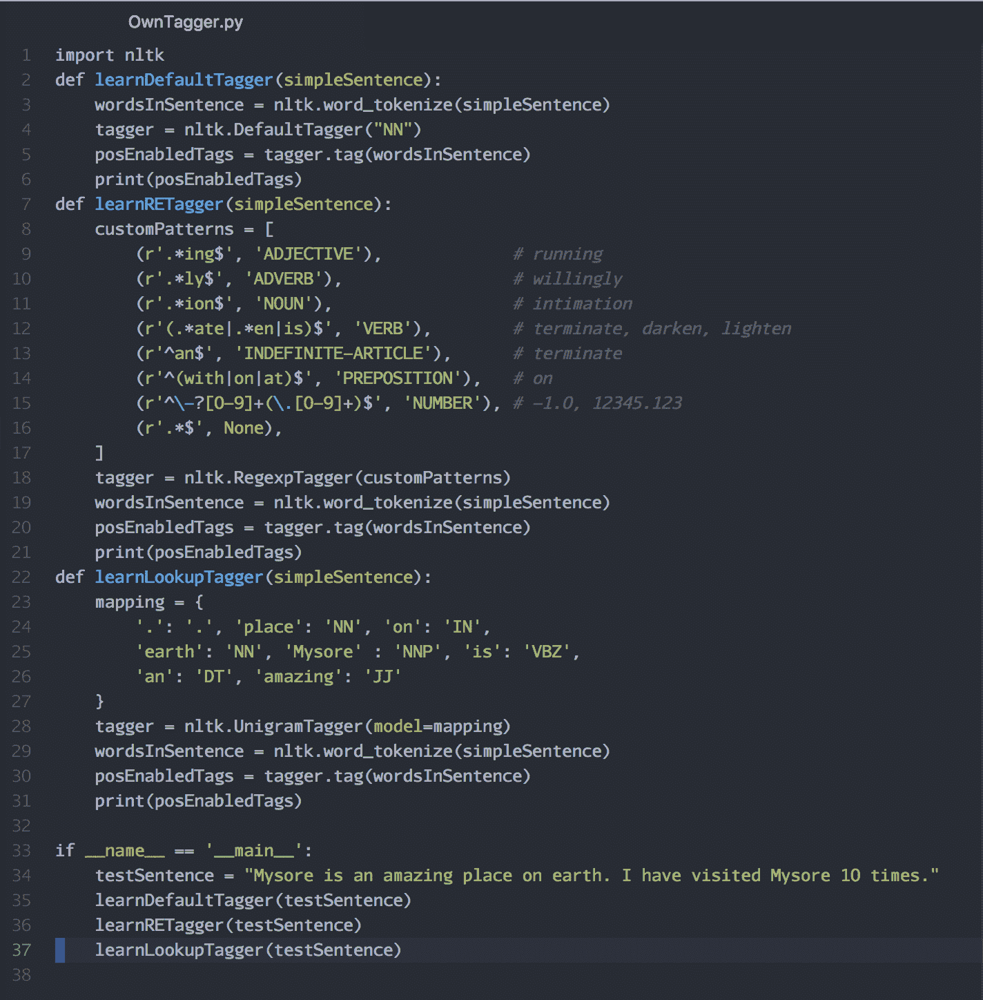

1.  保存文件。

1.  使用 Python 解释器运行程序。

1.  你将看到以下输出。

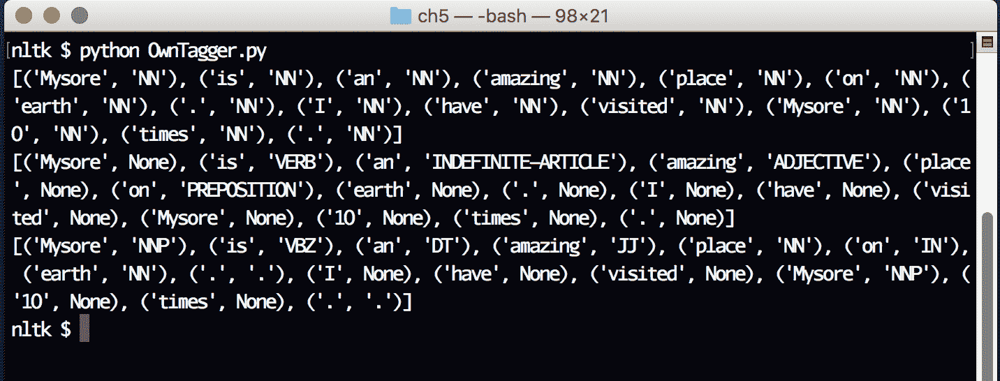

# 它是如何工作的...

现在，让我们回顾一下我们刚刚写的程序，深入理解：

```py
import nltk
```

这是我们程序中的第一条指令；它指示 Python 解释器将模块从磁盘加载到内存中，并使 NLTK 库在程序中可用：

```py
def learnDefaultTagger(simpleSentence):
  wordsInSentence = nltk.word_tokenize(simpleSentence)
  tagger = nltk.DefaultTagger("NN")
  posEnabledTags = tagger.tag(wordsInSentence)
  print(posEnabledTags)
```

所有这些指令都在定义一个新的 Python 函数，它接受一个字符串作为输入并在屏幕上打印该句子中的单词以及默认标注。我们进一步理解这个函数，看看它在做什么：

```py
def learnDefaultTagger(simpleSentence):
```

在这条指令中，我们定义了一个新的 Python 函数，名为`learnDefaultTagger`；它接受一个名为`simpleSentence`的参数：

```py
wordsInSentence = nltk.word_tokenize(simpleSentence)
```

在这条指令中，我们从 NLTK 库中调用了`word_tokenize`函数。我们将`simpleSentence`作为第一个参数传递给这个函数。当数据被该函数处理后，返回值将存储在`wordsInSentence`变量中。它是一个包含单词的列表：

```py
tagger = nltk.DefaultTagger("NN")
```

在这条指令中，我们创建了一个`DefaultTagger()`类的对象，该类来自 Python `nltk` 库，并将`NN`作为参数传递给它。这将初始化标注器并将实例分配给`tagger`变量：

```py
posEnabledTags = tagger.tag(wordsInSentence)
```

在本说明中，我们正在调用`tag()`函数，它属于`tagger`对象，该函数接受来自`wordsInSentence`变量的分词，并返回标记化单词的列表。该列表保存在`posEnabledTags`中。请记住，句子中的所有单词都将被标记为`NN`，因为这是标记器应该做的。这就像一个非常基础的标注，甚至没有涉及词性（POS）：

```py
print(posEnabledTags)
```

在这里，我们调用了 Python 内置的`print()`函数来检查`posEnabledTags`变量的内容。我们可以看到，句子中的所有单词都会被标记为`NN:`。

```py
def learnRETagger(simpleSentence):
  customPatterns = [
    (r'.*ing$', 'ADJECTIVE'),
    (r'.*ly$', 'ADVERB'),
    (r'.*ion$', 'NOUN'),
    (r'(.*ate|.*en|is)$', 'VERB'),
    (r'^an$', 'INDEFINITE-ARTICLE'),
    (r'^(with|on|at)$', 'PREPOSITION'),
    (r'^\-?[0-9]+(\.[0-9]+)$', 'NUMBER'),
    (r'.*$', None),
  ]
  tagger = nltk.RegexpTagger(customPatterns)
  wordsInSentence = nltk.word_tokenize(simpleSentence)
  posEnabledTags = tagger.tag(wordsInSentence)
  print(posEnabledTags)
```

这些是创建一个新函数`learnRETagger()`的指令，该函数接受一个字符串作为输入，并使用正则表达式标注器输出正确标记的所有令牌列表。

让我们试着一次理解一条指令：

```py
def learnRETagger(simpleSentence):
```

我们正在定义一个名为`*learnRETagger*`的 Python 函数，该函数接受一个名为*`simpleSentence`*的参数。

为了理解下一条指令，我们需要学习更多关于 Python 列表、元组和正则表达式的知识：

+   Python 列表是一种数据结构，是一组有序的元素

+   Python 元组是一种不可变（只读）数据结构，是一组有序的元素

+   Python 正则表达式是以字母`r`开头的字符串，并遵循标准的 PCRE 符号：

```py
customPatterns = [
  (r'.*ing$', 'ADJECTIVE'),
  (r'.*ly$', 'ADVERB'),
  (r'.*ion$', 'NOUN'),
  (r'(.*ate|.*en|is)$', 'VERB'),
  (r'^an$', 'INDEFINITE-ARTICLE'),
  (r'^(with|on|at)$', 'PREPOSITION'),
  (r'^\-?[0-9]+(\.[0-9]+)$', 'NUMBER'),
  (r'.*$', None),
]
```

即使这看起来很大，这其实是一个单一的指令，它做了很多事情：

+   创建一个名为`customPatterns`的变量

+   使用``定义一个新的 Python 列表数据类型

+   向此列表添加八个元素

+   该列表中的每个元素是一个元组，元组中有两个元素

+   元组中的第一项是一个正则表达式

+   元组中的第二项是一个字符串

现在，将前面的指令翻译成易于理解的形式，我们添加了八个正则表达式来标记句子中的单词，标记类型包括`ADJECTIVE`、`ADVERB`、`NOUN`、`VERB`、`INDEFINITE-ARTICLE`、`PREPOSITION`、`NUMBER`或`None`类型。

我们通过识别英语单词中的某些模式，来识别它们属于某个特定的词性（POS）。

在前面的例子中，这些是我们用来标记英语单词词性的线索：

+   以`ing`结尾的单词可以标记为`ADJECTIVE`，例如`running`

+   以`ly`结尾的单词可以标记为`ADVERB`，例如`willingly`

+   以`ion`结尾的单词可以标记为`NOUN`，例如`intimation`

+   以`ate`或`en`结尾的单词可以标记为`VERB`，例如`terminate`、`darken`或`lighten`

+   以`an`结尾的单词可以标记为`INDEFINITE-ARTICLE`

+   像`with`、`on`、`at`这样的单词是`PREPOSITION`

+   像`-123.0`、`984`这样的单词可以标记为`NUMBER`

+   我们将其他所有单词标记为`None`，`None`是 Python 内置的数据类型，用于表示“无”。

```py
tagger = nltk.RegexpTagger(customPatterns)
```

在这条指令中，我们创建了一个 NLTK 内置正则表达式标注器`RegexpTagger`的实例。我们将`customPatterns`变量中的元组列表作为第一个参数传递给类，以初始化对象。这个对象可以在未来通过名为`tagger`的变量引用：

```py
wordsInSentence = nltk.word_tokenize(simpleSentence)
```

按照常规流程，我们首先尝试使用 NLTK 内置的`word_tokenize()`函数对`simpleSentence`中的字符串进行分词，并将标记列表存储在`wordsInSentence`变量中：

```py
posEnabledTags = tagger.tag(wordsInSentence)
```

现在我们调用常规表达式标注器的`tag()`函数，对`wordsInSentence`变量中的所有单词进行标注。这个标注过程的结果存储在`posEnabledTags`变量中：

```py
print(posEnabledTags)
```

我们调用了 Python 内置的`print()`函数，在屏幕上显示`posEnabledTags`数据结构的内容：

```py
def learnLookupTagger(simpleSentence):
  mapping = {
    '.': '.', 'place': 'NN', 'on': 'IN',
    'earth': 'NN', 'Mysore' : 'NNP', 'is': 'VBZ',
    'an': 'DT', 'amazing': 'JJ'
  }
  tagger = nltk.UnigramTagger(model=mapping)
  wordsInSentence = nltk.word_tokenize(simpleSentence)
  posEnabledTags = tagger.tag(wordsInSentence)
  print(posEnabledTags)
```

让我们仔细看一下：

```py
def learnLookupTagger(simpleSentence):
```

我们定义了一个新函数`learnLookupTagger`，它接受一个字符串作为参数并存入`simpleSentence`变量：

```py
tagger = nltk.UnigramTagger(model=mapping)
```

在这条指令中，我们从`nltk`库中调用了`UnigramTagger`。这是一种查找标注器，它接受我们创建并赋值给`mapping`变量的 Python 字典。一旦对象创建完成，它将存储在`tagger`变量中，供以后使用：

```py
wordsInSentence = nltk.word_tokenize(simpleSentence)
```

在这里，我们使用 NLTK 内置的`word_tokenize()`函数对句子进行分词，并将结果保存在`wordsInSentence`变量中：

```py
posEnabledTags = tagger.tag(wordsInSentence)
```

一旦句子被分词，我们通过传入`wordsInSentence`变量中的标记列表来调用标注器的`tag()`函数。这个计算的结果被赋值给`posEnabledTags`变量：

```py
print(posEnabledTags)
```

在这条指令中，我们将在屏幕上打印`posEnabledTags`中的数据结构，便于进一步检查：

```py
testSentence = "Mysore is an amazing place on earth. I have visited Mysore 10 times."
```

我们创建了一个名为`testSentence`的变量，并将一个简单的英文句子赋给它：

```py
learnDefaultTagger(testSentence)
```

我们调用了在本教程中创建的`learnDefaultTagger`函数，传入`testSentence`作为第一个参数。该函数执行完成后，我们将看到句子的词性标注结果：

```py
learnRETagger(testSentence)
```

在这个表达式中，我们调用了`learnRETagger()`函数，传入了相同的测试句子`testSentence`变量。这个函数的输出是根据我们自己定义的正则表达式标记的标签列表：

```py
learnLookupTagger(testSentence)
```

这个函数`learnLookupTagger`的输出是从句子`testSentence`中提取的所有标签，这些标签是通过我们创建的查找字典进行标记的。

# 训练你自己的标注器

在这个教程中，我们将学习如何训练我们自己的标注器并将训练好的模型保存到磁盘，以便以后用于进一步的计算。

# 准备工作

你应该在系统中安装了一个可用的 Python（推荐 Python 3.6）版本，并且安装了 NLTK 库及其所有集合，以便获得最佳体验。

# 如何实现...

1.  打开你的 Atom 编辑器（或你喜欢的编程编辑器）。

1.  创建一个新的文件，命名为`Train3.py`。

1.  输入以下源代码：

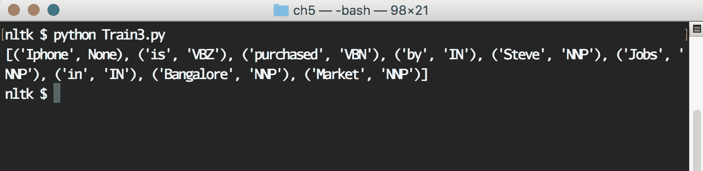

# 它是如何工作的...

让我们理解程序是如何工作的：

```py
import nltk
import pickle
```

在这两条指令中，我们将`nltk`和`pickle`模块加载到程序中。`pickle`模块实现了强大的序列化和反序列化算法，用于处理非常复杂的 Python 对象：

```py
def sampleData():
  return [
    "Bangalore is the capital of Karnataka.",
    "Steve Jobs was the CEO of Apple.",
    "iPhone was Invented by Apple.",
    "Books can be purchased in Market.",
  ]
```

在这些指令中，我们定义了一个名为`sampleData()`的函数，它返回一个 Python 列表。基本上，我们返回了四个样本字符串：

```py
def buildDictionary():
  dictionary = {}
  for sent in sampleData():
    partsOfSpeechTags = nltk.pos_tag(nltk.word_tokenize(sent))
    for tag in partsOfSpeechTags:
      value = tag[0]
      pos = tag[1]
      dictionary[value] = pos
    return dictionary
```

现在我们定义了一个名为`buildDictionary()`的函数；它一次从`sampleData()`函数生成的列表中读取一个字符串。每个字符串都使用`nltk.word_tokenize()`函数进行分词。结果的标记被添加到一个 Python 字典中，其中字典的键是句子中的单词，值是词性。计算完字典后，它会返回给调用者：

```py
def saveMyTagger(tagger, fileName):
  fileHandle = open(fileName, "wb")
  pickle.dump(tagger, fileHandle)
  fileHandle.close()
```

在这些说明中，我们定义了一个名为`saveMyTagger()`的函数，该函数接受两个参数：

+   `tagger`：一个指向词性标注器的对象

+   `fileName`：这是包含要存储`tagger`对象的文件名

我们首先以**写入二进制**（**wb**）模式打开文件。然后，使用`pickle`模块的`dump()`方法，将整个 tagger 存储到文件中，并调用`fileHandle`的`close()`函数：

```py
def saveMyTraining(fileName):
  tagger = nltk.UnigramTagger(model=buildDictionary())
  saveMyTagger(tagger, fileName)
```

在这些指令中，我们定义了一个名为`saveMyTraining`的新函数；它接受一个名为`fileName`的参数。

我们正在构建一个`nltk.UnigramTagger()`对象，其模型输出来自`buildDictionary()`函数（该函数本身是通过我们定义的字符串样本集构建的）。一旦创建了`tagger`对象，我们调用`saveMyTagger()`函数将其保存到磁盘：

```py
def loadMyTagger(fileName):
  return pickle.load(open(fileName, "rb"))
```

在这里，我们定义了一个新的函数`loadMyTagger()`，它以`fileName`作为唯一参数。该函数从磁盘读取文件，并将其传递给`pickle.load()`函数，该函数将从磁盘反序列化 tagger 并返回对它的引用：

```py
sentence = 'Iphone is purchased by Steve Jobs in Bangalore Market'
fileName = "myTagger.pickle"
```

在这两条指令中，我们定义了两个变量，`sentence`和`fileName`，分别包含我们想要分析的样本字符串和我们希望存储词性标注器的文件路径：

```py
saveMyTraining(fileName)
```

这条指令实际上调用了`saveMyTraining()`函数，并以`myTagger.pickle`作为参数。因此，我们基本上是在这个文件中存储训练好的 tagger：

```py
myTagger = loadMyTagger(fileName)
```

在这条指令中，我们将`myTagger.pickle`作为参数传递给`loadMyTagger()`函数，它从磁盘加载 tagger，进行反序列化，并创建一个对象，然后将该对象分配给`myTagger`变量：

```py
print(myTagger.tag(nltk.word_tokenize(sentence)))
```

在这条指令中，我们调用了刚刚从磁盘加载的 tagger 的`tag()`函数。我们用它来分词我们创建的样本字符串。

处理完成后，输出会显示在屏幕上。

# 学习编写你自己的语法

在自动机理论中，CFG 由以下几个部分组成：

+   一个起始符号/符号

+   一组符号/符号集，表示终结符

+   一组符号/符号集，表示非终结符

+   定义起始符号/符号以及可能的结束符号/符号的规则（或产生式）

符号/符号可以是任何特定于我们考虑的语言的元素。

例如：

+   在英语语言中，*a, b, c, d, e, f, g, h, i, j, k, l, m, n, o, p, q, r, s, t, u, v, w, x, y, z* 是符号/符号/字母。

+   在十进制计数系统中，*0, 1, 2, 3, 4, 5, 6, 7, 8, 9* 是符号/符号/字母。

通常，规则（或产生式）采用 **巴科斯-诺尔范式**（**BNF**）表示法编写。

# 准备就绪

你应该在系统上安装一个可工作的 Python（推荐 Python 3.6），并且安装 NLTK 库。

# 如何做到这一点...

1.  打开你的 atom 编辑器（或你喜欢的编程编辑器）。

1.  创建一个新的文件，命名为 `Grammar.py`。

1.  输入以下源代码：

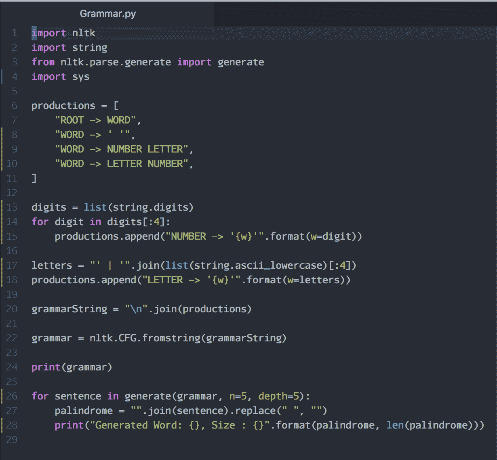

1.  保存文件。

1.  使用 Python 解释器运行该程序。

1.  你将看到以下输出：

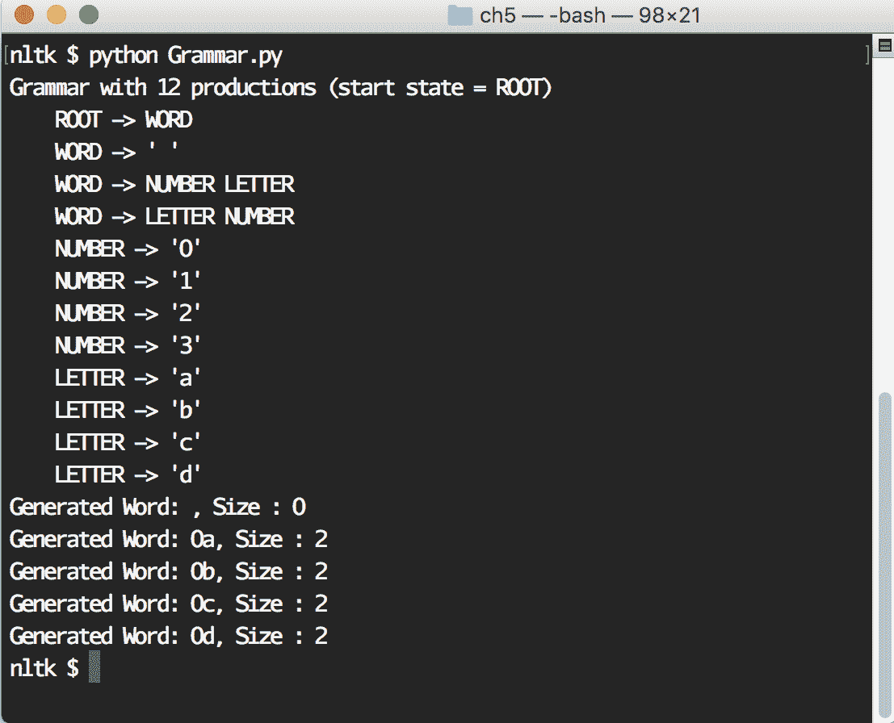

# 它是如何工作的...

现在，让我们回顾一下我们刚刚编写的程序，并深入了解细节：

```py
import nltk
```

我们将 `nltk` 库导入到当前程序中：

```py
import string
```

该指令将 `string` 模块导入到当前程序中：

```py
from nltk.parse.generate import generate
```

该指令从 `nltk.parse.generate` 模块导入 `generate` 函数，帮助从我们将要创建的 CFG 中生成字符串：

```py
productions = [
  "ROOT -> WORD",
  "WORD -> ' '",
  "WORD -> NUMBER LETTER",
  "WORD -> LETTER NUMBER",
]
```

我们在这里定义了一个新的语法。该语法可以包含以下产生规则：

+   起始符号是 `ROOT`

+   `ROOT` 符号可以生成 `WORD` 符号

+   `WORD` 符号可以生成 `' '`（空格）；这是一个死循环产生规则

+   `WORD` 符号可以生成 `NUMBER` 符号后跟 `LETTER` 符号

+   `WORD` 符号可以生成 `LETTER` 符号后跟 `NUMBER` 符号

这些指令进一步扩展了产生规则。

```py
digits = list(string.digits)
for digit in digits[:4]:
  productions.append("NUMBER -> '{w}'".format(w=digit))
```

+   `NUMBER` 可以生成终结符字母 `0`、`1`、`2` 或 `3`：

这些指令进一步扩展了产生规则。

```py
letters = "' | '".join(list(string.ascii_lowercase)[:4])
productions.append("LETTER -> '{w}'".format(w=letters))
```

+   `LETTER` 可以生成小写字母 `a`、`b`、`c` 或 `d`。

让我们尝试理解这条语法的用途。该语法表示包含诸如 `0a`、`1a`、`2a`、`a1`、`a3` 等单词的语言。

到目前为止，我们在名为 `productions` 的列表变量中存储的所有产生规则都已转换为字符串：

```py
grammarString = "\n".join(productions)
```

我们正在使用 `nltk.CFG.fromstring()` 方法创建一个新的语法对象，该方法采用我们刚刚创建的 `grammarString` 变量：

```py
grammar = nltk.CFG.fromstring(grammarString)
```

这些指令打印出该语言中自动生成的前五个单词，这些单词是根据定义的语法生成的：

```py
for sentence in generate(grammar, n=5, depth=5):
  palindrome = "".join(sentence).replace(" ", "")
  print("Generated Word: {}, Size : {}".format(palindrome, len(palindrome)))
```

# 编写一个概率上下文无关文法

概率上下文无关文法（Probabilistic CFG）是一种特殊类型的上下文无关文法，其中所有非终结符号（左侧）的概率之和应该等于 1。

让我们写一个简单的示例以便更好地理解。

# 准备工作

你应该在系统上安装一个有效的 Python 环境（推荐 Python 3.6），并且需要安装 NLTK 库。

# 如何操作...

1.  打开你的 Atom 编辑器（或你喜欢的编程编辑器）。

1.  创建一个名为 `PCFG.py` 的新文件。

1.  输入以下源代码：

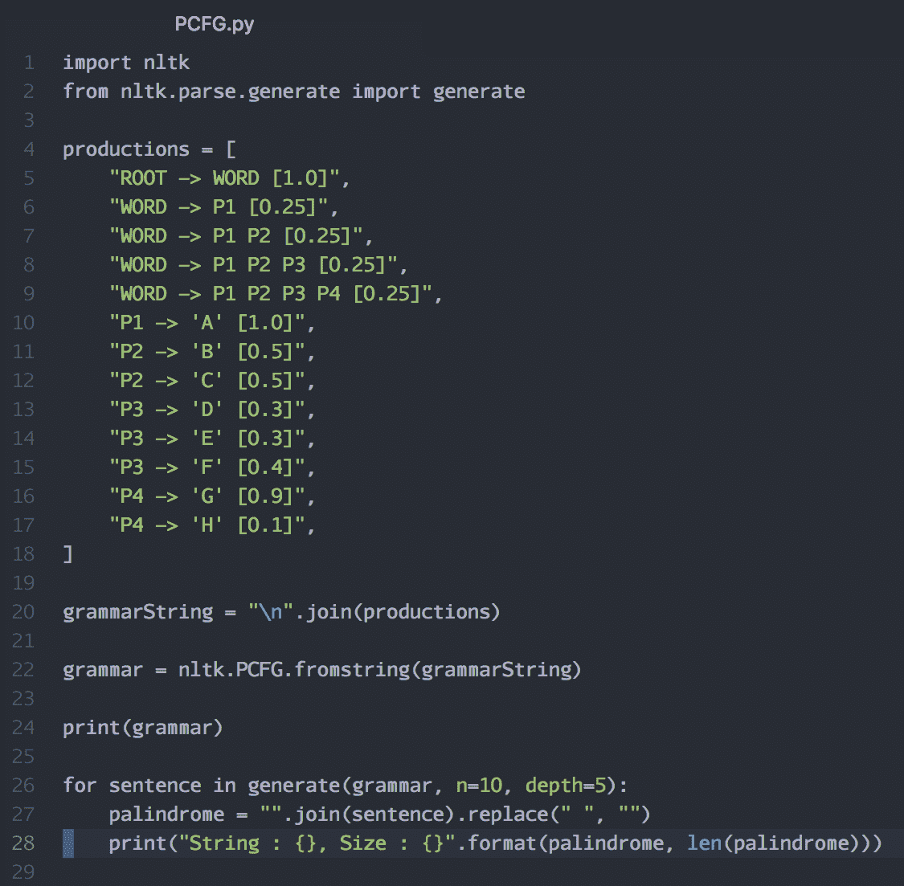

1.  保存文件。

1.  使用 Python 解释器运行程序。

1.  你将看到以下输出：

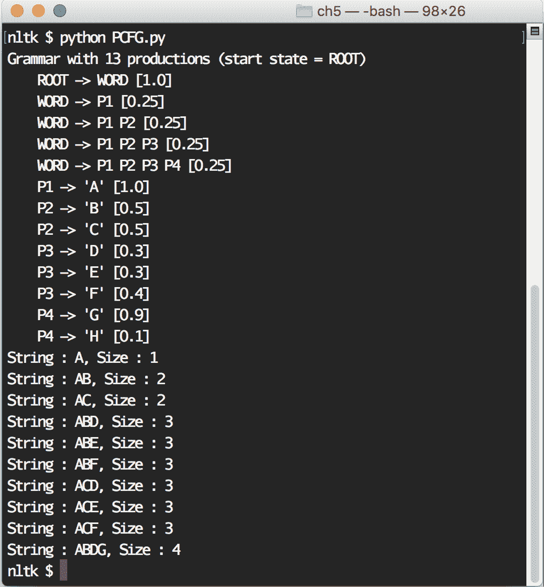

# 它是如何工作的...

现在，让我们详细看看我们刚刚编写的程序：

```py
import nltk
```

这条指令将 `nltk` 模块导入到我们的程序中：

```py
from nltk.parse.generate import generate
```

这条指令从 `nltk.parse.generate` 模块导入 `generate` 函数：

```py
productions = [
  "ROOT -> WORD [1.0]",
  "WORD -> P1 [0.25]",
  "WORD -> P1 P2 [0.25]",
  "WORD -> P1 P2 P3 [0.25]",
  "WORD -> P1 P2 P3 P4 [0.25]",
  "P1 -> 'A' [1.0]",
  "P2 -> 'B' [0.5]",
  "P2 -> 'C' [0.5]",
  "P3 -> 'D' [0.3]",
  "P3 -> 'E' [0.3]",
  "P3 -> 'F' [0.4]",
  "P4 -> 'G' [0.9]",
  "P4 -> 'H' [0.1]",
]
```

在这里，我们正在定义我们语言的语法，格式如下：

| **描述** | **内容** |
| --- | --- |
| 起始符号 | `ROOT` |
| 非终结符 | `WORD`, `P1`, `P2`, `P3`, `P4` |
| 终结符 | `'A'`, `'B'`, `'C'`, `'D'`, `'E'`, `'F'`, `'G'`, `'H'` |

一旦我们识别出语法中的符号，就来看一下产生规则是什么样子的：

+   有一个 `ROOT` 符号，它是此语法的起始符号

+   有一个 `WORD` 符号，其概率为 `1.0`

+   有一个 `WORD` 符号，它可以以 `0.25` 的概率生成 `P1`

+   有一个 `WORD` 符号，它可以以 `0.25` 的概率生成 `P1 P2`

+   有一个 `WORD` 符号，它可以以 `0.25` 的概率生成 `P1 P2 P3`

+   有一个 `WORD` 符号，它可以以 `0.25` 的概率生成 `P1 P2 P3 P4`

+   `P1` 符号可以以 `1.0` 的概率生成符号 `'A'`

+   `P2` 符号可以以 `0.5` 的概率生成符号 `'B'`

+   `P2` 符号可以以 `0.5` 的概率生成符号 `'C'`

+   `P3` 符号可以以 `0.3` 的概率生成符号 `'D'`

+   `P3` 符号可以以 `0.3` 的概率生成符号 `'E'`

+   `P3` 符号可以以 `0.4` 的概率生成符号 `'F'`

+   `P4` 符号可以以 `0.9` 的概率生成符号 `'G'`

+   `P4` 符号可以以 `0.1` 的概率生成符号 `'H'`

如果你仔细观察，所有非终结符符号的概率之和等于 `1.0`。这是 PCFG 的强制要求。

我们将所有生成规则的列表合并成一个字符串，称为 `grammarString` 变量：

```py
grammarString = "\n".join(productions)
```

这条指令使用 `nltk.PCFG.fromstring` 方法创建一个 `grammar` 对象，并以 `grammarString` 作为输入：

```py
grammar = nltk.PCFG.fromstring(grammarString)
```

这条指令使用 Python 内建的 `print()` 函数在屏幕上显示 `grammar` 对象的内容。这将总结我们刚刚创建的语法中所有符号和生成规则的总数：

```py
print(grammar)
```

我们使用 NLTK 内建的 `generate` 函数从这个语法中打印 10 个字符串，并将它们显示在屏幕上：

```py
for sentence in generate(grammar, n=10, depth=5):
  palindrome = "".join(sentence).replace(" ", "")
  print("String : {}, Size : {}".format(palindrome, len(palindrome)))
```

# 编写递归 CFG

递归 CFG 是 CFG 的一种特殊类型，其中生产规则左侧的符号出现在右侧。

回文是递归 CFG 的最佳示例。我们总是可以为给定语言中的回文编写递归 CFG。

为了更好地理解，我们考虑一个只有字母 0 和 1 的语言系统；因此回文可以如下表示：

+   11

+   1001

+   010010

无论我们从哪个方向读取这些字母（从左到右或从右到左），我们总是得到相同的值。这就是回文的特性。

在这个示例中，我们将编写语法来表示这些回文，并使用 NLTK 内建的字符串生成库生成一些回文。

让我们写一个简单的例子来更好地理解。

# 准备开始

你应该在系统上安装一个正常工作的 Python 环境（推荐使用 Python 3.6），并安装 NLTK 库。

# 如何操作...

1.  打开你的 atom 编辑器（或你喜欢的编程编辑器）。

1.  创建一个名为 `RecursiveCFG.py` 的新文件。

1.  输入以下源代码：

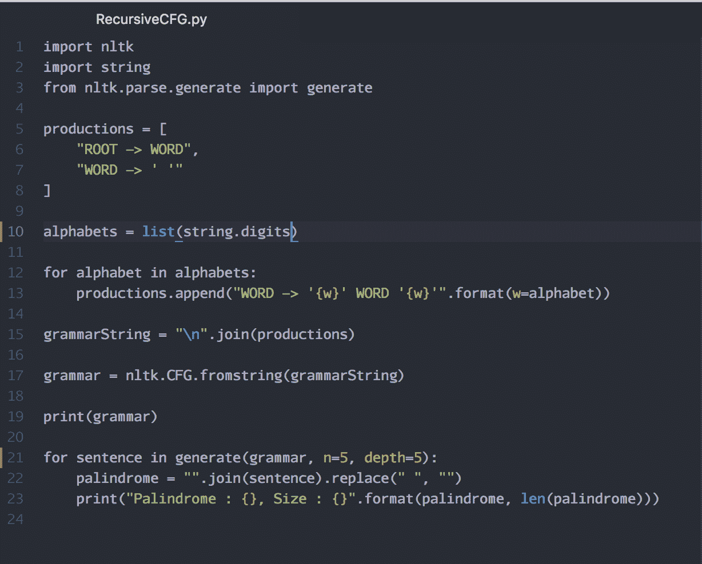

1.  保存文件。

1.  使用 Python 解释器运行程序。

1.  你将看到如下输出：

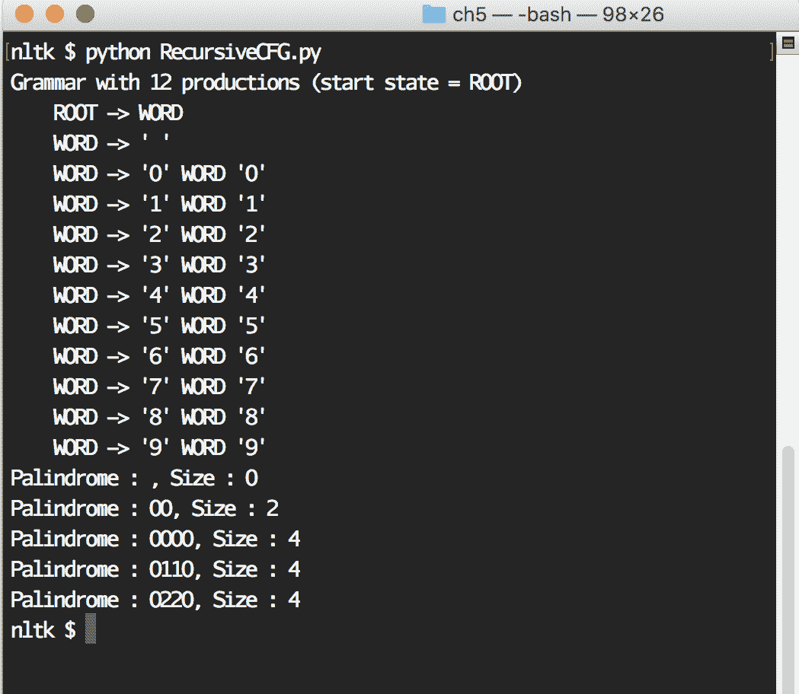

# 它是如何工作的...

现在，让我们回顾一下刚才编写的程序并深入了解细节。我们正在将 `nltk` 库导入到我们的程序中，以便将来使用：

```py
import nltk
```

我们还将 `string` 库导入到我们的程序中，以便将来使用：

```py
import string
```

我们正在从 `nltk.parse.generate` 模块导入 `generate` 函数：

```py
from nltk.parse.generate import generate
```

我们创建了一个名为 `productions` 的新列表数据结构，其中有两个元素。两个元素都是表示我们 CFG 中两个生产规则的字符串：

```py
productions = [
  "ROOT -> WORD",
  "WORD -> ' '"
]
```

我们正在将十进制数字列表作为 `alphabets` 变量中的列表进行检索：

```py
alphabets = list(string.digits)
```

使用数字 0 到 9，我们向列表中添加更多的生产规则。这些是定义回文的生产规则：

```py
for alphabet in alphabets:
  productions.append("WORD -> '{w}' WORD '{w}'".format(w=alphabet))
```

一旦所有规则都生成完毕，我们将它们作为字符串连接到一个变量 `grammarString` 中：

```py
grammarString = "\n".join(productions)
```

在此指令中，我们通过将新构建的 `grammarString` 传递给 NLTK 内建的 `nltk.CFG.fromstring` 函数来创建一个新的 `grammar` 对象：

```py
grammar = nltk.CFG.fromstring(grammarString)
```

在此指令中，我们通过调用 Python 内建的 `print()` 函数打印出我们刚刚创建的语法：

```py
print(grammar)
```

我们使用 NLTK 库的 `generate` 函数生成五个回文，并将其打印到屏幕上：

```py
for sentence in generate(grammar, n=5, depth=5):
  palindrome = "".join(sentence).replace(" ", "")
  print("Palindrome : {}, Size : {}".format(palindrome, len(palindrome)))
```
