# 第六章：分块、句子解析和依赖关系

在本章中，我们将执行以下配方：

+   使用内置的分块器

+   编写你自己的简单分块器

+   训练一个分块器

+   解析递归下降

+   解析移位规约

+   解析依赖语法和投影依赖

+   解析图表

# 简介

到目前为止，我们已经学习到 Python NLTK 可以用于对给定文本进行**词性**（**POS**）识别。但有时我们对我们处理的文本中更多细节感兴趣。例如，我可能对在给定文本中找到的某些名人、地点等感兴趣。我们可以维护一个非常大的所有这些名称的字典。但在最简单的形式中，我们可以使用 POS 分析来轻松识别这些模式。

分块是从文本中提取短语的过程。我们将利用 POS 标记算法进行分块。请记住，分块生成的标记（单词）不重叠。

# 使用内置的分块器

在这个配方中，我们将学习如何使用内置的分块器。以下是在此过程中从 NLTK 中使用的特性：

+   Punkt 标记器（默认）

+   平均感知标注器（默认）

+   最大熵 NE 分块器（默认）

# 准备就绪

您应该已经安装了 Python 以及`nltk`库。建议事先了解 POS 标记，如第五章，*POS 标记和语法*。

# 如何做到…

1.  打开 Atom 编辑器（或您喜欢的编程编辑器）。

1.  创建一个名为`Chunker.py`的新文件。

1.  输入以下源代码：

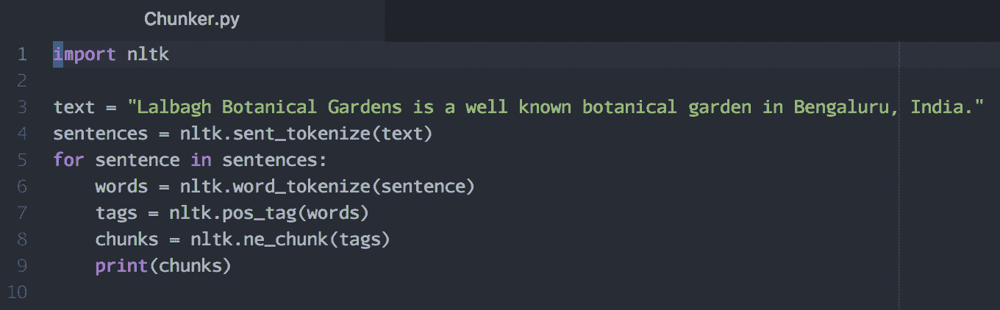

1.  保存文件。

1.  使用 Python 解释器运行程序。

1.  您将看到以下输出：

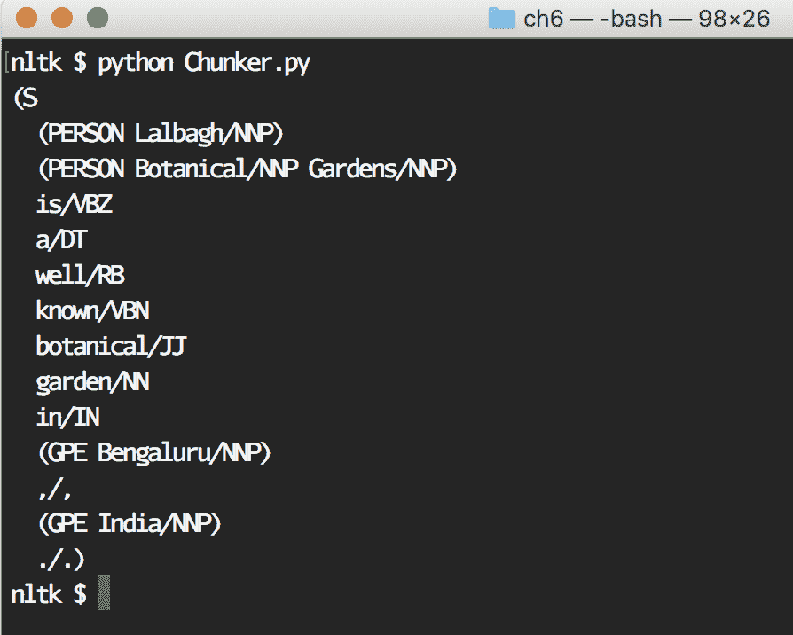

# 工作原理…

让我们试着理解程序是如何工作的。这条指令将`nltk`模块导入程序中：

```py
import nltk
```

这是我们作为这个配方的一部分要分析的数据。我们将这个字符串添加到名为`text`的变量中：

```py
text = "Lalbagh Botanical Gardens is a well known botanical garden in Bengaluru, India."
```

这个指令将把给定的文本分成多个句子。结果是存储在名为`sentences`的列表中的句子：

```py
sentences = nltk.sent_tokenize(text)
```

在这个指令中，我们正在循环遍历我们提取的所有句子。每个句子都存储在名为`sentence`的变量中：

```py
for sentence in sentences:
```

这个指令将句子分成不重叠的单词。结果存储在名为`words`的变量中：

```py
words = nltk.word_tokenize(sentence)
```

在这个指令中，我们使用 NLTK 提供的默认标注器进行 POS 分析。一旦识别完成，结果将存储在名为`tags`的变量中：

```py
tags = nltk.pos_tag(words)
```

在这个指令中，我们调用`nltk.ne_chunk()`函数，它为我们执行分块部分。结果存储在名为 chunks 的变量中。实际上，结果是包含树路径的树结构化数据：

```py
chunks = nltk.ne_chunk(tags)
```

这会打印出在给定输入字符串中识别的分块。分块会被括号 "`(`" 和 "`)`" 包裹，以便与输入文本中的其他单词区分开来。

```py
print(chunks)
```

# 编写你自己的简单分块器

在本教程中，我们将编写自己的正则表达式分块器。由于我们将使用正则表达式来编写此分块器，我们需要了解一些编写正则表达式以进行分块时的不同之处。

在第四章《正则表达式》中，我们理解了正则表达式及其编写方法。例如，形式为 *[a-z, A-Z]+* 的正则表达式匹配英语句子中的所有单词。

我们已经理解，通过使用 NLTK，我们可以识别出词性的简写（如 `V`、`NN`、`NNP` 等）。我们能否使用这些词性编写正则表达式？

答案是肯定的。你猜对了。我们可以利用基于词性的正则表达式编写。由于我们使用词性标签来编写这些正则表达式，它们被称为标签模式。

就像我们写一个给定自然语言的字母（a-z）来匹配不同的模式一样，我们也可以利用词性（POS）根据 NLTK 匹配的词性来匹配单词（来自字典的任意组合）。

这些标签模式是 NLTK 最强大的功能之一，因为它们使我们能够仅通过基于词性的正则表达式来匹配句子中的单词。

为了更深入地了解这些，让我们进一步探讨：

```py
"Ravi is the CEO of a Company. He is very powerful public speaker also."
```

一旦我们识别了词性，结果如下所示：

```py
[('Ravi', 'NNP'), ('is', 'VBZ'), ('the', 'DT'), ('CEO', 'NNP'), ('of', 'IN'), ('a', 'DT'), ('Company', 'NNP'), ('.', '.')]
[('He', 'PRP'), ('is', 'VBZ'), ('very', 'RB'), ('powerful', 'JJ'), ('public', 'JJ'), ('speaker', 'NN'), ('also', 'RB'), ('.', '.')]
```

之后，我们可以使用这些信息来提取名词短语。

让我们仔细查看前面的词性输出。我们可以得出以下观察：

+   分块是一个或多个连续的 `NNP`

+   分块是 `NNP` 后跟 `DT`

+   分块是 `NP` 后跟另一个 `JJ`

通过这三个简单的观察，我们来编写一个基于词性的正则表达式，它在 BNF 形式中称为标签短语：

```py
NP -> <PRP>
NP -> <DT>*<NNP>
NP -> <JJ>*<NN>
NP -> <NNP>+
```

我们感兴趣的是从输入文本中提取以下分块：

+   `Ravi`

+   `the CEO`

+   `a company`

+   `powerful public speaker`

让我们编写一个简单的 Python 程序来完成任务。

# 准备开始

你应该已经安装了 Python，并且安装了 `nltk` 库。对正则表达式有一定了解会很有帮助。

# 如何操作……

1.  打开 Atom 编辑器（或你喜欢的编程编辑器）。

1.  创建一个名为 `SimpleChunker.py` 的新文件。

1.  输入以下源代码：

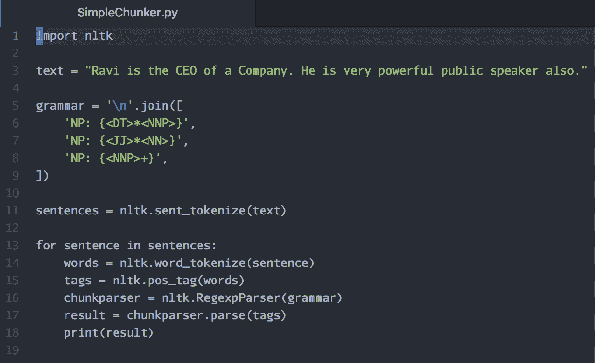

1.  保存文件。

1.  使用 Python 解释器运行程序。

1.  你将看到以下输出：

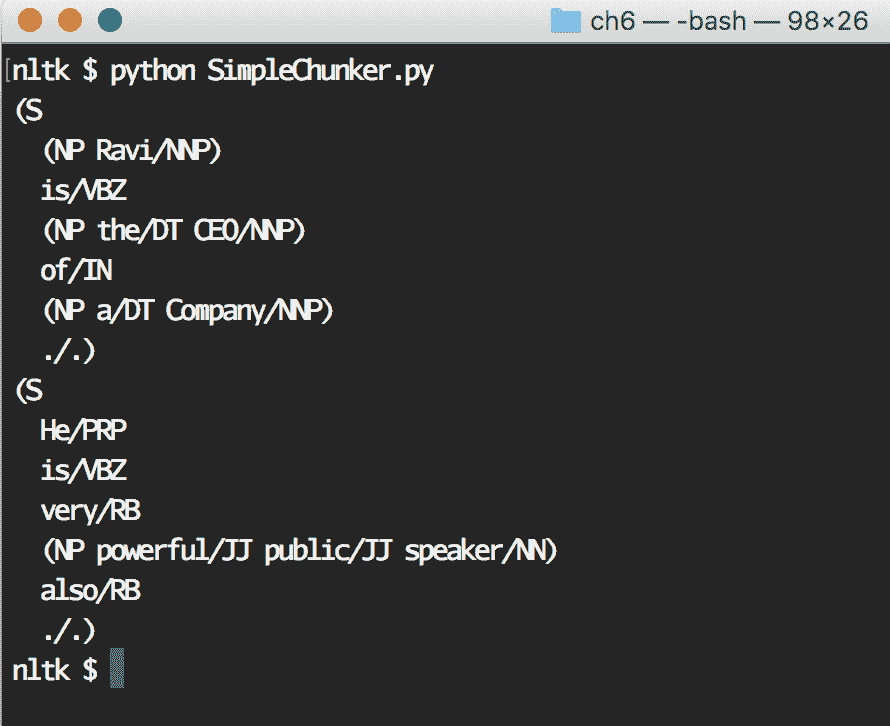

# 它是如何工作的……

现在，让我们理解程序是如何工作的：

这条指令将 `nltk` 库导入当前程序：

```py
import nltk
```

我们声明了一个 `text` 变量，其中包含我们要处理的句子：

```py
text = "Ravi is the CEO of a Company. He is very powerful public speaker also."
```

在这个指令中，我们编写正则表达式，这些正则表达式是通过词性标注（POS）来写的，因此它们被特别称为标签模式。这些标签模式不是随意创建的，而是从前面的示例中精心制作的。

```py
grammar = '\n'.join([
  'NP: {<DT>*<NNP>}',
  'NP: {<JJ>*<NN>}',
  'NP: {<NNP>+}',
])
```

让我们理解这些标签模式：

+   `NP` 后跟一个或多个 `<DT>`，然后是一个 `<NNP>`

+   `NP` 后跟一个或多个 `<JJ>`，然后是一个 `<NN>`

+   `NP` 后跟一个或多个 `<NNP>`

我们处理的文本越多，就能发现更多这样的规则。这些规则是特定于我们处理的语言的。所以，这是我们应该做的练习，以便在信息提取方面变得更强大：

```py
sentences = nltk.sent_tokenize(text)
```

首先，我们使用 `nltk.sent_tokenize()` 函数将输入文本分割成句子：

```py
for sentence in sentences:
```

这个指令会遍历所有句子的列表，并将每个句子分配给 `sentence` 变量：

```py
words = nltk.word_tokenize(sentence)
```

这个指令使用 `nltk.word_tokenize()` 函数将句子分割成标记，并将结果存入 `words` 变量：

```py
tags = nltk.pos_tag(words)
```

这个指令会对单词变量（其中包含一个单词列表）进行词性标注，并将结果存入 `tags` 变量（每个单词会被正确地标注上相应的词性标签）：

```py
chunkparser = nltk.RegexpParser(grammar)
```

这个指令调用 `nltk.RegexpParser` 来解析我们之前创建的语法。对象保存在 `chunkparser` 变量中：

```py
result = chunkparser.parse(tags)
```

我们使用对象解析这些标签，结果存储在 `result` 变量中：

```py
print(result)
```

现在，我们使用 `print()` 函数在屏幕上显示已识别的词块。输出结果是一个树状结构，显示了单词及其对应的词性。

# 训练词块解析器

在这个示例中，我们将学习训练过程，训练我们自己的词块解析器，并进行评估。

在开始训练之前，我们需要了解我们处理的数据类型。一旦我们对数据有了基本了解，就必须根据需要提取的信息来训练它。一种特定的训练数据的方法是使用 IOB 标注法来标记从给定文本中提取的词块。

自然地，我们在句子中找到了不同的单词。从这些单词中，我们可以找出它们的词性。稍后在进行词块分析时，我们需要根据单词在文本中的位置进一步标注单词。

取以下示例：

```py
"Bill Gates announces Satya Nadella as new CEO of Microsoft"
```

一旦我们完成了词性标注和词块分析，我们将看到类似这样的输出：

```py
Bill NNP B-PERSON
Gates NNP I-PERSON
announces NNS O
Satya NNP B-PERSON
Nadella NNP I-PERSON
as IN O
new JJ O
CEO NNP B-ROLE
of IN O
Microsoft NNP B-COMPANY
```

这叫做 IOB 格式，每行由三个由空格分隔的标记组成。

| **列** | **描述** |
| --- | --- |
| IOB 中的第一列 | 输入句子中的实际单词 |
| IOB 中的第二列 | 单词的词性 |
| IOB 中的第三列 | 词块标识符，包含 I（词块内）、O（词块外）、B（词块的开始词）以及适当的后缀来表示单词的类别 |

让我们在图示中查看这一过程：

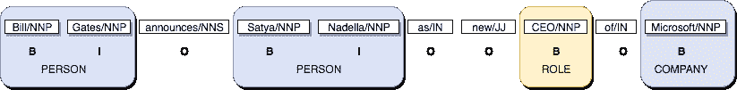

一旦我们有了 IOB 格式的训练数据，我们可以进一步利用它，通过将其应用于其他数据集来扩展我们的 chunker 的适用范围。如果我们从头开始训练，或者想从文本中识别新的关键字类型，训练是非常昂贵的。

让我们尝试写一个简单的 chunker，使用`regexparser`，看看它能给出什么类型的结果。

# 准备就绪

你应该已经安装了 Python，并且安装了`nltk`库。

# 如何操作……

1.  打开 Atom 编辑器（或你喜欢的编程编辑器）。

1.  创建一个名为`TrainingChunker.py`的新文件。

1.  输入以下源代码：

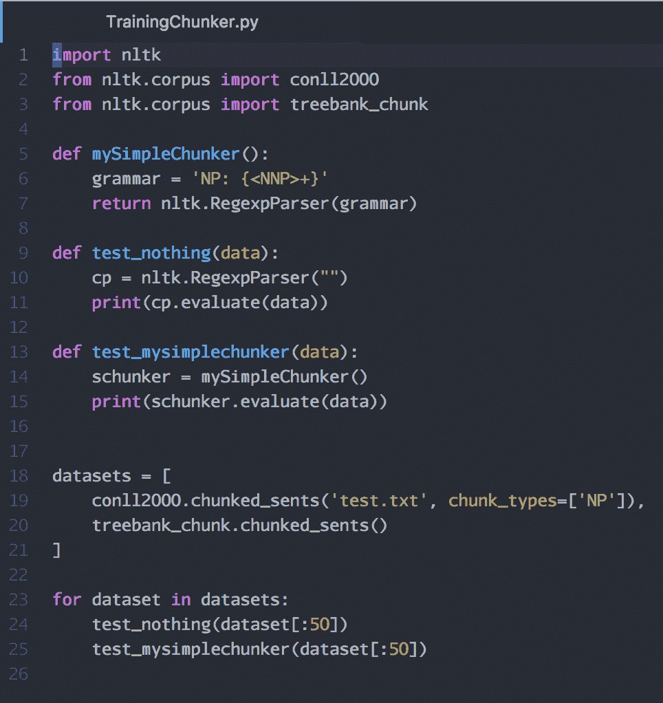

1.  保存文件。

1.  使用 Python 解释器运行程序。

1.  你将看到以下输出：

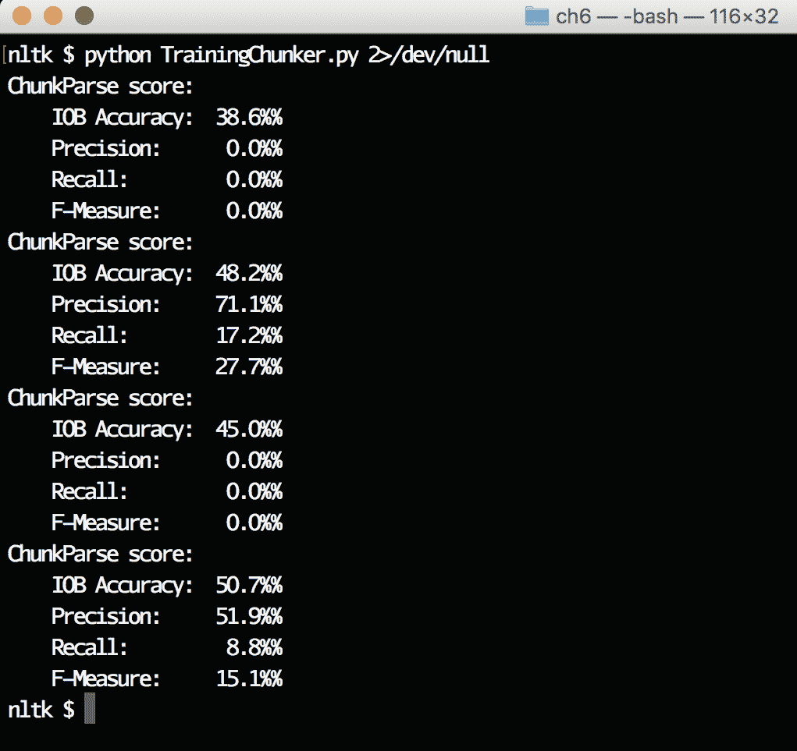

# 它是如何工作的……

这条指令将`nltk`模块导入到当前程序中：

```py
import nltk
```

这条指令将`conll2000`语料库导入到当前程序中：

```py
from nltk.corpus import conll2000
```

这条指令将`treebank`语料库导入到当前程序中：

```py
from nltk.corpus import treebank_chunk
```

我们定义了一个新函数`mySimpleChunker()`。我们还定义了一个简单的标签模式，用于提取所有词性为`NNP`（专有名词）的单词。这个语法用于我们的 chunker 提取命名实体：

```py
def mySimpleChunker():
  grammar = 'NP: {<NNP>+}'
  return nltk.RegexpParser(grammar)
```

这是一个简单的 chunker，它不会从给定的文本中提取任何内容。用于检查算法是否正常工作：

```py
def test_nothing(data):
  cp = nltk.RegexpParser("")
  print(cp.evaluate(data))
```

这个函数在测试数据上使用`mySimpleChunker()`，并评估数据与已经标记的输入数据的准确性：

```py
def test_mysimplechunker(data):
  schunker = mySimpleChunker()
  print(schunker.evaluate(data))
```

我们创建了一个包含两个数据集的列表，一个来自`conll2000`，另一个来自`treebank`：

```py
datasets = [
  conll2000.chunked_sents('test.txt', chunk_types=['NP']),
  treebank_chunk.chunked_sents()
]
```

我们对两个数据集进行迭代，并在前 50 个 IOB 标记的句子上调用`test_nothing()`和`test_mysimplechunker()`，以查看 chunker 的准确性。

```py
for dataset in datasets:
  test_nothing(dataset[:50])
  test_mysimplechunker(dataset[:50])
```

# 递归下降解析

递归下降解析器属于一种解析器家族，它从左到右读取输入，并以自顶向下的方式构建解析树，同时以先序遍历的方式遍历节点。由于语法本身是使用 CFG 方法表达的，解析是递归性质的。这种解析技术用于构建编译器，以解析编程语言的指令。

在本教程中，我们将探讨如何使用 NLTK 库自带的 RD 解析器。

# 准备就绪

你应该已经安装了 Python，并且安装了`nltk`库。

# 如何操作……

1.  打开 Atom 编辑器（或你喜欢的编程编辑器）。

1.  创建一个名为`ParsingRD.py`的新文件。

1.  输入以下源代码：

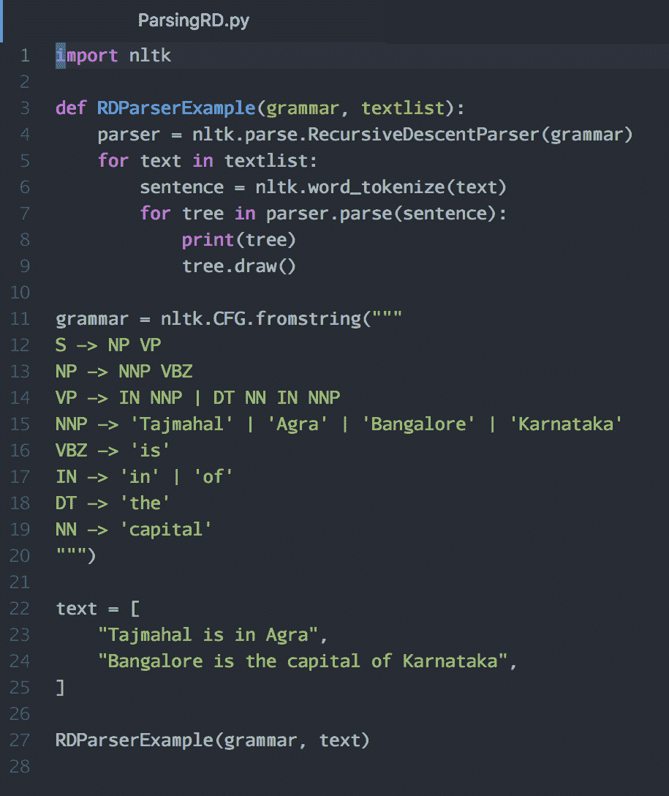

1.  保存文件。

1.  使用 Python 解释器运行程序。

1.  你将看到以下输出：

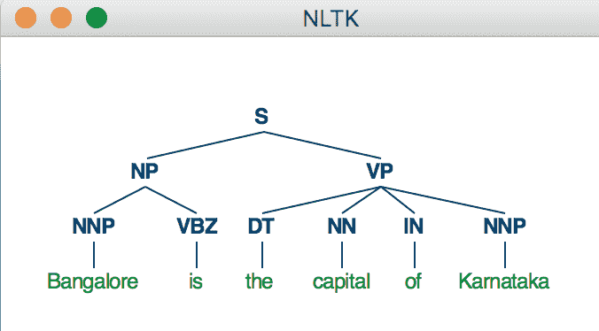

这个图是输入中第二个句子通过 RD 解析器解析后的输出：

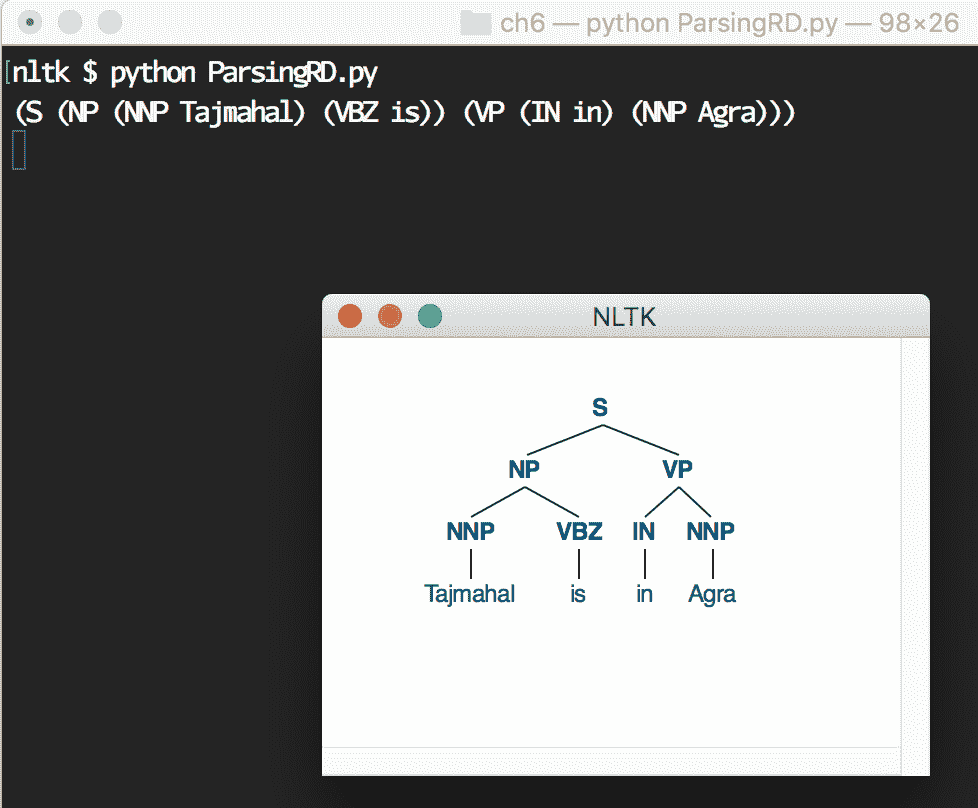

# 它是如何工作的……

让我们看看程序是如何工作的。在这条指令中，我们导入了`nltk`库：

```py
import nltk
```

在这些说明中，我们定义了一个新的函数 `SRParserExample`；它接受一个 `grammar` 对象和 `textlist` 作为参数：

```py
def RDParserExample(grammar, textlist):
```

我们通过调用 `nltk.parse` 库中的 `RecursiveDescentParser` 来创建一个新的解析器对象。我们将 grammar 传递给这个类进行初始化：

```py
parser = nltk.parse.RecursiveDescentParser(grammar)
```

在这些说明中，我们遍历 `textlist` 变量中的句子列表。每个文本项都使用 `nltk.word_tokenize()` 函数进行分词，然后将结果单词传递给 `parser.parse()` 函数。一旦解析完成，我们会将结果显示在屏幕上，并展示解析树：

```py
for text in textlist:
  sentence = nltk.word_tokenize(text)
  for tree in parser.parse(sentence):
    print(tree)
    tree.draw()
```

我们使用 `grammar` 创建一个新的 `CFG` 对象：

```py
grammar = nltk.CFG.fromstring("""
S -> NP VP
NP -> NNP VBZ
VP -> IN NNP | DT NN IN NNP
NNP -> 'Tajmahal' | 'Agra' | 'Bangalore' | 'Karnataka'
VBZ -> 'is'
IN -> 'in' | 'of'
DT -> 'the'
NN -> 'capital'
""")
```

这些是我们用来理解解析器的两个样本文本：

```py
text = [
  "Tajmahal is in Agra",
  "Bangalore is the capital of Karnataka",
]
```

我们调用 `RDParserExample` 使用 `grammar` 对象和样本文本列表。

```py
RDParserExample(grammar, text)
```

# 移位归约解析

在这个教程中，我们将学习如何使用和理解移位归约解析。

移位归约解析器是特殊类型的解析器，它们从左到右解析单行句子的输入文本，从上到下解析多行句子的输入文本。

对于输入文本中的每个字母/符号，解析过程如下：

+   从输入文本中读取第一个符号并将其推送到堆栈（移位操作）

+   从堆栈中读取完整的解析树，并查看可以应用哪些生成规则，通过从右到左读取生成规则（归约操作）

+   这个过程会一直重复，直到我们用尽所有的生成规则，这时我们认为解析失败

+   这个过程会一直重复，直到所有输入都被消耗完，我们认为解析成功

在以下示例中，我们看到只有一个输入文本会被成功解析，另一个则无法解析。

# 准备就绪

你应该已经安装了 Python，并且安装了 `nltk` 库。需要了解如何编写语法规则。

# 如何做...

1.  打开 Atom 编辑器（或你喜欢的编程编辑器）。

1.  创建一个新的文件，命名为 `ParsingSR.py`。

1.  输入以下源代码：

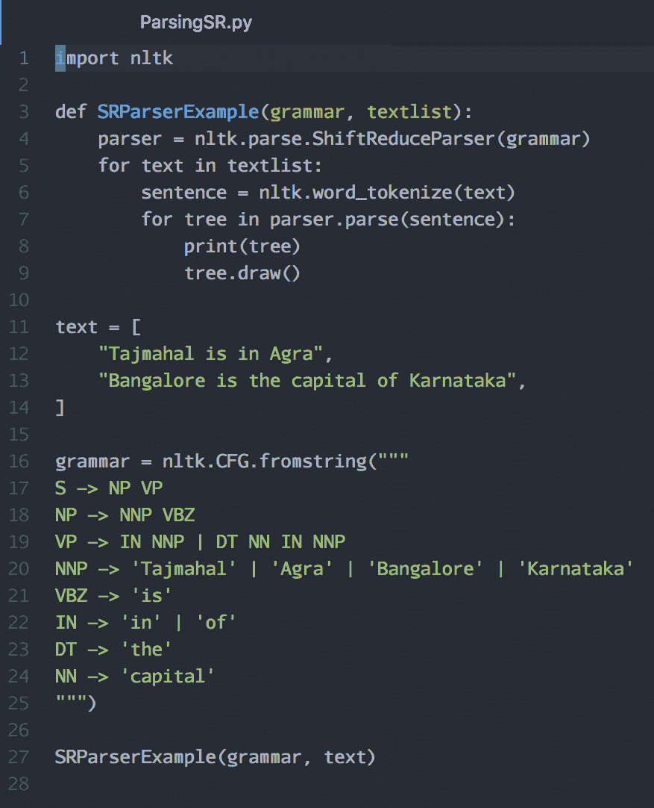

1.  保存文件。

1.  使用 Python 解释器运行程序。

1.  你将看到以下输出：

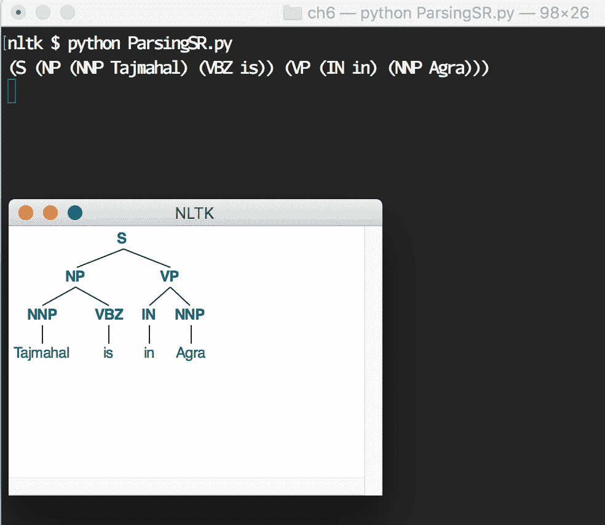

# 它是如何工作的...

让我们看看程序是如何工作的。在这条指令中，我们导入了 `nltk` 库：

```py
import nltk
```

在这些说明中，我们定义了一个新的函数 `SRParserExample`；它接受一个 `grammar` 对象和 `textlist` 作为参数：

```py
def SRParserExample(grammar, textlist):
```

我们通过调用 `nltk.parse` 库中的 `ShiftReduceParser` 来创建一个新的解析器对象。我们将 `grammar` 传递给这个类进行初始化：

```py
parser = nltk.parse.ShiftReduceParser(grammar)
```

在这些说明中，我们遍历 `textlist` 变量中的句子列表。每个文本项都使用 `nltk.word_tokenize()` 函数进行分词，然后将结果单词传递给 `parser.parse()` 函数。一旦解析完成，我们会将结果显示在屏幕上，并展示解析树：

```py
for text in textlist:
  sentence = nltk.word_tokenize(text)
  for tree in parser.parse(sentence):
    print(tree)
    tree.draw()
```

这些是我们用来理解移位归约解析器的两个样本文本：

```py
text = [
  "Tajmahal is in Agra",
  "Bangalore is the capital of Karnataka",
]
```

我们使用 `grammar` 创建一个新的 `CFG` 对象：

```py
grammar = nltk.CFG.fromstring("""
S -> NP VP
NP -> NNP VBZ
VP -> IN NNP | DT NN IN NNP
NNP -> 'Tajmahal' | 'Agra' | 'Bangalore' | 'Karnataka'
VBZ -> 'is'
IN -> 'in' | 'of'
DT -> 'the'
NN -> 'capital'
""")
```

我们使用 `grammar` 对象和示例句子的列表调用 `SRParserExample`。

```py
SRParserExample(grammar, text)
```

# 解析依赖语法和投影依赖

在这个食谱中，我们将学习如何解析依赖语法并使用投影依赖解析器。

依赖语法基于这样一个概念：有时，句子中的单词之间存在直接关系。此食谱中的示例清楚地展示了这一点。

# 准备就绪

你应该安装 Python，并且需要安装`nltk`库。

# 如何实现...

1.  打开 Atom 编辑器（或你喜欢的编程编辑器）。

1.  创建一个名为 `ParsingDG.py` 的新文件。

1.  输入以下源代码：

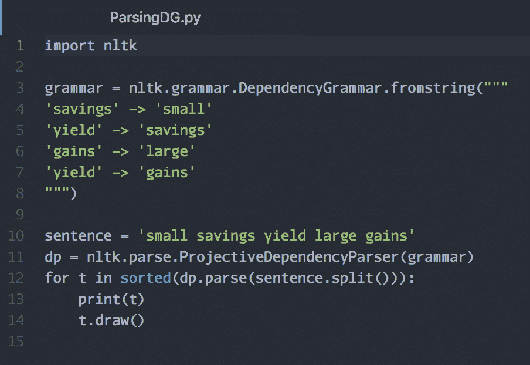

1.  保存文件。

1.  使用 Python 解释器运行程序。

1.  你将看到以下输出：

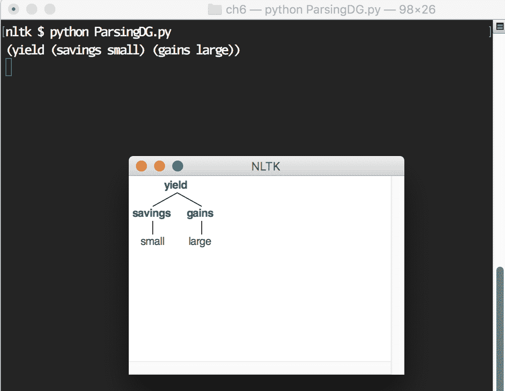

# 它是如何工作的...

让我们看看程序是如何工作的。这个指令将 `nltk` 库导入程序：

```py
import nltk
```

这条指令使用 `nltk.grammar.DependencyGrammar` 类创建了一个 `grammar` 对象。我们正在向语法中添加以下生成规则：

```py
grammar = nltk.grammar.DependencyGrammar.fromstring("""
'savings' -> 'small'
'yield' -> 'savings'
'gains' -> 'large'
'yield' -> 'gains'
""")
```

让我们更深入了解这些生成规则：

+   `small` 与 `savings` 相关

+   `savings` 与 `yield` 相关

+   `large` 与 `gains` 相关

+   `gains` 与 `yield` 相关

这是我们将运行解析器的示例句子。它被存储在一个名为`sentence`的变量中：

```py
sentence = 'small savings yield large gains'
```

这条指令使用我们刚刚定义的 `grammar` 创建一个新的 `nltk.parse.ProjectiveDependencyParser` 对象：

```py
dp = nltk.parse.ProjectiveDependencyParser(grammar)
```

在这个 for 循环中，我们做了很多事情：

```py
for t in sorted(dp.parse(sentence.split())):
  print(t)
  t.draw()
```

前面的 for 循环做了以下操作：

+   我们正在拆分句子中的单词

+   所有单词列表作为输入传递给 `dp` 对象

+   解析后的结果通过 `sorted()` 内置函数进行排序

+   遍历所有树形路径并将它们显示在屏幕上，同时以漂亮的树形结构呈现结果

# 解析图表

图表解析器是适用于自然语言的特殊类型解析器，因为自然语言的语法通常是模糊的。它们使用动态编程来生成所需的结果。

动态编程的好处是，它将给定问题分解为子问题，并将结果存储在一个共享位置，算法可以在遇到相似子问题时重复使用这些结果。这大大减少了反复计算相同问题的需求。

在这个食谱中，我们将学习 NLTK 库提供的图表解析功能。

# 准备就绪

你应该安装 Python，并且需要安装 `nltk` 库。理解语法是很有帮助的。

# 如何实现...

1.  打开 Atom 编辑器（或你喜欢的编程编辑器）。

1.  创建一个名为 `ParsingChart.py` 的新文件。

1.  输入以下源代码：

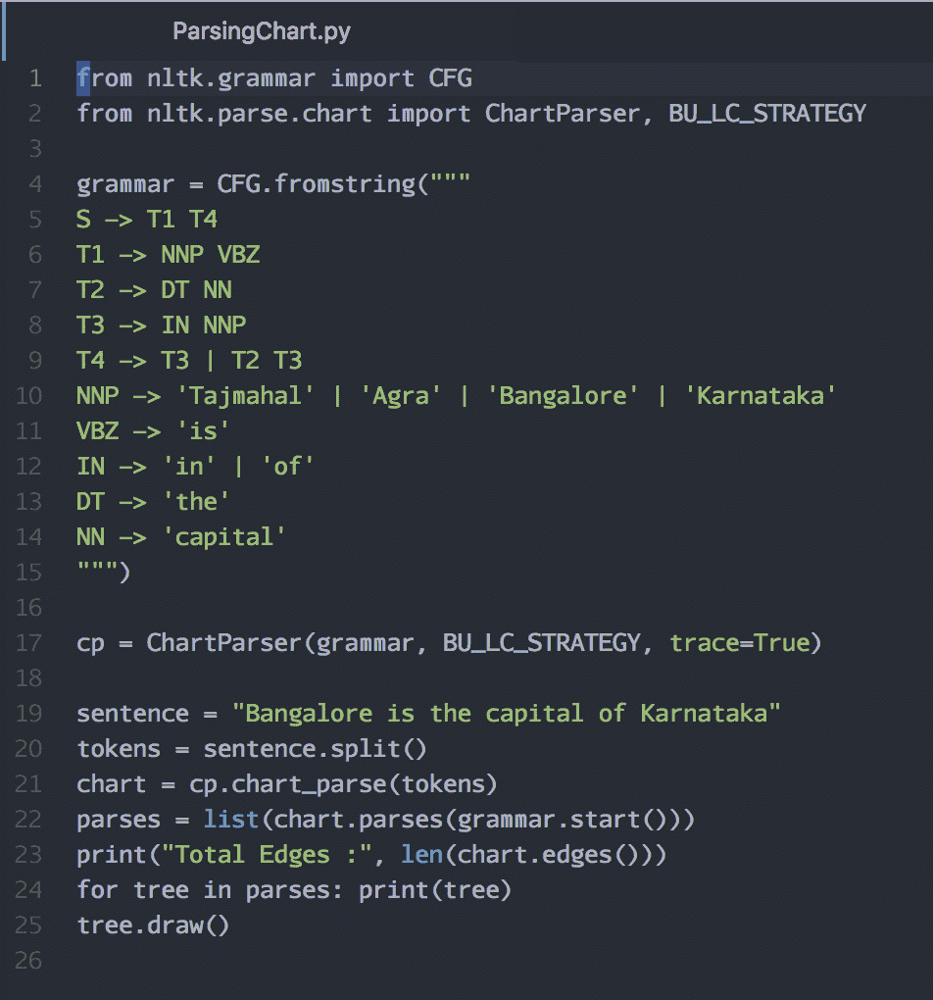

1.  保存文件。

1.  使用 Python 解释器运行程序。

1.  你将看到以下输出：

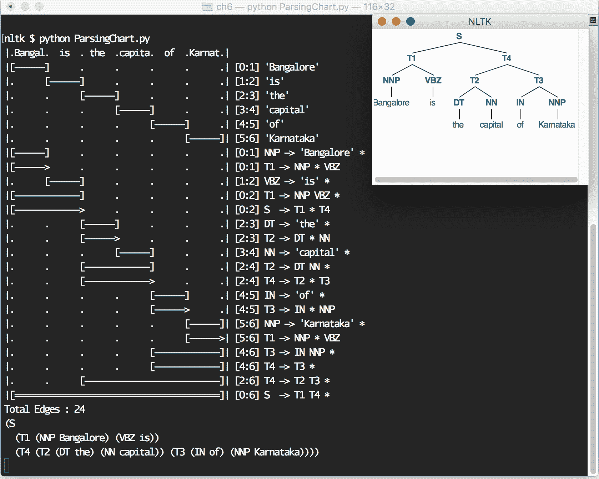

# 它是如何工作的...

让我们看看程序是如何工作的。此指令将`CFG`模块导入程序：

```py
from nltk.grammar import CFG
```

本指令将`ChartParser`和`BU_LC_STRATEGY`功能导入程序：

```py
from nltk.parse.chart import ChartParser, BU_LC_STRATEGY
```

我们正在为示例创建一个语法规则。所有的产生式都以 BNF 形式表示：

```py
grammar = CFG.fromstring("""
S -> T1 T4
T1 -> NNP VBZ
T2 -> DT NN
T3 -> IN NNP
T4 -> T3 | T2 T3
NNP -> 'Tajmahal' | 'Agra' | 'Bangalore' | 'Karnataka'
VBZ -> 'is'
IN -> 'in' | 'of'
DT -> 'the'
NN -> 'capital'
""")
```

语法由以下部分组成：

+   一个起始符号`S`，它生成`T1 T4`

+   非终结符号`T1`、`T2`、`T3`和`T4`，它们分别生成`NNP VBZ`、`DT NN`、`IN NNP`、`T2`或`T2 T3`

+   终结符号，即来自英语词典的单词

使用语法对象`BU_LC_STRATEGY`创建一个新的图表解析器对象，并且我们已将`trace`设置为`True`，以便在屏幕上看到解析过程：

```py
cp = ChartParser(grammar, BU_LC_STRATEGY, trace=True)
```

我们将在本程序中处理这个示例字符串，它存储在名为`sentence`的变量中：

```py
sentence = "Bangalore is the capital of Karnataka"
```

本指令从示例句子创建一个单词列表：

```py
tokens = sentence.split()
```

本指令将单词列表作为输入，然后开始解析。解析的结果将存储在`chart`对象中：

```py
chart = cp.chart_parse(tokens)
```

我们正在将图表中所有可用的解析树存储到`parses`变量中：

```py
parses = list(chart.parses(grammar.start()))
```

本指令打印当前`chart`对象中所有边的总数：

```py
print("Total Edges :", len(chart.edges()))
```

本指令将所有解析树打印到屏幕上：

```py
for tree in parses: print(tree)
```

本指令在 GUI 控件中显示图表的漂亮树状视图：

```py
tree.draw()
```
