# 第七章：信息提取与文本分类

在本章中，我们将介绍以下几种方法：

+   使用内置的命名实体识别（NER）

+   创建、反向构建和使用字典

+   创建你自己的命名实体（NE）

+   选择特征集

+   使用分类方法分割句子

+   文档分类

+   编写带有上下文的词性标注器

# 介绍

信息检索是一个庞大的领域，并且面临许多挑战。在前面的章节中，我们了解了正则表达式、语法、**词性**（**POS**）标注和短语块分析。紧接着的自然步骤是识别给定文本中的感兴趣实体。明确来说，当我们处理大量数据时，我们最关心的是查找是否提到任何著名的人物、地点、产品等。这些被称为**命名实体**，在自然语言处理（NLP）中占有重要地位。我们将在接下来的例子中进一步了解这些概念。此外，我们还将探讨如何利用输入文本中的线索来对大量文本进行分类，并解释更多示例，敬请期待！

# 理解命名实体

到目前为止，我们已经学习了如何解析文本、识别词性并提取短语块。接下来我们需要关注的是如何识别**专有名词**，也就是命名实体。

命名实体帮助我们理解文本中所指的内容，以便进一步对数据进行分类。由于命名实体通常包含多个词，因此有时很难从文本中识别出这些实体。

让我们通过以下示例来理解什么是命名实体：

| **句子** | **命名实体** |
| --- | --- |
| 汉皮位于通加布赫德拉河的南岸 | 汉皮，通加布赫德拉河 |
| 巴黎因时尚而闻名 | 巴黎 |
| 哈利法塔是迪拜的摩天大楼之一 | 哈利法塔，迪拜 |
| 杰夫·维纳是领英的首席执行官 | 杰夫·维纳，领英 |

让我们仔细看看这些内容，并尝试理解：

1.  即使*南岸*是指一个方向，但它不能算作命名实体，因为我们无法仅凭此唯一确定对象。

1.  即使*时尚*是一个名词，我们也不能完全将其视为命名实体。

1.  *摩天大楼*是一个名词，但摩天大楼有许多可能的含义。

1.  *首席执行官*是一个职务，可能由许多人担任。因此，这也不能算作命名实体。

为了更好地理解，让我们从类别的角度来看这些命名实体：

| **类别** | **命名实体示例** |
| --- | --- |
| `TIMEZONE` | 亚洲/加尔各答，印度标准时间，协调世界时 |
| `LOCATION` | 孟买，加尔各答，埃及 |
| `RIVERS` | 恒河，雅穆纳河，尼罗河 |
| `COSMETICS` | 美宝莲深珊瑚口红，欧莱雅卓越发色染发膏 |
| `CURRENCY` | 100 比特币，1.25 印度卢比 |
| `DATE` | 2017 年 8 月 17 日，2016 年 2 月 19 日 |
| `TIME` | 上午 10:10 |
| `PERSON` | 萨蒂亚·纳德拉，杰夫·维纳，比尔·盖茨 |

# 使用内置的命名实体识别（NER）

Python NLTK 内置了对**命名实体识别**（**NER**）的支持。为了使用此功能，首先我们需要回顾一下到目前为止我们做了什么：

1.  将大文档拆分成句子。

1.  将句子拆分成单词（或标记）。

1.  确定句子中的词性。

1.  从句子中提取连续的单词块（不重叠）。

1.  根据分块模式为这些单词分配 IOB 标签。

下一个逻辑步骤是进一步扩展算法，以便作为第六步找出命名实体。因此，我们将在这个示例中使用直到第五步的预处理数据。

我们将使用`treebank`数据来理解命名实体识别（NER）过程。记住，数据已经预先按照 IOB 格式标记。没有训练过程，任何我们在这里看到的算法都无法工作。（所以，这里没有什么魔法！）

为了理解训练过程的重要性，假设我们有这样一个例子：考古部门需要找出哪些印度著名地点在社交网络网站上被提到并被推文，且这些信息使用的是卡纳达语。

假设他们已经在某处获得了数据，并且数据的规模是 TB 甚至 PB 级，如何找出所有这些名字呢？这时我们需要从原始输入中获取一个示例数据集，并进行训练过程，进一步使用这个训练过的数据集来提取卡纳达语中的命名实体。

# 准备工作

你应该已经安装了 Python，并且安装了`nltk`库。

# 如何进行...

1.  打开 Atom 编辑器（或你喜欢的编程编辑器）。

1.  创建一个名为`NER.py`的新文件。

1.  输入以下源代码：

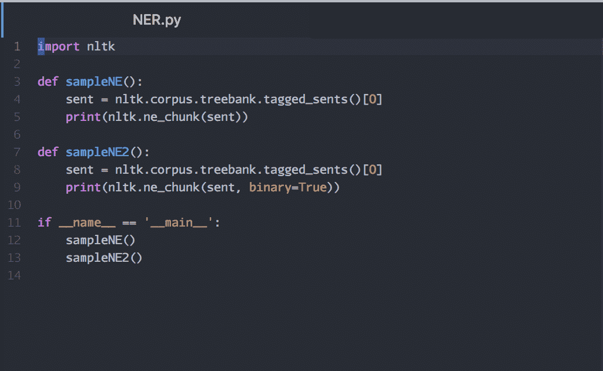

1.  保存文件。

1.  使用 Python 解释器运行程序。

1.  你将看到以下输出：

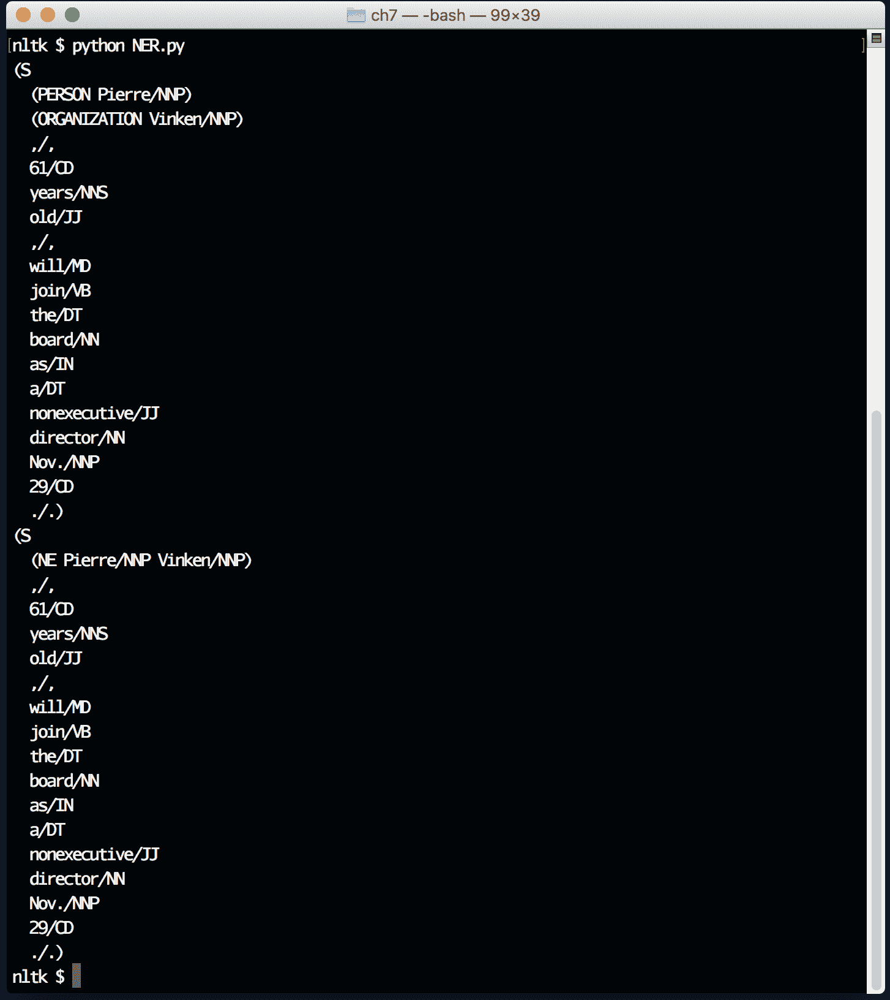

# 它是如何工作的...

代码看起来很简单，对吧？然而，所有的算法都在`nltk`库中实现。那么，让我们深入了解这个简单的程序是如何提供我们所需结果的。这个指令将`nltk`库导入到程序中：

```py
import nltk
```

这三个指令定义了一个名为`sampleNE()`的新函数。我们从`treebank`语料库中导入第一个已标记的句子，然后将其传递给`nltk.ne_chunk()`函数以提取命名实体。此程序的输出包括所有命名实体及其正确的类别：

```py
def sampleNE():
  sent = nltk.corpus.treebank.tagged_sents()[0]
  print(nltk.ne_chunk(sent))
```

这三个指令定义了一个名为`sampleNE2()`的新函数。我们从`treebank`语料库中导入第一个已标记的句子，然后将其传递给`nltk.ne_chunk()`函数以提取命名实体。此程序的输出包括所有命名实体，但没有正确的类别。如果训练数据集不够准确，无法为命名实体分配正确的类别（如人名、组织、地点等），这非常有帮助：

```py
def sampleNE2():
  sent = nltk.corpus.treebank.tagged_sents()[0]
  print(nltk.ne_chunk(sent, binary=True))
```

这三条指令将调用之前定义的两个示例函数，并在屏幕上打印结果。

```py
if __name__ == '__main__':
  sampleNE()
  sampleNE2()
```

# 创建、反转和使用字典

作为一种通用编程语言，Python 支持许多内置的数据结构。其中，最强大的数据结构之一就是字典。在我们深入了解字典之前，先来看看这些数据结构的用途。简而言之，数据结构帮助程序员存储、检索和遍历存储在这些结构中的数据。每种数据结构都有自己的一组行为和性能优势，程序员应在为特定任务选择数据结构之前理解这些特点。

让我们回到字典。字典的基本用例可以通过一个简单的例子来解释：

```py
All the flights got delayed due to bad weather
```

我们可以对前面的句子使用词性识别。但是，如果有人问在这个句子中`flights`的词性是什么，我们应该有一个高效的方式来查找这个词。这就是字典的作用。字典可以看作是**一对一**的数据映射关系。同样，这个一对一映射是在我们讨论的数据单元的最高抽象层次。如果你是 Python 专家，你也知道如何实现**多对多**映射。在这个简单的例子中，我们需要像这样的东西：

```py
flights -> Noun
Weather -> Noun
```

现在让我们回答一个不同的问题。是否可以打印句子中所有名词的单词列表？是的，对于这个问题，我们也将学习如何使用 Python 字典。

# 准备工作

你需要安装 Python 和`nltk`库，才能运行这个示例。

# 如何做……

1.  打开 Atom 编辑器（或你喜欢的编程编辑器）。

1.  创建一个名为`Dictionary.py`的新文件。

1.  输入以下源代码：

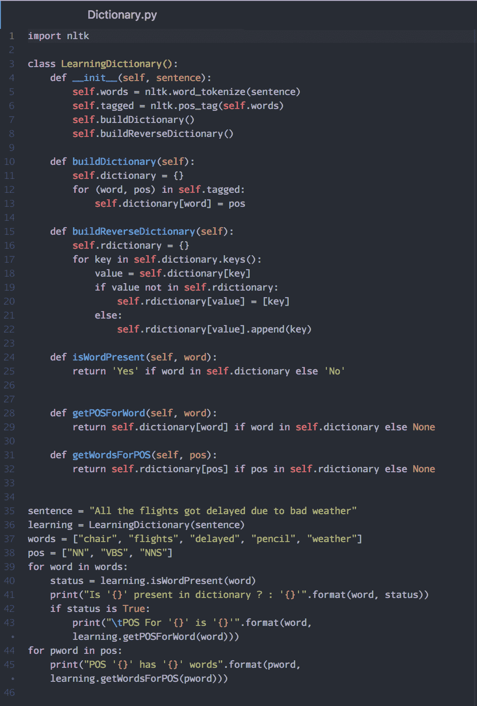

1.  保存文件。

1.  使用 Python 解释器运行程序。

1.  你将看到以下输出：

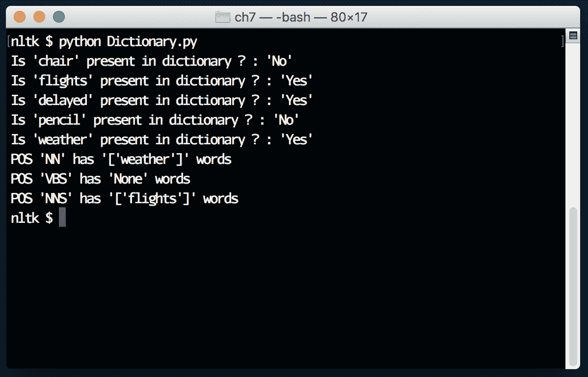

# 它是如何工作的……

现在，让我们通过回顾我们迄今为止写的指令，更深入地理解字典。我们正在将`nltk`库导入程序：

```py
import nltk
```

我们正在定义一个名为`LearningDictionary`的新类：

```py
class LearningDictionary():
```

我们正在为`LearningDictionary`创建一个构造函数，该函数接受`sentence`文本作为参数：

```py
def __init__(self, sentence):
```

该指令使用`nltk.word_tokenize()`函数将句子分解为单词，并将结果保存在类成员`words`中：

```py
self.words = nltk.word_tokenize(sentence)
```

该指令识别`words`的词性并将结果保存在标记的类成员中：

```py
self.tagged = nltk.pos_tag(self.words)
```

该指令调用了在类中定义的`buildDictionary()`函数：

```py
self.buildDictionary()
```

该指令调用了在类中定义的`buildReverseDictionary()`函数：

```py
 self.buildReverseDictionary()
```

该指令定义了一个新的类成员函数，名为`buildDictionary()`*：*

```py
 def buildDictionary(self):
```

这条指令在类中初始化一个空的`dictionary`变量。这两条指令遍历所有的标记过的`pos`列表元素，然后将每个`word`作为键，词性（POS）作为值，赋值给`dictionary`：

```py
self.dictionary = {}
for (word, pos) in self.tagged:
  self.dictionary[word] = pos
```

这条指令定义了另一个类成员函数，名为`buildReverseDictionary()`：

```py
def buildReverseDictionary(self):
```

这条指令将一个空的`dictionary`初始化为类成员`rdictionary`：

```py
self.rdictionary = {}
```

这条指令遍历所有的`dictionary`键，并将`dictionary`中的键放入一个名为`key`的局部变量中：

```py
 for key in self.dictionary.keys():
```

这条指令提取给定`key`（词）对应的`value`（词性），并将其存储在名为`value`的局部变量中：

```py
value = self.dictionary[key]
```

这四条指令检查给定的`key`（词）是否已存在于反向字典变量（`rdictionary`）中。如果存在，那么我们将当前找到的词添加到列表中。如果没有找到该词，我们会创建一个大小为 1 的新列表，将当前词作为成员：

```py
if value not in self.rdictionary:
  self.rdictionary[value] = [key]
else:
  self.rdictionary[value].append(key)
```

该函数返回`Yes`或`No`，取决于给定的词是否在`dictionary`中找到：

```py
def isWordPresent(self, word):
  return 'Yes' if word in self.dictionary else 'No'
```

该函数通过查阅`dictionary`返回给定词的词性。如果未找到该词性，则返回一个特殊值`None`。

```py
def getPOSForWord(self, word):
  return self.dictionary[word] if word in self.dictionary else None
```

这两条指令定义了一个函数，该函数通过查阅`rdictionary`（反向字典）返回给定词性（POS）下的所有词。如果未找到该词性，则返回一个特殊值`None`：

```py
def getWordsForPOS(self, pos):
  return self.rdictionary[pos] if pos in self.rdictionary else None
```

我们定义了一个名为`sentence`的变量，用来存储我们感兴趣的待解析字符串：

```py
sentence = "All the flights got delayed due to bad weather"
```

使用`sentence`作为参数初始化`LearningDictionary()`类。一旦类对象创建，它会被赋值给学习变量：

```py
learning = LearningDictionary(sentence)
```

我们创建一个`words`列表，用来查看我们感兴趣的词的词性。如果你仔细观察，我们已经包括了一些不在句子中的词：

```py
words = ["chair", "flights", "delayed", "pencil", "weather"]
```

我们创建一个`pos`列表，用来查看属于这些词性分类的词：

```py
pos = ["NN", "VBS", "NNS"]
```

这些指令遍历所有的`words`，一次处理一个`word`，通过调用对象的`isWordPresent()`函数检查该`word`是否在字典中，然后打印其状态。如果该`word`在字典中存在，那么我们会打印该词的词性（POS）：

```py
for word in words:
  status = learning.isWordPresent(word)
  print("Is '{}' present in dictionary ? : '{}'".format(word, status))
  if status is True:
    print("\tPOS For '{}' is '{}'".format(word, learning.getPOSForWord(word)))
```

在这些指令中，我们遍历所有的`pos`。我们一次处理一个词，然后使用`getWordsForPOS()`函数打印出属于该词性（POS）的所有词：

```py
for pword in pos:
  print("POS '{}' has '{}' words".format(pword, learning.getWordsForPOS(pword)))
```

# 选择特征集

特征是`nltk`库中最强大的组件之一。它们代表了语言中的线索，有助于我们轻松标记正在处理的数据。在 Python 术语中，特征表现为字典，字典中的键是标签，值是从输入数据中提取的线索。

假设我们正在处理一些交通部门的数据，并且我们想知道某个给定的车辆号是否属于卡纳塔克邦政府。现在我们对正在处理的数据毫无头绪。那么我们该如何准确地标记这些号码呢？

让我们尝试学习车辆编号如何提供一些线索来帮助理解它们的含义：

| **车辆编号** | **关于模式的线索** |
| --- | --- |
| **KA-[0-9]{2} [0-9]{2}** | 普通车辆编号 |
| **KA-[0-9]{2}-F** | KSRTC, BMTC 车辆 |
| **KA-[0-9]{2}-G** | 政府车辆 |

使用这些线索（特征），让我们尝试编写一个简单的程序，告诉我们给定输入编号的分类。

# 准备就绪

你应该已经安装了 Python，并且安装了`nltk`库。

# 如何操作...

1.  打开 Atom 编辑器（或你喜欢的编程编辑器）。

1.  创建一个名为`Features.py`的新文件。

1.  输入以下源代码：

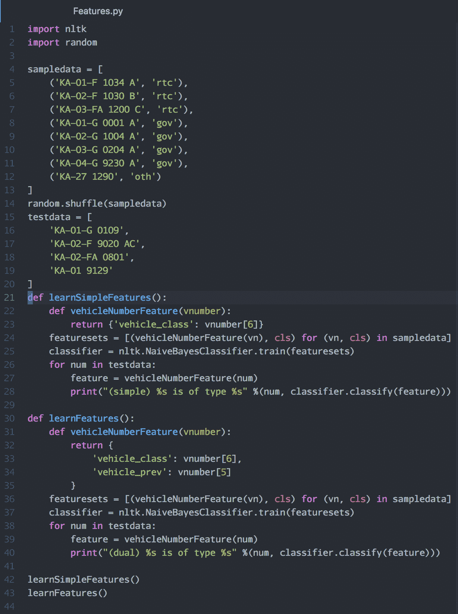

1.  保存文件。

1.  使用 Python 解释器运行程序。

1.  你将看到以下输出：

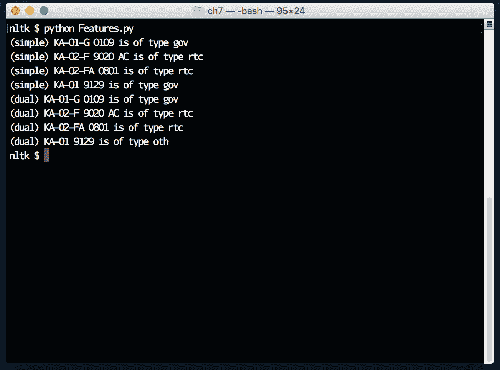

# 它是如何工作的...

现在，让我们看看程序的表现。这两条指令将`nltk`和`random`库导入当前程序：

```py
import nltk
import random
```

我们正在定义一个 Python 元组的列表，其中元组的第一个元素是车辆编号，第二个元素是预定义的标签，应用于该编号。

这些指令定义了所有编号被分类为三种标签——`rtc`，`gov`，和`oth`：

```py
sampledata = [
  ('KA-01-F 1034 A', 'rtc'),
  ('KA-02-F 1030 B', 'rtc'),
  ('KA-03-FA 1200 C', 'rtc'),
  ('KA-01-G 0001 A', 'gov'),
  ('KA-02-G 1004 A', 'gov'),
  ('KA-03-G 0204 A', 'gov'),
  ('KA-04-G 9230 A', 'gov'),
  ('KA-27 1290', 'oth')
]
```

这条指令将`sampledata`列表中的所有数据打乱，以确保算法不会因为输入序列中元素的顺序而产生偏差：

```py
random.shuffle(sampledata)
```

这些是我们感兴趣的测试车辆编号，目的是查找其类别：

```py
testdata = [
  'KA-01-G 0109',
  'KA-02-F 9020 AC',
  'KA-02-FA 0801',
  'KA-01 9129'
]
```

这条指令定义了一个名为`learnSimpleFeatures`的新函数：

```py
def learnSimpleFeatures():
```

这些指令定义了一个新函数`vehicleNumberFeature()`，它接受车辆编号并返回该编号中的第七个字符。返回类型为`dictionary`：

```py
def vehicleNumberFeature(vnumber):
  return {'vehicle_class': vnumber[6]}
```

这条指令创建了一个特征元组的列表，其中元组的第一个成员是特征字典，第二个成员是数据的标签。执行此指令后，`sampledata`中的输入车辆编号将不再可见。这是需要记住的关键点之一：

```py
featuresets = [(vehicleNumberFeature(vn), cls) for (vn, cls) in sampledata]
```

这条指令使用特征字典和应用于`featuresets`的标签来训练`NaiveBayesClassifier`。结果保存在分类器对象中，我们将进一步使用它：

```py
classifier = nltk.NaiveBayesClassifier.train(featuresets)
```

这些指令遍历测试数据，然后打印通过`vehicleNumberFeature`分类得到的标签。仔细观察输出，你会看到我们编写的特征提取函数在正确标记数字方面表现不佳：

```py
for num in testdata:
  feature = vehicleNumberFeature(num)
  print("(simple) %s is of type %s" %(num, classifier.classify(feature)))
```

这条指令定义了一个名为`learnFeatures`的新函数：

```py
def learnFeatures():
```

这些指令定义了一个新函数`vehicleNumberFeature`，它返回包含两个键的特征字典。一个键`vehicle_class`返回字符串中位置为`6`的字符，`vehicle_prev`返回位置为`5`的字符。这些线索对于确保我们消除数据错误标签非常重要：

```py
def vehicleNumberFeature(vnumber):
  return {
    'vehicle_class': vnumber[6],
    'vehicle_prev': vnumber[5]
  }
```

该指令通过迭代所有输入的训练数据，创建一个`featuresets`列表和输入标签。和之前一样，原始输入的车辆编号在这里已经不再出现：

```py
featuresets = [(vehicleNumberFeature(vn), cls) for (vn, cls) in sampledata]
```

该指令在`featuresets`上创建了一个`NaiveBayesClassifier.train()`函数，并返回该对象供将来使用：

```py
classifier = nltk.NaiveBayesClassifier.train(featuresets)
```

这些指令遍历`testdata`并根据训练好的数据集打印输入的车辆号码的分类情况。在这里，如果仔细观察，你会发现假阳性已经没有了：

```py
for num in testdata:
  feature = vehicleNumberFeature(num)
  print("(dual) %s is of type %s" %(num, classifier.classify(feature)))
```

调用这两个函数并打印结果到屏幕上。

```py
learnSimpleFeatures()
learnFeatures()
```

如果我们仔细观察，会发现第一个函数的结果有一个假阳性，无法识别`gov`车辆。这就是第二个函数表现良好的地方，因为它有更多特征来提高准确性。

# 使用分类进行句子分割

支持问号（?）、句号（.）和感叹号（!）的自然语言在识别一个陈述是否已经结束，或在标点符号后是否还会继续时给我们带来了挑战。

这是一个经典的待解决问题。

为了解决这个问题，让我们找出可以利用的特征（或线索），以便创建一个分类器，然后使用该分类器在大文本中提取句子。

如果我们遇到像`.`这样的标点符号，则表示句子结束。如果我们遇到像`.`这样的标点符号，并且下一个单词的首字母是大写字母，那么它也表示句子结束。

让我们尝试使用这两个特征编写一个简单的分类器来标记句子。

# 准备就绪

你应该已经安装了 Python，并且安装了`nltk`库。

# 如何操作...

1.  打开 Atom 编辑器（或你喜欢的编程编辑器）。

1.  创建一个名为`Segmentation.py`的新文件。

1.  输入以下源代码：

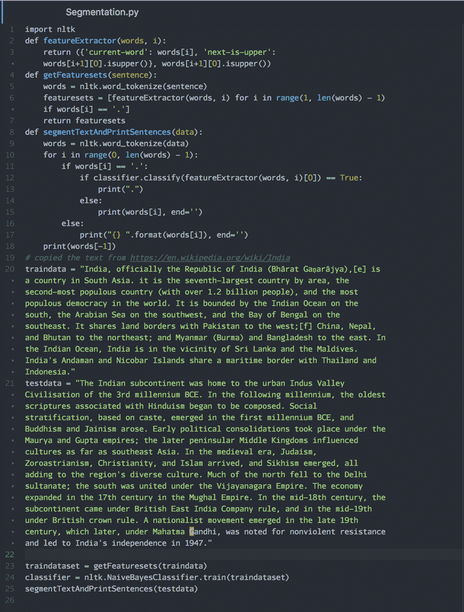

1.  保存文件。

1.  使用 Python 解释器运行程序。

1.  你将看到以下输出：

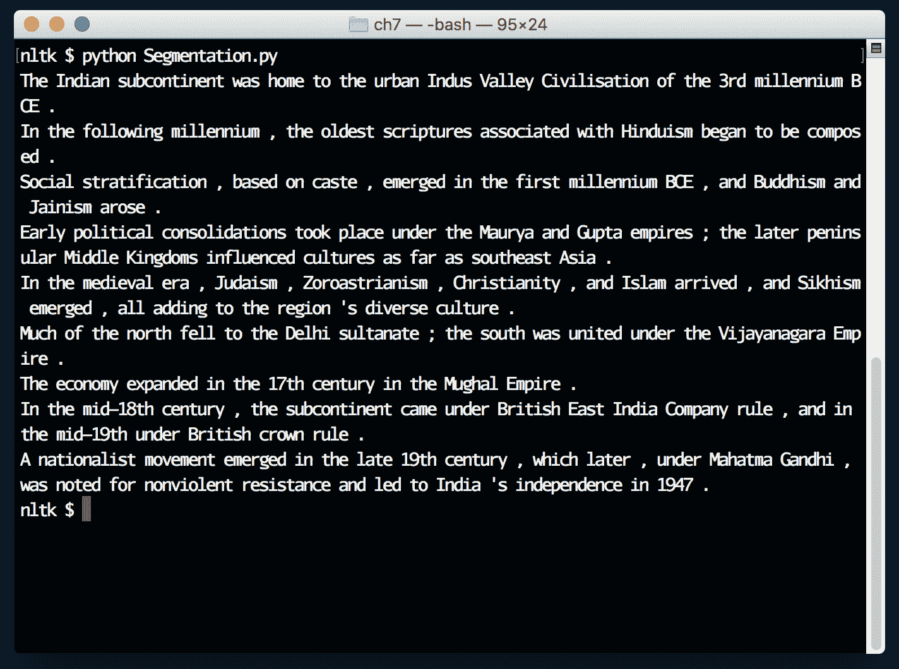

# 它是如何工作的...

该指令将`nltk`库导入到程序中：

```py
import nltk
```

这个函数定义了一个修改过的特征提取器，它返回一个包含特征字典的元组，并通过`True`或`False`来告诉我们该特征是否表示句子边界：

```py
def featureExtractor(words, i):
    return ({'current-word': words[i], 'next-is-upper': words[i+1][0].isupper()}, words[i+1][0].isupper())
```

这个函数以`sentence`作为输入，并返回一个`featuresets`列表，`featuresets`是一个包含特征字典和`True`或`False`的元组列表：

```py
def getFeaturesets(sentence):
  words = nltk.word_tokenize(sentence)
  featuresets = [featureExtractor(words, i) for i in range(1, len(words) - 1) if words[i] == '.']
  return featuresets
```

这个函数接收输入文本，将其拆分为单词，然后遍历列表中的每个单词。一旦遇到句号，它会调用`classifier`来判断是否遇到了句子结束。如果`classifier`返回`True`，则表示句子结束，我们继续处理输入中的下一个单词。这个过程会对输入中的所有单词重复：

```py
def segmentTextAndPrintSentences(data):
  words = nltk.word_tokenize(data)
  for i in range(0, len(words) - 1):
    if words[i] == '.':
      if classifier.classify(featureExtractor(words, i)[0]) == True:
        print(".")
      else:
        print(words[i], end='')
    else:
      print("{} ".format(words[i]), end='')
    print(words[-1])
```

这些指令定义了一些变量，用于训练和评估我们的分类器：

```py
# copied the text from https://en.wikipedia.org/wiki/India
traindata = "India, officially the Republic of India (Bhārat Gaṇarājya),[e] is a country in South Asia. it is the seventh-largest country by area, the second-most populous country (with over 1.2 billion people), and the most populous democracy in the world. It is bounded by the Indian Ocean on the south, the Arabian Sea on the southwest, and the Bay of Bengal on the southeast. It shares land borders with Pakistan to the west;[f] China, Nepal, and Bhutan to the northeast; and Myanmar (Burma) and Bangladesh to the east. In the Indian Ocean, India is in the vicinity of Sri Lanka and the Maldives. India's Andaman and Nicobar Islands share a maritime border with Thailand and Indonesia."

testdata = "The Indian subcontinent was home to the urban Indus Valley Civilisation of the 3rd millennium BCE. In the following millennium, the oldest scriptures associated with Hinduism began to be composed. Social stratification, based on caste, emerged in the first millennium BCE, and Buddhism and Jainism arose. Early political consolidations took place under the Maurya and Gupta empires; the later peninsular Middle Kingdoms influenced cultures as far as southeast Asia. In the medieval era, Judaism, Zoroastrianism, Christianity, and Islam arrived, and Sikhism emerged, all adding to the region's diverse culture. Much of the north fell to the Delhi sultanate; the south was united under the Vijayanagara Empire. The economy expanded in the 17th century in the Mughal Empire. In the mid-18th century, the subcontinent came under British East India Company rule, and in the mid-19th under British crown rule. A nationalist movement emerged in the late 19th century, which later, under Mahatma Gandhi, was noted for nonviolent resistance and led to India's independence in 1947."
```

提取所有来自`traindata`变量的特征并存储到`traindataset`中：

```py
traindataset = getFeaturesets(traindata)
```

在 `traindataset` 上训练 `NaiveBayesClassifier`，以获得作为对象的 `classifier`：

```py
classifier = nltk.NaiveBayesClassifier.train(traindataset)
```

对 `testdata` 调用该函数，并将所有找到的句子作为输出显示在屏幕上：

```py
segmentTextAndPrintSentences(testdata)
```

# 分类文档

在这个教程中，我们将学习如何编写一个分类器，用于对文档进行分类。在我们的案例中，我们将分类**丰富站点摘要**（**RSS**）订阅源。类别列表是预先确定的，这对分类任务非常重要。

在这个信息时代，有大量的文本数据。对于我们人类来说，正确分类所有信息以供进一步使用几乎是不可能的。这时，分类算法帮助我们根据在示例数据上的训练，正确地分类新产生的文档。

# 准备开始

你需要安装 Python，并且安装 `nltk` 和 `feedparser` 库。

# 如何操作...

1.  打开 Atom 编辑器（或你喜欢的编程编辑器）。

1.  创建一个名为 `DocumentClassify.py` 的新文件。

1.  输入以下源代码：

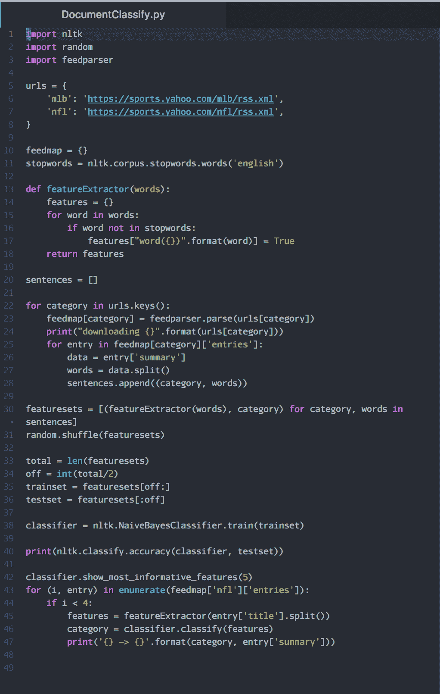

1.  保存文件。

1.  使用 Python 解释器运行程序。

1.  你将看到如下输出：

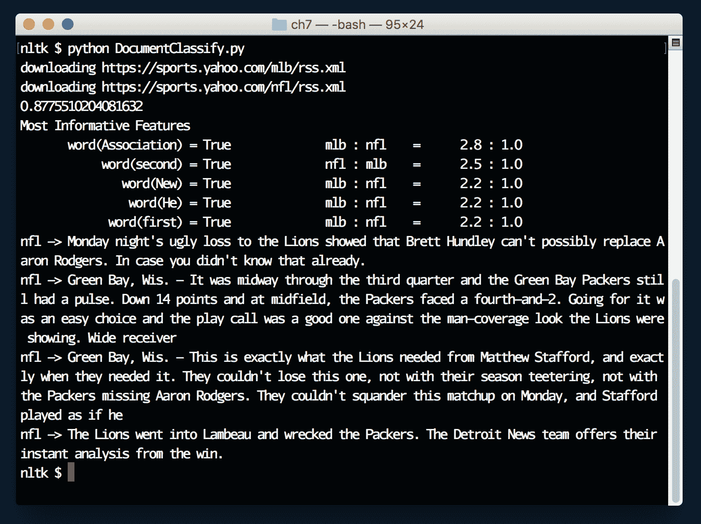

# 它是如何工作的...

让我们看看文档分类是如何工作的。将三个库导入程序：

```py
import nltk
import random
import feedparser
```

该指令定义了一个新字典，包含指向 Yahoo! 体育的两个 RSS 订阅源。它们是预分类的。我们选择这些 RSS 订阅源的原因是数据易于获取，并且已经为我们的示例进行分类：

```py
urls = {
  'mlb': 'https://sports.yahoo.com/mlb/rss.xml',
  'nfl': 'https://sports.yahoo.com/nfl/rss.xml',
}
```

初始化空字典变量 `feedmap`，以便在程序终止之前将 RSS 订阅源列表保存在内存中：

```py
feedmap = {}
```

获取英文的 `stopwords` 列表并将其存储在 `stopwords` 变量中：

```py
stopwords = nltk.corpus.stopwords.words('english')
```

这个函数 `featureExtractor()` 接收一个单词列表，然后将它们添加到字典中，其中每个键是单词，值为 `True`。返回的字典即为给定输入 `words` 的特征：

```py
def featureExtractor(words):
  features = {}
  for word in words:
    if word not in stopwords:
      features["word({})".format(word)] = True
    return features
```

创建一个空列表，用于存储所有正确标记的 `sentences`：

```py
sentences = []
```

遍历字典 `urls` 的所有 `keys()`，并将每个键存储在名为 `category` 的变量中：

```py
for category in urls.keys():
```

下载一个订阅源，并使用 `feedparser` 模块的 `parse()` 函数将结果存储在 `feedmap[category]` 变量中：

```py
feedmap[category] = feedparser.parse(urls[category])
```

使用 Python 内置的 `print` 函数在屏幕上显示正在下载的 `url`：

```py
print("downloading {}".format(urls[category]))
```

遍历所有的 RSS 条目，并将当前条目存储在一个名为 `entry` 的变量中：

```py
for entry in feedmap[category]['entries']:
```

将 RSS 订阅源项目的 `summary`（新闻文本）存入 `data` 变量：

```py
data = entry['summary']
```

我们根据空格将 `summary` 分解成 `words`，以便可以将它们传递给 `nltk` 进行特征提取：

```py
words = data.split()
```

将当前 RSS 订阅源条目中的所有 `words` 以及它所属的 `category` 存储在一个元组中：

```py
sentences.append((category, words))
```

提取所有 `sentences` 的特征并将其存储在 `featuresets` 变量中。然后，对该数组进行 `shuffle()` 操作，使列表中的所有元素都被随机化，以便算法使用：

```py
featuresets = [(featureExtractor(words), category) for category, words in sentences]
random.shuffle(featuresets)
```

创建两个数据集，一个是`trainset`，另一个是`testset`，用于我们的分析：

```py
total = len(featuresets)
off = int(total/2)
trainset = featuresets[off:]
testset = featuresets[:off]
```

使用`NaiveBayesClassifier`模块的`train()`函数，通过`trainset`数据创建一个`classifier`：

```py
classifier = nltk.NaiveBayesClassifier.train(trainset)
```

使用`testset`打印`classifier`的准确度：

```py
print(nltk.classify.accuracy(classifier, testset))
```

使用`classifier`的内置函数打印此数据的有用特征：

```py
classifier.show_most_informative_features(5)
```

从`nfl` RSS 项中取四个样本条目。尝试根据`title`标记文档（记住，我们是基于`summary`进行分类的）：

```py
for (i, entry) in enumerate(feedmap['nfl']['entries']):
  if i < 4:
    features = featureExtractor(entry['title'].split())
    category = classifier.classify(features)
    print('{} -> {}'.format(category, entry['title']))
```

# 编写一个带有上下文的词性标注器

在之前的例子中，我们已经编写了基于正则表达式的词性标注器，利用单词后缀如*ed*、*ing*等检查单词是否属于给定的词性。在英语中，同一个单词可以根据上下文扮演不同的角色。

例如，单词`address`可以根据上下文既是名词，也可以是动词：

```py
"What is your address when you're in Bangalore?"
"the president's address on the state of the economy."
```

让我们尝试编写一个利用特征提取概念来找出句子中单词词性的程序。

# 准备工作

你应该已经安装了 Python，并且安装了`nltk`。

# 如何做到这一点…

1.  打开 Atom 编辑器（或你喜欢的编程编辑器）。

1.  创建一个名为`ContextTagger.py`的新文件。

1.  输入以下源代码：

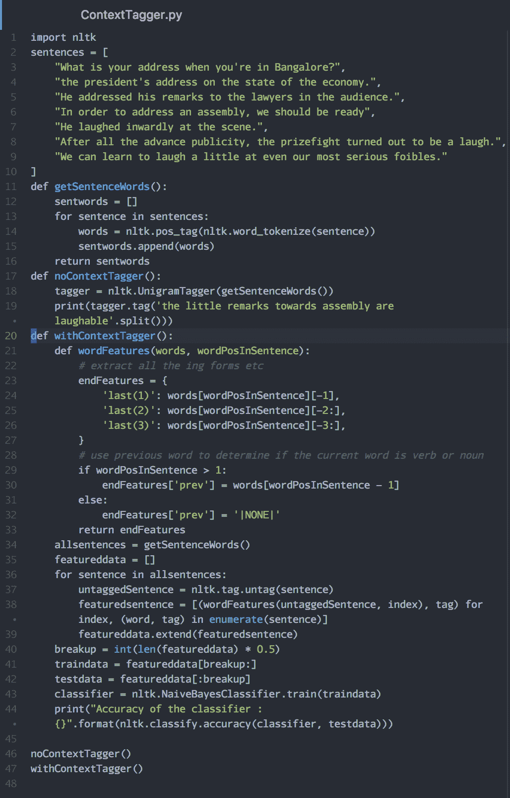

1.  保存文件。

1.  使用 Python 解释器运行程序。

1.  你将看到以下输出：

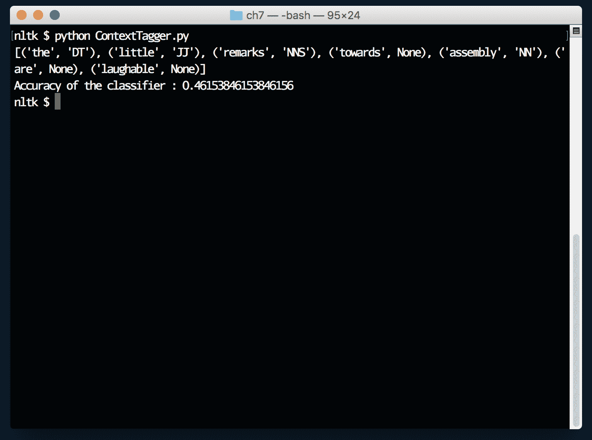

# 它是如何工作的…

让我们看看当前程序是如何工作的。这个指令将`nltk`库导入到程序中：

```py
import nltk
```

一些样本字符串，表示单词`address`、`laugh`的双重行为：

```py

sentences = [
  "What is your address when you're in Bangalore?",
  "the president's address on the state of the economy.",
  "He addressed his remarks to the lawyers in the audience.",
  "In order to address an assembly, we should be ready",
  "He laughed inwardly at the scene.",
  "After all the advance publicity, the prizefight turned out to be a laugh.",
  "We can learn to laugh a little at even our most serious foibles."
]
```

这个函数接受`sentence`字符串并返回一个包含词汇及其词性标签的列表的列表：

```py

def getSentenceWords():
  sentwords = []
  for sentence in sentences:
    words = nltk.pos_tag(nltk.word_tokenize(sentence))
    sentwords.append(words)
    return sentwords

```

为了设立基准并看看标签的准确度有多差，这个函数解释了如何使用`UnigramTagger`仅通过查看当前单词来打印单词的词性。我们将样本文本输入作为学习。与`nltk`自带的内置标注器相比，这个`tagger`的表现非常差。但这只是为了帮助我们理解：

```py

def noContextTagger():
  tagger = nltk.UnigramTagger(getSentenceWords())
  print(tagger.tag('the little remarks towards assembly are laughable'.split()))
```

定义一个名为`withContextTagger()`的新函数：

```py

def withContextTagger():
```

这个函数对给定的一组单词进行特征提取，并返回一个字典，包含当前单词和前一个单词的最后三个字符信息：

```py
def wordFeatures(words, wordPosInSentence):
  # extract all the ing forms etc
  endFeatures = {
    'last(1)': words[wordPosInSentence][-1],
    'last(2)': words[wordPosInSentence][-2:],
    'last(3)': words[wordPosInSentence][-3:],
  }
  # use previous word to determine if the current word is verb or noun
  if wordPosInSentence > 1:
    endFeatures['prev'] = words[wordPosInSentence - 1]
  else:
    endFeatures['prev'] = '|NONE|'
    return endFeatures
```

我们正在构建一个`featuredata`列表。它包含`featurelist`和`tag`成员的元组，我们将使用它们通过`NaiveBayesClassifier`进行分类：

```py
allsentences = getSentenceWords()
featureddata = []
for sentence in allsentences:
  untaggedSentence = nltk.tag.untag(sentence)
  featuredsentence = [(wordFeatures(untaggedSentence, index), tag) for index, (word, tag) in enumerate(sentence)]
  featureddata.extend(featuredsentence)
```

我们将 50%的数据用于训练，另外 50%的特征提取数据用于测试分类器：

```py
breakup = int(len(featureddata) * 0.5)
traindata = featureddata[breakup:]
testdata = featureddata[:breakup]
```

这个指令使用训练数据创建`classifier`：

```py
classifier = nltk.NaiveBayesClassifier.train(traindata)
```

这个指令使用`testdata`打印分类器的准确度：

```py
print("Accuracy of the classifier : {}".format(nltk.classify.accuracy(classifier, testdata)))
```

这两个函数打印前面两个函数计算的结果。

```py
noContextTagger()
withContextTagger()
```
