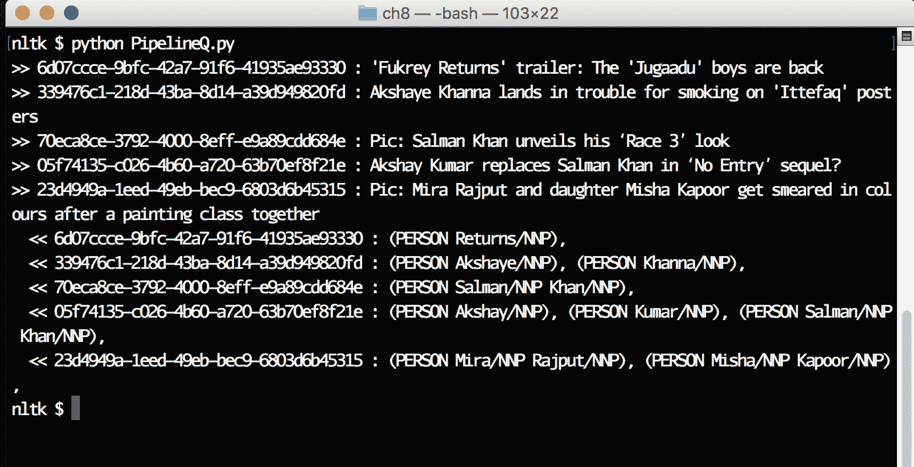

# 第八章：高级 NLP 示例

本章我们将讨论以下几种方法：

+   创建一个 NLP 管道

+   解决文本相似性问题

+   识别话题

+   摘要文本

+   解决指代问题

+   解决词义歧义

+   执行情感分析

+   探索高级情感分析

+   创建一个对话助手或聊天机器人

# 简介

到目前为止，我们已经了解了如何处理输入文本、识别词性以及提取重要信息（命名实体）。我们还学到了一些计算机科学的概念，如语法、解析器等等。在本章中，我们将深入探讨**自然语言处理**（**NLP**）中的高级话题，这些话题需要多种技术才能正确理解和解决。

# 创建一个 NLP 管道

在计算中，管道可以被看作是一个多阶段的数据流系统，其中一个组件的输出作为另一个组件的输入。

以下是管道中发生的事情：

+   数据始终在一个组件到另一个组件之间流动

+   组件是一个黑箱，应该关注输入数据和输出数据

一个明确的管道需要处理以下几件事：

+   每个组件中流动的数据的输入格式

+   每个组件输出的数据格式

+   确保通过调整数据流入和流出速度来控制组件之间的数据流动

例如，如果你熟悉 Unix/Linux 系统，并且对在 shell 中工作有一些接触，你会看到|运算符，它是 shell 的数据管道抽象。我们可以利用|运算符在 Unix shell 中构建管道。

让我们通过一个 Unix 的例子来快速理解：如何在给定目录中查找文件数量？

为了解决这个问题，我们需要以下几件事：

+   我们需要一个组件（或在 Unix 中是一个命令），它读取目录并列出其中的所有文件

+   我们需要另一个组件（或在 Unix 中是一个命令），它读取行并打印行数

所以，我们已经解决了这两个需求。它们是：

+   `ls` 命令

+   `wc` 命令

如果我们能构建一个管道，将`ls`的输出传递给`wc`，那么我们就完成了。

在 Unix 命令中，`ls -l | wc -l` 是一个简单的管道，用来计算目录中的文件数量。

有了这些知识，让我们回到 NLP 管道的需求：

+   输入数据获取

+   将输入数据分割成单词

+   识别输入数据中单词的词性

+   从单词中提取命名实体

+   识别命名实体之间的关系

在这个例子中，我们将尝试构建一个最简单的管道；它从远程 RSS 源获取数据，并打印每个文档中识别出的命名实体。

# 准备工作

你应该安装 Python，并且安装`nltk`、`queue`、`feedparser`和`uuid`库。

# 如何实现...

1.  打开 Atom 编辑器（或你喜欢的编程编辑器）。

1.  创建一个名为`PipelineQ.py`的新文件。

1.  输入以下源代码：


1.  保存文件。

1.  使用 Python 解释器运行程序。

1.  你将看到这个输出：



# 它是如何工作的...

让我们看看如何构建这个管道：

```py
import nltk
import threading
import queue
import feedparser
import uuid
```

这五个指令将五个 Python 库导入当前程序：

+   `nltk`: 自然语言工具包

+   `threading`: 用于在单个程序中创建轻量级任务的线程库

+   `queue`: 可在多线程程序中使用的队列库

+   `feedparser`: 一个 RSS 源解析库

+   `uuid`: 基于 RFC-4122 的 uuid 版本 1、3、4、5 生成库

```py
threads = []
```

创建一个新的空列表，用于跟踪程序中的所有线程：

```py
queues = [queue.Queue(), queue.Queue()]
```

该指令在变量`queue`中创建一个包含两个队列的列表？

为什么我们需要两个队列：

+   第一个队列用于存储分词后的句子

+   第二个队列用于存储所有已分析的词性（POS）词语

该指令定义了一个新函数`extractWords()`，该函数从互联网读取一个示例 RSS 源，并存储这些单词以及该文本的唯一标识符：

```py
def extractWords():
```

我们正在定义一个来自印度时报网站的示例 URL（娱乐新闻）：

```py
url = 'https://timesofindia.indiatimes.com/rssfeeds/1081479906.cms'
```

该指令调用了`feedparser`库的`parse()`函数。这个`parse()`函数下载 URL 的内容并将其转换为新闻条目列表。每个新闻条目是一个包含标题和摘要键的字典：

```py
feed = feedparser.parse(url)
```

我们从 RSS 源中取出前五条条目，并将当前条目存储在一个名为`entry`的变量中：

```py
for entry in feed['entries'][:5]:
```

当前 RSS 源条目的标题存储在一个名为`text`的变量中：

```py
text = entry['title']
```

该指令跳过包含敏感词的标题。由于我们从互联网上读取数据，因此我们必须确保数据已正确清理：

```py
if 'ex' in text:
  continue
```

使用`word_tokenize()`函数将输入文本分解为单词，并将结果存储在一个名为`words`的变量中：

```py
words = nltk.word_tokenize(text)
```

创建一个名为`data`的字典，其中包含两个键值对，我们分别将 UUID 和输入词存储在 UUID 和 input 键下：

```py
data = {'uuid': uuid.uuid4(), 'input': words}
```

该指令将字典存储在第一个队列`queues[0]`中。第二个参数设置为 true，这表示如果队列已满，则暂停线程：

```py
queues[0].put(data, True)
```

一个设计良好的管道应该根据组件的计算能力来控制数据的流入和流出。如果不这样，整个管道会崩溃。此指令打印出我们正在处理的当前 RSS 项以及其唯一 ID：

```py
print(">> {} : {}".format(data['uuid'], text))
```

该指令定义了一个名为`extractPOS()`的新函数，该函数从第一个队列读取数据，处理数据，并将词性的词存储在第二个队列中：

```py
def extractPOS():
```

这是一个无限循环：

```py
while True:
```

这些指令检查第一个队列是否为空。当队列为空时，我们停止处理：

```py
if queues[0].empty():
  break
```

为了使程序更健壮，传递来自第一个队列的反馈。这个部分留给读者练习。这是`else`部分，表示第一个队列中有数据：

```py
else:
```

从队列中取出第一个项目（按 FIFO 顺序）：

```py
data = queues[0].get()
```

识别单词中的词性：

```py
words = data['input']
postags = nltk.pos_tag(words)
```

更新第一个队列，表明我们已完成处理刚刚由该线程提取的项目：

```py
queues[0].task_done()
```

将带有词性标注的单词列表存储到第二个队列中，以便管道的下一阶段执行。在这里，我们也使用了`true`作为第二个参数，这将确保如果队列中没有空闲空间，线程会等待：

```py
queues[1].put({'uuid': data['uuid'], 'input': postags}, True)
```

该指令定义了一个新函数，`extractNE()`，它从第二个队列读取，处理带有词性标注的单词，并在屏幕上打印命名实体：

```py
def extractNE():
```

这是一个无限循环指令：

```py
while True:
```

如果第二个队列为空，则退出无限循环：

```py
if queues[1].empty():
  break
```

该指令从第二个队列中选取一个元素，并将其存储在一个数据变量中：

```py
else:
  data = queues[1].get()
```

该指令标记从第二个队列刚刚选取的元素的数据处理完成：

```py
postags = data['input']
queues[1].task_done()
```

该指令从`postags`变量中提取命名实体，并将其存储在名为`chunks`的变量中：

```py
chunks = nltk.ne_chunk(postags, binary=False)

print("  << {} : ".format(data['uuid']), end = '')
  for path in chunks:
    try:
      label = path.label()
      print(path, end=', ')
      except:
        pass
      print()
```

这些指令执行以下操作：

+   打印数据字典中的 UUID

+   遍历所有已识别的语法块：

+   我们使用了一个`try/except`块，因为树中的并非所有元素都有`label()`函数（当没有找到命名实体时，它们是元组）：

+   最后，我们调用一个`print()`函数，它在屏幕上打印一个换行符：

该指令定义了一个新函数，`runProgram`，它使用线程进行管道设置：

```py
def runProgram():
```

这三条指令使用`extractWords()`作为函数创建一个新线程，启动该线程并将线程对象（`e`）添加到名为`threads`的列表中：

```py
e = threading.Thread(target=extractWords())
e.start()
threads.append(e)
```

这些指令使用`extractPOS()`作为函数创建一个新线程，启动该线程，并将线程对象（`p`）添加到列表变量`threads`中：

```py
p = threading.Thread(target=extractPOS())
p.start()
threads.append(p)
```

这些指令使用`extractNE()`为代码创建一个新线程，启动该线程，并将线程对象（`n`）添加到列表`threads`中：

```py
    n = threading.Thread(target=extractNE())
    n.start()
    threads.append(n)
```

这两条指令在所有处理完成后释放分配给队列的资源：

```py
    queues[0].join()
    queues[1].join()
```

这两条指令遍历线程列表，将当前线程对象存储在变量`t`中，调用`join()`函数以标记线程完成，并释放分配给该线程的资源：

```py
    for t in threads:
        t.join()
```

这是程序在主线程运行时调用的代码部分。调用`runProgram()`，它模拟整个管道：

```py
if __name__ == '__main__':
    runProgram()
```

# 解决文本相似性问题

文本相似性问题涉及到找到给定文本文件之间的相似度。现在，当我们说它们相似时，我们可以从多个维度来判断它们是更接近还是更远：

+   情感/情绪维度

+   感知维度

+   某些单词的存在

有许多可用的算法来解决这个问题；它们在复杂度、所需资源以及我们处理的数据量上各不相同。

在这个配方中，我们将使用 TF-IDF 算法来解决相似度问题。所以首先，让我们理解基础知识：

+   **词频（TF）**：该技术试图找到一个单词在给定文档中的相对重要性（或频率）

由于我们讨论的是相对重要性，通常会将词频归一化，以便与文档中出现的总词数相比，从而计算出单词的 TF 值。

+   **逆文档频率（IDF）**：该技术确保频繁使用的词（如 a、the 等）相对于那些很少使用的词，其权重应更低。

由于 TF 和 IDF 值都被分解为数字（分数），我们将对每个词和每个文档的这两个值进行相乘，并构建*M*个*N*维度的向量（其中*N*是文档的总数，*M*是所有文档中的唯一词汇）。

一旦我们有了这些向量，我们需要使用以下公式计算这些向量之间的余弦相似度：


# 准备工作

你应该安装 Python，并且拥有`nltk`和`scikit`库。对数学有一定了解会更有帮助。

# 如何操作...

1.  打开 Atom 编辑器（或你最喜欢的编程编辑器）。

1.  创建一个名为`Similarity.py`的新文件。

1.  输入以下源代码：


1.  保存文件。

1.  使用 Python 解释器运行程序。

1.  你将看到以下输出：


# 它是如何工作的...

让我们看看如何解决文本相似度问题。这四个指令导入了程序中使用的必要库：

```py
import nltk
import math
from sklearn.feature_extraction.text import TfidfVectorizer
from sklearn.metrics.pairwise import cosine_similarity
```

我们正在定义一个新的类，`TextSimilarityExample`：

```py
class TextSimilarityExample:
```

该指令为类定义了一个新的构造函数：

```py
def __init__(self):
```

该指令定义了我们想要查找相似度的示例句子。

```py
self.statements = [
  'ruled india',
  'Chalukyas ruled Badami',
  'So many kingdoms ruled India',
  'Lalbagh is a botanical garden in India'
]
```

我们正在定义给定句子中所有单词的 TF：

```py
    def TF(self, sentence):
        words = nltk.word_tokenize(sentence.lower())
        freq = nltk.FreqDist(words)
        dictionary = {}
        for key in freq.keys():
            norm = freq[key]/float(len(words))
            dictionary[key] = norm
        return dictionary
```

该函数执行以下操作：

+   将句子转换为小写，并提取所有单词

+   使用 nltk 的`FreqDist`函数查找这些单词的频率分布

+   遍历所有字典键，构建归一化的浮动值，并将它们存储在字典中

+   返回包含句子中每个单词归一化分数的字典。

我们定义了一个 IDF，来查找所有文档中所有单词的 IDF 值：

```py
    def IDF(self):
        def idf(TotalNumberOfDocuments, NumberOfDocumentsWithThisWord):
            return 1.0 + math.log(TotalNumberOfDocuments/NumberOfDocumentsWithThisWord)
        numDocuments = len(self.statements)
        uniqueWords = {}
        idfValues = {}
        for sentence in self.statements:
            for word in nltk.word_tokenize(sentence.lower()):
                if word not in uniqueWords:
                    uniqueWords[word] = 1
                else:
                    uniqueWords[word] += 1
        for word in uniqueWords:
            idfValues[word] = idf(numDocuments, uniqueWords[word])
        return idfValues
```

该函数执行以下操作：

+   我们定义了一个名为`idf()`的局部函数，它是计算给定单词 IDF 值的公式。

+   我们遍历所有语句并将它们转换为小写

+   查找每个单词在所有文档中出现的次数

+   为所有单词构建 IDF 值，并返回包含这些 IDF 值的字典

我们现在正在定义一个`TF_IDF`（TF 乘以 IDF），用于所有文档和给定的搜索字符串。

```py
    def TF_IDF(self, query):
        words = nltk.word_tokenize(query.lower())
        idf = self.IDF()
        vectors = {}
        for sentence in self.statements:
            tf = self.TF(sentence)
            for word in words:
                tfv = tf[word] if word in tf else 0.0
                idfv = idf[word] if word in idf else 0.0
                mul = tfv * idfv
                if word not in vectors:
                    vectors[word] = []
                vectors[word].append(mul)
        return vectors
```

让我们看看我们在这里做了什么：

+   将搜索字符串拆分为词元

+   为`self.statements`变量中的所有句子构建`IDF()`。

+   遍历所有句子，找到该句子中所有单词的 TF

+   过滤并只使用在输入搜索字符串中出现的单词，并构建包含*tf*idf*值的向量，针对每个文档

+   返回搜索查询中每个单词的向量列表

该函数在屏幕上显示向量的内容：

```py
    def displayVectors(self, vectors):
        print(self.statements)
        for word in vectors:
            print("{} -> {}".format(word, vectors[word]))
```

现在，为了找到相似度，正如我们最初讨论的，我们需要在所有输入向量上找到余弦相似度。我们可以自己做所有的数学运算。但这一次，让我们尝试使用 scikit 来为我们做所有的计算。

```py
    def cosineSimilarity(self):
        vec = TfidfVectorizer()
        matrix = vec.fit_transform(self.statements)
        for j in range(1, 5):
            i = j - 1
            print("\tsimilarity of document {} with others".format(i))
            similarity = cosine_similarity(matrix[i:j], matrix)
            print(similarity)
```

在之前的函数中，我们学习了如何构建 TF 和 IDF 值，并最终得到所有文档的 TF x IDF 值。

让我们看看我们在这里做了什么：

+   定义一个新函数：`cosineSimilarity()`

+   创建一个新的向量化对象

+   使用`fit_transform()`函数构建我们感兴趣的所有文档的 TF-IDF 矩阵

+   然后我们将每个文档与其他所有文档进行比较，看看它们之间的相似度如何

这是`demo()`函数，它运行我们之前定义的所有其他函数：

```py
    def demo(self):
        inputQuery = self.statements[0]
        vectors = self.TF_IDF(inputQuery)
        self.displayVectors(vectors)
        self.cosineSimilarity()
```

让我们看看我们在这里做了什么

+   我们将第一句话作为输入查询。

+   我们使用自己手写的`TF_IDF()`函数来构建向量。

+   我们在屏幕上显示所有句子的 TF x IDF 向量。

+   我们使用`scikit`库通过调用`cosineSimilarity()`函数计算并打印所有句子的余弦相似度。

我们正在创建一个新的`TextSimilarityExample()`类对象，然后调用`demo()`函数。

```py
similarity = TextSimilarityExample()
similarity.demo()
```

# 识别主题

在上一章中，我们学习了如何进行文档分类。初学者可能认为文档分类和主题识别是相同的，但实际上它们有些微小的差别。

主题识别是发现输入文档集中存在的主题的过程。这些主题可以是出现在给定文本中的多个唯一单词。

让我们举个例子。当我们阅读包含 Sachin Tendulkar、score、win 等词汇的任意文本时，我们可以理解这句话是在描述板球。然而，我们也可能错了。

为了在给定的输入文本中找到所有这些类型的主题，我们使用了潜在狄利克雷分配（Latent Dirichlet Allocation, LDA）算法（我们也可以使用 TF-IDF，但由于我们在前面的例子中已经探索过它，让我们看看 LDA 在识别主题中的作用）。

# 准备中

你应该已经安装了 Python，以及`nltk`、`gensim`和`feedparser`库。

# 如何做...

1.  打开 Atom 编辑器（或你喜欢的编程编辑器）。

1.  创建一个名为`IdentifyingTopic.py`的新文件。

1.  输入以下源代码：


1.  保存文件。

1.  使用 Python 解释器运行程序。

1.  你将看到以下输出：


# 它是如何工作的……

让我们看看主题识别程序是如何工作的。这五条指令将必要的库导入到当前程序中。

```py
from nltk.tokenize import RegexpTokenizer
from nltk.corpus import stopwords
from gensim import corpora, models
import nltk
import feedparser
```

该指令定义了一个新类`IdentifyingTopicExample`：

```py
class IdentifyingTopicExample:
```

该指令定义了一个新函数`getDocuments()`，其责任是使用`feedparser`从互联网上下载少量文档：

```py
    def getDocuments(self):
```

下载 URL 中提到的所有文档，并将字典列表存储在名为`feed`的变量中：

```py
        url = 'https://sports.yahoo.com/mlb/rss.xml'
        feed = feedparser.parse(url)
```

清空列表，以跟踪我们将进一步分析的所有文档：

```py
        self.documents = []
```

从`feed`变量中获取前五篇文档，并将当前新闻条目存储在名为`entry`的变量中：

```py
        for entry in feed['entries'][:5]:
```

将新闻摘要存储在名为`text`的变量中：

```py
            text = entry['summary']
```

如果新闻文章包含任何敏感词，则跳过这些词：

```py
            if 'ex' in text:
                continue
```

将文档存储在`documents`变量中：

```py
            self.documents.append(text)
```

在屏幕上显示当前文档：

```py
            print("-- {}".format(text))
```

向用户显示一条信息，告知我们已从给定的`url`收集了*N*个文档：

```py
        print("INFO: Fetching documents from {} completed".format(url))
```

该指令定义了一个新函数`cleanDocuments()`，其责任是清理输入文本（因为我们从互联网上下载它，可能包含任何类型的数据）。

```py
    def cleanDocuments(self):
```

我们感兴趣的是提取那些属于英语字母表的单词。因此，定义了这个分词器，将文本分解为标记，每个标记由 a 到 z 和 A-Z 的字母组成。通过这种方式，我们可以确保标点符号和其他不良数据不会进入处理。

```py
        tokenizer = RegexpTokenizer(r'[a-zA-Z]+')
```

将英语停用词存储在变量`en_stop`中：

```py
        en_stop = set(stopwords.words('english'))
```

定义一个空列表`cleaned`，用于存储所有已清理和分词的文档：

```py
        self.cleaned = []
```

使用`getDocuments()`函数遍历我们收集的所有文档：

```py
        for doc in self.documents:
```

将文档转换为小写字母，以避免由于大小写敏感而对相同的单词进行不同的处理：

```py
            lowercase_doc = doc.lower()
```

将句子分解为单词。输出是一个存储在`words`变量中的单词列表：

```py
            words = tokenizer.tokenize(lowercase_doc)
```

如果句子中的词属于英语停用词类别，则忽略所有这些词，并将它们存储在`non_stopped_words`变量中：

```py
            non_stopped_words = [i for i in words if not i in en_stop]
```

将分词和清理后的句子存储在名为`self.cleaned`（类成员）的变量中。

```py
            self.cleaned.append(non_stopped_words)
```

向用户显示诊断消息，告知我们已完成文档清理：

```py
        print("INFO: Cleaning {} documents completed".format(len(self.documents)))
```

该指令定义了一个新函数`doLDA`，该函数在清理后的文档上运行 LDA 分析：

```py
    def doLDA(self):
```

在直接处理已清理的文档之前，我们从这些文档创建一个字典：

```py
        dictionary = corpora.Dictionary(self.cleaned)
```

输入语料库被定义为每个清理过的句子的词袋：

```py

     corpus = [dictionary.doc2bow(cleandoc) for cleandoc in self.cleaned]
```

在语料库上创建一个模型，定义主题数量为`2`，并使用`id2word`参数设置词汇大小/映射：

```py
        ldamodel = models.ldamodel.LdaModel(corpus, num_topics=2, id2word = dictionary)
```

在屏幕上打印两个主题，每个主题应包含四个单词：

```py
        print(ldamodel.print_topics(num_topics=2, num_words=4))
```

这是执行所有步骤的函数：

```py
    def run(self):
        self.getDocuments()
        self.cleanDocuments()
        self.doLDA()
```

当当前程序作为主程序被调用时，创建一个名为`topicExample`的新对象，该对象来自`IdentifyingTopicExample()`类，并在该对象上调用`run()`函数。

```py
if __name__ == '__main__':
    topicExample = IdentifyingTopicExample()
    topicExample.run()
```

# 文本总结

在这个信息过载的时代，信息的形式多种多样，且以印刷/文本的形式存在。对我们来说，想要全部消化这些信息几乎是不可能的。为了让我们更容易地消费这些数据，我们一直在尝试发明一些算法，能够将大量的文本简化成一个我们能轻松消化的摘要（或要点）。

这样做，我们既节省时间，又能让网络变得更简单。

在这个教程中，我们将使用 gensim 库，它内建对基于 TextRank 算法的总结功能支持（[`web.eecs.umich.edu/~mihalcea/papers/mihalcea.emnlp04.pdf`](https://web.eecs.umich.edu/~mihalcea/papers/mihalcea.emnlp04.pdf)）。

# 正在准备中

你应该已经安装了 Python，并且安装了`bs4`和`gensim`库。

# 如何操作...

1.  打开 atom 编辑器（或你最喜欢的编程编辑器）。

1.  创建一个名为`Summarize.py`的新文件。

1.  输入以下源代码：


1.  保存文件。

1.  使用 Python 解释器运行程序。

1.  你将看到以下输出：


# 它是如何工作的...

让我们看看我们的总结程序是如何工作的。

```py
from gensim.summarization import summarize
from bs4 import BeautifulSoup
import requests
```

这三条指令将必要的库导入到当前程序中：

+   `gensim.summarization.summarize`：基于 TextRank 算法的文本总结功能

+   `bs4`：一个用于解析 HTML 文档的`BeautifulSoup`库

+   `requests`：一个用于下载 HTTP 资源的库

我们定义了一个名为 URLs 的字典，其键是自动生成的论文标题，值是论文的 URL：

```py
urls = {
    'Daff: Unproven Unification of Suffix Trees and Redundancy': 'http://scigen.csail.mit.edu/scicache/610/scimakelatex.21945.none.html',
    'CausticIslet: Exploration of Rasterization': 'http://scigen.csail.mit.edu/scicache/790/scimakelatex.1499.none.html'
}
```

遍历字典的所有键：

```py
for key in urls.keys():
```

将当前论文的 URL 存储在一个名为`url`的变量中：

```py
    url = urls[key]
```

使用`requests`库的`get()`方法下载 URL 的内容，并将响应对象存储到变量`r`中：

```py
    r = requests.get(url)
```

使用`BeautifulSoup()`函数，通过 HTML 解析器解析`r`对象中的文本，并将返回的对象存储在一个名为`soup`的变量中：

```py
    soup = BeautifulSoup(r.text, 'html.parser')
```

去除所有 HTML 标签，仅将文档中的文本提取到变量`data`中：

```py
    data = soup.get_text()
```

找到文本`Introduction`的位置，并跳过直到字符串末尾，将其标记为我们提取子字符串的起始偏移量。

```py
    pos1 = data.find("1  Introduction") + len("1  Introduction")
```

找到文档中的第二个位置，准确位于相关工作部分的开始：

```py
    pos2 = data.find("2  Related Work")
```

现在，提取论文的介绍部分，内容位于这两个偏移量之间：

```py
    text = data[pos1:pos2].strip()
```

在屏幕上显示论文的 URL 和标题：

```py
    print("PAPER URL: {}".format(url))
    print("TITLE: {}".format(key))
```

在文本上调用`summarize()`函数，该函数根据文本排序算法返回简短的文本：

```py
    print("GENERATED SUMMARY: {}".format(summarize(text)))
```

打印额外的换行符，以便提高屏幕输出的可读性。

```py
    print()
```

# 解决指代问题

在许多自然语言中，在构造句子时，我们避免重复使用某些名词，而是用代词来简化句子的结构。

例如：

Ravi 是个男孩。他经常为穷人捐钱。

在这个例子中，有两个句子：

+   Ravi 是个男孩。

+   他经常为穷人捐钱。

当我们开始分析第二句话时，如果不知道第一句话，我们无法判断是谁在捐钱。因此，我们应该将“He”与 Ravi 关联起来，以获得完整的句子含义。所有这些引用消解在我们的大脑中自然发生。

如果我们仔细观察前面的例子，首先是主语出现；然后是代词出现。所以，流动的方向是从左到右。根据这个流动，我们可以称这些句子为指代句（anaphora）。

让我们再看一个例子：

他已经在前往机场的路上。Ravi 意识到这一点。

这是另一类例子，其中表达的方向是反向顺序（先是代词，再是名词）。在这里，He 与 Ravi 相关联。这类句子被称为前指（Cataphora）。

这个最早可用的指代消解算法可以追溯到 1970 年；Hobbs 曾发表过一篇相关论文。该论文的在线版本可以在这里查看：[`www.isi.edu/~hobbs/pronoun-papers.html`](https://www.isi.edu/~hobbs/pronoun-papers.html)。

在这个教程中，我们将尝试使用我们刚学到的知识编写一个非常简单的指代消解算法。

# 准备工作

你应该安装 Python，并配备`nltk`库和`gender`数据集。

你可以使用`nltk.download()`来下载语料库。

# 如何实现它…

1.  打开 atom 编辑器（或你喜欢的编程编辑器）。

1.  创建一个名为`Anaphora.py`的新文件。

1.  输入以下源代码：


1.  保存文件。

1.  使用 Python 解释器运行程序。

1.  你将看到以下输出：


# 它是如何工作的…

让我们看看我们简单的指代消解算法是如何工作的。

```py
import nltk
from nltk.chunk import tree2conlltags
from nltk.corpus import names
import random
```

这四条指令导入了程序中所需的必要模块和函数。我们正在定义一个名为`AnaphoraExample`的新类：

```py
class AnaphoraExample:
```

我们为这个类定义了一个新的构造函数，该函数不接受任何参数：

```py
    def __init__(self):
```

这两条指令从`nltk.names`语料库中加载所有的男性和女性名字，并在将它们存储在两个名为 male/female 的列表之前对其进行标记。

```py
        males = [(name, 'male') for name in names.words('male.txt')]
        females = [(name, 'female') for name in names.words('female.txt')]
```

这条指令创建了一个独特的男性和女性名字列表。`random.shuffle()`确保列表中的所有数据都是随机的：

```py
        combined = males + females
        random.shuffle(combined)
```

这条指令在`gender`上调用`feature()`函数，并将所有名字存储在一个名为`training`的变量中：

```py
        training = [(self.feature(name), gender) for (name, gender) in combined]
```

我们正在使用存储在名为`training`的变量中的男性和女性特征，创建一个名为`_classifier`的`NaiveBayesClassifier`对象：

```py
        self._classifier = nltk.NaiveBayesClassifier.train(training)
```

这个函数定义了最简单的特征，只通过查看名字的最后一个字母就能将给定的名字分类为男性或女性：

```py
    def feature(self, word):
        return {'last(1)' : word[-1]}
```

这个函数接受一个单词作为参数，并尝试通过我们构建的分类器来检测该单词的性别是男性还是女性：

```py
    def gender(self, word):
        return self._classifier.classify(self.feature(word))
```

这是我们感兴趣的主要函数，因为我们将对示例句子进行指代检测：

```py
    def learnAnaphora(self):
```

这是四个具有不同复杂性的例子，以指代形式表达：

```py
        sentences = [
            "John is a man. He walks",
            "John and Mary are married. They have two kids",
            "In order for Ravi to be successful, he should follow John",
            "John met Mary in Barista. She asked him to order a Pizza"
        ]
```

该指令通过一次处理一个句子，将每个句子存储到一个名为`sent`的局部变量中：

```py

        for sent in sentences:
```

该指令对句子进行分词、赋予词性、提取块（命名实体），并将块树返回给一个名为`chunks`的变量：

```py
            chunks = nltk.ne_chunk(nltk.pos_tag(nltk.word_tokenize(sent)), binary=False)
```

这个变量用于存储所有帮助我们解决指代问题的名字和代词：

```py
            stack = []
```

该指令将在用户屏幕上显示当前正在处理的句子：

```py
            print(sent)
```

该指令将树结构的块展平为 IOB 格式表达的项目列表：

```py
            items = tree2conlltags(chunks)
```

我们正在遍历所有以 IOB 格式表示的分块句子（每个元组包含三个元素）：

```py
            for item in items:
```

如果单词的词性（POS）是`NNP`，并且该单词的 IOB 标签是`B-PERSON`或`O`，那么我们将此单词标记为`Name`：

```py
                if item[1] == 'NNP' and (item[2] == 'B-PERSON' or item[2] == 'O'):
                    stack.append((item[0], self.gender(item[0])))
```

如果单词的词性是`CC`，我们也会将其添加到`stack`变量中：

```py
                elif item[1] == 'CC':
                    stack.append(item[0])
```

如果单词的词性是`PRP`，我们将把它添加到`stack`变量中：

```py
                elif item[1] == 'PRP':
                    stack.append(item[0])
```

最后，我们在屏幕上打印栈：

```py
            print("\t {}".format(stack))
```

我们正在从`AnaphoraExample()`创建一个新的对象，调用`learnAnaphora()`函数，并在指代对象上执行此函数。一旦函数执行完毕，我们就可以看到每个句子的单词列表。

```py
anaphora = AnaphoraExample()
anaphora.learnAnaphora()
```

# 词义歧义消解

在之前的章节中，我们学习了如何识别单词的词性、找到命名实体等等。就像英语中的单词既可以是名词也可以是动词一样，计算机程序很难准确找出一个单词在特定上下文中的语义。

让我们通过几个例子来理解这个语义部分：

| **句子** | **描述** |
| --- | --- |
| *她是我的约会对象* | 这里单词*date*的意思不是日历日期，而是表达一种人际关系。 |

| *你已经休息得太多，以至于忘记了清理花园里的叶子* | 这里单词*leaves*有多重含义：

+   第一个单词*leave*的意思是休息。

+   第二个意思实际上指的是树叶。

|

就像这样，句子中可能有多种语义组合。

我们在进行语义识别时面临的挑战之一是找到一种合适的命名法来描述这些语义。市面上有很多英语词典可以描述单词的行为以及所有可能的组合。在所有这些词典中，WordNet 是结构化最强、最受欢迎且被广泛接受的语义使用来源。

在这个食谱中，我们将展示来自 WordNet 库的语义示例，并使用内置的`nltk`库来找出单词的语义。

Lesk 是最早提出用于处理语义检测的算法之一，然而你会发现，这个算法在某些情况下也不够准确。

# 准备工作

你应该安装 Python，并安装`nltk`库。

# 如何做到这一点...

1.  打开 Atom 编辑器（或你喜欢的编程编辑器）。

1.  创建一个名为`WordSense.py`的新文件。

1.  输入以下源代码：


1.  保存文件。

1.  使用 Python 解释器运行程序。

1.  你将看到以下输出：


# 它是如何工作的……

让我们来看一下我们的程序是如何工作的。这个指令将`nltk`库导入到程序中：

```py
import nltk
```

我们定义了一个名为`understandWordSenseExamples()`的函数，它使用 WordNet 语料库展示我们感兴趣的单词可能的意义。

```py

def understandWordSenseExamples():
```

这些是三个具有不同表达意义的单词。它们作为一个列表存储在一个名为`words`的变量中。

```py
    words = ['wind', 'date', 'left']

   print("-- examples --")
    for word in words:
        syns = nltk.corpus.wordnet.synsets(word)
        for syn in syns[:2]:
            for example in syn.examples()[:2]:
                print("{} -> {} -> {}".format(word, syn.name(), example))
```

这些指令执行以下操作：

+   遍历列表中的所有单词，将当前单词存储在名为`word`的变量中。

+   从`wordnet`模块调用`synsets()`函数，并将结果存储在`syns`变量中。

+   从列表中取出前三个同义词集，遍历它们，并将当前同义词集存入名为`syn`的变量中。

+   在`syn`对象上调用`examples()`函数，并将前两个示例作为迭代器。迭代器的当前值可以通过变量`example`获得。

+   最后，打印出单词、同义词集的名称和示例句子。

定义一个新函数`understandBuiltinWSD()`，以探索 NLTK 内置 lesk 算法在示例句子上的表现。

```py
def understandBuiltinWSD():
```

定义一个名为`maps`的新变量，一个包含元组的列表。

```py
    print("-- built-in wsd --")
    maps = [
        ('Is it the fish net that you are using to catch fish ?', 'fish', 'n'),
        ('Please dont point your finger at others.', 'point', 'n'),
        ('I went to the river bank to see the sun rise', 'bank', 'n'),
    ]
```

每个元组由三个元素组成：

+   我们想要分析的句子

+   我们想要找出其意义的句子中的单词

+   单词的词性（POS）

在这两个指令中，我们正在遍历`maps`变量，将当前元组存入变量`m`，调用`nltk.wsd.lesk()`函数，并在屏幕上显示格式化的结果。

```py
    for m in maps:
        print("Sense '{}' for '{}' -> '{}'".format(m[0], m[1], nltk.wsd.lesk(m[0], m[1], m[2])))
```

当程序运行时，调用这两个函数将结果显示在用户的屏幕上。

```py
if __name__ == '__main__':
    understandWordSenseExamples()
    understandBuiltinWSD()
```

# 进行情感分析

反馈是理解关系的最强有力手段之一。人类非常擅长理解口头交流中的反馈，因为分析过程是无意识进行的。为了编写能够衡量并找到情感商的计算机程序，我们应该对这些情感在自然语言中的表达方式有一定的理解。

让我们举几个例子：

| **句子** | **描述** |
| --- | --- |
| *我很开心* | 表示一种快乐的情感 |
| *她好难过 :(* | 我们知道这里有一个经典的悲伤表情 |

随着文本、图标和表情符号在书面自然语言交流中的使用增加，计算机程序越来越难以理解句子的情感含义。

让我们尝试编写一个程序，以理解 nltk 提供的功能来构建我们自己的算法。

# 准备开始

你应该已经安装了 Python，并且安装了`nltk`库。

# 如何做……

1.  打开 Atom 编辑器（或你最喜欢的编程编辑器）。

1.  创建一个名为`Sentiment.py`的新文件。

1.  输入以下源代码：


1.  保存文件。

1.  使用 Python 解释器运行程序。

1.  你将看到以下输出：


# 它是如何工作的……

让我们看看我们的情感分析程序是如何工作的。这些指令分别导入了`nltk`模块和`sentiment_analyzer`模块。

```py
import nltk
import nltk.sentiment.sentiment_analyzer
```

我们定义了一个新函数，`wordBasedSentiment()`，我们将用它来学习如何基于我们已经知道且对我们有意义的单词进行情感分析。

```py
def wordBasedSentiment():
```

我们定义了一个包含三个特殊单词的列表，这些单词代表某种形式的幸福。这些单词存储在`positive_words`变量中。

```py
    positive_words = ['love', 'hope', 'joy']
```

这是我们将要分析的示例文本；文本被存储在一个名为`text`的变量中。

```py
    text = 'Rainfall this year brings lot of hope and joy to Farmers.'.split()
```

我们在文本上调用了`extract_unigram_feats()`函数，使用我们已定义的单词。结果是一个字典，显示这些单词是否出现在文本中。

```py
    analysis = nltk.sentiment.util.extract_unigram_feats(text, positive_words)
```

该指令将在用户的屏幕上显示字典。

```py
    print(' -- single word sentiment --')
    print(analysis)
```

该指令定义了一个新函数，我们将用它来判断某些单词对是否出现在句子中。

```py
def multiWordBasedSentiment():
```

该指令定义了一个包含双词元组的列表。我们感兴趣的是判断这些单词对是否一起出现在句子中。

```py
    word_sets = [('heavy', 'rains'), ('flood', 'bengaluru')]
```

这是我们感兴趣的句子，旨在处理并找出其特征。

```py
    text = 'heavy rains cause flash flooding in bengaluru'.split()
```

我们在输入句子上调用了`extract_bigram_feats()`函数，对照`word_sets`变量中的单词集。结果是一个字典，告诉我们这些单词对是否出现在句子中。

```py

    analysis = nltk.sentiment.util.extract_bigram_feats(text, word_sets)
```

该指令将在屏幕上显示字典。

```py
    print(' -- multi word sentiment --')
    print(analysis)
```

我们正在定义一个新函数，`markNegativity()`，它帮助我们理解如何在句子中找出否定性。

```py
def markNegativity():
```

接下来是我们希望进行否定性分析的句子，它存储在一个变量`text`中。

```py
    text = 'Rainfall last year did not bring joy to Farmers'.split()
```

我们在文本上调用了`mark_negation()`函数。此函数返回句子中所有单词的列表，并且对于所有具有否定意义的单词，会加上一个特殊后缀`_NEG`。结果存储在`negation`变量中。

```py
    negation = nltk.sentiment.util.mark_negation(text)
```

该指令在屏幕上显示列表的否定。

```py

    print(' -- negativity --')
    print(negation)
```

当程序运行时，这些函数会被调用，我们将看到按执行顺序（自上而下）输出的三个函数结果。

```py
if __name__ == '__main__':
    wordBasedSentiment()
    multiWordBasedSentiment()
    markNegativity()
```

# 探索高级情感分析

我们看到越来越多的企业走向线上，以增加目标客户群，并且顾客可以通过各种渠道留下反馈。企业越来越需要理解顾客对于其经营活动的情感反应。

在这个示例中，我们将根据前面学到的内容编写自己的情感分析程序。我们还将探索内置的 vader 情感分析算法，这有助于评估复杂句子的情感。

# 准备就绪

您应该安装了 Python，以及`nltk`库。

# 如何操作...

1.  打开 Atom 编辑器（或您喜欢的编程编辑器）。

1.  创建一个名为`AdvSentiment.py`的新文件。

1.  输入以下源代码：


1.  保存文件。

1.  使用 Python 解释器运行程序。

1.  您将看到以下输出：


# 它是如何工作的...

现在，让我们看看我们的情感分析程序如何工作。这四条指令导入了我们在此程序中要使用的必要模块。

```py
import nltk
import nltk.sentiment.util
import nltk.sentiment.sentiment_analyzer
from nltk.sentiment.vader import SentimentIntensityAnalyzer
```

定义一个新函数，`mySentimentAnalyzer()`：

```py
def mySentimentAnalyzer():
```

此指令定义了一个新的子函数，`score_feedback()`，它接受一个句子作为输入，并根据`-1`负面、`0`中性和`1`积极返回句子的分数。

```py

    def score_feedback(text):
```

由于我们只是在做实验，所以我们定义了三个词语，用于找到情感。在实际应用中，我们可能会从更大的词典语料库中选择这些词语。

```py

        positive_words = ['love', 'genuine', 'liked']
```

此指令将输入的句子分解为单词。将单词列表提供给`mark_negation()`函数以识别句子中是否存在消极情绪。将来自`mark_negation()`的结果与字符串连接，并查看是否存在`_NEG`后缀；然后将分数设置为`-1`。

```py

        if '_NEG' in ' '.join(nltk.sentiment.util.mark_negation(text.split())):
            score = -1
```

在这里，我们正在对输入文本使用`extract_unigram_feats()`，并根据`positive_words`进行分析，并将字典存储到名为`analysis`的变量中：

```py

        else:
            analysis = nltk.sentiment.util.extract_unigram_feats(text.split(), positive_words)
```

如果输入文本中存在积极词汇，则分数的值决定为`1`。

```py
            if True in analysis.values():
                score = 1
            else:
                score = 0
```

最后，这个`score_feedback()`函数会返回计算出的分数：

```py
        return score
```

这些是我们有兴趣使用我们的算法处理的四篇评论，以打印分数。

```py

    feedback = """I love the items in this shop, very genuine and quality is well maintained.
    I have visited this shop and had samosa, my friends liked it very much.
    ok average food in this shop.
    Fridays are very busy in this shop, do not place orders during this day."""
```

这些指令通过在换行符（`\n`）上分割并调用`score_feedback()`函数来从变量 feedback 中提取句子。

```py
    print(' -- custom scorer --')
    for text in feedback.split("\n"):
        print("score = {} for >> {}".format(score_feedback(text), text))
```

结果将显示在屏幕上的分数和句子。此指令定义了`advancedSentimentAnalyzer()`函数，用于理解 NLTK 情感分析的内置特性。

```py
def advancedSentimentAnalyzer():
```

我们定义了五个句子来进行分析。请注意，我们还使用了表情符号（图标）来查看算法的工作原理。

```py
    sentences = [
        ':)',
        ':(',
        'She is so :(',
        'I love the way cricket is played by the champions',
        'She neither likes coffee nor tea',
    ]
```

此指令为`SentimentIntensityAnalyzer()`创建了一个新对象，并将对象存储在变量`senti`中。

```py
    senti = SentimentIntensityAnalyzer()

  print(' -- built-in intensity analyser --')
    for sentence in sentences:
        print('[{}]'.format(sentence), end=' --> ')
        kvp = senti.polarity_scores(sentence)
        for k in kvp:
            print('{} = {}, '.format(k, kvp[k]), end='')
        print()
```

这些指令执行以下操作：

+   迭代所有句子，并将当前句子存储在变量`sentence`中。

+   在屏幕上显示当前处理的句子

+   在这个句子上调用`polarity_scores()`函数；将结果存储在名为`kvp`的变量中。

+   遍历字典`kvp`，并打印出这些类型的键（消极、中立、积极或复合类型）及其计算出的分数。

当当前程序被调用时，调用这两个函数以在屏幕上显示结果。

```py

if __name__ == '__main__':
    advancedSentimentAnalyzer()
    mySentimentAnalyzer()
```

# 创建一个对话助手或聊天机器人

对话助手或聊天机器人并不算新颖。这个领域最早的代表之一是 ELIZA，它是在 1960 年代初期创建的，值得一探。

为了成功地构建一个对话引擎，它应该处理以下几个方面：

+   了解目标受众

+   理解自然语言中的交流

+   理解用户的意图

+   提供能回答用户问题并进一步提示的回应

NLTK 有一个模块`nltk.chat`，它通过提供一个通用框架来简化构建这些引擎的过程。

让我们来看一下 NLTK 中可用的引擎：

| **引擎** | **模块** |
| --- | --- |
| Eliza | `nltk.chat.eliza` Python 模块 |
| Iesha | `nltk.chat.iesha` Python 模块 |
| 粗鲁 | `nltk.chat.rudep` Python 模块 |
| Suntsu | `nltk.chat.suntsu`模块 |
| Zen | `nltk.chat.zen`模块 |

为了与这些引擎交互，我们只需在 Python 程序中加载这些模块并调用`demo()`函数。

这个教程将展示如何使用内置引擎，并且还会教我们如何使用`nltk.chat`模块提供的框架编写我们自己的简单对话引擎。

# 做好准备

你应该已经安装了 Python，以及`nltk`库。了解正则表达式也很有帮助。

# 如何做到这一点...

1.  打开 Atom 编辑器（或你喜欢的编程编辑器）。

1.  创建一个名为`Conversational.py`的新文件。

1.  输入以下源代码：


1.  保存文件。

1.  使用 Python 解释器运行程序。

1.  你将看到如下输出：


# 它是如何工作的...

让我们尝试理解我们在这里想要实现的目标。这个指令将`nltk`库导入当前程序中。

```py
import nltk
```

这个指令定义了一个名为`builtinEngines`的新函数，它接收一个字符串参数`whichOne`：

```py
def builtinEngines(whichOne):
```

这些 if, elif, else 指令是典型的分支指令，它们根据`whichOne`变量中提供的参数来决定调用哪个聊天引擎的`demo()`函数。当用户传递一个未知的引擎名称时，它会显示一条信息，告诉用户该引擎并不在其了解范围内。

```py
    if whichOne == 'eliza':
        nltk.chat.eliza.demo()
    elif whichOne == 'iesha':
        nltk.chat.iesha.demo()
    elif whichOne == 'rude':
        nltk.chat.rude.demo()
    elif whichOne == 'suntsu':
        nltk.chat.suntsu.demo()
    elif whichOne == 'zen':
        nltk.chat.zen.demo()
    else:
        print("unknown built-in chat engine {}".format(whichOne))
```

处理所有已知和未知情况是一个好习惯；这能让我们的程序在处理未知情况时更加稳健。

这个指令定义了一个名为`myEngine()`的新函数；这个函数不接收任何参数。

```py
def myEngine():
```

这是一个单一的指令，我们在其中定义了一个嵌套的元组数据结构，并将其分配给聊天对。

```py
    chatpairs = (
        (r"(.*?)Stock price(.*)",
            ("Today stock price is 100",
            "I am unable to find out the stock price.")),
        (r"(.*?)not well(.*)",
            ("Oh, take care. May be you should visit a doctor",
            "Did you take some medicine ?")),
        (r"(.*?)raining(.*)",
            ("Its monsoon season, what more do you expect ?",
            "Yes, its good for farmers")),
        (r"How(.*?)health(.*)",
            ("I am always healthy.",
            "I am a program, super healthy!")),
        (r".*",
            ("I am good. How are you today ?",
            "What brings you here ?"))
    )
```

让我们仔细关注这个数据结构：

+   我们正在定义一个元组的元组

+   每个子元组由两个元素组成：

    +   第一个成员是一个正则表达式（这是用户的问题，采用正则表达式格式）

    +   元组的第二个成员是另一组元组（这些是答案）

我们在`myEngine()`函数内部定义了一个名为`chat()`的子函数。在 Python 中这是允许的。这个`chat()`函数在屏幕上向用户显示一些信息，并调用 nltk 内置的`nltk.chat.util.Chat()`类，传入`chatpairs`变量。它将`nltk.chat.util.reflections`作为第二个参数。最后，我们在使用`chat()`类创建的对象上调用`chatbot.converse()`函数。

```py
    def chat():
        print("!"*80)
        print(" >> my Engine << ")
        print("Talk to the program using normal english")
        print("="*80)
        print("Enter 'quit' when done")
        chatbot = nltk.chat.util.Chat(chatpairs, nltk.chat.util.reflections)
        chatbot.converse()
```

这个指令调用了`chat()`函数，它在屏幕上显示一个提示，并接受用户的请求。根据我们之前构建的正则表达式，它会显示响应：

```py
    chat()
```

当程序作为独立程序被调用时（不是通过导入），这些指令将被调用。

```py
if __name__ == '__main__':
    for engine in ['eliza', 'iesha', 'rude', 'suntsu', 'zen']:
        print("=== demo of {} ===".format(engine))
        builtinEngines(engine)
        print()
    myEngine()
```

它们完成了这两件事：

+   依次调用内置引擎（以便我们可以体验它们）

+   一旦所有五个内置引擎被激活，它们会调用我们的`myEngine()`，这时我们的客户引擎开始发挥作用
