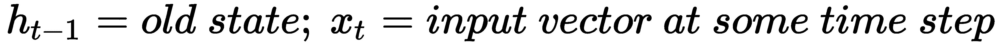
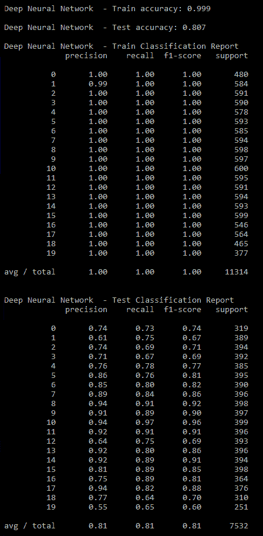

# 第九章：深度学习在自然语言处理中的应用

本章将涵盖以下内容：

+   在生成 TF-IDF 后，使用深度神经网络进行电子邮件分类

+   使用卷积神经网络 CNN 1D 进行 IMDB 情感分类

+   使用双向 LSTM 进行 IMDB 情感分类

+   使用神经词向量可视化在二维空间中可视化高维词汇

# 引言

最近，深度学习在文本、语音和图像数据的应用中变得非常突出，获得了最先进的结果，这些结果主要用于人工智能领域应用的创建。然而，这些模型证明在所有应用领域都能产生这样的结果。本章将涵盖自然语言处理（NLP）/文本处理中的各种应用。

卷积神经网络和循环神经网络是深度学习中的核心主题，您将在整个领域中不断遇到。

# 卷积神经网络

卷积神经网络（CNN）主要用于图像处理，将图像分类为固定类别等。CNN 的工作原理已在下图中描述，其中一个 3x3 的滤波器对一个 5x5 的原始矩阵进行卷积，产生一个 3x3 的输出。滤波器可以按步长 1 或大于 1 的值水平滑动。对于单元（1,1），得到的值是 3，它是底层矩阵值和滤波器值的乘积。通过这种方式，滤波器将遍历原始 5x5 矩阵，生成 3x3 的卷积特征，也称为激活图：


使用卷积的优点：

+   与固定大小不同，完全连接的层节省了神经元的数量，从而减少了机器的计算能力需求。

+   只使用小尺寸的滤波器权重在矩阵上滑动，而不是每个像素连接到下一个层。因此，这是一种更好的方式，将输入图像摘要到下一个层。

+   在反向传播过程中，只需根据反向传播的误差更新滤波器的权重，因此效率较高。

CNN 执行空间/时间分布数组之间的映射，适用于时间序列、图像或视频等应用。CNN 的特点包括：

+   平移不变性（神经权重在空间平移方面是固定的）

+   局部连接（神经连接仅存在于空间上局部的区域之间）

+   空间分辨率的可选逐渐降低（随着特征数量的逐步增加）

卷积后，卷积特征/激活图需要根据最重要的特征进行降维，因为相同的操作减少了点数并提高了计算效率。池化是通常用来减少不必要表示的操作。关于池化操作的简要说明如下：

+   **池化（Pooling）**：池化使得激活表示（从在输入组合和权重值上进行卷积的滤波器获得）变小且更易管理。它独立地作用于每个激活映射。在池化阶段，宽度和高度将被应用，而深度在此过程中将保持不变。在下图中，解释了一个 2 x 2 的池化操作。每个原始的 4 x 4 矩阵已经缩小了一半。在前四个单元格值 2、4、5 和 8 中，提取了最大值，即 8：


由于卷积的操作，像素/输入数据大小在各个阶段自然会减少。但在某些情况下，我们确实希望在操作中保持大小。一种可行的方法是在顶层相应地用零填充。

+   **填充（Padding）**：以下图（其宽度和深度）将依次缩小；这在深度网络中是不希望的，填充可以保持图片大小在整个网络中恒定或可控。


基于给定的输入宽度、滤波器大小、填充和步长的简单方程如下所示。这个方程给出了需要多少计算能力的概念，等等。

+   **激活映射大小的计算**：在下面的公式中，从卷积层获得的激活映射的大小是：


其中，`W`是原始图像的宽度，`F`是滤波器大小，`P`是填充大小（单层填充为`1`，双层填充为`2`，依此类推），`S`是步长长度

例如，考虑一个大小为 224 x 224 x 3 的输入图像（3 表示红、绿和蓝通道），滤波器大小为 11 x 11，滤波器数量为 96。步长为 4，没有填充。这些滤波器生成的激活映射大小是多少？


激活映射的维度将是 55 x 55 x 96。使用前述公式，只能计算宽度和深度，但深度取决于使用的滤波器数量。事实上，在 AlexNet 的卷积阶段第一步骤中得到了这个结果，我们现在将进行描述。

+   **AlexNet 在 2012 年 ImageNet 竞赛中的应用**：以下图描述了 AlexNet，在 2012 年的 ImageNet 竞赛中获胜。它相比其他竞争者显著提高了准确性。


在 AlexNet 中，所有技术如卷积、池化和填充都被使用，并最终与全连接层连接。

# CNN 的应用

CNNs 在各种应用中被使用，以下是其中的几个例子：

+   **图像分类**：与其他方法相比，CNN 在大规模图像数据集上具有更高的准确性。在图像分类中，CNN 在初始阶段被使用，一旦通过池化层提取了足够的特征，接着使用其他 CNN 层，最后通过全连接层将它们分类到指定类别中。

+   **人脸识别**：CNN 对位置、亮度等不变，这使得它能够从图像中识别人脸，并在光线不佳、人脸侧面朝向等情况下依然能够处理图像。

+   **场景标注**：在场景标注中，每个像素都会被标记为它所属的物体类别。这里使用卷积神经网络（CNN）以层次化的方式将像素组合在一起。

+   **自然语言处理（NLP）**：在 NLP 中，CNN 与词袋模型类似使用，其中词语的顺序在识别电子邮件/文本等的最终类别时并不起关键作用。CNN 被应用于矩阵，这些矩阵由句子以向量形式表示。随后，滤波器会应用于其中，但 CNN 是单维的，宽度保持不变，滤波器仅在高度（对于二元组，高度为 2；对于三元组，高度为 3，依此类推）上进行遍历。

# 循环神经网络

循环神经网络用于处理一系列向量 X，通过在每个时间步应用递归公式。在卷积神经网络中，我们假设所有输入是彼此独立的。但在某些任务中，输入是相互依赖的，例如时间序列预测数据，或根据过去的词预测句子的下一个词等，这些都需要通过考虑过去序列的依赖关系来建模。这类问题通过 RNN 进行建模，能够提供更高的准确性。理论上，RNN 能够利用任意长序列中的信息，但实际上，它们仅限于回顾过去的几个步骤。下述公式解释了 RNN 的功能：





+   **RNN 中的梯度消失或爆炸问题**：随着层数的增加，梯度会迅速消失，这个问题在 RNN 中尤为严重，因为在每一层都会有很多时间步，而循环权重本质上是乘法性的，因此梯度要么爆炸，要么迅速消失，这使得神经网络无法训练。通过使用梯度裁剪技术，可以限制梯度爆炸，设定一个上限来限制梯度的爆炸，但消失梯度问题仍然存在。这个问题可以通过使用**长短期记忆**（**LSTM**）网络来克服。

+   **LSTM**：LSTM 是一种人工神经网络，除了常规的网络单元外，还包含 LSTM 块。LSTM 块包含门控机制，用于决定何时输入的内容足够重要以被记住，何时需要继续记住，何时需要忘记该值，以及何时输出该值。


LSTM 不会发生梯度消失和爆炸问题，因为它是加性模型，而不是 RNN 中的乘法模型。

# RNN 在 NLP 中的应用

RNN 在许多 NLP 任务中取得了巨大成功。RNN 最常用的变体是 LSTM，因为它克服了梯度消失/爆炸的问题。

+   **语言建模**：给定一系列单词，任务是预测下一个可能的单词

+   **文本生成**：从某些作者的作品中生成文本

+   **机器翻译**：将一种语言转换为另一种语言（如英语到中文等）

+   **聊天机器人**：这个应用非常类似于机器翻译；然而，问答对被用来训练模型

+   **生成图像描述**：通过与 CNN 一起训练，RNN 可用于生成图像的标题/描述

# 在生成 TF-IDF 后使用深度神经网络对电子邮件进行分类

在这个教程中，我们将使用深度神经网络根据每封电子邮件中出现的单词将电子邮件分类到 20 个预训练类别之一。这是一个简单的模型，可以帮助我们理解深度学习的主题及其在 NLP 中的应用。

# 准备工作

使用来自 scikit-learn 的 20 个新闻组数据集来说明该概念。用于分析的观察/电子邮件数量为 18,846（训练数据 - 11,314，测试数据 - 7,532），其对应的类别/类为 20，如下所示：

```py
>>> from sklearn.datasets import fetch_20newsgroups
>>> newsgroups_train = fetch_20newsgroups(subset='train')
>>> newsgroups_test = fetch_20newsgroups(subset='test')
>>> x_train = newsgroups_train.data
>>> x_test = newsgroups_test.data
>>> y_train = newsgroups_train.target
>>> y_test = newsgroups_test.target
>>> print ("List of all 20 categories:")
>>> print (newsgroups_train.target_names)
>>> print ("\n")
>>> print ("Sample Email:")
>>> print (x_train[0])
>>> print ("Sample Target Category:")
>>> print (y_train[0])
>>> print (newsgroups_train.target_names[y_train[0]])
```

在以下屏幕截图中，展示了一个样本的首个数据观察及目标类别。通过第一个观察或电子邮件，我们可以推断出该电子邮件是在谈论一辆双门跑车，我们可以将其手动分类为汽车类别 `8`。

目标值是 `7`（由于索引从 `0` 开始），这验证了我们对实际目标类别 `7` 的理解。


# 如何实现...

使用 NLP 技术，我们已经对数据进行了预处理，以获得最终的单词向量，并与最终结果（垃圾邮件或正常邮件）进行映射。主要步骤包括：

1.  预处理。

1.  移除标点符号。

1.  单词分词。

1.  将单词转换为小写字母。

1.  停用词移除。

1.  保持单词长度至少为 3。

1.  词干提取。

1.  词性标注。

1.  词形还原：

    1.  TF-IDF 向量转换。

    1.  深度学习模型训练与测试。

    1.  模型评估和结果讨论。

# 它是如何工作的...

已经使用 NLTK 包处理了所有的预处理步骤，因为它包含了所有必要的 NLP 功能，集中在一个平台上：

```py
# Used for pre-processing data
>>> import nltk
>>> from nltk.corpus import stopwords
>>> from nltk.stem import WordNetLemmatizer
>>> import string
>>> import pandas as pd
>>> from nltk import pos_tag
>>> from nltk.stem import PorterStemmer
```

编写的函数（预处理）包含了所有步骤，便于操作。然而，我们将在每个章节中解释每一步：

```py
>>> def preprocessing(text): 
```

以下代码行将单词拆分，并检查每个字符是否包含任何标准标点符号，如果包含则替换为空格，否则保持不变：

```py
...     text2 = " ".join("".join([" " if ch in string.punctuation else ch for ch in text]).split()) 
```

以下代码将句子根据空格分词，并将它们组合成一个列表以应用进一步步骤：

```py
...     tokens = [word for sent in nltk.sent_tokenize(text2) for word in nltk.word_tokenize(sent)] 

```

将所有大小写（大写、小写和专有名词）转为小写，可以减少语料库中的重复：

```py
...     tokens = [word.lower() for word in tokens]
```

如前所述，停用词是那些在理解句子时没有太多意义的词，它们用于连接词等。我们已通过以下代码将它们移除：

```py

...     stopwds = stopwords.words('english') 
...     tokens = [token for token in tokens if token not in stopwds]
```

在下面的代码中，仅保留长度大于`3`的单词，用于去除那些几乎没有意义的小词；

```py
...     tokens = [word for word in tokens if len(word)>=3] 
```

使用 Porter 词干提取器对单词进行词干化，从单词中去除多余的后缀：

```py
...     stemmer = PorterStemmer() 
...     tokens = [stemmer.stem(word) for word in tokens]  
```

词性标注是词形还原的前提，基于词汇是名词、动词等，它将词汇简化为词根。

```py
...     tagged_corpus = pos_tag(tokens)     
```

`pos_tag`函数返回四种名词格式和六种动词格式。NN -（名词，普通，单数），NNP -（名词，专有，单数），NNPS -（名词，专有，复数），NNS -（名词，普通，复数），VB -（动词，原形），VBD -（动词，过去式），VBG -（动词，现在分词），VBN -（动词，过去分词），VBP -（动词，现在时，非第三人称单数），VBZ -（动词，现在时，第三人称单数）

```py
...     Noun_tags = ['NN','NNP','NNPS','NNS'] 
...    Verb_tags = ['VB','VBD','VBG','VBN','VBP','VBZ'] 
...     lemmatizer = WordNetLemmatizer()  
```

以下函数`prat_lemmatize`仅为了解决`pos_tag`函数与`lemmatize`函数输入值不匹配的问题而创建。如果某个单词的标签属于名词或动词类别，则`lemmatize`函数将分别应用`n`或`v`标签：

```py
...     def prat_lemmatize(token,tag): 
...       if tag in Noun_tags: 
...         return lemmatizer.lemmatize(token,'n') 
...       elif tag in Verb_tags: 
...         return lemmatizer.lemmatize(token,'v') 
...       else: 
...         return lemmatizer.lemmatize(token,'n')
```

在进行分词并应用所有操作后，我们需要将其重新组合成字符串，以下函数执行了此操作：

```py
...     pre_proc_text =  " ".join([prat_lemmatize(token,tag) for token,tag in tagged_corpus])              
...     return pre_proc_text 
```

对训练数据和测试数据应用预处理：

```py
>>> x_train_preprocessed = []
>>> for i in x_train:
... x_train_preprocessed.append(preprocessing(i))
>>> x_test_preprocessed = []
>>> for i in x_test:
... x_test_preprocessed.append(preprocessing(i))
# building TFIDF vectorizer
>>> from sklearn.feature_extraction.text import TfidfVectorizer
>>> vectorizer = TfidfVectorizer(min_df=2, ngram_range=(1, 2), stop_words='english', max_features= 10000,strip_accents='unicode', norm='l2')
>>> x_train_2 = vectorizer.fit_transform(x_train_preprocessed).todense()
>>> x_test_2 = vectorizer.transform(x_test_preprocessed).todense()
```

预处理步骤完成后，处理后的 TF-IDF 向量需要传入以下深度学习代码：

```py
# Deep Learning modules
>>> import numpy as np
>>> from keras.models import Sequential
>>> from keras.layers.core import Dense, Dropout, Activation
>>> from keras.optimizers import Adadelta,Adam,RMSprop
>>> from keras.utils import np_utils
```

下图展示了运行前面 Keras 代码后产生的输出。Keras 已经在 Theano 上安装，并且最终在 Python 上运行。安装了一块 6GB 内存的 GPU，并添加了额外的库（CuDNN 和 CNMeM），使执行速度提高了四到五倍，同时内存占用约为 20%，因此仅有 80%的 6GB 内存可用；


以下代码解释了深度学习模型的核心部分。代码是自解释的，考虑到的类别数为`20`，批次大小为`64`，训练的 epoch 数为`20`：

```py
# Definition hyper parameters
>>> np.random.seed(1337)
>>> nb_classes = 20
>>> batch_size = 64
>>> nb_epochs = 20
```

以下代码将`20`个类别转换为一热编码向量，其中创建了`20`列，并且对应类别的值为`1`。所有其他类别的值为`0`：

```py
>>> Y_train = np_utils.to_categorical(y_train, nb_classes)
```

在以下的 Keras 代码构建模块中，使用了三个隐藏层（每层分别有`1000`、`500`和`50`个神经元），每层的 dropout 为 50%，并使用 Adam 优化器：

```py
#Deep Layer Model building in Keras
#del model
>>> model = Sequential()
>>> model.add(Dense(1000,input_shape= (10000,)))
>>> model.add(Activation('relu'))
>>> model.add(Dropout(0.5))
>>> model.add(Dense(500))
>>> model.add(Activation('relu'))
>>> model.add(Dropout(0.5))
>>> model.add(Dense(50))
>>> model.add(Activation('relu'))
>>> model.add(Dropout(0.5))
>>> model.add(Dense(nb_classes))
>>> model.add(Activation('softmax'))
>>> model.compile(loss='categorical_crossentropy', optimizer='adam')
>>> print (model.summary())
```

架构如下所示，描述了从输入开始为 10,000 的数据流。然后有`1000`、`500`、`50`和`20`个神经元，将给定的电子邮件分类到`20`个类别中的一个：


模型是根据给定的指标进行训练的：

```py
# Model Training
>>> model.fit(x_train_2, Y_train, batch_size=batch_size, epochs=nb_epochs,verbose=1)
```

模型已经在 20 个 epoch 中进行了拟合，每个 epoch 大约需要 2 秒钟。损失从`1.9281`减少到`0.0241`。使用 CPU 硬件时，每个 epoch 所需的时间可能会增加，因为 GPU 通过数千个线程/核心并行计算大大加速了计算：


最后，在训练集和测试集上进行预测，以确定准确率、精度和召回值：

```py
#Model Prediction
>>> y_train_predclass = model.predict_classes(x_train_2,batch_size=batch_size)
>>> y_test_predclass = model.predict_classes(x_test_2,batch_size=batch_size)
>>> from sklearn.metrics import accuracy_score,classification_report
>>> print ("\n\nDeep Neural Network - Train accuracy:"),(round(accuracy_score( y_train, y_train_predclass),3))
>>> print ("\nDeep Neural Network - Test accuracy:"),(round(accuracy_score( y_test,y_test_predclass),3))
>>> print ("\nDeep Neural Network - Train Classification Report")
>>> print (classification_report(y_train,y_train_predclass))
>>> print ("\nDeep Neural Network - Test Classification Report")
>>> print (classification_report(y_test,y_test_predclass))
```



看起来分类器在训练数据集上提供了 99.9%的准确率，在测试数据集上则为 80.7%。

# 使用卷积神经网络 CNN 1D 进行 IMDB 情感分类

在这个示例中，我们将使用 Keras IMDB 电影评论情感数据，该数据已经标注了情感（正面/负面）。评论已经过预处理，每个评论已经被编码为一个单词索引序列（整数）。然而，我们已将其解码，以下代码中展示了一个示例。

# 准备开始

Keras 中的 IMDB 数据集包含一组单词及其相应的情感。以下是数据的预处理过程：

```py
>>> import pandas as pd
>>> from keras.preprocessing import sequence
>>> from keras.models import Sequential
>>> from keras.layers import Dense, Dropout, Activation
>>> from keras.layers import Embedding
>>> from keras.layers import Conv1D, GlobalMaxPooling1D
>>> from keras.datasets import imdb
>>> from sklearn.metrics import accuracy_score,classification_report
```

在这一组参数中，我们设置了最大特征或要提取的单词数为 6,000，并且单个句子的最大长度为 400 个单词：

```py
# set parameters:
>>> max_features = 6000
>>> max_length = 400
>>> (x_train, y_train), (x_test, y_test) = imdb.load_data(num_words=max_features)
>>> print(len(x_train), 'train observations')
>>> print(len(x_test), 'test observations')
```

数据集具有相同数量的训练和测试观察值，我们将在 25,000 个观察值上构建模型，并在测试数据的 25,000 个数据观察值上测试训练好的模型。以下截图展示了数据的一个示例：


以下代码用于创建单词及其相应整数索引值的字典映射：

```py
# Creating numbers to word mapping
>>> wind = imdb.get_word_index()
>>> revind = dict((v,k) for k,v in wind.iteritems())
>>> print (x_train[0])
>>> print (y_train[0])
```

我们看到的第一个观察值是数字的集合，而不是任何英文单词，因为计算机只能理解并处理数字，而不是字符、单词等：


使用创建的逆映射字典进行解码，如下所示：

```py
>>> def decode(sent_list):
... new_words = []
... for i in sent_list:
... new_words.append(revind[i])
... comb_words = " ".join(new_words)
... return comb_words
>>> print (decode(x_train[0]))
```

以下截图描述了将数字映射转换为文本格式后的阶段。在这里，字典被用来反转从整数格式到文本格式的映射：


# 如何做...

主要步骤如下：

1.  预处理：在此阶段，我们对序列进行填充，使所有观察值具有相同的固定维度，这有助于提高速度并实现计算。

1.  CNN 1D 模型的开发与验证。

1.  模型评估。

# 它是如何工作的...

以下代码执行填充操作，添加额外的句子，使其达到最大长度 400 个单词。通过这样做，数据将变得均匀，并且更容易通过神经网络进行计算：

```py
#Pad sequences for computational efficiency
>>> x_train = sequence.pad_sequences(x_train, maxlen=max_length)
>>> x_test = sequence.pad_sequences(x_test, maxlen=max_length)
>>> print('x_train shape:', x_train.shape)
>>> print('x_test shape:', x_test.shape)
```


以下深度学习代码描述了应用 Keras 代码创建 CNN 1D 模型：

```py
# Deep Learning architecture parameters
>>> batch_size = 32
>>> embedding_dims = 60
>>> num_kernels = 260
>>> kernel_size = 3
>>> hidden_dims = 300
>>> epochs = 3
# Building the model
>>> model = Sequential()
>>> model.add(Embedding(max_features,embedding_dims, input_length= max_length))
>>> model.add(Dropout(0.2))
>>> model.add(Conv1D(num_kernels,kernel_size, padding='valid', activation='relu', strides=1))
>>> model.add(GlobalMaxPooling1D())
>>> model.add(Dense(hidden_dims))
>>> model.add(Dropout(0.5))
>>> model.add(Activation('relu'))
>>> model.add(Dense(1))
>>> model.add(Activation('sigmoid'))
>>> model.compile(loss='binary_crossentropy',optimizer='adam', metrics=['accuracy'])
>>> print (model.summary())
```

在以下截图中，显示了整个模型的总结，指出了维度数量及其各自的神经元数量。这些直接影响将用于计算的参数数量，从输入数据到最终目标变量（无论是`0`还是`1`）。因此，在网络的最后一层使用了一个全连接层：


以下代码执行训练数据的模型拟合操作，其中`X`和`Y`变量用于按批次训练数据：

```py
>>> model.fit(x_train, y_train,batch_size=batch_size,epochs=epochs, validation_split=0.2)
```

模型已训练三个周期，每个周期在 GPU 上消耗 5 秒。但如果我们观察以下迭代，尽管训练准确率在上升，验证准确率却在下降。这个现象可以被识别为模型过拟合。这表明我们需要尝试其他方法来提高模型准确率，而不仅仅是增加训练周期的次数。我们可能应该关注的方法还包括增加架构的规模等。鼓励读者尝试不同的组合。


以下代码用于预测训练数据和测试数据的类别：

```py
#Model Prediction
>>> y_train_predclass = model.predict_classes(x_train,batch_size=batch_size)
>>> y_test_predclass = model.predict_classes(x_test,batch_size=batch_size)
>>> y_train_predclass.shape = y_train.shape
>>> y_test_predclass.shape = y_test.shape

# Model accuracies and metrics calculation
>>> print (("\n\nCNN 1D - Train accuracy:"),(round(accuracy_score(y_train, y_train_predclass),3)))
>>> print ("\nCNN 1D of Training data\n",classification_report(y_train, y_train_predclass))
>>> print ("\nCNN 1D - Train Confusion Matrix\n\n",pd.crosstab(y_train, y_train_predclass,rownames = ["Actuall"],colnames = ["Predicted"]))
>>> print (("\nCNN 1D - Test accuracy:"),(round(accuracy_score(y_test, y_test_predclass),3)))
>>> print ("\nCNN 1D of Test data\n",classification_report(y_test, y_test_predclass))
>>> print ("\nCNN 1D - Test Confusion Matrix\n\n",pd.crosstab(y_test, y_test_predclass,rownames = ["Actuall"],colnames = ["Predicted"]))
```

以下截图描述了用于判断模型性能的各种可度量指标。从结果来看，训练准确率高达 96%，然而测试准确率为 88.2%，略低。这可能是由于模型过拟合：


# 使用双向 LSTM 进行 IMDB 情感分类

在本教程中，我们使用相同的 IMDB 情感数据，展示 CNN 和 RNN 方法在准确率等方面的差异。数据预处理步骤保持不变，只有模型架构不同。

# 准备就绪

Keras 中的 IMDB 数据集包含了一组词汇及其对应的情感。以下是数据的预处理过程：

```py
>>> from __future__ import print_function
>>> import numpy as np
>>> import pandas as pd
>>> from keras.preprocessing import sequence
>>> from keras.models import Sequential
>>> from keras.layers import Dense, Dropout, Embedding, LSTM, Bidirectional
>>> from keras.datasets import imdb
>>> from sklearn.metrics import accuracy_score,classification_report

# Max features are limited
>>> max_features = 15000
>>> max_len = 300
>>> batch_size = 64

# Loading data
>>> (x_train, y_train), (x_test, y_test) = imdb.load_data(num_words=max_features)
>>> print(len(x_train), 'train observations')
>>> print(len(x_test), 'test observations')
```

# 如何做...

主要步骤如下：

1.  预处理，在此阶段，我们对序列进行填充，使所有观测值都进入一个固定的维度，从而提高速度并实现计算。

1.  LSTM 模型的开发与验证。

1.  模型评估。

# 它是如何工作的...

```py
# Pad sequences for computational efficiently
>>> x_train_2 = sequence.pad_sequences(x_train, maxlen=max_len)
>>> x_test_2 = sequence.pad_sequences(x_test, maxlen=max_len)
>>> print('x_train shape:', x_train_2.shape)
>>> print('x_test shape:', x_test_2.shape)
>>> y_train = np.array(y_train)
>>> y_test = np.array(y_test)
```

以下深度学习代码描述了 Keras 代码的应用，用于创建一个双向 LSTM 模型：

双向 LSTM 具有来自前向和后向的连接，这使得它们能够填补中间单词，与左右单词更好地连接：

```py
# Model Building
>>> model = Sequential()
>>> model.add(Embedding(max_features, 128, input_length=max_len))
>>> model.add(Bidirectional(LSTM(64)))
>>> model.add(Dropout(0.5))
>>> model.add(Dense(1, activation='sigmoid'))
>>> model.compile('adam', 'binary_crossentropy', metrics=['accuracy'])
# Print model architecture
>>> print (model.summary())
```

这里是模型的架构。嵌入层被用来将维度减少到`128`，接着是双向 LSTM，最后用一个全连接层来建模情感（0 或 1）：


以下代码用于训练数据：

```py
#Train the model
>>> model.fit(x_train_2, y_train,batch_size=batch_size,epochs=4, validation_split=0.2)
```

LSTM 模型的训练时间比 CNN 长，因为 LSTM 不容易在 GPU 上进行并行化（比 CNN 慢 4 到 5 倍），而 CNN（100 倍）是大规模并行化的。一个重要的观察是：即使训练准确率提高，验证准确率却在下降。这种情况表明出现了过拟合。


以下代码用于预测训练和测试数据的类别：

```py
#Model Prediction
>>> y_train_predclass = model.predict_classes(x_train_2,batch_size=1000)
>>> y_test_predclass = model.predict_classes(x_test_2,batch_size=1000)
>>> y_train_predclass.shape = y_train.shape
>>> y_test_predclass.shape = y_test.shape

# Model accuracies and metrics calculation
>>> print (("\n\nLSTM Bidirectional Sentiment Classification - Train accuracy:"),(round(accuracy_score(y_train,y_train_predclass),3)))
>>> print ("\nLSTM Bidirectional Sentiment Classification of Training data\n",classification_report(y_train, y_train_predclass))
>>> print ("\nLSTM Bidirectional Sentiment Classification - Train Confusion Matrix\n\n",pd.crosstab(y_train, y_train_predclass,rownames = ["Actuall"],colnames = ["Predicted"]))
>>> print (("\nLSTM Bidirectional Sentiment Classification - Test accuracy:"),(round(accuracy_score(y_test,y_test_predclass),3)))
>>> print ("\nLSTM Bidirectional Sentiment Classification of Test data\n",classification_report(y_test, y_test_predclass))
>>> print ("\nLSTM Bidirectional Sentiment Classification - Test Confusion Matrix\n\n",pd.crosstab(y_test, y_test_predclass,rownames = ["Actuall"],colnames = ["Predicted"]))
```


看起来 LSTM 的测试准确率相较于 CNN 稍微低一些；然而，通过精心调整模型参数，我们可以在 RNN 中获得比 CNN 更好的准确率。

# 将高维单词在二维中可视化，使用神经网络词向量进行可视化。

在这个方案中，我们将使用深度神经网络，将高维空间中的单词可视化到二维空间中。

# 准备工作

*爱丽丝梦游仙境*数据集已被用来提取单词并使用密集网络创建可视化，类似于编码器-解码器架构：

```py
>>> from __future__ import print_function
>>> import os
""" First change the following directory link to where all input files do exist """
>>> os.chdir("C:\\Users\\prata\\Documents\\book_codes\\NLP_DL")
>>> import nltk
>>> from nltk.corpus import stopwords
>>> from nltk.stem import WordNetLemmatizer
>>> from nltk import pos_tag
>>> from nltk.stem import PorterStemmer
>>> import string
>>> import numpy as np
>>> import pandas as pd
>>> import random
>>> from sklearn.model_selection import train_test_split
>>> from sklearn.preprocessing import OneHotEncoder
>>> import matplotlib.pyplot as plt
>>> def preprocessing(text):
... text2 = " ".join("".join([" " if ch in string.punctuation else ch for ch in text]).split())
... tokens = [word for sent in nltk.sent_tokenize(text2) for word in
nltk.word_tokenize(sent)]
... tokens = [word.lower() for word in tokens]
... stopwds = stopwords.words('english')
... tokens = [token for token in tokens if token not in stopwds]
... tokens = [word for word in tokens if len(word)>=3]
... stemmer = PorterStemmer()
... tokens = [stemmer.stem(word) for word in tokens]
... tagged_corpus = pos_tag(tokens)
... Noun_tags = ['NN','NNP','NNPS','NNS']
... Verb_tags = ['VB','VBD','VBG','VBN','VBP','VBZ']
... lemmatizer = WordNetLemmatizer()
... def prat_lemmatize(token,tag):
... if tag in Noun_tags:
... return lemmatizer.lemmatize(token,'n')
... elif tag in Verb_tags:
... return lemmatizer.lemmatize(token,'v')
... else:
... return lemmatizer.lemmatize(token,'n')
... pre_proc_text = " ".join([prat_lemmatize(token,tag) for token,tag in tagged_corpus])
... return pre_proc_text
>>> lines = []
>>> fin = open("alice_in_wonderland.txt", "rb")
>>> for line in fin:
... line = line.strip().decode("ascii", "ignore").encode("utf-8")
... if len(line) == 0:
... continue
... lines.append(preprocessing(line))
>>> fin.close()
```

# 如何实现...

主要步骤如下所示：

+   预处理，创建跳字模型，并使用中间单词预测左侧或右侧的单词。

+   对特征工程应用独热编码。

+   使用编码器-解码器架构构建模型。

+   提取编码器架构，从测试数据中创建用于可视化的二维特征。

# 它是如何工作的...

以下代码创建了一个字典，它是单词与索引、索引与单词（反向）的映射。正如我们所知道的，模型不能直接处理字符/单词输入。因此，我们将把单词转换成数字等价物（特别是整数映射），一旦通过神经网络模型完成计算，反向映射（索引到单词）将被应用以进行可视化。`collections`库中的计数器用于高效创建字典：

```py
>>> import collections
>>> counter = collections.Counter()
>>> for line in lines:
... for word in nltk.word_tokenize(line):
... counter[word.lower()]+=1
>>> word2idx = {w:(i+1) for i,(w,_) in enumerate(counter.most_common())}
>>> idx2word = {v:k for k,v in word2idx.items()}
```

以下代码应用了词到整数的映射，并从嵌入中提取三元组。Skip-gram 是一种方法，其中中心单词与左侧和右侧相邻的单词连接进行训练，如果在测试阶段预测正确：

```py
>>> xs = []
>>> ys = []
>>> for line in lines:
... embedding = [word2idx[w.lower()] for w in nltk.word_tokenize(line)]
... triples = list(nltk.trigrams(embedding))
... w_lefts = [x[0] for x in triples]
... w_centers = [x[1] for x in triples]
... w_rights = [x[2] for x in triples]
... xs.extend(w_centers)
... ys.extend(w_lefts)
... xs.extend(w_centers)
... ys.extend(w_rights)
```

以下代码描述了字典的长度就是词汇表的大小。不过，根据用户的指定，可以选择任何自定义的词汇表大小。在这里，我们考虑了所有的单词！

```py
>>> print (len(word2idx))
>>> vocab_size = len(word2idx)+1
```

基于词汇表的大小，所有独立和依赖变量都被转换为向量表示，使用以下代码，其中行数为单词数量，列数为词汇表的大小。神经网络模型基本上是在向量空间中映射输入和输出变量：

```py
>>> ohe = OneHotEncoder(n_values=vocab_size)
>>> X = ohe.fit_transform(np.array(xs).reshape(-1, 1)).todense()
>>> Y = ohe.fit_transform(np.array(ys).reshape(-1, 1)).todense()
>>> Xtrain, Xtest, Ytrain, Ytest,xstr,xsts = train_test_split(X, Y,xs, test_size=0.3, random_state=42)
>>> print(Xtrain.shape, Xtest.shape, Ytrain.shape, Ytest.shape)
```

在总共 13,868 个观测值中，训练集和测试集被分为 70% 和 30%，分别为 9,707 和 4,161：


模型的核心部分通过以下几行使用 Keras 软件编写的深度学习代码进行描述。这是一个收敛-发散代码，最初将所有输入单词的维度压缩，以达到输出格式。

在此过程中，第二层将维度降低到二维。训练完模型后，我们将提取到第二层以对测试数据进行预测。这的工作原理与传统的编码器-解码器架构类似：

```py
>>> from keras.layers import Input,Dense,Dropout
>>> from keras.models import Model
>>> np.random.seed(42)
>>> BATCH_SIZE = 128
>>> NUM_EPOCHS = 20
>>> input_layer = Input(shape = (Xtrain.shape[1],),name="input")
>>> first_layer = Dense(300,activation='relu',name = "first")(input_layer)
>>> first_dropout = Dropout(0.5,name="firstdout")(first_layer)
>>> second_layer = Dense(2,activation='relu',name="second") (first_dropout)
>>> third_layer = Dense(300,activation='relu',name="third") (second_layer)
>>> third_dropout = Dropout(0.5,name="thirdout")(third_layer)
>>> fourth_layer = Dense(Ytrain.shape[1],activation='softmax',name = "fourth")(third_dropout)
>>> history = Model(input_layer,fourth_layer)
>>> history.compile(optimizer = "rmsprop",loss= "categorical_crossentropy", metrics=["accuracy"])
```

以下代码用于训练模型：

```py
>>> history.fit(Xtrain, Ytrain, batch_size=BATCH_SIZE,epochs=NUM_EPOCHS, verbose=1,validation_split = 0.2)
```

通过仔细观察训练和验证数据集的准确性，我们可以发现最佳准确率值甚至没有超过 6%。这主要是由于数据量有限以及深度学习模型的架构问题。为了使其真正有效，我们需要至少几千兆字节的数据和大型架构。模型也需要训练很长时间。由于实际限制和示范目的，我们仅训练了 20 次迭代。然而，鼓励读者尝试各种组合以提高准确性。


```py
# Extracting Encoder section of the Model for prediction of latent variables
>>> encoder = Model(history.input,history.get_layer("second").output)

# Predicting latent variables with extracted Encoder model
>>> reduced_X = encoder.predict(Xtest)
Converting the outputs into Pandas data frame structure for better representation
>>> final_pdframe = pd.DataFrame(reduced_X)
>>> final_pdframe.columns = ["xaxis","yaxis"]
>>> final_pdframe["word_indx"] = xsts
>>> final_pdframe["word"] = final_pdframe["word_indx"].map(idx2word)
>>> rows = random.sample(final_pdframe.index, 100)
>>> vis_df = final_pdframe.ix[rows]
>>> labels = list(vis_df["word"]);xvals = list(vis_df["xaxis"])
>>> yvals = list(vis_df["yaxis"])

#in inches
>>> plt.figure(figsize=(8, 8))
>>> for i, label in enumerate(labels):
... x = xvals[i]
... y = yvals[i]
... plt.scatter(x, y)
... plt.annotate(label,xy=(x, y),xytext=(5, 2),textcoords='offset points', ha='right',va='bottom')
>>> plt.xlabel("Dimension 1")
>>> plt.ylabel("Dimension 2")
>>> plt.show()
```

以下图像描述了在二维空间中单词的可视化。某些单词彼此靠得比其他单词近，这表示它们与附近单词的接近性和关系。例如，`never`、`ever` 和 `ask` 这些单词彼此非常接近。


