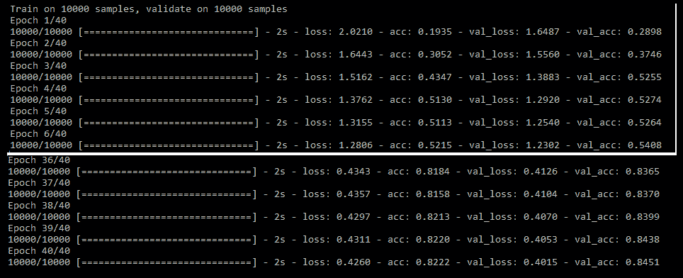
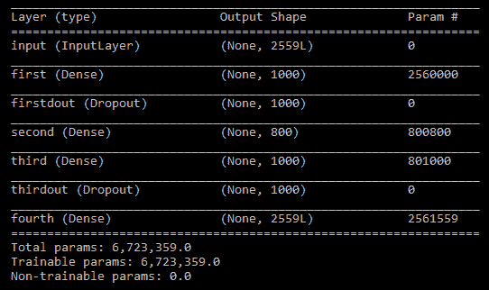
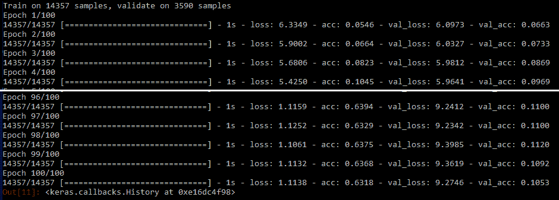

# 第十章：深度学习在自然语言处理中的高级应用

在本章中，我们将涵盖以下高级实例：

+   使用 LSTM 从莎士比亚的作品中生成自动文本

+   使用记忆网络处理情节数据的问答

+   使用循环神经网络（LSTM）进行语言建模，以预测下一个最佳单词

+   使用深度学习循环神经网络（LSTM）开发生成型聊天机器人

# 介绍

深度学习技术正在被广泛应用于解决一些开放性问题。本章讨论了这些类型的问题，在这些问题中，简单的*是*或*不是*回答是很困难的。我们希望你在阅读这些实例时能够享受，并了解到目前这一行业中正在进行的前沿工作，并尝试通过相关的代码片段学习一些基本构建块。

# 使用 LSTM 从莎士比亚的作品中生成自动文本

在这个实例中，我们将使用深度**循环神经网络**（**RNN**）来预测基于给定句子长度的下一个字符。这种训练模型的方式可以不断生成自动文本，模仿原作者的写作风格，经过足够的训练（包括多个训练周期等）。

# 准备就绪...

使用*Project Gutenberg*提供的莎士比亚全集电子书数据集来训练网络进行自动文本生成。数据可以从[`www.gutenberg.org/`](http://www.gutenberg.org/)下载，用于训练的原始文件：

```py
>>> from __future__ import print_function
>>> import numpy as np
>>> import random
>>> import sys
```

以下代码用于创建字符到索引的字典及其反向映射，我们将在后续阶段使用它将文本转换为索引。这是因为深度学习模型无法理解英文，所有内容都需要映射为索引来训练这些模型：

```py
>>> path = 'C:\\Users\\prata\\Documents\\book_codes\\ NLP_DL\\ shakespeare_final.txt'
>>&gt; text = open(path).read().lower()
>>> characters = sorted(list(set(text)))
>>> print('corpus length:', len(text))
>>> print('total chars:', len(characters))
```


```py
>>> char2indices = dict((c, i) for i, c in enumerate(characters))
>>> indices2char = dict((i, c) for i, c in enumerate(characters))
```

# 如何实现...

在训练模型之前，需要进行多种预处理步骤才能使其正常工作。以下是主要步骤：

1.  **预处理**：从给定的完整故事文本文件中准备*X*和*Y*数据，并将它们转换为索引向量格式。

1.  **深度学习模型的训练与验证**：训练和验证深度学习模型。

1.  **文本生成**：使用训练好的模型生成文本。

# 它是如何工作的...

以下代码行描述了从莎士比亚的作品中生成文本的整个建模过程。这里我们选择了字符长度。需要考虑的是`40`，用于确定下一个最佳字符，这似乎是一个相当合理的选择。此外，这一提取过程以三步为单位跳跃，以避免连续两次提取之间的重叠，从而更公平地创建数据集：

```py
# cut the text in semi-redundant sequences of maxlen characters
>>> maxlen = 40
>>> step = 3
>>> sentences = []
>>> next_chars = []
>>> for i in range(0, len(text) - maxlen, step):
... sentences.append(text[i: i + maxlen])
... next_chars.append(text[i + maxlen])
... print('nb sequences:', len(sentences))
```

以下截图展示了考虑的总句子数`193798`，这些数据足以进行文本生成：


下一个代码块用于将数据转换为向量化格式，以便输入深度学习模型，因为模型无法理解文本、单词、句子等。最初，NumPy 数组中的所有维度都用零初始化，并用字典映射填充相关位置：

```py
# Converting indices into vectorized format
>>> X = np.zeros((len(sentences), maxlen, len(characters)), dtype=np.bool)
>>> y = np.zeros((len(sentences), len(characters)), dtype=np.bool)
>>> for i, sentence in enumerate(sentences):
... for t, char in enumerate(sentence):
... X[i, t, char2indices[char]] = 1
... y[i, char2indices[next_chars[i]]] = 1
>>> from keras.models import Sequential
>>> from keras.layers import Dense, LSTM,Activation,Dropout
>>> from keras.optimizers import RMSprop
```

深度学习模型使用 RNN 创建，更具体地说，是使用`128`个隐藏神经元的长短期记忆网络（LSTM），输出的维度是字符维度。数组中的列数即为字符数。最后，`softmax`函数与`RMSprop`优化器一起使用。我们鼓励读者尝试其他不同的参数，以查看结果的变化：

```py
#Model Building
>>> model = Sequential()
>>> model.add(LSTM(128, input_shape=(maxlen, len(characters))))
>>> model.add(Dense(len(characters)))
>>> model.add(Activation('softmax'))
>>> model.compile(loss='categorical_crossentropy', optimizer=RMSprop(lr=0.01))
>>> print (model.summary())
```


如前所述，深度学习模型通过训练数字索引将输入映射到输出（给定 40 个字符的长度，模型将预测下一个最佳字符）。以下代码用于通过确定字符的最大索引，将预测的索引转换回相关字符：

```py
# Function to convert prediction into index
>>> def pred_indices(preds, metric=1.0):
... preds = np.asarray(preds).astype('float64')
... preds = np.log(preds) / metric
... exp_preds = np.exp(preds)
... preds = exp_preds/np.sum(exp_preds)
... probs = np.random.multinomial(1, preds, 1)
... return np.argmax(probs)
```

模型将通过`30`次迭代进行训练，批处理大小为`128`。此外，还更改了多样性，以查看其对预测的影响：

```py
# Train and Evaluate the Model
>>> for iteration in range(1, 30):
... print('-' * 40)
... print('Iteration', iteration)
... model.fit(X, y,batch_size=128,epochs=1)
... start_index = random.randint(0, len(text) - maxlen - 1)
... for diversity in [0.2, 0.7,1.2]:
... print('\n----- diversity:', diversity)
... generated = ''
... sentence = text[start_index: start_index + maxlen]
... generated += sentence
... print('----- Generating with seed: "' + sentence + '"')
... sys.stdout.write(generated)
... for i in range(400):
... x = np.zeros((1, maxlen, len(characters)))
... for t, char in enumerate(sentence):
... x[0, t, char2indices[char]] = 1.
... preds = model.predict(x, verbose=0)[0]
... next_index = pred_indices(preds, diversity)
... pred_char = indices2char[next_index]
... generated += pred_char
... sentence = sentence[1:] + pred_char
... sys.stdout.write(pred_char)
... sys.stdout.flush()
... print("\nOne combination completed \n")
```

结果显示在下一张截图中，用于比较第一次迭代（`Iteration 1`）和最后一次迭代（`Iteration 29`）。显然，通过足够的训练，文本生成似乎比`Iteration 1`时要好得多：


`Iteration 29`后的文本生成如图所示：


尽管整体上文本生成似乎有些神奇，但我们使用莎士比亚的著作生成了文本，证明了只要有适当的训练和处理，我们可以模仿任何作家的写作风格。

# 使用记忆网络对情节数据进行问答

在本教程中，我们将使用深度 RNN 创建一个模型，基于情节记忆系统工作，进行问答。它将通过顺序读取故事，提取给定问题的相关答案。如需进一步阅读，请参考 Ankit Kumar 等人的论文*Dynamic Memory Networks for Natural Language Processing*（[`arxiv.org/pdf/1506.07285.pdf`](https://arxiv.org/pdf/1506.07285.pdf)）。

# 准备中...

本示例使用了 Facebook 的 bAbI 数据集，可以从[`www.thespermwhale.com/jaseweston/babi/tasks_1-20_v1-2.tar.gz`](http://www.thespermwhale.com/jaseweston/babi/tasks_1-20_v1-2.tar.gz)下载。它包含大约 20 种任务类型，其中我们选择了第一个任务，一个基于单一支持事实的问答系统。

解压文件后，进入`en-10k`文件夹，使用以`qa1_single supporting-fact`开头的文件作为训练和测试文件。以下代码用于提取故事、问题和答案，以此顺序创建训练所需的数据：

```py
>>> from __future__ import division, print_function
>>> import collections
>>> import itertools
>>> import nltk
>>> import numpy as np
>>> import matplotlib.pyplot as plt
>>> import os
>>> import random
>>> def get_data(infile):
... stories, questions, answers = [], [], []
... story_text = []
... fin = open(Train_File, "rb")
... for line in fin:
... line = line.decode("utf-8").strip()
... lno, text = line.split(" ", 1)
... if "\t" in text:
... question, answer, _ = text.split("\t")
... stories.append(story_text)
... questions.append(question)
... answers.append(answer)
... story_text = []
... else:
... story_text.append(text)
... fin.close()
... return stories, questions, answers
>>> file_location = "C:/Users/prata/Documents/book_codes/NLP_DL"
>>> Train_File = os.path.join(file_location, "qa1_single-supporting-fact_train.txt")
>>> Test_File = os.path.join(file_location, "qa1_single-supporting-fact_test.txt")
# get the data
>>> data_train = get_data(Train_File)
>>> data_test = get_data(Test_File)
>>> print("\n\nTrain observations:",len(data_train[0]),"Test observations:", len(data_test[0]),"\n\n")
```

提取后，似乎在训练和测试数据集的数据显示中，共创建了约 10k 个观测值：


# 如何操作...

基本数据集提取后，我们需要遵循以下步骤：

1.  **预处理**：创建字典，并将故事、问题和答案映射到词汇中，再转换为向量格式。

1.  **模型开发与验证**：训练深度学习模型，并在验证数据样本上进行测试。

1.  **基于训练模型预测结果**：训练过的模型用于预测测试数据上的结果。

# 它是如何工作的...

在训练和测试数据创建后，剩余的方法论如下所示：

首先，我们将为词汇创建一个字典，其中每个单词都会与故事中的问题和答案数据进行映射。映射用于将单词转换为整数，然后再转换为向量空间：

```py
# Building Vocab dictionary from Train and Test data
>>> dictnry = collections.Counter()
>>> for stories,questions,answers in [data_train,data_test]:
... for story in stories:
... for sent in story:
... for word in nltk.word_tokenize(sent):
... dictnry[word.lower()] +=1
... for question in questions:
... for word in nltk.word_tokenize(question):
... dictnry[word.lower()]+=1
... for answer in answers:
... for word in nltk.word_tokenize(answer):
... dictnry[word.lower()]+=1
>>> word2indx = {w:(i+1) for i,(w,_) in enumerate(dictnry.most_common() )}
>>> word2indx["PAD"] = 0
>>> indx2word = {v:k for k,v in word2indx.items()}
>>> vocab_size = len(word2indx)
>>> print("vocabulary size:",len(word2indx))
```

以下截图展示了词汇表中的所有单词。它只包含`22`个单词，包括`PAD`词，这个词是用来填充空白或零的：


以下代码用于确定单词的最大长度。知道这一点后，我们可以创建一个最大尺寸的向量，能够容纳所有长度的单词：

```py
# compute max sequence length for each entity
>>> story_maxlen = 0
>>> question_maxlen = 0
>>> for stories, questions, answers in [data_train,data_test]:
... for story in stories:
... story_len = 0
... for sent in story:
... swords = nltk.word_tokenize(sent)
... story_len += len(swords)
... if story_len > story_maxlen:
... story_maxlen = story_len
... for question in questions:
... question_len = len(nltk.word_tokenize(question))
... if question_len > question_maxlen:
... question_maxlen = question_len>>> print ("Story maximum length:",story_maxlen,"Question maximum length:",question_maxlen)
```

故事中单词的最大长度为`14`，而问题的最大长度为`4`。对于某些故事和问题，长度可能会小于最大长度；这些单词将被替换为`0`（或`PAD`词）。原因是什么？这种填充额外空白的方式将使所有观测值具有相同的长度。这是为了计算效率，否则将很难映射不同长度的数据，或者在 GPU 上进行并行计算将变得不可能：


以下代码片段导入了来自各个类的函数，我们将在接下来的部分中使用这些函数：

```py
>>> from keras.layers import Input
>>> from keras.layers.core import Activation, Dense, Dropout, Permute
>>> from keras.layers.embeddings import Embedding
>>> from keras.layers.merge import add, concatenate, dot
>>> from keras.layers.recurrent import LSTM
>>> from keras.models import Model
>>> from keras.preprocessing.sequence import pad_sequences
>>> from keras.utils import np_utils
```

在以下代码中执行了词到向量化的映射，考虑了故事、问题等的最大长度，同时还考虑了我们在前一段代码中计算出的词汇大小：

```py
# Converting data into Vectorized form
>>> def data_vectorization(data, word2indx, story_maxlen, question_maxlen):
... Xs, Xq, Y = [], [], []
... stories, questions, answers = data
... for story, question, answer in zip(stories, questions, answers):
... xs = [[word2indx[w.lower()] for w in nltk.word_tokenize(s)]
for s in story]
... xs = list(itertools.chain.from_iterable(xs))
... xq = [word2indx[w.lower()] for w in nltk.word_tokenize (question)]
... Xs.append(xs)
... Xq.append(xq)
... Y.append(word2indx[answer.lower()])
... return pad_sequences(Xs, maxlen=story_maxlen), pad_sequences(Xq, maxlen=question_maxlen),np_utils.to_categorical(Y, num_classes= len(word2indx))
```

`data_vectorization`的应用在此代码中展示：

```py
>>> Xstrain, Xqtrain, Ytrain = data_vectorization(data_train, word2indx, story_maxlen, question_maxlen)
>>> Xstest, Xqtest, Ytest = data_vectorization(data_test, word2indx, story_maxlen, question_maxlen)
>>> print("Train story",Xstrain.shape,"Train question", Xqtrain.shape,"Train answer", Ytrain.shape)
>>> print( "Test story",Xstest.shape, "Test question",Xqtest.shape, "Test answer",Ytest.shape)
```

以下图像描述了训练和测试数据在故事、问题和答案部分的维度：


参数在以下代码中进行初始化：

```py
# Model Parameters
>>> EMBEDDING_SIZE = 128
>>> LATENT_SIZE = 64
>>> BATCH_SIZE = 64
>>> NUM_EPOCHS = 40
```

模型的核心构建块在这里进行了解释：

```py
# Inputs
>>> story_input = Input(shape=(story_maxlen,))
>>> question_input = Input(shape=(question_maxlen,)) 
# Story encoder embedding
>>> story_encoder = Embedding(input_dim=vocab_size, output_dim=EMBEDDING_SIZE,input_length= story_maxlen) (story_input)
>>> story_encoder = Dropout(0.2)(story_encoder) 
# Question encoder embedding
>>> question_encoder = Embedding(input_dim=vocab_size,output_dim= EMBEDDING_SIZE, input_length=question_maxlen) (question_input)
>>> question_encoder = Dropout(0.3)(question_encoder) 
# Match between story and question
>>> match = dot([story_encoder, question_encoder], axes=[2, 2]) 
# Encode story into vector space of question
>>> story_encoder_c = Embedding(input_dim=vocab_size, output_dim=question_maxlen,input_length= story_maxlen)(story_input)
>>> story_encoder_c = Dropout(0.3)(story_encoder_c) 
# Combine match and story vectors
>>> response = add([match, story_encoder_c])
>>> response = Permute((2, 1))(response) 
# Combine response and question vectors to answers space
>>> answer = concatenate([response, question_encoder], axis=-1)
>>> answer = LSTM(LATENT_SIZE)(answer)
>>> answer = Dropout(0.2)(answer)
>>> answer = Dense(vocab_size)(answer)
>>> output = Activation("softmax")(answer)
>>> model = Model(inputs=[story_input, question_input], outputs=output)
>>> model.compile(optimizer="adam", loss="categorical_crossentropy", metrics=["accuracy"])
>>> print (model.summary())
```

通过阅读以下图像中的模型总结，您可以看到各个模块是如何连接的，并查看训练模型所需调优的总参数数量：


以下代码对训练数据进行了模型拟合：

```py
# Model Training
>>> history = model.fit([Xstrain, Xqtrain], [Ytrain], batch_size=BATCH_SIZE,epochs=NUM_EPOCHS,validation_data= ([Xstest, Xqtest], [Ytest]))
```

模型的准确性从第一次迭代（*训练准确率 = 19.35%* 和 *验证准确率 = 28.98%*）到第 40 次迭代（*训练准确率 = 82.22%* 和 *验证准确率 = 84.51%*）显著提高，如下图所示：



以下代码展示了随着训练周期变化，训练和验证准确率的变化情况：

```py
# plot accuracy and loss plot
>>> plt.title("Accuracy")
>>> plt.plot(history.history["acc"], color="g", label="train")
>>> plt.plot(history.history["val_acc"], color="r", label="validation")
>>> plt.legend(loc="best")
>>> plt.show()
```

随着迭代次数的增加，准确率的变化如图所示。从图中看出，在`10`次迭代后，准确率有所提高，但提升幅度并不显著：


在以下代码中，结果是预测每个类别的概率，并使用`argmax`函数找出概率最大的位置，进而确定分类：

```py
# get predictions of labels
>>> ytest = np.argmax(Ytest, axis=1)
>>> Ytest_ = model.predict([Xstest, Xqtest])
>>> ytest_ = np.argmax(Ytest_, axis=1)
# Select Random questions and predict answers
>>> NUM_DISPLAY = 10
>>> for i in random.sample(range(Xstest.shape[0]),NUM_DISPLAY):
... story = " ".join([indx2word[x] for x in Xstest[i].tolist() if x != 0])
... question = " ".join([indx2word[x] for x in Xqtest[i].tolist()])
... label = indx2word[ytest[i]]
... prediction = indx2word[ytest_[i]]
... print(story, question, label, prediction)
```

在对模型进行足够训练并在验证数据上获得更好的准确率（例如 84.51%）后，接下来是使用实际测试数据进行验证，查看预测结果与实际结果的吻合程度。

在十个随机抽取的问题中，模型仅有一次未能预测正确（第六个问题；实际答案是 `bedroom`，预测答案是 `office`）。这意味着我们在这个样本上的准确率达到了 90%。虽然我们可能无法对准确率值进行广泛的概括，但这至少能给读者提供一些关于模型预测能力的直观感受：


# 使用循环神经网络 LSTM 进行语言建模，以预测下一个最佳单词

基于一些已输入的单词预测下一个单词有许多现实世界的应用。例如，在输入单词到 Google 搜索栏时，系统会建议下一个单词。这类功能确实能够提升用户在使用搜索引擎时的满意度。从技术上讲，这可以被称为**N-gram**（如果提取的是两个连续的单词，那么就叫做**bi-gram**）。虽然有很多种方法可以建模这个问题，但在这里我们选择了深度循环神经网络（RNN）来基于*N-1*个先前单词预测下一个最佳单词。

# 正在准备中...

为此目的使用了《爱丽丝梦游仙境》的数据，用户可以从[`www.umich.edu/~umfandsf/other/ebooks/alice30.txt`](http://www.umich.edu/~umfandsf/other/ebooks/alice30.txt)下载相同的数据。在初始数据准备阶段，我们从连续的文本文件数据中提取了 N-gram，这些数据看起来像是一个故事文件：

```py
>>> from __future__ import print_function
>>> import os
""" First change the following directory link to where all input files do exist """
>>> os.chdir("C:\\Users\\prata\\Documents\\book_codes\\NLP_DL")
>>> from sklearn.model_selection import train_test_split
>>> import nltk
>>> import numpy as np
>>> import string
# File reading
>>> with open('alice_in_wonderland.txt', 'r') as content_file:
... content = content_file.read()
>>> content2 = " ".join("".join([" " if ch in string.punctuation else ch for ch in content]).split())
>>> tokens = nltk.word_tokenize(content2)
>>> tokens = [word.lower() for word in tokens if len(word)>=2]
```

N-gram 是通过以下的 `N` 值进行选择的。在以下代码中，我们选择了 `N = 3`，这意味着每一段数据包含三个连续的单词。在这些单词中，使用了两个先前的单词（bi-gram）来预测下一个单词。鼓励读者修改 `N` 的值，看看模型是如何预测单词的：

注意：随着 N-gram 的增大到 4、5、6 等，我们需要提供足够的增量数据以弥补维度灾难。

```py
# Select value of N for N grams among which N-1 are used to predict last Nth word
>>> N = 3
>>> quads = list(nltk.ngrams(tokens,N))
>>> newl_app = []
>>> for ln in quads:
... newl = " ".join(ln)
... newl_app.append(newl)
```

# 如何操作...

提取基本数据观察后，我们需要执行以下操作：

1.  **预处理**：在预处理步骤中，单词被转换为向量化形式，这是模型运作所需的。

1.  **模型开发和验证**：创建一个收敛-发散模型，将输入映射到输出，接着是训练和验证数据。

1.  **预测下一个最佳单词**：利用训练好的模型预测测试数据中的下一个最佳单词。

# 它是如何工作的...

使用`CountVectorizer`从 scikit-learn 库将给定的单词（*X*和*Y*单词）向量化到向量空间：

```py
# Vectorizing the words
>>> from sklearn.feature_extraction.text import CountVectorizer
>>> vectorizer = CountVectorizer()
>>> x_trigm = []
>>> y_trigm = []
>>> for l in newl_app:
... x_str = " ".join(l.split()[0:N-1])
... y_str = l.split()[N-1]
... x_trigm.append(x_str)
... y_trigm.append(y_str)
>>> x_trigm_check = vectorizer.fit_transform(x_trigm).todense()
>>> y_trigm_check = vectorizer.fit_transform(y_trigm).todense()
# Dictionaries from word to integer and integer to word
>>> dictnry = vectorizer.vocabulary_
>>> rev_dictnry = {v:k for k,v in dictnry.items()}
>>> X = np.array(x_trigm_check)
>>> Y = np.array(y_trigm_check)
>>> Xtrain, Xtest, Ytrain, Ytest,xtrain_tg,xtest_tg = train_test_split(X, Y,x_trigm, test_size=0.3,random_state=42)
>>> print("X Train shape",Xtrain.shape, "Y Train shape" , Ytrain.shape)
>>> print("X Test shape",Xtest.shape, "Y Test shape" , Ytest.shape)
```

将数据转换为向量化形式后，我们可以看到列值保持不变，即词汇长度（2559 个所有可能的单词）：


以下代码是模型的核心，包含收敛-发散架构，能够缩小和扩展神经网络的形状：

```py
# Model Building
>>> from keras.layers import Input,Dense,Dropout
>>> from keras.models import Model
>>> np.random.seed(42)
>>> BATCH_SIZE = 128
>>> NUM_EPOCHS = 100
>>> input_layer = Input(shape = (Xtrain.shape[1],),name="input")
>>> first_layer = Dense(1000,activation='relu',name = "first")(input_layer)
>>> first_dropout = Dropout(0.5,name="firstdout")(first_layer)
>>> second_layer = Dense(800,activation='relu',name="second") (first_dropout)
>>> third_layer = Dense(1000,activation='relu',name="third") (second_layer)
>>> third_dropout = Dropout(0.5,name="thirdout")(third_layer)
>>> fourth_layer = Dense(Ytrain.shape[1],activation='softmax',name = "fourth")(third_dropout)
>>> history = Model(input_layer,fourth_layer)
>>> history.compile(optimizer = "adam",loss="categorical_crossentropy", metrics=["accuracy"])
>>> print (history.summary())
```

这张截图展示了模型的完整架构，包含收敛-发散结构：



```py
# Model Training
>>> history.fit(Xtrain, Ytrain, batch_size=BATCH_SIZE,epochs=NUM_EPOCHS, verbose=1,validation_split = 0.2)
```

该模型在 100 个 epoch 的数据上进行了训练。尽管训练准确率有显著提高（从 5.46%提高到 63.18%），但验证准确率的提升较小（从 6.63%提高到 10.53%）。然而，鼓励读者尝试不同的设置，以进一步提高验证准确率：



```py
# Model Prediction
>>> Y_pred = history.predict(Xtest)
# Sample check on Test data
>>> print ("Prior bigram words", "|Actual", "|Predicted","\n")
>>> for i in range(10):
... print (i,xtest_tg[i],"|",rev_dictnry[np.argmax(Ytest[i])], "|",rev_dictnry[np.argmax(Y_pred[i])])
```

较低的验证准确率提示模型可能无法很好地预测单词。原因可能是选择单词而非字符级别的高维度问题（字符维度为 26，远小于单词的 2559 维度）。在以下截图中，我们预测大约有两次是正确的，约为`10`次中的两次。然而，是否可以认为是“对”或“错”是非常主观的。有时，预测的单词可能接近但不完全相同：


# 使用递归神经网络（LSTM）的生成式聊天机器人

生成式聊天机器人非常难以构建和操作。即便是今天，大多数可用的聊天机器人也具有检索性质；它们基于语义相似度、意图等从给定问题中检索出最佳响应。欲了解更多内容，请参考 Kyunghyun Cho 等人所著的论文《使用 RNN 编码器-解码器进行统计机器翻译的短语表示学习》（[`arxiv.org/pdf/1406.1078.pdf`](https://arxiv.org/pdf/1406.1078.pdf)）。

# 准备就绪...

A.L.I.C.E 人工智能基金会数据集 `bot.aiml` **人工智能标记语言**（**AIML**），这是一种类似 XML 文件的定制语法，已被用来训练模型。在此文件中，问题和答案已被映射。对于每个问题，都有一个特定的答案。完整的 `.aiml` 文件可以在 *aiml-en-us-foundation-alice.v1-9* 中找到，下载地址为 [`code.google.com/archive/p/aiml-en-us-foundation-alice/downloads`](https://code.google.com/archive/p/aiml-en-us-foundation-alice/downloads)。解压文件夹以查看 `bot.aiml` 文件，并使用记事本打开。保存为 `bot.txt` 以供 Python 阅读：

```py
>>> import os
""" First change the following directory link to where all input files do exist """
>>> os.chdir("C:\\Users\\prata\\Documents\\book_codes\\NLP_DL")
>>> import numpy as np
>>> import pandas as pd
# File reading
>>> with open('bot.txt', 'r') as content_file:
... botdata = content_file.read()
>>> Questions = []
>>> Answers = []
```

AIML 文件具有独特的语法，类似于 XML。`pattern` 词用于表示问题，`template` 词用于表示答案。因此，我们分别提取以下内容：

```py
>>> for line in botdata.split("</pattern>"):
... if "<pattern>" in line:
... Quesn = line[line.find("<pattern>")+len("<pattern>"):]
... Questions.append(Quesn.lower())
>>> for line in botdata.split("</template>"):
... if "<template>" in line:
... Ans = line[line.find("<template>")+len("<template>"):]
... Ans = Ans.lower()
... Answers.append(Ans.lower())
>>> QnAdata = pd.DataFrame(np.column_stack([Questions,Answers]),columns = ["Questions","Answers"])
>>> QnAdata["QnAcomb"] = QnAdata["Questions"]+" "+QnAdata["Answers"]
>>> print(QnAdata.head())
```

问题和答案被连接起来，以提取建模中使用的所有词汇，因为我们需要将所有的单词/字符转换为数字表示。原因与之前提到的相同——深度学习模型无法理解英语，一切对于模型而言都是数字。


# 如何实现...

提取问题和答案对后，需要进行以下步骤来处理数据并生成结果：

1.  **预处理**：将问题和答案对转换为向量化格式，用于模型训练。

1.  **模型构建和验证**：开发深度学习模型并验证数据。

1.  **从训练模型预测答案**：将使用训练好的模型来预测给定问题的答案。

# 它是如何工作的...

使用问题和答案来创建词汇表的词到索引的映射，这将用于将词转换为向量映射：

```py
# Creating Vocabulary
>>> import nltk
>>> import collections
>>> counter = collections.Counter()
>>> for i in range(len(QnAdata)):
... for word in nltk.word_tokenize(QnAdata.iloc[i][2]):
... counter[word]+=1
>>> word2idx = {w:(i+1) for i,(w,_) in enumerate(counter.most_common())}
>>> idx2word = {v:k for k,v in word2idx.items()}
>>> idx2word[0] = "PAD"
>>> vocab_size = len(word2idx)+1
>>> print (vocab_size)
```


编码和解码函数用于分别将文本转换为索引，将索引转换为文本。正如我们所知，深度学习模型依赖数字值而非文本或字符数据：

```py
>>> def encode(sentence, maxlen,vocab_size):
... indices = np.zeros((maxlen, vocab_size))
... for i, w in enumerate(nltk.word_tokenize(sentence)):
... if i == maxlen: break
... indices[i, word2idx[w]] = 1
... return indices
>>> def decode(indices, calc_argmax=True):
... if calc_argmax:
... indices = np.argmax(indices, axis=-1)
... return ' '.join(idx2word[x] for x in indices)
```

以下代码用于将问题和答案向量化，并为问题和答案设置最大长度。两者的长度可能不同。在某些数据中，问题的长度大于答案的长度，而在某些情况下，问题的长度小于答案的长度。理想情况下，问题的长度应该足够长，以便捕捉到正确的答案。不幸的是，在这种情况下，问题的长度远小于答案的长度，这是一个非常糟糕的例子，不适合开发生成模型：

```py
>>> question_maxlen = 10
>>> answer_maxlen = 20
>>> def create_questions(question_maxlen,vocab_size):
... question_idx = np.zeros(shape=(len(Questions),question_maxlen, vocab_size))
... for q in range(len(Questions)):
... question = encode(Questions[q],question_maxlen,vocab_size)
... question_idx[i] = question
... return question_idx
>>> quesns_train = create_questions(question_maxlen=question_maxlen, vocab_size=vocab_size)
>>> def create_answers(answer_maxlen,vocab_size):
... answer_idx = np.zeros(shape=(len(Answers),answer_maxlen, vocab_size))
... for q in range(len(Answers)):
... answer = encode(Answers[q],answer_maxlen,vocab_size)
... answer_idx[i] = answer
... return answer_idx
>>> answs_train = create_answers(answer_maxlen=answer_maxlen,vocab_size= vocab_size)
>>> from keras.layers import Input,Dense,Dropout,Activation
>>> from keras.models import Model
>>> from keras.layers.recurrent import LSTM
>>> from keras.layers.wrappers import Bidirectional
>>> from keras.layers import RepeatVector, TimeDistributed, ActivityRegularization
```

以下代码是聊天机器人的重要部分。在这里，我们使用了递归网络、重复向量和时间分布式网络。重复向量用于匹配输入和输出值的维度。而时间分布式网络用于将列向量转换为输出维度的词汇表大小：

```py
>>> n_hidden = 128
>>> question_layer = Input(shape=(question_maxlen,vocab_size))
>>> encoder_rnn = LSTM(n_hidden,dropout=0.2,recurrent_dropout=0.2) (question_layer)
>>> repeat_encode = RepeatVector(answer_maxlen)(encoder_rnn)
>>> dense_layer = TimeDistributed(Dense(vocab_size))(repeat_encode)
>>> regularized_layer = ActivityRegularization(l2=1)(dense_layer)
>>> softmax_layer = Activation('softmax')(regularized_layer)
>>> model = Model([question_layer],[softmax_layer])
>>> model.compile(loss='categorical_crossentropy', optimizer='adam', metrics=['accuracy'])
>>> print (model.summary())
```

以下模型摘要描述了模型规模变化的流程。输入层匹配问题的维度，输出层匹配答案的维度：


```py
# Model Training
>>> quesns_train_2 = quesns_train.astype('float32')
>>> answs_train_2 = answs_train.astype('float32')
>>> model.fit(quesns_train_2, answs_train_2,batch_size=32,epochs=30, validation_split=0.05)
```

尽管准确度显著提高，下面的截图中的结果仍然有些棘手。聊天机器人模型可能会产生完全无意义的内容，因为这里的大多数词语都是填充词。原因是什么？数据中的词语数量较少：

>

```py
# Model prediction
>>> ans_pred = model.predict(quesns_train_2[0:3])
>>> print (decode(ans_pred[0]))
>>> print (decode(ans_pred[1]))
```

以下截图展示了在测试数据上的样本输出。输出似乎没有意义，这是生成模型的一个问题：


我们的模型在这种情况下表现不佳，但随着生成式聊天机器人模型的发展，仍然有一些改进的空间。读者可以尝试一下：

+   拥有包含长问题和答案的数据集，以便更好地捕捉信号

+   创建更大架构的深度学习模型，并进行更长时间的训练

+   使问答对更具通用性，而非基于事实，例如检索知识等领域，在这些领域生成模型常常失败
