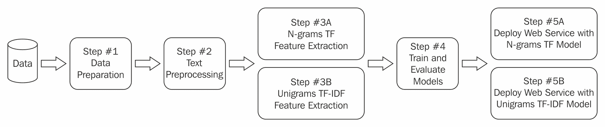
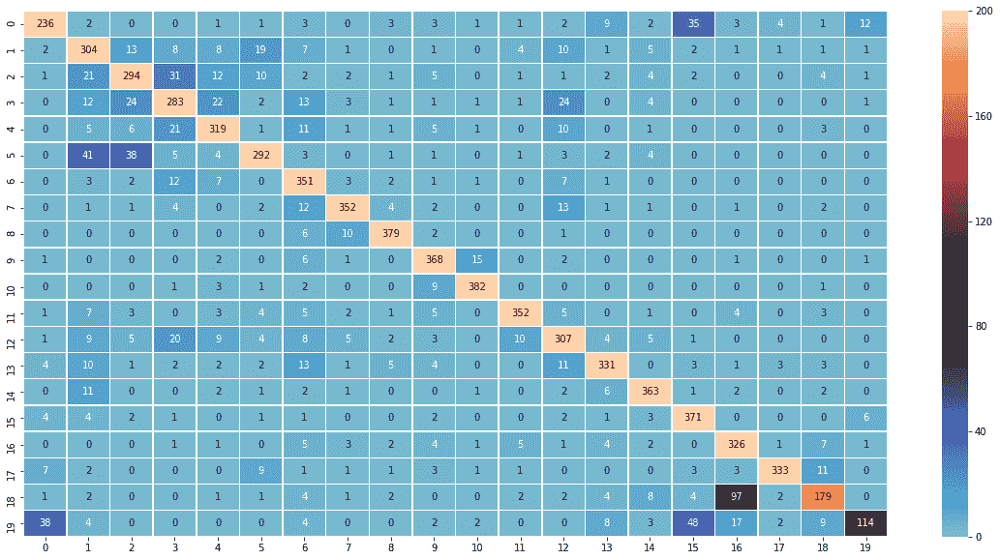

# 第一章：文本分类入门

你可以通过几种方式学习新想法和技能。在美术课上，学生研究颜色，但直到大学才被允许实际绘画。听起来荒谬吗？

不幸的是，这就是大多数现代机器学习的教学方式。专家们正在做类似的事情。他们会告诉你需要了解线性代数、微积分和深度学习。在他们教你如何使用**自然语言处理**（**NLP**）之前，这些都是必须知道的。

在这本书中，我希望我们通过教授整个游戏来学习。在每一节中，我们看到如何解决现实世界的问题，并在过程中学习工具。然后，我们将更深入地了解如何制作这些工具。这种学习和教学风格在很大程度上受到了fast.ai的Jeremy Howard的启发。

下一个重点是尽可能多地提供代码示例。这是为了确保学习一个主题背后有一个清晰和有动机的目的。这有助于我们用直觉理解，而不仅仅是代数符号的数学公式。

在这一章的开头，我们将专注于自然语言处理的介绍。然后，我们将通过代码示例跳入文本分类的例子。

这就是我们的旅程将大致看起来像什么：

+   什么是自然语言处理（NLP）？

+   一个好的自然语言处理工作流程是什么样的？这是为了提高你在任何NLP项目中的成功率。

+   文本分类作为良好自然语言处理管道/工作流程的激励示例。

# 什么是自然语言处理（NLP）？

自然语言处理是使用机器操作自然语言。在这本书中，我们将专注于书面语言，或者用更简单的话说：文本。

实际上，这是一本关于英语文本处理的实践指南。

人类是唯一已知的开发书面语言的物种。然而，孩子们并不是自己学会阅读和写作的。这是为了强调文本处理和自然语言处理的复杂性。

自然语言处理的研究已经存在了50多年。著名的通用人工智能图灵测试就是使用这种语言。这个领域在语言学和计算技术方面都得到了发展。

在能够首先构建事物的精神下，我们将学习如何使用Python的scikit-learn和其他依赖项构建一个简单的文本分类系统。

我们还将讨论这本书是否适合你。

让我们开始吧！

# 为什么要学习自然语言处理（NLP）？

要最大限度地了解这本书，最好的方式是知道你希望自然语言处理为你做什么。

有许多原因可能吸引你学习自然语言处理（NLP）。可能是更高的收入潜力。也许你已经注意到并兴奋于NLP的潜力，例如，关于优步的客户服务机器人。是的，他们主要使用机器人来回答你的投诉，而不是人类。

了解您的动机并将其写下来是有用的。这有助于您选择让您兴奋的问题和项目。这也有助于您在阅读这本书时进行选择。这不是一本《NLP Made Easy》或类似的书籍。让我们坦诚：这是一个具有挑战性的主题。写下您的动机是一个有用的提醒。

作为一项法律声明，附带的代码具有宽松的MIT许可证。您可以在工作中使用它而无需法律麻烦。但话虽如此，每个依赖库都是第三方提供的，您应该**绝对检查**它们是否**允许商业使用**。

我不期望您能够使用这里提到的所有工具和技术。挑选出有意义的部分。

# 您心中有一个问题

您已经有一个问题在心中，比如一个学术项目或工作中的问题。

您是否在寻找您可以使用来起步的最佳工具和技术？

首先，翻到书的索引，看看我是否在这里覆盖了您的问题。我已经在这里分享了某些最常见用例的端到端解决方案。如果没有分享，请不要担心——您仍然受到保护。许多任务的基本技术是通用的。我已经仔细选择了对更广泛受众有用的方法。

# 技术成就

学习对于您来说是一种成就的标志吗？

NLP以及更广泛的数据科学是流行的术语。您是那种想要跟上潮流的人。您是那种从学习新工具、技术和技术中获得乐趣的人。这是您的下一个重大挑战。这是您证明自我学习能力并达到精通的机会。

如果这听起来像您，您可能会对这个作为参考书感兴趣。我专门设置了部分，让我们为您提供足够的方法理解。我向您展示如何使用它，而无需深入研究最新的论文。这是学习更多知识的邀请，您不应该在这里停下来。亲自尝试这些代码示例！

# 做些新鲜事

您有一些领域专业知识。现在，您想在您的领域中做一些没有这些技能不可能做到的事情。确定新可能性的一种方法是将您的领域专业知识与在这里学到的知识结合起来。我在写这本书的时候看到了几个非常大的机会，包括以下内容：

+   非英语语言如印地语、泰米尔语或泰卢固语的NLP。

+   为您所在的领域提供专业的NLP，例如，金融和Bollywood在各自的方式中有不同的语言。您在Bollywood新闻上训练的模型并不期望在金融领域工作。

如果这听起来像您，您需要关注这本书中的文本预处理部分。这些部分将帮助您了解我们如何使文本准备好供机器消费。

# 这本书适合您吗？

这本书的编写是为了保持先前的用例和心态。这里选择的方法、技术、工具和技术是行业级稳定性与学术级结果质量的良好平衡。有几个工具，如parfit和Flashtext，以及像LIME这样的想法，在NLP的背景下从未被提及过。

最后，我理解深度学习方法的重要性和兴奋感，并为NLP方法专门编写了一章关于深度学习。

# NLP工作流程模板

我们中的一些人非常喜欢从事自然语言处理，因为它纯粹是智力上的挑战——跨越研究和工程。为了衡量我们的进度，拥有一个带有粗略时间估计的工作流程是非常有价值的。在本节中，我们将简要概述一个典型的NLP或甚至大多数应用机器学习过程看起来像什么。

我从大多数人那里学到的喜欢使用一个（大致上）五步的过程：

+   理解问题

+   理解和准备数据

+   快速胜利：概念验证

+   迭代和改进结果

+   评估和部署

这只是一个过程模板。它有很多空间来根据你公司的工程文化进行定制。这些步骤中的任何一个都可以进一步分解。例如，数据准备和理解可以进一步分为分析和清理。同样，概念验证步骤可能涉及多个实验，以及从这些实验中提交的最佳结果的演示或报告。

虽然这看起来是一个严格的线性过程，但实际上并非如此。通常情况下，你将希望回顾前面的步骤并更改参数或特定的数据转换，以查看对后续性能的影响。

为了做到这一点，在你的代码中考虑这一过程的循环性质是很重要的。**编写具有良好设计的抽象代码，其中每个组件都是独立可重用的。**

如果你感兴趣于如何编写更好的NLP代码，尤其是用于研究或实验，可以考虑查阅由AllenAI的Joel Grus提供的名为*Writing Code for NLP Research*的幻灯片。

让我们稍微深入到每个这些部分。

# 理解问题

我们将从理解来自实际商业视角的需求和约束开始。这通常回答以下问题：

+   主要问题是什么？我们将尝试正式和非正式地理解我们项目中的假设和期望。

+   我将如何解决这个问题？列出一些你可能之前或在这本书中看到过的想法。这是你将用来规划未来工作的清单。

# 理解和准备数据

文本和语言本质上是未结构化的。我们可能想要以某种方式对其进行清理，例如扩展缩写和首字母缩略词，删除标点符号等。我们还想选择一些样本，这些样本是我们可能在野外看到的数据的最佳代表。

另一种常见的做法是准备一个黄金数据集。黄金数据集是在合理条件下可用的最佳数据。这不是在理想条件下可用的最佳数据。创建黄金数据集通常涉及手动标记和清理过程。

接下来的几节将专注于NLP工作流程这一阶段的文本清理和文本表示。

# 快速胜利 – 概念验证

我们希望快速识别出对我们来说似乎有效的算法和数据集组合类型。然后我们可以专注于它们，并更深入地研究它们。

这里得到的结果将帮助你估计你面前的工作量。例如，如果你打算开发一个仅基于关键词的文档搜索系统，你的主要工作可能将是部署一个开源解决方案，如ElasticSearch。

假设你现在想要添加一个类似文档的功能。根据预期的结果质量，你可能需要研究诸如doc2vec和word2vec等技术，或者甚至使用Keras/Tensorflow或PyTorch的一些卷积神经网络解决方案。

这一步对于从你周围的人，如你的老板，那里获得更大的支持，投入更多精力和资源至关重要。在工程角色中，这个演示应该突出你的工作部分，这些部分是货架系统通常无法做到的。这些是你的独特优势。这些通常是其他系统无法提供的见解、定制和控制。

# 迭代和改进

在这一点上，我们已经选择了一系列算法、数据和方 法，它们对我们来说有令人鼓舞的结果。

# 算法

如果你的算法是机器学习或统计性质，你通常会剩下很多余量。

在早期阶段，对于一些参数，你可能只需要选择一个足够好的默认值。在这里，你可能想要加大力度，检查这些参数的最佳值。这个想法有时被称为参数搜索，或者按照机器学习的术语，称为超参数调整。

你可能想要以特定方式将一种技术的结果与其他技术结合。例如，某些统计方法可能非常适合在文本中找到名词短语并使用它们进行分类，而深度学习方法（我们可以称之为DL-LSTM）可能最适合整个文档的文本分类。在这种情况下，你可能希望将名词短语提取和DL-LSTM的额外信息传递给另一个模型。这将允许它利用两者的最佳之处。在机器学习的术语中，这个想法有时被称为堆叠。这在最近非常成功的机器学习竞赛平台Kaggle上非常成功。

# 预处理

在数据预处理或数据清洗阶段进行简单的更改，通常会带来显著更好的结果。例如，确保您的整个语料库都是小写字母，可以帮助您显著减少唯一单词的数量（您的词汇量）。

如果您的词语的数值表示受到词频的影响，有时通过归一化和/或缩放可能会有所帮助。最懒惰的技巧就是简单地除以频率。

# 评估和部署

评估和部署是使您的工作广泛可用的重要组件。您评估的质量决定了其他人信任您工作的程度。部署方式多种多样，但通常会被抽象为单个功能调用或 REST API 调用。

# 评估

假设您有一个模型在分类脑瘤时达到了 99% 的准确率。您能信任这个模型吗？不能。

如果您的模型说没有人有脑瘤，它仍然会有 99%+ 的准确率。为什么？

幸运的是，99% 或更多的民众没有脑瘤！

为了将我们的模型用于实际应用，我们需要超越准确率。我们需要了解模型在哪些方面做得对或错，以便改进它。花一分钟时间理解混淆矩阵将阻止我们继续使用这样的危险模型。

此外，我们还想了解模型在黑盒优化算法之下到底在做什么。t-SNE 等数据可视化技术可以帮助我们做到这一点。

对于持续运行的 NLP 应用程序，如邮件垃圾邮件分类器或聊天机器人，我们希望模型质量评估也能持续进行。这将帮助我们确保模型性能不会随着时间的推移而下降。

# 部署

这本书是以程序员优先的思维方式编写的。我们将学习如何将任何机器学习或 NLP 应用程序作为 REST API 部署，然后可以用于网页和移动设备。这种架构在行业中相当普遍。例如，我们知道亚马逊和领英等数据科学团队就是这样将他们的工作部署到网络上的。

# 示例 - 文本分类工作流程

前面的过程相当通用。对于最常见的一种自然语言应用——文本分类，它看起来会是什么样子？

下面的流程图是由微软 Azure 构建的，这里用它来解释他们的技术如何直接融入到我们的工作流程模板中。他们在特征工程中引入了一些新词，如 unigrams、TF-IDF、TF、n-grams 等：



他们的流程图中的主要步骤如下：

1.  **步骤 1**: 数据准备

1.  **步骤 2**: 文本预处理

1.  **步骤 3**: 特征工程：

    +   Unigram TF-IDF 提取

    +   N-gram TF 提取

1.  **步骤 4**: 训练和评估模型

1.  **步骤 5**: 将训练好的模型作为网络服务部署

这意味着是时候停止谈论并开始编程了。让我们先快速设置环境，然后我们将用30行代码或更少的代码构建我们的第一个文本分类系统。

# Launchpad – 编程环境设置

我们将使用fast.ai机器学习设置来完成这个练习。他们的设置环境非常适合个人实验和行业级概念验证项目。我已经在Linux和Windows上使用过fast.ai环境。我们将在这里使用Python 3.6，因为我们的代码在其他Python版本上无法运行。

在他们的论坛上快速搜索也会带你到如何在大多数云计算解决方案上设置相同内容的最新说明，包括AWS、Google Cloud Platform和Paperspace。

这个环境涵盖了我们将用于大多数主要任务的工具：文本处理（包括清理）、特征提取、机器学习与深度学习模型、模型评估和部署。

它包含spaCy。spaCy是一个开源工具，它被制作成一个行业级自然语言处理工具包。如果有人建议你使用NLTK来完成一项任务，请改用spaCy。接下来的演示将在他们的环境中直接运行。

我们还需要一些其他包来完成后续任务。我们将根据需要安装和设置它们。我们不希望因为不必要的包而膨胀你的安装，你可能甚至都不会使用这些包。

# 30行代码实现文本分类

让我们把分类问题划分为以下步骤：

1.  获取数据

1.  文本到数字

1.  使用sklearn运行ML算法

# 获取数据

20个新闻组数据集在自然语言处理社区中是一个相当知名的数据集。它对于演示目的几乎是理想的。这个数据集在20个类别中具有几乎均匀的分布。这种均匀分布使得快速迭代分类和聚类技术变得容易。

我们将使用著名的20个新闻组数据集进行演示：

```py
from sklearn.datasets import fetch_20newsgroups  # import packages which help us download dataset 
twenty_train = fetch_20newsgroups(subset='train', shuffle=True, download_if_missing=True)
twenty_test = fetch_20newsgroups(subset='test', shuffle=True, download_if_missing=True)
```

大多数现代自然语言处理方法都严重依赖于机器学习方法。这些方法需要将作为字符串文本编写的单词转换为数值表示。这种数值表示可以是简单地分配一个唯一的整数ID，也可以是稍微更全面的浮点值向量。在后一种情况下，这有时被称为向量化。

# 文本到数字

我们将在示例中使用著名的20个新闻组数据集。我们简单地转换每个文档中每个单词出现的次数。因此，每个文档都是一个“袋”，我们计算该袋中每个单词的频率。这也意味着我们失去了文本中存在的任何*顺序*信息。接下来，我们为每个唯一的单词分配一个整数ID。所有这些唯一的单词成为我们的词汇表。我们词汇表中的每个单词都被视为一个机器学习特征。让我们首先创建我们的词汇表。

Scikit-learn 有一个高级组件可以为我们创建特征向量。这被称为 `CountVectorizer`。我们建议您从 scikit-learn 文档中了解更多相关信息：

```py
# Extracting features from text files
from sklearn.feature_extraction.text import CountVectorizer

count_vect = CountVectorizer()
X_train_counts = count_vect.fit_transform(twenty_train.data)

print(f'Shape of Term Frequency Matrix: {X_train_counts.shape}')
```

通过使用 `count_vect.fit_transform(twenty_train.data)`，我们正在学习词汇字典，它返回一个形状为 `['n_samples', 'n_features']` 的文档-词矩阵。这意味着我们有 `n_samples` 个文档或袋，它们之间有 `n_features` 个独特的单词。

现在，我们将能够提取这些词与其所属标签或类别之间的有意义的关系。实现这一点的最简单方法之一是计算每个类别中一个词出现的次数。

我们对此有一个小问题——长文档往往会极大地影响结果。我们可以通过将词频除以该文档中的总词数来归一化这种影响。我们称这为词频，简称 TF。

如 *the*、`a` 和 *of* 这样的词在所有文档中都很常见，并不能真正帮助我们区分文档类别或将它们分开。我们想要强调的是较罕见的词，如 *Manmohan* 和 *Modi*，而不是常见词。实现这一目标的一种方法是通过逆文档频率，或称 IDF。逆文档频率是衡量一个词在所有文档中是常见还是罕见的度量。

我们将 TF 与 IDF 相乘以得到我们的 TF-IDF 指标，该指标总是大于零。TF-IDF 是针对三元组 term t、document d 和词汇字典 D 计算的。

我们可以直接使用以下代码行计算 TF-IDF：

```py
from sklearn.feature_extraction.text import TfidfTransformer

tfidf_transformer = TfidfTransformer()
X_train_tfidf = tfidf_transformer.fit_transform(X_train_counts)

print(f'Shape of TFIDF Matrix: {X_train_tfidf.shape}')
```

最后一行将输出文档-词矩阵的维度，其值为 (11314, 130107)。

请注意，在先前的例子中，我们使用每个词作为特征，因此对每个词计算了 TF-IDF。当我们使用单个词作为特征时，我们称之为 unigram。如果我们使用两个连续的词作为特征，我们称之为 bigram。一般来说，对于 n 个词，我们称之为 n-gram。

# 机器学习

可以使用各种算法进行文本分类。您可以使用以下代码在 scikit 中构建分类器：

```py
from sklearn.linear_model import LogisticRegression as LR
from sklearn.pipeline import Pipeline
```

让我们逐行分析先前的代码。

前两行是简单的导入。我们导入了一个相当知名的逻辑回归模型，并将其重命名为 LR。接下来是管道导入：

"依次应用一系列转换和一个最终估计器。管道的中间步骤必须是“转换”，也就是说，它们必须实现 fit 和 transform 方法。最终的估计器只需要实现 fit 方法。"

- 来自 [sklearn 文档](http://scikit-learn.org/stable/modules/generated/sklearn.pipeline.Pipeline.html)

Scikit-learn 管道在逻辑上是一系列依次应用的运算。首先，我们应用了我们已经看到的两个操作：`CountVectorizer()` 和 `TfidfTransformer()`。接着是 `LR()`。管道是通过 `Pipeline(...)` 创建的，但尚未执行。它只有在从 `Pipeline` 对象调用 `fit()` 函数时才会执行：

```py
text_lr_clf = Pipeline([('vect', CountVectorizer()), ('tfidf', TfidfTransformer()), ('clf',LR())])
text_lr_clf = text_lr_clf.fit(twenty_train.data, twenty_train.target)
```

当调用此函数时，它会调用除了最后一个对象之外的所有对象的转换函数。对于最后一个对象——我们的逻辑回归分类器——它的 `fit()` 函数被调用。这些转换器和分类器也被称为估计器：

<q>"在管道中的所有估计器（除了最后一个），都必须是转换器（也就是说，它们必须有一个转换方法）。最后一个估计器可以是任何类型（转换器、分类器等）。”</q> <q>- 来自 [sklearn 管道文档](http://scikit-learn.org/stable/modules/pipeline.html)</q>

让我们计算这个模型在测试数据上的准确率。为了计算大量值上的平均值，我们将使用一个名为 `numpy` 的科学库：*

```py
import numpy as np
lr_predicted = text_lr_clf.predict(twenty_test.data)
lr_clf_accuracy = np.mean(lr_predicted == twenty_test.target) * 100.

print(f'Test Accuracy is {lr_clf_accuracy}')
```

这会打印出以下输出：

```py
Test Accuracy is 82.79341476367499
```

我们在这里使用了 LR 的默认参数。我们可以在以后使用 `GridSearch` 或 `RandomSearch` 来优化这些参数，以进一步提高准确率。

如果你只想记住本节中的一件事，请记住尝试一个线性模型，如逻辑回归。它们通常对稀疏的高维数据（如文本、词袋或 TF-IDF）相当有效。

除了准确率之外，了解哪些文本类别被混淆为其他类别也是有用的。我们将称之为混淆矩阵。

以下代码使用了我们用来计算测试准确率的相同变量，以找出混淆矩阵：

```py
from sklearn.metrics import confusion_matrix
cf = confusion_matrix(y_true=twenty_test.target, y_pred=lr_predicted)
print(cf)
```

这打印出一个巨大的数字列表，不太容易解释。让我们尝试使用 `print-json` 技巧来美化打印：

```py
import json
print(json.dumps(cf.tolist(), indent=2))
```

这返回以下代码：

```py
[
  [
    236,
    2,
    0,
    0,
    1,
    1,
    3,
    0,
    3,
    3,
    1,
    1,
    2,
    9,
    2,
    35,
    3,
    4,
    1,
    12
  ],
 ...
  [
    38,
    4,
    0,
    0,
    0,
    0,
    4,
    0,
    0,
    2,
    2,
    0,
    0,
    8,
    3,
    48,
    17,
    2,
    9,
    114
  ]
 ]
```

这稍微好一些。我们现在明白这是一个 20 × 20 的数字网格。然而，除非我们能引入一些可视化，否则解释这些数字是一项繁琐的任务。让我们接下来这么做：

```py
# this line ensures that the plot is rendered inside the Jupyter we used for testing this code
%matplotlib inline 

import seaborn as sns
import matplotlib.pyplot as plt

plt.figure(figsize=(20,10))
ax = sns.heatmap(cf, annot=True, fmt="d",linewidths=.5, center = 90, vmax = 200)
# plt.show() # optional, un-comment if the plot does not show
```

这给了我们以下惊人的图：



这个图用不同的颜色方案突出了我们感兴趣的信息。例如，从左上角到右下角的光对角线显示了我们所做的一切正确的事情。如果我们混淆了那些，其他网格会更暗。例如，97 个样本被错误地标记为某一类，这通过第 18 行和第 16 列的深黑色迅速可见。

我们将在本书的稍后部分更详细地深入了解本节的两个部分——模型解释和数据可视化。

# 摘要

在本章中，你感受到了使项目工作所需的一些更广泛的事情。我们通过使用文本分类示例来查看这个过程所涉及的步骤。我们看到了如何使用 scikit-learn 准备文本进行机器学习。我们看到了机器学习中的逻辑回归。我们还看到了混淆矩阵，这是一个快速而强大的工具，可以理解所有机器学习的结果，而不仅仅是 NLP。

我们才刚刚开始。从现在开始，我们将深入探讨每一个步骤，并看看还有哪些其他方法存在。在下一章中，我们将探讨一些常见的文本清洗和提取方法。由于这是我们总共花费高达80%时间的地方，因此花时间和精力去学习它是值得的。
