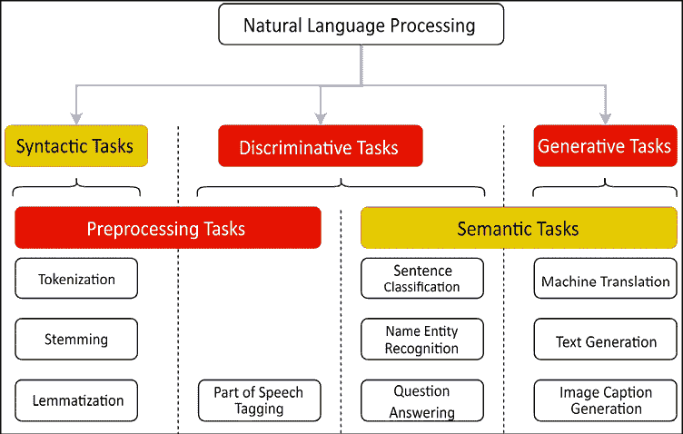
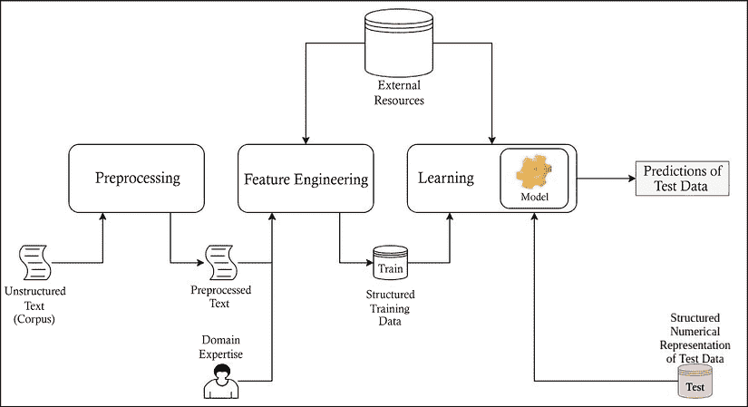
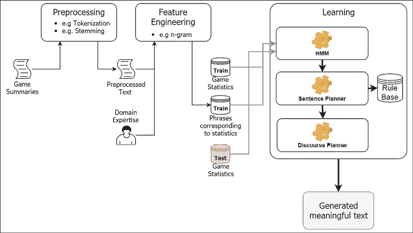
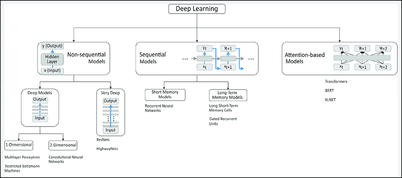
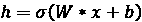
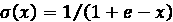
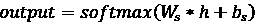
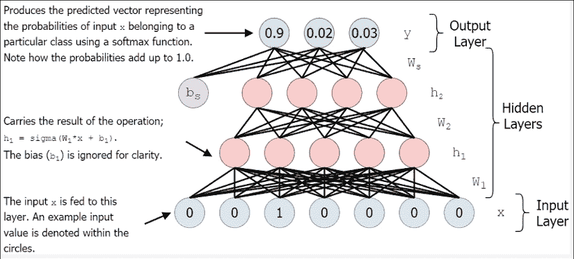
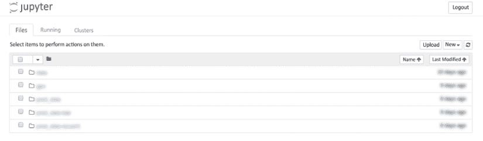

# 第一章：自然语言处理简介

**自然语言处理**（**NLP**）提供了一整套急需的工具和算法，用于理解和处理当今世界大量的非结构化数据。近年来，深度学习因其在许多 NLP 任务中的卓越表现被广泛采用，尤其是在图像分类、语音识别和真实感文本生成等具有挑战性的任务中。TensorFlow 是当前最直观高效的深度学习框架之一，能够实现这些惊人的成果。本书将帮助有志成为深度学习开发者的人，使用 NLP 和 TensorFlow 处理海量数据。本章涵盖以下内容：

+   什么是自然语言处理？

+   自然语言处理的任务

+   自然语言处理的传统方法

+   自然语言处理的深度学习方法

+   技术工具简介

本章将介绍 NLP 及本书的其他内容。我们将回答“什么是自然语言处理？”这一问题。同时，我们也将探讨一些 NLP 最重要的应用案例。我们还将讨论传统方法和近年来基于深度学习的 NLP 方法，包括**全连接神经网络**（**FCNN**）。最后，我们将总结本书的其他章节和将要使用的技术工具。

# 什么是自然语言处理？

根据分析公司 DOMO（[`www.domo.com/`](https://www.domo.com/)）的数据，到 2020 年，全球每人每秒产生 1.7MB 的数据，互联网活跃用户达到 46 亿。这些数据包括大约 50 万条推文和 3060 亿封邮件每天流通。这些数字在本书写作过程中仅有一个方向，那就是不断增长！在这些数据中，大量是非结构化的文本和语音数据，因为每天都有数十亿封邮件、社交媒体内容和电话被创建和拨打。

这些统计数据为我们定义 NLP 提供了良好的基础。简而言之，NLP 的目标是使机器理解我们口语和书面语言。此外，NLP 无处不在，已经成为人类生活的重要组成部分。**虚拟助手**（**VAs**），例如谷歌助手、Cortana、Alexa 和苹果 Siri，基本上是 NLP 系统。当你向虚拟助手询问“*Can you show me a good Italian restaurant nearby?*”时，涉及了许多 NLP 任务。首先，虚拟助手需要将语音转化为文本（即语音转文本）。接下来，它必须理解请求的语义（例如，识别最重要的关键词，如餐厅和意大利菜），并形成一个结构化的请求（例如，菜系 = 意大利，评分 = 3–5，距离 < 10 公里）。然后，虚拟助手必须根据地点和菜系过滤餐厅，并按照评分对餐厅进行排序。为了计算餐厅的总体评分，一个好的 NLP 系统可能会查看每个用户提供的评分和文本描述。最后，一旦用户到达餐厅，虚拟助手可能会帮助用户将菜单中的意大利语条目翻译成英语。这个例子表明，NLP 已经成为人类生活的一个不可或缺的部分。

应该理解的是，NLP 是一个极具挑战性的研究领域，因为单词和语义之间有着高度复杂的非线性关系，而且要将这些信息捕捉为稳健的数值表示更为困难。更糟糕的是，每种语言都有自己独特的语法、句法和词汇。因此，处理文本数据涉及各种复杂的任务，例如文本解析（例如，分词和词干提取）、形态学分析、词义消歧和理解语言的基础语法结构。例如，在这两句话中，*I went to the bank* 和 *I walked along the river bank*，词语*bank*有着完全不同的含义，因为它们使用的上下文不同。为了区分或（消歧）*bank*这个词，我们需要理解它所使用的上下文。机器学习已经成为 NLP 的一个关键推动力，帮助通过机器完成上述任务。以下是我们讨论的 NLP 中的一些重要任务：

# 自然语言处理的任务

自然语言处理（NLP）在现实世界中有着广泛的应用。一个好的 NLP 系统是能够执行多种 NLP 任务的系统。当你在谷歌搜索今天的天气，或者使用谷歌翻译查看“*How are you?*”用法语怎么说时，你依赖的正是 NLP 中的一部分任务。我们将在此列举一些最常见的任务，本书涵盖了大部分这些任务：

+   **分词**：分词是将文本语料库分割成原子单位（例如单词或字符）的任务。虽然对于像英语这样的语言来说，分词可能看起来微不足道，但它仍然是一个重要任务。例如，在日语中，单词之间并没有空格或标点符号作为分隔符。

+   **词义消歧** (**WSD**)：WSD 是识别单词正确意义的任务。例如，在句子 *The dog barked at the mailman* 和 *Tree bark is sometimes used as a medicine* 中，单词 *bark* 有两个不同的含义。WSD 对于问答等任务至关重要。

+   **命名实体识别** (**NER**)：NER 旨在从给定的文本或文本语料库中提取实体（例如，人名、地点、组织等）。例如，句子 *John gave Mary two apples at school on Monday* 将被转换为 *[John]name 给了 [Mary]name [two]number 个苹果，在 [school]organization 上 [Monday]time*。NER 在信息检索和知识表示等领域中是一个重要话题。

+   **词性标注** (**PoS**) **标注**：PoS 标注是将单词分配到其相应词性的任务。它可以是基本标签，如名词、动词、形容词、副词和介词，也可以是更细粒度的标签，如专有名词、普通名词、短语动词、动词等。Penn Treebank 项目是一个专注于 PoS 的流行项目，它定义了一个全面的 PoS 标签列表，详见 [`www.ling.upenn.edu/courses/ling001/penn_treebank_pos.html`](https://www.ling.upenn.edu/courses/ling001/penn_treebank_pos.html)。

+   **句子/摘要分类**：句子或摘要（例如，电影评论）分类有许多应用场景，如垃圾邮件检测、新闻文章分类（例如，政治、科技和体育）以及产品评论评级（即正面或负面）。这一任务通过使用标注数据（即由人工标注的评论，带有正面或负面标签）训练分类模型来实现。

+   **文本生成**：在文本生成中，学习模型（例如神经网络）通过文本语料库（大量文本文件集合）进行训练，然后预测接下来的新文本。例如，语言建模可以通过使用现有的科幻故事进行训练，生成一个全新的科幻故事。

最近，OpenAI 发布了一个名为 OpenAI-GPT-2 的语言模型，它能够生成极为真实的文本。此外，这项任务在理解语言中起着非常重要的作用，有助于下游决策支持模型的快速启动。

+   **问答系统** (**QA**)：问答技术具有很高的商业价值，这些技术是聊天机器人和虚拟助手（例如，谷歌助手和苹果 Siri）的基础。许多公司已经采用了聊天机器人来提供客户支持。聊天机器人可以用来回答并解决简单的客户问题（例如，修改客户的月度手机套餐），这些问题可以在不需要人工干预的情况下解决。问答技术涉及到自然语言处理的许多其他方面，如信息检索和知识表示。因此，开发一个问答系统是非常困难的。

+   **机器翻译** (**MT**)：机器翻译是将源语言（例如，德语）的句子/短语转换为目标语言（例如，英语）的任务。这是一个非常具有挑战性的任务，因为不同的语言具有不同的句法结构，这意味着它并不是一种一对一的转换。此外，不同语言之间的词与词之间的关系可能是多对一、一对一、一对多或多对多的。这就是机器翻译文献中的**词对齐问题**。

最后，为了开发一个能够帮助人类处理日常任务的系统（例如，虚拟助手或聊天机器人），许多任务需要以无缝的方式进行协同。如我们在前面的例子中所见，用户问：“*你能给我推荐一家附近的意大利餐厅吗？*”时，多个不同的自然语言处理任务，如语音转文本、语义分析和情感分析、问答和机器翻译等，都需要完成。在*图 1.1*中，我们提供了一个分层分类法，将不同的自然语言处理任务分为几种不同的类型。将一个自然语言处理任务归类为某一单一类别是一个困难的任务。因此，您可以看到有些任务跨越了多个类别。我们将这些类别分为两大类：基于语言的（浅色背景，黑色文字）和基于问题的（深色背景，白色文字）。语言学分类有两类：句法（基于结构）和语义（基于意义）。基于问题的分类则有三类：预处理任务（在输入模型之前对文本数据进行处理的任务）、判别性任务（我们试图将输入文本分配到一个或多个预定义类别的任务）和生成性任务（我们试图生成新的文本输出的任务）。当然，这只是其中一种分类方法，但它展示了将一个具体的自然语言处理任务归入特定类别的难度。



图 1.1：自然语言处理中常见任务的分类，按更广泛的类别进行划分

在理解了自然语言处理的各种任务后，我们接下来将讨论如何借助机器来解决这些任务。我们将讨论传统方法和基于深度学习的方法。

# 自然语言处理的传统方法

传统或经典的 NLP 解决方法是一个包含几个关键步骤的顺序流程，并且它是一种统计方法。当我们仔细观察传统的 NLP 学习模型时，会发现一系列明确的任务在进行，比如通过去除不需要的数据来预处理数据，进行特征工程以获得文本数据的良好数值表示，使用训练数据学习机器学习算法，并为新颖的、未见过的数据进行预测。在这些任务中，特征工程是获取良好性能的最耗时和最关键的步骤。

## 了解传统方法

传统的 NLP 任务解决方法包括一系列不同的子任务。首先，文本语料库需要经过预处理，重点是减少词汇量和*干扰*。

我所说的*干扰*是指那些使算法无法捕捉到任务所需的关键信息的事物（例如，标点符号和停用词的去除）。

接下来是几个特征工程步骤。特征工程的主要目标是使算法的学习更加轻松。通常，特征是手动设计的，并且倾向于基于人类对语言的理解。特征工程对于经典的 NLP 算法至关重要，因此，表现最好的系统通常具有最精心设计的特征。例如，对于情感分类任务，你可以用一个语法树来表示一个句子，并为树中的每个节点/子树分配正面、负面或中立标签，从而将句子分类为正面或负面。此外，特征工程阶段还可以使用外部资源，如 WordNet（一个词汇数据库，可以提供关于不同单词如何相互关联的见解——例如，同义词），来开发更好的特征。我们很快会看到一种简单的特征工程技术，称为*词袋模型*。

接下来，学习算法使用获得的特征以及可选的外部资源来在给定任务上表现良好。例如，对于文本摘要任务，一个包含常见短语和简洁释义的平行语料库将是一个很好的外部资源。最后，进行预测。预测过程是直接的，你只需输入新数据，并通过学习模型将输入传递以获得预测标签。传统方法的整个过程如*图 1.2*所示：



图 1.2：经典 NLP 的一般方法

接下来，让我们讨论一个使用自然语言处理（NLP）生成足球比赛摘要的用例。

### 示例 – 生成足球比赛摘要

为了深入了解传统的自然语言处理（NLP）方法，我们考虑一个基于足球比赛统计数据的自动文本生成任务。我们有多个比赛统计数据集（例如，比分、罚球和黄牌）以及由记者为该比赛生成的相应文章，作为训练数据。我们还假设对于一场特定的比赛，我们有一个映射，将每个统计参数与该参数的摘要中最相关的短语对应起来。我们在这里的任务是，给定一场新的比赛，我们需要生成一篇自然流畅的比赛摘要。当然，这可以像从训练数据中找到最匹配的统计数据并检索相应的摘要一样简单。然而，也有更复杂和优雅的文本生成方式。

如果我们结合机器学习来生成自然语言，可能会执行一系列操作，如预处理文本、特征工程、学习和预测。

**预处理**：文本涉及的操作包括分词（例如，将“I went home”分割为“I”、“went”、“home”），词干提取（例如，将*listened*转化为*listen*），以及去除标点符号（例如，！和；），目的是减少词汇量（即特征），从而减少数据的维度。对于英语等语言来说，分词可能显得微不足道，因为单词是孤立的；然而，对于泰语、日语和中文等语言来说，情况并非如此，因为这些语言的词语并不是始终被清晰地分隔开来。接下来，需要理解的是，词干提取也并不是一个简单的操作。表面上看，词干提取似乎是一个简单的操作，依赖于一些简单的规则，例如去除动词后的*ed*（例如，*listened*的词干结果是*listen*）；然而，开发一个好的词干提取算法需要的不仅仅是简单的规则库，因为某些词的词干提取是棘手的（例如，使用基于规则的词干提取，*argued*的词干结果是*argu*）。此外，正确进行词干提取所需的工作量在不同语言中可能有很大不同。

**特征工程**用于将原始文本数据转换为具有吸引力的数字表示，从而可以在这些数据上训练模型，例如，将文本转换为词袋模型（bag-of-words）表示，或者使用 n-gram 表示法，我们稍后会讨论。然而，请记住，最先进的经典模型依赖于更为复杂的特征工程技术。

以下是一些特征工程技术：

**词袋模型（Bag-of-words）**：这是一种基于词频创建特征表示的特征工程技术。例如，我们考虑以下句子：

+   *鲍勃去市场买了一些花*

+   *鲍勃买了花要送给玛丽*

这两句话的词汇表是：

[“Bob”, “went”, “to”, “the”, “market”, “buy”, “some”, “flowers”, “bought”, “give”, “Mary”]

接下来，我们将为每个句子创建一个大小为 `V`（词汇表大小）的特征向量，表示词汇表中每个单词在句子中出现的次数。在这个例子中，句子的特征向量分别如下：

[1, 1, 2, 1, 1, 1, 1, 1, 0, 0, 0]

[1, 0, 2, 1, 0, 0, 0, 1, 1, 1, 1]

bag-of-words 方法的一个重要限制是它失去了上下文信息，因为单词的顺序不再被保留。

**n-gram**：这是一种将文本拆分为更小组件的特征工程技术，这些组件由 `n` 个字母（或单词）组成。例如，2-gram 将文本拆分为两个字母（或两个单词）的实体。考虑下面这个句子：

*Bob 去市场买花了*

该句子的字母级 n-gram 分解如下：

[“Bo”, “ob”, “b “, “ w”, “we”, “en”, ..., “me”, “e “,” f”, “fl”, “lo”, “ow”, “we”, “er”, “rs”]

基于单词的 n-gram 分解如下：

[“Bob went”, “went to”, “to the”, “the market”, ..., “to buy”, “buy some”, “some flowers”]

这种表示方法（字母级）的优点是，词汇表会显著小于我们使用单词作为大语料库特征时的情况。

接下来，我们需要对数据进行结构化处理，以便将其输入到学习模型中。例如，我们将使用形如（*统计数据，解释该统计数据的短语*）的数据元组，如下所示：

总进球数 = 4，“上半场结束时，两队各打入了 2 个进球，比赛为平局”

队伍 1 = 曼联，“比赛在曼联和巴塞罗那之间进行”

队伍 1 的进球数 = 5，“曼联成功打入了 5 个进球”

**学习过程**可能包括三个子模块：**隐马尔可夫模型**（**HMM**）、句子规划器和话语规划器。HMM 是一种递归模型，可以用于解决时间序列问题。例如，生成文本是一个时间序列问题，因为生成的单词顺序很重要。在我们的例子中，HMM 可以通过在统计语料库和相关短语上训练来学习建模语言（即生成有意义的文本）。我们将训练 HMM，使其能够在统计数据作为输入的情况下，生成相关的文本序列。一旦训练完成，HMM 就可以用于递归推理，我们从一个种子（例如统计数据）开始，预测描述的第一个单词，然后使用预测的单词生成下一个单词，依此类推。

接下来，我们可以使用一个句子规划器来修正模型可能引入的任何语法或语法错误。例如，句子规划器可能会将短语 *I go house* 转换为 *I go home*。为此，它可以使用一个包含正确表达方式的规则数据库，例如在动词和单词 *house* 之间需要一个介词。

使用 HMM 和句子规划器，我们将得到语法正确的句子。接下来，我们需要以一种方式将这些短语整理起来，使得由这些短语构成的文章既易于阅读又流畅。例如，考虑以下三句话，*巴塞罗那队的 10 号球员在下半场进了一个球，巴塞罗那与曼联对阵，曼联的 3 号球员在上半场领到一张黄牌*；将这些句子按此顺序排列并没有太大意义。我们希望按以下顺序排列它们：*巴塞罗那与曼联对阵，曼联的 3 号球员在上半场领到一张黄牌，巴塞罗那队的 10 号球员在下半场进了一个球*。为了做到这一点，我们使用话语规划器；话语规划器可以组织一组信息，使其意义能够正确传达。

现在，我们可以获得一组任意的测试统计数据，并通过遵循上述工作流程来获取一篇解释这些统计数据的文章，如*图 1.3*所示：



图 1.3：解决语言建模任务的经典方法

在这里，需要注意的是，这只是一个非常高层次的解释，仅涵盖了最有可能出现在传统自然语言处理（NLP）中的一些主要通用组件。具体细节在很大程度上会根据我们希望解决的特定应用而有所不同。例如，某些任务可能需要额外的应用特定的关键组件（例如，机器翻译中的规则库和对齐模型）。然而，在本书中，我们不会过多强调这些细节，因为我们的主要目标是讨论更现代的自然语言处理方法。

## 传统方法的缺点

让我们列举出传统方法的几个关键缺点，这将为讨论深度学习的动机奠定良好的基础：

+   传统 NLP 中的预处理步骤需要在文本中嵌入的潜在有用信息（例如，标点符号和时态信息）之间做出权衡，以便通过减少词汇量使学习变得可行。尽管在现代基于深度学习的解决方案中仍然使用预处理，但由于深度网络的大量表示能力以及它们优化高端硬件（如 GPU）的能力，这对于它们来说并不像传统 NLP 工作流中那样至关重要。

+   特征工程是一个非常劳动密集的过程。为了设计一个可靠的系统，需要设计好的特征。这个过程可能非常繁琐，因为不同的特征空间需要进行广泛的探索和评估。此外，为了有效地探索鲁棒特征，还需要领域专长，而对于某些 NLP 任务来说，这种专长可能稀缺且成本高昂。

+   要使其表现良好，需要各种外部资源，而且可自由获取的资源并不多。这些外部资源通常由手动创建的信息存储在大型数据库中。为某个特定任务创建这样的资源可能需要数年时间，具体取决于任务的复杂性（例如，机器翻译规则库）。

现在，让我们讨论一下深度学习如何帮助解决 NLP 问题。

# 深度学习在自然语言处理中的应用

我认为可以安全地说，深度学习革新了机器学习，特别是在计算机视觉、语音识别以及当然，NLP（自然语言处理）等领域。深度模型在机器学习的许多领域中引发了一波范式的转变，因为深度模型从原始数据中学习到了丰富的特征，而不是依赖于有限的人为工程特征。这导致了烦人的、昂贵的特征工程变得过时。通过这一点，深度模型使得传统的工作流程更加高效，因为深度模型同时进行特征学习和任务学习。此外，由于深度模型中大量的参数（即权重），它可以涵盖比人工工程特征更多的特征。然而，由于模型的可解释性差，深度模型被视为黑盒。例如，理解深度模型在给定问题中学习到的“如何”和“什么”特征仍然是一个活跃的研究领域。但重要的是要理解，越来越多的研究正在专注于“深度学习模型的可解释性”。

深度神经网络本质上是一种人工神经网络，具有输入层、中间许多互联的隐藏层，最后是输出层（例如分类器或回归器）。正如你所看到的，这形成了一个从原始数据到预测的端到端模型。这些中间的隐藏层赋予了深度模型强大的能力，因为它们负责从原始数据中学习良好的特征，最终成功地完成任务。现在，让我们简要了解深度学习的历史。

## 深度学习的历史

让我们简要讨论深度学习的起源，以及这个领域是如何发展成机器学习中非常有前景的技术的。1960 年，Hubel 和 Weisel 进行了一项有趣的实验，发现猫的视觉皮层由简单细胞和复杂细胞组成，并且这些细胞以层级形式组织。除此之外，这些细胞对不同的刺激反应不同。例如，简单细胞对各种不同方向的边缘有反应，而复杂细胞对空间变化（例如，边缘的方向）不敏感。这激发了人们希望在机器中复制类似行为的动机，从而产生了人工神经网络的概念。

在随后的几年里，神经网络引起了许多研究人员的关注。1965 年，一种通过**数据处理组法**（**GMDH**）训练的神经网络，基于 Rosenblatt 的著名*感知机*，由 Ivakhnenko 等人提出。随后，在 1979 年，福岛提出了*Neocognitron*，为深度模型的最著名变体之一——卷积神经网络（CNNs）播下了种子。与始终接受 1D 输入的感知机不同，Neocognitron 能够通过卷积操作处理 2D 输入。

人工神经网络通过反向传播误差信号来优化网络参数，方法是计算给定层权重相对于损失的梯度。然后，通过将权重推向梯度的反方向来更新它们，以最小化损失。对于距离输出层更远的层（即计算损失的地方），算法使用链式法则来计算梯度。使用多层链式法则导致了一个实际问题，称为梯度消失问题，严格限制了神经网络的层数（深度）。距离输入层较近的层（即距离输出层较远的层）的梯度非常小，导致模型训练提前停止，从而导致欠拟合的模型。这就是**梯度消失现象**。

然后，在 2006 年，人们发现通过最小化*重建误差*（通过尝试将输入压缩为更低的维度，然后将其重建回原始维度）对深度神经网络进行*预训练*，能够为网络的每一层提供一个良好的初始起点；这使得从输出层到输入层的梯度能够保持一致流动。这本质上使得神经网络模型能够有更多层，而不会出现梯度消失的负面影响。此外，这些更深的模型能够在许多任务中超越传统的机器学习模型，尤其是在计算机视觉方面（例如，MNIST 手写数字数据集的测试准确率）。随着这一突破，深度学习成为了机器学习领域的流行词。

2012 年，AlexNet（由 Alex Krizhevsky、Ilya Sutskever 和 Geoffrey Hinton 创建的深度卷积神经网络）赢得了 2012 年**大规模视觉识别挑战赛**（**LSVRC**），相较于之前的最佳成绩，错误率下降了 10%。在此期间，语音识别取得了进展，使用深度神经网络的最新语音识别技术报告了很高的准确率。此外，人们开始意识到**图形处理单元**（**GPU**）能够提供更多的并行计算，从而相比**中央处理单元**（**CPU**）能够更快地训练更大、更深的网络。

深度模型通过更好的模型初始化技术（例如 Xavier 初始化）得到了进一步的改进，这使得耗时的预训练变得不再必要。同时，引入了更好的非线性激活函数，如**修正线性单元**（**ReLUs**），缓解了深层模型中梯度消失的困境。更好的优化（或学习）技术，如 Adam 优化器，自动调整神经网络模型中成千上万个参数的个体学习率，这在许多不同的机器学习领域（如目标分类和语音识别）中重新定义了最先进的性能。这些进展还使得神经网络模型能够拥有大量的隐藏层。增加隐藏层的数量（即使神经网络更深）是神经网络模型相比其他机器学习模型显著提高性能的主要因素之一。此外，更好的中间正则化方法，如批量归一化层，也提高了深度网络在许多任务中的表现。

后来，甚至更深的模型，如 ResNets、Highway Nets 和 Ladder Nets 被引入，这些模型拥有数百层和数十亿个参数。借助各种经验性和理论启发的技术，实现如此巨大的层数成为可能。例如，ResNets 使用捷径连接或跳跃连接，将远距离的层连接起来，从而最小化了前面提到的层与层之间梯度的消失问题。

## 深度学习和自然语言处理的现状

自 2000 年初以来，许多不同的深度模型问世。尽管它们有相似之处，例如都使用输入和参数的非线性变换，但细节可以有很大差异。例如，**CNN**可以直接从二维数据（例如 RGB 图像）中学习，而多层感知机模型则要求输入展开为一维向量，导致重要的空间信息丢失。

在处理文本时，作为文本的最直观解释之一是将其视为字符序列，因此学习模型应能够进行时间序列建模，从而需要对过去的*记忆*。为了解释这一点，可以考虑语言建模任务；单词*cat*的下一个单词应该与单词*climbed*的下一个单词不同。一个具有这种能力的流行模型被称为**递归神经网络**（**RNN**）。我们将在*第六章*，*递归神经网络*中，通过互动练习了解 RNN 是如何实现这一目标的。

需要注意的是，*记忆*并不是学习模型固有的简单操作。相反，记忆的持久化方式需要精心设计。

此外，术语*memory*不应与非顺序深度网络的学习权重混淆，后者仅查看当前输入，而顺序模型（例如 RNN）会查看学习的权重以及序列中的前一个元素，以预测下一个输出。

RNN 的一个突出缺点是它们无法记住超过几个（大约七个）时间步，因此缺乏长期记忆。**长短期记忆**（**LSTM**）网络是 RNN 的扩展，封装了长期记忆。因此，LSTM 在如今通常优于标准的 RNN。我们将在*第七章，理解长短期记忆网络*中深入了解它们，以便更好地理解它们。

最终，Google 最近引入了一种被称为**Transformer**的模型，它在许多自然语言处理任务中超过了许多先前的最先进模型，如 LSTM。此前，递归模型（如 LSTM）和卷积模型（如 CNN）主导了 NLP 领域。例如，CNN 被用于句子分类、机器翻译和序列到序列的学习任务。然而，Transformer 使用的是完全不同的方法，它既不使用递归也不使用卷积，而是采用了注意力机制。注意力机制使得模型能够一次性查看整个序列，以产生单一的输出。例如，考虑句子“*The animal didn’t cross the road because it was tired*。”在生成“*it*”一词的中间表示时，模型会从学习中知道“*it*”指代的是“*animal*”。注意力机制使 Transformer 模型能够学习这种关系。这个能力是标准的递归模型或卷积模型无法复制的。我们将在*第十章，Transformer*和*第十一章，使用 Transformer 进行图像字幕生成*中进一步探讨这些模型。

总结来说，我们可以将深度网络主要分为三类：非序列模型，这类模型在训练和预测时每次只处理一个输入（例如，图像分类）；序列模型，这类模型处理任意长度的输入序列（例如，文本生成，其中每个单词是一个输入）；最后是基于注意力的模型，它们一次性查看整个序列，例如 Transformer、BERT 和 XLNet，这些是基于 Transformer 架构的预训练模型。我们可以将非序列模型（也称为前馈模型）进一步分为深度模型（大约少于 20 层）和非常深的网络（可以超过数百层）。序列模型则分为短期记忆模型（例如 RNNs），这些模型只能记住短期模式，以及长期记忆模型，它们能记住更长时间的模式。在*图 1.4*中，我们概述了上述分类。你现在不需要完全理解这些不同的深度学习模型，但它们展示了深度学习模型的多样性：



图 1.4：常用深度学习方法的一般分类，分为几类

现在，让我们迈出第一步，理解神经网络的内部工作原理。

## 理解一个简单的深度模型——一个全连接神经网络

现在，让我们更仔细地看一下深度神经网络，以便更好地理解。虽然深度模型有许多不同的变体，但我们先来看其中最早的模型之一（可以追溯到 1950-60 年代），即**全连接神经网络**（**FCNN**），有时也叫做多层感知器。*图 1.5*展示了一个标准的三层 FCNN。

FCNN 的目标是将输入（例如，图像或句子）映射到某个标签或注释（例如，图像的物体类别）。这是通过使用输入 `x` 来计算 `h` —— `x` 的隐藏表示 —— 来实现的，使用如 ** 这样的变换；这里，`W` 和 `b` 分别是 FCNN 的权重和偏置，** 是 sigmoid 激活函数。神经网络在每一层使用非线性激活函数。sigmoid 激活就是一种这样的激活函数。它是对一层输出的逐元素变换，其中 `x` 的 sigmoid 输出由 ** 给出。接下来，在 FCNN 的顶部放置一个分类器，它可以利用隐藏层中学习到的特征来对输入进行分类。分类器是 FCNN 的一部分，实际上是另一个隐藏层，具有一些权重 `W[s]` 和偏置 `b[s]`。另外，我们可以计算 FCNN 的最终输出为 **。例如，可以使用 softmax 分类器来处理多标签分类问题。它提供了分类器层输出分数的归一化表示。也就是说，它将为分类器层中的各个类别生成一个有效的概率分布。标签被视为具有最高 softmax 值的输出节点。然后，通过此方法，我们可以定义一个分类损失，该损失通过预测的输出标签与实际输出标签之间的差异来计算。一个这样的损失函数的例子是均方损失。如果你不理解损失函数的具体细节也没关系。我们将在后续章节中讨论其中的许多内容。接下来，神经网络的参数 `W`、`b`、`W[s]` 和 `b[s]` 将通过标准的随机优化器（例如，随机梯度下降）进行优化，以减少所有输入的分类损失。*图 1.5* 展示了这一段中解释的过程，适用于三层 FCNN。我们将在 *第三章*《Word2vec——学习词嵌入》中，逐步讲解如何将这样的模型应用于 NLP 任务。



图 1.5：一个完全连接的神经网络（FCNN）示例

让我们来看一个使用神经网络进行情感分析任务的例子。假设我们有一个数据集，其中输入是一句关于电影的正面或负面评价，且对应的标签表示该句子是否真的为正面（*`1`*）或负面（*`0`*）。然后，我们得到一个测试数据集，其中包含单句的电影评论，任务是将这些新句子分类为正面或负面。

我们可以通过遵循以下工作流程来使用神经网络（可以是深度或浅层的，取决于任务的难度）来完成此任务：

1.  对句子按单词进行分词。

1.  将句子转换为固定大小的数字表示（例如，词袋表示）。需要固定大小的表示，因为全连接神经网络需要固定大小的输入。

1.  将数字输入传递给神经网络，预测输出（正面或负面），并与真实目标进行比较。

1.  使用所需的损失函数优化神经网络。

在本节中，我们更详细地探讨了深度学习。我们回顾了 NLP 的历史和当前状态。最后，我们更详细地讨论了全连接神经网络（一种深度学习模型）。

现在，既然我们已经介绍了自然语言处理（NLP），它的任务，以及这些方法如何随着时间的推移不断发展，我们不妨稍作停顿，看看本书剩余部分所需的技术工具。

# 技术工具介绍

本节将向你介绍在接下来的章节练习中将使用的技术工具。首先，我们将简要介绍所提供的主要工具。接下来，我们将提供如何安装每个工具的粗略指南，并附上官方网站提供的详细指南的超链接。此外，我们还将分享一些确保工具正确安装的提示。

## 工具描述

我们将使用 Python 作为编程/脚本语言。Python 是一种非常多用途、易于设置的编程语言，广泛应用于科学和机器学习社区。

此外，还有许多为 Python 构建的科学库，涵盖了从深度学习到概率推理再到数据可视化等多个领域。TensorFlow 就是其中一个在深度学习社区中广为人知的库，提供了许多基本和高级操作，适用于深度学习。接下来，我们将在所有练习中使用 Jupyter Notebook，因为它提供了比使用 Python 脚本更丰富和互动的编程环境。我们还将使用 pandas、NumPy 和 scikit-learn——这三个流行的 Python 库——进行各种杂项任务，如数据预处理。另一个我们将用于处理文本相关操作的库是 NLTK——Python 自然语言工具包。最后，我们将使用 Matplotlib 进行数据可视化。

## 安装 Anaconda 和 Python

Python 在 Windows、macOS 或 Linux 等常用操作系统中安装起来非常方便。我们将使用 Anaconda 来设置 Python，因为它会为 Python 及其必需的库做所有繁琐的设置工作。

安装 Anaconda，请按照以下步骤操作：

1.  从[`www.continuum.io/downloads`](https://www.continuum.io/downloads)下载 Anaconda。

1.  选择适合的操作系统并下载 Python 3.7。

1.  按照[`docs.continuum.io/anaconda/install/`](https://docs.continuum.io/anaconda/install/)上的说明安装 Anaconda。

要检查 Anaconda 是否正确安装，请打开一个终端窗口（Windows 中的命令提示符），然后运行以下命令：

```py
conda --version 
```

如果安装正确，当前 Anaconda 发行版的版本应该显示在终端中。

### 创建一个 Conda 环境

Anaconda 的一个吸引人的特性之一是它允许你创建多个 Conda 或虚拟环境。每个 Conda 环境可以有自己的环境变量和 Python 库。例如，可以创建一个 Conda 环境来运行 TensorFlow 1.x，而另一个可以运行 TensorFlow 2.x。这很棒，因为它允许你将开发环境与主机的 Python 安装中发生的任何更改分开。然后，你可以根据需要激活或取消激活 Conda 环境。

要创建一个 Conda 环境，请按照以下说明操作：

1.  在终端窗口中运行 Conda 并创建 `-n packt.nlp.2 python=3.7`，使用命令 `conda create -n packt.nlp.2 python=3.7`。

1.  更改目录（`cd`）到项目目录。

1.  输入 `activate packt.nlp.2` 在终端中激活新的 Conda 环境。如果成功激活，你应该在终端的用户提示之前看到 `(packt.nlp.2)`。

1.  使用以下选项之一安装所需的库。

1.  如果**有 GPU**，使用 `pip install -r requirements-base.txt -r requirements-tf-gpu.txt`

1.  如果**没有 GPU**，使用 `pip install -r requirements-base.txt -r requirements-tf.txt`

接下来，我们将讨论 TensorFlow GPU 支持的一些先决条件。

## TensorFlow（GPU）软件要求

如果你正在使用 TensorFlow GPU 版本，则需要满足诸如安装 CUDA 11.0 的特定软件要求。详细列表请参见[`www.tensorflow.org/install/gpu#software_requirements`](https://www.tensorflow.org/install/gpu#software_requirements)。

## 访问 Jupyter Notebook

运行完 `pip install` 命令后，你应该可以在 Conda 环境中使用 Jupyter Notebook。要检查 Jupyter Notebook 是否安装正确并且可访问，请按照以下步骤操作：

1.  打开一个终端窗口。

1.  如果还没有激活`packt.nlp.2` Conda 环境，请运行 `activate packt.nlp.2`

1.  运行命令：`jupyter notebook`

应该会打开一个看起来像*图 1.6*的新浏览器窗口：



图 1.6: 成功安装 Jupyter Notebook

## 验证 TensorFlow 安装

在本书中，我们使用的是 TensorFlow 2.7.0。重要的是，你需要安装本书中使用的确切版本，因为 TensorFlow 在从一个版本迁移到另一个版本时可能会发生许多变化。如果一切顺利，TensorFlow 应该安装在 `packt.nlp.2` Conda 环境中。如果你在安装 TensorFlow 时遇到问题，可以在 [`www.tensorflow.org/install`](https://www.tensorflow.org/install) 找到安装指南和故障排除说明。

为了检查 TensorFlow 是否正确安装，按照以下步骤操作：

1.  在 Windows 中打开命令提示符，或在 Linux 或 macOS 中打开终端。

1.  激活 `packt.nlp.2` Conda 环境。

1.  输入 `python` 进入 Python 提示符。你现在应该会看到下面显示的 Python 版本。确保你使用的是 Python 3。

1.  接下来，输入以下命令：

    ```py
    import tensorflow as tf 
    print(tf. version ) 
    ```

如果一切顺利，你应该不会遇到任何错误（如果你的计算机没有专用 GPU，可能会有警告，但可以忽略它们），并且应该显示 TensorFlow 版本 2.7.0。

许多基于云的计算平台也可用，你可以在这些平台上设置自己的机器，并进行各种定制（操作系统、GPU 卡类型、GPU 卡数量等）。许多人正在迁移到这样的云服务，原因包括以下几个优势：

+   更多定制选项

+   更少的维护工作

+   无基础设施要求

一些流行的基于云的计算平台如下：

+   **Google Colab**：[`colab.research.google.com/`](https://colab.research.google.com/)

+   **谷歌云平台**（**GCP**）：[`cloud.google.com/`](https://cloud.google.com/)

+   **亚马逊云服务**（**AWS**）：[`aws.amazon.com/`](https://aws.amazon.com/)

Google Colab 是一个优秀的基于云的平台，允许你编写 TensorFlow 代码并免费在 CPU/GPU 硬件上执行。

# 总结

在本章中，我们广泛探索了 NLP，以便了解构建一个好的基于 NLP 的系统所涉及的任务类型。首先，我们解释了为什么需要 NLP，然后讨论了 NLP 的各种任务，以便大致了解每个任务的目标以及成功完成这些任务的难度。

然后，我们研究了传统的 NLP 解决方法，并通过生成足球比赛的运动总结的示例深入了解了工作流程。我们看到传统方法通常涉及繁琐且耗时的特征工程。例如，为了检查生成短语的正确性，我们可能需要为该短语生成一个解析树。接着，我们讨论了深度学习带来的范式转变，并了解了深度学习如何让特征工程的步骤变得过时。我们从时光旅行开始，回到深度学习和人工神经网络的起源，一直到现代具有数百个隐藏层的大型网络。之后，我们通过一个简单的例子展示了深度模型——多层感知机模型——以便理解这种模型中的数学奇迹（当然是从表面理解！）。

在掌握传统与现代自然语言处理（NLP）方法的基础上，我们讨论了理解本书所涵盖主题的路线图，从学习词嵌入到强大的 LSTM，再到最前沿的 Transformer！最后，我们通过安装 Python、scikit-learn、Jupyter Notebook 和 TensorFlow，设置了我们的虚拟 Conda 环境。

在下一章，你将学习 TensorFlow 的基础知识。到章末时，你应该能轻松编写一个简单的算法，该算法可以接收输入，通过定义的函数转换输入并输出结果。

要访问本书的代码文件，请访问我们的 GitHub 页面：[`packt.link/nlpgithub`](https://packt.link/nlpgithub)

加入我们的 Discord 社区，结识志同道合的人，与超过 1000 名成员一起学习：[`packt.link/nlp`](https://packt.link/nlp)


