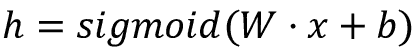
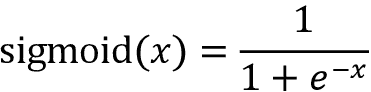
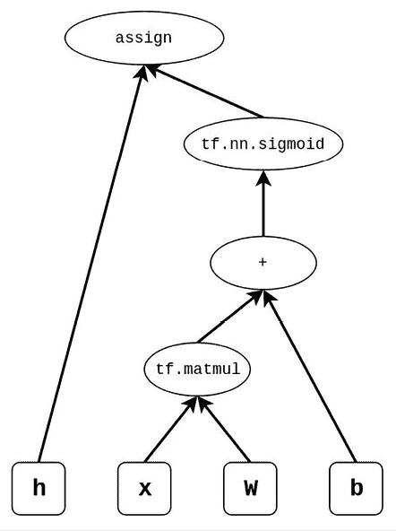
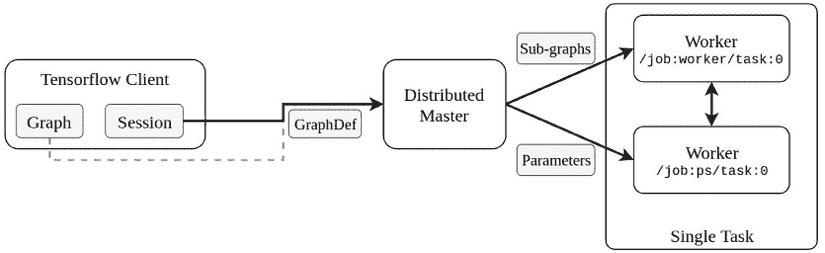
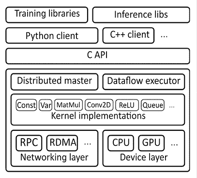
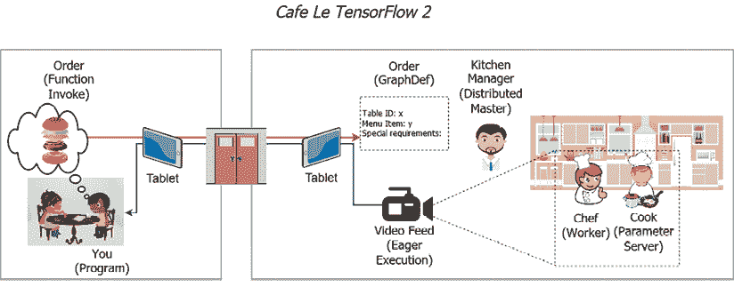
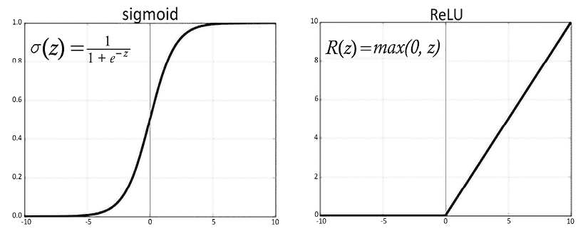
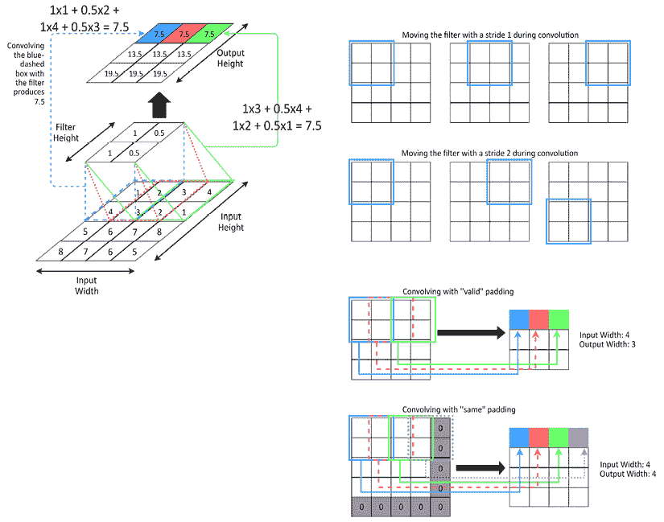
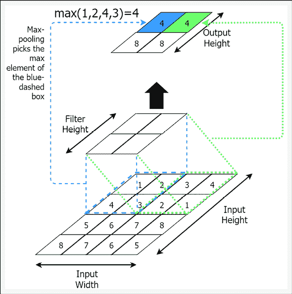
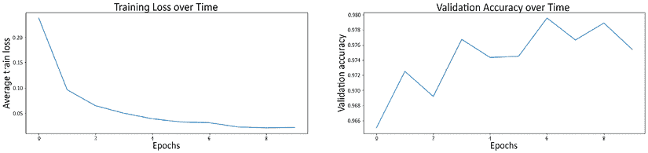

# 第二章：理解 TensorFlow 2

本章将让你深入理解 TensorFlow。它是一个开源的分布式数值计算框架，也是我们将实现所有练习的主要平台。本章涵盖以下主题：

+   什么是 TensorFlow？

+   TensorFlow 的构建模块（例如，变量和操作）

+   使用 Keras 构建模型

+   实现我们的第一个神经网络

我们将通过定义一个简单的计算并尝试使用 TensorFlow 来计算它，开始学习 TensorFlow。完成这一步后，我们将研究 TensorFlow 如何执行这个计算。这将帮助我们理解框架是如何创建一个计算图来计算输出，并执行该图以获得期望的输出。接着，我们将通过使用一个类比——一个高级咖啡馆是如何运作的——来深入了解 TensorFlow 架构如何运作，了解 TensorFlow 如何执行任务。然后，我们将回顾 TensorFlow 1 的工作方式，以便更好地理解 TensorFlow 2 所提供的惊人功能。请注意，当我们单独使用“TensorFlow”这个词时，我们指的是 TensorFlow 2。如果我们提到 TensorFlow 1，则会特别说明。

在对 TensorFlow 的操作有了很好的概念性和技术性理解之后，我们将探讨框架提供的一些重要计算。首先，我们将了解如何在 TensorFlow 中定义各种数据结构，例如变量和张量，并且我们还会看到如何通过数据管道读取输入。接着，我们将学习一些与神经网络相关的操作（例如，卷积操作、定义损失和优化）。

最后，我们将在一个令人兴奋的练习中应用这些知识，实施一个可以识别手写数字图像的神经网络。你还将看到，通过使用像 Keras 这样的高级子模块，你可以非常快速和轻松地实现或原型化神经网络。

# 什么是 TensorFlow？

在 *第一章*，*自然语言处理简介* 中，我们简要讨论了什么是 TensorFlow。现在让我们更仔细地了解它。TensorFlow 是由 Google 发布的一个开源分布式数值计算框架，主要目的是缓解实现神经网络时的痛苦细节（例如，计算神经网络权重的导数）。TensorFlow 通过使用 **计算统一设备架构**（**CUDA**），进一步提供了高效的数值计算实现，CUDA 是 NVIDIA 推出的并行计算平台（关于 CUDA 的更多信息，请访问 [`blogs.nvidia.com/blog/2012/09/10/what-is-cuda-2/`](https://blogs.nvidia.com/blog/2012/09/10/what-is-cuda-2/)）。TensorFlow 的 **应用程序编程接口**（**API**）可以在 [`www.tensorflow.org/api_docs/python/tf/all_symbols`](https://www.tensorflow.org/api_docs/python/tf/all_symbols) 查到，显示了 TensorFlow 提供了成千上万的操作，让我们的生活更轻松。

TensorFlow 不是一夜之间开发出来的。这是由一群有才华、心地善良的开发者和科学家的坚持努力的结果，他们希望通过将深度学习带给更广泛的受众来有所改变。如果你感兴趣，可以查看 TensorFlow 的代码，地址是 [`github.com/tensorflow/tensorflow`](https://github.com/tensorflow/tensorflow)。目前，TensorFlow 拥有约 3,000 名贡献者，并且已经有超过 115,000 次提交，每天都在不断发展，变得越来越好。

## 开始使用 TensorFlow 2

现在让我们通过一个代码示例来学习 TensorFlow 框架中的一些基本组件。我们来编写一个执行以下计算的示例，这是神经网络中非常常见的操作：



这个计算涵盖了全连接神经网络中单个层发生的操作。这里 `W` 和 `x` 是矩阵，`b` 是向量。然后，“`.`”表示点积。sigmoid 是一个非线性变换，给定以下方程：



我们将逐步讨论如何通过 TensorFlow 来进行此计算。

首先，我们需要导入 TensorFlow 和 NumPy。NumPy 是另一个科学计算框架，提供了各种数学和其他操作来处理数据。在运行任何与 TensorFlow 或 NumPy 相关的操作之前，导入它们是必不可少的：

```py
import tensorflow as tf 
import numpy as np 
```

首先，我们将编写一个函数，该函数可以接收 `x`、`W` 和 `b` 作为输入，并为我们执行这个计算：

```py
def layer(x, W, b):    
    # Building the graph
    h = tf.nn.sigmoid(tf.matmul(x,W) + b) # Operation to perform
    return h 
```

接下来，我们添加一个名为 `tf.function` 的 Python 装饰器，如下所示：

```py
@tf.function
def layer(x, W, b):    
    # Building the graph
    h = tf.nn.sigmoid(tf.matmul(x,W) + b) # Operation to perform
    return h 
```

简单来说，Python 装饰器就是另一个函数。Python 装饰器提供了一种干净的方式来调用另一个函数，每次调用被装饰的函数时。换句话说，每次调用 `layer()` 函数时，都会调用 `tf.function()`。这可以用于多种目的，例如：

+   记录函数中的内容和操作

+   验证另一个函数的输入和输出

当 `layer()` 函数通过 `tf.function()` 时，TensorFlow 会追踪函数中的内容（换句话说，就是操作和数据），并自动构建计算图。

计算图（也称为数据流图）构建一个 DAG（有向无环图），显示程序需要什么样的输入，以及需要进行什么样的计算。

在我们的示例中，`layer()` 函数通过使用输入 `x`、`W` 和 `b` 以及一些变换或操作（如 `+` 和 `tf.matmul()`）来生成 `h`：



图 2.1：客户端的计算图

如果我们看一个有向无环图（DAG）的类比，假设输出是一个 *蛋糕*，那么 *图* 就是做这个蛋糕的食谱，其中包含 *原料*（也就是输入）。

在 TensorFlow 中自动构建计算图的特性被称为 **AutoGraph**。AutoGraph 不仅查看传递函数中的操作，还会仔细检查操作的流动。这意味着你可以在函数中使用 `if` 语句或 `for`/`while` 循环，AutoGraph 会在构建图时处理这些情况。你将在下一节中看到更多关于 AutoGraph 的内容。

在 TensorFlow 1.x 中，用户需要显式地实现计算图。这意味着用户不能像平常那样编写典型的 Python 代码，使用 `if-else` 语句或 `for` 循环，而必须使用特定的 TensorFlow 操作，如 `tf.cond()` 和 `tf.control_dependencies()`，来显式地控制操作的流。这是因为，与 TensorFlow 2.x 不同，TensorFlow 1.x 在你调用操作时并不会立即执行它们。相反，在定义它们后，需要通过 TensorFlow `Session` 上下文显式执行。例如，在 TensorFlow 1 中运行以下代码时，

`h = tf.nn.sigmoid(tf.matmul(x,W) + b)`

`h` 在 `Session` 上下文中执行之前不会有任何值。因此，`h` 不能像其他 Python 变量一样处理。如果你不理解 `Session` 是如何工作的，不要担心，我们将在接下来的章节中讨论它。

接下来，你可以立即使用这个函数，方法如下：

```py
x = np.array([[0, 0.1, 0.2, 0.3, 0.4, 0.5, 0.6, 0.7, 0.8, 0.9]],dtype=np.float32) 
```

这里，`x` 是一个简单的 NumPy 数组：

```py
init_w = tf.initializers.RandomUniform(minval=-0.1, maxval=0.1)(shape=[10,5])
W = tf.Variable(init_w, dtype=tf.float32, name='W') 
init_b = tf.initializers.RandomUniform()(shape=[5])
b = tf.Variable(init_b, dtype=tf.float32, name='b') 
```

`W` 和 `b` 是使用 `tf.Variable` 对象定义的 TensorFlow 变量。`W` 和 `b` 存储张量。张量本质上是一个 *n* 维数组。例如，一维向量或二维矩阵都称为 **张量**。`tf.Variable` 是一个可变结构，这意味着存储在该变量中的张量的值可以随时间变化。例如，变量用于存储神经网络的权重，这些权重在模型优化过程中会发生变化。

另外，请注意，对于 `W` 和 `b`，我们提供了一些重要的参数，例如以下内容：

```py
init_w = tf.initializers.RandomUniform(minval=-0.1, maxval=0.1)(shape=[10,5])
init_b = tf.initializers.RandomUniform()(shape=[5]) 
```

这些被称为变量初始化器，是会被初始赋值给 `W` 和 `b` 变量的张量。变量必须提供一个初始值。在这里，`tf.initializers.RandomUniform` 表示我们在 `minval` `(-0.1)` 和 `maxval` `(0.1)` 之间均匀地抽取值并赋给张量。TensorFlow 提供了许多不同的初始化器（[`www.tensorflow.org/api_docs/python/tf/keras/initializers`](https://www.tensorflow.org/api_docs/python/tf/keras/initializers)）。在定义初始化器时，定义初始化器的 *shape*（形状）属性也非常重要。`shape` 属性定义了输出张量的每个维度的大小。例如，如果 `shape` 是 `[10, 5]`，这意味着它将是一个二维结构，在轴 0（行）上有 `10` 个元素，在轴 1（列）上有 `5` 个元素：

```py
h = layer(x,W,b) 
```

最后，`h` 通常被称为 TensorFlow 张量。TensorFlow 张量是一个不可变结构。一旦一个值被赋给 TensorFlow 张量，它就不能再被更改。

正如你所看到的，“张量”（tensor）这个术语有两种使用方式：

+   要引用一个 *n* 维数组

+   要引用 TensorFlow 中的不可变数据结构

对于这两者，底层的概念是相同的，因为它们都持有一个 *n* 维的数据结构，只是在使用的上下文上有所不同。我们将在讨论中交替使用这个术语来指代这些结构。

最后，你可以立即看到 `h` 的值，通过以下代码：

```py
print(f"h = {h.numpy()}") 
```

这将给出：

```py
h = [[0.7027744 0.687556  0.635395  0.6193934 0.6113584]] 
```

`numpy()` 函数从 TensorFlow 张量对象中获取 NumPy 数组。完整的代码如下。章节中的所有代码示例都可以在 `ch2` 文件夹中的 `tensorflow_introduction.ipynb` 文件中找到：

```py
@tf.function
def layer(x, W, b):    
    # Building the graph
    h = tf.nn.sigmoid(tf.matmul(x,W) + b) # Operation to be performed
    return h
x = np.array([[0, 0.1, 0.2, 0.3, 0.4, 0.5, 0.6, 0.7, 0.8, 0.9]], dtype=np.float32) 
# Variable
init_w = tf.initializers.RandomUniform(minval=-0.1, maxval=0.1)(shape=[10,5])
W = tf.Variable(init_w, dtype=tf.float32, name='W') 
# Variable
init_b = tf.initializers.RandomUniform()(shape=[5])
b = tf.Variable(init_b, dtype=tf.float32, name='b') 
h = layer(x,W,b)
print(f"h = {h.numpy()}") 
```

供以后参考，我们称这个示例为 *sigmoid 示例*。

正如你已经看到的，定义 TensorFlow 计算图并执行它是非常“Pythonic”的。这是因为 TensorFlow 执行其操作是“急切的”（eager），即在调用`layer()`函数后立即执行。这是 TensorFlow 中一种特殊模式，称为 *急切执行* 模式。在 TensorFlow 1 中这是一个可选模式，但在 TensorFlow 2 中已经成为默认模式。

还请注意，接下来的两个章节将会比较复杂且技术性较强。然而，如果你不能完全理解所有内容也不用担心，因为接下来的解释将通过一个更易于理解且全面的实际示例进行补充，这个示例将解释我们改进过的新餐厅 *Café Le TensorFlow 2* 中如何完成一个订单。

## TensorFlow 2 架构 – 图构建过程中发生了什么？

现在，让我们来了解当你执行 TensorFlow 操作时，TensorFlow 会做些什么。

当你调用一个由 `tf.function()` 装饰的函数时，比如 `layer()` 函数，后台会发生很多事情。首先，TensorFlow 会追踪函数中所有发生的 TensorFlow 操作，并自动构建计算图。

实际上，`tf.function()` 会返回一个在调用时执行已构建数据流图的函数。因此，`tf.function()` 是一个多阶段的过程，它首先构建数据流图，然后执行它。此外，由于 TensorFlow 跟踪函数中的每一行代码，如果发生问题，TensorFlow 可以指明导致问题的确切行。

在我们的 Sigmoid 示例中，计算图或数据流图看起来像*图 2.2*。图的单个元素或顶点称为**节点**。这个图中有两种主要类型的对象：*操作*和*张量*。在前面的示例中，`tf.nn.sigmoid` 是一个操作，`h` 是一个张量：


图 2.2：客户端的计算图

上述图展示了操作的顺序以及输入如何流经这些操作。

请记住，`tf.function()` 或 AutoGraph 并不是一个万能的解决方案，不能将任何使用 TensorFlow 操作的任意 Python 函数转换为计算图；它有其局限性。例如，当前版本无法处理递归调用。要查看 eager 模式的完整功能列表，请参考以下链接：[`github.com/sourcecode369/tensorflow-1/blob/master/tensorflow/python/autograph/g3doc/reference/limitations.md`](https://github.com/sourcecode369/tensorflow-1/blob/master/tensorflow/python/autograph/g3doc/reference/limitations.md)。

现在我们知道 TensorFlow 擅长创建一个包含所有依赖和操作的漂亮计算图，这样它就能准确知道数据如何、何时以及在哪里流动。然而，我们还没有完全回答这个图是如何执行的。事实上，TensorFlow 在幕后做了很多工作。例如，图可能会被划分成子图，并进一步拆分成更细的部分，以实现并行化。这些子图或部分将被分配给执行指定任务的工作进程。

## TensorFlow 架构——执行图时发生了什么？

计算图使用 `tf.GraphDef` 协议来标准化数据流图并将其发送到分布式主节点。分布式主节点将在单进程环境中执行实际的操作执行和参数更新。在分布式环境中，主节点将把这些任务委派给工作进程/设备并管理这些工作进程。`tf.GraphDef` 是特定于 TensorFlow 的图的标准化表示。分布式主节点可以看到图中的所有计算，并将计算分配到不同的设备（例如，不同的 GPU 和 CPU）。TensorFlow 操作有多个内核。内核是特定于设备的某个操作的实现。例如，`tf.matmul()` 函数会根据是在 CPU 还是 GPU 上运行进行不同的实现，因为在 GPU 上可以通过更多的并行化来实现更好的性能。

接下来，计算图将被分解为子图，并由分布式主节点进行修剪。尽管在我们的示例中，分解*图 2.2*中的计算图看起来过于简单，但在实际应用中，计算图可能会在包含多个隐藏层的解决方案中呈指数级增长。此外，为了更快地获得结果（例如，在多设备环境中），将计算图分解成多个部分，并去除任何冗余计算，变得尤为重要。

执行图或子图（如果图被分为多个子图）称为单个*任务*，每个任务被分配给一个工作进程（该进程可以是一个单独的进程或一个完整的设备）。这些工作进程可以在多进程设备中作为单个进程运行（例如，多核 CPU），或在不同的设备上运行（例如，CPU 和 GPU）。在分布式环境中，我们会有多个工作进程执行任务（例如，多个工作进程在不同的数据批次上训练模型）。相反，我们只有一组参数。那么，多个工作进程如何管理更新同一组参数呢？

为了解决这个问题，会有一个工作进程被视为参数服务器，并持有参数的主要副本。其他工作进程将复制这些参数，更新它们，然后将更新后的参数发送回参数服务器。通常，参数服务器会定义一些解决策略来处理来自多个工作进程的多个更新（例如，取平均值）。这些细节的提供是为了帮助你理解 TensorFlow 中涉及的复杂性。然而，我们的书籍将基于在单进程/单工作进程设置中使用 TensorFlow。在这种设置下，分布式主节点、工作进程和参数服务器的组织方式要简单得多，并且大部分都由 TensorFlow 使用的特殊会话实现来吸收。TensorFlow 客户端的这一通用工作流程在*图 2.3*中得到了展示：



图 2.3：TensorFlow 客户端的通用执行。TensorFlow 客户端从一个图开始，图被发送到分布式主节点。主节点启动工作进程来执行实际任务和参数更新。

一旦计算完成，会话将从参数服务器中将更新后的数据返回给客户端。TensorFlow 的架构如*图 2.4*所示：



图 2.4：TensorFlow 框架架构。此解释基于官方的 TensorFlow 文档，文档链接为：[`github.com/tensorflow/docs/blob/master/site/en/r1/guide/extend/architecture.md`](https://github.com/tensorflow/docs/blob/master/site/en/r1/guide/extend/architecture.md)

TensorFlow 2 中引入的大部分变化都可以归结为前端的变化。也就是说，数据流图是如何构建的，以及何时执行图。图的执行方式在 TensorFlow 1 和 2 中基本保持不变。

现在我们知道了从你执行 `tf.function()` 这一刻起发生的端到端过程，但这只是一个非常技术性的解释，最好的理解方式是通过一个好的类比。因此，我们将尝试通过一个类比来理解 TensorFlow 2，就像我们对新升级版的 Café Le TensorFlow 2 的理解一样。

## Café Le TensorFlow 2 – 通过类比来理解 TensorFlow 2

假设老板们对我们之前的 Café Le TensorFlow（这是第一版的类比）进行了翻新，并重新开业为 Café Le TensorFlow 2。镇上传闻它比以前更加奢华。记得之前那次美好的体验后，你立刻预定了座位并赶去那里占个座。

你想点一份*加奶酪、不加番茄的鸡肉汉堡*。然后你意识到这家咖啡馆确实很高档。这里没有服务员，每桌都有一个语音启用的平板电脑，你可以对它说出你想要的。这会被转化为厨师能理解的标准格式（例如，桌号、菜单项 ID、数量和特别要求）。

这里，你代表了 TensorFlow 2 程序。将你的语音（或 TensorFlow 操作）转化为标准格式（或 GraphDef 格式）的语音启用平板电脑功能，类似于 AutoGraph 特性。

现在到了最精彩的部分。一旦你开始说话，经理就会查看你的订单，并将各种任务分配给厨师。经理负责确保一切尽可能快地完成。厨房经理做出决策，例如需要多少厨师来制作这道菜，哪些厨师是最合适的。厨房经理代表着分布式的主节点。

每个厨师都有一个助手，负责为厨师提供所需的食材、设备等。因此，厨房经理会将订单交给一位厨师和一位助手（比如，汉堡的准备并不难），并要求他们制作这道菜。厨师查看订单后，告诉助手需要什么。然后，助手首先找到所需的物品（例如，面包、肉饼和洋葱），并将它们放在手边，以便尽快完成厨师的要求。此外，厨师可能还会要求暂时保存菜肴的中间结果（例如，切好的蔬菜），直到厨师再次需要它们。在我们的例子中，厨师是操作执行者，而助手是参数服务器。

这家咖啡馆充满了惊喜。当你说出你的订单（也就是说，调用包含 TensorFlow 操作的 Python 函数）时，你通过桌上的平板电脑实时看到订单正在被准备（也就是急切执行）。

这个视频教程的最棒之处在于，如果你看到厨师没有放足够的奶酪，你就能立刻明白为什么汉堡不如预期的好。所以，你可以选择再点一个或者给出具体的反馈。这比 TensorFlow 1 的做法要好得多，因为他们会先接受你的订单，然后你在汉堡准备好之前什么也看不见。这个过程在*图 2.5*中展示：



图 2.5：餐厅类比示意图

现在，让我们回顾一下 TensorFlow 1 的工作方式。

## 回顾：TensorFlow 1

我们多次提到过，TensorFlow 2 与 TensorFlow 1 的区别非常大。但我们仍然不知道它以前是怎样的。现在，让我们做一场时光旅行，看看同样的 sigmoid 计算在 TensorFlow 1 中是如何实现的。

**警告**

你无法直接在 TensorFlow 2.x 中执行以下代码。

首先，我们将定义一个 `graph` 对象，稍后我们将向其中添加操作和变量：

```py
graph = tf.Graph() # Creates a graph
session = tf.InteractiveSession(graph=graph) # Creates a session 
```

`graph` 对象包含了计算图，它将我们程序中定义的各种输入和输出连接起来，从而得到最终期望的输出。这就是我们之前讨论的那个图。同时，我们还会定义一个 `session` 对象，作为输入传递给已定义的图，用以执行这个图。换句话说，相较于 TensorFlow 2，`graph` 对象和 `session` 对象做的事情就是当你调用它们并用 `tf.function()` 装饰时发生的事情。

现在，我们将定义几个张量，即 `x`、`W`、`b` 和 `h`。在 TensorFlow 1 中，你可以用多种不同的方式定义张量。这里，我们将介绍三种不同的方法：

+   首先，`x` 是一个占位符。占位符，顾名思义，未初始化任何值。相反，我们会在图执行时动态地提供其值。如果你记得 TensorFlow 2 中的 sigmoid 练习，我们直接将 `x`（它是一个 NumPy 数组）传递给函数 `layer(x, w, b)`。与 TensorFlow 2 不同，在 TensorFlow 1 中，不能直接将 NumPy 数组传递给图或操作。

+   接下来，我们有变量 `W` 和 `b`。变量的定义方式与 TensorFlow 2 类似，只是语法上有一些小的变化。

+   最后，我们有 `h`，它是一个不可变的张量，由对 `x`、`W` 和 `b` 执行一些操作生成。请注意，你不会立即看到 `h` 的值，因为在 TensorFlow 1 中，你需要手动执行图才能查看其值。

这些张量的定义如下：

```py
x = tf.placeholder(shape=[1,10],dtype=tf.float32,name='x')
W = tf.Variable(tf.random_uniform(shape=[10,5], minval=-0.1, maxval=0.1, dtype=tf.float32),name='W')
b = tf.Variable(tf.zeros(shape=[5],dtype=tf.float32),name='b') h = tf.nn.sigmoid(tf.matmul(x,W) + b) 
```

TensorFlow 1 中变量的生命周期由 session 对象管理，这意味着变量在 session 存在期间会一直驻留在内存中（即使代码中不再引用它们）。然而，在 TensorFlow 2 中，变量会在代码中不再引用后很快被移除，就像在 Python 中一样。

接下来，我们将运行一个初始化操作，用于初始化图中的变量 `W` 和 `b`：

```py
tf.global_variables_initializer().run() 
```

现在，我们将执行计算图以获取最终所需的输出 `h`。这通过运行 `session.run(...)` 来完成，在此过程中我们将值提供给占位符作为 `session.run()` 命令的参数：

```py
h_eval = session.run(h,feed_dict={x: np.random.rand(1,10)}) 
```

最后，我们关闭会话，释放 `session` 对象占用的任何资源：

```py
session.close() 
```

这是这个 TensorFlow 1 示例的完整代码：

```py
import tensorflow as tf import numpy as np
# Defining the graph and session graph = tf.Graph() # Creates a graph
session = tf.InteractiveSession(graph=graph) # Creates a session
# Building the graph
# A placeholder is an symbolic input
x = tf.placeholder(shape=[1,10],dtype=tf.float32,name='x')
# Variable
W = tf.Variable(tf.random_uniform(shape=[10,5], minval=-0.1, maxval=0.1, dtype=tf.float32),name='W') 
b = tf.Variable(tf.zeros(shape=[5],dtype=tf.float32),name='b')
h = tf.nn.sigmoid(tf.matmul(x,W) + b) # Operation to be performed
# Executing operations and evaluating nodes in the graph
tf.global_variables_initializer().run() # Initialize the variables
# Run the operation by providing a value to the symbolic input x h_eval = session.run(h,feed_dict={x: np.random.rand(1,10)})
# Closes the session to free any held resources by the session
session.close() 
```

正如你所看到的，在 TensorFlow 2 之前，用户需要：

+   使用各种 TensorFlow 数据结构（例如，`tf.placeholder`）和操作（例如，`tf.matmul()`）定义计算图。

+   使用 `session.run()` 执行计算图的相关部分，通过将正确的数据传递给 session 来获取结果。

总结来说，TensorFlow 1.x 存在若干限制：

+   使用 TensorFlow 1 编码并不像使用 Python 那样直观，因为你需要先定义计算图，然后再执行它。这被称为声明式编程。

+   TensorFlow 1 的设计使得将代码拆分成可管理的函数非常困难，因为用户需要在进行任何计算之前完全定义计算图。这导致了包含非常大计算图的非常大的函数或代码块。

+   由于 TensorFlow 有自己的运行时，使用 `session.run()` 进行实时调试非常困难。

+   但是，它也有一些优点，例如通过预先声明完整的计算图带来的效率。提前知道所有计算意味着 TensorFlow 1 可以进行各种优化（例如，图修剪），从而高效地运行计算图。

在本章的这一部分，我们讨论了 TensorFlow 2 的第一个示例以及 TensorFlow 的架构。最后，我们对比了 TensorFlow 1 和 2。接下来，我们将讨论 TensorFlow 2 的各种构建模块。

# 输入、变量、输出和操作

现在我们从 TensorFlow 1 的旅程中回到 TensorFlow 2，让我们继续探讨构成 TensorFlow 2 程序的最常见元素。如果你浏览互联网上的任意一个 TensorFlow 客户端代码，所有与 TensorFlow 相关的代码都可以归入以下几类：

+   **输入**：用于训练和测试我们算法的数据。

+   **变量**：可变张量，主要定义我们算法的参数。

+   **输出**：不可变张量，存储终端和中间输出。

+   **操作**：对输入进行各种变换以产生期望的输出。

在我们之前的 sigmoid 示例中，可以找到所有这些类别的实例。我们列出了相应的 TensorFlow 元素以及在 *表 2.1* 中使用的符号：

| **TensorFlow 元素** | **示例客户端中的值** |
| --- | --- |
| 输入 | `x` |
| 变量 | `W` 和 `b` |
| 输出 | `h` |
| 操作 | `tf.matmul(...)`，`tf.nn.sigmoid(...)` |

表 2.1：到目前为止我们遇到的不同类型的 TensorFlow 原语

以下小节将更详细地解释表中列出的每个 TensorFlow 元素。

## 在 TensorFlow 中定义输入

你可以将数据传递给 TensorFlow 程序的方式有三种：

+   将数据作为 NumPy 数组输入

+   将数据作为 TensorFlow 张量输入

+   使用 `tf.data` API 创建输入管道

接下来，我们将讨论几种不同的方式，你可以将数据传递给 TensorFlow 操作。

### 将数据作为 NumPy 数组输入

这是将数据传递给 TensorFlow 程序的最简单方式。在这里，你将一个 NumPy 数组作为输入传递给 TensorFlow 操作，结果会立即执行。这正是我们在 sigmoid 示例中所做的。如果你查看 `x`，它是一个 NumPy 数组。

### 将数据作为张量输入

第二种方法与第一种类似，但数据类型不同。在这里，我们将 `x` 定义为一个 TensorFlow 张量。

为了查看这个过程，让我们修改我们的 sigmoid 示例。记得我们将 `x` 定义为：

```py
x = np.array([[0, 0.1, 0.2, 0.3, 0.4, 0.5, 0.6, 0.7, 0.8, 0.9]], dtype=np.float32) 
```

相反，让我们将其定义为包含特定值的张量：

```py
x = tf.constant(value=[[0.1,0.2,0.3,0.4,0.5,0.6,0.7,0.8,0.9,1.0]],
dtype=tf.float32,name='x') 
```

此外，完整的代码将如下所示：

```py
import tensorflow as tf
@tf.function
def layer(x, W, b):    
    # Building the graph
    h = tf.nn.sigmoid(tf.matmul(x,W) + b) # Operation to be performed
    return h
# A pre-loaded input
x = tf.constant(value=[[0,0.1,0.2,0.3,0.4,0.5,0.6,0.7,0.8,0.9]],dtype=tf.float32,name='x') 
# Variable
init_w = tf.initializers.RandomUniform(minval=-0.1, maxval=0.1)(shape=[10,5])
W = tf.Variable(init_w, dtype=tf.float32, name='W') 
# Variable
init_b = tf.initializers.RandomUniform()(shape=[5])
b = tf.Variable(init_b, dtype=tf.float32, name='b') 
h = layer(x,W,b)
print(f"h = {h}")
print(f"h is of type {type(h)}") 
```

现在，让我们讨论如何在 TensorFlow 中定义数据管道。

### 使用 tf.data API 构建数据管道

`tf.data` 为你提供了在 TensorFlow 中构建数据管道的便捷方式。输入管道是为需要处理大量数据的更高负载程序设计的。例如，如果你有一个小数据集（例如 MNIST 数据集），它能完全加载到内存中，那么输入管道就显得多余了。然而，当处理复杂数据或问题时，可能需要处理不适合内存的大数据集，进行数据增强（例如，调整图像对比度/亮度），进行数值变换（例如，标准化）等。`tf.data` API 提供了便捷的函数，可以轻松加载和转换数据。此外，它简化了与模型训练相关的数据输入代码。

此外，`tf.data` API 提供了多种选项来增强数据管道的性能，例如多进程处理和数据预取。预取指的是在数据需要之前将数据加载到内存中并保持其准备好。我们将在接下来的章节中更详细地讨论这些方法。

在创建输入管道时，我们打算执行以下操作：

+   从数据源获取数据（例如，一个内存中的 NumPy 数组、磁盘上的 CSV 文件或单独的文件如图像）。

+   对数据应用各种变换（例如，裁剪/调整图像数据的大小）。

+   按元素/批次迭代结果数据集。由于深度学习模型是基于随机采样的数据批次进行训练的，因此批处理是必要的。由于这些模型训练的数据集通常较大，因此通常无法完全加载到内存中。

让我们使用 TensorFlow 的 `tf.data` API 来编写输入管道。在这个示例中，我们有三个文本文件（`iris.data.1`、`iris.data.2` 和 `iris.data.3`），每个文件都是 CSV 格式，包含 50 行数据，每行有 4 个浮动的数字（也就是花的各种长度）和一个由逗号分隔的字符串标签（例如，一行数据可能是 `5.6,2.9,3.6,1.3,Iris-versicolor`）。我们将使用 `tf.data` API 从这些文件中读取数据。我们还知道这些数据中有些是损坏的（就像任何现实中的机器学习项目一样）。在我们的例子中，某些数据点的长度是负数。因此，我们首先编写一个管道，逐行处理数据并打印出损坏的数据。

欲了解更多信息，请参考官方的 TensorFlow 数据导入页面 [`www.tensorflow.org/guide/data`](https://www.tensorflow.org/guide/data)。

首先，像以前一样导入几个重要的库：

```py
import tensorflow as tf
import numpy as np 
```

接下来，我们将定义一个包含文件名的列表：

```py
filenames = [f"./iris.data.{i}" for i in range(1,4)] 
```

现在我们将使用 TensorFlow 提供的其中一个数据集读取器。数据集读取器接受一个文件名列表和另一个指定数据集每列数据类型的列表。如我们之前所见，我们有四个浮动数字和一个字符串：

```py
dataset = tf.data.experimental.CsvDataset(filenames, [tf.float32, tf.float32, tf.float32, tf.float32, tf.string]) 
```

现在我们将按如下方式组织数据为输入和标签：

```py
dataset = dataset.map(lambda x1,x2,x3,x4,y: (tf.stack([x1,x2,x3,x4]), y)) 
```

我们正在使用 lambda 函数将 `x1, x2, x3, x4` 分别提取到一个数据集中，而将 `y` 提取到另一个数据集，并使用 `dataset.map()` 函数。

Lambda 函数是一种特殊类型的函数，它允许你简洁地定义一些计算。使用 lambda 函数时，你无需为你的函数命名，如果你在代码中只使用某个函数一次，这会非常方便。lambda 函数的格式如下：

`lambda <arguments>: <result returned after the computation>`

例如，如果你需要编写一个函数来加两个数字，直接写：

`lambda x, y: x+y`

在这里，`tf.stack()` 将单个张量（在这里是单个特征）堆叠为一个张量。当使用 `map` 函数时，你首先需要可视化对数据集中单个项目（在我们的例子中是数据集中的一行）需要做的操作，并编写转换代码。

map 函数非常简单但功能强大。它的作用是将一组给定的输入转换为一组新的值。例如，如果你有一个包含数字的列表`xx`，并且想要逐个元素将其转换为平方，你可以写出类似`xx_pow = map(lambda x: x**2, xx)`的代码。由于项目之间没有依赖关系，这个过程非常容易并行化。

接下来，你可以像遍历普通 Python 列表那样遍历这个数据集，检查每个数据点。在这里，我们打印出所有受损的项目：

```py
for next_element in dataset:
    x, y = next_element[0].numpy(), next_element[1].numpy().decode('ascii')
    if np.min(x)<0.0:
        print(f"(corrupted) X => {x}\tY => {y}") 
```

由于你不希望数据集中包含那些受损的输入，你可以使用 `dataset.filter()` 函数来过滤掉这些受损的条目，方法如下：

```py
dataset = dataset.filter(lambda x,y: tf.reduce_min(x)>0) 
```

在这里，我们检查 `x` 中的最小元素是否大于零；如果不是，这些元素将被从数据集中过滤掉。

另一个有用的函数是 `dataset.batch()`。在训练深度神经网络时，我们通常以批次而不是单个项遍历数据集。`dataset.batch()` 提供了一个方便的方式来做到这一点：

```py
batch_size = 5
dataset = dataset.batch(batch_size=batch_size) 
```

现在，如果你打印数据集中单个元素的形状，你应该会得到以下内容：

```py
x.shape = (5, 4), y.shape = (5,) 
```

现在我们已经检查了在 TensorFlow 中定义输入的三种不同方法，接下来让我们看看如何在 TensorFlow 中定义变量。

## 在 TensorFlow 中定义变量

变量在 TensorFlow 中扮演着重要角色。变量本质上是一个张量，具有特定的形状，定义了变量将具有多少维度以及每个维度的大小。然而，与常规的 TensorFlow 张量不同，变量是*可变的*；这意味着在定义后，变量的值可以发生变化。这是实现学习模型参数（例如，神经网络权重）所需的理想特性，因为权重会在每一步学习后略微变化。例如，如果你定义了一个变量 `x = tf.Variable(0,dtype=tf.int32)`，你可以使用 TensorFlow 操作如 `tf.assign(x,x+1)` 来改变该变量的值。然而，如果你定义了一个张量 `x = tf.constant(0,dtype=tf.int32)`，你就无法像改变变量那样改变张量的值。它应该保持为 `0`，直到程序执行结束。

变量创建非常简单。在我们的 sigmoid 示例中，我们已经创建了两个变量，`W` 和 `b`。在创建变量时，有几个非常重要的事项。我们将在此列出它们，并在接下来的段落中详细讨论每一个：

+   变量形状

+   初始值

+   数据类型

+   名称（可选）

变量形状是一个 `[x,y,z,...]` 格式的列表。列表中的每个值表示相应维度或轴的大小。例如，如果你需要一个包含 50 行和 10 列的 2D 张量作为变量，形状将是 `[50,10]`。

变量的维度（即 `shape` 向量的长度）在 TensorFlow 中被认为是张量的秩。不要将其与矩阵的秩混淆。

TensorFlow 中的张量秩表示张量的维度；对于一个二维矩阵，*秩* = 2。

接下来，变量需要一个*初始*值来初始化。TensorFlow 为我们的便利提供了几种不同的初始化器，包括常量初始化器和正态分布初始化器。以下是你可以用来初始化变量的几种流行的 TensorFlow 初始化器：

+   `tf.initializers.Zeros`

+   `tf.initializers.Constant`

+   `tf.initializers.RandomNormal`

+   `tf.initializers.GlorotUniform`

变量的形状可以作为初始化器的一部分提供，如下所示：

```py
`tf.initializers.RandomUniform(minval=-`0.1`, maxval=`0.1`)(shape=[`10`,`5`])` 
```

数据类型在确定变量的大小时起着重要作用。TensorFlow 有许多不同的数据类型，包括常用的 `tf.bool`、`tf.uint8`、`tf.float32` 和 `tf.int32`。每种数据类型都需要一定的位数来表示该类型的单个值。例如，`tf.uint8` 需要 8 位，而 `tf.float32` 需要 32 位。通常建议在计算中使用相同的数据类型，因为使用不同的数据类型可能会导致类型不匹配。因此，如果你有两个不同数据类型的张量需要转换，你必须使用 `tf.cast(...)` 操作显式地将一个张量转换为另一个张量的数据类型。

`tf.cast(...)` 操作旨在处理这种情况。例如，如果你有一个 `x` 变量，类型为 `tf.int32`，并且需要将其转换为 `tf.float32`，可以使用 `tf.cast(x,dtype=tf.float32)` 将 `x` 转换为 `tf.float32`。

最后，变量的*名称*将作为 ID 用于在计算图中标识该变量。如果你曾经可视化过计算图，变量将以传递给 `name` 关键字的参数出现。如果没有指定名称，TensorFlow 将使用默认的命名方案。

请注意，Python 变量 `tf.Variable` 被赋值后，在计算图中是不可见的，且不属于 TensorFlow 变量命名的一部分。考虑以下示例，你指定一个 TensorFlow 变量如下：

```py
`a = tf.Variable(tf.zeros([`5`]),name=`'b'`)` 
```

在这里，TensorFlow 图会通过名称 `b` 来识别此变量，而不是 `a`。

接下来，我们来讨论如何定义 TensorFlow 输出。

## 在 TensorFlow 中定义输出

TensorFlow 的输出通常是张量，并且是对输入、变量或两者的变换结果。在我们的示例中，`h` 是一个输出，其中 `h = tf.nn.sigmoid(tf.matmul(x,W) + b)`。也可以将这种输出传递给其他操作，形成一系列链式操作。此外，它们不一定非得是 TensorFlow 操作，你还可以使用标准的 Python 算术与 TensorFlow 结合。以下是一个示例：

```py
x = tf.matmul(w,A) 
y = x + B 
```

在下面，我们将解释 TensorFlow 中可用的各种操作以及如何使用它们。

## 在 TensorFlow 中定义操作

TensorFlow 中的操作接受一个或多个输入，并生成一个或多个输出。如果你查看 TensorFlow API [`www.tensorflow.org/api_docs/python/tf`](https://www.tensorflow.org/api_docs/python/tf)，你会发现 TensorFlow 提供了大量的操作。在这里，我们将选取一些典型的 TensorFlow 操作进行讲解。

### 比较操作

比较操作用于比较两个张量。以下代码示例包括一些有用的比较操作。

为了理解这些操作的工作原理，我们来考虑两个示例张量，`x` 和 `y`：

```py
# Let's assume the following values for x and y 
# x (2-D tensor) => [[1,2],[3,4]]
# y (2-D tensor) => [[4,3],[3,2]]
x = tf.constant([[1,2],[3,4]], dtype=tf.int32)
y = tf.constant([[4,3],[3,2]], dtype=tf.int32)
# Checks if two tensors are equal element-wise and returns a boolean
# tensor
# x_equal_y => [[False,False],[True,False]] 
x_equal_y = tf.equal(x, y, name=None)
# Checks if x is less than y element-wise and returns a boolean tensor
# x_less_y => [[True,True],[False,False]]
x_less_y = tf.less(x, y, name=None)
# Checks if x is greater or equal than y element-wise and returns a
# boolean tensor
# x_great_equal_y => [[False,False],[True,True]]
x_great_equal_y = tf.greater_equal(x, y, name=None)
# Selects elements from x and y depending on whether, # the condition is satisfied (select elements from x) # or the condition failed (select elements from y)
condition = tf.constant([[True,False],[True,False]],dtype=tf.bool)
# x_cond_y => [[1,3],[3,2]]
x_cond_y = tf.where(condition, x, y, name=None) 
```

接下来，我们来看一些数学运算。

### 数学运算

TensorFlow 允许你对张量执行从简单到复杂的数学操作。我们将讨论一些在 TensorFlow 中提供的数学操作。完整的操作集可以在[`www.tensorflow.org/versions/r2.0/api_docs/python/tf/math`](https://www.tensorflow.org/versions/r2.0/api_docs/python/tf/math)找到：

```py
# Let's assume the following values for x and y
# x (2-D tensor) => [[1,2],[3,4]]
# y (2-D tensor) => [[4,3],[3,2]]
x = tf.constant([[1,2],[3,4]], dtype=tf.float32)
y = tf.constant([[4,3],[3,2]], dtype=tf.float32)
# Add two tensors x and y in an element-wise fashion
# x_add_y => [[5,5],[6,6]]
x_add_y = tf.add(x, y)
# Performs matrix multiplication (not element-wise)
# x_mul_y => [[10,7],[24,17]]
x_mul_y = tf.matmul(x, y)
# Compute natural logarithm of x element-wise # equivalent to computing ln(x)
# log_x => [[0,0.6931],[1.0986,1.3863]]
log_x = tf.log(x)
# Performs reduction operation across the specified axis
# x_sum_1 => [3,7]
x_sum_1 = tf.reduce_sum(x, axis=[1], keepdims=False)
# x_sum_2 => [[4,6]]
x_sum_2 = tf.reduce_sum(x, axis=[0], keepdims=True)
# Segments the tensor according to segment_ids (items with same id in
# the same segment) and computes a segmented sum of the data
data = tf.constant([1,2,3,4,5,6,7,8,9,10], dtype=tf.float32)
segment_ids = tf.constant([0,0,0,1,1,2,2,2,2,2 ], dtype=tf.int32)
# x_seg_sum => [6,9,40]
x_seg_sum = tf.segment_sum(data, segment_ids) 
```

现在，我们将来看一下散布操作。

### 更新（散布）张量中的值

散布操作，指的是更改张量某些索引处的值，在科学计算问题中非常常见。最初，TensorFlow 通过一个令人生畏的`tf.scatter_nd()`函数提供了这一功能，这个函数可能比较难理解。

然而，在最近的 TensorFlow 版本中，你可以通过使用类似于 NumPy 的语法进行数组索引和切片来执行散布操作。让我们看几个例子。假设你有一个 TensorFlow 变量`v`，它是一个[3,2]的矩阵：

```py
`v = tf.Variable(tf.constant([[`1`,`9`],[`3`,`10`],[`5`,`11`]],dtype=tf.float32),name=`'ref'`)` 
```

你可以通过以下方式更改此张量的第 0 行：

```py
`v[`0`].assign([-`1`, -`9`])` 
```

这将导致：

```py
<tf.Variable 'ref:0' shape=(3, 2) dtype=float32, numpy=
array([[-1., -9.],
       [ 3., 10.],
       [ 5., 11.]], dtype=float32)> 
```

你可以通过以下方式更改索引[1,1]处的值：

```py
`v[`1`,`1`].assign(-`10`)` 
```

这将导致：

```py
<tf.Variable 'ref:0' shape=(3, 2) dtype=float32, numpy=
array([[  1.,   9.],
       [  3., -10.],
       [  5.,  11.]], dtype=float32)> 
```

你可以通过以下方式进行行切片：

```py
`v[`1`:,`0`].assign([-`3`,-`5`])` 
```

这将导致：

```py
<tf.Variable 'ref:0' shape=(3, 2) dtype=float32, numpy=
array([[ 1.,  9.],
       [-3., 10.],
       [-5., 11.]], dtype=float32)> 
```

重要的是要记住，散布操作（通过`assign()`操作执行）只能在`tf.Variables`上执行，后者是可变结构。请记住，`tf.Tensor`/`tf.EagerTensor`是不可变对象。

### 从张量中收集（聚集）值

聚集操作与散布操作非常相似。请记住，散布是将值分配给张量，而聚集则是检索张量的值。让我们通过一个例子来理解这一点。假设你有一个 TensorFlow 张量`t`：

```py
`t = tf.constant([[`1`,`9`],[`3`,`10`],[`5`,`11`]],dtype=tf.float32)` 
```

你可以通过以下方式获取`t`的第 0 行：

```py
`t[`0`].numpy()` 
```

这将返回：

```py
[1\. 9.] 
```

你也可以通过以下方式进行行切片：

```py
`t[`1`:,`0`].numpy()` 
```

这将返回：

```py
[3\. 5.] 
```

与散布操作不同，聚集操作既适用于`tf.Variable`也适用于`tf.Tensor`结构。

## 与神经网络相关的操作

现在，让我们来看一些我们在接下来的章节中将大量使用的有用的神经网络相关操作。我们将在这里讨论的操作从简单的逐元素变换（即激活）到计算一组参数对另一个值的偏导数。我们还将作为练习实现一个简单的神经网络。

### 神经网络使用的非线性激活函数

非线性激活使神经网络在多个任务上表现出色。通常，在神经网络的每一层输出后（除了最后一层），会有一个非线性激活转换（即激活层）。非线性转换帮助神经网络学习数据中存在的各种非线性模式。这对于复杂的现实问题非常有用，因为这些问题中的数据往往比线性模式更复杂。如果没有层与层之间的非线性激活，深度神经网络将仅仅是堆叠在一起的多个线性层。而且，一组线性层本质上可以压缩成一个更大的线性层。

总结来说，如果没有非线性激活，我们就无法创建一个具有多层的神经网络。

让我们通过一个例子来观察非线性激活的重要性。首先，回忆一下我们在 sigmoid 例子中看到的神经网络计算。如果我们忽略 b，它将是：

`h = sigmoid(W*x)`

假设有一个三层神经网络（具有`W1`、`W2`和`W3`作为层权重），每一层执行前一层的计算；我们可以将整个计算过程总结如下：

`h = sigmoid(W3*sigmoid(W2*sigmoid(W1*x)))`

然而，如果我们去除非线性激活（即 sigmoid），我们将得到如下结果：

`h = (W3 * (W2 * (W1 *x))) = (W3*W2*W1)*x`

所以，如果没有非线性激活，三层网络可以简化为一个线性层。

现在，我们列出两种在神经网络中常用的非线性激活（即 sigmoid 和 ReLU）以及它们如何在 TensorFlow 中实现：

```py
# Sigmoid activation of x is given by 1 / (1 + exp(-x))
tf.nn.sigmoid(x,name=None)
# ReLU activation of x is given by max(0,x) 
tf.nn.relu(x, name=None) 
```

这些计算的函数形式在*图 2.6*中可视化：



图 2.6：sigmoid（左）和 ReLU（右）激活的函数形式

接下来，我们将讨论卷积操作。

### 卷积操作

卷积操作是一种广泛使用的信号处理技术。对于图像，卷积用于产生不同的效果（如模糊），或从图像中提取特征（如边缘）。使用卷积进行边缘检测的例子如*图 2.7*所示。其实现方式是将卷积滤波器移动到图像上，每个位置产生不同的输出（稍后在本节中会看到*图 2.8*）。具体而言，在每个位置，我们对卷积滤波器中的元素与图像块（与卷积滤波器大小相同）进行逐元素相乘，并将乘积求和：


图 2.7：使用卷积操作进行图像边缘检测（来源：[`en.wikipedia.org/wiki/Kernel_(image_processing)`](https://en.wikipedia.org/wiki/Kernel_(image_processing)))

以下是卷积操作的实现：

```py
x = tf.constant(
    [[
        [[1],[2],[3],[4]],
        [[4],[3],[2],[1]],
        [[5],[6],[7],[8]],
        [[8],[7],[6],[5]]
    ]],
    dtype=tf.float32)
x_filter = tf.constant(
    [ [ [[0.5]],[[1]] ],
      [ [[0.5]],[[1]] ] 
    ],
    dtype=tf.float32)
x_stride = [1,1,1,1]
x_padding = 'VALID'
x_conv = tf.nn.conv2d(
    input=x, filters=x_filter, strides=x_stride, padding=x_padding
) 
```

在这里，显得过多的方括号可能会让你认为通过去掉这些冗余的括号，例子会更容易理解。不幸的是，情况并非如此。对于`tf.nn.conv2d(...)`操作，TensorFlow 要求`input`、`filters`和`strides`必须符合精确的格式。我们现在将更详细地介绍`tf.conv2d(input, filters, strides, padding)`中的每个参数：

+   **input**：这通常是一个 4D 张量，其中各维度应该按顺序排列为`[batch_size, height, width, channels]`：

    +   **batch_size**：这是单个数据批次中的数据量（例如图像和单词等输入）。我们通常以批量方式处理数据，因为在学习过程中使用的是大型数据集。在每个训练步骤中，我们会随机抽取一个小批量数据，这些数据大致代表了整个数据集。通过这种方式进行多次步骤，我们可以很好地逼近整个数据集。这个`batch_size`参数与我们在 TensorFlow 输入管道示例中讨论的参数是一样的。

    +   **height and width**：这是输入的高度和宽度。

    +   **channels**：这是输入的深度（例如，对于 RGB 图像，通道数为 3—每种颜色一个通道）。

+   **filters**：这是一个 4D 张量，表示卷积操作的卷积窗口。滤波器的维度应该是`[height, width, in_channels, out_channels]`：

    +   **height and width**：这是滤波器的高度和宽度（通常小于输入的高度和宽度）。

    +   **in_channels**：这是输入层的通道数。

    +   **out_channels**：这是层输出中产生的通道数。

+   **strides**：这是一个包含四个元素的列表，其中元素为`[batch_stride, height_stride, width_stride, channels_stride]`。`strides`参数表示在卷积窗口单次移动时跳过的元素数。通常情况下，你不需要担心`batch_stride`和`channels_stride`。如果你不完全理解`strides`，可以使用默认值`1`。

+   **padding**：这可以是`['SAME', 'VALID']`之一。它决定了如何处理卷积操作在输入边界附近的情况。`VALID`操作在没有填充的情况下进行卷积。如果我们用大小为*h*的卷积窗口对长度为*n*的输入进行卷积，那么输出的大小将是（*n-h+1 < n*）。输出大小的减少可能会严重限制神经网络的深度。`SAME`则会在边界处填充零，使得输出的高度和宽度与输入相同。

为了更好地理解滤波器大小、步幅和填充，请参考*图 2.8*：



图 2.8：卷积操作。注意卷积核如何在输入上移动，以在每个位置计算值。

接下来，我们将讨论池化操作。

### 池化操作

池化操作的行为类似于卷积操作，但最终输出是不同的。我们不再输出滤波器和图像块的逐元素乘积的和，而是对该位置的图像块选择最大元素（参见*图 2.9*）：

```py
x = tf.constant(
    [[
        [[1],[2],[3],[4]],
        [[4],[3],[2],[1]],
        [[5],[6],[7],[8]],
        [[8],[7],[6],[5]]
    ]],
    dtype=tf.float32)
x_ksize = [1,2,2,1]
x_stride = [1,2,2,1]
x_padding = 'VALID'
x_pool = tf.nn.max_pool2d(
    input=x, ksize=x_ksize,
    strides=x_stride, padding=x_padding
)
# Returns (out) => [[[[ 4.],[ 4.]],[[ 8.],[ 8.]]]] 
```



图 2.9：最大池化操作

### 定义损失

我们知道，为了让神经网络学到有用的东西，需要定义损失函数。损失函数表示预测值与实际目标之间的差距。TensorFlow 中有几个函数可以自动计算损失，以下代码展示了其中两个。`tf.nn.l2_loss` 函数是均方误差损失，而 `tf.nn.softmax_cross_entropy_with_logits` 是另一种损失函数，实际上在分类任务中表现更好。这里的 logits 指的是神经网络的未归一化输出（即神经网络最后一层的线性输出）：

```py
# Returns half of L2 norm of t given by sum(t**2)/2
x = tf.constant([[2,4],[6,8]],dtype=tf.float32)
x_hat = tf.constant([[1,2],[3,4]],dtype=tf.float32)
# MSE = (1**2 + 2**2 + 3**2 + 4**2)/2 = 15
MSE = tf.nn.l2_loss(x-x_hat)
# A common loss function used in neural networks to optimize the network
# Calculating the cross_entropy with logits (unnormalized outputs of the last layer)
# instead of probabilsitic outputs leads to better numerical stabilities
y = tf.constant([[1,0],[0,1]],dtype=tf.float32)
y_hat = tf.constant([[3,1],[2,5]],dtype=tf.float32)
# This function alone doesn't average the cross entropy losses of all data points,
# You need to do that manually using reduce_mean function
CE = tf.reduce_mean(tf.nn.softmax_cross_entropy_with_logits(logits=y_hat,labels=y)) 
```

在这里，我们讨论了与神经网络密切相关的几个重要操作，如卷积操作和池化操作。接下来，我们将讨论如何使用 TensorFlow 中的子库 Keras 来构建模型。

# Keras：TensorFlow 的模型构建 API

Keras 最初作为一个独立的库开发，提供了高层次的构建模块，便于构建模型。它最初是平台无关的，支持多种软件（例如 TensorFlow 和 Theano）。

然而，TensorFlow 收购了 Keras，现在它已成为 TensorFlow 中构建模型的一个不可或缺的部分，简化了模型构建过程。

Keras 的主要关注点是模型构建。为此，Keras 提供了几个不同的 API，具有不同的灵活性和复杂性。选择合适的 API 需要了解每个 API 的局限性，并积累相应的经验。Keras 提供的 API 包括：

+   顺序 API – 最易于使用的 API。在这个 API 中，你只需将层按顺序堆叠在一起以创建模型。

+   功能性 API – 功能性 API 通过允许你定义自定义模型，提供了更多的灵活性，这些模型可以有多个输入层/多个输出层。

+   子类化 API – 子类化 API 使你能够将自定义的可重用层/模型定义为 Python 类。这是最灵活的 API，但它需要对 API 和原始 TensorFlow 操作有深入的了解才能正确使用。

不要将 Keras 的 TensorFlow 子模块（[`www.tensorflow.org/api_docs/python/tf/keras`](https://www.tensorflow.org/api_docs/python/tf/keras)）与外部的 Keras 库（[`keras.io/`](https://keras.io/)）混淆。它们在起源上有相似之处，但并不是相同的。如果在开发过程中把它们当成相同的东西，你会遇到奇怪的问题。在本书中，我们专门使用 `tf.keras`。

Keras 中最本质的概念之一是模型由一个或多个以特定方式连接的层组成。在这里，我们将简要介绍使用不同 API 开发模型的代码样子。你不需要完全理解下面的代码，而是要关注代码风格，识别三种方法之间的差异。

## 顺序 API

在使用顺序 API 时，你只需将模型定义为一个层的列表。在这里，列表中的第一个元素最接近输入，而最后一个元素则是输出层：

```py
model = tf.keras.Sequential([
        tf.keras.layers.Dense(500, activation='relu', shape=(784, )),
        tf.keras.layers.Dense(250, activation='relu'),
        tf.keras.layers.Dense(10, activation='softmax')
    ]) 
```

在上面的代码中，我们有三层。第一层有 500 个输出节点，并接受一个 784 元素的向量作为输入。第二层自动连接到第一层，而最后一层则连接到第二层。这些层都是全连接层，其中所有输入节点都连接到所有输出节点。

## 功能性 API

在功能性 API 中，我们采取不同的做法。我们首先定义一个或多个输入层，以及进行计算的其他层。然后，我们自己将输入与输出连接起来，如下所示的代码所示：

```py
inp = tf.keras.layers.Input(shape=(784,))
out_1 = tf.keras.layers.Dense(500, activation='relu')(inp)
out_2 = tf.keras.layers.Dense(250, activation='relu')(out_1)
out = tf.keras.layers.Dense(10, activation='softmax')(out_2)
model = tf.keras.models.Model(inputs=inp, outputs=out) 
```

在代码中，我们首先定义一个输入层，它接受一个 784 元素长的向量。输入将传递给一个具有 500 个节点的 Dense 层。该层的输出被赋值给`out_1`。然后，`out_1`被传递到另一个 Dense 层，该层输出`out_2`。接着，一个具有 10 个节点的 Dense 层输出最终的结果。最后，模型被定义为一个`tf.keras.models.Model`对象，它接受两个参数：

+   inputs – 一个或多个输入层

+   outputs – 由任何 `tf.keras.layers` 类型对象生成的一个或多个输出

这个模型与上一节中定义的模型相同。功能性 API 的一个好处是，你可以创建更复杂的模型，因为你不再局限于将层作为列表。由于这种灵活性，你可以有多个输入连接到多个层，并以多种不同方式连接，甚至可能产生多个输出。

## 子类化 API

最后，我们将使用子类化 API 来定义一个模型。通过子类化，你将模型定义为一个继承自基础对象`tf.keras.Model`的 Python 对象。在使用子类化时，你需要定义两个重要的函数：`__init__()`，它将指定成功执行计算所需的任何特殊参数、层等；以及`call()`，它定义了模型中需要执行的计算：

```py
class MyModel(tf.keras.Model):
    def __init__(self, num_classes):
        super().__init__()
        self.hidden1_layer = tf.keras.layers.Dense(500, activation='relu')
        self.hidden2_layer = tf.keras.layers.Dense(250, activation='relu')
        self.final_layer = tf.keras.layers.Dense(num_classes, activation='softmax')
    def call(self, inputs):
        h = self.hidden1_layer(inputs)
        h = self.hidden2_layer(h)
        y = self.final_layer(h)
        return y

model = MyModel(num_classes=10) 
```

在这里，你可以看到我们的模型有三层，就像我们定义的所有前置模型一样。接下来，`call`函数定义了这些层如何连接，从而生成最终输出。子类化 API 被认为是最难掌握的，主要是因为该方法提供了很大的自由度。然而，一旦你掌握了这个 API，它的回报是巨大的，因为它使你能够定义非常复杂的模型/层作为单元计算，并且可以在后续重用。现在你已经理解了每个 API 的工作原理，让我们使用 Keras 来实现一个神经网络并在数据集上训练它。

# 实现我们的第一个神经网络

太棒了！现在你已经了解了 TensorFlow 的架构和基础，是时候继续前进并实现稍微复杂一点的东西了。让我们来实现一个神经网络。具体来说，我们将实现一个全连接神经网络模型（FCNN），这是我们在*第一章*《自然语言处理介绍》中讨论过的内容。

神经网络引入的一个重要步骤是实现一个能够分类数字的神经网络。为此任务，我们将使用著名的 MNIST 数据集，可以从[`yann.lecun.com/exdb/mnist/`](http://yann.lecun.com/exdb/mnist/)下载。

你可能对我们使用计算机视觉任务而不是自然语言处理任务感到有些怀疑。然而，视觉任务的实现通常需要较少的预处理，且更易于理解。

由于这是我们第一次接触神经网络，我们将学习如何使用 Keras 实现这个模型。Keras 是一个高层次的子模块，它在 TensorFlow 之上提供了一个抽象层。因此，使用 Keras 实现神经网络比使用 TensorFlow 的原始操作要轻松得多。为了完整运行这些示例，你可以在`Ch02-Understanding-TensorFlow`文件夹中的`tensorflow_introduction.ipynb`文件中找到完整的练习。下一步是准备数据。

## 准备数据

首先，我们需要下载数据集。TensorFlow 提供了便捷的函数来下载数据，MNIST 就是其中之一。我们将在数据准备过程中执行四个重要步骤：

+   下载数据并将其存储为`numpy.ndarray`对象。我们将在`ch2`目录下创建一个名为 data 的文件夹并将数据存储在其中。

+   对图像进行重塑，使得数据集中的 2D 灰度图像转换为 1D 向量。

+   对图像进行标准化，使其具有零均值和单位方差（也叫做**白化**）。

+   对整数类别标签进行独热编码。独热编码指的是将整数类别标签表示为一个向量的过程。例如，如果你有 10 个类别且类别标签为 3（标签范围为 0-9），那么你的独热编码向量将是`[0, 0, 0, 1, 0, 0, 0, 0, 0, 0]`。

以下代码为我们执行这些功能：

```py
os.makedirs('data', exist_ok=True)
(x_train, y_train), (x_test, y_test) = tf.keras.datasets.mnist.load_data(
    path=os.path.join(os.getcwd(), 'data', 'mnist.npz')
)
# Reshaping x_train and x_test tensors so that each image is represented
# as a 1D vector
x_train = x_train.reshape(x_train.shape[0], -1)
x_test = x_test.reshape(x_test.shape[0], -1)
# Standardizing x_train and x_test tensors
x_train = (
    x_train - np.mean(x_train, axis=1, keepdims=True)
)/np.std(x_train, axis=1, keepdims=True)
x_test = (
    x_test - np.mean(x_test, axis=1, keepdims=True)
)/np.std(x_test, axis=1, keepdims=True)
# One hot encoding y_train and y_test
y_onehot_train = np.zeros((y_train.shape[0], num_labels), dtype=np.float32)
y_onehot_train[np.arange(y_train.shape[0]), y_train] = 1.0
y_onehot_test = np.zeros((y_test.shape[0], num_labels), dtype=np.float32)
y_onehot_test[np.arange(y_test.shape[0]), y_test] = 1.0 
```

你可以看到，我们使用了 TensorFlow 提供的`tf.keras.datasets.mnist.load_data()`函数来下载训练和测试数据。数据将下载到`Ch02-Understanding-TensorFlow`文件夹中的一个名为`data`的文件夹内。这将提供四个输出张量：

+   `x_train` – 一个大小为 60000 x 28 x 28 的张量，每张图像为 28 x 28

+   `y_train` – 一个大小为 60000 的向量，其中每个元素是一个介于 0-9 之间的类别标签

+   `x_test` – 一个大小为 10000 x 28 x 28 的张量

+   `y_test` – 一个大小为 10000 的向量

一旦数据被下载，我们将 28 x 28 大小的图像重塑为 1D 向量。这是因为我们将实现一个全连接神经网络。全连接神经网络将 1D 向量作为输入。因此，图像中的所有像素将按照像素序列进行排列，以便输入到模型中。最后，如果你查看`x_train`和`x_test`张量中值的范围，它们将处于 0-255 之间（典型的灰度范围）。我们将通过减去每张图像的均值并除以标准差，将这些值转换为零均值单位方差的范围。

## 使用 Keras 实现神经网络

现在我们来看看如何使用 Keras 实现我们在*第一章，自然语言处理简介*中讨论的那种神经网络。该网络是一个全连接神经网络，具有三层，分别包含 500、250 和 10 个节点。前两层将使用 ReLU 激活函数，而最后一层则使用 softmax 激活函数。为了实现这一点，我们将使用 Keras 提供的最简单的 API——Sequential API。

你可以在`Ch02-Understanding-TensorFlow`文件夹中的`tensorflow_introduction.ipynb`文件中找到完整的练习：

```py
model = tf.keras.Sequential([
        tf.keras.layers.Dense(500, activation='relu'),
        tf.keras.layers.Dense(250, activation='relu'),
        tf.keras.layers.Dense(10, activation='softmax')
    ]) 
```

你可以看到，在 Keras 的 Sequential API 中只需要一行代码，就能定义我们刚才定义的模型。Keras 提供了多种层类型。你可以在[`www.tensorflow.org/api_docs/python/tf/keras/layers`](https://www.tensorflow.org/api_docs/python/tf/keras/layers)查看所有可用的层列表。对于全连接网络，我们只需要使用 Dense 层，它模拟全连接网络中隐藏层的计算。定义好模型后，你需要用适当的损失函数、优化器和可选的性能指标来编译模型：

```py
optimizer = tf.keras.optimizers.RMSprop()
loss_fn = tf.keras.losses.CategoricalCrossentropy()
model.compile(optimizer=optimizer, loss=loss_fn, metrics=['acc']) 
```

定义并编译好模型后，我们就可以在准备好的数据上训练我们的模型了。

### 训练模型

在 Keras 中训练模型非常简单。一旦数据准备好，你只需要调用`model.fit()`函数并传入所需的参数：

```py
batch_size = 100
num_epochs = 10
train_history = model.fit(
    x=x_train, 
    y=y_onehot_train, 
    batch_size=batch_size, 
    epochs= num_epochs, 
    validation_split=0.2
) 
```

`model.fit()`接受几个重要的参数。我们将在这里详细介绍它们：

+   `x` – 输入张量。在我们的例子中，这是一个大小为 60000 x 784 的张量。

+   `y` – 一热编码标签张量。在我们的例子中，这是一个大小为 60000 x 10 的张量。

+   `batch_size` – 深度学习模型通过批次数据进行训练（换句话说，以随机方式），而不是一次性输入完整数据集。批次大小定义了单个批次中包含多少样本。批次大小越大，通常模型的准确率会越好。

+   `epochs` – 深度学习模型会多次以批次方式遍历数据集。遍历数据集的次数称为训练周期数。在我们的例子中，这被设置为 10。

+   `validation_split` – 在训练深度学习模型时，使用验证集来监控性能，验证集作为真实世界性能的代理。`validation_split` 定义了要用于验证子集的完整数据集的比例。在我们的例子中，这被设置为总数据集大小的 20%。

下面是我们训练模型过程中，训练损失和验证准确率随训练周期变化的情况（*图 2.10*）：



图 2.10：随着模型训练的进行，训练损失和验证准确率在 10 个训练周期中的变化

接下来是用一些未见过的数据来测试我们的模型。

### 测试模型

测试模型也很简单。在测试过程中，我们会测量模型在测试数据集上的损失和准确率。为了在数据集上评估模型，Keras 提供了一个方便的函数叫做`evaluate()`：

```py
test_res = model.evaluate(
    x=x_test, 
    y=y_onehot_test, 
    batch_size=batch_size
) 
```

`model.evaluate()` 函数期望的参数已经在我们讨论 `model.fit()` 时覆盖过了：

+   `x` – 输入张量。在我们的例子中，这是一个 10000 x 784 的张量。

+   `y` – 独热编码标签张量。在我们的例子中，这是一个 10000 x 10 的张量。

+   `batch_size` – 批次大小定义了单个批次中包含多少样本。批次大小越大，通常模型的准确率会越好。

你将得到一个损失为 0.138 和准确率为 98% 的结果。由于模型中以及训练过程中存在的各种随机性，你将不会得到完全相同的值。

在这一节中，我们演示了一个从头到尾的神经网络训练示例。我们准备了数据，使用这些数据训练了模型，最后在一些未见过的数据上进行了测试。

# 总结

在这一章中，你通过理解我们将实现算法的主要基础平台（TensorFlow），迈出了解决 NLP 任务的第一步。首先，我们讨论了 TensorFlow 架构的底层细节。接着，我们讨论了一个有意义的 TensorFlow 程序的基本组成部分。我们深入了解了 TensorFlow 2 中的一些新特性，比如 AutoGraph 功能。然后，我们讨论了 TensorFlow 中一些更有趣的元素，如数据管道和各种 TensorFlow 操作。

具体而言，我们通过一个 TensorFlow 示例程序（sigmoid 示例）来对 TensorFlow 架构进行解释。在这个 TensorFlow 程序中，我们使用了 AutoGraph 功能来生成一个 TensorFlow 图；即，通过在执行 TensorFlow 操作的函数上使用 `tf.function()` 装饰器。然后，创建了一个 `GraphDef` 对象来表示该图，并将其发送到分布式主节点。分布式主节点查看图，决定使用哪些组件进行相关计算，并将其拆分成多个子图，以加速计算。最后，工作节点执行子图并立即返回结果。

接下来，我们讨论了构成典型 TensorFlow 客户端的各个元素：输入、变量、输出和操作。输入是我们提供给算法用于训练和测试的数据。我们讨论了三种不同的输入馈送方式：使用 NumPy 数组、将数据预加载为 TensorFlow 张量，以及使用 `tf.data` 定义输入管道。然后，我们讨论了 TensorFlow 变量，它们与其他张量的不同之处，以及如何创建和初始化它们。接着，我们讨论了如何使用变量创建中间和最终输出。

最后，我们讨论了几种可用的 TensorFlow 操作，包括数学运算、矩阵操作和神经网络相关的操作，这些将在本书后续章节中使用。

后来，我们讨论了 Keras，TensorFlow 中一个支持构建模型的子模块。我们了解到，有三种不同的 API 可以用来构建模型：Sequential API、Functional API 和 Sub-classing API。我们得知，Sequential API 是最易用的，而 Sub-classing API 则需要更多的工作。然而，Sequential API 在可实现的模型类型上非常有限制。

最后，我们使用之前学到的所有概念实现了一个神经网络。我们使用三层神经网络对 MNIST 手写数字数据集进行了分类，并且使用了 Keras（TensorFlow 中的高级子模块）来实现该模型。

在下一章中，我们将看到如何使用本章中实现的全连接神经网络来学习单词的语义和数值表示。

要访问本书的代码文件，请访问我们的 GitHub 页面：[`packt.link/nlpgithub`](https://packt.link/nlpgithub)

加入我们的 Discord 社区，结识志同道合的人，并与超过 1000 名成员一起学习： [`packt.link/nlp`](https://packt.link/nlp)


