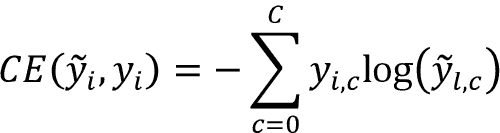

# 第三章：Word2vec – 学习词嵌入

在本章中，我们将讨论 NLP 中一个至关重要的话题——Word2vec，一种数据驱动的技术，用于学习语言中词或符号的强大数值表示（即向量）。语言是复杂的，这要求我们在构建解决 NLP 问题的模型时具备良好的语言理解能力。将词转换为数值表示时，许多方法无法充分捕捉词所携带的语义和上下文信息。例如，词*forest*的特征表示应与*oven*的表示有很大不同，因为这两个词很少在类似的语境中使用，而*forest*和*jungle*的表示应该非常相似。无法捕捉到这些信息会导致模型性能不佳。

Word2vec 试图通过大量文本学习词表示来克服这个问题。

Word2vec 被称为*分布式表示*，因为词的语义通过完整表示向量的激活模式来捕获，这与表示向量中的单一元素（例如，将向量中的单一元素设置为 1，其余为 0 以表示单个词）不同。

在本章中，我们将学习几个 Word2vec 算法的工作原理。但首先，我们将讨论解决此问题的经典方法及其局限性。然后，这促使我们研究基于神经网络的 Word2vec 算法，这些算法在找到良好的词表示时能够提供最先进的性能。

我们将在一个数据集上训练一个模型，并分析模型学习到的表示。我们使用 t-SNE（一种用于高维数据可视化的技术）将这些学习到的词嵌入可视化，在*图 3.1*的二维画布上展示。如果仔细观察，你会发现相似的事物被放置得很近（例如，中间聚集的数字）：


图 3.1：使用 t-SNE 可视化学习到的词嵌入示例

**t-分布式随机邻居嵌入**（**t-SNE**）

这是一种降维技术，将高维数据投影到二维空间。这使我们能够想象高维数据在空间中的分布，因为人类通常不太擅长直观理解超过三维的数据。你将在下一章详细了解 t-SNE。

本章通过以下几个主要主题涵盖此信息：

+   什么是词表示或词义？

+   学习词表示的经典方法

+   Word2vec – 基于神经网络的词表示学习方法

+   跳字模型算法

+   连续词袋模型算法

到本章结束时，你将全面了解单词表示的历史如何发展到 Word2vec，如何使用两种不同的 Word2vec 算法，以及 Word2vec 在 NLP 中的至关重要性。

# 什么是单词表示或意义？

“*meaning*”这个词是什么意思？这是一个哲学性的问题，更多的是哲学性的问题，而非技术性的问题。所以，我们不会尝试去找出这个问题的最佳答案，而是接受一个更为谦逊的答案，即*meaning*是通过一个词所传达的想法或与之相关的某种表示。例如，当你听到“cat”这个词时，你会在脑海中浮现出一只会喵喵叫、有四条腿、有尾巴的动物的画面；接着，如果你听到“dog”这个词，你又会想象出一只会汪汪叫、比猫体型大、有四条腿、有尾巴的动物。在这个新空间中（即脑海中的画面），你比仅仅通过文字理解，更容易看出猫和狗之间的相似性。由于自然语言处理（NLP）的主要目标是在人类语言任务中实现类似人类的表现，因此探索为机器表示单词的有原则的方式是明智的。为了实现这一目标，我们将使用可以分析给定文本语料库并生成单词的良好数值表示的算法（即，词嵌入），这样那些处于相似语境中的单词（例如，*one*和*two*，`I`和*we*）将具有相似的数值表示，而与之无关的单词（例如，*cat*和*volcano*）则会有不同的表示。

首先，我们将讨论一些经典的方法来实现这一点，然后转向理解近期更为复杂的利用神经网络学习特征表示并取得最先进表现的方法。

# 经典的单词表示学习方法

在本节中，我们将讨论一些用于数值表示单词的经典方法。了解单词向量的替代方法非常重要，因为这些方法在实际应用中仍然被使用，尤其是在数据有限的情况下。

更具体地，我们将讨论一些常见的表示方法，如**独热编码**和**词频-逆文档频率**（**TF-IDF**）。

## 独热编码表示

表示单词的一个简单方法是使用独热编码表示。这意味着，如果我们有一个大小为`V`的词汇表，对于每个第`i`个单词`wᵢ`，我们将用一个长度为`V`的向量[0, 0, 0, …, 0, 1, 0, …, 0, 0, 0]来表示这个单词，其中第`i`个元素是 1，其他元素为 0。例如，考虑以下句子：

*Bob 和 Mary 是好朋友。*

每个单词的独热编码表示可能如下所示：

*Bob*: [1,0,0,0,0,0]

*and*: [0,1,0,0,0,0]

*Mary*: [0,0,1,0,0,0]

*are*: [0,0,0,1,0,0]

*good*: [0,0,0,0,1,0]

*friends*: [0,0,0,0,0,1]

然而，正如你可能已经发现的那样，这种表示有许多缺点。

这种表示方式并没有编码单词之间的相似性，完全忽略了单词使用的上下文。让我们考虑单词向量之间的点积作为相似性度量。两个向量越相似，它们的点积就越高。例如，*car* 和 *automobile* 的表示将具有 0 的相似性距离，而 *car* 和 *pencil* 的表示也将具有相同的值。

对于大词汇量的情况，这种方法变得非常低效。此外，对于典型的自然语言处理任务，词汇量很容易超过 50,000 个单词。因此，对于 50,000 个单词，词表示矩阵将生成一个非常稀疏的 50,000 × 50,000 矩阵。

然而，一热编码在最先进的词嵌入学习算法中仍然发挥着重要作用。我们使用一热编码将单词表示为数字，并将其输入神经网络，以便神经网络能够更好地学习单词的更小的数字特征表示。

一热编码（one-hot encoding）也被称为局部表示（与分布式表示相对），因为特征表示是通过向量中单个元素的激活来决定的。

现在我们将讨论另一种表示单词的技术，称为 TF-IDF 方法。

## TF-IDF 方法

**TF-IDF** 是一种基于频率的方法，考虑到单词在语料库中出现的频率。这是一种词表示，表示了一个特定单词在给定文档中的重要性。直观地说，单词出现的频率越高，说明这个单词在文档中的重要性越大。例如，在关于猫的文档中，单词 *cats* 会比在不涉及猫的文档中出现得更频繁。然而，仅仅计算频率是不够的，因为像 *this* 和 *is* 这样的单词在文档中非常频繁，但并没有提供太多信息。TF-IDF 考虑了这一点，并给这些常见单词分配接近零的值。

再次强调，*TF* 代表词频（term frequency），*IDF* 代表逆文档频率（inverse document frequency）：

*TF(w*[i]*)* = w[i] 出现的次数 / 单词总数

*IDF(w*[i]*)* = log(文档总数 / 包含 w[i] 的文档数量)

*TF-IDF(w*[i]*)* = TF(w[i]) x IDF(w[i])

让我们做一个快速练习。考虑两个文档：

+   文档 1: *This is about cats. Cats are great companions*.

+   文档 2: *This is about dogs. Dogs are very loyal*.

现在让我们来做一些计算：

*TF-IDF (cats, doc1)* = (2/8) * log(2/1) = 0.075

*TF-IDF (this, doc2)* = (1/8) * log(2/2) = 0.0

因此，单词 *cats* 是有信息量的，而 *this* 不是。这就是我们在衡量单词重要性时所需要的期望行为。

## 共现矩阵

共现矩阵不同于 one-hot 编码表示，它编码了词汇的上下文信息，但需要维持一个 V × V 的矩阵。为了理解共现矩阵，我们来看两个例子句子：

+   *杰瑞和玛丽是朋友*。

+   *杰瑞为玛丽买花*。

共现矩阵将如下所示。我们仅显示矩阵的一半，因为它是对称的：

|  | Jerry | and | Mary | are | friends | buys | flowers | for |
| --- | --- | --- | --- | --- | --- | --- | --- | --- |
| Jerry | 0 | 1 | 0 | 0 | 0 | 1 | 0 | 0 |
| and |  | 0 | 1 | 0 | 0 | 0 | 0 | 0 |
| Mary |  |  | 0 | 1 | 0 | 0 | 0 | 1 |
| are |  |  |  | 0 | 1 | 0 | 0 | 0 |
| friends |  |  |  |  | 0 | 0 | 0 | 0 |
| buys |  |  |  |  |  | 0 | 1 | 0 |
| flowers |  |  |  |  |  |  | 0 | 1 |
| for |  |  |  |  |  |  |  | 0 |

然而，很容易看出，维持这样的共现矩阵是有成本的，因为随着词汇表大小的增加，矩阵的大小会呈多项式增长。此外，增加一个大于 1 的上下文窗口大小也并不简单。一种选择是使用加权计数，其中词汇在上下文中的权重随着与目标词的距离而减小。

如你所见，这些方法在表示能力上非常有限。

例如，在 one-hot 编码方法中，所有单词之间的向量距离是相同的。TF-IDF 方法用一个单一的数字表示一个词，无法捕捉词汇的语义。最后，计算共现矩阵非常昂贵，并且提供的关于词汇上下文的信息有限。

我们在这里结束关于词汇简单表示的讨论。在接下来的部分中，我们将通过实例首先培养对词嵌入的直观理解。然后我们将定义一个损失函数，以便使用机器学习来学习词嵌入。此外，我们还将讨论两种 Word2vec 算法，分别是 **skip-gram** 和 **连续词袋（CBOW）** 算法。

# 对 Word2vec 的直观理解 —— 一种学习词汇表示的方法

> “你将通过一个词汇的伴侣知道它的含义。”
> 
> – J.R. Firth

这句话由 J. R. Firth 在 1957 年说出，它是 Word2vec 的基础，因为 Word2vec 技术利用给定词汇的上下文来学习其语义。

Word2vec 是一种开创性的方法，它允许计算机在没有任何人工干预的情况下学习词汇的含义。此外，Word2vec 通过观察给定词汇周围的词汇来学习词汇的数值表示。

我们可以通过想象一个真实场景来测试前面引述的正确性。想象你正在参加考试，在第一题中遇到这句话：“玛丽是一个非常固执的孩子。她固执的天性总是让她惹上麻烦。”现在，除非你非常聪明，否则你可能不知道 *pervicacious* 的意思。在这种情况下，你会自动被迫查看周围的词组。在我们的例子中，*pervicacious* 被 *固执*，*天性* 和 *麻烦* 包围。看这三个词就足够判断 *pervicacious* 其实意味着固执的状态。我认为这足以证明上下文对单词含义的重要性。

现在，让我们讨论一下 Word2vec 的基础知识。正如前面提到的，Word2vec 通过观察给定单词的上下文来学习该单词的含义，并以数字的形式表示它。

通过 *上下文*，我们指的是单词前后固定数量的词。假设我们有一个包含 `N` 个单词的假设语料库。用数学表示，这可以表示为一个单词序列，记为 `w[0]`，`w[1]`，…，`wᵢ` 和 `w[N]`，其中 `wᵢ` 是语料库中的第 `i` 个单词。

接下来，如果我们想找到一个能够学习单词含义的好算法，给定一个单词，我们的算法应该能够正确预测上下文单词。

这意味着，对于任何给定的单词 `wᵢ`，以下概率应该很高：


为了得到等式的右边，我们需要假设，在给定目标单词（`wᵢ`）的情况下，上下文单词彼此之间是独立的（例如，`w`[i-2] 和 `w`[i-1] 是独立的）。尽管这并不完全正确，但这种近似使得学习问题变得可行，并且在实践中效果良好。让我们通过一个例子来理解这些计算。

## 练习：queen = king - he + she 吗？

在继续之前，让我们做一个小练习，了解如何通过最大化之前提到的概率来找到单词的良好含义（或表示）。考虑以下一个非常小的语料库：

*曾经有一位非常富有的国王。他有一位美丽的王后。她非常善良*。

为了简化练习，让我们手动预处理，去除标点符号和无信息的词：

*曾经有富有的国王他有美丽的王后她很善良*

现在，让我们为每个单词及其上下文单词形成一组元组，格式为（*目标单词 --> 上下文单词 1*，*上下文单词 2*）。我们假设上下文窗口大小为两边各 1：

*was --> 富有*

*富有 --> 曾经有, 国王*

*国王 --> 富有, 他*

*he --> 国王, had*

*有 --> 他, 美丽的*

*美丽的 --> 有, 王后*

*王后 --> 美丽的, 她*

*她 --> 王后, 是*

*是 --> 她, 善良*

*善良 --> 曾经有*

记住，我们的目标是能够根据左边的单词预测右边的单词。为此，对于一个给定的单词，右边语境中的单词应该与左边语境中的单词在数值或几何上有高度的相似性。换句话说，感兴趣的单词应该通过周围的单词来传达。现在，让我们考虑实际的数值向量，以了解这一过程是如何运作的。为了简单起见，让我们只考虑加粗的元组。让我们从假设*rich*这个单词的情况开始：

*rich --> [0,0]*

为了能够正确预测*was*和*king*，这两个词应与*rich*有较高的相似度。将使用欧几里得距离来衡量单词之间的距离。

让我们尝试以下*king*和*rich*的值：

*king --> [0,1]*

*was --> [-1,0]*

这一点是可行的，如下所示：

*Dist(rich,king)* = 1.0

*Dist(rich,was)* = 1.0

这里，*Dist*表示两个单词之间的欧几里得距离。如*图 3.3*所示：


图 3.2：单词“rich”，“was”和“king”的词向量位置

现在让我们考虑以下元组：

*king --> rich, he*

我们已经建立了*king*和*rich*之间的关系。然而，这还没有完成；我们看到的关系越多，这两个单词之间的距离应该越近。因此，让我们首先调整*king*的向量，使其更接近*rich*：

*king --> [0,0.8]*

接下来，我们需要将单词*he*添加到图中。单词*he*应该更接近*king*。这是我们目前关于单词*he*的所有信息：he --> [0.5,0.8]。

目前，带有单词的图表看起来像*图 3.4*：


图 3.3：单词“rich”，“was”，“king”和“he”的词向量位置

现在让我们继续下两个元组：*queen --> beautiful, she* 和 *she --> queen, was*。请注意，我交换了元组的顺序，这样我们更容易理解示例：

*she --> queen, was*

现在，我们将需要使用我们先前的英语知识来继续。

将单词*she*与*was*保持与*he*与*was*相同的距离是一个合理的决定，因为它们在*was*这个单词的语境中的使用是等价的。因此，让我们使用这个：

*she --> [0.5,0.6]*

接下来，我们将使用与单词*she*接近的*queen*：queen --> [0.0,0.6]。

如*图 3.5*所示：


图 3.4：单词“rich”，“was”，“king”，“he”，“she”和“queen”的词向量位置

接下来，我们只有以下元组：

*queen --> beautiful, she*

这里找到了单词*beautiful*。它应该与单词*queen*和*she*保持大致相同的距离。让我们使用以下表示：

*beautiful --> [0.25,0]*

现在，我们有了以下图表，描绘了词之间的关系。当我们观察*图 3.6*时，它似乎是对单词含义的非常直观的表示：


图 3.5：词向量在“rich”，“was”，“king”，“he”，“she”，“queen”，“beautiful”这些词上的位置

现在，让我们来看一下从一开始就萦绕在我们心中的问题。这些方程式中的数量是等价的吗：*皇后* = *国王* - *他* + *她*？好了，我们现在拥有了解开这个谜题所需的所有资源。让我们先尝试方程式的右侧：

= *国王* – *他* + *她*

= *[0,0.8]* – *[0.5,0.8]* + *[0.5,0.6]*

= *[0,0.6]*

最终一切都得到了验证。如果你看我们为单词*queen*得到的词向量，你会发现这与我们之前推导出的答案完全相同。

注意，这是一种粗略的方式来展示如何学习词嵌入，并且这可能与使用算法学习到的词嵌入的确切位置有所不同。

另外，请记住，这个练习在规模上不现实，与真实世界语料库的样子相比有很大的简化。因此，您无法仅通过手动计算几个数字来推导出这些值。复杂的函数逼近器，如神经网络，替我们完成了这项工作。但是，为了使用神经网络，我们需要以数学上严谨的方式来表述问题。然而，这个练习是展示词向量能力的一个很好的方法。

现在，我们对 Word2vec 如何帮助我们学习词表示有了更好的理解，接下来让我们看一下 Word2vec 在接下来的两节中使用的实际算法。

# 跳字模型算法

我们要讲解的第一个算法被称为**跳字模型算法**：一种 Word2vec 算法。如我们在多个地方讨论过的，单词的含义可以从其上下文单词中推断出来。然而，开发一个利用这种方式来学习单词含义的模型并不是完全直接的。由 Mikolov 等人在 2013 年提出的跳字模型算法，正是利用文本中单词的上下文来学习良好的词嵌入。

让我们一步步讲解跳字模型算法。首先，我们将讨论数据准备过程。了解数据的格式使我们能够更好地理解算法。然后，我们将讨论算法本身。最后，我们将使用 TensorFlow 实现该算法。

## 从原始文本到半结构化文本

首先，我们需要设计一个机制来提取可以输入到学习模型的数据集。这样的数据集应该是（目标词，上下文词）格式的元组集合。此外，这一过程需要以无监督的方式进行。也就是说，不需要人工为数据手动标注标签。总之，数据准备过程应该完成以下工作：

+   捕捉给定单词的周围单词（即上下文）

+   以无监督的方式运行

skip-gram 模型采用以下方法设计数据集：

+   对于给定的单词 `wᵢ`，假设其上下文窗口大小为 `m`。所谓的*上下文窗口大小*，是指在单侧考虑的上下文单词数量。因此，对于 `wᵢ`，上下文窗口（包括目标单词 `wᵢ`）的大小将为 *2m+1*，并且将呈现如下形式： *[w*[i-m]*, …, w*[i-1]*, w*[i]*, w*[i+1]*, …, w*[i+m]*]*。

+   接下来，(目标词, 上下文词) 的元组将被构建为 *[…, (w*[i]*, w*[i-m]*), …, (w*[i]*,w*[i-1]*), (w*[i]*,w*[i+1]*), …, (w*[i]*,w*[i+m]*), …]*；其中， 和 `N` 是文本中的单词数。让我们使用以下句子，设定上下文窗口大小（`m`）为 1：

*The dog barked at the mailman*。

对于这个例子，数据集将如下所示：

*[(dog, The), (dog, barked), (barked, dog), (barked, at), …, (the, at), (the, mailman)]*

一旦数据转化为 *(目标词, 上下文词)* 的格式，我们就可以使用神经网络来学习词向量。

## 理解 skip-gram 算法

首先，我们需要确定学习词向量所需的变量和符号。为了存储词向量，我们需要两个 V × D 的矩阵，其中 `V` 是词汇表的大小，`D` 是词向量的维度（即表示单个单词的向量中的元素个数）。`D` 是一个用户定义的超参数。`D` 越大，学习到的词向量就越具有表现力。我们需要两个矩阵，一个用于表示上下文单词，另一个用于表示目标单词。这些矩阵将被称为 *上下文* *嵌入空间（或上下文嵌入层）* 和 *目标* *嵌入空间（或目标嵌入层）*，或者通常称为嵌入空间（或嵌入层）。

每个单词将在范围[1，*V+1*]内用唯一的 ID 表示。这些 ID 将传递给嵌入层以查找对应的向量。为了生成这些 ID，我们将使用 TensorFlow 中可用的一个名为 Tokenizer 的特殊对象。让我们参考一个示例目标-上下文元组(w[i], w[j])，其中目标词 ID 是`wᵢ`，而上下文词之一是`w[j]`。`wᵢ`的相应目标嵌入是`tᵢ`，而`w[j]`的相应上下文嵌入是`c[j]`。每个目标-上下文元组都伴随一个标签（0 或 1），由`yᵢ`表示，真实的目标-上下文对将获得标签 1，而负（或假）目标-上下文候选将获得标签 0。通过对不在给定目标词上下文中出现的单词进行抽样，很容易生成负目标-上下文候选。稍后我们将详细讨论这一点。

此时，我们已经定义了必要的变量。接下来，对于每个输入`wᵢ`，我们将从上下文嵌入层中查找对应于输入的嵌入向量。这个操作为我们提供了`cᵢ`，这是一个`D`大小的向量（即，一个`D`长的嵌入向量）。我们对输入`w[j]`执行相同操作，使用上下文嵌入空间检索`c[j]`。随后，我们使用以下转换计算(`wᵢ` *,w*[i]*)*的预测输出：

*logit(w*[i]*, w*[i]*)* = `cᵢ` *.t*[j]

*ŷ*[ij] = *sigmoid(logit(w*[i]*, w*[i]*))*

这里，*logit(w*[i]*, w*[i]*)*表示未归一化的分数（即 logits），*ŷ*[i]是单值预测输出（表示上下文词属于目标词上下文的概率）。

我们将同时展示跳字模型的概念（*图 3.7*）和实现（*图 3.8*）。以下是符号的总结：

+   `V`: 词汇表的大小

+   `D`: 这是嵌入层的维度

+   `wᵢ`: 目标词

+   `w[j]`: 上下文词

+   `tᵢ`: 单词`wᵢ`的目标嵌入

+   `c[j]`: 单词`w[j]`的上下文嵌入

+   `yᵢ`: 这是与`xᵢ`对应的单热编码输出词

+   *ŷ*[i]: 这是`xᵢ`的预测输出

+   *logit(w*[i]*, w*[j]*)*: 这是输入`xᵢ`的未归一化分数


图 3.6: 跳字模型的概念


图 3.7: 跳字模型的实现

使用现有和派生的实体，我们现在可以使用交叉熵损失函数来计算给定数据点*[(w*[i]*, w*[j]*), y*[i]*]*的损失。

对于二元标签，单个样本的交叉熵损失为：


其中是的预测标签。对于多类分类问题，我们通过计算每个类别的项来推广损失：



其中  表示  索引的值， 是表示数据点标签的一维独热编码向量。

通常，在训练神经网络时，这个损失值是针对给定批次中的每个样本计算的，然后取平均以计算批次的损失值。最后，批次的损失值在数据集中的所有批次上取平均，以计算最终的损失值。

**为什么原始的词嵌入论文使用了两个嵌入层？**

原始论文（由 Mikolov 等人，2013 年）使用了两个不同的 V × D 嵌入空间来表示目标空间中的单词（作为目标使用的单词）和上下文空间中的单词（作为上下文单词使用的单词）。这样做的一个动机是单词在自己的上下文中出现的频率较低。因此，我们希望尽量减少这种情况发生的概率。

例如，对于目标单词 *dog*，很少可能在它的上下文中也出现单词 *dog*（*P(dog*|*dog) ~ 0*）。直观地说，如果我们将数据点（`wᵢ`=*dog* 和 `w[j]`=*dog*）输入神经网络，我们要求神经网络如果预测 *dog* 为 *dog* 的上下文单词时，给出较高的损失值。

换句话说，我们要求单词 *dog* 的词嵌入与单词 *dog* 的词嵌入之间有非常大的距离。这会产生一个强烈的矛盾，因为同一单词的嵌入之间的距离应该是 0。因此，如果我们只有一个嵌入空间，无法实现这一点。

然而，拥有两个独立的目标单词和上下文单词的嵌入空间使我们能够具备这一特性，因为这样我们为同一个单词拥有了两个独立的嵌入向量。在实践中，只要避免将输入输出元组相同，输入和输出都是同一个单词时，我们可以使用单一的嵌入空间，并且不需要两个独立的嵌入层。

现在让我们使用 TensorFlow 来实现数据生成过程。

## 使用 TensorFlow 实现和运行 skip-gram 算法

现在我们将深入探索 TensorFlow，并从头到尾实现该算法。首先，我们将讨论我们要使用的数据以及 TensorFlow 如何帮助我们将数据转换为模型所接受的格式。我们将使用 TensorFlow 实现 skip-gram 算法，最后训练模型并在准备好的数据上进行评估。

### 使用 TensorFlow 实现数据生成器

首先，我们将研究如何以模型接受的正确格式生成数据。在这个练习中，我们将使用[`mlg.ucd.ie/datasets/bbc.html`](http://mlg.ucd.ie/datasets/bbc.html)中提供的 BBC 新闻文章数据集。该数据集包含 2,225 篇新闻文章，涵盖 5 个主题：商业、娱乐、政治、体育和科技，这些文章是在 2004 年至 2005 年间发布在 BBC 网站上的。

我们在下面编写了`download_data()`函数，用于将数据下载到指定的文件夹并从压缩格式中提取数据：

```py
def download_data(url, data_dir):
    """Download a file if not present, and make sure it's the right
    size."""

    os.makedirs(data_dir, exist_ok=True)
    file_path = os.path.join(data_dir, 'bbc-fulltext.zip')

    if not os.path.exists(file_path):
        print('Downloading file...')
        filename, _ = urlretrieve(url, file_path)
    else:
        print("File already exists")

    extract_path = os.path.join(data_dir, 'bbc')
    if not os.path.exists(extract_path):

        with zipfile.ZipFile(
            os.path.join(data_dir, 'bbc-fulltext.zip'),
        'r'
        ) as zipf:
            zipf.extractall(data_dir)

    else:
        print("bbc-fulltext.zip has already been extracted") 
```

该函数首先创建`data_dir`，如果它不存在的话。接下来，如果`bbc-fulltext.zip`文件不存在，它将从提供的 URL 下载。如果`bbc-fulltext.zip`尚未解压，它将被解压到`data_dir`。

我们可以如下调用这个函数：

```py
url = 'http://mlg.ucd.ie/files/datasets/bbc-fulltext.zip'
download_data(url, 'data') 
```

接下来，我们将专注于将新闻文章中的数据（以`.txt`格式）读取到内存中。为此，我们将定义`read_data()`函数，该函数接受一个数据目录路径（`data_dir`），并读取数据目录中的`.txt`文件（不包括 README 文件）：

```py
def read_data(data_dir):
    news_stories = []
    print("Reading files")
    for root, dirs, files in os.walk(data_dir):
        for fi, f in enumerate(files):
            if 'README' in f:
                continue
            print("."*fi, f, end='\r')
            with open(os.path.join(root, f), encoding='latin-1') as f:
                story = []
                for row in f:               
                    story.append(row.strip())
                story = ' '.join(story)                        
                news_stories.append(story)                
    print(f"\nDetected {len(news_stories)} stories")
    return news_stories 
```

定义好`read_data()`函数后，我们来使用它读取数据并打印一些样本以及一些统计信息：

```py
news_stories = read_data(os.path.join('data', 'bbc'))
print(f"{sum([len(story.split(' ')) for story in news_stories])} words found in the total news set")
print('Example words (start): ',news_stories[0][:50])
print('Example words (end): ',news_stories[-1][-50:]) 
```

这将打印出以下内容：

```py
Reading files
............. 361.txt
Detected 2225 stories
865163 words found in the total news set
Example words (start):  Windows worm travels with Tetris  Users are being 
Example words (end):  is years at Stradey as "the best time of my life." 
```

正如我们在本节开始时所说的，系统中包含 2,225 个故事，总字数接近一百万。接下来的步骤，我们需要将每个故事（以长字符串的形式）进行分词，转换成一个令牌（或单词）列表。同时，我们还将对文本进行一些预处理：

+   将所有字符转换为小写

+   移除标点符号

所有这些都可以通过`tensorflow.keras.preprocessing.text.Tokenizer`对象来实现。我们可以如下定义一个 Tokenizer：

```py
from tensorflow.keras.preprocessing.text import Tokenizer
tokenizer = Tokenizer(
    num_words=None,
    filters='!"#$%&()*+,-./:;<=>?@[\\]^_'{|}~\t\n',
    lower=True,
split=' ' 
) 
```

在这里，您可以看到定义 Tokenizer 时常用的一些关键字参数及其默认值：

+   `num_words` – 定义词汇表的大小。默认为`None`，表示它会考虑文本语料库中出现的所有单词。如果设置为整数 n，它将只考虑语料库中出现的 n 个最常见单词。

+   `filters` – 定义在预处理过程中需要排除的字符。默认情况下，它定义了一个包含大多数常见标点符号和符号的字符串。

+   `lower` – 定义是否需要将文本转换为小写。

+   `split` – 定义用于分词的字符。

一旦定义了 Tokenizer，您可以调用其`fit_on_texts()`方法并传入一个字符串列表（每个字符串都是一篇新闻文章），这样 Tokenizer 就会学习词汇表并将单词映射到唯一的 ID：

```py
tokenizer.fit_on_texts(news_stories) 
```

让我们花点时间分析一下 Tokenizer 在文本拟合后产生的结果。一旦 Tokenizer 被拟合，它将填充两个重要的属性：`word_index`和`index_word`。其中，`word_index`是一个字典，将每个单词映射到一个唯一的 ID。`index_word`属性是`word_index`的反向映射，即一个字典，将每个唯一的单词 ID 映射到相应的单词：

```py
n_vocab = len(tokenizer.word_index.items())+1
print(f"Vocabulary size: {n_vocab}")
print("\nWords at the top")
print('\t', dict(list(tokenizer.word_index.items())[:10]))
print("\nWords at the bottom")
print('\t', dict(list(tokenizer.word_index.items())[-10:])) 
```

请注意，我们是如何通过`word_index`字典的长度来推导词汇表大小的。我们需要额外加 1，因为 ID 0 是保留的 ID，不会用于任何单词。这样将输出以下内容：

```py
Vocabulary size: 32361
Words at the top
    {'the': 1, 'to': 2, 'of': 3, 'and': 4, 'a': 5, 'in': 6, 'for': 7, 'is': 8, 'that': 9, 'on': 10}
Words at the bottom
    {'counsellor': 32351, "'frag'": 32352, 'relasing': 32353, "'real'": 32354, 'hrs': 32355, 'enviroment': 32356, 'trifling': 32357, '24hours': 32358, 'ahhhh': 32359, 'lol': 32360} 
```

一个词在语料库中出现得越频繁，它的 ID 就越低。像“the”、“to”和“of”这样的常见词（被称为停用词）实际上是最常见的单词。接下来的步骤，我们将精细调整我们的分词器对象，以便它具有一个有限大小的词汇表。因为我们处理的是一个相对较小的语料库，所以我们必须确保词汇表不要太大，因为过大的词汇表可能由于数据不足而导致单词向量学习不佳：

```py
from tensorflow.keras.preprocessing.text import Tokenizer
tokenizer = Tokenizer(
    num_words=15000,
    filters='!"#$%&()*+,-./:;<=>?@[\\]^_'{|}~\t\n',
    lower=True, split=' ', oov_token='',    
)
tokenizer.fit_on_texts(news_stories) 
```

由于我们的词汇表包含超过 30,000 个单词，我们将词汇表大小限制为 15,000。这样，分词器将只保留最常见的 15,000 个单词作为词汇表。当我们以这种方式限制词汇表时，出现了一个新问题。由于分词器的词汇表并不包含真实词汇表中的所有可能单词，可能会出现词汇表外的单词（即 OOV 单词）。一种解决方案是用一个特殊的标记（如 <`UNK`>）替换 OOV 单词，或者将它们从语料库中移除。通过将要替换 OOV 标记的字符串传递给分词器的 `oov_token` 参数，可以实现这一点。在这种情况下，我们将删除 OOV 单词。如果我们在设置词汇表大小时小心谨慎，忽略一些稀有词不会影响准确学习单词的上下文。

我们可以查看分词器对文本进行的转换。接下来，让我们转换我们语料库中第一篇故事的前 100 个字符（存储在 `news_stories` 变量中）：

```py
print(f"Original: {news_stories[0][:100]}") 
```

然后，我们可以调用 `tokenizer` 的 `texts_to_sequences()` 方法，将一组文档（每个文档是一个字符串）转换为一个包含单词 ID 列表的列表（即每个文档都转换为一个单词 ID 列表）。

```py
print(f"Sequence IDs: {tokenizer.texts_to_sequences([news_stories[0][:100]])[0]}") 
```

这将打印输出：

```py
Original: Ad sales boost Time Warner profit  Quarterly profits at US media giant TimeWarner jumped 76% to $1.1
Sequence IDs: [4223, 187, 716, 66, 3596, 1050, 3938, 626, 21, 49, 303, 717, 8263, 2972, 5321, 3, 108, 108] 
```

现在我们的分词器已经配置好了。接下来，我们只需要用一行代码将所有新闻文章转换为单词 ID 的序列：

```py
news_sequences = tokenizer.texts_to_sequences(news_stories) 
```

接下来，我们使用 TensorFlow 提供的 `tf.keras.preprocessing.sequence.skipgrams()` 函数生成跳字模型。我们在一个示例短语上调用该函数，示例短语代表从数据集中提取的前 5 个单词：

```py
sample_word_ids = news_sequences[0][:5]
sample_phrase = ' '.join([tokenizer.index_word[wid] for wid in sample_word_ids])
print(f"Sample phrase: {sample_phrase}")
print(f"Sample word IDs: {sample_word_ids }\n") 
```

这将输出：

```py
Sample phrase: ad sales boost time warner
Sample word IDs: [4223, 187, 716, 66, 3596] 
```

让我们考虑一个窗口大小为 1。意味着对于给定的目标单词，我们定义上下文为目标单词两侧各一个单词。

```py
window_size = 1 # How many words to consider left and right. 
```

我们已经具备了从我们选择的示例短语中提取跳字模型的所有要素。运行时，此函数将输出我们需要的数据格式，即（目标-上下文）元组作为输入，相应的标签（0 或 1）作为输出：

```py
inputs, labels = tf.keras.preprocessing.sequence.skipgrams(
    sequence=sample_word_ids, 
    vocabulary_size=n_vocab, 
    window_size=window_size, 
    negative_samples=1.0, 
    shuffle=False,
    categorical=False, 
    sampling_table=None, 
    seed=None
) 
```

让我们花一点时间来回顾一些重要的参数：

+   `sequence` `(list[str]` 或 `list[int])` – 一个包含单词或单词 ID 的列表。

+   `vocabulary_size` `(int)` – 词汇表的大小。

+   `window_size` `(int)` – 要考虑的上下文窗口大小。`window_size` 定义了窗口的两侧长度。

+   `negative_samples` `(int)` – 生成负向候选词的比例。例如，值为 1 表示正向和负向 skipgram 候选词的数量相等。值为 0 则表示不会生成负向候选词。

+   `shuffle` `(bool)` – 是否对生成的输入进行洗牌。

+   `categorical (bool)` – 是否将标签生成分类形式（即，独热编码）或整数。

+   `sampling_table` `(np.ndarray)` – 与词汇表大小相同的数组。数组中给定位置的元素表示根据该位置在分词器的词 ID 到词映射中的索引采样该单词的概率。正如我们很快会看到的，这是一种便捷的方法，可以避免常见的无信息词被过度采样。

+   `seed` `(int)` – 如果启用了洗牌，这是用于洗牌的随机种子。

在生成输入和标签后，我们来打印一些数据：

```py
print("Sample skip-grams")
for inp, lbl in zip(inputs, labels):
    print(f"\tInput: {inp} ({[tokenizer.index_word[wi] for wi in inp]}) /
    Label: {lbl}") 
```

这将产生：

```py
Sample skip-grams
    Input: [4223, 187] (['ad', 'sales']) / Label: 1
    Input: [187, 4223] (['sales', 'ad']) / Label: 1
    Input: [187, 716] (['sales', 'boost']) / Label: 1
    Input: [716, 187] (['boost', 'sales']) / Label: 1
    Input: [716, 66] (['boost', 'time']) / Label: 1
    Input: [66, 716] (['time', 'boost']) / Label: 1
    Input: [66, 3596] (['time', 'warner']) / Label: 1
    Input: [3596, 66] (['warner', 'time']) / Label: 1
    Input: [716, 9685] (['boost', "kenya's"]) / Label: 0
    Input: [3596, 12251] (['warner', 'rear']) / Label: 0
    Input: [4223, 3325] (['ad', 'racing']) / Label: 0
    Input: [66, 7978] (['time', 'certificate']) / Label: 0
    Input: [716, 12756] (['boost', 'crushing']) / Label: 0
    Input: [66, 14543] (['time', 'touchy']) / Label: 0
    Input: [187, 3786] (['sales', '9m']) / Label: 0
    Input: [187, 3917] (['sales', 'doherty']) / Label: 0 
```

例如，由于单词“sales”出现在“ad”这个词的上下文中，因此它被视为一个正向候选词。另一方面，由于单词“racing”（从词汇中随机抽取）没有出现在“ad”这个词的上下文中，因此它被视为一个负向候选词。

在选择负向候选词时，`skipgrams()` 函数会随机选择它们，并对词汇表中的所有单词赋予相同的权重。然而，原文中解释说，这可能导致性能不佳。一种更好的策略是使用 unigram 分布作为选择负向上下文词的先验。

你可能会想知道什么是 unigram 分布。它表示文本中单字（或标记）的频率计数。然后，通过将这些频率除以所有频率的总和，频率计数可以轻松地转换为概率（或归一化频率）。最神奇的是，你不需要手动为每个文本语料库计算这个！事实证明，如果你取一个足够大的文本语料库，计算 unigram 的归一化频率，并将它们从高到低排序，你会发现语料库大致遵循某种恒定的分布。对于一个包含 *math* 个 unigram 的语料库中排名为 *math* 的单词，其归一化频率 `f[k]` 给出如下公式：


这里，*math* 是一个超参数，可以调节以更接近真实分布。这就是所谓的 *Zipf’s law*。换句话说，如果你有一个词汇表，其中单词按从最常见到最不常见的顺序排列（ID 排序），你可以使用 Zipf 定律来近似每个单词的归一化频率。我们将根据 Zipf 定律输出的概率来采样单词，而不是对所有单词赋予相等的概率。这意味着单词的采样将根据它们在语料库中的出现频率进行（也就是说，越常见的单词，越有可能被采样）。

为此，我们可以使用 `tf.random.log_uniform_candidate_sampler()` 函数。该函数接受一个大小为 `[b, num_true]` 的正上下文候选词批次，其中 `b` 是批次大小，`num_true` 是每个示例的真实候选词数量（对于 skip-gram 模型来说为 1），并输出一个大小为 [`num_sampled`] 的数组，其中 `num_sampled` 是我们需要的负样本数量。我们稍后将详细讨论这个函数的工作原理，并通过实际操作进行说明。但在此之前，让我们先使用 `tf.keras.preprocessing.sequence.skipgrams()` 函数生成一些正向候选词：

```py
inputs, labels = tf.keras.preprocessing.sequence.skipgrams(
    sample_phrase_word_ids, 
    vocabulary_size=len(tokenizer.word_index.items())+1, 
    window_size=window_size, 
    negative_samples=0, 
    shuffle=False    
)
inputs, labels = np.array(inputs), np.array(labels) 
```

请注意，我们指定了 `negative_samples=0`，因为我们将使用候选样本生成器来生成负样本。接下来我们讨论如何使用 `tf.random.log_uniform_candidate_sampler()` 函数来生成负候选词。这里我们将首先使用该函数为单个词生成负候选词：

```py
negative_sampling_candidates, true_expected_count, sampled_expected_count = tf.random.log_uniform_candidate_sampler(
    true_classes=inputs[:1, 1:], # [b, 1] sized tensor
    num_true=1, # number of true words per example
    num_sampled=10,
    unique=True,
    range_max=n_vocab,            
    name="negative_sampling"
) 
```

这个函数接受以下参数：

+   `true_classes` `(np.ndarray` 或 `tf.Tensor)` – 一个包含真实目标词的张量。它需要是一个大小为 [`b, num_true`] 的数组，其中 `num_true` 表示每个示例的真实上下文候选词的数量。由于每个示例只有一个上下文词，这个值为 1。

+   `num_true` `(int)` – 每个示例的真实上下文词的数量。

+   `num_sampled` `(int)` – 要生成的负样本数量。

+   `unique` `(bool)` – 是否生成唯一样本或允许重复采样。

+   `range_max` `(int)` – 词汇表的大小。

它返回：

+   `sampled_candidates` `(tf.Tensor)` – 一个大小为 [`num_sampled`] 的张量，包含负候选词。

+   `true_expected_count` `(tf.Tensor)` – 一个大小为 [`b, num_true`] 的张量；表示每个真实候选词被抽样的概率（根据齐普夫定律）。

+   `sampled_expected_count` `(tf.Tensor)` – 一个大小为 [`num_sampled`] 的张量；如果从语料库中抽取，表示每个负样本与真实候选词一同出现的概率。

我们不必过于担心后面两个实体。对我们来说，最重要的是 `sampled_candidates`。调用该函数时，我们必须确保 `true_classes` 的形状是 `[b, num_true]`。在我们的情况下，我们将在单个输入词 ID 上运行该函数，形状为 [1, 1]。它将返回以下内容：

```py
Positive sample: [[187]]
Negative samples: [   1   10 9744 3062  139    5   14   78 1402  115]
true_expected_count: [[0.00660027]]
sampled_expected_count: [4.0367463e-01 1.0333969e-01 1.2804421e-04 4.0727769e-04 8.8460185e-03
 1.7628242e-01 7.7631921e-02 1.5584969e-02 8.8879210e-04 1.0659459e-02] 
```

现在，将所有内容结合起来，我们来编写一个数据生成器函数，为模型生成数据批次。这个函数名为 `skip_gram_data_generator()`，接受以下参数：

+   `sequences` `(List[List[int]])` – 一个包含词 ID 的列表列表。这是由分词器的 `texts_to_sequences()` 函数生成的输出。

+   `window_size` `(int)` – 上下文窗口大小。

+   `batch_size` `(int)` – 批次大小。

+   `negative_samples` `(int)` – 每个示例要生成的负样本数量。

+   `vocabulary_size` `(int)` – 词汇表大小。

+   `seed` – 随机种子。

它将返回一个包含以下内容的数据批次：

+   一批目标词 ID

+   一批对应的上下文词 ID（包括正例和负例）

+   一批标签（0 和 1）

函数签名如下：

```py
def skip_gram_data_generator(sequences, window_size, batch_size, negative_samples, vocab_size, seed=None): 
```

首先，我们将打乱新闻文章的顺序，这样每次生成数据时，它们都会以不同的顺序被获取。这有助于模型更好地进行泛化：

```py
 rand_sequence_ids = np.arange(len(sequences))
    np.random.shuffle(rand_sequence_ids) 
```

接下来，对于语料库中的每个文本序列，我们生成正向 skip-gram。`positive_skip_grams`包含按顺序排列的(target, context)词对元组：

```py
 for si in rand_sequence_ids:

        positive_skip_grams, _ = 
        tf.keras.preprocessing.sequence.skipgrams(
            sequences[si], 
            vocabulary_size=vocab_size, 
            window_size=window_size, 
            negative_samples=0.0, 
            shuffle=False,
            sampling_table=sampling_table,
            seed=seed
        ) 
```

请注意，我们传递了一个`sampling_table`参数。这是提高 Word2vec 模型性能的另一种策略。`sampling_table`只是一个与词汇表大小相同的数组，并在数组的每个索引中指定一个概率，该索引处的词将会在 skip-gram 生成过程中被采样。这个技术被称为子采样。每个词`wᵢ`的采样概率由以下公式给出：


这里，`t`是一个可调参数。对于足够大的语料库，它的默认值为 0.00001。在 TensorFlow 中，您可以通过如下方式轻松生成此表：

计算采样表时不需要确切的频率，因为我们可以利用齐普夫定律来近似这些频率：

```py
sampling_table = tf.keras.preprocessing.sequence.make_sampling_table(
    n_vocab, sampling_factor=1e-05
) 
```

对于`positive_skip_grams`中包含的每个元组，我们生成`negative_samples`数量的负样本。然后，我们用正负样本填充目标、上下文和标签列表：

```py
 targets, contexts, labels = [], [], []

        for target_word, context_word in positive_skip_grams:
            context_class = tf.expand_dims(tf.constant([context_word], 
            dtype="int64"), 1)

            negative_sampling_candidates, _, _ = 
            tf.random.log_uniform_candidate_sampler(
              true_classes=context_class,
              num_true=1,
              num_sampled=negative_samples,
              unique=True,
              range_max=vocab_size,
              name="negative_sampling")
            # Build context and label vectors (for one target word)
            context = tf.concat(
                [tf.constant([context_word], dtype='int64'), 
                negative_sampling_candidates],
                axis=0
            )
            label = tf.constant([1] + [0]*negative_samples, 
            dtype="int64")
            # Append each element from the training example to global
            # lists.
            targets.extend([target_word]*(negative_samples+1))
            contexts.append(context)
            labels.append(label) 
```

然后，我们将按如下方式将这些转换为数组，并随机打乱数据。在打乱时，您必须确保所有数组都一致地被打乱。否则，您将会破坏与输入相关联的标签：

```py
 contexts, targets, labels = np.concatenate(contexts), 
        np.array(targets), np.concatenate(labels)

        # If seed is not provided generate a random one
        if not seed:
            seed = random.randint(0, 10e6)
        np.random.seed(seed)
        np.random.shuffle(contexts)
        np.random.seed(seed)
        np.random.shuffle(targets)
        np.random.seed(seed)
        np.random.shuffle(labels) 
```

最后，数据批次生成如下：

```py
 for eg_id_start in range(0, contexts.shape[0], batch_size): 
            yield (
                targets[eg_id_start: min(eg_id_start+batch_size, 
                inputs.shape[0])], 
                contexts[eg_id_start: min(eg_id_start+batch_size, 
                inputs.shape[0])]
            ), labels[eg_id_start: min(eg_id_start+batch_size, 
               inputs.shape[0])] 
```

接下来，我们将查看我们将要使用的模型的具体细节。

### 使用 TensorFlow 实现 skip-gram 架构

现在，我们将走过一个使用 TensorFlow 库实现的 skip-gram 算法。完整的练习可以在`Ch3_word2vec.ipynb`中找到，该文件位于`Ch03-Word-Vectors`练习目录中。

首先，让我们定义模型的超参数。您可以自由更改这些超参数，查看它们如何影响最终的性能（例如，`batch_size = 1024` 或 `batch_size = 2048`）。然而，由于这是一个比复杂的现实世界问题更简单的问题，您可能不会看到任何显著差异（除非您将它们更改为极端值，例如，`batch_size = 1` 或 `num_sampled = 1`）：

```py
batch_size = 4096 # Data points in a single batch
embedding_size = 128 # Dimension of the embedding vector.
window_size=1 # We use a window size of 1 on either side of target word
negative_samples = 4 # Number of negative samples generated per example
epochs = 5 # Number of epochs to train for
# We pick a random validation set to sample nearest neighbors
valid_size = 16 # Random set of words to evaluate similarity on.
# We sample valid datapoints randomly from a large window without always
# being deterministic
valid_window = 250
# When selecting valid examples, we select some of the most frequent words # as well as some moderately rare words as well
np.random.seed(54321)
random.seed(54321)
valid_term_ids = np.array(random.sample(range(valid_window), valid_size))
valid_term_ids = np.append(
    valid_term_ids, random.sample(range(1000, 1000+valid_window), 
    valid_size),
    axis=0
) 
```

接下来，我们定义模型。为此，我们将依赖 Keras 的功能性 API。我们需要超越最简单的 API，即顺序 API，因为这个模型需要两个输入流（一个用于上下文，另一个用于目标）。

我们将首先进行导入。然后清除任何当前正在运行的会话，以确保没有其他模型占用硬件：

```py
import tensorflow.keras.backend as K
K.clear_session() 
```

我们将定义两个输入层：

```py
# Inputs - skipgrams() function outputs target, context in that order
input_1 = tf.keras.layers.Input(shape=(), name='target')
input_2 = tf.keras.layers.Input(shape=(), name='context') 
```

注意`shape`是如何定义为`()`的。当定义`shape`参数时，实际的输出形状将会添加一个新的未定义维度（即大小为`None`）。换句话说，最终的输出形状将是`[None]`。

接下来，我们定义两个嵌入层：目标嵌入层和上下文嵌入层。这些层将用于查找目标和上下文词 ID 的嵌入，这些词 ID 将由输入生成函数生成。

```py
# Two embeddings layers are used one for the context and one for the
# target
target_embedding_layer = tf.keras.layers.Embedding(
    input_dim=n_vocab, output_dim=embedding_size, 
    name='target_embedding'
)
context_embedding_layer = tf.keras.layers.Embedding(
    input_dim=n_vocab, output_dim=embedding_size, 
    name='context_embedding'
) 
```

定义好嵌入层后，接下来我们来看一下将传入输入层的词 ID 的嵌入：

```py
# Lookup outputs of the embedding layers
target_out = target_embedding_layer(input_1)
context_out = context_embedding_layer(input_2) 
```

我们现在需要计算`target_out`和`context_out`的点积。

为此，我们将使用`tf.keras.layers.Dot`层：

```py
# Computing the dot product between the two 
out = tf.keras.layers.Dot(axes=-1)([context_out, target_out]) 
```

最后，我们将模型定义为一个`tf.keras.models.Model`对象，其中我们指定了`inputs`和`outputs`参数。`inputs`需要是一个或多个输入层，而`outputs`可以是一个或多个由一系列`tf.keras.layers`对象生成的输出：

```py
# Defining the model
skip_gram_model = tf.keras.models.Model(inputs=[input_1, input_2], outputs=out, name='skip_gram_model') 
```

我们使用损失函数和优化器来编译模型：

```py
# Compiling the model
skip_gram_model.compile(loss=tf.keras.losses.BinaryCrossentropy(from_logits=True), optimizer='adam', metrics=['accuracy']) 
```

让我们通过调用以下内容来查看模型的摘要：

```py
skip_gram_model.summary() 
```

这将输出：

```py
Model: "skip_gram_model"
________________________________________________________________________
Layer (type)                    Output Shape     Param   # Connected to
========================================================================
context (InputLayer)            [(None,)]        0         
_______________________________________________________________________
target (InputLayer)             [(None,)]        0         
_______________________________________________________________________
context_embedding (Embedding)   (None, 128)     1920128    context[0][0]
_______________________________________________________________________
target_embedding (Embedding)    (None, 128)     1920128    target[0][0]
_______________________________________________________________________
dot (Dot)                        (None, 1)      0  context_embedding[0][0]
                                                   target_embedding[0][0]
=======================================================================
Total params: 3,840,256
Trainable params: 3,840,256
Non-trainable params: 0
________________________________________________________________________ 
```

训练和评估模型将是我们接下来的议程。

### 训练和评估模型

我们的训练过程将非常简单，因为我们已经定义了一个函数来生成模型所需格式的数据批次。但在我们继续进行模型训练之前，我们需要考虑如何评估词向量模型。词向量的概念是共享语义相似性的词之间的距离较小，而没有相似性的词之间的距离较大。为了计算词与词之间的相似度，我们可以使用余弦距离。在我们的超参数讨论中，我们随机选取了一组词 ID 并将它们存储在`valid_term_ids`中。我们将在每个周期结束时实现一种方法，计算这些术语的最接近的`k`个词。

为此，我们使用 Keras 回调函数。Keras 回调函数为你提供了一种在每次训练迭代、每个周期、每个预测步骤等结束时执行重要操作的方式。你可以在[`www.tensorflow.org/api_docs/python/tf/keras/callbacks`](https://www.tensorflow.org/api_docs/python/tf/keras/callbacks)查看所有可用回调函数的完整列表。由于我们需要一个专门为词向量设计的评估机制，我们将需要实现自己的回调函数。我们的回调函数将接受一个包含验证词的词 ID 列表、一个包含嵌入矩阵的模型以及一个用于解码词 ID 的 Tokenizer：

```py
class ValidationCallback(tf.keras.callbacks.Callback):

    def __init__(self, valid_term_ids, model_with_embeddings, tokenizer):

        self.valid_term_ids = valid_term_ids
        self.model_with_embeddings = model_with_embeddings
        self.tokenizer = tokenizer

        super().__init__()

    def on_epoch_end(self, epoch, logs=None):
        """ Validation logic """
        # We will use context embeddings to get the most similar words
        # Other strategies include: using target embeddings, mean
        # embeddings after avaraging context/target
        embedding_weights = 
        self.model_with_embeddings.get_layer(
            "context_embedding"
        ).get_weights()[0]
        normalized_embeddings = embedding_weights / 
        np.sqrt(np.sum(embedding_weights**2, axis=1, keepdims=True))

        # Get the embeddings corresponding to valid_term_ids
        valid_embeddings = normalized_embeddings[self.valid_term_ids, 
        :]

        # Compute the similarity between valid_term_ids and all the
        # embeddings
        # V x d (d x D) => V x D
        top_k = 5 # Top k items will be displayed
        similarity = np.dot(valid_embeddings, normalized_embeddings.T)

        # Invert similarity matrix to negative
        # Ignore the first one because that would be the same word as the
        # probe word
        similarity_top_k = np.argsort(-similarity, axis=1)[:, 1: 
        top_k+1]

        # Print the output
        for i, term_id in enumerate(valid_term_ids):
            similar_word_str = ', '.join([self.tokenizer.index_word[j] 
            for j in similarity_top_k[i, :] if j > 1])
            print(f"{self.tokenizer.index_word[term_id]}: 
            {similar_word_str }")
        print('\n') 
```

评估将在每个训练周期结束时进行，因此我们将重写`on_epoch_end()`函数。该函数从上下文嵌入层中提取嵌入。

然后，嵌入向量被归一化为单位长度。之后，提取与验证词对应的嵌入向量到一个单独的矩阵中，称为`valid_embeddings`。接着计算验证嵌入与所有词嵌入之间的余弦距离，得到一个`[valid_size, vocabulary size]`大小的矩阵。我们从中提取出最相似的`k`个词，并通过`print`语句显示它们。

最终，模型可以按如下方式进行训练：

```py
skipgram_validation_callback = ValidationCallback(valid_term_ids, skip_gram_model, tokenizer)
for ei in range(epochs):

    print(f"Epoch: {ei+1}/{epochs} started")

    news_skip_gram_gen = skip_gram_data_generator(
        news_sequences, window_size, batch_size, negative_samples, 
        n_vocab
    )

    skip_gram_model.fit(
        news_skip_gram_gen, epochs=1, 
        callbacks=skipgram_validation_callback,
    ) 
```

我们首先简单地定义了一个回调实例。接下来，我们训练模型若干个周期。在每个周期中，我们生成跳字模型数据（同时打乱文章的顺序），并对数据调用`skip_gram_model.fit()`。以下是五个周期训练后的结果：

```py
Epoch: 5/5 ended
2233/2233 [==============================] - 146s 65ms/step - loss: 0.4842 - accuracy: 0.8056
months: days, weeks, years, detained, meaning
were: are, was, now, davidson, widened
mr: resignation, scott, tony, stead, article
champions: premier, pottage, kampala, danielli, dominique
businesses: medium, port, 2002's, tackling, doug
positive: electorate, proposal, bolz, visitors', strengthen
pop: 'me', style, lacks, tourism, tuesdays 
```

在这里，我们展示了一些最具代表性的学习到的词向量。例如，我们可以看到，与“months”最相似的两个词是“days”和“weeks”。“mr”这一称呼常与男性名字如“scott”和“tony”一起出现。词语“premier”与“champion”具有相似性。你还可以进一步实验：

+   可在[`www.tensorflow.org/api_docs/python/tf/random`](https://www.tensorflow.org/api_docs/python/tf/random)找到不同的负样本候选采样方法

+   不同的超参数选择（例如嵌入向量大小和负样本数量）

在本节中，我们从头到尾讨论了跳字算法。我们展示了如何使用 TensorFlow 中的函数来转换数据。然后我们使用 Keras 中的层和功能性 API 实现了跳字架构。最后，我们训练了模型，并在一些测试数据上直观地检查了其性能。接下来，我们将讨论另一个流行的 Word2vec 算法——**连续词袋（CBOW）**模型。

# 连续词袋模型（Continuous Bag-of-Words）

CBOW 模型与跳字模型算法的工作原理类似，但在问题的表述上有一个显著的变化。在跳字模型中，我们从目标词预测上下文词。然而，在 CBOW 模型中，我们从上下文词预测目标词。我们通过取前面例子中的句子来比较跳字算法和 CBOW 模型的数据表现：

*The dog barked at the mailman.*

对于跳字算法，数据元组—*(输入词, 输出词)*—可能看起来是这样的：

*(dog, the)*，*(dog, barked)*，*(barked, dog)*，等等

对于 CBOW，数据元组则会是如下形式：

*([the, barked], dog)*, *([dog, at], barked)*，等等

因此，CBOW 的输入维度为 2 × m × D，其中`m`是上下文窗口的大小，`D`是嵌入向量的维度。CBOW 的概念模型如*图 3.13*所示：


图 3.8：CBOW 模型

我们不会过多讨论 CBOW 的细节，因为它与 skip-gram 非常相似。例如，一旦嵌入被聚合（即拼接或求和），它们将通过 softmax 层，最终计算出与 skip-gram 算法相同的损失。然而，我们将讨论该算法的实现（尽管不深入），以便清楚地理解如何正确实现 CBOW。CBOW 的完整实现可在`Ch03-Word-Vectors`练习文件夹中的`ch3_word2vec.ipynb`中找到。

## 为 CBOW 算法生成数据

不幸的是，与 skip-gram 算法不同，我们没有现成的函数来为 CBOW 算法生成数据。因此，我们需要自己实现这个函数。

你可以在`Ch03-Word-Vectors`文件夹中的`ch3_word2vec.ipynb`文件中找到该函数（名为`cbow_grams()`）的实现。这个过程与我们在 skip-grams 中使用的非常相似。然而，数据格式会略有不同。因此，我们将讨论该函数返回的数据格式。

该函数接受与我们之前讨论的`skip_gram_data_generator()`函数相同的参数：

+   `sequences`（`List[List[int]]`）– 词 ID 的列表列表。这是 Tokenizer 的`texts_to_sequences()`函数生成的输出。

+   `window_size`（`int`）– 上下文的窗口大小。

+   `batch_size`（`int`）– 批次大小。

+   `negative_samples`（`int`）– 每个样本生成的负样本数量。

+   `vocabulary_size`（`int`）– 词汇表大小。

+   `seed` – 随机种子。

返回的数据格式也略有不同。它将返回一个包含以下内容的数据批次：

+   一个批次的目标词 ID，这些目标词包括正样本和负样本。

+   一个批次对应的上下文词 ID。与 skip-gram 不同，对于 CBOW，我们需要上下文中的所有词，而不仅仅是一个。例如，如果我们定义批次大小为`b`，窗口大小为`w`，则这是一个`[b, 2w]`大小的张量。

+   一个批次或标签（0 和 1）。

现在我们来学习该算法的具体细节。

## 在 TensorFlow 中实现 CBOW

我们将使用与之前相同的超参数：

```py
batch_size = 4096 # Data points in a single batch
embedding_size = 128 # Dimension of the embedding vector.
window_size=1 # We use a window size of 1 on either side of target word
epochs = 5 # Number of epochs to train for
negative_samples = 4 # Number of negative samples generated per example
# We pick a random validation set to sample nearest neighbors
valid_size = 16 # Random set of words to evaluate similarity on.
# We sample valid datapoints randomly from a large window without always
# being deterministic
valid_window = 250
# When selecting valid examples, we select some of the most frequent words
# as well as some moderately rare words as well
np.random.seed(54321)
random.seed(54321)
valid_term_ids = np.array(random.sample(range(valid_window), valid_size))
valid_term_ids = np.append(
    valid_term_ids, random.sample(range(1000, 1000+valid_window), 
    valid_size),
    axis=0
) 
```

和之前一样，让我们先清除掉任何剩余的会话（如果有的话）：

```py
import tensorflow.keras.backend as K
K.clear_session() 
```

我们定义了两个输入层。注意第二个输入层被定义为具有`2 x window_size`的维度。这意味着该层的最终形状将是`[None, 2 x window_size]`：

```py
# Inputs
input_1 = tf.keras.layers.Input(shape=())
input_2 = tf.keras.layers.Input(shape=(window_size*2,)) 
```

现在我们来定义两个嵌入层：一个用于上下文词，另一个用于目标词。我们将从输入层输入数据，并生成`context_out`和`target_out`：

```py
context_embedding_layer = tf.keras.layers.Embedding(
    input_dim=n_vocab+1, output_dim=embedding_size, 
    name='context_embedding'
)
target_embedding_layer = tf.keras.layers.Embedding(
    input_dim=n_vocab+1, output_dim=embedding_size, 
    name='target_embedding'
)
context_out = context_embedding_layer(input_2)
target_out = target_embedding_layer(input_1) 
```

如果你查看`context_out`的形状，你会看到它的形状是`[None, 2, 128]`，其中`2`是`2 x window_size`，这是因为它考虑了一个词周围的整个上下文。这需要通过对所有上下文词的平均值进行降维，变为`[None, 128]`。这一操作是通过使用 Lambda 层完成的：

```py
mean_context_out = tf.keras.layers.Lambda(lambda x: tf.reduce_mean(x, axis=1))(context_out) 
```

我们将一个`Lambda`函数传递给`tf.keras.layers.Lambda`层，以在第二维度上减少`context_out`张量，从而生成一个大小为`[None, 128]`的张量。由于`target_out`和`mean_context_out`张量的形状都是`[None, 128]`，我们可以计算这两者的点积，生成一个输出张量`[None, 1]`：

```py
out = tf.keras.layers.Dot(axes=-1)([context_out, target_out]) 
```

有了这些，我们可以将最终模型定义如下：

```py
cbow_model = tf.keras.models.Model(inputs=[input_1, input_2], outputs=out, name='cbow_model') 
```

类似于`skip_gram_model`，我们将按如下方式编译`cbow_model`：

```py
cbow_model.compile(
    loss=tf.keras.losses.BinaryCrossentropy(from_logits=True), 
    optimizer='adam', 
    metrics=['accuracy']
) 
```

如果你想查看模型的摘要，可以运行`cbow_model.summary()`。

## 训练和评估模型

模型训练与我们训练 skip-gram 模型的方式相同。首先，让我们定义一个回调函数，用于找到与`valid_term_ids`集合中定义的词最相似的前 k 个词：

```py
cbow_validation_callback = ValidationCallback(valid_term_ids, cbow_model, tokenizer) 
```

接下来，我们训练`cbow_model`若干轮：

```py
for ei in range(epochs):
    print(f"Epoch: {ei+1}/{epochs} started")
    news_cbow_gen = cbow_data_generator(
        news_sequences, 
        window_size, 
        batch_size, 
        negative_samples
    )
    cbow_model.fit(
        news_cbow_gen, 
        epochs=1, 
        callbacks=cbow_validation_callback,
    ) 
```

输出应该如下所示。我们挑选了一些最合理的词向量进行展示：

```py
months: years, days, weeks, minutes, seasons
you: we, they, i, don't, we'll
were: are, aren't, have, because, need
music: terrestrial, cameras, casual, divide, camera
also: already, previously, recently, rarely, reportedly
best: supporting, actress, category, fiction, contenders
him: them, me, themselves, won't, censors
mr: tony, gordon, resignation, cherie, jack
5bn: 5m, 7bn, 4bn, 8bn, 8m
champions: premier, rugby, appearances, irish, midfielder
deutsche: austria, austria's, butcher, violence, 1989
files: movies, collections, vast, habit, ballad
pop: fiction, veteran, scrubs, wars, commonwealth 
```

从视觉检查来看，CBOW 似乎已经学到了有效的词向量。类似于 skip-gram 模型，它已经将“years”和“days”这样的词与“months”进行了类比。像“5bn”这样的数字值周围有“5m”和“7bn”。但重要的是要记住，视觉检查只是评估词向量的一种快速而粗略的方式。

通常，词向量会在一些下游任务中进行评估。一个流行的任务是词类比推理任务。它主要聚焦于回答类似以下的问题：

*雅典之于希腊，如巴格达之于 ____*

答案是`Iraq`。答案是如何计算的？如果词向量合理，那么：

`Word2vec(Athens) – Word2vec(Greece) = Word2vec(Baghdad) – Word2vec(Iraq)`

或者

`Word2vec(Iraq) = Word2vec(Baghdad) - Word2vec(Athens) + Word2vec(Greece)`

答案通过计算`Word2vec(Baghdad) - Word2vec(Athens) + Word2vec(Greece)`得到。这个类比任务的下一步是查看与结果向量最相似的词是否是 Iraq。通过这种方式，可以计算类比推理任务的准确度。然而，由于我们的数据集不够大，不能很好地执行此任务，所以我们在本章中不会使用这个任务。

在这里，我们结束了对 CBOW 算法的讨论。尽管 CBOW 与 skip-gram 算法有相似之处，但它在架构和数据上也存在差异。

# 总结

词嵌入已成为许多 NLP 任务的核心部分，广泛应用于机器翻译、聊天机器人、图像描述生成和语言建模等任务中。词嵌入不仅作为一种降维技术（与独热编码相比），还提供了比其他技术更丰富的特征表示。在本章中，我们讨论了两种基于神经网络的学习词表示的流行方法，即 skip-gram 模型和 CBOW 模型。

首先，我们讨论了该问题的经典方法，以便了解过去是如何学习词表示的。我们讨论了多种方法，例如使用 WordNet、构建词的共现矩阵，以及计算 TF-IDF。

接下来，我们探讨了基于神经网络的词表示学习方法。首先，我们手工计算了一个例子，以理解词嵌入或词向量是如何计算的，帮助我们理解涉及的计算过程。

接下来，我们讨论了第一个词嵌入学习算法——skip-gram 模型。然后我们学习了如何准备数据以供学习使用。随后，我们研究了如何设计一个损失函数，使我们能够利用给定词的上下文词来使用词嵌入。最后，我们讨论了如何使用 TensorFlow 实现 skip-gram 算法。

然后我们回顾了下一种学习词嵌入的方法——CBOW 模型。我们还讨论了 CBOW 与 skip-gram 模型的区别。最后，我们还讨论了 CBOW 的 TensorFlow 实现。

在下一章，我们将学习几种其他的词嵌入学习技术，分别是全球向量（Global Vectors，简称 GloVe）和语言模型的嵌入（Embeddings from Language Models，简称 ELMo）。

要访问本书的代码文件，请访问我们的 GitHub 页面：[`packt.link/nlpgithub`](https://packt.link/nlpgithub)

加入我们的 Discord 社区，结识志同道合的人，与超过 1000 名成员一起学习： [`packt.link/nlp`](https://packt.link/nlp)


