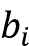
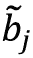

# 第四章：高级词向量算法

在*第三章*，*Word2vec – 学习词向量*中，我们介绍了 Word2vec、学习词向量的基础知识，以及两个常见的 Word2vec 算法：skip-gram 和 CBOW。在本章中，我们将讨论其他几种词向量算法：

+   GloVe – 全局向量

+   ELMo – 来自语言模型的嵌入

+   使用 ELMo 进行文档分类

首先，你将学习一种词嵌入学习技术，称为**全局向量**（**GloVe**），以及 GloVe 相对于 skip-gram 和 CBOW 的具体优势。

你还将学习一种最近的语言表示方法，称为**来自语言模型的嵌入**（**ELMo**）。与其他算法相比，ELMo 具有优势，因为它能够消除词义歧义并捕捉语义。具体来说，ELMo 生成的是“上下文化”的单词表示，它通过使用给定单词及其周围的单词，而不是像 skip-gram 或 CBOW 那样独立地处理单词表示。

最后，我们将解决一个使用我们新创建的 ELMo 向量进行文档分类的令人兴奋的应用案例。

# GloVe – 全局向量表示

skip-gram 和 CBOW 算法的主要限制之一是它们只能捕捉局部上下文信息，因为它们只看一个固定长度的窗口围绕单词。因此，缺少了解决这个问题的重要部分，因为这些算法并不查看全局统计信息（全局统计信息是指我们查看一个单词在文本语料库中与另一个单词的上下文中的所有出现情况的一种方法）。

然而，我们已经在*第三章*，*Word2vec – 学习词向量*中学习过一种可以包含这些信息的结构：共现矩阵。让我们回顾一下共现矩阵，因为 GloVe 使用共现矩阵中捕捉到的统计信息来计算向量。

共现矩阵编码了单词的上下文信息，但它们需要维护一个 V × V 的矩阵，其中 V 是词汇表的大小。为了理解共现矩阵，假设我们有两个例句：

+   *Jerry and Mary are friends*。

+   *Jerry buys flowers for Mary*。

如果我们假设上下文窗口的大小为 1，即在所选单词的每一侧，那么共现矩阵将如下所示（我们只显示矩阵的上三角部分，因为矩阵是对称的）：

|  | **Jerry** | **and** | **Mary** | **are** | **friends** | **buys** | **flowers** | **for** |
| --- | --- | --- | --- | --- | --- | --- | --- | --- |
| **Jerry** | 0 | 1 | 0 | 0 | 0 | 1 | 0 | 0 |
| **and** |  | 0 | 1 | 0 | 0 | 0 | 0 | 0 |
| **Mary** |  |  | 0 | 1 | 0 | 0 | 0 | 1 |
| **are** |  |  |  | 0 | 1 | 0 | 0 | 0 |
| **friends** |  |  |  |  | 0 | 0 | 0 | 0 |
| **buys** |  |  |  |  |  | 0 | 1 | 0 |
| **flowers** |  |  |  |  |  |  | 0 | 1 |
| **for** |  |  |  |  |  |  |  | 0 |

我们可以看到，这个矩阵展示了语料库中一个词与其他任何词的关系，因此它包含了关于语料库的全局统计信息。也就是说，拥有共现矩阵相较于仅仅看到局部上下文有什么优势呢？

+   它为你提供了关于词语特性的额外信息。例如，如果你考虑句子“the cat sat on the mat”，就很难判断“the”是否是一个特殊的词，出现在像“cat”或“mat”这样的词的上下文中。然而，如果你有足够大的语料库和共现矩阵，就很容易看出“the”是一个频繁出现的停用词。

+   共现矩阵识别了上下文或短语的重复使用，而在局部上下文中这些信息则被忽略。例如，在足够大的语料库中，“New York”将明显成为赢家，表明这两个词在同一上下文中出现了很多次。

需要牢记的是，Word2vec 算法使用各种技术来大致注入一些词汇共现模式，同时学习词向量。例如，我们在上一章使用的子采样技术（即更频繁地采样低频词）有助于识别和避免停用词。但它们引入了额外的超参数，并且不如共现矩阵那样富有信息。

使用全局统计信息来生成词表示并不是一个新概念。一个叫做**潜在语义分析**（**LSA**）的算法已经在其方法中使用了全局统计信息。

LSA 作为一种文档分析技术，将文档中的词映射到所谓的**概念**，即在文档中出现的常见词模式。基于全局矩阵分解的方法有效地利用语料库的全局统计信息（例如，词语在全局范围内的共现），但在词汇类比任务中表现较差。另一方面，基于上下文窗口的方法在词汇类比任务中表现较好，但没有利用语料库的全局统计信息，因此有改进的空间。GloVe 试图兼顾这两者的优点——一种既高效利用全局语料库统计信息，又像 skip-gram 或 CBOW 那样通过上下文窗口优化学习模型的方法。

GloVe，一种用于学习词嵌入的新技术，已在 Pennington 等人的论文《GloVe: Global Vectors for Word Representation》中提出（[`nlp.stanford.edu/pubs/glove.pdf`](https://nlp.stanford.edu/pubs/glove.pdf)）。GloVe 旨在弥补 Word2vec 算法中缺失的全局共现信息。GloVe 的主要贡献是提出了一种新的成本函数（或目标函数），该函数利用了共现矩阵中可用的宝贵统计信息。让我们首先理解 GloVe 方法背后的动机。

## 理解 GloVe

在查看 GloVe 的实现细节之前，让我们先花些时间理解 GloVe 中计算的基本概念。为此，我们来看一个例子：

+   考虑单词 `i`=Ice 和 `j`=Steam

+   定义一个任意的探针词 `k`

+   定义  为单词 `i` 和 `k` 在一起出现的概率， 为单词 `j` 和 `k` 一起出现的概率

现在让我们看看  实体在不同 `k` 值下的表现。

对于 `k` = “Solid”，它很可能与 `i` 一起出现，因此  会较高。然而，`k` 不太会与 `j` 一起出现，导致  较低。因此，我们得到以下表达式：


接下来，对于 `k` = “gas”，它不太可能与 `i` 紧密相邻出现，因此会有一个较低的 ；然而，由于 `k` 与 `j` 高度相关， 的值将会较高。这导致了以下情况：


现在，对于像 `k` = “water” 这样的单词，它与 `i` 和 `j` 都有很强的关系，或者对于 `k` = “Fashion” 这样的单词，它与 `i` 和 `j` 都没有太多相关性，我们得到如下结果：


如果假设我们已经为这些单词学习了合理的词向量，这些关系可以在向量空间中可视化，从而理解为何比率  会有这样的行为（见 *图 4.1*）。在下图中，实心箭头表示单词 (*i, j*) 之间的距离，而虚线则表示单词 (*i, k*) 和 (*j, k*) 之间的距离。这些距离可以与我们讨论的概率值关联起来。例如，当 `i` = “ice”和 `k` = “solid” 时，我们期望它们的向量之间的距离较短（即更频繁地共同出现）。因此，由于  的定义，我们可以将 (*i, k*) 之间的距离与  的倒数关联起来（即 ）。该图展示了随着探针词 `k` 的变化，这些距离是如何变化的：


图 4.1：当探针词变化时，P_ik 和 P_jk 实体如何随着与单词 `i` 和 `j` 的接近度而变化

可以看到， 实体是通过测量两个单词紧密出现的频率来计算的，当三个单词之间的关系发生变化时，它的表现也会有所不同。因此，它成为了学习词向量的一个不错的候选对象。因此，定义损失函数的一个好的起点将如下所示：


在这里，`F` 是某个函数，`w` 和  是我们将使用的两个不同的嵌入空间。换句话说，词汇  和  是从一个嵌入空间中查找的，而探测词  则是从另一个嵌入空间中查找的。从这一点开始，原始论文仔细地进行了推导，以得到以下损失函数：


我们这里不会深入推导，因为这超出了本书的范围。我们将直接使用已推导出的损失函数，并通过 TensorFlow 实现该算法。如果你需要一个较少数学密集的解释，了解我们是如何推导该成本函数的，请参考作者撰写的文章：[`towardsdatascience.com/light-on-math-ml-intuitive-guide-to-understanding-glove-embeddings-b13b4f19c010`](https://towardsdatascience.com/light-on-math-ml-intuitive-guide-to-understanding-glove-embeddings-b13b4f19c010)。

在这里， 被定义为 ，如果 ，否则为 1，其中  是词 `j` 在词 `i` 的上下文中出现的频率。 是我们设置的一个超参数。记住，我们在损失函数中定义了两个嵌入空间  和 。 和  分别表示从嵌入空间  中获得的词 `i` 的词嵌入和偏置嵌入。而  和  则分别表示从嵌入空间  中获得的词 `j` 的词嵌入和偏置嵌入。这两种嵌入的行为类似，除了初始化时的随机化。在评估阶段，这两个嵌入将被加在一起，从而提高性能。

## 实现 GloVe

在本小节中，我们将讨论实现 GloVe 的步骤。完整代码可以在 `ch4_glove.ipynb` 练习文件中找到，该文件位于 `ch4` 文件夹内。

首先，我们将定义超参数，就像在上一章中做的那样：

```py
batch_size = 4096 # Data points in a single batch
embedding_size = 128 # Dimension of the embedding vector.
window_size=1 # We use a window size of 1 on either side of target word
epochs = 5 # Number of epochs to train for
# We pick a random validation set to sample nearest neighbors
valid_size = 16 # Random set of words to evaluate similarity on.
# We sample valid datapoints randomly from a large window without always 
# being deterministic
valid_window = 250
# When selecting valid examples, we select some of the most frequent words # as well as some moderately rare words as well
np.random.seed(54321)
random.seed(54321)
valid_term_ids = np.array(random.sample(range(valid_window), valid_size))
valid_term_ids = np.append(
    valid_term_ids, random.sample(range(1000, 1000+valid_window), valid_ 
    size),
    axis=0
) 
```

你在这里定义的超参数与我们在上一章中定义的超参数相同。我们有一个批量大小、嵌入维度、窗口大小、训练轮数，最后，还有一组保留的验证词 ID，用来打印最相似的词。

然后我们将定义模型。首先，我们将导入一些在后续代码中需要用到的库：

```py
import tensorflow.keras.backend as K
from tensorflow.keras.layers import Input, Embedding, Dot, Add
from tensorflow.keras.models import Model
K.clear_session() 
```

模型将有两个输入层：`word_i` 和 `word_j`。它们分别表示一批上下文词和一批目标词（或一批正样本跳字）：

```py
# Define two input layers for context and target words
word_i = Input(shape=())
word_j = Input(shape=()) 
```

注意形状是如何定义的。形状被定义为空元组。这意味着 `word_i` 和 `word_j` 的最终形状将是 `[None]`，意味着它将接受一个任意元素数量的向量作为输入。

接下来，我们将定义嵌入层。将会有四个嵌入层：

+   `embeddings_i` – 上下文嵌入层

+   `embeddings_j` – 目标嵌入层

+   `b_i` – 上下文嵌入偏置

+   `b_j` – 目标嵌入偏置

以下代码定义了这些内容：

```py
# Each context and target has their own embeddings (weights and biases)
# Embedding weights
embeddings_i = Embedding(n_vocab, embedding_size, name='target_embedding')(word_i)
embeddings_j = Embedding(n_vocab, embedding_size, name='context_embedding')(word_j)
# Embedding biases
b_i = Embedding(n_vocab, 1, name='target_embedding_bias')(word_i)
b_j = Embedding(n_vocab, 1, name='context_embedding_bias')(word_j) 
```

接下来，我们将计算输出。这个模型的输出将是：


如你所见，这就是我们最终损失函数的一部分。我们拥有所有正确的元素来计算这个结果：

```py
# Compute the dot product between embedding vectors (i.e. w_i.w_j)
ij_dot = Dot(axes=-1)([embeddings_i,embeddings_j])
# Add the biases (i.e. w_i.w_j + b_i + b_j )
pred = Add()([ij_dot, b_i, b_j]) 
```

首先，我们将使用 `tensorflow.keras.layers.Dot` 层来计算上下文嵌入查找（`embeddings_i`）和目标嵌入查找（`embeddings_j`）之间的点积。举例来说，`Dot` 层的两个输入将是 `[batch size, embedding size]` 的大小。经过点积后，输出 `ij_dot` 的形状将是 `[batch size, 1]`，其中 `ij_dot[k]` 将是 `embeddings_i[k, :]` 和 `embeddings_j[k, :]` 之间的点积。然后，我们只需将 `b_i` 和 `b_j`（其形状为 `[None, 1]`）逐元素加到 `ij_dot` 上。

最后，模型被定义为以 `word_i` 和 `word_j` 作为输入，并输出 `pred`：

```py
# The final model
glove_model = Model(
    inputs=[word_i, word_j],outputs=pred,
name='glove_model'
) 
```

接下来，我们将进行一些相当重要的操作。

我们必须设计一种方法，使用模型中可用的各种组件/功能来计算上面定义的复杂损失函数。首先，让我们重新审视损失函数。


其中，

，如果 ，否则为 1。

尽管看起来很复杂，我们可以利用现有的损失函数和其他功能来实现 GloVe 损失。你可以将这个损失函数抽象为下图所示的三个组件：


图 4.2：GloVe 损失函数的分解，展示了预测值、目标值和权重是如何相互作用以计算最终损失的

因此，如果样本权重用  表示，预测值用  表示，真实目标用  表示，那么我们可以将损失函数写为：


这仅仅是一个加权均方损失。因此，我们将使用`"mse"`作为我们模型的损失函数：

```py
# Glove has a specific loss function with a sound mathematical
# underpinning
# It is a form of mean squared error
glove_model.compile(loss="mse", optimizer = 'adam') 
```

我们稍后会看到如何将样本权重输入到模型中，以完成损失函数。到目前为止，我们已经定义了 GloVe 算法的不同组件，并编译了模型。接下来，我们将看看如何生成数据来训练 GloVe 模型。

## 为 GloVe 生成数据

我们将使用的数据集与上一章使用的数据集相同。为了回顾一下，我们将使用 BBC 新闻文章数据集，网址为[`mlg.ucd.ie/datasets/bbc.html`](http://mlg.ucd.ie/datasets/bbc.html)。该数据集包含 2225 篇新闻文章，属于 5 个主题：商业、娱乐、政治、体育和科技，均发表于 2004 至 2005 年间的 BBC 网站。

现在让我们生成数据。我们将数据生成封装在一个名为`glove_data_generator()`的函数中。第一步，让我们编写一个函数签名：

```py
def glove_data_generator(
    sequences, window_size, batch_size, vocab_size, cooccurrence_matrix,
    x_max=100.0, alpha=0.75, seed=None
): 
```

该函数接受多个参数：

+   `sequences`（`List[List[int]]`）– 一个包含单词 ID 列表的列表。这是由分词器的`texts_to_sequences()`函数生成的输出。

+   `window_size`（`int`）– 上下文窗口大小。

+   `batch_size`（`int`）– 批量大小。

+   `vocab_size`（`int`）– 词汇表大小。

+   `cooccurrence_matrix`（`scipy.sparse.lil_matrix`）– 一个稀疏矩阵，包含单词的共现。

+   `x_max`（`int`）– GloVe 用于计算样本权重的超参数。

+   `alpha`（`float`）– GloVe 用于计算样本权重的超参数。

+   `seed` – 随机种子。

它还包含若干输出：

+   一批（目标，上下文）单词 ID 元组

+   对应的  值，适用于（目标，上下文）元组

+   样本权重（即 ）值，适用于（目标，上下文）元组

首先，我们将打乱新闻文章的顺序：

```py
 # Shuffle the data so that, every epoch, the order of data is
    # different
    rand_sequence_ids = np.arange(len(sequences))
    np.random.shuffle(rand_sequence_ids) 
```

接下来，我们将创建采样表，以便可以使用子采样避免过度采样常见词汇（例如停用词）：

```py
 sampling_table = 
    tf.keras.preprocessing.sequence.make_sampling_table(vocab_size) 
```

在此基础上，对于每个序列（即表示文章的单词 ID 列表），我们生成正向 skip-gram。请注意，我们将`negative_samples=0.0`，因为与 skip-gram 或 CBOW 算法不同，GloVe 不依赖于负样本：

```py
 # For each story/article
    for si in rand_sequence_ids:

        # Generate positive skip-grams while using sub-sampling 
        positive_skip_grams, _ = tf.keras.preprocessing.sequence.
        skipgrams(
            sequences[si], 
            vocabulary_size=vocab_size, 
            window_size=window_size, 
            negative_samples=0.0, 
            shuffle=False,   
            sampling_table=sampling_table,
            seed=seed
        ) 
```

在此基础上，我们首先将 skip-gram 元组拆分成两个列表，一个包含目标，另一个包含上下文单词，并随后将其转换为 NumPy 数组：

```py
 # Take targets and context words separately
        targets, context = zip(*positive_skip_grams)
        targets, context = np.array(targets).ravel(),
        np.array(context).ravel() 
```

然后，我们从共现矩阵中索引（目标，上下文）单词对所给出的位置信息，以检索相应的  值，其中（*i,j*）表示（目标，上下文）对：

```py
 x_ij = np.array(cooccurrence_matrix[targets, 
        context].toarray()).ravel() 
```

然后，我们计算相应的 （记作`log_x_ij`）和 （记作`sample_weights`）：

```py
 # Compute log - Introducing an additive shift to make sure we
        # don't compute log(0)
        log_x_ij = np.log(x_ij + 1)

        # Sample weights 
        # if x < x_max => (x/x_max)**alpha / else => 1        
        sample_weights = np.where(x_ij < x_max, (x_ij/x_max)**alpha, 1) 
```

如果未选择代码，则设置一个随机种子。之后，`context`、`targets`、`log_x_ij` 和 `sample_weights` 将被打乱，同时保持数组元素之间的对应关系：

```py
 # If seed is not provided generate a random one
        if not seed:
            seed = random.randint(0, 10e6)

        # Shuffle data
        np.random.seed(seed)
        np.random.shuffle(context)
        np.random.seed(seed)
        np.random.shuffle(targets)
        np.random.seed(seed)
        np.random.shuffle(log_x_ij)
        np.random.seed(seed)
        np.random.shuffle(sample_weights) 
```

最后，我们迭代通过我们上面创建的数据批次。每个批次将包含

+   一批（目标，上下文）单词 ID 元组

+   对应的  值，适用于（目标，上下文）元组

+   样本权重（即 ）值，适用于（目标，上下文）元组

按此顺序。

```py
 # Generate a batch or data in the format 
        # ((target words, context words), log(X_ij) <- true targets,
        # f(X_ij) <- sample weights)
        for eg_id_start in range(0, context.shape[0], batch_size):            
            yield (
                targets[eg_id_start: min(eg_id_start+batch_size, 
                targets.shape[0])], 
                context[eg_id_start: min(eg_id_start+batch_size, 
                context.shape[0])]
            ), log_x_ij[eg_id_start: min(eg_id_start+batch_size, 
            log_x_ij.shape[0])], \
            sample_weights[eg_id_start: min(eg_id_start+batch_size, 
            sample_weights.shape[0])] 
```

现在数据已经准备好输入，我们来讨论最后一个步骤：训练模型。

## 训练与评估 GloVe

训练模型是轻而易举的，因为我们拥有所有训练模型所需的组件。第一步，我们将重用在*第三章*中创建的`ValidationCallback`，即*Word2vec – 学习词嵌入*。回顾一下，`ValidationCallback`是一个 Keras 回调。Keras 回调让你能够在每次训练迭代、周期、预测步骤等结束时执行一些重要操作。在这里，我们使用回调在每个周期结束时执行验证步骤。我们的回调将接受一个词 ID 的列表（作为验证词，存放在`valid_term_ids`中），包含嵌入矩阵的模型，以及一个解码词 ID 的 tokenizer。然后，它将计算验证词集中的每个词的最相似的 top-k 词，并将其作为输出：

```py
glove_validation_callback = ValidationCallback(valid_term_ids, glove_model, tokenizer)
# Train the model for several epochs
for ei in range(epochs):

    print("Epoch: {}/{} started".format(ei+1, epochs))

    news_glove_data_gen = glove_data_generator(
        news_sequences, window_size, batch_size, n_vocab
    )

    glove_model.fit(
        news_glove_data_gen, epochs=1, 
        callbacks=glove_validation_callback,
    ) 
```

一旦模型训练完成，你应该能得到一个合乎预期的输出。以下是一些精心挑选的结果：

```py
election: attorney, posters, forthcoming, november's, month's
months: weeks, years, nations, rbs, thirds
you: afford, we, they, goodness, asked
music: cameras, mp3, hp's, refuseniks, divide
best: supporting, category, asante, counterparts, actor
mr: ron, tony, bernie, jack, 63
leave: pay, need, unsubstantiated, suited, return
5bn: 8bn, 2bn, 1bn, 3bn, 7bn
debut: solo, speakerboxxx, youngster, nasty, toshack
images: 117, pattern, recorder, lennon, unexpectedly
champions: premier, celtic, football, representatives, neighbour
individual: extra, attempt, average, improvement, survived
businesses: medium, sell, redder, abusive, handedly
deutsche: central, austria's, donald, ecb, austria
machine: unforced, wireless, rapid, vehicle, workplace 
```

你可以看到，“months”，“weeks”和“years”等词被分到了一组。像“5bn”，“8bn”和“2bn”这样的数字也被分到了一组。“Deutsche”被“Austria’s”和“Austria”围绕。最后，我们将词嵌入保存到磁盘。我们将每个上下文和目标向量空间的权重与偏置合并为一个数组，其中数组的最后一列表示偏置，并将其保存到磁盘：

```py
def save_embeddings(model, tokenizer, vocab_size, save_dir):

    os.makedirs(save_dir, exist_ok=True)

    _, words_sorted = zip(*sorted(list(tokenizer.index_word.items()),
    key=lambda x: x[0])[:vocab_size-1])

    words_sorted = [None] + list(words_sorted)

    context_embedding_weights = model.get_layer("context_embedding").get_
    weights()[0]
    context_embedding_bias = model.get_layer("context_embedding_bias").
    get_weights()[0]
    context_embedding = np.concatenate([context_embedding_weights,
    context_embedding_bias], axis=1)

    target_embedding_weights = model.get_layer("target_embedding").get_
    weights()[0]
    target_embedding_bias = model.get_layer("target_embedding_bias").get_
    weights()[0]
    target_embedding = np.concatenate([target_embedding_weights, target_
    embedding_bias], axis=1)

    pd.DataFrame(
        context_embedding, 
        index = words_sorted
    ).to_pickle(os.path.join(save_dir, "context_embedding_and_bias.pkl"))

    pd.DataFrame(
        target_embedding, 
        index = words_sorted
    ).to_pickle(os.path.join(save_dir, "target_embedding_and_bias.pkl"))

save_embeddings(glove_model, tokenizer, n_vocab, save_dir='glove_embeddings') 
```

我们将词嵌入保存为 pandas DataFrame。首先，我们按 ID 对所有词进行排序。我们减去 1，以去除保留的词 ID 0，因为我们将在下一行手动添加它。请注意，词 ID 0 不会出现在`tokenizer.index_word`中。接下来，我们按名称获取所需的层（即`context_embedding`、`target_embedding`、`context_embedding_bias`和`target_embedding_bias`）。一旦获取到这些层，我们可以使用`get_weights()`函数来获取权重。

在本节中，我们讨论了 GloVe，这是一种词嵌入学习技术。

GloVe 相对于*第三章*中讨论的 Word2vec 技术的主要优点在于，它关注语料库的全局和局部统计信息来学习嵌入。由于 GloVe 能够捕捉到词的全局信息，它通常能提供更好的性能，尤其是在语料库规模增大时。另一个优点是，与 Word2vec 技术不同，GloVe 并不近似代价函数（例如，Word2vec 使用负采样），而是计算真正的代价。这使得损失的优化更加高效和容易。

在下一节中，我们将介绍另一个词向量算法，称为**来自语言模型的嵌入**（**ELMo**）。

# ELMo – 消除词向量中的歧义

到目前为止，我们已经研究了只能为词汇中的每个单词提供唯一表示的词嵌入算法。然而，它们会为给定的单词提供恒定的表示，无论你查询多少次。这为什么是个问题呢？请考虑以下两个短语：

*我去银行存了一些钱*

和

*我沿着河岸走*

显然，单词“bank”在两个完全不同的语境中使用。如果你使用普通的词向量算法（例如 skip-gram），你只能为单词“bank”提供一个表示，并且这个表示可能会在金融机构的概念和可以走的河岸边缘的概念之间混淆，具体取决于它在语料库中的引用。因此，更合理的做法是为一个词提供嵌入，同时保留并利用它周围的上下文。这正是 ELMo 所努力实现的目标。

具体来说，ELMo 处理的是一系列输入，而不是单一的词汇，并为序列中每个词提供上下文化的表示。*图 4.3* 展示了涵盖该模型的不同组件。首先需要理解的是，ELMo 是一个复杂的系统！在 ELMo 中，许多神经网络模型相互协调以产生输出。特别地，模型使用：

+   一个字符嵌入层（每个字符的嵌入向量）。

+   一个 **卷积神经网络** (**CNN**)——CNN 由许多卷积层和可选的全连接分类层组成。

卷积层接收一系列输入（例如单词中的字符序列），并在输入上移动一个加权窗口来生成潜在表示。我们将在后续章节中详细讨论 CNN。

+   两个双向 LSTM 层——LSTM 是一种用于处理时间序列数据的模型。给定一系列输入（例如词向量序列），LSTM 会沿着时间维度从一个输入处理到另一个输入，并在每个位置产生一个输出。与全连接网络不同，LSTM 具有记忆功能，这意味着当前位点的输出会受到 LSTM 过去见过的数据的影响。我们将在后续章节中详细讨论 LSTM。

这些不同组件的具体细节超出了本章的讨论范围。它们将在后续章节中详细讨论。因此，如果你不理解这里展示的子组件的具体机制，也不必担心（*图 4.3*）。


图 4.3：ELMo 模型的不同组件。词嵌入是通过一种名为 CNN 的神经网络生成的。这些词嵌入被输入到 LSTM 模型中（该模型可以处理时间序列数据）。第一个 LSTM 模型的输出被输入到第二个 LSTM 模型，以生成每个词的潜在上下文化表示。

我们可以从 TensorFlow Hub ([`tfhub.dev`](https://tfhub.dev)) 下载预训练的 ELMo 模型。TF Hub 是各种预训练模型的存储库。

它托管了用于图像分类、文本分类、文本生成等任务的模型。你可以访问该网站并浏览各种可用的模型。

## 从 TensorFlow Hub 下载 ELMo

我们将使用的 ELMo 模型位于 [`tfhub.dev/google/elmo/3`](https://tfhub.dev/google/elmo/3)。它已经在一个非常大的文本语料库上进行了训练，以解决称为语言建模的任务。在语言建模中，我们试图根据先前的标记序列预测下一个单词。在接下来的章节中，我们将更多地了解语言建模。

在下载模型之前，让我们设置以下环境变量：

```py
# Not allocating full GPU memory upfront
%env TF_FORCE_GPU_ALLOW_GROWTH=true
# Making sure we cache the models and are not downloaded all the time
%env TFHUB_CACHE_DIR=./tfhub_modules 
```

`TF_FORCE_GPU_ALLOW_GROWTH` 允许 TensorFlow 根据需要分配 GPU 内存，而不是一次性分配所有 GPU 内存。 `TFHUB_CACHE_DIR` 设置模型下载的目录。我们首先导入 TensorFlow Hub：

```py
import tensorflow_hub as hub 
```

接下来，像往常一样，我们将通过运行以下代码清除任何正在运行的 TensorFlow 会话：

```py
import tensorflow as tf
import tensorflow.keras.backend as K
K.clear_session() 
```

最后，我们将下载 ELMo 模型。你可以使用两种方式从 TF Hub 下载预训练模型并在我们的代码中使用它们：

+   `hub.load(<url>, **kwargs)` – 推荐的下载和使用 TensorFlow 2 兼容模型的方式

+   `hub.KerasLayer(<url>, **kwargs)` – 这是在 TensorFlow 2 中使用基于 TensorFlow 1 的模型的一种解决方案

不幸的是，ELMo 还没有移植到 TensorFlow 2。因此，我们将使用 `hub.KerasLayer()` 作为在 TensorFlow 2 中加载 ELMo 的解决方法：

```py
elmo_layer = hub.KerasLayer(
    "https://tfhub.dev/google/elmo/3", 
    signature="tokens",signature_outputs_as_dict=True
) 
```

请注意，我们正在提供两个参数，`signature` 和 `signature_outputs_as_dict`：

+   `signature` (`str`) – 可以是 `default` 或 `tokens`。默认签名接受字符串列表，其中每个字符串将在内部转换为标记列表。标记签名接受输入为具有两个键的字典。即 `tokens`（标记列表的列表。每个标记列表是一个短语/句子，包括填充标记以将其调整为固定长度）和 "`sequence_len`"（每个标记列表的长度，以确定填充长度）。

+   `signature_outputs_as_dict` (`bool`) – 当设置为 `true` 时，将返回提供的签名中定义的所有输出。

现在我们已经理解了 ELMo 的组成部分，并从 TensorFlow Hub 下载了它，让我们看看如何处理 ELMo 的输入数据。

## 准备 ELMo 的输入

在这里，我们将定义一个函数，将给定的字符串列表转换为 ELMo 期望输入的格式。请记住，我们将 ELMo 的签名设置为 `tokens`。签名 `"tokens"` 的示例输入如下。

```py
{
    'tokens': [
        ['the', 'cat', 'sat', 'on', 'the', 'mat'],
        ['the', 'mat', 'sat', '', '', '']
    ], 
    'sequence_len': [6, 3]
} 
```

让我们花一点时间处理输入的组成部分。首先，它有一个关键字`tokens`，其中包含一系列令牌。每个令牌列表可以看作是一个句子。注意短句子的末尾如何添加填充以匹配长度。这很重要，否则模型会抛出错误，因为它无法将任意长度的序列转换为张量。接下来我们有`sequence_len`，它是一个整数列表。每个整数指定每个序列的真实长度。注意第二个元素为 3，以匹配第二个序列中实际存在的令牌。

给定一个字符串列表，我们可以编写一个函数来为我们执行这个转换。这就是`format_text_for_elmo()`函数的作用。让我们深入了解具体细节：

```py
def format_text_for_elmo(texts, lower=True, split=" ", max_len=None):

    """ Formats a given text for the ELMo model (takes in a list of
    strings) """

    token_inputs = [] # Maintains individual tokens
    token_lengths = [] # Maintains the length of each sequence

    max_len_inferred = 0 
    # We keep a variable to maintain the max length of the input
    # Go through each text (string)
    for text in texts:    

        # Process the text and get a list of tokens
        tokens = tf.keras.preprocessing.text.text_to_word_sequence(text, 
        lower=lower, split=split)

        # Add the tokens 
        token_inputs.append(tokens)                   

        # Compute the max length for the collection of sequences
        if len(tokens)>max_len_inferred:
            max_len_inferred = len(tokens)

    # It's important to make sure the maximum token length is only as
    # large as the longest input in the sequence
    # Here we make sure max_len is only as large as the longest input
    if max_len and max_len_inferred < max_len:
        max_len = max_len_inferred
    if not max_len:
        max_len = max_len_inferred

    # Go through each token sequence and modify sequences to have same
    # length
    for i, token_seq in enumerate(token_inputs):

        token_lengths.append(min(len(token_seq), max_len))

        # If the maximum length is less than input length, truncate
        if max_len < len(token_seq):
            token_seq = token_seq[:max_len]            
        # If the maximum length is greater than or equal to input length,
        # add padding as needed
        else:            
            token_seq = token_seq+[""]*(max_len-len(token_seq))

        assert len(token_seq)==max_len

        token_inputs[i] = token_seq

    # Return the final output
    return {
        "tokens": tf.constant(token_inputs), 
        "sequence_len": tf.constant(token_lengths)
    } 
```

我们首先创建两个列表，`token_inputs`和`token_lengths`，用于包含单个令牌及其各自的长度。接下来，我们遍历`texts`中的每个字符串，使用`tf.keras.preprocessing.text.text_to_word_sequence()`函数获取单个令牌。在此过程中，我们将计算迄今为止观察到的最大令牌长度。遍历完所有序列后，我们检查从输入推断出的最大长度是否与`max_len`（如果指定）不同。如果不同，我们将使用`max_len_inferred`作为最大长度。这一点很重要，因为如果你不这样做，可能会通过为`max_len`定义一个大值来不必要地延长输入长度。不仅如此，如果你这么做，模型将抛出像下面这样的错误。

```py
 #InvalidArgumentError:  Incompatible shapes: [2,6,1] vs. [2,10,1024]
    #    [[node mul (defined at .../python3.6/site-packages/tensorflow_
    hub/module_v2.py:106) ]] [Op:__inference_pruned_3391] 
```

一旦找到适当的最大长度，我们将遍历序列并

+   如果它比`max_len`长，则截断序列。

+   如果它比`max_len`短，则添加令牌直到达到`max_len`。

最后，我们将使用`tf.constant`构造将它们转换为`tf.Tensor`对象。例如，你可以使用以下方式调用该函数：

```py
print(format_text_for_elmo(["the cat sat on the mat", "the mat sat"], max_len=10)) 
```

这将输出：

```py
{'tokens': <tf.Tensor: shape=(2, 6), dtype=string, numpy=
array([[b'the', b'cat', b'sat', b'on', b'the', b'mat'],
       [b'the', b'mat', b'sat', b'', b'', b'']], dtype=object)>, 'sequence_len': <tf.Tensor: shape=(2,), dtype=int32, numpy=array([6, 3], dtype=int32)>} 
```

接下来我们将看到如何使用 ELMo 为准备好的输入生成嵌入。

## 使用 ELMo 生成嵌入

一旦输入准备好，生成嵌入就非常简单。首先，我们将把输入转换为 ELMo 层规定的格式。这里我们使用 BBC 数据集中的一些示例标题：

```py
# Titles of 001.txt - 005.txt in bbc/business
elmo_inputs = format_text_for_elmo([
    "Ad sales boost Time Warner profit",
    "Dollar gains on Greenspan speech",
    "Yukos unit buyer faces loan claim",
    "High fuel prices hit BA's profits",
    "Pernod takeover talk lifts Domecq"
]) 
```

接下来，只需将`elmo_inputs`传递给`elmo_layer`作为输入，并获取结果：

```py
# Get the result from ELMo
elmo_result = elmo_layer(elmo_inputs) 
```

现在让我们使用以下代码打印结果及其形状：

```py
# Print the result
for k,v in elmo_result.items():    
    print("Tensor under key={} is a {} shaped Tensor".format(k, v.shape)) 
```

这将打印出：

```py
Tensor under key=sequence_len is a (5,) shaped Tensor
Tensor under key=elmo is a (5, 6, 1024) shaped Tensor
Tensor under key=default is a (5, 1024) shaped Tensor
Tensor under key=lstm_outputs1 is a (5, 6, 1024) shaped Tensor
Tensor under key=lstm_outputs2 is a (5, 6, 1024) shaped Tensor
Tensor under key=word_emb is a (5, 6, 512) shaped Tensor 
```

正如你所看到的，模型返回了 6 个不同的输出。让我们逐一查看：

+   `sequence_len` – 我们提供的相同输入，包含输入中各个序列的长度

+   `word_emb` – 通过 ELMo 模型中的 CNN 层获得的令牌嵌入。我们为所有序列位置（即 6）和批次中的所有行（即 5）得到了一个大小为 512 的向量。

+   `lstm_output1` – 通过第一个 LSTM 层获得的令牌的上下文化表示

+   `lstm_output2` – 通过第二个 LSTM 层获得的令牌的上下文化表示

+   `default` – 通过对所有的`lstm_output1`和`lstm_output2`嵌入进行平均得到的平均嵌入向量

+   `elmo` – 所有`word_emb`、`lstm_output1`和`lstm_output2`的加权和，其中权重是一组任务特定的可训练参数，将在任务特定训练期间一起训练

我们在这里关注的是`default`输出。它将为我们提供文档内容的非常好的表示。

**其他词嵌入技术**

除了我们在这里讨论的词嵌入技术外，还有一些著名的广泛使用的词嵌入技术。我们将在此讨论其中一些。

**FastText**

FastText ([`fasttext.cc/`](https://fasttext.cc/))，由 Bojanowski 等人于论文《Enriching Word Vectors with Subword Information》提出 ([`arxiv.org/pdf/1607.04606.pdf`](https://arxiv.org/pdf/1607.04606.pdf))，介绍了一种通过考虑词语的子组件来计算词嵌入的技术。具体来说，他们将词嵌入计算为词的`n`-gram 嵌入的总和，`n`取多个值。在论文中，他们使用了`3` <= `n` <= `6`。例如，对于单词“banana”，三元组（`n`=3）为`['ban', 'ana', 'nan', 'ana']`。这使得嵌入变得更加健壮，能够抵抗文本中的常见问题，比如拼写错误。

**Swivel 嵌入**

Swivel 嵌入，由 Shazeer 等人于论文《*Swivel: Improving Embeddings by Noticing What’s Missing*》提出 ([`arxiv.org/pdf/1602.02215.pdf`](https://arxiv.org/pdf/1602.02215.pdf))，尝试将 GloVe 和跳字模型与负采样结合。GloVe 的一个关键限制是它仅使用有关正向上下文的信息。因此，该方法不会因尝试创建未曾一起出现的单词的相似向量而受到惩罚。而跳字模型中使用的负采样则直接解决了这个问题。Swivel 的最大创新是包含未观察到的词对的损失函数。作为额外的好处，它还可以在分布式环境中进行训练。

**Transformer 模型**

Transformer 模型是一类重新定义我们思考 NLP 问题方式的模型。Transformer 模型最初由 Vaswani 在论文《*Attention is all you need*》中提出 ([`arxiv.org/pdf/1706.03762.pdf`](https://arxiv.org/pdf/1706.03762.pdf))。该模型内部有许多不同的嵌入，像 ELMo 一样，它可以通过处理文本序列为每个标记生成嵌入。我们将在后续章节中详细讨论 Transformer 模型。

我们已经讨论了使用 ELMo 模型所需的所有细节。接下来，我们将使用 ELMo 进行文档分类，在此过程中，ELMo 将生成文档嵌入作为分类模型的输入。

# 使用 ELMo 进行文档分类

尽管 Word2vec 提供了一种非常优雅的学习词语数值表示的方法，但仅仅学习词表示并不足以令人信服地展示词向量在实际应用中的强大功能。

词嵌入被用作许多任务中词语的特征表示，比如图像标题生成和机器翻译。然而，这些任务涉及结合不同的学习模型，如**卷积神经网络**（**CNNs**）和**长短期记忆**（**LSTM**）模型，或者两个 LSTM 模型（CNN 和 LSTM 模型将在后续章节中详细讨论）。为了理解词嵌入在实际应用中的使用，我们可以从一个更简单的任务——文档分类开始。

文档分类是自然语言处理（NLP）中最流行的任务之一。文档分类对处理海量数据的人员非常有用，例如新闻网站、出版商和大学。因此，看看如何通过嵌入整个文档而不是词语，将学习到的词向量应用于像文档分类这样的实际任务是非常有趣的。

本练习可在`Ch04-Advance-Word-Vectors`文件夹下找到（`ch4_document_classification.ipynb`）。

## 数据集

对于这个任务，我们将使用一组已组织好的文本文件。这些是来自 BBC 的新闻文章。该数据集中每篇文档都属于以下类别之一：*商业*、*娱乐*、*政治*、*体育*或*技术*。

以下是来自实际数据的几个简短片段：

*商业*

*日本勉强避免衰退*

*日本经济在截至九月的三个月里，勉强避免了技术性衰退，数据显示。*

*修正后的数据显示增长仅为 0.1%——而前一季度也出现了类似规模的收缩。按年计算，数据表明年增长仅为 0.2%，...*

首先，我们将下载数据并将其加载到内存中。我们将使用相同的`download_data()`函数来下载数据。然后，我们会稍微修改`read_data()`函数，使其不仅返回文章列表（每篇文章是一个字符串），还返回文件名列表，其中每个文件名对应存储该文章的文件。文件名随后将帮助我们为分类模型创建标签。

```py
def read_data(data_dir):

    # This will contain the full list of stories
    news_stories = []    
    filenames = []
    print("Reading files")

    i = 0 # Just used for printing progress
    for root, dirs, files in os.walk(data_dir):

        for fi, f in enumerate(files):

            # We don't read the readme file
            if 'README' in f:
                continue

            # Printing progress
            i += 1
            print("."*i, f, end='\r')

            # Open the file
            with open(os.path.join(root, f), encoding='latin-1') as text_
            file:
                story = []
                # Read all the lines
                for row in text_file:
                    story.append(row.strip())

                # Create a single string with all the rows in the doc
                story = ' '.join(story)                        
                # Add that to the list
                news_stories.append(story)  
                filenames.append(os.path.join(root, f))

        print('', end='\r')

    print("\nDetected {} stories".format(len(news_stories)))
    return news_stories, filenames
news_stories, filenames = read_data(os.path.join('data', 'bbc')) 
```

然后，我们将像之前一样在数据上创建并拟合一个分词器。

```py
from tensorflow.keras.preprocessing.text import Tokenizer
n_vocab = 15000 + 1
tokenizer = Tokenizer(
    num_words=n_vocab - 1,
    filters='!"#$%&()*+,-./:;<=>?@[\\]^_'{|}~\t\n',
    lower=True, split=' ', oov_token=''
)
tokenizer.fit_on_texts(news_stories) 
```

接下来，我们将创建标签。由于我们正在训练一个分类模型，因此我们需要输入和标签。我们的输入将是文档嵌入（我们很快会看到如何计算它们），而目标将是一个介于 0 和 4 之间的标签 ID。我们上面提到的每个类别（例如，商业、技术等）将被分配到一个单独的类别中。由于文件名包括作为文件夹的类别，因此我们可以利用文件名生成标签 ID。

我们将使用 pandas 库来创建标签。首先，我们将文件名列表转换为 pandas 的 Series 对象，方法如下：

```py
labels_ser = pd.Series(filenames, index=filenames) 
```

该系列中的一个示例条目可能类似于`data/bbc/tech/127.txt`。接下来，我们将按“/”字符分割每个条目，这将返回一个列表`['data', 'bbc', 'tech', '127.txt']`。我们还会设置`expand=True`。`expand=True`将通过将列表中的每个项目转换为`DataFrame`的单独列，来把我们的 Series 对象转换成 DataFrame。换句话说，我们的`pd.Series`对象将变成一个形状为`[N, 4]`的`pd.DataFrame`，每一列包含一个 token，其中`N`是文件的数量：

```py
labels_ser = labels_ser.str.split(os.path.sep, expand=True) 
```

在生成的数据中，我们只关心第三列，它包含了给定文章的类别（例如`tech`）。因此，我们将丢弃其他数据，仅保留这一列：

```py
labels_ser = labels_ser.iloc[:, -2] 
```

最后，我们将使用 pandas 的`map()`函数将字符串标签映射到整数 ID，方法如下：

```py
labels_ser = labels_ser.map({'business': 0, 'entertainment': 1, 'politics': 2, 'sport': 3, 'tech': 4}) 
```

这将导致如下结果：

```py
data/bbc/tech/272.txt    4
data/bbc/tech/127.txt    4
data/bbc/tech/370.txt    4
data/bbc/tech/329.txt    4
data/bbc/tech/240.txt    4
Name: 2, dtype: int64 
```

我们在这里所做的，可以通过将一系列命令链式写成一行来实现：

```py
labels_ser = pd.Series(filenames, index=filenames).str.split(os.path.sep, expand=True).iloc[:, -2].map(
    {'business': 0, 'entertainment': 1, 'politics': 2, 'sport': 3,
    'tech': 4}
) 
```

接下来，我们进入另一个重要步骤，即将数据拆分为训练集和测试集。在训练一个监督学习模型时，我们通常需要三个数据集：

+   训练集 —— 这是模型将要训练的 数据集。

+   验证集 —— 这个数据集将在训练过程中用于监控模型性能（例如，防止过拟合的迹象）。

+   测试集 —— 该数据集在模型训练过程中不会暴露给模型。它只会在模型训练完成后，用于评估模型在未见数据上的表现。

在这个练习中，我们只使用训练集和测试集。这将帮助我们将讨论聚焦于嵌入部分，并简化关于下游分类模型的讨论。这里我们将 67%的数据作为训练数据，33%的数据作为测试数据。数据将随机拆分：

```py
from sklearn.model_selection import train_test_split
train_labels, test_labels = train_test_split(labels_ser, test_size=0.33) 
```

现在我们有了一个训练数据集用于训练模型，以及一个测试数据集用于在未见数据上进行测试。接下来我们将展示如何从标记或单词嵌入生成文档嵌入。

## 生成文档嵌入

让我们首先回顾一下我们如何存储 skip-gram、CBOW 和 GloVe 算法的嵌入。*图 4.4*展示了这些嵌入在`pd.DataFrame`对象中的样子。


图 4.4：保存到磁盘的 skip-gram 算法上下文嵌入的快照。你可以看到下方显示它有 128 列（即嵌入维度）。

ELMo 嵌入是一个例外。由于 ELMo 为序列中的所有 token 生成上下文表示，因此我们存储了通过对所有生成的向量取平均得到的均值嵌入向量：


图 4.5：ELMo 向量的快照。ELMo 向量有 1024 个元素。

为了从 skip-gram、CBOW 和 GloVe 嵌入计算文档嵌入，让我们编写以下函数：

```py
def generate_document_embeddings(texts, filenames, tokenizer, embeddings):

    """ This function takes a sequence of tokens and compute the mean
    embedding vector from the word vectors of all the tokens in the
    document """

    doc_embedding_df = []
    # Contains document embeddings for all the articles
    assert isinstance(embeddings, pd.DataFrame), 'embeddings must be a 
    pd.DataFrame'

    # This is a trick we use to quickly get the text preprocessed by the
    # tokenizer
    # We first convert text to a sequences, and then back to text, which
    # will give the preprocessed tokens
    sequences = tokenizer.texts_to_sequences(texts)    
    preprocessed_texts = tokenizer.sequences_to_texts(sequences)

    # For each text,
    for text in preprocessed_texts:
        # Make sure we had matches for tokens in the embedding matrx
        assert embeddings.loc[text.split(' '), :].shape[0]>0
        # Compute mean of all the embeddings associated with words
        mean_embedding = embeddings.loc[text.split(' '), :].mean(axis=0)
        # Add that to list
        doc_embedding_df.append(mean_embedding)

    # Save the doc embeddings in a dataframe
    doc_embedding_df = pd.DataFrame(doc_embedding_df, index=filenames)

    return doc_embedding_df 
```

`generate_document_embeddings()`函数接受以下参数：

+   `texts` – 一个字符串列表，其中每个字符串代表一篇文章

+   `filenames` – 一个文件名列表，对应于`texts`中的文章

+   `tokenizer` – 一个可以处理`texts`的分词器

+   `embeddings` – 以`pd.DataFrame`格式表示的嵌入，其中每一行代表一个词向量，按对应的标记索引

该函数首先通过将字符串转换为序列，然后再转换回字符串列表来预处理文本。这帮助我们利用分词器的内置预处理功能来清理文本。接下来，将每个预处理的字符串按空格字符拆分，以返回一个词元列表。然后，我们索引嵌入矩阵中所有与文本中所有词元对应的位置。最后，通过计算所有选择的嵌入向量的均值来计算文档的均值向量。

有了这个，我们可以加载来自不同算法（skip-gram、CBOW 和 GloVe）的嵌入，并计算文档嵌入。这里我们仅展示 skip-gram 算法的过程。但你可以轻松扩展到其他算法，因为它们有类似的输入和输出：

```py
# Load the skip-gram embeddings context and target
skipgram_context_embeddings = pd.read_pickle(
    os.path.join('../Ch03-Word-Vectors/skipgram_embeddings',
    'context_embedding.pkl')
)
skipgram_target_embeddings = pd.read_pickle(
    os.path.join('../Ch03-Word-Vectors/skipgram_embeddings',
    'target_embedding.pkl')
)
# Compute the mean of context & target embeddings for better embeddings
skipgram_embeddings = (skipgram_context_embeddings + skipgram_target_embeddings)/2
# Generate the document embeddings with the average context target
# embeddings
skipgram_doc_embeddings = generate_document_embeddings(news_stories, filenames, tokenizer, skipgram_embeddings) 
```

现在我们将看到如何利用生成的文档嵌入来训练分类器。

## 使用文档嵌入进行文档分类

我们将在此数据上训练一个简单的多类（或多项式）逻辑回归分类器。逻辑回归模型将如下所示：


图 4.6：该图描述了多项式逻辑回归模型。模型接受一个嵌入向量，并输出不同类别的概率分布

这是一个非常简单的模型，只有一层，其中输入是嵌入向量（例如，一个包含 128 个元素的向量），输出是一个 5 节点的 softmax 层，该层会输出输入属于每个类别的可能性，作为一个概率分布。

我们将训练多个模型，而不是仅仅一次运行。这将为我们提供一个更一致的模型性能结果。为了实现这个模型，我们将使用一个流行的通用机器学习库，名为 scikit-learn（[`scikit-learn.org/stable/`](https://scikit-learn.org/stable/)）。在每次运行中，都会创建一个多类逻辑回归分类器，使用`sklearn.linear_model.LogisticRegression`对象。此外，在每次运行中：

1.  模型在训练输入和目标上进行训练

1.  模型为每个测试输入预测类别（一个从 0 到 4 的值），其中输入的类别是所有类别中具有最大概率的类别

1.  模型使用测试集的预测类别和真实类别来计算测试准确度

代码如下所示：

```py
from sklearn.linear_model import LogisticRegression
from sklearn.metrics import accuracy_score
def get_classification_accuracy(doc_embeddings, train_labels, test_labels, n_trials):
    """ Train a simple MLP model for several trials and measure test 
    accuracy"""

    accuracies = [] # Store accuracies across trials

    # For each trial
    for trial in range(n_trials):
        # Create a MLP classifier
        lr_classifier = LogisticRegression(multi_class='multinomial', 
        max_iter=500)

        # Fit the model on training data
        lr_classifier.fit(doc_embeddings.loc[train_labels.index],
        train_labels)

        # Get the predictions for test data
        predictions = lr_classifier.predict(doc_embeddings.loc[test_
        labels.index])

        # Compute accuracy
        accuracies.append(accuracy_score(predictions, test_labels))

    return accuracies
# Get classification accuracy for skip-gram models
skipgram_accuracies = get_classification_accuracy(
    skipgram_doc_embeddings, train_labels, test_labels, n_trials=5
)
print("Skip-gram accuracies: {}".format(skipgram_accuracies)) 
```

通过设置`multi_class='multinomial'`，我们确保这是一个多类逻辑回归模型（或 softmax 分类器）。这将输出：

```py
Skip-gram accuracies: [0.882…, 0.882…, 0.881…, 0.882…, 0.884…] 
```

当你按步骤操作所有 skip-gram、CBOW、GloVe 和 ELMo 算法时，你会看到类似以下的结果。这是一个箱线图。然而，由于各次实验的表现相似，因此图表中不会出现太多变化。


图 4.7：不同模型在文档分类中的性能箱线图。我们可以看到，ELMo 是明显的赢家，而 GloVe 的表现最差。

我们可以看到，skip-gram 达到了大约 86% 的准确率，紧随其后的是 CBOW，二者的表现相当。令人惊讶的是，GloVe 的表现远低于 skip-gram 和 CBOW，准确率约为 66%。

这可能指向 GloVe 损失函数的一个限制。与 skip-gram 和 CBOW 不同，后者同时考虑正样本（已观察到）和负样本（未观察到）的目标和上下文对，而 GloVe 只关注已观察到的对。

这可能会影响 GloVe 生成有效词表示的能力。最终，ELMo 达到了最佳性能，准确率大约为 98%。但需要注意的是，ELMo 是在比 BBC 数据集更大规模的数据集上训练的，因此仅根据这个数字将 ELMo 与其他模型进行比较是不公平的。

在这一部分，你学习了如何将词嵌入扩展为文档嵌入，并且如何将这些嵌入用于下游分类模型进行文档分类。首先，你了解了使用选定算法（例如 skip-gram、CBOW 和 GloVe）进行词嵌入。然后我们通过对文档中所有单词的词嵌入进行平均来创建文档嵌入。这适用于 skip-gram、CBOW 和 GloVe 算法。在 ELMo 算法的情况下，我们能够直接从模型中推断出文档嵌入。随后，我们使用这些文档嵌入对一些 BBC 新闻文章进行分类，这些文章属于以下类别：娱乐、科技、政治、商业和体育。

# 总结

在本章中，我们讨论了 GloVe——另一种词嵌入学习技术。GloVe 通过将全局统计信息纳入优化，进一步提升了当前 Word2Vec 算法的性能。

接下来，我们学习了一个更为先进的算法，叫做 ELMo（即来自语言模型的嵌入）。ELMo 通过查看单词在句子或短语中的上下文，而不是孤立地看待单词，提供了上下文化的词表示。

最后，我们讨论了词嵌入的一个实际应用——文档分类。我们展示了词嵌入非常强大，并且允许我们用一个简单的多类逻辑回归模型相当好地分类相关文档。由于 ELMo 在大量数据上进行了训练，因此其表现优于 skip-gram、CBOW 和 GloVe。

在下一章，我们将讨论另一类深度网络，它们在利用数据中存在的空间信息方面更强大，称为**卷积神经网络**（**CNNs**）。

具体来说，我们将看到如何利用 CNNs 来挖掘句子的空间结构，将其分类到不同的类别中。

要访问本书的代码文件，请访问我们的 GitHub 页面：[`packt.link/nlpgithub`](https://packt.link/nlpgithub)

加入我们的 Discord 社区，与志同道合的人交流，和超过 1000 名成员一起学习，网址为：[`packt.link/nlp`](https://packt.link/nlp)


