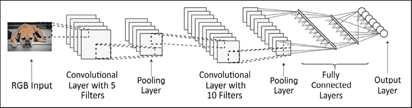

# 第五章：使用卷积神经网络进行句子分类

在本章中，我们将讨论一种叫做 **卷积神经网络**（**CNN**）的神经网络。CNN 与全连接神经网络有很大的不同，并且在许多任务中取得了最先进的性能。这些任务包括图像分类、物体检测、语音识别，当然还有句子分类。CNN 的主要优势之一是，与全连接层相比，CNN 中的卷积层参数数量要小得多。这使得我们能够构建更深的模型，而不必担心内存溢出。此外，深层模型通常会带来更好的性能。

我们将通过讨论 CNN 中的不同组件以及使 CNN 与全连接神经网络不同的特性，详细介绍 CNN。接着，我们将讨论 CNN 中使用的各种操作，如卷积操作和池化操作，以及与这些操作相关的一些超参数，如滤波器大小、填充和步幅。我们还将看看实际操作背后的一些数学原理。在对 CNN 有了充分的理解后，我们将探讨使用 TensorFlow 实现 CNN 的实际操作。首先，我们将实现一个 CNN 用于图像分类，然后使用 CNN 进行句子分类。具体来说，我们将通过以下几个主题：

+   学习 CNN 的基础知识

+   使用 CNN 进行图像分类

+   使用 CNN 进行句子分类

# 介绍 CNN

在本节中，你将学习 CNN。具体来说，你将首先理解 CNN 中存在的各种操作，如卷积层、池化层和全连接层。接下来，我们将简要了解这些操作是如何连接在一起形成一个端到端模型的。

需要注意的是，我们将用 CNN 解决的第一个用例是图像分类任务。CNN 最初是用来解决计算机视觉任务的，后来才被应用于自然语言处理（NLP）。此外，CNN 在计算机视觉领域的应用要比在 NLP 领域更为广泛，这使得在视觉上下文中解释其基本概念更加容易。因此，我们将首先学习 CNN 在计算机视觉中的应用，然后再转向 NLP。

### CNN 基础知识

现在，让我们在不深入技术细节的情况下探讨 CNN 背后的基本思想。CNN 是一堆层的堆叠，包括卷积层、池化层和全连接层。我们将讨论每一层，以了解它们在 CNN 中的作用。

最初，输入连接到一组卷积层。这些卷积层通过卷积操作，滑动一个权重块（有时称为卷积窗口或滤波器）在输入上并产生输出。卷积层使用少量的权重，这些权重组织成每层仅覆盖输入的小块，这与全连接神经网络不同，这些权重在某些维度（例如图像的宽度和高度）上是共享的。此外，CNN 使用卷积操作通过滑动这小部分权重沿着目标维度来共享输出的权重。通过这个卷积操作，我们最终得到的结果如*图 5.1*所示。如果卷积滤波器中存在的模式在图像的小块中出现，卷积将为该位置输出一个较高的值；如果没有，它将输出一个较低的值。此外，通过对整个图像进行卷积，我们得到一个矩阵，表示在某个位置是否存在该模式。最终，我们会得到一个作为卷积输出的矩阵：


图 5.1：卷积操作对图像的作用

此外，这些卷积层可以与池化/子采样层交替使用，池化层减少了输入的维度。在减少维度的同时，我们使得卷积神经网络（CNN）的平移不变性得以保持，并且强迫 CNN 在较少的信息下进行学习，从而提高模型的泛化能力和正则化效果。通过将输入划分为多个小块并将每个小块转换为单个元素，我们可以减少维度。例如，这种转换包括选择一个小块中的最大元素或对一个小块中的所有值进行平均。我们将在*图 5.2*中展示池化如何使 CNN 的平移不变性得以保持：


图 5.2：池化操作如何帮助使数据的平移不变

在这里，我们有原始图像和稍微在`y`轴上平移的图像。我们为这两幅图像计算了卷积输出，可以看到值**10**在卷积输出中的位置略有不同。然而，使用最大池化（它取每个厚方块的最大值），我们最终可以得到相同的输出。我们将在后续详细讨论这些操作。

最后，输出被传递给一组全连接层，这些层将输出传递给最终的分类/回归层（例如，句子/图像分类）。全连接层包含了 CNN 总权重的大部分，因为卷积层的权重较少。然而，研究发现，CNN 在有全连接层的情况下表现优于没有全连接层的情况。这可能是因为卷积层由于其较小的尺寸而学习到更多局部特征，而全连接层则提供了这些局部特征应该如何连接以产生理想输出的全局视图。

*图 5.3*展示了一个典型的 CNN 用于图像分类：



图 5.3：典型的 CNN 架构

从图中可以明显看出，CNN 在设计上能够在学习过程中保持输入的空间结构。换句话说，对于二维输入，CNN 通常会有二维的层，而接近输出层时则只有全连接层。保持空间结构使得 CNN 能够利用输入的宝贵空间信息，并以较少的参数学习输入。空间信息的价值在*图 5.4*中得到了说明：


图 5.4：将图像展开为一维向量会丧失一些重要的空间信息

如你所见，当一张猫的二维图像被展开为一维向量时，耳朵不再靠近眼睛，鼻子也远离眼睛。这意味着我们在展开过程中破坏了一些有用的空间信息。这就是保持输入的二维特性如此重要的原因。

### CNN 的强大之处

卷积神经网络（CNNs）是一个非常多功能的模型家族，并在许多类型的任务中表现出了卓越的性能。这种多功能性归因于 CNN 能够同时执行特征提取和学习，从而提高了效率和泛化能力。让我们讨论几个 CNN 的应用实例。

在**ImageNet 大规模视觉识别挑战赛**（**ILSVRC**）2020 中，CNN 被用于图像分类、物体检测和物体定位任务，并取得了惊人的测试准确率。例如，在图像分类任务中，CNN 的 Top-1 测试准确率约为 90%，涵盖 1,000 个不同的物体类别，这意味着 CNN 能够正确识别大约 900 个不同的物体。

CNN 也被用于图像分割。图像分割是指将图像划分为不同的区域。例如，在包含建筑物、道路、车辆和乘客的城市景观图像中，将道路从建筑物中隔离出来就是一个分割任务。此外，CNN 在自然语言处理（NLP）任务中也取得了显著进展，展现了其在句子分类、文本生成和机器翻译等任务中的表现。

# 理解卷积神经网络（CNN）

现在我们已经了解了卷积神经网络的高层次概念，让我们来深入了解 CNN 的技术细节。首先，我们将讨论卷积操作并介绍一些术语，比如滤波器大小、步长和填充。简而言之，**滤波器大小**指的是卷积操作的窗口大小，**步长**指的是卷积窗口每次移动的距离，**填充**则指的是处理输入边界的方式。我们还将讨论一种叫做反卷积或转置卷积的操作。然后，我们将讨论池化操作的细节。最后，我们将讨论如何添加全连接层，以生成分类或回归输出。

## 卷积操作

在本节中，我们将详细讨论卷积操作。首先，我们将讨论没有步长和填充的卷积操作，然后描述有步长的卷积操作，接着讨论有填充的卷积操作。最后，我们将讨论一种叫做转置卷积的操作。对于本章中的所有操作，我们假设索引从 1 开始，而不是从 0 开始。

### 标准卷积操作

卷积操作是卷积神经网络（CNN）的核心部分。对于一个大小为  的输入和一个权重块（也称为*滤波器*或*卷积核*） ，其中 ，卷积操作将权重块滑动到输入上。我们用 `X` 表示输入，`W` 表示权重块，`H` 表示输出。此外，在每个位置 *i, j*，输出按如下公式计算：


这里，`x [i,j]`、`w [i,j]` 和 `h[i,j]` 分别表示 `X`、`W` 和 `H` 在 `(i,j)` 位置的值。如方程所示，尽管输入大小为 ，但在这种情况下输出的大小将是 。此外，`m` 被称为滤波器大小。这意味着输出的宽度和高度将略小于原始输入。让我们通过可视化来看这个问题（见 *图 5.5*）：


图 5.5：卷积操作，滤波器大小 `(m) = 3`，步长` = 1`，并且没有填充

**注意**

卷积操作产生的输出（*图 5.5* 上方的矩形）有时被称为**特征图**。

接下来让我们讨论卷积中的步长参数。

### 带步长的卷积

在前面的例子中，我们通过一步进行滤波器的移动。然而，这并不是强制性的；我们可以在卷积输入时采用较大的步长或步幅。因此，步长的大小被称为步幅。

让我们修改之前的公式，加入`sᵢ`和`sⱼ`步幅：


在这种情况下，随着`sᵢ`和`sⱼ`增大，输出会变小。对比*图 5.5*（*步幅 = 1*）和*图 5.6*（*步幅 = 2*）可以说明不同步幅的效果：


图 5.6：滤波器大小（m）= 2，步幅 = 2，并且没有填充的卷积操作

如你所见，使用步幅进行卷积有助于像池化层一样减少输入的维度。因此，有时在卷积神经网络（CNN）中，卷积操作与步幅结合使用，代替池化操作，因为它能减少计算复杂度。还需注意，步幅所实现的维度减小可以进行调整或控制，而标准卷积操作的维度减小是固有的。接下来，我们将讨论卷积中另一个重要的概念——填充。

### 卷积与填充

每次卷积操作（没有步幅）不可避免地会导致输出尺寸的减小，这是一个不希望出现的属性。这大大限制了网络中可以使用的层数。另外，已知较深的网络比浅层网络表现更好。需要注意的是，这不应与通过步幅实现的维度减小混淆，因为步幅是一个设计选择，如果需要，我们可以决定使用步幅为 1。因此，填充被用来绕过这个问题。实现方法是将零填充到输入的边界，使得输出尺寸与输入尺寸相等。假设步幅为 1：


这里：


*图 5.7* 展示了填充的结果：


图 5.7：滤波器大小（m=3），步幅（s=1），以及零填充的卷积操作

接下来，我们将讨论转置卷积操作。

### 转置卷积

尽管卷积操作在数学上看起来很复杂，但它可以简化为矩阵乘法。因此，我们可以定义卷积操作的转置，或者有时称为**反卷积**。然而，我们将使用**转置卷积**这一术语，因为它听起来更自然。此外，反卷积指的是一个不同的数学概念。转置卷积操作在卷积神经网络（CNN）中起着重要作用，用于反向传播过程中梯度的反向累积。我们将通过一个例子来解释。

对于大小为  的输入和大小为  的权重块或滤波器，其中 ，卷积操作将权重块滑动在输入上。我们将输入表示为 `X`，权重块表示为 `W`，输出表示为 `H`。输出 `H` 可以通过以下矩阵乘法计算：

假设  和  为了清晰起见，我们从左到右、从上到下展开输入 `X`，得到如下结果：


让我们从 `W` 定义一个新矩阵 `A`：


然后，如果我们执行以下矩阵乘法，我们得到 `H`：


现在，通过将输出  重塑为 ，我们得到卷积输出。现在让我们将这个结果投影回 `n` 和 `m`。

通过展开输入  到 ，并通过创建矩阵  从 `w`，如我们之前所示，我们得到 ，然后将其重塑为 。

接下来，为了获得转置卷积，我们只需转置 `A` 并得到如下结果：


这里， 是转置卷积的结果输出。

我们在这里结束卷积操作的讨论。我们讨论了卷积操作、带步幅的卷积操作、带填充的卷积操作以及如何计算转置卷积。接下来，我们将更详细地讨论池化操作。

## 池化操作

池化操作，有时也称为子采样操作，主要是为了减少卷积神经网络（CNN）中间输出的大小，并使得 CNN 具有平移不变性。与没有填充的卷积引起的自然维度缩减相比，池化操作更为可取，因为我们可以通过池化层来决定输出的大小缩减位置，而不是每次都强制发生。没有填充的情况下强制维度减小会严格限制我们在 CNN 模型中能使用的层数。

我们将在接下来的章节中数学定义池化操作。更准确地说，我们将讨论两种类型的池化：最大池化和平均池化。然而，首先我们将定义符号。对于大小为  的输入和大小为  的卷积核（类似于卷积层的滤波器），其中 ，卷积操作将权重块滑动在输入上。我们将输入表示为 `X`，权重块表示为 `W`，输出表示为 `H`。然后我们使用 `x [i,j]`、`w[i,j]` 和 `h[i,j]` 来表示 `X`、`W` 和 `H` 中（`i`，`j`）位置的值。接下来，我们将讨论常用的池化实现。

### 最大池化

最大池化操作从输入的定义卷积核内选择最大元素生成输出。最大池化操作通过窗口滑动（*图 5.8* 中的中间方块），每次取最大值。数学上，我们将池化公式定义如下：


*图 5.8* 显示了该操作：


图 5.8：滤波器大小为 3，步长为 1，且无填充的最大池化操作

接下来，我们将讨论如何进行带步长的最大池化。

### 带步长的最大池化

带步长的最大池化与带步长的卷积相似。其公式如下：


*图 5.9* 显示了结果：


图 5.9：对大小为 (n=4) 的输入进行最大池化操作，滤波器大小为 (m=2)，步长 (s=2)，且无填充

接下来我们将讨论另一种池化变体——平均池化。

### 平均池化

平均池化与最大池化类似，不同之处在于它不仅取最大值，而是取所有落入卷积核内输入的平均值。考虑以下方程：


平均池化操作如 *图 5.10* 所示：


图 5.10：对大小为 (n=4) 的输入进行平均池化操作，滤波器大小为 (m=2)，步长 (s=1)，且无填充

到目前为止，我们讨论了直接对二维输入（如图像）执行的操作。接下来我们将讨论它们如何与一维的全连接层连接。

## 全连接层

全连接层是从输入到输出的完全连接的权重集合。这些全连接的权重能够学习全局信息，因为它们从每个输入连接到每个输出。而且，拥有这样的完全连接层使我们能够将前面卷积层学到的特征全局结合起来，生成有意义的输出。

我们定义最后一个卷积或池化层的输出大小为 ，其中 `p` 是输入的高度，`o` 是输入的宽度，`d` 是输入的深度。举个例子，考虑一个 RGB 图像，其高度和宽度是固定的，深度为 3（每个 RGB 组件都有一个深度通道）。

然后，对于紧接在最后一个卷积或池化层后的初始全连接层，权重矩阵将是 ，其中层输出的*高度* x *宽度* x *深度* 是该最后一层产生的输出单元数量，`m` 是全连接层中隐藏单元的数量。然后，在推理（或预测）过程中，我们将最后一个卷积/池化层的输出重新调整为大小为 ，并执行以下矩阵乘法以获得 `h`：


结果全连接层的行为就像一个全连接神经网络，其中有多个全连接层和一个输出层。输出层可以是一个用于分类问题的 softmax 分类层，或者一个用于回归问题的线性层。

## 将一切结合起来

现在我们将讨论卷积层、池化层和全连接层如何结合在一起形成一个完整的 CNN。

如*图 5.11*所示，卷积层、池化层和全连接层结合在一起，形成一个端到端的学习模型，该模型接受原始数据（可以是高维的，例如 RGB 图像），并产生有意义的输出（例如物体的类别）。首先，卷积层学习图像的空间特征。

较低的卷积层学习低级特征，如图像中不同方向的边缘，而较高的层学习更高级的特征，如图像中出现的形状（例如，圆形和三角形）或物体的更大部分（例如，狗的脸、狗的尾巴和汽车的前部）。中间的池化层使这些学习到的特征稍微具有平移不变性。这意味着，在新图像中，即使该特征相对于在学习图像中出现的位置稍微偏移，CNN 仍然能够识别该特征。最后，全连接层将 CNN 学到的高级特征结合起来，生成全局表示，这些表示将由最终输出层用于确定物体属于哪个类别：


图 5.11：结合卷积层、池化层和全连接层形成 CNN

在对 CNN 有了强烈的概念理解后，我们现在将开始我们的第一个用例：使用 CNN 模型进行图像分类。

# 练习 – 使用 CNN 对 Fashion-MNIST 进行图像分类

这将是我们第一次使用 CNN 进行实际机器学习任务的示例。我们将使用 CNN 对图像进行分类。不从 NLP 任务开始的原因是，应用 CNN 于 NLP 任务（例如，句子分类）并不是非常直接。使用 CNN 处理此类任务需要一些技巧。然而，CNN 最初是为应对图像数据而设计的。因此，我们从这里开始，然后逐步探索 CNN 如何应用于 NLP 任务的 *使用 CNN 进行句子分类* 部分。

## 关于数据

在这个练习中，我们将使用一个在计算机视觉社区中广为人知的数据集：Fashion-MNIST 数据集。Fashion-MNIST 受到著名的 MNIST 数据集的启发（[`yann.lecun.com/exdb/mnist/`](http://yann.lecun.com/exdb/mnist/)）。MNIST 是一个包含手写数字（0 到 9，即 10 个数字）标签图像的数据库。然而，由于 MNIST 图像分类任务的简单性，MNIST 的测试准确率几乎接近 100%。截至本文撰写时，流行的研究基准网站 *paperswithcode.com* 发布了 99.87% 的测试准确率（[`paperswithcode.com/sota/image-classification-on-mnist`](https://paperswithcode.com/sota/image-classification-on-mnist)）。正因如此，Fashion-MNIST 应运而生。

Fashion-MNIST 包含衣物图像。我们的任务是将每件衣物分类到一个类别中（例如：连衣裙、T 恤）。该数据集包含两个数据集：训练集和测试集。我们将在训练集上进行训练，并在未见过的测试数据集上评估模型的性能。我们还将把训练集分成两个部分：训练集和验证集。我们将使用验证数据集作为模型的持续性能监测机制。我们稍后会详细讨论，但我们会看到，通过简单的训练，模型可以达到大约 88% 的测试准确率，而无需任何特殊的正则化或技巧。

## 下载和探索数据

第一个任务是下载并探索数据。为了下载数据，我们将直接使用 `tf.keras.datasets` 模块，因为它提供了多个数据集，能够通过 TensorFlow 方便地进行下载。要查看其他可用的数据集，请访问 [`www.tensorflow.org/api_docs/python/tf/keras/datasets`](https://www.tensorflow.org/api_docs/python/tf/keras/datasets)。本章的完整代码位于 `Ch05-Sentence-Classification` 文件夹中的 `ch5_image_classification_fashion_mnist.ipynb` 文件里。只需调用以下函数即可下载数据：

```py
(train_images, train_labels), (test_images, test_labels) = tf.keras.datasets.fashion_mnist.load_data() 
```

数据将被下载到 TensorFlow 指定的默认缓存目录（例如：`~/.keras/dataset/fasion_minst`）。

接着，我们将通过打印数据的形状来看数据的大小：

```py
print("train_images is of shape: {}".format(train_images.shape))
print("train_labels is of shape: {}".format(train_labels.shape))
print("test_images is of shape: {}".format(test_images.shape))
print("test_labels is of shape: {}".format(test_labels.shape)) 
```

这将产生：

```py
train_images is of shape: (60000, 28, 28)
train_labels is of shape: (60000,)
test_images is of shape: (10000, 28, 28)
test_labels is of shape: (10000,) 
```

我们可以看到，我们有 60,000 张训练图像，每张大小为 28x28，还有 10,000 张相同尺寸的测试图像。标签是简单的类别 ID，范围从 0 到 9。我们还将创建一个变量来包含类别 ID 到类别名称的映射，这将在探索和训练后分析中帮助我们：

```py
# Available at: https://www.tensorflow.org/api_docs/python/tf/keras/
# datasets/fashion_mnist/load_data
label_map = {
    0: "T-shirt/top", 1: "Trouser", 2: "Pullover", 3: "Dress", 4: "Coat",
    5: "Sandal", 6: "Shirt", 7: "Sneaker",  8: "Bag", 9: "Ankle boot"
} 
```

我们还可以绘制图像，这将生成如下的图像图表（*图 5.12*）：


图 5.12：Fashion-MNIST 数据集中图像的概览

最后，我们将通过在每个张量的末尾添加一个新的维度（大小为 1）来扩展 `train_images` 和 `test_images`。TensorFlow 中卷积操作的标准实现是针对四维输入设计的（即批次、高度、宽度和通道维度）。

在这里，图像中省略了通道维度，因为它们是黑白图像。因此，为了符合 TensorFlow 卷积操作的维度要求，我们需要在图像中添加这一额外的维度。这是使用 CNN 中卷积操作的必要条件。你可以按如下方式进行：

```py
train_images = train_images[:, : , :, None]
test_images = test_images[:, : ,: , None] 
```

使用 NumPy 提供的索引和切片功能，你可以像上面那样简单地通过在索引时添加 `None` 维度来给张量添加新的维度。现在我们来检查张量的形状：

```py
print("train_images is of shape: {}".format(train_images.shape))
print("test_images is of shape: {}".format(test_images.shape)) 
```

这会得到：

```py
train_images is of shape: (60000, 28, 28, 1)
test_images is of shape: (10000, 28, 28, 1) 
```

让我们尝试实现一个可以从这些数据中学习的 CNN 模型。

## 实现 CNN

在这一小节中，我们将查看 TensorFlow 实现 CNN 时的一些重要代码片段。完整的代码可在 `Ch05-Sentence-Classification` 文件夹中的 `ch5_image_classification_mnist.ipynb` 文件中找到。首先，我们将定义一些重要的超参数。代码注释已经自解释，这些超参数的作用如下：

```py
batch_size = 100 # This is the typical batch size we've been using
image_size = 28 # This is the width/height of a single image
# Number of color channels in an image. These are black and white images 
n_channels = 1 
# Number of different digits we have images for (i.e. classes)
n_classes = 10 
```

这样，我们就可以开始实现模型了。我们将从最早期的 CNN 模型之一 LeNet 获取灵感，LeNet 在 LeCun 等人的论文《基于梯度的学习应用于文档识别》中提出（[`yann.lecun.com/exdb/publis/pdf/lecun-01a.pdf`](http://yann.lecun.com/exdb/publis/pdf/lecun-01a.pdf)）。这个模型是一个很好的起点，因为它虽然简单，但在数据集上能够取得相当不错的表现。我们将对原始模型做一些微小的修改，因为原始模型处理的是 32x32 尺寸的图像，而在我们的案例中，图像是 28x28 尺寸的。

让我们快速浏览一下模型的细节。它具有以下层序列：

+   一个具有 5x5 卷积核、1x1 步幅和有效填充的卷积层

+   一个具有 2x2 卷积核、2x2 步幅和有效池化的最大池化层

+   一个具有 5x5 卷积核、1x1 步幅和有效池化的卷积层

+   一个具有 2x2 卷积核、2x2 步幅和有效池化的最大池化层

+   一个具有 4x4 卷积核、1x1 步幅和有效池化的卷积层

+   一个将 2D 输出展平为 1D 向量的层

+   一个具有 84 个节点的 Dense 层

+   一个最终的 softmax 预测层，包含 10 个节点

在这里，除了最后一层外，所有层都使用 ReLU（修正线性单元）激活函数。CNN 模型中的卷积层将我们之前讨论的卷积操作推广到多通道输入，并产生多通道输出。让我们来理解一下这是什么意思。我们看到的原始卷积操作作用于一个简单的二维平面，具有高度 `h` 和宽度 `w`。接下来，卷积核在平面上移动，每个位置生成一个单一值。这个过程会生成另一个二维平面。但是在实际应用中，CNN 模型处理的是四维输入，即形状为 `[batch size, height, width, in channels]` 的输入，并生成一个四维输出，即形状为 `[batch size, height, width, out channels]` 的输出。为了生成这个输出，卷积核需要是一个四维张量，具有 `[kernel height, kernel width, in channels, out channels]` 的维度。

可能一开始不太清楚为什么输入、输出和卷积核需要采用这种格式。*图 5.13* 解释了这一点。


图 5.13：二维卷积层的输入和输出形状

接下来，我们将概述整个模型。如果你一开始没有理解，不用担心。我们会逐行讲解，帮助你理解模型的构建过程：

```py
from tensorflow.keras.layers import Conv2D, MaxPool2D, Flatten, Dense
from tensorflow.keras.models import Sequential
import tensorflow.keras.backend as K
K.clear_session()
lenet_like_model = Sequential([
    # 1st convolutional layer
    Conv2D(
        filters=16, kernel_size=(5,5), strides=(1,1), padding='valid', 
        activation='relu', 
        input_shape=(image_size,image_size,n_channels)
    ), # in 28x28 / out 24x24
    # 1st max pooling layer
    MaxPool2D(pool_size=(2,2), strides=(2,2), padding='valid'), 
    # in 24x24 / out 12x12
    # 2nd convolutional layer
    Conv2D(filters=16, kernel_size=(5,5), strides=(1,1), 
    padding='valid', activation='relu'), # in 12x12 / out 8x8
    # 2nd max pooling layer
    MaxPool2D(pool_size=(2,2), strides=(2,2), padding='valid'), 
    # in 8x8 / out 4x4
    # 3rd convolutional layer
    Conv2D(filters=120, kernel_size=(4,4), strides=(1,1), 
    padding='valid', activation='relu'), # in 4x4 / out 1x1
    # flatten the output of the last layer to suit a fully connected layer
    Flatten(),
    # First dense (fully-connected) layer
    Dense(84, activation='relu'),
    # Final prediction layer
    Dense(n_classes, activation='softmax')
]) 
```

首先需要注意的是，我们使用的是 Keras 的 Sequential API。我们在这里实现的 CNN 模型由一系列层按顺序连接。因此，我们将使用最简单的 API。接下来是我们第一个卷积层。我们已经讨论过卷积操作。让我们来看第一行：

```py
Conv2D(
        filters=16, kernel_size=(5,5), strides=(1,1), padding='valid', 
        activation='relu', 
        input_shape=(image_size,image_size,n_channels)
    ) 
```

`tensorflow.keras.layers.Conv2D` 层接受如下参数值，顺序如下：

+   `filters` (`int`): 这是输出滤波器的数量（即输出通道的数量）。

+   `kernel_size` (`Tuple[int]`): 这是卷积核的（高度，宽度）。

+   `strides` (`Tuple[int]`): 这个参数表示输入的高度和宽度维度上的步幅。

+   `padding` (`str`): 这个参数表示填充类型（可以是 `'SAME'` 或 `'VALID'`）。

+   `activation` (`str`): 使用的非线性激活函数。

+   `input_shape` (`Tuple[int]`): 输入的形状。在定义 `input_shape` 时，我们不需要指定批次维度，因为它会自动添加。

接下来，我们有第一个最大池化层，其形式如下：

```py
MaxPool2D(pool_size=(2,2), strides=(2,2), padding='valid') 
```

这些参数与`tf.keras.layers.Conv2D`中的参数非常相似。`pool_size`参数对应于`kernel_size`参数，用于指定池窗口的（高度，宽度）。按照类似的模式，以下卷积和池化层被定义。最终的卷积层输出大小为`[batch size, 1, 1, 120]`。高度和宽度维度为 1，因为 LeNet 的设计使得最后一个卷积核的高度和宽度与输出相同。在将这个输入送入全连接层之前，我们需要将其展平，使其形状为`[batch size, 120]`。这是因为标准的 Dense 层接受的是二维输入。为此，我们使用`tf.keras.layers.Flatten()`层：

```py
Flatten(), 
```

最后，我们定义两个 Dense 层如下。

```py
Dense(84, activation='relu'),
Dense(n_classes, activation='softmax') 
```

最后一步，我们将使用稀疏类别交叉熵损失函数和 Adam 优化器来编译模型。我们还将跟踪数据上的准确率：

```py
lenet_like_model.compile(loss='sparse_categorical_crossentropy', optimizer='adam', metrics=['accuracy']) 
```

数据准备好且模型完全定义后，我们可以开始训练模型。模型训练非常简单，只需调用一个函数：

```py
lenet_like_model.fit(train_images, train_labels, validation_split=0.2, batch_size=batch_size, epochs=5) 
```

`tf.keras.layers.Model.fit()`接受许多参数。但我们这里只讨论我们在这里使用的那些：

+   `x`（`np.ndarray` / `tf.Tensor` / 其他）：接受一个张量，作为模型的输入（实现为 NumPy 数组或 TensorFlow 张量）。但是，接受的值不仅限于张量。要查看完整的列表，请参阅[`www.tensorflow.org/api_docs/python/tf/keras/Model#fit`](https://www.tensorflow.org/api_docs/python/tf/keras/Model#fit)。

+   `y`（`np.ndarray` / `tf.Tensor`）：接受一个张量，该张量将作为模型的标签（目标）。

+   `validation_split`（`float`）：设置此参数意味着训练数据的一部分（例如，0.2 表示 20%）将作为验证数据。

+   `epochs`（`int`）：训练模型的轮数。

你可以通过调用以下命令在测试数据上评估训练好的模型：

```py
lenet_like_model.evaluate(test_images, test_labels) 
```

运行后，你将看到如下输出：

```py
313/313 [==============================] - 1s 2ms/step - loss: 0.3368 - accuracy: 0.8806 
```

训练后的模型应达到约 88%的准确率。

你刚刚学会了我们用来创建第一个 CNN 的函数。你学会了如何使用这些函数来实现 CNN 结构、定义损失、最小化损失并获得未见数据的预测。我们使用了一个简单的 CNN 来看看它是否能够学习分类服装物品。此外，我们成功地用一个相对简单的 CNN 达到了超过 88%的准确率。接下来，我们将分析 CNN 生成的一些结果。我们将了解为什么 CNN 没有正确识别一些图像。

## 分析 CNN 生成的预测结果

在这里，我们可以从测试集中随机挑选一些正确和错误分类的样本，以评估 CNN 的学习能力（见*图 5.14*）。

我们可以看到，对于正确分类的实例，卷积神经网络（CNN）对输出的信心通常非常高。这是一个好兆头，表明模型正在做出非常自信且准确的决策。然而，当我们评估错误分类的实例时，我们可以发现其中一些实例确实很难，甚至人类也可能会犯错。例如，对于一个被分类为凉鞋的 ankle boot，其上有一个大的黑色补丁，这可能表明有带子，导致它更可能被认为是凉鞋（第三行从右数第三张图）。此外，在第三行从右数第五张图中，很难判断它是衬衫还是有领 T 恤：


图 5.14：Fashion-MNIST 正确分类和错误分类的实例

# 使用 CNN 进行句子分类

尽管 CNN 主要用于计算机视觉任务，但没有什么能阻止它们用于 NLP 应用。如前所述，CNN 最初是为视觉内容设计的。因此，使用 CNN 进行 NLP 任务需要更多的努力。这也是我们从简单的计算机视觉问题开始学习 CNN 的原因。CNN 是机器学习问题的一个有吸引力的选择，因为卷积层的参数数量较少。CNN 在 NLP 中的一个有效应用是句子分类。

在句子分类中，给定的句子应该被分类到一个类别中。我们将使用一个问题数据库，其中每个问题都按其主题进行标记。例如，问题 “Who was Abraham Lincoln?” 将被标记为问题，其标签为 *Person*。为此，我们将使用一个句子分类数据集，数据集可通过 [`cogcomp.org/Data/QA/QC/`](http://cogcomp.org/Data/QA/QC/) 获取；你将在这里找到多个数据集。我们使用的是包含约 5,500 个训练问题及其相应标签和 500 个测试句子的集合。

我们将使用 Yoon Kim 在论文《*卷积神经网络用于句子分类*》中介绍的 CNN 网络，来理解 CNN 在自然语言处理（NLP）任务中的价值。然而，使用 CNN 进行句子分类与我们之前讨论的 Fashion-MNIST 示例有所不同，因为现在的操作（例如卷积和池化）发生在一个维度（长度）中，而不是两个维度（高度和宽度）。此外，池化操作也会与正常的池化操作有所不同，正如我们很快会看到的那样。你可以在 `Ch5-Sentence-Classification` 文件夹中的 `ch5_cnn_sentence_classification.ipynb` 文件找到这个练习的代码。作为第一步，我们将理解数据。

## 句子分类的数据转换方式

假设一句话有 `p` 个单词。首先，如果句子的长度小于 `n`，我们将为句子填充一些特殊的单词（将句子长度设置为 `n` 个单词），如  所示。接下来，我们将句子中的每个单词表示为一个大小为 `k` 的向量，该向量可以是一个独热编码表示，或者是使用 skip-gram、CBOW 或 GloVe 学习的 Word2vec 词向量。然后，一批大小为 `b` 的句子可以表示为一个  矩阵。

让我们通过一个例子来演示。让我们考虑以下三句话：

+   *鲍勃和玛丽是朋友。*

+   *鲍勃踢足球。*

+   *玛丽喜欢在合唱团里唱歌。*

在这个例子中，第三个句子有最多的单词，因此我们设置 `n` = `7`，即第三个句子中的单词数。接下来，让我们来看一下每个单词的独热编码表示。在这种情况下，有 13 个不同的单词。因此，我们得到如下表示：

*鲍勃*: 1,0,0,0,0,0,0,0,0,0,0,0,0

*和*: 0,1,0,0,0,0,0,0,0,0,0,0,0

*玛丽*: 0,0,1,0,0,0,0,0,0,0,0,0,0

同样，`k` = *13*，原因相同。使用这种表示，我们可以将三句话表示为一个大小为 *3 x 7 x 13* 的三维矩阵，如 *图 5.15* 所示：


图 5.15：一批句子表示为句子矩阵

你也可以在这里使用词嵌入代替独热编码。将每个单词表示为独热编码特征会引入稀疏性并浪费计算内存。通过使用词嵌入，我们使得模型能够学习到比独热编码更紧凑、更强大的单词表示。这也意味着  成为一个超参数（即嵌入大小），而不是由词汇表的大小驱动。这意味着，在*图 5.15*中，每一列将是一个分布式的连续向量，而不是由 0 和 1 组成的组合。

我们知道，独热向量会导致高维和高度稀疏的表示，且不理想。另一方面，词向量提供了更丰富的单词表示。然而，学习词向量的计算成本较高。还有一种替代方法叫做哈希技巧。哈希技巧的优点在于它非常简单，但提供了一个强大且经济的替代方案，介于独热向量和词向量之间。哈希技巧背后的想法是使用哈希函数将给定的标记转换为整数。

*f(<token>)-->哈希值*

这里的`f`是一个选定的哈希函数。一些常见的哈希函数包括 SHA（[`brilliant.org/wiki/secure-hashing-algorithms/`](https://brilliant.org/wiki/secure-hashing-algorithms/)）和 MD5（[`searchsecurity.techtarget.com/definition/MD5`](https://searchsecurity.techtarget.com/definition/MD5)）。还有更高级的哈希方法，比如局部敏感哈希（[`www.pinecone.io/learn/locality-sensitive-hashing/`](https://www.pinecone.io/learn/locality-sensitive-hashing/)），可以为形态上相似的词语生成相似的 ID。你可以通过 TensorFlow（[`www.tensorflow.org/api_docs/python/tf/keras/preprocessing/text/hashing_trick`](https://www.tensorflow.org/api_docs/python/tf/keras/preprocessing/text/hashing_trick)）轻松使用哈希技巧。

## 实现 – 下载并准备数据

首先，我们将从网上下载数据。数据下载功能在笔记本中提供，简单地下载了两个文件：训练数据和测试数据（文件路径保存在`train_filename`和`test_filename`中）。

如果你打开这些文件，你会看到它们包含一系列文本行。每一行的格式是：

`<Category>: <sub-category> <question>`

每个问题都有两个元数据：一个类别和一个子类别。类别是宏观分类，子类别则是对问题类型的更细致的划分。共有六个类别：`DESC`（描述相关）、`ENTY`（实体相关）、`HUM`（人类相关）、`ABBR`（缩写相关）、`NUM`（数字相关）和`LOC`（地点相关）。每个类别下有若干子类别。例如，`ENTY`类别进一步细分为动物、货币、事件、食物等。在我们的任务中，我们将专注于高级分类（即六个类别），但你也可以通过最小的修改，利用相同的模型进行子类别层次的分类。

一旦文件下载完成，我们将把数据读入内存。为此，我们将实现`read_data()`函数：

```py
def read_data(filename):
    '''
    Read data from a file with given filename
    Returns a list of strings where each string is a lower case word
    '''
    # Holds question strings, categories and sub categories
    # category/sub_cateory definitions: https://cogcomp.seas.upenn.edu/
    # Data/QA/QC/definition.html
    questions, categories, sub_categories = [], [], []     

    with open(filename,'r',encoding='latin-1') as f:        
        # Read each line
        for row in f:   
            # Each string has format <cat>:<sub cat> <question>
            # Split by : to separate cat and (sub_cat + question)
            row_str = row.split(":")        
            cat, sub_cat_and_question = row_str[0], row_str[1]
            tokens = sub_cat_and_question.split(' ')
            # The first word in sub_cat_and_question is the sub 
            # category rest is the question
            sub_cat, question = tokens[0], ' '.join(tokens[1:])        

            questions.append(question.lower().strip())
            categories.append(cat)
            sub_categories.append(sub_cat)

    return questions, categories, sub_categories
train_questions, train_categories, train_sub_categories = read_data(train_filename)
test_questions, test_categories, test_sub_categories = read_data(test_filename) 
```

这个函数简单地遍历文件中的每一行，并按照上述格式分离问题、类别和子类别。然后，将每个问题、类别和子类别分别写入`questions`、`categories`和`sub_categories`列表。最后，函数返回这些列表。通过为训练和测试数据提供`questions`、`categories`和`sub_categories`，我们将为训练和测试数据创建`pandas`数据框。

`pandas`数据框是一种用于存储多维数据的表达型数据结构。一个数据框可以有索引、列和数值。每个值都有特定的索引和列。创建一个数据框是相当简单的：

```py
# Define training and testing
train_df = pd.DataFrame(
    {'question': train_questions, 'category': train_categories, 
    'sub_category': train_sub_categories}
)
test_df = pd.DataFrame(
    {'question': test_questions, 'category': test_categories,
    'sub_category': test_sub_categories}
) 
```

我们使用字典调用 `pd.DataFrame` 构造函数。字典的键表示 DataFrame 的列，值表示每列中的元素。这里我们创建了三个列：`question`、`category` 和 `sub_category`。

*图 5.16* 展示了 `train_df` 的样子。


图 5.16：在 pandas DataFrame 中捕获的数据示例

我们将对训练集中的行进行简单的洗牌，以确保不会在数据中引入任何无意的顺序：

```py
# Shuffle the data for better randomization
train_df = train_df.sample(frac=1.0, random_state=seed) 
```

该过程将从 DataFrame 中随机抽样 100% 的数据。换句话说，它将打乱行的顺序。从此时起，我们将不再考虑 `sub_category` 列。我们将首先将每个类别标签映射到一个类别 ID：

```py
# Generate the label to ID mapping
unique_cats = train_df["category"].unique()
labels_map = dict(zip(unique_cats, np.arange(unique_cats.shape[0])))
print("Label->ID mapping: {}".format(labels_map))
n_classes = len(labels_map)
# Convert all string labels to IDs
train_df["category"] = train_df["category"].map(labels_map)
test_df["category"] = test_df["category"].map(labels_map) 
```

我们首先识别 `train_df["category"]` 中存在的唯一值。然后，我们将通过将唯一值映射到数字 ID（0 到 5）的列表来创建一个字典。`np.arange()` 函数可以用来生成一个指定范围内的整数序列（这里，范围是从 0 到 `unique_cats` 的长度）。这个过程将生成以下 `labels_map`。

`标签->ID 映射：{0: 0, 1: 1, 2: 2, 4: 3, 3: 4, 5: 5}`

然后，我们简单地将这个映射应用于训练和测试 DataFrame 的类别列，将字符串标签转换为数字标签。转换后的数据如下所示（*图 5.17*）。


图 5.17：在将类别映射为整数后，DataFrame 中的数据示例

我们创建一个验证集，源自原始训练集，用于在训练过程中监控模型表现。我们将使用 scikit-learn 库中的`train_test_split()`函数。10%的数据将作为验证数据，其余 90% 保留作为训练数据。

```py
from sklearn.model_selection import train_test_split
train_df, valid_df = train_test_split(train_df, test_size=0.1)
print("Train size: {}".format(train_df.shape))
print("Valid size: {}".format(valid_df.shape)) 
```

输出如下：

```py
Train size: (4906, 3)
Valid size: (546, 3) 
```

我们可以看到，大约 4,900 个示例用于训练，剩余的作为验证。在接下来的部分，我们将构建一个分词器来对问题进行分词，并为每个词汇分配数字 ID。

### 实现 – 构建分词器

接下来，到了构建分词器的时刻，它可以将单词映射为数字 ID：

```py
from tensorflow.keras.preprocessing.text import Tokenizer
# Define a tokenizer and fit on train data
tokenizer = Tokenizer()
tokenizer.fit_on_texts(train_df["question"].tolist()) 
```

这里，我们简单地创建一个 `Tokenizer` 对象，并使用 `fit_on_texts()` 函数在训练语料库上训练它。在这个过程中，分词器会将词汇表中的单词映射为 ID。我们将把训练集、验证集和测试集中的所有输入转换为单词 ID 的序列。只需调用 `tokenizer.texts_to_sequences()` 函数，并传入一个字符串列表，每个字符串代表一个问题：

```py
# Convert each list of tokens to a list of IDs, using tokenizer's mapping
train_sequences = tokenizer.texts_to_sequences(train_df["question"].tolist())
valid_sequences = tokenizer.texts_to_sequences(valid_df["question"].tolist())
test_sequences = tokenizer.texts_to_sequences(test_df["question"].tolist()) 
```

重要的是要理解，我们每次给模型输入一批问题。所有问题的词数不太可能相同。如果所有问题的词数不相同，我们无法形成一个张量，因为问题的长度不一致。为了解决这个问题，我们必须通过特殊符号填充较短的序列，并截断超过指定长度的序列。为了实现这一点，我们可以轻松使用`tf.keras.preprocessing.sequence.pad_sequences()`函数。值得一提的是，我们可以仔细查看该函数所接受的参数：

+   `sequences (List[List[int]])` – 整数列表的列表；每个整数列表是一个序列

+   `maxlen (int)` – 最大填充长度

+   `padding (string)` – 是否在开头 `(pre)` 或结尾 `(post)` 进行填充

+   `truncating (string)` – 是否在开头 `(pre)` 或结尾 `(post)` 进行截断

+   `value (int)` – 用于填充的值（默认为 0）

在下面的代码中，我们使用这个函数为训练、验证和测试数据创建序列矩阵：

```py
max_seq_length = 22
# Pad shorter sentences and truncate longer ones (maximum length: max_seq_
# length)
preprocessed_train_sequences = tf.keras.preprocessing.sequence.pad_sequences(
    train_sequences, maxlen=max_seq_length, padding='post',
    truncating='post'
)
preprocessed_valid_sequences = tf.keras.preprocessing.sequence.pad_sequences(
    valid_sequences, maxlen=max_seq_length, padding='post', 
    truncating='post'
)
preprocessed_test_sequences = tf.keras.preprocessing.sequence.pad_sequences(
    test_sequences, maxlen=max_seq_length, padding='post', 
    truncating='post'
) 
```

我们选择 22 作为序列长度的原因是通过简单的分析得出的。训练语料库中序列长度的 99% 百分位数为 22。因此，我们选择了这个值。另一个重要统计信息是词汇表大小大约为 7,880 个词。接下来我们将讨论模型。

## 句子分类 CNN 模型

现在我们将讨论用于句子分类的 CNN 的技术细节。首先，我们将讨论如何将数据或句子转换为可以方便地由 CNN 处理的首选格式。接下来，我们将讨论如何将卷积和池化操作适应于句子分类，最后，我们将讨论如何将所有这些组件连接起来。

### 卷积操作

如果忽略批量大小，即假设我们每次只处理一个句子，我们的数据是一个  矩阵，其中 `n` 是填充后每个句子的单词数，`k` 是单个词向量的维度。在我们的例子中，这将是 `7` x *13*。

现在我们将定义卷积权重矩阵，其大小为 ，其中 `m` 是一维卷积操作的过滤器大小。通过将输入 `x` 的大小为  与大小为  的权重矩阵 `W` 卷积，我们将得到大小为  的输出 `h`，其计算过程如下：


在这里，`w[i,j]` 是 `W` 的第 `(i,j)` 元素，我们将使用零填充 `x`，使得 `h` 的大小为 `1 x n`。此外，我们将更简洁地定义这个操作，如下所示：


在这里，`*`定义了卷积操作（带填充），并且我们将添加一个额外的标量偏置`b`。*图 5.18*展示了这一操作：


图 5.18：句子分类的卷积操作。使用不同的卷积核宽度的卷积层对句子（即标记序列）进行卷积

然后，为了学习丰富的特征，我们有并行层，使用不同的卷积过滤器大小。每个卷积层输出大小为  的隐藏向量，我们将这些输出连接起来，作为下一层的输入，大小为 ，其中`q`是我们将使用的并行层的数量。`q`越大，模型的性能越好。

卷积的值可以通过以下方式理解。想象一下电影评分学习问题（有两个类别，正面或负面），我们有以下句子：

+   *我喜欢这部电影，还不错*

+   *我不喜欢这部电影，差劲*

现在想象一个大小为 5 的卷积窗口。我们将根据卷积窗口的移动来对单词进行分箱。

句子*I like the movie, not too bad*给出了：

*[I, like, the, movie, ‘,’]*

*[like, the, movie, ‘,’, not]*

*[the, movie, ‘,’, not, too]*

*[movie, ‘,’, not, too, bad]*

句子*I did not like the movie, bad*给出了以下结果：

*[I, did, not, like, the]*

*[did, not ,like, the, movie]*

*[not, like, the, movie, ‘,’]*

*[like, the, movie, ‘,’, bad]*

对于第一个句子，像以下的窗口会传达评分为正面：

*[I, like, the, movie, ‘,’]*

*[movie, ‘,’, not, too, bad]*

然而，对于第二个句子，像以下的窗口会传达出负面的评分信息：

*[did, not, like, the, movie]*

我们能够看到这样的模式，它们帮助分类评分，这得益于保留的空间性。例如，如果你使用像*词袋模型*这样的技术来计算句子的表示，这会丢失空间信息，那么上述两个句子的表示将会非常相似。卷积操作在保留句子空间信息方面起着重要作用。

通过具有不同过滤器大小的`q`个层，网络学习如何提取不同大小短语的评分，从而提高性能。

### 时间池化

池化操作旨在对之前讨论的并行卷积层产生的输出进行下采样。具体实现如下：

假设最后一层的输出`h`的大小是 。时间池化层将生成一个输出*h’*，大小为 。精确的计算如下：


这里， 和`h^((i))`是由第`i`层卷积产生的输出，是属于该层的权重集。简单来说，时间池化操作通过连接每个卷积层的最大元素来创建一个向量。

我们将在*图 5.19*中说明这个操作：


图 5.19：用于句子分类的时间池化操作

通过结合这些操作，我们最终得到了如*图 5.20*所示的架构：


图 5.20：句子分类 CNN 架构。具有不同核宽度的卷积层池生成一组输出序列。这些序列被送入“时间池化”层，生成该输入的紧凑表示。最后，这些被连接到具有 softmax 激活的分类层：

## 实现 – 使用 CNN 进行句子分类

我们开始在 TensorFlow 2 中实现模型。在此之前，让我们从 TensorFlow 中导入几个必要的模块：

```py
import tensorflow.keras.backend as K
import tensorflow.keras.layers as layers
import tensorflow.keras.regularizers as regularizers
from tensorflow.keras.models import Model 
```

清除当前运行的会话，以确保之前的运行不会干扰当前的运行：

```py
K.clear_session() 
```

在我们开始之前，我们将使用 Keras 的功能性 API。这样做的原因是我们将在这里构建的模型不能使用顺序 API 构建，因为该模型中有复杂的路径。我们先从创建一个输入层开始：

```py
Input layer takes word IDs as inputs
word_id_inputs = layers.Input(shape=(max_seq_length,), dtype='int32') 
```

输入层简单地接收一个`max_seq_length`的单词 ID 批次。也就是说，接收一批序列，其中每个序列都填充或截断到最大长度。我们将`dtype`指定为`int32`，因为它们是单词 ID。接下来，我们定义一个嵌入层，在该层中我们将查找与通过`word_id_inputs`层传入的单词 ID 对应的嵌入：

```py
# Get the embeddings of the inputs / out [batch_size, sent_length, 
# output_dim]
embedding_out = layers.Embedding(input_dim=n_vocab, output_dim=64)(word_id_inputs) 
```

这是一个随机初始化的嵌入层。它包含一个大小为`[n_vocab, 64]`的大矩阵，其中每一行表示由该行编号索引的单词的词向量。嵌入将与模型共同学习，同时在监督任务上训练模型。在下一部分中，我们将定义三个不同的一维卷积层，分别使用三个不同的核（过滤器）大小：`3`、`4`和`5`，每个卷积层有 100 个特征图：

```py
# For all layers: in [batch_size, sent_length, emb_size] / out [batch_
# size, sent_length, 100]
conv1_1 = layers.Conv1D(
    100, kernel_size=3, strides=1, padding='same', 
    activation='relu'
)(embedding_out)
conv1_2 = layers.Conv1D(
    100, kernel_size=4, strides=1, padding='same', 
    activation='relu'
)(embedding_out)
conv1_3 = layers.Conv1D(
    100, kernel_size=5, strides=1, padding='same', 
    activation='relu'
)(embedding_out) 
```

这里需要做出一个重要区分，我们使用的是一维卷积，而不是之前练习中使用的二维卷积。然而，大多数概念仍然相同。主要的区别在于，`tf.keras.layers.Conv2D`作用于四维输入，而`tf.keras.layers.Conv1D`作用于三维输入（即形状为`[batch size, width, in channels]`的输入）。换句话说，卷积核仅沿一个方向在输入上滑动。这些层的每个输出都会产生一个形状为`[batch size, sentence length, 100]`的张量。然后，这些输出会在最后一个轴上连接，形成一个单一的张量：

```py
# in previous conv outputs / out [batch_size, sent_length, 300]
conv_out = layers.Concatenate(axis=-1)([conv1_1, conv1_2, conv1_3]) 
```

随后，新的张量大小为`[batch size, sentence length, 300]`，将用于执行时间池化操作。我们可以通过定义一个一维最大池化层（即`tf.keras.layers.MaxPool1D`）来实现时间池化操作，其窗口宽度与序列长度相同。这样会为`conv_out`中的每个特征图生成一个单一值作为输出：

```py
# Pooling over time operation. 
# This is doing the max pooling over sequence length
# in other words, each feature map results in a single output
# in [batch_size, sent_length, 300] / out [batch_size, 1, 300]
pool_over_time_out = layers.MaxPool1D(pool_size=max_seq_length, padding='valid')(conv_out) 
```

这里我们在执行操作后获得了一个`[batch_size, 1, 300]`大小的输出。接下来，我们将使用`tf.keras.layers.Flatten`层将此输出转换为`[batch_size, 300]`大小的输出。Flatten 层将所有维度（除了批次维度）压缩为一个维度：

```py
# Flatten the unit length dimension
flatten_out = layers.Flatten()(pool_over_time_out) 
```

最后，`flatten_out`将传递到一个全连接层，该层具有`n_classes`（即六个）节点作为输出，并且使用 softmax 激活函数：

```py
# Compute the final output
out = layers.Dense(
    n_classes, activation='softmax',
    kernel_regularizer=regularizers.l2(0.001)
)(flatten_out) 
```

注意使用了`kernel_regularizer`参数。我们可以使用该参数为给定层添加任何特殊的正则化（例如 L1 或 L2 正则化）。最后，我们定义一个模型如下，

```py
# Define the model
cnn_model = Model(inputs=word_id_inputs, outputs=out) 
```

使用所需的损失函数、优化器和评估指标来编译模型：

```py
# Compile the model with loss/optimzier/metrics
cnn_model.compile(
    loss='sparse_categorical_crossentropy', 
    optimizer='adam', 
    metrics=['accuracy']
) 
```

你可以通过运行以下代码查看模型：

```py
cnn_model.summary() 
```

结果为，

```py
Model: "model"
______________________________________________________________________
Layer (type)            Output Shape         Param #     Connected to 
======================================================================
input_1 (InputLayer)    [(None, 22)]         0                        
______________________________________________________________________
embedding (Embedding)   (None, 22, 64)       504320      input_1[0][0]
______________________________________________________________________
conv1d (Conv1D)         (None, 22, 100)      19300     embedding[0][0]
______________________________________________________________________
conv1d_1 (Conv1D)       (None, 22, 100)      25700     embedding[0][0]
______________________________________________________________________
conv1d_2 (Conv1D)       (None, 22, 100)      32100     embedding[0][0]
______________________________________________________________________
concatenate (Concatenate) (None, 22, 300)    0            conv1d[0][0]
                                                        conv1d_1[0][0]
                                                        conv1d_2[0][0]
______________________________________________________________________
max_pooling1d (MaxPooling1D) (None, 1, 300)    0     concatenate[0][0]
______________________________________________________________________
flatten (Flatten)          (None, 300)         0   max_pooling1d[0][0]
______________________________________________________________________
dense (Dense)              (None, 6)           1806    flatten[0][0] 
======================================================================
Total params: 583,226
Trainable params: 583,226
Non-trainable params: 0
______________________________________________________________________ 
```

接下来，我们将在已经准备好的数据上训练模型。

## 训练模型

由于我们在开始时已经做好了基础工作，确保数据已经转换，因此训练模型非常简单。我们需要做的就是调用`tf.keras.layers.Model.fit()`函数。不过，我们可以通过利用一些技术来提升模型性能。我们将使用 TensorFlow 内置的回调函数来实现这一点。我们要使用的技术叫做“学习率衰减”。其思想是，当模型停止提高性能时，按某个比例减少学习率。以下回调函数可以帮助我们实现这一点：

```py
# Call backs
lr_reduce_callback = tf.keras.callbacks.ReduceLROnPlateau(
    monitor='val_loss', factor=0.1, patience=3, verbose=1,
    mode='auto', min_delta=0.0001, min_lr=0.000001
) 
```

可以根据需要设置这些参数来控制学习率的减少。让我们理解上面提到的参数：

+   `monitor (str)` – 用于监控的指标，以便衰减学习率。我们将监控验证损失

+   `factor (float)` – 降低学习率的倍数。例如，0.1 的因子意味着学习率将减少 10 倍（例如，0.01 将降到 0.001）

+   `patience (int)` – 在没有改进的情况下，等待多少个 epoch 后才会降低学习率

+   `mode (string)` – 指定是否寻找指标的增加或减少；`auto`表示方向将根据指标名称确定

+   `min_delta (float)` – 视为改进的最小增减量

+   `min_lr (float)` – 最小学习率（下限）

让我们训练模型：

```py
# Train the model
cnn_model.fit(
    preprocessed_train_sequences, train_labels, 
    validation_data=(preprocessed_valid_sequences, valid_labels),
    batch_size=128, 
    epochs=25,
    callbacks=[lr_reduce_callback]
) 
```

我们将看到准确率迅速上升，而验证准确率在 88%左右停滞。以下是生成的输出片段：

```py
Epoch 1/50
39/39 [==============================] - 1s 9ms/step - loss: 1.7147 - accuracy: 0.3063 - val_loss: 1.3912 - val_accuracy: 0.5696
Epoch 2/50
39/39 [==============================] - 0s 6ms/step - loss: 1.2268 - accuracy: 0.6052 - val_loss: 0.7832 - val_accuracy: 0.7509
...
Epoch 00015: ReduceLROnPlateau reducing learning rate to 1.0000000656873453e-06.
Epoch 16/50
39/39 [==============================] - 0s 6ms/step - loss: 0.0487 - accuracy: 0.9999 - val_loss: 0.3639 - val_accuracy: 0.8846
Restoring model weights from the end of the best epoch.
Epoch 00016: early stopping 
```

接下来，让我们在测试数据集上测试模型：

```py
cnn_model.evaluate(preprocessed_test_sequences, test_labels, return_dict=True) 
```

按照练习中给出的测试数据进行评估，我们在这个句子分类任务中获得了接近 88%的测试准确率（对于 500 个测试句子）。

在这里，我们结束了关于使用 CNN 进行句子分类的讨论。我们首先讨论了如何将一维卷积操作与一种称为*时间池化*的特殊池化操作结合，来实现基于 CNN 架构的句子分类器。最后，我们讨论了如何使用 TensorFlow 来实现这样的 CNN，并且看到它在句子分类中的确表现良好。

了解我们刚刚解决的问题如何在实际中应用是很有用的。假设你手上有一本关于罗马历史的厚重文档，而你只想了解关于尤利乌斯·凯撒的内容，而不想读完整本书。在这种情况下，我们刚刚实现的句子分类器可以作为一个有用的工具，帮助你总结出与某个人相关的句子，这样你就不必阅读整篇文档了。

句子分类还可以应用于许多其他任务；其中一个常见的应用是对电影评论进行正负面分类，这对于自动化计算电影评分非常有用。句子分类在医学领域也有重要应用，它可以用来从包含大量文本的大型文档中提取临床有用的句子。

# 总结

在本章中，我们讨论了卷积神经网络（CNN）及其各种应用。首先，我们详细解释了 CNN 是什么，以及它在机器学习任务中表现优异的能力。接下来，我们将 CNN 分解成几个组件，如卷积层和池化层，并详细讨论了这些操作符的工作原理。此外，我们还讨论了与这些操作符相关的几个超参数，如滤波器大小、步幅和填充。

接着，为了说明 CNN 的功能，我们通过一个简单的例子展示了如何对衣物图像进行分类。我们还进行了一些分析，看看为什么 CNN 在某些图像识别上出现错误。

最后，我们开始讨论了卷积神经网络（CNN）如何应用于自然语言处理（NLP）任务。具体来说，我们讨论了一种修改过的 CNN 架构，可以用于对句子进行分类。然后，我们实现了这一特定的 CNN 架构，并在实际的句子分类任务中进行了测试。

在下一章，我们将进入一种在许多 NLP 任务中广泛应用的神经网络类型——**递归神经网络**（**RNNs**）。

要访问本书的代码文件，请访问我们的 GitHub 页面：[`packt.link/nlpgithub`](https://packt.link/nlpgithub)

加入我们的 Discord 社区，与志同道合的人一起学习，和超过 1000 名成员共同进步，网址：[`packt.link/nlp`](https://packt.link/nlp)


