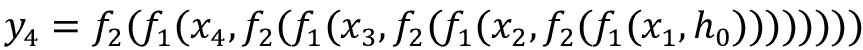
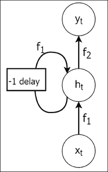
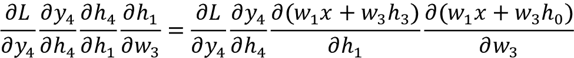

# 第六章：循环神经网络

**循环神经网络** (**RNNs**) 是一类特殊的神经网络，旨在处理序列数据（即时间序列数据），如股票市场价格或文本序列（例如，可变长度的句子）。RNN 维持一个状态变量，用于捕捉序列数据中存在的各种模式；因此，它们能够建模序列数据。相比之下，传统的前馈神经网络没有这种能力，除非数据被表示为捕捉序列中重要模式的特征表示。然而，提出这样的特征表示是非常困难的。前馈模型用于建模序列数据的另一个替代方案是为每个时间/序列位置设置一组独立的参数，以便为特定位置分配的参数可以学习该位置发生的模式。这会大大增加模型的内存需求。

然而，与前馈网络为每个位置拥有一组独立参数不同，RNN 在时间上共享相同的参数。时间上的参数共享是 RNN 的一个重要部分，实际上是学习时间序列模式的主要推动力之一。然后，状态变量会随着我们在序列中观察到的每个输入而随时间更新。随着时间共享的这些参数，结合状态向量，能够根据序列中先前观察到的值预测序列的下一个值。此外，由于我们每次只处理序列中的一个元素（例如，每次处理文档中的一个单词），RNN 可以处理任意长度的数据，而无需使用特殊标记对数据进行填充。

本章将深入探讨 RNN 的细节。首先，我们将讨论如何通过从一个简单的前馈模型开始来形成一个 RNN。

在此之后，我们将讨论 RNN 的基本功能。我们还将深入探讨 RNN 的基础方程式，例如输出计算和参数更新规则，并讨论几种 RNN 的应用变体：一对一、一对多和多对多的 RNN。我们将通过一个例子，展示如何使用 RNN 来识别命名实体（例如人名、组织名等），这对于构建知识库等下游应用具有重要价值。我们还将讨论一个更复杂的 RNN 模型，该模型能够同时正向和反向读取文本，并使用卷积层提高模型的准确性。本章将通过以下几个主要主题进行讲解：

+   理解 RNN

+   通过时间的反向传播

+   RNN 的应用

+   使用 RNN 进行命名实体识别（NER）

+   使用字符和标记嵌入进行命名实体识别（NER）

# 理解 RNN

在本节中，我们将通过温和的介绍来讨论 RNN 的定义，然后深入探讨更具体的技术细节。我们之前提到过，RNN 通过维护一个随着时间推移而变化的状态变量来处理更多的数据，从而使其具备建模顺序数据的能力。特别是，这个状态变量通过一组循环连接在时间上不断更新。循环连接的存在是 RNN 和前馈网络之间的主要结构性差异。循环连接可以理解为 RNN 在过去学到的一系列记忆之间的联系，这些记忆与 RNN 当前的状态变量相连接。换句话说，循环连接根据 RNN 所拥有的过去记忆来更新当前的状态变量，使得 RNN 能够基于当前输入以及之前的输入进行预测。

术语 RNN 有时用来指代循环模型家族，它包含许多不同的模型。换句话说，有时它被用作某个特定 RNN 变体的泛化。在这里，我们使用 RNN 这个术语来指代一种最早实现的 RNN 模型，称为 Elman 网络。

在接下来的部分，我们将讨论以下主题。首先，我们将讨论如何通过将前馈网络表示为计算图来开始。

然后我们将通过一个例子来说明前馈网络为什么可能在顺序任务中失败。接着，我们将调整该前馈图来建模顺序数据，这将给我们一个 RNN 的基本计算图。我们还将讨论 RNN 的技术细节（例如，更新规则）。最后，我们将讨论如何训练 RNN 模型的具体细节。

## 前馈神经网络的问题

为了理解前馈神经网络的局限性以及 RNN 如何解决这些问题，让我们想象一个数据序列：


接下来，假设在现实世界中，`x` 和 `y` 之间存在以下关系：


在这里，`g₁` 和 `g₂` 是转换（例如，乘以权重矩阵后进行非线性转换）。这意味着当前输出 `yₜ` 依赖于当前状态 `hₜ`，其中 `hₜ` 是通过当前输入 `xₜ` 和前一个状态 `h[t-1]` 计算得出的。这个状态编码了模型历史上观察到的关于先前输入的信息。

现在，让我们想象一个简单的前馈神经网络，我们将通过以下方式表示它：


在这里，`yₜ` 是某个输入 `xₜ` 的预测输出。

如果我们使用前馈神经网络来解决这个任务，网络将不得不一次处理一个 ，每次将  作为输入。现在，让我们考虑一下这种解决方案在时间序列问题中可能面临的问题。

一个前馈神经网络在时间 `t` 预测的输出 `yₜ` 仅依赖于当前输入 `xₜ`。换句话说，它并不知道导致 `xₜ` 的输入（即 ）。因此，前馈神经网络无法完成这样一个任务：当前的输出不仅依赖于当前输入，还依赖于先前的输入。让我们通过一个例子来理解这一点。

假设我们需要训练一个神经网络来填补缺失的单词。我们有如下短语，并希望预测下一个单词：

*詹姆斯有一只猫，它喜欢喝 ____。*

如果我们每次处理一个单词并使用前馈神经网络，那么我们只会得到输入 *drink*，这远远不足以理解这个短语，甚至无法理解上下文（单词 *drink* 可以出现在许多不同的语境中）。有些人可能会认为，通过一次性处理完整句子，我们可以得到较好的结果。尽管这是对的，但这种方法也有局限性，比如在处理非常长的句子时。然而，现在有一种新的模型家族，称为 Transformer，它们使用完全连接的层来处理完整的数据序列，并且在性能上超越了顺序模型。我们稍后会单独讲解这些模型。

## 使用 RNN 建模

另一方面，我们可以使用 RNN 来解决这个问题。我们将从已有的数据开始：


假设我们有以下关系：


现在，让我们将 `g₁` 替换为一个函数逼近器 ，该函数由  参数化，它接受当前输入 `xₜ` 和系统的先前状态 `h[t-1]` 作为输入，并生成当前状态 `hₜ`。然后，我们将 `g₂` 替换为 ，它接受系统的当前状态 `hₜ` 并生成 `yₜ`。这就给出了如下结果：


我们可以将  看作是生成 `x` 和 `y` 的真实模型的近似。为了更清楚地理解这一点，让我们将方程展开如下：


例如，我们可以将 `y₄` 表示为如下形式：


同样，通过展开，我们得到以下结果（为了清晰起见，省略了  和 ）：



这可以通过图形来表示，如 *图 6.1* 所示：


图 6.1：x[t] 和 y[t] 的关系展开

我们可以将该图进行概括，对于任何给定的时间步 `t`，如 *图 6.2* 所示：


图 6.2：RNN 结构的单步计算

然而，需要理解的是，`h[t-1]`实际上是在接收到`xₜ`之前的`hₜ`。换句话说，`h[t-1]`是`hₜ`在一个时间步之前的值。

因此，我们可以使用循环连接表示`hₜ`的计算，如*图 6.3*所示：



图 6.3：带有循环连接的 RNN 单步计算

将一系列方程映射从到，如*图 6.3*所示，这使我们能够将任何`yₜ`表示为`xₜ`、`h[t-1]`和`hₜ`的函数。这是 RNN 的核心思想。

## 循环神经网络的技术描述

现在，我们更深入地了解 RNN 的构成，并定义在 RNN 内部发生的计算的数学方程式。我们从我们推导出的两个函数开始，作为学习从`xₜ`到`yₜ`的函数逼近器：


如我们所见，神经网络由一组权重、偏置和一些非线性激活函数组成。因此，我们可以将之前的关系写成如下形式：


在这里，tanh 是 tanh 激活函数，`U`是大小为的权重矩阵，其中`m`是隐藏单元的数量，`d`是输入的维度。此外，`W`是大小为的权重矩阵，用于从`h[t-1]`到`hₜ`创建循环连接。`yₜ`的关系由以下方程给出：


在这里，`V`是大小为的权重矩阵，`c`是输出的维度（这可以是输出类别的数量）。在*图 6.4*中，我们展示了这些权重如何形成一个 RNN。箭头表示数据在网络中的流动方向：


图 6.4：RNN 的结构

到目前为止，我们已经看到如何用计算节点的图表示 RNN，其中边表示计算过程。此外，我们还探讨了 RNN 背后的实际数学原理。现在让我们来看一下如何优化（或训练）RNN 的权重，以便从序列数据中学习。

# 时间反向传播

在训练 RNN 时，使用一种特殊形式的**反向传播**，称为**时间反向传播**（**BPTT**）。然而，要理解 BPTT，首先我们需要了解**BP**是如何工作的。然后我们将讨论为什么 BP 不能直接应用于 RNN，但如何将 BP 适应 RNN，从而得出 BPTT。最后，我们将讨论 BPTT 中存在的两个主要问题。

## 反向传播是如何工作的

反向传播是用来训练前馈神经网络的技术。在反向传播过程中，你会执行以下操作：

+   计算给定输入的预测

+   通过将预测与输入的实际标签进行比较，计算预测的误差 `E`（例如，均方误差和交叉熵损失）

+   通过在梯度的相反方向上迈出小步，更新前馈网络的权重，以最小化在*步骤 2*中计算的损失，针对所有 `w[ij]`，其中 `w[ij]` 是第 `i` 层的第 `j` 权重

为了更清楚地理解上述计算，考虑 *图 6.5* 中描绘的前馈网络。该网络有两个单一的权重 `w₁` 和 `w₂`，并计算两个输出 `h` 和 `y`，如下面的图所示。为简化模型，我们假设没有非线性：


图 6.5：前馈网络的计算

我们可以使用链式法则如下计算 ：


这简化为以下内容：


在这里，`l` 是数据点 `x` 的正确标签。此外，我们假设均方误差作为损失函数。这里的一切都是定义明确的，计算  也相当直接。

## 为什么我们不能直接对 RNN 使用 BP

现在，让我们对 *图 6.6* 中的 RNN 做同样的尝试。现在我们有了一个额外的递归权重 `w₃`。为了清晰地突出我们要强调的问题，我们省略了输入和输出的时间成分：


图 6.6：RNN 的计算

让我们看看如果我们应用链式法则来计算  会发生什么：


这变为以下内容：


这里的项  会产生问题，因为它是一个递归项。你最终会得到无限多个导数项，因为 `h` 是递归的（也就是说，计算 `h` 包含了 `h` 本身），并且 `h` 不是常量，而是依赖于 `w₃`。这通过随着时间展开输入序列 `x` 来解决，为每个输入 `xₜ` 创建一个 RNN 的副本，分别计算每个副本的导数，然后通过将这些更新求和来合并这些更新，进而计算权重更新。我们将在接下来讨论这个过程的细节。

## 反向传播通过时间——训练 RNN

计算 RNN 的反向传播技巧是考虑完整的输入序列，而不仅仅是单个输入。然后，如果我们在时间步 4 计算 ，我们将得到以下结果：


这意味着我们需要计算所有时间步长（直到第四个时间步）的梯度和。换句话说，我们将首先展开序列，以便我们可以为每个时间步 `j` 计算  和 。这是通过创建四个 RNN 的副本来完成的。因此，要计算 ，我们需要 *t-j+1* 个 RNN 副本。然后，我们将通过将所有前一个时间步的梯度相加，滚动这些副本为一个单一的 RNN，得到梯度，并使用梯度  来更新 RNN。

然而，随着时间步数的增加，这变得非常昂贵。为了更高效的计算，我们可以使用 **截断反向传播通过时间**（**TBPTT**）来优化递归模型，这是 BPTT 的一种近似方法。

## 截断 BPTT——高效训练 RNN

在 TBPTT 中，我们只计算固定数量 `T` 时间步的梯度（与 BPTT 中计算到序列开始不同）。更具体地说，在计算  时，对于时间步 `t`，我们只计算到 *t-T* 的导数（也就是说，我们不计算到序列的开始）：


这比标准的 BPTT 在计算上更为高效。在标准 BPTT 中，对于每个时间步 `t`，我们需要计算从序列开始到当前时间步的导数。但随着序列长度越来越大，这变得计算上不可行（例如，当逐字处理一篇长文本时）。然而，在截断 BPTT 中，我们只计算固定步数的反向导数，正如你可以想象的那样，随着序列变长，计算成本不会发生变化。

## BPTT 的局限性——消失梯度和爆炸梯度

尽管有了计算递归权重梯度的方法，并且拥有像 TBPTT 这样的计算高效近似方法，我们仍然无法毫无问题地训练 RNN。计算中可能还会出现其他问题。

为了理解为什么如此，让我们展开  中的一个单项，公式如下：



由于我们知道反向传播的问题来自于递归连接，因此让我们忽略 `w₁``x` 项，考虑以下内容：


通过简单地展开 `h₃` 并进行简单的算术运算，我们可以证明这一点：


我们看到，对于仅四个时间步，我们有一个项 。因此，在第 `n` 时间步，它将变成 。假设我们在 `n=100` 时间步将 `w₃` 初始化为非常小的值（例如 0.00001）；那么梯度将变得极其微小（约为 10^(-500) 的量级）。此外，由于计算机在表示数字时精度有限，这个更新将被忽略（即，算术下溢）。这被称为 **消失梯度**。

解决梯度消失问题并不是非常直接。没有简单的方法可以重新缩放梯度，以便它们能够正确地在时间上传播。实践中解决梯度消失问题的一些技术包括：仔细初始化权重（例如，Xavier 初始化），或使用基于动量的优化方法（即，除了当前的梯度更新外，我们还会添加一个额外的项，这是所有过去梯度的累积，称为**速度项**）。然而，解决梯度消失问题的更有原则的方法，例如对标准 RNN 的不同结构修改，已经被提出，正如我们将在*第七章，理解长短期记忆网络*中看到的那样。

另一方面，假设我们将 `w₃` 初始化为非常大（比如 1000.00）。那么在 `n=100` 的时间步长下，梯度将变得巨大（规模为 10³⁰⁰）。

这会导致数值不稳定，您将在 Python 中得到类似 `Inf` 或 `NaN`（即非数字）的值。这被称为**梯度爆炸**。

梯度爆炸也可能由于问题损失面（loss surface）的复杂性而发生。由于输入的维度和模型中存在大量参数（权重），复杂的非凸损失面在深度神经网络中非常常见。

*图 6.7* 展示了 RNN 的损失面，并突出了具有非常高曲率的墙壁。如果优化方法接触到这样的墙壁，梯度将会爆炸或超调，如图中实线所示。这可能导致非常差的损失最小化、数值不稳定，或者两者都有。避免在这种情况下梯度爆炸的一个简单方法是将梯度裁剪到一个合理的小值，当其大于某个阈值时。图中的虚线显示了当我们在某个小值处裁剪梯度时会发生什么。（梯度裁剪在论文《训练循环神经网络的难题》中有介绍，*Pascanu*, *Mikolov*, *and* *Bengio*, *国际机器学习大会 (2013): 1310-1318*。）


图 6.7：梯度爆炸现象。来源：此图来自 Pascanu、Mikolov 和 Bengio 的论文《训练循环神经网络的难题》。

在这里，我们结束了关于 BPTT 的讨论，BPTT 是为 RNN 适配的反向传播算法。接下来，我们将讨论 RNN 如何用于解决各种应用。这些应用包括句子分类、图像描述和机器翻译。我们将把 RNN 分类为不同的类别，如一对一、一对多、多对一和多对多。

# RNN 的应用

到目前为止，我们只讨论了一对一映射的 RNN，其中当前输出依赖于当前输入以及先前观察到的输入历史。这意味着，对于先前观察到的输入序列和当前输入，存在一个输出。然而，在实际应用中，可能会出现只有一个输出对应于输入序列、一个输出对应于单一输入、以及一个输出序列对应于输入序列但序列大小不同的情况。在本节中，我们将讨论几种不同的 RNN 模型设置及其应用。

## 一对一 RNN

在一对一 RNN 中，当前输入依赖于先前观察到的输入（见 *图 6.8*）。这种 RNN 适用于每个输入都有输出的问题，但输出既依赖于当前输入，也依赖于导致当前输入的输入历史。一个这样的任务示例是股市预测，其中我们为当前输入输出一个值，而这个输出还依赖于之前输入的表现。另一个例子是场景分类，其中图像中的每个像素都有标签（例如，标签如车、道路和人）。有时，`x[t+1]` 可能与 `yₜ` 相同，这对于某些问题是成立的。例如，在文本生成问题中，之前预测的单词成为预测下一个单词的输入。下图展示了一对一 RNN：


图 6.8：具有时间依赖关系的一对一 RNN

## 一对多 RNN

一对多 RNN 将接受单一输入并输出一个序列（见 *图 6.9*）。在这里，我们假设输入之间是相互独立的。

也就是说，我们不需要关于先前输入的信息就能对当前输入进行预测。然而，循环连接是必要的，因为尽管我们处理的是单一输入，但输出是一个依赖于先前输出值的值序列。一个可以使用这种 RNN 的示例任务是图像字幕生成任务。例如，对于给定的输入图像，文本字幕可能由五个或十个单词组成。换句话说，RNN 会不断预测单词，直到输出一个描述图像的有意义短语。下图展示了一对多 RNN：


图 6.9：一对多 RNN

## 多对一 RNN

多对一 RNN 接受任意长度的输入，并为输入序列产生一个单一的输出（见 *图 6.10*）。句子分类就是一个可以从多对一 RNN 中受益的任务。句子被模型表示为任意长度的单词序列。模型将其作为输入，并产生一个输出，将句子分类为预定义类中的一种。以下是句子分类的一些具体示例：

+   将电影评论分类为正面或负面（即情感分析）

+   根据句子的描述对其进行分类（例如，人物、物体或位置）

多对一 RNN 的另一个应用是通过一次处理图像的一个补丁并将窗口在整个图像上移动，来对大规模图像进行分类。

以下图示展示了一个多对一 RNN：


图 6.10：一个多对一 RNN

## 多对多 RNN

多对多 RNN（或称序列到序列，简写为 seq2seq）通常会从任意长度的输入中生成任意长度的输出（见 *图 6.11*）。换句话说，输入和输出不需要是相同的长度。这在机器翻译中尤其有用，因为我们将一个语言的句子翻译成另一种语言。如你所想，一个语言中的一个句子不一定与另一个语言中的句子对齐。另一个例子是聊天机器人，其中聊天机器人读取一串单词（即用户请求），并输出一串单词（即回答）。以下图示展示了一个多对多 RNN：


图 6.11：一个多对多 RNN

我们可以总结前馈网络和 RNN 的不同应用类型如下：

| **算法** | **描述** | **应用** |
| --- | --- | --- |
| 一对一 RNN | 这些网络接受单一输入并生成单一输出。当前输入依赖于之前观察到的输入。 | 股票市场预测，场景分类和文本生成 |
| 一对多 RNN | 这些网络接受单一输入，并生成一个包含任意数量元素的输出 | 图像描述 |
| 多对一 RNN | 这些网络接受一个输入序列，并生成单一输出。 | 句子分类（将单一单词视为单一输入） |
| 多对多 RNN | 这些网络接受任意长度的序列作为输入，并输出任意长度的序列。 | 机器翻译，聊天机器人 |

接下来，我们将学习如何使用 RNN 来识别文本语料库中提到的各种实体。

# 使用 RNN 进行命名实体识别

现在让我们看一下我们的第一个任务：使用 RNN 识别文本语料库中的命名实体。这个任务被称为 **命名实体识别**（**NER**）。我们将使用经过修改的著名 **CoNLL 2003**（即 **计算自然语言学习会议 - 2003**）数据集来进行命名实体识别。

CoNLL 2003 数据集支持多种语言，英文数据来源于路透社语料库，该语料库包含了 1996 年 8 月到 1997 年 8 月之间发布的新闻报道。我们将使用的数据库位于 [`github.com/ZihanWangKi/CrossWeigh`](https://github.com/ZihanWangKi/CrossWeigh)，名为 **CoNLLPP**。与原始的 CoNLL 数据集相比，它是一个经过更加精细筛选的版本，避免了由于错误理解单词上下文而引起的数据集错误。例如，在短语 *“Chicago won …”* 中，Chicago 被识别为一个地点，而实际上它是一个组织。这个练习可以在 `Ch06-Recurrent-Neural-Networks` 文件夹下的 `ch06_rnns_for_named_entity_recognition.ipynb` 中找到。

## 理解数据

我们定义了一个名为 `download_data()` 的函数，可以用来下载数据。我们不会深入探讨它的细节，因为它只是下载几个文件并将它们放入一个数据文件夹。一旦下载完成，您将拥有三个文件：

+   `data\conllpp_train.txt` – 训练集，包含 14041 个句子

+   `data\conllpp_dev.txt` – 验证集，包含 3250 个句子

+   `data\conllpp_test.txt` – 测试集，包含 3452 个句子

接下来，我们将读取数据并将其转换为适合我们模型的特定格式。但在此之前，我们需要看看原始数据的样子：

```py
-DOCSTART- -X- -X- O
EU NNP B-NP B-ORG
rejects VBZ B-VP O
German JJ B-NP B-MISC
call NN I-NP O
to TO B-VP O
boycott VB I-VP O
British JJ B-NP B-MISC
lamb NN I-NP O
. . O O
The DT B-NP O
European NNP I-NP B-ORG
Commission NNP I-NP I-ORG
said VBD B-VP O
...
to TO B-PP O
sheep NN B-NP O
. . O O 
```

如您所见，文档中每行包含一个单词，并带有该单词的相关标签。这些标签的顺序如下：

1.  词性标签（POS 标签）（例如，名词 - `NN`，动词 - `VB`，限定词 - `DT` 等）

1.  短语块标签 – 短语块是由一个或多个标记组成的文本段落（例如，`NP` 代表名词短语，如 “The European Commission”）

1.  命名实体标签（例如，位置、组织、人物等）

无论是短语块标签还是命名实体标签，都有 `B-` 和 `I-` 前缀（例如，`B-ORG` 或 `I-ORG`）。这些前缀用于区分实体/短语块的起始标记与后续标记。

数据集中还有五种类型的实体：

+   基于位置的实体（`LOC`）

+   基于人物的实体（`PER`）

+   基于组织的实体（`ORG`）

+   杂项实体（`MISC`）

+   非实体（`O`）

最后，每个句子之间有一个空行。

现在让我们来看一下加载我们下载的数据到内存中的代码，这样我们就可以开始使用它了：

```py
def read_data(filename):
    '''
    Read data from a file with given filename
    Returns a list of sentences (each sentence a string), 
    and list of ner labels for each string
    '''
    print("Reading data ...")
    # master lists - Holds sentences (list of tokens),
    # ner_labels (for each token an NER label)
    sentences, ner_labels = [], [] 

    # Open the file
    with open(filename,'r',encoding='latin-1') as f:        
        # Read each line
        is_sos = True 
        # We record at each line if we are seeing the beginning of a 
        # sentence

        # Tokens and labels of a single sentence, flushed when encountered
        # a new one
        sentence_tokens = []
        sentence_labels = []
        i = 0
        for row in f:
        # If we are seeing an empty line or -DOCSTART- that's a new line
            if len(row.strip()) == 0 or row.split(' ')[0] == '-
            DOCSTART-':
                is_sos = False
            # Otherwise keep capturing tokens and labels
            else:
                is_sos = True
                token, _, _, ner_label = row.split(' ')
                sentence_tokens.append(token)
                sentence_labels.append(ner_label.strip())

            # When we reach the end / or reach the beginning of next
            # add the data to the master lists, flush the temporary one
            if not is_sos and len(sentence_tokens)>0:
                sentences.append(' '.join(sentence_tokens))
                ner_labels.append(sentence_labels)
                sentence_tokens, sentence_labels = [], []

    print('\tDone')
    return sentences, ner_labels 
```

在这里，我们将存储所有句子（作为`sentences`中的字符串列表）和与每个标记相关的所有标签（作为`ner_labels`中的列表列表）。我们将逐行读取文件。我们会维护一个布尔值`is_sos`，用来表示我们是否在句子的开头。我们还会有两个临时列表（`sentence_tokens`和`sentence_labels`），用来累积当前句子的标记和 NER 标签。当我们处于句子的开始时，我们会重置这些临时列表。否则，我们会将每个在文件中看到的标记和 NER 标签写入这些临时列表。现在，我们可以在训练集、验证集和测试集上运行这个函数：

```py
# Train data
train_sentences, train_labels = read_data(train_filepath) 
# Validation data
valid_sentences, valid_labels = read_data(dev_filepath) 
# Test data
test_sentences, test_labels = read_data(test_filepath) 
```

我们将打印几个样本，看看我们得到了什么：

```py
# Print some data
print('\nSample data\n')
for v_sent, v_labels in zip(valid_sentences[:5], valid_labels[:5]):
    print("Sentence: {}".format(v_sent))
    print("Labels: {}".format(v_labels))
    print('\n') 
```

这产生了：

```py
Sentence: West Indian all-rounder Phil Simmons took four for 38 on Friday as Leicestershire beat Somerset by an innings and 39 runs in two days to take over at the head of the county championship .
Labels: ['B-MISC', 'I-MISC', 'O', 'B-PER', 'I-PER', 'O', 'O', 'O', 'O', 'O', 'O', 'O', 'B-ORG', 'O', 'B-ORG', 'O', 'O', 'O', 'O', 'O', 'O', 'O', 'O', 'O', 'O', 'O', 'O', 'O', 'O', 'O', 'O', 'O', 'O', 'O', 'O']
Sentence: Their stay on top , though , may be short-lived as title rivals Essex , Derbyshire and Surrey all closed in on victory while Kent made up for lost time in their rain-affected match against Nottinghamshire .
Labels: ['O', 'O', 'O', 'O', 'O', 'O', 'O', 'O', 'O', 'O', 'O', 'O', 'O', 'B-ORG', 'O', 'B-ORG', 'O', 'B-ORG', 'O', 'O', 'O', 'O', 'O', 'O', 'B-ORG', 'O', 'O', 'O', 'O', 'O', 'O', 'O', 'O', 'O', 'O', 'B-ORG', 'O']
Sentence: After bowling Somerset out for 83 on the opening morning at Grace Road , Leicestershire extended their first innings by 94 runs before being bowled out for 296 with England discard Andy Caddick taking three for 83 .
Labels: ['O', 'O', 'B-ORG', 'O', 'O', 'O', 'O', 'O', 'O', 'O', 'O', 'B-LOC', 'I-LOC', 'O', 'B-ORG', 'O', 'O', 'O', 'O', 'O', 'O', 'O', 'O', 'O', 'O', 'O', 'O', 'O', 'O', 'B-LOC', 'O', 'B-PER', 'I-PER', 'O', 'O', 'O', 'O', 'O'] 
```

NER 任务的一个独特特点是类别不平衡。也就是说，并非所有类别的样本数量大致相等。正如你可能猜到的，在语料库中，非命名实体的数量要多于命名实体。这导致标签之间出现显著的类别不平衡。因此，让我们来看看不同类别之间样本的分布：

```py
from itertools import chain
# Print the value count for each label
print("Training data label counts")
print(pd.Series(chain(*train_labels)).value_counts()) 
```

为了分析数据，我们将首先把 NER 标签转换为 pandas 的`Series`对象。可以通过简单地在`train_labels`、`valid_labels`和`test_labels`上调用`pd.Series()`构造函数来完成。但请记住，这些是列表的列表，其中每个内部列表代表句子中所有标记的 NER 标签。为了创建一个扁平化的列表，我们可以使用内置的 Python 库`itertools`中的`chain()`函数。它会将多个列表连接在一起，形成一个单一的列表。之后，我们在这个 pandas `Series`上调用`value_counts()`函数。这将返回一个新列表，其中索引是原始`Series`中找到的唯一标签，而值是每个标签出现的次数。这样我们就得到了：

```py
Training data label counts
O         169578
B-LOC       7140
B-PER       6600
B-ORG       6321
I-PER       4528
I-ORG       3704
B-MISC      3438
I-LOC       1157
I-MISC      1155
dtype: int64 
```

正如你所看到的，O 标签的数量远远超过其他标签的数量。在训练模型时，我们需要记住这一点。接下来，我们将分析每个句子的序列长度（即标记的数量）。我们稍后需要这些信息来将句子填充到固定长度。

```py
pd.Series(train_sentences).str.split().str.len().describe(percentiles=[0.05, 0.95]) 
```

在这里，我们创建一个 pandas `Series`，其中每个项目都是在将每个句子拆分为标记列表后，句子的长度。

然后，我们将查看这些长度的 5% 和 95% 分位数。这将产生：

```py
count    14041.000000
mean        14.501887
std         11.602756
min          1.000000
5%           2.000000
50%         10.000000
95%         37.000000
max        113.000000
dtype: float64 
```

我们可以看到，95%的句子长度为 37 个标记或更少。

## 处理数据

现在是时候处理数据了。我们将保持句子的原始格式，即一个字符串列表，每个字符串代表一个句子。因为我们将把文本处理直接集成到模型中（而不是在外部进行处理）。对于标签，我们需要做一些改变。记住，标签是一个列表的列表，其中每个内部列表表示每个句子中所有标记的标签。具体来说，我们将执行以下操作：

+   将类别标签转换为类别 ID

+   将标签序列填充至指定的最大长度

+   生成一个掩码，指示填充标签，以便我们可以在模型训练过程中忽略填充的标签

首先让我们编写一个函数来获取类标签到类 ID 的映射。这个函数利用 pandas 的`unique()`函数获取训练集中的唯一标签，并生成一个整数到唯一标签的映射。

```py
def get_label_id_map(train_labels):
    # Get the unique list of labels
    unique_train_labels = pd.Series(chain(*train_labels)).unique()
    # Create a class label -> class ID mapping
    labels_map = dict(
        zip(unique_train_labels, 
    np.arange(unique_train_labels.shape[0])))
    print("labels_map: {}".format(labels_map))
    return labels_map 
```

如果你运行以下代码：

```py
labels_map = get_label_id_map(train_labels) 
```

然后你将得到：

```py
labels_map: {'B-ORG': 0, 'O': 1, 'B-MISC': 2, 'B-PER': 3, 'I-PER': 4, 'B-LOC': 5, 'I-ORG': 6, 'I-MISC': 7, 'I-LOC': 8} 
```

我们编写了一个名为`get_padded_int_labels()`的函数，该函数接受类标签的序列并返回填充后的类 ID 序列，并可选择返回一个表示填充标签的掩码。该函数接受以下参数：

+   `labels` (`List[List[str]]`) – 一个字符串列表的列表，其中每个字符串是类标签

+   `labels_map` (`Dict[str, int]`) – 一个字典，将字符串标签映射到整数类型的类 ID

+   `max_seq_length` (`int`) – 要填充的最大长度（较长的序列将在此长度处被截断）

+   `return_mask` (`bool`) – 是否返回显示填充标签的掩码

现在让我们来看一下执行上述操作的代码：

```py
def get_padded_int_labels(labels, labels_map, max_seq_length,
return_mask=True):
    # Convert string labels to integers 
    int_labels = [[labels_map[x] for x in one_seq] for one_seq in 
    labels]

    # Pad sequences
    if return_mask:
        # If we return mask, we first pad with a special value (-1) and 
        # use that to create the mask and later replace -1 with 'O'
        padded_labels = np.array(
            tf.keras.preprocessing.sequence.pad_sequences(
                int_labels, maxlen=max_seq_length, padding='post', 
                truncating='post', value=-1
            )
        )

        # mask filter
        mask_filter = (padded_labels != -1)
        # replace -1 with 'O' s ID
        padded_labels[~mask_filter] = labels_map['O']        
        return padded_labels, mask_filter.astype('int')

    else:
        padded_labels = np.array(ner_pad_sequence_func(int_labels, 
        value=labels_map['O']))
        return padded_labels 
```

你可以看到函数的第一步将`labels`中的所有字符串标签通过`labels_map`转换为整数标签。接下来，我们使用`tf.keras.preprocessing.sequence.pad_sequences()`函数获得填充后的序列。我们在上一章中详细讨论了这个函数。本质上，它将对任意长度的序列进行填充（使用指定的值）和截断，返回固定长度的序列。我们指示该函数在序列的末尾进行填充和截断，填充值为特殊值`-1`。然后我们可以简单地生成一个布尔值掩码，其中`padded_labels`不等于`-1`。因此，原始标签所在的位置将标记为`1`，其余位置为`0`。但是，我们必须将`-1`的值转换为`labels_map`中找到的类 ID。我们将其分配给标签`O`（即其他）。

根据我们在上一章中的发现，我们将最大序列长度设置为`40`。记住，95%的分位数落在 37 个词的长度上：

```py
max_seq_length = 40 
```

现在我们将为所有训练、验证和测试数据生成处理后的标签和掩码：

```py
# Convert string labels to integers for all train/validation/test data
# Pad train/validation/test data
padded_train_labels, train_mask = get_padded_int_labels(
    train_labels, labels_map, max_seq_length, return_mask=True
)
padded_valid_labels, valid_mask = get_padded_int_labels(
    valid_labels, labels_map, max_seq_length, return_mask=True
)
padded_test_labels, test_mask  = get_padded_int_labels(
    test_labels, labels_map, max_seq_length, return_mask=True
) 
```

最后，我们将打印前两个序列的处理后的标签和掩码：

```py
# Print some labels IDs
print(padded_train_labels[:2])
print(train_mask[:2]) 
```

它返回：

```py
[[0 1 2 1 1 1 2 1 1 1 1 1 1 1 1 1 1 1 1 1 1 1 1 1 1 1 1 1 1 1 1 1 1 1 1 1
  1 1 1 1]
 [3 4 1 1 1 1 1 1 1 1 1 1 1 1 1 1 1 1 1 1 1 1 1 1 1 1 1 1 1 1 1 1 1 1 1 1
  1 1 1 1]]
[[1 1 1 1 1 1 1 1 1 0 0 0 0 0 0 0 0 0 0 0 0 0 0 0 0 0 0 0 0 0 0 0 0 0 0 0
  0 0 0 0]
 [1 1 0 0 0 0 0 0 0 0 0 0 0 0 0 0 0 0 0 0 0 0 0 0 0 0 0 0 0 0 0 0 0 0 0 0
  0 0 0 0]] 
```

你可以看到掩码清楚地指示了真实标签和填充标签。接下来，我们将定义模型的一些超参数。

## 定义超参数

现在，让我们定义我们 RNN 所需的几个超参数，如下所示：

+   `max_seq_length` – 表示序列的最大长度。我们在数据探索过程中从训练数据中推断出这一点。为序列设置合理的长度非常重要，否则，由于 RNN 的展开，内存可能会爆炸。

+   `emedding_size` – 词向量的维度。由于我们拥有一个小型语料库，值小于 100 即可。

+   `rnn_hidden_size` – RNN 中隐藏层的维度。增加隐藏层的维度通常能提高性能。然而，请注意，增加隐藏层的大小会导致所有三组内部权重（即`U`、`W`和`V`）的增加，从而导致较高的计算负担。

+   `n_classes` – 唯一输出类的数量。

+   `batch_size` – 训练数据、验证数据和测试数据的批量大小。较高的批量大小通常会带来更好的结果，因为在每次优化步骤中，我们会看到更多的数据，但就像展开一样，这也会导致更高的内存需求。

+   `epochs` – 训练模型的轮数。

以下是定义的内容：

```py
# The maximum length of sequences
max_seq_length = 40
# Size of token embeddings
embedding_size = 64
# Number of hidden units in the RNN layer
rnn_hidden_size = 64
# Number of output nodes in the last layer
n_classes = 9
# Number of samples in a batch
batch_size = 64
# Number of epochs to train
epochs = 3 
```

现在我们将定义模型。

## 定义模型

我们将在这里定义模型。我们的模型将包含一个嵌入层，接着是一个简单的 RNN 层，最后是一个密集预测层。需要注意的是，在我们迄今为止的工作中，与前几章不同，我们尚未定义`Tokenizer`对象。虽然`Tokenizer`是我们自然语言处理（NLP）管道中的重要部分，用来将每个 token（或单词）转换为 ID，但使用外部分词器有一个大缺点。训练模型后，如果你忘记将分词器与模型一起保存，那么你的机器学习模型就会变得毫无用处：为了应对这一点，在推理时，你需要将每个单词映射到它在训练期间所对应的 ID。

这是分词器所带来的重大风险。在本章中，我们将寻求一种替代方法，在模型中集成分词机制，这样我们以后就不需要再担心这个问题了。*图 6.12*展示了模型的整体架构：


图 6.12：模型的整体架构。文本向量化层将文本分词并转换为词 ID。接下来，每个 token 作为 RNN 的每个时间步的输入。最后，RNN 在每个时间步预测每个 token 的标签。

### 文本向量化层介绍

`TextVectorization`层可以看作是一个现代化的分词器，可以插入到模型中。在这里，我们将仅操作`TextVectorization`层，而不涉及模型其他部分的复杂性。首先，我们将导入`TextVectorization`层：

```py
from tensorflow.keras.layers.experimental.preprocessing import TextVectorization 
```

现在我们将定义一个简单的文本语料库：

```py
toy_corpus = ["I went to the market on Sunday", "The Market was empty."] 
```

我们可以按如下方式实例化文本向量化层：

```py
toy_vectorization_layer = TextVectorization() 
```

实例化后，您需要在一些数据上拟合该层。这样，像我们之前使用的分词器一样，它可以学习单词到数字 ID 的映射。为此，我们通过传递文本语料库作为输入，调用该层的`adapt()`方法：

```py
# Fit it on a corpus of data
toy_vectorization_layer.adapt(toy_corpus) 
```

我们可以按如下方式生成分词输出：

```py
toy_vectorized_output = toy_vectorization_layer(toy_corpus) 
```

它将包含：

```py
[[ 9  4  6  2  3  8  7]
 [ 2  3  5 10  0  0  0]] 
```

我们还可以查看该层所学到的词汇：

```py
Vocabulary: ['', '[UNK]', 'the', 'market', 'went', 'was', 'to', 'sunday', 'on', 'i', 'empty'] 
```

我们可以看到该层已经完成了一些预处理（例如将单词转换为小写并去除了标点符号）。接下来让我们看看如何限制词汇表的大小。我们可以通过`max_tokens`参数来实现：

```py
toy_vectorization_layer = TextVectorization(max_tokens=5)
toy_vectorization_layer.adapt(toy_corpus)
toy_vectorized_output = toy_vectorization_layer(toy_corpus) 
```

如果你将`toy_corpus`转换为单词 ID，你将看到：

```py
[[1 4 1 2 3 1 1]
 [2 3 1 1 0 0 0]] 
```

词汇表将如下所示：

```py
Vocabulary: ['', '[UNK]', 'the', 'market', 'went'] 
```

现在我们可以看到，词汇表中只有五个元素，就像我们指定的那样。现在，如果你需要跳过层内部发生的文本预处理，你可以通过将层中的`standardize`参数设置为`None`来实现：

```py
toy_vectorization_layer = TextVectorization(standardize=None)
toy_vectorization_layer.adapt(toy_corpus)
toy_vectorized_output = toy_vectorization_layer(toy_corpus) 
```

这将产生：

```py
[[12  2  4  5  7  6 10]
 [ 9 11  3  8  0  0  0]] 
```

词汇表将如下所示：

```py
Vocabulary: ['', '[UNK]', 'went', 'was', 'to', 'the', 'on', 'market', 'empty.', 'The', 'Sunday', 'Market', 'I'] 
```

最后，我们还可以通过`output_sequence_length`命令控制序列的填充/截断。例如，以下命令将在长度为`4`的位置进行填充/截断：

```py
toy_vectorization_layer = TextVectorization(output_sequence_length=4)
toy_vectorization_layer.adapt(toy_corpus)
toy_vectorized_output = toy_vectorization_layer(toy_corpus) 
```

这将产生：

```py
[[ 9  4  6  2]
 [ 2  3  5 10]] 
```

这里的词汇表是：

```py
Vocabulary: ['', '[UNK]', 'the', 'market', 'went', 'was', 'to', 'sunday', 'on', 'i', 'empty'] 
```

现在你已经很好地理解了`TextVectorization`层中的参数及其作用。接下来让我们讨论模型。

### 定义模型的其余部分

首先，我们将导入必要的模块：

```py
import tensorflow.keras.layers as layers
import tensorflow.keras.backend as K
from tensorflow.keras.layers.experimental.preprocessing import TextVectorization 
```

我们将定义一个输入层，该层有一个单列（即每个句子表示为一个单元），并且`dtype=tf.string`：

```py
# Input layer
word_input = tf.keras.layers.Input(shape=(1,), dtype=tf.string) 
```

接下来，我们将定义一个函数，该函数接收一个语料库、最大序列长度和词汇表大小，并返回训练好的`TextVectorization`层和词汇表大小：

```py
def get_fitted_token_vectorization_layer(corpus, max_seq_length, vocabulary_size=None):
    """ Fit a TextVectorization layer on given data """

    # Define a text vectorization layer
    vectorization_layer = TextVectorization(
        max_tokens=vocabulary_size, standardize=None,        
        output_sequence_length=max_seq_length, 
    )
    # Fit it on a corpus of data
    vectorization_layer.adapt(corpus)

    # Get the vocabulary size
    n_vocab = len(vectorization_layer.get_vocabulary())
    return vectorization_layer, n_vocab 
```

这个函数做的就是我们已经描述过的内容。然而，注意我们为向量化层设置的各种参数。我们将词汇表大小作为`max_tokens`传递；我们将`standardize`设置为`None`。这是一个重要的设置。在进行命名实体识别（NER）时，保持字符的大小写非常重要。通常，一个实体以大写字母开头（例如人的名字或组织名称）。因此，我们应该保留文本中的大小写。

最后，我们还将`output_sequence_length`设置为我们在分析过程中找到的序列长度。这样，我们就可以按如下方式创建文本向量化层：

```py
# Text vectorization layer
vectorize_layer, n_vocab = get_fitted_token_vectorization_layer(train_sentences, max_seq_length) 
```

然后将`word_input`传递给`vectorize_layer`并获取输出：

```py
# Vectorized output (each word mapped to an int ID)
vectorized_out = vectorize_layer(word_input) 
```

来自`vectorize_layer`的输出（即`vectorized_out`）将传递到一个嵌入层。这个嵌入层是一个随机初始化的嵌入层，输出的维度为`embedding_size`：

```py
# Look up embeddings for the returned IDs
embedding_layer = layers.Embedding(
    input_dim=n_vocab,
output_dim=embedding_size,
mask_zero=True
)(vectorized_out) 
```

到目前为止，我们处理的是前馈网络。前馈网络的输出没有时间维度。但是，如果你查看`TextVectorization`层的输出，它将是一个`[batch size, sequence length]`形状的输出。当这个输出经过嵌入层时，输出将是一个`[batch size, sequence length, embedding size]`形状的张量。换句话说，嵌入层的输出中包含了一个额外的时间维度。

另一个区别是引入了`mask_true`参数。遮蔽（masking）用于掩盖添加到序列中的无效词（例如，为了使句子长度固定而添加的填充符号），因为它们对最终结果没有贡献。遮蔽是序列学习中常用的技术。要了解更多关于遮蔽的内容，请阅读下方的信息框。

**序列学习中的遮蔽**

自然，文本的长度是任意的。例如，语料库中的句子可能有不同的标记长度。而深度网络处理的是固定维度的张量。为了将任意长度的句子转换为常数长度，我们会用一些特殊的值（例如 0）对这些序列进行填充。然而，这些填充值是人工的，只是为了确保正确的输入形状。它们不应该对最终的损失或评估指标产生影响。为了在损失计算和评估时忽略它们，使用了“遮蔽”技术。其原理是将来自填充时间步长的损失乘以零，实质上将其从最终损失中切断。

在训练模型时手动执行遮蔽操作会非常繁琐。但在 TensorFlow 中，大多数层都支持遮蔽。例如，在嵌入层中，为了忽略填充的值（通常是零），你只需要设置`mask_true=True`。

当你在某个层中启用遮蔽时，它会将遮蔽传播到下游层，直到损失计算为止。换句话说，你只需要在模型开始时启用遮蔽（就像我们在嵌入层中所做的那样），剩下的部分由 TensorFlow 自动处理。

接下来，我们将定义模型的核心层——RNN：

```py
# Define a simple RNN layer, it returns an output at each position
rnn_layer = layers.SimpleRNN(
    units=rnn_hidden_size, return_sequences=True
)
rnn_out = rnn_layer(embedding_layer) 
```

你可以通过简单地调用`tf.keras.layers.SimpleRNN`来实现一个基础的 RNN。在这里，我们传递了两个重要的参数。除了这两个参数，还有其他有用的参数，但它们将在后续章节中与更复杂的 RNN 变体一起讲解：

+   `units`（`int`） – 这定义了 RNN 模型的隐藏输出大小。这个值越大，模型的表示能力就越强。

+   `return_sequences`（`bool`） – 是否返回所有时间步的输出，还是仅返回最后一个输出。对于命名实体识别（NER）任务，我们需要标注每个单独的标记。因此，我们需要返回所有时间步的输出。

`rnn_layer` 接受一个形状为 `[batch size, sequence length, embedding size]` 的张量，并返回一个形状为 `[batch size, sequence length, rnn hidden size]` 的张量。最后，来自 RNN 的时间分布输出将传递给一个具有 `n_classes` 输出节点和 `softmax` 激活函数的全连接层：

```py
dense_layer = layers.Dense(n_classes, activation='softmax')
dense_out = dense_layer(rnn_out) 
```

最后，我们可以按如下方式定义最终模型。它接收一批字符串句子作为输入，并返回一批标签序列作为输出：

```py
model = tf.keras.Model(inputs=word_input, outputs=dense_out) 
```

我们现在已经完成了模型的构建。接下来，我们将讨论损失函数和评估指标。

## 评估指标和损失函数

在我们之前的讨论中，我们提到过命名实体识别（NER）任务通常存在较大的类别不平衡问题。文本中非实体相关的标记通常比实体相关的标记更多。这导致出现大量的其他（`O`）类型标签，而其他类型的标签较少。在训练模型和评估模型时，我们需要考虑这一点。我们将通过两种方式来解决类别不平衡问题：

+   我们将创建一个新的评估指标，能够抵抗类别不平衡

+   我们将使用样本权重来惩罚频繁出现的类别，并提升稀有类别的重要性

在本节中，我们仅解决前者问题。后者将在下一节中讨论。我们将定义一个修改版的准确率。这被称为宏观平均准确率。在宏观平均中，我们分别计算每个类别的准确率，然后求平均。因此，在计算准确率时，类别不平衡问题被忽略。当计算标准指标（如准确率、精确率或召回率）时，有多种不同的平均方式可供选择。欲了解更多信息，请参阅下方的信息框。

**不同类型的指标平均方式**

指标有多种可用的平均方式。你可以在 scikit-learn 文档中阅读其中一种平均方式，详细信息请见 [`scikit-learn.org/stable/modules/generated/sklearn.metrics.average_precision_score.html`](https://scikit-learn.org/stable/modules/generated/sklearn.metrics.average_precision_score.html)。考虑一个简单的二分类示例，混淆矩阵的结果如下：


图 6.13：示例混淆矩阵结果

+   **微观** – 计算全局指标，忽略类别分布的差异。例如 35/65 = ~54%

+   **宏观** – 分别计算每个类别的指标并求平均。例如 (35/40 + 0/25)/2 = ~43.7%

+   **加权** – 分别计算每个类别的指标并按支持度加权（即每个类别的真实标签数量）。例如 (35/40)* 40 + (0/25) * 25 / 65 = ~54%

在这里，你可以看到微观和加权返回相同的结果。这是因为准确率计算的分母与支持度相同。因此，在加权平均时它们会相互抵消。然而，对于精确率和召回率等其他指标，你将获得不同的值。

在下文中，我们定义了一个函数来计算宏观准确率，输入为一批真实目标（`y_true`）和预测值（`y_pred`）。`y_true`的形状为`[batch_size, sequence length]`，`y_pred`的形状为`[batch size, sequence length, n_classes]`：

```py
def macro_accuracy(y_true, y_pred):

    # [batch size, time] => [batch size * time]
    y_true = tf.cast(tf.reshape(y_true, [-1]), 'int32')
    # [batch size, sequence length, n_classes] => [batch size * time]
    y_pred = tf.cast(tf.reshape(tf.argmax(y_pred, axis=-1), [-1]), 
    'int32')

    sorted_y_true = tf.sort(y_true)
    sorted_inds = tf.argsort(y_true)

    sorted_y_pred = tf.gather(y_pred, sorted_inds)

    sorted_correct = tf.cast(tf.math.equal(sorted_y_true, 
    sorted_y_pred), 'int32')

    # We are adding one to make sure there are no division by zero
    correct_for_each_label = 
    tf.cast(tf.math.segment_sum(sorted_correct, sorted_y_true), 
    'float32') + 1
    all_for_each_label = 
    tf.cast(tf.math.segment_sum(tf.ones_like(sorted_y_true), 
    sorted_y_true), 'float32') + 1

    mean_accuracy = 
    tf.reduce_mean(correct_for_each_label/all_for_each_label)

    return mean_accuracy 
```

需要注意的是，我们必须使用 TensorFlow 操作来编写此函数，以确保它们作为图执行。尽管 TensorFlow 2 已转向更具命令式风格的执行操作，但 TensorFlow 1 中引入的声明式风格仍然有所残留。

首先我们将`y_true`展平，使其成为一个向量。接着，我们使用`tf.argmax()`函数从`y_pred`中获取预测标签，并将预测标签展平为一个向量。这两个展平后的结构将具有相同的元素数量。然后，我们对`y_true`进行排序，使得相同标签的元素紧密排列在一起。

我们在排序后的原始数据中取索引，然后使用`tf.gather()`函数将`y_pred`按与`y_true`相同的顺序排列。换句话说，`sorted_y_true`和`sorted_y_pred`之间仍然保持相同的对应关系。`tf.gather()`函数接收一个张量和一组索引，并根据这些索引对传入的张量进行排序。关于`tf.gather()`的更多信息，请参考[`www.tensorflow.org/api_docs/python/tf/gather`](https://www.tensorflow.org/api_docs/python/tf/gather)。

然后我们计算`sorted_correct`，这是一个简单的指示函数，当`sorted_y_true`和`sorted_y_pred`中的对应元素相同时，它会启动，如果不同则保持关闭。接着我们使用`tf.math.segment_sum()`函数来计算正确预测样本的分段和。每个类别的样本被视为一个单独的段（`correct_for_each_label`）。`segment_sum()`函数有两个参数：`data`和`segment_ids`。例如，如果`data`是`[0, 1, 2, 3, 4, 5, 6, 7]`，`segment_ids`是`[0, 0, 0, 1, 1, 2, 3, 3]`，则分段和为`[0+1+2, 3+4, 5, 6+7] = [3, 7, 5, 13]`。

然后我们对一个由 1 组成的向量做同样的操作。在这种情况下，我们得到了每个类别在数据批次中存在的真实样本数量（`all_for_each_label`）。请注意，我们在末尾添加了一个 1。这是为了避免在下一步中出现除以 0 的情况。最后，我们将`correct_for_each_label`除以`all_for_each_label`，得到一个包含每个类别准确率的向量。然后我们计算平均准确率，即宏平均准确率。

最后，我们将这个函数封装在一个`MeanMetricWrapper`中，这将产生一个`tf.keras.metrics.Metric`对象，我们可以将其传递给`model.compile()`函数：

```py
mean_accuracy_metric = tf.keras.metrics.MeanMetricWrapper(fn=macro_accuracy, name='macro_accuracy') 
```

通过调用以下方式来编译模型：

```py
model.compile(loss='sparse_categorical_crossentropy', optimizer='adam', metrics=[mean_accuracy_metric]) 
```

接下来，我们将使用准备好的数据训练模型。

## 在 NER 任务上训练和评估 RNN

让我们在准备好的数据上训练模型。但首先，我们需要定义一个函数来处理数据集中的类别不平衡问题。我们将把样本权重传递给`model.fit()`函数。为了计算样本权重，我们首先定义一个名为`get_class_weights()`的函数，用来计算每个类别的`class_weights`。接下来，我们将把类别权重传递给另一个函数`get_sample_weights_from_class_weights()`，该函数将生成样本权重：

```py
def get_class_weights(train_labels):

    label_count_ser = pd.Series(chain(*train_labels)).value_counts()
    label_count_ser = label_count_ser.min()/label_count_ser

    label_id_map = get_label_id_map(train_labels)
    label_count_ser.index = label_count_ser.index.map(label_id_map)
    return label_count_ser.to_dict() 
```

第一个函数`get_class_weights()`接受`train_labels`（一个包含类别 ID 列表的列表）。然后我们使用`train_labels`创建一个 pandas 的`Series`对象。注意，我们使用了内置的`itertools`库中的`chain`函数，它会将`train_labels`展平为类别 ID 的列表。这个`Series`对象包含了在训练数据集中每个类别标签的频次。接下来，为了计算权重，我们将最小频次按元素逐一从其他频次中进行除法运算。换句话说，如果类别标签的频率用表示，总标签集用表示，则类别的权重计算公式为：


最后，输出被转换为一个字典，其中类别 ID 作为键，类别权重作为值。接下来，我们需要将`class_weights`转换为`sample_weights`。我们只需对每个标签执行字典查找操作，按元素逐一生成样本权重，基于`class_weights`。`sample_weights`的形状将与`train_labels`相同，因为每个样本都有一个权重：

```py
def get_sample_weights_from_class_weights(labels, class_weights):
    """ From the class weights generate sample weights """
    return np.vectorize(class_weights.get)(labels) 
```

我们可以使用 NumPy 的`np.vectorize()`函数来实现这一点。`np.vectorize()`接受一个函数（例如，`class_weights.get()`是 Python 提供的键查找函数），并将其应用于所有元素，从而得到样本权重。调用我们之前定义的函数来生成实际的权重：

```py
train_class_weights = get_class_weights(train_labels)
print("Class weights: {}".format(train_class_weights))
# Get sample weights (we cannot use class_weight with TextVectorization
# layer)
train_sample_weights = get_sample_weights_from_class_weights(padded_train_labels, train_class_weights) 
```

在我们拥有了样本权重后，我们可以训练模型。你可以通过打印`class_weights`来查看它们。这将给出：

```py
labels_map: {
    'B-ORG': 0, 
    'O': 1, 
    'B-MISC': 2, 
    'B-PER': 3, 
    'I-PER': 4, 
    'B-LOC': 5, 
    'I-ORG': 6, 
    'I-MISC': 7, 
    'I-LOC': 8
}
Class weights: {
    1: 0.006811025015037328, 
    5: 0.16176470588235295, 
    3: 0.17500000000000002, 
    0: 0.18272425249169436, 
    4: 0.25507950530035334, 
    6: 0.31182505399568033, 
    2: 0.33595113438045376, 
    8: 0.9982713915298186, 
    7: 1.0
} 
```

你可以看到类别`Other`的权重最低（因为它是最频繁的类别），而类别`I-MISC`的权重最高，因为它是最不频繁的类别。现在我们将使用准备好的数据训练我们的模型：

```py
# Make train_sequences an array
train_sentences = np.array(train_sentences)
# Training the model
model.fit(
        train_sentences, padded_train_labels, 
        sample_weight=train_sample_weights,
        batch_size=batch_size,
        epochs=epochs, 
        validation_data=(np.array(valid_sentences), 
        padded_valid_labels)
) 
```

你应该能得到大约 78-79%的准确率，没有进行任何特殊的性能优化技巧。接下来，你可以使用以下命令在测试数据上评估模型：

```py
model.evaluate(np.array(test_sentences), padded_test_labels) 
```

这将给出大约 77%的测试准确率。由于验证准确率和测试准确率相当，我们可以说模型的泛化表现良好。但为了确保这一点，让我们视觉检查一下测试集中的一些样本。

## 可视化分析输出

为了分析输出，我们将使用测试集中的前五个句子：

```py
n_samples = 5
visual_test_sentences = test_sentences[:n_samples]
visual_test_labels = padded_test_labels[:n_samples] 
```

接下来使用模型进行预测，并将这些预测转换为预测的类别 ID：

```py
visual_test_predictions = model.predict(np.array(visual_test_sentences))
visual_test_pred_labels = np.argmax(visual_test_predictions, axis=-1) 
```

我们将创建一个反转的`labels_map`，它将标签 ID 映射到标签字符串：

```py
rev_labels_map = dict(zip(labels_map.values(), labels_map.keys())) 
```

最后，我们将打印出结果：

```py
for i, (sentence, sent_labels, sent_preds) in enumerate(zip(visual_test_sentences, visual_test_labels, visual_test_pred_labels)):    
    n_tokens = len(sentence.split())
    print("Sample:\t","\t".join(sentence.split()))
    print("True:\t","\t".join([rev_labels_map[i] for i in 
    sent_labels[:n_tokens]]))
    print("Pred:\t","\t".join([rev_labels_map[i] for i in 
    sent_preds[:n_tokens]]))
    print("\n") 
```

这将打印出：

```py
Sample:     SOCCER    -    JAPAN    GET    LUCKY    WIN    ,    CHINA    IN    SURPRISE    DEFEAT    .
True:         O    O    B-LOC    O    O    O    O    B-LOC    O    O    O    O
Pred:         O    O    B-MISC    O    O    O    O    B-PER    O    B-LOC    O    O
Sample:     Nadim    Ladki
True:         B-PER    I-PER
Pred:         B-LOC    O
Sample:     AL-AIN    ,    United    Arab    Emirates    1996-12-06
True:         B-LOC    O    B-LOC    I-LOC    I-LOC    O
Pred:         B-LOC    O    B-LOC    I-LOC    I-LOC    I-ORG
Sample:     Japan    began    the    defence    of    their    Asian    Cup    title    with    a    lucky    2-1    win    against    Syria    in    a    Group    C    championship    match    on    Friday    .
True:         B-LOC    O    O    O    O    O    B-MISC    I-MISC    O    O    O    O    O    O    O    B-LOC    O    O    O    O    O    O    O    O    O
Pred:         B-LOC    I-LOC    O    O    O    O    B-MISC    I-MISC    I-MISC    O    O    O    O    O    O    B-LOC    O    O    O    O    O    O    O    O    O 
```

可以看到我们的模型表现不错。它擅长识别位置，但在识别人物名称上存在困难。在这里，我们结束了关于执行命名实体识别（NER）的基本 RNN 解决方案的讨论。在接下来的部分，我们将使模型更加复杂，赋予它通过提供更细粒度的细节来更好理解文本的能力。让我们了解一下如何改进我们的模型。

# 使用字符和标记嵌入进行命名实体识别（NER）

目前，用于解决命名实体识别（NER）任务的递归模型比仅使用单一嵌入层和 RNN 模型要复杂得多。它们涉及使用更高级的递归模型，如**长短期记忆（LSTM）**、**门控递归单元（GRU）**等。我们将在接下来的几章中暂时不讨论这些高级模型。这里，我们将重点讨论一种能够提供多尺度模型嵌入的技术，从而使其更好地理解语言。也就是说，除了依赖标记嵌入外，还要使用字符嵌入。然后，通过在标记的字符上滑动卷积窗口，利用字符嵌入生成标记嵌入。如果你现在还不理解细节，别担心，接下来的章节将详细介绍解决方案。这个练习可以在`Ch06-Recurrent-Neural-Networks`文件夹中的`ch06_rnns_for_named_entity_recognition.ipynb`找到。

## 使用卷积生成标记嵌入

组合字符嵌入和卷积核可以用来生成标记嵌入（*图 6.14*）。该方法如下：

+   将每个标记（例如单词）填充到预定的长度

+   查找标记中字符的字符嵌入，来自嵌入层

+   将卷积核滑过字符嵌入序列，生成标记嵌入


图 6.14：如何使用字符嵌入和卷积操作生成标记嵌入

我们需要做的第一件事是分析语料库中每个标记的字符统计信息。类似于之前的方法，我们可以使用 pandas 来完成：

```py
vocab_ser = pd.Series(
    pd.Series(train_sentences).str.split().explode().unique()
)
vocab_ser.str.len().describe(percentiles=[0.05, 0.95]) 
```

在计算`vocab_ser`时，第一部分（即`pd.Series(train_sentences).str.split()`）将产生一个 pandas `Series`，其元素是标记列表（句子中的每个标记都是该列表的一个元素）。接下来，`explode()`将把包含标记列表的`Series`转换成单独的标记`Series`，即将每个标记转换为`Series`中的一个独立元素。最后，我们只取该`Series`中的唯一标记。最终我们会得到一个 pandas `Series`，其中每一项是一个唯一的标记。

我们现在将使用`str.len()`函数获取每个标记的长度（即字符数），并查看其中的 95%分位数。我们将得到以下结果：

```py
count    23623.000000
mean         6.832705
std          2.749288
min          1.000000
5%           3.000000
50%          7.000000
95%         12.000000
max         61.000000
dtype: float64 
```

我们可以看到大约 95%的单词字符数小于或等于 12 个。接下来，我们将编写一个函数来填充较短的标记：

```py
def prepare_corpus_for_char_embeddings(tokenized_sentences, max_seq_length):
    """ Pads each sequence to a maximum length """
    proc_sentences = []
    for tokens in tokenized_sentences:
        if len(tokens) >= max_seq_length:
            proc_sentences.append([[t] for t in 
            tokens[:max_seq_length]])
        else:
            proc_sentences.append([[t] for t in 
            tokens+['']*(max_seq_length-len(tokens))])

    return proc_sentences 
```

该函数接受一组标记化的句子（即每个句子作为一个标记列表，而不是字符串）和一个最大序列长度。请注意，这是我们之前使用的最大序列长度，而不是我们讨论过的新标记长度。该函数将执行以下操作：

+   对于较长的句子，只返回`max_seq_length`个标记

+   对于较短的句子，追加`‘’`作为标记，直到达到`max_seq_length`

让我们在一个小型的玩具数据集上运行这个函数：

```py
# Define sample data
data = ['aaaa bb c', 'd eee']
# Pad sequences
tokenized_sentences = prepare_corpus_for_char_embeddings([d.split() for d in data], 3) 
```

这将返回：

```py
Padded sequence: [[['aaaa'], ['bb'], ['c']], [['d'], ['eee'], ['']]] 
```

现在我们将定义一个新的`TextVectorization`层来应对我们对数据所做的变化。新的`TextVectorization`层必须在字符级进行标记化，而不是在标记级进行。为此，我们需要做一些更改。我们将再次编写一个函数来包含这个向量化层：

```py
def get_fitted_char_vectorization_layer(corpus, max_seq_length, max_token_length, vocabulary_size=None):
    """ Fit a TextVectorization layer on given data """
    def _split_char(token):
        return tf.strings.bytes_split(token)
    # Define a text vectorization layer
    vectorization_layer = TextVectorization(
        standardize=None,      
        split=_split_char,
        output_sequence_length=max_token_length, 
    )
    tokenized_sentences = [sent.split() for sent in corpus]
    padded_tokenized_sentences = 
    prepare_corpus_for_char_embeddings(tokenized_sentences, 
    max_seq_length)

    # Fit it on a corpus of data
    vectorization_layer.adapt(padded_tokenized_sentences)

    # Get the vocabulary size
    n_vocab = len(vectorization_layer.get_vocabulary())
    return vectorization_layer, n_vocab 
```

我们首先定义一个名为`_split_char()`的函数，它接收一个标记（作为`tf.Tensor`）并返回一个字符标记化的张量。例如，`_split_char(tf.constant(['abcd']))`将返回`<tf.RaggedTensor [[b'a', b'b', b'c', b'd']]>`。然后，我们定义一个`TextVectorization`层，使用这个新定义的函数作为分割数据的方式。我们还会将`output_sequence_length`定义为`max_token_length`。接着，我们创建`tokenized_sentences`，这是一个包含字符串列表的列表，并使用之前定义的`prepare_corpus_for_char_embeddings()`函数对其进行填充。最后，我们使用`TextVectorization`层的`adapt()`函数来调整其适配我们准备的数据。之前基于标记的文本向量化器和这个基于字符的文本向量化器之间的两个关键区别在于输入维度和最终输出维度：

+   基于标记的向量化器 – 接收一个`[batch size, 1]`大小的输入并生成一个`[batch size, sequence length]`大小的输出

+   基于字符的向量化器 – 接收一个`[batch size, sequence length, 1]`大小的输入并生成一个`[batch size, sequence length, token length]`大小的输出

现在我们已经具备了实现新改进的 NER 分类器所需的所有要素。

## 实现新的 NER 模型

在对模型有了良好的概念理解后，让我们实现新的 NER 模型。我们将首先定义一些超参数，接着像之前一样定义文本向量化器。然而，在这一部分中，我们的`TextVectorization`将变得更为复杂，因为我们将进行多层次的标记化（例如，字符级和标记级）。最后，我们定义一个基于 RNN 的模型来生成输出。

### 定义超参数

首先，我们将定义如下两个超参数：

```py
max_seq_length = 40
max_token_length = 12 
```

### 定义输入层

接着，我们定义一个与之前相同的数据类型为`tf.strings`的输入层：

```py
# Input layer (tokens)
word_input = tf.keras.layers.Input(shape=(1,), dtype=tf.string) 
```

该层的输入将是一批句子，其中每个句子都是一个字符串。

### 定义基于标记的 TextVectorization 层

然后，我们像上面一样定义标记级别的`TextVectorization`层：

```py
# Text vectorize layer (token)
token_vectorize_layer, n_token_vocab = get_fitted_token_vectorization_layer(train_sentences, max_seq_length)
# Vectorized output (each word mapped to an int ID)
token_vectorized_out = token_vectorize_layer(word_input) 
```

### 定义基于字符的 TextVectorization 层

对于字符级别的向量化层，我们将使用上面定义的`get_fitted_char_vectorization_layer()`函数：

```py
# Text vectorize layer (char)
char_vectorize_layer, n_char_vocab = get_fitted_char_vectorization_layer(train_sentences, max_seq_length, max_token_length) 
```

接下来，我们将讨论该层的输入。

### 处理 char_vectorize_layer 的输入

我们将对这个新的向量化层使用相同的`word_input`。然而，使用相同的输入意味着我们需要引入一些中间预处理步骤，以将输入转换为适合此层的正确格式。请记住，传入此层的输入需要是一个形状为`[batch size, sequence length, 1]`的张量。

这意味着句子需要被标记化为一系列令牌。为此，我们将使用`tf.keras.layers.Lambda()`层和`tf.strings.split()`函数：

```py
tokenized_word_input = layers.Lambda(
    lambda x: tf.strings.split(x).to_tensor(default_value='', 
    shape=[None, max_seq_length, 1])
)(word_input)
char_vectorized_out = char_vectorize_layer(tokenized_word_input) 
```

`Lambda`层用于从自定义的 TensorFlow/Keras 函数创建一个层，这个函数可能在 Keras 中没有作为标准层提供。在这里，我们使用`Lambda`层来定义一个层，将传入的输入标记化为一系列令牌。此外，`tf.strings.split()`函数返回一个稀疏张量。在典型的张量中，所有维度需要具有固定大小。而稀疏张量是一种特殊的张量，其维度不是固定的。例如，由于句子列表不太可能有相同数量的令牌，因此这会导致一个稀疏张量。但是，TensorFlow 会抱怨，如果你尝试继续使用`tf.RaggedTensor`，因为大多数层不支持这些张量。因此，我们需要使用`to_tensor()`函数将其转换为标准张量。我们可以向该函数传递一个形状，它会确保结果张量的形状为定义的形状（通过填充和截断）。

需要特别注意的一点是每个层如何转换输入输出张量的形状。例如，我们一开始使用的是一个形状为`[batch size, 1]`的张量，进入`Lambda`层后转变为形状为`[batch size, sequence length, 1]`的层。最后，`char_vectorize_layer`将其转换为形状为`[batch size, sequence length, token length]`的张量。

然后我们将定义一个嵌入层，通过它我们可以查找来自`char_vectorize_layer`的字符 ID 对应的嵌入向量：

```py
# Produces a [batch size, seq length, token_length, emb size]
char_embedding_layer = layers.Embedding(input_dim=n_char_vocab, output_dim=32, mask_zero=True)(char_vectorized_out) 
```

这个层生成一个形状为`[batch size, sequence length, token length, 32]`的张量，每个字符在张量中都有一个字符嵌入向量。现在是时候对这个输出进行卷积操作了。

### 对字符嵌入进行卷积操作

我们将定义一个 1D 卷积层，卷积核大小为 5（即卷积窗口大小），步幅为 1，`'same'`填充，并使用 ReLU 激活函数。然后我们将前一部分的输出传递给这个层：

```py
# A 1D convolutional layer that will generate token embeddings by shifting # a convolutional kernel over the sequence of chars in each token (padded)
char_token_output = layers.Conv1D(filters=1, kernel_size=5, strides=1, padding='same', activation='relu')(char_embedding_layer) 
```

这个层通常接受一个大小为`[批次大小, 宽度, 输入通道]`的张量。然而，在我们的案例中，我们有一个四维输入。这意味着，我们的 Conv1D 层将以时间分布的方式进行运算。换句话说，它将处理一个具有时间维度（即序列长度维度）的输入，并生成一个保持该维度不变的输出。换句话说，它会接受形状为`[批次大小, 序列长度, 标记长度, 32 (输入通道)]`的输入，并生成一个形状为`[批次大小, 序列长度, 标记长度, 1 (输出通道)]`的输出。你可以看到，卷积只在最后两个维度上进行运算，而保持前两个维度不变。

另一种思考方式是，忽略批次和序列维度，直观地理解卷积如何在宽度和输入通道维度上进行运算。然后，将相同的操作逐元素应用到其他维度，同时将二维的`[宽度, 输入通道]`张量视为一个单独的计算单元。

记住，我们有一个大小为`[批次大小, 序列长度, 标记长度, 1]`的输出。它在最后有一个额外的维度 1。我们将写一个简单的`Lambda`层来去掉这个维度：

```py
# There is an additional dimension of size 1 (out channel dimension) that
# we need to remove
char_token_output = layers.Lambda(lambda x: x[:, :, :, 0])(char_token_output) 
```

为了得到最终的输出嵌入（即标记嵌入和基于字符的嵌入的结合），我们在最后一个维度上连接这两种嵌入。这样会得到一个长度为 48 的向量（即 32 长度的标记嵌入 + 12 长度的基于字符的标记嵌入）：

```py
# Concatenate the token and char embeddings
concat_embedding_out = layers.Concatenate()([token_embedding_out, char_token_output]) 
```

剩下的模型部分，我们保持不变。首先定义一个 RNN 层，并将`concat_embedding_out`作为输入：

```py
# Define a simple bidirectional RNN layer, it returns an output at each
# position
rnn_layer_1 = layers.SimpleRNN(
    units=64, activation='tanh', use_bias=True, return_sequences=True
)
rnn_out_1 = rnn_layer_1(concat_embedding_out) 
```

记住，我们已将`return_sequences=True`，这意味着它会在每个时间步产生一个输出，而不是仅在最后一个时间步产生输出。接下来，我们定义最终的 Dense 层，它有`n_classes`个输出节点（即 9 个），并使用`softmax`激活函数：

```py
# Defines the final prediction layer
dense_layer = layers.Dense(n_classes, activation='softmax')
dense_out = dense_layer(rnn_out_1) 
```

我们像以前一样定义并编译模型：

```py
# Defines the model
char_token_embedding_rnn = tf.keras.Model(inputs=word_input, outputs=dense_out)

# Define a macro accuracy measure
mean_accuracy_metric = tf.keras.metrics.MeanMetricWrapper(fn=macro_accuracy, name='macro_accuracy')
# Compile the model with a loss optimizer and metrics
char_token_embedding_rnn.compile(loss='sparse_categorical_crossentropy', optimizer='adam', metrics=[mean_accuracy_metric]) 
```

这是我们的最终模型。与之前的解决方案相比，这个模型的关键区别在于它使用了两种不同的嵌入类型。一种是标准的基于标记的嵌入层，另一种是复杂的基于字符的嵌入，用于生成通过卷积操作得到的标记嵌入。现在，让我们来训练这个模型。

## 模型训练与评估

模型训练与我们为标准 RNN 模型所做的训练相同，因此我们将不再进一步讨论。

```py
# Make train_sequences an array
train_sentences = np.array(train_sentences)
# Get sample weights (we cannot use class_weight with TextVectorization
# layer)
train_sample_weights = get_sample_weights_from_class_weights(padded_train_labels, train_class_weights)
# Training the model
char_token_embedding_rnn.fit(
    train_sentences, padded_train_labels,
    sample_weight=train_sample_weights,
    batch_size=64,
    epochs=3, 
    validation_data=(np.array(valid_sentences), padded_valid_labels)
) 
```

在这些修改后，你应该能够获得大约 ~2% 的验证准确率提升和 ~1% 的测试准确率提升。

## 你可以做的其他改进

在这里，我们将讨论一些可以进一步提升模型性能的改进。

+   **更多 RNN 层** — 添加更多堆叠的 RNN 层。通过增加更多的隐藏 RNN 层，我们可以使模型学习到更精细的潜在表示，从而提高性能。以下是一个示例用法：

    ```py
    rnn_layer_1 = layers.SimpleRNN(
        units=64, activation='tanh', use_bias=True, return_sequences=True
    )
    rnn_out_1 = rnn_layer_1(concat_embedding_out)
    rnn_layer_2 = layers.SimpleRNN(
        units=32, activation='tanh', use_bias=True, return_sequences=True
    )
    rnn_out_1 = rnn_layer_1(rnn_out_1) 
    ```

+   **使 RNN 层具有双向性** – 到目前为止，我们讨论的 RNN 模型都是单向的，即从前向后看文本序列。然而，另一种变体称为双向 RNN，会从两个方向查看序列，即从前向后和从后向前。这有助于模型更好地理解语言，并不可避免地提高性能。我们将在接下来的章节中更详细地讨论这一变体。下面是一个示例用法：

    ```py
    rnn_layer_1 = layers.Bidreictional(layers.SimpleRNN(
        units=64, activation='tanh', use_bias=True, return_sequences=True
    )) 
    ```

+   **融入正则化技术** – 你可以利用 L2 正则化和丢弃法（dropout）技术来避免过拟合，并提高模型的泛化能力。

+   **使用早停和学习率衰减来减少过拟合** – 在模型训练过程中，使用早停（即仅在验证准确率提升时继续训练模型）和学习率衰减（即在训练过程中逐步降低学习率）。

我们建议你自己尝试一些这些技术，看看它们如何最大化 RNN 的性能。

# 总结

在本章中，我们看到了与传统的前馈神经网络不同的 RNN，它在解决时间序列任务时更为强大。

具体来说，我们讨论了如何从前馈神经网络结构得出 RNN。

我们假设有一个输入输出序列，并设计了一个能够表示输入输出序列的计算图。

这个计算图结果是将函数复制应用于序列中的每个输入输出元组。然后，通过将这个模型推广到序列中的任意单个时间步 `t`，我们能够得出 RNN 的基本计算图。我们讨论了计算隐藏状态和输出的精确方程和更新规则。

接下来，我们讨论了如何使用 BPTT 训练 RNN。我们分析了如何通过标准反向传播方法得到 BPTT，以及为什么不能使用标准的反向传播来训练 RNN。我们还讨论了使用 BPTT 时出现的两个重要实际问题——梯度消失和梯度爆炸——以及如何在表面层面解决这些问题。

然后我们继续探讨了 RNN 的实际应用。我们讨论了四种主要的 RNN 架构。单一对单一架构用于文本生成、场景分类和视频帧标注等任务。多对单一架构用于情感分析，在这里我们逐词处理句子/短语（与上一章中一次性处理完整句子不同）。单对多架构在图像字幕生成任务中常见，其中我们将单张图像映射为一个任意长的句子短语来描述该图像。多对多架构用于机器翻译任务。

我们使用 RNN 解决了命名实体识别（NER）任务。在 NER 中，问题是根据给定的标记序列，为每个标记预测一个标签。该标签表示一个实体（例如组织、位置、人物等）。为此，我们使用了嵌入以及 RNN 来处理每个标记，同时将标记序列视为时间序列输入。我们还使用了一个文本向量化层将标记转换为词 ID。文本向量化层的一个关键优势是它是模型的一部分，而不像我们之前使用的分词器那样单独存在。

最后，我们探讨了如何采用字符嵌入和卷积操作来生成标记嵌入。我们将这些新生成的标记嵌入与标准的词嵌入结合使用，以提高模型的准确性。

在下一章，我们将讨论一种更强大的 RNN 模型——**长短时记忆**（**LSTM**）网络，它进一步减少了消失梯度的负面影响，从而产生更好的结果。

要访问本书的代码文件，请访问我们的 GitHub 页面：[`packt.link/nlpgithub`](https://packt.link/nlpgithub)

加入我们的 Discord 社区，结识志同道合的人，并与超过 1000 名成员一起学习：[`packt.link/nlp`](https://packt.link/nlp)


