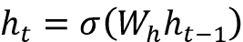
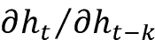
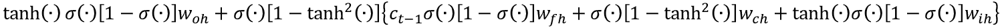

# 第七章：理解长短期记忆网络

本章将讨论一种更高级 RNN 变体背后的基本原理，这种变体被称为**长短期记忆网络**（**LSTMs**）。在这里，我们将专注于理解 LSTM 背后的理论，以便在下一章讨论它们的实现。LSTM 广泛应用于许多顺序任务（包括股市预测、语言建模和机器翻译），并且已被证明在大量数据的支持下，比旧的顺序模型（如标准 RNN）表现更好。LSTM 旨在避免我们在上一章讨论的梯度消失问题。

梯度消失带来的主要实际限制是，它阻止了模型学习长期依赖关系。然而，通过避免梯度消失问题，LSTM 能够存储比普通 RNN 更长时间的记忆（可达数百个时间步）。与只维持单一隐藏状态的 RNN 不同，LSTM 拥有更多的参数，并能更好地控制在每个训练步骤中应该存储哪些记忆、丢弃哪些记忆。例如，RNN 无法决定存储哪些记忆以及丢弃哪些记忆，因为隐藏状态在每个训练步骤都会被强制更新。

具体来说，我们将从一个非常高层次的角度讨论 LSTM 是什么，以及 LSTM 的功能如何使其能够存储长期依赖关系。然后，我们将深入探讨 LSTM 背后的实际数学框架，并通过一个例子来强调每个计算的重要性。我们还将比较 LSTM 和普通 RNN，看到 LSTM 拥有一个更加复杂的架构，使其在顺序任务中超越普通 RNN。

通过回顾梯度消失问题，并通过一个示例来说明这一问题，我们将理解 LSTM 是如何解决该问题的。

此后，我们将讨论为提高标准 LSTM 预测结果而引入的几种技术（例如，在文本生成任务中提高生成文本的质量/多样性）。例如，一次生成多个预测，而不是逐个预测，可以帮助提高生成预测的质量。我们还将介绍**双向 LSTM（BiLSTMs）**，这是标准 LSTM 的扩展，它比标准 LSTM 在捕捉序列中的模式方面具有更强的能力。

最后，我们将讨论两个近期的 LSTM 变种。首先，我们将介绍**窥视孔连接**，它向 LSTM 门引入了更多的参数和信息，从而使 LSTM 能够更好地执行任务。接下来，我们将讨论**门控循环单元**（**GRUs**），由于其结构比标准 LSTM 更简单，并且不会降低性能，GRUs 正变得越来越受欢迎。

具体来说，本章将涵盖以下主要主题：

+   理解长短期记忆网络

+   LSTM 如何解决梯度消失问题

+   改进 LSTM

+   LSTM 的其他变种

Transformer 模型已成为一种更强大的序列学习替代方案。Transformer 模型提供了更好的性能，因为这些模型可以在给定的步骤访问序列的完整历史，而 LSTM 模型只能看到给定步骤的前一个输出。我们将在*第十章*《Transformers》和*第十一章*《使用 Transformer 进行图像描述》中详细讨论 Transformer 模型。然而，学习 LSTM 仍然值得，因为它们为下一代模型（如 Transformer）奠定了基础。此外，LSTM 在某些情况下仍被使用，尤其是在内存受限环境中的时间序列问题中。

# 理解长短期记忆网络

在本节中，我们将首先解释 LSTM 单元是如何工作的。我们将看到，除了隐藏状态外，还存在一个门控机制来控制单元内的信息流动。

然后，我们将通过一个详细的例子来演示，看看门控和状态如何在例子中的不同阶段帮助实现期望的行为，最终得到期望的输出。最后，我们将对比 LSTM 与标准 RNN，了解 LSTM 与标准 RNN 的区别。

## 什么是 LSTM？

LSTM 可以看作是 RNN 家族中更复杂、更强大的成员。尽管 LSTM 是一个复杂的系统，但 LSTM 的基本原理与 RNN 相同；它们通过按顺序处理每次输入的序列项来处理序列。LSTM 主要由五个不同的组件组成：

+   **单元状态**：这是 LSTM 单元的内部单元状态（即记忆）

+   **隐藏状态**：这是暴露给其他层并用于计算预测的外部隐藏状态

+   **输入门**：它决定当前输入有多少被读取到单元状态中

+   **遗忘门**：它决定之前的单元状态有多少被传递到当前单元状态中

+   **输出门**：它决定有多少单元状态被输出到隐藏状态中

我们可以将 RNN 包装成一个单元架构，如下所示：该单元会输出某些状态（带有非线性激活函数），该状态依赖于之前的单元状态和当前输入。然而，在 RNN 中，单元状态会随着每一个输入的到来不断更新。这种行为对于存储长期依赖关系来说是非常不理想的。

LSTM 可以决定何时添加、更新或忘记存储在每个神经元中的信息。换句话说，LSTM 配备了一种机制，可以保持单元状态不变（如果有助于更好的性能），从而使它们能够存储长期依赖关系。

这是通过引入门控机制来实现的。LSTM 为单元需要执行的每个操作配备了门控。门控是连续的（通常是 sigmoid 函数），其值介于 0 和 1 之间，其中 0 表示没有信息流经该门，1 表示所有信息都流经该门。每个 LSTM 单元使用一个这样的门控来控制每个神经元。正如在介绍中所解释的，这些门控控制以下内容：

+   当前输入写入单元状态的多少（输入门）

+   从上一个单元状态中忘记了多少信息（遗忘门）

+   从单元状态输出到最终隐藏状态的信息量（输出门）

*图 7.1* 说明了一个假设场景中的这一功能。每个门决定了各种数据（例如当前输入、上一个隐藏状态或上一个单元状态）流入状态的多少（即最终的隐藏状态或单元状态）。每条线的粗细表示从/到该门的信息流量（在某些假设场景中）。例如，在此图中，你可以看到输入门允许从当前输入流入的信息比从上一个最终隐藏状态流入的信息更多，而遗忘门则允许从上一个最终隐藏状态流入的信息比从当前输入流入的信息更多：

图 7.1：LSTM 中数据流的抽象视图

## 更详细的 LSTM

在这里，我们将介绍 LSTM 的实际机制。我们将首先简要讨论 LSTM 单元的整体视图，然后开始讨论 LSTM 单元中各个计算的细节，并结合一个文本生成的示例。

正如我们之前讨论的，LSTM 具有由以下三种门控组成的门控机制：

+   **输入门**：一个门，它输出的值介于 0（当前输入不会写入单元状态）和 1（当前输入完全写入单元状态）之间。使用 sigmoid 激活函数将输出压缩到 0 和 1 之间。

+   **遗忘门**：一个 sigmoid 门，它输出的值介于 0（上一个单元状态在计算当前单元状态时完全被遗忘）和 1（上一个单元状态在计算当前单元状态时完全被读取）之间。

+   **输出门**：一个 sigmoid 门，它输出的值介于 0（当前单元状态在计算最终状态时完全被丢弃）和 1（当前单元状态在计算最终隐藏状态时完全被使用）之间。

这可以通过 *图 7.2* 展示。这是一个非常高层次的图示，为了避免杂乱，一些细节被省略了。我们展示了带环路和不带环路的 LSTM，以便于理解。右侧的图显示了一个带环路的 LSTM，左侧的图则展示了相同的 LSTM，但环路已经展开，以便模型中没有环路：

图 7.2：带有递归链接（即，循环）的 LSTM（右）和展开的递归链接的 LSTM（左）

现在，为了更好地理解 LSTM，让我们考虑一个语言建模的例子。我们将并排讨论实际的更新规则和方程式，以便更好地理解 LSTM。

让我们考虑一个从以下句子开始生成文本的例子：

*John 给 Mary 一只小狗。*

我们输出的故事应该是关于 *John*、*Mary* 和 *puppy* 的。假设我们的 LSTM 在给定句子后输出两个句子：

*John 给 Mary 一只小狗。____________________. _____________________.*

以下是我们 LSTM 输出的结果：

*John 给 Mary 一只小狗。它非常大声地叫。它们给它取名为 Luna。*

我们离输出像这样的真实短语还远远不够。然而，LSTM 可以学习名词和代词之间的关系。例如，*it* 与 *puppy* 相关，*they* 与 *John* 和 *Mary* 相关。接下来，它应该学习名词/代词和动词之间的关系。例如，对于 *it*，动词的末尾应该加上 `s`。我们在*图 7.3*中展示了这些关系/依赖关系。正如我们所看到的，短期（例如，*It --> barks*）和长期（例如，*Luna --> puppy*）的依赖关系都存在于这个短语中。实线箭头表示名词与代词之间的联系，虚线箭头表示名词/代词与动词之间的联系：

图 7.3：LSTM 给出的句子和预测的句子，其中单词之间的各种关系被高亮显示

现在让我们考虑 LSTM 如何通过其各种操作，建模这些关系和依赖，以便在给定起始句子的情况下输出合理的文本。

输入门 (`iₜ`) 接收当前输入 (`xₜ`) 和上一个最终隐藏状态 (`h`[t-1]) 作为输入，并计算 `iₜ`，计算方式如下：

输入门 `iₜ` 可以理解为在标准的单隐藏层 RNN 的隐藏层中执行的计算，该 RNN 使用的是 sigmoid 激活函数。记住我们是通过以下方式计算标准 RNN 的隐藏状态的：

因此，LSTM 的 `iₜ` 计算与标准 RNN 的 `hₜ` 计算非常相似，唯一的区别在于激活函数的变化和添加了偏置项。

经过计算，`iₜ`的值为 0 意味着当前输入的任何信息都不会流入单元状态，而值为 1 则意味着所有当前输入的信息都会流入单元状态。

接下来，计算另一个值（称为**候选值**），该值将被用于后续计算当前单元状态。这个值将被视为当前时间步长最终单元状态的潜在候选值：

我们可以在*图 7.4*中可视化这些计算：

图 7.4：i[t] 和 （加粗）在所有 LSTM 计算（灰色部分）上下文中的计算

在我们的例子中，在学习的最初阶段，输入门需要高度激活，因为模型对任务没有任何先验知识。LSTM 输出的第一个词是*它*。此外，为了做到这一点，LSTM 必须学会*puppy*也可以称作*它*。假设我们的 LSTM 有五个神经元来存储状态。我们希望 LSTM 存储的信息是*它*指的是*puppy*。我们希望 LSTM 学习的另一个信息（在不同的神经元中）是，当使用代词*它*时，动词的现在时应加上*'s'*。

LSTM 还需要知道的一件事是*puppy barks loud*。*图 7.5*展示了这条知识如何可能被编码到 LSTM 的单元状态中。每个圆圈代表单元状态中的一个神经元（即一个隐藏单元）：

图 7.5：应编码到单元状态中以输出第一个句子的知识

有了这些信息，我们可以输出第一个新的句子：

*约翰给了玛丽一只小狗。它叫得非常大声。*

接下来，忘记门的计算如下：

忘记门的作用如下。忘记门的值为 0 意味着* c *[t-1]中的信息不会传递到计算 `c` [t]，而值为 1 则意味着* c *[t-1]的所有信息都会传递到 `c` [t]的计算中。这可能听起来有些反直觉，因为打开忘记门会让模型记住前一步的内容，反之亦然。但为了尊重原始命名规范和设计，我们将继续使用它们。

现在我们将看到忘记门如何帮助预测下一句话：

*他们把它命名为 Luna。*

如你所见，我们现在关注的新的关系是*约翰*和*玛丽*以及*他们*之间的关系。因此，我们不再需要关于*它*的信息，也不再需要动词*bark*的行为，因为主语是*约翰*和*玛丽*。我们可以结合当前的主语*他们*和相应的动词*命名*来替代存储在**当前主语**和**当前主语动词**神经元中的信息（见*图 7.6*）：

图 7.6：第三个神经元（从左数）的知识（it --> barks）被新信息（they --> named）替代

就权重值而言，我们在*图 7.7*中展示了这种转化。我们不会改变保持*it --> puppy*关系的神经元的状态，因为*puppy*在最后一句话中作为一个对象出现。这是通过将连接*it --> puppy*的权重从`c`[t-1]到`cₜ`设置为 1 来完成的。然后我们将保持当前主语和动词信息的神经元替换为新的主语和动词。这是通过将该神经元的*forget*权重`fₜ`设置为 0 来实现的。接着，我们将连接当前主语和动词到相应状态神经元的`iₜ`权重设置为 1。我们可以将（候选值）看作是单元记忆的潜在候选者，因为它包含了来自当前输入`xₜ`的信息：

图 7.7：如何使用前一个状态 c[t-1]和候选值来计算单元状态 c[t]

当前的单元状态将如下更新：

换句话说，当前状态是以下内容的组合：

+   忘记/记住来自前一个单元状态的信息

+   添加/丢弃当前输入的信息

接下来，在*图 7.8*中，我们突出显示了到目前为止我们所计算的内容，涉及 LSTM 内部进行的所有计算：

图 7.8：到目前为止的计算，包括 i[t]、f[t]、 和 c[t]

学习完整的单元状态后，它将像*图 7.9*那样：

图 7.9：输出两句话后，完整的单元状态将如下所示

接下来，我们将看看 LSTM 单元的最终状态（`hₜ`）是如何计算的：

在我们的示例中，我们希望输出以下句子：

*他们给它取名为 Luna。*

对于这个，我们**不需要**倒数第二个神经元来计算这个句子，因为它包含了关于小狗叫声的信息，而这个句子是关于小狗的名字。因此，在预测最后一句话时，我们可以忽略这个神经元（包含*叫声 -> 大声*关系）。这正是`oₜ`所做的；它忽略了不必要的记忆，并且在计算 LSTM 单元的最终输出时，只从单元状态中提取相关的记忆。同时，在*图 7.10*中，我们展示了完整的 LSTM 单元的概览：

图 7.10：完整的 LSTM 单元结构

在这里，我们总结了与 LSTM 单元内操作相关的所有方程式：

现在从更大的角度来看，对于一个序列学习问题，我们可以将 LSTM 单元在时间上展开，显示它们如何相互连接，以便接收细胞的前一个状态来计算下一个状态，如*图 7.11*所示：

图 7.11：LSTM 如何在时间上连接

然而，这还不足以完成一些有用的任务。我们通常使用机器学习模型来解决形式化为分类或回归问题的任务。正如你所看到的，我们仍然没有输出层来输出预测。但是，如果我们想要使用 LSTM 实际学到的东西，我们需要一种方法来从 LSTM 中提取最终的输出。因此，我们将在 LSTM 上方安装一个`softmax`层（带有权重`W[s]`和偏置`b[s]`）。最终输出是通过以下公式获得的：

现在，带有 softmax 层的 LSTM 的最终图像看起来像*图 7.12*：

图 7.12：带有 softmax 输出层的 LSTM 在时间上连接

在 LSTM 上附加 softmax 头后，它现在可以执行给定的分类任务，并且能够端到端地完成。现在，让我们比较和对比 LSTM 和上一章讨论的标准 RNN 模型。

## LSTM 与标准 RNN 的区别

现在让我们研究 LSTM 与标准 RNN 的比较。与标准 RNN 相比，LSTM 具有更复杂的结构。一个主要的区别是，LSTM 有两个不同的状态：细胞状态`cₜ`和最终隐藏状态`hₜ`。然而，RNN 只有一个隐藏状态`hₜ`。下一个主要区别是，由于 LSTM 有三个不同的门，LSTM 对如何在计算最终隐藏状态`hₜ`时处理当前输入和前一个细胞状态具有更大的控制权。

拥有这两个不同的状态是非常有优势的。通过这种机制，我们可以将模型的短期记忆和长期记忆解耦。换句话说，即使细胞状态在快速变化，最终的隐藏状态仍然会更慢地变化。所以，尽管细胞状态在学习短期和长期依赖关系，但最终的隐藏状态可以仅反映短期依赖、仅反映长期依赖，或者同时反映两者。

接下来，门控机制由三个门组成：输入门、遗忘门和输出门。

很明显，这是一种更加有原则的方法（特别是与标准 RNN 相比），它允许更好地控制当前输入和前一个细胞状态在当前细胞状态中的贡献。此外，输出门可以更好地控制细胞状态对最终隐藏状态的贡献。

在*图 7.13*中，我们比较了标准 RNN 和 LSTM 的示意图，以强调这两种模型在功能上的区别：

图 7.13：标准 RNN 与 LSTM 单元的并排比较

总结来说，通过设计保持两种不同状态，LSTM 可以学习短期和长期的依赖关系，这有助于解决我们将在下一节讨论的梯度消失问题。

# LSTM 如何解决梯度消失问题

正如我们之前讨论的，尽管 RNN 从理论上是合理的，但在实践中它们存在一个严重缺陷。也就是说，当使用**时间反向传播**（**BPTT**）时，梯度会迅速衰减，这使得我们只能传播几个时间步的信息。因此，我们只能存储非常少的时间步信息，从而只有短期记忆。这反过来限制了 RNN 在实际序列任务中的使用。

通常，有用且有趣的序列任务（例如股票市场预测或语言建模）需要能够学习和存储长期依赖关系。考虑以下预测下一个单词的例子：

*约翰是一个有天赋的学生。他是一个 A 等生，且会打橄榄球和板球。其他所有学生都羡慕 ______。*

对我们来说，这是一个非常简单的任务。答案是*约翰*。然而，对于 RNN 来说，这是一个困难的任务。我们正在尝试预测一个位于文本开头的答案。而且，为了解决这个任务，我们需要一种方法在 RNN 的状态中存储长期依赖关系。这正是 LSTM 设计用来解决的任务。

在*第六章*，*递归神经网络*中，我们讨论了在没有任何非线性函数存在的情况下，梯度消失/爆炸是如何出现的。现在我们将看到，即使有非线性项存在，梯度消失问题仍然可能发生。为此，我们将推导出标准 RNN 的项！和 LSTM 网络的项！，以理解它们之间的差异。这是导致梯度消失的关键项，正如我们在上一章所学的那样。

假设标准 RNN 的隐藏状态计算如下：

为了简化计算，我们可以忽略当前输入相关的项，专注于递归部分，这将给出以下方程：

如果我们计算前面方程的，我们将得到以下结果：

现在让我们看看当或（随着学习的进行，这将发生）时会发生什么。在这两种情况下，将开始趋近于 0，从而产生消失梯度。即使在时，对于 sigmoid 激活函数，梯度在最大值（0.25）下，经过多次时间步长的乘积，整体梯度变得非常小。此外，项（可能由于初始化不当）也可能导致梯度爆炸或消失。然而，与由于或导致的梯度消失相比，项所导致的梯度消失/爆炸相对较容易解决（通过仔细初始化权重和梯度裁剪）。

现在让我们来看看 LSTM 单元。更具体地，我们将查看由以下方程给出的单元状态：

这是 LSTM 中所有忘记门应用的乘积。然而，如果你以类似的方式计算 LSTM 中的（也就是说，忽略项和* b *[f]，因为它们是非递归的），我们得到以下结果：

在这种情况下，尽管当时梯度会消失，另一方面，如果，则导数将比标准 RNN 中的下降速度慢得多。因此，我们有一个替代方法，在这种方法下梯度不会消失。此外，随着压缩函数的使用，梯度不会由于过大而爆炸（这通常是导致梯度爆炸的原因）。此外，当时，我们获得一个接近 1 的最大梯度，这意味着梯度不会像我们在 RNN 中看到的那样迅速减小（当梯度处于最大值时）。最后，推导中没有这样的项。然而，对于的推导更加棘手。让我们看看在的推导中是否存在这样的项。如果你计算这个的导数，你将得到以下形式的结果：

一旦你解决了这个问题，你将得到以下形式的结果：

我们不关心或中的内容，因为无论其值如何，它都将被限制在(0,1)或(-1,1)之间。如果我们通过将、、和项替换为公共符号，如，我们得到以下形式：

或者，我们得到以下结果（假设外部被每个项吸收，这些项存在于方括号内）：

这将给出以下结果：

这意味着，尽管术语安全地避免了任何术语，但却不是。因此，我们在初始化 LSTM 的权重时必须小心，并且应该使用梯度裁剪。

**注意**

然而，`hₜ`对于 LSTM 来说并不像 RNN 那样由于梯度消失而不安全，因为`cₜ`仍然可以存储长期依赖性，而不受梯度消失的影响，并且`hₜ`如果需要的话可以从`cₜ`中检索长期依赖性。

# 改进 LSTM

拥有一个基于坚实基础的模型并不总能在实际应用中保证切实的成功。自然语言非常复杂。有时经验丰富的作家也难以创作出高质量的内容。因此，我们不能指望 LSTM 突然间就能神奇地输出有意义、写得很好的内容。拥有一个复杂的设计——使得能够更好地建模数据中的长期依赖性——确实有帮助，但我们仍然需要在推理过程中使用更多的技术来生成更好的文本。因此，已经开发出了许多扩展，以帮助 LSTM 在预测阶段表现得更好。这里我们将讨论几种改进方法：贪心采样、束搜索、使用词向量代替词的独热编码表示、以及使用双向 LSTM。需要注意的是，这些优化技术并非专门针对 LSTM 的；任何序列模型都可以从中受益。

## 贪心采样

如果我们总是尝试预测概率最高的单词，LSTM 往往会产生非常单调的结果。例如，由于停用词（例如*the*）的频繁出现，它可能会在切换到另一个单词之前重复这些停用词很多次。

解决这个问题的一种方法是使用**贪心采样**，即我们选择预测出的最佳`n`并从该集合中进行采样。这有助于打破预测的单调性。

让我们考虑前一个例子中的第一句话：

*约翰给玛丽一只小狗。*

假设我们从第一个单词开始，并希望预测接下来的四个单词：

*约翰 ____ ____ _ _____。*

如果我们尝试以确定性方式选择样本，LSTM 可能会输出如下内容：

*约翰给玛丽给约翰。*

然而，通过从词汇表中的子集（最有可能的词）中采样下一个单词，LSTM 被迫变化预测，可能会输出以下内容：

*约翰给玛丽一只小狗。*

或者，它可能会给出以下输出：

*约翰给小狗了一只小狗。*

然而，尽管贪心采样有助于为生成的文本增加更多的风味/多样性，但这种方法并不能保证输出的内容始终是现实的，尤其是在输出较长的文本序列时。现在，我们将看到一种更好的搜索技术，它实际上会在做出预测之前向前看几个步骤。

## 束搜索

**束搜索**是一种帮助提高 LSTM 生成的预测质量的方法。在这个过程中，预测是通过解决一个搜索问题来找到的。特别地，我们在每一步为多个候选词预测多个步骤。这就产生了一个树状结构，其中包含单词的候选序列（*图 7.14*）。束搜索的关键思想是一次生成`b`个输出（即 ），而不是生成单一的输出`yₜ`。这里，`b` 被称为束的**长度**，生成的`b`个输出被称为**束**。更技术上来说，我们选择具有最高联合概率  的束，而不是选择具有最高概率的 。我们在做出预测之前向未来预测得更远，这通常会导致更好的结果。

让我们通过前面的示例来理解束搜索：

*John gave Mary a puppy.*

比如，我们逐词预测，最初我们有以下内容：

*John ____ ____ _ _____.*

假设我们的 LSTM 通过束搜索生成了示例句子。那么每个单词的概率可能如下所示，如*图 7.14*所示。假设束长`b` = `2`，我们将在搜索的每个阶段考虑`n` = `3`个最佳候选词。

搜索树看起来如下图所示：

图 7.14：束搜索的搜索空间，b=2，n=3

我们从单词*John*开始，并获取词汇表中所有单词的概率。在我们的示例中，由于`n` = `3`，我们为树的下一层选择最佳的三个候选词：*gave*、*Mary* 和 *puppy*。（请注意，这些可能不是实际 LSTM 找到的候选词，仅用于示例。）然后从这些选定的候选词中，树的下一层会继续扩展。接着，我们将从中选出最好的三个候选词，搜索会重复，直到我们达到树的深度`b`。

给出最高联合概率的路径（即 ）用较粗的箭头突出显示。此外，这是一种更好的预测机制，因为它会为像*John gave Mary*这样的短语返回更高的概率或奖励，而不是*John Mary John*或*John John gave*。

请注意，在我们的示例中，通过贪婪采样和束搜索生成的输出是相同的，这是一个包含五个单词的简单句子。然而，当我们将其扩展到输出一小段文章时，情况就不一样了。那时，束搜索生成的结果将比贪婪采样生成的结果更具现实性和意义。

## 使用词向量

提高 LSTM 性能的另一种流行方法是使用词向量，而不是使用独热编码向量作为 LSTM 的输入。我们通过一个例子来理解这种方法的价值。假设我们想要从某个随机词开始生成文本。在我们的案例中，它将是以下内容：

*约翰 ____ ____ _ _____.*

我们已经在以下句子上训练过我们的 LSTM：

*约翰给了玛丽一只小狗。玛丽给鲍勃送了一只小猫。*

假设我们有如*图 7.15*所示的位置的词向量。记住，语义相似的词会有相近的词向量：

图 7.15：假定词向量在二维空间中的拓扑

这些词的词嵌入，在其数字形式下，可能看起来像如下：

*小猫:* [0.5, 0.3, 0.2]

*小狗:* [0.49, 0.31, 0.25]

*给:* [0.1, 0.8, 0.9]

可以看出，*distance(小猫, 小狗) < distance(小猫, 给)*。然而，如果我们使用独热编码，它们将变成如下：

*小猫:* [ 1, 0, 0, …]

*小狗:* [0, 1, 0, …]

*给:* [0, 0, 1, …]

然后，*distance(小猫, 小狗) = distance(小猫, 给)*。正如我们已经看到的，独热编码向量不能捕捉词与词之间的适当关系，它们将所有词视为相等的距离。然而，词向量能够捕捉这些关系，更适合用于机器学习模型中的文本表示。

使用词向量，LSTM 将更好地学习词与词之间的关系。例如，使用词向量时，LSTM 将学到以下内容：

*约翰给了玛丽一只小猫。*

这与以下内容非常接近：

*约翰给了玛丽一只小狗。*

此外，它与以下内容有很大的不同：

*约翰给了玛丽一个给。*

然而，如果使用独热编码向量，情况就不一样了。

## 双向 LSTM（BiLSTM）

使 LSTM 变为双向 LSTM 是提高 LSTM 预测质量的另一种方法。这里的意思是用从开始到结束和从结束到开始的文本来训练 LSTM。到目前为止，在训练 LSTM 时，我们将创建如下的数据集：

考虑以下两个句子：

*约翰给了玛丽一个 _____. 它叫得非常大声。*

在这个阶段，有一个句子中缺失了数据，我们希望 LSTM 能合理地填充这个缺失部分。

如果我们从句子的开头读到缺失单词，它将是如下：

*约翰给了玛丽一个 _____.*

这并没有提供足够的信息来确定缺失单词的上下文。然而，如果我们从两个方向阅读，它将变成以下内容：

*约翰给了玛丽一个 _____.*

*_____. 它叫得非常大声。*

如果我们同时创建了这两部分数据，那么可以预测缺失的单词应该是像*dog*或*puppy*这样的词。因此，某些问题可以从双向读取数据中显著受益。BiLSTM 还帮助解决多语言问题，因为不同语言可能有非常不同的句子结构。

BiLSTM 的另一个应用是神经机器翻译，其中我们将源语言的句子翻译成目标语言。由于不同语言之间没有具体的一对一对齐关系，能够访问源语言中给定词汇的前后信息可以极大地帮助更好地理解上下文，从而生成更好的翻译。例如，考虑将菲律宾语翻译成英语。在菲律宾语中，句子的顺序通常是*动词-宾语-主语*，而在英语中，则是*主语-动词-宾语*。在这个翻译任务中，前后双向阅读句子将极大地帮助生成良好的翻译。

BiLSTM 本质上是两个独立的 LSTM 网络。一个网络从头到尾学习数据，另一个网络从尾到头学习数据。在*图 7.16*中，我们展示了 BiLSTM 网络的架构。

训练分为两个阶段。首先，实线网络使用从头到尾读取文本生成的数据进行训练。这个网络代表了标准 LSTM 的常规训练过程。其次，虚线网络使用从后向前读取文本生成的数据进行训练。然后，在推理阶段，我们通过连接实线和虚线的状态信息（并生成一个向量）来预测缺失的单词：

图 7.16：双向 LSTM 的示意图

在这一部分，我们讨论了几种不同的方法来提高 LSTM 模型的性能。这包括采用更好的预测策略，引入结构性变化，如词向量和双向 LSTM（BiLSTM）。

# LSTM 的其他变体

尽管我们将主要关注标准 LSTM 架构，但许多变体已经出现，它们要么简化了标准 LSTM 中的复杂架构，要么提高了性能，或者两者兼有。我们将探讨两种引入结构性修改的 LSTM 变体：窥视连接（peephole connections）和 GRU。

## 窥视连接

**窥视连接**允许门不仅查看当前输入和先前的最终隐藏状态，还可以查看先前的细胞状态。这增加了 LSTM 单元中的权重数量。已经证明，拥有这种连接可以产生更好的结果。方程式将如下所示：

让我们简要看看这如何帮助 LSTM 表现得更好。到目前为止，门控机制只能看到当前输入和最终隐藏状态，但看不到单元状态。然而，在这种配置下，如果输出门接近零，即使单元状态包含对更好性能至关重要的信息，最终的隐藏状态也会接近零。因此，门控机制在计算时不会考虑隐藏状态。直接将单元状态包括在门控计算方程中，可以对单元状态进行更多控制，即使在输出门接近零的情况下，它也能表现良好。

我们在*图 7.17*中展示了具有窥视连接的 LSTM 架构。我们已将标准 LSTM 中所有现有的连接设为灰色，新增的连接则用黑色表示：

图 7.17：具有窥视连接的 LSTM（窥视连接用黑色表示，其他连接用灰色表示）

## 门控递归单元

**GRU**可以看作是标准 LSTM 架构的简化版。正如我们之前所见，LSTM 有三个不同的门和两个不同的状态。仅这一点就需要大量的参数，即使对于一个较小的状态尺寸来说也是如此。因此，科学家们研究了减少参数数量的方法。GRU 是其中一个成果。

GRU 与 LSTM 相比，有几个主要的区别。

首先，GRU 将两个状态，即单元状态和最终隐藏状态，合并成一个单一的隐藏状态`hₜ`。现在，由于这个简单的修改没有两个不同的状态，我们可以去除输出门。记住，输出门仅仅是决定有多少单元状态被读取到最终隐藏状态中。这个操作大大减少了单元中的参数数量。

接下来，GRU 引入了一个重置门，当它接近 1 时，在计算当前状态时会完全采纳前一个状态的信息。而当重置门接近 0 时，它会忽略前一个状态，只关注当前状态的计算：

然后，GRU 将输入门和遗忘门合并成一个*更新门*。标准的 LSTM 有两个门，分别是输入门和遗忘门。输入门决定当前输入有多少被读入到单元状态中，而遗忘门决定前一个单元状态有多少被读入到当前单元状态中。数学上，这可以表示如下：

GRU 将这两种操作合并成一个单一的门控操作，称为更新门。如果更新门为 0，则将前一单元状态的全部状态信息传递到当前单元状态，此时不会将当前输入读入状态。如果更新门为 1，则所有当前输入都会读入当前单元状态，且前一单元状态不会传递到当前单元状态。换句话说，输入门`iₜ`变成了遗忘门的反向，即！：

现在让我们将所有的公式整理到一起。GRU 的计算过程如下所示：

这比 LSTM 更加简洁。在*图 7.18*中，我们可以将 GRU 单元（左）和 LSTM 单元（右）并排展示：

图 7.18：GRU（左）和标准 LSTM（右）的并排比较

在本节中，我们学习了 LSTM 的两种变体：带窥视孔的 LSTM 和 GRU。由于其简洁性以及与更复杂的 LSTM 相当的性能，GRU 已经成为比 LSTM 更受欢迎的选择。

# 总结

在本章中，你学习了 LSTM 网络。首先，我们讨论了 LSTM 是什么及其高层次的架构。我们还深入探讨了 LSTM 中的详细计算，并通过一个例子讨论了这些计算。

我们看到，LSTM 主要由五个不同的部分组成：

+   **单元状态**：LSTM 单元的内部单元状态

+   **隐藏状态**：用于计算预测的外部隐藏状态

+   **输入门**：决定多少当前输入被读取到单元状态中

+   **遗忘门**：决定多少前一单元状态被发送到当前单元状态

+   **输出门**：决定多少单元状态被输出到隐藏状态中

拥有如此复杂的结构，使得 LSTM 能够很好地捕捉短期和长期依赖。

我们将 LSTM 与普通 RNN 进行了比较，发现 LSTM 实际上能够学习长期依赖，这是其结构的固有部分，而 RNN 则可能无法学习长期依赖。之后，我们讨论了 LSTM 如何通过其复杂的结构解决消失梯度问题。

然后我们讨论了几种改进 LSTM 性能的扩展。首先是一个非常简单的技术，叫做贪婪采样，在这种方法中，我们并非总是输出最佳候选，而是从一组最佳候选中随机采样一个预测。我们看到这提高了生成文本的多样性。之后，我们看了一个更复杂的搜索技术，叫做束搜索。使用束搜索时，我们不是仅预测单个时间步的未来，而是预测多个时间步的未来，并选择产生最佳联合概率的候选。另一个改进是观察词向量如何帮助提升 LSTM 的预测质量。通过使用词向量，LSTM 能更有效地学习在预测时替换语义相似的词（例如，LSTM 可能会输出 *cat* 代替 *dog*），从而使生成的文本更加真实和准确。最后，我们考虑的扩展是双向 LSTM（BiLSTM）。BiLSTM 的一个流行应用是填补短语中的缺失词。BiLSTM 会从两个方向读取文本：从前往后和从后往前。这提供了更多的上下文信息，因为我们在做出预测前，既看到了过去的内容，也看到了未来的内容。

最后，我们讨论了普通 LSTM 的两种变体：窥视孔连接和 GRU。普通 LSTM 在计算门时，只查看当前输入和隐藏状态。而使用窥视孔连接时，门的计算依赖于所有内容：当前输入、隐藏状态和细胞状态。

GRU 是一种比普通 LSTM 更加优雅的变体，它简化了 LSTM，同时没有牺牲性能。GRU 只有两个门和一个状态，而普通的 LSTM 有三个门和两个状态。

在下一章，我们将看到这些不同的架构在实际应用中的表现，展示每种架构的实现，并观察它们在文本生成任务中的表现如何。

要访问本书的代码文件，请访问我们的 GitHub 页面：[`packt.link/nlpgithub`](https://packt.link/nlpgithub)

加入我们的 Discord 社区，与志同道合的人一起学习，和超过 1000 名成员一起进步，访问链接：[`packt.link/nlp`](https://packt.link/nlp)

