# 第八章：LSTM 的应用——生成文本

现在，我们已经对 LSTM 的基本机制有了充分的理解，例如它们如何解决梯度消失问题和更新规则，我们可以看看如何在 NLP 任务中使用它们。LSTM 被用于文本生成和图像标题生成等任务。例如，语言建模是任何 NLP 任务的核心，因为有效的语言建模能力直接导致了有效的语言理解。因此，语言建模通常用于预训练下游决策支持 NLP 模型。单独使用时，语言建模可以用于生成歌曲（[`towardsdatascience.com/generating-drake-rap-lyrics-using-language-models-and-lstms-8725d71b1b12`](https://towardsdatascience.com/generating-drake-rap-lyrics-using-language-models-and-lstms-8725d71b1b12)），电影剧本（[`builtin.com/media-gaming/ai-movie-script`](https://builtin.com/media-gaming/ai-movie-script)）等。

本章将介绍的应用是构建一个能够编写新民间故事的 LSTM。为此任务，我们将下载格林兄弟的一些民间故事的翻译版本。我们将使用这些故事来训练一个 LSTM，并让它输出一个全新的故事。我们将通过将文本拆分为字符级的二元组（n-gram，其中*n=2*）来处理文本，并用唯一的二元组构建词汇表。请注意，将二元组表示为独热编码向量对机器学习模型来说非常低效，因为它迫使模型将每个二元组视为完全不同于其他二元组的独立文本单元。而二元组之间是共享语义的，某些二元组会共同出现，而有些则不会。独热编码将忽略这一重要属性，这是不理想的。为了在建模中利用这一特性，我们将使用嵌入层，并与模型一起联合训练。

我们还将探索如何实现先前描述的技术，如贪婪采样或束搜索，以提高预测质量。之后，我们将看看如何实现除了标准 LSTM 之外的时间序列模型，如 GRU。

具体来说，本章将涵盖以下主要内容：

+   我们的数据

+   实现语言模型

+   将 LSTM 与带有窥视孔连接的 LSTM 以及 GRU 进行比较

+   改进序列模型——束搜索

+   改进 LSTM——用单词而不是 n-gram 生成文本

# 我们的数据

首先，我们将讨论用于文本生成的数据以及为了清理数据而进行的各种预处理步骤。

## 关于数据集

首先，我们将了解数据集的样子，以便在看到生成的文本时，能够评估它是否合乎逻辑，基于训练数据。我们将从网站[`www.cs.cmu.edu/~spok/grimmtmp/`](https://www.cs.cmu.edu/~spok/grimmtmp/)下载前 100 本书。这些是格林兄弟的一组书籍的翻译（从德语到英语）。

一开始，我们将通过自动化脚本从网站上下载所有 209 本书，具体如下：

```py
url = 'https://www.cs.cmu.edu/~spok/grimmtmp/'
dir_name = 'data'
def download_data(url, filename, download_dir):
    """Download a file if not present, and make sure it's the right 
    size."""

    # Create directories if doesn't exist
    os.makedirs(download_dir, exist_ok=True)

    # If file doesn't exist download
    if not os.path.exists(os.path.join(download_dir,filename)):
        filepath, _ = urlretrieve(url + filename, 
        os.path.join(download_dir,filename))
    else:
        filepath = os.path.join(download_dir, filename)

    return filepath
# Number of files and their names to download
num_files = 209
filenames = [format(i, '03d')+'.txt' for i in range(1,num_files+1)]
# Download each file
for fn in filenames:
    download_data(url, fn, dir_name)
# Check if all files are downloaded
for i in range(len(filenames)):
    file_exists = os.path.isfile(os.path.join(dir_name,filenames[i]))
    assert file_exists
print('{} files found.'.format(len(filenames))) 
```

现在我们将展示从两个随机挑选的故事中提取的示例文本。以下是第一个片段：

> 然后她说，我亲爱的本杰明，你父亲为你和你的十一位兄弟做了这些棺材，因为如果我生了一个小女孩，你们都将被杀死并埋葬在其中。当她说这些话时，她哭了起来，而儿子安慰她说，别哭，亲爱的母亲，我们会自救的，去外面吧。但她说，带着你的十一位兄弟走进森林，让其中一个始终坐在能找到的最高的树上，守望着，朝着城堡中的塔楼看。如果我生了一个小儿子，我会举白旗，然后你们可以回来。但如果我生了一个女孩，我会升起红旗，那个时候你们要尽快逃走，愿上帝保佑你们。

第二段文字如下：

> 红帽子并不知道自己是多么邪恶的生物，根本不怕他。
> 
> “早上好，小红帽。”他说。
> 
> “非常感谢，狼。”
> 
> “这么早去哪儿，小红帽？”
> 
> “去我奶奶家。”
> 
> “你围裙里装的是什么？”
> 
> “蛋糕和酒。昨天是烘焙日，所以可怜的生病奶奶得吃点好的，增强她的体力。”
> 
> “你奶奶住在哪里，小红帽？”
> 
> “在森林里再走四分之一里程，过了三棵大橡树，她的房子就在这三棵树下，栗树就在它们下面。你一定知道的。”小红帽回答道。
> 
> 狼心想，这个小家伙多么温柔。真是一个美味的嫩肉，吃她比吃老太婆要好。

我们现在已经了解了数据的样子。通过这些理解，我们接下来将继续处理我们的数据。

## 生成训练集、验证集和测试集

我们将把下载的故事分成三个集合：训练集、验证集和测试集。我们将使用每个集合中文件的内容作为训练、验证和测试数据。我们将使用 scikit-learn 的`train_test_split()`函数来完成这项工作。

```py
from sklearn.model_selection import train_test_split
# Fix the random seed so we get the same output everytime
random_state = 54321
filenames = [os.path.join(dir_name, f) for f in os.listdir(dir_name)]
# First separate train and valid+test data
train_filenames, test_and_valid_filenames = train_test_split(filenames, test_size=0.2, random_state=random_state)
# Separate valid+test data to validation and test data
valid_filenames, test_filenames = train_test_split(test_and_valid_filenames, test_size=0.5, random_state=random_state) 
# Print out the sizes and some sample filenames
for subset_id, subset in zip(('train', 'valid', 'test'), (train_filenames, valid_filenames, test_filenames)):
    print("Got {} files in the {} dataset (e.g. 
    {})".format(len(subset), subset_id, subset[:3])) 
```

`train_test_split()`函数接受一个`iterable`（例如列表、元组、数组等）作为输入，并根据定义的拆分比例将其拆分为两个集合。在此案例中，输入是一个文件名列表，我们首先按 80%-20%的比例拆分为训练数据和[验证 + 测试]数据。然后，我们进一步将`test_and_valid_filenames`按 50%-50%拆分，生成测试集和验证集。请注意，我们还将一个随机种子传递给`train_test_split`函数，以确保在多次运行中获得相同的拆分。

这段代码将输出以下文本：

```py
Got 167 files in the train dataset (e.g. ['data\\117.txt', 'data\\133.txt', 'data\\069.txt'])
Got 21 files in the valid dataset (e.g. ['data\\023.txt', 'data\\078.txt', 'data\\176.txt'])
Got 21 files in the test dataset (e.g. ['data\\129.txt', 'data\\207.txt', 'data\\170.txt']) 
```

我们可以看到，从 209 个文件中，大约 80%的文件被分配为训练数据，10%为验证数据，剩下的 10%为测试数据。

## 分析词汇量

我们将使用二元组（即*n=2*的 n-gram）来训练我们的语言模型。也就是说，我们将把故事拆分为两个字符的单元。此外，我们将把所有字符转换为小写，以减少输入的维度。使用字符级的二元组有助于我们使用较小的词汇表进行语言建模，从而加速模型训练。例如：

*国王正在森林中打猎。*

将被分解为如下的二元组序列：

*[‘th’, ‘e ‘, ‘ki’, ‘ng’, ‘ w’, ‘as’, …]*

让我们找出词汇表的大小。为此，我们首先定义一个`set`对象。接下来，我们遍历每个训练文件，读取内容，并将其作为字符串存储在变量 document 中。

最后，我们用包含每个故事的字符串中的所有二元组更新`set`对象。通过每次遍历字符串两个字符来获取二元组：

```py
bigram_set = set()
# Go through each file in the training set
for fname in train_filenames:
    document = [] # This will hold all the text
    with open(fname, 'r') as f:
        for row in f:
            # Convert text to lower case to reduce input dimensionality
            document.append(row.lower())
        # From the list of text we have, generate one long string 
        # (containing all training stories)
        document = " ".join(document)
        # Update the set with all bigrams found
        bigram_set.update([document[i:i+2] for i in range(0, 
        len(document), 2)])
# Assign to a variable and print 
n_vocab = len(bigram_set)
print("Found {} unique bigrams".format(n_vocab)) 
```

这将打印：

```py
Found 705 unique bigrams 
```

我们的词汇表包含 705 个二元组。如果我们决定将每个单词视为一个单元，而不是字符级的二元组，词汇量会更大。

## 定义 tf.data 管道

我们现在将定义一个完善的数据管道，能够从磁盘读取文件，并将内容转换为可用于训练模型的格式或结构。TensorFlow 中的`tf.data` API 允许你定义数据管道，可以以特定的方式处理数据，以适应机器学习模型。为此，我们将定义一个名为`generate_tf_dataset()`的函数，它接受以下内容：

+   `filenames` – 包含用于模型的文本的文件名列表

+   `ngram_width` – 要提取的 n-gram 的宽度

+   `window_size` – 用于生成模型单一数据点的 n-gram 序列的长度

+   `batch_size` – 批量大小

+   `shuffle` – （默认为`False`）是否打乱数据

例如，假设`ngram_width`为 2，`batch_size`为 1，`window_size`为 5。此函数将接受字符串“*国王正在森林中打猎*”并输出：

```py
Batch 1: ["th", "e ", "ki", " ng", " w"] -> ["e ", "ki", "ng", " w", "as"]
Batch 2: ["as", " h", "un", "ti", "ng"] -> [" h", "un", "ti", "ng", " i"]
… 
```

每个批次中的左侧列表表示输入序列，右侧列表表示目标序列。注意右侧列表只是将左侧列表向右移了一位。还要注意，两条记录中的输入没有重叠。但在实际的函数中，我们将在记录之间保持小的重叠。*图 8.1*展示了高级过程：

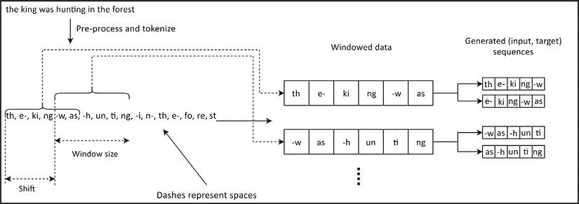

图 8.1：我们将使用 tf.data API 实现的数据转换的高级步骤

让我们讨论如何使用 TensorFlow 的`tf.data` API 实现管道的具体细节。我们将定义生成数据管道的代码作为可重用的函数：

```py
def generate_tf_dataset(filenames, ngram_width, window_size, batch_size, shuffle=False):
    """ Generate batched data from a list of files speficied """
    # Read the data found in the documents
    documents = []
    for f in filenames:
        doc = tf.io.read_file(f)
        doc = tf.strings.ngrams(    # Generate ngrams from the string
            tf.strings.bytes_split(
            # Create a list of chars from a string
                tf.strings.regex_replace(
                # Replace new lines with space
                    tf.strings.lower(    # Convert string to lower case
                        doc
                    ), "\n", " "
                )
            ),
            ngram_width, separator=''
        )
        documents.append(doc.numpy().tolist())

    # documents is a list of list of strings, where each string is a story
    # From that we generate a ragged tensor
    documents = tf.ragged.constant(documents)
    # Create a dataset where each row in the ragged tensor would be a 
    # sample
    doc_dataset = tf.data.Dataset.from_tensor_slices(documents)
    # We need to perform a quick transformation - tf.strings.ngrams 
    # would generate all the ngrams (e.g. abcd -> ab, bc, cd) with
    # overlap, however for our data we do not need the overlap, so we need
    # to skip the overlapping ngrams
    # The following line does that
    doc_dataset = doc_dataset.map(lambda x: x[::ngram_width])
    # Here we are using a window function to generate windows from text
    # For a text sequence with window_size 3 and shift 1 you get
    # e.g. ab, cd, ef, gh, ij, ... -> [ab, cd, ef], [cd, ef, gh], [ef, 
    # gh, ij], ...
    # each of these windows is a single training sequence for our model
    doc_dataset = doc_dataset.flat_map(
        lambda x: tf.data.Dataset.from_tensor_slices(
            x
        ).window(
            size=window_size+1, shift=int(window_size * 0.75)
        ).flat_map(
            lambda window: window.batch(window_size+1, 
            drop_remainder=True)
        )
    )

    # From each windowed sequence we generate input and target tuple
    # e.g. [ab, cd, ef] -> ([ab, cd], [cd, ef])
    doc_dataset = doc_dataset.map(lambda x: (x[:-1], x[1:]))
    # Batch the data
    doc_dataset = doc_dataset.batch(batch_size=batch_size)
    # Shuffle the data if required
    doc_dataset = doc_dataset.shuffle(buffer_size=batch_size*10) if 
    shuffle else doc_dataset

    # Return the data
    return doc_dataset 
```

现在让我们更详细地讨论上述代码。首先，我们遍历`filenames`变量中的每个文件，并使用以下方法读取每个文件的内容：

```py
doc = tf.io.read_file(f) 
```

在读取内容后，我们使用`tf.strings.ngrams()`函数从中生成 n-gram。然而，该函数需要的是字符列表，而不是字符串。

因此，我们使用`tf.strings.bytes_split()`函数将字符串转换为字符列表。此外，我们还会执行一些预处理步骤，例如：

+   使用`tf.strings.lower()`将文本转换为小写

+   将换行符（`\n`）替换为空格，以获得一个连续的词流

每个故事都存储在一个列表对象`(documents)`中。需要注意的是，`tf.strings.ngrams()`会为给定的 n-gram 长度生成所有可能的 n-grams。换句话说，连续的 n-grams 会有重叠。例如，序列“*国王在打猎*”如果 n-gram 长度为 2，将生成`["Th", "he", "e ", " k", …]`。因此，我们稍后需要额外的处理步骤来去除序列中的重叠 n-grams。在所有 n-grams 读取和处理完成后，我们从文档中创建一个`RaggedTensor`对象：

```py
documents = tf.ragged.constant(documents) 
```

`RaggedTensor`是一个特殊类型的张量，它可以有接受任意大小输入的维度。例如，几乎不可能所有的故事在每个地方都有相同数量的 n-gram，因为它们彼此之间差异很大。在这种情况下，我们将有任意长的 n-gram 序列来表示我们的故事。因此，我们可以使用`RaggedTensor`来存储这些任意大小的序列。

`tf.RaggedTensor`对象是一种特殊类型的张量，可以具有可变大小的维度。你可以在[`www.tensorflow.org/api_docs/python/tf/RaggedTensor`](https://www.tensorflow.org/api_docs/python/tf/RaggedTensor)上阅读有关 ragged tensor 的更多信息。有许多方法可以定义一个 ragged tensor。

我们可以通过将包含值的嵌套列表传递给`tf.ragged.constant()`函数来定义一个 ragged tensor：

```py
a = tf.ragged.constant([[1, 2, 3], [1,2], [1]]) 
```

我们还可以定义一个平坦的值序列，并定义在哪里拆分行：

```py
b = tf.RaggedTensor.from_row_splits([1,2,3,4,5,6,7],
row_splits=[0, 3, 3, 6, 7]) 
```

在这里，`row_splits`参数中的每个值定义了结果张量中后续行的结束位置。例如，第一行将包含从索引 0 到 3 的元素（即 0、1、2）。这将输出：

```py
<tf.RaggedTensor [[1, 2, 3], [], [4, 5, 6], [7]]> 
```

你可以使用`b.shape`获取张量的形状，它将返回：

```py
[4, None] 
```

接下来，我们使用`tf.data.Dataset.from_tensor_slices()`函数从张量创建一个`tf.data.Dataset`。

这个函数简单地生成一个数据集，其中数据集中的单个项将是提供的张量的一行。例如，如果你提供一个形状为`[10, 8, 6]`的标准张量，它将生成 10 个形状为`[8, 6]`的样本：

```py
doc_dataset = tf.data.Dataset.from_tensor_slices(documents) 
```

在这里，我们仅通过每次取序列中的每个`n`^(th)个 n-gram 来去除重叠的 n-grams：

```py
doc_dataset = doc_dataset.map(lambda x: x[::ngram_width]) 
```

然后，我们将使用`tf.data.Dataset.window()`函数从每个故事中创建较短的固定长度窗口序列：

```py
doc_dataset = doc_dataset.flat_map(
    lambda x: tf.data.Dataset.from_tensor_slices(
        x
    ).window(
        size=window_size+1, shift=int(window_size * 0.75)
    ).flat_map(
        lambda window: window.batch(window_size+1, 
        drop_remainder=True)
    )
) 
```

从每个窗口中，我们生成输入和目标对，如下所示。我们将所有 n-gram（除了最后一个）作为输入，将所有 n-gram（除了第一个）作为目标。这样，在每个时间步，模型将根据所有先前的 n-gram 预测下一个 n-gram。shift 决定了在每次迭代时窗口的移动量。记录之间的一些重叠可以确保模型不会将故事视为独立的窗口，这可能导致性能差。我们将保持两个连续序列之间大约 25%的重叠：

```py
doc_dataset = doc_dataset.map(lambda x: (x[:-1], x[1:])) 
```

我们使用`tf.data.Dataset.shuffle()`对数据进行洗牌，并按预定义的批量大小对数据进行分批。请注意，我们需要为`shuffle()`函数指定`buffer_size`。`buffer_size`决定了洗牌前获取多少数据。你缓存的数据越多，洗牌效果会越好，但内存消耗也会越高：

```py
doc_dataset = doc_dataset.shuffle(buffer_size=batch_size*10) if shuffle else doc_dataset
doc_dataset = doc_dataset.batch(batch_size=batch_size) 
```

最后，我们指定必要的超参数，并生成三个数据集：训练集、验证集和测试集：

```py
ngram_length = 2
batch_size = 256
window_size = 128
train_ds = generate_tf_dataset(train_filenames, ngram_length, window_size, batch_size, shuffle=True)
valid_ds = generate_tf_dataset(valid_filenames, ngram_length, window_size, batch_size)
test_ds = generate_tf_dataset(test_filenames, ngram_length, window_size, batch_size) 
```

让我们生成一些数据，并查看这个函数生成的数据：

```py
ds = generate_tf_dataset(train_filenames, 2, window_size=10, batch_size=1).take(5)
for record in ds:
        print(record[0].numpy(), '->', record[1].numpy()) 
```

这将返回：

```py
[[b'th' b'er' b'e ' b'wa' b's ' b'on' b'ce' b' u' b'po' b'n ']] -> [[b'er' b'e ' b'wa' b's ' b'on' b'ce' b' u' b'po' b'n ' b'a ']]
[[b' u' b'po' b'n ' b'a ' b'ti' b'me' b' a' b' s' b'he' b'ph']] -> [[b'po' b'n ' b'a ' b'ti' b'me' b' a' b' s' b'he' b'ph' b'er']]
[[b' s' b'he' b'ph' b'er' b'd ' b'bo' b'y ' b'wh' b'os' b'e ']] -> [[b'he' b'ph' b'er' b'd ' b'bo' b'y ' b'wh' b'os' b'e ' b'fa']]
… 
```

在这里，你可以看到目标序列只是将输入序列向右移动一个位置。字符前面的`b`表示这些字符作为字节存储。接下来，我们将查看如何实现模型。

# 实现语言模型

在这里，我们将讨论 LSTM 实现的细节。

首先，我们将讨论 LSTM 使用的超参数及其效果。

之后，我们将讨论实现 LSTM 所需的参数（权重和偏置）。然后，我们将讨论这些参数如何用于编写 LSTM 内部发生的操作。接下来，我们将理解如何按顺序将数据传递给 LSTM。接着，我们将讨论如何训练模型。最后，我们将研究如何使用训练好的模型输出预测结果，这些预测结果本质上是 bigrams，最终将构成一个有意义的故事。

## 定义 TextVectorization 层

我们讨论了`TextVectorization`层，并在*第六章，递归神经网络*中使用了它。我们将使用相同的文本向量化机制对文本进行分词。总结来说，`TextVectorization`层为你提供了一种方便的方式，将文本分词（即将字符串转换为整数 ID 表示的标记列表）集成到模型中作为一个层。

在这里，我们将定义一个`TextVectorization`层，将 n-gram 序列转换为整数 ID 序列：

```py
import tensorflow.keras.layers as layers
import tensorflow.keras.models as models
# The vectorization layer that will convert string bigrams to IDs
text_vectorizer = tf.keras.layers.TextVectorization(
    max_tokens=n_vocab, standardize=None,
    split=None, input_shape=(window_size,)
) 
```

请注意，我们正在定义几个重要的参数，例如 `max_tokens`（词汇表的大小）、`standardize` 参数（不进行任何文本预处理）、`split` 参数（不进行任何分割），最后是 `input_shape` 参数，用于告知该层输入将是一个由 n-gram 序列组成的批次。通过这些参数，我们需要训练文本向量化层，以识别可用的 n-gram 并将其映射到唯一的 ID。我们可以直接将训练好的 `tf.data` 数据管道传递给该层，让它学习这些 n-gram。

```py
text_vectorizer.adapt(train_ds) 
```

接下来，让我们打印词汇表中的单词，看看这一层学到了什么：

```py
text_vectorizer.get_vocabulary()[:10] 
```

它将输出：

```py
['', '[UNK]', 'e ', 'he', ' t', 'th', 'd ', ' a', ', ', ' h'] 
```

一旦 `TextVectorization` 层训练完成，我们必须稍微修改我们的训练、验证和测试数据管道。请记住，我们的数据管道将 n-gram 字符串序列作为输入和目标输出。我们需要将目标序列转换为 n-gram ID 序列，以便计算损失。为此，我们只需通过 `text_vectorizer` 层使用 `tf.data.Dataset.map()` 功能将数据集中的目标传递给该层：

```py
train_ds = train_ds.map(lambda x, y: (x, text_vectorizer(y)))
valid_ds = valid_ds.map(lambda x, y: (x, text_vectorizer(y))) 
```

接下来，我们将查看我们将使用的基于 LSTM 的模型。我们将逐一介绍模型的各个组件，如嵌入层、LSTM 层和最终的预测层。

## 定义 LSTM 模型。

我们将定义一个简单的基于 LSTM 的模型。我们的模型将包含：

+   之前训练过的 `TextVectorization` 层。

+   一个随机初始化并与模型一起训练的嵌入层。

+   两个 LSTM 层，分别具有 512 和 256 个节点。

+   一个具有 1024 个节点并使用 ReLU 激活函数的全连接隐藏层。

+   最终的预测层具有 `n_vocab` 个节点，并使用 `softmax` 激活函数。

由于模型的结构非常简单，层是顺序定义的，因此我们将使用 Sequential API 来定义该模型。

```py
import tensorflow.keras.backend as K
K.clear_session()
lm_model = models.Sequential([
    text_vectorizer,
    layers.Embedding(n_vocab+2, 96),
    layers.LSTM(512, return_state=False, return_sequences=True),
    layers.LSTM(256, return_state=False, return_sequences=True),
    layers.Dense(1024, activation='relu'),
    layers.Dropout(0.5),
    layers.Dense(n_vocab, activation='softmax')
]) 
```

我们从调用 `K.clear_session()` 开始，这是一个清除当前 TensorFlow 会话的函数（例如，清除已定义的层、变量及其状态）。否则，如果你在笔记本中多次运行，它将创建不必要的层和变量。此外，让我们更详细地查看 LSTM 层的参数：

+   `return_state` – 将此设置为 `False` 表示该层仅输出最终输出，而如果设置为 `True`，则它将返回状态向量以及该层的最终输出。例如，对于一个 LSTM 层，设置 `return_state=True` 会得到三个输出：最终输出、单元状态和隐藏状态。请注意，在这种情况下，最终输出和隐藏状态将是相同的。

+   `return_sequences` – 将此设置为 `True` 将使得该层输出完整的输出序列，而不仅仅是最后一个输出。例如，将其设置为 `False` 将得到一个大小为 [*b, n*] 的输出，其中 `b` 是批次大小，`n` 是该层中的节点数。如果设置为 `True`，它将输出一个大小为 [*b, t, n*] 的输出，其中 `t` 是时间步数。

你可以通过执行以下命令查看该模型的摘要：

```py
lm_model.summary() 
```

它返回的结果为：

```py
Model: "sequential"
_________________________________________________________________
 Layer (type)                Output Shape              Param #   
=================================================================
 text_vectorization (TextVec  multiple                 0         
 torization)                                                     

 embedding (Embedding)       (None, 128, 96)           67872     

 lstm (LSTM)                 (None, 128, 512)          1247232   

 lstm_1 (LSTM)               (None, 128, 256)          787456    

 dense (Dense)               (None, 128, 1024)         263168    

 dropout (Dropout)           (None, 128, 1024)         0         

 dense_1 (Dense)             (None, 128, 705)          722625    

=================================================================
Total params: 3,088,353
Trainable params: 3,088,353
Non-trainable params: 0
_________________________________________________________________ 
```

接下来，让我们看看可以用来跟踪模型性能的指标，并最终使用适当的损失函数、优化器和指标来编译模型。

## 定义指标并编译模型

对于我们的语言模型，我们需要定义一个性能指标，用以展示模型的优劣。我们通常看到准确度作为一种通用的评估指标，广泛应用于不同的机器学习任务。然而，准确度可能不适合这个任务，主要是因为它依赖于模型在给定时间步选择与数据集中完全相同的单词/二元组。而语言是复杂的，给定一段文本，生成下一个单词/二元组可能有多种不同的选择。因此，自然语言处理从业者依赖于一个叫做**困惑度**的指标，它衡量的是模型在看到 1:`t`二元组后，对下一个`t`+1 二元组的“困惑”或“惊讶”程度。

困惑度计算很简单。它只是熵的平方。熵是衡量事件的不确定性或随机性的指标。事件结果越不确定，熵值越高（想了解更多关于熵的信息，请访问[`machinelearningmastery.com/what-is-information-entropy/`](https://machinelearningmastery.com/what-is-information-entropy/)）。熵的计算公式为：

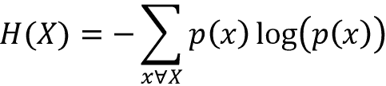

在机器学习中，为了优化机器学习模型，我们会衡量给定样本的预测概率分布与目标概率分布之间的差异。为此，我们使用交叉熵，它是熵在两个分布之间的扩展：

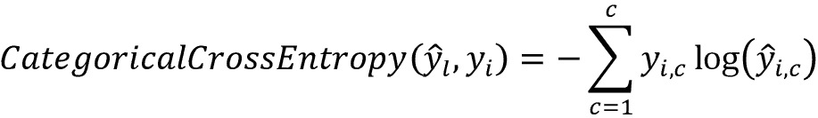

最后，我们定义困惑度为：

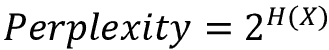

想了解更多关于交叉熵和困惑度之间关系的信息，请访问[`thegradient.pub/understanding-evaluation-metrics-for-language-models/`](https://thegradient.pub/understanding-evaluation-metrics-for-language-models/)。

在 TensorFlow 中，我们定义了一个自定义的`tf.keras.metrics.Metric`对象来计算困惑度。我们将使用`tf.keras.metrics.Mean`作为我们的父类，因为它已经知道如何计算和跟踪给定指标的均值：

```py
class PerplexityMetric(tf.keras.metrics.Mean):
    def __init__(self, name='perplexity', **kwargs):
        super().__init__(name=name, **kwargs)
        self.cross_entropy = 
        tf.keras.losses.SparseCategoricalCrossentropy(
        from_logits=False, reduction='none')
    def _calculate_perplexity(self, real, pred):

        # The next 4 lines zero-out the padding from loss 
        # calculations, this follows the logic from: 
        # https://www.tensorflow.org/beta/tutorials/text/transformer#loss_
        # and_metrics 
        loss_ = self.cross_entropy(real, pred)
        # Calculating the perplexity steps: 
        step1 = K.mean(loss_, axis=-1)
        perplexity = K.exp(step1)
        return perplexity 
    def update_state(self, y_true, y_pred, sample_weight=None):
        perplexity = self._calculate_perplexity(y_true, y_pred)
        super().update_state(perplexity) 
```

在这里，我们只是为给定批次的预测和目标计算交叉熵损失，然后将其指数化以获得困惑度。接下来，我们将使用以下命令编译我们的模型：

+   使用稀疏类别交叉熵作为我们的损失函数

+   使用 Adam 作为我们的优化器

+   使用准确度和困惑度作为我们的指标

```py
lm_model.compile(loss='sparse_categorical_crossentropy', optimizer='adam', metrics=['accuracy', PerplexityMetric()]) 
```

在这里，困惑度指标将在模型训练和验证过程中被跟踪并打印出来，类似于准确度指标。

## 训练模型

现在是训练我们模型的时候了。由于我们已经完成了所有需要的繁重工作（例如读取文件、预处理和转换文本，以及编译模型），我们只需要调用模型的`fit()`函数：

```py
lm_model.fit(train_ds, validation_data=valid_ds, epochs=60) 
```

这里我们将 `train_ds`（训练数据管道）作为第一个参数，将 `valid_ds`（验证数据管道）作为 `validation_data` 参数，并设置训练运行 60 个周期。训练完成后，我们通过简单地调用以下代码来评估模型在测试数据集上的表现：

```py
lm_model.evaluate(test_ds) 
```

这会产生如下输出：

```py
5/5 [==============================] - 0s 45ms/step - loss: 2.4742 - accuracy: 0.3968 - perplexity: 12.3155 
```

你可能会看到度量有所不同，但它应该大致收敛到相同的值。

## 定义推理模型

在训练过程中，我们训练了模型并对大双字组序列进行了评估。这对我们有效，因为在训练和评估时，我们可以使用完整的文本。然而，当我们需要生成新文本时，我们无法访问任何现有的内容。因此，我们必须对训练模型进行调整，使其能够从零开始生成文本。

我们通过定义一个递归模型来实现这一点，该模型将当前时间步的模型输出作为下一个时间步的输入。通过这种方式，我们可以无限次地预测单词/双字组。我们提供的初始种子是从语料库中随机选取的单词/双字组（或甚至一组双字组）。

*图 8.2* 展示了推理模型的工作原理。

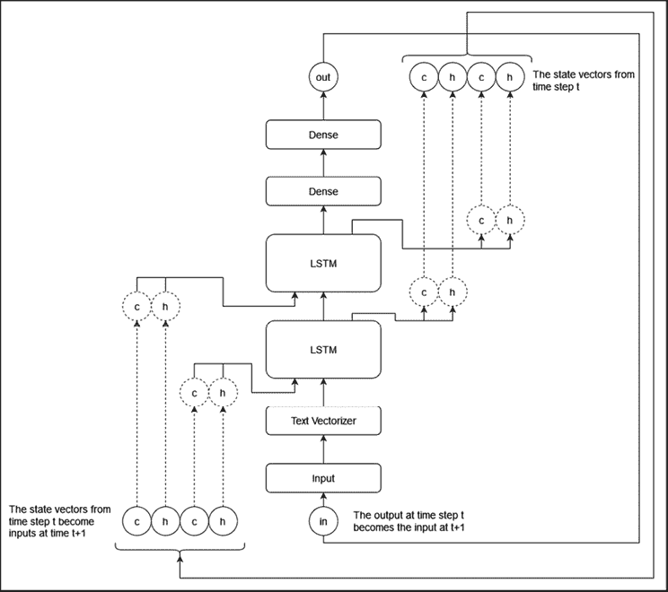

图 8.2：我们将基于训练模型构建的推理模型的操作视图

我们的推理模型将会更加复杂，因为我们需要设计一个迭代过程，使用先前的预测作为输入生成文本。因此，我们将使用 Keras 的功能性 API 来实现该模型：

```py
# Define inputs to the model
inp = tf.keras.layers.Input(dtype=tf.string, shape=(1,))
inp_state_c_lstm = tf.keras.layers.Input(shape=(512,))
inp_state_h_lstm = tf.keras.layers.Input(shape=(512,))
inp_state_c_lstm_1 = tf.keras.layers.Input(shape=(256,))
inp_state_h_lstm_1 = tf.keras.layers.Input(shape=(256,))
text_vectorized_out = lm_model.get_layer('text_vectorization')(inp)
# Define embedding layer and output
emb_layer = lm_model.get_layer('embedding')
emb_out = emb_layer(text_vectorized_out)
# Defining a LSTM layers and output
lstm_layer = tf.keras.layers.LSTM(512, return_state=True, return_sequences=True)
lstm_out, lstm_state_c, lstm_state_h = lstm_layer(emb_out, initial_state=[inp_state_c_lstm, inp_state_h_lstm])
lstm_1_layer = tf.keras.layers.LSTM(256, return_state=True, return_sequences=True)
lstm_1_out, lstm_1_state_c, lstm_1_state_h = lstm_1_layer(lstm_out, initial_state=[inp_state_c_lstm_1, inp_state_h_lstm_1])
# Defining a Dense layer and output
dense_out = lm_model.get_layer('dense')(lstm_1_out)
# Defining the final Dense layer and output
final_out = lm_model.get_layer('dense_1')(dense_out)
# Copy the weights from the original model
lstm_layer.set_weights(lm_model.get_layer('lstm').get_weights())
lstm_1_layer.set_weights(lm_model.get_layer('lstm_1').get_weights())
# Define final model
infer_model = tf.keras.models.Model(
    inputs=[inp, inp_state_c_lstm, inp_state_h_lstm, 
    inp_state_c_lstm_1, inp_state_h_lstm_1], 
    outputs=[final_out, lstm_state_c, lstm_state_h, lstm_1_state_c, 
    lstm_1_state_h]) 
```

我们从定义一个输入层开始，该层接收一个时间步长的输入。

请注意，我们正在定义 `shape` 参数。这意味着它可以接受任意大小的批量数据（只要它具有一个时间步）。我们还定义了其他几个输入，以维持 LSTM 层的状态。这是因为我们必须显式维护 LSTM 层的状态向量，因为我们正在递归地从模型中生成输出：

```py
inp = tf.keras.layers.Input(dtype=tf.string, shape=(1,))
inp_state_c_lstm = tf.keras.layers.Input(shape=(512,))
inp_state_h_lstm = tf.keras.layers.Input(shape=(512,))
inp_state_c_lstm_1 = tf.keras.layers.Input(shape=(256,))
inp_state_h_lstm_1 = tf.keras.layers.Input(shape=(256,)) 
```

接下来，我们检索训练好的模型的 `text_vectorization` 层，并使用它将文本转换为整数 ID：

```py
text_vectorized_out = lm_model.get_layer('text_vectorization')(inp) 
```

然后，我们获取训练模型的嵌入层并使用它来生成嵌入输出：

```py
emb_layer = lm_model.get_layer('embedding')
emb_out = emb_layer(text_vectorized_out) 
```

我们将创建一个全新的 LSTM 层，代表训练模型中的第一个 LSTM 层。这是因为推理 LSTM 层与训练 LSTM 层之间会有一些细微差异。因此，我们将定义新的层，并稍后将训练好的权重复制过来。我们将 `return_state` 参数设置为 `True`。通过将其设置为 `True`，我们在调用该层时将获得三个输出：最终输出、单元状态和最终状态向量。注意，我们还传递了另一个名为 `initial_state` 的参数。`initial_state` 需要是一个张量列表：按顺序包括单元状态和最终状态向量。我们将输入层作为这些状态并将在运行时相应地填充它们：

```py
lstm_layer = tf.keras.layers.LSTM(512, return_state=True, return_sequences=True)
lstm_out, lstm_state_c, lstm_state_h = lstm_layer(emb_out, initial_state=[inp_state_c_lstm, inp_state_h_lstm]) 
```

同样地，第二层 LSTM 将被定义。我们得到稠密层，并复制在训练模型中找到的全连接层。请注意，最后一层我们没有使用`softmax`。

这是因为在推理时，`softmax`只是额外的开销，因为我们只需要输出具有最高输出分数的类（即不需要是概率分布）：

```py
# Defining a Dense layer and output
dense_out = lm_model.get_layer('dense')(lstm_1_out)
# Defining the final Dense layer and output
final_out = lm_model.get_layer('dense_1')(dense_out) 
```

不要忘记将训练好的 LSTM 层的权重复制到我们新创建的 LSTM 层：

```py
lstm_layer.set_weights(lm_model.get_layer('lstm').get_weights())
lstm_1_layer.set_weights(lm_model.get_layer('lstm_1').get_weights()) 
```

最后，我们定义模型：

```py
infer_model = tf.keras.models.Model(
    inputs=[inp, inp_state_c_lstm, inp_state_h_lstm, 
    inp_state_c_lstm_1, inp_state_h_lstm_1], 
    outputs=[final_out, lstm_state_c, lstm_state_h, lstm_1_state_c, 
    lstm_1_state_h]) 
```

我们的模型将 1 个二元组作为输入序列，以及两个 LSTM 层的状态向量，输出最终的预测概率和两个 LSTM 层的新状态向量。现在，让我们从模型中生成新文本。

## 使用模型生成新文本

我们将使用新的推理模型生成一个故事。我们将定义一个初始种子，用来生成故事。这里，我们从一个测试文件的第一句话开始。然后我们通过递归使用预测的二元组在时间`t`时作为时间`t`+1 的输入来生成文本。我们将运行 500 步：

```py
text = ["When adam and eve were driven out of paradise, they were compelled to build a house for themselves on barren ground"]
seq = [text[0][i:i+2] for i in range(0, len(text[0]), 2)]
# build up model state using the given string
print("Making predictions from a {} element long input".format(len(seq)))
vocabulary = infer_model.get_layer("text_vectorization").get_vocabulary()
index_word = dict(zip(range(len(vocabulary)), vocabulary))
# Reset the state of the model initially
infer_model.reset_states()
# Defining the initial state as all zeros
state_c = np.zeros(shape=(1,512))
state_h = np.zeros(shape=(1,512))
state_c_1 = np.zeros(shape=(1,256))
state_h_1 = np.zeros(shape=(1,256))
# Recursively update the model by assigning new state to state
for c in seq:    
    #print(c)
    out, state_c, state_h, state_c_1, state_h_1 = infer_model.predict(
        [np.array([[c]]), state_c, state_h, state_c_1, state_h_1]
)
# Get final prediction after feeding the input string
wid = int(np.argmax(out[0],axis=-1).ravel())
word = index_word[wid]
text.append(word)
# Define first input to generate text recursively from
x = np.array([[word]])
# Code listing 10.7
for _ in range(500):

    # Get the next output and state
    out, state_c, state_h, state_c_1, state_h_1  = 
    infer_model.predict([x, state_c, state_h, state_c_1, state_h_1 ])

    # Get the word id and the word from out
    out_argsort = np.argsort(out[0], axis=-1).ravel()
    wid = int(out_argsort[-1])
    word = index_word[wid]

    # If the word ends with space, we introduce a bit of randomness
    # Essentially pick one of the top 3 outputs for that timestep 
    # depending on their likelihood
    if word.endswith(' '):
        if np.random.normal()>0.5:
            width = 5
            i = np.random.choice(list(range(-width,0)), 
            p=out_argsort[-width:]/out_argsort[-width:].sum())
            wid = int(out_argsort[i])    
            word = index_word[wid]

    # Append the prediction
    text.append(word)

    # Recursively make the current prediction the next input
    x = np.array([[word]])

# Print the final output    
print('\n')
print('='*60)
print("Final text: ")
print(''.join(text)) 
```

注意我们如何递归地使用变量`x`、`state_c`、`state_h`、`state_c_1`和`state_h_1`来生成并分配新值。

```py
 out, state_c, state_h, state_c_1, state_h_1  = 
    infer_model.predict([x, state_c, state_h, state_c_1, state_h_1 ]) 
```

此外，我们将使用一个简单的条件来多样化我们生成的输入：

```py
if word.endswith(' '):
        if np.random.normal()>0.5:
            width = 5
            i = np.random.choice(list(range(-width,0)), 
            p=out_argsort[-width:]/out_argsort[-width:].sum())
            wid = int(out_argsort[i])    
            word = index_word[wid] 
```

本质上，如果预测的二元组以`' '`字符结尾，我们将随机选择下一个二元组，从前五个二元组中选择。每个二元组将根据其预测的可能性被选中。让我们看看输出文本是什么样的：

```py
When adam and eve were driven out of paradise, they were compelled to build a house for themselves on barren groundy the king's daughter and said, i will so the king's daughter angry this they were and said, "i will so the king's daughter.  the king's daughter.' they were to the forest of the stork.  then the king's daughters, and they were to the forest of the stork, and, and then they were to the forest.  ... 
```

看起来我们的模型能够生成实际的单词和短语，且有意义。接下来，我们将研究从标准 LSTM 生成的文本与其他模型的比较，例如带有窥视连接的 LSTM 和 GRU。

# 将 LSTM 与带有窥视连接的 LSTM 和 GRU 进行比较

现在，我们将在文本生成任务中将 LSTM 与带有窥视连接的 LSTM 和 GRU 进行比较。这将帮助我们比较不同模型（带窥视连接的 LSTM 和 GRU）在困惑度方面的表现。记住，我们更看重困惑度而不是准确率，因为准确率假设给定一个先前的输入序列时只有一个正确的标记。然而，正如我们所学，语言是复杂的，给定先前的输入，生成文本有很多不同正确的方式。这个内容作为练习可以在`ch08_lstms_for_text_generation.ipynb`中找到，位于`Ch08-Language-Modelling-with-LSTMs`文件夹中。

## 标准 LSTM

首先，我们将重述标准 LSTM 的组件。我们不会重复标准 LSTM 的代码，因为它与我们之前讨论的完全相同。最后，我们将看到一个 LSTM 生成的文本。

### 回顾

在这里，我们将重新审视标准 LSTM 的结构。如前所述，一个 LSTM 包含以下组件：

+   **输入门** – 它决定当前输入有多少被写入到单元状态

+   **遗忘门** – 它决定了多少前一个单元状态将写入当前单元状态

+   **输出门** – 它决定了多少来自单元状态的信息将暴露到外部隐藏状态中

在*图 8.3*中，我们展示了每个门、输入、单元状态和外部隐藏状态是如何连接的：

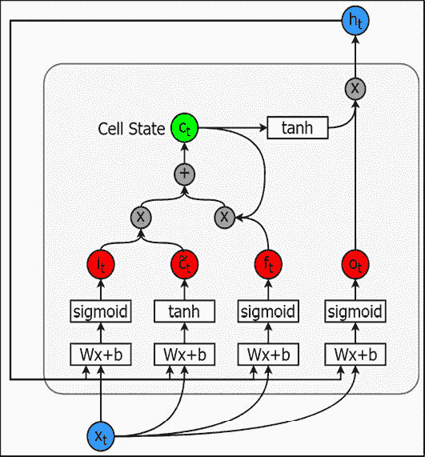

图 8.3：LSTM 单元

## 门控递归单元（GRU）

在这里，我们将首先简要描述一个 GRU 由哪些部分组成，接着展示实现 GRU 单元的代码。最后，我们来看一些由 GRU 单元生成的代码。

### 回顾

让我们简要回顾一下 GRU 是什么。GRU 是 LSTM 操作的优雅简化。GRU 对 LSTM 进行了两项不同的修改（见*图 8.4*）：

+   它将内部单元状态和外部隐藏状态连接成一个单一的状态

+   然后它将输入门和遗忘门结合为一个更新门

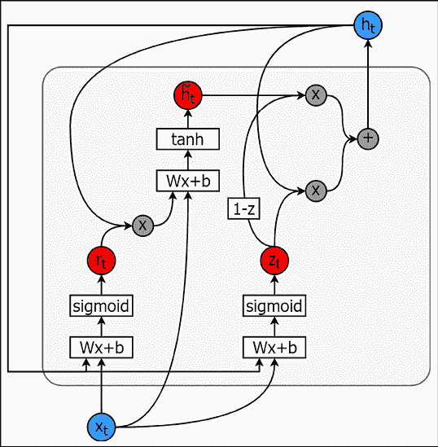

图 8.4：GRU 单元

GRU 模型采用了比 LSTM 更简单的门控机制。然而，它仍然能够捕获重要的功能，如记忆更新、遗忘等。

### 模型

在这里，我们将定义一个基于 GRU 的语言模型：

```py
text_vectorizer = tf.keras.layers.TextVectorization(
    max_tokens=n_vocab, standardize=None,
    split=None, input_shape=(window_size,)
)
# Train the model on existing data
text_vectorizer.adapt(train_ds)
lm_gru_model = models.Sequential([
    text_vectorizer,
    layers.Embedding(n_vocab+2, 96),
    layers.GRU(512, return_sequences=True),
    layers.GRU(256, return_sequences=True),
    layers.Dense(1024, activation='relu'),
    layers.Dropout(0.5),
    layers.Dense(n_vocab, activation='softmax')
]) 
```

训练代码与我们训练基于 LSTM 的模型时相同。因此，我们在这里不再重复讨论。接下来，我们将看看 LSTM 模型的一个略有不同的变体。

## 带有窥视连接的 LSTM

在这里，我们将讨论带有窥视连接的 LSTM，以及它们与标准 LSTM 的不同之处。之后，我们将讨论它们的实现。

### 回顾

现在，让我们简要看一下带有窥视连接的 LSTM。窥视连接本质上是一种让门（输入、遗忘和输出门）直接看到单元状态的方式，而不是等待外部隐藏状态（见*图 8.5*）：

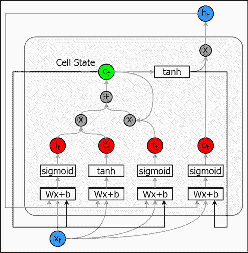

图 8.5：带有窥视连接的 LSTM

### 代码

请注意，我们使用的是对角线的窥视连接实现。我们发现，非对角线窥视连接（由 Gers 和 Schmidhuber 在他们的论文《*时间和计数的递归网络*》，《*神经网络*》，*2000*中提出）对于这个语言建模任务的表现影响较大，反而更多是有害而非有益。因此，我们使用了不同的变体，它使用了对角线窥视连接，就像 Sak、Senior 和 Beaufays 在他们的论文《*大规模声学建模的长短时记忆递归神经网络架构*》，《*国际语音通信协会年会会议录*》中所使用的那样。

幸运的是，我们已经将此技术作为`tensorflow_addons`中的`RNNCell`对象进行了实现。因此，我们所需要做的就是将这个`PeepholeLSTMCell`对象包装在`layers.RNN`对象中，以生成所需的层。以下是代码实现：

```py
text_vectorizer = tf.keras.layers.TextVectorization(
    max_tokens=n_vocab, standardize=None,
    split=None, input_shape=(window_size,)
)
# Train the model on existing data
text_vectorizer.adapt(train_ds)
lm_peephole_model = models.Sequential([
    text_vectorizer,
    layers.Embedding(n_vocab+2, 96),
    layers.RNN(
        tfa.rnn.PeepholeLSTMCell(512),
        return_sequences=True
    ),
    layers.RNN(
        tfa.rnn.PeepholeLSTMCell(256),
        return_sequences=True
    ),
    layers.Dense(1024, activation='relu'),
    layers.Dropout(0.5),
    layers.Dense(n_vocab, activation='softmax')
]) 
```

现在让我们看看不同模型的训练和验证困惑度，以及它们如何随时间变化。

## 训练和验证困惑度随时间变化

在 *图 8.6* 中，我们绘制了 LSTM、带窥视孔的 LSTM 和 GRU 的困惑度随时间变化的行为。我们可以看到，GRU 在性能上明显优于其他模型。这可以归因于 GRU 单元对 LSTM 单元的创新性简化。但看起来 GRU 模型确实会过拟合。因此，使用早停等技术来防止这种行为是非常重要的。我们可以看到，带窥视孔的 LSTM 在性能上并没有给我们带来太多优势。但需要记住的是，我们使用的是一个相对较小的数据集。

对于更大、更复杂的数据集，性能可能会有所不同。我们将把 GRU 单元的实验留给读者，继续讨论 LSTM 模型：

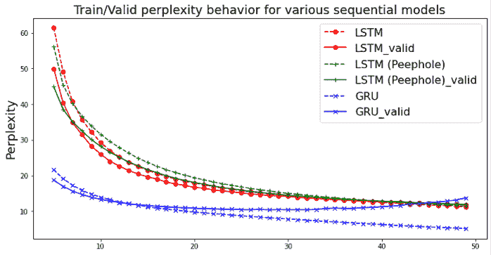

图 8.6：训练数据的困惑度随时间的变化（LSTM、LSTM（窥视孔）和 GRU）

**注意**

当前文献表明，在 LSTM 和 GRU 之间，没有明显的胜者，很多因素取决于任务本身（参见论文 *门控递归神经网络在序列建模中的经验评估*，*Chung 等人*，*2014 年 NIPS 深度学习工作坊*，*2014 年 12 月*，[`arxiv.org/abs/1412.3555`](https://arxiv.org/abs/1412.3555)）。

在本节中，我们讨论了三种不同的模型：标准 LSTM、GRU 和带窥视孔的 LSTM。

结果清楚地表明，对于这个数据集，GRU 优于其他变体。在下一节中，我们将讨论可以增强序列模型预测能力的技术。

# 改进序列模型——束搜索

正如我们之前所看到的，生成的文本可以改进。现在，让我们看看我们在 *第七章，理解长短期记忆网络* 中讨论的束搜索，是否能够帮助提高性能。从语言模型进行预测的标准方法是一次预测一个步骤，并使用前一个时间步的预测结果作为新的输入。在束搜索中，我们会在选择输入之前预测多个步骤。

这使我们能够选择那些单独看可能不那么吸引人的输出序列，但作为一个整体来看会更好。束搜索的工作方式是，在给定的时间，通过预测 `m`^n 个输出序列或束来进行。`m` 被称为束宽度，`n` 是束的深度。每个输出序列（或束）是预测的 `n` 个二元组，预测到未来。我们通过将束中每个项的单独预测概率相乘来计算每个束的联合概率。然后我们选择具有最高联合概率的束作为该时间步的输出序列。请注意，这是一个贪心搜索，这意味着我们会在树的每个深度计算最佳候选项，并逐步进行，随着树的增长。需要注意的是，这种搜索不会得到全局最优的束。*图 8.7* 展示了一个例子。我们将用粗体字和箭头标出最佳束候选（及其概率）：

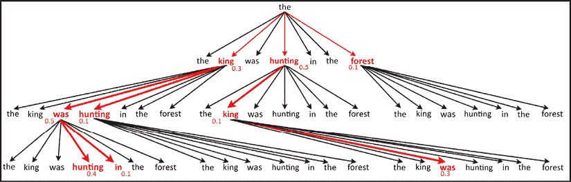

图 8.7：一个束搜索示例，展示了在每一步更新束状态的需求。每个单词下方的数字表示该单词被选择的概率。对于非粗体字的单词，你可以认为它们的概率可以忽略不计。

我们可以看到，在第一步中，单词“*hunting*”具有最高的概率。然而，如果我们执行一个深度为 3 的束搜索，我们得到的序列是 [*“king”, “was”, “hunting”*]，其联合概率为 *0.3 * 0.5 * 0.4 = 0.06*，作为最佳束。

这个概率高于从单词“*hunting*”开始的束（它的联合概率为 *0.5 * 0.1 * 0.3 = 0.015*）。

## 实现束搜索

我们将束搜索实现为一个递归函数。但首先，我们将实现一个执行递归函数单步操作的函数，称为 `beam_one_step()`。该函数简单地接受模型、输入和状态（来自 LSTM），并生成输出和新状态。

```py
def beam_one_step(model, input_, states): 
    """ Perform the model update and output for one step"""
    out = model.predict([input_, *states])
    output, new_states = out[0], out[1:]
    return output, new_states 
```

接下来，我们编写执行束搜索的主要递归函数。该函数接受以下参数：

+   `model` – 基于推理的语言模型

+   `input_` – 初始输入

+   `states` – 初始状态向量

+   `beam_depth` – 束的搜索深度

+   `beam_width` – 束搜索的宽度（即在给定深度下考虑的候选词数）

现在让我们讨论这个函数：

```py
def beam_search(model, input_, states, beam_depth=5, beam_width=3):
    """ Defines an outer wrapper for the computational function of 
    beam search """
    vocabulary = 
    infer_model.get_layer("text_vectorization").get_vocabulary()
    index_word = dict(zip(range(len(vocabulary)), vocabulary))
    def recursive_fn(input_, states, sequence, log_prob, i):
        """ This function performs actual recursive computation of the 
        long string"""

        if i == beam_depth:
            """ Base case: Terminate the beam search """
            results.append((list(sequence), states, np.exp(log_prob)))
            return sequence, log_prob, states
        else:
            """ Recursive case: Keep computing the output using the 
            previous outputs"""
            output, new_states = beam_one_step(model, input_, states)

            # Get the top beam_width candidates for the given depth
            top_probs, top_ids = tf.nn.top_k(output, k=beam_width)
            top_probs, top_ids = top_probs.numpy().ravel(), 
            top_ids.numpy().ravel()
            # For each candidate compute the next prediction
            for p, wid in zip(top_probs, top_ids):
                new_log_prob = log_prob + np.log(p)

                # we are going to penalize joint probability whenever 
                # the same symbol is repeating
                if len(sequence)>0 and wid == sequence[-1]:
                    new_log_prob = new_log_prob + np.log(1e-1)

                sequence.append(wid)
                _ = recursive_fn(np.array([[index_word[wid]]]), 
                new_states, sequence, new_log_prob, i+1)
                sequence.pop()
    results = []
    sequence = []
    log_prob = 0.0
    recursive_fn(input_, states, sequence, log_prob, 0)
    results = sorted(results, key=lambda x: x[2], reverse=True)
    return results 
```

`beam_search()` 函数实际上定义了一个嵌套的递归函数（`recursive_fn`），每次调用时都会累积输出，并将结果存储在一个名为 results 的列表中。`recursive_fn()` 做如下操作。如果函数已经被调用了与 `beam_depth` 相等的次数，那么它会返回当前结果。如果函数调用次数尚未达到预定深度，那么对于给定的深度索引，`recursive_fn()` 会：

+   使用 `beam_one_step()` 函数计算新的输出和状态

+   获取前两个候选词的 ID 和概率

+   在对数空间中计算每个束的联合概率（在对数空间中，我们可以获得更好的数值稳定性，尤其是对于较小的概率值）

+   最后，我们使用新的输入、新的状态和下一个深度索引调用相同的函数

有了这个，你可以简单地调用 `beam_search()` 函数，从推理模型中获得预测的束。接下来让我们看看如何实现这一点。

## 使用束搜索生成文本

在这里，我们只展示我们如何通过迭代调用 `beam_search()` 来生成新文本的部分。完整的代码请参见 `ch08_lstms_for_text_generation.ipynb`。

```py
for i in range(50):
    print('.', end='')
    # Get the results from beam search
    result = beam_search(infer_model, x, states, 5, 5)

    # Get one of the top 10 results based on their likelihood
    n_probs = np.array([p for _,_,p in result[:10]])
    p_j = np.random.choice(list(range(n_probs.size)), 
    p=n_probs/n_probs.sum())                    
    best_beam_ids, states, _ = result[p_j]
    x = np.array([[index_word[best_beam_ids[-1]]]])
    text.extend([index_word[w] for w in best_beam_ids]) 
```

我们简单地调用函数 `beam_search()`，传入 `infer_model`、当前输入 `x`、当前状态 `states`、`beam_depth` 和 `beam_width`，并更新 `x` 和 `states` 以反映获胜的束。然后模型将迭代使用获胜的束生成下一个束。

让我们看看 LSTM 在使用束搜索（beam search）时的表现：

```py
When adam and eve were driven out of paradise, they were compelled to build a house for themselves on barren groundr, said the king's daughter went out of the king's son to the king's daughter, and then the king's daughter went into the world, and asked the hedgehog's daughter that the king was about to the forest, and there was on the window, and said, "if you will give her that you have been and said, i will give him the king's daughter, but when she went to the king's sister, and when she was still before the window, and said to himself, and when he said to her father, and that he had nothing and said to hi 
```

这是标准的 LSTM 使用贪婪采样（即一次预测一个词）时的输出：

```py
When adam and eve were driven out of paradise, they were compelled to build a house for themselves on barren groundr, and then this they were all the third began to be able to the forests, and they were.  the king's daughter was no one was about to the king's daughter to the forest of them to the stone.  then the king's daughter was, and then the king's daughter was nothing-eyes, and the king's daughter was still, and then that had there was about through the third, and the king's daughters was seems to the king's daughter to the forest of them to the stone for them to the forests, and that it was not been to be ables, and the king's daughter wanted to be and said, ... 
```

与 LSTM 生成的文本相比，这段文本似乎有更多的变化，同时保持了语法的一致性。因此，实际上，束搜索（beam search）相比逐字预测能帮助生成更高质量的预测。但仍然有些情况下，词语组合在一起并没有太大意义。让我们看看如何进一步改进我们的 LSTM。

# 改进 LSTMs —— 使用词汇而非 n-gram 生成文本

在这里，我们将讨论如何改进 LSTM。到目前为止，我们一直使用二元组（bigrams）作为文本的基本单位。但如果使用词汇而非二元组，你将获得更好的结果。这是因为使用词汇可以减少模型的开销，避免需要学习如何从二元组中构建词汇。我们将讨论如何在代码中使用词向量，以便与使用二元组相比，生成更高质量的文本。

## 维度诅咒

阻止我们将词汇作为 LSTM 输入的一个主要限制是，这将大幅增加模型中的参数数量。让我们通过一个例子来理解这一点。假设我们的输入大小为*500*，单元状态大小为*100*。这将导致大约*240K*的参数数量（不包括 softmax 层），如图所示：

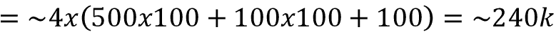

现在我们将输入大小增加到*1000*。此时，总参数数目将约为*440K*，如图所示：

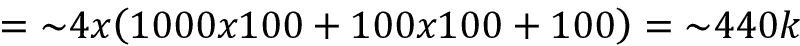

如你所见，当输入维度增加 500 单位时，参数的数量增长了 20 万。这不仅增加了计算复杂度，还因大量的参数而增加了过拟合的风险。因此，我们需要一些方法来限制输入的维度。

## Word2vec 来拯救我们

如你所记得，Word2vec 不仅能提供比独热编码（one-hot encoding）更低维度的词特征表示，还能提供语义上合理的特征。为了理解这一点，我们来看三个词：*cat*、*dog* 和 *volcano*。如果我们对这三个词进行独热编码，并计算它们之间的欧氏距离，结果会如下：

*distance(cat,volcano) = distance(cat,dog)*

然而，如果我们学习词嵌入，它将如下所示：

*distance(cat,volcano) > distance(cat,dog)*

我们希望我们的特征能代表后一种情况，其中相似的东西之间的距离小于不相似的东西。这样，模型将能够生成更高质量的文本。

## 使用 Word2vec 生成文本

模型的结构基本保持不变，我们所考虑的仅是文本单元的变化。

*图 8.8* 展示了 LSTM-Word2vec 的总体架构：

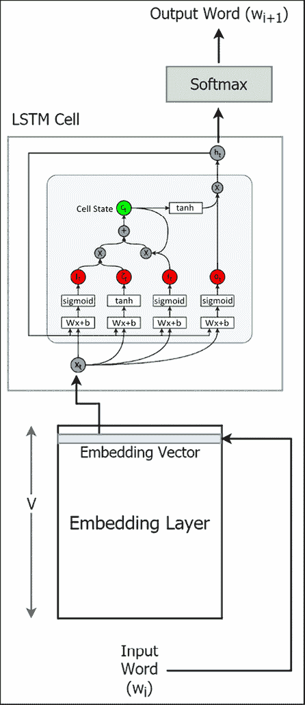

图 8.8：使用词向量的语言建模 LSTM 结构

使用词向量时，你有几个选择。你可以：

+   随机初始化词向量，并在任务过程中共同学习它们

+   预先使用词向量算法（例如 Word2vec、GloVe 等）训练嵌入层

+   使用可以自由下载的预训练词向量来初始化嵌入层

**注意**

下面列出了一些可以自由下载的预训练词向量。通过从包含数十亿单词的文本语料库中学习得到的词向量可以自由下载并使用：

+   **Word2vec**: [`code.google.com/archive/p/word2vec/`](https://code.google.com/archive/p/word2vec/)

+   **预训练 GloVe 词向量**: [`nlp.stanford.edu/projects/glove/`](https://nlp.stanford.edu/projects/glove/)

+   **fastText 词向量**: [`github.com/facebookresearch/fastText`](https://github.com/facebookresearch/fastText)

我们在这里结束关于语言建模的讨论。

# 总结

在这一章中，我们研究了 LSTM 算法的实现以及其他各个重要方面，以提升 LSTM 超越标准性能。作为练习，我们在格林兄弟的故事文本上训练了我们的 LSTM，并让 LSTM 输出一个全新的故事。我们讨论了如何通过提取自练习的代码示例来实现一个 LSTM 模型。

接下来，我们进行了关于如何实现带窥视孔的 LSTM 和 GRU 的技术讨论。然后，我们对标准 LSTM 及其变种进行了性能比较。我们发现 GRU 比带窥视孔的 LSTM 和 LSTM 表现更好。

然后我们讨论了提升 LSTM 输出质量的一些改进方法。第一个改进是束搜索。我们查看了束搜索的实现，并逐步介绍了如何实现它。接着，我们研究了如何利用词嵌入来教导 LSTM 输出更好的文本。

总之，LSTM 是非常强大的机器学习模型，能够捕捉长期和短期的依赖关系。

此外，与逐个预测相比，束搜索实际上有助于生成更具现实感的文本短语。

在下一章中，我们将探讨如何使用顺序模型来解决一种更复杂的问题类型，称为序列到序列问题。具体来说，我们将研究如何将机器翻译问题转化为序列到序列问题。

要访问本书的代码文件，请访问我们的 GitHub 页面：[`packt.link/nlpgithub`](https://packt.link/nlpgithub)

加入我们的 Discord 社区，结识志同道合的人，与超过 1000 名成员一起学习：[`packt.link/nlp`](https://packt.link/nlp)


