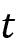
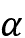
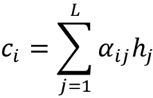
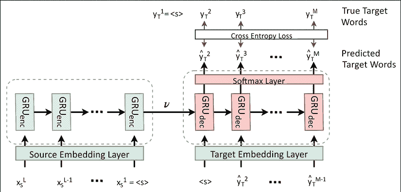

# 第九章：序列到序列学习 – 神经机器翻译

序列到序列学习是用于需要将任意长度序列映射到另一个任意长度序列的任务的术语。这是自然语言处理（NLP）中最复杂的任务之一，涉及学习多对多的映射。该任务的例子包括**神经机器翻译**（**NMT**）和创建聊天机器人。NMT 是指我们将一个语言（源语言）的句子翻译成另一种语言（目标语言）。谷歌翻译就是一个 NMT 系统的例子。聊天机器人（即能够与人类沟通/回答问题的软件）能够以现实的方式与人类对话。这对于各种服务提供商尤其有用，因为聊天机器人可以用来解答顾客可能遇到的易于解决的问题，而不是将他们转接给人工客服。

在本章中，我们将学习如何实现一个 NMT 系统。然而，在深入探讨这些最新进展之前，我们首先会简要回顾一些**统计机器翻译**（**SMT**）方法，这些方法是 NMT 之前的技术，并且在 NMT 赶超之前是当时的先进系统。接下来，我们将逐步讲解构建 NMT 所需的步骤。最后，我们将学习如何实现一个实际的 NMT 系统，从德语翻译到英语，逐步进行。

具体来说，本章将涵盖以下主要主题：

+   机器翻译

+   机器翻译的简短历史回顾

+   理解神经机器翻译

+   准备 NMT 系统的数据

+   定义模型

+   训练 NMT

+   BLEU 分数 – 评估机器翻译系统

+   可视化注意力模式

+   使用 NMT 进行推理

+   Seq2Seq 模型的其他应用 – 聊天机器人

# 机器翻译

人类常常通过语言彼此交流，相较于其他交流方式（例如，手势）。目前，全球有超过 6,000 种语言在使用。此外，要将一门语言学到能够被该语言的母语者轻松理解的水平，是一项难以掌握的任务。然而，交流对于分享知识、社交和扩大人际网络至关重要。因此，语言成为与世界其他地方的人进行交流的障碍。这就是**机器翻译**（**MT**）发挥作用的地方。MT 系统允许用户输入他们自己的语言（称为源语言）的句子，并输出所需目标语言的句子。

MT 的问题可以这样表述：假设我们给定一个句子（或一系列单词）`W[s]`，它属于源语言`S`，由以下公式定义：


在这里，。

源语言将被翻译成一个句子！[](img/B14070_09_003.png)，其中`T`是目标语言，并由以下公式给出：


在这里，。

 通过机器翻译系统得到的输出如下：


在这里， 是算法为源句子找到的可能翻译候选池。此外，从候选池中选出的最佳候选翻译由以下方程给出：


在这里， 是模型参数。在训练过程中，我们优化模型以最大化一组已知目标翻译的概率，这些目标翻译与对应的源语言翻译（即训练数据）相对应。

到目前为止，我们已经讨论了我们感兴趣的语言翻译问题的正式设置。接下来，我们将回顾机器翻译的历史，了解早期人们是如何尝试解决这一问题的。

# 机器翻译的简史

在这里，我们将讨论机器翻译的历史。机器翻译的起源涉及基于规则的系统。随后，出现了更多统计学上可靠的机器翻译系统。**统计机器翻译**（**SMT**）利用语言的各种统计量来生成目标语言的翻译。随后进入了神经机器翻译（NMT）时代。与其他方法相比，NMT 在大多数机器学习任务中目前保持着最先进的性能。

## 基于规则的翻译

神经机器翻译（NMT）是在统计机器学习之后很久才出现的，而统计机器学习已经存在超过半个世纪了。统计机器翻译方法的起源可以追溯到 1950-60 年，当时在第一次有记录的项目之一——*乔治敦-IBM 实验*中，超过 60 个俄语句子被翻译成了英语。为了提供一些背景，这一尝试几乎和晶体管的发明一样久远。

机器翻译的初期技术之一是基于词汇的机器翻译。该系统通过使用双语词典进行逐词翻译。然而，正如你所想的，这种方法有着严重的局限性。显而易见的局限性是，逐词翻译并不是不同语言之间的逐一映射。此外，逐词翻译可能导致不正确的结果，因为它没有考虑到给定单词的上下文。源语言中给定单词的翻译可以根据其使用的上下文而变化。为了通过一个具体的例子来理解这一点，我们来看一下*图 9.1*中的英法翻译示例。你可以看到，在给定的两个英语句子中，一个单词发生了变化。然而，这种变化导致了翻译的显著不同：


图 9.1：语言之间的翻译（英法）不是逐词映射

在 1960 年代，**自动语言处理咨询委员会**（**ALPAC**）发布了一份报告，*《语言与机器：计算机在翻译与语言学中的应用》*，*美国国家科学院（1966）*，讨论了机器翻译（MT）的前景。结论是：

*没有直接或可预测的前景表明机器翻译会变得有用。*

这是因为机器翻译（MT）当时比人工翻译更慢、更不准确且更昂贵。这对机器翻译的进展造成了巨大打击，几乎有十年的时间处于沉寂状态。

接下来是基于语料库的机器翻译（MT），其中一个算法通过使用源句子的元组进行训练，并通过平行语料库获得对应的目标句子，即平行语料库的格式为`[(<source_sentence_1>, <target_sentence_1>), (<source_sentence_2>, <target_sentence_2>), …]`。平行语料库是一个由源语言文本及其对应的翻译组成的元组形式的大型文本语料库。这个示例如*表 9.1*所示。需要注意的是，构建平行语料库比构建双语词典更容易，而且它们更准确，因为训练数据比逐词训练数据更丰富。此外，基于平行语料库的机器翻译可以建立双语词典（即转移模型），而不直接依赖于人工创建的双语词典。转移模型展示了给定当前源词或短语时，目标词或短语是正确翻译的可能性。除了学习转移模型外，基于语料库的机器翻译还学习了词对齐模型。词对齐模型可以表示源语言中的短语的单词如何与该短语的翻译对应。平行语料库和词对齐模型的示例如*图 9.2*所示：


图 9.2：两种不同语言之间的词对齐

一个平行语料库的示例如*表 9.1*所示：

| **源语言句子（英语）** | **目标语言句子（法语）** |
| --- | --- |
| I went home | Je suis allé à la maison |
| John likes to play guitar | John aime jouer de la guitare |
| He is from England | Il est d’Angleterre |
| … | …. |

表 9.1：英语和法语句子的平行语料库

另一种方法是跨语言机器翻译，它涉及将源语言句子翻译成一种语言中立的**中介语**（即元语言），然后从中介语生成翻译后的句子。更具体地说，跨语言机器翻译系统由两个重要组件组成，一个是分析器，另一个是合成器。分析器将获取源语言句子并识别出代理（例如名词）、动作（例如动词）等元素，以及它们之间的相互关系。接下来，这些识别出的元素通过跨语言词汇表进行表示。跨语言词汇表的一个例子可以通过 WordNet 中的同义词集（即共享共同意义的同义词组）来构建。然后，合成器将从这种跨语言表示中生成翻译。由于合成器通过跨语言表示了解名词、动词等，它可以通过结合特定语言的语法规则在目标语言中生成翻译。

## 统计机器翻译（SMT）

接下来，更多统计上更为合理的系统开始出现。这个时代的先锋模型之一是 IBM 模型 1-5，它进行的是基于单词的翻译。然而，正如我们之前讨论的，单词翻译并不是一一对应的（例如复合词和形态学）。最终，研究人员开始尝试基于短语的翻译系统，这在机器翻译领域取得了一些显著的进展。

基于短语的翻译与基于单词的翻译类似，不同之处在于它使用语言的短语作为翻译的基本单位，而不是单个单词。这是一种更合理的方法，因为它使得建模单词之间的多对一、多对多或一对多关系变得更容易。基于短语的翻译的主要目标是学习一个短语翻译模型，其中包含不同候选目标短语对于给定源短语的概率分布。如你所想，这种方法需要维护两种语言之间大量短语的数据库。由于不同语言之间的句子没有单调的词序，因此还需要对短语进行重新排序。

这一点的例子如*图 9.2*所示；如果单词在语言之间是单调排序的，单词映射之间就不会有交叉。

这种方法的一个局限性是解码过程（为给定源短语找到最佳目标短语）代价高昂。这是因为短语数据库的庞大，以及一个源短语通常包含多个目标语言短语。为了减轻这一负担，基于语法的翻译应运而生。

在基于语法的翻译中，源句子通过语法树来表示。在*图 9.3*中，**NP**表示名词短语，**VP**表示动词短语，`S`表示句子。然后进入**重排序阶段**，在这个阶段，树节点会根据目标语言的需要重新排序，以改变主语、动词和宾语的顺序。这是因为句子结构会根据语言的不同而变化（例如，英语是*主语-动词-宾语*，而日语是*主语-宾语-动词*）。重排序是根据一种叫做**r 表**的东西来决定的。r 表包含了树节点按照某种顺序重排的可能性概率：


图 9.3：一个句子的语法树

然后进入**插入阶段**。在插入阶段，我们随机地将一个词插入到树的每个节点中。这是由于假设存在一个不可见的`NULL`词，它会在树的随机位置生成目标词汇。此外，插入一个词的概率由一种叫做**n 表**的东西决定，它是一个包含将特定词插入到树中的概率的表格。

接下来，进入**翻译阶段**，在这个阶段，每个叶子节点都按逐词的方式被翻译成目标词。最后，通过读取语法树中的翻译句子，构建目标句子。

## 神经机器翻译（NMT）

最后，在 2014 年左右，NMT 系统被引入。NMT 是一种端到端的系统，它将整个句子作为输入，进行某些转换，然后输出与源句子对应的翻译句子。

因此，NMT 消除了机器翻译所需的特征工程，例如构建短语翻译模型和构建语法树，这对 NLP 社区来说是一个巨大的胜利。此外，NMT 在非常短的时间内（仅两到三年）超越了所有其他流行的 MT 技术。在*图 9.4*中，我们展示了 MT 文献中报告的各种 MT 系统的结果。例如，2016 年的结果来自 Sennrich 等人在他们的论文*《爱丁堡神经机器翻译系统（WMT 16），计算语言学协会，第一个机器翻译会议论文集，2016 年 8 月：371-376》*中的报告，也来自 Williams 等人在他们的论文*《爱丁堡统计机器翻译系统（WMT16），计算语言学协会，第一个机器翻译会议论文集，2016 年 8 月：399-410》*中的报告。所有 MT 系统都通过 BLEU 分数进行了评估。BLEU 分数表示候选翻译与参考翻译匹配的 n-grams 数量（例如，单字和双字组合）。因此，BLEU 分数越高，MT 系统越好。我们将在本章后面详细讨论 BLEU 指标。不言而喻，NMT 无疑是赢家：


图 9.4：统计机器翻译系统与 NMT 系统的比较。感谢 Rico Sennrich 提供。

一个评估 NMT 系统潜力的案例研究可以在*《神经机器翻译准备好部署了吗？30 种翻译方向的案例研究》*中找到，作者为 Junczys-Dowmunt、Hoang 和 Dwojak，发表于*第九届国际口语语言翻译研讨会*，*西雅图（2016）*。

该研究探讨了不同系统在多种语言之间（英语、阿拉伯语、法语、俄语和中文）的翻译任务中的表现。结果还表明，NMT 系统（NMT 1.2M 和 NMT 2.4M）的表现优于 SMT 系统（PB-SMT 和 Hiero）。

*图 9.5*显示了 2017 年最先进的机器翻译系统的一些统计数据。这些数据来自 Konstantin Savenkov（Intento 公司联合创始人兼 CEO）制作的演示文稿《机器翻译现状，Intento 公司，2017》。我们可以看到，DeepL（[`www.deepl.com`](https://www.deepl.com)）所生成的机器翻译性能与其他大型机器翻译系统，包括 Google，表现得非常接近。比较包括了 DeepL（NMT）、Google（NMT）、Yandex（NMT-SMT 混合）、Microsoft（同时拥有 SMT 和 NMT）、IBM（SMT）、Prompt（基于规则）和 SYSTRAN（基于规则/SMT 混合）等机器翻译系统。图表清晰地显示了 NMT 系统目前在机器翻译技术进展中处于领先地位。LEPOR 得分用于评估不同的系统。LEPOR 是一种比 BLEU 更先进的评估指标，它尝试解决**语言偏差问题**。语言偏差问题指的是一些评估指标（如 BLEU）在某些语言上表现良好，但在其他语言上表现较差。

然而，也应注意，由于在这次比较中使用了平均机制，结果确实存在一定的偏差。例如，Google 翻译是基于一个更大范围的语言集合（包括较难的翻译任务）进行平均的，而 DeepL 则是基于一个较小且相对容易的语言子集进行平均的。因此，我们不应得出结论认为 DeepL 的机器翻译系统总是优于 Google 的机器翻译系统。尽管如此，整体结果仍然为当前的 NMT 和 SMT 系统提供了一个大致的性能对比：


图 9.5：各种机器翻译系统的表现。感谢 Intento 公司提供

我们看到 NMT 在短短几年内已经超过了 SMT 系统，成为当前的最先进技术。接下来，我们将讨论 NMT 系统的细节和架构。最后，我们将从头开始实现一个 NMT 系统。

# 理解神经机器翻译

现在我们已经理解了机器翻译如何随着时间的推移而发展，让我们尝试理解最先进的 NMT 是如何工作的。首先，我们将看看神经机器翻译模型的架构，然后再深入了解实际的训练算法。

## NMT 系统背后的直觉

首先，让我们理解 NMT 系统设计背后的直觉。假设你是一个流利的英语和德语使用者，并且被要求将以下句子翻译成德语：

*我回家了*

该句的翻译如下：

*Ich ging nach Hause*

尽管对流利的人来说，翻译这个句子可能只需要几秒钟，但翻译是有一定过程的。首先，你阅读英文句子，然后在脑海中形成一个关于这个句子的思想或概念。最后，你将句子翻译成德语。构建 NMT 系统时使用了相同的思路（见*图 9.6*）。编码器读取源句子（类似于你阅读英文句子的过程）。然后，编码器输出一个上下文向量（该上下文向量对应你在阅读句子后想象的思想/概念）。最后，解码器接收上下文向量并输出德语翻译：


图 9.6：NMT 系统的概念架构

## NMT 架构

现在我们将更详细地看一下架构。序列到序列的方法最初是由 Sutskever、Vinyals 和 Le 在他们的论文《Sequence to Sequence Learning with Neural Networks, Proceedings of the 27th International Conference on Neural Information Processing Systems - Volume 2: 3104-3112.》中提出的。

从*图 9.6*的示意图中，我们可以看到 NMT 架构中有两个主要组件。它们被称为编码器和解码器。换句话说，NMT 可以看作是一个编码器-解码器架构。**编码器**将源语言的句子转换为思想向量（即上下文化的表示），而**解码器**将思想向量解码或翻译为目标语言。正如你所看到的，这与我们简要讨论过的中介语言机器翻译方法有些相似。这个解释在*图 9.7*中得到了说明。上下文向量的左侧表示编码器（它逐字读取源句子以训练时间序列模型）。右侧表示解码器，它逐字输出（同时使用前一个词作为当前输入）源句子的相应翻译。我们还将使用嵌入层（对于源语言和目标语言），在这些层中，单个词元的语义将被学习并作为输入传递给模型：


图 9.7：源句子和目标句子随时间展开

在对 NMT 的基本理解之后，我们来正式定义 NMT 的目标。NMT 系统的最终目标是最大化对给定源句子 `x[s]` 及其对应的 `yₜ` 的对数似然。即，最大化以下内容：


这里，`N` 指的是我们作为训练数据拥有的源句子和目标句子输入的数量。

然后，在推理过程中，对于给定的源句子， ，我们将使用以下方法找到  翻译：


在这里， 是第 `i` 时刻的预测标记， 是可能的候选句子集合。

在我们研究 NMT 架构的每个部分之前，让我们先定义一些数学符号，以便更具体地理解这个系统。作为我们的序列模型，我们将选择 **门控循环单元** (**GRU**)，因为它比 LSTM 更简单，且表现相对较好。

让我们定义编码器 GRU 为 ，解码器 GRU 为 。在时间步长  处，定义一般 GRU 的输出状态为 `hₜ`。也就是说，将输入 `xₜ` 输入到 GRU 中会得到 `hₜ`：


现在，我们将讨论嵌入层、编码器、上下文向量，最后是解码器。

### 嵌入层

我们已经看到词嵌入的强大功能。在这里，我们也可以利用嵌入来提高模型性能。我们将使用两个词嵌入层， 用于源语言， 用于目标语言。所以，我们将不直接将 `xₜ` 输入到 GRU 中，而是得到 。然而，为了避免过多的符号表示，我们假设 。

### 编码器

如前所述，编码器负责生成一个思维向量或上下文向量，表示源语言的含义。为此，我们将使用基于 GRU 的网络（见 *图 9.8*）：


图 9.8：一个 GRU 单元

编码器在时间步长 0 (`h₀`) 处用零向量初始化。编码器接受一个词序列，，作为输入，并计算一个上下文向量，，其中 `v` 是处理序列 `x[s]` 的最后一个元素  后得到的最终外部隐藏状态。我们表示为以下内容：


### 上下文向量

上下文向量 (`v`) 的概念是简洁地表示源语言的句子。此外，与编码器的状态初始化方式（即初始化为零）相对，上下文向量成为解码器 GRU 的初始状态。换句话说，解码器 GRU 并非以零向量作为初始状态，而是以上下文向量作为初始状态。这在编码器和解码器之间创建了联系，使整个模型成为端到端可微分的。我们将在接下来详细讨论这一点。

### 解码器

解码器负责将上下文向量解码为所需的翻译。我们的解码器也是一个 RNN。虽然编码器和解码器可以共享相同的权重集，但通常使用两个不同的网络分别作为编码器和解码器会更好。这增加了我们模型中的参数数量，使我们能够更有效地学习翻译。

首先，解码器的状态通过上下文向量进行初始化，即，如图所示：。

在这里，是解码器的初始状态向量（）。

这个(`v`)是连接编码器和解码器，形成端到端计算链的关键链接（见*图 9.6*，编码器和解码器共享的唯一内容是`v`）。此外，这是解码器获取源句子的唯一信息。

然后，我们将通过以下公式计算翻译句子的第`m`个预测结果：


带有 GRU 单元在编码器和解码器之间连接细节，并且使用 softmax 层输出预测结果的完整 NMT 系统，如*图 9.9*所示：


图 9.9：带有 GRU 的编码器-解码器架构。编码器和解码器都有一个独立的 GRU 组件。此外，解码器还具有一个全连接（密集）层和一个 softmax 层，用于生成最终的预测结果。

在下一节中，我们将介绍为模型准备数据所需的步骤。

# 为 NMT 系统准备数据

在本节中，我们将了解数据，并学习如何准备数据以进行 NMT 系统的训练和预测。首先，我们将讨论如何准备训练数据（即源句子和目标句子对），以训练 NMT 系统，然后输入给定的源句子以生成该源句子的翻译。

## 数据集

本章中我们将使用的数据集是来自[`nlp.stanford.edu/projects/nmt/`](https://nlp.stanford.edu/projects/nmt/)的 WMT-14 英德翻译数据。大约有 450 万个句子对可用。然而，由于计算可行性，我们只会使用 25 万个句子对。词汇表由最常见的 50,000 个英语单词和最常见的 50,000 个德语单词组成，词汇表中未找到的单词将被特殊标记`<unk>`替代。你需要下载以下文件：

+   `train.de` – 包含德语句子的文件

+   `train.en` – 包含英语句子的文件

+   `vocab.50K.de` – 包含德语词汇的文件

+   `vocab.50K.en` – 包含英语词汇的文件

`train.de`和`train.en`分别包含德语和英语的平行句子。一旦下载，我们将按照以下方式加载这些句子：

```py
n_sentences = 250000
# Loading English sentences
original_en_sentences = []
with open(os.path.join('data', 'train.en'), 'r', encoding='utf-8') as en_file:
    for i,row in enumerate(en_file):
        if i >= n_sentences: break
        original_en_sentences.append(row.strip().split(" "))

# Loading German sentences
original_de_sentences = []
with open(os.path.join('data', 'train.de'), 'r', encoding='utf-8') as de_file:
    for i, row in enumerate(de_file):
        if i >= n_sentences: break
        original_de_sentences.append(row.strip().split(" ")) 
```

如果你打印刚刚加载的数据，对于这两种语言，你会看到如下的句子：

```py
English: a fire restant repair cement for fire places , ovens , open fireplaces etc . 
German: feuerfester Reparaturkitt für Feuerungsanlagen , Öfen , offene Feuerstellen etc.
English: Construction and repair of highways and ... 
German: Der Bau und die Reparatur der Autostraßen ...
English: An announcement must be commercial character . 
German: die Mitteilungen sollen den geschäftlichen kommerziellen Charakter tragen . 
```

### 添加特殊标记

下一步是向我们的句子开始和结束添加一些特殊标记。我们将添加`<s>`来标记句子的开始，添加`</s>`来标记句子的结束。我们可以通过以下列表推导轻松实现这一点：

```py
en_sentences = [["<s>"]+sent+["</s>"] for sent in original_en_sentences]
de_sentences = [["<s>"]+sent+["</s>"] for sent in original_de_sentences] 
```

这将给我们带来：

```py
English: <s> a fire restant repair cement for fire places , ovens , open fireplaces etc . </s> 
German: <s> feuerfester Reparaturkitt für Feuerungsanlagen , Öfen , offene Feuerstellen etc. </s>
English: <s> Construction and repair of highways and ... </s> 
German: <s> Der Bau und die Reparatur der Autostraßen ... </s>
English: <s> An announcement must be commercial character . </s> 
German: <s> die Mitteilungen sollen den geschäftlichen kommerziellen Charakter tragen . </s> 
```

这是 Seq2Seq 模型中非常重要的一步。`<s>`和`</s>`标记在模型推理过程中起着极其重要的作用。正如你将看到的，在推理时，我们将使用解码器逐步预测一个单词，通过使用上一步的输出作为输入。这样，我们就可以预测任意数量的时间步。使用`<s>`作为起始标记使我们能够向解码器发出信号，指示它应开始预测目标语言的标记。接下来，如果我们不使用`</s>`标记来标记句子的结束，我们就无法向解码器发出结束句子的信号。这可能会导致模型进入无限预测循环。

### 划分训练、验证和测试数据集

我们需要将数据集拆分成三个部分：训练集、验证集和测试集。具体来说，我们将使用 80%的句子来训练模型，10%作为验证数据，剩下的 10%作为测试数据：

```py
from sklearn.model_selection import train_test_split
train_en_sentences, valid_test_en_sentences, train_de_sentences, valid_test_de_sentences = train_test_split(
    np.array(en_sentences), np.array(de_sentences), test_size=0.2
)
valid_en_sentences, valid_de_sentences, test_en_sentences, test_de_sentences = train_test_split(
    valid_test_en_sentences, valid_test_de_sentences, test_size=0.5) 
```

### 为两种语言定义序列长度

我们现在必须理解的一个关键统计数据是，我们的语料库中的句子通常有多长。两种语言的句子长度很可能会有所不同。为了学习这个统计数据，我们将使用 pandas 库，具体方法如下：

```py
pd.Series(train_en_sentences).str.len().describe(percentiles=[0.05, 0.5, 0.95]) 
```

在这里，我们首先将`train_en_sentences`转换为一个`pd.Series`对象。`pd.Series`是一个带索引的值序列（数组）。在这里，每个值是属于每个句子的标记列表。调用`.str.len()`将给我们每个标记列表的长度。最后，`describe`方法将提供重要的统计数据，如均值、标准差和百分位数。在这里，我们特别请求 5%、50%和 95%的百分位数。

请注意，我们仅使用训练数据进行此计算。如果将验证或测试数据集包括在计算中，我们可能会泄露有关验证和测试数据的信息。因此，最好仅使用训练数据集进行这些计算。

前面的代码结果给我们带来了：

```py
Sequence lengths (English)
count    40000.000000
mean        25.162625
std         13.857748
min          6.000000
5%           9.000000
50%         22.000000
95%         53.000000
max        100.000000
dtype: float64 
```

我们可以通过以下方式获得德语句子的相同信息：

```py
pd.Series(train_de_sentences).str.len().describe(percentiles=[0.05, 0.5, 0.95]) 
```

这给我们带来了：

```py
Sequence lengths (German)
count    40000.000000
mean        22.882550
std         12.574325
min          6.000000
5%           9.000000
50%         20.000000
95%         47.000000
max        100.000000
dtype: float64 
```

在这里我们可以看到，95%的英语句子有 53 个标记，而 95%的德语句子有 47 个标记。

### 填充句子

接下来，我们需要填充我们的句子。为此，我们将使用 Keras 提供的`pad_sequences()`函数。该函数接受以下参数的值：

+   `sequences` – 一个字符串/ID 的列表，表示文本语料库。每个文档可以是一个字符串列表或一个整数列表。

+   `maxlen` – 要填充的最大长度（默认为`None`）

+   `dtype` – 数据类型（默认为`'int32'`）

+   `padding` – 填充短序列的方向（默认为`'pre'`）

+   `truncating` – 截断长序列的方向（默认为`'pre'`）

+   `value` – 用于填充的值（默认为`0.0`）

我们将按如下方式使用这个函数：

```py
from tensorflow.keras.preprocessing.sequence import pad_sequences
train_en_sentences_padded = pad_sequences(train_en_sentences, maxlen=n_en_seq_length, value=unk_token, dtype=object, truncating='post', padding='post')
valid_en_sentences_padded = pad_sequences(valid_en_sentences, maxlen=n_en_seq_length, value=unk_token, dtype=object, truncating='post', padding='post')
test_en_sentences_padded = pad_sequences(test_en_sentences, maxlen=n_en_seq_length, value=unk_token, dtype=object, truncating='post', padding='post')
train_de_sentences_padded = pad_sequences(train_de_sentences, maxlen=n_de_seq_length, value=unk_token, dtype=object, truncating='post', padding='post')
valid_de_sentences_padded = pad_sequences(valid_de_sentences, maxlen=n_de_seq_length, value=unk_token, dtype=object, truncating='post', padding='post')
test_de_sentences_padded = pad_sequences(test_de_sentences, maxlen=n_de_seq_length, value=unk_token, dtype=object, truncating='post', padding='post') 
```

我们正在对所有的训练、验证和测试句子进行填充处理，无论是英文还是德文。我们将使用最近找到的序列长度作为填充/截断长度。

**反转源语言句子**

我们还可以对源语言句子执行一个特殊的技巧。假设我们有一个句子*ABC*，我们想将其翻译成目标语言中的。我们将首先反转源语言句子，使得句子*ABC*被读取为*CBA*。这意味着，为了将*ABC*翻译为，我们需要输入*CBA*。这种方法显著提高了模型的性能，尤其是当源语言和目标语言共享相同句子结构时（例如，*主语-动词-宾语*）。

让我们试着理解为什么这有帮助。主要是，它有助于在编码器和解码器之间建立良好的*沟通*。让我们从前面的例子开始。我们将把源语言句子和目标语言句子连接起来：


如果你计算从`A`到或从`B`到的距离（即，两个词之间的单词数），它们将是相同的。然而，考虑到反转源句子时的情况，如此处所示：


在这里，`A`与非常接近，以此类推。另外，为了构建好的翻译，开始时建立良好的交流非常重要。这个简单的技巧可能有助于 NMT 系统提升其性能。

请注意，反转源句子的步骤是一个主观的预处理步骤。对于某些翻译任务，这可能并不是必要的。例如，如果你的翻译任务是从日语（通常是*主语-宾语-动词*格式）翻译到菲律宾语（通常是*动词-主语-宾语*格式），那么反转源句子可能会适得其反，反而带来不利影响。这是因为通过反转日语文本，你会增加目标句子中起始元素（即动词（在日语中））与对应的源语言实体（即动词（在菲律宾语中））之间的距离。

接下来，我们来定义我们的编码器-解码器模型。

# 定义模型

在这一部分，我们将定义一个端到端的模型。

我们将实现一个基于编码器-解码器的 NMT 模型，并配备附加技术来提升性能。让我们从将字符串标记转换为 ID 开始。

## 将标记转换为 ID

在我们进入模型之前，还有一个文本处理操作剩下，那就是将处理过的文本标记转换为数字 ID。我们将使用`tf.keras.layers.Layer`来实现这一点。具体来说，我们将使用`StringLookup`层在模型中创建一个层，将每个标记转换为数字 ID。第一步，让我们加载数据中提供的词汇表文件。在此之前，我们将定义变量`n_vocab`来表示每种语言词汇表的大小：

```py
n_vocab = 25000 + 1 
```

最初，每个词汇表包含 50,000 个标记。然而，我们将只取其中的一半，以减少内存需求。请注意，我们允许额外的一个标记，因为有一个特殊的标记`<unk>`表示**超出词汇表**（**OOV**）的单词。使用 50,000 个标记的词汇表，由于我们最终要构建的预测层的大小，内存很容易就会耗尽。在减少词汇表大小的同时，我们必须确保保留最常见的 25,000 个单词。幸运的是，每个词汇表文件的组织方式是按单词出现的频率排序（从高到低）。因此，我们只需从文件中读取前 25,001 行文本：

```py
en_vocabulary = []
with open(os.path.join('data', 'vocab.50K.en'), 'r', encoding='utf-8') as en_file:
    for ri, row in enumerate(en_file):
        if ri  >= n_vocab: break

        en_vocabulary.append(row.strip()) 
```

然后我们对德语的词汇表做相同的操作：

```py
de_vocabulary = []
with open(os.path.join('data', 'vocab.50K.de'), 'r', encoding='utf-8') as de_file:
    for ri, row in enumerate(de_file):
        if ri >= n_vocab: break

        de_vocabulary.append(row.strip()) 
```

每个词汇表的第一行都包含特殊的 OOV 标记`<unk>`。我们将从`en_vocabulary`和`de_vocabulary`列表中移除它，因为在下一步中我们需要它：

```py
en_unk_token = en_vocabulary.pop(0)
de_unk_token = de_vocabulary.pop(0) 
```

下面是我们如何定义英语的`StringLookup`层：

```py
en_lookup_layer = tf.keras.layers.StringLookup(
    vocabulary=en_vocabulary, oov_token=en_unk_token, 
    mask_token=pad_token, pad_to_max_tokens=False
) 
```

让我们理解传递给这个层的参数：

+   `vocabulary` – 包含在语料库中找到的单词列表（除了以下将讨论的某些特殊标记）

+   `oov_token` – 一个特殊的超出词汇表（out-of-vocabulary）标记，用于替换词汇表中没有列出的标记

+   `mask_token` – 一个特殊的标记，用于遮蔽输入（例如，不含信息的填充标记）

+   `pad_to_max_tokens` – 如果需要进行填充，将任意长度的序列调整为数据批次中的相同长度

同样，我们为德语定义一个查找层：

```py
de_lookup_layer = tf.keras.layers.StringLookup(
    vocabulary=de_vocabulary, oov_token=de_unk_token, 
    mask_token=pad_token, pad_to_max_tokens=False
) 
```

在打好基础后，我们可以开始构建编码器。

## 定义编码器

我们从输入层开始构建编码器。输入层将接受一个包含标记序列的批次。每个标记序列的长度为`n_en_seq_length`个元素。记住，我们已经填充或截断了句子，确保它们的固定长度为`n_en_seq_length`：

```py
encoder_input = tf.keras.layers.Input(shape=(n_en_seq_length,), dtype=tf.string) 
```

接下来，我们使用之前定义的`StringLookup`层将字符串标记转换为词 ID。如我们所见，`StringLookup`层可以接受一个独特单词的列表（即词汇表），并创建一个查找操作，将给定的标记转换为数字 ID：

```py
encoder_wid_out = en_lookup_layer(encoder_input) 
```

将词元转换为 ID 后，我们将生成的单词 ID 传递给词元嵌入层。我们传入词汇表的大小（从`en_lookup_layer`的`get_vocabulary()`方法中获取）和嵌入大小（128），最后我们要求该层对任何零值输入进行掩蔽，因为它们不包含任何信息：

```py
en_full_vocab_size = len(en_lookup_layer.get_vocabulary())
encoder_emb_out = tf.keras.layers.Embedding(en_full_vocab_size, 128, mask_zero=True)(encoder_wid_out) 
```

嵌入层的输出存储在 `encoder_emb_out` 中。接下来，我们定义一个 GRU 层来处理英文词元嵌入序列：

```py
encoder_gru_out, encoder_gru_last_state = tf.keras.layers.GRU(256, return_sequences=True, return_state=True)(encoder_emb_out) 
```

注意，我们将 `return_sequences` 和 `return_state` 参数都设置为 `True`。总结一下，`return_sequences` 返回完整的隐藏状态序列作为输出（而不是仅返回最后一个状态），而 `return_state` 返回模型的最后状态作为额外的输出。我们需要这两个输出才能构建模型的其余部分。例如，我们需要将编码器的最后状态传递给解码器作为初始状态。为此，我们需要编码器的最后状态（存储在 `encoder_gru_last_state` 中）。我们将在后续详细讨论这个目的。现在我们已经准备好定义模型的编码器部分。它接收一批字符串词元序列，并返回完整的 GRU 隐藏状态序列作为输出。

```py
encoder = tf.keras.models.Model(inputs=encoder_input, outputs=encoder_gru_out) 
```

定义好编码器后，让我们来构建解码器。

## 定义解码器

我们的解码器将比编码器更复杂。解码器的目标是，给定最后一个编码器状态和解码器预测的前一个词，预测下一个词。例如，对于德语句子：

*<s> ich ging zum Laden </s>*

我们定义：

| **输入** | <s> | ich | ging | zum | Laden |
| --- | --- | --- | --- | --- | --- |
| **输出** | ich | ging | zum | Laden | </s> |

这种技术被称为 **教师强制**。换句话说，解码器利用目标语言的前一个词元来预测下一个词元。这使得翻译任务对模型来说变得更容易。我们可以通过以下方式理解这一现象。假设老师让幼儿园的学生完成以下句子，只给出第一个词：

*I ___ ____ ___ ___ ____ ____*

这意味着孩子需要选择主语、动词和宾语；了解语言的语法结构；理解语言的语法规则；等等。因此，孩子生成不正确句子的可能性很高。

然而，如果我们要求孩子逐个单词地生成句子，他们可能更擅长于构造一个完整的句子。换句话说，我们要求孩子在给定以下条件的情况下生成下一个单词：

*I ____*

然后我们要求他们在给定的情况下填空：

*I like ____*

然后继续以相同的方式进行：

*I like to ___, I like to fly ____, I like to fly kites ____*

这样，孩子可以更好地生成一个正确且有意义的句子。我们可以采用相同的方法来减轻翻译任务的难度，如 *图 9.10* 所示：


图 9.10：教师强制机制。输入中的深色箭头表示新引入的输入连接到解码器。右侧的图显示了解码器 GRU 单元如何变化。

为了解码器输入先前由解码器预测的标记，我们需要为解码器提供一个输入层。当以这种方式构造解码器的输入和输出时，对于长度为 `n` 的标记序列，输入和输出的长度是 *n-1* 个标记：

```py
decoder_input = tf.keras.layers.Input(shape=(n_de_seq_length-1,), dtype=tf.string) 
```

接下来，我们使用之前定义的`de_lookup_layer`将标记转换为 ID：

```py
decoder_wid_out = de_lookup_layer(decoder_input) 
```

类似于编码器，让我们为德语定义一个嵌入层：

```py
de_full_vocab_size = len(de_lookup_layer.get_vocabulary())
decoder_emb_out = tf.keras.layers.Embedding(de_full_vocab_size, 128, mask_zero=True)(decoder_wid_out) 
```

我们在解码器中定义一个 GRU 层，它将接受标记嵌入并生成隐藏输出：

```py
decoder_gru_out = tf.keras.layers.GRU(256, return_sequences=True)(decoder_emb_out, initial_state=encoder_gru_last_state) 
```

请注意，我们将编码器的最后状态传递给 GRU 的`call()`方法中的一个特殊参数`initial_state`。这确保了解码器使用编码器的最后状态来初始化其内存。

我们旅程的下一步将带我们走向机器学习中最重要的概念之一——“注意力”。到目前为止，解码器必须依赖编码器的最后状态作为关于源语言的“唯一”输入/信号。这就像要求用一个单词总结一个句子。通常，在这样做时，你会失去很多转换中的意义和信息。注意力缓解了这个问题。

## 注意力：分析编码器状态

不仅仅依赖编码器的最后状态，注意力使解码器能够分析整个状态输出历史。解码器在每一步的预测中都会这样做，并根据它在该步骤需要生成的内容创建所有状态输出的加权平均值。例如，在翻译 *I went to the shop -> ich ging zum Laden* 时，在预测单词 *ging* 时，解码器会更多地关注英文句子的前半部分，而不是后半部分。

多年来，注意力机制有许多不同的实现。正确强调注意力在神经机器翻译（NMT）系统中的重要性是非常重要的。正如你之前所学到的，位于编码器和解码器之间的上下文向量或思想向量是一个性能瓶颈（见*图 9.11*）：


图 9.11：编码器-解码器架构

为了理解为什么这是一个瓶颈，让我们想象一下翻译下面的英文句子：

*我去花市买花*

这转换为以下内容：

*Ich ging zum Blumenmarkt, um Blumen zu kaufen*

如果我们要将其压缩成一个固定长度的向量，结果向量需要包含以下内容：

+   关于主语的信息（*我*）

+   关于动词的信息（*买* 和 *去*）

+   关于宾语的信息（*花* 和 *花市*）

+   句子中主语、动词和宾语相互作用

通常，上下文向量的大小为 128 或 256 元素。依赖上下文向量来存储所有这些信息，而只使用一个小尺寸的向量是非常不切实际的，而且对于系统来说是一个极其困难的要求。因此，大多数时候，上下文向量未能提供进行良好翻译所需的完整信息。这导致解码器性能不佳，无法以最优方式翻译句子。

更糟糕的是，在解码过程中，上下文向量只能在开始时观察到。此后，解码器 GRU 必须记住上下文向量，直到翻译结束。对于长句子来说，这变得越来越困难。

注意力解决了这个问题。通过注意力机制，解码器将在每个解码时间步获得编码器的完整状态历史。这使得解码器能够访问源句子的丰富表示。此外，注意力机制引入了一个 softmax 层，允许解码器计算过去观察到的编码器状态的加权平均值，并将其作为解码器的上下文向量。这样，解码器就可以在不同的解码步骤中对不同的单词赋予不同的关注权重。

*图 9.12* 展示了注意力机制的概念性分解：


图 9.12：NMT 中的概念性注意力机制

接下来，让我们看看如何计算注意力。

### 计算注意力

现在，让我们详细探讨注意力机制的实际实现。为此，我们将使用 Bahdanau 等人论文《通过学习联合对齐和翻译的神经机器翻译》中的 Bahdanau 注意力机制。我们将讨论原始的注意力机制。然而，由于 TensorFlow 的限制，我们将实现一个略有不同的版本。为了与论文保持一致，我们将使用以下符号：

+   编码器的第 `j`个隐藏状态：`hⱼ`

+   第 `i`个目标词：`yᵢ`

+   第 `i`时间步的解码隐藏状态：`sᵢ`

+   上下文向量：`cᵢ`

我们的解码器 GRU 是输入 `yᵢ` 和上一步隐藏状态  的函数。这可以表示如下：


在这里，`f` 代表用于计算 `yᵢ` 和 `s[i-1]` 的实际更新规则。通过引入注意力机制，我们为第 `i`解码步骤引入了一个新的时间相关的上下文向量 `cᵢ`。这个 `cᵢ` 向量是所有展开的编码器步骤的隐藏状态的加权平均值。如果第 `j`个单词在翻译第 `i`个目标语言单词时更为重要，那么编码器的第 `j`个隐藏状态将赋予更高的权重。这意味着模型可以学习在什么时间步，哪些单词更为重要，而不考虑两种语言的方向性或对齐不匹配的问题。现在，解码器的 GRU 模型变成了这样：


从概念上讲，注意力机制可以被看作是一个独立的层，如*图 9.13*所示。正如所示，注意力作为一个层运作。注意力层负责生成解码过程中的第`i`时间步的`cᵢ`。

现在让我们来看看如何计算`cᵢ`：



在这里，`L`是源句子中的单词数量，是一个标准化权重，表示在计算第`i`解码器预测时，第`j`编码器隐藏状态的重要性。这个值是通过所谓的能量值计算的。我们将`e[ij]`表示为编码器在第`j`位置的能量，用于预测解码器的第`i`位置。`e[ij]`通过一个小型全连接网络计算，如下所示：


换句话说，是通过一个多层感知机计算的，该网络的权重是`v[a]`、`W[a]`和`U[a]`，而（解码器的前一个隐藏状态，来自第`(i-1)`时间步）和`hⱼ`（编码器的第`j`隐藏输出）是网络的输入。最后，我们使用 softmax 标准化对所有编码器时间步的能量值（即权重）进行标准化计算：


注意力机制如*图 9.13*所示：


图 9.13：注意力机制

### 实现注意力机制

如上所述，我们将实现 Bahdanau 注意力的一个稍微不同的变体。这是因为 TensorFlow 目前不支持可以在每个时间步骤上迭代计算的注意力机制，类似于 RNN 的工作方式。因此，我们将把注意力机制与 GRU 模型解耦，并单独计算。我们将把注意力输出与 GRU 层的隐藏输出拼接，并将其输入到最终的预测层。换句话说，我们不是将注意力输出输入到 GRU 模型，而是直接输入到预测层。这在*图 9.14*中有所示意：


图 9.14：本章中采用的注意力机制

为了实现注意力机制，我们将使用 Keras 的子类化 API。我们将定义一个名为`BahdanauAttention`的类（该类继承自`Layer`类），并重写其中的两个函数：

+   `__init__()` – 定义层的初始化逻辑

+   `call()` – 定义层的计算逻辑

我们定义的类将如下所示。但不用担心，下面我们将详细讲解这两个函数：

```py
class BahdanauAttention(tf.keras.layers.Layer):
    def __init__(self, units):
        super().__init__()
        # Weights to compute Bahdanau attention
        self.Wa = tf.keras.layers.Dense(units, use_bias=False)
        self.Ua = tf.keras.layers.Dense(units, use_bias=False)
        self.attention = 
        tf.keras.layers.AdditiveAttention(use_scale=True)
    def call(self, query, key, value, mask, 
    return_attention_scores=False):
        # Compute 'Wa.ht'.
        wa_query = self.Wa(query)
        # Compute 'Ua.hs'.
        ua_key = self.Ua(key)
        # Compute masks
        query_mask = tf.ones(tf.shape(query)[:-1], dtype=bool)
        value_mask = mask
        # Compute the attention
        context_vector, attention_weights = self.attention(
            inputs = [wa_query, value, ua_key],
            mask=[query_mask, value_mask, value_mask],
            return_attention_scores = True,
        )

        if not return_attention_scores:
            return context_vector
        else:
            return context_vector, attention_weights 
```

首先，我们将查看`__init__()`函数。

在这里，你可以看到我们定义了三个层：权重矩阵 `W_a`，权重矩阵 `U_a`，以及最终的 `AdditiveAttention` 层，其中包含了我们之前讨论的注意力计算逻辑。`AdditiveAttention` 层接受查询、值和键。查询是解码器的状态，值和键是所有由编码器产生的状态。

我们很快会更详细地讨论这一层。接下来让我们来看一下`call()`函数中定义的计算：

```py
def call(self, query, key, value, mask, return_attention_scores=False):
        # Compute 'Wa.ht'
        wa_query = self.Wa(query)
        # Compute 'Ua.hs'
        ua_key = self.Ua(key)
        # Compute masks
        query_mask = tf.ones(tf.shape(query)[:-1], dtype=bool)
        value_mask = mask
        # Compute the attention
        context_vector, attention_weights = self.attention(
            inputs = [wa_query, value, ua_key],
            mask=[query_mask, value_mask, value_mask],
            return_attention_scores = True,
        )

        if not return_attention_scores:
            return context_vector
        else:
            return context_vector, attention_weights 
```

首先需要注意的是，这个函数接受查询、键和值这三个输入。这三个元素将驱动注意力计算。在 Bahdanau 注意力中，你可以将键和值看作是相同的东西。查询将代表每个解码器 GRU 在每个时间步的隐藏状态，值（或键）将代表每个编码器 GRU 在每个时间步的隐藏状态。换句话说，我们正在根据编码器的隐藏状态提供的值，为每个解码器位置查询一个输出。

让我们回顾一下我们需要执行的计算：


首先我们计算 `wa_query`（代表 ）和 `ua_key`（代表 ）。接着，我们将这些值传递到注意力层。`AdditiveAttention` 层（[`www.tensorflow.org/api_docs/python/tf/keras/layers/AdditiveAttention`](https://www.tensorflow.org/api_docs/python/tf/keras/layers/AdditiveAttention)）执行以下步骤：

1.  将 `wa_query` 从 `[batch_size, Tq, dim]` 形状重塑为 `[batch_size, Tq, 1, dim]`，并将 `ua_key` 从 `[batch_size, Tv, dim]` 形状重塑为 `[batch_size, 1, Tv, dim]`。

1.  计算形状为 `[batch_size, Tq, Tv]` 的分数：`scores = tf.reduce_sum(tf.tanh(query + key), axis=-1)`。

1.  使用分数来计算一个形状为 `[batch_size, Tq, Tv]` 的分布，并通过 softmax 激活函数计算：`distribution = tf.nn.softmax(scores)`。

1.  使用 `distribution` 来创建一个形状为 `[batch_size, Tq, dim]` 的值的线性组合。

1.  返回 `tf.matmul(distribution, value)`，它代表了所有编码器状态（即 `value`）的加权平均值。

在这里，你可以看到*步骤 2* 执行了第一个方程，*步骤 3* 执行了第二个方程，最后*步骤 4* 执行了第三个方程。另一个值得注意的事项是，*步骤 2* 并没有提到来自第一个方程的 。 本质上是一个权重矩阵，我们用它来计算点积。我们可以通过在定义 `AdditiveAttention` 层时设置 `use_scale=True` 来引入这个权重矩阵：

```py
self.attention = tf.keras.layers.AdditiveAttention(use_scale=True) 
```

另一个重要的参数是 `return_attention_scores`，当调用 `AdditiveAttention` 层时，该参数给我们提供了*步骤 3*中定义的分布权重矩阵。我们将使用它来可视化模型在解码翻译时关注的部分。

## 定义最终模型

在理解并实现了注意力机制后，让我们继续实现解码器。我们将获得每个时间步的注意力输出序列，每个时间步有一个被关注的输出。

此外，我们还会得到注意力权重分布矩阵，用于可视化注意力模式在输入和输出之间的分布：

```py
decoder_attn_out, attn_weights = BahdanauAttention(256)(
    query=decoder_gru_out, key=encoder_gru_out, value=encoder_gru_out,
    mask=(encoder_wid_out != 0),
    return_attention_scores=True
) 
```

在定义注意力时，我们还会传递一个掩码，表示在计算输出时需要忽略哪些标记（例如，填充的标记）。将注意力输出与解码器的 GRU 输出结合，创建一个单一的拼接输入供预测层使用：

```py
context_and_rnn_output = tf.keras.layers.Concatenate(axis=-1)([decoder_attn_out, decoder_gru_out]) 
```

最后，预测层将拼接后的注意力上下文向量和 GRU 输出结合起来，生成每个时间步长的德语标记的概率分布：

```py
# Final prediction layer (size of the vocabulary)
decoder_out = tf.keras.layers.Dense(full_de_vocab_size, activation='softmax')(context_and_rnn_output) 
```

在完全定义编码器和解码器后，我们来定义端到端模型：

```py
seq2seq_model = tf.keras.models.Model(inputs=[encoder.inputs, decoder_input], outputs=decoder_out)
seq2seq_model.compile(loss='sparse_categorical_crossentropy', optimizer='adam', metrics='accuracy') 
```

我们还将定义一个名为`attention_visualizer`的辅助模型：

```py
attention_visualizer = tf.keras.models.Model(inputs=[encoder.inputs, decoder_input], outputs=[attn_weights, decoder_out]) 
```

`attention_visualizer`可以为给定的输入集生成注意力模式。这是一种便捷的方式，能够判断模型在解码过程中是否关注了正确的词语。此可视化模型将在完整模型训练后使用。接下来，我们将探讨如何训练我们的模型。

# 训练 NMT

现在我们已经定义了 NMT 架构并预处理了训练数据，训练模型变得相当直接。在这里，我们将定义并展示（见*图 9.15*）用于训练的确切过程：



图 9.15：NMT 的训练过程

对于模型训练，我们将定义一个自定义的训练循环，因为有一个特殊的度量我们想要跟踪。不幸的是，这个度量并不是一个现成的 TensorFlow 度量。但是在此之前，我们需要定义几个工具函数：

```py
def prepare_data(de_lookup_layer, train_xy, valid_xy, test_xy):
    """ Create a data dictionary from the dataframes containing data 
    """

    data_dict = {}
    for label, data_xy in zip(['train', 'valid', 'test'], [train_xy, 
    valid_xy, test_xy]):

        data_x, data_y = data_xy
        en_inputs = data_x
        de_inputs = data_y[:,:-1]
        de_labels = de_lookup_layer(data_y[:,1:]).numpy()
        data_dict[label] = {'encoder_inputs': en_inputs, 
        'decoder_inputs': de_inputs, 'decoder_labels': de_labels}

    return data_dict 
```

`prepare_data()`函数接受源句子和目标句子对，并生成编码器输入、解码器输入和解码器标签。让我们了解一下这些参数：

+   `de_lookup_layer` – 德语语言的`StringLookup`层

+   `train_xy` – 包含训练集中标记化的英语句子和标记化的德语句子的元组

+   `valid_xy` – 与`train_xy`类似，但用于验证数据

+   `test_xy` – 与`train_xy`类似，但用于测试数据

对于每个训练、验证和测试数据集，此函数会生成以下内容：

+   `encoder_inputs` – 经过分词处理的英语句子，来自预处理的数据集

+   `decoder_inputs` – 每个德语句子的所有标记，除去最后一个标记

+   `decoder_labels` – 每个德语句子的所有标记 ID，除去第一个标记 ID，标记 ID 由`de_lookup_layer`生成

所以，你可以看到`decoder_labels`将是`decoder_inputs`向左移动一个标记。接下来，我们定义`shuffle_data()`函数，用于打乱提供的数据集：

```py
def shuffle_data(en_inputs, de_inputs, de_labels, shuffle_inds=None): 
    """ Shuffle the data randomly (but all of inputs and labels at 
    ones)"""

    if shuffle_inds is None:
        # If shuffle_inds are not passed create a shuffling 
        automatically
        shuffle_inds = 
        np.random.permutation(np.arange(en_inputs.shape[0]))
    else:
        # Shuffle the provided shuffle_inds
        shuffle_inds = np.random.permutation(shuffle_inds)

    # Return shuffled data
    return (en_inputs[shuffle_inds], de_inputs[shuffle_inds], 
    de_labels[shuffle_inds]), shuffle_inds 
```

这里的逻辑非常简单。我们使用`encoder_inputs`、`decoder_inputs`和`decoder_labels`（由`prepare_data()`步骤生成）以及`shuffle_inds`。如果`shuffle_inds`为`None`，则生成索引的随机排列。否则，我们生成提供的`shuffle_inds`的随机排列。最后，我们根据洗牌后的索引对所有数据进行索引。然后我们就可以训练模型：

```py
Def train_model(model, en_lookup_layer, de_lookup_layer, train_xy, valid_xy, test_xy, epochs, batch_size, shuffle=True, predict_bleu_at_training=False):
    """ Training the model and evaluating on validation/test sets """

    # Define the metric
    bleu_metric = BLEUMetric(de_vocabulary)
    # Define the data
    data_dict = prepare_data(de_lookup_layer, train_xy, valid_xy, 
    test_xy)
    shuffle_inds = None

    for epoch in range(epochs):
        # Reset metric logs every epoch
        if predict_bleu_at_training:
            blue_log = []
        accuracy_log = []
        loss_log = []
        # ========================================================== #
        #                     Train Phase                            #
        # ========================================================== #
        # Shuffle data at the beginning of every epoch
        if shuffle:
            (en_inputs_raw,de_inputs_raw,de_labels), shuffle_inds  = 
            shuffle_data(
                data_dict['train']['encoder_inputs'],
                data_dict['train']['decoder_inputs'],
                data_dict['train']['decoder_labels'],
                shuffle_inds
            )
        else:
            (en_inputs_raw,de_inputs_raw,de_labels)  = (
                data_dict['train']['encoder_inputs'],
                data_dict['train']['decoder_inputs'],
                data_dict['train']['decoder_labels'],
            )
        # Get the number of training batches
        n_train_batches = en_inputs_raw.shape[0]//batch_size

        prev_loss = None
        # Train one batch at a time
        for i in range(n_train_batches):
            # Status update
            print("Training batch {}/{}".format(i+1, n_train_batches), 
            end='\r')
            # Get a batch of inputs (english and german sequences)
            x = [en_inputs_raw[i*batch_size:(i+1)*batch_size], 
            de_inputs_raw[i*batch_size:(i+1)*batch_size]]
            # Get a batch of targets (german sequences offset by 1)
            y = de_labels[i*batch_size:(i+1)*batch_size]

            loss, accuracy = model.evaluate(x, y, verbose=0)

            # Check if any samples are causing NaNs
            check_for_nans(loss, model, en_lookup_layer, 
            de_lookup_layer)

            # Train for a single step
            model.train_on_batch(x, y)    

            # Update the epoch's log records of the metrics
            loss_log.append(loss)
            accuracy_log.append(accuracy)

            if predict_bleu_at_training:
                # Get the final prediction to compute BLEU
                pred_y = model.predict(x)
                bleu_log.append(bleu_metric.calculate_bleu_from_
                predictions(y, pred_y))

        print("")
        print("\nEpoch {}/{}".format(epoch+1, epochs))
        if predict_bleu_at_training:
            print(f"\t(train) loss: {np.mean(loss_log)} - accuracy: 
            {np.mean(accuracy_log)} - bleu: {np.mean(bleu_log)}")
        else:
            print(f"\t(train) loss: {np.mean(loss_log)} - accuracy: 
            {np.mean(accuracy_log)}")
        # ========================================================== #
        #                     Validation Phase                       #
        # ========================================================== #

        val_en_inputs = data_dict['valid']['encoder_inputs']
        val_de_inputs = data_dict['valid']['decoder_inputs']
        val_de_labels = data_dict['valid']['decoder_labels']

        val_loss, val_accuracy, val_bleu = evaluate_model(
            model, de_lookup_layer, val_en_inputs, val_de_inputs, 
            val_de_labels, batch_size
        )

        # Print the evaluation metrics of each epoch
        print("\t(valid) loss: {} - accuracy: {} - bleu: 
        {}".format(val_loss, val_accuracy, val_bleu))

    # ============================================================== #
    #                      Test Phase                                #
    # ============================================================== #

    test_en_inputs = data_dict['test']['encoder_inputs']
    test_de_inputs = data_dict['test']['decoder_inputs']
    test_de_labels = data_dict['test']['decoder_labels']

    test_loss, test_accuracy, test_bleu = evaluate_model(
            model, de_lookup_layer, test_en_inputs, test_de_inputs, 
            test_de_labels, batch_size
    )

    print("\n(test) loss: {} - accuracy: {} - bleu: 
    {}".format(test_loss, test_accuracy, test_bleu)) 
```

在模型训练过程中，我们执行以下操作：

+   使用`prepare_data()`函数准备编码器和解码器输入以及解码器输出

+   对于每个周期：

    +   如果标志`shuffle`设置为`True`，则需要对数据进行洗牌

    +   对于每次迭代：

        +   从准备好的输入和输出中获取一个批次的数据

        +   使用`model.evaluate`评估该批次，以获取损失和准确率

        +   检查是否有样本返回`nan`值（这对于调试很有用）

        +   在批次数据上进行训练

        +   如果标志`predict_bleu_at_training`设置为`True`，则计算 BLEU 分数

    +   在验证数据上评估模型，以获取验证损失和准确率

    +   计算验证数据集的 BLEU 分数

+   计算测试数据上的损失、准确率和 BLEU 分数

您可以看到，我们正在计算一个新的度量标准，称为 BLEU 分数。BLEU 是一种专门用于衡量序列到序列问题表现的指标。它试图最大化 n-gram 标记的正确性，而不是单独标记的准确性（例如，准确率）。BLEU 分数越高，效果越好。您将在下一部分了解更多关于 BLEU 分数如何计算的信息。您可以在代码中查看`BLEUMetric`对象定义的逻辑。

在这一步，我们主要进行文本预处理，去除无意义的标记，以避免 BLEU 分数被高估。例如，如果我们包括`<pad>`标记，您会看到高的 BLEU 分数，因为短句中会有长的`<pad>`标记序列。为了计算 BLEU 分数，我们将使用一个第三方实现，链接地址为：[`github.com/tensorflow/nmt/blob/master/nmt/scripts/bleu.py`](https://github.com/tensorflow/nmt/blob/master/nmt/scripts/bleu.py)。

**注意**

如果批次大小较大，您可能会看到 TensorFlow 抛出如下异常：

```py
Resource exhausted: OOM when allocating tensor with ... 
```

在这种情况下，您可能需要重启笔记本内核、减少批次大小，并重新运行代码。

另外，我们还会做一件事，但尚未讨论，那就是检查是否存在`NaN`（即不是数字）值。看到损失值在训练周期结束时变为`NaN`是非常令人沮丧的。这是通过使用`check_for_nan()`函数完成的。该函数会打印出导致`NaN`值的具体数据点，这样您就能更清楚地了解原因。您可以在代码中找到`check_for_nan()`函数的实现。

**注意**

到了 2021 年，德语到英语的当前最先进的 BLEU 分数为 35.14 ([`paperswithcode.com/sota/machine-translation-on-wmt2014-english-german`](https://paperswithcode.com/sota/machine-translation-on-wmt2014-english-german))。

一旦模型完全训练完成，你应该会看到验证和测试数据的 BLEU 分数大约为 15。考虑到我们使用的数据比例非常小（即 250,000 个句子，来自 400 多万句子），而且与最先进的模型相比我们使用的模型较为简单，这个分数已经相当不错了。

**提高 NMT 性能的深度 GRU**

一个显而易见的改进是增加层数，通过将 GRU 层堆叠起来，从而创建一个深度 GRU。例如，Google 的 NMT 系统使用了八层堆叠的 LSTM 层 (*Google 的神经机器翻译系统：弥合人类与机器翻译之间的差距，Wu 等人，技术报告（2016 年）*)。尽管这会影响计算效率，但更多的层大大提高了神经网络学习两种语言语法和其他语言特征的能力。

接下来，让我们详细了解如何计算 BLEU 分数。

# BLEU 分数 – 评估机器翻译系统

**BLEU** 代表 **Bilingual Evaluation Understudy**，是一种自动评估机器翻译系统的方法。该指标最早在论文 *BLEU: A Method for Automatic Evaluation of Machine Translation, Papineni 等人, 第 40 届计算语言学协会年会论文集 (ACL)，费城，2002 年 7 月: 311-318* 中提出。我们将使用在 [`github.com/tensorflow/nmt/blob/master/nmt/scripts/bleu.py`](https://github.com/tensorflow/nmt/blob/master/nmt/scripts/bleu.py) 上找到的 BLEU 分数实现。让我们了解在机器翻译的上下文中如何计算这个分数。

让我们通过一个例子来学习如何计算 BLEU 分数。假设我们有两个候选句子（即由我们的机器翻译系统预测的句子）和一个参考句子（即对应的实际翻译），用于某个给定的源句子：

+   参考 1：*猫坐在垫子上*

+   候选句子 1：*猫在垫子上*

为了评估翻译的质量，我们可以使用一个度量标准，**精确度**。精确度是指候选翻译中有多少词语实际上出现在参考翻译中。通常情况下，如果你考虑一个有两个类别（分别为负类和正类）的分类问题，精确度的计算公式如下：


现在让我们计算候选句子 1 的精确度：

*精确度 = 候选词语在参考中出现的次数 / 候选中的词语总数*

数学上，这可以通过以下公式表示：


*候选句子 1 的精确度 = 5/6*

这也被称为 1-gram 精确度，因为我们一次只考虑一个单词。

现在让我们引入一个新的候选项：

+   候选项 2：*The the the cat cat cat*

人类不难看出候选项 1 比候选项 2 要好得多。让我们计算精度：

*候选项 2 的精度 = 6/6 = 1*

如我们所见，精度分数与我们做出的判断不一致。因此，仅依靠精度不能作为翻译质量的一个可靠衡量标准。

## 修改后的精度

为了解决精度的局限性，我们可以使用修改后的 1-gram 精度。修改后的精度通过参考中该单词出现的次数来裁剪候选句子中每个唯一单词的出现次数：


因此，对于候选项 1 和 2，修改后的精度如下：

*Mod-1-gram-Precision 候选项 1 = (1 + 1 + 1 + 1 + 1)/ 6 = 5/6*

*Mod-1-gram-Precision 候选项 2 = (2 + 1) / 6 = 3/6*

我们已经可以看到，这是一个很好的修改，因为候选项 2 的精度已经降低。这可以扩展到任何 n-gram，通过考虑一次`n`个单词，而不是单个单词。

## 简洁度惩罚

精度自然偏向短句子。这在评估中引发了一个问题，因为机器翻译系统可能会为较长的参考句子生成较短的句子，并且仍然具有更高的精度。因此，引入了**简洁度惩罚**来避免这种情况。简洁度惩罚按以下方式计算：


这里，`c`是候选句子的长度，`r`是参考句子的长度。在我们的例子中，我们按如下方式进行计算：

+   候选项 1 的简洁度惩罚 = 

+   候选项 2 的简洁度惩罚 = 

## 最终的 BLEU 得分

接下来，为了计算 BLEU 得分，我们首先计算不同*n=1,2,…,N*值的几个修改后的 n-gram 精度。然后，我们将计算 n-gram 精度的加权几何平均值：


这里，`w[n]`是修改后的 n-gram 精度`p[n]`的权重。默认情况下，所有 n-gram 值使用相等的权重。总之，BLEU 计算修改后的 n-gram 精度，并通过简洁度惩罚来惩罚修改后的 n-gram 精度。修改后的 n-gram 精度避免了给无意义句子（例如候选项 2）赋予潜在的高精度值。

# 可视化注意力模式

记得我们专门定义了一个叫做`attention_visualizer`的模型来生成注意力矩阵吗？在模型训练完成后，我们现在可以通过向模型输入数据来查看这些注意力模式。下面是模型的定义：

```py
attention_visualizer = tf.keras.models.Model(inputs=[encoder.inputs, decoder_input], outputs=[attn_weights, decoder_out]) 
```

我们还将定义一个函数，以获取处理后的注意力矩阵以及标签数据，方便我们直接用于可视化：

```py
def get_attention_matrix_for_sampled_data(attention_model, target_lookup_layer, test_xy, n_samples=5):

    test_x, test_y = test_xy

    rand_ids = np.random.randint(0, len(test_xy[0]), 
    size=(n_samples,))
    results = []

    for rid in rand_ids:
        en_input = test_x[rid:rid+1]
        de_input = test_y[rid:rid+1,:-1]

        attn_weights, predictions = attention_model.predict([en_input, 
        de_input])
        predicted_word_ids = np.argmax(predictions, axis=-1).ravel()
        predicted_words = [target_lookup_layer.get_vocabulary()[wid] 
        for wid in predicted_word_ids]

        clean_en_input = []
        en_start_i = 0
        for i, w in enumerate(en_input.ravel()):
            if w=='<pad>': 
                en_start_i = i+1
                continue

            clean_en_input.append(w)
            if w=='</s>': break
        clean_predicted_words = []
        for w in predicted_words:
            clean_predicted_words.append(w)
            if w=='</s>': break

        results.append(
            {
                "attention_weights": attn_weights[
                0,:len(clean_predicted_words),en_start_i:en_start_
                i+len(clean_en_input)
                ], 
                "input_words": clean_en_input,  
                "predicted_words": clean_predicted_words
            }
        )

    return results 
```

该函数执行以下操作：

+   随机从测试数据中抽取`n_samples`个索引。

+   对于每个随机索引：

    +   获取该索引处数据点的输入（`en_input`和`de_input`）

    +   通过将`en_input`和`de_input`输入到`attention_visualizer`中（存储在`predicted_words`中），获取预测词

    +   清理`en_input`，移除任何无信息的标记（例如`<pad>`），并将其分配给`clean_en_input`

    +   清理`predicted_words`，通过移除`</s>`标记之后的词（存储在`clean_predicted_words`中）

    +   仅获取与清理后的输入和预测词对应的注意力权重，来源于`attn_weights`

    +   将`clean_en_input`、`clean_predicted_words`和注意力权重矩阵附加到结果中

结果包含了我们需要的所有信息，以便可视化注意力模式。你可以在笔记本`Ch09-Seq2seq-Models/ch09_seq2seq.ipynb`中看到用于创建以下可视化效果的实际代码。

让我们从测试数据集中选取几个样本，并可视化模型展现的注意力模式（*图 9.16*）：


图 9.16：可视化几个测试输入的注意力模式

总的来说，我们希望看到一个热图，具有大致对角线方向的能量激活。这是因为两种语言在语言结构的方向上具有相似之处。我们可以清楚地看到这一点，在这两个示例中都能看到。

看第一个示例中的特定单词，你可以看到模型在预测*Abends*时，特别关注*evening*，在预测*Ambiente*时，特别关注*atmosphere*，依此类推。第二个示例中，模型特别关注单词*free*来预测*kostenlosen*，这是德语中*free*的意思。

接下来，我们讨论如何从训练模型中推断翻译。

# 使用神经机器翻译（NMT）进行推理

推理过程与 NMT 的训练过程略有不同（*图 9.17*）。由于在推理时没有目标句子，我们需要一种方法在编码阶段结束时触发解码器。这个过程并不复杂，因为我们已经在数据中为此做好了准备。我们只需通过使用`<s>`作为解码器的第一个输入来启动解码器。然后，我们通过使用预测词作为下一时间步的输入，递归地调用解码器。我们以这种方式继续，直到模型：

+   输出`</s>`作为预测的标记，或者

+   达到预定义的句子长度

为此，我们必须使用训练模型的现有权重定义一个新的模型。这是因为我们的训练模型设计为一次处理一系列解码器输入。我们需要一个机制来递归地调用解码器。以下是如何定义推理模型：

+   定义一个编码器模型，该模型输出编码器的隐藏状态序列和最后的编码器状态。

+   定义一个新的解码器，接受具有时间维度为 1 的解码器输入，并输入一个新的值，我们将把解码器的上一个隐藏状态值（由编码器的最后状态初始化）输入到其中。

这样，我们就可以开始输入数据，生成如下预测：

+   预处理`x[s]`，就像在数据处理中的做法

+   将`x[s]`输入，并计算编码器的状态序列和最后的状态`h`，条件化在`x[s]`上。

+   使用`h`初始化

+   对于初始预测步骤，通过将预测条件化在作为第一个词和`h`上来预测

+   对于后续时间步，当和预测尚未达到预定义的长度阈值时，通过将预测条件化在和`h`上来预测

这将生成给定输入文本序列的翻译：


图 9.17：从 NMT 推断

实际代码可以在笔记本`Ch09-Seq2seq-Models/ch09_seq2seq.ipynb`中找到。我们将留给读者去研究代码并理解实现。我们将在这里结束关于机器翻译的讨论。接下来，我们简要地看看序列到序列学习的另一个应用。

# Seq2Seq 模型的其他应用 – 聊天机器人

另一种流行的序列到序列模型应用是创建聊天机器人。聊天机器人是一种能够与人类进行真实对话的计算机程序。这类应用对于拥有庞大客户群体的公司非常有用。应对客户提出的一些显而易见的基础问题，占据了客户支持请求的很大一部分。当聊天机器人能够找到答案时，它可以为客户解答这些基础问题。此外，如果聊天机器人无法回答某个问题，用户的请求会被转发给人工操作员。聊天机器人可以节省人工操作员回答基础问题的时间，让他们专注于更难处理的任务。

## 训练聊天机器人

那么，我们如何使用序列到序列（sequence-to-sequence）模型来训练一个聊天机器人呢？答案其实非常直接，因为我们已经学习过机器翻译模型。唯一的区别在于源句子和目标句子对的形成方式。

在 NMT 系统中，句子对由源句子和该句子在目标语言中的相应翻译组成。然而，在训练聊天机器人时，数据是从两个人之间的对话中提取的。源句子将是 A 人物所说的句子/短语，目标句子则是 B 人物对 A 人物所作出的回复。可以用于此目的的一个数据集是电影对白数据集，包含了人们之间的对话，可以在[`www.cs.cornell.edu/~cristian/Cornell_Movie-Dialogs_Corpus.html`](https://www.cs.cornell.edu/~cristian/Cornell_Movie-Dialogs_Corpus.html)找到。

这里有一些其他数据集的链接，用于训练对话型聊天机器人：

+   Reddit 评论数据集：[`www.reddit.com/r/datasets/comments/3bxlg7/i_have_every_publicly_available_reddit_comment/`](https://www.reddit.com/r/datasets/comments/3bxlg7/i_have_every_publicly_available_reddit_comment/)

+   Maluuba 对话数据集: [`datasets.maluuba.com/Frames`](https://datasets.maluuba.com/Frames)

+   Ubuntu 对话语料库: [`dataset.cs.mcgill.ca/ubuntu-corpus-1.0/`](http://dataset.cs.mcgill.ca/ubuntu-corpus-1.0/)

+   NIPS 对话智能挑战: [`convai.io/`](http://convai.io/)

+   Microsoft Research 社交媒体文本语料库: [`tinyurl.com/y7ha9rc5`](https://tinyurl.com/y7ha9rc5)

*图 9.18* 显示了聊天机器人系统与神经机器翻译系统的相似性。例如，我们使用由两人对话组成的数据集来训练聊天机器人。编码器接收一个人说的句子/短语，解码器被训练以预测另一个人的回应。通过这种方式训练后，我们可以使用聊天机器人来回答给定的问题：


图 9.18: 聊天机器人示意图

## 评估聊天机器人 – 图灵测试

构建聊天机器人后，评估其效果的一种方法是使用图灵测试。图灵测试由艾伦·图灵在上世纪 50 年代发明，用于衡量机器的智能程度。实验设置非常适合评估聊天机器人。实验设置如下：

有三个参与方: 一个评估者（即人类）(`A`), 另一个人类(`B`), 和一个机器人(`C`). 他们三个坐在三个不同的房间里，以便彼此互不见面。他们唯一的交流媒介是文本，一方将文本输入计算机，接收方在自己的计算机上看到文本。评估者与人类和机器人进行交流。在对话结束时，评估者需要区分机器人和人类。如果评估者无法做出区分，机器人被视为通过了图灵测试。这个设置如图 *9.19* 所示：


图 9.19: 图灵测试

这部分介绍了 Seq2Seq 模型的其他应用。我们简要讨论了创建聊天机器人的应用，这是序列模型的一种流行用途。

# 总结

在这一章中，我们详细讨论了 NMT 系统。机器翻译是将给定的文本语料从源语言翻译到目标语言的任务。首先，我们简要回顾了机器翻译的历史，以便培养对机器翻译发展的理解，帮助我们认识到它今天的成就。我们看到，今天表现最好的机器翻译系统实际上是 NMT 系统。接下来，我们解决了从英语到德语翻译的 NMT 任务。我们讨论了数据预处理工作，包括提取数据的重要统计信息（例如序列长度）。然后我们讲解了这些系统的基本概念，并将模型分解为嵌入层、编码器、上下文向量和解码器。我们还介绍了像教师强制（teacher forcing）和巴赫达诺注意力（Bahdanau attention）等技术，旨在提高模型性能。接着我们讨论了 NMT 系统的训练和推理过程。我们还讨论了一种名为 BLEU 的新指标，以及它是如何用来衡量机器翻译等序列到序列问题的表现的。

最后，我们简要讨论了序列到序列学习的另一个热门应用：聊天机器人。聊天机器人是能够与人类进行真实对话甚至回答问题的机器学习应用。我们看到，NMT 系统和聊天机器人工作原理相似，唯一不同的是训练数据。我们还讨论了图灵测试，这是一种可以用来评估聊天机器人的定性测试。

在下一章中，我们将介绍一种在 2016 年推出的新型模型，它在 NLP 和计算机视觉领域都处于领先地位：Transformer。

要访问本书的代码文件，请访问我们的 GitHub 页面：[`packt.link/nlpgithub`](https://packt.link/nlpgithub)

加入我们的 Discord 社区，结识志同道合的人，并与超过 1000 名成员一起学习：[`packt.link/nlp`](https://packt.link/nlp)


