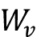
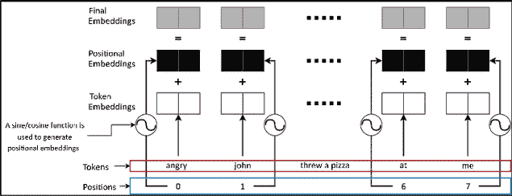

# 第十章：Transformer

Transformer 模型改变了大多数涉及顺序数据的机器学习问题的游戏规则。与之前的 RNN 基模型相比，它们显著提高了技术水平。Transformer 模型之所以如此高效的一个主要原因是，它能够访问整个序列（例如，令牌序列），而不像 RNN 基模型那样一次只查看一个元素。Transformer 这一术语在我们的讨论中多次出现，它是一种超越其他顺序模型（如 LSTM 和 GRU）的方法。现在，我们将深入了解 Transformer 模型。

本章中，我们将首先详细学习 Transformer 模型。然后，我们将讨论 Transformer 家族中的一个特定模型，称为 **双向编码器表示模型（BERT）**。我们将了解如何使用该模型来完成问答任务。

具体来说，我们将涵盖以下主要内容：

+   Transformer 架构

+   理解 BERT

+   用例：使用 BERT 回答问题

# Transformer 架构

Transformer 是一种 Seq2Seq 模型（在上一章中讨论过）。Transformer 模型可以处理图像和文本数据。Transformer 模型接受一系列输入并将其映射到一系列输出。

Transformer 模型最初在 Vaswani 等人提出的论文 *Attention is all you need* 中提出（[`arxiv.org/pdf/1706.03762.pdf`](https://arxiv.org/pdf/1706.03762.pdf)）。与 Seq2Seq 模型类似，Transformer 包含一个编码器和一个解码器（*图 10.1*）：


图 10.1：编码器-解码器架构

让我们通过之前学习过的机器翻译任务来理解 Transformer 模型是如何工作的。编码器接受一系列源语言的令牌并生成一系列中间输出。然后，解码器接受一系列目标语言的令牌并预测每个时间步的下一个令牌（教师强迫技术）。编码器和解码器都使用注意力机制来提高性能。例如，解码器使用注意力机制检查所有过去的编码器状态和先前的解码器输入。该注意力机制在概念上类似于我们在上一章中讨论过的 Bahdanau 注意力。

## 编码器和解码器

现在让我们详细讨论编码器和解码器的组成部分。它们的架构大致相同，但也有一些差异。编码器和解码器都被设计为一次性处理一个输入序列。但它们在任务中的目标不同；编码器使用输入生成潜在表示，而解码器则使用输入和编码器的输出生成目标输出。为了执行这些计算，这些输入会通过多个堆叠的层进行传播。每一层都接收一个元素序列并输出另一个元素序列。每一层也由几个子层组成，这些子层对输入的令牌序列执行不同的计算，从而生成输出序列。

Transformer 中的一个层主要由以下两个子层组成：

+   一个自注意力层

+   全连接层

自注意力层通过矩阵乘法和激活函数生成输出（这与我们稍后将讨论的全连接层类似）。自注意力层接收一系列输入并生成一系列输出。然而，自注意力层的一个特殊特点是，在每个时间步生成输出时，它可以访问该序列中的所有其他输入(**图 10.2*）。这使得该层能够轻松学习和记住长序列的输入。相比之下，RNN 在记住长序列输入时会遇到困难，因为它们需要依次处理每个输入。此外，按设计，自注意力层可以根据所解决的任务，在每个时间步选择并组合不同的输入。这使得 Transformer 在序列学习任务中非常强大。*

*让我们讨论一下为什么以这种方式选择性地组合不同的输入元素很重要。在 NLP 领域，自注意力层使得模型在处理某个词时能够“窥视”其他词。这意味着，当编码器在处理句子 *I kicked the ball and it disappeared* 中的词 *it* 时，模型可以关注词 *ball*。通过这种方式，Transformer 能够学习依赖关系并消除歧义，从而提升语言理解能力。

我们甚至可以通过一个现实世界的例子理解自注意力如何帮助我们方便地解决任务。假设你正在和另外两个人玩一个游戏：A 人和 B 人。A 人手里有一个写在板子上的问题，而你需要回答这个问题。假设 A 人每次揭示一个问题的单词，在问题的最后一个单词揭示出来后，你才回答它。对于长且复杂的问题，这会变得具有挑战性，因为你无法在物理上看到完整的问题，必须依赖记忆。这就是没有自注意力的 Transformer 执行计算时的感觉。另一方面，假设 B 人一次性将完整的问题揭示在板子上，而不是一个个字地揭示。现在，你可以一次性看到完整的问题，因此回答问题变得容易得多。如果问题很复杂，需要复杂的答案，你可以在给出不同部分的答案时查看问题的不同部分。这就是自注意力层的作用。

自注意力层后跟一个全连接层。全连接层将所有输入节点与所有输出节点连接，通常后面跟着一个非线性激活函数。它将自注意力子层产生的输出元素作为输入，生成每个输出元素的隐藏表示。与自注意力层不同，全连接层独立地处理每个序列项，按逐元素的方式进行计算。

它们在使模型更深的同时引入了非线性变换，从而使模型能够更好地执行任务：


图 10.2：自注意力子层与全连接子层的区别。自注意力子层查看序列中的所有输入，而全连接子层只查看正在处理的输入。

现在我们理解了 Transformer 层的基本构建块，接下来我们将分别看看编码器和解码器。在深入之前，我们先建立一些基础知识。编码器接收一个输入序列，解码器也接收一个输入序列（与编码器输入的序列不同）。然后解码器产生一个输出序列。我们将这些序列中的每个单项称为 *token*。

编码器由一堆层组成，每一层由两个子层构成：

+   自注意力层 – 为序列中的每个编码器输入标记生成潜在表示。对于每个输入标记，该层查看整个序列并选择序列中的其他标记，丰富该标记的隐藏输出（即“注意到的”表示）的语义。

+   全连接层 – 生成注意到的表示的逐元素更深隐藏表示。

解码器层由三个子层组成：

+   掩蔽自注意力层 – 对于每个解码器输入，一个令牌会查看它左侧的所有令牌。解码器需要掩蔽右侧的词语，以防止模型看到未来的词语。在预测过程中，如果能够访问到后续的词语，解码器的预测任务可能会变得非常简单。

+   注意力层 – 对于解码器中的每个输入令牌，它会查看编码器的输出和解码器的掩蔽关注输出，以生成语义丰富的隐藏输出。由于该层不仅关注解码器输入，我们将其称为注意力层。

+   全连接层 – 生成解码器关注表示的逐元素隐藏表示。

如*图 10.3*所示：


图 10.3：Transformer 模型如何用于将英文句子翻译成法语。该图展示了编码器和解码器中的各个层，以及编码器内部、解码器内部和编码器与解码器之间的各种连接。方框表示模型的输入和输出。矩形阴影框表示子层的临时输出。`<sos>`符号表示解码器输入的开始。

接下来，让我们学习自注意力层的计算机制。

## 计算自注意力层的输出

毫无疑问，自注意力层是 Transformer 的核心。支配自注意力机制的计算可能比较难以理解。因此，本节将详细解释自注意力技术。要理解的三个关键概念是：查询、键和值。查询和键用于生成亲和力矩阵。对于解码器的注意力层，亲和力矩阵中的位置 *i,j* 表示编码器状态（键）*i* 与解码器输入（查询）*j* 之间的相似度。接着，我们为每个位置创建一个加权平均的编码器状态（值），权重由亲和力矩阵给出。

为了加深我们的理解，让我们假设一个情境，解码器正在生成自注意力输出。假设我们有一个英法机器翻译任务。以句子*Dogs are great*为例，翻译成法语就是*Les chiens sont super*。假设我们处在第 2 时间步，尝试生成单词*chiens*。我们将每个单词用一个浮动点数表示（例如，简化版的单词嵌入表示）：

*Dogs -> 0.8*

*are -> 0.3*

*great -> -0.2*

*chiens -> 0.5*

现在让我们计算亲和力矩阵（具体来说，是亲和力向量，因为我们只考虑单个解码器输入）。查询值为 0.5，键（即编码器状态序列）为`[0.8, 0.3, -0.2]`。如果我们进行点积运算，结果为：

`[0.4, 0.15, -0.1]`

让我们理解一下这个亲和矩阵所表达的含义。相对于单词*chiens*，单词*Dogs*具有最高的相似度，单词*are*也有较高的相似度（因为*chiens*是复数，指代的是英文中的*are*）。然而，单词*great*与单词*chiens*的相似度是负值。然后，我们可以计算该时间步的最终注意力输出，计算方式如下：

`[0.4 * 0.8, 0.15 * 0.3, -0.1 * -0.2] = [0.32 + 0.45 + 0.02] = 0.385`

我们最终得到的输出位于英语单词匹配的一部分，其中单词*great*的距离最大。这个例子展示了查询、键和值是如何发挥作用的，以计算最终的注意力输出。

现在，让我们来看一下实际在该层中发生的计算。为了计算查询、键和值，我们使用权重矩阵对实际输入进行线性投影。三个权重矩阵是：

+   查询权重矩阵 ()

+   键权重矩阵 ()

+   值权重矩阵 ()

每个权重矩阵通过与权重矩阵相乘，为给定输入序列中某个位置的标记（位置 ）产生三个输出，计算方式如下：

, , 和 

*Q*，*K*，和*V*是大小为*[B, T, d]*的张量，其中*B*是批量大小，*T*是时间步数，*d*是一个超参数，用于定义潜在表示的维度。这些张量随后用于计算亲和矩阵，计算方式如下：


图 10.4：自注意力层中的计算过程。自注意力层从输入序列开始，计算查询、键和值向量序列。然后，将查询和键转换为概率矩阵，该矩阵用于计算值的加权和。

亲和矩阵*P*的计算方式如下：


然后，计算自注意力层的最终注意力输出，计算方式如下：


在这里，*Q*表示查询张量，*K*表示键张量，*V*表示值张量。这就是 Transformer 模型如此强大的原因；与 LSTM 模型不同，Transformer 模型将序列中的所有标记聚合成一个矩阵乘法，使这些模型具有很高的并行性。*图 10.4*还展示了自注意力层内发生的计算过程。

## Transformer 中的嵌入层

词嵌入提供了一种语义保留的词语表示，基于词语使用的上下文。换句话说，如果两个词语在相同的上下文中使用，它们将具有相似的词向量。例如，*cat*和*dog*将具有相似的表示，而*cat*和*volcano*将具有截然不同的表示。

词向量最早在 Mikolov 等人发表的论文*Efficient Estimation of Word Representations in Vector Space*中被提出（[`arxiv.org/pdf/1301.3781.pdf`](https://arxiv.org/pdf/1301.3781.pdf)）。它有两种变体：skip-gram 和连续词袋（CBOW）。嵌入通过首先定义一个大小为*V* x *E*的大矩阵来工作，其中*V*是词汇表的大小，*E*是嵌入的大小。*E*是用户定义的超参数；较大的*E*通常会导致更强大的词嵌入。实际上，你不需要将嵌入的大小增大到超过 300。

受原始词向量算法的启发，现代深度学习模型使用嵌入层来表示词语/标记。以下通用方法（以及后续的预训练以微调这些嵌入）用于将词嵌入整合到机器学习模型中：

+   定义一个随机初始化的词嵌入矩阵（或预训练的嵌入，可以免费下载）

+   定义使用词嵌入作为输入并产生输出的模型（例如情感分析或语言翻译）

+   对整个模型（嵌入和模型）进行端到端训练，完成任务

在 Transformer 模型中使用相同的技术。然而，在 Transformer 模型中，有两种不同的嵌入：

+   标记嵌入（为模型在输入序列中看到的每个标记提供唯一表示）

+   位置嵌入（为输入序列中的每个位置提供唯一表示）

标记嵌入为每个标记（如字符、词语和子词）提供一个唯一的嵌入向量，这取决于模型的标记化机制

位置嵌入用于指示模型一个标记出现的位置。位置嵌入的主要作用是告诉 Transformer 模型一个词语出现的位置。这是因为，与 LSTM/GRU 不同，Transformer 模型没有序列的概念，它一次性处理整个文本。此外，改变词语的位置可能会改变句子的含义/词义。例如：

*Ralph loves his tennis ball.* **It** *likes to chase the ball*

*Ralph loves his tennis ball. Ralph likes to chase* **it**

在上述句子中，*it*一词指代不同的事物，*it*的位置可以作为线索来识别这种差异。原始的 Transformer 论文使用以下方程来生成位置嵌入：


其中，*pos* 表示序列中的位置， 表示  特征维度（）。偶数编号的特征使用正弦函数，奇数编号的特征使用余弦函数。*图 10.5* 展示了随着时间步和特征位置的变化，位置嵌入是如何变化的。可以看到，特征位置索引较高的位置具有较低频率的正弦波。尚不完全清楚作者是如何得出该精确方程的。

然而，他们确实提到，尽管使用上述方程与在训练过程中让模型联合学习位置嵌入之间没有明显的性能差异。


图 10.5：随着时间步和特征位置的变化，位置嵌入是如何变化的。偶数编号的特征位置使用正弦函数，奇数编号的位置使用余弦函数。此外，随着特征位置的增加，信号的频率降低。

需要注意的是，token 嵌入和位置嵌入将具有相同的维度 ，这使得逐元素相加成为可能。最后，作为模型的输入，token 嵌入和位置嵌入相加，形成一个单一的混合嵌入向量（*图 10.6*）：



图 10.6：Transformer 模型中生成的嵌入以及最终嵌入是如何计算的

现在让我们讨论 Transformer 中每一层使用的两种优化技术：残差连接和层归一化。

## 残差与归一化

Transformer 模型的另一个重要特性是，模型中各层之间存在残差连接和归一化层。

残差连接通过将给定层的输出加到一个或多个前面层的输出上形成。这反过来通过模型形成快捷连接，并通过减少梯度消失现象的发生来提供更强的梯度流（*图 10.7*）。梯度消失问题导致最接近输入层的梯度非常小，从而妨碍了这些层的训练。残差连接在深度学习模型中的应用，由 Kaiming He 等人在论文“*Deep Residual Learning for Image Recognition*”中推广（[`arxiv.org/pdf/1512.03385.pdf`](https://arxiv.org/pdf/1512.03385.pdf)）


图 10.7：残差连接的工作原理

在 Transformer 模型中，每一层的残差连接是通过以下方式创建的：

+   进入自注意力子层的输入会加到自注意力子层的输出上。

+   进入全连接子层的输入会加到全连接子层的输出上。

接下来，经过残差连接强化的输出通过一个层归一化层。层归一化类似于批量归一化，它是一种减少神经网络中协变量偏移的方法，使得神经网络能够更快地训练并取得更好的性能。协变量偏移是指神经网络激活值的分布变化（由于数据分布变化引起的），这种变化会在模型训练过程中发生。这些分布的变化破坏了训练过程中的一致性，并对模型产生负面影响。该方法在 Ba 等人发表的论文*Layer Normalization*中被提出([`arxiv.org/pdf/1607.06450.pdf`](https://arxiv.org/pdf/1607.06450.pdf))。

批量归一化通过计算激活值的均值和方差，并以批次样本的平均值为基础，从而使其性能依赖于训练模型时使用的迷你批次。

然而，层归一化以一种方式计算激活值的均值和方差（即归一化项），使得每个隐藏单元的归一化项相同。换句话说，层归一化对层中的所有隐藏单元有一个共同的均值和方差值。这与批量归一化形成对比，后者为每个隐藏单元维持单独的均值和方差值。此外，不同于批量归一化，层归一化不会对批次中的样本求均值；相反，它跳过了平均值计算，并为不同的输入提供不同的归一化项。通过为每个样本单独计算均值和方差，层归一化摆脱了对迷你批次大小的依赖。如需了解该方法的更多细节，请参阅 Ba 等人发表的原始论文。

TensorFlow 在[`www.tensorflow.org/api_docs/python/tf/keras/layers/LayerNormalization`](https://www.tensorflow.org/api_docs/python/tf/keras/layers/LayerNormalization)提供了方便的层归一化算法实现。你可以简单地在使用 TensorFlow Keras API 定义的任何模型中使用该层。

*图 10.8* 展示了残差连接和层归一化如何在 Transformer 模型中使用：


图 10.8：残差连接和层归一化层在 Transformer 模型中的使用方式

至此，我们结束了对 Transformer 模型组件的讨论。我们已经讨论了 Transformer 模型的所有关键组件。Transformer 模型是一个基于编码器-解码器的模型。编码器和解码器具有相同的结构，除了少数几个小差异。Transformer 使用自注意力机制，这是一种强大的并行化注意力机制，用于在每个时间步骤关注其他输入。Transformer 还使用多个嵌入层，例如词汇嵌入和位置嵌入，以注入有关词汇和其位置的信息。Transformer 还使用残差连接和层归一化，以提高模型的性能。

接下来，我们将讨论一个特定的 Transformer 模型，称为 BERT，我们将使用它来解决一个问答问题。

# 理解 BERT

**BERT**（**来自 Transformer 的双向编码器表示**）是近年来众多 Transformer 模型中的一个。

BERT 在 Delvin 等人发表的论文 *BERT: Pre-training of Deep Bidirectional Transformers for Language Understanding* 中提出（[`arxiv.org/pdf/1810.04805.pdf`](https://arxiv.org/pdf/1810.04805.pdf)）。Transformer 模型分为两大类：

+   基于编码器的模型

+   基于解码器（自回归）模型

换句话说，与使用 Transformer 的编码器和解码器相比，Transformer 的编码器或解码器部分为这些模型提供了基础。两者之间的主要区别在于注意力机制的使用方式。基于编码器的模型使用双向注意力，而基于解码器的模型使用自回归（即从左到右）注意力。

BERT 是一个基于编码器的 Transformer 模型。它接收一个输入序列（一组标记）并生成一个编码的输出序列。*图 10.9* 描述了 BERT 的高层次架构：


图 10.9：BERT 的高层次架构。它接收一组输入标记并生成通过多个隐藏层生成的隐藏表示序列。

现在，让我们讨论一些与 BERT 相关的细节，比如 BERT 消耗的输入和它设计用来解决的任务。

## BERT 的输入处理

当 BERT 接收输入时，它会在输入中插入一些特殊的标记。首先，在开头，它插入一个 `[CLS]`（分类的缩写）标记，用于生成某些任务（如序列分类）的最终隐藏表示。它代表在处理序列中所有标记后的输出。接下来，根据输入类型，它还会插入一个 `[SEP]`（意为“分隔”）标记。`[SEP]` 标记用于标记输入中不同序列的开始和结束。例如，在问答中，模型将问题和可能包含答案的上下文（如段落）作为输入，`[SEP]` 用于问题和上下文之间。此外，还有 `[PAD]` 标记，可用于将短序列填充至所需长度。

`[CLS]` 标记会附加到输入的每个序列中，表示输入的开始。它也是输入到 BERT 上层分类头的基础，用于解决您的 NLP 任务。如您所知，BERT 会为序列中的每个输入标记生成隐藏表示。根据惯例，`[CLS]` 标记对应的隐藏表示将作为输入，传递给位于 BERT 之上的分类模型。

接下来，使用三种不同的嵌入空间生成最终的令牌嵌入。每个词汇表中的令牌都有一个独特的向量表示。位置嵌入编码了每个令牌的位置，如前所述。最后，段落嵌入为输入中的每个子组件提供了一个独特的表示，当输入由多个组件组成时。例如，在问答任务中，问题将拥有一个独特的向量作为其段落嵌入向量，而上下文将具有不同的嵌入向量。这是通过为输入序列中的不同组件提供嵌入向量来实现的。根据输入中每个令牌指定的组件索引，检索相应的段落嵌入向量。需要提前指定。

## BERT 解决的任务

BERT 解决的特定任务可以分为四个不同的类别。这些类别受 **通用语言理解评估** (**GLUE**) 基准任务套件的启发（[`gluebenchmark.com`](https://gluebenchmark.com)）：

+   序列分类 – 在这里，给定一个输入序列，模型被要求为整个序列预测一个标签（例如，情感分析或垃圾邮件识别）。

+   令牌分类 – 在这里，给定一个输入序列，模型被要求为序列中的每个令牌预测一个标签（例如，命名实体识别或词性标注）。

+   问答任务 – 在这里，输入由两个序列组成：一个问题和一个上下文。问题和上下文由一个 `[SEP]` 令牌分隔。模型被训练以预测答案所属的令牌跨度的起始和结束索引。

+   多项选择 – 在这里，输入由多个序列组成；一个问题后面跟着多个候选答案，这些候选答案可能是也可能不是问题的答案。这些多个序列由令牌 `[SEP]` 分隔，并作为一个单一的输入序列提供给模型。模型被训练以预测该问题的正确答案（即，类别标签）。

*图 10.10* 描述了 BERT 如何用于解决这些不同的任务：


图 10.10：BERT 如何用于不同的 NLP 任务

BERT 的设计使其能够在不修改基础模型的情况下完成这些任务。

在涉及多个序列的任务中（例如多项选择题），你需要模型区分属于不同段落的不同输入（即，在问答任务中，哪些令牌是问题，哪些令牌是上下文）。为了做出这个区分，使用了 `[SEP]` 令牌。一个 `[SEP]` 令牌插入在不同序列之间。例如，如果你正在解决一个问答问题，输入可能如下所示：

*问题：球的颜色是什么？*

*段落：Tippy 是一只狗。她喜欢玩她的红色球。*

然后输入到 BERT 的内容可能如下所示：

`[CLS]` *球的颜色是什么* `[SEP]` *Tippy 是一只狗，她喜欢玩她的红色球* `[SEP]`

现在我们已经讨论了 BERT 的所有元素，因此我们可以成功地使用它来解决下游的 NLP 任务，接下来让我们重述关于 BERT 的关键点：

+   BERT 是一个基于编码器的 Transformer

+   BERT 对输入序列中的每个标记输出一个隐藏表示

+   BERT 有三个嵌入空间：标记嵌入、位置嵌入和片段嵌入

+   BERT 使用特殊的标记 `[CLS]` 来表示输入的开始，并作为下游分类模型的输入

+   BERT 被设计用来解决四种类型的 NLP 任务：序列分类、标记分类、自由文本问答和多项选择问答

+   BERT 使用特殊的标记 `[SEP]` 来分隔序列 A 和序列 B

BERT 的强大不仅体现在其结构上。BERT 在一个庞大的文本语料库上进行预训练，使用几种不同的预训练技术。换句话说，BERT 已经具备了对语言的扎实理解，这使得下游的自然语言处理任务更容易解决。接下来，让我们讨论 BERT 是如何进行预训练的。

## BERT 是如何进行预训练的

BERT 的真正价值在于它已经在一个庞大的数据语料库上进行了自监督的预训练。在预训练阶段，BERT 被训练于两个不同的任务：

+   **掩码语言建模**（有时缩写为 **MLM**）

+   **下一个句子预测**（有时缩写为 **NSP**）

现在让我们讨论上述两个任务的细节，以及它们是如何为 BERT 提供语言理解的。

### 掩码语言建模（MLM）

MLM 任务的灵感来源于 Cloze 任务或 Cloze 测试，学生会得到一个句子，其中有一个或多个空白，需要填充这些空白。同样地，给定一个文本语料库，句子中的词被掩码，然后模型需要预测这些被掩码的标记。例如，句子：

*我去面包店买面包*

可能变成：

*我去* `[MASK]` *买面包*

BERT 使用特殊的标记 `[MASK]` 来表示被掩码的词。然后，模型的目标词将是 *bakery*（面包店）。但是，这为模型引入了一个实际问题。特殊的 `[MASK]` 标记在实际文本中并不会出现。这意味着模型在微调阶段（即在分类问题上训练时）看到的文本与预训练时看到的文本会有所不同。这有时被称为 **预训练-微调不一致**。因此，BERT 的作者提出了以下方法来应对这个问题。当掩码一个词时，执行以下操作之一：

+   按照原样使用 `[MASK]` 标记（80% 的概率）

+   使用一个随机词（10% 的概率）

+   使用真实的词（10% 的概率）

换句话说，模型在某些情况下会看到实际的单词，而不总是看到 `[MASK]`，从而缓解了这种差异。

### 下一句预测（NSP）

在 NSP 任务中，模型会接收到一对句子 A 和 B（按此顺序），并被要求预测 B 是否是 A 后面的下一句。这可以通过在 BERT 上拟合一个二分类器并对选定的句子对进行端到端训练来实现。

生成句子对作为模型的输入并不难，可以以无监督的方式进行：

+   通过选择相邻的两句话，生成一个标签为 TRUE 的样本。

+   通过随机选择两句不相邻的句子，生成一个标签为 FALSE 的样本。

按照这种方法，我们生成一个用于下一个句子预测任务的标注数据集。然后，BERT 和二分类器一起，使用该标注数据集进行端到端的训练，以解决下游任务。为了看到这一过程的实际应用，我们将使用 Hugging Face 的 `transformers` 库。

# 使用场景：使用 BERT 回答问题。

现在让我们学习如何实现 BERT，在一个问答数据集上训练它，并让模型回答给定的问题。

## Hugging Face `transformers` 库简介

我们将使用由 Hugging Face 构建的 `transformers` 库。`transformers` 库是一个高层次的 API，建立在 TensorFlow、PyTorch 和 JAX 之上。它提供了便捷的访问预训练 Transformer 模型的方式，这些模型可以轻松下载并进行微调。你可以在 Hugging Face 的模型注册表中找到模型，网址为 [`huggingface.co/models`](https://huggingface.co/models)。你可以按任务筛选模型，查看底层的深度学习框架等。

`transformers` 库的设计目的是提供一个非常低的入门门槛，使用复杂的 Transformer 模型。因此，使用该库时你只需要学习少数几个概念，就能快速上手。成功加载和使用模型需要三类重要的类：

+   模型类（如 `TFBertModel`）– 包含模型的训练权重，形式为 `tf.keras.models.Model` 或 PyTorch 等效类。

+   配置（如 `BertConfig`）– 存储加载模型所需的各种参数和超参数。如果你直接使用预训练模型，则不需要显式定义其配置。

+   Tokenizer（如 `BertTokenizerFast`）– 包含模型所需的词汇和词到 ID 的映射，用于对文本进行分词。

所有这些类都可以通过两个简单的函数来使用：

+   `from_pretrained()` – 提供一种从模型库或本地实例化模型/配置/分词器的方法。

+   `save_pretrained()` – 提供一种保存模型/配置/分词器的方法，以便以后重新加载。

TensorFlow 在 TensorFlow Hub（[`tfhub.dev/`](https://tfhub.dev/)）托管了多种 Transformer 模型（由 TensorFlow 和第三方发布）。如果你想了解如何使用 TensorFlow Hub 和原始 TensorFlow API 实现像 BERT 这样的模型，请访问 [`www.tensorflow.org/text/tutorials/classify_text_with_bert`](https://www.tensorflow.org/text/tutorials/classify_text_with_bert)。

我们很快就会看到这些类和函数如何在实际用例中使用。同样，重要的是要注意，尽管使用模型的界面非常简单易懂，但这也带来了一些副作用。由于它专门用于提供一种使用 TensorFlow、PyTorch 或 Jax 构建的 Transformer 模型的方法，你在使用时无法享受 TensorFlow 等框架所提供的模块化或灵活性。换句话说，你不能像使用 TensorFlow 构建 `tf.keras.models.Model`，并使用 `tf.keras.layers.Layer` 对象那样使用 `transformers` 库。

## 探索数据

我们将用于此任务的数据集是一个流行的问答数据集，名为 SQUAD。每个数据点由四个部分组成：

+   一个问题

+   可能包含问题答案的上下文

+   答案的起始索引

+   答案

我们可以使用 Hugging Face 的 `datasets` 库下载数据集，并通过传入 `"squad"` 参数来调用 `load_dataset()` 函数：

```py
from datasets import load_dataset
dataset = load_dataset("squad") 
```

现在让我们使用以下方法打印一些示例：

```py
for q, a in zip(dataset["train"]["question"][:5], dataset["train"]["answers"][:5]):
    print(f"{q} -> {a}") 
```

它将输出：

```py
To whom did the Virgin Mary allegedly appear in 1858 in Lourdes France? -> {'text': ['Saint Bernadette Soubirous'], 'answer_start': [515]}
What is in front of the Notre Dame Main Building? -> {'text': ['a copper statue of Christ'], 'answer_start': [188]}
The Basilica of the Sacred heart at Notre Dame is beside to which structure? -> {'text': ['the Main Building'], 'answer_start': [279]}
What is the Grotto at Notre Dame? -> {'text': ['a Marian place of prayer and reflection'], 'answer_start': [381]}
What sits on top of the Main Building at Notre Dame? -> {'text': ['a golden statue of the Virgin Mary'], 'answer_start': [92]} 
```

在这里，`answer_start` 表示答案在提供的上下文中开始的字符索引。通过对数据集中可用内容的充分理解，我们将执行一个简单的处理步骤。在训练模型时，我们将要求模型预测答案的起始和结束索引。在其原始形式中，仅存在 `answer_start`。我们需要手动将 `answer_end` 添加到数据集中。以下函数实现了这一功能。此外，它还对数据集进行了几个检查：

```py
def compute_end_index(answers, contexts):
    """ Add end index to answers """

    fixed_answers = []
    for answer, context in zip(answers, contexts):
        gold_text = answer['text'][0]
        answer['text'] = gold_text
        start_idx = answer['answer_start'][0]
        answer['answer_start'] = start_idx

        # Make sure the starting index is valid and there is an answer
        assert start_idx >=0 and len(gold_text.strip()) > 0:

        end_idx = start_idx + len(gold_text)        
        answer['answer_end'] = end_idx

        # Make sure the corresponding context matches the actual answer
        assert context[start_idx:end_idx] == gold_text

        fixed_answers.append(answer)

    return fixed_answers, contexts
train_questions = dataset["train"]["question"]
print("Training data corrections")
train_answers, train_contexts = compute_end_index(
    dataset["train"]["answers"], dataset["train"]["context"]
)
test_questions = dataset["validation"]["question"]
print("\nValidation data correction")
test_answers, test_contexts = compute_end_index(
    dataset["validation"]["answers"], dataset["validation"]["context"]
) 
```

接下来，我们将从 Hugging Face 仓库下载一个预训练的 BERT 模型，并深入了解该模型。

## 实现 BERT

要使用 Hugging Face 仓库中的预训练 Transformer 模型，我们需要三个组件：

+   `Tokenizer` – 负责将长文本（例如句子）拆分成更小的标记

+   `config` – 包含模型的配置

+   `Model` – 接收标记，查找嵌入，并使用提供的输入生成最终输出

我们可以忽略 `config`，因为我们将直接使用预训练模型。但是，为了完整展示，我们还是会使用配置。

### 实现和使用 Tokenizer

首先，我们将查看如何下载 Tokenizer。你可以使用 `transformers` 库下载 Tokenizer。只需调用 `PreTrainedTokenizerFast` 基类提供的 `from_pretrained()` 函数：

```py
from transformers import BertTokenizerFast
tokenizer = BertTokenizerFast.from_pretrained('bert-base-uncased') 
```

我们将使用名为 `bert-base-uncased` 的分词器。它是为 BERT 基础模型开发的分词器，并且是不区分大小写的（即不区分大写字母和小写字母）。接下来，让我们看看分词器的实际应用：

```py
context = "This is the context"
question = "This is the question"
token_ids = tokenizer(
    text=context, text_pair=question,
padding=False, return_tensors='tf'
)
print(token_ids) 
```

让我们来理解一下我们传递给分词器的参数：

+   `text` – 单个或一批文本序列，供分词器进行编码。每个文本序列都是一个字符串。

+   `text_pair` – 一个可选的单个或一批文本序列，供分词器进行编码。在模型接受多部分输入的情况下（例如，在问答任务中，包含问题和上下文），它非常有用。

+   `padding` – 表示填充策略。如果设置为 `True`，则将填充到数据集中的最大序列长度。如果设置为 `max_length`，则将填充到由 `max_length` 参数指定的长度。如果设置为 `False`，则不进行填充。

+   `return_tensors` – 定义返回张量类型的参数。它可以是 `pt`（PyTorch）或 `tf`（TensorFlow）。由于我们需要使用 TensorFlow 张量，因此将其定义为 `'tf'`。

这将输出：

```py
{
    'input_ids': <tf.Tensor: shape=(1, 11), dtype=int32, numpy=array([[ 101, 2023, 2003, 1996, 6123,  102, 2023, 2003, 1996, 3160,  102]])>, 
    'token_type_ids': <tf.Tensor: shape=(1, 11), dtype=int32, numpy=array([[0, 0, 0, 0, 0, 0, 1, 1, 1, 1, 1]])>, 
    'attention_mask': <tf.Tensor: shape=(1, 11), dtype=int32, numpy=array([[1, 1, 1, 1, 1, 1, 1, 1, 1, 1, 1]])>
} 
```

这将输出一个 `transformers.tokenization_utils_base.BatchEncoding` 对象，它本质上是一个字典。它包含三个键，每个键对应一个张量值：

+   `input_ids` – 提供文本序列中标记的 ID。此外，它会在序列开头插入 `[CLS]` 标记的 ID，并在问题与上下文之间以及序列末尾插入两个 `[SEP]` 标记的 ID。

+   `token_type_ids` – 用于段落嵌入的段落 ID。

+   `attention_mask` – 注意力掩码表示在前向传播过程中可以被注意到的词。由于 BERT 是一个编码器模型，任何标记都可以关注任何其他标记。唯一的例外是填充的标记，它们会在注意力机制中被忽略。

我们还可以将这些标记 ID 转换为实际的标记，以了解它们代表什么。为此，我们使用 `convert_ids_to_tokens()` 函数：

```py
print(tokenizer.convert_ids_to_tokens(token_ids['input_ids'].numpy()[0])) 
```

这将打印：

```py
['[CLS]', 'this', 'is', 'the', 'context', '[SEP]', 'this', 'is', 'the', 'question', '[SEP]'] 
```

你可以看到分词器如何将特殊标记如 `[CLS]` 和 `[SEP]` 插入到文本序列中。在理解了分词器的功能后，接下来让我们使用它来编码训练集和测试集：

```py
# Encode train data
train_encodings = tokenizer(train_contexts, train_questions, truncation=True, padding=True, return_tensors='tf')
# Encode test data
test_encodings = tokenizer(test_contexts, test_questions, truncation=True, padding=True, return_tensors='tf') 
```

你可以通过运行以下命令来检查训练编码的大小：

```py
print("train_encodings.shape: {}".format(train_encodings["input_ids"].shape)) 
```

这将输出：

```py
train_encodings.shape: (87599, 512) 
```

我们数据集中的最大序列长度为 512。因此，我们看到序列的最大长度为 512。一旦我们将数据进行分词，我们还需要进行一步数据处理。我们的 `answer_start` 和 `answer_end` 索引是基于字符的。然而，由于我们处理的是标记，我们需要将基于字符的索引转换为基于标记的索引。我们将为此定义一个函数：

```py
def replace_char_with_token_indices(encodings, answers):
    start_positions = []
    end_positions = []
    n_updates = 0
    # Go through all the answers
    for i in range(len(answers)):
        # Get the token position for both start end char positions
        start_positions.append(encodings.char_to_token(i, 
        answers[i]['answer_start']))
        end_positions.append(encodings.char_to_token(i, 
        answers[i]['answer_end'] - 1))

        if start_positions[-1] is None or end_positions[-1] is None:
            n_updates += 1
        # if start position is None, the answer passage has been truncated
        # In the guide, https://huggingface.co/transformers/custom_
        # datasets.html#qa-squad they set it to model_max_length, but
        # this will result in NaN losses as the last available label is
        # model_max_length-1 (zero-indexed)
        if start_positions[-1] is None:
            start_positions[-1] = tokenizer.model_max_length -1

        if end_positions[-1] is None:
            end_positions[-1] = tokenizer.model_max_length -1

    print("{}/{} had answers truncated".format(n_updates, 
    len(answers)))
    encodings.update({'start_positions': start_positions, 
    'end_positions': end_positions}) 
```

该函数接收由分词器生成的一组`BatchEncodings`（称为`encodings`）和一组答案（字典列表）。然后，它通过两个新键`start_positions`和`end_positions`更新提供的编码。这两个键分别保存表示答案开始和结束的基于 token 的索引。如果没有找到答案，我们将开始和结束索引设置为最后一个 token。为了将现有的基于字符的索引转换为基于 token 的索引，我们使用一个名为`char_to_token()`的函数，该函数由`BatchEncodings`类提供。它以字符索引为输入，输出相应的 token 索引。定义好该函数后，让我们在训练和测试数据上调用它：

```py
replace_char_with_token_indices(train_encodings, train_answers)
replace_char_with_token_indices(test_encodings, test_answers) 
```

使用清理后的数据，我们现在将定义一个 TensorFlow 数据集。请注意，此函数会原地修改编码。

### 定义 TensorFlow 数据集

接下来，我们实现一个 TensorFlow 数据集，以生成模型所需的数据。我们的数据将包含两个元组：一个包含输入，另一个包含目标。输入元组包含：

+   输入 token ID – 一批填充的 token ID，大小为`[batch size, sequence length]`

+   注意力掩码 – 一批注意力掩码，大小为`[batch size, sequence length]`

输出元组包含：

+   答案的起始索引 – 一批答案的起始索引

+   答案的结束索引 – 一批答案的结束索引

我们将首先定义一个生成器，生成这种格式的数据：

```py
def data_gen(input_ids, attention_mask, start_positions, end_positions):
    """ Generator for data """
    for inps, attn, start_pos, end_pos in zip(input_ids, 
    attention_mask, start_positions, end_positions):
        yield (inps, attn), (start_pos, end_pos) 
```

由于我们已经处理了数据，因此只需重新组织已有的数据即可使用上面的代码返回结果。

接下来，我们将定义一个部分函数，可以在不传递任何参数的情况下直接调用：

```py
# Define the generator as a callable
train_data_gen = partial(data_gen,
    input_ids=train_encodings['input_ids'], attention_mask=train_
    encodings['attention_mask'],
    start_positions=train_encodings['start_positions'],
    end_positions=train_encodings['end_positions']
) 
```

然后，将此函数传递给`tf.data.Dataset.from_generator()`函数：

```py
# Define the dataset
train_dataset = tf.data.Dataset.from_generator(
    train_data_gen, output_types=(('int32', 'int32'), ('int32', 'int32'))
) 
```

然后，我们将训练数据集中的数据打乱。在打乱 TensorFlow 数据集时，我们需要提供缓冲区大小。缓冲区大小定义了用于打乱的样本数量。这里我们将其设置为 1,000 个样本：

```py
# Shuffling the data
train_dataset = train_dataset.shuffle(1000)
print('\tDone') 
```

接下来，我们将数据集分为两部分：训练集和验证集。我们将使用前 10,000 个样本作为验证集，其余的数据作为训练集。两个数据集都将使用批量大小为 4 的批处理：

```py
# Valid set is taken as the first 10000 samples in the shuffled set
valid_dataset = train_dataset.take(10000)
valid_dataset = valid_dataset.batch(4)
# Rest is kept as the training data
train_dataset = train_dataset.skip(10000)
train_dataset = train_dataset.batch(4) 
```

最后，我们按照相同的过程创建测试数据集：

```py
# Creating test data
print("Creating test data")
# Define the generator as a callable
test_data_gen = partial(data_gen,
    input_ids=test_encodings['input_ids'], 
    attention_mask=test_encodings['attention_mask'],
    start_positions=test_encodings['start_positions'], 
    end_positions=test_encodings['end_positions']
)
test_dataset = tf.data.Dataset.from_generator(
    test_data_gen, output_types=(('int32', 'int32'), ('int32', 
    'int32'))
)
test_dataset = test_dataset.batch(8) 
```

现在，让我们看看 BERT 的架构如何用于回答问题。

### 用于回答问题的 BERT

在预训练的 BERT 模型基础上，为了使其适应问答任务，进行了几项修改。首先，模型输入一个问题，后接一个上下文。如前所述，上下文可能包含也可能不包含问题的答案。输入格式为`[CLS] <问题标记> [SEP] <上下文标记> [SEP]`。然后，对于上下文中的每个标记位置，我们有两个分类头预测概率。一个头部预测每个上下文标记作为答案开始的概率，另一个头部预测每个上下文标记作为答案结束的概率。

一旦我们找到了答案的起始和结束索引，我们就可以使用这些索引从上下文中提取答案。


图 10.11：使用 BERT 进行问答。模型输入一个问题，后接一个上下文。模型有两个头部：一个预测上下文中每个标记作为答案开始的概率，另一个预测上下文中每个标记作为答案结束的概率。

### 定义配置和模型

在 Hugging Face 中，每种 Transformer 模型有多个变种。这些变种是基于这些模型解决的不同任务。例如，对于 BERT，我们有：

+   `TFBertForPretraining` – 没有任务特定头部的预训练模型

+   `TFBertForSequenceClassification` – 用于对文本序列进行分类

+   `TFBertForTokenClassification` – 用于对文本序列中的每个标记进行分类

+   `TFBertForMultipleChoice` – 用于回答多项选择题

+   `TFBertForQuestionAnswering` – 用于从给定上下文中提取问题的答案

+   `TFBertForMaskedLM` – 用于在掩蔽语言模型任务上预训练 BERT

+   `TFBertForNextSentencePrediction` – 用于预训练 BERT 预测下一句

在这里，我们感兴趣的是`TFBertForQuestionAnswering`。让我们导入这个类以及`BertConfig`类，我们将从中提取重要的超参数：

```py
from transformers import BertConfig, TFBertForQuestionAnswering 
```

要获取预训练的`config`，我们调用`BertConfig`的`from_pretrained()`函数，并传入我们感兴趣的模型。在这里，我们将使用`bert-base-uncased`模型：

```py
config = BertConfig.from_pretrained("bert-base-uncased", return_dict=False) 
```

你可以打印`config`并查看其中的内容：

```py
BertConfig {
  "architectures": [
    "BertForMaskedLM"
  ],
  "attention_probs_dropout_prob": 0.1,
  "classifier_dropout": null,
  "gradient_checkpointing": false,
  "hidden_act": "gelu",
  "hidden_dropout_prob": 0.1,
  "hidden_size": 768,
  "initializer_range": 0.02,
  "intermediate_size": 3072,
  "layer_norm_eps": 1e-12,
  "max_position_embeddings": 512,
  "model_type": "bert",
  "num_attention_heads": 12,
  "num_hidden_layers": 12,
  "pad_token_id": 0,
  "position_embedding_type": "absolute",
  "return_dict": false,
  "transformers_version": "4.15.0",
  "type_vocab_size": 2,
  "use_cache": true,
  "vocab_size": 30522
} 
```

最后，我们通过调用`TFBertForQuestionAnswering`类中的相同函数`from_pretrained()`并传入我们刚刚获得的`config`来获取模型：

```py
model = TFBertForQuestionAnswering.from_pretrained("bert-base-uncased", config=config) 
```

当你运行这个时，你会收到一个警告，内容如下：

```py
All model checkpoint layers were used when initializing TFBertForQuestionAnswering.
Some layers of TFBertForQuestionAnswering were not initialized from the model checkpoint at bert-base-uncased and are newly initialized: ['qa_outputs']
You should probably TRAIN this model on a down-stream task to be able to use it for predictions and inference. 
```

这是预期的，并且完全正常。它表示有些层尚未从预训练模型中初始化；模型的输出头需要作为新层引入，因此它们没有预初始化。

之后，我们将定义一个函数，将返回的模型包装为`tf.keras.models.Model`对象。我们需要执行这一步，因为如果我们直接使用模型，TensorFlow 会返回以下错误：

```py
 TypeError: The two structures don't have the same sequence type. 
    Input structure has type <class 'tuple'>, while shallow structure has type 
    <class 'transformers.modeling_tf_outputs.TFQuestionAnsweringModelOutput'>. 
```

因此，我们将定义两个输入层：一个输入令牌 ID，另一个输入 attention mask 并将其传递给模型。最后，我们得到模型的输出。然后，我们使用这些输入和输出定义一个`tf.keras.models.Model`：

```py
def tf_wrap_model(model):
    """ Wraps the huggingface's model with in the Keras Functional API """
    # Define inputs
    input_ids = tf.keras.layers.Input([None,], dtype=tf.int32, 
    name="input_ids")
    attention_mask = tf.keras.layers.Input([None,], dtype=tf.int32, 
    name="attention_mask")

    # Define the output (TFQuestionAnsweringModelOutput)
    out = model([input_ids, attention_mask])

    # Get the correct attributes in the produced object to generate an
    # output tuple
    wrap_model = tf.keras.models.Model([input_ids, attention_mask], 
    outputs=(out.start_logits, out.end_logits))

    return wrap_model 
```

正如我们在学习模型结构时所了解到的，问答 BERT 有两个头：一个用于预测答案的起始索引，另一个用于预测结束索引。因此，我们需要优化来自这两个头的两个损失。这意味着我们需要将两个损失相加以获得最终的损失。当我们有一个多输出模型时，我们可以为每个输出头传递多个损失函数。在这里，我们定义了一个单一的损失函数。这意味着两个头会使用相同的损失，并将它们加起来生成最终损失：

```py
loss = tf.keras.losses.SparseCategoricalCrossentropy(from_logits=True)
acc = tf.keras.metrics.SparseCategoricalAccuracy()
optimizer = tf.keras.optimizers.Adam(learning_rate=1e-5)
model_v2 = tf_wrap_model(model)
model_v2.compile(optimizer=optimizer, loss=loss, metrics=[acc]) 
```

现在，我们将看到如何在问答任务中训练和评估我们的模型。

## 训练和评估模型

我们已经准备好了数据并定义了模型。训练模型非常简单，只需要一行代码：

```py
model_v2.fit(
    train_dataset, 
    validation_data=valid_dataset,
    epochs=3
) 
```

你应该会看到以下输出：

```py
Epoch 1/2
19400/19400 [==============================] - 7175s 369ms/step 
- loss: 2.7193 - tf_bert_for_question_answering_loss: 1.4153 - tf_bert_for_question_answering_1_loss: 1.3040 - tf_bert_for_question_answering_sparse_categorical_accuracy: 0.5975 - tf_bert_for_question_answering_1_sparse_categorical_accuracy: 0.6376 - val_loss: 2.1615 - val_tf_bert_for_question_answering_loss: 1.0898 - val_tf_bert_for_question_answering_1_loss: 1.0717 - val_tf_bert_for_question_answering_sparse_categorical_accuracy: 0.7120 - val_tf_bert_for_question_answering_1_sparse_categorical_accuracy: 0.7350
Epoch 2/2
19400/19400 [==============================] - 7192s 370ms/step - loss: 1.6691 - tf_bert_for_question_answering_loss: 0.8865 - tf_bert_for_question_answering_1_loss: 0.7826 - tf_bert_for_question_answering_sparse_categorical_accuracy: 0.7245 - tf_bert_for_question_answering_1_sparse_categorical_accuracy: 0.7646 - val_loss: 2.1836 - val_tf_bert_for_question_answering_loss: 1.0988 - val_tf_bert_for_question_answering_1_loss: 1.0847 - val_tf_bert_for_question_answering_sparse_categorical_accuracy: 0.7289 - val_tf_bert_for_question_answering_1_sparse_categorical_accuracy: 0.7504
It took 14366.591783046722 seconds to complete the training 
```

你应该会看到验证集的准确率达到大约 73% 到 75% 之间。这是相当高的，考虑到我们只训练了模型两个周期。这个表现可以归功于我们下载的预训练模型已经具备了很高的语言理解能力。让我们在测试数据上评估模型：

```py
model_v2.evaluate(test_dataset) 
```

它应该输出以下内容：

```py
1322/1322 [======================] - 345s 261ms/step - loss: 2.2205 - tf_bert_for_question_answering_loss: 1.1325 - tf_bert_for_question_answering_1_loss: 1.0881 - tf_bert_for_question_answering_sparse_categorical_accuracy: 0.6968 - tf_bert_for_question_answering_1_sparse_categorical_accuracy: 0.7250 
```

我们看到它在测试数据集上的表现也相当不错。最后，我们可以保存模型。我们将保存模型的`TFBertForQuestionAnswering`组件。我们还将保存分词器：

```py
import os
# Create folders
if not os.path.exists('models'):
    os.makedirs('models')
if not os.path.exists('tokenizers'):
    os.makedirs('tokenizers')

# Save the model
model_v2.get_layer("tf_bert_for_question_answering").save_pretrained(os.path.join('models', 'bert_qa'))
# Save the tokenizer
tokenizer.save_pretrained(os.path.join('tokenizers', 'bert_qa')) 
```

我们已经训练并评估了模型，以确保其表现良好。确认模型表现良好后，我们最终将其保存以供将来使用。接下来，让我们讨论如何使用这个模型生成给定问题的答案。

## 使用 Bert 回答问题

现在，让我们编写一个简单的脚本，从训练好的模型中生成问题的答案。首先，我们定义一个示例问题来生成答案。我们还将存储输入和真实答案以进行比较：

```py
i = 5
# Define sample question
sample_q = test_questions[i]
# Define sample context
sample_c = test_contexts[i]
# Define sample answer 
sample_a = test_answers[i] 
```

接下来，我们将定义模型的输入。模型的输入需要有一个批量维度。因此，我们使用`[i:i+1]`语法来确保批量维度不会被压扁：

```py
# Get the input in the format BERT accepts
sample_input = (test_encodings["input_ids"][i:i+1],
test_encodings["attention_mask"][i:i+1]) 
```

现在，让我们定义一个简单的函数`ask_bert`，用于从给定的问题中找到答案。这个函数接收输入、分词器和模型作为参数。

然后，它从分词器生成令牌 ID，将它们传递给模型，输出答案的起始和结束索引，最后从上下文的文本中提取相应的答案：

```py
def ask_bert(sample_input, tokenizer, model):
    """ This function takes an input, a tokenizer, a model and returns the
    prediciton """
    out = model.predict(sample_input)
    pred_ans_start = tf.argmax(out[0][0])
    pred_ans_end = tf.argmax(out[1][0])
    print("{}-{} token ids contain the answer".format(pred_ans_start, 
    pred_ans_end))
    ans_tokens = sample_input[0][0][pred_ans_start:pred_ans_end+1]

    return " ".join(tokenizer.convert_ids_to_tokens(ans_tokens)) 
```

让我们执行以下代码行来打印模型给出的答案：

```py
print("Question")
print("\t", sample_q, "\n")
print("Context")
print("\t", sample_c, "\n")
print("Answer (char indexed)")
print("\t", sample_a, "\n")
print('='*50,'\n')
sample_pred_ans = ask_bert(sample_input, tokenizer, model_v2)
print("Answer (predicted)")
print(sample_pred_ans)
print('='*50,'\n') 
```

它将输出：

```py
Question
    What was the theme of Super Bowl 50? 
Context
    Super Bowl 50 was an American football game to determine the champion of the National Football League (NFL) for the 2015 season. The American 
Football Conference (AFC) champion Denver Broncos defeated the National Football Conference (NFC) champion Carolina Panthers 24–10 to earn their third Super Bowl title. The game was played on February 7, 2016, at Levi's Stadium in the San Francisco Bay Area at Santa Clara, California. As this was the 50th Super Bowl, the league emphasized the "golden anniversary" with various gold-themed initiatives, as well as temporarily suspending the tradition of naming each Super Bowl game with Roman numerals (under which the game would have been known as "Super Bowl L"), so that the logo could prominently feature the Arabic numerals 50\. 
Answer (char indexed)
    {'answer_start': 487, 'text': '"golden anniversary"', 'answer_end': 507} 
================================================== 
98-99 token ids contain the answer
Answer (predicted)
golden anniversary
================================================== 
```

我们可以看到 BERT 已经正确回答了问题。我们学习了很多关于 Transformer 的内容，以及 BERT 特有的架构。然后，我们运用这些知识，将 BERT 调整为解决问答问题。至此，我们结束了关于 Transformer 和 BERT 的讨论。

# 摘要

在本章中，我们讨论了 Transformer 模型。首先，我们从微观角度看了 Transformer，以理解模型的内部工作原理。我们看到，Transformer 使用了自注意力机制，这是一种强大的技术，可以在处理一个输入时，关注文本序列中的其他输入。我们还看到，Transformer 使用位置编码来告知模型 token 在序列中的相对位置，除了 token 编码之外。我们还讨论了，Transformer 利用残差连接（即快捷连接）和层归一化，以提高模型的训练效果。

然后，我们讨论了 BERT，一个基于编码器的 Transformer 模型。我们查看了 BERT 接受的数据格式和它在输入中使用的特殊 token。接下来，我们讨论了 BERT 可以解决的四种不同任务类型：序列分类、token 分类、多选题和问答。

最后，我们查看了 BERT 如何在大量文本语料库上进行预训练。

之后，我们开始了一个使用案例：用 BERT 回答问题。为了实现这个解决方案，我们使用了 Hugging Face 的 `transformers` 库。这是一个非常有用的高级库，建立在 TensorFlow、PyTorch 和 Jax 等深度学习框架之上。`transformers` 库专为快速加载和使用预训练的 Transformer 模型而设计。在这个使用案例中，我们首先处理了数据，并创建了一个 `tf.data.Dataset`，用于分批流式传输数据。然后，我们在这些数据上训练了模型，并在测试集上进行了评估。最后，我们使用该模型推断给定示例问题的答案。

在下一章中，我们将更深入地了解 Transformer 及其在一个更复杂任务中的应用——图像与文本结合的任务：图像标题生成。

要访问本书的代码文件，请访问我们的 GitHub 页面：[`packt.link/nlpgithub`](https://packt.link/nlpgithub)

加入我们的 Discord 社区，与志同道合的人一起学习，超过 1000 名成员等你加入：[`packt.link/nlp`](https://packt.link/nlp)

*
