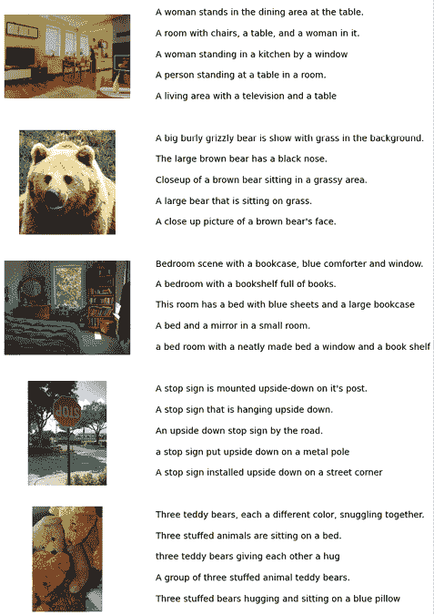
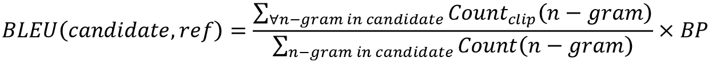
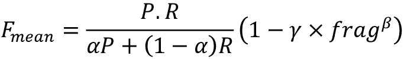
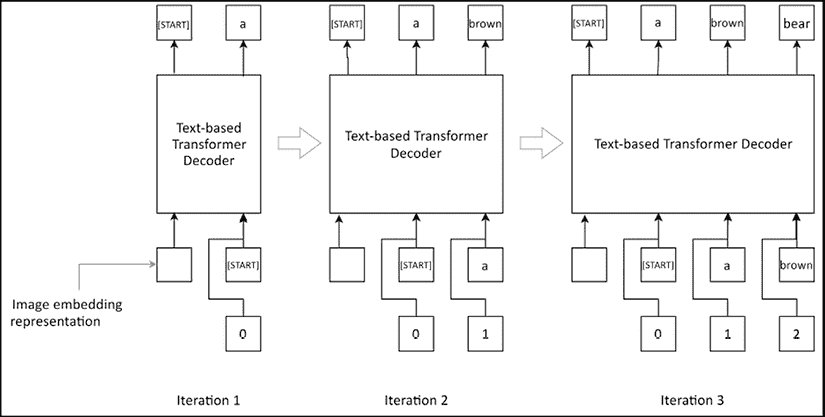

# 第十一章：使用 Transformer 进行图像标题生成

Transformer 模型改变了许多 NLP 问题的解决方式。与之前的主流模型 RNN 模型相比，它们通过显著的优势重新定义了当前的技术水平。我们已经研究过 Transformer，并理解了它们的工作原理。Transformer 可以访问整个序列的所有项（例如，一个 token 序列），而 RNN 模型一次只查看一个项，这使得 Transformer 更适合解决序列问题。在 NLP 领域取得成功之后，研究人员已经成功地将 Transformer 应用于计算机视觉问题。在这里，我们将学习如何使用 Transformer 来解决一个涉及图像和文本的多模态问题：图像标题生成。

自动图像标题生成，或称图像注释，具有广泛的应用场景。一个最突出的应用是搜索引擎中的图像检索。自动图像标题生成可以用于根据用户的请求，检索属于某一特定类别（例如，猫）的所有图像。另一个应用可能是在社交媒体中，当用户上传一张图像时，图像会自动生成标题，用户可以选择修改生成的标题或直接发布原始标题。

在本章中，我们将学习如何使用机器学习为图像生成标题，训练一个模型，在给定图像时生成一个 token 序列（即标题）。我们将首先了解 Transformer 模型如何在计算机视觉中应用，然后扩展我们的理解，解决为图像生成标题的问题。为了生成图像标题，我们将使用一个广泛应用于图像标题生成任务的流行数据集，称为 **Microsoft Common Objects in Context**（**MS-COCO**）。

解决这个问题需要两个 Transformer 模型：一个用于生成图像表示，另一个用于生成相关的标题。一旦图像表示生成完成，它将作为其中一个输入传递给基于文本的 Transformer 模型。基于文本的 Transformer 模型将被训练以预测给定当前标题的情况下，在特定时间步长下标题中下一个 token。

我们将生成三个数据集：训练集、验证集和测试集。我们使用训练集来训练模型，验证集用于在训练过程中监控模型表现，最后使用测试集为一组未见过的图像生成标题。

从非常高层次来看图像标题生成流程，我们有两个主要组件：

1.  一个预训练的视觉 Transformer 模型，它接受图像并生成该图像的 1D 隐藏表示

1.  一个基于文本的 Transformer 解码器模型，它可以将隐藏的图像表示解码成一系列 token ID

我们将使用一个预训练的 Transformer 模型来生成图像表示。这个模型被称为视觉 Transformer（ViT），它已经在 ImageNet 数据集上进行了训练，并且在 ImageNet 分类任务中取得了优异的表现。

本章将重点讨论以下主要主题：

+   了解数据

+   下载数据

+   处理和标记数据

+   定义 `tf.data.Dataset`

+   图像字幕生成的机器学习流程

+   使用 TensorFlow 实现模型

+   训练模型

+   定量评估结果

+   评估模型

+   为测试图像生成的字幕

# 了解数据

首先让我们了解我们所使用的数据，既包括直接使用的，也包括间接使用的。我们将依赖两个数据集：

+   ILSVRC ImageNet 数据集 ([`image-net.org/download`](http://image-net.org/download))

+   MS-COCO 数据集 ([`cocodataset.org/#download`](http://cocodataset.org/#download))

我们不会直接使用第一个数据集，但它对字幕学习至关重要。这个数据集包含图像及其相应的类别标签（例如，猫、狗和汽车）。我们将使用一个已经在这个数据集上训练好的 CNN，因此我们无需从头开始下载和训练该数据集。接下来我们将使用 MS-COCO 数据集，它包含图像及其相应的字幕。我们将通过将图像映射到一个固定大小的特征向量，使用 Vision Transformer，然后使用基于文本的 Transformer 将该向量映射到相应的字幕（我们稍后会详细讨论这一过程）。

## ILSVRC ImageNet 数据集

ImageNet 是一个包含大量图像（约 100 万张）及其相应标签的图像数据集。这些图像属于 1,000 个不同的类别。该数据集非常具有表现力，几乎包含了我们想为其生成字幕的所有图像中的对象。*图 11.1* 展示了 ImageNet 数据集中一些可用的类别：


图 11.1：ImageNet 数据集的一个小样本

ImageNet 是一个很好的训练数据集，用于获取生成字幕所需的图像编码。我们说我们间接使用这个数据集，因为我们将使用一个在这个数据集上预训练的 Transformer。因此，我们自己不会下载或在这个数据集上训练模型。

## MS-COCO 数据集

现在我们将转向我们实际使用的数据集，它被称为**MS-COCO**（即**Microsoft - Common Objects in Context**的缩写）。我们将使用 2014 年的训练数据集和 2017 年的验证数据集。我们使用不同时期的数据集，以避免在本练习中使用大型数据集。如前所述，该数据集包含图像及其相应的描述。数据集非常庞大（例如，训练数据集包含约 120,000 个样本，大小超过 15GB）。数据集每年更新一次，并举行竞赛，表彰那些在此数据集上取得最先进成绩的团队。在目标是达到最先进的性能时，使用完整数据集很重要。然而，在我们这种情况中，我们希望学习一个合理的模型，能够一般性地推测图像中有什么。因此，我们将使用较小的数据集（约 40,000 张图像和约 200,000 个描述）来训练我们的模型。*图 11.2*展示了可用的一些样本：



图 11.2：MS-COCO 数据集的小样本

为了训练和测试我们的端到端图像描述生成模型，我们将使用 2017 年的验证数据集，数据集可以从官方的 MS-COCO 数据集网站获取。

**注意**

实际操作中，您应使用单独的数据集进行测试和验证，以避免在测试过程中数据泄露。使用相同的数据进行验证和测试可能导致模型错误地表示其在现实世界中的泛化能力。

在*图 11.3*中，我们可以看到验证集中一些图像的样本。这些是从验证集中精心挑选的例子，代表了各种不同的物体和场景：


图 11.3：我们将用来测试算法生成图像描述能力的未见图像

# 下载数据

我们将使用的 MS-COCO 数据集相当大。因此，我们将手动下载这些数据集。为此，请按照以下说明操作：

1.  在`Ch11-Image-Caption-Generation`文件夹中创建一个名为`data`的文件夹

1.  下载 2014 年的训练图像集（[`images.cocodataset.org/zips/train2014.zip`](http://images.cocodataset.org/zips/train2014.zip)），该集包含 83K 张图像（`train2014.zip`）

1.  下载 2017 年的验证图像集（[`images.cocodataset.org/zips/val2017.zip`](http://images.cocodataset.org/zips/val2017.zip)），该集包含 5K 张图像（`val2017.zip`）

1.  下载 2014 年（`annotations_trainval2014.zip`）（[`images.cocodataset.org/annotations/annotations_trainval2014.zip`](http://images.cocodataset.org/annotations/annotations_trainval2014.zip)）和 2017 年（`annotations_trainval2017.zip`）（[`images.cocodataset.org/annotations/annotations_trainval2017.zip`](http://images.cocodataset.org/annotations/annotations_trainval2017.zip)）的注释集

1.  将下载的压缩文件复制到`Ch11-Image-Caption-Generation/data`文件夹中

1.  使用 **Extract to** 选项解压缩 zip 文件，使其在子文件夹内解压缩内容

完成上述步骤后，你应该会有以下子文件夹：

+   `data/train2014` – 包含训练图像

+   `data/annotations_trainval2014` – 包含训练图像的标题

+   `data/val2017` – 包含验证图像

+   `data/annotations_trainval2017` – 包含验证图像的标题

# 数据处理和标记化

在数据下载并放入正确的文件夹后，让我们定义包含所需数据的目录：

```py
trainval_image_dir = os.path.join('data', 'train2014', 'train2014')
trainval_captions_dir = os.path.join('data', 'annotations_trainval2014', 'annotations')
test_image_dir = os.path.join('data', 'val2017', 'val2017')
test_captions_dir = os.path.join('data', 'annotations_trainval2017', 'annotations')
trainval_captions_filepath = os.path.join(trainval_captions_dir, 'captions_train2014.json')
test_captions_filepath = os.path.join(test_captions_dir, 'captions_val2017.json') 
```

这里我们定义了包含训练和测试图像的目录，以及包含训练和测试图像标题的 JSON 文件路径。

## 数据预处理

接下来的步骤是将训练集分割为训练集和验证集。我们将使用原始数据集的 80% 作为训练数据，20% 作为验证数据（随机选择）：

```py
all_filepaths = np.array([os.path.join(trainval_image_dir, f) for f in os.listdir(trainval_image_dir)])
rand_indices = np.arange(len(all_filepaths))
np.random.shuffle(rand_indices)
split = int(len(all_filepaths)*0.8)
train_filepaths, valid_filepaths = all_filepaths[rand_indices[:split]], all_filepaths[rand_indices[split:]] 
```

我们可以打印数据集的大小，看看我们得到了什么：

```py
print(f"Train dataset size: {len(train_filepaths)}")
print(f"Valid dataset size: {len(valid_filepaths)}") 
```

这将打印：

```py
Train dataset size: 66226
Valid dataset size: 16557 
```

现在，让我们读取标题并使用它们创建一个 pandas DataFrame。我们的 DataFrame 将包含四个重要的列：

+   `image_id` – 标识图像（用于生成文件路径）

+   `image_filepath` – 由 `image_id` 标识的图像文件位置

+   `caption` – 原始标题

+   `preprocessed_caption` – 经简单预处理后的标题

首先，我们将加载 JSON 文件中的数据，并将其导入到 DataFrame 中：

```py
with open(trainval_captions_filepath, 'r') as f:
    trainval_data = json.load(f)
trainval_captions_df = pd.json_normalize(trainval_data, "annotations") 
```

我们在文件中寻找的数据位于一个名为 `"annotations"` 的键下。在 `"annotations"` 下，我们有一个字典列表，每个字典包含 `image_id`、`id` 和 `caption`。函数 `pd.json_normalize()` 接受加载的数据并将其转换为 `pd.DataFrame`。

然后，我们通过将根目录路径前缀加到 `image_id` 上，并附加扩展名 `.jpg` 来创建名为 `image_filepath` 的列。

我们只保留 `image_filepath` 值在我们存储在 `train_filepaths` 中的训练图像中的数据点：

```py
trainval_captions_df["image_filepath"] = trainval_captions_df["image_id"].apply(
    lambda x: os.path.join(trainval_image_dir, 
    'COCO_train2014_'+format(x, '012d')+'.jpg')
)
train_captions_df = trainval_captions_df[trainval_captions_df["image_filepath"].isin(train_filepaths)] 
```

我们现在定义一个名为 `preprocess_captions()` 的函数，用来处理原始标题：

```py
def preprocess_captions(image_captions_df):
    """ Preprocessing the captions """

    image_captions_df["preprocessed_caption"] = "[START] " + 
    image_captions_df["caption"].str.lower().str.replace('[^\w\s]','') 
    + " [END]"
    return image_captions_df 
```

在上面的代码中，我们：

+   添加了两个特殊标记 `[START]` 和 `[END]`，分别表示每个标题的开始和结束

+   将标题转换为小写

+   移除所有非单词、字符或空格的内容

然后我们在训练数据集上调用这个函数：

```py
train_captions_df = preprocess_captions(train_captions_df) 
```

然后我们对验证数据和测试数据执行类似的过程：

```py
valid_captions_df = trainval_captions_df[
    trainval_captions_df[
        "image_filepath"
    ].isin(valid_filepaths)
]
valid_captions_df = preprocess_captions(valid_captions_df)
with open(test_captions_filepath, 'r') as f:
    test_data = json.load(f)

test_captions_df = pd.json_normalize(test_data, "annotations")
test_captions_df["image_filepath"] = test_captions_df["image_id"].apply(
    lambda x: os.path.join(test_image_dir, format(x, '012d')+'.jpg')
)
test_captions_df = preprocess_captions(test_captions_df) 
```

让我们查看 `training_captions_df` 中的数据（*图 11.4*）：


图 11.4：training_captions_df 中的数据

这些数据展示了重要信息，例如图像在文件结构中的位置、原始标题和预处理后的标题。

让我们也分析一些关于图像的统计信息。我们将从训练数据集中取出前 1,000 张图像的小样本，并查看图像的大小：

```py
n_samples = 1000
train_image_stats_df = train_captions_df.loc[:n_samples, "image_filepath"].apply(lambda x: Image.open(x).size)
train_image_stats_df = pd.DataFrame(train_image_stats_df.tolist(), index=train_image_stats_df.index)
train_image_stats_df.describe() 
```

这将产生 *图 11.5*：


图 11.5：训练数据集中图像大小的统计信息

我们可以看到大多数图像的分辨率为 640x640。稍后我们需要将图像调整为 224x224，以匹配模型的输入要求。我们还可以查看词汇表大小：

```py
train_vocabulary = train_captions_df["preprocessed_caption"].str.split(" ").explode().value_counts()
print(len(train_vocabulary[train_vocabulary>=25])) 
```

这将打印：

```py
3629 
```

这告诉我们，有 3,629 个词在训练数据集中至少出现了 25 次。我们将这个作为词汇表的大小。

## 分词数据

由于我们正在开发 Transformer 模型，我们需要一个强大的分词器，类似于 BERT 等流行模型使用的分词器。Hugging Face 的`tokenizers`库为我们提供了一系列易于使用的分词器。让我们了解如何使用这些分词器之一来满足我们的需求。你可以通过以下方式导入它：

```py
from tokenizers import BertWordPieceTokenizer 
```

接下来，让我们定义`BertWordPieceTokenizer`。我们在定义时将传递以下参数：

+   `unk_token` – 定义一个用于表示词汇表外（OOV）词汇的标记

+   `clean_text` – 是否进行简单的预处理步骤以清理文本

+   `lowercase` – 是否将文本转换为小写

以下是这些参数：

```py
# Initialize an empty BERT tokenizer
tokenizer = BertWordPieceTokenizer(
    unk_token="[UNK]",
    clean_text=False,
    lowercase=False,
) 
```

定义好分词器后，我们可以调用`train_from_iterator()`函数来在我们的数据集上训练分词器：

tokenizer.train_from_iterator(

```py
 train_captions_df["preprocessed_caption"].tolist(),
    vocab_size=4000,
    special_tokens=["[PAD]", "[UNK]", "[START]", "[END]"]
) 
```

`train_from_iterator()`函数接受多个参数：

+   `iterator` – 一个可迭代对象，每次产生一个字符串（包含标题）。

+   `vocab_size` – 词汇表的大小。

+   `special_tokens` – 我们数据中将使用的特殊标记。具体来说，我们使用`[PAD]`（表示填充），`[UNK]`（表示 OOV 标记），`[START]`（表示开始）和`[END]`（表示结束）。这些标记将从 0 开始分配较低的 ID。

一旦分词器训练完成，我们可以使用它将文本字符串转换为标记序列。让我们使用训练好的分词器将几个示例句子转换为标记序列：

```py
# Encoding a sentence
example_captions = valid_captions_df["preprocessed_caption"].iloc[:10].tolist()
example_tokenized_captions = tokenizer.encode_batch(example_captions)
for caption, tokenized_cap in zip(example_captions, example_tokenized_captions):
    print(f"{caption} -> {tokenized_cap.tokens}") 
```

这将输出：

```py
[START] an empty kitchen with white and black appliances [END] -> ['[START]', 'an', 'empty', 'kitchen', 'with', 'white', 'and', 'black', 'appliances', '[END]']
[START] a white square kitchen with tile floor that needs repairs  [END] -> ['[START]', 'a', 'white', 'square', 'kitchen', 'with', 'tile', 'floor', 'that', 'need', '##s', 'rep', '##air', '##s', '[END]']
[START] a few people sit on a dim transportation system  [END] -> ['[START]', 'a', 'few', 'people', 'sit', 'on', 'a', 'dim', 'transport', '##ation', 'system', '[END]']
[START] a person protected from the rain by their umbrella walks down the road [END] -> ['[START]', 'a', 'person', 'prote', '##cted', 'from', 
'the', 'rain', 'by', 'their', 'umbrella', 'walks', 'down', 'the', 'road', '[END]']
[START] a white kitchen in a home with the light on [END] -> ['[START]', 'a', 'white', 'kitchen', 'in', 'a', 'home', 'with', 'the', 'light', 'on', '[END]'] 
```

你可以看到分词器如何学习自己的词汇，并且正在对字符串句子进行分词。前面带有`##`的词汇表示它们必须与前面的标记（无空格）结合，才能得到最终结果。例如，来自标记`'image'`，`'cap'`和`'##tion'`的最终字符串是`'image caption'`。让我们看看我们定义的特殊标记映射到哪些 ID：

```py
vocab = tokenizer.get_vocab()
for token in ["[UNK]", "[PAD]", "[START]", "[END]"]:
    print(f"{token} -> {vocab[token]}") 
```

这将输出：

```py
[UNK] -> 1
[PAD] -> 0
[START] -> 2
[END] -> 3 
```

现在让我们看看如何使用处理过的数据定义一个 TensorFlow 数据管道。

# 定义一个 tf.data.Dataset

现在让我们看看如何使用数据创建`tf.data.Dataset`。我们将首先编写一些辅助函数。也就是说，我们将定义：

+   `parse_image()`用来加载和处理来自`filepath`的图像

+   使用`generate_tokenizer()`来生成一个基于传入数据训练的分词器

首先让我们讨论一下`parse_image()`函数。它需要三个参数：

+   `filepath` – 图像的位置

+   `resize_height` – 调整图像高度的目标值

+   `resize_width` – 调整图像宽度的目标值

该函数定义如下：

```py
def parse_image(filepath, resize_height, resize_width):
    """ Reading an image from a given filepath """

    # Reading the image
    image = tf.io.read_file(filepath)
    # Decode the JPEG, make sure there are 3 channels in the output
    image = tf.io.decode_jpeg(image, channels=3)
    image = tf.image.convert_image_dtype(image, tf.float32)
    # Resize the image to 224x224
    image = tf.image.resize(image, [resize_height, resize_width])

    # Bring pixel values to [-1, 1]
    image = image*2.0 - 1.0

    return image 
```

我们主要依赖`tf.image`函数来加载和处理图像。这个函数具体来说：

+   从`filepath`读取图像

+   解码 JPEG 图像中的字节为`uint8`张量，并转换为`float32 dtype`张量。

在这些步骤结束后，我们将得到一个像素值介于 0 和 1 之间的图像。接下来，我们：

+   将图像调整为给定的高度和宽度

+   最后，将图像归一化，使得像素值介于-1 和 1 之间（这符合我们将要使用的 ViT 模型的要求）

基于此，我们定义了第二个辅助函数。这个函数封装了我们之前讨论过的`BertWordPieceTokenizer`的功能：

```py
def generate_tokenizer(captions_df, n_vocab):
    """ Generate the tokenizer with given captions """

    # Define the tokenizer
    tokenizer = BertWordPieceTokenizer(
        unk_token="[UNK]",
        clean_text=False,
        lowercase=False,
    )

    # Train the tokenizer
    tokenizer.train_from_iterator(
        captions_df["preprocessed_caption"].tolist(),
        vocab_size=n_vocab,
        special_tokens=["[PAD]", "[UNK]", "[START]", "[END]"]
    )

    return tokenizer 
```

有了这些，我们可以定义我们的主数据函数，以生成 TensorFlow 数据管道：

```py
def generate_tf_dataset(
    image_captions_df, tokenizer=None, n_vocab=5000, pad_length=33, batch_size=32, training=False
):
    """ Generate the tf.data.Dataset"""

    # If the tokenizer is not available, create one
    if not tokenizer:
        tokenizer = generate_tokenizer(image_captions_df, n_vocab)

    # Get the caption IDs using the tokenizer
    image_captions_df["caption_token_ids"] = [enc.ids for enc in 
    tokenizer.encode_batch(image_captions_df["preprocessed_caption"])]

    vocab = tokenizer.get_vocab()

    # Add the padding to short sentences and truncate long ones
    image_captions_df["caption_token_ids"] = 
    image_captions_df["caption_token_ids"].apply(
        lambda x: x+[vocab["[PAD]"]]*(pad_length - len(x) + 2) if 
        pad_length + 2 >= len(x) else x[:pad_length + 1] + [x[-1]]
    ) 

    # Create a dataset with images and captions
    dataset = tf.data.Dataset.from_tensor_slices({
        "image_filepath": image_captions_df["image_filepath"],
        "caption_token_ids": 
        np.array(image_captions_df["caption_token_ids"].tolist())
    })

    # Each sample in our dataset consists of (image, caption token 
    # IDs, position IDs), (caption token IDs offset by 1)
    dataset = dataset.map(
        lambda x: (
            (parse_image(x["image_filepath"], 224, 224), 
            x["caption_token_ids"][:-1], tf.range(pad_length+1, 
            dtype='float32')), x["caption_token_ids"]
        )
    )

    # Shuffle and batch data in the training mode
    if training:
        dataset = dataset.shuffle(buffer_size=batch_size*10)

    dataset = dataset.batch(batch_size)

    return dataset, tokenizer 
```

该函数接受以下参数：

+   `image_captions_df` – 一个包含图像文件路径和处理过的标题的 pandas DataFrame

+   `tokenizer` – 可选的分词器，用于对标题进行分词

+   `n_vocab` – 词汇表大小

+   `pad_length` – 填充标题的长度

+   `batch_size` – 批处理数据时的批量大小

+   `training` – 数据管道是否应该以训练模式运行。在训练模式下，我们会打乱数据，反之则不会

首先，如果没有传递新的分词器，该函数会生成一个分词器。接下来，我们在我们的 DataFrame 中创建一个名为“`caption_token_ids`”的列，这个列是通过调用分词器的`encode_batch()`函数对`preprocessed_caption`列进行编码而生成的。然后我们对`caption_token_ids`列进行填充。如果标题的长度小于`pad_length`，我们将添加`[PAD]`令牌 ID；如果标题长度超过`pad_length`，则进行截断。然后我们使用`from_tensor_slices()`函数创建一个`tf.data.Dataset`。

这个数据集中的每个样本将是一个字典，字典的键为`image_filepath`和`caption_token_ids`，值为相应的值。一旦我们完成这个步骤，就拥有了获取实际数据的基础。我们将调用`tf.data.Dataset.map()`函数来：

+   对每个`image_filepath`调用`parse_image()`以生成实际图像

+   返回所有标题令牌 ID，除了最后一个，作为输入

+   范围从 0 到令牌的数量，表示每个输入令牌 ID 的位置（用于获取 Transformer 的位置信息嵌入）

+   返回所有的标题令牌 ID 作为目标

让我们通过一个例子来理解输入和输出的样子。假设你有一个标题 *a brown bear*。下面是我们 Transformer 解码器中输入和输出的样子（*图 11.6*）：


图 11.6：模型输入和目标的组织方式

最后，如果处于训练模式，我们使用`batch_size`的 10 倍作为`buffer_size`来打乱数据集。然后我们使用在调用函数时提供的`batch_size`来批处理数据集。让我们在我们的训练数据集上调用这个函数，看看得到的结果：

```py
n_vocab=4000
batch_size=2
sample_dataset, sample_tokenizer = generate_tf_dataset(train_captions_df, n_vocab=n_vocab, pad_length=10, batch_size=batch_size, training=True)
for i in sample_dataset.take(1):
    print(i) 
```

它将输出：

```py
(
    (
        <tf.Tensor: shape=(2, 224, 224, 3), dtype=float32, numpy=
         array([[[[-0.2051357 , -0.22082198, -0.31493968],
         [-0.2015593 , -0.21724558, -0.31136328],
         [-0.17017174, -0.18585801, -0.2799757 ],
         ...,
         [-0.29620153, -0.437378  , -0.6155298 ],
         [-0.28843057, -0.41392076, -0.6178423 ],
         [-0.29654706, -0.43772352, -0.62483776]],
        [[-0.8097613 , -0.6725868 , -0.55734015],
         [-0.7580646 , -0.6420185 , -0.55782473],
         [-0.77606916, -0.67418844, -0.5419755 ],
         ...,
         [-0.6400192 , -0.4753132 , -0.24786222],
         [-0.70908225, -0.5426947 , -0.31580424],
         [-0.7206869 , -0.5324516 , -0.3128438 ]]]], dtype=float32)>,

        <tf.Tensor: shape=(2, 11), dtype=int32, numpy=
         array([[   2,   24,  356,  114,  488, 1171, 1037, 2820,  566,  445,  116],
         [   2,   24, 1357, 2142,   63, 1473,  495,  282,  116,   24,  301]])>, 
        <tf.Tensor: shape=(2, 11), dtype=float32, numpy=
         array([[ 0.,  1.,  2.,  3.,  4.,  5.,  6.,  7.,  8.,  9., 10.],
         [ 0.,  1.,  2.,  3.,  4.,  5.,  6.,  7.,  8.,  9., 10.]],
      dtype=float32)>
    ), 
    <tf.Tensor: shape=(2, 12), dtype=int32, numpy=
     array([[   2,   24,  356,  114,  488, 1171, 1037, 2820,  566,  445,  116,
           3],
     [   2,   24, 1357, 2142,   63, 1473,  495,  282,  116,   24,  301,
           3]])>
) 
```

在这里，我们可以看到输入和输出被组织成一个嵌套的元组。它的格式是`((image, input caption token IDs, position IDs), target caption token IDs)`。例如，我们已经生成了一个批量大小为 2、填充长度为 10、词汇表大小为 4,000 的数据管道。我们可以看到，图像批次的形状是[2, 224, 224, 3]，输入标题的 token ID 和位置 ID 的形状是[2, 11]，最后，目标标题的 token ID 的形状是[2, 12]。需要注意的是，我们使用了一个额外的缓冲区来处理填充长度，以包含`[START]`和`[END]`标签。因此，最终得到的张量使用了标题长度为 12（即 10+2）。这里最重要的是注意输入和目标标题的长度。输入标题比目标标题少一个项目，正如长度所示。这是因为输入标题中的第一个项目是图像特征向量。这使得输入 tokens 的长度等于目标 tokens 的长度。

在解决了数据管道之后，我们将讨论我们将使用的模型的机制。

# 图像标题生成的机器学习流程

在这里，我们将从一个非常高层次的角度来看图像标题生成流程，然后逐步分析，直到我们拥有完整的模型。图像标题生成框架由两个主要部分组成：

+   一个预训练的视觉 Transformer 模型，用于生成图像表示。

+   一个基于文本的解码器模型，可以将图像表示解码为一系列的 token ID。该模型使用文本分词器将 tokens 转换为 token ID，反之亦然。

尽管 Transformer 模型最初是用于基于文本的 NLP 问题，但它们已经超越了文本数据领域，应用于图像数据和音频数据等其他领域。

在这里，我们将使用一个可以处理图像数据的 Transformer 模型和一个可以处理文本数据的 Transformer 模型。

## 视觉 Transformer（ViT）

首先，让我们来看一下生成图像编码向量表示的 Transformer 模型。我们将使用一个预训练的**视觉 Transformer**（**ViT**）来实现这一点。该模型已经在我们之前讨论过的 ImageNet 数据集上进行了训练。接下来，让我们了解一下该模型的架构。

最初，ViT 是由 Dosovitskiy 等人在论文《*An Image is Worth 16X16 Words: Transformers for Image Recognition at Scale*》中提出的（[`arxiv.org/pdf/2010.11929.pdf`](https://arxiv.org/pdf/2010.11929.pdf)）。这可以被视为将 Transformer 应用于计算机视觉问题的第一个重要步骤。这个模型被称为视觉 Transformer 模型。

该方法的思路是将图像分解为 16x16 的小块，并将每一块视为一个独立的标记。每个图像块被展平为一个 1D 向量，并通过类似于原始 Transformer 的位置信息编码机制对其位置进行编码。但图像是二维结构；仅使用 1D 位置信息而没有 2D 位置信息是否足够呢？作者认为，1D 位置信息足够，而 2D 位置信息并未带来显著的提升。一旦图像被分解为 16x16 的块并展平，每张图像就可以像文本输入序列一样表示为一系列标记（*图 11.7*）。

然后，模型以自监督的方式进行预训练，使用名为 JFT-300M 的视觉数据集（[`paperswithcode.com/dataset/jft-300m`](https://paperswithcode.com/dataset/jft-300m)）。该论文提出了一种优雅的方式，使用图像数据对 ViT 进行半监督训练。类似于 NLP 问题中将文本单元表示为标记的方式，图像的一个“标记”是图像的一块（即一系列连续的值，这些值是标准化的像素）。然后，ViT 被预训练以预测给定图像块的平均 3 位 RGB 颜色。每个通道（即红色、绿色和蓝色）用 3 位表示（每个位的值为 0 或 1），这提供了 512 种可能性或类别。换句话说，对于给定的图像，图像块（类似于 NLP 中的标记）会被随机遮蔽（采用与 BERT 相同的方法），然后模型被要求预测该图像块的平均 3 位 RGB 颜色。

经过预训练后，模型可以通过在 ViT 上添加分类头或回归头进行任务特定问题的微调，就像 BERT 一样。ViT 在序列的开头也有`[CLS]`标记，它将作为下游视觉模型的输入表示，这些视觉模型被接入 ViT 之上。

*图 11.7*展示了 ViT 的机制：


图 11.7：视觉 Transformer 模型

我们将在这里使用的模型源自 Steiner 等人的论文*如何训练你的 ViT？视觉 Transformer 中的数据、增强和正则化*（[`arxiv.org/pdf/2106.10270.pdf`](https://arxiv.org/pdf/2106.10270.pdf)）。该论文提出了几种 ViT 模型的变体。具体来说，我们将使用 ViT-S/16 架构。ViT-S 是第二小的 ViT 模型，包含 12 层，隐藏输出维度为 384；总共拥有 22.2M 个参数。这里的数字 16 意味着该模型是在 16x16 的图像块上进行训练的。该模型已通过我们之前讨论的 ImageNet 数据集进行了微调。我们将使用模型的特征提取部分进行图像字幕生成。

## 基于文本的解码器 Transformer

基于文本的解码器的主要目的是根据前面的标记预测序列中的下一个标记。这个解码器与我们在上一章使用的 BERT 大致相同。让我们回顾一下 Transformer 模型的组成部分。Transformer 由多个堆叠的层组成。每一层都有：

+   自注意力层 – 通过接收输入标记并关注序列中其他位置的标记，为每个标记位置生成一个隐藏表示

+   一个全连接子网络 – 通过将自注意力层的输出通过两个全连接层传播，生成逐元素的非线性隐藏表示

除了这些，网络还使用残差连接和层归一化技术来提高性能。谈到输入时，模型使用两种类型的输入嵌入来告知模型：

+   标记嵌入 – 每个标记都用一个与模型共同训练的嵌入向量表示

+   位置嵌入 – 每个标记位置通过一个 ID 和该位置的相应嵌入来表示

与我们在上一章使用的 BERT 相比，我们模型中的一个关键区别是自注意力机制的使用方式。使用 BERT 时，自注意力层能够以双向方式进行注意（即同时关注当前输入两侧的标记）。然而，在基于解码器的模型中，它只能关注当前标记左侧的标记。换句话说，注意力机制只能访问当前输入之前看到的输入。

## 将所有内容整合在一起

现在我们来学习如何将这两个模型结合起来。我们将使用以下程序来训练端到端模型：

1.  我们通过 ViT 模型生成图像编码。它为图像生成 384 个项目的单一表示。

1.  这个表示连同所有标题标记（除了最后一个）一起作为输入送入解码器。

1.  给定当前输入标记，解码器预测下一个标记。在这个过程结束时，我们将得到完整的图像标题。

将 ViT 和文本解码器模型连接的另一个替代方法是通过提供直接访问 ViT 完整序列的编码器输出作为解码器注意力机制的一部分。在这项工作中，为了不让讨论过于复杂，我们仅使用 ViT 模型的一个输出作为解码器的输入。

# 使用 TensorFlow 实现模型

我们现在将实现刚才学习的模型。首先让我们导入一些内容：

```py
import tensorflow_hub as hub
import tensorflow as tf
import tensorflow.keras.backend as K 
```

## 实现 ViT 模型

接下来，我们将从 TensorFlow Hub 下载预训练的 ViT 模型。我们将使用 Sayak Paul 提交的模型。该模型可在[`tfhub.dev/sayakpaul/vit_s16_fe/1`](https://tfhub.dev/sayakpaul/vit_s16_fe/1)找到。你还可以查看其他 Vision Transformer 模型，网址是[`tfhub.dev/sayakpaul/collections/vision_transformer/1`](https://tfhub.dev/sayakpaul/collections/vision_transformer/1)。

```py
image_encoder = hub.KerasLayer("https://tfhub.dev/sayakpaul/vit_s16_fe/1", trainable=False) 
```

然后我们定义一个输入层来输入图像，并将其传递给`image_encoder`以获取该图像的最终特征向量：

```py
image_input = tf.keras.layers.Input(shape=(224, 224, 3))
image_features = image_encoder(image_input) 
```

你可以通过运行以下代码来查看最终图像表示的大小：

```py
print(f"Final representation shape: {image_features.shape}") 
```

该代码将输出：

```py
Final representation shape: (None, 384) 
```

接下来我们将详细了解如何实现基于文本的 Transformer 模型，它将输入图像表示以生成图像描述。

## 实现基于文本的解码器

在这里，我们将从头开始实现一个 Transformer 解码器模型。这与我们之前使用 Transformer 模型的方式不同，当时我们下载了一个预训练模型并使用它。

在我们实现模型之前，我们将实现两个自定义的 Keras 层：一个用于自注意力机制，另一个用于捕获 Transformer 模型中单层的功能。我们从自注意力层开始。

### 定义自注意力层

在这里，我们使用 Keras 子类化 API 定义自注意力层：

```py
class SelfAttentionLayer(tf.keras.layers.Layer):
    """ Defines the computations in the self attention layer """

    def __init__(self, d):        
        super(SelfAttentionLayer, self).__init__()
        # Feature dimensionality of the output
        self.d = d

    def build(self, input_shape):
        # Query weight matrix
        self.Wq = self.add_weight(
            shape=(input_shape[-1], self.d), 
            initializer='glorot_uniform',
            trainable=True, dtype='float32'
        )        
        # Key weight matrix
        self.Wk = self.add_weight(
            shape=(input_shape[-1], self.d), 
            initializer='glorot_uniform',
            trainable=True, dtype='float32'
        )
        # Value weight matrix
        self.Wv = self.add_weight(
            shape=(input_shape[-1], self.d), 
            initializer='glorot_uniform',
            trainable=True, dtype='float32'
        )

    def call(self, q_x, k_x, v_x, mask=None):

        q = tf.matmul(q_x,self.Wq) #[None, t, d]
        k = tf.matmul(k_x,self.Wk) #[None, t, d]
        v = tf.matmul(v_x,self.Wv) #[None, t, d]

        # Computing the final output
        h = tf.keras.layers.Attention(causal=True)([
            q, #q
            v, #v
            k, #k
        ], mask=[None, mask]) 
        # [None, t, t] . [None, t, d] => [None, t, d]
        return h 
```

在这里，我们必须填充三个函数的逻辑：

+   `__init__()` 和 `__build__()` – 定义特定于层初始化的各种超参数和逻辑

+   `call()` – 在调用该层时需要进行的计算

我们可以看到，我们将注意力输出的维度`d`作为参数传递给`__init__()`方法。接着，在`__build__()`方法中，我们定义了三个权重矩阵，`Wq`、`Wk`和`Wv`。如果你记得我们在上一章的讨论，这些分别代表查询、键和值的权重。

最后，在`call`方法中我们有逻辑。它接受四个输入：查询、键、值输入和一个可选的值掩码。然后，我们通过与相应的权重矩阵`Wq`、`Wk`和`Wv`相乘来计算潜在的`q`、`k`和`v`。为了计算注意力，我们将使用现成的层`tf.keras.layers.Attention`。我们在*第九章*《序列到序列学习——神经机器翻译*》中使用了类似的层来计算 Bahdanau 注意力机制。`tf.keras.layers.Attention()`层有几个参数，其中一个我们关心的是设置`causal=True`。

这样做的目的是指示该层将当前令牌右侧的令牌进行屏蔽。这本质上防止了解码器泄漏关于未来令牌的信息。接下来，层在调用过程中会接受以下参数：

+   `inputs` – 包含查询、值和键的输入列表，按此顺序排列

+   `mask` – 包含查询和值的掩码的两个项的列表

最后返回注意力层的输出 `h`。接下来，我们将实现 Transformer 层的计算。

### 定义 Transformer 层

使用自注意力层，我们可以捕捉单个 Transformer 层中的计算过程。它使用自注意力、全连接层和其他优化技术来计算输出：

```py
class TransformerDecoderLayer(tf.keras.layers.Layer):
    """ The Decoder layer """

    def __init__(self, d, n_heads):
        super(TransformerDecoderLayer, self).__init__()
        # Feature dimensionality
        self.d = d

        # Dimensionality of a head
        self.d_head = int(d/n_heads) 

        # Number of heads
        self.n_heads = n_heads

        # Actual attention heads
        self.attn_heads = [SelfAttentionLayer(self.d_head) for i in 
        range(self.n_heads)]

        # Fully connected layers
        self.fc1_layer = tf.keras.layers.Dense(512, activation='relu')
        self.fc2_layer = tf.keras.layers.Dense(d)

        self.add_layer = tf.keras.layers.Add()
        self.norm1_layer = tf.keras.layers.LayerNormalization()
        self.norm2_layer = tf.keras.layers.LayerNormalization()

    def _compute_multihead_output(self, x):
        """ Computing the multi head attention output"""
        outputs = [head(x, x, x) for head in self.attn_heads]
        outputs = tf.concat(outputs, axis=-1)
        return outputs

    def call(self, x):

        # Multi head attention layer output
        h1 = self._compute_multihead_output(x)

        h1_add = self.add_layer([x, h1])
        h1_norm = self.norm1_layer(h1_add)

        # Fully connected outputs
        h2_1 = self.fc1_layer(h1_norm)
        h2_2 = self.fc2_layer(h2_1)

        h2_add = self.add_layer([h1, h2_2])
        h2_norm = self.norm2_layer(h2_add)

        return h2_norm 
```

`TransformerDecoderLayer` 执行以下步骤：

1.  使用给定的输入，该层计算多头注意力输出。多头注意力输出通过计算几个较小头的注意力输出并将这些输出连接到单个输出 (`h1`)。

1.  接下来我们将原始输入 `x` 加到 `h1` 中形成残差连接 (`h1_add`)。

1.  接着进行层归一化步骤来归一化 (`h1_norm`)。

1.  `h1_norm` 经过全连接层生成 `h2_1`。

1.  `h2_1` 经过另一个全连接层生成 `h2_2`。

1.  然后我们通过将 `h1` 和 `h2_2` 相加创建另一个残差连接来产生 `h2_add`。

1.  最后，我们执行层归一化以生成 `h2_norm`，这是此自定义层的最终输出。

### 定义完整的解码器

当所有实用程序层实现后，我们可以实现文本解码器。我们将定义两个输入层。第一个接受一个令牌序列作为输入，第二个接受一个序列位置（基于 0 索引），以表示每个令牌的位置。您可以看到，两个层都被定义为能够接受任意长度的序列作为输入。这将在推理过程中起重要作用：。

```py
caption_input = tf.keras.layers.Input(shape=(None,))
position_input = tf.keras.layers.Input(shape=(None,)) 
```

接下来我们定义嵌入。我们的嵌入向量长度为 384，以匹配 ViT 模型的输出维度。我们定义了两个嵌入层：token 嵌入层和位置嵌入层：

```py
d_model = 384
# Token embeddings
input_embedding = tf.keras.layers.Embedding(len(tokenizer.get_vocab()), d_model, mask_zero=True) 
```

令牌嵌入层的工作方式与我们多次见过的一样。它为序列中的每个令牌生成一个嵌入向量。我们用 `ID 0` 掩盖输入，因为它们表示填充的令牌。接下来让我们了解如何实现位置嵌入：

```py
position_embedding = tf.keras.layers.Lambda(
    lambda x: tf.where(
        tf.math.mod(tf.repeat(tf.expand_dims(x, axis=-1), d_model, 
        axis=-1), 2)==0,
        tf.math.sin(
            tf.expand_dims(x, axis=-1) /
            10000**(2*tf.reshape(tf.range(d_model, 
            dtype='float32'),[1,1, -1])/d_model)
        ),
        tf.math.cos(
            tf.expand_dims(x, axis=-1) /
            10000**(2*tf.reshape(tf.range(d_model, 
            dtype='float32'),[1,1, -1])/d_model)
        )
    )
) 
```

我们已经讨论了如何计算位置嵌入。原始 Transformer 论文使用以下方程式生成位置嵌入：


这里 *pos* 表示序列中的位置，`i` 表示第 `i`^(th) 个特征维度 (`0< i<d_model`)。偶数特征使用正弦函数，奇数特征使用余弦函数。计算这一层需要一些工作。让我们慢慢分解这个逻辑。首先我们计算以下两个张量（为了方便我们用 `x` 和 `y` 表示）：

```py
x = PE(pos, i) = sin(pos/10000**(2i/d))
y = PE(pos, i) = cos(pos/10000**(2i/d)) 
```

我们使用`tf.where(cond, x, y)`函数，根据与`cond`的布尔矩阵的大小相同，按元素从`x`和`y`中选择值。对于某一位置，如果`cond`为`True`，选择`x`；如果`cond`为`False`，选择`y`。这里我们使用条件`pos%2 == 0`，这会对偶数位置返回`True`，对奇数位置返回`False`。

为了确保我们生成形状正确的张量，我们利用了 TensorFlow 的广播能力。

让我们稍微了解一下广播是如何帮助的。来看一下计算：

```py
tf.math.sin(
            tf.expand_dims(x, axis=-1) /
            10000**(2*tf.reshape(tf.range(d_model, 
            dtype='float32'),[1,1, -1])/d_model)
        ) 
```

在这里，我们需要一个`[batch size, time steps, d_model]`大小的输出。`tf.expand_dims(x, axis=-1)`会生成一个`[batch size, time steps, 1]`大小的输出。`10000**(2*tf.reshape(tf.range(d_model, dtype='float32'),[1,1, -1])/d_model)`会生成一个`[1, 1, d_model]`大小的输出。将第一个输出除以第二个输出，得到一个大小为`[batch size, time steps, d_model]`的张量。这是因为 TensorFlow 的广播能力允许它在任意大小的维度和大小为 1 的维度之间执行操作。你可以想象 TensorFlow 将大小为 1 的维度复制 n 次，以执行与 n 大小维度的操作。但实际上，它这样做得更高效。

一旦令牌和位置嵌入被计算出来，我们将它们按元素相加，得到最终的嵌入：

```py
embed_out = input_embedding(caption_input) + position_embedding(position_input) 
```

如果你还记得，解码器的第一个输入是图像特征向量，后面跟着字幕令牌。因此，我们需要将`image_features`（由 ViT 产生）与`embed_out`拼接起来，得到完整的输入序列：

```py
image_caption_embed_out = tf.keras.layers.Concatenate(axis=1)([tf.expand_dims(image_features,axis=1), embed_out]) 
```

然后我们定义四个 Transformer 解码器层，并计算这些层的隐藏输出：

```py
out = image_caption_embed_out
for l in range(4):
    out  = TransformerDecoderLayer(d_model, 64)(out) 
```

我们使用一个`Dense`层，具有`n_vocab`个输出节点，并采用*softmax*激活函数来计算最终输出：

```py
final_out = tf.keras.layers.Dense(n_vocab, activation='softmax')(out) 
```

最后，我们定义完整的模型。它接受以下输入：

+   `image_input` – 一批 224x224x3 大小的图像

+   `caption_input` – 字幕的令牌 ID（不包括最后一个令牌）

+   `position_input` – 表示每个令牌位置的一批位置 ID

并将`final_out`作为输出：

```py
full_model = tf.keras.models.Model(inputs=[image_input, caption_input, position_input], outputs=final_out)
full_model.compile(loss='sparse_categorical_crossentropy', optimizer='adam', metrics='accuracy')
full_model.summary() 
```

现在我们已经定义了完整的模型（*图 11.8*）：


图 11.8：代码参考叠加在完整模型的插图上

# 训练模型

现在数据管道和模型已定义，训练它就非常容易了。首先定义一些参数：

```py
n_vocab = 4000
batch_size=96
train_fraction = 0.6
valid_fraction = 0.2 
```

我们使用 4,000 的词汇量和 96 的批量大小。为了加速训练，我们只使用 60%的训练数据和 20%的验证数据。然而，你可以增加这些数据以获得更好的结果。然后我们得到在完整训练数据集上训练的分词器：

```py
tokenizer = generate_tokenizer(
    train_captions_df, n_vocab=n_vocab
) 
```

接下来我们定义 BLEU 指标。这与*第九章*《序列到序列学习——神经机器翻译*中的 BLEU 计算相同，仅有一些小的差异。因此，我们在这里不再重复讨论。

```py
bleu_metric = BLEUMetric(tokenizer=tokenizer) 
```

在训练循环外采样较小的验证数据集，以保持数据集的恒定：

```py
sampled_validation_captions_df = valid_captions_df.sample(frac=valid_fraction) 
```

接下来，我们训练模型 5 个周期：

```py
for e in range(5):
    print(f"Epoch: {e+1}")

    train_dataset, _ = generate_tf_dataset(
        train_captions_df.sample(frac=train_fraction), 
        tokenizer=tokenizer, n_vocab=n_vocab, batch_size=batch_size, 
        training=True
    )
    valid_dataset, _ = generate_tf_dataset(
        sampled_validation_captions_df, tokenizer=tokenizer, 
        n_vocab=n_vocab, batch_size=batch_size, training=False
    )

    full_model.fit(
        train_dataset,
        epochs=1
    )

    valid_loss, valid_accuracy, valid_bleu = [], [], []
    for vi, v_batch in enumerate(valid_dataset):
        print(f"{vi+1} batches processed", end='\r')
        loss, accuracy = full_model.test_on_batch(v_batch[0], 
        v_batch[1])
        batch_predicted = full_model(v_batch[0])
        bleu_score = 
        bleu_metric.calculate_bleu_from_predictions(v_batch[1], 
        batch_predicted)
        valid_loss.append(loss)
        valid_accuracy.append(accuracy)
        valid_bleu.append(bleu_score)

    print(
        f"\nvalid_loss: {np.mean(valid_loss)} - valid_accuracy: 
        {np.mean(valid_accuracy)} - valid_bleu: {np.mean(valid_bleu)}"
    ) 
```

在每次迭代中，我们会生成`train_dataset`和`valid_dataset`。注意，训练集在每个周期内会随机采样，导致不同的数据点，而验证集是固定的。还要注意，我们将先前生成的 tokenizer 作为参数传递给数据管道函数。我们在循环中使用`full_model.fit()`函数，并用训练数据集对其进行单次训练。最后，我们遍历验证数据集的批次，计算每个批次的损失、准确率和 BLEU 值。然后，我们输出这些批次指标的平均值。输出结果如下所示：

```py
Epoch: 1
2071/2071 [==============================] - 1945s 903ms/step - loss: 1.3344 - accuracy: 0.7625
173 batches processed
valid_loss: 1.1388846477332142 - valid_accuracy: 0.7819634135058849 - valid_bleu: 0.09385878526196685
Epoch: 2
2071/2071 [==============================] - 1854s 894ms/step - loss: 1.0860 - accuracy: 0.7878
173 batches processed
valid_loss: 1.090059520192229 - valid_accuracy: 0.7879036186058397 - valid_bleu: 0.10231472779803133
Epoch: 3
2071/2071 [==============================] - 1855s 895ms/step - loss: 
1.0610 - accuracy: 0.7897
173 batches processed
valid_loss: 1.0627685799075 - valid_accuracy: 0.7899546606003205 - valid_bleu: 0.10398145099074609
Epoch: 4
2071/2071 [==============================] - 1937s 935ms/step - loss: 1.0479 - accuracy: 0.7910
173 batches processed
valid_loss: 1.0817485169179177 - valid_accuracy: 0.7879597275932401 - valid_bleu: 0.10308500219058511
Epoch: 5
2071/2071 [==============================] - 1864s 899ms/step - loss: 1.0244 - accuracy: 0.7937
173 batches processed
valid_loss: 1.0498641329693656 - valid_accuracy: 0.79208166544148 - valid_bleu: 0.10667336005789202 
```

让我们看看结果。我们可以看到，训练损失和验证损失大致持续下降。我们的训练和验证准确率大约为 80%。最后，`valid_bleu`得分约为 0.10。你可以在这里看到一些模型的最新技术：[`paperswithcode.com/sota/image-captioning-on-coco`](https://paperswithcode.com/sota/image-captioning-on-coco)。可以看到，UNIMO 模型达到了 39 的 BLEU-4 分数。值得注意的是，实际上我们的 BLEU 得分比这里报告的要高。这是因为每张图片有多个描述。在计算多个参考的 BLEU 得分时，你需要对每个描述计算 BLEU，并取最大值。而我们在计算 BLEU 得分时只考虑了每张图片的一个描述。此外，我们的模型要简单得多，且只在一小部分可用数据上进行了训练。如果你希望提高模型性能，可以尝试使用完整的训练集，并实验更大的 ViT 模型和数据增强技术来提高表现。

接下来我们讨论在图像描述的上下文中，衡量序列质量的不同指标。

# 定量评估结果

评估生成的描述质量和相关性有许多不同的技术。我们将简要讨论几种可用于评估描述的指标。我们将讨论四个指标：BLEU、ROUGE、METEOR 和 CIDEr。

所有这些指标共享一个关键目标，即衡量生成文本的适应性（生成文本的意义）和流畅性（文本的语法正确性）。为了计算这些指标，我们将使用候选句子和参考句子，其中候选句子是我们算法预测的句子/短语，而参考句子是我们要与之比较的真实句子/短语。

## BLEU

**双语评估替代法** (**BLEU**) 是由 Papineni 等人在 *BLEU: A Method for Automatic Evaluation of Machine Translation* 中提出的，*《第 40 届计算语言学协会年会论文集（ACL）》*，*费城*，*2002 年 7 月：311-318*。它通过一种与位置无关的方式来度量参考句子和候选句子之间的 n-gram 相似度。这意味着候选句子中的某个 n-gram 出现在参考句子的任何位置都被认为是匹配的。BLEU 计算 n-gram 相似度时使用精确度。BLEU 有多个变种（BLEU-1、BLEU-2、BLEU-3 等），表示 n-gram 中 `n` 的值。



这里，*Count(n-gram)* 是候选句子中给定 n-gram 的总出现次数。*Count*[clip] *(n-gram)* 是一种度量方法，用于计算给定 n-gram 的 *Count(n-gram)* 值，并根据最大值进行裁剪。n-gram 的最大值是通过该 n-gram 在参考句子中的出现次数来计算的。例如，考虑以下两句话：

+   候选短语：**the** the the the the the the

+   参考文献：**the** cat sat on **the** mat

    *Count(“the”) = 7*

    *Count* [clip] *(“the”)=2*

注意，实体  是精确度的一种表现形式。事实上，它被称为修正后的 n-gram 精确度。当存在多个参考文献时，BLEU 被认为是最大值：


然而，修正后的 n-gram 精确度对于较小的候选短语倾向于较高，因为这个实体是由候选短语中的 n-gram 数量来划分的。这意味着这种度量会使模型倾向于生成较短的短语。为了避免这种情况，增加了一个惩罚项 *BP*，它对短候选短语也进行惩罚。BLEU 存在一些局限性，比如在计算分数时忽略了同义词，且没有考虑召回率，而召回率也是衡量准确性的一个重要指标。此外，BLEU 对某些语言来说似乎不是一个理想选择。然而，这是一个简单的度量方法，通常在大多数情况下与人工评判具有较好的相关性。

## ROUGE

**面向召回的摘要评估替代法** (**ROUGE**)，由 Chin-Yew Lin 在 *ROUGE: A Package for Automatic Evaluation of Summaries* 中提出，*《文本摘要分支扩展研讨会论文集（2004）》*，可以被视为 BLEU 的一种变体，且使用召回率作为基本的性能评估标准。ROUGE 度量公式如下：


这里， 是候选词组中出现在参考文献中的 n-gram 数量，而  是参考文献中出现的总 n-gram 数量。如果存在多个参考文献，*ROUGE-N* 的计算公式如下：


这里，*ref*[i]是来自可用参考集合中的一个单一参考。ROUGE 度量有多个变种，针对标准 ROUGE 度量进行改进。ROUGE-L 通过计算候选句子与参考句子对之间找到的最长公共子序列来得分。需要注意的是，在这种情况下，最长公共子序列不需要是连续的。接下来，ROUGE-W 根据最长公共子序列进行计算，并根据子序列中的碎片化程度进行惩罚。ROUGE 也存在一些局限性，比如在得分计算中没有考虑精度。

## METEOR

**翻译评估度量标准（Explicit Ordering Translation Evaluation Metric）**（**METEOR**），由 Michael Denkowski 和 Alon Lavie 提出，见于*Meteor Universal: Language Specific Translation Evaluation for Any Target Language*，*第九届统计机器翻译研讨会论文集（2014）：376-380*，是一种更先进的评估度量标准，它对候选句子和参考句子进行对齐。METEOR 与 BLEU 和 ROUGE 的不同之处在于，METEOR 考虑了单词的顺序。在计算候选句子与参考句子之间的相似性时，以下情况被视为匹配：

+   **完全匹配**：候选句子中的单词与参考句子中的单词完全匹配

+   **词干**：一个词干化后的词（例如，*walk*是词*walked*的词干）与参考句子中的单词匹配

+   **同义词**：候选句子中的单词是参考句子中单词的同义词

为了计算 METEOR 得分，可以通过表格展示参考句子与候选句子之间的匹配情况，如*图 11.10*所示。然后，基于候选句子和参考句子中匹配项的数量，计算精度（`P`）和召回率（`R`）值。最后，使用`P`和`R`的调和均值来计算 METEOR 得分：



在这里，、和是可调参数，*frag*会惩罚碎片化的匹配，以偏好那些匹配中间隙较少且单词顺序与参考句子接近的候选句子。*frag*是通过观察最终单一词映射中的交叉数来计算的（*图 11.9*）：


图 11.9：两串字符串的不同对齐方式

例如，我们可以看到左侧有 7 个交叉，而右侧有 10 个交叉，这意味着右侧的对齐会比左侧更受惩罚。


图 11.10：METEOR 单词匹配表

你可以看到，我们用圆圈和椭圆表示候选句子与参考句子之间的匹配。例如，我们用实心黑色圆圈表示完全匹配，用虚线空心圆圈表示同义词匹配，用点状圆圈表示词干匹配。

METEOR 在计算上更复杂，但通常被发现与人工评判的相关性高于 BLEU，表明 METEOR 是比 BLEU 更好的评估指标。

## CIDEr

**基于共识的图像描述评估**（**CIDEr**），由 Ramakrishna Vedantam 等人在《*CIDEr: 基于共识的图像描述评估*》，*IEEE 计算机视觉与模式识别会议（CVPR）*，*2015*中提出，是另一种评估候选句子与给定参考句子集合共识度的衡量标准。CIDEr 旨在衡量候选句子的语法正确性、显著性和准确性（即精度和召回率）。

首先，CIDEr 通过 TF-IDF 加权候选句子和参考句子中出现的每个 n-gram，因此更常见的 n-gram（例如，单词`a`和*the*）的权重较小，而稀有单词的权重较大。最后，CIDEr 通过计算候选句子和参考句子中 TF-IDF 加权 n-gram 向量之间的余弦相似度来得出：


在这里，*cand*是候选句子，*ref*是参考句子的集合，*ref*[j]是*ref*的第`j`^(个)句子，`m`是给定候选句子的参考句子数量。最重要的是，是为候选句子中的所有 n-gram 计算的 TF-IDF 值，并将其作为向量。是参考句子*ref*[i]的相同向量。表示该向量的大小。

总的来说，应该注意的是，没有一个明确的赢家能够在自然语言处理中的所有任务上表现出色。这些指标在很大程度上依赖于任务，并应根据具体任务谨慎选择。在这里，我们将使用 BLEU 分数来评估我们的模型。

# 评估模型

训练好模型后，让我们在未见过的测试数据集上测试模型。测试逻辑与我们在模型训练过程中讨论的验证逻辑几乎相同。因此，我们不会在这里重复讨论。

```py
bleu_metric = BLEUMetric(tokenizer=tokenizer)
test_dataset, _ = generate_tf_dataset(
    test_captions_df, tokenizer=tokenizer, n_vocab=n_vocab, batch_size=batch_size, training=False
)
test_loss, test_accuracy, test_bleu = [], [], []
for ti, t_batch in enumerate(test_dataset):
    print(f"{ti+1} batches processed", end='\r')
    loss, accuracy = full_model.test_on_batch(t_batch[0], t_batch[1])
    batch_predicted = full_model.predict_on_batch(t_batch[0])
    bleu_score = bleu_metric.calculate_bleu_from_predictions(t_batch[1], batch_predicted)
    test_loss.append(loss)
    test_accuracy.append(accuracy)
    test_bleu.append(bleu_score)
print(
    f"\ntest_loss: {np.mean(test_loss)} - test_accuracy: {np.mean(test_accuracy)} - test_bleu: {np.mean(test_bleu)}"
) 
```

这将输出：

```py
261 batches processed
test_loss: 1.057080413646625 - test_accuracy: 0.7914185857407434 - test_bleu: 0.10505496256163914 
```

很好，我们可以看到模型在测试数据上的表现与在验证数据上的表现相似。这意味着我们的模型没有过拟合，并且在现实世界中应该表现得相当不错。现在，让我们为一些示例图像生成描述。

# 为测试图像生成的描述

通过使用诸如准确率和 BLEU 之类的度量标准，我们确保了我们的模型表现良好。但训练好的模型最重要的任务之一是为新数据生成输出。我们将学习如何使用模型生成实际的标题。首先，让我们从概念上理解如何生成标题。通过使用图像来生成图像表示是非常直接的。棘手的部分是调整文本解码器以生成标题。正如你所想，解码器推理需要在与训练不同的环境下工作。这是因为在推理时，我们没有标题令牌可以输入模型。

我们使用模型进行预测的方式是从图像和一个包含单一令牌`[START]`的起始标题开始。我们将这两个输入传递给模型，以生成下一个令牌。然后，我们将新令牌与当前输入结合，预测下一个令牌。我们会一直这么进行，直到达到一定的步数，或者模型输出`[END]`（*图 11.11*）。如果你还记得，我们以这样一种方式开发了模型，使得它能够接受任意长度的令牌序列。这在推理过程中非常有用，因为在每个时间步长，序列的长度都会增加。



图 11.11：训练好的模型的解码器如何生成给定图像的新标题

我们将从测试数据集中选择一个包含 10 个样本的小数据集，并生成标题：

```py
n_samples = 10
test_dataset, _ = generate_tf_dataset(
    test_captions_df.sample(n=n_samples), tokenizer=tokenizer, 
    n_vocab=n_vocab, batch_size=n_samples, training=False
) 
```

接下来，让我们定义一个名为`generate_captions()`的函数。这个函数接收：

+   `model` – 训练好的模型

+   `image_input` – 一批输入图像

+   `tokenizer` – 训练好的分词器

+   `n_samples` – 批次中的样本数量

如下所示：

```py
def generate_caption(model, image_input, tokenizer, n_samples):
    # 2 -> [START]
    batch_tokens = np.repeat(np.array([[2]]), n_samples, axis=0)

    for i in range(30):
        if np.all(batch_tokens[:,-1] == 3):
            break

        position_input = tf.repeat(tf.reshape(tf.range(i+1),[1,-1]), 
        n_samples, axis=0)
        probs = full_model((image_input, batch_tokens, 
        position_input)).numpy()
        batch_tokens = np.argmax(probs, axis=-1)

    predicted_text = []
    for sample_tokens in batch_tokens:
        sample_predicted_token_ids = sample_tokens.ravel()
        sample_predicted_tokens = []
        for wid in sample_predicted_token_ids:
            sample_predicted_tokens.append(tokenizer.id_to_token(wid))
            if wid == 3:
                break
        sample_predicted_text = " ".join([tok for tok in 
        sample_predicted_tokens])
        sample_predicted_text = sample_predicted_text.replace(" ##", 
        "")
        predicted_text.append(sample_predicted_text)

    return predicted_text 
```

这个函数以一个单一的标题令牌 ID 开始。ID 2 映射到令牌`[START]`。我们预测 30 步，或者当最后一个令牌是`[END]`（映射到令牌 ID 3）时停止。我们通过创建一个从 0 到 `i` 的范围序列，并在批次维度上重复 `n_sample` 次，为数据批次生成位置输入。然后，我们将输入传递给模型，以预测令牌的概率。

我们现在可以使用这个函数生成标题：

```py
for batch in test_dataset.take(1):
    (batch_image_input, _, _), batch_true_caption = batch
batch_predicted_text = generate_caption(full_model, batch_image_input, tokenizer, n_samples) 
```

现在，让我们将标题与图像输入并排显示。另外，我们还将展示真实的标题：

```py
fig, axes = plt.subplots(n_samples, 2, figsize=(8,30))
for i,(sample_image_input, sample_true_caption, sample_predicated_caption) in enumerate(zip(batch_image_input, batch_true_caption, batch_predicted_text)):

    sample_true_caption_tokens  = [tokenizer.id_to_token(wid) for wid in
    sample_true_caption.numpy().ravel()]

    sample_true_text = []
    for tok in sample_true_caption_tokens:
        sample_true_text.append(tok)
        if tok == '[END]':
            break

    sample_true_text = " ".join(sample_true_text).replace(" ##", "")
    axes[i][0].imshow(((sample_image_input.numpy()+1.0)/2.0))
    axes[i][0].axis('off')

    true_annotation = f"TRUE: {sample_true_text}"
    predicted_annotation = f"PRED: {sample_predicated_caption}"
    axes[i][1].text(0, 0.75, true_annotation, fontsize=18)
    axes[i][1].text(0, 0.25, predicted_annotation, fontsize=18)
    axes[i][1].axis('off') 
```

你将得到一个类似于下图的图表。每次运行时，*采样的*图像会被随机采样。此次运行的结果可以在*图 11.12*中看到：


图 11.12：在测试数据样本上生成的标题

我们可以看到我们的模型在生成标题方面表现得很好。总的来说，我们可以看到模型能够识别图像中展示的物体和活动。同样需要记住的是，每张图像都有多个与之关联的标题。因此，预测的标题不一定需要与图像中的真实标题完全匹配。

# 总结

在本章中，我们专注于一个非常有趣的任务——为给定的图像生成描述。我们的图像描述模型是本书中最复杂的模型之一，包含以下内容：

+   一个生成图像表示的视觉 Transformer 模型

+   一个基于文本的 Transformer 解码器

在开始模型之前，我们分析了数据集，以理解各种特征，例如图像大小和词汇量大小。接着我们了解了如何使用分词器对描述字符串进行分词。然后，我们利用这些知识构建了一个 TensorFlow 数据管道。

我们详细讨论了每个组件。视觉 Transformer (ViT) 接收一张图像并生成该图像的隐藏表示。具体来说，ViT 将图像拆分成一系列 16x16 像素的小块。之后，它将每个小块作为一个 token 嵌入传递给 Transformer（包括位置编码信息），以生成每个小块的表示。它还在开头加入了[CLS] token，用来提供图像的整体表示。

接下来，文本解码器将图像表示和描述 token 作为输入。解码器的目标是在每个时间步预测下一个 token。我们在验证数据集上达到了 BLEU-4 得分略高于 0.10。

随后，我们讨论了几种不同的评价指标（BLEU、ROUGE、METEOR 和 CIDEr），这些指标可以用来定量评估生成的图像描述，并且我们看到，在将算法应用于训练数据时，BLEU-4 得分随着时间的推移而增加。此外，我们还通过视觉检查生成的描述，发现我们的机器学习管道在逐渐提高图像描述的准确性。

接下来，我们在测试数据集上评估了我们的模型，并验证了其在测试数据上的表现与预期相符。最后，我们学习了如何使用训练好的模型为未见过的图像生成描述。

本书已经结束。我们涵盖了许多自然语言处理的不同主题，并讨论了有助于解决问题的先进模型和技术。

在附录中，我们将讨论与机器学习相关的一些数学概念，并解释如何使用可视化工具 TensorBoard 来可视化词向量。

要访问本书的代码文件，请访问我们的 GitHub 页面：`packt.link/nlpgithub`

加入我们的 Discord 社区，结识志同道合的人，与超过 1000 名成员一起学习，访问链接：`packt.link/nlp`


