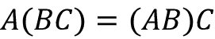
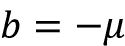
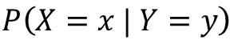
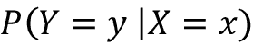
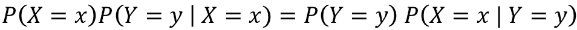
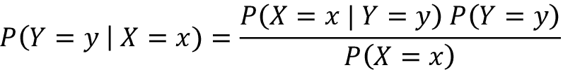

# 附录 A：数学基础与高级 TensorFlow

在这里，我们将讨论一些概念，这些概念将帮助你理解本书中提供的某些细节。首先，我们将讨论书中常见的几种数学数据结构，然后介绍对这些数据结构执行的各种操作。接下来，我们将讨论概率的概念。概率在机器学习中起着至关重要的作用，因为它通常提供有关模型对其预测的不确定性的见解。最后，我们将以如何使用 TensorBoard 作为词嵌入的可视化工具的指南结束本附录。

# 基本数据结构

## 标量

标量是一个单一的数字，不像矩阵或向量。例如，1.3 是一个标量。标量可以在数学上表示如下：。

这里，`R` 是实数空间。

## 向量

向量是一个数字数组。与集合不同，集合中的元素没有顺序，而向量的元素是有顺序的。一个示例向量是 `[1.0, 2.0, 1.4, 2.3]`。在数学上，它可以表示为：


这里，`R` 是实数空间，`n` 是向量中的元素个数。

## 矩阵

矩阵可以被看作是一组标量的二维排列。换句话说，矩阵可以被看作是一个向量的向量。一个示例矩阵如下所示：


一个更一般的矩阵，其大小为 ，可以在数学上定义如下：


并且：


这里，`m` 是矩阵的行数，`n` 是矩阵的列数，`R` 是实数空间。

## 矩阵索引

我们将使用零索引表示法（即，索引从 0 开始）。

要从矩阵中索引单个元素，位于 *(i, j)*^(th) 位置，我们使用以下表示法：


参考之前定义的矩阵，我们得到如下结果：


我们像这样从 `A` 中索引一个元素：


我们表示任何矩阵 `A` 的一行，如下所示：


对于我们的示例矩阵，我们可以表示矩阵的第二行（索引为 1），如下所示：


我们表示从矩阵 `A` 的 *(i, k)*^(th) 索引到 *(j, l)*^(th) 索引的切片，如下所示：


在我们的示例矩阵中，我们可以表示从第一行第三列到第二行第四列的切片，如下所示：


# 特殊类型的矩阵

## 单位矩阵

单位矩阵是一个方阵，其中对角线上的值为 1，其他位置的值为 0。在数学上，它可以表示为：


这看起来如下所示：


这里，。

单位矩阵与另一个矩阵 `A` 相乘时，具有以下良好的性质：


## 方阵对角矩阵

方阵对角矩阵是单位矩阵的一个更一般的情况，其中对角线上的值可以取任意值，而非对角线上的值为零：


## 张量

一个 `n` 维矩阵被称为 **张量**。换句话说，一个具有任意维数的矩阵被称为张量。例如，一个四维张量可以表示如下：


这里，`R` 是实数空间。

# 张量/矩阵操作

## 转置

转置是一个重要的操作，适用于矩阵或张量。对于矩阵，转置定义如下：


这里，`A`^T 表示 `A` 的转置。

转置操作的一个例子可以如下说明：


经过转置操作后：


对于张量，转置可以看作是对维度顺序的重新排列。例如，我们定义一个张量 `S`，如下所示：


现在可以定义一个转置操作（多次转置中的一种），如下所示：


## 矩阵乘法

矩阵乘法是另一个在线性代数中非常常见的重要操作。

给定矩阵  和 ，`A` 和 `B` 的乘法定义如下：


这里，。

考虑这个例子：


这给出了 ，并且 `C` 的值如下：


## 元素级乘法

元素级矩阵乘法（或 **Hadamard 乘积**）是对形状相同的两个矩阵进行计算的。给定矩阵  和 ，`A` 和 `B` 的元素级乘法定义如下：


这里，。

考虑这个例子：


这给出了 ，并且 `C` 的值如下：


## 逆

矩阵 `A` 的逆矩阵表示为 `A`^(-1)，它满足以下条件：


逆矩阵在我们试图解线性方程组时非常有用。考虑这个例子：


我们可以通过如下方式解出 ：


这可以写作 ，利用结合律——即，。

接下来，我们将得到，其中  是单位矩阵。

最后，，因为 。

例如，多项式回归是回归技术之一，使用线性方程组来解决回归问题。回归类似于分类，但与分类输出一个类别不同，回归模型输出一个连续值。让我们看一个示例问题：给定一所房子的卧室数量，我们将计算这所房产的价值。形式上，一个多项式回归问题可以写成如下：


这里， 是第`i`个数据输入，其中  是输入， 是标签， 是数据中的噪声。在我们的例子中， 是卧室的数量， 是房子的价格。这可以写成如下的线性方程组：


然而，并非所有的`A`都存在逆。为了矩阵有逆，需要满足一定的条件。例如，为了定义逆矩阵，`A`需要是一个方阵（即，）。即使逆矩阵存在，我们也并不总能以封闭形式找到它；有时它只能通过有限精度计算机进行近似。如果逆矩阵存在，那么有几种算法可以找到它，我们将在接下来的内容中讨论。

**注意**

当我们说*要*矩阵是方阵才能有逆时，指的是标准的逆运算。也存在逆运算的变种（例如，**摩尔-彭若斯逆**，也称为伪逆），它可以对一般的  矩阵进行矩阵求逆操作。

## 求解矩阵逆——奇异值分解（SVD）

现在让我们看看如何使用 SVD 求解矩阵`A`的逆。SVD 将`A`分解为三个不同的矩阵，如下所示：


这里，`U`的列被称为左奇异向量，`V`的列被称为右奇异向量，`D`（一个对角矩阵）的对角值被称为奇异值。左奇异向量是矩阵  的特征向量，右奇异向量是矩阵  的特征向量。最后，奇异值是矩阵  和  的特征值的平方根。矩阵`A`的特征向量  及其对应的特征值  满足以下条件：


然后，如果 SVD 存在，矩阵`A`的逆由以下公式给出：


由于`D`是对角矩阵，`D`^(-1)只是`D`中非零元素的逐元素倒数。SVD（奇异值分解）是机器学习中一个重要的矩阵分解技术。例如，SVD 被用于计算**主成分分析**（**PCA**），这是一种流行的数据降维技术（其目的类似于我们在*第四章，先进的词向量算法*中看到的 t-SNE）。SVD 在自然语言处理（NLP）中的另一个应用是文档排名。即，当你想获取最相关的文档（并根据与某个术语的相关性对它们进行排名，例如*足球*），可以使用 SVD 来实现这一目标。想要了解更多关于 SVD 的信息，可以参考这篇博客文章，它提供了 SVD 的几何直觉，并展示了它在 PCA 中的应用：[`gregorygundersen.com/blog/2018/12/10/svd/`](https://gregorygundersen.com/blog/2018/12/10/svd/)。

## 范数

范数用作衡量向量*大小*（即向量中的值）的标准。`p`^(th)范数的计算和表示如下所示：


例如，*L2*范数是这样的：


## 行列式

方阵的行列式表示为。行列式在许多方面都非常有用。例如，`A`仅当且仅当行列式不为零时才是可逆的。行列式也可以被解释为矩阵所有特征值的乘积。`2`x`2`矩阵`A`的行列式表示为


如下所示


计算方法为


以下方程展示了*3x3*矩阵行列式的计算：


# 概率

接下来，我们将讨论与概率论相关的术语。概率论是机器学习的一个重要部分，因为使用概率模型建模数据可以帮助我们得出关于模型在某些预测上不确定性的结论。以情感分析的使用案例为例，我们想为给定的电影评论输出一个预测（正面/负面）。尽管模型对于我们输入的每一个样本都输出一个介于 0 和 1 之间的值（0 表示负面，1 表示正面），但模型并不知道它对其答案的*不确定性*有多大。

让我们理解不确定性如何帮助我们做出更好的预测。例如，一个确定性模型（即输出确切值而非值的分布的模型）可能会错误地说评论 “我从未失去兴趣” 的正向概率是 0.25（也就是说，它更可能是负面评论）。然而，概率模型将为预测提供一个均值和一个标准差。例如，它可能会说，这个预测的均值为 0.25，标准差为 0.5。在第二种模型下，我们知道由于标准差较大，预测很可能是错误的。然而，在确定性模型中，我们没有这种奢侈的选择。这一特性对于关键的机器系统（例如，恐怖主义风险评估模型）尤其有价值。

为了开发这样的概率机器学习模型（例如，贝叶斯逻辑回归、贝叶斯神经网络或高斯过程），你应该熟悉基本的概率理论。因此，我们将在这里提供一些基本的概率信息。

## 随机变量

随机变量是一个可以随机取值的变量。此外，随机变量通常表示为 `x[1]`、`x[2]` 等。随机变量可以分为两种类型：离散型和连续型。

### 离散随机变量

离散随机变量是指可以取离散随机值的变量。例如，掷硬币的试验可以被建模为一个随机变量；即，硬币掷出的正面或反面是一个离散变量，因为结果只能是*正面*或*反面*。另外，掷骰子的结果也是离散的，因为其值只能来自集合 `{1,2,3,4,5,6}`。

### 连续随机变量

连续随机变量是一个可以取任何实数值的变量，也就是说，如果 `x` 是一个连续随机变量：


这里，`R` 表示实数空间。

例如，一个人的身高是一个连续随机变量，因为它可以取任何实数值。

## 概率质量/密度函数

**概率质量函数**（**PMF**）或**概率密度函数**（**PDF**）是一种展示随机变量在不同值上概率分布的方式。对于离散变量，定义了 PMF；对于连续变量，定义了 PDF。*图 A.1* 显示了一个 PMF 的例子：


A.1: 概率质量函数（PMF）离散型

上述的概率质量函数（PMF）可能是通过一个*偏*骰子实现的。在这张图中，我们可以看到，掷这个骰子时，出现 3 的概率很高。这样的图形可以通过进行多次试验（比如 100 次）并统计每个面朝上的次数得到。最后，你需要将每个计数除以试验次数，以获得标准化后的概率。请注意，所有的概率总和应为 1，正如这里所示：


相同的概念被扩展到连续随机变量，以获得一个 PDF。假设我们试图建模给定人群的某个身高的概率。与离散情况不同，我们没有个别的值来计算概率，而是一个连续的值范围（在本例中，它从 `0` 到 *2.4 m*）。如果我们像 *图 A.1* 中的示例一样绘制图表，我们需要以无穷小区间来考虑它。例如，我们找出一个人身高在 *0.0 m-0.01 m, 0.01-0.02 m, ..., 1.8 m-1.81 m, …* 等范围内的概率密度。概率密度可以使用以下公式计算：


然后，我们将这些条形图画得靠近彼此，从而获得一个连续的曲线，如*图 A.2*所示。请注意，给定的区间的概率密度可以大于 `1`（因为它是密度），但是曲线下的面积必须为 1：


图 A.2：概率密度函数（PDF）连续

在*图 A.2*中显示的形状被称为正态分布（或高斯分布）。它也被称为*钟形曲线*。我们之前给出的是关于如何理解连续概率密度函数的直观解释。

更正式地说，正态分布的连续 PDF 有一个公式，定义如下。假设连续随机变量 `X` 具有均值  和标准差  的正态分布。对于任何 `x` 的值，*X = x* 的概率由以下公式给出：


如果你对所有可能的无穷小 *dx* 值进行积分，应该得到区域（有效的 PDF 需要为 1），如以下公式所示：


任意 `a` 和 `b` 值的正态分布积分通过以下公式给出：


使用这个公式，我们可以得到正态分布的积分，其中  和 ：


这给出了所有 `x` 值的概率值的累积，并给出了一个值为 1 的结果。

你可以在 [`mathworld.wolfram.com/GaussianIntegral.html`](http://mathworld.wolfram.com/GaussianIntegral.html) 查找更多信息，或者参考 [`en.wikipedia.org/wiki/Gaussian_integral`](https://en.wikipedia.org/wiki/Gaussian_integral) 进行更简单的讨论。

## 条件概率

条件概率表示在一个事件发生的前提下，另一个事件发生的概率。例如，给定两个随机变量，`X` 和 `Y`，在 *Y = y* 的条件下，*X = x* 的条件概率可以用以下公式表示：



这种概率的一个实际例子如下所示：


## 联合概率

给定两个随机变量`X`和`Y`，我们将*X = x*和*Y = y*的概率称为*X = x*和*Y = y*的联合概率。其公式表示如下：


如果`X`和`Y`是互斥事件，则此表达式将简化为：


一个现实世界中的例子如下：


## 边际概率

边际概率分布是给定所有变量的联合概率分布时，某一随机变量子集的概率分布。例如，假设存在两个随机变量`X`和`Y`，且我们已经知道，我们想要计算*P(x)*：


直观地说，我们正在对所有可能的`Y`值求和，实际上是在计算*Y = 1*的概率。

## 贝叶斯定理

贝叶斯定理为我们提供了一种计算的方法，前提是我们已经知道和。我们可以通过以下方式轻松推导出贝叶斯定理：


现在让我们来看中间和右边的部分：





这就是贝叶斯定理。简单来说，就是这样：


# 使用 TensorBoard 可视化词嵌入

当我们在*第三章*“Word2vec——学习词嵌入”中想要可视化词嵌入时，我们是通过手动实现 t-SNE 算法来进行可视化的。然而，你也可以使用 TensorBoard 来可视化词嵌入。TensorBoard 是 TensorFlow 提供的一个可视化工具。你可以用 TensorBoard 来可视化程序中的 TensorFlow 变量。这让你可以看到不同变量随着时间的变化（例如，模型的损失/准确度），从而帮助你识别模型中的潜在问题。

TensorBoard 使你能够可视化标量值（例如，训练迭代中的损失值）和向量作为直方图（例如，模型层节点的激活）。除此之外，TensorBoard 还允许你可视化词嵌入。因此，如果你需要分析嵌入的样子，TensorBoard 为你提供了所有所需的代码实现。接下来，我们将看到如何使用 TensorBoard 来可视化词嵌入。本练习的代码在`Appendix`文件夹中的`tensorboard_word_embeddings.ipynb`里提供。

## 启动 TensorBoard

首先，我们将列出启动 TensorBoard 的步骤。TensorBoard 作为一个服务运行，并使用特定的端口（默认情况下是`6006`）。要启动 TensorBoard，你需要按照以下步骤操作：

1.  打开命令提示符（Windows）或终端（Ubuntu/macOS）。

1.  进入项目的主目录。

1.  如果你使用的是 python 的`virtualenv`，请激活你已安装 TensorFlow 的虚拟环境。

1.  确保你能通过 Python 看到 TensorFlow 库。为此，按照以下步骤操作：

    1.  输入`python3`；你将看到一个类似`>>>`的提示符。

    1.  尝试`import tensorflow as tf`

    1.  如果你能够成功运行此操作，那么你就没问题了

    1.  通过输入`exit()`退出`python`提示符（即`>>>`）

1.  输入`tensorboard --logdir=models`：

    1.  `--logdir`选项指向你将创建数据以供可视化的目录

    1.  可选地，你可以使用`--port=<port_you_like>`来更改 TensorBoard 运行的端口

1.  你现在应该能看到以下消息：

    ```py
    TensorBoard 1.6.0 at <url>;:6006 (Press CTRL+C to quit) 
    ```

1.  在网页浏览器中输入`<url>:6006`。此时，你应该能够看到一个橙色的仪表盘。由于我们还没有生成任何数据，所以不会显示任何内容。

## 保存词嵌入并通过 TensorBoard 进行可视化

首先，我们将从[`nlp.stanford.edu/projects/glove/`](https://nlp.stanford.edu/projects/glove/)下载并加载 50 维的 GloVe 词向量文件（`glove.6B.zip`），并将其放入`Appendix`文件夹中。我们将加载文件中的前 50,000 个词向量，稍后将这些词向量用于初始化 TensorFlow 变量。同时，我们还将记录每个词的字符串，因为稍后我们会将这些字符串作为标签，在 TensorBoard 中显示每个点：

```py
vocabulary_size = 50000
embedding_df = [] 
index = []
# Open the zip file
with zipfile.ZipFile('glove.6B.zip') as glovezip:
    # Read the file with 50 dimensional embeddings
    with glovezip.open('glove.6B.50d.txt') as glovefile:
        # Read line by line
        for li, line in enumerate(glovefile):
            # Print progress
            if (li+1)%10000==0: print('.',end='')

            # Get the word and the corresponding vector
            line_tokens = line.decode('utf-8').split(' ')
            word = line_tokens[0]
            vector = [float(v) for v in line_tokens[1:]]

            assert len(vector)==50
            index.append(word)
            # Update the embedding matrix
            embedding_df.append(np.array(vector))

            # If the first 50000 words being read, finish
            if li >= vocabulary_size-1:
                break
embedding_df = pd.DataFrame(embedding_df, index=index) 
```

我们已将嵌入定义为一个 pandas DataFrame。它将词向量作为列，将词作为索引。


图 A.3：以 pandas DataFrame 形式呈现的 GloVe 向量

我们还需要定义与 TensorFlow 相关的变量和操作。在此之前，我们将创建一个名为`embeddings`的目录，用于存储这些变量：

```py
# Create a directory to save our model
log_dir = 'embeddings'
os.makedirs(log_dir, exist_ok=True) 
```

然后，我们将定义一个变量，该变量将用我们之前从文本文件中复制的词嵌入进行初始化：

```py
# Save the weights we want to analyse as a variable. 
embeddings = tf.Variable(embedding_df.values)
print(f"weights.shape: {embeddings.shape}")
# Create a checkpoint from embedding
checkpoint = tf.train.Checkpoint(embedding=embeddings)
checkpoint.save(os.path.join(log_dir, "embedding.ckpt")) 
```

我们还需要保存一个元数据文件。元数据文件包含与词嵌入相关的标签/图像或其他类型的信息，以便当你悬停在嵌入可视化上时，相应的点将显示它们所代表的词/标签。元数据文件应为`.tsv`（制表符分隔值）格式，且应包含`vocabulary_size`行，其中每行包含一个词，按它们在词嵌入矩阵中出现的顺序排列：

```py
with open(os.path.join(log_dir, 'metadata.tsv'), 'w', encoding='utf-8') as f:
    for w in embedding_df.index:
        f.write(w+'\n') 
```

然后，我们需要告诉 TensorFlow 它在哪里可以找到我们保存到磁盘的嵌入数据的元数据。为此，我们需要创建一个`ProjectorConfig`对象，该对象保存有关我们要显示的嵌入的各种配置信息。存储在`ProjectorConfig`文件夹中的详细信息将保存在`models`目录中的`projector_config.pbtxt`文件中：

```py
config = projector.ProjectorConfig() 
```

在这里，我们将填写我们创建的`ProjectorConfig`对象的必填字段。首先，我们将告诉它我们感兴趣的变量名称。然后，我们将告诉它在哪里可以找到与该变量对应的元数据：

```py
config = projector.ProjectorConfig()
# You can add multiple embeddings. Here we add only one.
embedding_config = config.embeddings.add()
embedding_config.tensor_name = "embedding/.ATTRIBUTES/VARIABLE_VALUE"
# Link this tensor to its metadata file (e.g. labels).
embedding_config.metadata_path = 'metadata.tsv'
# TensorBoard will read this file during startup.
projector.visualize_embeddings(log_dir, config) 
```

请注意，我们在`embedding`名称后添加了后缀`/.ATTRIBUTES/VARIABLE_VALUE`。这是 TensorBoard 找到此张量所必需的。TensorBoard 将在启动时读取必要的文件：

```py
projector.visualize_embeddings(log_dir, config) 
```

现在，如果你加载 TensorBoard，你应该能看到类似*图 A.4*的内容：


图 A.4：TensorBoard 可视化的嵌入

当您将鼠标悬停在显示的点云上时，系统会显示您当前悬停的单词标签，因为我们在 `metadata.tsv` 文件中提供了这些信息。此外，您还有几个选项。第一个选项（如虚线框所示，标记为 *`1`*）允许您选择嵌入空间的一个子集。您可以在感兴趣的嵌入空间区域画出一个边界框，效果如 *图 A.5* 所示。我选择了可视化中右侧的嵌入。您可以在右侧看到选定单词的完整列表：


图 A.5：选择嵌入空间的一个子集

另一种选择是查看单词本身，而非点。您可以通过选择 *图 A.4* 中的第二个选项（标记为 *`2`* 的实心框）来实现。这将显示如 *图 A.6* 所示的效果。此外，您可以根据需要平移/缩放/旋转视图。如果点击帮助按钮（如 *图 A.6* 中标记为 *`1`* 的实心框所示），将显示一个控制视图的指南：


图 A.6：以单词形式显示的嵌入向量，而非点

最后，您可以通过左侧面板更改可视化算法（如 *图 A.4* 中所示，标记为 *`3`* 的虚线框）。

# 摘要

在这里，我们讨论了一些数学背景知识，以及我们在其他章节中没有涉及的一些实现。首先，我们讨论了标量、向量、矩阵和张量的数学符号。接着，我们讨论了对这些数据结构进行的各种操作，例如矩阵乘法和矩阵求逆。之后，我们讨论了一些有助于理解概率机器学习的术语，如概率密度函数、联合概率、边际概率和贝叶斯规则。最后，我们在附录中以如何使用 TensorFlow 附带的可视化平台 TensorBoard 来可视化词嵌入的指南结束。


packt.com

订阅我们的在线数字图书馆，您将可以访问超过 7,000 本书籍和视频，此外还可以使用行业领先的工具帮助您规划个人发展并推动职业进步。欲了解更多信息，请访问我们的网站。

# 为什么订阅？

+   花更少的时间学习，花更多的时间编码，利用来自超过 4,000 名行业专业人士的实用电子书和视频

+   通过为您量身定制的技能计划提高您的学习效率

+   每月获取免费的电子书或视频

+   完全可搜索，方便快速访问重要信息

+   复制和粘贴、打印和收藏内容

在 www.packt.com，您还可以阅读一系列免费的技术文章，订阅各种免费的电子邮件通讯，并获得 Packt 图书和电子书的独家折扣和优惠。

# 其他您可能喜欢的书籍

如果您喜欢本书，您可能对 Packt 出版的其他书籍感兴趣：


**自然语言处理的变压器模型（第二版）**

丹尼斯·罗斯曼（Denis Rothman）

ISBN：9781803247335

+   了解 ViT 和 CLIP 如何为图像（包括模糊图像！）打标签，并使用 DALL-E 根据句子生成图像

+   探索新的技术以研究复杂的语言问题

+   对比和分析 GPT-3 与 T5、GPT-2 和 BERT 模型的结果

+   使用 TensorFlow、PyTorch 和 GPT-3 进行情感分析、文本摘要、口语分析、机器翻译等任务

+   衡量关键变压器的生产力，以定义它们的范围、潜力和生产限制


**使用 PyTorch 和 Scikit-Learn 进行机器学习**

塞巴斯蒂安·拉施卡（Sebastian Raschka）

刘宇熙（Hayden Liu）

瓦希德·米尔贾利利（Vahid Mirjalili）

ISBN：9781801819312

+   探索框架、模型和技术，让机器从数据中“学习”

+   使用 scikit-learn 进行机器学习，使用 PyTorch 进行深度学习

+   在图像、文本等数据上训练机器学习分类器

+   构建和训练神经网络、变压器模型和提升算法

+   发现评估和调优模型的最佳实践

+   使用回归分析预测连续的目标结果

+   深入挖掘文本和社交媒体数据，使用情感分析

# Packt 正在寻找像您这样的作者

如果您有兴趣成为 Packt 的作者，请访问 authors.packtpub.com 并今天就申请。我们与成千上万的开发者和技术专家合作，帮助他们与全球技术社区分享见解。您可以提交一般申请，申请我们正在招聘作者的特定热门话题，或者提交您自己的创意。

# 分享您的想法

现在您已经完成了*使用 TensorFlow 进行自然语言处理（第二版）*，我们很想听听您的想法！如果您从 Amazon 购买了本书，请[点击这里直接进入 Amazon 的书评页面](https://packt.link/r/1838641351)，分享您的反馈或在您购买的站点上留下评论。

您的评价对我们以及技术社区非常重要，将帮助我们确保提供优质的内容。
