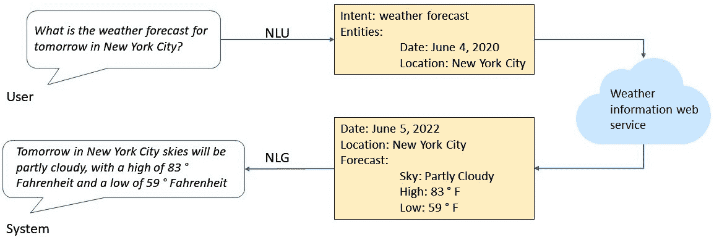
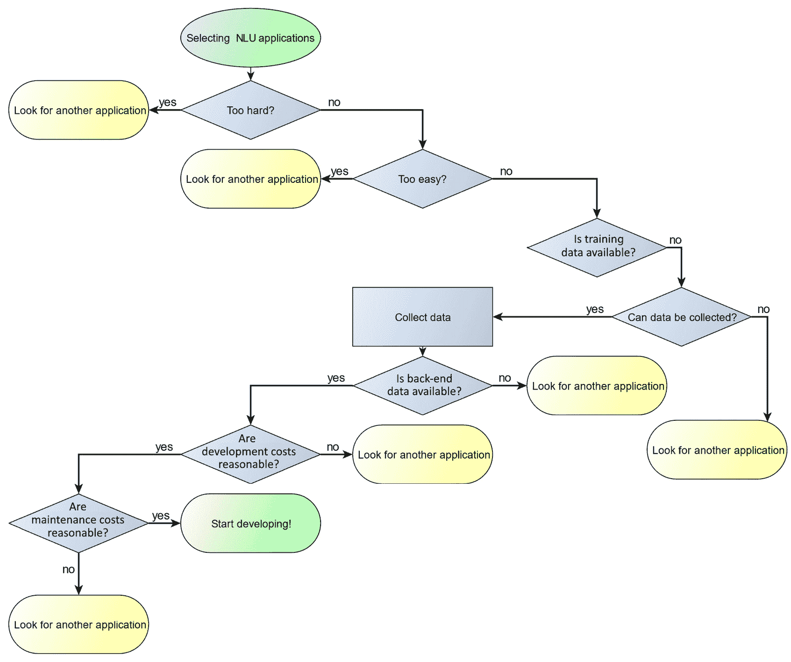

# 第二章：识别实际的自然语言理解问题

本章将介绍如何识别适合当今技术的**自然语言理解**（**NLU**）问题。这意味着这些问题不会对当前最先进的 NLU 方法造成过大的挑战，但也不能通过简单的非-NLU 方法来解决。实际的 NLU 问题还需要足够的训练数据。如果没有足够的训练数据，最终的 NLU 系统将表现不佳。NLU 系统的好处也必须能够证明其开发和维护成本是合理的。尽管这些考虑事项主要是项目经理需要思考的内容，但它们同样适用于寻找课程项目或论文题目的学生。

在开始一个涉及 NLU 的项目之前，首先要问的问题是：项目的目标是否适合当前 NLU 技术的最先进水平？NLU 是解决你希望解决的问题的合适技术吗？这个问题的难度与当前 NLU 技术的水平相比如何？

在开始时，同样重要的是决定*解决问题*意味着什么。问题的解决程度可以有不同的标准。如果应用是一个课程项目、演示或概念验证，解决方案的准确性不必像为处理每天成千上万用户输入而设计的已部署解决方案那样高。同样，如果问题是一个前沿的研究问题，那么任何对当前技术状态的改进都是有价值的，即使该问题没有完全通过项目中的工作得到解决。解决方案的完整性需要达到什么程度是每个人在考虑自己想要解决的问题时需要做出的决定。

项目经理或负责做出技术决策的人员应该决定在项目完成时可接受的准确性水平，同时要记住，任何自然语言技术应用中都不太可能达到 100%的准确性。

本章将详细探讨如何识别适合应用 NLU 的实际问题。遵循本章讨论的原则，你将获得一个高质量、能够解决真实问题的有效系统。

本章涉及以下主题：

+   识别技术适用难度的问题

+   考虑困难的 NLU 应用

+   考虑不需要 NLP 的应用

+   训练数据

+   应用数据

+   考虑开发成本

+   考虑维护成本

+   决定 NLU 应用的流程图

## 识别技术适用难度的问题

注释

本章集中于技术性考虑问题。诸如是否存在市场需求、如何判断客户是否会对某个应用感兴趣等问题是很重要的，但它们超出了本书的范围。

这里列出了一些适合当前技术水平的问题类型。

今天的自然语言理解（NLU）在处理基于特定、具体主题的问题方面非常出色，例如以下示例：

+   **将客户的产品评论分类为正面和负面评论**：在线卖家通常会给买家提供评论他们购买的产品的机会，这对其他潜在买家以及卖家都有帮助。但是，大型在线零售商有成千上万的产品，因此面临着如何处理来自成千上万条评论的信息的问题。人工统计员无法阅读所有进入的评论，因此自动化的产品评论分类系统将非常有用。

+   **回答有关账户余额或最近交易的基本银行问题**：银行和其他金融机构拥有大型的客户服务中心来处理客户问题。通常，拨打电话的最常见原因是关于账户余额的简单问题，这些问题可以通过基于账户号码和账户类型的数据库查询来解答。一个自动化系统可以通过询问来电者他们的账户号码和所需信息的种类来处理这些问题。

+   **进行简单的股票交易**：买卖股票可能会变得非常复杂，但在许多情况下，用户只是想买或卖某个特定公司的一定数量的股票。这种交易只需要一些基本信息，例如账户号码、公司名称、股票数量以及买入或卖出的选择。

+   **包裹追踪**：包裹追踪只需要一个追踪号码即可告诉用户他们的包裹状态。虽然基于网络的包裹追踪很常见，但有时人们无法访问网络。通过自然语言应用，用户只需打个电话就能追踪包裹。

+   **将客户问题路由到正确的客服代表**：许多客户的问题只能由人工客服代表回答。对于这些客户，NLU 系统仍然很有帮助，它可以将来电者引导到正确部门的客服代表那里。它可以询问客户来电的原因，分类请求，然后自动将来电转接到处理该主题的专家或部门。

+   **提供天气预报、体育比分和历史事实信息**：这些类型的应用程序特点是请求有几个明确的参数。例如，对于体育比分，可能需要球队名称以及比赛日期。对于天气预报，参数包括位置和预报的时间框架。

所有这些应用的特点是它们都有明确且正确的答案。此外，系统预期理解的用户语言也不复杂。这些都是适合自然语言理解（NLU）项目的主题。

让我们通过更详细地讲解天气预报、体育成绩和历史事实的信息提供方式，来说明这些应用为何适合今天的技术。

*图 2.1* 显示了一个示例架构，用于提供不同城市的天气预报。当用户询问，“明天纽约市的天气预报是什么？”时，处理过程开始。请注意，用户发出了一个单一且简短的请求，要求提供特定信息——明天在特定地点的天气预报。自然语言理解系统需要检测意图（天气预报）、实体的*位置*和*日期*。这些都应该很容易找到——这些实体差异很大，而*天气预报*的意图不太可能与其他意图混淆。这使得自然语言理解系统能够轻松地将用户的提问转换为一个结构化的消息，供天气信息网络服务解释，如下图所示：

图 2.1 – 一个实用的自然语言理解应用

尽管请求的信息并不复杂，但有很多不同的问法，这意味着仅仅列出可能的用户查询并不实际。*表 2.1* 展示了几种提出这个请求的方式：

| “明天纽约市的天气预报是什么？”的几种改述 |
| --- |
| 明天纽约的天气会怎么样？ |
| 明天纽约的天气怎么样？ |
| 我想要纽约市明天的天气预报。 |
| 请告诉我明天纽约的天气。 |
| 明天纽约的天气预报。 |
| 明天纽约市的天气预报。 |

表 2.1 – 天气请求的改述

另一个使该应用适合自然语言理解的因素是，用户询问的信息（天气预报）可以通过多个易于访问的基于云的网络服务获得，这些服务的**应用程序接口**（**APIs**）通常有良好的文档支持。这使得开发者能够轻松向这些网络服务发送查询，并以结构化的形式获取用户请求的信息。然后，这些信息可以呈现给用户。开发者可以根据自己的需要选择展示方式——例如，文本、图形，或文本和图形的组合。

在*图 2.1*中，我们可以看到开发者选择通过自然语言呈现信息，因此使用了**自然语言生成**（**NLG**）组件，从表单中生成自然语言输出。其他展示选项包括显示图形，例如一个被云遮住的太阳图片，或者简单地显示来自天气信息网页服务的表单信息。然而，只有 NLG 选项适合语音或仅语音的界面，比如智能音响，因为在语音界面下无法显示图形。

NLU 在天气预报等应用中的最大好处是，它能够处理用户可能以相同意图提问的多种不同方式，如*表 2.1*所示。

*表 2.1* 展示了几种天气预报请求的不同表达方式。这些只是请求天气预报的几种可能方式的示例。令人惊讶的是，即便是简单的请求，也有许多不同的表达方式。如果我们能够列出所有选项，即使它是一个非常长的列表，NLU 也就不再是必需的了。

我们理论上可以列出所有可能性，并将它们映射到结构化查询。然而，实际上，很难预测一个人提出即使是简单的天气问题时，所有可能的提问方式。如果用户恰好以开发者未在列表中包含的方式表达查询，系统将无法响应。这会让用户感到困惑，因为他们不明白为什么类似的查询能成功，而这个查询却失败了。一个 NLU 系统能够应对更多查询变化。

正如我们在本节中所见，具有清晰且易于识别的意图和实体，并且能够从网络资源获取明确答案的应用，具有很大的成功机会，特别是使用今天的 NLU 技术。

现在，让我们转向一些不太可能成功的应用，因为它们需要超出当前技术水平的能力。

## 看看 NLU 的难度较大的应用。

我们如何判断某个问题是否对当前技术水平来说太难？首先，我们可以问，什么样的问题才算是*太难*。以下是尝试在超出当前技术水平的应用中使用 NLU 的一些后果：

+   系统将无法可靠地理解用户的查询。

+   答案将包含错误，因为系统误解了用户的查询。

+   系统将不得不频繁地说*我不知道*或*我做不到*，以至于用户感到沮丧并决定不再使用该应用。

重要的是要记住，技术水平正在迅速提高。最近，随着基于云的**大语言模型**（**LLMs**）如 ChatGPT 的出现，已经取得了显著进展。一些目前可能非常困难的应用，未来可能就不再那么困难了。

让我们看看今天一些难度较大的自然语言理解问题的特点。

### 需要系统做出判断或使用常识的应用程序

与前一节中的天气示例不同，要求做出判断的应用程序是那些没有唯一正确答案，甚至没有几个合理备选答案的应用。这些应用可能包括用户要求的建议，这些建议依赖于许多，通常是复杂的因素。以下是一些示例：

+   我应该学习 Python 吗？

+   我应该接种 COVID 疫苗吗？

+   我应该买电动汽车吗？

+   现在是买房的好时机吗？

要回答第一个问题，系统需要关于用户的具体知识（例如，用户是否已经有编程背景，或者他们希望用新学到的编程技能做什么）。基于大语言模型的系统，如 ChatGPT，将以一般的方式回答这些问题——例如，通过提供关于买房的普遍考虑因素——但它们无法提供针对用户的具体建议，因为它们不了解用户的任何信息。

系统被要求提供主观意见的应用程序也是非常难以处理的，例如以下这些示例：

+   有史以来最好的电影是什么？

+   谁是 20 世纪最有才华的演员？

+   有什么好方法可以在半小时内做鸡肉？

要完全回答这些类型的查询，需要系统拥有大量的常识性知识，例如，20 世纪有过职业生涯的演员。系统可以通过给出随机答案来回答主观性问题——例如，随便挑一部电影并说这部电影是有史以来最好的。但随机挑选的电影不一定好，更不用说是有史以来最好的电影了。

在这种情况下，如果有后续问题，系统将无法解释或为其观点辩护。所以，如果你问一个系统 *我应该买电动汽车吗*，并且它回答 *是的*，它将无法解释为什么回答是“是的”。事实上，今天的许多系统可能甚至没有意识到它们正在被问一个主观性问题。就像需要了解用户信息才能给出好答案的问题一样，基于大语言模型的系统会给出一般性的回答，但它们会承认自己无法处理主观性问题。

### 需要处理假设、可能性和反事实的应用程序

另一个难点是处理不真实或可能不真实的信息。当用户询问某件可能发生的事情，如果条件合适，用户实际上是在问一个假设或者可能性。今天最先进的系统擅长提供具体的、确凿的信息，但该技术不擅长推理关于可能性的内容。以下是一些示例：

+   如果我的预算是 15,000 美元，假设我愿意做一些自己动手的工作，那我应该能够建造多大的露台？

+   如果我有六个人，我应该买多少个披萨？

+   如果明天预报没有雨，提醒我浇水我的植物。

同样，系统在推理不真实的事情时也做得不太好。例如，考虑下面的句子，*我想找一家附近的亚洲餐馆，但不要日本餐馆*。为了正确回答这个问题，系统必须找到亚洲餐馆，并且要理解它应该排除日本餐馆，尽管它也是亚洲餐馆。

### 需要将语言信息与各种传感器信息结合的应用

一些非常有趣的应用可能涉及集成语言和摄像头或麦克风的信息。这些被称为**多模态**应用，因为它们集成了多种模态，如语音、图像以及非语音音频（如音乐）：

+   这个蛋糕做好了吗？（举起相机对准蛋糕）

+   我的车发出的噪音是什么？（把麦克风对准引擎）

这些应用目前超出了现有商业自然语言技术的水平，尽管它们可以作为一个探索性研究项目的主题。它们目前也超出了 LLM 的能力范围，LLM 只能理解文本输入。

### 集成广泛的通用知识或专家知识的应用

当用户与自然语言理解（NLU）系统交互时，他们有一些希望达成的目标。在许多情况下，系统拥有用户没有的某种知识或专业技能，而用户希望利用这些专业技能。那么，这些专业知识来自哪里呢？为系统提供大量知识是非常困难的。现有的网络 API 可以提供一些简单信息，比如体育比分和天气情况。像 Wolfram Alpha 这样的系统也可以回答更复杂的问题，比如科学事实。

另一方面，回答需要使用专家知识的问题，比如医疗信息，要困难得多，因为没有易于获取的此类知识来源。此外，现有的信息来源可能是不一致的。一个显而易见的大量知识来源是**万维网**（**WWW**），它是 LLM 的主要知识来源。然而，WWW 上的知识可能是错误的、不一致的，或者不适用于特定情况，因此必须谨慎使用。

这些是今天自然语言技术面临的一些困难主题：

+   **回答复杂的技术问题**：像*我无法连接到互联网*这样的陈述要求系统拥有大量关于互联网连接的信息以及如何调试连接问题的信息。它还需要访问其他时间敏感的信息，比如用户所在地区是否有全球互联网中断。

+   **回答涉及人际关系理解的问题**：*自从我开始和她的男朋友约会后，我的朋友就不理我了，我该怎么办？* 系统必须了解大量的约会相关知识，可能还需要了解特定文化中的约会习俗，才能给出这样问题的合理答案。

+   **读一本书并告诉我是否会喜欢这本书**：现有的系统甚至很难阅读并理解一本完整的书籍，因为像书籍这样的长篇文本包含了非常复杂的信息。除了阅读一本书，系统要告诉我是否会喜欢这本书，还需要了解大量关于我和我的阅读兴趣的信息。

+   **阅读一篇医学期刊文章并告诉我研究结果是否适用于我**：回答这样的问题需要大量关于用户健康和病史的信息，并且还需要理解医学语言以及解读医学研究结果的能力。

+   **理解笑话**：理解笑话通常需要相当的文化知识。想一想，一个系统需要什么知识才能理解传统笑话*为什么鸡要过马路？为了到另一边*。这很好笑是因为问题让人以为鸡过马路有个有趣的理由，但它的理由实际上是非常明显的。要理解这个特定笑话为什么好笑对系统来说会非常困难，而且这只是一个笑话——仅仅理解这个笑话并不能帮助系统理解其他笑话。

+   **解读比喻**：*我能吃下一匹马*并不意味着你真想吃匹马，它只是意味着你非常饿。系统需要意识到这是一种比喻，因为马很大，没人能在一次进餐中吃掉一匹马，不管他多饿。另一方面，*我能吃一块披萨*则不是比喻，可能只是意味着用户想订一块披萨。

+   **理解讽刺和挖苦**：如果一本书评中写着*作者真是个天才*，评论者可能是字面意思上认为作者是天才，但也不一定。这句话可能是讽刺的意思，表示作者根本不是天才。如果这句话后面跟着*我的三岁孩子写的书可能更好*，我们就可以判断第一句话是讽刺的意思。自然语言理解（NLU）系统无法理解讽刺。它们也不知道三岁孩子不太可能写出好书，因此评论者的意思是这本书比三岁孩子写的还差，所以这本书很糟糕。

+   **能够利用复杂的知识**：以复杂知识为例，考虑以下说法，*我的蛋糕像煎饼一样平，出了什么问题？* 要回答这个问题，系统需要理解蛋糕不应该是平的，但煎饼通常是平的。它还必须理解我们讨论的是一个已经烤过的蛋糕，因为未烤过的蛋糕通常是平的。一旦系统搞清楚了这一点，它还需要理解足够的烘焙过程，以便给出关于蛋糕为何平的建议。

许多这类复杂应用所共有的一个特点是，往往没有任何单一的数据源可以提供答案。也就是说，开发人员无法简单地查询后端数据源来回答类似*现在买电动汽车合适吗？*这样的问题。这与之前天气预报的例子不同，在天气预报中，开发人员可以访问单一的后端数据源来获取答案。

与其试图找到单一的后端数据源，一种策略可能是通过网页搜索来寻找答案。但正如任何做过网页搜索的人所知道的那样，搜索结果会有成千上万（*例如，关于“现在买电动汽车合适吗？”的搜索结果近 20 亿条*），而且更糟糕的是，答案之间不太可能一致。有些页面会断言现在是购买电动汽车的好时机，其他页面则会断言现在并不适合购买。因此，单纯依赖网页搜索来回答没有明确数据源的问题可能行不通。然而，能够整合来自网页的多方面信息正是大语言模型（LLM）的强项，因此，如果信息在网络上可用，像 ChatGPT 这样的 LLM 将能够找到它。

### 用户经常不知道自己想要什么的应用场景

用户并不总是能非常明确地表述他们的意图。举个例子，想象一个游客正在访问一个陌生的城市。也许这个城市提供一种服务，游客可以打电话了解公共交通选项。如果游客问一个问题，比如*从万豪酒店到 123 市场街应该坐哪趟火车？*，字面上的回答可能是*你不能从万豪酒店乘坐火车到 123 市场街*。或者，系统可能会提供一条绕远的路线，耗时六小时。

一位人类接线员可能会意识到，来电者的实际目标很可能是从万豪酒店到 123 市场街，而提到火车只是来电者猜测火车是一个好的交通方式。在这种情况下，人类接线员可能会说类似这样的话：*这两个地点之间并没有很好的火车路线；你想了解其他的交通方式吗？* 这种对话对人类接线员来说是自然的，但对于自动化系统来说非常困难，因为系统需要能够推理出用户的真实目标。

### 需要理解多种语言的应用

正如在*第一章*中讨论的，某些语言的语言技术比其他语言更为先进。如果一个系统需要能够与用户进行不同语言的交流（通过语音或文字），那么就必须为每种语言开发语言模型。对某些语言的处理将比其他语言更准确，而对于某些语言，处理可能根本不够好。在当前的技术水平下，针对主要的欧洲、中东和亚洲语言，NLP 技术应该能够处理大多数应用。

在某些应用程序中，系统必须根据用户的语言选择与其对话。这就要求系统能够仅通过声音或单词分辨出不同的语言。这项技术叫做**语言识别**。识别常见语言并不困难，但对于不常见的语言，情况则不同。

对于训练数据非常少的语言，如讲者少于一百万的语言，该语言可能没有被足够研究，导致无法为该语言开发自然语言应用程序。

比理解多种语言更困难的是处理两种或更多语言在同一句子中的混合情况。这种情况通常发生在同一地区讲多种语言的地方，人们假设他们与之交谈的任何人都能理解所有本地语言。将不同语言混合在同一句子中称为**代码切换**。处理包含代码切换的句子比处理多个语言的句子更加困难，因为系统必须为句子中任何位置出现的任何语言的单词做好准备。这对当前的技术来说是一个难题。

在前面的讨论中，我们回顾了许多让应用程序在当今自然语言处理（NLP）技术下过于复杂的因素。现在，让我们来看看那些过于简单的应用程序。

## 看看那些不需要 NLP 的应用程序

由复杂的应用程序转向过于简单的应用程序，我们还可以看看那些解决方案比 NLP 更简单的应用程序——即，应用 NLP 的解决方案反而过于复杂的应用程序。这些是问题的复杂性不需要通过构建和管理自然语言系统来解决的应用场景。

自然语言的特点是输入不可预测，且单词与意义之间没有直接的对应关系。不同的单词可以表达相同的意义，而相同的单词也可以根据上下文表达不同的意义。如果输入和意义之间有简单的一一映射，那么就不需要 NLP 技术。

### 可以通过正则表达式分析的文本

第一个不需要自然语言理解（NLU）的情况是当可能的输入由一组有限的选项组成时，如城市、州或国家。内部，这些输入可以表示为列表，并通过查表的方式进行分析。即使某些输入有同义词（例如，*UK* 代表 *United Kingdom*），这些同义词也可以被包含在列表中。

一个稍微复杂一点，但仍然简单的输入是当系统的每个输入都按照简单明了、不变的规则组成时。在这种情况下不需要自然语言处理（NLP），因为输入是可以预测的。这些简单表达的一个好例子是电话号码，它们有固定且可预测的格式，或者是日期，它们虽然更多样，但依然有限。除了这些通用表达，在特定的应用中，通常还需要分析诸如产品 ID 或序列号之类的表达式。这些类型的输入可以通过正则表达式进行分析。正则表达式是描述字符模式（字母、数字或特殊字符）的规则。例如，`^\d{5}(-\d{4})?$` 这个正则表达式可以匹配美国邮政编码，它可以是五位数字（`12345`），也可以是五位数字后跟一个连字符，然后是四位数字（`12345-1234`）。

如果应用中的所有输入都属于这些固定的短语类型，正则表达式可以完成工作，而不需要全套的 NLP。如果整个问题都可以通过正则表达式解决，那么就不需要 NLP。如果只有部分问题可以通过正则表达式解决，而另一部分需要 NLP，则可以将正则表达式与自然语言处理技术结合使用。例如，如果文本中包含格式化的数字，如电话号码、邮政编码或日期，可以使用正则表达式仅分析这些数字。如果应用中需要正则表达式，Python 有很好的库来处理正则表达式。我们将在*第八章*和*第九章*中讨论如何将 NLP 与正则表达式结合使用。

### 从已知的词汇列表中识别输入

如果唯一可用的输入来自一组固定的可能性，则不需要 NLP。例如，如果输入只能是一个美国州名，则应用程序可以直接查找州名。如果输入包括来自固定可能性集合的词汇，但还有周围的词汇，这时就会稍微复杂一些。这种情况叫做**关键词识别**。当所需的响应来自一个固定词汇集（例如 50 个州的名称之一），并且用户有时会添加一些东西时，就会发生这种情况——例如，用户在系统提问如*你住在哪里？*时，回答说*我住在亚利桑那*。

这可能不需要 NLP——系统只需要能够忽略无关的词语（在这个例子中是 *I live in*）。可以通过使用 `*` 来编写正则表达式，以匹配任意数量的字符，包括零个字符，来忽略无关的词语。Python 使用 `+` 来匹配至少一个字符。因此，在 Python 中，查找关键字 `Arizona` 的正则表达式就是 `*Arizona*`。

### 使用图形界面

大多数应用程序依赖于**图形用户界面**，用户通过从菜单中选择选项和点击按钮来与应用程序互动。这些传统的界面比基于 NLU 的界面更容易构建，并且适用于许多应用程序。那么，在什么情况下基于 NLU 的界面更合适呢？

NLU 是更好的选择，因为用户需要提供的信息变得更加详细。当这种情况发生时，图形界面必须依赖更深层次的菜单，要求用户通过一个又一个菜单进行导航，直到找到所需的信息，或者直到应用程序收集到足够的信息来回答他们的问题。这在移动界面上尤为突出，因为屏幕上能够显示的信息比笔记本或台式计算机上能显示的信息要少得多，这意味着菜单需要有更深的层级。另一方面，NLU 输入允许用户只需一次说明他们的目标，而无需通过多个菜单进行导航。

图形界面中深层菜单的另一个问题是，菜单中使用的术语并不总是与用户对其目标的心理模型相匹配。这些不匹配可能会导致用户走上错误的路径。他们可能直到菜单树的几层之后才意识到自己的错误。当这种情况发生时，用户必须从头开始。

图形界面和 NLP 应用程序之间的对比可以在包含传统图形界面和 NLP 聊天机器人的网站和应用程序中轻松看到。在这些界面中，用户可以在基于菜单的导航和与聊天机器人互动之间进行选择。一个很好的例子是 Microsoft Word 2016 界面。Word 是一个非常复杂的应用程序，功能丰富。为这样一个复杂的应用程序制作直观的图形界面是困难的，而且用户可能很难找到他们正在寻找的信息。

为了解决这个问题，微软提供了图形界面和 NLP 界面两种方式来实现 Word 功能。在 Word 文档页面顶部，有一个选项，选择`如何添加公式`会列出几种不同的方式来将公式添加到 Word 文档中。这比在嵌套菜单中查找要快捷得多，直接得多。

当菜单层级超过三层时，开发人员应该考虑在图形应用程序中添加 NLU 功能，尤其是当每个菜单层级包含很多选择时。

到目前为止，我们已经讨论了影响应用是否适合自然语言处理技术的许多因素。接下来的考虑因素与开发过程相关——数据的可用性以及开发过程本身，我们将在接下来的章节中讨论。

### 确保有足够的数据可用

在确定问题是否适合自然语言理解（NLU）之后，我们可以转向下一个问题——为了解决这个问题，哪些类型的数据是可用的？是否有现有数据？如果没有，获取解决问题所需数据的过程是什么？

我们将讨论两种数据。首先，我们将考虑*训练数据*，即 NLU 系统用户使用的语言类型的示例，并且我们将研究训练数据的来源。第二种数据是我们将讨论的*应用数据*。本节中的信息将帮助你确定是否有足够的训练数据，以及将其正确格式化以用于 NLU 系统开发过程需要多少工作。

应用数据是系统用来回答用户问题的信息。正如我们将看到的，它可以来自公开的来源，也可以来自内部数据库。对于应用数据，我们将看到，确保数据可用、可靠且可以在不产生过高成本的情况下获取是非常重要的。

## 训练数据

自然语言应用几乎都基于它们预计处理的输入类型的示例进行训练。这意味着，任何自然语言应用要成功，必须有足够的训练数据。如果没有足够的训练数据，当应用被部署时，会出现无法处理的输入，因为系统在开发阶段没有接触过类似的输入。这并不意味着系统在训练时需要看到每一个可能的输入。尤其是对于较长或复杂的文档，如产品评论，这几乎是不可能的。

同一条评论发生两次的可能性极低。相反，训练过程的设计是为了使语义相似的文档以相同的方式进行分析，即使具体的单词和措辞有所不同。

机器学习算法，如我们将在*第九章*和*第十章*中学习的算法，通常需要大量数据。需要区分的类别或意图越多，所需的数据量也越大。大多数实际应用需要成千上万的训练示例。

除了示例，通常训练数据还必须包括*正确答案*，即训练好的系统应该如何分析数据。*正确答案*的技术术语是**标注**。标注也可以被称为**真实值**或**黄金标准**。例如，如果应用程序的设计目的是判断产品评论是正面还是负面，标注（由人工评审提供）会为一组评论分配正面或负面标签，这些评论将用作训练和测试数据。

*表 2.2* 显示了产品评论的正面和负面示例及其标注。一个准确的产品评论分类系统可能需要基于几千条产品评论。在某些情况下，就像*表 2.2*中的示例一样，标注任务并不需要任何特别的专业知识；几乎任何英语掌握得较好的人都可以判断产品评论是正面还是负面。这意味着简单的标注任务可以通过低成本的众包方式完成。

另一方面，一些标注需要由领域专家来完成。例如，标注复杂软件产品的交互式故障排除对话数据，可能需要由具有该产品专业知识的人来做。这会使标注过程变得更加昂贵，如果所需的专家无法获得，这甚至可能变得不可能：

| 文本 | 标注 |
| --- | --- |
| 我对这款产品感到非常失望。它很脆弱，价格过高，而且油漆脱落。 | 负面 |
| 这款产品完全符合我的期望。它做工精良，外观漂亮，价格合理。我毫无保留地推荐给任何人。 | 正面 |

表 2.2 – 产品评论的正面和负面标注示例

虽然数据标注可能既困难又昂贵，但并非所有的自然语言理解（NLU）算法都需要标注数据。特别是我们将在*第十二章*讨论的无监督学习，就是基于未标注的数据。在*第十二章*中，我们还将讨论未标注数据的局限性。

一个应用程序的完整训练示例集称为**语料库**或**数据集**。为了使应用程序准确，必须拥有足够的训练数据。训练数据不需要一次性全部可用——开发可以在数据收集完成之前开始，并且可以在开发过程中添加额外的数据。如果标注人员忘记了他们用于标注早期数据的标准，这可能会导致一致性问题。

数据来自哪里？Python 的 NLP 库包含几个玩具数据集，可以用于测试系统设置或算法，或者可以用于学生项目，在这些项目中并不打算将系统投入生产。此外，还可以从像 Hugging Face（https://huggingface.co/）或语言数据联盟（Linguistic Data Consortium，https://www.ldc.upenn.edu/）这样的组织获得更大的数据集。

对于企业应用程序，来自先前由人工代理执行的早期应用程序的数据可能非常有用。一个例子可能是客服通话记录。

另一个很好的数据来源是数据库的文本字段。例如，这可能是你期望找到某个组织产品的产品评论的地方。在许多情况下，数据库的文本字段旁边会有另一个手动分类字段，用于标识评论是正面的还是负面的。例如，这种手动分类实际上是一种标注，可以用于训练过程，创建一个能够自动分类产品评论的系统。

最后，新的数据也可以专门收集以支持应用程序。这可能既费时又昂贵，但有时这是获得适当数据的唯一方法。数据收集本身可能是一个复杂的话题，特别是当数据被收集以支持与人类用户的互动对话时。

数据，包括数据收集，将在*第五章*中详细讨论。

## 应用程序数据

除了训练自然语言应用程序所需的数据外，还需要考虑与访问系统将提供的信息相关的任何成本。

许多第三方网络服务提供开发者可以访问的 API，用于获取免费的或付费的信息。有些网站提供有关可用公共 API 的通用信息，例如**APIsList**（https://apislist.com/）。该网站列出了可提供涵盖数百个类别的数据的 API，包括天气、社交网络、地图、政府、旅行等。许多 API 需要付费，无论是订阅费用还是按交易收费，因此在选择应用程序时，考虑这些潜在费用非常重要。

# 考虑开发成本

在确保数据可用，并且数据已（或可以）标注所需的意图、实体和分类类别后，决定自然语言处理（NLP）是否适合某个应用程序的下一个考虑因素是开发应用程序本身的成本。一些技术上可行的应用程序，尽管如此，仍然可能因开发成本过高、风险过大或耗时过长而变得不切实际。

开发成本包括确定针对特定问题最有效的机器学习方法。这可能需要大量时间，并且需要一些试验和错误的过程，因为在探索不同算法的过程中，模型需要不断训练和重新训练。确定最有前景的算法也可能需要 NLP 数据科学家，而这些人才可能会很稀缺。开发人员必须问自己，开发成本是否与最终应用程序将带来的收益相匹配。

对于低流量的应用，必须记住，开发和部署 NLP 解决方案的成本可能超过雇佣人工执行相同任务的成本。特别是如果即便实施了 NLP 解决方案并且已经承担部分工作，仍然需要一些人工来完成更复杂的任务时，这一点尤为成立。

# 考虑维护成本

对于自然语言应用程序，尤其是部署后的应用程序，最后需要考虑的因素是维护成本。这一点容易被忽视，因为自然语言理解（NLU）应用有一些传统应用所没有的维护考虑因素。具体来说，某些应用程序中使用的语言类型随着时间的推移而变化。这是可以预见的，因为它反映了用户讨论内容的变化。例如，在客户服务应用中，产品名称、商店位置和服务可能会发生变化，有时变化非常迅速。客户用于询问这些信息的新词汇也会随之变化。这意味着需要将新词汇添加到系统中，并且机器学习模型必须重新训练。

类似地，提供快速变化信息的应用程序需要持续进行更新。例如，“*COVID-19*”这个词在 2020 年初被引入——那时没有人听说过这个词，但现在它已经广为人知。由于关于 COVID-19 的医疗信息变化非常迅速，设计用于提供 COVID-19 信息的聊天机器人必须非常小心地进行维护，以确保它保持最新，并且不会提供错误甚至有害的信息。

为了保持应用程序与用户话题的同步，需要规划三个特定于自然语言应用的任务：

+   开发人员需要负责将应用程序保持最新，以便随着新信息（如新产品或新产品类别）加入系统。

+   应该经常审查平台提供的用户输入日志。对于处理不当的用户输入，必须进行分析，以确定正确的处理方式。用户是否在询问新的话题（意图）？如果是这样，必须添加新的意图。用户是否在以不同的方式讨论现有话题？如果是这种情况，则需要为现有的意图添加新的训练示例。

+   当发现问题并且用户输入未正确处理时，系统需要进行修改。最简单的修改类型是添加新词汇，但在某些情况下，可能需要更结构性的更改。例如，可能需要将现有的意图拆分为多个意图，这意味着必须重新审查原始意图的所有训练数据。

保持应用程序更新所需的开发人员数量取决于几个因素：

+   **用户输入的数量**：如果系统每天收到数百或数千个失败的输入，就需要分配开发人员来审查这些输入，并向系统添加信息，以便系统能够处理这些输入。

+   **应用程序的复杂性**：如果应用程序包含数百个意图和实体，那么就需要更多的开发人员来保持其更新，并确保任何新信息与旧信息保持一致。

+   **应用程序提供的信息波动性**：如果应用程序是一个不断添加新词、新产品和新服务的系统，那么为了保持最新状态，系统将需要更频繁的更新。

这些成本是额外的，除了任何与自然语言应用程序无关的硬件或云服务成本。

# 决定 NLU 应用程序的流程图

本章已经涵盖了在决定使用 NLP 应用程序时应考虑的许多因素。

*图 2.2* 总结了这些考虑因素，呈现为评估潜在 NLU 应用程序的流程图。

图 2.2 – 评估 NLU 项目的步骤

从顶部开始，首先要问的问题是，当前的技术水平是否使问题太难或太容易解决，如前面讨论的标准。如果问题过难或过易，我们应该寻找其他应用程序，或考虑缩小或扩大应用范围，使其更适合 NLP 技术。例如，应用程序可能会被重新设计，以支持更少的语言。

如果问题看起来适合当前的技术水平，下一步是确保是否有适当的数据可用，如果没有，是否可以收集数据。一旦数据可用，接下来的事情就是查看开发和维护的成本是否合理。如果一切顺利，应用程序的开发可以继续。

# 总结

本章中，我们讨论了选择那些在当前 NLP 技术下有较高成功可能性的 NLP 应用程序。成功的应用程序通常具有特定的、客观的输入答案，具有可用的训练数据，并且处理（最多）几种语言。

本章特别解答了许多重要问题。我们学习了如何识别与当前自然语言理解技术水平相适应的适当难度问题。我们还学会了如何确保系统开发所需的数据足够，并且如何估算开发和维护成本。

学习如何评估不同类型的 NLP 应用的可行性，将对你推进 NLP 项目极有价值。选择一个过于雄心勃勃的应用会导致挫败和项目失败，而选择一个对现有技术水平来说过于简单的应用，则会浪费时间并导致不必要的复杂系统。

我们已经达成了学习如何评估 NLP 项目可行性的目标，考虑的标准包括技术可行性以及数据可用性和维护成本等实际因素。

在下一章中，我们将介绍 NLP 的主要方法以及每种方法的优缺点。这些方法包括基于规则的系统，在这种系统中，人类专家编写规则描述系统应如何分析输入，以及机器学习，在机器学习中，系统通过处理大量输入示例及其分析方式来进行训练。

# 第二部分：开发与测试自然语言理解系统

完成本节内容后，你将能够决定哪些技术适用于解决自然语言理解技术中的问题，并使用 Python 和 Python 库（如 NLTK、spaCy 和 Keras）实现系统并进行评估。

本部分包括以下章节：

+   *第三章*，*自然语言理解方法 – 基于规则的系统、机器学习和深度学习*

+   *第四章*，*为自然语言理解选择库和工具*

+   *第五章*，*自然语言数据 – 寻找和准备数据*

+   *第六章*，*探索和可视化数据*

+   *第七章*，*选择方法与表示数据*

+   *第八章*，*基于规则的技术*

+   *第九章*，*机器学习第一部分 – 统计机器学习*

+   *第十章*，*机器学习第二部分 – 神经网络与深度学习技术*

+   *第十一章*，*机器学习第三部分 – Transformer 与大语言模型*

+   *第十二章*，*应用无监督学习方法*

+   *第十三章*，*它的效果如何？– 评估*
