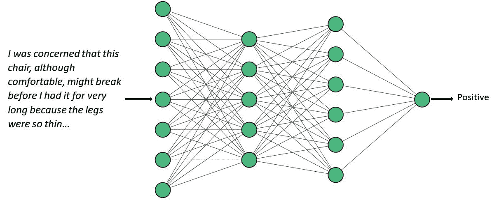

# 第三章：自然语言理解方法 – 基于规则的系统、机器学习和深度学习

本章将回顾最常见的自然语言理解（**NLU**）方法，并讨论每种方法的优缺点，包括基于规则的技术、统计技术和深度学习。还将讨论流行的预训练模型，如**双向编码器表示来自变换器（BERT）**及其变体。我们将了解到，自然语言理解并非单一的技术，它包括一系列可用于不同目标的技术。

本章将涵盖以下主要内容：

+   基于规则的方法

+   传统的机器学习方法

+   深度学习方法

+   预训练模型

+   选择技术时的考虑因素

让我们开始吧！

# 基于规则的方法

基于规则的方法的基本思想是，语言遵循关于单词与其含义之间关系的规则。例如，当我们学习外语时，我们通常会学习有关单词含义的特定规则，了解它们在句子中的排列方式，以及前缀和后缀如何改变单词的意义。基于规则的自然语言理解方法的运作前提是，可以为自然语言理解系统提供这些类型的规则，从而使系统能够像人类一样确定句子的含义。

基于规则的方法在自然语言理解（NLU）中广泛应用，从 1950 年代中期到 1990 年代中期，直到基于机器学习的方法变得流行。然而，仍然有一些自然语言理解问题，基于规则的方法仍然有用，无论是单独使用，还是与其他技术结合使用。

我们将首先回顾与语言各个方面相关的规则和数据。

## 单词与词汇表

几乎每个人都熟悉单词的概念，单词通常被定义为可以单独发音的语言单位。正如我们在*第一章*中看到的，在大多数但并非所有语言中，单词通过空格分隔。语言中的单词集合被称为该语言的**词汇表**。词汇表的概念与我们所认为的字典相对应——它是语言中单词的列表。计算机词汇表还包括有关每个单词的其他信息，特别是它的词性。根据语言的不同，它还可能包括该单词是否有不规则形式的信息（例如，对于不规则的英语动词“*eat*”，其过去式“*ate*”和过去分词“*eaten*”是不规则的）。有些词汇表还包括语义信息，如与每个单词含义相关的词语。

## 词性标注

学校中教授的传统词性包括“*名词*”、“*动词*”、“*形容词*”、*介词*等类别。计算词典中使用的词性通常比这些更为详细，因为它们需要表达比传统类别能够捕捉到的更具体的信息。例如，英语中传统的*动词*类别通常被细分为几个不同的词性，分别对应动词的不同形式，如过去式和过去分词。一个常用的英语词性集是来自 Penn Treebank 的词性（[`catalog.ldc.upenn.edu/LDC99T42`](https://catalog.ldc.upenn.edu/LDC99T42)）。不同的语言在其计算词典中会有不同的词性类别。

处理自然语言时，一个非常有用的任务是为文本中的单词分配词性。这被称为**词性标注**（**POS 标注**）。*表 3.1*展示了句子“*We would like to book a flight from Boston to London*”中，Penn Treebank 词性标签的一个示例：

| **单词** | **词性** | **词性标签的含义** |
| --- | --- | --- |
| we | PRP | 人称代词 |
| would | MD | 情态动词 |
| like | VB | 动词，基本形式 |
| to | TO | 不定式（该词有其独立的词性） |
| book | VB | 动词，基本形式 |
| a | DT | 限定词（冠词） |
| flight | NN | 单数名词 |
| from | IN | 介词 |
| Boston | NNP | 专有名词 |
| to | TO | 不定式 |
| London | NNP | 专有名词 |

表 3.1 – 句子“We would like to book a flight from Boston to London”的词性标注

词性标注不仅仅是查字典并为单词标注词性，因为许多单词有多个词性。在我们的示例中，其中一个就是“*book*”，在这个例子中它作为动词使用，但也常作为名词使用。词性标注算法不仅要看单词本身，还要考虑它的上下文，以确定正确的词性。在这个例子中，“*book*”跟随在“*to*”之后，而“*to*”通常表示下一个单词是动词。

## 语法

语法规则是描述单词在句子中如何排列的规则，以便句子能够被理解，并且能够正确传达作者的意思。它们可以用描述句子及其成分之间部分-整体关系的规则来书写。例如，英语中的一个常见语法规则是句子由名词短语后跟动词短语组成。任何自然语言的完整计算语法通常由数百条规则组成，非常复杂。现在从零开始构建语法并不常见；相反，语法通常已经包含在常用的 Python 自然语言处理库中，如**自然语言工具包**（**NLTK**）和**spaCy**。

## 解析

找出句子各部分之间的关系称为**解析**。这涉及应用语法规则来分析特定句子，展示句子各部分是如何相互关联的。*图 3.1*展示了句子“We would like to book a flight”的解析。在这种解析风格中，称为**依存解析**，单词之间的关系通过连接单词的弧线来表示。例如，“*we*”是动词“*like*”的主语，这一事实通过标记为**nsubj**的弧线将“*like*”与“*we*”连接起来。

图 3.1 – “We would like to book a flight”句子的解析

在此阶段，不必担心解析的细节——我们将在*第八章*中详细讨论。

## 语义分析

解析涉及确定单词在句子中的结构性关系，但它不涉及单词的意义或意义之间的关系。这类处理通过**语义分析**来完成。语义分析有很多方法——这是一个活跃的研究领域——但一种思路是，语义分析从句子的主要动词开始，查看动词与句子中其他部分（如主语、直接宾语和相关介词短语）之间的关系。例如，*图 3.1*中，“*like*”的主语是“*We*”。“*We*”可以描述为“*like*”的“*experiencer*”，因为它被描述为经历“*liking*”的动作。类似地，被喜欢的事物“*to book a flight*”可以描述为“*like*”的“*patient*”。语义分析最常见的做法是应用规则，但也可以通过机器学习技术来完成，下一节将进行介绍。

在不考虑词语在句子中的角色的情况下，找到表示词汇概念之间的语义关系也是有用的。例如，我们可以将“*dog*”看作是“*animal*”的一种，或者我们可以将“*eating*”看作是一种动作。一个有助于找到这类关系的资源是 Wordnet（[`wordnet.princeton.edu/`](https://wordnet.princeton.edu/)），它是一个大型的手工构建数据库，描述了成千上万的英语单词之间的关系。*图 3.2*展示了“*airplane*”这个词的部分 Wordnet 信息，表明飞机是“*heavier-than-aircraft*”的一种，而“*heavier-than-aircraft*”是“*aircraft*”的一种，依此类推，一直到非常一般的类别“*entity*”。

图 3.2 – “airplane”一词的 Wordnet 语义层级

## 实用分析

**语用分析**确定词语和短语在上下文中的意义。例如，在长篇文本中，不同的词可以用来指代相同的事物，或者不同的事物可以用相同的词来指代。这被称为**共指**。例如，句子“*We want to book a flight from Boston to London*”后面可能跟着“*the flight needs to leave before 10 a.m.*”语用分析确定需要在上午 10 点之前起飞的航班就是我们想要预订的航班。

一种非常重要的语用分析方法是**命名实体识别**（**NER**），它将文本中出现的引用与现实世界中对应的实体关联起来。*图 3.3*展示了对句子“*Book a flight to London on United for less than 1,000 dollars*”的 NER 分析。“*London*”是一个命名实体，被标记为地理位置，“*United*”被标记为组织，“*less than 1,000 dollars*”被标记为货币金额：

图 3.3 – “Book a flight to London on United for less than 1,000 dollars” 的 NER 分析

## 管道

在自然语言处理应用中，我们刚才描述的步骤通常作为**管道**来实现；即一系列步骤，其中一个步骤的结果是下一个步骤的输入。例如，一个典型的 NLP 管道可能如下所示：

+   **词汇查找**：在应用程序的字典中查找词语

+   **词性标注**：为每个词在上下文中分配词性

+   **句法分析**：确定词语之间的关系

+   **语义分析**：确定单词的意义及句子的整体意义

+   **语用分析**：确定依赖于更广泛上下文的意义方面，例如代词的解释

使用管道的一个优点是每个步骤可以使用不同的技术来实现，只要该步骤的输出格式符合下一个步骤的预期格式。因此，管道不仅在基于规则的方法中有用，也在我们将在接下来的部分描述的其他技术中有用。

有关基于规则技术的更多细节将在*第八章*中提供。

我们现在将转向那些不那么依赖语言规则，而更多依赖机器学习与现有数据的技术。

# 传统的机器学习方法

虽然基于规则的方法提供了非常精细和具体的语言信息，但这些方法也存在一些缺点，这促使了替代方法的发展。主要有两个缺点：

+   开发用于基于规则的方法的规则可能是一个繁琐的过程。规则开发可以由专家直接编写规则，基于他们对语言的理解，或者更常见的是，规则可以从标注了正确分析的文本示例中推导出来。这两种方法都可能是昂贵且耗时的。

+   规则不太可能普遍适用于系统遇到的每个文本。制定这些规则的专家可能忽视了一些情况，标注的数据可能没有覆盖每种情况的示例，且说话者可能会犯错，如错误的开始，尽管这些错误没有被任何规则覆盖，但仍需分析。书面语言可能包含拼写错误，从而导致一些词汇不在词汇表中。最后，语言本身可能会发生变化，产生新的单词和短语，而这些新词和新短语并不在现有规则中涵盖。

出于这些原因，基于规则的方法主要作为自然语言理解（NLU）管道的一部分使用，补充其他技术。

传统的机器学习方法受到分类问题的驱动，在这些问题中，相似意思的文档可以被分组。分类问题中需要解决两个问题：

+   以某种方式表示训练集中的文档，使得同一类别中的文档具有相似的表示

+   决定如何根据与训练集中文档的相似度对新的、先前未见过的文档进行分类

## 表示文档

文档的表示是基于单词的。一种非常简单的方法是假设文档应该仅仅通过它包含的单词集合来表示。这种方法被称为**词袋模型**（**BoW**）。使用 BoW 进行文档表示的最简单方法是列出语料库中的所有单词，然后对于每个文档和每个单词，指出该单词是否出现在该文档中。

例如，假设我们有一个由三个文档组成的语料库，如*图 3.4*所示：

图 3.4 – 小型餐厅查询语料库

这个玩具语料库的整个词汇表包含 29 个词，因此每个文档都与一个长度为 29 的列表相关联，列表中指出了每个单词是否出现在该文档中。这个列表将*出现*表示为`1`，将*未出现*表示为`0`，如*表 3.2*所示：

|  | **a** | **an** | **any** | **are** | **aren’t** | **away** | **Chinese** | **Eastern** | **…** |
| --- | --- | --- | --- | --- | --- | --- | --- | --- | --- |
| 1 | 1 | 0 | 0 | 0 | 0 | 0 | 1 | 0 | … |
| 2 | 0 | 1 | 0 | 0 | 0 | 0 | 0 | 0 | … |
| 3 | 0 | 0 | 1 | 1 | 1 | 1 | 0 | 1 | … |

表 3.2 – 小语料库的词袋模型（BoW）

*表 3.2* 显示了这三份文档中词汇表前八个单词的词袋（BoW）列表。*表 3.2*中的每一行代表一个文档。例如，单词“*a*”在第一个文档中出现一次，但单词“*an*”没有出现，因此其条目是*0*。这种表示在数学上是一个*向量*。向量是 NLU 中的一种强大工具，我们将在后面详细讨论它们。BoW 表示法可能看起来非常简单（例如，它没有考虑单词的顺序信息）。然而，这一概念的其他变种更为强大，稍后将在*第九章*至*第十二章*中讨论。

## 分类

BoW 方法背后的假设是，两个文档中共享的单词越多，它们的意义就越相似。这不是一条硬性规则，但事实证明，在实践中非常有用。

对于许多应用，我们希望将含义相似的文档分组到不同的类别中。这就是**分类**的过程。如果我们想将一个新文档分类到这些类别中的某一类，我们需要找出它的向量与每个类别中其他文档的向量的相似度。例如，在*第一章*中讨论的情感分析任务，就是将文档分类为两类——关于文本主题的积极或消极情感。

已经使用了许多算法来对文本文件进行分类。朴素贝叶斯和**支持向量机**（**SVMs**），将在*第九章*中讨论，是其中最受欢迎的两种。神经网络，特别是**递归神经网络**（**RNNs**），也很受欢迎。神经网络将在下一节简要讨论，并将在*第十章*中详细讨论。

在本节中，我们总结了一些在传统机器学习中使用的方法。现在，我们将把注意力转向基于深度学习的新方法。

# 深度学习方法

神经网络，特别是通常称为**深度学习**的大型神经网络，近年来在自然语言理解（NLU）中变得非常流行，因为它们显著提高了早期方法的准确性。

神经网络的基本概念是，它们由多个连接单元的层组成，这些单元被称为**神经元**，类似于动物神经系统中的神经元。神经网络中的每个神经元都与其他神经元相连接。如果一个神经元从其他神经元接收到适当的输入，它将被激活，或者将输入发送到另一个神经元，而后者则会根据接收到的其他输入决定是否激活。在训练过程中，会调整神经元上的权重，以最大化分类准确性。

*图 3.5* 显示了一个四层神经网络执行情感分析任务的示例。神经元是由线连接的圆圈。最左边的第一层接收文本输入，接着两个隐藏层的神经元处理该输入，最终的输出层中的单个神经元给出结果（*正面*）：

图 3.5 – 一个四层神经网络，用于对产品评论进行情感分析

尽管神经网络背后的概念已经存在多年，但能够执行重大任务的大型神经网络的实现直到最近几年才得以实现，这得益于之前计算资源的限制。它们目前的流行性主要是因为它们通常比早期的方法更准确，特别是在有足够的训练数据的情况下。然而，训练一个神经网络以执行大规模任务的过程可能非常复杂且耗时，并且可能需要专家数据科学家的帮助。在某些情况下，神经网络所提供的额外准确性不足以证明开发该系统的额外成本是合理的。

深度学习和神经网络将在*第十章*中详细讨论。

# 预训练模型

最新的自然语言理解方法基于这样的理念：理解自然语言所需的许多信息，可以通过处理通用文本（如互联网文本）来为多个不同的应用提供，从而创建一个语言的基准模型。这些模型中的一些非常庞大，基于大量的数据。为了将这些模型应用于特定的应用，通用模型通过使用特定应用的训练数据进行适应，这一过程被称为**微调**。由于基准模型已经包含了大量关于语言的通用信息，因此所需的训练数据量通常比某些传统方法所需的训练数据少得多。这些流行的技术包括 BERT 及其许多变种，以及**生成预训练变换器**（**GPTs**）及其变种。

预训练模型将在*第十一章*中详细讨论。

# 选择技术时的考虑因素

本章介绍了四类自然语言理解技术：

+   基于规则的

+   统计机器学习

+   深度学习和神经网络

+   预训练模型

我们应该如何决定应该采用哪种技术或技术组合来解决特定问题呢？这些考虑因素主要是实际性的，涉及到创建可行解决方案所需的成本和努力。让我们来看一下每种方法的特点。

*表 3.3* 列出了我们在本章中回顾的四种自然语言理解（NLU）方法，并对它们在开发者专业知识、所需数据量、训练时间、准确性和成本方面进行了比较。如 *表 3.3* 所示，每种方法都有优点和缺点。对于那些不需要大量数据的小型或简单问题，基于规则的、深度学习或预训练方法应该被强烈考虑，至少可以作为管道的一部分。虽然预训练模型准确性高，且开发成本相对较低，但开发者可能更倾向于避免使用云服务或管理本地计算资源上的大型模型的成本。

|  | **开发者** **专业知识** | **所需数据量** | **训练时间** | **准确性** | **成本** |
| --- | --- | --- | --- | --- | --- |
| 基于规则的 | 高（语言学家或领域专家） | 少量领域特定数据 | 专家写规则需要大量时间 | 如果规则准确，成本高 | 规则开发可能成本较高；计算机时间成本较低 |
| 统计方法 | 中等 - 使用标准工具；需要一些 NLP/数据科学专业知识 | 中等量的领域特定数据 | 大量的标注时间 | 中等 | 数据标注可能成本较高；计算机时间成本较低 |
| 深度学习 | 高（数据科学家） | 大量领域特定数据 | 大量标注时间；训练模型需要额外的计算时间 | 中等偏高 | 一些云服务或本地计算资源的费用 |
| 预训练模型 | 中等 - 使用标准工具，具备一定的数据科学专业知识 | 少量领域特定数据 | 中等量的时间标注数据以微调模型 | 高 | 一些云服务或本地计算资源的费用 |

表 3.3 – NLU 一般方法的比较

最重要的考虑因素是所要解决的问题以及可接受的成本。还应记住，选择某种技术并不是一个永久性的承诺，特别是对于那些依赖标注数据的方法，这些数据可以被用于多种方法。

# 小结

在本章中，我们概述了可以在 NLU 应用中使用的各种技术，并学到了几个重要的技能。

我们学习了基于规则的方法是什么，以及主要的基于规则的技术，包括词性标注和句法分析等主题。接着，我们学习了重要的传统机器学习技术，特别是文本文件如何进行数字化表示的方法。然后，我们关注了现代深度学习技术的优缺点以及预训练模型的优势。

在下一章中，我们将回顾开始进行自然语言理解（NLU）所需的基础知识——安装 Python，使用 Jupyter Labs 和 GitHub，使用 NLU 库（如 NLTK 和 spaCy），以及如何在这些库之间进行选择。
