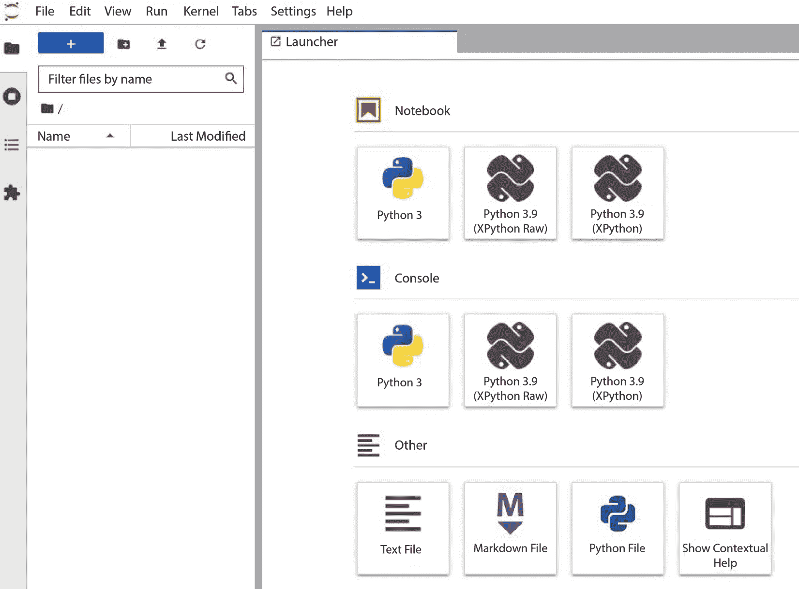
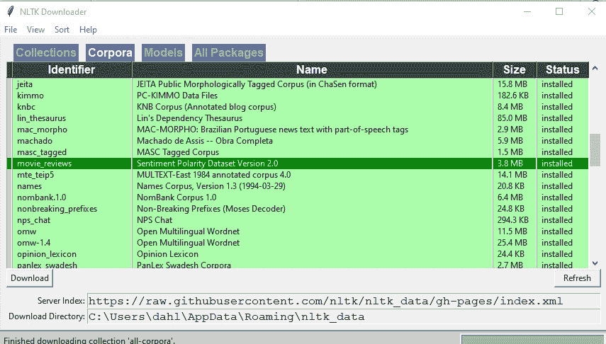
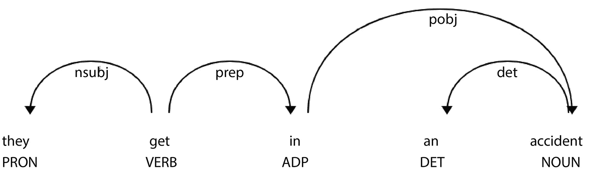
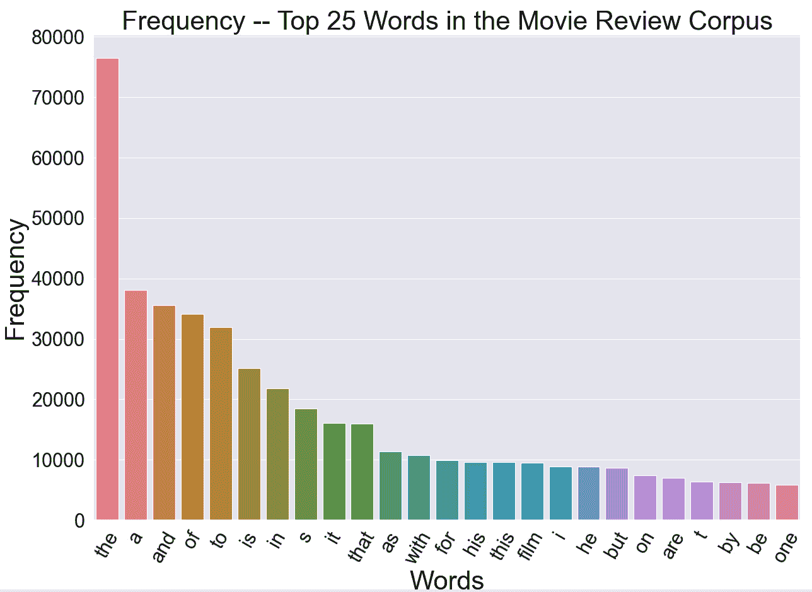
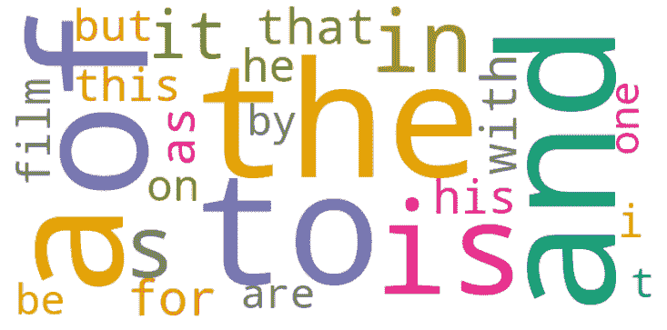
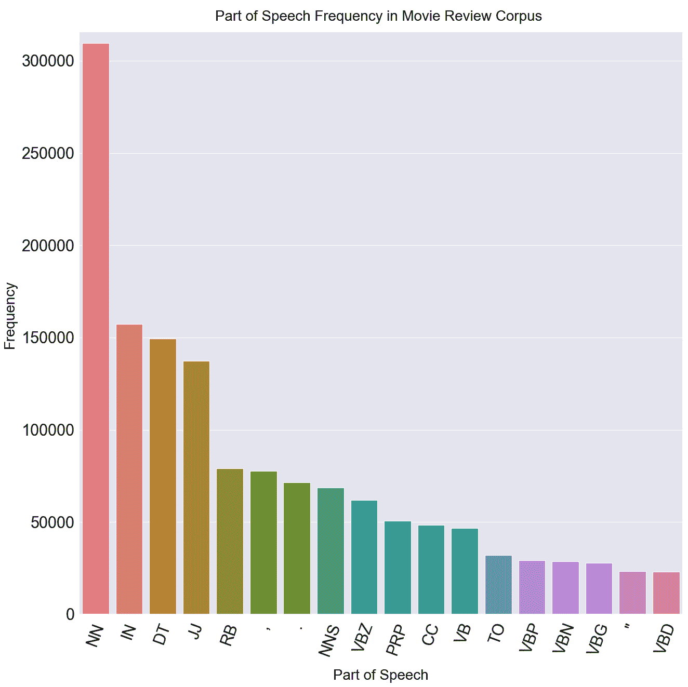

# 第四章：选择自然语言理解的库和工具

本章将帮助你设置处理自然语言的环境。我们将首先讨论如何安装 Python，然后讨论一些常用的开发工具，如 JupyterLab 和 GitHub。我们还将回顾几个主要的 Python **自然语言处理**（**NLP**）库，包括 **自然语言工具包**（**NLTK**）、**spaCy** 和 **TensorFlow/Keras**。

**自然语言理解**（**NLU**）技术受益于一系列非常强大且免费的工具。虽然这些工具非常强大，但没有一个库可以完成所有应用所需的所有 NLP 任务，因此理解不同库的优缺点以及如何将它们结合起来非常重要。

最好地利用这些工具将大大加速任何自然语言理解（NLU）开发项目。这些工具包括 Python 语言本身、开发工具如 JupyterLab，以及许多可以执行多种 NLU 任务的特定自然语言库。 同样重要的是要知道，由于这些工具被许多开发人员广泛使用，像 Stack Overflow（[`stackoverflow.com/`](https://stackoverflow.com/)）这样的活跃在线社区已经发展起来。这些都是解决特定技术问题的绝佳资源。

本章将涵盖以下主题：

+   安装 Python

+   开发软件—JupyterLab 和 GitHub

+   探索这些库

+   查看一个示例

由于有许多在线资源可以使用 Python、JupyterLab 和 GitHub 等工具，因此我们这里只会简要概述它们的使用，以便能够将更多时间集中在 NLP 上。

注意

为了简便起见，我们将演示如何在基础系统中安装这些库。然而，你可能希望在虚拟环境中安装这些库，特别是当你正在进行多个 Python 项目时。以下链接可能有助于安装虚拟环境：[`packaging.python.org/en/latest/guides/installing-using-pip-and-virtual-environments/`](https://packaging.python.org/en/latest/guides/installing-using-pip-and-virtual-environments/)。

# 技术要求

要运行本章中的示例，你需要以下软件：

+   Python 3

+   `pip` 或 `conda`（建议使用 `pip`）

+   JupyterLab

+   NLTK

+   spaCy

+   Keras

接下来的章节将介绍安装这些软件包的过程，建议按照这里列出的顺序安装它们。

# 安装 Python

设置开发环境的第一步是安装 Python。如果你已经在系统上安装了 Python，可以跳到下一节，但请确保你的 Python 安装包括 Python 3，因为大多数 NLP 库都需要 Python 3。你可以通过在命令行窗口输入以下命令来检查你的 Python 版本，版本号将会显示出来：

```py
 $ python --version
```

注意，如果你同时安装了 Python 2 和 Python 3，你可能需要运行 `python3 –version` 命令来检查 Python 3 的版本。如果你没有安装 Python 3，你将需要安装它。一些 NLP 库不仅要求 Python 3，还要求 Python 3.7 或更高版本，因此，如果你的 Python 版本低于 3.7，你将需要更新它。

Python 可以在你选择的几乎所有操作系统上运行，包括 Windows、macOS 和 Linux。你可以从 [`www.python.org`](http://www.python.org) 下载适用于你的操作系统的 Python。下载适合操作系统的可执行安装程序并运行。当 Python 安装完成后，你可以通过在命令行或终端中运行上述命令来检查安装情况。你将看到你刚安装的版本，如以下命令行输出所示：

```py
$ python --version
Python 3.8.5
```

这将安装 Python，但你还需要安装 NLP 的附加库。安装库的操作是通过辅助程序 `pip` 和 `conda` 完成的。

`pip` 和 `conda` 是两个跨平台工具，可以用来安装 Python 库。在本书中，我们将使用它们来安装几种重要的自然语言处理库和 `pip`，但如果你更喜欢使用 `conda` 作为 Python 管理工具，也是可以的。`pip` 默认包含在 Python 3.4 及更高版本中，而由于你将需要 3.7 版本来安装 NLP 库，`pip` 应该已经在你的 Python 环境中可用。你可以使用以下命令检查版本：

```py
$ pip --version
```

你应该看到以下输出：

```py
$ pip 21.3.1 from c:\<installation dir>\pip (python 3.9)
```

在接下来的章节中，我们将讨论我们将使用的开发环境：JupyterLab。

# 开发软件 – JupyterLab 和 GitHub

开发环境对开发过程的效率至关重要。在这一节中，我们将讨论两个流行的开发资源：JupyterLab 和 GitHub。如果你熟悉其他 Python **交互式开发环境**（**IDE**），你可以继续使用你熟悉的工具。然而，本书中的示例将在 JupyterLab 环境中展示。

## JupyterLab

JupyterLab 是一个跨平台的编码环境，使得你可以在无需大量设置时间的情况下，轻松地实验不同的工具和技术。它在浏览器环境中运行，但不需要云服务器——本地服务器就足够了。

安装 JupyterLab 可以通过以下 `pip` 命令完成：

```py
$ pip install jupyterlab
```

一旦安装了 JupyterLab，你可以使用以下命令运行它：

```py
$ jupyter lab
```

该命令应在你希望存放代码的目录中的命令行中运行。该命令将启动一个本地服务器，并且 Jupyter 环境将在浏览器窗口中出现，如 *图 4.1* 所示：



图 4.1 – JupyterLab 启动时的用户界面

*图 4.1* 中显示的环境包括三种内容，如下所示：

+   **笔记本**—包含你的编程项目

+   **控制台**—让你可以直接在 Jupyter 笔记本中访问命令行或终端功能

+   `start`命令已运行

当你点击**Python 3**图标下的**Notebook**时，你将得到一个新的笔记本，显示一个代码单元，你就可以开始用 Python 编写代码。我们将在本章稍后的*查看示例*部分返回到 JupyterLab 环境，并开始用 Python 编程，*第五章*中也会有相关内容。

## GitHub

你们中的许多人可能已经熟悉 GitHub，这是一个流行的开源代码仓库系统（[`github.com`](https://github.com)）。GitHub 提供了非常广泛的功能，用于存储和共享代码、开发代码分支以及文档化代码。GitHub 的核心功能目前是免费的。

本书中使用的代码示例可以在[`github.com/PacktPublishing/Natural-Language-Understanding-with-Python`](https://github.com/PacktPublishing/Natural-Language-Understanding-with-Python)找到。

下一步是学习几个重要的库，包括我们将在接下来的章节中广泛使用的 NLTK、spaCy 和 Keras。

# 探索库

在本节中，我们将回顾几个在自然语言处理（NLP）中使用的主要 Python 库；具体来说是 NLTK、spaCy 和 Keras。这些都是非常有用的库，能够执行大多数基础的 NLP 任务。然而，随着你在 NLP 领域经验的积累，你还会发现一些额外的 NLP 库，可能适用于特定任务，鼓励你去探索这些库。

## 使用 NLTK

NLTK（[`www.nltk.org/`](https://www.nltk.org/)）是一个非常流行的开源 Python 库，它通过提供对许多常见任务的支持，极大地减少了开发自然语言应用程序的工作量。NLTK 还包括许多语料库（即一套可以直接使用的自然语言文本），这些语料库可以用于探索 NLP 问题和测试算法。

在本节中，我们将介绍 NLTK 的功能，并讨论 NLTK 的安装过程。

正如我们在*第三章*中讨论的那样，在自然语言理解（NLU）管道中可以执行许多不同的任务，处理从原始单词到最终确定文档含义的过程。NLTK 可以执行其中许多任务。这些功能大多数本身并不会直接提供有用的结果，但它们可以作为管道的一部分，提供很大的帮助。

在几乎所有自然语言项目中，一些基本任务可以轻松通过 NLTK 完成。例如，待处理的文本需要在处理前被拆分成单词。我们可以使用 NLTK 的`word_tokenize`函数来实现这一点，如下所示的代码片段所示：

```py
import nltk
import string
from nltk import word_tokenize
text = "we'd like to book a flight from boston to London"
tokenized_text = word_tokenize(text)
print(tokenized_text)
```

结果将是一个单词数组：

```py
['we',
 "'d",
 'like',
 'to',
 'book',
 'a',
 'flight',
 'from',
 'boston',
 'to',
'London']
```

请注意，单词`we'd`被分为两个部分，`we`和`'d`，因为它是一个缩写，实际上代表了两个词：*we*和*would*。

NLTK 还提供了一些用于基本统计的函数，比如计算文本中单词频率。例如，从我们刚才看到的文本 *我们想要预定从波士顿到伦敦的航班* 开始，我们可以使用 NLTK 的 `FreqDist()` 函数来计算每个单词出现的频率：

```py
from nltk.probability import FreqDist
FreqDist(tokenized_text)
FreqDist({'to': 2, 'we': 1, "'d": 1, 'like': 1, 'book': 1, 'a': 1, 'flight': 1, 'from': 1, 'boston': 1, 'london': 1})
```

在这个例子中，我们从 NLTK 的 `probability` 包中导入了 `FreqDist()` 函数，并用它来统计文本中每个单词的频率。结果是一个 Python 字典，其中键是单词，值是单词出现的次数。单词 `to` 出现了两次，其他每个单词出现了一次。对于如此简短的文本，频率分布并没有特别的启示性，但在查看更大量数据时，它会非常有用。我们将在本章稍后的 *查看示例* 部分看到一个大语料库的频率分布。

NLTK 还可以执行 `nltk.pos_tag(tokenized_text)` 函数来进行词性标注：

```py
nltk.pos_tag(tokenized_text)
[('we', 'PRP'),
 ("'d", 'MD'),
 ('like', 'VB'),
 ('to', 'TO'),
 ('book', 'NN'),
 ('a', 'DT'),
 ('flight', 'NN'),
 ('from', 'IN'),
 ('boston', 'NN'),
 ('to', 'TO'),
 ('london', 'VB')]
```

类似地，NLTK 提供了用于解析文本的函数。回想一下，*第三章*讨论了解析。正如*第一章*中所讨论的，NLTK 还提供了创建和应用 **正则** **表达式** (**regexes**) 的函数。

这些是 NLTK 最有用的功能之一。NLTK 的完整功能集合过于庞大，无法在这里列出，但我们将在 *第六章* 和 *第八章* 中回顾这些其他功能。

### 安装 NLTK

NLTK 需要 Python 3.7 或更高版本。在 Windows 上的安装过程是运行以下命令：

```py
$ pip install nltk
```

对于 Mac 或 Unix 环境，在终端窗口中运行以下命令：

```py
$ pip install --user -U nltk
```

在下一节中，我们将介绍另一个流行的 NLU 库，spaCy，并解释它能做什么。与 NLTK 一样，我们将在后续章节中广泛使用 spaCy。

## 使用 spaCy

spaCy 是另一个非常流行的包，可以执行与 NLTK 相似的许多 NLP 任务。两个工具包都非常强大。spaCy 通常更快，因此更适合用于已部署的应用程序。两个工具包都支持多种语言，但并非所有 NLU 任务都支持所有语言，因此在选择 NLTK 和 spaCy 时，考虑特定应用的语言需求非常重要。

与 NLTK 一样，spaCy 也可以执行许多基本的文本处理功能。让我们来看看吧！

在 spaCy 中设置分词的代码与 NLTK 中的代码非常相似，只有函数名称略有不同。结果是一个包含单词的数组，每个元素都是一个标记。请注意，`nlp` 对象是使用 `en_core_web_sm` 模型初始化的，该模型告诉它使用特定网页数据集的统计信息，`en_core_web_sm`：

```py
import spacy
from spacy.lang.en import English
nlp = spacy.load('en_core_web_sm')
text = "we'd like to book a flight from boston to london"
doc = nlp(text)
print ([token.text for token in doc])
['we', "'d", 'like', 'to', 'book', 'a', 'flight', 'from', 'boston', 'to', 'london']
```

我们还可以计算文本中单词出现频率等统计数据：

```py
from collections import Counter
word_freq = Counter(words)
print(word_freq)
Counter({'to': 2, 'we': 1, "'d": 1, 'like': 1, 'book': 1, 'a': 1, 'flight': 1, 'from': 1, 'boston': 1, 'london': 1})
```

spaCy 和 NLTK 之间唯一的区别是，NLTK 使用 `FreqDist` 函数，而 spaCy 使用 `Counter` 函数。结果——一个 Python 字典，单词作为键，频率作为值——在这两个库中是相同的。

和 NLTK 一样，我们也可以使用 spaCy 执行词性标注：

```py
for token in doc:
    print(token.text, token.pos_)
```

这将产生以下的词性标注结果：

```py
we PRON
'd AUX
like VERB
to PART
book VERB
a DET
flight NOUN
from ADP
boston PROPN
to ADP
london PROPN
```

不幸的是，NLTK 和 spaCy 使用不同的标签来表示不同的词性。这不一定是一个问题，因为即使对于同一种语言，也没有*正确的*或*标准的*词性集合。然而，在一个应用程序中，词性的一致性是非常重要的，所以开发者需要意识到这种差异，并确保不要混淆 NLTK 和 spaCy 的词性。

spaCy 还有另一个非常有用的功能，那就是**命名实体识别**（**NER**）。NER 是识别文本中提到的特定人物、组织、地点或其他实体的任务。NER 可以作为一个独立的任务，也可以是另一个任务的一部分。例如，一家公司可能会对自己产品在 Facebook 上的提及感兴趣，那么他们只需要进行产品的 NER。另一方面，如果一家公司想知道他们的产品是以积极还是消极的方式被提及，他们就需要同时执行 NER 和**情感分析**（**SA**）。

大多数 NLP 库都可以执行命名实体识别（NER）；然而，在 spaCy 中特别容易做到。给定一个文档，我们只需要请求使用 `ent` 样式渲染文档，如下所示：

```py
import spacy
nlp = spacy.load("en_core_web_sm")
text = "we'd like to book a flight from boston to new york"
doc = nlp(text)
displacy.render(doc,style='ent',jupyter=True,options={'distance':200})
```

渲染结果显示，`boston` 和 `new york` 这两个命名实体被赋予了**地理政治实体**（**GPE**）标签，如 *图 4.2* 所示：


图 4.2 – 对于“我们想预订从波士顿到纽约的航班”的命名实体识别（NER）

解析或分析句子中单词之间的句法关系非常容易，只需将 `style` 参数的值从 `ent` 改为 `dep`，几乎可以使用相同的代码。稍后我们将在 *图 4.6* 中看到一个句法解析的示例：

```py
nlp = spacy.load('en_core_web_sm')
doc = nlp('they get in an accident')
displacy.render(doc,style='dep',jupyter=True,options={'distance':200})
```

安装 spaCy 可以通过以下 `pip` 命令完成：

```py
$ pip install -U spacy
```

接下来我们要看的库是 Keras ML 库。

## 使用 Keras

Keras ([`keras.io/`](https://keras.io/)) 是另一个流行的 Python NLP 库。Keras 比 NLTK 或 spaCy 更加专注于机器学习（ML），并将在本书中作为 NLP **深度学习**（**DL**）应用的首选库。它建立在另一个名为 TensorFlow ([`www.tensorflow.org/`](https://www.tensorflow.org/)) 的包之上，TensorFlow 是由 Google 开发的。由于 Keras 是基于 TensorFlow 构建的，因此可以在 Keras 中使用 TensorFlow 的函数。

由于 Keras 专注于机器学习（ML），它在文本预处理方面的功能有限。例如，与 NLTK 或 spaCy 不同，它不直接支持词性标注（POS tagging）或句法分析（parsing）。如果需要这些功能，最好使用 NLTK 或 spaCy 来进行文本预处理。Keras 支持分词和去除多余的标记，例如标点符号和 HTML 标记。

Keras 特别适用于使用**神经网络**（**NN**）的文本处理应用。这将在 *第十章* 中详细讨论。尽管 Keras 包含的高阶功能较少，不能一步完成像词性标注（POS tagging）或句法分析（parsing）这样的 NLP 功能，但它确实提供了从数据集训练词性标注器并将其部署到应用中的能力。

由于 Keras 已包含在 TensorFlow 中，安装 TensorFlow 时会自动安装 Keras。因此，不需要额外安装 Keras。只需执行以下命令即可：

```py
$ pip install tensorflow
```

## 了解其他 NLP 库

还有不少其他 Python 库也包括 NLP 功能，并且在某些情况下非常有用。这些库包括 PyTorch（[`pytorch.org/`](https://pytorch.org/)），它基于**深度神经网络**（**DNN**）进行处理；scikit-learn（[`scikit-learn.org/stable/`](https://scikit-learn.org/stable/)），它包含一般的机器学习（ML）功能；以及 Gensim（[`radimrehurek.com/gensim/`](https://radimrehurek.com/gensim/)），用于主题建模等等。然而，我建议你首先使用我们这里介绍的基本包来做几个项目，直到你对 NLP 更加熟悉。如果以后你有对额外功能、不同语言或比基本包更快的处理速度的需求，再去探索这些其他的包。

在下一个话题中，我们将讨论如何在 NLP 库中进行选择。值得记住的是，选择库并不是一个“非此即彼”的过程——如果一个库有其他库没有的优点，可以轻松地将不同的库混合使用。

## 在 NLP 库中进行选择

前面讨论的库都非常有用且强大。在某些情况下，它们的功能有所重叠。这就提出了一个问题：如何在特定应用中选择使用哪些库。尽管所有这些库都可以在同一个应用中组合使用，但如果使用较少的库，可以降低应用的复杂性。

NLTK 在语料库统计和基于规则的语言学预处理中非常强大。例如，一些有用的语料库统计包括计数单词、计数词性、计数词对（bigrams），以及列出上下文中的单词（concordances）。spaCy 速度很快，其 displaCy 可视化库对于了解处理结果非常有帮助。Keras 在深度学习（DL）方面非常强大。

在项目的生命周期中，通常有必要从一些工具开始，帮助你快速获得数据的整体概览，例如 NLTK 和 spaCy。这一初步分析将有助于选择需要的工具，以进行全面的处理和部署。由于使用 Keras 等工具训练深度学习模型可能非常耗时，因此使用更传统的方法进行一些初步调查将有助于缩小需要进一步调查的范围，从而选择合适的深度学习方法。

## 了解其他对 NLP 有用的包

除了直接支持自然语言处理（NLP）的包外，还有许多其他有用的通用开源 Python 包，提供了用于一般数据管理的工具，包括自然语言数据。这些包包括以下内容：

+   **NumPy**: NumPy（[`numpy.org/`](https://numpy.org/)）是一个强大的包，包含许多用于数值计算的函数，我们将在*第九章*、*第十章*、*第十一章*和*第十二章*中使用这些函数

+   **pandas**: pandas（[`pandas.pydata.org/`](https://pandas.pydata.org/)）提供了用于数据分析和处理的一般工具，包括自然语言数据，特别是表格形式的数据

+   **scikit-learn**: scikit-learn 是一个强大的机器学习包，包括文本处理功能（[`scikit-learn.org/stable/`](https://scikit-learn.org/stable/)）

还有几个可视化包，对于数据的图形表示和处理结果非常有帮助。可视化在 NLP 开发中非常重要，因为它通常能比数字表格提供更易理解的结果表示。例如，可视化可以帮助你发现趋势、定位错误并比较实验条件。我们将在全书中使用可视化工具，尤其是在*第六章*中。可视化工具包括用于表示不同类型数字结果的通用工具，无论这些结果是否与 NLP 相关，也包括专门设计用于表示自然语言信息（如句法分析和命名实体识别结果）的工具。可视化工具包括以下内容：

+   **Matplotlib**: Matplotlib（[`matplotlib.org/`](https://matplotlib.org/)）是一个流行的 Python 可视化库，尤其擅长创建数据图表，包括 NLP 数据。如果你尝试比较使用几种不同技术处理的结果，绘制结果图表通常可以迅速提供有关这些技术效果的洞察，这对评估非常有帮助。我们将在*第十三章*中再次讨论评估主题。

+   **Seaborn**：Seaborn（[`seaborn.pydata.org/`](https://seaborn.pydata.org/)）基于 Matplotlib，能够帮助开发者绘制出代表统计信息的美观图表。

+   **displaCy**：displaCy 是 spaCy 工具的一部分，特别擅长表示自然语言结果，如词性标注、句法分析和命名实体，这些我们在*第三章*中讨论过。

+   **WordCloud**：WordCloud（[`amueller.github.io/word_cloud/`](https://amueller.github.io/word_cloud/)）是一个专门用于可视化语料库中单词频率的库，当单词频率很重要时非常有用。我们将在下一部分看到一个词云的示例。

到目前为止，我们已经回顾了软件开发环境的技术要求以及我们将要使用的 NLP 库。在接下来的部分，我们将通过一个示例将所有内容结合起来。

# 查看一个示例

为了说明这些概念，我们将在 JupyterLab 中做一个示例，探索电影评论的情感分析（SA）任务。我们将看看如何应用 NLTK 和 spaCy 包来了解数据的特征，这将帮助我们规划后续的处理步骤。

我们将要查看的数据集是一个流行的 2,000 条电影评论集，按评论者是否表达了对电影的积极或消极情感进行分类（[`www.cs.cornell.edu/people/pabo/movie-review-data/`](http://www.cs.cornell.edu/people/pabo/movie-review-data/)）。

数据集引用

*Bo Pang* 和 *Lillian Lee*，*Seeing stars: Exploiting class relationships for sentiment categorization with respect to rating scales*, *Proceedings of the* *ACL*, *2005*。

这是情感分析（SA）任务的一个很好的示例，我们在*第一章*中已经介绍过。

## 设置 JupyterLab

我们将使用 JupyterLab，所以让我们启动它。正如我们之前看到的，你可以通过在命令（Windows）或终端（Mac）窗口中输入以下命令来启动 JupyterLab：

```py
$ jupyter lab
```

这将启动一个本地 Web 服务器，并在 Web 浏览器中打开 JupyterLab 窗口。在 JupyterLab 窗口中，通过选择**文件** | **新建** | **笔记本**来打开一个新的笔记本，随后会出现一个未命名的笔记本（你可以随时通过选择**文件** | **重命名笔记本**来更改其名称）。

我们将从导入我们将在这个示例中使用的库开始，如下所示。我们将使用 NLTK 和 spaCy 的 NLP 库，以及一些用于数值运算和可视化的通用库。随着示例的展开，我们将看到这些库的使用方法：

```py
# NLP imports
import nltk
import spacy
from spacy import displacy
# general numerical and visualization imports
import pandas as pd
import seaborn as sns
import matplotlib.pyplot as plt
from collections import Counter
import numpy as np
```

在 JupyterLab 单元格中输入上述代码并运行。运行此单元格（**运行** | **运行选定单元格**）将导入库，并为你创建一个新的代码单元格。

通过在新的代码单元格中输入`nltk.download()`来下载电影评论数据。这将打开一个新的**NLTK 下载器**窗口，如*图 4.3*所示：



图 4.3 – NLTK 下载窗口

在`movie_reviews`上。点击**下载**按钮下载语料库。如果你想改变数据下载的路径，可以选择**文件** | **更改下载目录**。点击**文件** | **退出**退出下载窗口并返回到 JupyterLab 界面。

如果你查看你下载数据的目录，你会看到两个文件夹：`neg`和`pos`。这些文件夹分别包含负面和正面评论。这代表了评论的标注，即人工标注员对于评论是正面还是负面的判断。这种目录结构是文本分类标注的常见方式，你将在许多数据集中看到它。`movie_reviews`文件夹中的`README`文件解释了标注的具体细节。

如果你查看语料库中的一些电影评论，你会发现，文本的正确标注并不总是显而易见的。

下一个代码块显示了导入评论并打印语料库中的一个句子：

```py
#import the training data
from nltk.corpus import movie_reviews
sents = movie_reviews.sents()
print(sents)
[['plot', ':', 'two', 'teen', 'couples', 'go', 'to', 'a', 'church', 'party', ',', 'drink', 'and', 'then', 'drive', '.'], ['they', 'get', 'into', 'an', 'accident', '.'], ...]
In [5]:
sample = sents[9]
print(sample)
['they', 'seem', 'to', 'have', 'taken', 'this', 'pretty', 'neat', 'concept', ',', 'but', 'executed', 'it', 'terribly', '.']
```

由于`movie_reviews`是一个 NLTK 语料库，提供了多种语料库方法，包括将句子列出为单独的句子数组。我们还可以按编号选择语料库中的单个句子，如前面的代码块所示，我们选择并打印了语料库中的第九个句子。

你可以看到句子已经被分词，或者说被拆分成了单个单词（包括标点符号）。这是几乎所有自然语言处理应用中的重要准备步骤。

## 处理一个句子

现在，让我们对这个样本文本进行实际的自然语言处理。我们将使用 spaCy 库进行词性标注和基于规则的解析，然后使用 displaCy 库可视化结果。

我们首先需要创建一个基于网页数据的`nlp`对象，`en_core_web_sm`，它是一个基本的小型英语模型。虽然也有更大的模型可用，但它们加载速度较慢，因此为了简便起见，我们在这里使用小型模型。接着，我们使用`nlp`对象识别词性并解析这个句子，如以下代码块所示：

```py
nlp = spacy.load('en_core_web_sm')
doc = nlp('they get in an accident')
displacy.render(doc,style='dep',jupyter=True,options={'distance':200})
```

在`displacy.render`命令中，我们请求了一个依赖解析（`styles='dep'`）。这是一种我们将在**第八章**中详细探讨的分析方法。目前，简单来说，它是展示句子中各单词之间关系的常见方法。最终的依赖解析如*图 4.4*所示：



图 4.4 – “他们发生了事故”的依赖解析

现在我们已经加载了语料库并查看了其中的一些句子示例，接下来我们将查看语料库的一些整体属性。

## 查看语料库属性

虽然语料库有许多属性，但一些最有趣且富有洞察力的属性是单词频率和词性频率，我们将在接下来的两节中回顾这些内容。不幸的是，由于篇幅限制，我们无法详细探讨其他语料库属性，但查看单词和词性频率应该能帮助你入门。

### 单词频率

在本节中，我们将查看整个语料库的一些属性。例如，我们可以使用以下代码查看最频繁的单词：

```py
words = movie_reviews.words()
word_counts = nltk.FreqDist(word.lower() for word in words if word.isalpha())
top_words = word_counts.most_common(25)
all_fdist = pd.Series(dict(top_words))
# Setting fig and ax into variables
fig, ax = plt.subplots(figsize=(10,10))
# Plot with Seaborn plotting tools
plt.xticks(rotation = 70)
plt.title("Frequency -- Top 25 Words in the Movie Review Corpus", fontsize = 30)
plt.xlabel("Words", fontsize = 30)
plt.ylabel("Frequency", fontsize = 30)
all_plot = sns.barplot(x = all_fdist.index, y = all_fdist.values, ax=ax)
plt.xticks(rotation=60)
plt.show()
```

如前面的代码所示，我们首先通过使用语料库对象的`words()`方法来收集`movie_review`语料库中的单词。然后，我们使用 NLTK 的`FreqDist()`函数来统计单词的频率。与此同时，我们将单词转换为小写，并忽略掉数字和标点符号等非字母单词。接着，为了让可视化更清晰，我们将查看的单词限制为最频繁的 25 个单词。你可能会对在代码块中尝试不同的`top_words`值感兴趣，以查看图表在更多或更少单词情况下的效果。

当我们调用`plt.show()`时，单词频率分布会被显示出来。这可以在*图 4**.5*中看到：



图 4.5 – 可视化电影评论语料库中的最频繁单词

正如*图 4**.5*所示，最频繁出现的单词毫无意外是**the**，其出现频率约是第二常见单词**a**的两倍。

另一种也可能有帮助的单词频率可视化方法是`all_fdist`，并使用 Matplotlib 进行显示：

```py
from wordcloud import WordCloud
wordcloud = WordCloud(background_color = 'white',
                      max_words = 25,
                      relative_scaling = 0,
                      width = 600,height = 300,
                      max_font_size = 150,
                      colormap = 'Dark2',
                      min_font_size = 10).generate_from_frequencies(all_fdist)
# Display the generated image:
plt.imshow(wordcloud, interpolation='bilinear')
plt.axis("off")
plt.show()
```

结果的词云展示在*图 4**.6*中。我们可以看到，像**the**和**a**这样非常频繁的单词，相较于其他单词，显示得非常大：



图 4.6 – 电影评论语料库中前 25 个单词的词云

请注意，几乎所有频繁出现的单词都是在大多数英语文本中常用的词汇。唯一的例外是**film**，这在电影评论语料库中是可以预料到的。由于这些频繁出现的单词出现在大多数文本中，它们的出现不会帮助我们区分不同类型的文本。如果我们处理的是情感分析（SA）等分类问题，我们应该考虑在尝试对该语料库进行情感分析分类器训练之前，从文本中去除这些常见单词。这些单词被称为**停用词**，它们的移除是常见的预处理步骤。我们将在*第五章**.*中详细讨论停用词移除。

### 词性频率

我们还可以使用以下代码查看最常见的词性。为了减少图表的复杂性，我们将显示限制为 18 个最常见的词性。标注完单词之后，我们会遍历句子，统计每个标签的出现次数。然后，标签列表会按出现频率从高到低排序。

NLTK POS 标注代码中使用的词性标签是广泛使用的 Penn Treebank 词性标签，文档可以参考[`www.cs.upc.edu/~nlp/SVMTool/PennTreebank.html`](https://www.cs.upc.edu/~nlp/SVMTool/PennTreebank.html)。这个标签集总共有 36 个标签。之前的自然语言处理研究发现，传统的英语词性（名词、动词、形容词、副词、连词、感叹词、代词和介词）对于计算目的来说不够精细，因此通常会添加额外的词性标签。例如，不同形式的动词，如*walk*、*walks*、*walked* 和 *walking*，通常会被分配不同的词性。例如，*walk* 会被分配为 *VB* ——即动词原形——而 *walks* 则会被分配为 *VBZ* ——即动词第三人称单数现在时——词性。传统上，这些都被称为*动词*。

首先，我们会从语料库中提取句子，并对每个单词进行词性标注。重要的是，要对整个句子进行词性标注，而不仅仅是单独的单词，因为许多单词有多种词性，而分配给单词的词性取决于它所在句子的其他单词。例如，*book* 在 *book a flight* 这个句子开头时可以被识别并标注为动词，而在 *I read the book* 中，*book* 则可以被标注为名词。在以下代码中，我们展示了该语料库中词性的频率：

```py
movie_reviews_sentences = movie_reviews.sents()
tagged_sentences = nltk.pos_tag_sents(movie_reviews_sentences)
total_counts = {}
for sentence in tagged_sentences:
    counts = Counter(tag for word,tag in sentence)
    total_counts = Counter(total_counts) + Counter(counts)
sorted_tag_list = sorted(total_counts.items(), key = lambda x: x[1],reverse = True)
all_tags = pd.DataFrame(sorted_tag_list)
most_common_tags = all_tags.head(18)
# Setting figure and ax into variables
fig, ax = plt.subplots(figsize=(15,15))
all_plot = sns.barplot(x = most_common_tags[0], y = most_common_tags[1], ax = ax)
plt.xticks(rotation = 70)
plt.title("Part of Speech Frequency  in Movie Review Corpus", fontsize = 30)
plt.xlabel("Part of Speech", fontsize = 30)
plt.ylabel("Frequency", fontsize = 30)
plt.show()
```

在电影评论语料库中，我们可以看到，最常见的标签是 *NN* 或 *普通名词*，其次是 *IN* 或 *介词或并列连词*，以及 *DT* 或 *限定词*。

结果，再次使用 Matplotlib 和 Seaborn 库，通过图形展示在*图 4.7*中：



图 4.7 – 可视化电影评论语料库中最常见的词性

我们可以查看其他文本属性，比如文本长度的分布，比较正面和负面评论的属性，看是否能找到一些区分这两类评论的特征。正面和负面评论的平均长度是否不同？它们的词性分布有差异吗？如果我们注意到一些差异，那么我们可以在分类新的评论时加以利用。

# 总结

在本章中，我们介绍了 NLP 应用开发中使用的主要开发工具和 Python 库。我们讨论了 JupyterLab 开发环境和 GitHub 软件仓库系统。我们介绍的主要库有 NLTK、spaCy 和 Keras。虽然这不是一个详尽无遗的 NLP 库列表，但足以启动几乎任何 NLP 项目。

我们介绍了主要库的安装和基本使用，并提供了一些选择库的建议技巧。我们总结了一些有用的辅助包，并以一个简单的示例结束，展示了这些库如何用于执行一些 NLP 任务。

本章讨论的内容使你对最有用的 Python 包在 NLP 中的应用有了基本了解，这些包将在本书的其余部分中使用。此外，本章的讨论也帮助你开始理解如何为未来的项目选择工具的原则。我们已经实现了帮助你设置自然语言处理工具的目标，并通过使用 NLTK 和 spaCy 进行简单文本处理以及使用 Matplotlib 和 Seaborn 进行可视化来进行说明。

在下一章，我们将讨论如何识别和准备数据，以便使用 NLP 技术进行处理。我们将讨论来自数据库、网络和其他文档的数据，以及隐私和伦理考虑。对于没有自己数据的读者或希望将结果与其他研究人员的结果进行比较的读者，本章还将讨论一些通用的语料库。接着，我们将讨论一些预处理步骤，如分词、词干提取、去除停用词和词形还原。
