# 第五章：自然语言数据 – 查找和准备数据

本章将教你如何识别并准备适用于自然语言理解技术的数据处理。它将讨论来自数据库、网络以及不同种类文档的数据，还会涉及隐私和伦理考虑。我们将简要介绍“奥兹巫师”技术。如果你没有自己的数据，或者希望将自己的结果与其他研究者的结果进行对比，本章还将讨论一些通用可用且常用的语料库。接着，我们将讨论诸如词干提取和词形还原等预处理步骤。

本章将涵盖以下主题：

+   数据来源与标注

+   确保隐私并遵循伦理考虑

+   通用可用的语料库

+   预处理数据

+   针对特定应用的预处理类型

+   在预处理技术中进行选择

# 查找数据来源并进行注释

数据是所有**自然语言处理**（**NLP**）项目的起点。数据可以是书面文本或转录的语音。数据的目的是教会 NLP 系统在未来遇到类似数据时应该做什么。特定的数据集也被称为*语料库*或*数据集*，我们通常会交替使用这些术语。最近，已经开发出了大型的预训练模型，它们大大减少了许多应用中对数据的需求。然而，这些预训练模型（将在*第十一章*中详细讨论）在大多数情况下并不会消除对特定应用数据的需求。

书面语言数据可以有任何长度，从非常短的文本（如推文）到多页文档甚至书籍。书面语言可以是互动性的，例如用户与系统之间的聊天记录；也可以是非互动性的，如新闻文章或博客。类似地，口语数据可以长也可以短。与书面语言一样，它可以是互动性的，如两人对话的转录，也可以是非互动性的，如广播新闻。所有 NLP 数据的共同点是它是语言，由一个或多个自然语言的词汇组成，用于人们之间的交流。每个 NLP 项目的目标是将这些数据进行处理，使用特定算法获取关于数据创作者意图的信息。

任何 NLP 项目的第一步之一是找到合适的数据。为此，你需要考虑你进行该项目的目标。

## 查找适用于自己应用的数据

如果你有一个特定的实际应用想要构建，通常很容易知道你需要什么样的数据。例如，要构建一个企业助手（如*图 1.3*中显示的交互式应用之一），你需要用户与人类代理或你想要构建的交互系统之间对话的示例。这些示例可能已经存在，形式可能是现有的呼叫中心记录。

我们在接下来的子章节中将考虑以下示例：

+   呼叫中心对话

+   聊天记录

+   数据库

+   信息板和客户评价

让我们开始吧！

### 呼叫中心对话

如果你计划构建一个执行客户支持的语音助手，在许多情况下，目标是将一些工作从现有的呼叫中心转移到语音助手上。在这种情况下，通常会有很多之前人类客服代表与客户之间通话的转录文本，这些文本可以作为训练应用程序的数据。客户的问题将作为应用程序需要理解的示例，而客服代表的回答将作为系统应如何回应的示例。在这过程中，需要有一个标注步骤，为每个客户的发言分配一个总体意图或客户目标。大多数时候，标注过程还需要标记发言中的实体。在开始标注意图和实体之前，应该有一个初步设计步骤，确定意图和实体。

一旦数据被标注，它就可以作为应用程序的训练数据。训练过程将根据使用的技术有所不同。我们将在*第九章*和*第十章*中详细讨论数据在训练中的应用。

### 聊天记录

如果你有一个包含聊天窗口的网站，客户输入的问题就可以作为训练数据，就像呼叫中心对话的转录本一样。数据之间的唯一区别是，呼叫中心的数据是基于语音的，而不是输入的文字。否则，标注、设计和训练过程将非常相似。数据本身会有一些不同，因为输入的文字通常比语音输入短，并且可能包含拼写错误。

### 数据库

数据库通常是企业数据的一个很好的来源。数据库中经常包含自由文本字段，用户可以在其中输入任何信息。自由文本字段用于诸如事件报告的叙述摘要等信息，并且通常包含其他数据库字段中未捕获的丰富信息。自然语言处理（NLP）在从这些丰富的信息中学习方面非常有价值，因为自由文本字段的内容可以通过 NLP 技术进行分类和分析。这种分析可以为数据库主题提供更多的洞见。

### 信息板和客户评价

像自由文本字段一样，留言板和客户支持论坛包含了来自客户的未格式化输入。客户支持留言板和客户产品评论可以成为有关产品故障以及客户对产品态度的宝贵数据来源。尽管这些信息可以由人工分析，但人工分析既费时又昂贵。在许多情况下，这些信息非常丰富，可以作为非常有用的 NLP 应用的基础。

到目前为止，我们已经讨论了特定应用的数据以及如何为该应用的目的找到并分析这些数据。另一方面，有时你可能会对分析数据作为研究项目的一部分感兴趣。下一部分将讨论你可以从哪里获得研究项目的数据。

## 寻找研究项目的数据

如果你的目标是为 NLP 科学做出贡献，或者如果你只是希望能够将自己的算法与其他研究者的工作进行比较，那么你所需要的数据将与之前讨论的数据大不相同。与其寻找没人使用过的数据（可能是你企业内部的专有数据），你更希望使用那些其他研究人员可以自由访问的数据。理想情况下，这些数据应该是公开的，但如果不是，重要的是你要将其提供给 NLP 研究社区中的其他人，以便他们能够复现你的工作。科学会议或期刊几乎总是要求任何新收集的数据在论文展示或发布之前必须公开。接下来我们将讨论几种收集新数据的方法。

### 收集数据

尽管有很多现成的数据来源，但有时你可能无法从现有资源中找到完全符合需求的数据。也许你想处理一个非常具体的技术话题，或者你对一个快速变化的话题感兴趣，比如 COVID-19。你可能需要特定于某个地区的数据，或是某些季节性的数据，这些数据只适用于一年中的特定时段。由于这些原因，你可能需要专门为你的项目收集数据。

在这些情况下，有几种很好的方法可以收集数据，包括**应用程序编程接口**（**API**）、众包数据和“奥兹巫师”方法。我们将在接下来的部分中回顾这些方法。

#### API

一些社交媒体服务提供可以通过 API 访问的动态信息。例如，Twitter 提供了一个 API，开发者可以用它访问 Twitter 服务（[`developer.twitter.com/en/docs/twitter-api`](https://developer.twitter.com/en/docs/twitter-api)）。

#### 众包数据

一些数据可以通过像亚马逊的机械土耳其人平台（[`www.mturk.com/`](https://www.mturk.com/)）这样的工具由人工工人生成。需要生成的数据必须清楚地描述给众包工作者，并包括任何关于数据生成的参数或约束条件。对于普通人容易理解的数据，而不是技术性或专业的科学数据，尤其适合用于众包。众包可以是获取数据的有效方式；然而，为了使这些数据有用，必须采取一些预防措施：

+   确保众包工作者有足够的指示，以确保他们创建的数据与系统在部署过程中将遇到的真实数据足够相似，这是非常重要的。必须监控众包工作者的数据，以确保他们正确遵循指示。

+   众包工作者必须具备适当的知识，以便为专业应用生成合适的数据。例如，如果众包工作者需要生成医学报告，他们必须具备医学背景。

+   众包工作者必须具备足够的语言知识，以确保他们生成的数据能够代表真实数据。这些数据不必完全符合语法规范——部署过程中遇到的语言，尤其是语音数据，并不一定完美。过分坚持语法规范可能导致数据过于生硬、不现实。

#### 奥兹巫师法

**奥兹巫师法**（**WoZ**）是一种数据收集方法，其基本原理是设置一种计算机与人类互动的情境，系统看似在处理用户的输入，实际上，处理工作是由幕后的人类完成的。*奥兹巫师*这一名称源于电影中的一句台词：“*不要注意幕布后的那个人*”，实际上那个人在控制一个本应是巫师的投影。该技术背后的理念是，如果用户认为系统在处理数据，那么他们的行为将反映出他们在与实际系统互动时的行为。虽然 WoZ 方法可以提供高质量的数据，但它成本较高，因为设置必须小心安排，以确保实验对象没有意识到他们正在与自动化系统互动。你可以在[`en.wikipedia.org/wiki/Wizard_of_Oz_experiment`](https://en.wikipedia.org/wiki/Wizard_of_Oz_experiment)了解关于 WoZ 范式的详细信息，更多关于进行 WoZ 实验的信息请参考：[`www.answerlab.com/insights/wizard-of-oz-testing`](https://www.answerlab.com/insights/wizard-of-oz-testing)。

在数据收集过程中，我们不仅关注语言本身，还关注描述数据的附加信息，或者说是*元数据*。下一节将介绍元数据的基本概念，然后继续讨论一种非常重要的元数据类型——*注释*。

## 元数据

数据集通常包括元数据。元数据指的是关于数据的信息，而不是数据本身。几乎任何数据提供者认为可能对后续处理有用的信息都可以作为元数据包含在内。一些最常见的元数据类型包括数据的自然语言、口语数据的讲者、发言时间和地点，以及书面数据的作者。如果口语数据是通过语音识别过程获得的，语音识别器的置信度通常会作为元数据包含。接下来的部分将介绍注释，这是可能是最重要的一种元数据类型。

### 注释

最重要的元数据类型之一是文本的预期自然语言处理结果，或称为注释。

在大多数情况下，新收集的数据需要进行注释，除非要进行的实验涉及无监督学习（关于无监督学习的更多内容，请参考*第十二章*）。注释是将输入与训练系统预期生成的自然语言处理结果相关联的过程。系统通过处理带注释的示例来*学习*如何分析数据，然后将这种学习应用于新的、没有注释的示例。

由于注释实际上是监督学习中的*监督*，因此用于无监督学习实验的数据不需要带有预期的自然语言处理结果的注释。

有几种软件工具可以用于注释自然语言处理文本数据。例如，**文本工程通用架构**（**GATE**）([`gate.ac.uk/`](https://gate.ac.uk/))包括一个经过充分测试的用户界面，使得注释者可以为文档及其部分赋予意义。

在接下来的部分中，我们将“了解”语音数据的转录以及标注者之间一致性的问题。

#### 转录

转录，即将音频文件中的语音转换为书面形式，是语音数据的重要标注步骤。如果语音中没有显著的噪声，商业**自动语音识别**（**ASR**）系统，如 Nuance Dragon（[`www.nuance.com/dragon/business-solutions/dragon-professional-individual.html`](https://www.nuance.com/dragon/business-solutions/dragon-professional-individual.html)），可以提供相当准确的音频文件初步转录结果。如果你使用商业 ASR 进行转录，结果仍然需要由研究人员审查，以便捕捉并纠正 ASR 系统可能出现的错误。另一方面，如果语音非常嘈杂或安静，或者包含几个人同时交谈的内容，商业 ASR 系统可能会出现太多错误，导致自动转录结果不具有参考价值。在这种情况下，可以使用手动转录软件，如 TranscriberAG（[`transag.sourceforge.net/`](http://transag.sourceforge.net/)）。你需要记住，转录嘈杂或其他问题语音的手动过程可能会非常缓慢，因为转录员必须先理解语音内容才能进行转录。

#### 标注者一致性

标注者对于任何给定数据项的正确标注并不总是达成一致。特别是当标注说明不清晰时，关于正确标注的意见可能会有较大差异。此外，标注者可能没有仔细思考标注的具体要求，或者标注者需要标注的数据可能本身就带有主观性。基于这些原因，同一数据项的标注通常由多个标注者完成，尤其是当数据具有主观性时。例如，标注与文本或语音相关的情感，就是一种具有高度分歧潜力的数据。标注者之间的同意度被称为**标注者一致性**，通常通过所谓的**卡帕统计量**来衡量。卡帕统计量比单纯计算百分比一致性更为优越，因为它考虑了标注者可能仅仅是偶然达成一致的情况。

`nltk.metrics.agreement`，可以用来计算标注者一致性。

到目前为止，我们讨论了获取自己数据的过程，但也有许多现成的、已经标注并且可以自由获取的数据集。我们将在下一节中讨论现成的数据。之后我们在实际操作中会直接使用这些现成数据集。

## 通用可用语料库

获取数据的最简单方法是使用覆盖你所要解决问题类型的现有语料库。使用现有语料库，你不需要收集数据，除非现有的注释不适合你的问题，否则你可能不需要重新注释。任何隐私问题在数据集发布之前都会得到解决。使用现有语料库的一个附加优点是，其他研究人员可能已经发布了描述他们在语料库上的工作论文，你可以将这些与自己的工作进行比较。

幸运的是，存在许多标准的现有数据集，你可以下载并用于几乎任何自然语言处理问题。一些是免费的，其他则需要付费。

许多组织提供现有数据集，例如以下几个：

+   语言数据联盟 ([`www.ldc.upenn.edu/`](https://www.ldc.upenn.edu/)): 提供多种语言的文本和语音数据，并管理捐赠的数据。

+   Hugging Face ([`huggingface.co/`](https://huggingface.co/)): 提供多语言的数据集以及自然语言处理模型。Hugging Face 提供的一些热门数据集包括电影评论、产品评论和 Twitter 情感分类。

+   Kaggle ([`www.kaggle.com/`](https://www.kaggle.com/)): 提供多个数据集，包括用户贡献的数据集。

+   **欧洲语言资源协会**（**ELRA**）([`www.elra.info/en/`](http://www.elra.info/en/)): 一个提供多语言数据的欧洲组织。

+   与自然语言处理库（如 NLTK 和 spaCy）一起分发的数据：自然语言处理库包含数十个不同规模和语言的语料库。很多数据都带有注释，支持多种不同类型的应用。

+   政府数据：政府收集大量数据，包括文本数据，这些数据通常是公开的，可以用于研究。

+   Librispeech [`www.openslr.org/12`](https://www.openslr.org/12): 一个大型的阅读语音数据集，基于为视力障碍人士朗读的有声书，主要用于语音项目。

到目前为止，我们已经涵盖了获取数据和添加元数据（包括注释）的话题。在数据用于自然语言处理应用之前，我们还需要确保其使用符合伦理。伦理考虑将是下一部分的主题。

# 确保隐私并遵循伦理考虑

语言数据，尤其是企业内部的数据，可能包含敏感信息。立刻想到的例子有医疗和金融数据。当一个应用涉及这些话题时，它很可能包含有关健康或财务的敏感信息。如果信息与特定人关联，它将变得更加敏感。这种信息被称为**个人可识别信息**（**PII**），由美国劳工部定义如下：

“*任何可以通过直接或间接手段合理推断出信息适用对象身份的资料表示*”([`www.dol.gov/general/ppii`](https://www.dol.gov/general/ppii))。这是一个广泛且复杂的问题，完整的讨论超出了本书的范围。然而，值得讨论的是一些针对 NLP 应用的关键点，如果你需要处理任何形式的敏感数据，应该考虑这些点。

## 确保训练数据的隐私

对于一般可用的语料库，数据通常已被处理，以便移除敏感信息。另一方面，如果你处理的是自己获取的数据，你需要考虑如何处理在原始数据中可能遇到的敏感信息。

一种常见的策略是用占位符替换敏感数据，例如`<NAME>`、`<LOCATION>`和`<PHONENUMBER>`。这样可以让训练过程在不暴露任何敏感数据的情况下学习如何处理自然语言。这不应影响训练系统处理自然语言的能力，因为很少有应用程序会根据具体的姓名或地点对语句做出不同的分类。如果分类依赖于比`<LOCATION>`更具体的信息，可以使用更具体的占位符，例如城市名或国家名。实际上，在训练中使用占位符是有帮助的，因为它减少了训练模型对训练数据中特定名称过拟合的可能性。

## 确保运行时数据的隐私

在运行时，当应用程序部署时，进入的数据自然会包含用户为实现目标而输入的敏感数据。通常对通过表单输入的数据（如社会安全号码或信用卡号码）采取的任何预防措施，当然也适用于通过自然语言文本和语音输入的数据。在某些情况下，处理这些数据将受到法规和立法的约束，你需要了解并遵守相关规定。

## 伦理地对待人类受试者

在实验过程中可以收集自然语言和语音数据，例如在 WoZ 研究中，当人类用户或受试者提供语音和文本进行研究时。大学和其他研究机构有委员会审查所有涉及人类受试者的实验程序，以确保受试者受到伦理对待。例如，受试者必须提供知情同意书，不能受到伤害，必须保护他们的匿名性，避免欺骗行为，并且他们必须能够随时退出研究。如果你在实验环境中收集数据，请确保了解你所在机构关于人类受试者委员会或类似机构审批程序的规则。你可能需要为审批过程预留额外的时间。

## 公平对待众包工人

如果使用众包工人（例如 Amazon Mechanical Turk 工人）来创建或注释数据，重要的是要记住公平对待他们——最重要的是按时支付公平报酬——还要确保他们拥有完成任务所需的工具，并尊重地听取他们可能对任务提出的任何疑虑或问题。

现在我们已经确定了数据来源并讨论了伦理问题，让我们继续讨论如何准备数据以便在应用程序中使用，或称为预处理。在下一节中，我们将首先介绍预处理的常见主题，然后讨论针对特定应用程序的预处理技术。

# 预处理数据

一旦数据可用，通常需要在实际的自然语言处理开始之前进行清洗或预处理。

预处理数据有两个主要目标。第一个目标是去除系统无法处理的项目——这些项目可能包括表情符号、HTML 标记、拼写错误、外语词汇或某些 Unicode 字符，如*智能引号*。有许多现有的 Python 库可以帮助完成这些任务，我们将在下一节*去除非文本*中展示如何使用它们。第二个目标在名为*正则化文本*的部分中讨论。我们通过正则化文本，忽略文本中与应用目标无关的词语差异。例如，在某些应用中，我们可能希望忽略大小写的差异。

有许多可能有助于准备自然语言数据的预处理任务。有些几乎是普遍需要的，如分词，而其他则仅在特定类型的应用中使用。在本节中，我们将讨论这两种类型的预处理任务。

不同的应用需要不同种类的预处理。除了最常见的预处理任务，如分词，究竟需要做哪些具体的预处理需要仔细考虑。对于某种应用而言有用的预处理步骤，可能会完全删除另一种应用所需的重要信息。因此，对于每个预处理步骤，必须考虑其目的以及它如何提高应用的有效性。特别是，如果你打算在 NLP 应用中使用**大型语言模型**（**LLMs**），你应当深思熟虑地使用预处理步骤。因为这些模型是在正常（未正则化的）文本上进行训练的，将输入文本正则化会使其与训练文本的相似度降低，通常会导致像 LLM 这样的机器学习模型出现问题。

## 删除非文本

许多自然语言组件只能处理文本字符，但文档中也可能包含非文本字符。根据应用的目的，你可以选择将它们完全删除，或者用系统能够处理的等效字符替换它们。

请注意，*非文本*的概念并不是非黑即白的。什么被视为*非文本*在某种程度上是特定于应用的。尽管 ASCII 字符集中的标准字符（[`www.ascii-code.com/`](https://www.ascii-code.com/)）是典型的文本示例，其他字符有时也可以被认为是非文本。例如，你的应用中的*非文本*可能包括货币符号、数学符号，或者以与其他文本主脚本不同的文字书写的文本（例如，在一篇英文文档中出现的中文单词）。

在接下来的两节中，我们将讨论删除或替换两种常见的非文本类型：表情符号和智能引号。这些示例应该为删除其他类型的非文本提供一个通用框架。

### 删除表情符号

非文本的最常见类型之一是表情符号。社交媒体帖子很可能包含表情符号，但它们对自然语言处理（NLP）来说是非常有趣的一类文本。如果你在应用中使用的自然语言工具不支持表情符号，可以将表情符号删除或用它们的文本等价物替换。在大多数应用中，你可能希望删除或替换表情符号，但在某些情况下，你的 NLP 应用可能能够直接解析它们。在这种情况下，你就不需要删除它们了。

替换表情符号的一种方法是使用正则表达式，搜索文本中表情符号的 Unicode（有关 Unicode 的更多信息，请参见 [`home.unicode.org/`](https://home.unicode.org/)）。然而，表情符号的集合不断扩展，因此很难编写一个能涵盖所有可能性的正则表达式。另一种方法是使用一个 Python 库，直接从 [unicode.org](https://unicode.org) 访问 Unicode 数据，它定义了标准的表情符号（[`home.unicode.org/`](https://home.unicode.org/)）。

一个可以用来删除或替换表情符号的包是 `demoji` （[`pypi.org/project/demoji/`](https://pypi.org/project/demoji/)）。

使用 `demoji` 只需要安装它，然后对可能包含不需要的表情符号的文本进行处理：

1.  首先，安装 `demoji`：

    ```py
    $ pip install demoji
    ```

1.  然后，给定一个包含表情符号的文本，使用以下代码将表情符号替换为描述：

    ```py
    demoji.replace_with_desc(text)
    ```

或者，如果你想完全删除表情符号或将其替换为你选择的特定替代项，可以运行以下代码：

```py
demoji.replace(text,replacement_text)
```

例如，*图 5.1* 显示了一个包含生日蛋糕表情符号的文本，并展示了如何用描述 `:birthday cake:` 替换它，或者干脆删除它：

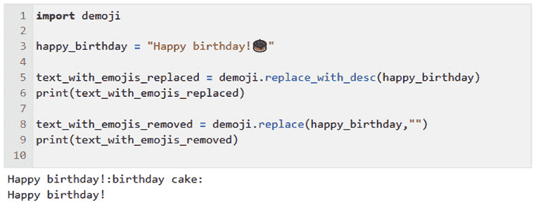

图 5.1 – 替换或删除表情符号

即使表情符号不会导致软件运行问题，保留表情符号意味着与表情符号相关的任何含义将被忽略，因为 NLP 软件无法理解表情符号的含义。如果表情符号被替换为描述，则可以考虑其部分含义（例如，表情符号代表生日蛋糕）。

### 删除智能引号

文字处理程序有时会自动将输入的引号转换为 *智能引号* 或 *弯引号*，这些引号看起来比直引号更美观，但其他软件可能无法处理这些引号。智能引号可能会导致一些自然语言处理（NLP）软件出现问题，因为这些软件可能没有预设智能引号。如果文本中包含智能引号，可以通过正常的 Python 字符串替换方法轻松替换，如以下代码所示：

```py
text = "here is a string with "smart" quotes"
text = text.replace(""", "\"").replace(""","\"")
print(text)
here is a string with "smart" quotes
```

请注意，在 `replace` 方法中替换的直引号需要用反斜杠转义，就像任何字面量引号的使用一样。

前两节内容介绍了如何去除非文本项，如表情符号和智能引号。接下来我们将讨论一些规范化文本或修改文本以使其更统一的技巧。

## 规范化文本

本节将介绍一些规范化文本的最重要技巧。我们将讨论每种技巧的目标，以及如何在 Python 中应用它。

### 分词

几乎所有的 NLP 软件都在单词级别上操作，因此文本需要被拆分成单词才能进行处理。在许多语言中，分隔文本为单词的主要方式是空格，但也有许多特殊情况使得这个启发式方法不起作用。在*图 5.2*中，您可以看到用于空格拆分的代码以及使用 NLTK 进行分词的代码：

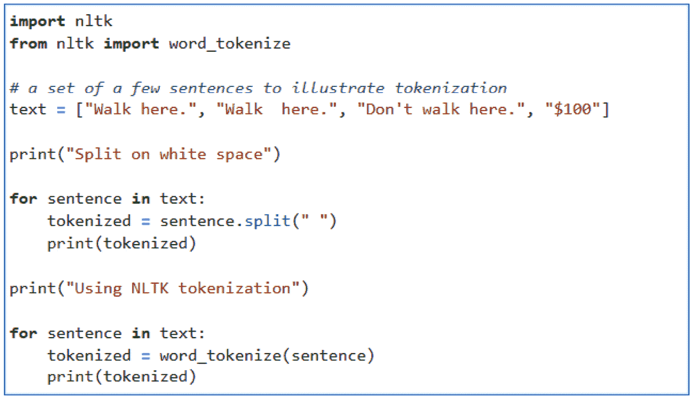

图 5.2 – 使用 Python 代码进行空格拆分并应用 NLTK 分词

运行*图 5.2*中的代码将产生*表 5.1*中显示的分词结果：

| **示例** | **问题** | **根据空格拆分的结果** | **NLTK 结果** |
| --- | --- | --- | --- |
| `Walk here.` | 标点符号不应包含在标记中 | `['``Walk', 'here.']` | `['Walk', '``here', '.']` |
| `Walk` `here.` | 多余的空格不应计为一个标记 | `['Walk', '', '``here.']` | `['Walk', '``here', '.']` |
| `Don't` `walk here.` | 缩写“don’t”应视为两个标记 | `["Don't", '``walk', 'here.']` | `['Do', "n't", 'walk', '``here', '.']` |
| `$``100` | `$`应作为一个单独的标记 | `['$``100']` | `['$', '``100']` |

表 5.1 – 通过拆分空格并使用 NLTK 的分词方法的分词结果

从*表 5.1*中，我们可以看到，仅通过空格拆分文本的简单启发式方法，在某些情况下会导致错误：

+   在*表 5.1*的第一行中，我们可以比较两种方法，当标点符号出现在标记的末尾，但标记与标点符号之间没有空格时。这样仅通过空格拆分标记会导致标点符号被错误地包含在标记中。这意味着`walk`、`walk,`、`walk.`、`walk?`、`walk;`、`walk:`和`walk!`将被视为不同的单词。如果这些单词看起来不同，那么在训练中基于某个版本的单词得出的任何泛化结果将无法应用于其他版本。

+   在第二行中，我们可以看到，如果根据空格进行拆分，连续的两个空格将导致一个额外的空白标记。这会导致任何考虑到两个单词相邻的算法产生偏差。

+   缩写也会导致问题，当使用空格拆分进行分词时。两个单词的缩写不会被分开，这意味着**自然语言理解**（**NLU**）算法无法考虑到*do not*和*don’t*有相同的含义。

+   最后，当遇到带有货币金额或其他度量单位的词时，算法无法考虑到*100 美元*和*100 dollars*有相同的含义。

很容易尝试写正则表达式来处理这些与一般化规则的例外情况，即大多数单词周围有空格。然而，在实践中，很难捕捉到所有的情况。随着我们尝试用正则表达式涵盖更多的情况，正则表达式会变得越来越复杂，也更难维护。因此，最好使用像 NLTK 这样的库，它经过多年开发并经过充分测试。你可以尝试使用不同的文本和代码，看看使用不同的分词方法会得到什么样的结果。

如*表 5.1*所示，不管哪种方式，结果都会是一个字符串列表，这是一种便于进一步处理的格式。

### 小写化

在使用大写和小写字母的语言中，大多数文档包含大写和小写字母的单词。就像分词一样，具有略微不同格式的相同单词意味着来自一种格式的数据不能适用于另一种格式的数据。例如，*Walk*、*walk*和*WALK*都会被视为不同的单词。为了将它们视为相同的单词，文本通常会被全部转换为小写。这可以通过循环遍历单词令牌列表并应用`lower()`的 Python 函数来实现，如*图 5.3*所示：

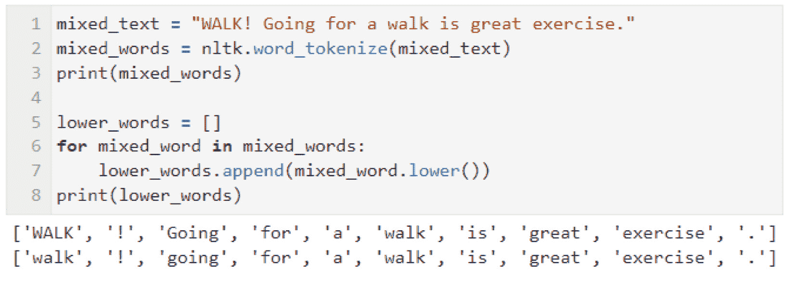

图 5.3 – 将文本转换为小写

将所有单词转换为小写确实有一些缺点。大小写的差异有时对意义很重要。最大的例子是，这会使得自然语言处理（NLP）软件难以区分专有名词和普通单词，因为它们在大小写上有所不同。如果标注器或命名实体识别器在包含大小写差异的数据上进行训练，这可能会导致**词性标注**（**POS**）或**命名实体识别**（**NER**）的错误。同样，单词有时会全大写以示强调。这可能表示句子中表达的情感——也许作者感到兴奋或愤怒——而这类信息在情感分析中可能很有帮助。出于这些原因，应该考虑每个预处理步骤在管道中的位置，以确保在需要之前不会丢失任何信息。关于这一点，将在本章后面的*文本预处理管道*部分详细讨论。

### 词干提取

许多语言中的单词根据它们在句子中的使用方式会有不同的形式。例如，英语名词根据是单数还是复数而有不同的形式，英语动词根据时态不同而有不同的形式。英语的变化形式较少，但其他语言有时会有更多。例如，西班牙语有几十种动词形式，用于表示过去、现在或未来的时态，或者动词的主语是第一、第二还是第三人称，单数还是复数。从语言学角度讲，这些不同的形式被称为**屈折形态学**。这些词尾被称为**屈折语素**。

当然，在对话或文本交流中，这些不同的形式对传达说话者的意思非常重要。然而，如果我们的 NLP 应用目标是将文档分类为不同的类别，那么关注单词的不同形式可能就不那么必要了。就像标点符号一样，单词的不同形式可能会导致它们在自然语言理解处理器中被视为完全不同的单词，尽管这些单词在意义上非常相似。

**词干提取**和**词形还原**是两种类似的正则化方法，用于处理这些不同的形式。词干提取是更简单的方法，因此我们首先讨论它。词干提取基本上意味着移除一些单词末尾的特定字母，这些字母通常但不总是屈折语素——例如，*walks* 末尾的 *s*，或 *walked* 末尾的 *ed*。词干提取算法并不了解语言中的实际单词；它们只是猜测哪些可能是词尾。因此，它们会犯很多错误。它们可能会犯错，要么删除太多字母，要么删除的字母不够，导致将实际不同的单词合并为一个，或者没有将应该视为相同单词的词合并。

`PorterStemmer`是一个广泛使用的词干提取工具，并且已内置于 NLTK 中。它可以像*图 5.4*所示那样使用：

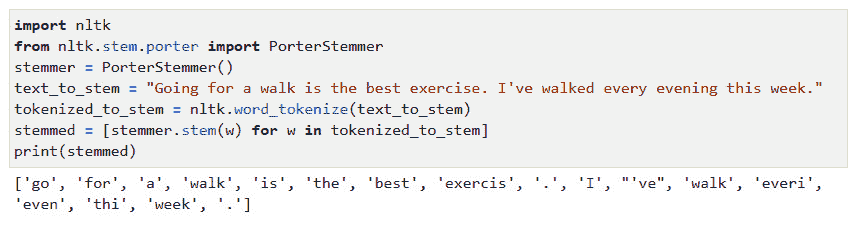

图 5.4 – 使用 PorterStemmer 进行词干提取的结果

请注意，结果中包含了一些错误。虽然`walked`变成了`walk`，`going`变成了`go`，这些是正确的结果，但词干提取器做出的其他更改则是错误的：

+   `exercise`  `exercis`

+   `every`  `everi`

+   `evening`  `even`

+   `this`  `thi`

Porter 词干提取器也仅适用于英语，因为其词干提取算法包含了一些启发式规则，例如移除词尾的*s*，这些规则只适用于英语。NLTK 还包括一个多语言词干提取器，叫做 Snowball 词干提取器，可以用于更多语言，包括阿拉伯语、丹麦语、荷兰语、英语、芬兰语、法语、德语、匈牙利语、意大利语、挪威语、葡萄牙语、罗马尼亚语、俄语、西班牙语和瑞典语。

然而，由于这些词干提取器并没有对它们所应用语言的单词有具体的了解，它们可能会犯错，正如我们所看到的那样。一个类似但更准确的方法实际上是使用字典，以避免像前面列出的错误。这种方法称为 **词形还原**。

### 词形还原和词性标注

词形还原与词干提取一样，旨在减少文本中出现单词的变异。然而，词形还原实际上是用单词的词根替换每个单词（通过查阅计算词典找到词根），而不仅仅是去除看似是后缀的部分。然而，识别词根通常取决于词性，如果不知道单词的词性，词形还原可能会不准确。词性可以通过 **词性标注** 来识别，词性标注会将每个单词最可能的词性分配给文本中的每个单词，这在 *第三章* 中有所介绍。正因为如此，词形还原和词性标注通常会一起执行。

在这个例子中，我们将使用由普林斯顿大学开发的 WordNet（[`wordnet.princeton.edu/`](https://wordnet.princeton.edu/)），这是一个关于单词及其词性的重要信息来源。原版 WordNet 是为英语开发的，但也有针对其他语言的 WordNet。我们在 *第三章* 的 *语义分析* 部分简要提到过 WordNet，因为 WordNet 包含了语义信息以及关于词性的资料。

在这个例子中，我们将仅使用词性信息，而不使用语义信息。*图 5.5* 显示了导入 WordNet 词形还原器、分词器和词性标注器的过程。接着，我们需要对齐 WordNet 和词性标注器之间的词性名称，因为词性标注器和 WordNet 使用的词性名称不完全相同。然后，我们遍历文本，对每个单词进行词形还原：

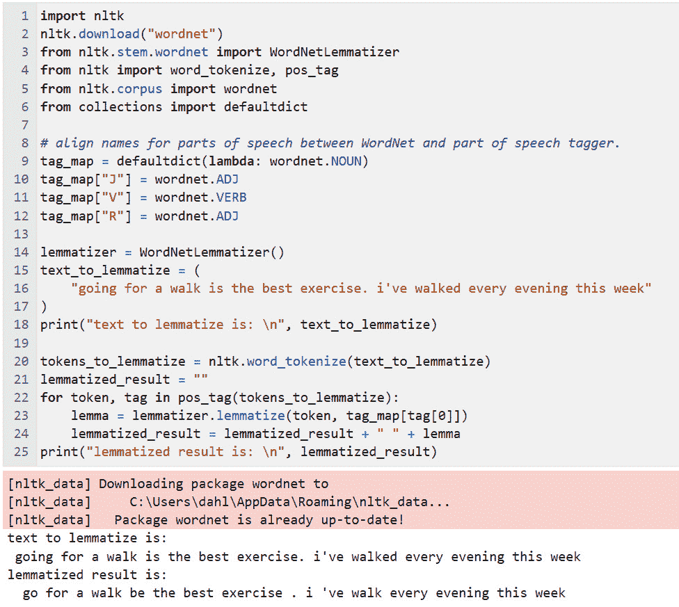

图 5.5 – 对“going for a walk is the best exercise. i’ve walked every evening this week”进行词形还原

如词形还原结果所示，输入文本中的许多单词已被替换为它们的词根——`going` 被替换为 `go`，`is` 被替换为 `be`，`walked` 被替换为 `walk`。

注意，`evening` 没有像在词干提取示例中那样被替换为 *even*。如果 *evening* 是动词 *even* 的现在分词，它将被替换为 `even`，但在这里，*even* 不是 *evening* 的词根。在这种情况下，*evening* 仅指一天中的时间。

### 停用词移除

**停用词**是非常常见的词，对于区分文档没有帮助，因此在分类应用中常常被移除。然而，如果应用涉及任何形式的详细句子分析，这些常见的词是需要的，以便系统能够理解分析的内容。

通常，停用词包括代词、介词、冠词和连词等词。哪些词应该被认为是某种语言的停用词，这个问题需要判断。例如，spaCy 的英文停用词比 NLTK 多得多（326 个 vs. 179 个）。这些特定的停用词是由 spaCy 和 NLTK 的开发者选择的，因为他们认为这些停用词在实际应用中会很有用。你可以选择你认为更方便的一个。

让我们来看看每个系统提供的停用词。

首先，为了运行 NLTK 和 spaCy 系统，你可能需要做一些初步设置。如果你在命令行或终端环境中工作，你可以通过在命令行中输入以下命令来确保 NLTK 和 spaCy 可用：

1.  `pip install -U pip` `setuptools wheel`

1.  `pip install -U spacy`

1.  `python -m spacy` `download en_core_web_sm`

另一方面，如果你在（推荐的）Jupyter Notebook 环境中工作，环境的设置在**第四章**中有详细介绍，你可以在 Jupyter 代码单元中输入相同的命令，但在每个命令前加上`!`。

一旦确认了你的 NLTK 和 spaCy 环境已经设置好，你可以通过运行*图 5**.6*中的代码来查看 NLTK 的停用词：

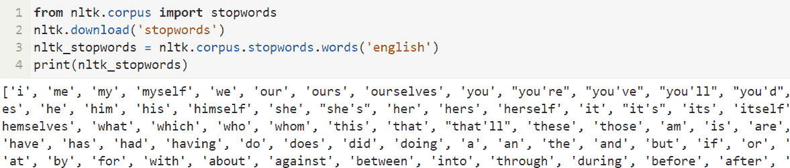

图 5.6 – 查看 NLTK 的前几个停用词

注意，*图 5**.6*仅显示了前几个停用词。你可以通过在你的环境中运行代码来查看所有停用词。

要查看 spaCy 的停用词，请运行*图 5**.7*中的代码，该代码也仅显示前几个停用词：

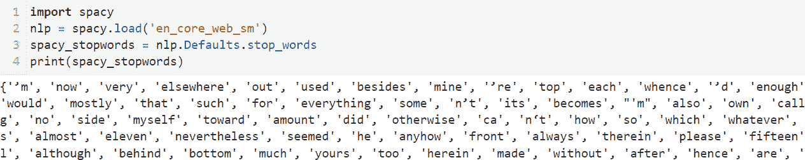

图 5.7 – 查看 spaCy 的前几个停用词

比较两个包提供的停用词，我们可以看到这两个集合有很多相同之处，但也存在差异。最终，你使用哪个停用词集合取决于你。两个集合在实践中都表现良好。

### 删除标点符号

删除标点符号也非常有用，因为标点符号和停用词一样，出现在大多数文档中，因此并不能帮助区分文档类别。

标点符号可以通过定义一个标点符号字符串，并使用正则表达式移除字符串中的项，或者通过移除文本中每个非字母数字的词来去除。后一种方法更具鲁棒性，因为容易忽视不常见的标点符号。

删除标点符号的代码可以在*图 5**.8*中看到：

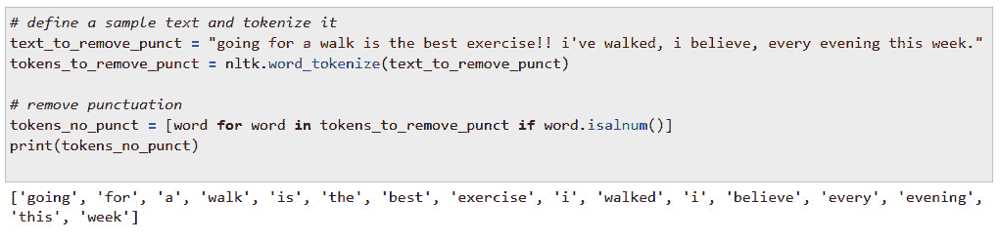

图 5.8 – 删除标点符号

原始文本是`text_to_remove_punct`变量的值，位于*图 5.8*中，其中包含几个标点符号——具体来说，是感叹号、逗号和句号。结果是`tokens_no_punct`变量的值，显示在最后一行。

## 拼写更正

更正拼写错误是去除噪音并规范化文本输入的另一种方式。拼写错误的单词在训练数据中出现的可能性远低于正确拼写的单词，因此在处理新的文本时，它们会更难识别。此外，任何包含正确拼写单词版本的训练将无法识别或利用包含拼写错误单词的数据。这意味着值得考虑在 NLP 流程中添加拼写更正预处理步骤。然而，我们不希望在每个项目中自动应用拼写更正。以下是一些不使用拼写更正的原因：

+   有些类型的文本自然充满了拼写错误——例如，社交媒体帖子。由于拼写错误会出现在需要被应用程序处理的文本中，因此在训练或运行时数据中可能不应尝试更正拼写错误。

+   拼写错误更正并不总是做到正确的事情，导致错误单词的拼写更正是没有帮助的。它只会给处理过程引入错误。

+   有些类型的文本包含许多拼写检查器不知道的专有名词或外来词，这些词会被检查器尝试更正。再一次，这只会引入错误。

如果你选择使用拼写更正，Python 中有许多拼写检查工具可供使用。一个推荐的拼写检查器是`pyspellchecker`，可以按如下方式安装：

```py
$ pip install pyspellchecker
```

拼写检查代码和结果可以在*图 5.9*中看到：

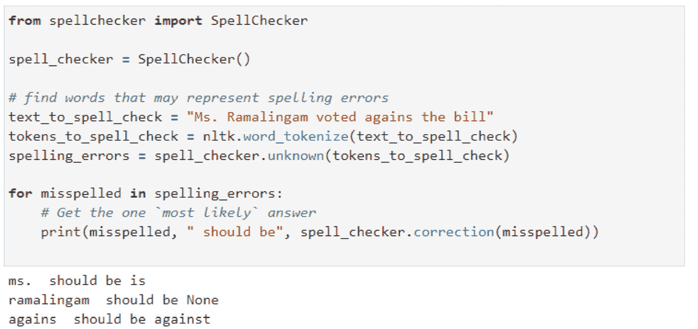

图 5.9 – 使用 pyspellchecker 进行拼写检查

从*图 5.9*中可以看出，拼写检查容易出错。`pyspellchecker`正确地将`agains`更正为`against`，但它也犯了错误，将`Ms.`更正为`is`，而且它对`Ramalingam`这个名字一无所知，所以没有做出任何更正。

请记住，由**ASR**生成的输入不会包含拼写错误，因为 ASR 只能输出字典中的单词，这些单词都是正确拼写的。当然，ASR 的输出可能会包含错误，但这些错误仅仅是由于错误的单词替代了实际说出的单词，而这些错误无法通过拼写更正来修复。

还要注意，词干提取和词形还原可能会导致出现不是实际单词的标记，而这些标记你不希望被更正。如果在处理流程中使用拼写更正，请确保它发生在词干提取和词形还原之前。

### 展开缩写词

增加数据统一性的另一种方法是展开缩写词——也就是说，将像*don’t*这样的词展开为其完整形式*do not*。这样，系统就能在遇到*don’t*时识别出*do*和*not*。

到目前为止，我们已经回顾了许多通用的预处理技术。接下来，让我们转向一些仅适用于特定类型应用的更具体的技术。

# 应用特定类型的预处理

我们在前面部分讨论的预处理技术通常适用于许多应用中的各种文本。对于特定应用，还可以使用额外的预处理步骤，我们将在接下来的部分中介绍这些步骤。

## 替换类标签为词语和数字

有时，数据中会包含一些语义等价的特定词语或标记。例如，一个文本语料库可能包括美国各州的名称，但对于该应用而言，我们只关心提到了*某个*州，而不在乎是哪一个。在这种情况下，我们可以用*类标记*替代特定的州名。请参考*图 5.10*中的交互：

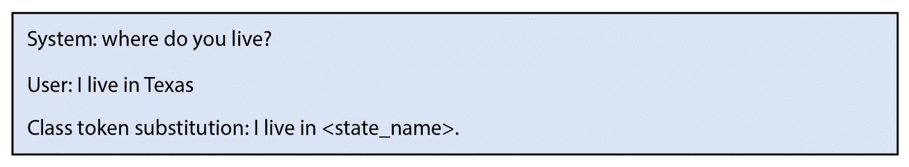

图 5.10 – 类标记替换

如果我们将类标记`<state_name>`替换为`Texas`，那么其他州名就更容易识别了，因为系统只需要学习关于通用类`<state_name>`的内容，而不是学习所有 50 个州的名称。

使用类标记的另一个原因是，如果文本包含字母数字标记，如日期、电话号码或社会安全号码，尤其是当有很多这种信息需要枚举时，可以用像`<social_security_number>`这样的类标记来替代实际的号码。这还有一个附加好处，那就是可以遮掩或*删减*敏感信息，如具体的社会安全号码。

## 删减

正如我们在*确保隐私和遵守伦理考量*一节中讨论的那样，数据可能包含敏感信息，如人名、健康信息、社会安全号码或电话号码。在使用数据进行训练之前，应该先对这些信息进行删减。

## 特定领域的停用词

NLTK 和 spaCy 都具备从它们的列表中添加和删除停用词的功能。例如，如果你的应用程序中有一些非常常见的特定领域词汇，而这些词不在内建的停用词列表中，你可以将这些词添加到应用特定的停用词列表中。相反，如果一些通常被认为是停用词的词在应用程序中有实际意义，可以将这些词从停用词中移除。

一个很好的例子是词语*not*，在 NLTK 和 spaCy 中都是停用词。在许多文档分类应用中，将*not*视为停用词是可以接受的；然而，在情感分析等应用中，*not*及其他相关词语（例如*nothing*或*none*）可以是负面情感的重要线索。如果移除它们，则可能会导致错误，例如句子*I do not like this product* 变为 *I do like this product*。在这种情况下，您应该从您正在使用的停用词列表中移除*not*和其他否定词语。

## 移除 HTML 标记

如果应用程序基于网页，则其将包含在 NLP 中无用的 HTML 格式标记。Beautiful Soup 库（[`www.crummy.com/software/BeautifulSoup/bs4/doc/`](https://www.crummy.com/software/BeautifulSoup/bs4/doc/)）可以执行删除 HTML 标签的任务。虽然 Beautiful Soup 有许多用于处理 HTML 文档的功能，但对于我们的目的来说，最有用的功能是 `get_text()`，它从 HTML 文档中提取文本。

## 数据不平衡

文本分类的任务是将每个文档分配给一组类别中的一个，这是最常见的 NLP 应用之一。在每个真实的分类数据集中，一些类别将比其他类别拥有更多的示例。这个问题称为**数据不平衡**。如果数据严重不平衡，这将导致机器学习算法出现问题。解决数据不平衡的两种常见技术是**过采样**和**欠采样**。过采样意味着复制较少频繁类别中的一些项，而欠采样意味着删除更常见类别中的一些项。这两种方法可以同时使用 - 可以对频繁类别进行欠采样，而对不频繁类别进行过采样。我们将在*第十四章*中详细讨论这个话题。

## 使用文本预处理流水线

为 NLP 准备您的数据通常涉及多个步骤，每个步骤都将前一步骤的输出添加新信息，或者通常是为 NLP 进一步准备数据。这样的预处理步骤序列称为**流水线**。例如，一个 NLP 流水线可以包括分词，然后是词形还原，最后是停用词移除。通过在流水线中添加和删除步骤，您可以轻松地尝试不同的预处理步骤，并查看它们是否会对结果产生影响。

流水线可用于准备用于模型学习的训练数据，以及在运行时或测试期间使用的测试数据。通常情况下，如果始终需要预处理步骤（例如分词），则值得考虑在训练数据上执行一次并保存结果数据集。如果您正在使用不同的预处理步骤配置运行实验以找到最佳配置，则这将节省时间。

# 选择预处理技术

*表 5.2* 是本章中描述的预处理技术的总结，包括它们的优缺点。每个项目都应该考虑哪些技术能够带来更好的结果：

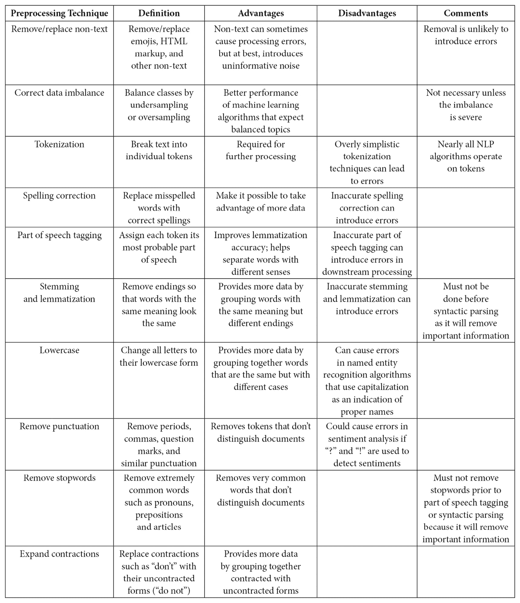

表 5.2 – 预处理技术的优缺点

许多技术（如拼写校正）有可能引入错误，因为技术并不完美。对于一些较少研究的语言，相关算法的成熟度可能不如研究较多的语言。

值得一提的是，首先进行仅使用最基本技术（如分词）的初步测试，只有在初步测试结果不够好时，才引入额外的技术。有时，预处理引入的错误会导致整体结果变差。在调查过程中，保持持续评估结果非常重要，以确保结果不会变差。评估将在*第十三章*中详细讨论。

# 总结

在本章中，我们介绍了如何找到和使用自然语言数据，包括为特定应用查找数据以及使用通用可用语料库。

我们讨论了各种为自然语言处理准备数据的技术，包括注释，它为监督学习奠定了基础。我们还讨论了常见的预处理步骤，这些步骤去除了数据中的噪声并减少了数据的变化，使机器学习算法能够专注于不同类别文本之间最具信息量的差异。本章还涉及了隐私和伦理相关的议题——如何确保文本数据中包含的信息的隐私性，如何确保生成数据或标注数据的众包工作者得到公平对待。

下一章将讨论探索性技术，用于全面了解数据集，例如摘要统计（词频、类别频率等）。还将讨论可视化工具（如 matplotlib），这些工具可以提供通过查看文本数据的图形表示所能获得的最佳见解。最后，它将讨论基于可视化和统计结果可以做出的决策。
