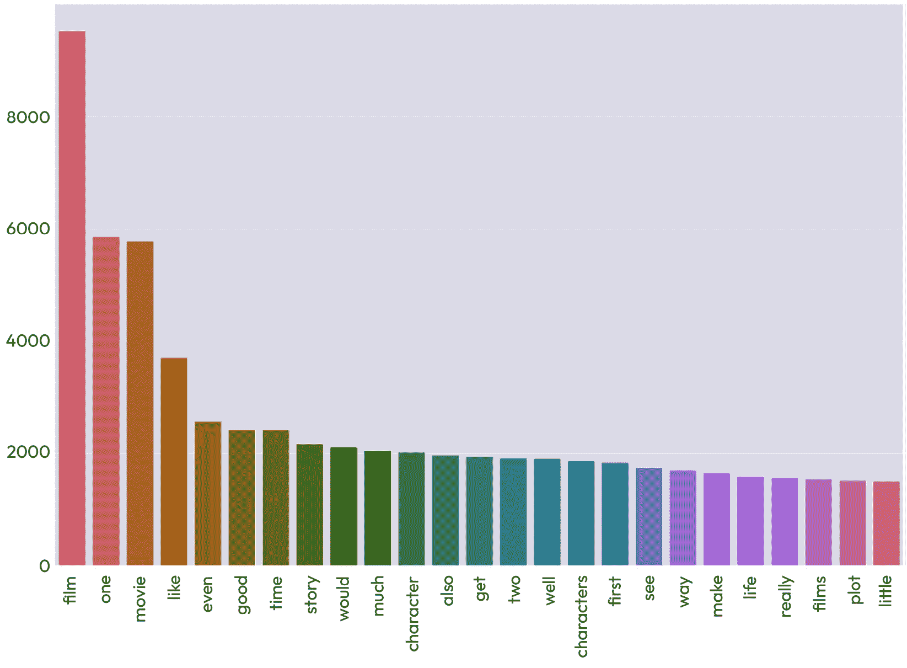

# 第六章：探索和可视化数据

探索和可视化数据是开发**自然语言理解**（**NLU**）应用过程中的关键步骤。在本章中，我们将探讨**数据探索**的技术，如可视化词频以及可视化文档相似性的技术。我们还将介绍几个重要的可视化工具，如 Matplotlib、Seaborn 和 WordCloud，这些工具使我们能够以图形方式呈现数据并识别数据集内的模式和关系。通过结合这些技术，我们可以深入了解数据，为 NLU 处理的下一步做出明智的决策，从而提高分析的准确性和效果。无论您是数据科学家还是开发人员，数据探索和可视化都是从文本数据中提取可操作洞见的关键技能，为进一步的 NLU 处理做好准备。

在本章中，我们将涵盖与数据的初始探索相关的几个主题，特别是可视化探索或**可视化**。我们将首先回顾几个查看数据视角的原因，以便帮助。接下来，我们将介绍一个电影评论样本数据集，用来说明我们的技术。然后，我们将探讨数据探索的技术，包括总结统计信息、可视化数据集中的词频以及测量文档相似性。最后，我们将给出一些开发可视化的一般提示，并结论关于如何使用可视化信息来做出关于进一步处理的决策的一些想法。

我们将要涵盖的主题如下：

+   为什么要可视化？

+   数据探索

+   开发可视化的一般考虑因素

+   使用可视化信息来做出关于处理的决策

# 为什么要可视化？

可视化数据意味着以图表或图形等图形格式显示数据。这几乎总是训练**自然语言处理**（**NLP**）系统执行特定任务的有用前提，因为通常很难在大量文本数据中看到模式。通过视觉方式通常更容易看到数据的总体模式。这些模式可能对决定最适用的文本处理技术非常有帮助。

可视化在理解自然语言处理分析结果并决定下一步操作时也很有用。由于查看自然语言处理分析结果并非初始的探索步骤，我们将把这个话题推迟到*第十三章*和*第十四章*。

为了探索可视化，在本章中，我们将使用一组文本文档数据集。文本文档将说明一个二元分类问题，该问题将在下一节中描述。

## 文本文档数据集 – 句子极性数据集

句子极性数据集是一个常用的数据集，包含最初来自**互联网电影数据库**（**IMDb**）的电影评论。这些评论已根据正面和负面进行分类。最常见的任务是将这些评论分类为正面和负面。数据是由康奈尔大学的一个团队收集的。有关该数据集及其数据的更多信息，请访问[`www.cs.cornell.edu/people/pabo/movie-review-data/`](https://www.cs.cornell.edu/people/pabo/movie-review-data/)。

**自然语言工具包**（**NLTK**）将这个数据集作为其内置语料库之一。该数据集包含 1,000 条正面评论和 1,000 条负面评论。

这是这个数据集中的一个正面评论示例：

```py
kolya is one of the richest films i've seen in some time .
zdenek sverak plays a confirmed old bachelor ( who's likely to remain so ) , who finds his life as a czech cellist increasingly impacted by the five-year old boy that he's taking care of .
though it ends rather abruptly-- and i'm whining , 'cause i wanted to spend more time with these characters-- the acting , writing , and production values are as high as , if not higher than , comparable american dramas .
this father-and-son delight-- sverak also wrote the script , while his son , jan , directed-- won a golden globe for best foreign language film and , a couple days after i saw it , walked away an oscar .
in czech and russian , with english subtitles .
```

这是一个负面评论的示例：

```py
claire danes , giovanni ribisi , and omar epps make a likable trio of protagonists , but they're just about the only palatable element of the mod squad , a lame-brained big-screen version of the 70s tv show .
the story has all the originality of a block of wood ( well , it would if you could decipher it ) , the characters are all blank slates , and scott silver's perfunctory action sequences are as cliched as they come .
by sheer force of talent , the three actors wring marginal enjoyment from the proceedings whenever they're on screen , but the mod squad is just a second-rate action picture with a first-rate cast .
```

我们可以查看数据集中成千上万的示例，但仅通过查看单个示例很难看出任何大规模的模式；数据量太大，我们无法从细节中分辨出整体图景。接下来的章节将介绍一些可以帮助我们识别这些大规模模式的工具。

# 数据探索

**数据探索**，有时也叫做**探索性数据分析**（**EDA**），是对数据进行初步查看的过程，目的是找出数据中有哪些模式，从而对整个数据集有一个全面的认识。这些模式和总体视角将帮助我们识别最合适的处理方法。由于一些自然语言理解（**NLU**）技术计算开销很大，我们希望确保不会浪费大量时间应用不适合特定数据集的技术。数据探索有助于我们在项目初期就缩小技术选择的范围。可视化在数据探索中非常有帮助，因为它是一种快速了解数据模式全貌的方式。

我们想要探索的语料库中最基本的信息包括词数、不同词汇的数量、文档的平均长度以及每个类别中的文档数量等信息。我们可以从查看单词的频率分布开始。我们将介绍几种不同的可视化单词频率的方法，然后查看一些文档相似度的度量。

## 频率分布

频率分布显示特定类型的项目在某个上下文中出现的频率。在我们的案例中，上下文是数据集，我们将查看数据集中出现的*单词*的频率，然后是*n-gram*（单词序列）的频率。我们将从定义单词频率分布并进行一些预处理开始。然后，我们将使用 Matplotlib 工具和 WordCloud 可视化单词频率，并将相同的技术应用于 n-gram。最后，我们将介绍一些可视化文档相似度的技术：词袋模型（**BoW**）和 k 均值聚类。

### 单词频率分布

语料库中出现的单词及其频率通常包含很多有用的信息。在深入进行自然语言处理项目之前，查看这些信息是一个好主意。让我们通过使用 NLTK 来计算这些信息。我们首先导入 NLTK 和电影评论数据集，如*图 6.1*所示：


图 6.1 – 导入 NLTK 和电影评论数据集

*图 6.2* 显示了我们可以用来将 `movie_reviews` 数据集中的单词收集到列表中的代码，并在接下来的步骤中查看一些单词：

1.  为了将语料库中的单词收集到一个 Python 列表中，NLTK 提供了一个有用的函数`words()`，我们在这里使用它。

1.  通过使用 Python 的 `len()` 函数来找出数据集中的总单词数，传入的参数是单词列表。

1.  打印单词列表：


图 6.2 – 制作语料库中的单词列表，统计它们，并显示前几个单词

统计单词并打印出前几个单词的结果如下所示：

```py
1583820
['plot', ':', 'two', 'teen', 'couples', 'go', 'to', ...]
```

我们不会看到比前几个单词更多的单词（`'plot'`、`':'`、`'two'`等），因为有太多单词无法全部显示。通过打印列表的长度，我们可以看到数据集中有 1,583,820 个单词，显然这个数量太多，无法一一列出。我们还可以注意到，这个单词列表中包含标点符号，特别是 `:`。由于标点符号非常常见，查看它们不太可能为我们提供关于文档之间差异的洞察。此外，包含标点符号也会使得我们难以看到实际上区分文档类别的单词。因此，我们需要去除标点符号。

*图 6.3* 显示了通过以下步骤去除标点符号的方法：

1.  初始化一个空列表，用于存储去除标点符号后的新单词列表（`words_no_punct`）。

1.  遍历单词列表（`corpus_words`）。

1.  只保留字母数字单词。此代码在第 4 行使用了 Python 字符串函数 `string.isalnum()` 来检测字母数字单词，这些单词会被添加到我们之前初始化的 `words_no_punct` 列表中。

1.  一旦我们去除了标点符号，可能会对非标点符号单词的出现频率感兴趣。我们语料库中最常见的单词是什么？NLTK 提供了一个有用的`FreqDist()`函数（频率分布），可以计算单词的出现频率。这个函数在*图 6.3*的第 6 行中应用。

1.  然后，我们可以使用 NLTK 的 `most_common()` 方法查看频率分布中最常见的单词，该方法的参数是我们想查看的单词数量，显示在第 8 行。

1.  最后，我们打印出最常见的 50 个单词：


图 6.3 – 电影评论数据库中最常见的 50 个单词及其频率

在*图 6**.3*中，我们可以很容易地看到`the`是最常见的单词，在数据集中出现了 76,529 次，这并不令人惊讶。然而，要看到不太常见单词的频率就更难了。举个例子，看到第十个最常见的单词，以及它与第十一个最常见单词相比有多少差距，这并不容易。这就是我们引入可视化工具的原因。

我们在*图 6**.3*中计算的频率可以通过`plot()`函数绘制频率分布图。该函数有两个参数：

1.  第一个参数是我们希望查看的单词数量——在这个例子中是`50`。

1.  `cumulative`参数决定了我们是只想查看 50 个单词的频率（`cumulative=False`），还是查看所有单词的累积频率。如果我们想查看所有单词的累积频率，我们需要将此参数设置为`True`。

要绘制频率分布，我们可以简单地添加`plot()`调用，代码如下：

```py
freq.plot(50, cumulative = False)
```

结果如*图 6**.4*所示，是每个单词频率的图示，最常见的单词排在最前面：


图 6.4 – 电影评论语料库中单词的频率分布

尝试使用不同数量的单词和`cumulative = True`来调用`freq.plot()`。当你要求查看越来越多的单词时，会发生什么呢？你会发现，查看越来越稀有的单词（通过增加第一个参数的数值）并不会提供太多见解。

虽然*图 6**.4*中的图表给我们提供了关于数据集中不同单词频率的更清晰概念，但它还告诉我们关于频繁单词更重要的事情。大多数这些单词，比如`the`、`a`和`and`，并不含有太多信息。就像标点符号一样，它们很可能不会帮助我们区分我们感兴趣的类别（正面和负面评论），因为它们在大多数文档中频繁出现。这些类型的单词被称为**停用词**，通常会在自然语言数据中被去除，尤其是在自然语言处理（NLP）中，因为它们并没有提供太多信息。

NLTK 提供了不同语言的常见停用词列表。让我们看一下其中一些英语停用词：


图 6.5 – 50 个英语停用词的示例

*图 6**.5*显示了我们可以使用的代码，通过以下步骤检查英语停用词：

1.  导入`nltk`和`stopwords`包。

1.  将停用词集合转换为 Python 列表，以便我们对其进行列表操作。

1.  使用 Python 的`len()`函数查看列表的长度并打印值（179 项）。

1.  打印前`50`个停用词。

NLTK 中也为其他语言提供了停用词。我们可以通过运行*图 6.6*中的代码来查看这些停用词列表：


图 6.6 – NLTK 含停用词的语言

代码包含以下三个步骤：

1.  收集包含 NLTK 停用词的语言名称。停用词存储在每个语言对应的文件中，因此获取这些文件就能获得语言名称。

1.  打印语言列表的长度。

1.  打印语言的名称。

一旦我们拥有了停用词的列表，就可以轻松地将它们从语料库中移除。在移除标点符号后，如我们在*图 6.3*中所见，我们只需遍历语料库中的单词列表，移除停用词列表中的单词，如下所示：

```py
words_stop = [w for w in words_no_punct if not w in stop_words]
```

顺便提一下，将移除标点符号和停用词的操作合并为一次遍历整个单词列表会显得更加高效，在遍历过程中检查每个单词是否是标点符号或停用词，如果是，就将其移除。我们单独展示这些步骤是为了清晰起见，但在你自己的项目中，你可能想将这两个步骤合并。就像我们在移除标点符号时所做的那样，我们可以使用 NLTK 的频率分布函数，查看除了停用词之外，哪些单词最为常见，并将其显示出来，如*图 6.7*所示：


图 6.7 – 移除标点符号和停用词后的最常见单词

我们可以在*图 6.7*中看到，移除停用词后，我们对电影评论语料库中的单词有了更清晰的认识。现在最常见的单词是 `film`，第三常见的单词是 `movie`。这正是我们从电影评论语料库中所期望的。类似的评论语料库（例如产品评论语料库）可能会显示出不同的频率分布。即便仅仅通过频率分布提供的简单信息，有时也足以完成一些 NLP 任务。

例如，在作者身份研究中，我们希望将一篇作者未知的文档归属于一个已知的作者。我们可以将该文档中单词的频率与已知作者的文档中的单词频率进行比较。另一个例子是领域分类，我们想知道该文档是电影评论还是产品评论。

### 使用 Matplotlib、Seaborn 和 pandas 可视化数据

虽然 NLTK 提供了一些基本的绘图功能，但还有一些其他更强大的 Python 绘图库，它们被广泛用于绘制各种数据，包括自然语言处理（NLP）数据。在本节中，我们将探讨其中一些。

Matplotlib ([`matplotlib.org/`](https://matplotlib.org/)) 是一个非常流行的工具。Matplotlib 可以创建多种可视化，包括动画和交互式可视化。我们将在这里使用它来创建另一个我们在 *图 6.4* 中绘制的数据的可视化。Seaborn ([`seaborn.pydata.org/`](https://seaborn.pydata.org/)) 基于 Matplotlib 构建，是一个更高层次的接口，用于生成美观的可视化。这两个包通常还会使用另一个 Python 数据包 pandas ([`pandas.pydata.org/`](https://pandas.pydata.org/))，它非常适合处理表格数据。

对于我们的示例，我们将使用与 *图 6.7* 中相同的数据，但我们将使用 Matplotlib、Seaborn 和 pandas 来创建可视化。

*图 6.8* 显示了此示例的代码：


图 6.8 – 收集前 25 个常见词的 Python 代码，移除标点符号和停用词后

*图 6.8* 显示了绘制数据的准备代码，包括以下步骤：

1.  导入 NLTK、pandas、Seaborn 和 Matplotlib 库。

1.  将频率截止设置为 `25`（这可以是我们感兴趣的任何数字）。

1.  计算没有停用词的语料库单词的频率分布（第 7 行）。

我们首先导入 NLTK、pandas、Seaborn 和 Matplotlib。我们将频率截止设置为 `25`，因此我们只会绘制前 25 个最常见的单词，并且在第 7 行获得我们的数据的频率分布。

生成的图表显示在 *图 6.9* 中：



图 6.9 – 在移除标点符号和停用词后，使用 Matplotlib、Seaborn 和 pandas 库显示的最常见单词

*图 6.7* 和 *图 6.9* 显示的是相同的数据。例如，每个图中最常见的单词是 `film`，接着是 `one`，然后是 `movie`。为什么要选择一种可视化工具而非另一种呢？其中一个区别是，在 *图 6.9* 中，似乎更容易看到某个特定单词的信息，这可能是由于条形图格式，每个单词都有对应的条形图。而在 *图 6.7* 中，由于线条并不清晰，因此稍微难以看到每个单词的频率。

另一方面，由于连续的线条，*图 6.7* 中的整体频率分布更容易看到。因此，选择一种可视化方式而非另一种，实际上取决于你想要强调的信息类型。当然，如果你希望以不同的方式查看数据，完全没有理由只局限于一种可视化方式。

顺便提一下，在两个图中的模式，最常见的单词具有非常高的频率，较不常见的单词频率急剧下降，这种模式在自然语言数据中非常常见。这个模式说明了一个叫做**齐夫定律**的概念（关于这个概念的更多信息，见[`en.wikipedia.org/wiki/Zipf%27s_law`](https://en.wikipedia.org/wiki/Zipf%27s_law)）。

### 查看另一种频率可视化技术——词云

**词云**是另一种可视化单词相对频率的方法。词云以不同的字体大小显示数据集中的单词，频率较高的单词以较大的字体显示。词云是一个很好的方法，可以让常见单词在视觉上更加突出。

*图 6.10*中的代码展示了如何导入`WordCloud`包并从电影评论数据创建词云：


图 6.10 – 显示最常见单词的 Python 代码，作为词云呈现

代码展示了以下步骤：

1.  我们在第 2 行导入了一个新的库`WordCloud`。对于此显示，我们将仅选择最*常见的 200 个单词*（在第 6 行设置了频率阈值`200`）。

1.  我们在第 7 行创建了一个频率分布。

1.  频率分布在第 8 行被转换为 pandas Series。

1.  为了减少非常短单词的数量，我们在第 10 行只包括长度大于两个字母的单词。

1.  第 11 行的代码生成了词云。`colormap`参数指定了许多 Matplotlib 颜色映射之一（颜色映射的文档在[`matplotlib.org/stable/tutorials/colors/colormaps.html`](https://matplotlib.org/stable/tutorials/colors/colormaps.html)）。你可以尝试不同的配色方案，找到你喜欢的样式。

1.  第 12-14 行格式化图表区域。

1.  最后，图表在第 15 行显示。

*图 6.11*展示了来自*图 6.10*中代码生成的词云：


图 6.11 – 电影评论中单词频率的词云

如我们在*图 6.7*和*图 6.9*中看到的，最常见的单词是`film`、`one`和`movie`。然而，词云可视化使得最常见的单词以图表无法比拟的方式脱颖而出。另一方面，词云中频率较低的单词很难区分。例如，从词云中很难判断`good`是否比`story`更常见。这又是一个例子，说明在选择可视化方式之前，你应该考虑希望从中获取什么信息。

下一部分将展示如何更深入地挖掘数据，获取一些关于数据子集（如积极和消极评论）的洞见。

### 积极与消极的电影评论

我们可能想要查看电影评论的不同类别（正面和负面）之间的差异，或者更一般地，查看任何不同类别之间的差异。例如，正面和负面评论中的常见词是否不同？对正面和负面评论属性的初步分析可以让我们更好地理解这些类别的差异，这反过来可能帮助我们选择合适的方法，使训练好的系统能够自动区分这些类别。

我们可以使用任何基于频率分布的可视化方式，包括*图 6**.7*中的折线图，*图 6**.9*中的条形图，或*图 6**.11*中的词云可视化。在这个例子中，我们将使用词云，因为它是查看两种频率分布之间单词频率差异的好方法。

查看*图 6**.12*中的代码，我们首先导入所需的库：


图 6.12 – 导入用于计算词云的库

接下来我们将创建两个函数，方便我们对语料库的不同部分执行类似的操作：


图 6.13 – 计算词云的函数

*图 6**.13*中的第一个函数`clean_corpus()`会从语料库中移除标点符号和停用词。第二个函数`plot_freq_dist()`会从频率分布中绘制词云。现在我们准备好创建词云了：


图 6.14 – 显示正面和负面评论词频的代码

我们通过以下步骤创建词云：

1.  现在我们已经定义了函数，将语料库分为正面和负面评论。这是在第 28 行和第 29 行的代码中完成的。

1.  与我们在*图 6**.2*中看到的要求获取语料库中所有单词不同，我们请求获取特定类别的单词。在这个例子中，类别是正面（`pos`）和负面（`neg`）。

1.  我们在第 28 行和第 29 行的每一组词中移除停用词和标点符号。

1.  接下来，我们在第 30 行和第 31 行为正面和负面词创建频率分布。最后，我们绘制词云。

*图 6**.15* 显示了正面评价的词云：


图 6.15 – 在词云中显示正面评价的词频

*图 6**.16* 显示了在词云中显示负面评价的词频：


图 6.16 – 在词云中显示负面评价的词频

比较*图 6.15*和*图 6.16*与*图 6.11*中的原始词云，我们可以看到，`film`、`one` 和 `movie` 是正面和负面评论中最常出现的词，也是总体最常出现的词，因此它们在区分正负面评论方面不会很有用。

词语`good`在正面评论词云中的大小（因此也更为频繁）大于在负面评论词云中的出现频率，这正是我们所期望的。然而，`good`在负面评论中也出现得相当频繁，因此它绝不是判断正面评论的明确标志。其他的差异则不太符合预期——例如，`story`在正面评论中更常见，尽管它也会出现在负面评论中。这一比较表明，仅通过简单的关键词识别技术，区分正负面评论的问题可能无法得到解决。

我们将在*第九章*和*第十章*中探讨的技术，将更适合解决将文本分类到不同类别的问题。然而，我们可以看到，这一开始的词云探索对于排除基于简单关键词的方法非常有用。

在下一节中，我们将查看语料库中的其他频率。

### 查看其他频率度量

到目前为止，我们只看了词频，但我们可以查看任何其他可以度量的文本特征的频率。例如，我们可以查看不同字符或不同词性出现的频率。你可以尝试扩展本章前一部分*词频分布*中展示的代码，去统计电影评论文本中的一些其他特征。

语言的一个重要特性是，单词不仅仅是孤立地出现——它们会以特定的组合和顺序出现。单词的意思可以根据它们的上下文发生显著变化。例如，*not a good movie* 与 *a good movie* 的含义截然不同（实际上是相反的含义）。有许多技术可以考虑单词的上下文，我们将在*第八章*到*第十一章*中探讨这些技术。

然而，在这里我们将仅描述一种非常简单的技术——观察彼此相邻的单词。当两个单词一起出现时，称之为`ngrams()`，它接受一个`n`值作为参数。*图 6.17*展示了计算和显示电影评论语料库中 n-gram 的代码：


图 6.17 – 计算电影评论数据中的二元组

代码显示了以下初始化步骤：

1.  我们首先导入`nltk`、`ngrams`函数以及电影评论语料库。

1.  我们将频率截止值设置为`25`，但和之前的例子一样，这个值可以是我们认为有趣的任何数字。

1.  我们在第 8 行收集了语料库中的所有单词（如果我们只想要正面评论中的单词或负面评论中的单词，我们可以通过设置 `categories = 'neg'` 或 `categories = 'pos'` 来获取这些单词，正如我们在*图 6.14*中看到的）。

1.  最后，我们在第 11 行使用在*图 6.13*中定义的 `clean_corpus` 函数，移除标点符号和停用词。

在*图 6.18*中，我们收集了二元组：


图 6.18 – 计算电影评论数据中的二元组

二元组的收集步骤如下：

1.  `ngrams()`函数在第 14 行使用，并传入参数`2`，表示我们想要二元组（即两个相邻单词的组合）。这里可以使用任何数字，但非常大的数字可能不会非常有用。这是因为随着`n`值的增加，符合该值的 ngram 会越来越少。到某个程度时，某个特定的 ngram 可能没有足够的示例来提供关于数据模式的信息。二元组或三元组通常在语料库中足够常见，因此有助于识别模式。

1.  在第 21 至 23 行，我们遍历二元组列表，从每一对中创建一个字符串。

在*图 6.19*中，我们制作了二元组的频率分布并展示了它。


图 6.19 – 显示电影评论数据中的二元组

1.  我们在第 29 行使用熟悉的 NLTK `FreqDist()` 函数对二元组列表进行处理，并将其转换为 pandas Series。

1.  剩下的代码设置了 Seaborn 和 Matplotlib 中的条形图，并在第 39 行显示了它。

由于我们使用的频率截止值为`25`，因此我们只会查看最常见的 25 个二元组。你可能想尝试不同的更大或更小的频率截止值。

*图 6.20* 显示了我们在*图 6.19*中计算的图表结果。由于二元组通常比单个词更长，占用更多空间，因此我们交换了 `x` 和 `y` 轴，使得二元组的计数显示在 `x` 轴上，而单个二元组显示在 `y` 轴上：


图 6.20 – 按频率排序的电影评论数据中的二元组

*图 6.20*揭示了语料库中一些有趣的事实。例如，最常见的双字组`special effects`在语料库中出现约 400 次，而最常见的单词`film`则出现了将近 8000 次。这是可以预期的，因为两个单词必须一起出现才能算作一个双字组。我们还看到，许多双字组例如`New York`和`Star Trek`出现在这个列表中。其他的双字组并非习语，而只是常见短语，如`real life`和`one day`。在这个列表中，所有的双字组都非常合理，在电影评论的语料库中看到它们并不令人惊讶。

作为练习，尝试比较正面和负面电影评论中的双字组。在查看单词频率时，我们发现正面和负面评论中最常见的词汇是相同的。那么，最常见的双字组是否也是如此呢？

本节介绍了一些通过简单的测量方法（如计算单词和双字组）来洞察我们数据集的方式。还有一些有用的探索性技术，可以用来衡量和可视化数据集中文档之间的相似性。我们将在下一节中介绍这些技术。

## 衡量文档之间的相似性

到目前为止，我们一直在使用诸如折线图、条形图和词云等工具来可视化语料库中各种属性的频率，如单词和双字组。可视化文档相似性也非常有意义——也就是说，数据集中的文档彼此之间的相似程度。有很多方法可以衡量文档的相似性，我们将在后续章节中详细讨论，尤其是*第九章*、*第十章*、*第十一章*和*第十二章*。我们将在这里简单介绍两种基本的技术。

#### BoW 和 k-means 聚类

现在，我们将使用一个非常简单的概念，叫做**词袋模型**（**BoW**）。BoW 的核心思想是，相似的文档会包含更多相同的单词。对于语料库中的每个文档和每个单词，我们会查看该单词是否出现在该文档中。任何两个文档中共同出现的单词越多，它们就越相似。这是一个非常简单的度量方法，但它能为我们提供一个基本的文档相似性度量，便于我们展示文档相似性的可视化效果。

*图 6**.21*中的代码计算了电影评论语料库的 BoW。此时你不需要关注代码的细节，因为它只是获取语料库相似度度量的一种方式。我们将使用这个相似度度量（即 BoW）来查看任意两篇文档之间的相似度。BoW 指标的优点是易于理解和计算。虽然它不是衡量文档相似度的最先进方法，但作为一个快速的第一步，它依然有用：


图 6.21 – 设置 BoW 计算

*图 6**.21* 显示了从语料库中获取最常见的 1,000 个单词并将它们制作成列表的过程。我们希望保留的单词数量有些随意——一个非常长的列表会减慢后续处理速度，并且也开始包含一些不会提供太多信息的稀有单词。

下一步，如*图 6**.22*所示，是定义一个函数来收集文档中的单词，然后列出文档：


图 6.22 – 收集出现在文档中的单词

*图 6**.22* 中的 `document_features()` 函数通过遍历给定的文档，创建一个 Python 字典，其中单词作为键，1 和 0 作为值，取决于该单词是否出现在文档中。然后，我们为每个文档创建一个特征列表，并在*图 6**.23*中显示结果：


图 6.23 – 计算所有文档的完整特征集并显示结果 BoW

尽管每个文档的特征列表包括其类别，但我们在显示 BoW 时并不需要类别，因此我们在第 34-39 行删除了它。

我们可以在*图 6**.24*中看到结果 BoW 本身的前 10 个文档：


图 6.24 – 电影评论语料库的 BoW

在*图 6**.24*中，0 和 1 的 10 行每一行代表一个文档。每个单词在语料库中都有一个对应的列。共有 1,000 列，但由于太多无法显示，我们只能看到前几列和后几列。单词按照频率排序，我们可以看到最常见的单词（`film`、`one` 和 `movie`）与我们之前在单词频率分析中找到的最常见单词（去除停用词）一致。

每个文档在 BoW 中由一行表示。这些行中的数字列表是一个**向量**，这是自然语言处理（NLP）中的一个非常重要的概念，我们将在后续章节中看到更多的应用。向量用于将文本文档或其他基于文本的信息表示为数字。将单词表示为数字为分析和比较文档打开了许多机会，而这些操作在文本文档的形式下是非常困难的。显然，相比于原始的文本表示，BoW 丢失了很多信息——例如我们无法知道文本中的哪些词语彼此接近——但在许多情况下，使用 BoW 的简便性超过了丢失一些文本信息的缺点。

使用向量来捕捉文档相似性是一个非常有趣的方式，包括 BoW 向量。这是探索数据集的第一步，并且非常有用。如果我们能知道哪些文档与其他文档相似，就可以根据相似性将它们分类。然而，仅仅看*图 6.24*中的文档向量并不能提供太多的洞见，因为很难看出任何模式。我们需要一些可视化文档相似性的工具。

一种很好的可视化文档相似性的方法是 k-means 聚类。`k`值指的是我们想要的聚类数量，由开发者选择。在我们的例子中，由于我们有 2 个已知类别，对应于正面和负面的评论集，所以我们将从`2`开始作为`k`的值。

*图 6.25*展示了计算并显示我们在*图 6.23*中计算的 BoW 的 k-means 聚类结果的代码。我们不必深入讨论*图 6.25*中的代码，因为它将在*第十二章*中详细介绍。然而，我们可以注意到，这段代码使用了另一个重要的 Python 机器学习库`sklearn`，用于计算聚类：


图 6.25 – 设置 k-means 聚类

第一步是导入我们需要的库，并设置我们希望的聚类数量（`true_k`）。

代码的下一部分，如*图 6.26*所示，计算 k-means 聚类。


图 6.26 – 基于 BoW 可视化文档相似性的 k-means 聚类

计算聚类的步骤如*图 6.26*所示如下：

1.  将维度降至`2`以进行显示。

1.  初始化一个`kmeans`对象（第 13 行）。

1.  计算结果（第 18 行）。

1.  获取结果中的标签。

最后的步骤是绘制聚类图：


图 6.27 – 绘制 k-means 聚类图

*图 6**.27*通过迭代各个聚类，并以相同的颜色打印每个聚类中的项目，来绘制聚类图。

使用 K-means 聚类对电影评论的 BoW 进行处理的结果，可以在*图 6**.28*中看到：


图 6.28 – 对电影语料库进行二类 K-means 聚类

在*图 6**.28*中，有两个主要的聚类，一个位于`y`轴的 0 点上方，另一个位于下方。颜色是根据第 21 行的 Matplotlib `Accent`颜色映射定义的。（关于 Matplotlib 中可用的多种颜色映射的更多信息，可以参考[`matplotlib.org/stable/tutorials/colors/colormaps.html`](https://matplotlib.org/stable/tutorials/colors/colormaps.html)。）

*图 6**.28*中的每个点代表一个文档。由于这些聚类明显分离，我们可以有一定信心认为相似性度量（BoW）反映了两个文档类别之间的某些真实差异。然而，这并不意味着该数据的最有意义的类别数一定是两个。检查其他类别数始终是值得的，也就是说，检查`k`的其他值。通过更改*图 6**.25*中第 7 行的`true_k`值，可以轻松做到这一点。例如，如果我们将`true_k`的值更改为`3`，从而指定数据应该分成三个类别，那么我们将得到一个类似*图 6**.29*中的图表：


图 6.29 – 对电影语料库进行三类 K-means 聚类

在*图 6**.29*中，确实有三个明显的类别，尽管它们的分离度不如*图 6**.28*中的类别那么明显。这可能意味着积极和消极评论这两个类别并没有讲述完整的故事。也许实际上应该有第三类*中立*评论？我们可以通过查看三个聚类中的文档来调查这一点，尽管我们这里不会进行这个操作。

通过比较*图 6.28*和*图 6.29*中的结果，我们可以看到，初步的数据探索对于决定如何将数据集分成多少类别非常有用。我们将在*第十二章*中详细讨论这个话题。

到目前为止，我们已经看到了一些可视化数据集信息的方法，包括词频和双词频，以及一些文档相似性的初步可视化。

现在让我们考虑一些关于可视化总体过程的要点。

# 开发可视化时的一般考虑事项

从我们迄今为止回顾的具体技术中稍微退一步，我们接下来将讨论一些关于可视化的总体考虑。具体来说，在接下来的几节中，我们将讨论测量什么，接着是如何表示这些测量及它们之间的关系。由于最常见的可视化是基于在*XY*平面中以二维形式表示信息，我们将主要聚焦于这种格式的可视化，首先从测量选择开始。

### 在测量之间进行选择

几乎所有的自然语言处理（NLP）都从测量我们分析的文本的某些属性开始。本节的目标是帮助你理解在 NLP 项目中可用的不同文本测量方法。

到目前为止，我们主要关注涉及单词的测量。单词是一个自然的测量属性，因为它们容易准确计数——换句话说，计数单词是一种**稳健**的测量方法。此外，单词直观地代表了语言的一个自然方面。然而，单纯只看单词可能会忽视文本含义中的重要属性，比如那些依赖于考虑单词顺序及其与文本中其他单词关系的属性。

为了捕捉更丰富的信息，这些信息考虑到单词的顺序及其关系，我们可以测量文本的其他属性。例如，我们可以统计字符、句法结构、词性、n-grams（词组序列）、命名实体的提及以及词的词根形式。

举个例子，我们可以研究代词在正面电影评论中是否比负面电影评论中更常见。然而，关注这些更丰富属性的缺点是，和计数单词不同，测量更丰富属性的稳健性较差。这意味着它们更容易出现错误，从而使得测量不够准确。例如，如果我们通过词性标注的结果来统计动词，一个本应为名词的错误动词标注会使得动词计数不准确。

基于这些原因，决定测量什么并不总是一个简单明了的决定。有些测量方法，如基于单词或字符的测量，虽然非常稳健，但却排除了可能重要的信息。其他测量方法，如统计词性，虽然稳健性差，但信息量更大。因此，我们无法为选择测量方法提供硬性规则。不过，一个经验法则是，从最简单且最稳健的方法开始，比如计数单词，看看你的应用在这些技术下是否能正常工作。如果可以，你就可以坚持使用这些简单的方法。如果不行，你可以尝试使用更丰富的信息。你还应记住，你并不只限于使用一种测量方法。

一旦你选择了要测量的内容，还有其他与可视化你的测量有关的常见考虑因素。在接下来的章节中，我们将讨论如何在*XY*平面上表示变量、不同种类的尺度以及降维方法。

### 从表示独立变量和依赖变量中获得的见解

大多数测量涉及测量一个`good`，如果它包含`bad`，我们可以判断它是负面的。我们可以通过查看正面和负面评论中的`good`和`bad`的计数（依赖变量）来验证这个假设，正如在*图 6.30*中所示：


图 6.30 – 正面和负面评论中“good”和“bad”的计数

`x`轴上的列分别代表包含`good`的正面评论、包含`good`的负面评论、包含`bad`的正面评论以及包含`bad`的负面评论。显然，假设`good`表示正面评论，而`bad`表示负面评论是错误的。实际上，`good`在负面评论中出现的频率高于`bad`。这种探索和可视化有助于我们在项目开始时排除那些不太可能有成果的研究方向。一般来说，像*图 6.30*这样的条形图是表示分类独立变量或数据的好方法，这些数据出现在不同的类别中。

在查看了如*图 6.30*中依赖变量和独立变量的值在图形中的展示后，我们可以转向另一个常见的考虑因素：线性尺度与对数尺度。

### 对数尺度与线性尺度

有时你会看到一个模式，如*图 6.4*和*图 6.7*所示，其中* x*轴的前几个项具有非常高的值，而其他项的值迅速下降。这使得我们很难看到图形右侧的部分，那里项的值较低。如果我们看到这种模式，那么它暗示了**对数尺度**可能比*图 6.2*中的**线性尺度**更适合用在* y*轴上。我们可以在*图 6.7*的数据显示中看到对数尺度，见*图 6.31*：


图 6.31 – *图 6.4*中数据的对数尺度可视化

*图 6.31*展示了*图 6.7*中数据的对数尺度图。`y`轴的值是按等距 10 的幂次排列的 50 个最常见单词的计数，因此`y`轴上的每个值都是前一个值的 10 倍。与*图 6.7*相比，我们可以看到表示频率计数的线更加平坦，特别是在右侧。在对数显示中，更容易比较这些较不常见但仍然非常频繁的单词的频率。因为即使在这个图表中最不常见的单词`she`，在数据集中也出现了超过 3,000 次，所以这条线没有低于 10³。

如果你看到像*图 6.7*中的模式，你应该考虑将数据以对数尺度显示的选项。

到目前为止，我们一直在查看可以轻松显示在纸面或平面屏幕上的二维数据。如果我们有超过两个维度的情况会怎样呢？让我们现在考虑更高维度的数据。

### 维度与降维

到目前为止，我们看到的示例大多是带有`x`和`y`轴的二维图表。然而，许多 NLP 技术会产生维度更高的数据。虽然二维数据容易绘制和可视化，但更高维度的数据可能更难理解。三维数据可以通过添加`z`轴并旋转图形使`x`和`z`轴在显示屏上呈 45 度角来显示。通过给屏幕图形加上动画，并显示随时间变化的情况，可以增加第四维或时间维度。然而，四维以上的维度对于人类来说几乎不可能可视化，因此无法以有意义的方式展示它们。

然而，在许多情况下，事实证明可以去除 NLP 结果中的一些高维度，而不会严重影响 NLP 所生成的可视化效果或信息。这就是所谓的**降维**。降维技术用于从数据中去除不太重要的维度，以便能够更有意义地展示数据。我们将在*第十二章*中更详细地讨论降维。

请注意，*图 6.28*和*图 6.29*中的降维是为了将结果显示在二维页面上。

本章的最后一个主题讨论了我们可以从可视化中学到的一些内容，并包括一些使用可视化来决定如何继续进行 NLP 项目下阶段的建议。

# 利用可视化中的信息来做出处理决策

本节包括了如何利用可视化来帮助我们做出处理决策的指导。例如，在决定是否删除标点符号和停用词时，探索单词频率的可视化方法，如频率分布图和词云，可以告诉我们是否有非常常见的单词掩盖了数据中的模式。

查看不同数据类别的词汇频率分布可以帮助排除基于简单关键词的分类技术。

不同类型项的频率，例如词汇和二元组，能够提供不同的见解。还可以探索其他类型项的频率，比如词性或句法类别（如名词短语）。

使用聚类展示文档相似性可以帮助我们洞察出将数据集划分为最有意义的类别所需要的类别数。

最后一节总结了我们在本章中学到的信息。

# 总结

在本章中，我们了解了一些用于初步探索文本数据集的技术。我们首先通过查看词汇和二元组的频率分布来探索数据。接着讨论了不同的可视化方法，包括词云、条形图、折线图和聚类图。除了基于词汇的可视化方法，我们还了解了用于展示文档相似性的聚类技术。最后，我们总结了开发可视化时的一些考虑因素，并总结了通过不同方式可视化文本数据所能获得的见解。下一章将介绍如何选择分析自然语言理解（NLU）数据的方法，以及两种文本数据表示方式——符号表示和数值表示。
