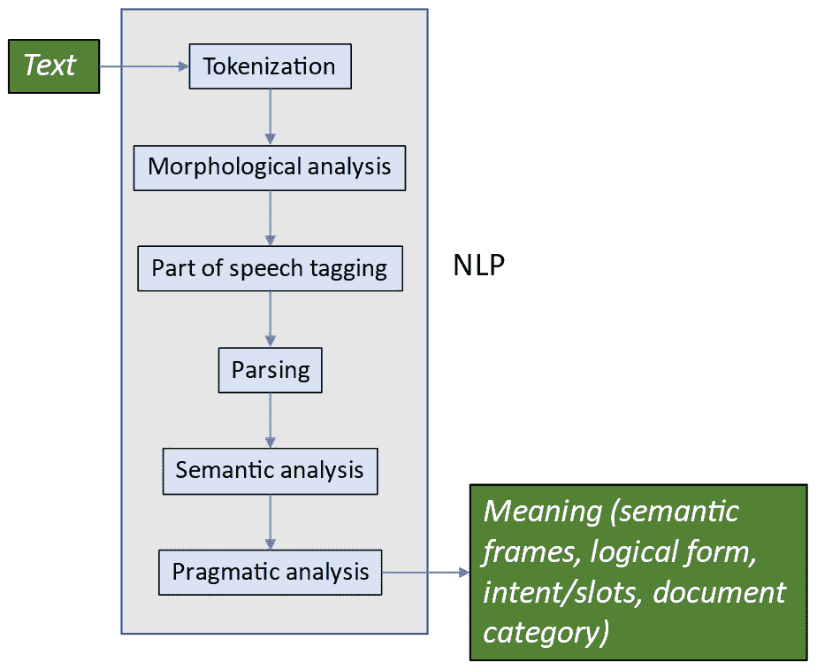
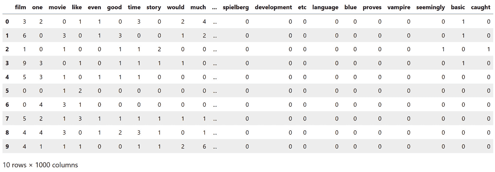
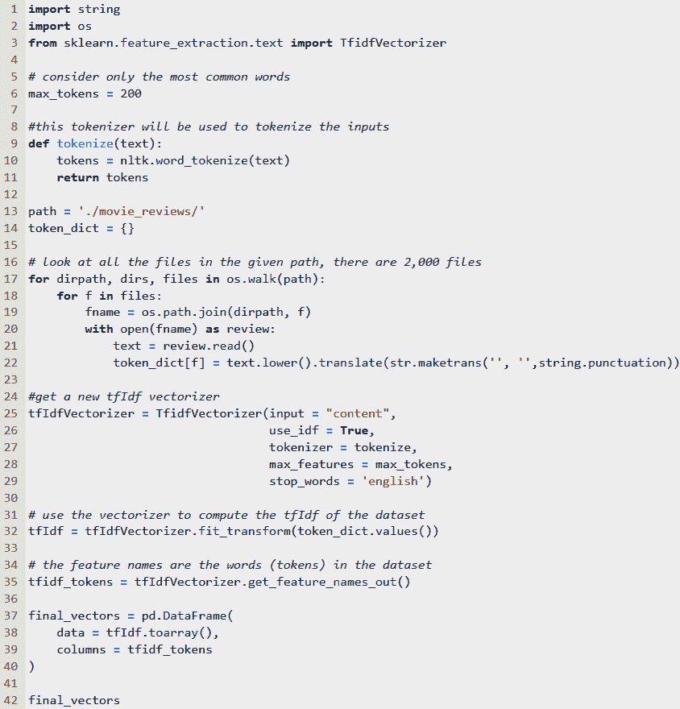
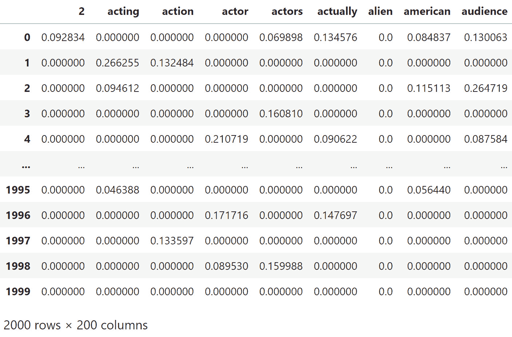

# 第七章：选择方法和表示数据

本章将涵盖为实施**自然语言处理**（**NLP**）应用程序做好准备的下一步。我们从一些基本的考虑事项开始，包括了解应用程序所需的数据量，如何处理专有词汇和语法，并考虑不同类型计算资源的需求。然后，我们讨论 NLP 的第一步——文本表示格式，这些格式将使我们的数据准备好用于 NLP 算法处理。这些格式包括用于表示单词和文档的符号和数值方法。在某种程度上，数据格式和算法可以在应用程序中进行混合搭配，因此，将数据表示与算法的考虑独立开来是很有帮助的。

第一节将回顾选择 NLP 方法的常规考虑事项，这些事项与我们正在处理的应用程序类型和我们将使用的数据有关。

本章将涵盖以下主题：

+   选择 NLP 方法

+   为 NLP 应用表示语言

+   使用向量以数值方式表示语言

+   使用与上下文无关的向量表示单词

+   使用与上下文相关的向量表示单词

# 选择 NLP 方法

NLP 可以使用多种可能的技术来实现。当你开始进行 NLP 应用时，你有许多选择需要做出，这些选择受到许多因素的影响。最重要的因素之一是应用程序本身的类型，以及系统需要从数据中提取的信息，以执行预定任务。下一节将讨论应用程序如何影响技术的选择。

## 使方法适应任务

回想一下*第一章*，NLP 应用程序可以分为**互动式**和**非互动式应用程序**。你选择的应用程序类型将在选择应用于任务的技术方面起到重要作用。另一种分类应用程序的方式是根据从文档中提取所需信息所需的详细程度。在最粗略的分析级别（例如，将文档分类为两种不同类别）时，技术可以较不复杂，训练速度较快，计算负担较轻。另一方面，如果任务是训练一个需要从每个发言中提取多个实体和值的聊天机器人或语音助手，分析需要更加敏感和精细。我们将在本章的后续部分看到一些具体的例子。

在下一节中，我们将讨论数据如何影响我们选择技术的方法。

## 从数据开始

自然语言处理（NLP）应用程序是建立在数据集或目标系统需要处理的数据示例集合上的。为了构建一个成功的应用程序，拥有合适数量的数据是至关重要的。然而，我们不能为每个应用程序指定一个固定的示例数量，因为不同类型的应用程序所需的数据量是不同的。我们不仅需要拥有合适的数据量，还必须拥有合适的数据类型。我们将在接下来的两节中讨论这些考虑因素。

### 多少数据才足够？

在*第五章*中，我们讨论了获取数据的多种方法，在阅读完*第五章*后，你应该对数据的来源有一个清晰的了解。然而，在该章节中，我们并没有涉及如何判断应用程序需要多少数据才能实现其目标这个问题。如果一个任务中有数百或数千种不同的文档分类，那么我们就需要足够多的每一类示例，才能使系统区分它们。显然，如果系统从未见过某一类别的示例，它是无法识别该类别的，但即使是它见过的类别，如果示例很少，也会很难进行区分。

如果某些类别的示例比其他类别多得多，那么我们就有了一个**不平衡**的数据集。平衡类别的技术将在*第十四章*中详细讨论，但基本方法包括**欠采样**（丢弃更多常见类别中的一些项）、**过采样**（复制稀有类别中的项目）和**生成**（通过规则生成稀有类别的人工示例）。

系统通常在数据量更多时表现更好，但这些数据还必须代表系统在测试时或作为应用程序部署时将遇到的数据。如果任务中加入了许多新的词汇（例如，如果一个公司的聊天机器人需要处理新的产品名称），则训练数据需要定期更新以获得最佳性能。这与专门词汇和语法的普遍问题有关，因为产品名称是一种专门的词汇。我们将在下一节讨论这一主题。

### 专门词汇和语法

另一个需要考虑的因素是数据与我们将要处理的其他自然语言的相似性。这一点很重要，因为大多数 NLP 处理都利用了从先前语言示例中派生的模型。数据越与语言其他部分相似，构建成功应用程序就越容易。如果数据充满了专有术语、词汇或语法，那么系统从原始训练数据推广到新数据将变得困难。如果应用中充满了专业词汇和语法，那么需要增加训练数据的量，以包括这些新的词汇和语法。

## 考虑计算效率

实现特定 NLP 方法所需的计算资源是在选择方法时需要考虑的重要因素。一些在实验室基准测试中能够获得良好结果的方法，在计划部署的应用中可能不切实际。在接下来的章节中，我们将讨论执行这些方法时所需时间的重要性，包括训练时间和推理时间。

### 训练时间

一些现代神经网络模型计算密集，训练周期非常长。甚至在神经网络训练开始之前，可能需要进行一些探索性工作，旨在找出超参数的最佳值。**超参数**是无法在训练过程中直接估计的训练参数，必须由开发者设置。当我们在*第九章*、*第十章*、*第十一章*和*第十二章*中回到机器学习技术时，我们将具体讨论超参数，并谈论如何识别合适的值。

### 推理时间

另一个重要的考虑因素是**推理时间**，即经过训练的系统执行任务所需的处理时间。对于聊天机器人等互动应用，推理时间通常不是问题，因为如今的系统足够快，能够跟上用户在互动应用中的节奏。如果一个系统需要一两秒钟来处理用户输入，那是可以接受的。另一方面，如果系统需要处理大量现有的在线文本或音频数据，那么推理时间应尽可能快。例如，Statistica.com（[`www.statista.com/statistics/259477/hours-of-video-uploaded-to-youtube-every-minute/`](https://www.statista.com/statistics/259477/hours-of-video-uploaded-to-youtube-every-minute/)）在 2020 年 2 月估算，每分钟就有 500 小时的视频上传到 YouTube。如果一个应用需要处理 YouTube 视频并且需要跟上这种音频的上传速度，那么它必须非常快速。

## 初步研究

实际应用中的 NLP 需要将工具与问题相匹配。当 NLP 技术有新的进展时，媒体可能会发布关于这些进展意味着什么的热情文章。但如果你正在尝试解决一个实际问题，使用新技术可能适得其反，因为最新的技术可能无法扩展。例如，新的技术可能提供更高的准确性，但代价是非常长的训练时间或非常大的数据量。因此，建议在尝试解决实际问题时，先使用更简单的技术进行初步探索性研究，以查看它们是否能解决问题。只有在简单的技术无法满足问题要求时，才应使用更先进的技术。

在下一部分，我们将讨论设计 NLP 应用时需要做出的一个重要选择——如何表示数据。我们将讨论符号化和数字化表示方法。

# 为 NLP 应用表示语言

为了让计算机能够处理自然语言，必须将语言表示为它们可以处理的形式。这些表示可以是**符号化的**，即直接处理文本中的单词，或者是**数字化的**，即表示为数字的形式。我们将在这里描述这两种方法。尽管数字化方法目前是 NLP 研究和应用中主要使用的方法，但了解符号处理背后的思想也是值得的。

## 符号化表示

传统上，NLP 一直是基于直接处理文本中的单词。这种方法体现在一种标准的方法中，即将文本分析为一系列步骤，旨在将由未经分析的单词组成的输入转换为意义。在传统的 NLP 管道中，如*图 7.1*所示，处理的每一步，从输入文本到意义，都会生成一个输出，增加更多的结构，并为下一步处理做好准备。所有这些结果都是符号化的——也就是说，非数字化的。在某些情况下，结果可能包括概率，但实际结果是符号化的：



图 7.1 – 传统的 NLP 符号化管道

尽管我们不会回顾符号化处理方法的所有组成部分，但我们可以在以下的代码示例中看到其中的一些符号化结果，分别展示了词性标注结果和句法分析结果。我们不会在这里讨论语义分析或语用分析，因为这些技术通常只应用于特定的问题：

```py
import nltk
from nltk.tokenize import word_tokenize
from nltk.corpus import movie_reviews
example_sentences = movie_reviews.sents()
example_sentence = example_sentences[0]
nltk.pos_tag(example_sentence)
```

上述代码片段展示了导入我们之前看到的电影评论数据库的过程，接着是选择第一句并进行词性标注的代码。下一个代码片段展示了词性标注的结果：

```py
[('plot', 'NN'),
 (':', ':'),
 ('two', 'CD'),
 ('teen', 'NN'),
 ('couples', 'NNS'),
 ('go', 'VBP'),
 ('to', 'TO'),
 ('a', 'DT'),
 ('church', 'NN'),
 ('party', 'NN'),
 (',', ','),
 ('drink', 'NN'),
 ('and', 'CC'),
 ('then', 'RB'),
 ('drive', 'NN'),
 ('.', '.')]
```

前述结果中显示的标签（`NN`、`CD`、`NNS`等）是 NLTK 使用的标签，并且在自然语言处理（NLP）中广泛使用。这些标签最初基于宾夕法尼亚树库的标签（*构建大型英语注释语料库：宾夕法尼亚树库*（Marcus 等，CL 1993））。

另一种重要的符号处理方法是`plot: two teen couples go to a church party, drink and then drive`，我们在前面的代码片段中看到过，在以下代码中也有体现：

```py
import spacy
text = "plot: two teen couples go to a church party, drink and then drive."
nlp = spacy.load("en_core_web_sm")
doc = nlp(text)
for token in doc:
    print (token.text, token.tag_, token.head.text, token.dep_)
plot NN plot ROOT
: : plot punct
two CD couples nummod
teen NN couples compound
couples NNS go nsubj
go VBP plot acl
to IN go prep
a DT party det
church NN party compound
party NN to pobj
, , go punct
drink VBP go conj
and CC drink cc
then RB drive advmod
drive VB drink conj
. . go punct
```

上述代码使用 spaCy 解析电影评论语料库中的第一句话。解析后，我们遍历结果文档中的所有标记，并打印出每个标记及其词性标签。接着是该标记的主词或它依赖的词的文本，以及主词与标记之间的依赖关系。例如，单词`couples`被标记为复数名词，它依赖于单词`go`，其依赖关系是`nsubj`，因为`couples`是`go`的主语（`nsubj`）。在*第四章*中，我们看到了一种依赖解析的可视化示例（*图 4.6*），该图通过弧线表示项目与其主词之间的依赖关系；然而，在上述代码中，我们看到的是更底层的信息。

在本节中，我们已经看到了一些基于分析单个单词和短语的符号表示语言的例子，包括单个单词的词性和短语的标签。我们也可以使用完全不同的、完全基于向量的数字化方法来表示单词和短语。

# 使用向量进行语言的数字化表示

在为机器学习做准备时，表示语言的常见数学方法是通过使用向量。文档和单词都可以用向量表示。我们将首先讨论文档向量。

## 理解用于文档表示的向量

我们已经看到，文本可以表示为单词等符号的序列，这是我们读取文本的方式。然而，出于计算机自然语言处理的目的，通常使用数字方式来表示文本，特别是当我们处理大量文本时。数字表示的另一个优点是，我们可以使用更广泛的数学技术来处理数字表示的文本。

表示文档和单词的一种常见方式是使用向量，向量本质上是一个一维数组。除了单词外，我们还可以使用向量来表示其他语言单位，如词根或词干形式的单词，这些在*第五章*中有描述。

### 二元词袋模型

在*第三章*和*第六章*中，我们简要讨论了根据单词是否出现在文档中来设置 `1` 或 `0`。向量中的每个位置代表文档的一个特征 —— 即单词是否出现。这是词袋的最简单形式，称为**二元词袋**。显然，这是一个非常粗糙的表示文档的方式。它只关心单词是否出现在文档中，因此无法捕获许多信息 —— 比如单词的邻近关系、单词在文档中的位置以及单词出现的频率等都没有在二元词袋中体现。此外，它还受到文档长度的影响，因为较长的文档会有更多的单词。

更详细的词袋方法不仅仅是计算单词是否出现在文档中，还要计算它出现的次数。为此，我们将转到下一个技术，**计数词袋**。

### 计数词袋

直观上，单词在文档中出现的次数似乎能帮助我们判断两篇文档的相似度。然而，到目前为止，我们还没有利用这些信息。在我们之前看到的文档向量中，值仅为 1 和 0 —— 如果单词出现在文档中则为 1，否则为 0。如果我们让这些值代表单词在文档中出现的次数，那么我们就能获得更多的信息。包含单词频率的词袋就是**计数词袋**。

我们在*第六章*的*词袋和 k-means 聚类*部分（*图 6.15*）中看到了生成二元词袋的代码。这段代码可以略微修改来计算计数词袋。唯一需要更改的是，当单词在文档中出现多次时，递增该单词的总计数。下面的代码展示了这一点：

```py
def document_features(document):
    features = {}
    for word in word_features:
        features[word] = 0
        for doc_word in document:
            if word == doc_word:
                features[word] += 1
    return features
```

将这段代码与*图 6.15*中的代码进行对比，我们可以看到，唯一的区别是，当单词在文档中出现时，`features[word]`的值会被递增，而不是设置为`1`。得到的矩阵，如*图 7.2*所示，包含了比*图 6.16*中的矩阵更多不同的单词频率值，后者仅包含零和一：



图 7.2 – 电影评论语料库的词袋计数

在*图 7**.2*中，我们查看了 10 个随机选取的文档，第一列从 `0` 到 `9` 进行编号。更仔细地查看 `film` 的频率（回想一下 `film` 是语料库中最常见的非停用词），我们可以看到除了文档 `5` 和文档 `6` 外，所有文档至少出现了一次 `film`。在二元 BoW 中，它们将被一起归为一类，但在这里它们有不同的值，这使得我们能够在文档之间进行更精细的区分。此时，您可能有兴趣返回*第六章*中的聚类练习，修改*图 6**.22*中的代码以使用计数 BoW，并查看生成的聚类结果。

我们可以从*图 7**.2*中看到，计数 BoW 比二元 BoW 给出了一些关于文档中出现词语的更多信息。然而，通过使用一种称为**TF-IDF**的技术，我们可以进行更精确的分析，下一节将对此进行描述。

### 术语频率-逆文档频率

考虑到我们的目标是找到一个准确反映文档之间相似性的表示，我们可以利用一些其他的见解。具体来说，请考虑以下观察：

+   文档中词语的原始频率将根据文档的长度而变化。这意味着具有较少总词数的较短文档可能看起来不像具有更多词语的较长文档那样相似。因此，我们应该考虑文档中词语的比例而不是原始数量。

+   总体上非常频繁出现的词语对于区分文档并不有用，因为每个文档都会包含很多这些词语。显然，在我们讨论的*第五章*中提到的停用词中，最有问题的词语将是停用词，但其他不严格属于停用词的词语也可能具有这种属性。回想一下我们在*第六章*中看过的电影评论语料库，诸如 `film` 和 `movie` 这样的词语在正面和负面评论中都非常常见，因此它们无法帮助我们区分这些类别。最有帮助的词语可能是在不同类别中以不同频率出现的词语。

一种考虑这些问题的流行方法是度量*TF-IDF*。TF-IDF 包括两个测量值 – **术语频率** (**TF**) 和 **逆文档频率** (**IDF**)。

TF 是一个术语（或单词）在文档中出现的次数，除以文档中的总词数（这考虑到较长的文档通常包含更多的单词）。我们可以将该值定义为`tf(term, document)`。例如，在*图 7.2*中，我们可以看到术语`film`在文档`0`中出现了一次，因此`tf("film",0)`为文档`0`长度的`1`。由于第二个文档中`film`出现了四次，`tf("film",1)`为文档`1`长度的`4`。术语频率的公式如下：

tf(t, d) =  f  t,d  _  Σ  t′ ∈d f  t′ ,d

然而，正如我们看到的停用词那样，频繁出现的单词对于区分文档没有太大帮助。即使`TF(term, document)`非常大，也可能仅仅是因为`term`在每篇文档中都频繁出现。为了解决这个问题，我们引入了 IDF。`idf(term, Documents)`的分子是语料库中的总文档数，`N`，我们将其除以包含术语`t`的文档数（`D`）。如果术语在语料库中没有出现，分母将为 0，因此为了防止除以 0，分母加 1。`idf(term, documents)`是这个商的对数。`idf`的公式如下：

idf(t, D) = log  N  ____________  |{d ∈ D : t ∈ d}|

然后，文档中给定语料库中术语的*TF-IDF*值仅仅是其 TF 和 IDF 的乘积：

tfidf(t, d, D) = tf ⋅ idf(t, D)

为了计算电影评论语料库的 TF-IDF 向量，我们将使用另一个非常有用的包——`scikit-learn`，因为 NLTK 和 spaCy 没有内置的 TF-IDF 函数。在这些包中计算 TF-IDF 的代码可以通过手动编写标准公式来完成，但如果我们使用`scikit-learn`中的函数，特别是在特征提取包中的`tfidfVectorizer`，实现起来会更快。计算包含 2,000 篇文档的电影评论语料库的 TF-IDF 向量的代码如*图 7.3*所示。在这个例子中，我们将只关注前 200 个术语。

分词器在第 9-11 行定义。在这个例子中，我们使用的是标准的 NLTK 分词器，但也可以使用任何其他的文本处理函数。例如，我们可能想尝试使用词干提取或词形还原后的词汇，这些功能可以包含在`tokenize()`函数中。为什么词干提取或词形还原文本可能是个好主意？

这种预处理方法可能有用的一个原因是，它可以减少数据中唯一标记的数量。这是因为具有多个不同变体的单词将被合并为它们的根词（例如，*walk*、*walks*、*walking* 和 *walked* 都会被视为同一个词）。如果我们认为这种变化大多只是数据中的噪声源，那么通过词干提取或词形还原来合并这些变体是一个好主意。然而，如果我们认为这种变化很重要，那么合并变体就不是一个好主意，因为这会导致信息丢失。我们可以通过考虑应用目标所需的信息，提前做出这种决策，也可以将此决策视为一个超参数，探索不同的选项并观察它们如何影响最终结果的准确性。

*图 7.3* 显示了代码的截图。



图 7.3 – 用于计算电影评论语料库的 TF-IDF 向量的代码

返回到 *图 7.3*，在定义分词函数后，下一步是定义数据存储路径（第 13 行）并在第 14 行初始化标记字典。然后，代码遍历数据目录并从每个文件中收集标记。在收集标记的过程中，代码会将文本转换为小写并移除标点符号（第 22 行）。将文本转换为小写并移除标点符号的决定由开发者做出，类似于我们之前讨论的是否对标记进行词干提取或词形还原的决定。我们可以通过经验来探索这两步预处理是否提高了处理的准确性；然而，如果我们思考一下大小写和标点符号带来的含义，我们会发现，在许多应用中，大小写和标点符号并没有增加太多意义。在这些应用中，将文本转换为小写并移除标点符号将改善结果。

在收集并统计完所有文件中的标记后，下一步是初始化 `tfIdfVectorizer`，这是 scikit-learn 中的一个内置函数。此操作在第 25 至 29 行完成。参数包括输入类型、是否使用 IDF、使用哪个分词器、使用多少特征以及停用词的语言（本示例中为英语）。

第 32 行是 TF-IDF 实际工作的地方，使用 `fit_transform` 方法，在此方法中，TF-IDF 向量是从文档和标记中构建的。其余的代码（第 37 至 42 行）主要用于帮助显示最终的 TF-IDF 向量。

最终的 TF-IDF 矩阵显示在 *图 7.4* 中：



图 7.4 – 电影评论语料库中部分文档的 TF-IDF 向量

我们现在已经将电影评论语料库表示为一个矩阵，其中每个文档是一个`N`维的向量，`N`是我们要使用的最大词汇量的大小。*图 7.4*展示了语料库中部分 2,000 个文档（文档 0-4 和 1995-1999）的 TF-IDF 向量，这些文档显示在行中，语料库中的一些词汇按字母顺序排列在顶部。为了展示的方便，文档和词汇都进行了截断。

在*图 7.4*中，我们可以看到，在不同文档中，相同词汇的 TF-IDF 值有很大差异。例如，`acting`在文档`0`和文档`1`中的得分差异显著。这将在下一步的处理（分类）中变得有用，我们将在*第九章*中回到这一部分。请注意，我们还没有进行实际的机器学习；到目前为止，目标仅仅是将文档转换为基于其包含的词汇的数值表示。

到目前为止，我们一直在关注文档的表示。但那么，如何表示词汇本身呢？文档向量中的词汇只是代表其频率的数字，要么仅在文档中出现的频率，要么是文档中词汇相对于语料库中词汇频率的频率（TF-IDF）。在我们迄今为止查看的技术中，并没有包含词汇本身的意义。然而，似乎很明显，文档中词汇的意义也应当影响文档与其他文档的相似度。我们将在下一节中探讨如何表示词汇的意义。这种表示方法在自然语言处理（NLP）领域中通常被称为**词向量**。我们将从一种流行的词向量表示方法——**Word2Vec**开始，它捕捉了词与词之间的语义相似性。

# 使用与上下文无关的向量表示词汇

到目前为止，我们已经查看了几种表示文档相似性的方法。然而，发现两个或多个文档彼此相似并不十分具体，尽管它对于某些应用场景（如意图或文档分类）可能有用。在这一节中，我们将讨论如何使用词向量表示词汇的意义。

## Word2Vec

Word2Vec 是一个流行的词向量表示库，由谷歌于 2013 年发布（Mikolov, Tomas 等人，2013 年，《*Efficient Estimation of Word Representations in Vector Space*》）。Word2Vec 的基本思想是，语料库中的每个词汇都由一个单一的向量表示，这个向量是根据词汇出现的所有上下文（周围词汇）计算得出的。这种方法背后的直觉是，具有相似意义的词汇会出现在相似的上下文中。这一直觉在语言学家 J. R. Firth 的名言中得到了总结：“*你可以通过一个词的伴随词来了解这个词*”（《语言学分析研究》，Wiley-Blackwell）。

让我们通过从将每个单词映射到一个向量的思想开始，逐步构建 Word2Vec。我们用来表示单词的最简单向量是这样的：在向量的某个特定位置上为 `1`，其他所有位置为 `0`（这种方法被称为 one-hot 编码，因为只有一位是开着的——即 *hot*）。向量的长度是词汇表的大小。语料库中所有单词的 one-hot 向量集合有点像字典，比如，我们可以说如果单词是 `movie`，它将在某个特定位置上用 `1` 来表示。如果单词是 `actor`，它将在另一个位置上用 `1` 来表示。

目前，我们还没有考虑周围的词语。one-hot 编码的第一步是整数编码，我们为语料库中的每个单词分配一个特定的整数。以下代码使用来自 scikit-learn 的库进行整数编码和 one-hot 编码。我们还从 `numpy` 库中导入了一些函数，如 `array` 和 `argmax`，我们将在后面的章节中再次使用这些函数：

```py
from numpy import array
from numpy import argmax
from sklearn.preprocessing import LabelEncoder
from sklearn.preprocessing import OneHotEncoder
#import the movie reviews
from nltk.corpus import movie_reviews
# make a list of movie review documents
documents = [(list(movie_reviews.words(fileid)))
             for category in movie_reviews.categories()
             for fileid in movie_reviews.fileids(category)]
# for this example, we'll just look at the first document, and
# the first 50 words
data = documents[0]
values = array(data)
short_values = (values[:50])
# first encode words as integers
# every word in the vocabulary gets a unique number
label_encoder = LabelEncoder()
integer_encoded = label_encoder.fit_transform(short_values)
# look at the first 50 encodings
print(integer_encoded)
[32  3 40 35 12 19 39  5 10 31  1 15  8 37 16  2 38 17 26  7  6  2 30 29
 36 20 14  1  9 24 18 11 39 34 23 25 22 27  1  8 21 28  2 42  0 33 36 13
  4 41]
```

看一下第一部电影评论中前 50 个整数编码，我们看到一个长度为 `50` 的向量。这个向量可以转换为 one-hot 编码，如下面的代码所示：

```py
# convert the integer encoding to onehot encoding
onehot_encoder = OneHotEncoder(sparse=False)
integer_encoded = integer_encoded.reshape(
    len(integer_encoded), 1)
onehot_encoded = onehot_encoder.fit_transform(
    integer_encoded)
print(onehot_encoded)
# invert the first vector so that we can see the original word it encodes
inverted = label_encoder.inverse_transform(
    [argmax(onehot_encoded[0, :])])
print(inverted)
[[0\. 0\. 0\. ... 0\. 0\. 0.]
 [0\. 0\. 0\. ... 0\. 0\. 0.]
 [0\. 0\. 0\. ... 1\. 0\. 0.]
 ...
 [0\. 0\. 0\. ... 0\. 0\. 0.]
 [0\. 0\. 0\. ... 0\. 0\. 0.]
 [0\. 0\. 0\. ... 0\. 1\. 0.]]
['plot']
```

上面的代码输出首先显示了一个子集的 one-hot 向量。由于它们是 one-hot 向量，因此它们在除一个位置之外的所有位置上都是 `0`，而唯一的那个位置值为 `1`。显然，这种表示方式是非常稀疏的，因此提供一个更紧凑的表示方式会更好。

倒数第二行展示了我们如何将 one-hot 向量反转以恢复原始单词。稀疏表示占用大量内存，而且不太实际。

Word2Vec 方法使用神经网络来减少嵌入的维度。我们将在 *第十章* 中回到神经网络的细节，但对于这个例子，我们将使用一个名为 `Gensim` 的库，它将为我们计算 Word2Vec。

以下代码使用 Gensim 的 `Word2Vec` 库来创建一个电影评论语料库的模型。通过 Word2Vec 创建的 Gensim `model` 对象包括许多有趣的用于处理数据的方法。以下代码展示了其中一个方法——`most_similar`，该方法给定一个单词后，能够在数据集中找到与该单词最相似的单词。这里，我们可以看到与语料库中 `movie` 最相似的 25 个单词的列表，以及根据 Word2Vec 分析，表示单词与 `movie` 相似度的得分：

```py
import gensim
import nltk
from nltk.corpus import movie_reviews
from gensim.models import Word2Vec
# make a list of movie review documents
documents = [(list(movie_reviews.words(fileid)))
             for category in movie_reviews.categories()
             for fileid in movie_reviews.fileids(category)]
all_words = movie_reviews.words()
model = Word2Vec(documents, min_count=5)
model.wv.most_similar(positive = ['movie'],topn = 25)
[('film', 0.9275647401809692),
 ('picture', 0.8604983687400818),
 ('sequel', 0.7637531757354736),
 ('flick', 0.7089548110961914),
 ('ending', 0.6734793186187744),
 ('thing', 0.6730892658233643),
 ('experience', 0.6683703064918518),
 ('premise', 0.6510635018348694),
 ('comedy', 0.6485130786895752),
 ('genre', 0.6462267637252808),
 ('case', 0.6455731391906738),
 ('it', 0.6344209313392639),
 ('story', 0.6279274821281433),
 ('mess', 0.6165297627449036),
 ('plot', 0.6162343621253967),
 ('message', 0.6131927371025085),
 ('word', 0.6131172776222229),
 ('movies', 0.6125075221061707),
 ('entertainment', 0.6109789609909058),
 ('trailer', 0.6068858504295349),
 ('script', 0.6000528335571289),
 ('audience', 0.5993804931640625),
 ('idea', 0.5915037989616394),
 ('watching', 0.5902948379516602),
 ('review', 0.5817495584487915)]
```

从上面的代码可以看到，Word2Vec 根据单词出现的上下文，找到的与 `movie` 最相似的单词正是我们所期待的。排名前两位的单词，`film` 和 `picture`，是 `movie` 的近义词。在 *第十章* 中，我们将回到 Word2Vec，并查看这种模型如何用于 NLP 任务。

虽然 Word2Vec 考虑了词语在数据集中出现的上下文，但词汇表中的每个词都由一个单一的向量表示，该向量囊括了词语出现的所有上下文。这忽视了词语在不同上下文中可能具有不同含义的事实。下一节将回顾基于特定上下文来表示词语的方法。

# 使用上下文相关的向量表示词语

Word2Vec 的词向量是上下文无关的，即一个词在任何上下文中总是具有相同的向量。然而，实际上，词语的含义受到附近词语的强烈影响。例如，*film*在句子*We enjoyed the film*和*the table was covered with a thin film of dust*中的含义是完全不同的。为了捕捉这些上下文中含义的差异，我们希望能够为这些词提供不同的向量表示，以反映由于不同上下文而导致的含义差异。这个研究方向在过去几年中得到了广泛的探索，最初是从**BERT**（**双向编码器表示的变换器**）系统开始的（[`aclanthology.org/N19-1423/`](https://aclanthology.org/N19-1423/)（Devlin 等，NAACL 2019））。

这种方法极大地推动了自然语言处理技术的进步，我们将在后文中深入讨论。因此，我们将在*第十一章*中详细探讨上下文相关的词语表示，在那一章中我们将对此话题进行深入讲解。

# 概述

在本章中，我们学习了如何根据可用的数据和其他需求选择不同的自然语言处理方法。此外，我们还学习了如何表示用于自然语言处理应用的数据。我们特别强调了向量表示，包括文档和词语的向量表示。对于文档表示，我们介绍了二进制词袋模型、词袋计数模型和 TF-IDF 方法。对于词语表示，我们回顾了 Word2Vec 方法，并简要介绍了上下文相关的向量，这将在*第十一章*中更加详细地讨论。

在接下来的四章中，我们将基于本章学习的表示方法，展示如何训练模型，并将其应用于不同的问题，如文档分类和意图识别。我们将从*第八章*的基于规则的方法开始，讨论在*第九章*中传统的机器学习技术，讲解*第十章*中的神经网络，并在*第十一章*中讨论最现代的方法——变换器和预训练模型。
