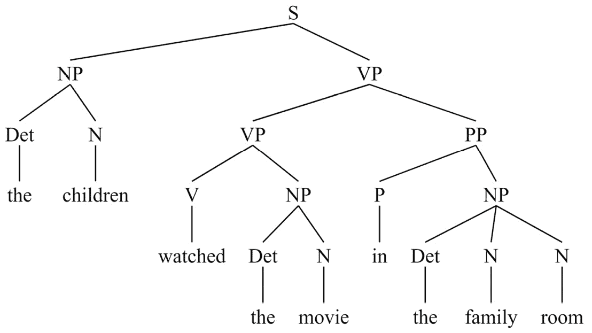
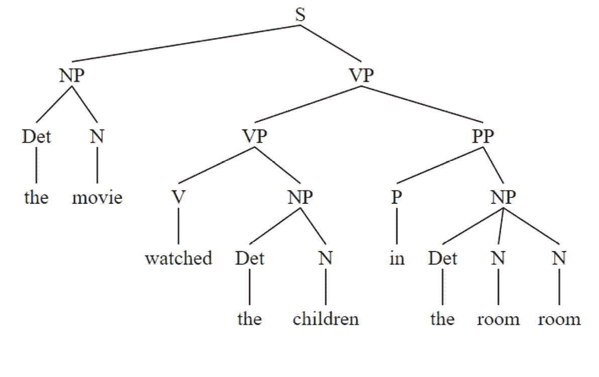
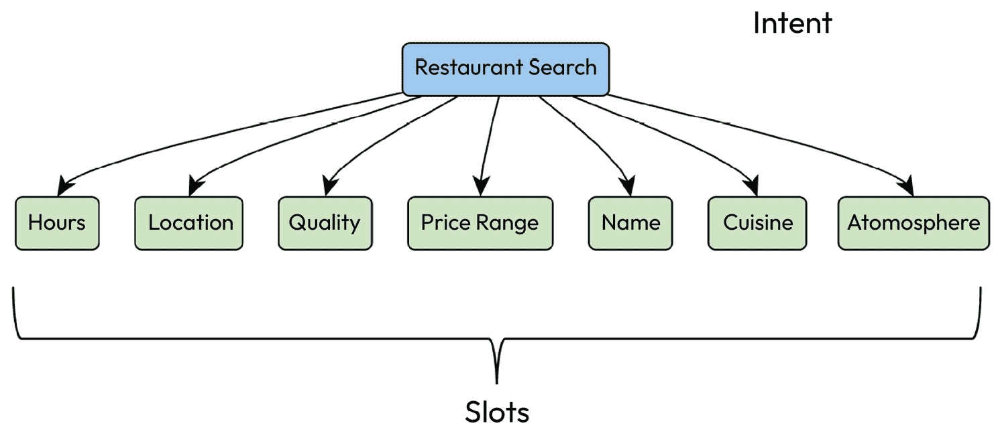
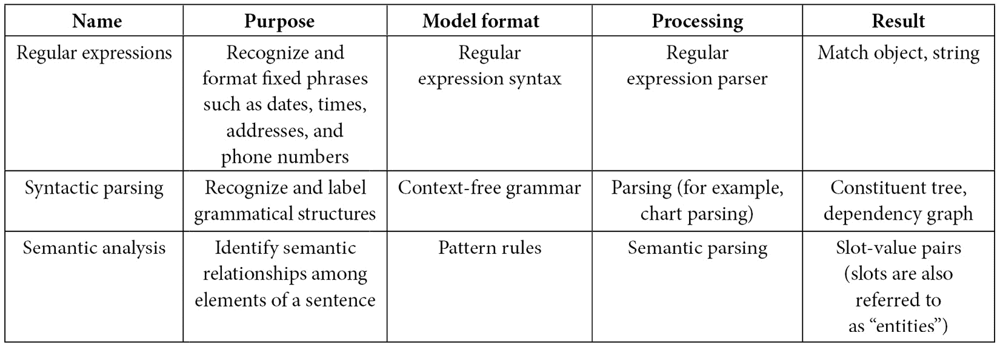

# 第八章：基于规则的技术

**基于规则的技术**是**自然语言处理**（**NLP**）中非常重要且有用的工具。规则用于检查文本并决定如何以全有或全无的方式进行分析，这与我们将在后续章节中回顾的统计技术不同。在本章中，我们将讨论如何将基于规则的技术应用于自然语言处理。我们将查看一些示例，如正则表达式、句法分析和语义角色分配。我们将主要使用在前几章中见过的 NLTK 和 spaCy 库。

本章将涵盖以下主题：

+   基于规则的技术

+   为什么使用规则？

+   探索正则表达式

+   句子级别分析——句法分析和语义角色分配

# 基于规则的技术

自然语言处理中的基于规则的技术顾名思义，依赖于由人工开发者编写的规则，而非从数据中派生的机器学习模型。基于规则的技术曾是多年来自然语言处理的最常见方法，但正如我们在*第七章*中看到的，基于规则的方法在大多数自然语言处理应用程序的整体设计中，已经被数值型的机器学习方法大多取代。出现这种情况的原因有很多；例如，由于规则是由人类编写的，如果开发者忽视了某些情况，规则可能无法覆盖所有场景。

然而，对于实际应用来说，规则可能非常有用，无论是单独使用，还是与机器学习模型结合使用。

下一节将讨论在自然语言处理应用中使用规则的动机。

# 为什么使用规则？

规则在以下一种或多种情况下非常有用：

+   您正在开发的应用程序要求分析包含成千上万甚至百万种变体的固定表达式，而提供足够的学习数据来训练机器模型将极为困难。这些固定表达式包括数字、货币金额、日期和地址等。例如，当数据如此多样化时，系统很难学习模型。此外，通常不需要这样做，因为这些表达式的格式非常结构化，编写分析这些表达式的规则并不困难。出于这两个原因，基于规则的方法是识别固定表达式的一个更简单的解决方案。

+   应用程序可用的训练数据非常少，而创建新数据将是昂贵的。例如，注释新的数据可能需要非常专业的专长。尽管现在有一些技术（如少量学习或零-shot 学习）可以使大规模预训练模型适应特定领域，但如果领域特定的数据在语法或词汇上与原始训练数据有很大不同，那么适应过程可能无法顺利进行。医学报告和空中交通管制信息就是这类数据的例子。

+   已经有现成的、经过充分测试的规则和库可以轻松地用于新的应用程序，例如用于识别日期和时间的 Python `datetime`包。

+   目标是通过对语料库的初步标注来启动一个机器学习模型。语料库标注是为了将该语料库作为机器学习模型的训练数据，或者将其作为 NLP 系统评估中的*黄金标准*所需的准备工作。在这个过程中，数据首先通过应用一些手写规则进行标注。然后，生成的标注语料库通常会被人工标注者审查和修正，因为它可能包含错误。尽管语料库需要审查过程，但通过基于规则的系统进行初步标注会比从零开始进行人工标注节省时间。

+   应用程序需要从一个固定的已知集合中找到命名实体。

+   结果必须非常精确——例如，语法检查、校对、语言学习和作者研究。

+   需要一个快速的原型来测试下游处理，而机器学习所需的数据收集和模型训练阶段则需要太多时间。

我们将从正则表达式开始，它是一种非常常见的技术，用于分析包含已知模式的文本。

# 探索正则表达式

**正则表达式**是一种广泛使用的基于规则的技术，通常用于识别固定表达式。我们所说的**固定表达式**是指根据其自身规则形成的单词和短语，这些规则与语言的正常模式有很大的不同。

一种固定表达式是*货币金额*。货币金额的格式变化很少——小数点位数、货币类型的符号，以及数字是否用逗号或句点分隔。应用程序可能只需要识别特定的货币，这样可以进一步简化规则。其他常见的固定表达式包括*日期*、*时间*、*电话号码*、*地址*、*电子邮件地址*、*度量单位*和*数字*。在 NLP 中，正则表达式最常用于对文本进行预处理，然后使用其他技术进一步分析。

不同的编程语言在正则表达式的格式上略有不同。我们将使用 Python 格式，具体格式可以参见[`docs.python.org/3/library/re.html`](https://docs.python.org/3/library/re.html)以及 Python `re`库中的定义。我们这里不会定义正则表达式语法，因为网上有很多资源描述了正则表达式语法，包括 Python 文档，我们不需要重复这些内容。你可能会发现[`www.h2kinfosys.com/blog/nltk-regular-expressions/`](https://www.h2kinfosys.com/blog/nltk-regular-expressions/)和[`python.gotrained.com/nltk-regex/`](https://python.gotrained.com/nltk-regex/)上的信息有助于深入了解 NLTK 中的正则表达式。

我们将首先介绍如何使用正则表达式操作字符串的基础知识，然后提供一些技巧，帮助简化正则表达式的应用和调试。

## 使用正则表达式识别、解析和替换字符串

正则表达式的最简单用法是仅仅标记是否匹配发生。固定表达式匹配后，我们要做什么取决于应用的目标。在某些应用中，我们只需要识别某个固定表达式是否发生过或没有发生过。例如，在验证网页表单中的用户输入时，这会很有用，这样用户就能纠正无效的地址格式。以下代码展示了如何使用正则表达式识别美国地址：

```py
import re
# process US street address
# the address to match
text = "223 5th Street NW, Plymouth, PA 19001"
print(text)
# first define components of an address
# at the beginning of a string, match at least one digit
street_number_re = "^\d{1,}"
# match street names containing upper and lower case letters and digits, including spaces,
# followed by an optional comma
street_name_re = "[a-zA-Z0-9\s]+,?"
# match city names containing letters, but not spaces, followed by a comma
# note that two word city names (like "New York") won't get matched
# try to modify the regular expression to include two word city names
city_name_re = " [a-zA-Z]+(\,)?"
# to match US state abbreviations, match any two upper case alphabetic characters
# notice that this overgenerates and accepts state names that don't exist because it doesn't check for a valid state name
state_abbrev_re = " [A-Z]{2}"
# match US postal codes consisting of exactly 5 digits. 9 digit codes exist, but this expression doesn't match them
postal_code_re = " [0-9]{5}$"
# put the components together -- define the overall pattern
address_pattern_re = street_number_re + street_name_re + city_name_re + state_abbrev_re + postal_code_re
# is this an address?
is_match = re.match(address_pattern_re,text)
if is_match is not None:
    print("matches address_pattern")
else:
    print("doesn't match")
```

在其他情况下，我们可能希望解析表达式并为其组件赋予含义——例如，在日期中，识别月份、日期和年份可能会很有用。在某些情况下，我们可能希望用另一个表达式替换该表达式，删除它，或者规范化它，使得所有该表达式的出现形式都一致。我们甚至可能需要做这些操作的组合。例如，如果应用是分类，那么我们可能只需要知道正则表达式是否出现过；也就是说，我们不需要关心它的内容。在这种情况下，我们可以用`class`标记（如`DATE`）替换该表达式，这样像*我们在 2022 年 8 月 2 日收到了包裹*这样的句子就变成了*我们在 DATE 收到了包裹*。将整个表达式替换为`class`标记还可以用于编辑敏感文本，例如社会保障号码。

上述代码展示了如何使用正则表达式匹配文本中的模式，并展示了确认匹配的代码。然而，这个例子只是展示了如何确认匹配是否存在。我们可能还需要做其他事情，比如用类标签替换地址，或者标记字符串中的匹配部分。以下代码展示了如何使用正则表达式的`sub`方法替换地址为类标签：

```py
# the address to match
text = "223 5th Street NW, Plymouth, PA 19001"
# replace the whole expression with a class tag -- "ADDRESS"
address_class = re.sub(address_pattern_re,"ADDRESS",text)
print(address_class)
ADDRESS
```

另一个有用的操作是为整个表达式添加语义标签，例如`address`，如下代码所示。这段代码展示了如何为地址添加标签。这样，我们就能够在文本中识别美国地址，并进行诸如计数或提取所有地址之类的任务：

```py
# suppose we need to label a matched portion of the string
# this function will label the matched string as an address
def add_address_label(address_obj):
    labeled_address = add_label("address",address_obj)
    return(labeled_address)
# this creates the desired format for the labeled output
def add_label(label, match_obj):
    labeled_result = "{" + label + ":" + "'" + match_obj.group() + "'" + "}"
    return(labeled_result)
# add labels to the string
address_label_result = re.sub(address_pattern_re,add_address_label,text)
print(address_label_result)
```

运行上述代码的结果如下：

```py
{address:'223 5th Street NW, Plymouth, PA 19001'}
```

最后，如果我们想要从文本中删除整个匹配项，正则表达式非常有用——例如，删除 HTML 标记。

## 使用正则表达式的通用技巧

正则表达式很容易变得非常复杂，且难以修改和调试。它们也很容易无法识别一些应该识别的示例，或者错误地识别了不该识别的内容。虽然很诱人去尝试将正则表达式匹配得恰好只识别它应该识别的内容，且不识别其他任何东西，但这样可能会使表达式变得过于复杂，难以理解。有时候，错过一些边缘情况可能比让表达式保持简单更好。

如果我们发现现有的正则表达式未能识别一些我们希望捕获的表达式，或错误地识别了不该捕获的表达式，有时修改现有表达式而不破坏原有的功能可能会很困难。以下是一些能让正则表达式更容易使用的技巧：

+   首先写下你希望正则表达式匹配的内容（例如*任何两个连续的大写字母*）。这不仅有助于明确你想要做的事情，还能帮助你发现可能忽略的情况。

+   将复杂的表达式拆分为多个组件，并在将它们组合之前独立测试每个组件。除了有助于调试外，这些组件表达式还可以在其他复杂表达式中重复使用。我们在上一节的第一个代码块中看到了这一点，像`street_name_re`这样的组件。

+   在尝试编写自己的正则表达式之前，先使用已有的经过测试的正则表达式来处理常见表达式，例如 Python 的`datetime`包（参见 [`docs.python.org/3/library/datetime.html`](https://docs.python.org/3/library/datetime.html)）。这些正则表达式经过多年多位开发者的充分测试。

接下来的两节将讨论分析自然语言中两个最重要方面的具体方法：单词和句子。

下一节将通过分析单个单词来开始这个话题。

# 单词级别的分析

本节将讨论两种分析单词的方法。第一种是词形还原，它通过将单词拆解成组成部分来减少文本中的变化。第二种方法讨论了一些关于如何利用关于单词意义的层次化语义信息（如本体论）进行分析的思路。

## 词形还原

在我们之前讨论的 *第五章* 文本预处理部分中，我们讲解了 **词形还原**（以及与之相关的词干提取）任务，作为一种规范化文本文档的方法，从而减少我们分析文档中的变异性。正如我们所讨论的，词形还原过程将文本中的每个单词转换为其词根，去除像英语中复数形式的 *-s* 这样的信息。词形还原还需要一个字典，因为字典提供了被还原词汇的词根。当我们在 *第五章* 中讲解词形还原时，我们使用了普林斯顿大学的 **WordNet**（[`wordnet.princeton.edu/`](https://wordnet.princeton.edu/)）作为字典。

在下一节中，我们将使用 WordNet 的语义信息，讨论本体及其应用。

## 本体

`entity`。

*图 3.2* 中的本体是 **WordNet** 英语及其他语言的一个部分。这些层级关系有时被称为 **is a** 关系。例如，*an airplane is a vehicle*（一架飞机是一个交通工具）。在这个例子中，我们说 *vehicle* 是一个 **上位词**，*airplane* 是一个 **下位词**。WordNet 使用自己的一些术语。在 WordNet 的术语中，**hypernym** 和上位词是一样的，**hyponym** 和下位词是一样的。

WordNet 还包含许多其他语义关系，如同义词和 *部分—整体* 关系。例如，我们可以从 WordNet 中了解到，机翼是飞机的一部分。此外，WordNet 还包括词性信息，你会记得我们在 *第五章* 中使用了这些词性信息，用于对文本进行词性标注，为词形还原做准备。

除了 WordNet，还有其他本体，你甚至可以使用斯坦福大学的 Protégé 工具（[`protege.stanford.edu/`](https://protege.stanford.edu/)）来构建你自己的本体。然而，WordNet 是一个很好的入门方法。

我们如何在自然语言处理（NLP）应用中利用像 WordNet 这样的本体呢？以下是一些想法：

+   开发一个写作工具，帮助作者查找同义词、反义词以及他们想要使用的词语的定义。

+   统计文本中不同类别的词汇出现次数。例如，你可能对查找所有提到“车辆”的地方感兴趣。即使文本中实际写的是 *car* 或 *boat*，你仍然可以通过查找与 *vehicle* 相关的上位词来判断文本中提到了车辆。

+   通过在不同句型中用相同的上位词替换不同的单词，为机器学习生成额外的训练数据。例如，假设我们有一个关于烹饪的聊天机器人，它可能会收到类似*How can I tell whether a pepper is ripe?* 或*Can I freeze tomatoes?*的问题。这些问题中，*pepper*和*tomatoes*可以被成百上千种不同类型的食物替代。如果要为所有这些类型创建训练示例，将会非常繁琐。为了避免这种情况，你可以从 WordNet 中找到所有不同类型的蔬菜，并通过将它们放入句子模板中生成训练数据，从而创造新的句子。

让我们看一个之前策略的例子。

你可能记得之前提到过 WordNet，它包含在 NLTK 中，因此我们可以导入它并查询*vegetable*的感知列表（**synsets**），如下所示：

```py
import nltk
from nltk.corpus import wordnet as wn
wn.synsets('vegetable')
```

然后，我们将看到*vegetable*有两个*感知*，或意思，我们可以使用以下代码查询它们的定义：

```py
[Synset('vegetable.n.01'), Synset('vegetable.n.02')]
print(wn.synset('vegetable.n.01').definition())
print(wn.synset('vegetable.n.02').definition())
```

感知名称的格式，例如`vegetable.n.01`，应该解释为`word`和`词性`（这里的*n*表示*名词*），后面跟着该单词在感知列表中的顺序。我们打印出每个感知的定义，以便查看 WordNet 中的感知含义。结果定义如下：

```py
edible seeds or roots or stems or leaves or bulbs or tubers or nonsweet fruits of any of numerous herbaceous plant
any of various herbaceous plants cultivated for an edible part such as the fruit or the root of the beet or the leaf of spinach or the seeds of bean plants or the flower buds of broccoli or cauliflower
```

第一个感知指的是我们吃的部分，第二个感知指的是我们吃的植物部分。如果我们对烹饪感兴趣，可能更想要把*vegetable*的第一个感知作为*食物*。我们可以使用以下代码获取第一个感知中的所有蔬菜列表：

```py
word_list = wn.synset('vegetable.n.01').hyponyms()
simple_names = []
for word in range (len(word_list)):
    simple_name = word_list[word].lemma_names()[0]
    simple_names.append(simple_name)
print(simple_names)
['artichoke', 'artichoke_heart', 'asparagus', 'bamboo_shoot', 'cardoon', 'celery', 'cruciferous_vegetable', 'cucumber', 'fennel', 'greens', 'gumbo', 'julienne', 'leek', 'legume', 'mushroom', 'onion', 'pieplant', 'plantain', 'potherb', 'pumpkin', 'raw_vegetable', 'root_vegetable', 'solanaceous_vegetable', 'squash', 'truffle']
```

代码执行以下步骤：

1.  收集所有第一个感知的蔬菜类型（下位词），并将它们存储在`word_list`变量中。

1.  遍历单词列表，为每个单词收集其词根，并将词根存储在`simple_names`变量中。

1.  打印出单词。

然后，我们可以通过将每个单词填充到文本模板中来生成一些示例数据，如下所示：

```py
text_frame = "can you give me some good recipes for "
for vegetable in range(len(simple_names)):
    print(text_frame + simple_names[vegetable])
can you give me some good recipes for artichoke
can you give me some good recipes for artichoke_heart
can you give me some good recipes for asparagus
can you give me some good recipes for bamboo_shoot
```

上述代码展示了从文本框架和蔬菜列表生成的前几个句子。当然，在实际应用中，我们希望有多个文本框架，以便获得更丰富的句子种类。

在本节开始时，我们列出了几种在自然语言处理应用中应用本体的方法；如果你想到其他不同的方式，利用单词的含义来解决自然语言应用中的问题，你可能还能想出更多方法。

然而，单词并不是孤立出现的；它们与其他单词组合在一起，构成具有更丰富、更复杂含义的句子。下一节将从单词分析转向整个句子的分析，我们将从句法和语义两个方面分析句子。

# 句子级别分析

句子可以从**句法**（句子各部分之间的结构关系）或**语义**（句子各部分的意义关系）方面进行分析。接下来我们将讨论这两种分析类型。识别句法关系对于一些应用非常有用，例如语法检查（句子的主语是否与动词一致？动词的形式是否正确？），而识别语义关系则对于一些应用，如在聊天机器人中查找请求的组成部分，也非常有用。将句法和语义关系一起识别是几乎所有 NLP 应用中统计方法的替代方案。

## 句法分析

句子和短语的句法可以通过一个叫做`parse`包的过程来分析，包中包含了多种解析算法，你可以进一步探索。在本节的例子中，我们将使用`nltk.parse.ChartParser`类中的图表解析器，这是一个常见且基础的方法。

### 上下文无关文法与解析

定义句法分析规则的一个非常常见的方法是**上下文无关文法**（**CFGs**）。CFG 可以用于图表解析以及许多其他解析算法。你可能对这种格式比较熟悉，因为它在计算机科学中被广泛应用于定义形式语言，如编程语言。CFG 由一组*规则*组成。每个规则由**左侧**（**LHS**）和**右侧**（**RHS**）组成，通常通过一个符号（如箭头）来分隔。规则的解释是，LHS 上的单一符号由 RHS 上的各个成分组成。

例如，句法无关规则`S -> NP VP`表明一个句子（`S`）由一个名词短语（**NP**）和一个动词短语（**VP**）组成。一个 NP 可以由一个**限定词**（**Det**），如*an*、*my*或*the*，后面跟着一个或两个**名词**（**Ns**），如*elephant*，可能接着一个**介词短语**（**PP**），或者仅仅是一个**代词**（**Pro**），等等。每个规则必须通过另一个规则来定义，直到规则最终以单词（或更广泛地说，*终结符号*）结束，这些符号不会出现在任何规则的左侧（LHS）。

以下展示了创建一些英语规则的 CFG 的代码。这些是*成分规则*，它们展示了句子各部分之间的关系。还有另一种常用的格式，即*依赖关系*，它展示了单词之间的关系，但我们在本书中不会探讨这种格式，因为成分规则足以说明句法语法和句法分析的基本概念：

```py
grammar = nltk.CFG.fromstring("""
S -> NP VP
PP -> P NP
NP -> Det N | Det N N |Det N PP | Pro
Pro -> 'I' |'you'|'we'
VP -> V NP | VP PP
Det -> 'an' | 'my' | 'the'
N -> 'elephant' | 'pajamas' | 'movie' |'family' | 'room' |'children'
V -> 'saw'|'watched'
P -> 'in'
""")
```

这个语法只能解析少数几句句子，如*孩子们在家庭房间观看电影*。例如，它无法解析句子*孩子们睡觉*，因为在这个语法中，VP 除了动词外，必须包括宾语或介词短语。完整的英语 CFG 会比前面的代码更大、更复杂。还值得指出的是，NLTK 规则可以附带概率标注，表示 RHS 上每个替代项的可能性。

例如，前面代码中的*规则 4*（`Pro  'I' |'you'|'we'`）可能具有*I*、*you* 和 *we* 的相对概率。在实践中，这将导致更准确的解析，但它不影响我们将在本章中展示的例子。*表 8.1* 总结了 CFG 术语的一些定义：

| **符号** | **含义** | **示例** |
| --- | --- | --- |
| S | 句子 | 孩子们观看了电影 |
| NP | 名词短语 | 孩子们 |
| VP | 动词短语 | 观看电影 |
| PP | 介词短语 | 在家庭房间 |
| Pro | 代词 | I, we, you, they, he, she, it |
| Det | 限定词或冠词 | the, a |
| V | 动词 | 看, 观看 |
| N | 名词 | 孩子们，电影，象，家庭，房间 |

表 8.1 – CFG 代码块中语法术语的含义

*表 8.2* 总结了在 NLTK CFG 中使用的一些句法约定：

| **符号** | **含义** |
| --- | --- |
| -> | 分隔左侧和右侧部分 |
| &#124; | 分隔扩展左侧的右侧部分（RHS）的替代可能性 |
| 单引号 | 表示一个单词；即终结符号 |
| 首字母大写 | 表示一个句法类别；即非终结符号，预计通过其他规则进行定义 |

表 8.2 – CFG 语法

我们可以使用前面代码块中的语法，通过以下代码来解析并可视化句子*孩子们在家庭房间观看电影*：

```py
# we will need this to tokenize the input
from nltk import word_tokenize
# a package for visualizing parse trees
import svgling
# to use svgling we need to disable NLTK's normal visualization functions
svgling.disable_nltk_png()
# example sentence that can be parsed with the grammar we've defined
sent = nltk.word_tokenize("the children watched the movie in the family room")
# create a chart parser based on the grammar above
parser = nltk.ChartParser(grammar)
# parse the sentence
trees = list(parser.parse(sent))
# print a text-formatted parse tree
print(trees[0])
# print an SVG formatted parse tree
trees[0]
```

我们可以以不同方式查看解析结果——例如，像下面的代码那样作为括号文本格式：

```py
(S
  (NP (Det the) (N children))
  (VP
    (VP (V watched) (NP (Det the) (N movie)))
    (PP (P in) (NP (Det the) (N family) (N room)))))
```

请注意，解析直接反映了语法：整体结果称为*S*，因为它来自语法中的第一个规则，`S -> NP VP`。同样，*NP* 和 *VP* 直接连接到 *S*，它们的子节点在它们后面以括号形式列出。

上述格式对于后续的处理阶段非常有用，可能需要机器可读；然而，它有点难以阅读。*图 8.1* 显示了这个解析的常规树形图，更容易查看。与前面的文本解析相似，你可以看到它与语法直接对齐。单词或终结符号都出现在树的底部，或称为*叶子*：



图 8.1 – “孩子们在家庭房间观看电影”的句法树

你可以尝试用这个语法解析其他句子，还可以尝试修改语法。例如，尝试添加一个语法规则，使得语法能够解析没有跟 NP 或 PP 的动词的句子，比如*孩子们睡觉了*。

## 语义分析和槽填充

前面关于正则表达式和句法分析的章节仅仅讨论了句子的结构，而没有涉及它们的意义。像前面章节展示的这种句法语法，可以解析像*电影在房间里看孩子*这样的无意义句子，只要它们符合语法规则。我们可以在*图 8.2*中看到这一点：



图 8.2 – “电影在房间里看孩子”句子的句法树

然而，在大多数应用程序中，我们不仅仅想找出句子的句法结构；我们还想提取它们的部分或全部含义。提取含义的过程叫做**语义分析**。*含义*的具体意义会根据应用程序的不同而变化。例如，在我们本书中到目前为止讨论的许多应用中，唯一需要从文档中推导出来的含义就是它的总体分类。这在电影评论数据中就是如此——我们希望从文档中获取的唯一含义就是积极或消极的情感。我们在前几章中讨论的统计方法非常擅长进行这种粗粒度的处理。

然而，也有一些应用需要获得句子中项目之间关系的更详细信息。虽然有一些机器学习技术可以获取细粒度的信息（我们将在*第九章*、*第十章*和*第十一章*中讨论它们），但它们在大量数据下表现最佳。如果数据较少，有时基于规则的处理会更加有效。

### 基本的槽填充

对于接下来的例子，我们将详细讨论一种在互动应用程序中经常使用的技术——**槽填充**。这是一种常用于语音机器人和聊天机器人的技术，尽管它也用于非互动应用程序，如*信息提取*。

作为一个例子，考虑一个帮助用户寻找餐馆的聊天机器人应用程序。该应用程序被设计为期待用户提供一些搜索标准，如菜系类型、氛围和位置。这些标准就是应用程序中的*槽*。例如，用户可能会说，*我想找一家离这里近的意大利餐馆*。整体用户目标，**餐馆搜索**，就是*意图*。在这一章中，我们将重点关注识别槽，但会在后续章节中更详细地讨论意图。

该应用程序的设计如*图 8.3*所示：



图 8.3 – 餐厅搜索应用的槽位

在处理用户的发言时，系统必须识别出用户指定了哪些槽位，并提取其值。这就是系统帮助用户找到餐厅所需要的所有信息，因此句子中的其他部分通常会被忽略。如果被忽略的部分实际上是相关的，这可能会导致错误，但在大多数情况下，这种方法是有效的。这也为许多应用程序提供了一种有用的处理策略，即系统只查找与其任务相关的信息。这与我们之前回顾的句法分析过程不同，后者要求系统分析整个句子。

我们可以使用 spaCy 中的基于规则的匹配器来创建一个应用程序，分析用户的发言以找出这些槽位的值。基本方法是为系统定义模式，以找到指定槽位的词，并定义相应的标签来标记这些值及其槽位名称。以下代码展示了如何在句子中找到 *图 8.3* 中显示的一些槽位（我们不会展示所有槽位的代码，以保持示例简短）：

```py
import spacy
from spacy.lang.en import English
nlp = English()
ruler = nlp.add_pipe("entity_ruler")
cuisine_patterns = [
    {"label": "CUISINE", "pattern": "italian"},
    {"label": "CUISINE", "pattern": "german"},
    {"label": "CUISINE", "pattern": "chinese"}]
price_range_patterns = [
    {"label": "PRICE_RANGE", "pattern": "inexpensive"},
    {"label": "PRICE_RANGE", "pattern": "reasonably priced"},
    {"label": "PRICE_RANGE", "pattern": "good value"}]
atmosphere_patterns = [
    {"label": "ATMOSPHERE", "pattern": "casual"},
    {"label": "ATMOSPHERE", "pattern": "nice"},
    {"label": "ATMOSPHERE", "pattern": "cozy"}]
location_patterns = [
    {"label": "LOCATION", "pattern": "near here"},
    {"label": "LOCATION", "pattern": "walking distance"},
    {"label": "LOCATION", "pattern": "close by"},
    {"label": "LOCATION", "pattern": "a short drive"}]
ruler.add_patterns(cuisine_patterns)
ruler.add_patterns(price_range_patterns)
ruler.add_patterns(atmosphere_patterns)
ruler.add_patterns(location_patterns)
doc = nlp("can you recommend a casual italian restaurant within walking distance")
print([(ent.text, ent.label_) for ent in doc.ents])
[('casual', 'ATMOSPHERE'), ('italian', 'CUISINE'), ('walking distance', 'LOCATION')]
```

上述代码首先导入了 spaCy 和我们在英语文本处理中需要的信息。规则处理器被称为 `ruler`，并作为 NLP 流程中的一个阶段添加。然后我们定义了三种菜系（实际应用中可能有更多种），并将它们标记为 `CUISINE`。类似地，我们定义了用于识别价格范围、氛围和地点的模式。这些规则规定，如果用户的句子包含特定的词或短语，例如 `near here`，则应将 `LOCATION` 槽位填充为该词或短语。

下一步是将模式添加到规则处理器（`ruler`）中，然后在一个示例句子上运行 NLP 处理器，*你能推荐一个步行可达的休闲意大利餐厅吗？*。这个过程将规则应用于文档，结果是得到一组标记的槽位（称为`doc.ents`）。通过打印槽位和值，我们可以看到处理器找到了三个槽位，`ATMOSPHERE`、`CUISINE` 和 `LOCATION`，对应的值分别是 `casual`、`Italian` 和 `walking distance`。通过尝试其他句子，我们可以确认这个槽位填充方法的以下几个重要特性：

+   句子中不匹配模式的部分，如*你能推荐吗*，会被忽略。这也意味着，句子中不匹配的部分可能是无意义的，或者实际上对含义至关重要，但被忽略后，系统可能会出错。例如，如果用户说*你能推荐一个步行可达的非意大利餐馆吗*，系统会错误地认为用户想找一个意大利餐馆，依据这些规则。可以编写额外的规则来考虑这类情况，但在许多应用中，我们只希望接受一些不准确性，作为保持应用简洁的代价。这个问题需要根据具体应用来考虑。

+   插槽和对应的值会在句子中出现的任何位置被识别；它们不需要出现在特定的顺序中。

+   如果特定插槽没有出现在句子中，通常不会导致问题。它只会从结果实体列表中被省略。

+   如果一个插槽出现多次，所有出现的实例都会被识别。

插槽标签的名称由开发者自行决定；它们不需要是特定的值。例如，我们可以使用`TYPE_OF_FOOD`代替`CUISINE`，处理方式是一样的。

我们可以使用 spaCy 的可视化工具`displacy`，通过以下代码来获得结果的更清晰可视化：

```py
from spacy import displacy
colors = {"CUISINE": "#ea7e7e",
          "PRICE_RANGE": "#baffc9",
          "ATMOSPHERE": "#abcdef",
          "LOCATION": "#ffffba"}
options = {"ents": ["CUISINE","PRICE_RANGE","ATMOSPHERE","LOCATION"], "colors": colors}
displacy.render(doc, style="ent", options=options,jupyter = True)
```

我们可以在*图 8.4*中看到结果，其中文本及其插槽和对应的值已被高亮显示：


图 8.4 – 使用 displacy 进行插槽可视化

由于我们的插槽是自定义的（即不是内建在 spaCy 中的），为了显示彩色的插槽，我们必须为不同的插槽（或`ents`）定义颜色，并将这些颜色分配给插槽。然后，我们可以使用不同的颜色可视化每个插槽及其对应的值。颜色在前面的代码中的`colors`变量中定义。我们可以为插槽分配任何认为有用的颜色。这些颜色不一定要不同，但通常来说，如果它们不同并且具有较高的区分度会更有帮助。此示例中的颜色值是十六进制代码，具有标准的颜色解释。[`www.color-hex.com/`](https://www.color-hex.com/) 是一个显示许多颜色的十六进制值的实用网站。

### 使用 spaCy 的 id 属性

你可能已经注意到，在这个例子中我们定义的一些插槽值是相同的——例如，`close by` 和 `near here`。如果这些插槽和值被传递到后续的处理阶段，比如数据库查询，那么后续阶段必须有处理 `close by` 和 `near here` 两者的代码，尽管数据库查询是相同的。这会使应用程序变得复杂，因此我们希望避免这种情况。spaCy 提供了 `ent` 的另一个属性，`ent_id_`，用于这个目的。这个 `id` 属性可以在查找插槽的模式中分配，并且可以与标签和模式一起使用。通过在模式声明中指定 `id` 属性来完成这一操作，这是以下代码中位置模式的修改：

```py
location_patterns = [
    {"label": "LOCATION", "pattern": "near here", "id":"nearby"},
    {"label": "LOCATION", "pattern": "close by","id":"nearby"},
    {"label": "LOCATION", "pattern": "near me","id":"nearby"},
    {"label": "LOCATION", "pattern": "walking distance", "id":"short_walk"},
    {"label": "LOCATION", "pattern": "short walk", "id":"short_walk"},
    {"label": "LOCATION", "pattern": "a short drive", "id":"short_drive"}]
```

如果我们打印出来自 *can you recommend a casual italian restaurant close by* 的插槽、值和 ID，结果如下：

```py
[('casual', 'ATMOSPHERE', ''), ('italian', 'CUISINE', ''), ('close by', 'LOCATION', 'nearby')]
```

在这里，我们可以看到 `close by` 的 ID 是 `nearby`，这是基于 `close` `by` 的模式。

在前面的代码中，我们可以看到前三个位置模式，这些模式具有相似的含义，都被分配了 `nearby` 的 ID。通过这个 ID，处理的下一阶段只需要接收 `ent_id_` 值，因此只需要处理 `nearby`，而不需要为 `close by` 和 `near me` 添加额外的情况。

请注意，在这个例子中，`CUISINE` 和 `ATMOSPHERE` 插槽的结果没有 ID，因为这些模式中没有定义 `CUISINE` 和 `ATMOSPHERE`。然而，最好为所有模式定义 ID（如果有 ID），以保持结果的一致性。

还请注意，这些模式反映了一些关于哪些短语是同义的设计决策，因此应具有相同的 ID，哪些短语不是同义的，应具有不同的 ID。

在前面的代码中，我们可以看到 `short walk` 并没有与 `near me` 具有相同的 ID。例如，在这里做出的设计决策是将 `short walk` 和 `near me` 视为具有不同的含义，因此在应用程序的后续阶段需要不同的处理。关于哪些值是同义词，哪些不是同义词的决策将取决于应用程序以及后端应用程序中可用的信息的丰富程度。

我们已经描述了几种有用的基于规则的自然语言处理方法。*表 8.3* 总结了这些基于规则的技术，列出了规则技术的三个重要特性：

+   规则的格式

+   应用规则到文本的处理类型

+   结果如何表示



表 8.3 – 基于规则的技术的格式、处理和结果

# 总结

在本章中，我们学习了几种重要的技能，利用规则处理自然语言。

我们已经学会了如何应用正则表达式来识别固定格式的表达式，如数字、日期和地址。我们还了解了基于规则的 Python 工具的使用，例如 NLTK 语法分析库，用于分析句子的语法结构，并学会了如何应用它们。最后，我们学习了用于语义分析的基于规则的工具，例如 spaCy 的`entity_ruler`，用于分析句子的槽-值语义。

下一章，*第九章*将通过介绍统计技术，如使用朴素贝叶斯的分类方法、**词频-逆文档频率**（**TF-IDF**）、**支持向量机**（**SVMs**）和条件随机场，开始讨论机器学习。与我们在本章讨论的基于规则的方法不同，统计方法基于从训练数据中学习到的模型，然后应用到新的、未见过的数据上。与全或无的基于规则的系统不同，统计系统是基于概率的。

在探索这些技术时，我们还将考虑如何将它们与本章讨论的基于规则的技术结合起来，以创建更强大和有效的系统。
