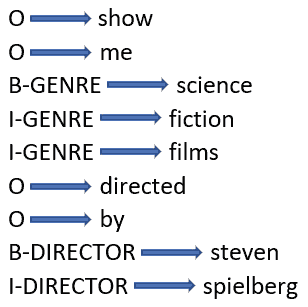
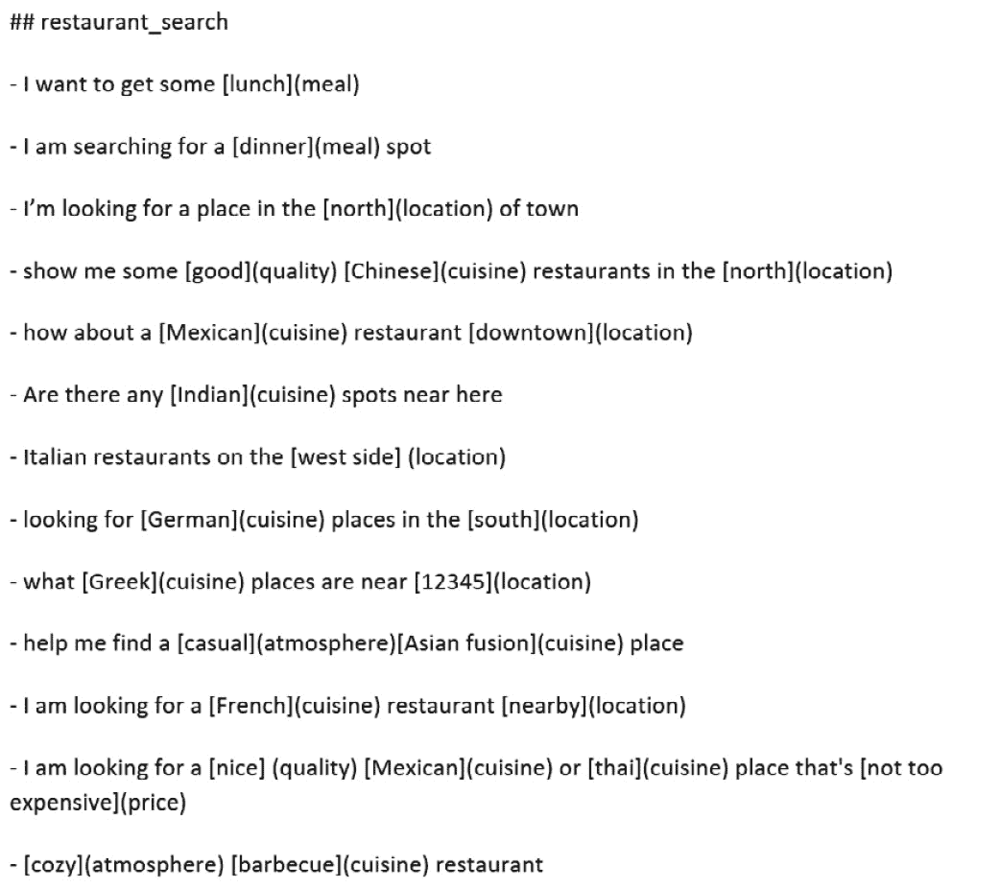

# 第九章：机器学习第一部分 – 统计机器学习

在本章中，我们将讨论如何将经典的统计机器学习技术应用于常见的**自然语言处理**（**NLP**）任务，如分类（或意图识别）和槽位填充。这些技术包括**朴素贝叶斯**、**词频-逆文档频率**（**TF-IDF**）、**支持向量机**（**SVMs**）和**条件随机场**（**CRFs**）。

这些经典技巧有两个方面需要我们考虑：表示和模型。**表示**指的是我们要分析的数据格式。你会记得在*第七章*中，标准的自然语言处理数据格式并不仅仅是单词列表。像向量这样的数值数据表示格式使得使用广泛可用的数值处理技术成为可能，从而开辟了许多处理的可能性。在*第七章*中，我们还探索了数据表示方法，如**词袋模型**（**BoW**）、TF-IDF 和 Word2Vec。本章中我们将主要使用 TF-IDF。

一旦数据格式化为可供进一步处理的形式，也就是说，一旦数据被*向量化*，我们就可以用它来训练或构建一个模型，进而分析系统未来可能遇到的相似数据。这就是**训练**阶段。未来数据可以是测试数据；也就是说，之前未见过的数据，类似于训练数据，用于评估模型。此外，如果模型在实际应用中使用，未来数据可能是用户或客户对运行时系统提出的新查询示例。当系统在训练阶段之后用于处理数据时，这被称为**推断**。

本章将涵盖以下主题：

+   评估的简要概述

+   使用 TF-IDF 表示文档，并通过朴素贝叶斯进行分类

+   使用 SVM 进行文档分类

+   使用条件随机场进行槽位填充

我们将以一套非常实用且基础的技巧开始本章内容，这些技巧应该是每个人工具箱中的一部分，并且经常成为分类问题的实际解决方案。

# 评估的简要概述

在我们了解不同统计技术如何工作之前，我们需要有一种方法来衡量它们的性能，并且有几个重要的考虑事项我们应该先回顾一下。第一个考虑因素是我们为系统的处理分配的*指标*或得分。最常见且简单的指标是**准确率**，它是正确响应的数量除以总尝试次数。例如，如果我们试图衡量一个电影评论分类器的性能，并且我们尝试将 100 条评论分类为正面或负面，如果系统正确分类了 75 条评论，那么准确率就是 75%。一个紧密相关的指标是**错误率**，从某种意义上说，它是准确率的对立面，因为它衡量的是系统犯错的频率。在这个例子中，错误率是 25%。

本章我们仅使用准确率，尽管实际上有更精确和信息量更大的指标被更常用，例如**精确度**、**召回率**、**F1**和**曲线下面积（AUC）**。我们将在*第十三章*中讨论这些指标。就本章而言，我们只需要一个基本的指标来进行结果对比，准确率已经足够。

我们在评估时需要牢记的第二个重要考虑因素是如何处理我们用于评估的数据。机器学习方法采用标准方法进行训练和评估，这涉及将数据集划分为*训练*、*开发*（也常称为*验证*）数据和*测试*子集。训练集是用于构建模型的数据，通常占可用数据的 60-80%，尽管具体百分比并不是决定性因素。通常，你会希望尽可能多地使用数据来进行训练，同时保留合理数量的数据用于评估目的。一旦模型构建完成，它可以用开发数据进行测试，通常约占总数据集的 10-20%。通过在开发集上使用模型，通常能发现训练算法的问题。最终的评估是在剩余的数据——测试数据上进行的，测试数据通常占总数据的 10%。

再次强调，训练、开发和测试数据的具体划分并不是关键。你的目标是使用训练数据构建一个好的模型，使得你的系统能够准确地预测新的、以前未见过的数据的解释。为了实现这一目标，你需要尽可能多的训练数据。测试数据的目标是准确衡量模型在新数据上的表现。为了实现这一目标，你需要尽可能多的测试数据。因此，数据划分总是涉及这些目标之间的权衡。

保持训练数据与开发数据，特别是测试数据的分离是非常重要的。训练数据上的表现并不能很好地反映系统在新数据上的实际表现，因此不应将训练数据的表现用于评估。

在简要介绍完评估后，我们现在将进入本章的主要内容。我们将讨论一些最为成熟的机器学习方法，这些方法广泛应用于重要的自然语言处理（NLP）任务，如分类和槽位填充。

# 使用 TF-IDF 表示文档，并通过朴素贝叶斯进行分类

除了评估之外，机器学习一般范式中还有两个重要话题：表示和处理算法。表示涉及将文本（如文档）转换为一种数值格式，该格式保留了关于文本的相关信息。然后，处理算法会分析这些信息，以执行自然语言处理任务。你已经在*第七章*中见过常见的表示方法——TF-IDF。在本节中，我们将讨论如何将 TF-IDF 与一种常见的分类方法——朴素贝叶斯结合使用。我们将解释这两种技术，并展示一个示例。

## TF-IDF 总结

你可能还记得在*第七章*中关于 TF-IDF 的讨论。TF-IDF 基于一个直观的目标，即试图在文档中找到特别能代表其分类主题的词汇。在整个语料库中相对较少出现，但在特定文档中相对较常见的词汇，似乎在确定文档类别时非常有帮助。TF-IDF 在*第七章*的*词频-逆文档频率（TF-IDF）*部分中给出了定义。此外，我们还在*图 7.4*中看到了电影评论语料库中一些文档的部分 TF-IDF 向量。在这里，我们将使用这些 TF-IDF 向量，并利用朴素贝叶斯分类方法对文档进行分类。

## 使用朴素贝叶斯进行文本分类

贝叶斯分类技术已经使用多年，尽管其历史悠久，但至今仍然非常常见并被广泛使用。贝叶斯分类简单且快速，并且在许多应用中能产生令人满意的结果。

贝叶斯分类的公式如以下方程所示。对于每一个可能的类别，对于每一个文档，我们想要计算该文档属于该类别的概率。这一计算基于文档的某种表示；在我们的案例中，表示将是我们之前讨论过的向量之一——如 BoW、TF-IDF 或 Word2Vec。

为了计算这个概率，我们考虑给定类别下向量的概率，乘以类别的概率，再除以文档向量的概率，如下所示的公式：

P(category ∣ documentVector) =  P(documentVector ∣ category)P(category)    _____________________________  P(documentVector)

训练过程将决定每个类别中文档向量的概率以及各类别的总体概率。

这个公式被称为*朴素*，因为它假设向量中的特征是独立的。显然，对于文本来说这是不正确的，因为句子中的单词并不是完全独立的。然而，这个假设使得处理过程大大简化，实际应用中通常不会对结果产生重大影响。

贝叶斯分类有二元和多类版本。由于我们只有两类评论，因此我们将使用电影评论语料库进行二元分类。

## TF-IDF/贝叶斯分类示例

使用 TF-IDF 和朴素贝叶斯进行电影评论分类时，我们可以从读取评论并将数据拆分为训练集和测试集开始，如下代码所示：

```py
import sklearn
import os
from sklearn.feature_extraction.text import TfidfVectorizer
import nltk
from sklearn.datasets import load_files
path = './movie_reviews/'
# we will consider only the most 1000 common words
max_tokens = 1000
# load files -- there are 2000 files
movie_reviews = load_files(path)
# the names of the categories (the labels) are automatically generated from the names of the folders in path
# 'pos' and 'neg'
labels = movie_reviews.target_names
# Split data into training and test sets
# since this is just an example, we will omit the dev test set
# 'movie_reviews.data' is the movie reviews
# 'movie_reviews.target' is the categories assigned to each review
# 'test_size = .20' is the proportion of the data that should be reserved for testing
# 'random_state = 42' is an integer that controls the randomization of the
# data so that the results are reproducible
from sklearn.model_selection import train_test_split
movies_train, movies_test, sentiment_train, sentiment_test = train_test _split(movie_reviews.data,                                                                          movie_reviews.target,                                                                                                                                                    test_size  = 0.20,                                                                                                                                                      random_state = 42)
```

一旦我们有了训练和测试数据，下一步是从评论中创建 TF-IDF 向量，如下代码片段所示。我们将主要使用 scikit-learn 库，虽然在分词时我们会使用 NLTK：

```py
# initialize TfidfVectorizer to create the tfIdf representation of the corpus
# the parameters are: min_df -- the percentage of documents that the word has
# to occur in to be considered, the tokenizer to use, and the maximum
# number of words to consider (max_features)
vectorizer = TfidfVectorizer(min_df = .1,
                             tokenizer = nltk.word_tokenize,
                             max_features = max_tokens)
# fit and transform the text into tfidf format, using training text
# here is where we build the tfidf representation of the training data
movies_train_tfidf = vectorizer.fit_transform(movies_train)
```

前面代码中的主要步骤是创建向量化器，然后使用向量化器将电影评论转换为 TF-IDF 格式。这与我们在*第七章*中遵循的过程相同。生成的 TF-IDF 向量已经在*图 7.4*中展示，因此我们在此不再重复。

然后，使用 scikit-learn 中的多项式朴素贝叶斯函数将文档分类为正面和负面评论，这是 scikit-learn 的朴素贝叶斯包之一，适用于处理 TF-IDF 向量数据。你可以访问 scikit-learn 的其他朴素贝叶斯包以获取更多信息，网址为[`scikit-learn.org/stable/modules/naive_bayes.html#naive-bayes`](https://scikit-learn.org/stable/modules/naive_bayes.html#naive-bayes)。

现在我们已经得到了 TF-IDF 向量，可以初始化朴素贝叶斯分类器并在训练数据上进行训练，如下所示：

```py
from sklearn.naive_bayes import MultinomialNB
# Initialize the classifier and train it
classifier = MultinomialNB()
classifier.fit(movies_train_tfidf, sentiment_train)
```

最后，我们可以通过将测试集（`movies_test_tfidf`）向量化，并使用从训练数据中创建的分类器预测测试数据的类别，从而计算分类器的准确性，如下代码所示：

```py
# find accuracy based on test set
movies_test_tfidf = vectorizer.fit_transform(movies_test)
# for each document in the test data, use the classifier to predict whether its sentiment is positive or negative
sentiment_pred = classifier.predict(movies_test_tfidf)
sklearn.metrics.accuracy_score(sentiment_test,
    sentiment_pred)
0.64
# View the results as a confusion matrix
from sklearn.metrics import confusion_matrix
conf_matrix = confusion_matrix(sentiment_test,
    sentiment_pred,normalize=None)
print(conf_matrix)
[[132  58]
 [ 86 124]]
```

从前面的代码中我们可以看到分类器的准确率为`0.64`。也就是说，64%的测试数据评论被分配到了正确的类别（正面或负面）。我们还可以通过查看*混淆矩阵*来获取更多关于分类效果的信息，混淆矩阵显示在代码的最后两行。

通常，混淆矩阵显示的是哪些类别被误分类为哪些其他类别。我们总共有`400`个测试项（这占了预留为测试示例的 2,000 条评论的 20%）。在`190`条负面评论中，`132`条被正确分类为负面，`58`条被错误分类为正面。类似地，在`210`条正面评论中，`124`条被正确分类为正面，但`86`条被误分类为负面。这意味着 69%的负面评论被正确分类，59%的正面评论被正确分类。从中我们可以看到，我们的模型在将负面评论正确分类为负面方面表现稍好。造成这种差异的原因尚不清楚。为了更好地理解这个结果，我们可以更仔细地分析被误分类的评论。我们现在不做这件事，但我们将在*第十四章*中讨论如何更仔细地分析结果。

接下来，我们将考虑一种更现代且通常更准确的分类方法。

# 使用支持向量机（SVM）进行文档分类

SVM 是一种流行且强大的文本分类工具，广泛应用于意图识别和聊天机器人等领域。与神经网络不同，我们将在下一章讨论神经网络，SVM 的训练过程通常相对较快，并且通常不需要大量数据。这意味着 SVM 适合需要快速部署的应用程序，可能作为开发更大规模应用程序的初步步骤。

SVM 的基本思想是，如果我们将文档表示为**n**维向量（例如我们在*第七章*中讨论的 TF-IDF 向量），我们希望能够识别一个超平面，该超平面提供一个边界，将文档分为两个类别，并且边界（或*间隔*）尽可能大。

这里展示了使用支持向量机（SVM）对电影评论数据进行分类的示例。我们像往常一样，首先导入数据并进行训练/测试集划分：

```py
import numpy as np
from sklearn.datasets import load_files
from sklearn.svm import SVC
from sklearn.pipeline import Pipeline
# the directory root will be wherever the movie review data is located
directory_root = "./lab/movie_reviews/"
movie_reviews = load_files(directory_root,
    encoding='utf-8',decode_error="replace")
# count the number of reviews in each category
labels, counts = np.unique(movie_reviews.target,
    return_counts=True)
# convert review_data.target_names to np array
labels_str = np.array(movie_reviews.target_names)[labels]
print(dict(zip(labels_str, counts)))
{'neg': 1000, 'pos': 1000}
from sklearn.model_selection import train_test_split
movies_train, movies_test, sentiment_train, sentiment_test
    = train_test_split(movie_reviews.data,
        movie_reviews.target, test_size = 0.20,
        random_state = 42)
```

现在我们已经设置好了数据集，并生成了训练/测试集划分，接下来我们将在以下代码中创建 TF-IDF 向量并执行 SVC 分类：

```py
# We will work with a TF_IDF representation, as before
from sklearn.feature_extraction.text import TfidfVectorizer
from sklearn.metrics import classification_report, accuracy_score
# Use the Pipeline function to construct a list of two processes
# to run, one after the other -- the vectorizer and the classifier
svc_tfidf = Pipeline([
        ("tfidf_vectorizer", TfidfVectorizer(
        stop_words = "english", max_features=1000)),
        ("linear svc", SVC(kernel="linear"))
    ])
model = svc_tfidf
model.fit(movies_train, sentiment_train)
sentiment_pred = model.predict(movies_test)
accuracy_result = accuracy_score( sentiment_test,
    sentiment_pred)
print(accuracy_result)
0.8125
# View the results as a confusion matrix
from sklearn.metrics import confusion_matrix
conf_matrix = confusion_matrix(sentiment_test,
    sentiment_pred,normalize=None)
print(conf_matrix)
[[153  37]
 [ 38 172]]
```

这里展示的过程与前一节代码片段中的朴素贝叶斯分类示例非常相似。然而，在这种情况下，我们使用的是支持向量机（SVM）而不是朴素贝叶斯进行分类，尽管我们仍然使用 TF-IDF 对数据进行向量化。在前面的代码中，我们可以看到分类的准确率结果是`0.82`，明显优于前一节中展示的贝叶斯准确率。

结果的混淆矩阵也更好，因为`190`个负面评论中有`153`个被正确分类为负面，`37`个被错误分类为正面。类似地，`210`个正面评论中有`172`个被正确分类为正面，而`38`个被误分类为负面。这意味着 80%的负面评论被正确分类，81%的正面评论被正确分类。

支持向量机（SVM）最初是为二分类设计的，就像我们刚才看到的电影评论数据一样，其中只有两个类别（在这种情况下是正面和负面）。然而，它们可以通过将问题拆分为多个二分类问题来扩展到多类问题（包括大多数意图识别的情况）。

考虑一个可能出现在通用个人助手应用中的多类问题。假设该应用包含多个意图，例如：

+   查询天气

+   播放音乐

+   阅读最新头条新闻

+   告诉我我喜欢的球队的最新体育比分

+   查找附近提供特定菜系的餐厅

该应用需要将用户的查询分类到这些意图中的一个，以便处理并回答用户的问题。为了使用 SVM 进行分类，有必要将问题重新表述为一组二分类问题。有两种方法可以做到这一点。

一种方法是为每对类别创建多个模型，并拆分数据，以便每个类别与其他所有类别进行比较。在个人助手的例子中，分类需要决定诸如“*这个类别是天气还是体育？*”和*这个类别是天气还是新闻？*这样的问法。这就是*一对一*的方法，你可以看到，如果意图数量较多，这可能会导致非常多的分类。

另一种方法叫做*一对多*或*一对所有*。在这里，问题是询问诸如*这个类别是*“*天气*”*还是其他类别？* 这是更常见的方法，我们将在这里展示。

使用 scikit-learn 的多类 SVM 的方法与之前展示的非常相似。不同之处在于，我们导入了`OneVsRestClassifier`并使用它来创建分类模型，代码如下所示：

```py
from sklearn.multiclass import OneVsRestClassifier
model = OneVsRestClassifier(SVC())
```

**分类**在许多自然语言应用中得到了广泛应用，包括分类文档（如电影评论）和在聊天机器人等应用中分类用户提问的整体目标（或*意图*）。然而，应用程序通常除了整体分类之外，还需要从话语或文档中获取更精细的信息。这个过程通常被称为**插槽填充**。我们在*第八章*中讨论了插槽填充，并展示了如何编写插槽填充规则。在接下来的部分中，我们将展示另一种基于统计技术的插槽填充方法，特别是**条件随机场**（**CRF**）。

# 使用 CRF 进行插槽填充

在*第八章*中，我们讨论了插槽填充的常见应用，并使用 spaCy 规则引擎为餐厅搜索应用程序找到插槽，如*图 8.9*所示。这要求编写规则来查找应用程序中每个插槽的填充项。如果潜在的插槽填充项事先已知，这种方法可以很好地工作，但如果事先不知道，它就无法编写规则。例如，使用*图 8.9*后面的代码中的规则，如果用户请求一种新的菜系，比如*泰国菜*，这些规则将无法将*泰国菜*识别为`CUISINE`插槽的填充项，也无法将*不远的地方*识别为`LOCATION`插槽的填充项。我们将在本节中讨论的统计方法可以帮助解决这个问题。

使用**统计方法**时，系统不使用规则，而是通过在训练数据中寻找可以应用于新示例的模式。统计方法依赖于足够的训练数据，以便系统能够学习到准确的模式，但如果有足够的训练数据，统计方法通常会提供比基于规则的方法更强大的 NLP 问题解决方案。

在本节中，我们将介绍一种可以应用于统计插槽填充的常见方法——条件随机场（CRF）。CRF 是一种在寻找文本跨度标签时，考虑文本项上下文的方法。回想一下我们在*第八章*中讨论的规则，这些规则并没有考虑任何邻近词汇或其他上下文——它们只关注项本身。相比之下，CRF 试图对特定文本段落的标签概率建模，也就是说，给定一个输入 *x*，它们建模该输入作为示例类别 *y (P(y|x)) *的概率。CRF 利用单词（或标记）序列来估计在该上下文中插槽标签的条件概率。我们在这里不会回顾 CRF 的数学原理，但你可以在网上找到许多详细的数学描述，例如，[`arxiv.org/abs/1011.4088`](https://arxiv.org/abs/1011.4088)。

为了训练一个槽位标记系统，数据必须进行注释，以便系统能够知道它要寻找哪些槽位。NLP 技术文献中至少有四种不同的格式用于表示槽位标记数据的注释，我们将简要介绍这些格式。这些格式既可以用于训练数据，也可以用于表示处理后的 NLP 结果，后者可以进一步用于数据库检索等处理阶段。

## 表示带有槽位标记的数据

用于槽位填充应用的训练数据可以有多种格式。让我们看看如何用四种不同的格式表示句子`show me science fiction films directed by steven spielberg`，这是 MIT 电影查询语料库中的一个查询([`groups.csail.mit.edu/sls/downloads/`](https://groups.csail.mit.edu/sls/downloads/))。

一种常用的表示法是**JavaScript 对象表示法**（**JSON**）格式，如下所示：

```py
{tokens": "show me science fiction films directed by steven spielberg"
"entities": [
  {"entity": {
    "tokens": "science fiction films",
    "name": "GENRE"
    }},
    {
    "entity": {
     "tokens": "steven spielberg",
     "name": "DIRECTOR"
     }}
     ]
     }
```

在这里，我们看到输入句子以`tokens`形式呈现，后面跟着一列槽位（这里称为`entities`）。每个实体与一个名称关联，如`GENRE`或`DIRECTOR`，以及它适用的 tokens。示例显示了两个槽位，`GENRE`和`DIRECTOR`，它们分别由`science fiction films`和`steven` `spielberg`填充：

第二种格式使用`show me <GENRE>science fiction films</GENRE> directed by <``DIRECTOR>steven Spielberg</DIRECTOR>`。

第三种格式称为**Beginning Inside Outside**（**BIO**），这是一种文本格式，用于标记每个槽位填充项在句子中的开始、内部和结束部分，如*图 9.1*所示：



图 9.1 – “show me science fiction films directed by steven spielberg”的 BIO 标记

在 BIO 格式中，任何不属于槽位的单词标记为`O`（即`Outside`），槽位的开始部分（`science`和`steven`标记为`B`），而槽位的内部部分标记为`I`。

最后，另一种非常简单的表示标记槽位的格式是**Markdown**，它是一种简化的文本标记方式，便于渲染。我们之前在 Jupyter 笔记本中见过 Markdown，它用来显示注释块。在*图 9.2*中，我们可以看到餐馆搜索应用的一些训练数据示例，这与我们在*第八章*中看到的类似（该内容展示在*图 8.9*中）。槽位值显示在方括号中，槽位名称显示在括号中：



图 9.2 – 用于餐馆搜索应用的 Markdown 标记

四种格式基本上显示了相同的信息，只是在表示方式上略有不同。对于你自己的项目，如果使用的是公共数据集，可能最方便的是使用数据集已经采用的格式。然而，如果你使用的是自己的数据，可以选择任何最合适或最容易使用的格式。其他条件相同的情况下，XML 和 JSON 格式通常比 BIO 或 Markdown 更具灵活性，因为它们可以表示嵌套槽位，即包含额外值作为槽位填充物的槽位。

对于我们的示例，我们将使用位于[`github.com/talmago/spacy_crfsuite`](https://github.com/talmago/spacy_crfsuite)的 spaCy CRF 套件库，并使用餐厅搜索作为示例应用程序。此数据集采用 Markdown 格式进行了标注。

以下代码通过导入显示和 Markdown 功能来设置应用程序，然后从`examples`目录读取 Markdown 文件。读取 Markdown 文件将重现*图 9.2*中显示的发话列表。请注意，Markdown 文件中的训练数据对于一个实际的应用程序来说不够大，但在这里作为示例是有效的：

```py
from IPython.display import display, Markdown
with open("examples/restaurant_search.md", "r") as f:
    display(Markdown(f.read()))
```

接下来的步骤如下所示，将导入`crfsuite`和`spacy`，并将 Markdown 格式的训练数据集转换为 CRF 格式。（GitHub 中的代码显示了一些额外的步骤，这里为了简便省略了）：

```py
import sklearn_crfsuite
from spacy_crfsuite import read_file
train_data = read_file("examples/restaurant_search.md")
train_data
In [ ]:
import spacy
from spacy_crfsuite.tokenizer import SpacyTokenizer
from spacy_crfsuite.train import gold_example_to_crf_tokens
nlp = spacy.load("en_core_web_sm", disable=["ner"])
tokenizer = SpacyTokenizer(nlp)
train_dataset = [
    gold_example_to_crf_tokens(ex, tokenizer=tokenizer)
    for ex in train_data
]
train_dataset[0]
```

在这一点上，我们可以使用`CRFExtractor`对象进行实际的 CRF 训练，如下所示：

```py
from spacy_crfsuite import CRFExtractor
crf_extractor = CRFExtractor(
    component_config=component_config)
crf_extractor
rs = crf_extractor.fine_tune(train_dataset, cv=5,
    n_iter=50, random_state=42)
print("best_params:", rs.best_params_, ", score:",
    rs.best_score_)
crf_extractor.train(train_dataset)
classification_report = crf_extractor.eval(train_dataset)
print(classification_report[1])
```

分类报告（在倒数第二步中生成，并在下方展示）基于训练数据集（`train_dataset`）。由于 CRF 是在此数据集上训练的，因此分类报告会显示每个槽位的完美表现。显然，这不太现实，但这里展示是为了说明分类报告。记住，我们将在*第十三章*中回到精确度、召回率和 F1 分数的主题。

```py
              precision    recall  f1-score   support
U-atmosphere      1.000     1.000     1.000         1
   U-cuisine      1.000     1.000     1.000         9
  U-location      1.000     1.000     1.000         6
      U-meal      1.000     1.000     1.000         2
     B-price      1.000     1.000     1.000         1
     I-price      1.000     1.000     1.000         1
     L-price      1.000     1.000     1.000         1
   U-quality      1.000     1.000     1.000         1
   micro avg      1.000     1.000     1.000        22
   macro avg      1.000     1.000     1.000        22
weighted avg      1.000     1.000     1.000        22
```

此时，CRF 模型已经训练完成，准备使用新数据进行测试。如果我们用句子*show me some good chinese restaurants near me*来测试这个模型，我们可以在以下代码中看到 JSON 格式的结果。CRF 模型找到了两个槽位，`CUISINE`和`QUALITY`，但漏掉了`LOCATION`槽位，而`near me`应该填充这个槽位。结果还显示了模型在槽位上的置信度，置信度相当高，超过了`0.9`。结果还包括输入中字符的零基位置，这些位置标识了槽位值的开始和结束位置（`good`的起始位置是`10`，结束位置是`14`）：

```py
example = {"text": "show some good chinese restaurants near me"}
tokenizer.tokenize(example, attribute="text")
crf_extractor.process(example)
[{'start': 10,
  'end': 14,
  'value': 'good',
  'entity': 'quality',
  'confidence': 0.9468721304898786},
 {'start': 15,
  'end': 22,
  'value': 'chinese',
  'entity': 'cuisine',
  'confidence': 0.9591743424660175}]
```

最后，我们可以通过测试应用程序是否能处理在训练数据中未出现过的菜系来说明这种方法的鲁棒性，`Japanese`。让我们看看系统是否能在新的语句中标注`Japanese`为菜系。我们可以尝试类似`show some good Japanese restaurants near here`的语句，并查看以下 JSON 中的结果：

```py
[{'start': 10,
  'end': 14,
  'value': 'good',
  'entity': 'quality',
  'confidence': 0.6853277275481114},
 {'start': 15,
  'end': 23,
  'value': 'japanese',
  'entity': 'cuisine',
  'confidence': 0.537198793062902}]
```

系统确实在这个例子中识别出了`Japanese`作为菜系，但其置信度比我们在之前的例子中看到的要低得多，这次仅为`0.537`，而相同句子中若是已知菜系的置信度则为`0.96`。这种相对较低的置信度是训练数据中未出现的槽填充项的典型表现。即使是`QUALITY`槽（该槽在训练数据中出现过）的置信度也较低，可能是因为它受到了未知`CUISINE`槽填充项低概率的影响。

值得指出的最后一个观察是，虽然我们本可以为此任务开发一个基于规则的槽标签器，正如我们在*第八章*中看到的那样，但最终的系统甚至无法勉强地将`Japanese`识别为槽填充项，除非`Japanese`被包含在某条规则中。这是统计方法相较于基于规则的方法的一般性例证，展示了统计方法可以提供一些“非全有或全无”的结果。

# 摘要

本章探讨了一些基本的、最有用的经典统计技术在自然语言处理（NLP）中的应用。它们尤其对那些起步时没有大量训练数据的小项目和常常先于大规模项目进行的探索性工作非常有价值。

我们从学习一些基本的评估概念开始，特别学习了准确率，同时我们也看了一些混淆矩阵。我们还学习了如何将朴素贝叶斯分类应用于 TF-IDF 格式表示的文本，然后使用更现代的技术——支持向量机（SVMs）来解决相同的分类任务。在比较朴素贝叶斯和 SVMs 的结果后，我们发现 SVMs 的表现更好。接着，我们将注意力转向了与之相关的 NLP 任务——槽填充。我们学习了不同的槽标签数据表示方式，最终通过一个餐厅推荐任务来展示了条件随机场（CRFs）。这些都是标准的方法，尤其适合用在数据有限的应用程序初步探索中，是 NLP 工具箱中的有用工具。

在*第十章*中，我们将继续讨论机器学习的相关话题，但我们将转向一种非常不同的机器学习类型——神经网络。神经网络有许多种类，但总的来说，神经网络及其变体已成为过去十多年里 NLP 的标准技术。下一章将介绍这一重要话题。
