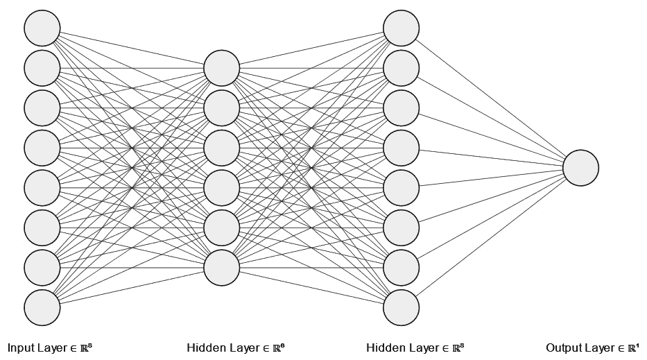
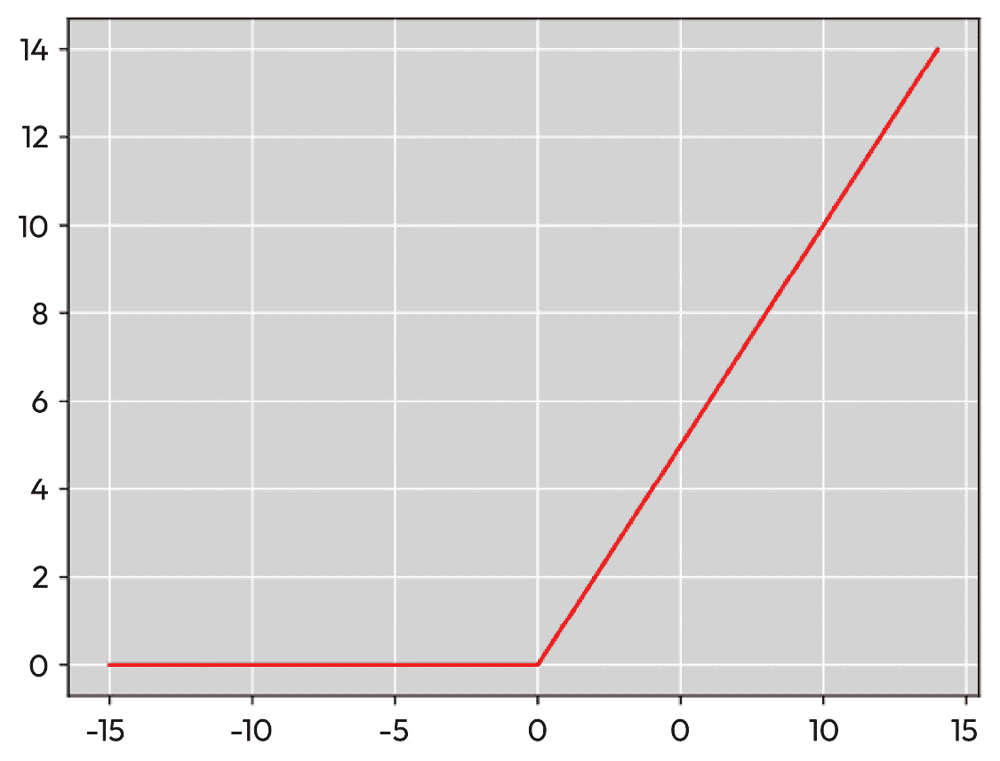
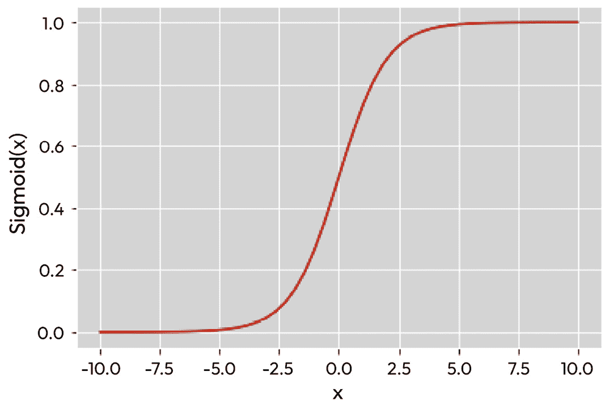
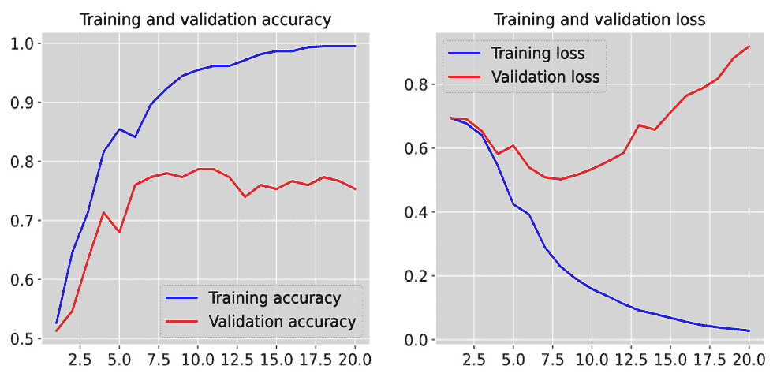
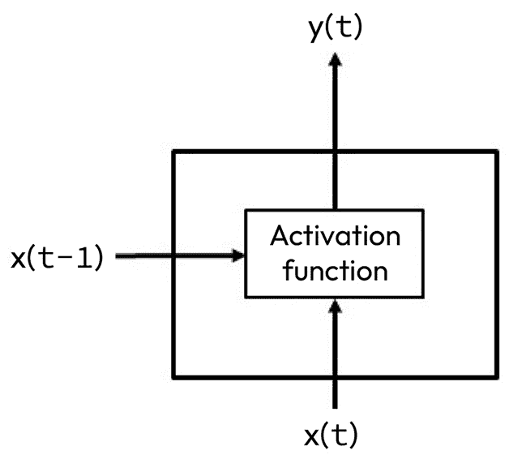

# 第十章：机器学习第二部分 – 神经网络与深度学习技术

**神经网络**（**NN**）直到 2010 年左右才在**自然语言理解**（**NLU**）领域变得流行，但此后广泛应用于许多问题。此外，神经网络还被广泛应用于非**自然语言处理**（**NLP**）问题，如图像分类。神经网络作为一种可以跨领域应用的通用方法，已经在这些领域之间产生了一些有趣的协同效应。

在本章中，我们将涵盖基于神经网络（NN）的**机器学习**（**ML**）技术应用，解决诸如自然语言处理（NLP）分类等问题。我们还将介绍几种常用的神经网络——特别是全连接**多层感知器**（**MLP**）、**卷积神经网络**（**CNN**）和**循环神经网络**（**RNN**）——并展示它们如何应用于分类和信息提取等问题。我们还将讨论一些基本的神经网络概念，如超参数、学习率、激活函数和训练轮数（epochs）。我们将通过使用 TensorFlow/Keras 库的分类示例来说明神经网络的概念。

本章将涵盖以下主题：

+   神经网络基础

+   示例——用于分类的 MLP

+   超参数与调优

+   超越 MLP——循环神经网络（RNN）

+   看另一种方法——卷积神经网络（CNN）

# 神经网络基础

神经网络的基本概念已经研究了许多年，但直到最近才在大规模自然语言处理（NLP）问题中得到应用。目前，神经网络是解决 NLP 任务的最流行工具之一。神经网络是一个庞大的领域，且研究非常活跃，因此我们无法为你提供关于 NLP 神经网络的全面理解。然而，我们将尽力为你提供一些基本知识，帮助你将神经网络应用到自己的问题中。

神经网络的灵感来自于动物神经系统的某些特性。具体而言，动物神经系统由一系列互联的细胞组成，这些细胞被称为*神经元*，它们通过网络传递信息，从而在给定输入时，网络产生一个输出，代表了对该输入的决策。

**人工神经网络**（**ANN**）旨在从某些方面模拟这一过程。如何反应输入的决定由一系列处理步骤决定，这些步骤从接收输入并在满足正确条件时产生输出（或**激活**）的单元（*神经元*）开始。当神经元激活时，它将其输出发送给其他神经元。接下来的神经元从多个其他神经元接收输入，并且当它们收到正确的输入时，它们也会激活。决定是否激活的部分过程涉及神经元的*权重*。神经网络学习完成任务的方式——也就是*训练*过程——是调整权重以在训练数据上产生最佳结果的过程。

训练过程由一组*周期*组成，或者说是训练数据的遍历，每次遍历都会调整权重，试图减少神经网络产生的结果与正确结果之间的差异。

神经网络中的神经元按层排列，最终层——输出层——产生决策。将这些概念应用于自然语言处理（NLP），我们从输入文本开始，该文本被传递到输入层，表示正在处理的输入。处理通过所有层进行，直到到达输出层，输出决策——例如，这篇电影评论是正面还是负面？

*图 10.1*表示一个包含输入层、两个隐藏层和输出层的神经网络示意图。*图 10.1*中的神经网络是**全连接神经网络**（**FCNN**），因为每个神经元都接收来自前一层的每个神经元的输入，并将输出传递给后一层的每个神经元：



图 10.1 – 一个包含两个隐藏层的全连接神经网络

神经网络领域使用了大量的专业词汇，有时会使得阅读相关文档变得困难。在下面的列表中，我们将简要介绍一些最重要的概念，并根据需要参考*图 10.1*：

+   **激活函数**：激活函数是确定神经元何时拥有足够输入以触发并将输出传递给下一层神经元的函数。一些常见的激活函数有 sigmoid 和**修正线性单元**（**ReLU**）。

+   **反向传播**：训练神经网络的过程，其中损失通过网络反馈，训练权重。

+   **批次**：批次是一组将一起训练的样本。

+   **连接**：神经元之间的链接，关联着一个权重，代表连接的强度。在*图 10.1*中的神经元之间的线是连接。

+   **收敛**：当额外的训练周期不再减少损失或提高准确度时，网络已收敛。

+   **Dropout**：通过随机删除神经元来防止过拟合的技术。

+   **提前停止**：在计划的训练周期数之前结束训练，因为训练似乎已经收敛。

+   **周期**：一次训练数据的遍历，调整权重以最小化损失。

+   **误差**：神经网络产生的预测结果与参考标签之间的差异。衡量网络对数据分类的预测效果。

+   **梯度爆炸**：梯度爆炸发生在训练过程中，当梯度变得极大，无法控制时。

+   **前向传播**：输入通过神经网络的传播过程，从输入层经过隐藏层到输出层。

+   **完全连接**：FCNN 是一种神经网络，"*每一层的每个神经元都与下一层的每个神经元相连接*" ([`en.wikipedia.org/wiki/Artificial_neural_network`](https://en.wikipedia.org/wiki/Artificial_neural_network))，如*图 10.1*所示。

+   **梯度下降**：通过调整权重的方向来优化，以最小化损失。

+   **隐藏层**：不是输入层或输出层的神经元层。

+   **超参数**：在训练过程中未学习的参数，通常需要通过手动调整来优化，以使网络产生最佳结果。

+   **输入层**：神经网络中的层，接收初始数据。这是*图 10.1*中左侧的层。

+   **层**：神经网络中的一组神经元，接收来自前一层的信息并将其传递到下一层。*图 10.1*包括了四个层。

+   **学习**：在训练过程中为连接分配权重，以最小化损失。

+   **学习率/自适应学习率**：每个训练周期后对权重的调整量。在某些方法中，学习率可以随着训练的进行而自适应调整；例如，如果学习过程开始变慢，降低学习率可能会有所帮助。

+   **损失**：提供度量，用于量化当前模型预测与目标值之间的距离的函数。训练过程的目标是最小化损失。

+   **MLP**：如*维基百科*所述，"*一种完全连接的前馈人工神经网络（ANN）类别。MLP 至少包含三层节点：输入层、隐藏层和输出层*" ([`en.wikipedia.org/wiki/Multilayer_perceptron`](https://en.wikipedia.org/wiki/Multilayer_perceptron))。*图 10.1*显示了一个 MLP 的示例。

+   **神经元（单元）**：神经网络中的单元，接收输入并通过应用激活函数计算输出。

+   **优化**：在训练过程中调整学习率。

+   **输出层**：神经网络中的最终层，基于输入做出决策。这是*图 10.1*中右侧的层。

+   **过拟合**：将网络调得过于紧密地适应训练数据，从而导致它不能很好地泛化到之前未见过的测试或验证数据。

+   **欠拟合**：欠拟合发生在神经网络无法为训练数据获得良好准确度时。可以通过增加训练周期或增加层数来解决。

+   **梯度消失**：梯度变得非常小，导致网络无法进行有效的进展。

+   **权重**：神经元之间连接的特性，表示连接的强度。权重是在训练过程中学习得到的。

在下一节中，我们将通过一个基本的 MLP 文本分类示例，来具体化这些概念。

# 示例 – 用于分类的 MLP

我们将通过查看多层感知器（MLP）来回顾基本的神经网络概念，它是概念上最直观的神经网络类型之一。我们将使用的例子是电影评论的分类，将评论分为正面和负面情感。由于只有两个可能的类别，这是一个 *二分类* 问题。我们将使用 *情感标注句子数据集*（*从群体到个体标签的深度特征*，*Kotzias 等人*，*KDD 2015* [`archive.ics.uci.edu/ml/datasets/Sentiment+Labelled+Sentences`](https://archive.ics.uci.edu/ml/datasets/Sentiment+Labelled+Sentences)），该数据集来自加利福尼亚大学欧文分校。首先下载数据并将其解压到与 Python 脚本相同的目录中。你会看到一个名为 `sentiment labeled sentences` 的目录，其中包含实际数据文件 `imdb_labeled.txt`。你也可以将数据安装到你选择的其他目录，但如果这样做，记得相应修改 `filepath_dict` 变量。

你可以使用以下 Python 代码查看数据：

```py
import pandas as pd
import os
filepath_dict = {'imdb':   'sentiment labelled sentences/imdb_labelled.txt'}
document_list = []
for source, filepath in filepath_dict.items():
    document = pd.read_csv(filepath, names=['sentence', 'label'], sep='\t')
    document['source'] = source
    document_list.append(document)
document = pd.concat(document_list)
print(document.iloc[0])
```

最后一个 `print` 语句的输出将包含语料库中的第一句，其标签（`1` 或 `0`——即正面或负面），以及其来源（`互联网电影数据库 IMDB`）。

在这个例子中，我们将使用 scikit-learn 的 `CountVectorizer` 来对语料库进行向量化，这个方法我们在 *第七章* 中已经提到过。

以下代码片段展示了向量化过程的开始，我们为向量化器设置了一些参数：

```py
from sklearn.feature_extraction.text import CountVectorizer
# min_df is the minimum proportion of documents that contain the word (excludes words that
# are rarer than this proportion)
# max_df is the maximum proportion of documents that contain the word (excludes words that
# are rarer than this proportion
# max_features is the maximum number of words that will be considered
# the documents will be lowercased
vectorizer = CountVectorizer(min_df = 0, max_df = 1.0, max_features = 1000, lowercase = True)
```

`CountVectorizer` 函数有一些有用的参数，能够控制用于构建模型的最大单词数，还可以排除那些被认为过于频繁或过于稀有、不太有用的词语。

下一步是进行训练集和测试集的拆分，如下代码块所示：

```py
# split the data into training and test
from sklearn.model_selection import train_test_split
document_imdb = document[document['source'] == 'imdb']
reviews = document_imdb['sentence'].values
y = document_imdb['label'].values
# since this is just an example, we will omit the dev test set
# 'reviews.data' is the movie reviews
# 'y_train' is the categories assigned to each review in the training data
# 'test_size = .20' is the proportion of the data that should be reserved for testing
# 'random_state = 42' is an integer that controls the randomization of the data so that the results are reproducible
reviews_train, reviews_test, y_train, y_test = train_test_split(
   reviews, y, test_size = 0.20, random_state = 42)
```

上述代码展示了训练数据和测试数据的拆分，保留了总数据的 20% 用于测试。

`reviews` 变量保存实际文档，而 `y` 变量保存它们的标签。请注意，`X` 和 `y` 在文献中常常用来分别表示机器学习问题中的数据和类别，尽管我们在这里使用 `reviews` 作为 `X` 数据：

```py
vectorizer.fit(reviews_train)
vectorizer.fit(reviews_test)
X_train = vectorizer.transform(reviews_train)
X_test  = vectorizer.transform(reviews_test)
```

上述代码展示了数据的向量化过程，即使用先前定义的向量化器将每个文档转换为数值表示。你可以通过回顾 *第七章* 来复习向量化。

结果是 `X_train`，即数据集的词频（BoW）。你可以回忆起在 *第七章* 中提到的词频模型（BoW）。

下一步是建立神经网络（NN）。我们将使用 Keras 包，它建立在 Google 的 TensorFlow 机器学习包之上。以下是我们需要执行的代码：

```py
from keras.models import Sequential
from keras import layers
from keras import models
# Number of features (words)
# This is based on the data and the parameters that were provided to the vectorizer
# min_df, max_df and max_features
input_dimension = X_train.shape[1]
print(input_dimension)
```

代码首先打印输入维度，在本例中是每个文档向量中的单词数。了解输入维度非常重要，因为它是从语料库中计算出来的，并且与我们在 `CountVectorizer` 函数中设置的参数相关。如果输入维度异常地大或小，我们可能需要调整参数，以便使词汇表变大或变小。

以下代码定义了模型：

```py
# a Sequential model is a stack of layers where each layer has one input and one output tensor
# Since this is a binary classification problem, there will be one output (0 or 1)
# depending on whether the review is positive or negative
# so the Sequential model is appropriate
model = Sequential()
model.add(layers.Dense(16, input_dim = input_dimension, activation = 'relu'))
model.add(layers.Dense(16, activation = 'relu'))
model.add(layers.Dense(16, activation = 'relu'))
# output layer
model.add(layers.Dense(1, activation = 'sigmoid'))
```

在前面的代码中构建的模型包括输入层、两个隐藏层和一个输出层。每次调用 `model.add()` 方法都会向模型中添加一个新层。所有层都是全连接的，因为在这个全连接的网络中，每个神经元都会接收来自前一层每个神经元的输入，如 *图 10.1* 所示。两个隐藏层各包含 16 个神经元。为什么指定 16 个神经元？隐藏层神经元的数量没有硬性规定，但一般的方法是从较小的数字开始，因为随着神经元数量的增加，训练时间也会增加。最终的输出层只包含一个神经元，因为我们只需要一个输出，判断评论是正面还是负面。

另一个非常重要的参数是 **激活函数**。激活函数决定了神经元如何响应其输入。在我们的示例中，除了输出层外，所有层的激活函数都是 ReLU 函数。ReLU 函数可以在 *图 10.2* 中看到。ReLU 是一种非常常用的激活函数：



图 10.2 – ReLU 函数在输入范围从 -15 到 15 之间的值

ReLU 函数最重要的优点之一是它非常高效。它也证明在实践中通常能提供良好的结果，并且通常是作为激活函数的合理选择。

此神经网络中使用的另一个激活函数是 sigmoid 函数，它用于输出层。我们在这里使用 sigmoid 函数，因为在这个问题中，我们需要预测正面或负面情感的概率，而 sigmoid 函数的值始终介于 `0` 和 `1` 之间。sigmoid 函数的公式如下所示：

S(x) = 1 / (1 + e^−x)

Sigmoid 函数的图像显示在 *图 10.3* 中，很容易看出，无论输入值如何，其输出值始终介于 `0` 和 `1` 之间：



图 10.3 – Sigmoid 函数在输入范围从 -10 到 10 之间的值

Sigmoid 和 ReLU 激活函数是常见且实用的激活函数，但它们只是众多可能的神经网络激活函数中的两个示例。如果你希望进一步研究这个话题，以下的 *维基百科* 文章是一个不错的起点：[`en.wikipedia.org/wiki/Activation_function`](https://en.wikipedia.org/wiki/Activation_function)。

一旦模型定义完成，我们就可以编译它，如下所示的代码片段：

```py
model.compile(loss = 'binary_crossentropy',
              optimizer = 'adam',
              metrics = ['accuracy'])
```

`model.compile()` 方法需要 `loss`、`optimizer` 和 `metrics` 参数，这些参数提供以下信息：

+   `loss` 参数在这里告诉编译器使用 `binary_crossentropy` 来计算损失。`categorical_crossentropy` 用于输出中有两个或更多标签类别的问题。例如，如果任务是给评论分配星级评分，我们可能会有五个输出类别，分别对应五个可能的星级评分，在这种情况下，我们会使用类别交叉熵。

+   `optimizer` 参数在训练过程中调整学习率。我们在这里不讨论 `adam` 的数学细节，但一般来说，我们使用的优化器 `adam` 通常是一个不错的选择。

+   最后，`metrics` 参数告诉编译器我们将如何评估模型的质量。我们可以在这个列表中包含多个指标，但现在我们仅包括 `accuracy`。在实际应用中，你使用的指标将取决于你的问题和数据集，但对于我们这个示例来说，`accuracy` 是一个不错的选择。在*第十三章*中，我们将探讨其他指标，以及在特定情况下你可能希望选择它们的原因。

显示模型的摘要也很有帮助，以确保模型按预期的方式构建。`model.summary()` 方法将生成模型的摘要，如下所示的代码片段：

```py
model.summary()
Model: "sequential"
_________________________________________________________________
 Layer (type)                Output Shape              Param #
=================================================================
 dense (Dense)               (None, 16)                13952
 dense_1 (Dense)             (None, 16)                272
 dense_2 (Dense)             (None, 16)                272
 dense_3 (Dense)             (None, 1)                 17
=================================================================
Total params: 14,513
Trainable params: 14,513
Non-trainable params: 0
```

在这个输出中，我们可以看到网络由四个全连接层（包括输入层、两个隐藏层和输出层）组成，且结构符合预期。

最后一步是使用以下代码来拟合或训练网络：

```py
history = model.fit(X_train, y_train,
                    epochs=20,
                    verbose=True,
                    validation_data=(X_test, y_test),
                    batch_size=10)
```

训练是一个迭代过程，将训练数据通过网络，测量损失，调整权重以减少损失，然后再次将训练数据通过网络。这个步骤可能非常耗时，具体取决于数据集的大小和模型的大小。

每次遍历训练数据的过程叫做一个周期。训练过程中的周期数是一个*超参数*，意味着它是由开发者根据训练结果调整的。例如，如果网络的表现似乎在经过一定数量的周期后没有改善，则可以减少周期数，因为额外的周期不会改善结果。不幸的是，并没有一个固定的周期数可以决定我们何时停止训练。我们必须观察准确率和损失随周期的变化，来决定系统是否已经充分训练。

设置`verbose = True`参数是可选的，但非常有用，因为它会在每个周期后生成结果追踪。如果训练过程很长，追踪信息可以帮助你验证训练是否在进展。批量大小是另一个超参数，它定义了在更新模型之前要处理多少数据样本。当执行以下 Python 代码时，设置`verbose`为`True`，每个周期结束时，损失、准确率、验证损失和验证准确率都会被计算出来。训练完成后，`history`变量将包含训练过程的进展信息，我们可以看到训练进展的图表。

显示准确率和损失在每个周期的变化非常重要，因为这可以帮助我们了解训练收敛需要多少个周期，并且能清楚地看到数据是否过拟合。以下代码展示了如何绘制准确率和损失随周期变化的图表：

```py
import matplotlib.pyplot as plt
plt.style.use('ggplot')
def plot_history(history):
    acc = history.history['accuracy']
    val_acc = history.history['val_accuracy']
    loss = history.history['loss']
    val_loss = history.history['val_loss']
    x = range(1, len(acc) + 1)
    plt.figure(figsize=(12, 5))
    plt.subplot(1, 2, 1)
    plt.plot(x, acc, 'b', label='Training accuracy')
    plt.plot(x, val_acc, 'r', label = 'Validation accuracy')
    plt.title('Training and validation accuracy')
    plt.legend()
    plt.subplot(1, 2, 2)
    plt.plot(x, loss, 'b', label='Training loss')
    plt.plot(x, val_loss, 'r', label='Validation loss')
    plt.title('Training and validation loss')
    plt.legend()
    plt.show()
plot_history(history)
```

我们可以通过训练 20 个周期（*图 10.4*）来看到我们示例的进展结果：



图 10.4 – 训练 20 个周期的准确率和损失

在训练的 20 个周期中，我们可以看到训练准确率接近**1.0**，训练损失接近*`0`*。然而，这个看似好的结果是具有误导性的，因为真正重要的结果是基于验证数据的。由于验证数据没有用来训练网络，验证数据上的表现实际上预测了网络在实际使用中的表现。我们从验证准确率和损失变化的图表中可以看到，在大约第 10 个周期后，继续训练并没有改善模型在验证数据上的表现。事实上，这反而增加了损失，使得模型变得更差。从*图 10.4*右侧的图表中验证损失的增加可以看出这一点。

提高任务性能将涉及修改其他因素，如超参数和其他调优过程，我们将在下一节中讨论这些内容。

# 超参数和调优

*图 10.4*清楚地显示，增加训练周期数并不会提升任务的性能。在 10 个周期后，最佳的验证准确率似乎是大约 80%。然而，80%的准确率并不算很好。我们该如何改进呢？以下是一些想法。虽然没有任何一个方法能保证有效，但值得尝试：

+   如果有更多的训练数据可用，可以增加训练数据的数量。

+   可以研究一些预处理技术，以去除训练数据中的噪音——例如，去除停用词、移除数字和 HTML 标签等非词项、词干提取、词形还原以及小写化等。这些技术的细节在*第五章*中有介绍。

+   学习率的变化——例如，降低学习率可能改善网络避免局部最小值的能力。

+   减少批量大小。

+   可以尝试改变层数和每层神经元的数量，但层数过多可能会导致过拟合。

+   通过指定一个超参数来添加 dropout，这个超参数定义了层输出被忽略的概率。这有助于提高网络对过拟合的鲁棒性。

+   向量化的改进——例如，使用**词频-逆文档频率**（**TF-IDF**）而不是计数型的 BoW。

提高性能的最终策略是尝试一些新型的神经网络方法——特别是 RNN、CNN 和 transformer。

我们将在本章的最后简要回顾 RNN 和 CNN。我们将在*第十一章*讨论 transformer。

# 超越多层感知机（MLP）——递归神经网络（RNN）

RNN 是一种能够考虑输入中项次序的神经网络。在之前讨论的 MLP 示例中，表示整个输入（即完整文档）的向量一次性输入神经网络，因此网络无法考虑文档中单词的顺序。然而，在文本数据中，这显然是过于简化的，因为单词的顺序可能对含义非常重要。RNN 通过将早期的输出作为后续层的输入，能够考虑单词的顺序。在某些自然语言处理（NLP）问题中，单词顺序非常重要，例如**命名实体识别**（**NER**）、**词性标注**（POS）或**槽标签**（slot labeling），RNN 尤为有用。

RNN 单元的示意图如*图 10.5*所示：



图 10.5 – 一个 RNN 单元

单元显示在时间 `t`。时间 `t` 的输入，*x(t)*，与 MLP 中的情况一样传递给激活函数，但激活函数还会接收到来自时间 *t-1* 的输出——即 *x(t-1)*。对于 NLP 来说，早期的输入很可能是前一个词。因此，在这种情况下，输入是当前词和一个前一个词。使用 Keras 中的 RNN 与我们之前看到的 MLP 示例非常相似，只是在层堆栈中添加了一个新的 RNN 层。

然而，随着输入长度的增加，网络往往会*忘记*早期输入的信息，因为较早的信息对当前状态的影响会越来越小。为克服这一限制，已经设计了各种策略，如**门控循环单元**（**GRU**）和**长短期记忆**（**LSTM**）。如果输入是完整的文本文档（而非语音），我们不仅可以访问到之前的输入，还能访问未来的输入，这时可以使用双向 RNN。

我们不会在这里详细讲解这些 RNN 的额外变种，但它们确实在某些任务中提高了性能，值得进行研究。尽管关于这个热门话题有大量的资源，以下的*Wikipedia*文章是一个很好的起点：[`en.wikipedia.org/wiki/Recurrent_neural_network`](https://en.wikipedia.org/wiki/Recurrent_neural_network)。

# 看看另一种方法——CNN

CNN 在图像识别任务中非常流行，但在 NLP 任务中使用的频率低于 RNN，因为它们没有考虑输入项的时间顺序。然而，它们在文档分类任务中可以很有用。如你从前面的章节中回忆到的，分类中常用的表示方法仅依赖于文档中出现的词汇——例如 BoW 和 TF-IDF——因此，通常可以在不考虑词序的情况下完成有效的分类。

要用 CNN 对文档进行分类，我们可以将文本表示为一个向量数组，其中每个词都映射到由完整词汇表构成的空间中的一个向量。我们可以使用我们在*第七章*中讨论过的 word2vec 来表示词向量。使用 Keras 训练 CNN 进行文本分类与我们在 MLP 分类中使用的训练过程非常相似。我们像之前一样创建一个顺序模型，但我们添加了新的卷积层和池化层。

我们不会在这里详细讲解 CNN 用于分类的细节，但它们是 NLP 分类的另一种选择。和 RNN 一样，关于这个话题有许多可用的资源，一个很好的起点是*Wikipedia*（[`en.wikipedia.org/wiki/Convolutional_neural_network`](https://en.wikipedia.org/wiki/Convolutional_neural_network)）。

# 概述

在本章中，我们探讨了神经网络（NNs）在 NLP 中文档分类中的应用。我们介绍了神经网络的基本概念，回顾了一个简单的多层感知机（MLP），并将其应用于二分类问题。我们还提供了一些通过修改超参数和调整来提高性能的建议。最后，我们讨论了更高级的神经网络类型——循环神经网络（RNNs）和卷积神经网络（CNNs）。

在*第十一章*中，我们将介绍目前在自然语言处理（NLP）中表现最好的技术——变压器（transformers）和预训练模型（pretrained models）。
