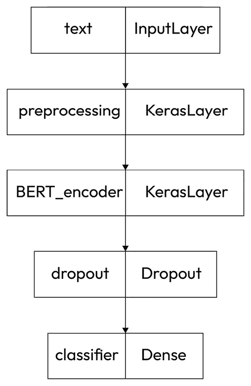
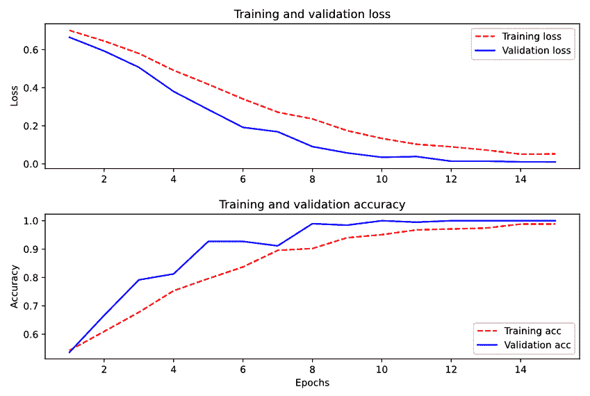
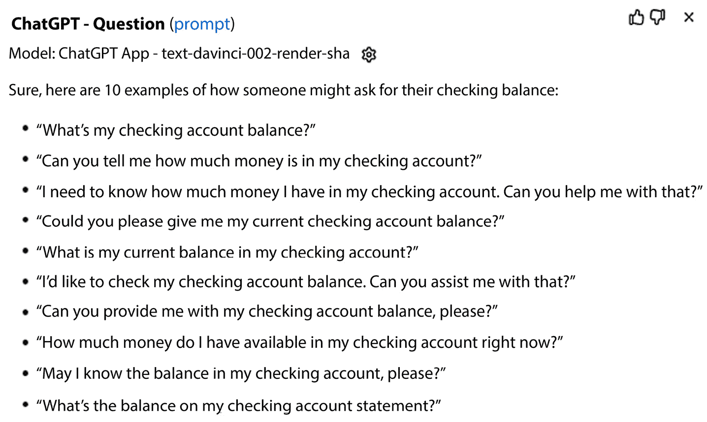

# 第十一章：机器学习第三部分——变换器与大语言模型

在本章中，我们将介绍当前表现最好的技术——**自然语言处理**（**NLP**）——**变换器**和**预训练模型**。我们将讨论变换器的概念，并提供使用变换器和**大语言模型**（**LLMs**）进行文本分类的示例。本章的代码将基于 TensorFlow/Keras Python 库以及 OpenAI 提供的云服务。

本章所讨论的主题非常重要，因为尽管变换器和大语言模型（LLMs）只有几年历史，但它们已经成为许多不同类型 NLP 应用的最前沿技术。事实上，像 ChatGPT 这样的 LLM 系统已被广泛报道，您无疑已经看到过它们的相关信息。您甚至可能已经使用过它们的在线接口。在本章中，您将学习如何使用这些系统背后的技术，这应该是每个 NLP 开发者工具箱的一部分。

在本章中，我们将涵盖以下主题：

+   变换器和大语言模型概述

+   **双向编码器表示从变换器**（**BERT**）及其变体

+   使用 BERT——一个分类示例

+   基于云的大语言模型（LLMs）

我们将首先列出本章示例运行所需的技术资源。

# 技术要求

本章将介绍的代码使用了多个开源软件库和资源。我们在前几章中已经使用了其中的许多，但为了方便起见，我们在这里列出它们：

+   TensorFlow 机器学习库：`hub`、`text` 和 `tf-models`

+   Python 数值计算包，NumPy

+   Matplotlib 绘图和图形包

+   IMDb 电影评论数据集

+   scikit-learn 的`sklearn.model_selection`用于进行训练、验证和测试数据集划分

+   来自 TensorFlow Hub 的 BERT 模型：我们使用的是这个——`'small_bert/bert_en_uncased_L-4_H-512_A-8'`——但您可以使用任何其他 BERT 模型，只需注意较大的模型可能需要更长的训练时间

请注意，我们在这里使用的模型相对较小，因此不需要特别强大的计算机。 本章中的示例是在一台配备 Intel 3.4 GHz CPU 和 16 GB 内存、没有独立 GPU 的 Windows 10 机器上测试的。当然，更多的计算资源将加速您的训练过程，并使您能够使用更大的模型。

下一节简要介绍了我们将使用的变换器和大语言模型（LLM）技术。

# 变换器和大语言模型概述

目前，变换器和大型语言模型（LLM）是**自然语言理解（NLU）**领域表现最好的技术。这并不意味着早期章节中介绍的方法已经过时。根据特定 NLP 项目的需求，某些简单的方法可能更实用或更具成本效益。在本章中，你将获得有关这些新方法的信息，帮助你做出决策。

关于这些技术的理论方面的信息在互联网上有大量的资料，但在这里我们将专注于应用，探讨这些技术如何应用于解决实际的自然语言理解（NLU）问题。

正如我们在*第十章*中看到的，**递归神经网络（RNN）**在自然语言处理（NLP）中是一种非常有效的方法，因为它们不假设输入元素，特别是词语，是独立的，因此能够考虑输入元素的顺序，例如句子中词语的顺序。正如我们所看到的，RNN 通过使用前面的输出作为后续层的输入，保持早期输入的记忆。然而，对于 RNN，随着处理通过序列进行，早期输入对当前输入的影响迅速减弱。

在处理较长文档时，由于自然语言的上下文依赖特性，即使是文本中很远的部分，也可能对当前输入产生强烈的影响。实际上，在某些情况下，远距离的输入可能比较近期的输入更为重要。但是，当数据是一个长序列时，使用递归神经网络（RNN）进行处理意味着较早的信息在处理过程中对后续处理的影响会迅速减弱。为了解决这个问题，最初的一些尝试包括**长短期记忆（LSTM）**，它允许处理器保持状态并包括遗忘门，以及**门控循环单元（GRU）**，这是一种新的且相对较快的 LSTM 类型，但我们在本书中不会讨论它们。相反，我们将重点讨论更近期的方法，如注意力机制和变换器。

## 介绍注意力机制

**注意力机制**是一种技术，它使得网络可以学习在哪里关注输入。

最初，注意力机制主要应用于机器翻译。该处理基于编码器-解码器架构，首先将句子编码为向量，然后解码为翻译。在原始的编码器-解码器模型中，每个输入句子被编码为固定长度的向量。结果发现，将句子中的所有信息编码成固定长度的向量是困难的，尤其是长句子。这是因为，固定长度向量无法影响远距离的词语，这些词语超出了固定长度向量的范围。

将句子编码为一组向量，每个词一个，消除了这一限制。

正如早期关于注意力的论文所述，“*这种方法与基本的编码器-解码器模型的最重要区别在于，它不试图将整个输入句子编码成一个固定长度的向量。相反，它将输入句子编码成一系列向量，并在解码翻译时自适应地选择这些向量的一个子集。这使得神经翻译模型不必将源句子的所有信息，无论其长度如何，都压缩成一个固定长度的向量。*”（Bahdanau, D., Cho, K., & Bengio, Y. (2014). *神经机器翻译通过联合学习对齐和翻译*。arXiv 预印本 arXiv:1409.0473.）

对于机器翻译应用，既需要对输入文本进行编码，也需要将结果解码为新语言，以生成翻译文本。在本章中，我们将通过使用一个仅使用注意力架构中的编码部分的分类示例来简化此任务。

最近的一个技术发展是证明了注意力架构的一个组成部分，即 RNNs，并不是获得良好结果的必要条件。这个新的发展被称为**变压器**，我们将在下一节简要提到，并通过深入的示例来说明。

## 在变压器中应用注意力

变压器是注意力方法的一个发展，它摒弃了原始注意力系统中的 RNN 部分。变压器在 2017 年的论文《*Attention is all you need*》（Ashish Vaswani 等，2017 年）中被提出。（*Attention is all you need*。第 31 届国际神经信息处理系统会议（NIPS’17）论文集，Curran Associates Inc.，纽约红钩，美国，6000-6010）。该论文展示了仅使用注意力就能获得良好的结果。现在几乎所有关于 NLP 学习模型的研究都基于变压器。

最近在自然语言处理（NLP）性能急剧提升的第二个重要技术组成部分是基于大量现有数据进行预训练模型，并将其提供给 NLP 开发者的思想。下一节将讨论这种方法的优势。

## 利用现有数据——大型语言模型（LLMs）或预训练模型

到目前为止，在本书中，我们已经从训练数据中创建了我们自己的文本表示（向量）。在我们到目前为止的示例中，模型所拥有的关于语言的所有信息都包含在训练数据中，而这些训练数据只是完整语言的一个非常小的样本。但如果模型一开始就具备了语言的通用知识，它们就可以利用大量的训练数据，这些数据对单个项目来说是不可行的。这被称为**模型预训练**。这些预训练模型可以被多个项目重用，因为它们捕获了关于语言的通用信息。一旦预训练模型可用，就可以通过提供额外的数据对其进行微调，以适应特定的应用。

下一节将介绍一个最著名且最重要的预训练变换器模型——BERT。

# BERT 及其变体

作为基于变换器（transformers）的 LLM 技术示例，我们将演示广泛使用的最先进系统 BERT 的使用。BERT 是由谷歌开发的一个开源自然语言处理（NLP）方法，是当今最先进 NLP 系统的基础。BERT 的源代码可以在[`github.com/google-research/bert`](https://github.com/google-research/bert)找到。

BERT 的关键技术创新是其训练是双向的，即考虑输入中的前后词语。第二个创新是 BERT 的预训练使用了掩蔽语言模型，系统会在训练数据中掩盖一个词并尝试预测它。

BERT 仅使用编码器-解码器架构中的编码器部分，因为与机器翻译系统不同，它只关注理解，而不生成语言。

BERT 的另一个优势是，与本书中之前讨论的系统不同，它的训练过程是无监督的。也就是说，它训练所用的文本不需要人工标注或赋予任何意义。由于是无监督的，训练过程可以利用网络上大量的文本数据，而无需经过人工审核和判断其含义的昂贵过程。

初始的 BERT 系统于 2018 年发布。从那时起，BERT 背后的理念被探索并扩展为许多不同的变体。这些不同的变体有各种特性，使它们适用于解决不同的需求。这些特性包括更快的训练时间、更小的模型或更高的准确性。*表 11.1*展示了几个常见 BERT 变体及其特定特性。我们的示例将使用原始 BERT 系统，因为它是所有其他 BERT 版本的基础：

| **缩写** | **名称** | **日期** | **特性** |
| --- | --- | --- | --- |
| BERT | 基于变换器的双向编码表示 | 2018 | 原始的 BERT 系统。 |
| BERT-Base |  |  | 原始 BERT 作者发布的多个模型。 |
| RoBERTa | 强化优化的 BERT 预训练方法 | 2019 | 在该方法中，句子的不同部分在不同的 epoch 中被掩码，这使得它对训练数据中的变化更具鲁棒性。 |
| ALBERT | 轻量化 BERT | 2019 | 一种 BERT 版本，通过在层间共享参数来减少模型的大小。 |
| DistilBERT |  | 2020 | 比 BERT 更小更快，且性能良好 |
| TinyBERT |  | 2019 | 比 BERT-Base 更小更快，且性能良好；适用于资源受限的设备。 |

表 11.1 – BERT 变体

下一节将通过一个 BERT 应用的动手示例进行讲解。

# 使用 BERT – 一个分类示例

在这个例子中，我们将使用 BERT 进行分类，使用我们在前几章中看到的电影评论数据集。我们将从一个预训练的 BERT 模型开始，并对其进行*微调*以分类电影评论。如果你想将 BERT 应用于自己的数据，可以按照这个过程进行。

使用 BERT 进行特定应用从 TensorFlow Hub 上提供的预训练模型之一开始（[`tfhub.dev/tensorflow`](https://tfhub.dev/tensorflow)），然后通过特定应用的训练数据进行微调。建议从小型 BERT 模型开始，这些模型与 BERT 具有相同的架构，但训练速度更快。通常，小型模型的准确性较低，但如果它们的准确性足以满足应用需求，就不必花费额外的时间和计算资源去使用更大的模型。TensorFlow Hub 上有许多不同大小的模型可以下载。

BERT 模型可以是有大小写处理的（cased）或无大小写处理的（uncased），具体取决于它是否考虑文本的大小写。无大小写处理的模型通常会提供更好的结果，除非应用场景是大小写信息有意义的情况，如**命名实体识别**（**NER**），在这种情况下，专有名词很重要。

在这个例子中，我们将使用`small_bert/bert_en_uncased_L-4_H-512_A-8/1`模型。它具有以下属性，这些属性已编码在它的名称中：

+   小型 BERT。

+   无大小写处理。

+   4 个隐藏层（L-4）。

+   隐藏层大小为 512。

+   8 个注意力头（A-8）。

这个模型是在维基百科和 BooksCorpus 上训练的。这是一个非常庞大的文本数据集，但也有许多经过更大规模文本训练的预训练模型，我们将在本章后面讨论这些模型。事实上，NLP 领域的一个重要趋势是开发并发布基于越来越大量文本训练的模型。

这里将回顾的例子改编自 TensorFlow 的 BERT 文本分类教程。完整的教程可以在这里找到：

[`colab.research.google.com/github/tensorflow/text/blob/master/docs/tutorials/classify_text_with_bert.ipynb#scrollTo=EqL7ihkN_862`](https://colab.research.google.com/github/tensorflow/text/blob/master/docs/tutorials/classify_text_with_bert.ipynb#scrollTo=EqL7ihkN_862)

)

我们将开始安装并加载一些基本库。我们将使用 Jupyter Notebook（你可能还记得，Jupyter Notebook 的设置过程在*第四章*中详细介绍过，必要时可以参考*第四章*获取更多细节）：

```py
!pip install -q -U "tensorflow-text==2.8.*"
!pip install -q tf-models-official==2.7.0
!pip install numpy==1.21
import os
import shutil
import tensorflow as tf
import tensorflow_hub as hub
import tensorflow_text as text
from official.nlp import optimization  # to create AdamW optimizer
import matplotlib.pyplot as plt #for plotting results
tf.get_logger().setLevel('ERROR')
```

我们的 BERT 微调模型将通过以下步骤进行开发：

1.  安装数据。

1.  将数据拆分为训练集、验证集和测试集。

1.  从 TensorFlow Hub 加载 BERT 模型。

1.  通过将 BERT 与分类器结合来构建模型。

1.  微调 BERT 以创建模型。

1.  定义损失函数和评估指标。

1.  定义优化器和训练周期数。

1.  编译模型。

1.  训练模型。

1.  绘制训练步骤结果在训练周期中的图表。

1.  用测试数据评估模型。

1.  保存模型并用其分类文本。

接下来的章节将详细介绍每个步骤。

## 安装数据

第一步是安装数据。我们将使用在*Chapter 10*中安装的 NLTK 电影评论数据集。我们将使用`tf.keras.utils.text_dataset_from_directory`实用程序从电影评论目录创建一个 TensorFlow 数据集：

```py
batch_size = 32
import matplotlib.pyplot as plt
tf.get_logger().setLevel('ERROR')
AUTOTUNE = tf.data.AUTOTUNE
raw_ds = tf.keras.utils.text_dataset_from_directory(
    './movie_reviews',
class_names = raw_ds.class_names
print(class_names)
```

数据集中有 2,000 个文件，分为两类，`neg`和`pos`。我们在最后一步打印类名，以检查类名是否符合预期。这些步骤可用于任何以不同目录包含不同类示例的目录结构的数据集，其中类名作为目录名。

## 将数据分割为训练、验证和测试集

下一步是将数据集分割为训练、验证和测试集。正如您在前面章节中记得的那样，训练集用于开发模型。验证集与训练集分开，用于查看系统在训练过程中尚未训练的数据上的性能。在我们的示例中，我们将使用常见的 80%训练、10%验证和 10%测试的划分。验证集可以在每个训练周期结束时使用，以查看训练进展情况。测试集仅在最后进行一次使用，作为最终评估：

```py
from sklearn.model_selection import train_test_split
def partition_dataset_tf(dataset, ds_size, train_split=0.8, val_split=0.1, test_split=0.1, shuffle=True, shuffle_size=1000):
    assert (train_split + test_split + val_split) == 1
    if shuffle:
        # Specify seed maintain the same split distribution between runs for reproducibilty
        dataset = dataset.shuffle(shuffle_size, seed=42)
    train_size = int(train_split * ds_size)
    val_size = int(val_split * ds_size)
    train_ds = dataset.take(train_size)
    val_ds = dataset.skip(train_size).take(val_size)
    test_ds = dataset.skip(train_size).skip(val_size)
    return train_ds, val_ds, test_ds
train_ds,val_ds,test_ds = partition_dataset_tf(
    raw_ds,len(raw_ds))
```

## 加载 BERT 模型

下一步是加载我们将在此示例中进行微调的 BERT 模型，如下代码块所示。如前所述，有许多 BERT 模型可供选择，但这个模型是一个很好的起点。

我们还需要提供一个预处理器，将文本输入转换为 BERT 输入之前的数字标记 ID。我们可以使用 TensorFlow 为该模型提供的匹配预处理器：

```py
bert_model_name = 'small_bert/bert_en_uncased_L-4_H-512_A-8'
map_name_to_handle = {
    'small_bert/bert_en_uncased_L-4_H-512_A-8':
        'https://tfhub.dev/tensorflow/small_bert/bert_en_uncased_L-4_H-512_A-8/1',
}
map_model_to_preprocess = {
    'small_bert/bert_en_uncased_L-4_H-512_A-8':
        'https://tfhub.dev/tensorflow/bert_en_uncased_preprocess/3',
}
tfhub_handle_encoder = map_name_to_handle[bert_model_name]
tfhub_handle_preprocess = map_model_to_preprocess[
    bert_model_name]
bert_preprocess_model = hub.KerasLayer(
    tfhub_handle_preprocess)
```

此处的代码指定我们将使用的模型，并定义了一些方便的变量，以简化对模型、编码器和预处理器的引用。

## 定义微调模型

以下代码定义了我们将使用的模型。如果需要，可以增加`Dropout`层参数的大小，以使模型对训练数据的变化更加稳健：

```py
def build_classifier_model():
    text_input = tf.keras.layers.Input(shape=(),
        dtype=tf.string, name='text')
    preprocessing_layer = hub.KerasLayer(
        tfhub_handle_preprocess, name='preprocessing')
    encoder_inputs = preprocessing_layer(text_input)
    encoder = hub.KerasLayer(tfhub_handle_encoder,
        trainable = True, name='BERT_encoder')
    outputs = encoder(encoder_inputs)
    net = outputs['pooled_output']
    net = tf.keras.layers.Dropout(0.1)(net)
    net = tf.keras.layers.Dense(1, activation=None,
        name='classifier')(net)
    return tf.keras.Model(text_input, net)
# plot the model's structure as a check
tf.keras.utils.plot_model(classifier_model)
```

在*Figure 11**.1*中，我们可以看到模型的层次结构可视化，包括文本输入层、预处理层、BERT 层、dropout 层和最终分类器层。可视化是由代码块中的最后一行生成的。这个结构对应于我们在前面代码中定义的结构：



图 11.1 – 可视化模型结构

像这样的合理性检查（例如可视化）非常有用，因为对于较大的数据集和模型，训练过程可能非常漫长。如果模型的结构不是预期的，那么花费大量时间训练错误的模型是非常浪费的。

## 定义损失函数和评估指标

我们将使用交叉熵函数作为损失函数。`losses.BinaryCrossEntropy`损失函数：

```py
loss = tf.keras.losses.BinaryCrossentropy(from_logits=True)
metrics = tf.metrics.BinaryAccuracy()
```

一个具有多个可能结果的分类应用，例如意图识别问题，其中我们必须决定将 10 个意图中的哪一个分配给输入，将使用类别交叉熵。同样，由于这是一个二分类问题，评估指标应为`binary accuracy`，而不是简单的`accuracy`，后者适用于多类分类问题。

## 定义优化器和训练轮数

优化器提高了学习过程的效率。我们在这里使用流行的`Adam`优化器，并以非常小的学习率（`3e-5`）开始，这对于 BERT 是推荐的。优化器将在训练过程中动态调整学习率：

```py
epochs = 15
steps_per_epoch = tf.data.experimental.cardinality(
    train_ds).numpy()
print(steps_per_epoch)
num_train_steps = steps_per_epoch * epochs
# a linear warmup phase over the first 10%
num_warmup_steps = int(0.1*num_train_steps)
init_lr = 3e-5
optimizer = optimization.create_optimizer(
        init_lr=init_lr, num_train_steps = num_train_steps,
        num_warmup_steps=num_warmup_steps,
        optimizer_type='adamw')
```

请注意，我们选择了 15 个训练轮次。在第一次训练时，我们会尽量平衡在足够的轮次上进行训练以获得准确的模型，同时避免浪费时间训练超过所需轮次的模型。一旦得到第一次训练的结果，我们可以调整训练轮次，以平衡这两个目标。

## 编译模型

使用在`def build_classifier_model()`中定义的分类器模型，我们可以使用损失函数、评估指标和优化器编译模型，并查看模型摘要。在开始漫长的训练过程之前，检查模型是否符合预期是一个好主意：

```py
classifier_model.compile(optimizer=optimizer,
                         loss=loss,
                         metrics=metrics)
classifier_model.summary()
```

模型摘要大概会如下所示（我们将只展示几行，因为它相当长）：

```py
Model: model
__________________________________________________________________________________________________
 Layer (type)                   Output Shape         Param #     Connected to
==================================================================================================
 text (InputLayer)              [(None,)]            0           []
 preprocessing (KerasLayer)     {'input_mask': (Non  0           ['text[0][0]']
                                e, 128),
                                 'input_type_ids':
                                (None, 128),
                                 'input_word_ids':
                                (None, 128)}
```

这里的输出只是总结了前两层——输入和预处理。

接下来的步骤是训练模型。

## 训练模型

在以下代码中，我们通过调用`classifier_model.fit(_)`开始训练过程。我们为此方法提供训练数据、验证数据、输出详细程度和训练轮次（我们之前设置的）的参数，如下所示：

```py
print(f'Training model with {tfhub_handle_encoder}')
history = classifier_model.fit(x=train_ds,
                               validation_data=val_ds,
                               verbose = 2,
                               epochs=epochs)
Training model with https://tfhub.dev/tensorflow/small_bert/bert_en_uncased_L-4_H-512_A-8/1
Epoch 1/15
50/50 - 189s - loss: 0.7015 - binary_accuracy: 0.5429 - val_loss: 0.6651 - val_binary_accuracy: 0.5365 - 189s/epoch - 4s/step
```

请注意，`classifier_model.fit()`方法返回一个`history`对象，其中包含完整训练过程中进展的信息。我们将使用`history`对象来绘制训练过程图。这些图将为我们提供关于训练期间发生情况的深入了解，我们将利用这些信息指导我们的下一步行动。在下一节中，我们将看到这些图。

Transformer 模型的训练时间可能会非常长。所需时间取决于数据集的大小、训练的轮次（epochs）以及模型的大小，但这个例子在现代 CPU 上训练应该不会超过一小时。如果运行这个例子的时间明显超过这个时间，你可以尝试使用更高的详细程度（2 是最大值）进行测试，这样你就可以获得更多关于训练过程中发生了什么的信息。

在这个代码块的最后，我们还看到了处理第一轮训练的结果。我们可以看到第一轮训练用了`189`秒。损失为`0.7`，准确率为`0.54`。经过一轮训练后的损失和准确率并不理想，但随着训练的进行，它们会显著改善。在下一节中，我们将看到如何通过图形化方式显示训练进度。

## 绘制训练过程

在训练完成后，我们需要查看系统的性能如何随训练轮次变化。我们可以通过以下代码来观察：

```py
import matplotlib.pyplot as plt
!matplotlib inline
history_dict = history.history
print(history_dict.keys())
acc = history_dict['binary_accuracy']
val_acc = history_dict['val_binary_accuracy']
loss = history_dict['loss']
val_loss = history_dict['val_loss']
epochs = range(1, len(acc) + 1)
```

上述代码定义了一些变量，并从模型的`history`对象中获取了相关的指标（用于训练和验证数据的`binary_accuracy`和`loss`）。现在我们已经准备好绘制训练过程的进展图了。像往常一样，我们将使用 Matplotlib 来创建我们的图表：

```py
fig = plt.figure(figsize=(10, 6))
fig.tight_layout()
plt.subplot(2, 1, 1)
# r is for "solid red line"
plt.plot(epochs, loss, 'r', label='Training loss')
# b is for "solid blue line"
plt.plot(epochs, val_loss, 'b', label='Validation loss')
plt.title('Training and validation loss')
# plt.xlabel('Epochs')
plt.ylabel('Loss')
plt.legend()
plt.subplot(2, 1, 2)
plt.plot(epochs, acc, 'r', label='Training acc')
plt.plot(epochs, val_acc, 'b', label='Validation acc')
plt.title('Training and validation accuracy')
plt.xlabel('Epochs')
plt.ylabel('Accuracy')
plt.legend(loc='lower right')
plt.show()
dict_keys(['loss', 'binary_accuracy', 'val_loss',
    'val_binary_accuracy'])
```

在*图 11.2*中，我们看到随着模型训练，损失逐渐减少，准确率逐步增加的图像。虚线代表训练损失和训练准确率，实线代表验证损失和验证准确率：



图 11.2 – 训练过程中的准确率和损失

通常情况下，验证准确率会低于训练准确率，验证损失会大于训练损失，但这并不一定是必然的，具体取决于验证和训练数据子集的划分方式。在这个例子中，验证损失始终低于训练损失，而验证准确率始终高于训练准确率。我们可以从这个图中看到，系统在前十四轮训练后没有变化。实际上，它的表现几乎完美。

因此，很明显在这个点之后没有必要继续训练系统。相比之下，看看在第`4`轮附近的图像。我们可以看到，如果在四轮后停止训练并不是一个好主意，因为损失仍在减少，准确率仍在增加。在*图 11.2*中，我们可以注意到在第`7`轮附近，准确率似乎有所下降。如果我们在第`7`轮就停止训练，我们就无法知道在第`8`轮准确率会再次开始上升。因此，最好继续训练，直到我们看到指标趋于平稳或开始持续变差。

现在我们已经有了一个训练好的模型，我们想看看它在之前未见过的数据上的表现。这些未见过的数据是我们在训练、验证和测试拆分过程中预留出的测试数据。

## 在测试数据上评估模型

在训练完成后，我们可以看到模型在测试数据上的表现。这可以从以下输出中看到，在这里我们可以看到系统表现得非常好。准确度接近 100%，而损失值接近零：

```py
loss, accuracy = classifier_model.evaluate(test_ds)
print(f'Loss: {loss}')
print(f'Binary Accuracy: {accuracy}')
1/7 [===>..........................] - ETA: 9s - loss: 0.0239 - binary_accuracy: 0.9688
2/7 [=======>......................] - ETA: 5s - loss: 0.0189 - binary_accuracy: 0.9844
3/7 [===========>..................] - ETA: 4s - loss: 0.0163 - binary_accuracy: 0.9896
4/7 [================>.............] - ETA: 3s - loss: 0.0140 - binary_accuracy: 0.9922
5/7 [====================>.........] - ETA: 2s - loss: 0.0135 - binary_accuracy: 0.9937
6/7 [========================>.....] - ETA: 1s - loss: 0.0134 - binary_accuracy: 0.9948
7/7 [==============================] - ETA: 0s - loss: 0.0127 - binary_accuracy: 0.9955
7/7 [==============================] - 8s 1s/step - loss: 0.0127 - binary_accuracy: 0.9955
Loss: 0.012707981280982494
Accuracy: 0.9955357313156128
```

这与我们在*图 11.2*中看到的训练过程中系统的表现是一致的。

看起来我们有一个非常准确的模型。如果我们以后想要使用它，可以将其保存下来。

## 保存模型用于推理

最后的步骤是保存微调后的模型，以便以后使用——例如，如果该模型要在生产系统中使用，或者我们想在进一步的实验中使用它。保存模型的代码如下：

```py
dataset_name = 'movie_reviews'
saved_model_path = './{}_bert'.format(dataset_name.replace('/', '_'))
classifier_model.save(saved_model_path, include_optimizer=False)
reloaded_model = tf.saved_model.load(saved_model_path)
]
```

在这里的代码中，我们展示了如何保存模型并从保存的位置重新加载它。

正如我们在本节中看到的，BERT 可以通过在相对较小的（2,000 个条目）数据集上进行微调，从而训练出非常好的表现。这使得它成为许多实际问题的一个不错选择。回顾在*第十章*中使用多层感知器进行分类的示例，我们看到即使经过 20 轮训练，验证数据的准确度（如*图 10.4*所示）也从未超过大约 80%。显然，BERT 的表现要好得多。

虽然 BERT 是一个非常优秀的系统，但它最近已被非常大的基于云的预训练 LLM 所超越。我们将在下一节中描述这些模型。

# 基于云的 LLM

最近，出现了一些基于云的预训练大型语言模型，它们因为在大量数据上进行训练而展现出了非常令人印象深刻的表现。与 BERT 相比，它们太大，无法下载并在本地使用。此外，一些模型是封闭和专有的，因而无法下载。这些更新的模型基于与 BERT 相同的原理，并且表现出了非常令人印象深刻的性能。这种令人印象深刻的表现是因为这些模型在比 BERT 更大规模的数据上进行了训练。由于它们无法下载，重要的是要记住，这些模型并不适用于所有应用。特别是，如果数据涉及任何隐私或安全问题，将数据发送到云端进行处理可能并不是一个好主意。部分系统如 GPT-2、GPT-3、GPT-4、ChatGPT 和 OPT-175B，且新的 LLM 模型也在频繁发布。

这些系统所代表的 NLP 领域的戏剧性进展得益于三个相关的技术突破。其一是注意力机制等技术的发展，这些技术比以往的 RNN 等方法更能捕捉文本中单词之间的关系，且比我们在*第八章*中讨论的基于规则的方法有更好的扩展性。第二个因素是大量训练数据的可用性，主要是来自万维网的文本数据。第三个因素是可用计算资源的巨大增加，这些资源可以用来处理这些数据并训练 LLM。

到目前为止，我们讨论的所有系统中，创建特定应用模型所需的语言知识都来自训练数据。这个过程开始时对语言一无所知。另一方面，LLM（大规模语言模型）带有通过处理大量更为通用的文本进行*预训练*的模型，因此它们对语言有了基本的知识基础。可以使用额外的训练数据对模型进行*微调*，以便它能处理特定应用的输入。微调模型以适应特定应用的一个重要方面是尽量减少微调所需的新数据量。这是自然语言处理（NLP）研究中的前沿领域，你可能会看到一些训练方法的相关参考，例如**少样本学习**，即通过仅几个例子学习识别一个新类别，甚至**零样本学习**，它使得系统能够在没有见过任何该类别示例的情况下识别该类别。

在下一节中，我们将看看当前最流行的 LLM 之一——ChatGPT。

## ChatGPT

ChatGPT ([`openai.com/blog/chatgpt/`](https://openai.com/blog/chatgpt/)) 是一个能够与用户就通用信息进行非常有效互动的系统。虽然在写作时，定制 ChatGPT 以适应特定应用尚且困难，但它对于除定制自然语言应用之外的其他目的仍然有用。例如，它可以非常容易地用来生成常规应用的训练数据。如果我们想使用本书中前面讨论的一些技术开发一个银行应用程序，我们需要训练数据，以便系统能提供用户可能如何提问的示例。通常，这涉及收集实际的用户输入，而这一过程可能非常耗时。相反，可以使用 ChatGPT 来生成训练数据，只需向它请求示例即可。例如，对于提示*给我 10 个用户可能询问支票余额的示例*，ChatGPT 给出的回答是*图 11.3*中的句子：



图 11.3 – 用于银行应用程序的 GPT-3 生成的训练数据

这些查询看起来大多数是关于支票账户的合理问题，但有些听起来并不太自然。出于这个原因，以这种方式生成的数据总是需要进行审查。例如，开发者可能决定不将倒数第二个例子包含在训练集中，因为它听起来生硬，但总体而言，这种技术有潜力为开发者节省大量时间。

## 应用 GPT-3

另一个知名的 LLM，GPT-3，也可以通过应用特定的数据进行微调，这样应该能带来更好的性能。为了实现这一点，你需要一个 OpenAI 的 API 密钥，因为使用 GPT-3 是收费服务。无论是为了准备模型进行微调，还是在推理时使用微调后的模型处理新数据，都将产生费用。因此，在使用大量数据集进行训练并承担相关费用之前，验证训练过程是否按预期执行非常重要。

OpenAI 推荐以下步骤来微调 GPT-3 模型。

1.  在[`openai.com/`](https://openai.com/)注册账户并获取 API 密钥。API 密钥将用于追踪你的使用情况并相应地向你的账户收费。

1.  使用以下命令安装 OpenAI **命令行界面**（**CLI**）：

    ```py
    ! pip install --upgrade openai
    ```

这个命令可以在类 Unix 系统的终端提示符中使用（一些开发者报告称在 Windows 或 macOS 上有问题）。另外，你也可以安装 GPT-3，在 Jupyter notebook 中使用以下代码：

```py
!pip install --upgrade openai
```

以下所有示例都假设代码在 Jupyter notebook 中运行：

1.  设置你的 API 密钥：

    ```py
    api_key =<your API key>
    ```

    ```py
    openai.api_key = api_key
    ```

1.  下一步是指定你将用来微调 GPT-3 的训练数据。这与训练任何 NLP 系统的过程非常相似；然而，GPT-3 有一个特定的格式，必须按照这个格式提供训练数据。这个格式使用一种叫做 JSONL 的语法，其中每一行都是一个独立的 JSON 表达式。例如，如果我们想要微调 GPT-3 来分类电影评论，几条数据项可能如下所示（为了清晰起见省略了一些文本）：

    ```py
    {"prompt":"this film is extraordinarily horrendous and i'm not going to waste any more words on it . ","completion":" negative"}
    ```

    ```py
    {"prompt":"9 : its pathetic attempt at \" improving \" on a shakespeare classic . 8 : its just another piece of teen fluff . 7 : kids in high school are not that witty . … ","completion":" negative"}
    ```

    ```py
    {"prompt":"claire danes , giovanni ribisi , and omar epps make a likable trio of protagonists , …","completion":" negative"}
    ```

每个项目由一个包含两个键的 JSON 字典组成，`prompt`和`completion`。`prompt`是待分类的文本，`completion`是正确的分类。所有这三个项目都是负面评论，因此所有的 completion 都标记为`negative`。

如果你的数据已经是其他格式，可能不太方便将其转换为这种格式，但 OpenAI 提供了一个有用的工具，可以将其他格式转换为 JSONL。它接受多种输入格式，如 CSV、TSV、XLSX 和 JSON，唯一的要求是输入必须包含两个列，分别为`prompt`和`completion`。*表 11.2*展示了一些来自 Excel 电子表格的单元格，其中包含一些电影评论作为示例：

| **prompt** | **completion** |
| --- | --- |
| Kolya 是我近期看到的最丰富的电影之一。Zdenek Sverak 饰演一位确认的老光棍（可能会保持这样的状态），他的生活作为一名捷克大提琴家，越来越受到他照顾的五岁男孩的影响…… | 正面 |
| 这部三小时的电影以歌手/吉他手/音乐家/作曲家 Frank Zappa 与他的乐队成员排练的画面开场。之后展示的是一系列的片段，主要来自 1979 年万圣节在纽约市的 Palladium 音乐厅的演唱会…… | 正面 |
| `strange days` 讲述了 1999 年最后两天洛杉矶的故事。当当地人准备迎接新千年时，Lenny Nero（拉尔夫·费因斯）继续忙碌着他的工作…… | 正面 |

表 11.2 – 用于微调 GPT-3 的电影评论数据

要将这些替代格式之一转换为 JSONL 格式，你可以使用`fine_tunes.prepare_data`工具，假设你的数据包含在`movies.csv`文件中，如下所示：

```py
!openai tools fine_tunes.prepare_data -f ./movies.csv -q
```

`fine_tunes.prepare_data`工具将创建一个 JSONL 格式的数据文件，并提供一些诊断信息，这些信息有助于改进数据。它提供的最重要的诊断信息是数据量是否足够。OpenAI 建议使用几百个具有良好表现的示例。其他诊断信息包括各种格式化信息，如提示与完成之间的分隔符。

在数据格式正确后，你可以将其上传到你的 OpenAI 账户，并保存文件名：

```py
file_name = "./movies_prepared.jsonl"
upload_response = openai.File.create(
  file=open(file_name, "rb"),
  purpose='fine-tune'
)
file_id = upload_response.id
```

下一步是创建并保存一个微调模型。可以使用多个不同的 OpenAI 模型。我们这里使用的`ada`是最快且最便宜的，并且在许多分类任务中表现良好：

```py
openai.FineTune.create(training_file=file_id, model="ada")
fine_tuned_model = fine_tune_response.fine_tuned_model
```

最后，我们可以用一个新的提示来测试这个模型：

```py
answer = openai.Completion.create(
  model = fine_tuned_model,
    engine = "ada",
  prompt = " I don't like this movie ",
  max_tokens = 10, # Change amount of tokens for longer completion
  temperature = 0
)
answer['choices'][0]['text']
```

在这个例子中，由于我们只使用了少量的微调语句，结果不会非常理想。鼓励你尝试使用更多的训练数据进行实验。

# 总结

本章介绍了目前在自然语言处理（NLP）领域中表现最好的技术——变换器和预训练模型。此外，我们还展示了如何将它们应用于处理你自己特定应用的数据，使用本地预训练模型和基于云的模型。

具体来说，你了解了注意力机制、变换器（transformers）和预训练模型的基本概念，然后将 BERT 预训练变换器系统应用于分类问题。最后，我们探讨了如何使用基于云的 GPT-3 系统生成数据以及处理特定应用的数据。

在*第十二章*中，我们将转向一个不同的主题——无监督学习。到目前为止，我们的所有模型都是*有监督的*，你会记得这意味着数据已经被标注了正确的处理结果。接下来，我们将讨论*无监督*学习的应用。这些应用包括主题建模和聚类。我们还将讨论无监督学习在探索性应用和最大化稀缺数据方面的价值。还将涉及部分监督的类型，包括弱监督和远程监督。
