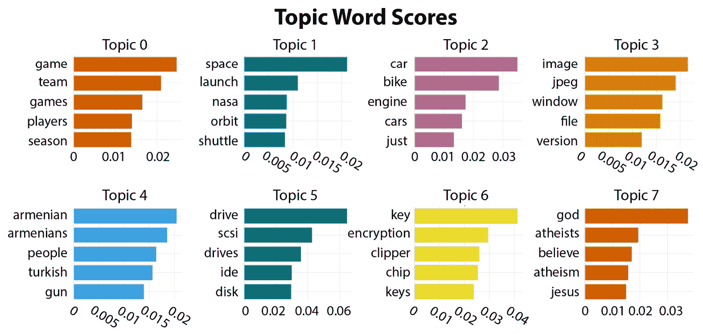

# 第十二章：应用无监督学习方法

在之前的章节中，如*第五章*，我们讨论了监督学习需要标注数据的事实，其中人工标注员决定**自然语言处理**（**NLP**）系统应如何分析数据——也就是说，数据是由人*标注*的。例如，在电影评论数据中，人工标注员查看每个评论并决定它是正面还是负面。我们还指出，这一标注过程既昂贵又耗时。

在本章中，我们将研究不需要标注数据的技术，从而节省了数据准备中的这一耗时步骤。虽然无监督学习并不适用于每一个 NLP 问题，但了解这一领域的基本知识非常有用，这样你就能决定如何将其纳入到你的 NLP 项目中。

在更深层次上，我们将讨论无监督学习的应用，如主题建模，包括无监督学习在探索性应用和最大化稀缺数据方面的价值。我们还将讨论无监督分类中的标签生成，并提及一些方法来最大化有限标签数据的利用，结合部分监督的技术。

在本章中，我们将涵盖以下主题：

+   什么是无监督学习？

+   使用聚类技术和标签推导的主题建模

+   最大化部分监督下的数据利用

# 什么是无监督学习？

在前面的章节中，我们处理的应用都是基于人工标注的数据。例如，我们多次使用的电影评论语料库中的每条评论都由人工标注员阅读，并根据标注员的意见将其分配到*正面*或*负面*类别。然后，评论-类别对被用来训练模型，使用我们之前学习的机器学习算法对新评论进行分类。整个过程称为**监督学习**，因为训练过程实际上是由训练数据进行*监督*的。由人类标注的数据被称为*黄金标准*或*真实标签*。

然而，监督学习方法也存在一些缺点。最明显的缺点是开发真实标签数据的成本，因为需要人工标注员的费用。另一个需要考虑的问题是，不同标注员，甚至同一标注员在不同时间进行的人工标注，可能会存在不一致的情况。如果数据标签本身是主观的或不明确的，也可能导致标注不一致，这使得标注员难以就正确的标注达成一致。

对于许多应用，监督学习方法是唯一的选择，但在本章中，我们将探索其他应用，其中**无监督技术**是有用的。

这些无监督应用不需要标注的训练数据，因为我们想要从自然语言数据中学习的内容并不需要任何人工判断。相反，这些内容可以通过仅仅检查原始文本来发现，而这一过程可以通过算法来完成。这类应用包括按相似度对文档进行分组和计算文档的相似度。特别地，我们将关注**聚类**，即将数据，特别是文档，分组到相似的类别中。寻找相似的文档组通常是开发分类应用过程中的第一步，在文档的类别尚未确定之前。一旦聚类被识别出来，还可以使用一些附加技术来帮助找到人类可读的标签，尽管在某些情况下，通过手动检查聚类，能够轻松确定聚类应如何标记。我们将在本章后面介绍找到聚类标签的工具。

除了聚类，另一项重要的无监督学习应用是我们在*第十一章*中介绍的**大语言模型**（**LLMs**）的训练过程。训练 LLMs 不需要任何监督，因为训练过程仅查看单词在其他单词的上下文中的含义。然而，本书中不会涉及 LLM 的训练过程，因为这是一个计算密集型的过程，并且需要昂贵的计算资源，这些资源对绝大多数开发者来说并不具备。此外，大多数实际应用并不需要 LLM 训练，因为现有的已训练 LLM 已被广泛提供。

本章中，我们将详细阐述一个实际的自然语言处理问题，在该问题中，无监督学习非常有用——*主题建模*。在主题建模中，我们从一组文本项开始，例如文档或聊天机器人应用中的用户输入，但我们没有预先确定的类别集。相反，我们使用文本中的单词本身来发现文本之间的语义相似性，从而将它们分组为不同的类别或主题。

我们将首先回顾一些关于语义上将相似文本分组的基本考虑因素。

# 使用聚类技术和标签推导的主题建模

我们将通过先讨论一些关于一般性语义上相似文档分组的考虑因素开始探索主题建模，然后我们将看一个具体的例子。

## 语义上相似文档的分组

和我们迄今为止讨论的大多数机器学习问题一样，整体任务通常可以分解为两个子问题：数据表示和基于表示执行任务。接下来，我们将探讨这两个子问题。

### 数据表示

我们迄今为止查看的数据表示方法在*第七章*中有所回顾。这些方法包括简单的**词袋**（**BoW**）变体、**词频-逆文档频率**（**TF-IDF**）以及较新的方法，包括**Word2Vec**。Word2Vec 基于词向量，词向量是代表单独单词的向量，不考虑单词出现的上下文。一个较新的表示方法，使用于我们在上一章讨论的**BERT**系统，考虑了单词在句子或文档中的上下文，以创建数值化的单词表示，或称为*嵌入*。在本章中，我们将使用 BERT 嵌入来揭示文档之间的相似性。

### 处理数据表示

本节将讨论处理嵌入的两个方面。首先，我们将讨论将相似文本分组到簇中，然后讨论如何可视化这些簇。

#### 聚类——分组相似项

**聚类**是我们在本章将讨论的主要自然语言处理（NLP）任务。聚类是指一类旨在根据数据表示中的相似性将数据项分组的各种算法。聚类可以应用于任何数据集，无论数据项是否是基于文本的，只要有数值化的方式表示它们的相似性。在本章中，我们将回顾一组实用的聚类工具，但你应该意识到还有许多其他选择，随着技术的发展，毫无疑问会有更多新的聚类方法。两种常见的聚类方法是 k-means 和 HDBSCAN：

+   **k-means**：我们在*第六章*回顾过的 k-means 算法是一种非常常见的聚类方法，其中数据点最初会被随机分配到 k 个簇中，计算簇的均值，并通过迭代过程最小化数据点与簇中心之间的距离。k 的值，即簇的数量，是由开发者选择的超参数。它可以视为该应用中最*有用*的簇数。k-means 算法之所以常用，是因为它高效且易于实现，但其他聚类算法——尤其是 HDBSCAN——可以产生更好的结果。

+   **HDBSCAN**：HDBSCAN 是另一种流行的聚类算法，代表**基于密度的层次空间聚类与噪声应用**。HDBSCAN 考虑了簇内数据点的密度。因此，它能够找到大小不一且形状各异的簇。它还能够检测到离群值或那些不适合某个簇的项，而 k-means 则会强制每个项都被分配到一个簇中。

#### 可视化簇

**可视化**在无监督学习方法中非常重要，比如聚类，因为它允许我们看到相似数据项的分组方式，并帮助我们判断分组结果是否有用。尽管相似项的聚类可以用任意维度表示，但我们最多只能有效地在三维空间中可视化聚类。因此，在实践中，需要进行降维处理以减少维度的数量。我们将使用一种叫做**统一流形近似与投影**（**UMAP**）的工具进行降维。

在下一节中，我们将使用聚类和可视化来说明无监督学习的一个特定应用——主题建模。主题建模可以解决的普遍问题是将文档分类到不同的主题中。这种技术的独特之处在于，与我们在前几章看到的分类示例不同，起初我们并不知道主题是什么。主题建模可以帮助我们识别相似文档的组，即使我们不知道最终的分类会是什么。

在这个示例中，我们将使用 BERT 变换器嵌入来表示文档，并使用 HDBSCAN 进行聚类。具体来说，我们将使用位于[`maartengr.github.io/BERTopic/index.html`](https://maartengr.github.io/BERTopic/index.html)的 BERTopic Python 库。BERTopic 库是可定制的，但在我们的示例中，我们将大部分使用默认设置。

我们将要查看的数据是一个著名的数据集，叫做`20 newsgroups`，它是来自 20 个不同互联网新闻组的 20,000 个新闻组文档集合。这是一个常用于文本处理的流行数据集。数据由不同长度的电子邮件消息组成，这些消息发布到新闻组中。以下是该数据集中的一条短消息示例，已去除电子邮件头部：

```py
I searched the U Mich archives fairly thoroughly for 3D graphics packages,
I always thought it to be a mirror of sumex-aim.stanford.edu... I was wrong.
I'll look into GrafSys... it does sound interesting!
Thanks Cheinan.
BobC
```

`20 newsgroups`数据集可以从 scikit-learn 的 datasets 中导入，或者从以下网站下载：[`qwone.com/~jason/20Newsgroups/`](http://qwone.com/~jason/20Newsgroups/)。

数据集引用

Ken Lang，*Newsweeder: 学习过滤网新闻*，1995 年，*第十二届国际机器学习会议论文集*，331–339

在接下来的章节中，我们将使用`20 newsgroups`数据集和 BERTopic 包详细讲解主题建模。我们将创建嵌入，构建模型，为主题生成建议标签，并可视化生成的聚类。最后一步是展示如何使用我们的模型为新文档找到主题。

## 将 BERTopic 应用于 20 个新闻组

这个应用的第一步是在 Jupyter 笔记本中安装 BERTopic 并导入必要的库，如下所示：

```py
!pip install bertopic
from sklearn.datasets import fetch_20newsgroups
from sklearn.feature_extraction.text import CountVectorizer
from sentence_transformers import SentenceTransformer
from bertopic import BERTopic
from umap import UMAP
from hdbscan import HDBSCAN
# install data
docs = fetch_20newsgroups(subset='all',  remove=('headers', 'footers', 'quotes'))['data']
```

### 嵌入

下一步是准备数据表示或嵌入，如以下代码块所示。由于这是一个较慢的过程，设置`show_progress_bar()`为`True`是很有用的，这样即使过程很慢，我们也能确保进程正在进行。

```py
# Prepare embeddings
docs = fetch_20newsgroups(subset='all',  remove=('headers', 'footers', 'quotes'))['data']
#The model is a Hugging Face transformer model
embedding_model = SentenceTransformer("all-MiniLM-L6-v2")
corpus_embeddings = embedding_model.encode(docs, show_progress_bar = True)
Batches: 100%|########################################################################| 589/589 [21:48<00:00,  2.22s/it]
```

在本练习中，我们将使用**Sentence** **Bert**（**SBERT**）进行句子嵌入，而不是我们在*第十一章*中使用的早期 BERT 词嵌入。

SBERT 为每个句子生成一个嵌入。我们将使用一个名为`SentenceTransformers`的包，它来自 Hugging Face，且推荐使用`all-MiniLM-L6-v2`模型，BERTopic 也推荐使用该模型。不过，许多其他的 transformer 模型也可以使用。例如，`en_core_web_trf`的 spaCy 模型或`distilbert-base-cased`的 Hugging Face 模型。BERTopic 还提供了一个指南，介绍了您可以使用的其他模型，详细内容请见[`maartengr.github.io/BERTopic/getting_started/embeddings/embeddings.html`](https://maartengr.github.io/BERTopic/getting_started/embeddings/embeddings.html)。

我们可以在以下输出中看到实际的嵌入效果：

```py
corpus_embeddings.view()
array([[ 0.002078  ,  0.02345043,  0.02480883, ...,  0.00143592,
         0.0151075 ,  0.05287581],
       [ 0.05006033,  0.02698092, -0.00886482, ..., -0.00887168,
        -0.06737082,  0.05656359],
       [ 0.01640477,  0.08100049, -0.04953594, ..., -0.04184629,
        -0.07800221, -0.03130952],
       ...,
       [-0.00509084,  0.01817271,  0.04388074, ...,  0.01331367,
        -0.05997065, -0.05430664],
       [ 0.03508159, -0.05842971, -0.03385153, ..., -0.02824297,
        -0.05223113,  0.03760364],
       [-0.06498063, -0.01133722,  0.03949645, ..., -0.03573753,
         0.07217913,  0.02192113]], dtype=float32)
```

使用`corpus_embeddings.view()`方法，如下所示，我们可以查看嵌入的摘要，它们是浮动数字的数组的数组。直接查看嵌入本身并不特别有用，但它可以让你对实际数据的样子有个大致的了解。

### 构建 BERTopic 模型

一旦嵌入计算完成，我们就可以构建 BERTopic 模型。BERTopic 模型可以接受大量参数，因此我们不会展示所有参数。我们将展示一些有用的参数，但还有很多其他的参数，您可以查阅 BERTopic 文档以获取更多的思路。BERTopic 模型可以非常简单地构建，只需要文档和嵌入作为参数，如下所示：

```py
model = BERTopic().fit(docs, corpus_embeddings)
```

这个简单的模型具有一些默认的参数，通常会产生合理的结果。然而，为了展示 BERTopic 的一些灵活性，我们接下来将展示如何使用更丰富的参数集来构建模型，代码如下所示：

```py
from sklearn.feature_extraction.text import CountVectorizer
vectorizer_model = CountVectorizer(stop_words = "english", max_df = .95, min_df = .01)
# setting parameters for HDBSCAN (clustering) and UMAP (dimensionality reduction)
hdbscan_model = HDBSCAN(min_cluster_size = 30, metric = 'euclidean', prediction_data = True)
umap_model = UMAP(n_neighbors = 15, n_components = 10, metric = 'cosine', low_memory = False)
# Train BERTopic
model = BERTopic(
    vectorizer_model = vectorizer_model,
    nr_topics = 'auto',
    top_n_words = 10,
    umap_model = umap_model,
    hdbscan_model = hdbscan_model,
    min_topic_size = 30,
    calculate_probabilities = True).fit(docs, corpus_embeddings)
```

在前面的代码中，我们首先定义了几个有用的模型。第一个是`CountVectorizer`，我们在*第七章*和*第十章*中看到过，在那里我们用它将文本文档向量化成如 BoW 这样的格式。在这里，我们将使用该向量化器在降维和聚类后移除停用词，以确保它们不会被包含到主题标签中。

在准备嵌入之前，**停用词**不应从文档中删除，因为 transformer 模型是基于包含停用词的正常文本进行训练的，缺少停用词会导致模型效果下降。

向量化模型的参数表示该模型是使用英语停用词构建的，并且仅包括在少于 95%的文档中出现且超过 1%的单词。这是为了排除极其常见和极其罕见的单词，这些单词不太可能对区分主题有所帮助。

我们将定义的第二个模型是 HDBSCAN 模型，用于聚类。其一些参数包括以下内容：

+   `min_cluster_size`参数是我们希望在聚类中包含的文档的最小数量。在这里，我们选择了`30`作为最小聚类大小。此参数可以根据你要解决的问题进行调整，但如果数据集中的文档数量较大，可能需要选择更大的数字。

+   `prediction_data` 设置为`True`，如果我们希望在模型训练后能够预测新文档的主题。

下一个模型是**均匀流形近似与投影**（**UMAP**）模型，用于降维。除了更容易可视化多维数据外，UMAP 还使得聚类变得更加容易。它的一些参数包括以下内容：

+   `n-neighbors`：此参数限制了 UMAP 在学习数据结构时会观察的区域大小。

+   `n-components`：此参数决定了我们将使用的降维空间的维度。

+   `low_memory`：此参数决定系统内存管理的行为。如果参数为`False`，算法将使用更快速但更占用内存的方法。如果在处理大数据集时内存不足是个问题，可以将`low_memory`设置为`True`。

在定义了这些初步模型后，我们可以继续定义 BERTopic 模型本身。此示例中设置的参数如下：

+   我们已经定义的三个工具模型——向量化模型、UMAP 模型和 HDBSCAN 模型。

+   `nr_topics`：如果我们已经知道想要找到多少个主题，则可以将此参数设置为该数量。在这种情况下，它设置为`auto`，HDBSCAN 将根据数据估算出合适的主题数量。

+   `top_n_words`：在生成标签时，BERTopic 应仅考虑聚类中出现频率最高的*前 n*个单词。

+   `min_topic_size`：应考虑形成一个主题的文档的最小数量。

+   `calculate_probabilities`：此参数计算每个文档所有主题的概率。

运行本节代码将从原始文档中创建聚类。聚类的数量和大小将有所不同，具体取决于生成模型时设置的参数。鼓励你尝试不同的参数设置并比较结果。在思考应用目标时，考虑一些设置是否会产生更多或更少有用的结果。

到目前为止，我们使用的是相似文档的簇，但这些簇并没有被标注上任何类别。如果这些簇有名字会更有用。接下来我们将看看如何为这些簇获得与其内容相关的名称或标签。下一节将回顾标记簇的几种方法。

### 标记

一旦我们得到了簇，就有多种方法可以为它们标上主题。手动方法，你只需查看文档并思考一个合适的标签是什么，这种方法并不一定要排除。然而，也有一些自动方法可以根据文档中出现的词语建议主题。

BERTopic 使用一种方法来建议主题标签，称为基于类别的`tf-idf`，或`c-tf-idf`。你应该记得，TF-IDF 在前几章中已作为一种文档向量化方法讨论，它可以识别文档类别中最具诊断性的术语。它通过比较术语在文档中的频率与其在整个文档集合中的频率来实现这一点。那些在某个文档中频繁出现，但在整个数据集中并不常见的术语，很可能表明该文档应该被分配到特定类别。

基于类别的 TF-IDF 通过将每个簇视为一个单独的文档，进一步拓展了这一直觉。然后，它会查看在某个簇中频繁出现的术语，但在整个数据集中不常出现的术语，以识别有助于标记主题的词语。利用这个指标，可以为每个簇生成最具诊断性的词语作为标签。我们可以在*表 12.1*中看到，为数据集中前 10 个最频繁的主题生成的标签，以及每个主题中的文档数量。

注意表格中的第一个主题，*-1*，是一个涵盖所有不属于任何其他主题的文档的通用主题。

|  | **主题** | **数量** | **名称** |
| --- | --- | --- | --- |
| 0 | -1 | 6,928 | `-``1_maxaxaxaxaxaxaxaxaxaxaxaxaxaxax_dont_know_like` |
| 1 | 0 | 1,820 | `0_game_team_games_players` |
| 2 | 1 | 1,569 | `1_space_launch_nasa_orbit` |
| 3 | 2 | 1,313 | `2_car_bike_engine_cars` |
| 4 | 3 | 1,168 | `3_image_jpeg_window_file` |
| 5 | 4 | 990 | `4_armenian_armenians_people_turkish` |
| 6 | 5 | 662 | `5_drive_scsi_drives_ide` |
| 7 | 6 | 636 | `6_key_encryption_clipper_chip` |
| 8 | 7 | 633 | `7_god_atheists_believe_atheism` |
| 9 | 8 | 427 | `8_cheek___` |
| 10 | 9 | 423 | `9_israel_israeli_jews_arab` |

表 12.1 – 前 10 个主题及自动生成的标签

### 可视化

可视化在无监督学习中极为有用，因为决定如何在开发过程中进行下一步通常依赖于可以通过不同方式查看结果来帮助做出直觉判断。

有许多方法可以可视化主题建模的结果。一种有用的可视化方法是通过 BERTopic 方法`model.visualize_barchart()`获得的，它显示了最重要的主题及其关键词，如*图 12**.1*所示。例如，查看`space_launch_nasa_orbit`中的重要词汇：



图 12.1 – 前七个主题及其最重要的词汇

另一种在聚类中常用的重要可视化技术是将每个聚类中的项目表示为一个点，通过点之间的距离来表示它们的相似性，并为不同的聚类分配不同的颜色或标记。这个聚类可以通过 BERTopic 方法`visualize_documents()`生成，如以下代码所示，使用最小的`docs`和`embeddings`参数：

```py
model.visualize_documents(docs, embeddings = corpus_embeddings)
```

可以设置额外的参数来以各种方式配置聚类图，具体内容可参见 BERTopic 文档。例如，你可以设置显示或隐藏聚类标签，或者仅显示最重要的主题。

`20 newsgroups`数据集中的前七个主题的聚类结果可以在*图 12**.2*中看到。


图 12.2 – `20 newsgroups`数据集中前七个主题的聚类文档及其生成的标签

*图 12**.2*中显示了七个主题，对应于*图 12**.1*中的七个主题，每个主题都有自动生成的标签。此外，*图 12**.2*中的文档以浅灰色显示，表示这些文档没有被分配到任何聚类中。它们在*表 12.1*中作为主题`-1`显示。

从聚类展示中，我们可以得到一个见解，那就是有许多未分配的文档，这意味着我们可能需要增加要查找的主题数量（通过将`nr_topic`参数增加到`model()`）。另一个见解是，一些主题——例如，`1_space_launch_nasa`——似乎被分配到了多个聚类中。这意味着将它们视为单独的主题可能会更有意义。像未分类文档的情况一样，我们可以通过增加要查找的主题数量来调查这一可能性。

我们展示了两种最有用的 BERTopic 可视化图，但还有更多。建议你参考 BERTopic 文档，探索其他想法。

### 查找新文档的主题

一旦聚类完成，模型就可以用来找到新文档的主题，类似于分类应用。可以使用`model.transform()`方法完成，如下所示：

```py
sentence_model = SentenceTransformer("all-MiniLM-L6-v2")
new_docs = ["I'm looking for a new graphics card","when is the next nasa launch"]
embeddings = sentence_model.encode(new_docs)
topics, probs = model.transform(new_docs,embeddings)
print(topics)
[-1, 3]
```

`new_docs`中的两个文档的预测主题分别是`-1`（无主题）和`3`，表示`3_space_launch_orbit_nasa`。

## 在聚类和主题标注后

回想一下，聚类最常见的应用是探索数据，通常是为了开发监督分类应用做准备。我们可以查看聚类结果，并决定，例如，某些聚类非常相似并且彼此靠近。在这种情况下，即使经过监督训练，也很难将这些主题中的文档区分开来，因此将这些聚类合并为一个主题可能是个好主意。同样，如果我们发现一些非常小的聚类，通常将这些小聚类与相似的大聚类合并，会得到更可靠的结果。

我们还可以修改标签，使其更加有用或富有信息。例如，*表 12.1*中的主题`1`是`1_space_launch_nasa_orbit`。你可能会决定使用`space`作为一个更简单的标签，它仍然和自动生成的标签一样具有信息量。

在对你认为有帮助的聚类和标签进行调整后，结果将是一个监督数据集，就像我们之前使用的监督数据集，例如电影评论数据集一样。你可以像使用任何监督数据集一样使用它，在 NLP 应用中加以利用。

尽管无监督的主题建模是一种非常有用的技术，但也可以利用部分监督的数据。我们将在下一节总结 NLP 研究社区探索的一些思想，看看如何利用部分标注的数据。

# 最大化利用弱监督数据

在完全监督和无监督学习之间，有几种部分监督的方法，其中只有 x 数据是受监督的。像无监督方法一样，这些技术的目标是最大化利用监督数据，而监督数据通常很难获取。部分监督相较于无监督方法的一个优势是，无监督结果自动生成的标签并不总是有用的。标签必须通过手动或本章早些时候提到的一些技术来提供。通常情况下，弱监督下的标签是基于已监督数据的子集来提供的。

这是一个活跃的研究领域，我们不会深入讨论。然而，了解弱监督的一般策略是有益的，这样你就能根据可用的标注数据，将这些策略应用到具体任务中。

弱监督的一些策略包括以下内容：

+   不完全监督，其中只有部分数据具有真实标签

+   不精确监督，其中数据有粗粒度的标签

+   不准确监督，其中一些标签可能是错误的

+   半监督学习，其中提供了一些预定义的标签，帮助将模型推向已知类别

在那些完整标注过于昂贵或耗时的应用中，这些方法值得考虑。此外，在那些无监督学习可能会遇到问题的情况下，它们也可以发挥作用，特别是当其他部分的整体应用（例如数据库）需要预定义标签时。

# 总结

在本章中，你学习了无监督学习的基本概念。我们还通过使用一个基于 BERT 的工具——BERTopic，具体演示了无监督学习的一个应用：主题建模。我们使用 BERTopic 包来识别语义相似文档的聚类，并根据它们包含的词汇为这些聚类提议标签，而无需使用任何监督标注的聚类主题。

在下一章，*第十三章*，我们将讨论如何使用定量技术衡量我们结果的好坏。定量评估在研究应用中很有用，可以将结果与以往的研究进行比较，并且在实际应用中可以确保所使用的技术符合应用的要求。虽然在前面的章节中简要讨论过评估，*第十三章*将深入探讨这一主题。内容将包括将数据划分为训练集、验证集和测试集，使用交叉验证进行评估，评估指标（如精确度和召回率）、曲线下面积、消融研究、统计显著性、标注者间一致性和用户测试。
