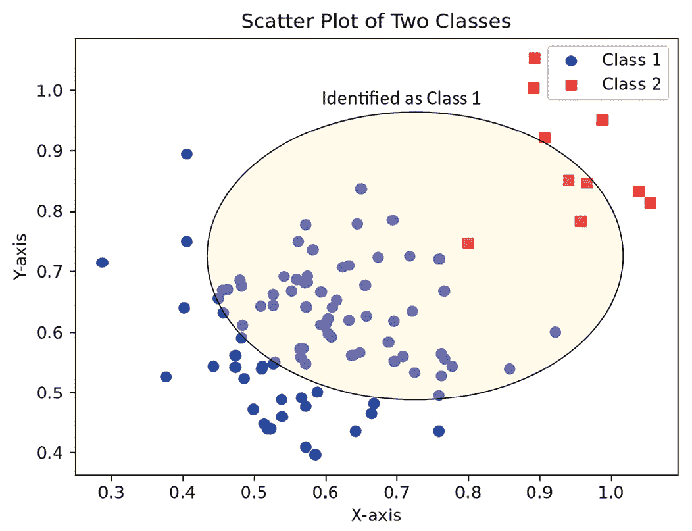
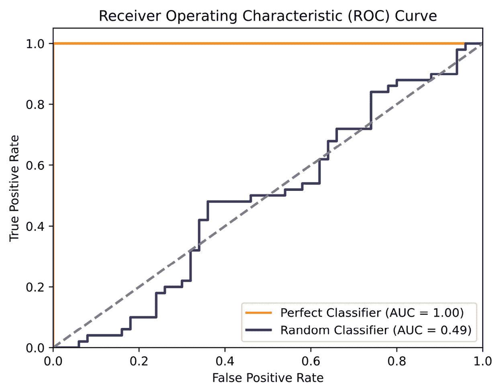
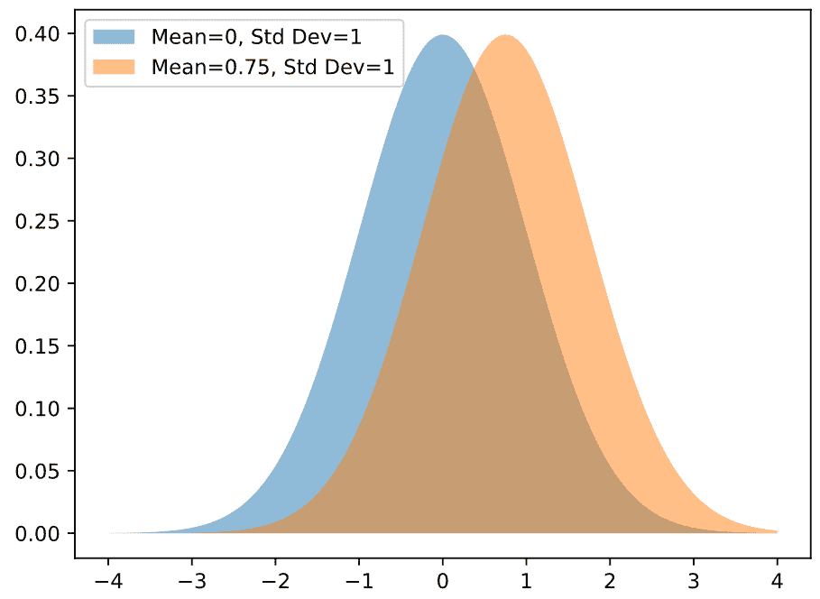
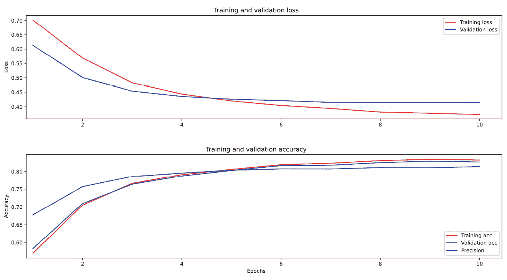
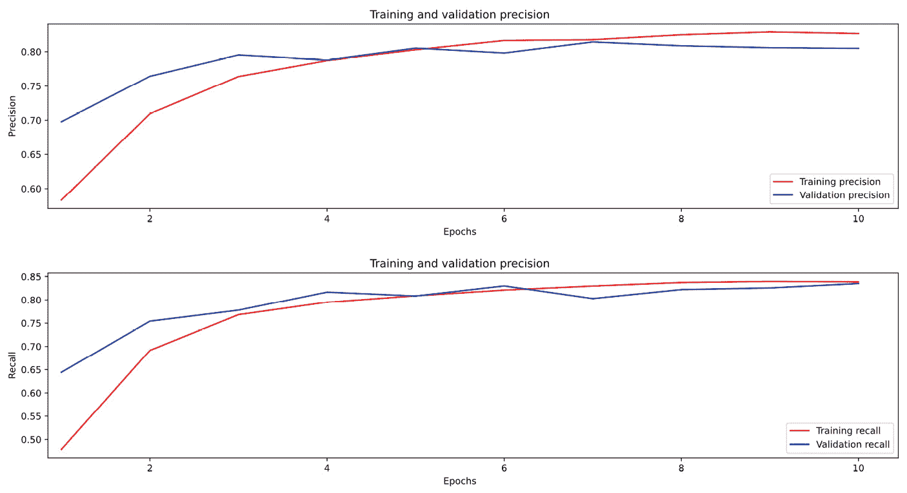
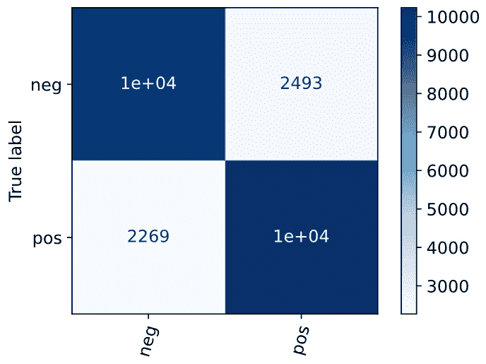
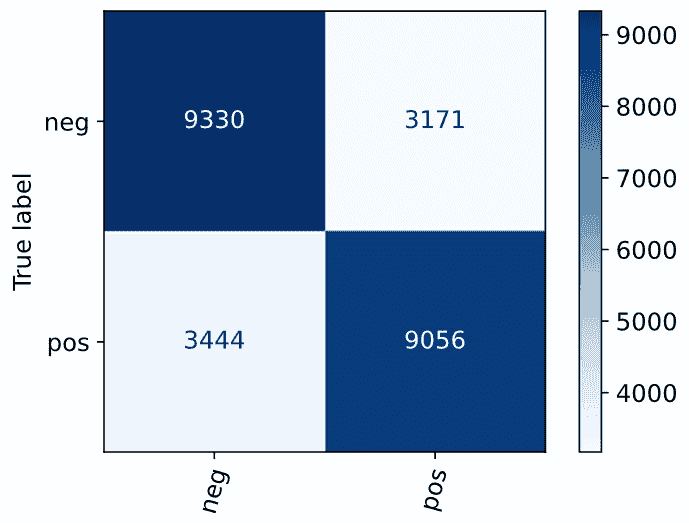
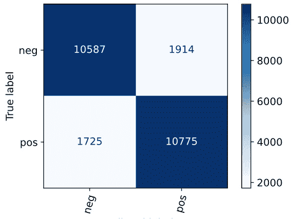

# 第十三章：它工作得怎么样？——评估

本章将讨论如何量化一个**自然语言理解**（**NLU**）系统的效果。在本书的整个过程中，我们假设我们希望开发的 NLU 系统能够在其设计的任务上表现良好。然而，我们并没有详细讨论使我们能够判断系统表现如何的工具——也就是如何评估系统。本章将介绍一些评估技术，帮助你了解系统的表现如何，以及如何在性能上比较不同的系统。我们还将探讨一些避免从评估指标中得出错误结论的方法。

本章我们将讨论的主题如下：

+   为什么要评估自然语言理解系统？

+   评估范式

+   数据分割

+   评估指标

+   用户测试

+   差异的统计显著性

+   比较三种文本分类方法

我们将从为什么评估自然语言理解系统非常重要这个问题开始。

# 为什么要评估自然语言理解系统？

我们可以提出许多关于自然语言理解系统整体质量的问题，评估它就是回答这些问题的方式。我们如何评估取决于系统开发的目标以及我们想要了解系统的哪些方面，以确保目标得以实现。

不同类型的开发者有不同的目标。例如，考虑以下类型的开发者的目标：

+   我是一个研究员，我想知道我的想法是否推动了自然语言理解（**NLU**）科学的发展。换句话说，我想知道我的工作与**最新技术**（**SOTA**）相比如何——也就是说，与在某个特定任务上任何人报告的最佳结果相比，我的工作如何。

+   我是一个开发者，我想确保我的整体系统性能足够好，适用于某个应用。

+   我是一个开发者，我想看看我的修改如何提高系统的表现。

+   我是一个开发者，我想确保我的修改没有降低系统的性能。

+   我是一个研究员或开发者，我想知道我的系统在不同数据类别上的表现如何。

对所有这些开发者和研究员来说，最重要的问题是，*系统在执行其* *预期功能* 时表现如何？

本章将重点讨论的问题是：如何让不同类型的开发者获取他们所需的信息。然而，还有其他重要的自然语言理解系统属性可以评估，有时这些可能比整体系统性能更为重要。值得简要提及这些，以便你了解它们。例如，其他评估问题的方面包括：

+   **支持应用程序的机器学习模型大小**：如今的模型可以非常庞大，并且有大量的研究致力于使模型变得更小而不显著降低其性能。如果需要小型模型，则需要权衡模型大小与准确性之间的关系。

+   **训练时间**：一些算法需要在高度强大的 GPU 处理器上进行几个星期的训练时间，尤其是当它们训练的是大规模数据集时。缩短训练时间可以大大简化实验不同算法和调整超参数的过程。从理论上讲，较大的模型会提供更好的结果，但代价是更多的训练时间，但在实践中，我们需要问的是，这些更大的模型在任何特定任务的表现上有多大差异？

+   **训练数据量**：如今的**大规模语言模型**（**LLMs**）需要大量的训练数据。事实上，在当前的 SOTA（最先进技术）中，数据量对于除最大型组织之外的所有机构来说都是过于庞大的。然而，正如我们在*第十一章*中看到的那样，LLMs 可以通过特定应用的数据进行微调。另一个关于训练数据的考量是，是否有足够的数据来训练一个能够良好工作的系统。

+   **开发者的专业知识**：依赖于高度专业的开发者成本很高，因此通常希望有一个可以由较少经验的开发者执行的开发过程。在*第八章*中讨论的基于规则的系统，通常需要高度专业的开发者，这也是它们往往尽可能避免使用的原因之一。另一方面，实验最先进的深度学习模型可能需要专家数据科学家的知识，而这些专家既昂贵又难以找到。

+   **训练成本**：对于非常大的模型，训练成本通常在几百万美元的范围内，即使只考虑计算资源的成本。较低的训练成本显然是自然语言理解（NLU）系统的一项理想特性。

+   **环境影响**：与训练成本密切相关的是其在能源消耗方面的环境影响，这可能非常高。显然，减少这种影响是非常理想的。

+   **推理的处理时间**：这个问题涉及到训练好的系统处理输入并给出结果所需的时间。对于今天的系统来说，这通常不是问题，特别是在聊天机器人或语音对话系统等互动系统中使用的短输入。几乎任何现代方法都能让它们快速处理到足够的速度，用户不会感到烦恼。然而，对于离线应用（如分析）而言，如果一个应用需要从数小时的音频或数 GB 的文本中提取信息，处理时间较慢将会积累起来。

+   **预算**：像 GPT-4 这样的付费云端大型语言模型（LLMs）通常能提供非常好的结果，但像 BERT 这样的本地开源模型可能便宜得多，且能为特定应用提供足够好的结果。

即便这些属性在我们决定使用哪种 NLU 方法时可能很重要，但 NLU 系统的实际效果可能是最重要的。作为开发者，我们需要回答一些基础性问题，例如：

+   *这个系统的表现是否足够好，能够* *满足预期功能并且* *有用？*

+   *随着系统的变化，它是否在不断* *变得更好？*

+   *这个系统的表现与* *其他系统的表现相比如何？*

这些问题的答案需要评估方法来给系统的性能分配数值。主观的或非定量的评估方法（例如少数人查看系统的表现并决定它是否*看起来好*）不够精确，无法为这些问题提供可靠的答案。

我们将通过回顾一些整体的评估方法来开始我们的评估讨论，或称为*评估范式*。

# 评估范式

在本节中，我们将回顾一些用于量化系统性能并比较系统的主要评估范式。

## 比较系统在标准指标上的表现

这是最常见的评估范式，可能也是最容易执行的。系统只需处理数据，并根据标准指标对其表现进行定量评估。即将到来的*评估指标*部分将更详细地探讨这个话题。

## 评估语言输出

一些自然语言理解（NLU）应用程序生成自然语言输出。这些应用包括翻译或文本摘要等。它们与需要给出明确对错答案的应用不同，如分类和槽填充，因为在这些应用中没有唯一正确的答案——可能有许多好的答案。

评估机器翻译质量的一种方法是让人类查看原文和翻译，并判断其准确性，但这种方法通常过于昂贵，无法广泛使用。因此，已经开发出了可以自动应用的指标，尽管它们不如人工评估令人满意。我们在这里不会详细讨论这些指标，但会简要列出它们，以便你在需要评估语言输出时可以进一步研究。

**双语评估替代指标**（**BLEU**）是评估翻译质量的一个公认的指标。这个指标通过将机器翻译结果与人工翻译进行对比，衡量二者之间的差异。由于非常优秀的机器翻译与任何特定的人工翻译可能有很大不同，因此 BLEU 分数不一定能与人工翻译质量评判一致。其他用于评估语言输出应用程序的指标包括**带显式顺序的翻译评估指标**（**METEOR**）、**摘要评估的召回导向替代指标**（**ROUGE**）和**跨语言优化翻译评估指标**（**COMET**）。

在接下来的部分，我们将讨论一种评估方法，该方法涉及去除系统的一部分，以确定它对结果的影响。这是否会使结果变得更好或更差，还是根本不会造成任何变化？

## 去除系统的一部分——消融

如果一个实验包括多个操作步骤的流水线，通常通过去除流水线中的步骤来比较结果会提供更多信息。这种方法叫做**消融**，它在两种不同情况下都非常有用。

第一个情况是当实验用于研究论文或包含一些创新技术的学术项目时。在这种情况下，你希望能够量化流水线中每个步骤对最终结果的影响。这将使论文的读者能够评估每个步骤的重要性，特别是如果论文试图展示某个步骤或多个步骤是一个重要的创新。如果去除这些创新后系统仍然表现良好，那么这些创新可能对系统整体性能的贡献并不显著。消融研究将帮助你准确了解每个步骤的贡献。

消融的第二个情况更为实际，发生在你正在开发一个需要在部署时具有计算效率的系统时。通过比较有无特定步骤的系统版本，你可以判断这些步骤所花费的时间是否值得它们对系统性能的提升。

考虑做消融研究的第二个原因的一个例子可能是，了解像停用词去除、词形还原或词干提取这样的预处理步骤是否对系统的性能有影响。

另一种评估方法涉及一个测试，其中多个独立系统处理相同的数据并进行结果比较。这些就是共享任务。

## 共享任务

**自然语言理解（NLU）**领域长期以来受益于在**共享任务**上进行系统比较，其中不同开发人员开发的系统都在一组特定主题的共享数据上进行测试，结果进行比较。此外，参与共享任务的团队通常会发布系统描述，提供关于他们的系统如何达到这些结果的非常有用的见解。

共享任务范式有两个好处：

+   首先，它使得参与共享任务的开发人员能够精确地获得关于他们的系统与其他系统的比较信息，因为数据是完全相同的。

+   其次，参与共享任务的数据可以提供给研究社区，用于开发未来的系统。

共享数据可以长期使用，因为它不受 NLU 技术变化的影响——例如，旅行规划任务中的**航空旅行信息系统**（**ATIS**）数据自 1990 年代初以来一直在使用。

*NLP-progress* 网站 [`nlpprogress.com/`](http://nlpprogress.com/) 是一个关于共享任务和共享任务数据的良好信息来源。

在下一节中，我们将探讨如何将数据划分为子集，以为评估做准备。

# 数据划分

在前面的章节中，我们将数据集划分为用于*训练*、*验证*和*测试*的子集。

提醒一下，训练数据用于开发**自然语言理解（NLU）**模型，该模型用于执行最终的 NLU 应用任务，无论是分类、槽位填充、意图识别还是其他大多数 NLU 任务。

**验证数据**（有时称为**开发测试**数据）在训练过程中用于评估模型在未用于训练的数据上的表现。这非常重要，因为如果系统在训练数据上进行测试，它可能只是通过“记住”训练数据来获得良好的结果。这是误导性的，因为那种系统并不十分有用——我们希望系统能够在部署后面对新的数据时，具有良好的泛化能力或表现。验证数据还可以用于帮助调整机器学习应用中的超参数，但这意味着在开发过程中，系统已经暴露了一些验证数据，因此这些数据不如我们希望的那样具有新颖性。

因此，通常会预留另一组全新的数据进行最终测试；这就是测试数据。为了系统开发的准备，完整的数据集会被划分为训练数据、验证数据和测试数据。通常，大约 80%的数据集用于训练，10%用于验证，10%用于测试。

数据划分的三种常见方式：

+   在某些情况下，数据集已经被划分为训练集、验证集和测试集。这在一些普遍可用的数据集中最为常见，例如我们在本书中使用的数据集或共享任务中的数据集。有时，数据只会被划分为训练集和测试集。如果是这样，应该使用训练数据的一个子集作为验证集。Keras 提供了一个有用的工具 `text_dataset_from_directory`，它可以从目录中加载数据集，使用子目录名作为目录中文本的监督类别，并划分出一个验证子集。在以下代码中，训练数据是从 `aclImdb/train` 目录加载的，然后将 20% 的数据划分出来作为验证数据：

    ```py
    raw_train_ds = tf.keras.utils.text_dataset_from_directory(
    ```

    ```py
         'aclImdb/train',
    ```

    ```py
         batch_size=batch_size,
    ```

    ```py
         validation_split=0.2,
    ```

    ```py
         subset='training',
    ```

    ```py
         seed=seed)
    ```

+   当然，使用先前的划分只有在你使用的是已经划分过的数据集时才有意义。如果你有自己的数据，你将需要自己进行数据划分。我们使用的一些库具有能够在加载数据时自动进行划分的功能。例如，scikit-learn、TensorFlow 和 Keras 都有可以用于此目的的 `train_test_split` 函数。

+   你也可以手动编写 Python 代码来划分你的数据集。通常，最好使用来自库的经过测试的代码，因此除非你无法找到合适的库，或者你只是对学习更多关于划分过程的内容感兴趣，否则不推荐编写自己的 Python 代码来完成这个任务。

最终的数据划分策略称为**k-折交叉验证**。该策略涉及将整个数据集划分为 *k* 个子集，或称 *folds*，然后将每一个 fold 作为测试数据来评估系统。在 *k*-折交叉验证中的整体系统得分是所有测试的平均得分。

这种方法的优点是它减少了测试数据和训练数据之间意外差异的可能性，从而避免了模型在对新测试样本进行预测时效果不佳。由于在 *k*-折交叉验证中，训练数据和测试数据之间没有严格的划分，因此意外差异更难影响结果；每一折的数据轮流作为测试数据。该方法的缺点是它将测试系统所需的时间乘以 *k*，如果数据集很大，这个时间可能会变得非常长。

数据划分对于我们将在本章讨论的几乎每个评估指标都是必要的，唯一的例外是用户测试。

在下一节中，我们将讨论一些最常见的具体定量指标。在*第九章*中，我们介绍了最基本和直观的指标——准确率。在这里，我们将回顾其他通常能比准确率提供更好洞察的指标，并解释如何使用它们。

# 评估指标

在选择用于自然语言处理（NLP）系统评估的指标时，或者更广泛地说，选择任何我们想评估的系统时，有两个重要的概念需要牢记：

+   **有效性**：第一个是有效性，意味着该指标对应于我们直观上认为的我们想了解的实际属性。例如，我们不希望选择文本长度作为其积极或消极情感的衡量标准，因为文本长度不能作为其情感的有效度量。

+   **可靠性**：另一个重要的概念是可靠性，意味着如果我们重复测量相同的事物，我们总能得到相同的结果。

在接下来的章节中，我们将讨论一些在自然语言理解（NLU）中最常用的、被认为既有效又可靠的指标。

## 准确度和错误率

在*第九章*中，我们将准确度定义为正确系统响应的数量除以总输入数量。类似地，我们将**错误率**定义为错误响应除以输入数量。请注意，当你阅读语音识别结果报告时，可能会遇到**词错误率**。由于词错误率是根据一个不同的公式计算的，该公式考虑了不同类型的常见语音识别错误，因此这是一个不同的指标，我们在此不进行详细讨论。

下一节将详细介绍一些更具体的指标，包括精度、召回率和 F1 分数，这些在*第九章*中已有简要提及。

这些指标通常比准确度提供更多关于系统处理结果的洞察。

## 精度、召回率和 F1

**准确度**在某些情况下可能会给出误导性的结果。例如，我们可能有一个包含 100 个项目的数据集，但类别不平衡，绝大多数情况（比如说 90 个）属于一个类别，我们称之为多数类。这在真实数据集中非常常见。在这种情况下，通过自动将每个案例分配给多数类，可以获得 90%的准确度，但属于另一个类别的剩余 10 个实例（假设我们只有两个类别，简化讨论）将始终被分类错误。从直觉上讲，准确度似乎在这种情况下是不可靠且具有误导性的指标。为了提供更有效的指标，引入了一些改进——最重要的是召回率和精度的概念。

**召回率**意味着一个系统能找到每一个类别的实例且不漏掉任何一个。在我们的例子中，它正确地找到了所有 90 个多数类的实例，但没有找到其他类别的任何实例。

召回率的公式如下所示，其中*真正例*是被正确识别的类别实例，*假负例*是被遗漏的该类别实例。在我们的初始例子中，假设数据集中有 100 个项目，系统正确识别了 90 个（多数类），但遗漏了 10 个属于其他类别的例子。因此，主要类别的召回率为 1.0，但另一个类别的召回率为 0：

recall =  真正例  ________________  真正例 + 假负例

另一方面，**精确率**意味着所有被识别的项目都是正确的。完美的精确率意味着没有项目被误识别，尽管可能会遗漏一些项目。精确率的公式如下，其中*假正例*是被误识别的实例。在这个例子中，假正例是 10 个被错误识别为属于多数类的项目。在我们的例子中，少数类的精确率为 1.0，但对于另一个类别，精确率为 0，因为没有*真正例*。这个例子中的精确率和召回率得分让我们更详细地了解系统犯了哪些错误：

precision =  真正例  ________________  真正例 + 假正例

最后，还有另一个重要的指标，**F**1，它结合了精确率和召回率的得分。这个指标非常有用，因为我们通常希望有一个单一的总体指标来描述系统的性能。这可能是自然语言理解（NLU）中最常用的指标。F1 的公式如下：

F1 =  精确率 × 召回率  ____________  精确率 + 召回率

*图 13.1* 以图形方式展示了单类的正确和错误分类。椭圆内的项目被识别为**类别 1**。椭圆内的圆形标记是真正例——被识别为**类别 1**且实际属于**类别 1**的项目。椭圆内的方形标记是假正例——实际属于**类别 2**但错误地被识别为**类别 1**的项目。椭圆外的圆形标记是假负例——实际属于**类别 1**但未被识别的项目：



图 13.1 – 单类分类

`F`1 度量假设召回率和精确度的得分同等重要。这在许多情况下是正确的，但并非总是如此。例如，考虑一个目标是检测推文中提及公司产品的应用程序。该系统的开发人员可能认为，不错过任何关于其产品的推文非常重要。在这种情况下，他们可能会强调召回率，即使这会以牺牲精确度为代价，这意味着他们可能会得到许多假阳性——系统将某些推文分类为关于其产品的推文，但实际上并非如此。如果你开发的系统中召回率和精确度并不等同重要，可以使用更通用的`F`1 度量版本来加权召回率和精确度。

## 接收操作特征与曲线下面积

测试项属于哪个类别的决策取决于它在该类别的得分。如果该项的得分超过了一个给定的阈值（由开发人员选择），系统就会判断该项确实属于该类别。我们可以看到，真正阳性和假阳性得分会受到这个阈值的影响。如果我们将阈值设置得非常高，很少有项会进入该类别，真正阳性会减少。另一方面，如果阈值设置得非常低，系统会判断许多项属于该类别，系统会接受许多不属于该类别的项，假阳性将会非常高。我们真正想知道的是，在每个阈值下，系统区分不同类别的能力如何。

视觉化虚假阳性（精确度失败）与虚假阴性（召回率失败）之间权衡的一个好方法是使用**接收操作特征**（**ROC**）图及其相关度量——**曲线下面积**（**AUC**）。ROC 曲线是衡量系统区分不同类别能力的总体表现。理解这一点的最佳方法是查看一个 ROC 曲线示例，正如我们在*图 13**.2*中所看到的那样。该图基于随机生成的数据：



图 13.2 – 完美分类器与随机分类器的 ROC 曲线

在*图 13**.2*中，我们可以看到，在点(**0**, **1**)处，系统没有假阳性，所有的真正阳性都被正确检测。如果我们将接受阈值设为**1**，系统仍然会接受所有真正阳性，且仍然没有假阳性。另一方面，如果分类器完全无法区分不同类别，我们会得到类似**随机分类器**的线条。无论我们设定什么阈值，系统仍然会犯很多错误，仿佛它在随机地为输入分配类别。

总结系统区分各类别能力的常见方法是 ROC 曲线下的面积，或 AUC。完美分类器的 AUC 得分为**1.0**，随机分类器的 AUC 得分大约为**0.5**，如果分类器的表现比随机分类还差，AUC 得分则会低于**0.5**。注意，我们这里讨论的是二分类问题，因为它更容易解释，但也有技术可以将这些概念应用于多分类问题。我们在此不深入讨论，但有关如何查看多分类数据集 ROC 曲线的技术，可以参考 scikit-learn 文档，地址为[`scikit-learn.org/stable/auto_examples/model_selection/plot_roc.html`](https://scikit-learn.org/stable/auto_examples/model_selection/plot_roc.html)。

## 混淆矩阵

另一个重要的评估工具是**混淆矩阵**，它显示每个类别与其他类别混淆的频率。通过一个示例，这个概念会更加清晰，因此我们会推迟讨论混淆矩阵，直到本章最后的示例部分。

# 用户测试

除了直接的系统度量，用户测试也可以用来评估系统，在这种测试中，代表系统预期用户的测试用户与系统进行交互。

**用户测试**是一种耗时且昂贵的测试方式，但有时它是唯一能揭示系统性能定性方面的方法——例如，用户在使用系统时完成任务的难易程度，或他们对使用系统的享受程度。显然，用户测试只能在用户能够感知的系统方面进行，比如对话，用户只应被期望评估系统整体表现——也就是说，不能指望用户可靠地区分语音识别和自然语言理解（NLU）组件的表现。

与用户进行有效且可靠的评估实际上是一项心理学实验。这是一个复杂的话题，容易犯错误，导致无法从结果中得出结论。因此，提供完整的用户测试指南超出了本书的范围。不过，你可以通过让一些用户与系统互动并测量他们的体验来进行一些探索性的用户测试。你可以在用户测试中收集的简单测量包括以下内容：

+   让用户填写一个简单的问卷，评估他们的体验。

+   测量用户与系统互动的时间。用户与系统互动的时间可以是正面或负面的度量，具体取决于系统的目的，例如：

    +   如果你正在开发一个旨在带来乐趣的社交系统，你会希望用户花更多时间与系统互动。

    +   另一方面，如果你正在开发一个任务导向的系统，旨在帮助用户完成某项任务，你通常希望用户与系统的互动时间越少越好。

然而，你在进行用户测试时也必须谨慎：

+   用户必须具有代表性，能够代表实际的目标用户群体。如果用户不具代表性，结果可能会非常具有误导性。例如，一个面向客户支持的公司聊天机器人应该在客户身上进行测试，而不是员工，因为员工对公司了解得比客户多，他们提问的问题也会不同。

+   让问卷简洁明了，不要要求用户提供与您要了解的内容无关的信息。如果用户对问卷感到厌烦或不耐烦，他们提供的信息将不具任何参考价值。

+   如果用户测试的结果对项目至关重要，你应该找到一位人因工程师——即有经验设计人类用户实验的人——来设计测试过程，以确保结果有效且可靠。

到目前为止，我们已经探讨了几种不同的衡量系统性能的方法。应用这些技术会得到一个或多个数值，或称为*度量指标*，用以量化系统的表现。有时，当我们用这些度量指标来比较多个系统，或同一个系统的不同版本时，我们会发现这些度量指标的差异很小。这时，值得问一下，差异是否真的具有意义。这个问题是通过统计显著性来解决的，我们将在下一节进行讲解。

# 差异的统计显著性

我们在评估中要讨论的最后一个主题是，如何判断我们所做实验的结果之间的差异是否反映了实验条件之间的实际差异，或者这些差异是否由于偶然因素所致。这就是所谓的**统计显著性**。度量指标值之间的差异是否代表系统之间的实际差异，是我们无法确定的，但我们可以知道的是，这种我们关心的差异是否可能是偶然造成的。假设我们的数据情形如*图 13.3*所示：



图 13.3 – 测量值的两个分布——它们是否反映了被测物体之间的实际差异？

*图 13.3* 显示了两组测量结果，一组平均值为**0**，在左边，另一组平均值为**0.75**，在右边。在这里，我们可能在比较两个分类算法在不同数据集上的表现。例如，看起来两个算法之间确实存在差异，但这种差异可能是偶然的？我们通常认为，如果这种差异偶然发生的概率是 20 分之一，那么这个差异就被认为是统计显著的，也就是不太可能是偶然的。当然，这也意味着每 20 个统计显著的结果中，可能有 1 个实际上是偶然发生的。这种概率是通过标准的统计公式来计算的，比如*t-统计量*或*方差分析*。

如果你阅读了一篇对其结果进行显著性检验的论文，并且它指出类似*p<.05*的内容，*p*表示这个差异是由于偶然发生的概率。这样的统计分析通常用于数据中，其中确定差异是否具有统计显著性非常重要，比如会议上展示的学术论文或用于发表在学术期刊中的论文。我们在这里不讨论统计显著性是如何计算的，因为这个过程可能会变得相当复杂，但如果你需要使用它，你应该知道它的含义。

还需要考虑一个问题，那就是结果可能在统计学上显著，但在现实情况下可能并不具有实际意义。如果一种分类算法的结果仅比另一种稍微好一些，但更好的算法计算起来要复杂得多，那么可能不值得去使用那个更好的算法。这些权衡必须从算法的实际应用角度进行考虑。即便是一个小的，但显著的差异，对于学术论文可能非常重要，但对于已部署的应用程序则可能完全无关紧要。

现在我们已经回顾了几种评估系统的方法，让我们看看如何在实际中应用它们。在接下来的部分中，我们将通过一个案例研究，比较三种不同的文本分类方法在相同数据上的表现。

# 比较三种文本分类方法

我们使用评估技术可以做的最有用的事情之一是决定在应用程序中使用哪种方法。像**词频-逆文档频率**（**TF-IDF**）、**支持向量机**（**SVMs**）和**条件随机场**（**CRFs**）这样的传统方法是否足够满足我们的任务，还是必须使用深度学习和变换器方法，这些方法虽然训练时间更长，但效果更好？

在本节中，我们将比较三种方法在一个更大的电影评论数据集上的表现，该数据集我们在*第九章*中讨论过。我们将比较使用小型 BERT 模型、TF-IDF 向量化与朴素贝叶斯分类以及较大的 BERT 模型。

## 小型变压器系统

我们将首先查看我们在*第十一章*中开发的 BERT 系统。我们将使用与*第十一章*相同的 BERT 模型，即`small_bert/bert_en_uncased_L-2_H-128_A-2`，它是最小的 BERT 模型之一，具有两层、隐藏层大小为`128`，并且有两个注意力头。

我们将进行一些调整，以便更好地评估该模型的表现。

首先，我们将添加新的指标，精确度和召回率，作为我们在*第十一章*中使用的`BinaryAccuracy`指标的补充：

```py
metrics = [tf.metrics.Precision(),tf.metrics.Recall(),tf.metrics.BinaryAccuracy()]
```

通过这些指标，`history`对象将包括在 10 个训练周期内精确度和召回率的变化。我们可以通过以下代码查看这些变化：

```py
history_dict = history.history
print(history_dict.keys())
acc = history_dict['binary_accuracy']
precision = history_dict['precision_1']
val_acc = history_dict['val_binary_accuracy']
loss = history_dict['loss']
val_recall = history_dict['val_recall_1']
recall = history_dict['recall_1']
val_loss = history_dict['val_loss']
val_precision = history_dict['val_precision_1']
precision = history_dict['precision_1']
val_recall = history_dict['val_recall_1']
```

如前面的代码片段所示，第一步是从`history`对象中提取我们感兴趣的结果。接下来的步骤是绘制随着训练周期变化的结果，这将在以下代码中计算：

```py
epochs = range(1, len(acc) + 1)
fig = plt.figure(figsize=(10, 6))
fig.tight_layout()
plt.subplot(4, 1, 1)
# r is for "solid red line"
plt.plot(epochs, loss, 'r', label='Training loss')
# b is for "solid blue line"
plt.plot(epochs, val_loss, 'b', label='Validation loss')
plt.title('Training and validation loss')
# plt.xlabel('Epochs')
plt.ylabel('Loss')
plt.legend()
```

上面的代码展示了训练和验证损失的绘图过程，生成了*图 13.4*中的顶部图表。*图 13.4*中的其余图表和*图 13.5*中的图表是以相同的方式计算的，但由于它们与第一个图表的代码几乎相同，我们这里不再展示完整代码。

*图 13.4*展示了训练周期内损失的下降和准确率的上升，正如我们之前看到的。我们可以看到，训练数据和验证数据的损失值在**0.40**到**0.45**之间趋于平稳。在第**7**个周期时，看起来额外的训练可能不会改善性能：



图 13.4 – 在 10 个训练周期内的损失和准确率

由于我们添加了精确度和召回率指标，我们还可以看到这些指标在大约**0.8**的水平上趋于平稳，在大约**7**个训练周期时达到平衡，如*图 13.5*所示：



图 13.5 – 在 10 个训练周期内的精确度和召回率

我们还可以查看混淆矩阵和分类报告，以获得更多信息，使用以下代码，调用来自 scikit-learn 的函数：

```py
# Displaying the confusion matrix
%matplotlib inline
from sklearn.metrics import confusion_matrix,ConfusionMatrixDisplay,f1_score,classification_report
import matplotlib.pyplot as plt
plt.rcParams.update({'font.size': 12})
disp = ConfusionMatrixDisplay(confusion_matrix = conf_matrix,
                                             display_labels = class_names)
print(class_names)
disp.plot(xticks_rotation=75,cmap=plt.cm.Blues)
plt.show()
```

这将绘制出如*图 13.6*所示的混淆矩阵：



图 13.6 – 小型 BERT 模型的混淆矩阵

*图 13.6* 中的深色单元格显示了正确分类的数量，实际的负面和正面评论被分配到了正确的类别。我们可以看到，有相当多的错误分类。通过打印以下代码的汇总分类报告，我们可以看到更详细的信息：

```py
print(classification_report(y_test, y_pred, target_names=class_names))
['neg', 'pos']
```

分类报告显示了两个类别的 `召回率`、`精确度` 和 `F1` 分数：

```py
                precision   recall      f1-score  support
neg             0.82        0.80        0.81      12501
pos             0.80        0.82        0.81      12500
accuracy                                0.81      25001
macro avg       0.81        0.81        0.81      25001
weighted avg    0.81        0.81        0.81      25001
```

从该报告中，我们可以看到系统在识别正面和负面评论方面几乎同样优秀。系统正确分类了许多评论，但仍然犯了很多错误。

现在，我们将比较 BERT 测试与我们之前的一个测试，该测试基于 TF-IDF 向量化和朴素贝叶斯分类。

## TF-IDF 评估

在 *第九章* 中，我们学习了如何使用 TF-IDF 向量化并进行朴素贝叶斯分类。我们通过电影评论语料库展示了这一过程。我们想将这些非常传统的技术与新型的基于变换器的 LLM（如 BERT）进行比较。变换器相比传统方法到底有多好？这些变换器是否值得其更大的体积和更长的训练时间？为了公平地比较 BERT 和 TF-IDF/朴素贝叶斯，我们将使用我们在 *第十一章* 中使用的较大 `aclimdb` 电影评论数据集。

我们将使用在 *第九章* 中使用的相同代码来设置系统并执行 TF-IDF/朴素贝叶斯分类，因此这里不再重复。我们将仅添加最终的代码以显示混淆矩阵并以图形方式展示结果：

```py
# View the results as a confusion matrix
from sklearn.metrics import confusion_matrix
conf_matrix = confusion_matrix(labels_test, labels_pred,normalize=None)
print(conf_matrix)
[[9330 3171]
 [3444 9056]]
```

混淆矩阵的文本版本是数组：

`[[``9330 3171]`

`[``3444 9056]]`

然而，这并不容易理解。我们可以通过使用 `matplotlib` 在以下代码中更清晰地显示它：

```py
# Displaying the confusion matrix
from sklearn.metrics import confusion_matrix,ConfusionMatrixDisplay,f1_score,classification_report
import matplotlib.pyplot as plt
plt.rcParams.update({'font.size': 12})
disp = ConfusionMatrixDisplay(confusion_matrix = conf_matrix, display_labels = class_names)
print(class_names)
disp.plot(xticks_rotation=75,cmap=plt.cm.Blues)
plt.show()
```

结果显示在 *图 13.7* 中：



图 13.7 – TF-IDF/朴素贝叶斯分类的混淆矩阵

*图 13.7* 中的深色单元格显示了正确分类的数量，实际的负面和正面评论被分配到了正确的类别。我们还可以看到，**3171** 个实际的负面评论被误分类为正面，**3444** 个实际的正面评论被误分类为负面。

要查看召回率、精确度和 F1 分数，我们可以打印分类报告：

```py
print(classification_report(labels_test, labels_pred, target_names=class_names))
```

结果分类报告显示了召回率、精确度和 F1 分数，以及准确率、每个类别的项数（`支持度`）和其他统计数据：

```py
             precision     recall     f1-score    support
neg             0.73        0.75        0.74      12501
pos             0.74        0.72        0.73      12500
accuracy                                0.74      25001
macro avg       0.74        0.74        0.74      25001
weighted avg    0.74        0.74        0.74      25001
```

从这个报告中，我们可以看到该系统在识别负面评论方面稍微有些优势。系统正确分类了许多评论，但仍然存在很多错误。将这些结果与 BERT 系统在*图 13.6*中的结果进行比较，我们可以看到 BERT 的结果要好得多。BERT 的 F1 得分为**0.81**，而 TF-IDF/朴素贝叶斯的 F1 得分为**0.74**。在这项任务中，BERT 系统是更好的选择，但我们能做得更好吗？

在下一节中，我们将提出另一个比较两个系统的问题。这个问题涉及到其他 BERT 变换器模型可能发生的情况。较大的模型几乎总是比较小的模型具有更好的性能，但训练时间会更长。它们在性能方面究竟会好多少呢？

## 更大的 BERT 模型

到目前为止，我们已经将一个非常小的 BERT 模型与基于 TF-IDF 和朴素贝叶斯的系统进行了比较。通过对比这两个系统的分类报告，我们可以看到 BERT 系统显然比 TF-IDF/朴素贝叶斯系统更好。在这项任务中，BERT 在正确分类方面更具优势。另一方面，BERT 的训练速度要慢得多。

我们能通过另一个变换器系统（比如 BERT 的另一种变体）获得更好的性能吗？我们可以通过将我们的系统结果与其他 BERT 变体的结果进行比较来找出答案。由于 BERT 系统包含更多不同大小和复杂度的模型，因此这很容易实现，这些模型可以在[`tfhub.dev/google/collections/bert/1`](https://tfhub.dev/google/collections/bert/1)找到。

让我们将另一个模型与我们刚才测试过的 BERT 系统进行比较。我们测试的系统是一个较小的 BERT 系统，`small_bert/bert_en_uncased_L-2_H-128_A-2`。该名称编码了它的重要特性——两层、隐藏层大小为`128`，并且有两个注意力头。我们可能想知道使用更大的模型会有什么结果。让我们试试一个较大的模型，`small_bert/bert_en_uncased_L-4_H-512_A-8`，这个模型仍然不至于太大，能够在 CPU 上训练（而不是 GPU）。这个模型仍然相当小，有四层，隐藏层大小为`512`，并且有八个注意力头。尝试不同的模型非常简单，只需对设置 BERT 模型以供使用的代码进行一些小的修改，包含新模型的信息即可：

```py
bert_model_name = 'small_bert/bert_en_uncased_L-4_H-512_A-8'
map_name_to_handle = {
     'small_bert/bert_en_uncased_L-4_H-512_A-8' :
           'https://tfhub.dev/tensorflow/small_bert/bert_en_uncased_L-4_H-512_A-8/1',
}
map_model_to_preprocess = {
      'small_bert/bert_en_uncased_L-4_H-512_A-8':
           'https://tfhub.dev/tensorflow/bert_en_uncased_preprocess/3',
}
```

如代码所示，我们所需要做的就是选择模型的名称，将其映射到存放它的 URL，并将其分配给预处理器。其余的代码将保持不变。*图 13.8*显示了更大的 BERT 模型的混淆矩阵：



图 13.8 – 更大 BERT 模型的混淆矩阵

如混淆矩阵所示，该模型的性能优于较小的 BERT 模型以及 TF-IDF/朴素贝叶斯模型。分类报告显示在下面的代码片段中，并且也表明该模型在我们本节中查看的三种模型中表现最佳，平均`F1`得分为`0.85`，相比之下，较小的 BERT 模型为`0.81`，TF-IDF/朴素贝叶斯模型为`0.74`。

```py
            precision   recall      f1-score    support
neg           0.86        0.85        0.85      12501
pos           0.85        0.86        0.86      12500
accuracy                              0.85      25001
macro avg     0.85        0.85        0.85      25001
weighted avg  0.85        0.85        0.85      25001
```

该模型在`aclimdb`数据集（包含 25,000 条数据）上的训练时间约为 8 小时，使用的是标准 CPU，这对于大多数应用程序来说可能是可以接受的。这个性能是否足够好？我们应该探索更大的模型吗？显然，仍然有很大的改进空间，我们可以尝试更多其他 BERT 模型。是否接受这些结果由应用程序的开发者决定，取决于获取正确答案和避免错误答案的优先级。每个应用程序的情况可能不同。我们鼓励你尝试一些更大的模型，考虑提高的性能是否值得额外的训练时间。

# 总结

在本章中，你了解了与评估 NLU 系统相关的一些重要主题。你学习了如何将数据分成不同的子集用于训练和测试，并学习了最常用的 NLU 性能评估指标——准确率、精确率、召回率、F1 值、AUC 和混淆矩阵——以及如何使用这些指标来比较系统。你还学习了相关主题，如通过消融实验进行系统比较、共享任务评估、统计显著性测试和用户测试。

下一章将开始本书的*第三部分*，我们将在这里讨论系统实践——大规模应用 NLU。我们将从*第三部分*开始，探讨如果系统无法正常工作该怎么办。如果原始模型不够完善，或者系统模型处理的实际情况发生了变化，那么需要做哪些调整？本章讨论了添加新数据和更改应用程序结构等话题。

# 第三部分：系统实践——大规模应用自然语言理解

在*第三部分*，你将学习如何将自然语言理解应用于运行中的应用程序。本部分将涉及将新数据添加到现有应用程序中、处理易变的应用程序、添加和删除类别，并包括总结本书内容以及展望自然语言理解未来的最后一章。

我们专注于将 NLU 系统从实验室带到实际应用中，使其能够解决实际问题。

本部分包括以下几章：

+   *第十四章*，*系统无法正常工作时该怎么办*

+   *第十五章*，*总结与未来展望*
