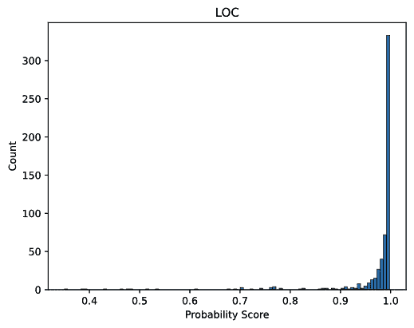

# 第十四章：如果系统不工作该怎么办

在本章中，我们将讨论如何改进系统。如果原始模型的第一轮训练未能产生令人满意的性能，或者系统所解决的真实世界场景发生变化，我们需要修改一些内容以增强系统的性能。在本章中，我们将讨论如添加新数据和更改应用程序结构的技术，同时确保新数据不会降低现有系统的性能。显然，这是一个大课题，我们有很多探索提高**自然语言理解**（**NLU**）系统性能的空间。在这里不可能涵盖所有可能性，但本章应该能给您一个关于最重要的可以提高系统性能的选项和技术的良好视角。

我们将在本章中涵盖以下主题：

+   弄清楚系统不起作用

+   修复准确性问题

+   进入部署阶段

+   部署后的问题

第一步是弄清楚系统是否运行得不如预期。本章将包括一些有助于此的工具示例。我们将从列出运行这些示例所需的软件要求开始。

# 技术要求

我们将使用以下数据和软件来运行本章的示例：

+   我们通常的开发环境——即 Python 3 和 Jupyter Notebook

+   TREC 数据集

+   我们将用于显示图表的 Matplotlib 和 Seaborn 包

+   用于数据的数值操作的 pandas 和 NumPy

+   以前在*第十一章*和*第十三章*中使用的 BERT 自然语言理解系统

+   用于与 BERT 一起工作的 Keras 机器学习库

+   NLTK，我们将用它来生成新数据

+   我们将用于访问 OpenAI 工具的 OpenAI API 密钥

# 弄清楚系统不起作用

弄清楚系统是否运行得不如预期同样重要，无论是在初步开发阶段还是在持续部署期间。我们将从初步开发阶段的性能不佳开始。

## 初始开发

我们将使用我们在*第十三章*中学到的评估技术来确定我们的系统是否达到了我们想要的效果。我们将在本章中应用这些技术。我们还将使用混淆矩阵来检测不如其他类别表现好的特定类别。

在开始时查看数据集并检查类别的平衡总是一个好主意，因为不平衡的数据是问题的常见来源。不平衡的数据并不一定意味着会出现准确性问题，但了解我们的类别平衡在开始阶段是有价值的。这样，我们将能够在系统开发进展中准备好解决由类别不平衡引起的准确性问题。

### 检查类别平衡

对于本章的数据探索，我们将使用**文本检索大会**（**TREC**）数据集，这是一个常用的多类别分类数据集，可以从 Hugging Face 下载（[`huggingface.co/datasets/trec`](https://huggingface.co/datasets/trec)）。

数据集引用

*学习问题分类器*，李欣和丹·罗斯，*{COLING} 2002:* *第十九届国际计算语言学大会*，2002，[`www.aclweb.org/anthology/C02-1150`](https://www.aclweb.org/anthology/C02-1150)

)

*面向语义的答案定位*，霍维（Eduard Hovy）、格伯（Laurie Gerber）、赫姆贾科布（Ulf Hermjakob）、林进伟（Chin-Yew Lin）和拉维昌德兰（Deepak Ravichandran），*第一届国际人类语言技术研究大会论文集*，2001，[`www.aclweb.org/anthology/H01-1069`](https://www.aclweb.org/anthology/H01-1069)

)

数据集包含 5,452 个用户可能向系统提问的训练样本和 500 个测试样本。分类任务的目标是识别问题的一般主题，这是回答问题的第一步。问题主题分为两个级别，包括六个广泛类别和 50 个更具体的子类别，这些子类别属于更广泛的主题。

我们将处理广泛类别，具体如下：

+   缩写 (`ABBR`)

+   描述 (`DESC`)

+   实体 (`ENTY`)

+   人类 (`HUM`)

+   位置 (`LOC`)

+   数字 (`NUM`)

在开始时，一个重要任务是找出每个类别中有多少文档。我们希望了解各个类别是否都有足够的文本进行有效训练，以及没有类别明显多于或少于其他类别。

到目前为止，在本书中我们已经看到许多加载数据集的方法。加载数据集的最简单方法之一是将数据组织成文件夹，每个类别都有单独的文件夹。然后，我们可以使用`tf.keras.utils.text_dataset_from_directory()`函数加载数据集，这是我们在前几章中多次使用的，并查看类别名称。如下代码所示：

```py
# find out the total number of text files in the dataset and what the classes are
import tensorflow as tf
import matplotlib.pyplot as plt
import pandas as pd
import seaborn as sns
import numpy as np
training_ds = tf.keras.utils.text_dataset_from_directory(
    'trec_processed/training')
class_names = training_ds.class_names
print(class_names)
Found 5452 files belonging to 6 classes.
['ABBR', 'DESC', 'ENTY', 'HUM', 'LOC', 'NUM']
```

然后我们可以使用以下代码统计每个类别中文件的数量，并利用`matplotlib`和`seaborn`图形库将它们显示为条形图：

```py
files_dict = {}
for class_name in class_names:
    files_count = training_ds.list_files(
        'trec_processed/training/' + class_name + '/*.txt')
    files_length = files_count.cardinality().numpy()
    category_count = {class_name:files_length}
    files_dict.update(category_count)
# Sort the categories, largest first
from collections import OrderedDict
sorted_files_dict = sorted(files_dict.items(),
    key=lambda t: t[1], reverse=True)
print(sorted_files_dict)
# Conversion to Pandas series
pd_files_dict = pd.Series(dict(sorted_files_dict))
# Setting figure, ax into variables
fig, ax = plt.subplots(figsize=(20,10))
# plot
all_plot = sns.barplot(x=pd_files_dict.index,
    y = pd_files_dict.values, ax=ax, palette = "Set2")
plt.xticks(rotation = 90)
plt.show()
[('ENTY', 1250), ('HUM', 1223), ('ABBR', 1162),
     ('LOC', 896), ('NUM', 835), ('DESC', 86)]
```

虽然这段代码将每个类别中文本的数量输出为文本，但将总数以条形图的形式呈现也非常有帮助。我们可以使用图形库来创建该图：


图 14.1 – TREC 数据中的粗粒度类别计数

如*图 14.1*所示，`DESC`类的数量远小于其他类别，可能会出现该类别的准确性问题。解决这一问题的方法是本章的主要话题之一，但目前为止，我们不会做出任何更改，直到发现这一问题确实导致了困难。

### 进行初步评估

一旦完成了初步的探索，我们将尝试为数据训练一个或多个初始模型，并使用我们在*第十三章*中学到的一些技术来评估它们。

在这个探索中，我们将使用在*第十三章*中介绍的基于 BERT 的训练过程，因此我们不会在这里重复。然而，由于我们现在处理的是一个*类别*分类问题（六个类别），而不是二分类问题（两个类别），因此模型中有一些变化需要注意。我们可以在下面的代码中看到新的模型定义：

```py
def build_classifier_model():
    text_input = tf.keras.layers.Input(shape=(),
        dtype=tf.string, name='text')
    preprocessing_layer = hub.KerasLayer(
        tfhub_handle_preprocess, name='preprocessing')
    encoder_inputs = preprocessing_layer(text_input)
    encoder = hub.KerasLayer(tfhub_handle_encoder,
        trainable=True, name='BERT_encoder')
    outputs = encoder(encoder_inputs)
    net = outputs['pooled_output']
    net = tf.keras.layers.Dropout(0.1)(net)
    net = tf.keras.layers.Dense(6, activation =
        tf.keras.activations.softmax,
        name='classifier')(net)
    return tf.keras.Model(text_input, net)
```

在模型定义中，需要为类别任务进行的两个更改是最终层，它有六个输出，分别对应六个类别，并且使用了 softmax 激活函数，而不是我们在二分类问题中使用的 sigmoid 激活函数。

处理类别数据所需的其他更改是损失函数和指标的更改，如下面的代码所示：

```py
loss="sparse_categorical_crossentropy"
metrics = tf.metrics.CategoricalAccuracy()
```

在这里，我们将定义类别损失和评估指标函数。虽然还有其他指标可以使用，但我们这里只看准确率。

在训练模型之后，正如我们在*第十三章*中所做的那样，我们可以查看最终得分。如果模型未能满足应用程序的整体性能预期，使用所选指标，你可以尝试不同的超参数设置，或者尝试其他模型。这是我们在*第十三章*中遵循的过程，我们比较了三种不同模型在电影评论数据上的表现。

记住，较大的模型可能会有更好的表现，你可以尝试增加模型的规模。这个策略是有限的——到某个时候，较大的模型会变得非常慢且难以使用。你也可能会看到，越来越大的模型带来的回报变得越来越小，性能趋于平稳。这可能意味着，增加模型的大小并不能解决问题。

有许多不同的可能性可以考虑不同的超参数设置。通常来说，这是一个巨大的搜索空间，无法完全探索，但你可以使用一些启发式方法来找到可能改善结果的设置。查看训练历史图表中损失和准确率随训练轮次变化的情况，可以帮助你判断是否需要更多的训练轮次。还可以探索不同的批量大小、学习率、优化器和丢弃层。

诊断系统性能的另一种策略是直接查看数据本身。

我们可以进行的一项初步评估是通过查看数据集中大量项目的分类概率，进行更细致的弱类别检查。我们将在下一节讨论这个问题。

### 检查弱类

类别项的低概率是系统无法以高信心对项进行分类并且有很大可能会出错的标志。为了检查这一点，我们可以使用模型预测数据子集的分类，并查看平均得分，如下代码所示：

```py
import matplotlib.pyplot as plt
import seaborn as sns
scores = [[],[],[],[],[],[]]
for text_batch, label_batch in train_ds.take(100):
    for i in range(160):
        text_to_classify = [text_batch.numpy()[i]]
        prediction = classifier_model.predict(
            text_to_classify)
        classification = np.max(prediction)
        max_index = np.argmax(prediction)
        scores[max_index].append(classification)
averages = []
for i in range(len(scores)):
    print(len(scores[i]))
    averages.append(np.average(scores[i]))
print(averages)
```

这段代码遍历了 TREC 训练数据的一个子集，预测每个项的类别，将预测的类别保存在`classification`变量中，然后将其添加到预测类的`scores`列表中。

代码的最后一步是遍历得分列表，并打印每个类别的项数和平均得分。结果显示在*表 14.1*中：

| **类别** | **项数** | **平均得分** |
| --- | --- | --- |
| `ABBR` | 792 | 0.9070532 |
| `DESC` | 39 | 0.8191106 |
| `HUM` | 794 | 0.8899161 |
| `ENTY` | 767 | 0.9638871 |
| `LOC` | 584 | 0.9767452 |
| `NUM` | 544 | 0.9651737 |

表 14.1 – 各个类别的项数和平均得分

从*表 14.1*中可以看出，各个类预测的项数和平均概率差异较大。正如你从*图 14.1*中所回忆的那样，我们已经对`DESC`类感到担忧，因为它相对于其他类非常小。我们可以通过以下代码进一步调查每个类中单独项的预测分类：

```py
def make_histogram(score_data,class_name):
    sns.histplot(score_data,bins = 100)
    plt.xlabel("probability score")
    plt.title(class_name)
    plt.show()
for i in range(len(scores)):
    make_histogram(scores[i],class_names[i])
```

我们来看一下`DESC`和`LOC`类的直方图，它们位于平均得分的极端。`LOC`类显示在*图 14.2*中：



图 14.2 – LOC 类的概率得分分布

我们可以在*图 14.2*中看到，不仅平均概率非常高（我们在*表 14.1*中也看到了这一点），而且在`LOC`类下的概率也很少。这个类在部署应用中可能非常准确。

显示*图 14.2*中的模式的类有一个第二个、不太明显的优点。在部署的交互式应用程序中，我们不希望系统给用户提供它不太自信的答案。这是因为这些答案更可能是错误的，会误导用户。因此，开发人员应该定义一个*阈值*概率得分，只有当答案超过这个阈值时，系统才会提供该答案给用户。

如果概率低于阈值，系统应向用户反馈“不知道答案”。阈值的设定应由开发人员基于给用户错误答案的风险和频繁说*我不知道*而让用户感到烦恼的风险之间的权衡来决定。在*图 14.2*中我们可以看到，如果将阈值设置为**0.9**，系统就不需要频繁说*我不知道*，这将提升用户对系统的满意度。

让我们将*图 14.2*与`DESC`类别的直方图进行对比，后者可以在*图 14.3*中看到：


图 14.3 – DESC 类别的概率得分分布

*图 14.3*显示了许多小于`DESC`类别的概率得分，这在部署时可能会成为问题。

如我们在*第十三章*中回顾的混淆矩阵，也可以帮助检测表现不佳的类别。我们可以使用以下代码生成 TREC 数据的混淆矩阵：

```py
y_pred = classifier_model.predict(x_test)
y_pred = np.where(y_pred > .5, 1,0)
print(y_pred)
print(y_test)
predicted_classes = []
for i in range(len(y_pred)):
    max_index = np.argmax(y_pred[i])
    predicted_classes.append(max_index)
# View the results as a confusion matrix
from sklearn.metrics import confusion_matrix,ConfusionMatrixDisplay,f1_score,classification_report
conf_matrix = confusion_matrix(y_test,predicted_classes,
    normalize=None)
```

这段代码从测试数据（由`predicted_classes`变量表示）生成预测的类别，并将其与真实类别（由`y-test`变量表示）进行比较。我们可以使用 scikit-learn 的`confusion_matrix`函数来显示混淆矩阵，如下所示：

```py
# Displaying the confusion matrix
import matplotlib.pyplot as plt
plt.rcParams.update({'font.size': 12})
disp = ConfusionMatrixDisplay(confusion_matrix =
    conf_matrix, display_labels = class_names)
print(class_names)
disp.plot(xticks_rotation=75,cmap=plt.cm.Blues)
plt.show()
```

我们可以在*图 14.4*中看到生成的混淆矩阵。混淆矩阵告诉我们每个类别被预测为其他类别（包括自身）的频率：


图 14.4 – TREC 测试集的混淆矩阵

正确的预测可以在主对角线看到。例如，`ABBR`被正确预测为`ABBR` *137*次。我们还可以看到每个类别的预测错误。最常见的错误是将`ENTY`错误分类为`ABBR` *11*次。在这个特定的例子中，我们没有看到很多证据表明某些类别会互相混淆，尽管`ENTY`与`ABBR`之间存在一定的混淆倾向。

最后，我们可以查看分类报告，了解每个类别的`precision`、`recall`和`F1`得分，以及整个测试集的平均得分。在分类报告中，`DESC`和`ENTY`的召回率低于其他类别，这反映出这些类别中的一些项被错误地识别为`ABBR`：

```py
print(classification_report(y_test, predicted_classes, target_names = class_names))
['ABBR', 'DESC', 'ENTY', 'HUM', 'LOC', 'NUM']
              precision    recall  f1-score   support
        ABBR       0.90      0.99      0.94       138
        DESC       1.00      0.78      0.88         9
        ENTY       0.97      0.80      0.88        94
         HUM       0.97      0.97      0.97        65
         LOC       0.96      0.98      0.97       113
         NUM       0.94      0.96      0.95        81
    accuracy                           0.94       500
   macro avg       0.96      0.91      0.93       500
weighted avg       0.94      0.94      0.94       500
```

需要指出的是，系统是否*足够好*的决定实际上取决于应用场景和开发者的决策。在某些应用中，即使结果可能是错误的，向用户提供一些结果更为重要；而在其他应用中，确保每个结果都是正确的很重要，即使系统几乎总是需要说*我不知道*。回到我们在*第十三章*中讨论的精准度和召回率的概念，换句话说，在某些应用中，召回率更为重要，而在其他情况下，精准度更为重要。

如果我们想提高 TREC 应用程序的性能，下一步是决定如何解决我们的性能问题并提高整体准确性。

# 修复准确性问题

在这一节中，我们将通过两种策略来解决性能问题。第一种策略涉及通过更改数据来解决的问题，第二种策略则是涉及需要重构应用程序的问题。通常来说，更改数据较为容易，而且如果保持应用程序结构不变很重要——即我们不想删除类或引入新类——那么这是一种更好的策略。我们将先讨论更改数据，然后再讨论重构应用程序。

## 更改数据

更改数据可以大大提升系统性能；然而，你并不总是能有这个选择。例如，如果你使用的是标准数据集并打算将其与其他研究者的工作进行比较，那么你可能无法控制数据集。在这种情况下，你不能更改数据，因为这样一来，你的系统性能就无法与其他研究者的成果进行比较。如果你的系统性能不令人满意，但又无法更改数据，那么唯一的选择就是通过使用不同的模型或调整超参数来改进算法。

另一方面，如果你处理的是可以控制的数据集的应用，那么更改数据可以是提升系统性能的一个非常有效的方法。

许多性能问题是由于数据不足，无论是整体数据不足还是某些特定类别的数据不足。其他性能问题则可能由于标注错误导致。我们将先简要讨论标注错误。

### 标注错误

系统在监督学习应用中性能不佳，可能是由于标注错误。换句话说，数据的监督是错误的，系统被训练去做错误的事情。也许标注员不小心将某些数据分配到了错误的类别。如果这些数据是训练数据，那么错误类别的数据会使得模型的准确性降低；如果数据是测试数据，模型会因错误而给出不正确的评分。

通过查看数据集中的每个项目的标注来检查偶尔出现的标注错误可能非常耗时，而且不太可能对系统的改进产生太大影响。这是因为如果数据集足够大，这种零星的错误不太可能对整体系统的质量产生显著影响。然而，如果你怀疑标注错误正在导致问题，检查低置信度项的简单方法可能会有所帮助，而不需要检查每个标注。你可以使用我们在*检查弱类别*部分使用的代码变体来检查弱类别。在那段代码中，我们预测了数据集中每个项的类别，跟踪了其概率（得分），并计算了该类别中所有项的概率平均值。要修改代码以查找低概率的单个项，你可以单独记录每个项目及其概率，然后在最终列表中查找低概率项。鼓励你自己尝试这个练习。

另一方面，数据中也可能不仅包含偶尔的错误，还包括系统性的标注错误。系统性错误可能是由于标注者对类别含义的理解存在差异，导致不同标注者将相似的项分配到不同的类别。理想情况下，通过在标注过程开始之前为标注者准备明确的标注指南，或者通过为他们提供培训课程，可以避免或至少减少这类错误。

像*kappa*统计量这样的工具，可以衡量标注者之间的标注差异。如果 kappa 统计量显示标注者之间存在较大差异，则可能需要重新标注某些数据，并使用明确的指南进行标注。也可能发生无法让标注者达成一致的情况，因为标注者必须做出的决策本质上过于主观，无论提供多少指导，都难以达成一致。这表明问题本身可能不适合自然语言理解（NLU），因为此数据可能没有一个真正正确的分类。

然而，假设我们确实存在客观分类问题，除了处理标注错误外，我们还可以通过创建更平衡的数据集来提高系统性能。为此，我们将首先考虑从各个类别中添加和移除现有数据。

### 从类别中添加和移除现有数据

不同类别之间的数据不平衡是常见的情况，可能导致模型性能较差。数据集不平衡的主要原因是这种不平衡代表了应用领域中的实际情况。例如，应该检测在线仇恨言论的应用程序，很可能会遇到比实际仇恨言论更多的非仇恨言论，但找到仇恨言论仍然很重要，尽管它们比较稀少。另一个自然不平衡数据集的例子是银行应用程序，我们会发现有关支票账户余额的言论远多于更改账户地址的言论。与检查余额相比，账户地址的更改发生得非常少。

有几种方法可以使各类的大小更加均衡。

两种常见的方法是复制小类中的数据或从大类中删除数据。添加数据称为**过采样**，而删除数据称为**欠采样**。过采样的明显方法是随机复制一些数据实例并将它们添加到训练数据中。同样，你也可以通过随机删除过多类中的实例来进行欠采样。还有其他更复杂的欠采样和过采样方法，你可以在网上找到很多关于这些话题的讨论 —— 例如，在这里：[`www.kaggle.com/code/residentmario/undersampling-and-oversampling-imbalanced-data`](https://www.kaggle.com/code/residentmario/undersampling-and-oversampling-imbalanced-data)。然而，我们在这里不做进一步讨论，因为它们可能会变得相当复杂。

欠采样和过采样可以是有帮助的，但你应该明白它们需要谨慎使用。例如，在 TREC 数据集中，试图将五个频繁出现的类别进行欠采样，使它们不超过`DESC`类的实例数量，这将需要丢弃来自大类的数百个实例，并且这些实例包含了有价值的信息。同样，将一个小类如`DESC`进行过采样，使其实例数与大类相同，意味着`DESC`文本将有许多重复实例。这可能导致模型在`DESC`示例上发生过拟合，从而使模型难以对新测试数据进行泛化。

很容易看出，虽然欠采样和过采样可能有用，但它们并不是自动的解决方案。当类别之间的大小差异不极端，并且即使是最小的类别中也有大量示例时，它们可能最为有效。你还应该记住，系统表现良好并不意味着类别必须完全平衡。

另一种添加数据的方法是创建新数据，我们将在下一节中讨论。

### 生成新数据

如果你的数据集有代表性不足的类别，或者总体数据集过小，你也可以将生成的数据添加到整个数据集中，或仅添加到较小的类别中。我们将探讨以下三种方法来实现这一点：

+   从规则生成新数据

+   从大语言模型（LLMs）生成新数据

+   使用人群工人获取新数据

#### 从规则生成新数据

创建新数据的一种方式是编写规则，基于已有的数据生成新的数据示例。例如，`restaurant search` 类别。你可以编写一个 `parse` 库：

```py
from nltk.parse.generate import generate
from nltk import CFG
grammar = CFG.fromstring("""
S -> SNP VP
SNP -> Pro
VP -> V NP PP
Pro -> 'I'
NP -> Det Adj N
Det -> 'a'
N -> 'restaurant' | 'place'
V -> 'am looking for' | 'would like to find'
PP -> P Adv
P -> 'near'| 'around'
Adv -> 'here'
Adj -> 'Japanese' | 'Chinese' | 'Middle Eastern' | 'Mexican'
for sentence in generate(grammar,n = 10):
    print(" ".join(sentence))
```

请注意，NLTK CFG 中的规则可以是任何上下文无关规则；它们不必对应实际的语言学类别。例如，我们本可以将最后的规则命名为 Adj_Cuisine。如果我们希望能够生成带有其他形容词的句子，比如 `good` 或 `low-priced`，我们可能会这么做。规则名称和规则本身对 NLTK CFG 包没有影响；唯一重要的是 CFG 必须以 NLTK CFG 包所期望的语法书写。名称和规则可以是任何便于生成新示例的规则。

上述代码中的最后两行将从该语法生成 10 个句子示例，结果如下：

```py
I am looking for a Japanese restaurant near here
I am looking for a Japanese restaurant around here
I am looking for a Japanese place near here
I am looking for a Japanese place around here
I am looking for a Chinese restaurant near here
I am looking for a Chinese restaurant around here
I am looking for a Chinese place near here
I am looking for a Chinese place around here
I am looking for a Middle Eastern restaurant near here
I am looking for a Middle Eastern restaurant around here
```

如果你想生成这些规则的所有可能句子，可以省略参数 `n=10`。

这是生成大量句子的快速方法，但正如你所看到的，句子非常重复。这是因为 NLTK `generate` 方法会生成语法所覆盖的每个可能的句子。将大量重复句子添加到训练集中可能会使模型倾向于这些句子，这反而可能使得模型更难识别更为多样化的餐厅查询句子。从 NLTK CFG 获取更广泛句子的一种方法是编写更广泛的语法，生成它覆盖的所有句子，然后随机选择一部分生成的句子加入训练集。

使用 **大语言模型**（**LLMs**）生成新示例是另一个有用且简单的选择，我们将在接下来的章节中讨论这个选项。

#### 从大语言模型（LLMs）生成新数据

在线 LLM，如 ChatGPT，是获取更多训练数据的另一种非常好的方式，因为你可以简单地要求它们生成适当的训练数据。例如，假设 ChatGPT 收到以下提示：

*生成 20 条请求，查找不同菜系和* *价格范围的本地餐厅*

ChatGPT ([chat.openai.com/chat](https://chat.openai.com/chat)) 将生成以下答案：


图 14.5 – ChatGPT 生成的餐厅查询数据

（为了简洁，未显示所有结果。）

你可以看到，这些句子比 NLTK 的 `generate` 方法生成的句子要少很多重复。在最初的 ChatGPT 提示中，你还可以限制问题的风格——例如，你可以要求生成的查询问题采用非正式风格。这样就会生成像以下这样的非正式句子：


图 14.6 – ChatGPT 生成的餐厅查询数据，风格为非正式

你还可以通过改变 ChatGPT API 中的 *temperature* 参数来控制回应之间的变化性。温度设置的范围从零到二不等。温度为零时，回应的变化性较小；温度较高时，回应的变化性较大。

在 ChatGPT 中，低温度意味着生成模型会从高概率的词汇中选择下一个词，而高温度意味着模型会从概率较低的词汇中选择下一个词。高温度设置的结果会产生更多样化的回应，但其中一些回应可能不太合理。*图 14.7* 展示了如何直接从 API 中的代码设置温度。


图 14.7 – 使用 OpenAI API 设置 GPT 温度

*图 14.7* 中的代码将 `temperature` 参数的值设置为 `1.5`，这会生成相当多样化的响应。你可以在 *图 14.7* 的底部看到这些响应。该代码还将 `model` 参数设置为使用 `gpt-3.5-turbo` 模型，并在 `messages` 参数中设置要发送的消息。如果你有兴趣尝试其他 GPT API 调用，可以在 OpenAI API 文档中找到其他 API 参数，网址为 [`platform.openai.com/docs/api-reference`](https://platform.openai.com/docs/api-reference)。

请注意，你需要在第 3 行设置 `openai.api_key` 变量为你自己的 OpenAI 用户密钥才能运行此代码，因为 OpenAI API 是一项付费服务。

如果你使用 LLM 来生成数据，请务必检查结果，并决定这些回应是否代表用户可能实际说出的例子，因此是否应包含在你的训练数据中。例如，*图 14.6* 中的一些非正式请求可能比许多用户对聊天机器人的提问更为随意。

最后一种向数据不足的类别添加新数据的方法是雇佣众包工作者来创建更多数据。

#### 使用众包工作者获取新数据

从众包工作者获取更多数据既费时又可能昂贵，具体取决于你需要多少数据以及数据的复杂程度。然而，如果使用其他方法未能获得足够的数据，这仍然是一个可行的选项。

当然，我们在本节中概述的所有方法（使用规则、使用 LLMs 和使用众包工人）是可以组合使用的——所有的新训练数据不必都来自同一个地方。

另一种类似于改变数据的方法是改变应用程序本身，我们将在下一节讨论这一点。

## 重构一个应用程序

在某些情况下，预测不良的类的最佳解决方案是重构应用程序。与改变数据一样，如果这是一个研究社区用于不同实验室之间比较工作的标准数据集，你可能没有这个选项，因为应用程序必须与其他研究者使用的结构相同，才能确保结果具有可比性。

如果你确实能够控制应用程序结构，你可以添加、删除或合并表现不佳的类。这可以大大提高整体应用程序性能。我们先通过一个需要重构的应用程序的人工示例来看看，这种重构可能采取的不同方式。

### 可视化重构类的需求

可视化数据集通常可以立即提供潜在性能问题的洞察。我们可以通过几种方式可视化数据集中相似类之间的关系。

首先，像*图 14.4*中的混淆矩阵是了解哪些类彼此相似并因此容易互相混淆的好信息来源。我们从*图 14.4*中可以立刻看到，`ENTY`和`DESC`经常与`ABBR`混淆。我们可能需要增加这些类的数据，如前一节所述，或者我们也可以考虑重构应用程序，我们将在接下来的部分讨论这个问题。

第二种可视化技术是使用我们在*第十二章*中看到的主题建模技术，来查看应用程序结构的问题。

*图 14.8*展示了如果我们基于*第十二章*中的**Sentence Bert**和**BERTopic**工具对四个类进行聚类，人工构建的数据集可能是什么样子。我们可以立即看到该数据集中类的分布存在一些问题。


图 14.8 - 使用人工生成数据对四个类进行无监督聚类

首先，**Class 1**的实例，用圆圈表示，似乎聚集成了两个不同的类，一个集中在点(*0.5, 0.5*)，另一个集中在点(0.5, 1.75*)。如果这些聚类真的如此不同，它们不应该都被归为同一类。因此，**Class 1**可能需要拆分，目前分配给 Class 1 的实例应该被分配到至少两个，甚至可能是三个新类。

**Class 2**（用方形表示）和**Class 3**（用三角形表示）似乎存在问题。它们并不是完全混合在一起，但也没有完全分开。由于它们之间的相似性，可能有些实例会被错误分类。如果你看到像**Class 3**和**Class 4**这样的类，存在这种重叠情况，考虑是否应合并这些类，特别是它们在意义上看起来相似（如果它们在意义上不相似，考虑向一个或两个类中添加更多数据）。最后，**Class 4**（用星形表示）是紧凑的，并且没有与其他类重叠，应该不需要任何调整。

现在，让我们来看一下三种重构选项——合并类、划分类和引入新类。

### 合并类

比其他类小得多的类可以与其他语义上相似的类合并，特别是当它们经常与这些类混淆时。这可能是一种很好的策略，因为在许多实际应用中，有些类的出现频率非常低，但与前面提到的仇恨言论示例不同，通常并不是必须能区分这些原始类。当然，这只有在多类问题的情况下才可行——即，有两个以上类的问题——因为在二分类（两个类）问题中合并类会把所有内容归为一个类，导致没有东西可以分类。

在某些情况下，通过将一个类的所有数据添加到另一个类的数据中，可以实现类的合并，这是我们能做的最简单的重构。如果新的结构更加复杂——例如，涉及添加插槽——那么可以进行稍微复杂一点的类合并。例如，像**Class 2**和**Class 3**在*Figure 14**.8*中，实际上可能没有足够的不同，无法值得尝试分开。

举个例子，假设我们在开发一个通用的个人助手应用程序，类如`play music`、`find a restaurant`、`get weather forecast`、`find a bookstore`和`find a bank`。可能出现的情况是，`find a restaurant`的数据比`find a bookstore`多得多，结果导致`find a bookstore`常常与`find a restaurant`混淆。在这种情况下，值得考虑是否应该将所有的`find a`类合并为一个更大的类。这个类可以被命名为`local business search`，其中`bookstore`、`restaurant`和`bank`被视为插槽，正如在*Chapter 9*中讨论的那样。

另一种策略是将像**Class 1**在*Figure 14**.5*中那样的类分成两个不同的类。下一节将讨论划分类。

### 划分类

有时，如果一个大类别内部出现了系统性的差异，可能有意义将这个大类别划分为若干个较小的类别。像 BERTopic 这样的工具可以帮助建议新类别的名称，如果通过查看每组中的实例不能直观地得出新名称。不幸的是，将一个类别划分为新类别并不像合并类别那么容易，因为新类别中的实例需要用新的名称重新标注。虽然重新标注工作量更大，但如果你需要将一个大类别划分为更有意义的新类别，那么划分和重新标注类别是必要的。

### 引入“其他”类别

引入`其他`类别是合并类别策略的一个变体。如果有几个小类别，它们没有足够的训练数据来可靠地进行分类，那么有时将它们归为一个`其他`类别是有用的——即，包含那些不符合任何其他类别的项目的类别。这种方法对某些应用场景很有用，例如电话自助服务应用中的呼叫路由。

在这些应用中，有时会有数百个目的地可以路由电话。在几乎每个此类应用中，都有一些不常见的类别，它们的数据量远少于其他类别。有时，最好不要尝试识别这些类别，因为在可用的数据量很少的情况下，准确地识别它们将非常困难。一个更好的策略是将它们归为一个`其他`类别。尽管在`其他`类别中的项目可能很难识别，因为它包含的项目之间差异很大，但它可以防止这些项目干扰整体应用的准确性。如何处理`其他`类别中的项目取决于具体应用的目标，常见的处理方式包括人工处理（例如，通过人工呼叫中心代理）或直接告诉用户系统无法处理他们的问题。

在初始开发过程中识别并解决准确性问题后，就可以部署系统了。

# 向部署阶段过渡

如果我们已经解决了到目前为止讨论的性能问题，那么我们就已经训练了一个符合我们性能预期的模型，可以进入部署阶段，在这个阶段，系统会被安装并执行其设计的任务。像任何软件一样，已部署的自然语言理解（NLU）模型可能会遇到系统和硬件问题，例如网络问题、可扩展性问题以及一般的软件问题。我们不会讨论这些问题，因为它们并不特定于 NLU。

下一节将讨论解决部署后 NLU 性能问题的考虑事项。

# 部署后的问题

开发并在应用中实施 NLU 系统后，仍需要进行监控。一旦系统达到可接受的性能水平并已部署，就可能会诱使人们不再关注它并假设它不需要进一步关注，但事实并非如此。至少，部署的系统将接收到持续的新数据流，如果这些数据与训练数据有所不同，则可能对现有系统构成挑战。另一方面，如果数据没有变化，则可以用作新的训练数据。显然，最好通过内部测试检测性能问题，而不是从负面客户反馈中了解这些问题。

从高层次来看，我们可以将新的性能问题看作是由系统本身的变化或部署环境的变化所导致的。

由于系统变更导致的系统性能变化应在新系统部署之前进行测试检测。这种测试与任何软件部署所需的测试非常相似，因此我们不会详细讨论它。通过对系统进行版本控制，并在每次变更后使用固定的数据集和指标进行评估，可以检测到性能下降。这不仅有助于检测性能下降，还有助于记录性能改进。

就像任何基于机器学习的系统一样，新数据可能会对 NLU 系统造成问题，因为它在某些重要方面与训练数据不同。这些差异通常是由部署环境的变化引起的。

我们所说的**部署环境的变化**是指应用程序的所有内容，除了 NLU 系统本身。具体来说，它可能包括用户、其人口统计信息、地理位置、提供的后端信息，甚至世界上的事件，比如天气。这些因素中的任何一个都可以改变应用程序处理的文本特征。这些变化会改变训练数据和正在处理的新数据之间的对应关系，从而导致性能下降。

一些部署环境的变化是可以预测的。例如，如果公司推出新产品，这将引入新的词汇，客户支持聊天机器人、语音助手或电子邮件路由器需要识别，毕竟我们期望客户讨论它。在类似引入新产品的变化后，最佳实践是对新数据进行评估，并决定是否应使用额外数据对系统进行重新训练。

另一方面，有些变化是无法预测的——例如，COVID-19 疫情引入了大量新的词汇和概念，医学或公共卫生领域的 NLU 应用需要对此进行训练。由于某些部署环境的变化是无法预见的，因此定期使用从部署中获得的新数据进行评估是一个好主意。

# 总结

在本章中，你已经学习了许多提高自然语言理解（NLU）应用性能的重要策略。首先，你学习了如何对数据进行初步调查并识别训练数据中的潜在问题。然后，你学习了如何发现并诊断准确性方面的问题。接着，我们介绍了不同的性能提升策略——具体来说，包括增加数据和重构应用程序。最后，我们讨论了已部署应用程序中可能出现的问题及其解决方法。

在最后一章中，我们将概述本书内容并展望未来。我们将讨论在 NLU 性能的最新技术中有哪些提升的潜力，以及更快速的训练、更具挑战性的应用，并探讨随着新一代大型语言模型（LLM）被广泛应用，NLU 技术将会有什么样的发展。
