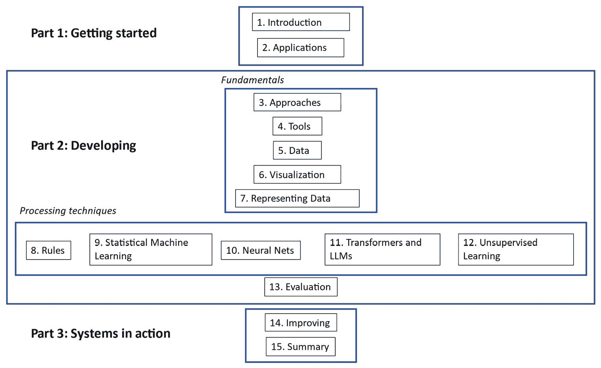
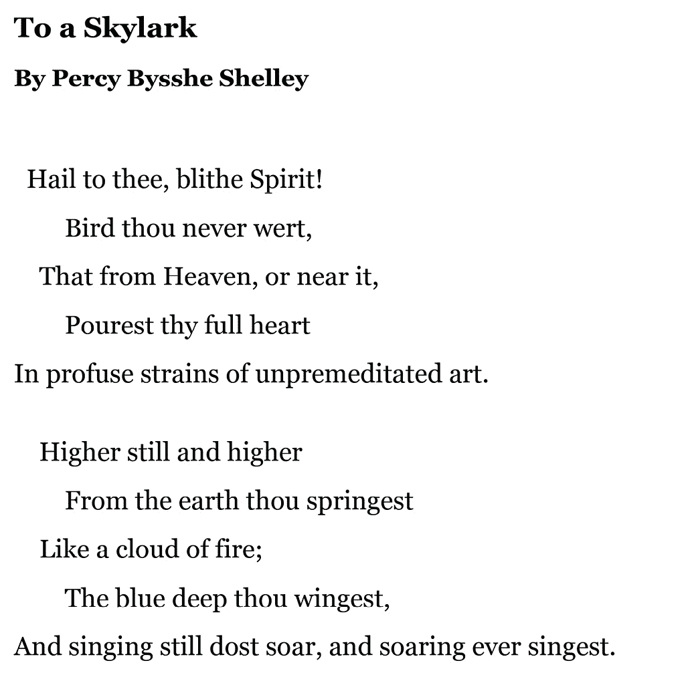
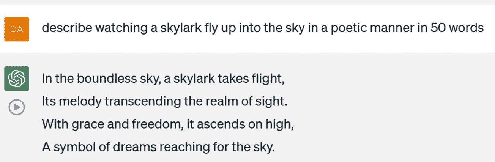

# 第十五章：总结与展望

在本章中，我们将概览本书内容并展望未来。我们将讨论在提高性能、加速训练、更具挑战性的应用程序以及实践系统和研究的未来方向方面的潜力。

本章将涵盖以下主题：

+   本书概述

+   提高准确性和加速训练的潜力

+   其他改进领域

+   超越当前技术水平的应用

+   未来方向

本章的第一部分是本书所涉及主题的整体总结。

# 本书概述

本书介绍了自然语言理解（**NLU**）的基础，这项技术使计算机能够处理自然语言，并将结果应用于各种实际应用中。

本书的目标是通过使用 Python 编程语言提供坚实的自然语言理解（NLU）基础。这一基础不仅能帮助你选择正确的工具和软件库来开发自己的应用程序，还将为你提供所需的背景知识，使你能够独立使用互联网上的各种资源。你可以利用这些资源来扩展你的知识和技能，在进行更高级的项目时跟上快速发展的技术，并保持对新工具的关注，因为这些工具随着技术进步而不断涌现。

本书讨论了三个主要主题：

+   在*第一部分*，我们讨论了背景信息以及如何开始

+   在*第二部分*，我们讲解了实现 NLU 任务的 Python 工具和技术

+   在*第三部分*，我们讨论了一些与管理已部署应用程序相关的实际考虑因素

本书中，我们通过逐步的方法介绍了 NLU 项目的典型阶段，从初步构想到开发、测试，最后到对已部署应用程序的微调。我们可以在*图 15.1*中以图形方式查看这些步骤：

图 15.1 – 本书所涵盖的自然语言理解（NLU）项目生命周期

在*第一部分*，你了解了自然语言理解（NLU）的一般主题以及它可以应用的任务类型。

在*第二部分*中，我们首先讨论了支持最成功的 NLU 应用的基础性主题，如软件开发工具、数据、可视化以及表示 NLU 数据的方法。我们在*第二部分*中覆盖的第二个主题是五种不同的语言处理方法，包括规则、传统机器学习技术、神经网络、变换器和无监督学习。这些主题在*第八章*到*第十二章*的五个章节中进行了讨论，涵盖了 NLU 算法的基础。掌握这些内容将为你提供继续探索 NLU 算法所需的背景知识，超越本书所涵盖的内容。*第二部分*的最后一个主题是非常重要的评估问题。评估对于实际的 NLU 部署和成功的学术研究至关重要。我们在*第十三章*中的评估回顾，涵盖了多种最重要的 NLU 评估工具。有了这些背景，你现在应该能够评估你自己的 NLU 项目。

最后，在*第三部分*中，我们转向了系统应用的话题，并特别在*第十四章*中专注于提升系统性能的方法，涉及系统部署前后的改进措施。

如果你继续从事 NLU 领域的工作，你会发现尽管近年来**大语言模型**（**LLMs**）在许多任务上显著提高了 NLU 系统的表现，但仍然面临许多挑战。

在接下来的两节中，我们将讨论其中的一些挑战，首先从最重要的改进领域——更好的准确性和更快的训练——开始，然后是关于其他改进领域的讨论。

# 改进潜力——更好的准确性和更快的训练

在*第十三章*的开始部分，我们列出了几个可以用来评估自然语言理解（NLU）系统的标准。我们通常首先想到的是准确性——也就是说，给定一个特定的输入，系统是否提供了正确的答案？尽管在某些特定应用中，我们可能最终会决定将另一个标准优先于准确性，但准确性仍然是至关重要的。

## 更好的准确性

正如我们在*第十三章*中看到的，即便是我们表现最好的系统——大型**双向编码器表示的变换器**（**BERT**）模型，在电影评论数据集上的 F1 得分也仅为*0.85*，这意味着有 15%的分类是错误的。基于 LLM 的最新研究系统在该数据集上的准确率报告为*0.93*，但这仍然意味着系统会犯许多错误（SiYu Ding, Junyuan Shang, Shuohuan Wang, Yu Sun, Hao Tian, Hua Wu, and Haifeng Wang. 2021\. *ERNIE-Doc: 一种回顾性长文档建模变换器*）。因此，我们可以看到，准确性的提升仍然有很大的空间。

LLMs 代表了自然语言理解（NLU）领域的最新进展。然而，目前对最新 LLMs 的准确性进行的正式研究较少，因此很难量化它们的效果。有一项研究评估了一个相当具有挑战性的医学信息任务，在该任务中，医生评估了 ChatGPT 回答的准确性。结果发现，ChatGPT 的回答总体上被认为是相当准确的，平均得分为*4.6*（满分为`6`）（Johnson, D., et al. (2023). *评估 AI 生成医学回应的准确性和可靠性：Chat-GPT 模型评估*，Research Square, rs.3.rs-2566942\. [`doi.org/10.21203/rs.3.rs-2566942/v1`](https://doi.org/10.21203/rs.3.rs-2566942/v1)）。然而，该系统仍然存在许多错误，作者提醒医生在使用 ChatGPT 提供的医学建议时，或在当前技术水平下使用任何 LLMs 时，仍需谨慎，并对其进行审查。

更好的准确性始终是 NLU 领域的目标。未来系统中更高准确性的实现将包括开发更大规模的预训练模型以及更有效的微调技术。此外，扩展 LLMs 在最广泛研究语言上的高性能到研究较少的语言也需要大量的工作。

## 更快的训练

通过完成前几章的一些练习，你发现从零开始训练 NLU 模型或对 LLM 进行微调并不会花费超过几个小时的计算时间。为了本书的目的，我们故意选择了较小的数据集，以便你能更快地从训练过程中获得反馈。然而，即便是你可能在实际应用中需要解决的更大问题，训练时间也不应超过几天。另一方面，训练预训练 LLM 可能需要很长时间。有一个估计称，训练 GPT-3 的时间是 355 个 GPU 年，训练数据集包含 3000 亿个标记。在实践中，由于采用多 GPU 并行训练，所需的日历时间有所减少（[`lambdalabs.com/blog/demystifying-gpt-3`](https://lambdalabs.com/blog/demystifying-gpt-3)）。然而，这种训练仍然涉及巨大的计算能力以及相关的成本。

由于大多数预训练模型是由拥有大量计算资源的大型组织训练的，而不是由小型组织或研究人员训练的，因此大型模型的长时间训练并不会直接影响我们大多数人，因为我们将使用由大型组织开发的预训练模型。然而，这些长时间的训练间接地影响了我们，因为长时间的训练意味着新模型和改进模型需要更长时间才能发布供大众使用。

除了更好的准确性和更快的训练时间外，NLU 技术还有其他可以改进的领域。我们将在下一节中回顾其中一些。

## 其他改进领域

我们将在本节中回顾的改进领域，主要与让 NLU 技术在多种方式上更具实用性相关，例如加速开发、减少开发和运行时所需的计算资源。这些话题包括更小的模型、更好的可解释性和更少的微调数据量。

### 更小的模型

我们在*第十一章*和*第十三章*中讨论的 BERT 模型相对较小。选择这些模型的原因是它们可以在相对较短的时间内下载并进行微调。然而，作为经验法则，大型模型的准确性通常会比小型模型更高。但我们不能总是利用大型模型，因为有些模型过大，无法在单个 GPU 上进行微调，正如 TensorFlow 网站指出的那样 ([`colab.research.google.com/github/tensorflow/text/blob/master/docs/tutorials/classify_text_with_bert.ipynb#scrollTo=dX8FtlpGJRE6`](https://colab.research.google.com/github/tensorflow/text/blob/master/docs/tutorials/classify_text_with_bert.ipynb#scrollTo=dX8FtlpGJRE6))。由于较大的模型具有更好的准确性，如果能够在较小的模型上获得高准确性表现，将是非常有帮助的。此外，在许多情况下，大型模型无法适应资源有限的设备，例如手机甚至智能手表。因此，减少模型的大小是 NLU 研究中的一个重要目标。

### 微调所需的更少数据

对于大多数使用预训练模型的 NLU 应用，预训练模型需要通过应用特定数据进行微调。我们在*第十一章*和*第十三章*中讨论过这一过程。显然，减少微调系统所需的数据量将缩短微调系统的开发时间。例如，在讨论如何微调 GPT-3 的过程中，OpenAI 提到，“*你拥有的训练示例越多越好。我们建议至少准备几百个示例。通常，我们发现每次数据集大小翻倍都会带来模型质量的线性提升*”([`platform.openai.com/docs/guides/fine-tuning`](https://platform.openai.com/docs/guides/fine-tuning))。正如我们在*第五章*中学到的，寻找和标注数据的过程可能既耗时又昂贵，因此显然希望最小化这一工作量。

### 可解释性

在大多数情况下，基于机器学习的自然语言理解（NLU）系统的结果通常只是一个数字，例如文本属于模型训练时所设定类别的概率。我们没有简便的方法来理解系统是如何得出这个答案的，也无法判断答案是正确还是错误。如果答案是错误的，我们可以通过添加更多的数据、调整超参数，或者使用我们在*第十四章*中回顾的一些其他技术来尝试改善模型，但我们很难理解系统究竟为什么会得出错误的答案。

相比之下，如果是基于规则的系统（例如我们在*第八章*中讨论过的那些）发生错误，通常可以追溯到某条不正确的规则，并对其进行修正。然而，由于几乎所有当前的系统都基于机器学习方法，而不是基于规则，因此很难理解它们是如何得出当前答案的。然而，用户通常需要理解系统是如何得出结果的。如果用户不了解系统是如何得出答案的，他们可能不会信任该系统。如果系统给出了错误的答案，或者给出了用户无法理解的正确答案，都可能会削弱用户对系统的信任。因此，NLU 和 AI 领域的可解释性是一个重要的研究课题。你可以在[`en.wikipedia.org/wiki/Explainable_artificial_intelligence`](https://en.wikipedia.org/wiki/Explainable_artificial_intelligence)上阅读更多相关内容。

### 信息的时效性

在 *第十四章*中，我们讨论了部署环境的变化如何导致系统错误。新产品名称、新电影，甚至是重大新闻事件的引入，可能导致系统无法回答用户的问题，甚至给出错误的答案。由于 LLM 的训练时间非常长，它们特别容易因部署环境的变化而犯错。

例如，ChatGPT 系统的知识截止日期是 2021 年 9 月，这意味着它无法了解此日期之后发生的事件。因此，它可能会像*图 15.2*中所示的那样犯错误，该图表示英国现任君主是伊丽莎白二世。这在 2021 年 9 月是正确的，但现在已经不再正确。

图 15.2 – ChatGPT 对“现任英国君主是谁”问题的回答

尽管 ChatGPT 系统承认其信息可能已经过时，但这种时效性不足可能导致错误，特别是在部署环境发生变化时。如果你在开发自己的应用，且部署环境有所变化，你可以选择从头开始使用新数据重新训练系统，或者将新数据添加到现有模型中。然而，如果你使用的是基于云的 LLM，你应该意识到它提供的信息可能会过时。请注意，这个截止期在不同的 LLM 之间可能会有所不同。例如，Google Bard 系统能够正确回答*图 15.2*中的问题。

如果你的应用使用 LLM 且需要访问准确的时间依赖信息，你应该验证你所使用的系统是否由其开发者保持更新。

下一节讨论了几种未来可能实现的蓝天应用。

# 超越当前技术水平的应用

本节讨论了几种目前尚不可行但理论上可行的应用。在某些情况下，如果有合适的训练数据和计算资源，这些应用可能能够实现。在其他情况下，可能需要一些新的算法性见解。在所有这些例子中，思考这些及其他未来的应用如何实现是非常有趣的。

## 处理非常长的文档

当前的大语言模型（LLMs）在能够处理的文档（或提示）的长度上有相对较小的限制。例如，GPT-4 只能处理最多 8,192 个标记（[`platform.openai.com/docs/models/gpt-4`](https://platform.openai.com/docs/models/gpt-4)），大约是 16 页单倍行距的文本。显然，这意味着许多现有的文档无法通过这些云系统进行全面分析。如果你正在进行典型的分类任务，你可以训练自己的模型，例如使用**词频-逆文档频率**（**TF-IDF**）表示法，但这在预训练模型中是不可能的。

在这种情况下，文档可以长到你喜欢的长度，但你会失去大语言模型（LLMs）的优势。像 Longformer 这样的研究系统已经能够通过更高效地使用计算资源来处理更长的文档。如果你有处理长文档的需求，值得研究一些这些研究系统。

## 理解和创建视频

要理解视频，系统需要能够解释视频和音频流，并将它们联系起来。如果系统在视频的早期部分学习到某人的名字，而该角色在视频后期出现，它应该能够根据识别该角色的图像来命名此人。然后，它可以执行诸如通过简单地观看电影来转录剧本的任务，并带有诸如“角色 X 微笑”的注释。这对于人类来说不是很难，毕竟人类很擅长识别曾经见过的人，但对于自动化系统来说却是非常困难的。虽然它们在识别图像中的人物方面相当出色，但在视频中识别人物的能力较差。与理解视频相比，生成视频似乎是一个更容易的任务。例如，目前有一些系统可以从文本生成视频，如 Meta 公司开发的一个系统（[`ai.facebook.com/blog/generative-ai-text-to-video/`](https://ai.facebook.com/blog/generative-ai-text-to-video/)），尽管生成的视频效果还不太理想。

## 解释和生成手语

理解视频的一个应用是理解手语，如美国手语，并将其翻译成口语。结合将口语翻译成手语的反向过程，这种技术可以大大简化手语使用者与口语使用者之间的沟通。已经有一些探索性研究在解释和生成手语方面取得了进展。

例如，关于[`abdulhaim.github.io/6.S198-Assignments/final_project.html`](https://abdulhaim.github.io/6.S198-Assignments/final_project.html)的研究描述了一种使用**卷积神经网络**（**CNNs**）解释阿根廷手语的方法。尽管这是一种有趣的概念验证，但它只适用于阿根廷手语中的 64 个手势。实际上，实际手语中使用的手势有数千种，因此仅处理 64 个手势只是自动翻译手语可能性的一个小小展示。

此外，这项研究仅使用手部姿势来识别手语，而实际上，手语还可以通过其他身体姿势来区分。需要更多的工作来展示实用的自动手语翻译。这将通过更多手语数据集的可用性得到极大帮助。

## 写作引人入胜的小说

如果你尝试过使用 ChatGPT 或其他大型语言模型（LLMs），你可能已经注意到，它们的写作风格相当单调乏味。这是因为它们基于互联网上的文本和其他现有资源，无法超越其训练数据来进行创作。另一方面，引人入胜的小说是独特的，通常包含前所未见的见解和语言形象。

作为一个例子，让我们来看一下英文学中一首伟大诗歌的摘录，《致云雀》，由珀西·比希·雪莱（Percy Bysshe Shelley）所作，这可以在*图 15**.3*中看到：

图 15.3 – 珀西·比希·雪莱（Percy Bysshe Shelley）《致云雀》中的摘录（1820 年）

这首诗包含了新颖的修辞手法，比如将鸟类比作*一团火焰*的明喻，并用*蔚蓝深处*的隐喻来指代天空，这在文学中可能是独一无二的。

将这与*图 15**.4*中由 ChatGPT 生成的诗歌进行比较。当被要求写一首关于云雀在天空中飞翔的诗时，与雪莱的诗相比，结果显得平淡且缺乏原创性，还包含了*无边的天空*和*高高升起*等陈词滥调。

图 15.4 – ChatGPT 生成的云雀诗歌

让我们思考一下如何训练一个大语言模型（LLM）来学习生成优美的诗歌或有趣的小说。如果我们遵循标准的自然语言理解（NLU）开发范式，通过训练数据来训练模型，那么为了让一个 NLU 系统能够写出引人入胜的小说，我们需要一个包含引人入胜且富有吸引力的写作示例的语料库，以及一些不具吸引力或不引人入胜的写作示例。或者，我们也许能够识别出引人入胜的写作的其他特点（比如使用动词、避免被动语态等），这些特点可以用来训练系统来评估写作或创作好的写作。通过思考一个 NLU 系统需要能够做什么才能写出深刻的书评，你可以理解我们距离这种应用有多远。它必须熟悉作者的其他书籍、同类题材的其他书籍、书中提到的任何相关历史事件，甚至作者的传记。然后，它必须能够将所有这些知识整合成一篇简明的书评。所有这些看起来都相当困难。

下一节将探讨一些当前研究的应用，这些应用离实现比我们刚才讨论的更近。我们可能会在接下来的几年里看到这些应用的进展。

# NLU 技术和研究的未来方向

尽管基于变压器和大语言模型（LLM）的最近进展，已经带来了非常令人印象深刻的能力，正如我们在*第十一章*中回顾的那样，但值得指出的是，NLU 领域还有许多问题远未解决。在本节中，我们将讨论一些最活跃的研究领域——将 NLU 扩展到新语言、语音到语音的翻译、多模态交互和避免偏见。

## 快速将 NLU 技术扩展到新语言

目前很难精确统计世界上有多少种语言在使用。然而，根据*WorldData.info*的数据，目前全球大约有 6,500 种语言（[`www.worlddata.info/languages/index.php#:~:text=There%20are%20currently%20around%206%2C500,of%20Asia%2C%20Australia%20and%20Oceania`](https://www.worlddata.info/languages/index.php#:~:text=There%20are%20currently%20around%206%2C500,of%20Asia%2C%20Australia%20and%20Oceania)）。一些语言，如普通话、英语、西班牙语和印地语，有数百万人在使用，而其他一些语言的使用者极少，这些语言甚至面临灭绝的风险（例如，你可以查看[`en.wikipedia.org/wiki/List_of_endangered_languages_in_North_America`](https://en.wikipedia.org/wiki/List_of_endangered_languages_in_North_America)上的北美濒危语言列表）。

说话人数众多的语言往往比说话人数较少的语言更具经济重要性，因此，针对这些语言的自然语言理解（NLU）技术通常比针对说话人数较少的语言的技术更加先进。如果你还记得我们在*第十一章*中关于大语言模型（LLMs）的讨论，训练一个如 BERT 或 GPT-3 这样的 LLM 来处理某种语言是一个非常昂贵且耗时的过程，需要大量的文本数据。为了成千上万种语言进行这样的训练是不现实的。因此，研究人员开始探索如何将用于广泛使用语言的 LLMs 适配到不那么广泛使用的语言。

这是一个非常活跃的研究领域，给自然语言理解技术带来了许多挑战。一个挑战是，比如如何在将语言模型适配到新语言时避免原始语言被遗忘——这个过程被称为**灾难性遗忘**。

引用

这是关于该主题的近期研究论文示例，你可以阅读这篇论文以更深入了解将大语言模型（LLMs）适配到新语言的问题：

Cahyawijaya, S., Lovenia, H., Yu, T., Chung, W., & Fung, P. (2023). *Instruct-Align: 通过基于对齐的跨语言指令教导 LLMs 新语言*. arXiv 预印本 arXiv:2305.13627\. [`arxiv.org/abs/2305.13627`](https://arxiv.org/abs/2305.13627).

## 实时语音到语音翻译

任何去过一个自己不懂或不熟悉语言的外国的人，可能都会觉得沟通非常困难。在手持设备的应用程序或纸质词典中查找单词甚至短语非常慢，并且可能不准确。一个更好的解决方案是语音到语音翻译。语音到语音翻译技术可以听取一种语言的语音，翻译成另一种语言，并将输出以第二种语言发音，这比在移动应用程序中输入单词要快得多。

支撑**语音到语音翻译**的基础技术实际上已经相当先进。例如，微软认知服务提供语音到语音翻译服务（[`azure.microsoft.com/en-us/products/cognitive-services/speech-translation/`](https://azure.microsoft.com/en-us/products/cognitive-services/speech-translation/)），支持超过 30 种语言。可用的语言对数量还在不断增加——例如，Speechmatics 提供 69 种语言对的翻译服务（[`www.speechmatics.com/product/translation`](https://www.speechmatics.com/product/translation)）。

然而，这些服务中的大多数在云端进行处理。由于语音到语音翻译的一个最重要的应用场景是旅行，用户可能不想使用需要访问云端的服务。他们可能没有良好的互联网连接，或者在旅行时不想为数据付费。在不将语音发送到云端的情况下，离线翻译语音要困难得多，因为移动设备的计算资源远不如云端。结果往往不够准确，支持的语言种类也远远较少。例如，Apple Translate 应用程序（[`apps.apple.com/app/translate/id1514844618`](https://apps.apple.com/app/translate/id1514844618)）声称支持 30 种语言，但用户评价很低，尤其是在离线使用时。离线语音到语音翻译的技术仍有很大的改进空间。

## 多模态交互

**多模态交互**是一种用户与系统交互的方式，其中用户除了语言之外，还通过多种方式（*模态*）与计算机系统进行交互。例如，多模态交互可以包括摄像头输入，使系统能够在语音输入的基础上解释面部表情。这将使系统能够读取用户的肢体语言，从而感知诸如快乐或困惑等情绪，除了理解用户所说的话之外。此外，除了语言，支持多模态输入的系统还可以生成图像、动画、视频和图形，以回应用户的问题。

引用

多模态交互已广泛应用于以下研究项目：

António Teixeira, Annika Hämäläinen, Jairo Avelar, Nuno Almeida, Géza Németh, Tibor Fegyó, Csaba Zainkó, Tamás Csapó, Bálint Tóth, André Oliveira, Miguel Sales Dias, *面向老年人的便捷在线服务的语音中心多模态交互——个人生活助手*, 《计算机科学程序集》, 第 27 卷, 2014 年, 页码 389-397, ISSN 1877-0509, [`doi.org/10.1016/j.procs.2014.02.043`](https://doi.org/10.1016/j.procs.2014.02.043)。

然而，多模态交互在实际应用中仍然远未普及。这可能部分由于多模态系统的训练数据相对匮乏，因为训练多模态系统需要为系统中使用的所有模态提供数据，而不仅仅是语言数据。例如，如果我们想开发一个结合面部表情识别和自然语言理解（NLU）来理解用户情绪的应用程序，我们需要一个同时标注有面部表情和 NLU 类别的视频数据集。现有的一些数据集包含这类信息——例如，[`www.datatang.ai/news/60`](https://www.datatang.ai/news/60) 列出的数据集——但它们远没有我们在本书中使用的文本数据集那样丰富。多模态交互是一个非常有趣的话题，额外数据的可用性无疑会激发未来一些突破性的研究工作。

## 偏见的检测与纠正

大型语言模型（LLM）的训练数据基于现有的文本，主要来自网络。在许多情况下，这些文本反映了我们不希望在 NLU 系统中延续的文化偏见。在当前的 LLM 中，容易找到这种偏见。例如，Suzanne Wertheim 撰写的文章《ChatGPT 坚持认为医生是男性、护士是女性》展示了许多 ChatGPT 假设某些职业是男性或女性的例子（[`www.worthwhileconsulting.com/read-watch-listen/chatgpt-insists-that-doctors-are-male-and-nurses-female`](https://www.worthwhileconsulting.com/read-watch-listen/chatgpt-insists-that-doctors-are-male-and-nurses-female)）。这一问题已经成为大量研究的主题，且远未解决。

引用

您可以通过以下调查文章了解更多关于偏见如何得到解决的信息：

Alfonso, L. (2021). *《深度 NLP 中的偏见调查》*。应用科学，11(7)，3184。 [`doi.org/10.3390/app11073184`](https://doi.org/10.3390/app11073184)。

# 摘要

在本章中，我们总结了本书之前章节的内容，回顾了自然语言理解（NLU）技术仍面临的一些挑战，并讨论了未来可能改进的方向。NLU 是一个极具活力且发展迅速的领域，显然会继续朝着许多令人兴奋的方向发展。通过这本书，您已经获得了有关 NLU 的基础信息，这将帮助您决定如何为当前应用构建 NLU 系统，并能够利用技术进步，跟随 NLU 的持续发展。我希望您能够在这本书的基础上，创建创新且有用的应用程序，利用 NLU 解决未来的实际问题和科学问题。

# 进一步阅读

丁思宇, 尚俊远, 王硕欢, 孙昱, 田浩, 吴华, 王海峰. 2021. *ERNIE-Doc: 一种回顾性的长文档建模变换器*. 载于第 59 届计算语言学协会年会和第 11 届国际自然语言处理联合会议论文集（第 1 卷：长篇论文），第 2914–2927 页，线上出版. 计算语言学协会

Beltagy, I., Peters, M.E., & Cohan, A. (2020). *Longformer: 长文档变换器*. arXiv, abs/2004.05150
