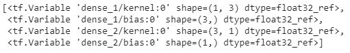
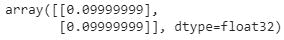
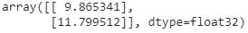

# 第一章：构建前馈神经网络

在本章中，我们将覆盖以下内容：

+   在 Python 中从零开始实现前馈传播

+   在 Python 中从零开始构建反向传播

+   在 Keras 中构建神经网络

# 介绍

神经网络是一种监督学习算法，灵感来源于大脑的功能方式。与大脑中神经元之间的连接方式相似，神经网络接收输入，通过一个函数进行处理，某些后续神经元被激活，最终产生输出。

在本章中，您将学习以下内容：

+   神经网络的架构

+   神经网络的应用

+   设置前馈神经网络

+   前向传播是如何工作的

+   计算损失值

+   梯度下降在反向传播中的工作原理

+   训练轮次（epochs）和批量大小（batch size）的概念

+   各种损失函数

+   各种激活函数

+   从零开始构建神经网络

+   在 Keras 中构建神经网络

# 简单神经网络的架构

人工神经网络的灵感来源于人脑的工作方式。技术上，它是线性回归和逻辑回归的改进，因为神经网络引入了多个非线性度量来估计输出。此外，神经网络在修改网络架构方面提供了极大的灵活性，可以通过利用结构化和非结构化数据解决多个领域的问题。

函数越复杂，网络越有可能调整以适应输入数据，从而提高预测的准确性。

一个典型的前馈神经网络结构如下所示：


一层是一个或多个节点（计算单元）的集合，每个层中的节点都与下一层中的每个节点连接。输入层由预测输出值所需的输入变量组成。

输出层的节点数量取决于我们是尝试预测连续变量还是分类变量。如果输出是连续变量，则输出只有一个单元。

如果输出是分类的，并且有 `n` 个可能的类别，则输出层将有 `n` 个节点。隐藏层用于将输入层的值转换为高维空间中的值，以便我们可以从输入中学习更多的特征。隐藏层将输出转换如下：


在上面的图中，`x[1]`,`x[2]`,...,`x[n]` 是独立变量，而 `x[0]` 是偏置项（类似于线性/逻辑回归中的偏置）。

注意，`w[1]`,`w[2]`,...,`w[n]` 是分配给每个输入变量的权重。如果 `a` 是隐藏层中的一个单元，它将等于以下值：


`f` 函数是激活函数，用于在输入与其对应权重值的乘积和之上应用非线性。此外，通过增加多个隐藏层，可以实现更高的非线性。

总结来说，神经网络是一个由权重分配给节点并由层连接的集合。这个集合分为三大部分：输入层、隐藏层和输出层。请注意，你可以有 `n` 个隐藏层，深度学习的概念通常意味着有多个隐藏层。当神经网络需要理解一些非常复杂、具有上下文或不明显的内容时，如图像识别，隐藏层是必需的。中间层（不是输入层或输出层的层）被称为隐藏层，因为它们在实践中是不可见的（关于如何可视化中间层的内容可以参考第四章，*构建深度卷积神经网络*）。

# 训练神经网络

训练神经网络基本上意味着通过重复两个关键步骤：正向传播和反向传播，来校准神经网络中的所有权重。

在正向传播中，我们将一组权重应用到输入数据，经过隐藏层，进行非线性激活，最后将隐藏层连接到输出层，通过将隐藏层节点值与另一组权重相乘来完成。对于第一次正向传播，权重的值是随机初始化的。

在反向传播中，我们通过测量输出的误差范围来尝试减少误差，并相应地调整权重。神经网络重复进行正向传播和反向传播，直到权重得到校准，从而预测输出。

# 神经网络的应用

最近，我们已经看到神经网络在各种应用中的广泛采用。在这一部分中，我们将尝试理解为什么这种采用可能大幅增加。神经网络可以通过多种方式进行架构设计。以下是一些可能的方式：


底部的框是输入，接下来是隐藏层（中间的框），顶部的框是输出层。一对一架构是典型的神经网络，输入层与输出层之间有一个隐藏层。不同架构的示例如下：

| **架构** | **示例** |
| --- | --- |
| 一对多 | 输入是图像，输出是该图像的标题 |
| 多对一 | 输入是电影评论（多个词），输出是与评论相关的情感 |
| 多对多 | 将一个语言中的句子翻译成另一种语言中的句子 |

除了上述要点，神经网络还能够理解图像中的内容，并利用一种名为**卷积神经网络**（**CNN**）的架构，检测内容所在的位置，其架构如下所示：


在这里，我们看到了推荐系统、图像分析、文本分析和音频分析的示例，可以看到神经网络为我们提供了灵活性，使我们能够使用多种架构来解决问题，随着应用数量的增加，神经网络的采用率也在上升。

# 从头开始实现前向传播（Feed-forward propagation）——Python 实现

为了建立前向传播工作的坚实基础，我们将通过一个训练神经网络的玩具示例来进行讲解，其中神经网络的输入为(1, 1)，对应的输出为 0。

# 准备工作

我们将采用的策略如下：我们的神经网络将有一个隐藏层（包含神经元），该隐藏层连接输入层与输出层。请注意，隐藏层中的神经元数量比输入层多，因为我们希望让输入层在更多维度上得到表示：


**计算隐藏层单元值**

我们现在为所有连接分配权重。请注意，这些权重是随机选择的（基于高斯分布），因为这是我们第一次进行前向传播。在这个特定的例子中，我们从初始权重开始，权重范围在 0 和 1 之间，但请注意，神经网络训练过程中的最终权重不需要介于特定的数值范围之间：


在下一步中，我们执行输入与权重的乘法运算，以计算隐藏层中隐藏单元的值。

隐藏层的单元值如下所示：

**


隐藏层的单元值在下面的图示中也有显示：


请注意，在前面的输出中，我们计算了隐藏层的值。为了简化起见，我们忽略了需要在每个隐藏层单元中添加的偏置项。

现在，我们将通过激活函数将隐藏层值传递，以便在输出中获得非线性。

如果我们不在隐藏层中应用激活函数，神经网络将变成一个从输入到输出的巨大线性连接。

**应用激活函数**

激活函数在网络的多个层中应用。它们的作用是使输入具有较高的非线性，这在建模输入和输出之间复杂关系时非常有用。

不同的激活函数如下所示：


对于我们的示例，假设使用 sigmoid 函数作为激活函数。Sigmoid 函数的图形如下所示：


通过对三个隐藏层的*总和*应用 sigmoid 激活函数 *S(x)*，我们得到如下结果：

*final_h[1] = S(1.0) = 0.73*

*final_h[2] = S(1.3) = 0.78*

*final_h[3] = S(0.8) = 0.69*

**计算输出层值**

现在我们已经计算出隐藏层的值，接下来我们将计算输出层的值。在以下图示中，隐藏层的值通过随机初始化的权重值与输出层相连。通过使用隐藏层的值和权重值，我们将计算以下网络的输出值：


我们通过将隐藏层值与权重值做点积来计算输出值。为了简化计算，我们省略了每个隐藏层单元中需要添加的偏置项：

*0.73 * 0.3 + 0.79 * 0.5 + 0.69 * 0.9 = 1.235*

这些值在以下图示中显示：


因为我们一开始使用的是随机初始化的权重，所以输出神经元的值与目标值差异很大，在这个例子中相差+1.235（因为目标值为 0）。

**计算损失值**

损失值（也称为成本函数）是我们在神经网络中优化的值。为了理解损失值是如何计算的，让我们来看两个场景：

+   连续变量预测

+   类别变量预测

**在连续变量预测中计算损失**

通常，当变量是连续型时，损失值通过平方误差计算，即我们通过调整与神经网络相关的权重值来最小化均方误差：


在前面的公式中，*y(i)* 是实际的输出值，*h(x)* 是我们对输入(`x`)进行变换后得到的预测值 `y`，而 `m` 是数据集中的行数。

**在类别变量预测中计算损失**

当需要预测的变量是离散型时（即变量只有少数几类），我们通常使用类别交叉熵损失函数。当需要预测的变量只有两个不同的值时，损失函数为二元交叉熵，而当需要预测的变量有多个不同的值时，损失函数为类别交叉熵。

这里是二元交叉熵：

*(ylog(p)+(1−y)log(1−p))*

这里是类别交叉熵：


`y` 是输出的实际值，`p` 是预测的输出值，n 是数据点的总数。现在，假设我们在玩具示例中预测的结果是连续的。在这种情况下，损失函数值是均方误差，计算公式如下：

*error = 1.235² = 1.52*

在下一步中，我们将尝试使用反向传播来最小化损失函数值（我们将在下一节学习），在反向传播中，我们更新权重值（之前随机初始化的）以最小化损失（误差）。

# 如何执行...

在前面的部分中，我们学习了如何对输入数据执行以下步骤，以便在前向传播过程中计算误差值（代码文件可在 GitHub 上的 `Neural_network_working_details.ipynb` 找到）：

1.  随机初始化权重

1.  通过将输入值与权重相乘来计算隐藏层单元值

1.  对隐藏层的值执行激活

1.  将隐藏层的值连接到输出层

1.  计算平方误差损失

用于计算所有数据点的平方误差损失值的函数如下：

```py
import numpy as np
def feed_forward(inputs, outputs, weights):
     pre_hidden = np.dot(inputs,weights[0])+ weights[1]
     hidden = 1/(1+np.exp(-pre_hidden))
     out = np.dot(hidden, weights[2]) + weights[3]
     squared_error = (np.square(pred_out - outputs))
     return squared_error
```

在前面的函数中，我们将输入变量值、权重（如果这是第一次迭代则随机初始化）以及提供的数据集中的实际输出作为输入传递给前馈函数。

我们通过执行输入和权重的矩阵乘法（点积）来计算隐藏层的值。此外，我们还会在隐藏层中加上偏置值，如下所示：

```py
pre_hidden = np.dot(inputs,weights[0])+ weights[1]
```

前述场景适用于`weights[0]`为权重值，`weights[1]`为偏置值，权重和偏置连接输入层与隐藏层。

一旦计算出隐藏层的值，我们会对隐藏层的值进行激活，计算方法如下：

```py
hidden = 1/(1+np.exp(-pre_hidden))
```

现在，我们通过将隐藏层的输出与连接隐藏层和输出的权重相乘，然后在输出处添加偏差项，来计算隐藏层的输出，如下所示：

```py
pred_out = np.dot(hidden, weights[2]) + weights[3]
```

一旦输出被计算出来，我们会在每一行中计算平方误差损失，计算公式如下：

```py
squared_error = (np.square(pred_out - outputs))
```

在前面的代码中，`pred_out` 是预测的输出，`outputs` 是实际的输出。

然后，我们可以在通过网络进行前向传播时获得损失值。

虽然在前面的代码中，我们对隐藏层的值考虑了 Sigmoid 激活函数，但现在让我们看看其他常用的激活函数。

**Tanh**

tanh 激活值（隐藏层单元值）的计算如下：

```py
def tanh(x):
    return (exp(x)-exp(-x))/(exp(x)+exp(-x))
```

**ReLu**

**修正线性单元**（**ReLU**）的值（隐藏层单元值）计算如下：

```py
def relu(x):
    return np.where(x>0,x,0)
```

**Linear**

线性激活值就是该值本身。

**Softmax**

通常，Softmax 会应用于一组值的向量。这通常是为了确定输入属于给定场景中 `n` 个可能输出类别之一的概率。假设我们正在尝试将数字图像分类为 10 个可能的类别（0 到 9 的数字）。在这种情况下，有 10 个输出值，每个输出值应代表输入图像属于其中一个类别的概率。

Softmax 激活函数用于为输出中的每个类别提供一个概率值，计算方法将在以下部分中解释：

```py
def softmax(x):
    return np.exp(x)/np.sum(np.exp(x))
```

除了前面提到的激活函数，构建神经网络时通常使用的损失函数如下：

**均方误差**

错误是输出的实际值和预测值之间的差异。我们对误差取平方，因为误差可能是正值或负值（当预测值大于实际值时，反之亦然）。平方确保正负误差不会相互抵消。我们计算均方误差，以便在两个数据集大小不相同的情况下，可以比较这两个数据集上的误差。

预测值（`p`）和实际值（`y`）之间的均方误差计算公式如下：

```py
def mse(p, y):
    return np.mean(np.square(p - y))
```

均方误差通常用于预测本质上是连续的值。

**平均绝对误差**

平均绝对误差的工作原理与均方误差非常相似。平均绝对误差通过对所有数据点的实际值和预测值之间的绝对差异取平均值，确保正负误差不会相互抵消。

预测值（`p`）和实际值（`y`）之间的平均绝对误差实现公式如下：

```py
def mae(p, y):
    return np.mean(np.abs(p-y))
```

类似于均方误差，平均绝对误差通常应用于连续变量。

**类别交叉熵**

交叉熵是衡量两个不同分布之间差异的指标：实际分布和预测分布。与我们讨论的前两种损失函数不同，交叉熵应用于类别输出数据。

两个分布之间的交叉熵计算公式如下：


`y` 是事件的实际结果，`p` 是事件的预测结果。

预测值（`p`）和实际值（`y`）之间的类别交叉熵实现公式如下：

```py
def cat_cross_entropy(p, y):
     return -np.sum((y*np.log2(p)+(1-y)*np.log2(1-p)))
```

请注意，当预测值远离实际值时，类别交叉熵损失值较高；而当值接近时，损失值较低。

# 从头开始用 Python 构建反向传播

在前向传播中，我们将输入层连接到隐藏层，再连接到输出层。在反向传播中，我们采取相反的方式。

# 准备工作

我们会逐个调整神经网络中的每个权重，幅度很小。权重值的变化会影响最终的损失值（可能是增加或减少损失）。我们会在减少损失的方向上更新权重。

此外，在某些情况下，权重的小幅变化会导致误差大幅增加/减少，而在某些情况下误差变化较小。

通过小幅度更新权重并衡量更新后误差的变化，我们可以做到以下几点：

+   确定权重更新的方向

+   确定权重更新的大小

在实现反向传播之前，让我们理解神经网络的一个额外细节：学习率。

直观地说，学习率帮助我们建立对算法的信任。例如，在决定权重更新的幅度时，我们可能不会一次性改变很大，而是采取更谨慎的方式，慢慢地更新权重。

这使我们的模型得到稳定；我们将在下一章中讨论学习率如何帮助稳定性。

我们更新权重以减少误差的整个过程叫做梯度下降技术。

**随机梯度下降**是前述场景中最小化误差的方法。更直观地说，**梯度**代表差异（即实际值与预测值之间的差异），而**下降**意味着减少。**随机**表示基于一定数量的随机样本选择来做出决策。

除了随机梯度下降，还有许多其他优化技术可以帮助优化损失值；不同的优化技术将在下一章中讨论。

反向传播的工作流程如下：

+   计算正向传播过程中的整体成本函数。

+   将所有权重（逐个）按小幅度变化。

+   计算权重变化对成本函数的影响。

+   根据变化是否增加或减少了成本（损失）值，它会更新权重值，朝着减少损失的方向进行调整。然后，这一步骤会在所有权重上重复进行。

如果前述步骤执行了`n`次，它实际上会产生`n` **迭代次数**。

为了进一步巩固我们对神经网络中反向传播的理解，让我们从已知函数开始，看看如何推导出权重：

目前，我们将使用已知函数*y = 2x*，我们尝试找出权重值和偏置值，在这个特定的情况下分别为 2 和 0：

| `x` | `y` |
| --- | --- |
| 1 | 2 |
| 2 | 4 |
| 3 | 6 |
| 4 | 8 |

如果我们将之前的数据集公式化为线性回归，*(y = a*x+b)*，其中我们要计算`a`和`b`的值（我们已经知道它们是 2 和 0，但正在检查如何通过梯度下降获得这些值），我们可以将`a`和`b`的参数随机初始化为 1.477 和 0（理想值是 2 和 0）。

# 如何实现...

在这一部分，我们将手动构建反向传播算法，以便我们清楚地理解在神经网络中如何计算权重。在这个特定的案例中，我们将构建一个没有隐藏层的简单神经网络（因此我们正在解决一个回归方程）。代码文件可以在 GitHub 上的`Neural_network_working_details.ipynb`中找到。

1.  初始化数据集如下：

```py
x = [[1],[2],[3],[4]]
y = [[2],[4],[6],[8]]
```

1.  随机初始化权重和偏置值（因为我们只需要一个权重和一个偏置值，因为我们要找出方程*y = a*x + b*中`a`和`b`的最优值）：

```py
w = [[[1.477867]], [0.]]
```

1.  定义前馈网络并计算平方误差损失值：

```py
import numpy as np
def feed_forward(inputs, outputs, weights):
     out = np.dot(inputs,weights[0]) + weights[1]
     squared_error = (np.square(out - outputs))
     return squared_error
```

在之前的代码中，我们进行了输入与随机初始化的权重值的矩阵乘法，并将其与随机初始化的偏置值相加。

一旦计算出值，我们将计算实际值与预测值之间的平方误差。

1.  将每个权重和偏置值增加一个非常小的量（0.0001），并逐一计算每个权重和偏置更新的平方误差损失值。

如果平方误差损失值随着权重增加而减少，则应该增加权重值。权重值增加的幅度应与权重变化所减少的损失值的数量成正比。

此外，确保不会像权重变化所引起的损失减少那样增加权重值，而是通过一个叫做学习率的因子来调整它。这样可以确保损失值更平滑地减少（下一章会详细讲解学习率如何影响模型准确度）。

在以下代码中，我们创建了一个名为`update_weights`的函数，它执行反向传播过程，以更新在*步骤 3*中获得的权重。我们还提到该函数需要运行`epochs`次（其中`epochs`是我们传递给`update_weights`函数的参数）：

```py
def update_weights(inputs, outputs, weights, epochs): 
     for epoch in range(epochs):
```

1.  将输入通过前馈网络传递，以计算使用初始权重集的损失值：

```py
        org_loss = feed_forward(inputs, outputs, weights)
```

1.  确保你对权重列表进行`deepcopy`，因为在后续步骤中权重会被操作，因此`deepcopy`可以避免由于子变量的变化影响到它指向的父变量的问题：

```py
        wts_tmp = deepcopy(weights)
        wts_tmp2 = deepcopy(weights)
```

1.  一次遍历所有权重值，并对其进行微小的变化（0.0001）：

```py
        for i in range(len(weights)):
             wts_tmp[-(i+1)] += 0.0001
```

1.  当权重被小幅更新时，计算更新后的前馈损失。计算由于输入的小变化所导致的损失变化。将损失变化除以输入的数量，因为我们希望计算所有输入样本的均方误差：

```py
            loss = feed_forward(inputs, outputs, wts_tmp)
            delta_loss = np.sum(org_loss - loss)/(0.0001*len(inputs))
```

通过小幅更新权重并计算其对损失值的影响，相当于对权重变化执行导数操作。

1.  根据权重导致的损失变化来更新权重。通过将损失变化乘以一个非常小的数字（0.01），即学习率参数（关于学习率参数的更多内容请参见下一章），以缓慢更新权重：

```py
            wts_tmp2[-(i+1)] += delta_loss*0.01 
            wts_tmp = deepcopy(weights)
```

1.  返回更新后的权重和偏置值：

```py
    weights = deepcopy(wts_tmp2)
 return wts_tmp2
```

神经网络中的另一个参数是计算损失值时考虑的批处理大小。

在前面的场景中，我们考虑了所有数据点来计算损失值。然而，在实际应用中，当我们有成千上万（或在某些情况下，数百万）个数据点时，在计算损失值时，更多数据点的增量贡献将遵循递减回报法则，因此我们使用的批处理大小会比总数据点数量小得多。

在构建模型时，通常考虑的批处理大小范围是 32 到 1,024 之间。

# 还有更多内容...

在前一节中，我们构建了一个回归公式*(Y = a*x + b)*，并编写了一个函数来识别`a`和`b`的最优值。在本节中，我们将在相同的玩具数据集上构建一个简单的神经网络，隐藏层将输入连接到输出层。

我们定义模型如下（代码文件可以在 GitHub 上找到，文件名为`Neural_networks_multiple_layers.ipynb`）：

+   输入层连接到隐藏层，隐藏层有三个单元。

+   隐藏层连接到输出层，输出层有一个单元。

让我们继续编写上述讨论的策略，代码如下：

1.  定义数据集并导入相关包：

```py
from copy import deepcopy
import numpy as np

x = [[1],[2],[3],[4]]
y = [[2],[4],[6],[8]]
```

我们使用`deepcopy`，这样在复制原始变量值到目标变量后，即使目标变量的值发生变化，原始变量的值也不会改变。

1.  随机初始化权重和偏置值。隐藏层中有三个单元，因此总共有三个权重值和三个偏置值——每个都对应一个隐藏单元。

此外，最终层有一个单元，与隐藏层的三个单元相连接。因此，共有三个权重和一个偏置值决定输出层的值。

随机初始化的权重如下：

```py
w = [[[-0.82203424, -0.9185806 , 0.03494298]], [0., 0., 0.], [[ 1.0692896 ],[ 0.62761235],[-0.5426246 ]], [0]]
```

1.  实现一个前馈网络，其中隐藏层使用 ReLU 激活函数：

```py
def feed_forward(inputs, outputs, weights):
     pre_hidden = np.dot(inputs,weights[0])+ weights[1]
     hidden = np.where(pre_hidden<0, 0, pre_hidden) 
     out = np.dot(hidden, weights[2]) + weights[3]
     squared_error = (np.square(out - outputs))
     return squared_error
```

1.  像前一节那样定义反向传播函数。唯一的区别是，我们现在需要更新更多层中的权重。

在以下代码中，我们正在计算一个时期开始时的原始损失：

```py
def update_weights(inputs, outputs, weights, epochs): 
     for epoch in range(epochs):
         org_loss = feed_forward(inputs, outputs, weights)
```

在以下代码中，我们将权重复制到两个权重变量集，以便在后续代码中重用它们：

```py
        wts_new = deepcopy(weights)
        wts_new2 = deepcopy(weights)
```

在以下代码中，我们通过少量更新每个权重值，并计算与更新后权重值对应的损失值（同时保持其他所有权重不变）。此外，我们还确保在所有权重和所有网络层中都发生权重更新。

平方损失（`del_loss`）的变化归因于权重值的变化。我们对网络中所有存在的权重重复前述步骤：

```py
         for i, layer in enumerate(reversed(weights)):
            for index, weight in np.ndenumerate(layer):
                wts_tmp[-(i+1)][index] += 0.0001
                loss = feed_forward(inputs, outputs, wts_tmp)
                del_loss = np.sum(org_loss - loss)/(0.0001*len(inputs))
```

权重值通过学习率参数进行加权更新——损失减少较大时，权重会大幅更新，而损失减少较小时，权重会少量更新：

```py
               wts_tmp2[-(i+1)][index] += del_loss*0.01
               wts_tmp = deepcopy(weights)
```

鉴于权重值是逐个更新的，以估计它们对损失值的影响，因此存在对权重更新过程进行并行化的潜力。因此，在这种情况下，GPU 非常有用，因为它们比 CPU 有更多的核心，能够在相同时间内更新更多的权重。

最后，我们返回更新后的权重：

```py

          weights = deepcopy(wts_tmp2)
 return wts_tmp2
```

1.  运行函数多次，每次更新一次权重：

```py
update_weights(x,y,w,1)
```

前述代码的输出（更新后的权重）如下：


在前述步骤中，我们学习了如何在 Python 中从零开始构建神经网络。在下一部分中，我们将学习如何在 Keras 中构建神经网络。

# 在 Keras 中构建神经网络

在上一部分中，我们从零开始构建了一个神经网络，也就是说，我们编写了执行前向传播和反向传播的函数。

# 如何实现...

我们将使用 Keras 库构建一个神经网络，该库提供了使构建复杂神经网络过程更容易的工具。

# 安装 Keras

Tensorflow 和 Keras 在 Ubuntu 中实现，使用以下命令：

```py
$pip install --no-cache-dir tensorflow-gpu==1.7
```

请注意，最好安装一个兼容 GPU 的版本，因为神经网络在 GPU 上运行时速度要快得多。Keras 是一个高层神经网络 API，用 Python 编写，能够在 TensorFlow、CNTK 或 Theano 之上运行。

它的开发重点是支持快速实验，可以通过以下方式安装：

```py
$pip install keras
```

# 在 Keras 中构建我们的第一个模型

在这一部分中，让我们通过使用在前面部分中使用的相同玩具数据集（代码文件在 GitHub 上以`Neural_networks_multiple_layers.ipynb`提供）来理解在 Keras 中构建模型的过程：

1.  实例化一个模型，可以顺序调用它以便在其上添加更多的层。`Sequential`方法使我们能够执行模型初始化操作：

```py
from keras.models import Sequential
model = Sequential()
```

1.  向模型添加全连接层。全连接层确保模型中各层之间的连接。在以下代码中，我们将输入层与隐藏层连接：

```py
model.add(Dense(3, activation='relu', input_shape=(1,)))
```

在前面的代码初始化的全连接层中，我们确保为模型提供了输入形状（我们需要指定模型预期的数据形状，因为这是第一个全连接层）。

此外，我们提到，每个输入将与三个单元（隐藏层中的三个单元）连接，并且在隐藏层中需要执行的激活函数是 ReLU 激活函数。

1.  将隐藏层与输出层连接：

```py
model.add(Dense(1, activation='linear'))
```

请注意，在这个全连接层中，我们不需要指定输入形状，因为模型会根据前一层自动推断输入形状。

同时，考虑到每个输出是一维的，我们的输出层只有一个单元，且我们执行的激活函数是线性激活函数。

现在，模型的摘要可以如下可视化：

```py
model.summary()
```

模型摘要如下：


前面的输出确认了我们在上一节中的讨论：从输入层到隐藏层的连接将有六个参数——三个权重和三个偏置项——对应三个隐藏单元的总共六个参数。此外，三个权重和一个偏置项将输入层与输出层连接。

1.  编译模型。这确保我们定义了损失函数和优化器，用来减少损失函数，以及与优化器对应的学习率（我们将在下一章讨论不同的优化器和损失函数）：

```py
from keras.optimizers import sgd
sgd = sgd(lr = 0.01)
```

在前面的步骤中，我们指定了优化器为我们在上一节学习过的随机梯度下降法，学习率为 0.01。将预定义的优化器及其对应的学习率作为参数传递，并减少均方误差值：

```py
model.compile(optimizer=sgd,loss='mean_squared_error')
```

1.  拟合模型。更新权重，以便模型更好地拟合：

```py
model.fit(np.array(x), np.array(y), epochs=1, batch_size = 4, verbose=1)
```

`fit`方法期望接收两个 NumPy 数组：一个输入数组和一个对应的输出数组。请注意，`epochs`表示数据集遍历的次数，`batch_size`表示在更新权重的迭代中需要考虑的数据点数量。此外，`verbose`指定输出的详细程度，包括训练和测试数据集中的损失信息以及模型训练过程的进展。

1.  提取权重值。权重值的顺序是通过调用模型上权重方法获得的，如下所示：

```py
model.weights
```

获取权重的顺序如下：



从前面的输出中，我们看到权重的顺序是`dense_1`层的三个权重（`kernel`）和三个偏置项（这是输入层与隐藏层之间的连接），以及`dense_2`层（输出层）之间的三个权重（`kernel`）和一个偏置项。

现在我们理解了权重值呈现的顺序，让我们提取这些权重的值：

```py
model.get_weights()
```

请注意，权重以数组列表的形式呈现，其中每个数组对应于`model.weights`输出中指定的值。

上述代码的输出如下：


你应该注意到，我们在这里观察到的输出与我们在手动构建神经网络时获得的输出一致。

1.  使用`predict`方法预测一组新输入的输出：

```py
x1 = [[5],[6]]
model.predict(np.array(x1))
```

请注意，`x1`是一个变量，它保存新一组示例的值，针对这些示例，我们需要预测输出值。与`fit`方法类似，`predict`方法也期望接收一个数组作为输入。

上述代码的输出如下：



请注意，尽管前面的输出不正确，但我们运行 100 个 epoch 后的输出如下：



由于我们运行了更多的 epoch，前面的输出将与预期输出（即 10，12）一致。
