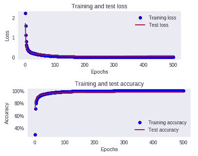
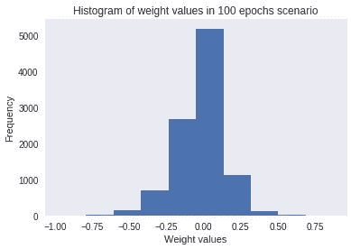

# 第二章：构建深度前馈神经网络

在本章中，我们将涵盖以下内容：

+   训练一个基础神经网络

+   对输入数据集进行缩放

+   当大多数输入值大于零时的训练影响

+   批量大小对模型准确性的影响

+   构建深度神经网络以提高网络准确性

+   改变学习率以提高网络准确性

+   改变损失优化器以提高网络准确性

+   理解过拟合的情境

+   使用批量归一化加速训练过程

在上一章中，我们了解了神经网络的基本功能。我们还学习了有许多超参数会影响神经网络的准确性。在本章中，我们将详细探讨神经网络中各种超参数的功能。

本章的所有代码可以在 https://github.com/kishore-ayyadevara/Neural-Networks-with-Keras-Cookbook/blob/master/Neural_network_hyper_parameters.ipynb 找到

# 训练一个基础神经网络

为了理解如何训练一个基础神经网络，我们将通过预测 MNIST 数据集中数字标签的任务，来实现这一点。MNIST 是一个流行的数字图像数据集（每张图片包含一个数字），并且每个图像都有对应的标签。

# 做好准备

训练神经网络的步骤如下：

1.  导入相关的包和数据集

1.  对目标进行预处理（将它们转换为独热编码向量），以便我们能够在其上进行优化：

    +   我们将最小化类别交叉熵损失

1.  创建训练集和测试集：

    +   我们有训练数据集，因此我们可以基于它创建一个模型

    +   测试数据集对模型是不可见的：

        +   因此，测试数据集上的准确性是衡量模型在实际应用中可能表现如何的一个指标，因为生产环境中的数据（可能是在构建模型几天/几周后出现的数据）是模型无法看到的

1.  初始化一个模型

1.  定义模型架构：

    +   指定隐藏层中的单元数

    +   指定在隐藏层中执行的激活函数

    +   指定隐藏层的数量

    +   指定我们想要最小化的损失函数

    +   提供优化器，以最小化损失函数

1.  训练模型：

    +   提到批量大小以更新权重

    +   提到总的训练轮数

1.  测试模型：

    +   提到验证数据，否则提到验证分割，这将把总数据的最后 x%作为测试数据

    +   计算测试数据集上的准确率和损失值

1.  检查随着训练轮次增加，损失值和准确性值变化中是否有任何有趣的现象

使用这种策略，让我们在接下来的部分中构建一个 Keras 神经网络模型。

# 如何做到这一点...

1.  导入相关的包和数据集，并可视化输入数据集：

```py
from keras.datasets import mnist
import numpy
from keras.datasets import mnist
from keras.models import Sequential
from keras.layers import Dense
from keras.layers import Dropout
from keras.utils import np_utils
(X_train, y_train), (X_test, y_test) = mnist.load_data()
```

在前面的代码中，我们导入了相关的 Keras 文件，并且还导入了 MNIST 数据集（该数据集作为 Keras 中的内置数据集提供）。

1.  MNIST 数据集包含数字图像，每张图像的形状为 28 x 28。我们来绘制一些图像，看看它们在代码中的样子：

```py
import matplotlib.pyplot as plt
%matplotlib inline
plt.subplot(221)
plt.imshow(X_train[0], cmap=plt.get_cmap('gray'))
plt.grid('off')
plt.subplot(222)
plt.imshow(X_train[1], cmap=plt.get_cmap('gray'))
plt.grid('off')
plt.subplot(223)
plt.imshow(X_train[2], cmap=plt.get_cmap('gray'))
plt.grid('off')
plt.subplot(224)
plt.imshow(X_train[3], cmap=plt.get_cmap('gray'))
plt.grid('off')
plt.show()
```

以下截图显示了前面代码块的输出：


1.  将 28 x 28 的图像展平，使得输入为所有 784 个像素值。此外，对输出进行 one-hot 编码。这一步骤在数据集准备过程中非常关键：

```py
# flatten 28*28 images to a 784 vector for each image
num_pixels = X_train.shape[1] * X_train.shape[2]
X_train = X_train.reshape(X_train.shape[0], num_pixels).astype('float32')
X_test = X_test.reshape(X_test.shape[0], num_pixels).astype('float32')
```

在前面的步骤中，我们使用 reshape 方法对输入数据集进行重新调整形状，该方法将给定形状的数组转换为不同的形状。在这个特定的例子中，我们将具有 `X_train.shape[0]` 个数据点（图像）的数组，其中每个图像有 `X_train.shape[1]` 行和 `X_train.shape[2]` 列，转换为一个包含 `X_train.shape[0]` 个数据点（图像）和每个图像 `X_train.shape[1] * X_train.shape[2]` 个值的数组。类似地，我们对测试数据集执行相同的操作：

```py
# one hot encode outputs
y_train = np_utils.to_categorical(y_train)
y_test = np_utils.to_categorical(y_test)
num_classes = y_test.shape[1]
```

让我们尝试理解 one-hot 编码是如何工作的。如果唯一可能的标签是 *{0, 1, 2, 3}*，它们将被 one-hot 编码，如下所示：

| **Label** | *`0`* | *`1`* | *`2`* | *`3`* |
| --- | --- | --- | --- | --- |
| *`0`* | 1 | 0 | 0 | 0 |
| *`1`* | 0 | 1 | 0 | 0 |
| *`2`* | 0 | 0 | 1 | 0 |
| *`3`* | 0 | 0 | 0 | 1 |

本质上，每个标签将占据数据集中的一个唯一列，如果标签存在，该列的值将为 1，其他所有列的值将为 0。

在 Keras 中，基于标签的 one-hot 编码是通过 `to_categorical` 方法实现的，该方法会计算目标数据中的唯一标签数，并将其转换为 one-hot 编码向量。

1.  构建一个具有 1,000 个单元的隐藏层神经网络：

```py
model = Sequential()
model.add(Dense(1000, input_dim=784, activation='relu'))
model.add(Dense(10,  activation='softmax'))
```

在前面的步骤中，我们提到输入有 784 个值，这些值连接到隐藏层中的 1,000 个值。此外，我们还指定了在输入与连接输入和隐藏层的权重矩阵相乘后，要在隐藏层执行的激活函数是 ReLu 激活函数。

最后，隐藏层与一个具有 10 个值的输出连接（因为 `to_categorical` 方法创建的向量有 10 列），并且我们在输出上执行 softmax，以便获得图像属于某一类别的概率。

1.  前述的模型架构可以如下可视化：

```py
model.summary()

```

模型的总结如下：


在前面的架构中，第一层的参数数量为 785,000，因为 784 个输入单元连接到 1,000 个隐藏单元，导致 784 * 1,000 个权重值，以及 1,000 个偏置值，最终得到 785,000 个参数。

类似地，输出层有 10 个输出，它们与每个 1,000 个隐藏层连接，从而产生 1,000 * 10 个参数和 10 个偏置——总共 10,010 个参数。

输出层有 10 个单元，因为输出中有 10 个可能的标签。输出层现在为每个类提供给定输入图像的概率值。

1.  如下所示编译模型：

```py
model.compile(loss='categorical_crossentropy', optimizer='adam', metrics=['accuracy'])
```

请注意，由于目标变量是一个包含多个类别的独热编码向量，因此损失函数将是分类交叉熵损失。

此外，我们使用 Adam 优化器来最小化代价函数（关于不同优化器的更多信息请参考*通过改变损失优化器来提升网络准确性*配方）。

我们还注意到，在模型训练过程中，我们需要查看准确率指标。

1.  如下所示拟合模型：

```py
history = model.fit(X_train, y_train, validation_data=(X_test, y_test), epochs=500, batch_size=32, verbose=1)
```

在前面的代码中，我们已指定模型将拟合的输入（`X_train`）和输出（`y_train`）。此外，我们还指定了测试数据集的输入和输出，模型不会使用这些数据来训练权重；然而，它将帮助我们了解训练数据集和测试数据集之间损失值和准确率值的差异。

1.  提取不同训练轮次下的训练和测试损失以及准确率指标：

```py
history_dict = history.history
loss_values = history_dict['loss']
val_loss_values = history_dict['val_loss']
acc_values = history_dict['acc']
val_acc_values = history_dict['val_acc']
epochs = range(1, len(val_loss_values) + 1)
```

在拟合模型时，history 变量会存储每个训练轮次中训练数据集和测试数据集的准确率和损失值。在前面的步骤中，我们将这些值存储在一个列表中，以便绘制随着轮次增加，训练和测试数据集的准确率和损失的变化。

1.  可视化不同训练轮次下的训练和测试损失以及准确率：

```py
import matplotlib.pyplot as plt
%matplotlib inline 

plt.subplot(211)
plt.plot(epochs, history.history['loss'], 'rx', label='Training loss')
plt.plot(epochs, val_loss_values, 'b', label='Test loss')
plt.title('Training and test loss')
plt.xlabel('Epochs')
plt.ylabel('Loss')
plt.legend()
plt.show()

plt.subplot(212)
plt.plot(epochs, history.history['acc'], 'rx', label='Training accuracy')
plt.plot(epochs, val_acc_values, 'b', label='Test accuracy')
plt.title('Training and test accuracy')
plt.xlabel('Epochs')
plt.ylabel('Accuracy')
plt.gca().set_yticklabels(['{:.0f}%'.format(x*100) for x in plt.gca().get_yticks()]) 
plt.legend()
plt.show()
```

前面的代码生成了以下图表，其中第一个图显示了随着训练轮次增加的训练和测试损失值，第二个图显示了随着训练轮次增加的训练和测试准确率：


请注意，前面的网络达到了 97%的准确率。还要注意，损失值（从而准确率）在不同的训练轮次中发生了阶跃变化。我们将在下一部分对比输入数据集缩放前后的损失变化。

1.  手动计算模型的准确性：

```py
preds = model.predict(X_test)
```

在前面的步骤中，我们使用`predict`方法来计算给定输入（在此案例中为`X_test`）的预期输出值。请注意，我们将其指定为`model.predict`，因为我们已初始化了一个名为`model`的顺序模型：

```py
import numpy as np
correct = 0
for i in range(len(X_test)):
    pred = np.argmax(preds[i],axis=0)
    act = np.argmax(y_test[i],axis=0)
    if(pred==act):
        correct+=1
    else:
        continue

correct/len(X_test)
```

在前面的代码中，我们正在逐一遍历所有测试预测。对于每个测试预测，我们执行`argmax`来获取具有最高概率值的索引。

同样，我们对测试数据集的实际值执行相同的操作。预测最高值的索引在预测值和测试数据集的实际值中是相同的。

最终，模型在测试数据集上的准确率是正确预测的数量除以测试数据集中的总数据点数。

# 工作原理...

我们在前面的代码中执行的关键步骤如下：

+   我们使用`reshape`方法将输入数据集展平，使每个像素都被视为一个变量。

+   我们对输出值进行了独热编码，以便使用`np_utils`包中的`to_categorical`方法区分不同的标签。

+   我们通过逐层添加的方式构建了一个带有隐藏层的神经网络。

+   我们使用`model.compile`方法编译了神经网络，以最小化分类交叉熵损失（因为输出有 10 个不同的类别）。

+   我们使用`model.fit`方法通过训练数据拟合模型。

+   我们提取了存储在历史中的所有纪元的训练和测试损失准确率。

+   我们使用`model.predict`方法预测了测试数据集中每个类别的概率。

+   我们遍历了测试数据集中的所有图像，并识别出具有最高概率的类别。

+   最终，我们计算了准确率（预测类别与图像实际类别匹配的实例数量占总实例数的比例）。

在下一节中，我们将探讨损失和准确率值发生阶跃变化的原因，并努力使变化更加平滑。

# 缩放输入数据集

缩放数据集是一个过程，其中我们限制数据集中变量的范围，确保它们没有非常宽泛的不同值。一种实现方法是将数据集中的每个变量除以该变量的最大值。通常情况下，神经网络在我们缩放输入数据集时表现较好。

在本节中，让我们了解为什么当数据集被缩放时，神经网络表现得更好。

# 准备工作

为了理解输入缩放对输出的影响，我们将检查输入数据集未缩放时的输出与输入数据集缩放时的输出进行对比。

输入数据未缩放：


在前面的表格中，注意到即使权重值从 0.01 变化到 0.9，输出（sigmoid）变化不大。sigmoid 函数是通过输入与权重的乘积计算 sigmoid 值，然后加上偏置：

```py
output = 1/(1+np.exp(-(w*x + b))
```

其中`w`是权重，`x`是输入，`b`是偏置值。

Sigmoid 输出没有变化的原因是，因为 `w*x` 的乘积是一个大数（因为 x 是一个大数），导致 sigmoid 值总是落在 sigmoid 曲线的饱和部分（位于 sigmoid 曲线的右上角或左下角的饱和值）。

在这种情况下，让我们将不同的权重值与一个小的输入数值相乘，如下所示：


在前面的表格中，sigmoid 输出有所不同，因为输入和权重值较小，导致输入与权重相乘时得到较小的结果，进而导致 sigmoid 输出出现变化。

通过这次练习，我们了解了缩放输入数据集的重要性，这样在权重（前提是权重范围不大）的值与输入值相乘时会得到一个较小的结果。这种现象导致权重值更新不够迅速。

因此，为了达到最佳的权重值，我们应该缩放输入数据集，同时初始化权重值时不应有过大的范围（通常，在初始化时，权重值是一个介于 -1 和 +1 之间的随机值）。

当权重值也是一个非常大的数字时，这些问题仍然存在。因此，我们最好将权重值初始化为一个接近零的小值。

# 如何操作...

让我们回顾一下上节中使用的数据集缩放设置，并比较有无缩放的结果：

1.  导入相关的包和数据集：

```py
from keras.datasets import mnist
import numpy as np
from keras.datasets import mnist
from keras.models import Sequential
from keras.layers import Dense
from keras.layers import Dropout
from keras.utils import np_utils

(X_train, y_train), (X_test, y_test) = mnist.load_data()
```

1.  缩放数据集有多种方法。一种方法是将所有数据点转换为介于零和一之间的值（通过将每个数据点除以整个数据集的最大值，这就是我们在以下代码中做的）。另一种流行的方式（在多种方法中）是对数据集进行标准化，使得值介于 -1 和 +1 之间，方法是用每个数据点减去整个数据集的均值，然后将每个结果数据点除以原始数据集中的标准差。

现在，我们将对输入数据集进行平展并缩放，如下所示：

```py
# flatten 28*28 images to a 784 vector for each image
num_pixels = X_train.shape[1] * X_train.shape[2]
X_train = X_train.reshape(X_train.shape[0], num_pixels).astype('float32')
X_test = X_test.reshape(X_test.shape[0], num_pixels).astype('float32')

X_train = X_train/255
X_test = X_test/255
```

在前一步中，我们通过将每个值除以数据集中的最大值（255），将训练和测试输入缩放到一个介于零和一之间的值。此外，我们将输出数据集转换为 one-hot 编码格式：

```py
# one hot encode outputs
y_train = np_utils.to_categorical(y_train)
y_test = np_utils.to_categorical(y_test)
num_classes = y_test.shape[1]
```

1.  使用以下代码构建模型并进行编译：

```py
model = Sequential()
model.add(Dense(1000, input_dim=784, activation='relu'))
model.add(Dense(10,  activation='softmax'))
model.compile(loss='categorical_crossentropy', optimizer='adam', metrics=['accuracy'])
```

请注意，前述模型与我们在上一节中构建的模型完全相同。唯一的区别是，它将在经过缩放的训练数据集上执行，而之前的模型没有经过缩放。

1.  按如下方式拟合模型：

```py
history = model.fit(X_train, y_train, validation_data=(X_test, y_test), epochs=500, batch_size=32, verbose=1)
```

你会注意到，前述模型的准确率大约是 98.25%。

1.  绘制训练和测试准确度以及不同时期的损失值（生成以下图表的代码与我们在*训练普通神经网络*食谱的第 8 步中使用的代码相同）：


从前面的图表中，你应该注意到，与上一部分我们看到的未缩放数据集相比，训练和测试损失在增加的时期中平滑下降。

尽管前述网络在平滑下降的损失值方面给出了良好的结果，但我们注意到训练准确度和测试准确度/损失值之间存在差距，表明在训练数据集上可能存在过拟合现象。**过拟合**是指模型过度专注于训练数据，导致在测试数据集上表现不佳的现象。

# 它是如何工作的...

我们在前面的代码中执行的关键步骤如下：

+   我们使用 reshape 方法将输入数据集展平，以便每个像素被视为一个变量

+   此外，我们对数据集进行了缩放，使得每个变量的值现在都在零和一之间

    +   我们通过将变量的值除以该变量的最大值来实现前述操作

+   我们对输出值进行了独热编码，以便使用 `np_utils` 包中的 `to_categorical` 方法区分不同的标签

+   我们通过顺序添加层的方式构建了一个具有隐藏层的神经网络

+   我们使用 `model.compile` 方法将神经网络编译为最小化类别交叉熵损失（因为输出有 10 个不同的类别）

+   我们使用 `model.fit` 方法通过训练数据来拟合模型

+   我们提取了在所有时期中存储在历史记录中的训练和测试损失准确度

+   我们还识别了一个我们认为是过拟合的场景

# 还有更多...

除了通过将变量的值除以该变量的最大值来缩放变量值外，其他常用的缩放方法如下：

+   最小-最大归一化

+   均值归一化

+   标准化

有关这些缩放方法的更多信息，请访问维基百科：[`en.wikipedia.org/wiki/Feature_scaling`](https://en.wikipedia.org/wiki/Feature_scaling)。

# 当大多数输入值大于零时对训练的影响

到目前为止，在我们考虑的数据集中，我们并未查看输入数据集中的值的分布。输入的某些值导致训练速度更快。在本节中，我们将了解在训练时间依赖于输入值时，权重训练速度更快的情况。

# 准备就绪

在本节中，我们将完全按照与上一节相同的方式进行模型构建。

然而，我们将对我们的策略做出一些小的调整：

+   我们将反转背景颜色，以及前景颜色。本质上，在这种情况下，背景将是白色的，标签将用黑色书写。

这种变化影响模型准确性的直觉如下。

图像角落的像素对预测图像标签没有贡献。考虑到黑色像素（原始场景）的像素值为零，它会自动被处理，因为当这个输入与任何权重值相乘时，输出就是零。这将导致网络学习到，连接此角落像素与隐藏层的权重值的任何变化都不会对损失值的变化产生影响。

然而，如果角落的像素是白色的（我们已经知道角落的像素对预测图像标签没有贡献），它将对某些隐藏单元的值产生影响，因此权重需要微调，直到角落像素对预测标签的影响最小。

# 如何做到这一点...

1.  加载并缩放输入数据集：

```py
(X_train, y_train), (X_test, y_test) = mnist.load_data()
num_pixels = X_train.shape[1] * X_train.shape[2]
X_train = X_train.reshape(X_train.shape[0], num_pixels).astype('float32')
X_test = X_test.reshape(X_test.shape[0], num_pixels).astype('float32')
X_train = X_train/255
X_test = X_test/255
y_train = np_utils.to_categorical(y_train)
y_test = np_utils.to_categorical(y_test)
num_classes = y_test.shape[1]
```

1.  让我们看看输入值的分布：

```py
X_train.flatten()
```

上面的代码将所有输入值展平为一个单一的列表，因此其形状为 (47,040,000)，与 `28 x 28 x X_train.shape[0]` 相同。接下来，让我们绘制所有输入值的分布：

```py
plt.hist(X_train.flatten())
plt.grid('off')
plt.title('Histogram of input values')
plt.xlabel('Input values')
plt.ylabel('Frequency of input values')
```


我们注意到大多数输入值为零（你应该注意到所有输入图像的背景都是黑色的，因此，大多数值为零，这是黑色的像素值）。

1.  在本节中，让我们探索一个场景，其中我们反转颜色，背景为白色，字母为黑色，使用以下代码：

```py
X_train = 1-X_train
X_test = 1-X_test
```

让我们绘制这些图像：

```py
import matplotlib.pyplot as plt
%matplotlib inline
plt.subplot(221)
plt.imshow(X_train[0].reshape(28,28), cmap=plt.get_cmap('gray'))
plt.grid('off')
plt.subplot(222)
plt.imshow(X_train[1].reshape(28,28), cmap=plt.get_cmap('gray'))
plt.grid('off')
plt.subplot(223)
plt.imshow(X_train[2].reshape(28,28), cmap=plt.get_cmap('gray'))
plt.grid('off')
plt.subplot(224)
plt.imshow(X_train[3].reshape(28,28), cmap=plt.get_cmap('gray'))
plt.grid('off')
plt.show()
```

它们将如下所示：


结果图像的直方图现在如下所示：


你应该注意到，大多数输入值现在的值为一。

1.  接下来，我们将使用在`S`caling 输入数据集*部分中构建的相同模型架构来构建我们的模型：

```py
model = Sequential()
model.add(Dense(1000,input_dim=784,activation='relu'))
model.add(Dense(10, activation='softmax'))
model.compile(loss='categorical_crossentropy', optimizer='adam', metrics=['accuracy'])
history = model.fit(X_train, y_train, validation_data=(X_test, y_test), epochs=10, batch_size=32, verbose=1)
```

1.  绘制不同训练周期（epochs）下的训练和测试准确率及损失值（生成以下图表的代码与我们在*训练普通神经网络*步骤 8 中使用的代码相同）：


我们应该注意到，模型准确率现在已下降到约 97%，而使用相同的模型进行相同数量的周期和批量大小时，在一个大多数值为零（而不是大多数为一）的数据集上，准确率为约 98%。此外，模型的准确率为 97%，比输入像素大多数为零的场景要慢得多。

当大多数数据点为非零时，准确度下降的直觉是：当大多数像素为零时，模型的任务较简单（需要调整的权重较少），因为它只需根据少数像素值（那些像素值大于零的）进行预测。然而，当大多数数据点为非零时，模型需要调整更多的权重以进行预测。

# 批量大小对模型准确度的影响

在前面的各个部分中，我们为所有构建的模型都考虑了批量大小为 32。在这一部分中，我们将尝试理解批量大小对准确度的影响。

# 准备开始

为了理解批量大小对模型准确度的影响，让我们对比两个情境，其中数据集总大小为 60,000：

+   批量大小为 30,000

+   批量大小为 32

当批量大小较大时，每个训练轮次中的权重更新次数较少，相较于批量大小较小的情境。

批量大小较小时，每个训练轮次中权重更新次数较多的原因是，计算损失值时考虑的数据点较少。这导致每个训练轮次中批量的数量增多，因为大致而言，在一个训练轮次中，您需要遍历数据集中的所有训练数据点。

因此，批量大小越小，在相同的训练轮次下准确度越高。然而，在决定用于批量大小的数据点数量时，您还应确保批量大小不宜过小，以免在小批量数据上发生过拟合。

# 如何实现...

在前面的步骤中，我们建立了一个批量大小为 32 的模型。在这个步骤中，我们将继续实现模型，并对比低批量大小和高批量大小在相同训练轮次下的情境：

1.  按照以下步骤预处理数据集并拟合模型：

```py
(X_train, y_train), (X_test, y_test) = mnist.load_data()
num_pixels = X_train.shape[1] * X_train.shape[2]
X_train = X_train.reshape(X_train.shape[0], num_pixels).astype('float32')
X_test = X_test.reshape(X_test.shape[0], num_pixels).astype('float32')
X_train = X_train/255
X_test = X_test/255
y_train = np_utils.to_categorical(y_train)
y_test = np_utils.to_categorical(y_test)
num_classes = y_test.shape[1]
model = Sequential()
model.add(Dense(1000,input_dim=784,activation='relu'))
model.add(Dense(10, activation='softmax'))
model.compile(loss='categorical_crossentropy', optimizer='adam', metrics=['accuracy'])
history = model.fit(X_train, y_train, validation_data=(X_test, y_test), epochs=10, batch_size=30000, verbose=1)
```

请注意，代码中的唯一变化是在模型拟合过程中使用的`batch_size`参数。

1.  绘制不同训练轮次下的训练准确度、测试准确度和损失值（生成以下图表的代码与我们在*训练基本神经网络*步骤 8 中使用的代码相同）：



在之前的情境中，您应该注意到，与批量大小较小的模型相比，模型准确度在较晚的训练轮次才达到约 98%。

# 它是如何工作的...

您应该注意到，最初准确度较低，只有在经过相当数量的训练轮次后才会赶上。初期准确度较低的原因是，在这种情况下，权重更新的次数远低于之前的情境（批量大小较小的情境）。

在这种情况下，当批次大小为 30,000，总数据集大小为 60,000 时，当我们运行 500 个周期时，权重更新会发生在周期 * (数据集大小 / 批次大小) = 500 * (60,000 / 30,000) = 1,000 次。

在之前的场景中，权重更新发生在 500 * (60,000 / 32) = 937,500 次。

因此，批次大小越小，权重更新的次数就越多，一般来说，对于相同数量的周期，准确率会更好。

同时，你应该小心不要让批次大小过小，这可能导致不仅训练时间过长，还有可能出现过拟合的情况。

# 构建深度神经网络以提高网络准确率

到目前为止，我们已经看过了神经网络模型，其中神经网络只有一个隐藏层，位于输入层和输出层之间。在这一节中，我们将讨论具有多个隐藏层（因此是深度神经网络）的神经网络，同时重用已缩放的相同 MNIST 训练和测试数据集。

# 准备工作

深度神经网络意味着有多个隐藏层将输入层和输出层连接起来。多个隐藏层确保神经网络学习输入和输出之间复杂的非线性关系，这是简单神经网络无法学习的（因为隐藏层数量有限）。

一个典型的深度前馈神经网络如下所示：


# 如何做...

深度神经网络架构是通过在输入层和输出层之间添加多个隐藏层来构建的，如下所示：

1.  加载数据集并进行缩放：

```py
(X_train, y_train), (X_test, y_test) = mnist.load_data()
num_pixels = X_train.shape[1] * X_train.shape[2]
X_train = X_train.reshape(X_train.shape[0], num_pixels).astype('float32')
X_test = X_test.reshape(X_test.shape[0], num_pixels).astype('float32')
X_train = X_train/255
X_test = X_test/255
y_train = np_utils.to_categorical(y_train)
y_test = np_utils.to_categorical(y_test)
num_classes = y_test.shape[1]
```

1.  构建一个具有多个隐藏层将输入层和输出层连接起来的模型：

```py
model = Sequential()
model.add(Dense(1000, input_dim=784, activation='relu'))
model.add(Dense(1000,activation='relu'))
model.add(Dense(1000,activation='relu'))
model.add(Dense(10,  activation='softmax'))
```

前述模型架构的结果如下所示：


请注意，前述模型会导致更多的参数数量，这是由于深度架构的结果（因为模型中有多个隐藏层）。

1.  现在模型已经设置好，我们来编译并拟合模型：

```py
model.compile(loss='categorical_crossentropy', optimizer=adam, metrics=['accuracy'])
history = model.fit(X_train, y_train, validation_data=(X_test, y_test), epochs=250, batch_size=1024, verbose=1)
```

前述结果得到一个 98.6%的准确率，这略高于我们之前看到的模型架构的准确率。训练和测试的损失及准确率如下所示（生成以下图表的代码与我们在*训练基础神经网络*食谱第 8 步中使用的代码相同）：


请注意，在这种情况下，训练损失和测试损失之间存在相当大的差距，表明深度前馈神经网络在训练数据上过拟合了。我们将在过拟合的章节中学习如何避免对训练数据的过拟合。

# 调整学习率以提高网络准确率

到目前为止，在之前的食谱中，我们使用的是 Adam 优化器的默认学习率 0.0001。

在本节中，我们将手动将学习率设置为更大的数值，并观察改变学习率对模型准确性的影响，同时复用之前食谱中已缩放的相同 MNIST 训练和测试数据集。

# 准备工作

在前一章节关于构建前馈神经网络的内容中，我们学习了学习率用于更新权重，且权重的变化与损失减少的量成正比。

此外，权重值的变化等于损失减少量与学习率的乘积。因此，学习率越低，权重值的变化越小，反之亦然。

你可以基本上将权重值视为一个连续的光谱，其中权重是随机初始化的。当权重值变化较大时，有很大可能在该光谱中并未考虑到所有可能的权重值。然而，当权重值变化较小，可能会实现全局最小值，因为可能会考虑更多的权重值。

为了更进一步理解，我们来考虑拟合*y = 2x*直线的玩具示例，其中初始权重值为 1.477，初始偏置值为零。前馈和反向传播函数将保持与前一章相同：

```py
def feed_forward(inputs, outputs, weights):
     hidden = np.dot(inputs,weights[0])
     out = hidden+weights[1]
     squared_error = (np.square(out - outputs))
     return squared_error

def update_weights(inputs, outputs, weights, epochs, lr): 
    for epoch in range(epochs):
        org_loss = feed_forward(inputs, outputs, weights)
        wts_tmp = deepcopy(weights)
        wts_tmp2 = deepcopy(weights)
        for ix, wt in enumerate(weights):
            print(ix, wt)
            wts_tmp[-(ix+1)] += 0.0001
            loss = feed_forward(inputs, outputs, wts_tmp)
            del_loss = np.sum(org_loss - loss)/(0.0001*len(inputs))
            wts_tmp2[-(ix+1)] += del_loss*lr
            wts_tmp = deepcopy(weights)
        weights = deepcopy(wts_tmp2)
    return wts_tmp2
```

请注意，从前一章看到的反向传播函数中唯一的变化是我们将学习率作为参数传递给了前述函数。当学习率为 0.01 时，在不同训练轮次下的权重值如下：

```py
w_val = []
b_val = []
for k in range(1000):
     w_new, b_new = update_weights(x,y,w,(k+1),0.01)
     w_val.append(w_new)
     b_val.append(b_new)
```

不同训练轮次下权重变化的图形可以通过以下代码获得：

```py
import matplotlib.pyplot as plt
%matplotlib inline
plt.plot(w_val)
plt.title('Weight value over different epochs when learning rate is 0.01')
plt.xlabel('epochs')
plt.ylabel('weight value')
plt.grid('off')
```

前述代码的输出结果如下：


以类似的方式，当学习率为 0.1 时，在不同训练轮次下的权重值如下：


该截图显示了当学习率为 0.5 时，在不同训练轮次下权重的变化值：


请注意，在前述场景中，最初权重值发生了剧烈变化，而学习率为 0.1 时收敛了，而学习率为 0.5 时未能收敛到最优解，因此陷入了局部最小值。

在学习率为 0.5 的情况下，由于权重值停滞在局部最小值，它无法达到最优值 2。

# 如何进行...

现在我们已经理解了学习率如何影响输出值，让我们看看学习率对之前看到的 MNIST 数据集的实际影响，我们将保持相同的模型架构，但只改变学习率参数。

请注意，我们将使用与*缩放输入数据集*食谱中第 1 步和第 2 步相同的数据预处理步骤。

一旦数据集预处理完成，我们通过在下一步中指定优化器来调整模型的学习率：

1.  我们按如下方式调整学习率：

```py
from keras import optimizers
adam=optimizers.Adam(lr=0.01)
```

通过前述代码，我们已使用指定的学习率 0.01 初始化了 Adam 优化器。

1.  我们按照如下方式构建、编译并训练模型：

```py
model = Sequential()
model.add(Dense(1000, input_dim=784, activation='relu'))
model.add(Dense(10,  activation='softmax'))
model.compile(loss='categorical_crossentropy', optimizer=adam, metrics=['accuracy']) 

history = model.fit(X_train, y_train, validation_data=(X_test, y_test), epochs=500, batch_size=1024, verbose=1)
```

前述网络的准确率在 500 个训练轮次结束时约为 90%。让我们看看损失函数和准确率在不同训练轮次下的变化（生成下图的代码与我们在*训练基础神经网络*方法第 8 步中使用的代码相同）：


请注意，当学习率较高（在当前情况下为 0.01）时，与 0.0001（在*缩放输入数据集*方法中考虑的情况）相比，损失函数下降得不如低学习率模型平稳。

低学习率的模型更新权重较慢，因此导致损失函数平稳下降，并且准确率较高，这种准确率是在更多的训练轮次中逐渐获得的。

另外，当学习率较高时，损失值的步进变化是由于损失值陷入局部最小值，直到权重值改变为最优值。较低的学习率可以更快地到达最优权重值，因为权重变化较慢，但在正确的方向上稳步前进。

类似地，让我们探讨当学习率为 0.1 时网络的准确性：

```py
from keras import optimizers
adam=optimizers.Adam(lr=0.1)

model = Sequential()
model.add(Dense(1000, input_dim=784, activation='relu'))
model.add(Dense(10,  activation='softmax'))
model.compile(loss='categorical_crossentropy', optimizer=adam, metrics=['accuracy'])
history = model.fit(X_train, y_train, validation_data=(X_test, y_test), epochs=500, batch_size=1024, verbose=1)
```

需要注意的是，由于学习率较高，损失值无法进一步显著下降；也就是说，可能权重已经陷入局部最小值：


因此，一般来说，设置较低的学习率并让网络在较多的训练轮次中进行学习是一个好主意。

# 改变损失优化器以提高网络准确性

到目前为止，在前面的几种方法中，我们认为损失优化器是 Adam 优化器。然而，优化器有多种变体，优化器的更改可能会影响模型学习拟合输入与输出的速度。

在本方法中，我们将理解改变优化器对模型准确性的影响。

# 准备就绪

为了了解优化器变化对网络准确性的影响，下面我们将对比前面章节中的情况（使用的是 Adam 优化器）和这一节使用**随机梯度下降优化器**的情况，同时重新使用已缩放的相同 MNIST 训练和测试数据集（数据预处理步骤与*缩放数据集*方法中的步骤 1 和步骤 2 相同）：

```py
model = Sequential()
model.add(Dense(1000, input_dim=784, activation='relu'))
model.add(Dense(10,  activation='softmax'))
model.compile(loss='categorical_crossentropy', optimizer='sgd', metrics=['accuracy'])
history = model.fit(X_train, y_train, validation_data=(X_test, y_test), epochs=100, batch_size=32, verbose=1)
```

请注意，当我们在前面的代码中使用随机梯度下降优化器时，经过 100 轮训练后的最终准确率大约为 98%（以下图表的生成代码与我们在*训练一个基础神经网络*食谱的第 8 步中使用的代码相同）：


然而，我们也应该注意，与使用 Adam 优化器的模型相比，该模型在达到高准确率的过程中变得更加缓慢。

# 还有更多...

其他一些可用的损失优化器如下：

+   RMSprop

+   Adagrad

+   Adadelta

+   Adamax

+   Nadam

你可以在这里了解更多关于不同优化器的信息：[`keras.io/optimizers/`](https://keras.io/optimizers/)。

此外，你还可以在这里找到每个优化器的源代码：[`github.com/keras-team/keras/blob/master/keras/optimizers.py`](https://github.com/keras-team/keras/blob/master/keras/optimizers.py)。

# 理解过拟合的情形

在之前的一些食谱中，我们注意到训练准确率接近 100%，而测试准确率约为 98%，这就是在训练数据集上发生过拟合的情况。让我们对训练和测试准确率之间的差异有一个直观的理解。

为了理解导致过拟合的现象，让我们对比两个情形，分别比较训练和测试的准确率，并且展示权重的直方图：

+   模型运行五轮训练

+   模型运行 100 轮训练

两个情形之间的训练集和测试集的准确率对比如下：

| **情形** | **训练数据集** | **测试数据集** |
| --- | --- | --- |
| 5 轮训练 | 97.59% | 97.1% |
| 100 轮训练 | 100% | 98.28% |

一旦我们绘制出连接隐藏层和输出层的权重的直方图，我们会注意到，与五轮训练的情况相比，100 轮训练的权重分布范围更大：




从前面的图片中你应该注意到，100 轮训练的情况相比于五轮训练的情况，权重值的分布更加广泛。这是因为在 100 轮训练中，模型有更多的机会在训练集上过拟合，而相比之下，五轮训练的更新次数较少，因此过拟合的机会也较少。

权重值过高（以及训练集和测试集之间的差异）是模型可能发生过拟合和/或可能有机会缩放输入/权重以提高模型准确率的良好指示。

此外，神经网络中可能包含数十万甚至百万的权重（某些架构中为数百万），这些权重都需要进行调整，因此，某些权重有可能会被更新为非常大的值，以便针对数据集中某一特异值行进行微调。

# 使用正则化克服过拟合

在前一部分中，我们已确定高权重幅度是过拟合的原因之一。在本节中，我们将探讨如何避免过拟合问题，例如对高权重幅度值进行惩罚。

**正则化**通过对模型中的高权重幅度进行惩罚来进行调节。L1 和 L2 正则化是最常用的正则化技术，其工作原理如下：

L2 正则化在最小化损失函数的同时（即以下公式中的平方损失和），还会最小化神经网络指定层的权重平方和：


其中  是与正则化项相关的权重值，这是一个需要调整的超参数，`y` 是预测值， 是目标值，  是模型所有层的权重值。

L1 正则化在最小化损失函数的同时（即以下公式中的平方损失和），还会最小化神经网络指定层的权重绝对值之和：

。

通过这种方式，我们可以确保权重不会仅针对训练集中的极端案例进行调整（从而避免在测试数据上无法泛化）。

# 如何做到这一点

L1/L2 正则化在 Keras 中的实现方式如下：

```py
model = Sequential()
model.add(Dense(1000,input_dim=784,activation='relu',kernel_regularizer=l2(0.1)))model.add(Dense(10,  activation='softmax',kernel_regularizer=l2(0.1)))
model.compile(loss='categorical_crossentropy', optimizer=adam, metrics=['accuracy'])
history = model.fit(X_train, y_train, validation_data=(X_test, y_test), epochs=500, batch_size=1024, verbose=1)
```

请注意，前面的操作涉及调用一个额外的超参数——`kernel_regularizer`，然后指定它是 L1 还是 L2 正则化。此外，我们还会指定 lambda 值，这个值决定了正则化的权重。

我们注意到，在正则化之后，训练集的准确率并未达到 ~100%，而测试集的准确率为 98%。L2 正则化后权重的直方图将在下一个图中显示。

连接隐藏层和输出层的权重提取方式如下：

```py
model.get_weights()[0].flatten()
```

一旦提取了权重，它们会按以下方式绘制：

```py
plt.hist(model.get_weights()[0].flatten())
```


我们注意到，与之前的情况相比，绝大多数权重现在都更接近于零，这就避免了过拟合问题。在 L1 正则化的情况下，我们也能看到类似的趋势。

请注意，在存在正则化的情况下，权重值比没有进行正则化时的权重值要低得多。

因此，L1 和 L2 正则化帮助我们避免了训练数据集上的过拟合问题。

# 使用丢弃法克服过拟合

在上一节中，我们使用 L1/L2 正则化来克服过拟合问题。在这一节中，我们将使用另一种有助于实现相同目标的工具——**丢弃法**。

丢弃法可以看作是一种方法，其中只有某个百分比的权重会被更新，而其他的权重则不会在某次权重更新迭代中被更新。这样，我们就处于一个位置，即并非所有权重都在权重更新过程中被更新，从而避免了某些权重相较于其他权重达到非常高的幅度：

```py
model = Sequential()
model.add(Dense(1000, input_dim=784, activation='relu'))
model.add(Dropout(0.75))
model.add(Dense(10,  activation='softmax'))
model.compile(loss='categorical_crossentropy', optimizer=adam, metrics=['accuracy'])
history = model.fit(X_train, y_train, validation_data=(X_test, y_test), epochs=100, batch_size=1024, verbose=1)
```

在前面的代码中，我们设置了 0.75 的丢弃率；也就是说，在某次权重更新迭代中，75%的权重不会被更新。

上述情况会导致训练准确度和测试准确度之间的差距没有像在没有丢弃法的情况下构建模型时那么大，因为在没有丢弃法的情况下，权重的分布较广。

请注意，现在第一层权重的直方图：

```py
plt.hist(model.get_weights()[-2].flatten())
```


请注意，在前述场景中，超出 0.2 或-0.2 的权重的频次要比 100 个 epoch 的场景少。

# 使用批量归一化加速训练过程

在前一节关于数据集缩放的内容中，我们学习到，当输入数据没有被缩放（即它没有在零到一之间）时，优化过程会很慢。

在以下情境中，隐藏层的值可能会很高：

+   输入数据值很高

+   权重值很高

+   权重和输入的乘积很高

这些情境中的任何一种都可能导致隐藏层的输出值很大。

请注意，隐藏层是输入层到输出层的过渡。因此，当隐藏层值很大时，高输入值导致优化缓慢的现象同样适用。

**批量归一化**在这种情况下发挥了重要作用。我们已经学到，当输入值很高时，我们会进行缩放以减少输入值。此外，我们还学到，可以使用另一种方法进行缩放，即减去输入的均值，并除以输入的标准差。批量归一化正是采用这种方法进行缩放。

通常，所有值都使用以下公式进行缩放：


请注意，*γ* 和 *β* 在训练过程中会学习到，连同网络的原始参数一起。

# 如何做...

在代码中，批量归一化是这样应用的：

请注意，我们将使用与步骤 1 和步骤 2 中在*缩放输入数据集*步骤中相同的数据预处理方法。

1.  按如下方式导入`BatchNormalization`方法：

```py
from keras.layers.normalization import BatchNormalization
```

1.  实例化一个模型，并构建与我们使用正则化技术时相同的架构。唯一的不同之处是我们在一个隐藏层中执行批量归一化：

```py
model = Sequential()
model.add(Dense(1000, input_dim=784,activation='relu', kernel_regularizer = l2(0.01)))
model.add(BatchNormalization())
model.add(Dense(10, activation='softmax', kernel_regularizer = l2(0.01)))
```

1.  按如下方式构建、编译和拟合模型：

```py
from keras.optimizers import Adam
model.compile(loss='categorical_crossentropy', optimizer='adam', metrics=['accuracy'])
history = model.fit(X_train, y_train, validation_data=(X_test, y_test), epochs=100, batch_size=1024, verbose=1)
```

前述结果显示，当没有批量归一化时，训练速度明显较慢，如下所示：


前面的图表显示了没有批量归一化，仅使用正则化时的训练和测试损失与准确度。接下来的图表显示了同时使用正则化和批量归一化时的训练和测试损失与准确度：


请注意，在前述的两种场景中，当我们执行批量归一化时，训练速度明显更快（测试数据集准确率约为 97%），相比之下，当我们不执行时（测试数据集准确率约为 91%）：

因此，批量归一化使得训练速度大大加快。
