# 第三章：深度前馈神经网络的应用

本章中，我们将覆盖以下方案：

+   预测信用违约

+   预测房价

+   将新闻文章分类到不同主题

+   分类常见音频

+   预测股票价格

# 介绍

在前几章中，我们学习了如何构建神经网络及需要调整的各种参数，以确保模型能够很好地泛化。此外，我们还学习了如何利用神经网络在 MNIST 数据集上进行图像分析。

在本章中，我们将学习如何利用神经网络进行预测，基于以下内容：

+   结构化数据集

    +   分类输出预测

    +   连续输出预测

+   文本分析

+   音频分析

此外，我们还将学习以下内容：

+   实现自定义损失函数

+   对某些类别的输出赋予比其他类别更高的权重

+   对数据集中某些行赋予比其他行更高的权重

+   利用功能性 API 整合多个数据源

我们将通过以下方案来学习上述内容：

+   预测信用违约

+   预测房价

+   分类新闻文章

+   预测股票价格

+   分类常见音频

然而，你应该注意，这些应用仅用于帮助你理解如何利用神经网络分析各种输入数据。关于卷积神经网络和循环神经网络的高级文本、音频和时间序列数据分析方法将会在后续章节中提供。

# 预测信用违约

在金融服务行业，客户违约是造成收入损失的主要原因之一。然而，实际发生违约的客户占总客户的比例非常小。因此，这成为一个分类问题，更重要的是，识别出稀有事件。

在这个案例研究中，我们将分析一个跟踪客户在某一时间点的关键属性的数据库，并尝试预测客户是否可能发生违约。

让我们考虑一下如何将我们构建的模型的预测结果投入到实际应用中。企业可能会特别关注那些更可能违约的客户——可能会为他们提供替代的付款选项或减少信用额度等方式。

# 准备工作

我们将采用以下策略来预测客户违约：

+   **目标**：为更可能违约的客户分配高概率。

+   **测量** **标准**：通过降低违约概率，最大化仅考虑前 10%成员时实际违约的客户数量。

我们将采用以下策略为每个成员分配违约概率：

+   考虑所有成员的历史数据。

+   理解哪些变量可以帮助我们识别可能违约的客户：

    +   收入与债务比率是一个非常好的指示器，能够判断成员是否可能违约。

    +   我们将提取一些与此类似的其他变量。

+   在前一步中，我们创建了输入变量；现在，让我们继续创建因变量：

    +   我们将通过回顾历史数据并查看成员是否在接下来的两年内发生违约，来提取那些实际违约的成员。

    +   设置时间滞后非常重要，因为如果我们在预测日期与成员可能违约之间没有时间间隔，可能无法为我们提供改变结果的杠杆。

+   由于结果是二元的，我们将最小化二元交叉熵损失。

+   模型将有一个隐藏层，连接输入层和输出层。

+   我们将计算在测试数据集中，实际违约的前 10%概率成员的数量。

请注意，我们假设测试数据具有代表性，因为在没有将模型投入生产的情况下，我们无法评估模型在未见数据上的表现。我们假设模型在未见数据上的表现是预测模型在未来数据上表现的良好指标。

# 如何实现...

我们将按照以下策略编写代码（在实现代码时，请参考 GitHub 中的`Credit default prediction.ipynb`文件）：

1.  导入相关包和数据集：

```py
import pandas as pd
data = pd.read_csv('...') # Please add path to the file you downloaded
```

我们下载的数据集的前三行如下：

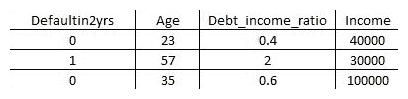

上面的截图展示的是原始数据集中一部分变量。名为`Defaultin2yrs`的变量是我们需要预测的输出变量，基于数据集中其他存在的变量。

1.  总结数据集以更好地理解变量：

```py
data.describe()
```

一旦查看输出，您将会注意到以下几点：

+   某些变量的范围较小（`age`），而其他变量的范围则大得多（`Income`）。

+   某些变量存在缺失值（`Income`）。

+   某些变量存在异常值（`Debt_income_ratio`）。在接下来的步骤中，我们将纠正所有之前标记的问题。

+   用变量的中位数值填充缺失值：

```py
vars = data.columns[1:]
import numpy as np
for var in vars:
     data[var]= np.where(data[var].isnull(),data[var].median(),data[var])
```

在上面的代码中，我们排除了第一个变量，因为它是我们要预测的变量，然后对其余变量中的缺失值进行填充（前提是该变量确实存在缺失值）。

1.  将每个变量限制在其对应的 95^(th)百分位值，以避免输入变量中出现异常值：

```py
for var in vars:
     x=data[var].quantile(0.95)
     data[var+"outlier_flag"]=np.where(data[var]>x,1,0)
     data[var]=np.where(data[var]>x,x,data[var])
```

在上面的代码中，我们已识别出每个变量的 95^(th)百分位值，创建了一个新变量，如果行中存在给定变量的异常值，则该新变量的值为 1，否则为 0。此外，我们还将变量值限制为原始值的 95^(th)百分位值。

1.  一旦我们总结了修改后的数据，我们注意到，除了`Debt_income_ratio`变量外，其他所有变量似乎都没有异常值了。因此，我们进一步限制`Debt_income_ratio`，将其输出范围限制在 80^(th)百分位值：

```py
data['Debt_income_ratio_outlier']=np.where(data['Debt_incomeratio']>1,1,0)
data['Debt_income_ratio']=np.where(data['Debt_income_ratio']>1,1,data['Debt_income_ratio'])
```

1.  将所有变量标准化到相同的尺度，使其值介于零和一之间：

```py
for var in vars:
     data[var]= data[var]/data[var].max()
```

在前面的代码中，我们通过将每个输入变量的值除以该输入变量列的最大值，将所有变量限制在一个相似的输出范围内，该范围介于零和一之间。

1.  创建输入和输出数据集：

```py
X = data.iloc[:,1:]
Y = data['Defaultin2yrs']
```

1.  将数据集划分为训练集和测试集：

```py
from sklearn.model_selection import train_test_split
X_train, X_test, y_train, y_test = train_test_split(X, Y, test_size = 0.3, random_state= 42)
```

在前一步中，我们使用`train_test_split`方法将输入和输出数组拆分为训练集和测试集，其中测试集占输入和对应输出数组总数据点的 30%。

1.  现在数据集已经创建，让我们定义神经网络模型，如下所示：

```py
from keras.models import Sequential
from keras.layers import Dense
from keras.layers import Dropout
from keras.utils import np_utils
model = Sequential()
model.add(Dense(1000, input_dim=X_train.shape[1], activation='relu'))
model.add(Dense(1, activation='sigmoid'))
model.summary()
```

模型的总结如下：

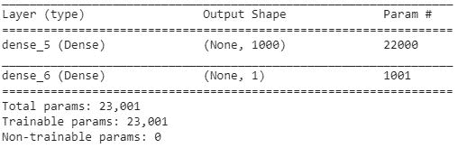

在先前的架构中，我们将输入变量连接到一个包含 1,000 个隐藏单元的隐藏层。

1.  编译模型。我们将使用二元交叉熵，因为输出变量只有两个类别。此外，我们将指定`optimizer`为`adam`优化器：

```py
model.compile(loss='binary_crossentropy', optimizer='adam', metrics=['accuracy'])
```

1.  拟合模型：

```py
history = model.fit(X_train, y_train, validation_data=(X_test, y_test), epochs=20, batch_size=1024, verbose=1)
```

训练和测试损失、准确率随着训练轮次增加的变化如下所示：

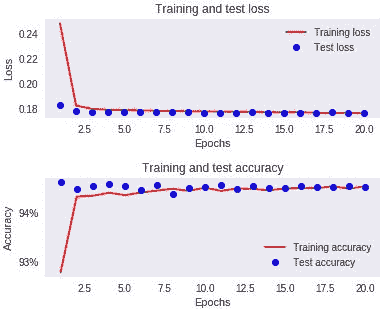

1.  对测试数据集进行预测：

```py
pred = model.predict(X_test)
```

1.  检查在按概率递减排序时，测试数据集前 10%中实际违约者的数量：

```py
test_data = pd.DataFrame([y_test]).T
test_data['pred']=pred
test_data = test_data.reset_index(drop='index')
test_data = test_data.sort_values(by='pred',ascending=False)
print(test_data[:4500]['Defaultin2yrs'].sum())
```

在前面的代码中，我们将预测值与实际值连接起来，然后按概率对数据集进行排序。我们检查了在按概率递减排序时，测试数据集前 10%（即前 4,500 行）中捕获的实际违约者的数量。

我们应注意，我们通过筛选 4,500 个高概率客户，捕获了 1,580 个实际违约者。这是一个不错的预测，因为平均而言，只有 6%的客户会违约。因此，在这种情况下，约 35%的高违约概率客户实际上发生了违约。

# 它是如何工作的...

在本教程中，我们学习了以下概念：

+   **填补** **缺失** **值**：我们了解到填补变量缺失值的一种方法是用该变量的中位数替换缺失值。处理缺失值的其他方法包括用均值替代缺失值，或者通过将缺失值替换为与包含缺失值的行最相似的行中该变量的均值（这一技术称为**识别最近邻**）。

+   **限制异常值**：我们还学到，一种限制异常值的方法是将大于 95^(th)百分位数的值替换为 95^(th)百分位数的值。我们执行此操作的原因是为了确保输入变量不会出现所有值都集中在一个小值附近的情况（当变量按最大值缩放时，该最大值为异常值）。

+   **缩放数据集**：最后，我们对数据集进行了缩放，以便它可以传递给神经网络。

# 为类别分配权重

当我们为属于违约者的行和属于非违约者的行分配相同的权重时，模型可能会对非违约者进行微调。在本节中，我们将探讨如何分配更高的权重，以便我们的模型能更好地分类违约者。

# 准备工作

在上一节中，我们为每个类别分配了相同的权重；也就是说，当实际值和预测值之间的差异大小相同时，分类交叉熵损失是相同的，无论它是用于预测违约还是非违约。

为了进一步理解这个情境，让我们考虑以下示例：

| **情境** | **违约概率** | **实际违约值** | **交叉熵损失** |
| --- | --- | --- | --- |
| 1 | *0.2* | *1* | *1*log(0.2)* |
| 2 | *0.8* | *0* | *(1-0)*log(1-0.8)* |

在之前的情境中，交叉熵损失值是相同的，无论实际违约值如何。

然而，我们知道我们的目标是尽可能多地捕获实际违约者，在通过概率排序后的前 10%预测中。

因此，让我们继续分配更高的损失权重（权重为*100*），当实际违约值为*1*时，而当实际违约值为*0*时，分配较低的权重（权重为*1*）。

之前的情境现在发生了如下变化：

| **情境** | **违约概率** | **实际违约值** | **交叉熵损失** |
| --- | --- | --- | --- |
| 1 | *0.2* | *1* | *100*1*log(0.2)* |
| 2 | *0.8* | *0* | *1*(1-0)*log(1-0.8)* |

现在，如果我们注意到交叉熵损失，当预测错误时，实际违约值为*1*的情况相比实际违约值为*0*时的预测，交叉熵损失要高得多。

现在我们已经理解了为类别分配权重的直觉，让我们继续在信用违约数据集中为输出类别分配权重。

为了构建数据集和模型执行的所有步骤与上一节相同，除了模型拟合过程。

# 如何操作…

模型拟合过程通过以下步骤完成（在实现代码时，请参考 GitHub 中的`Credit default prediction.ipynb`文件）：

```py
history = model.fit(X_train, y_train, validation_data=(X_test, y_test), epochs=10, batch_size=1024, verbose=1,class_weight = {0:1,1:100})
```

请注意，在前面的代码片段中，我们创建了一个字典，其中包含与输出中的不同类别对应的权重，然后将其作为输入传递给`class_weight`参数。

前一步骤确保我们在计算实际结果为`1`时，给损失值赋予权重`100`，而在计算实际结果为`0`时，给损失值赋予权重`1`。

随着训练轮次的增加，准确率和损失值的变化如下：

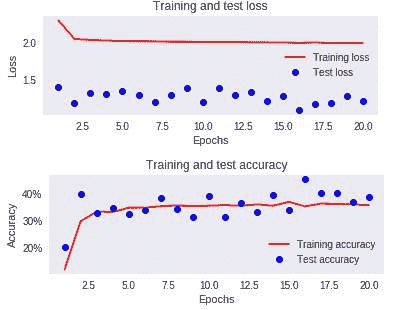

请注意，在此迭代中，准确度值显著降低，因为我们预测的数据点值为 1 的数量比在两个类别具有相等权重的场景中更多。

一旦模型训练完成，我们就可以检查在前 10%的预测中捕获到的实际违约者数量，如下所示：

```py
pred = model.predict(X_test)
test_data = pd.DataFrame([y_test[:,1]]).T
test_data['pred']=pred[:,1]
test_data = test_data.reset_index(drop='index')
test_data = test_data.sort_values(by='pred',ascending=False)
test_data.columns = ['Defaultin2yrs','pred']
print(test_data[:4500]['Defaultin2yrs'].sum())
```

你会注意到，与之前捕获了 1,580 名客户的前 10%的情况相比，在这个场景下，我们捕获了 1,640 名客户进入前 10%，因此在我们设定的目标上取得了更好的结果，在这个场景中，我们捕获了 36%的所有违约者进入前 10%的高概率客户，而在之前的场景中是 35%。

并不是所有情况下随着类权重的增加，准确率都会提高。分配类权重是一种机制，用于给我们关注的预测赋予更高的权重。

# 预测房价

在前一个案例研究中，我们的输出是分类的。在本案例研究中，我们将探讨一个连续的输出，通过尝试预测房价，其中提供了 13 个可能影响房价的变量作为输入。

目标是最小化预测房价的误差。

# 准备开始

鉴于目标是最小化误差，让我们定义我们将要最小化的误差——我们应该确保正误差和负误差不会相互抵消。因此，我们将最小化绝对误差。另一种选择是最小化平方误差。

现在我们已经微调了目标，让我们定义解决这个问题的策略：

+   对输入数据集进行归一化处理，使所有变量的范围都在 0 到 1 之间。

+   将给定数据拆分为训练集和测试集。

+   初始化隐藏层，将 13 个输入变量连接到一个输出变量。

+   使用 Adam 优化器编译模型，并定义损失函数为最小化平均绝对误差值。

+   训练模型。

+   对测试数据集进行预测。

+   计算在测试数据集上预测的误差。

现在我们已经定义了方法，让我们在下一节中使用代码来执行它。

# 如何进行...

1.  导入相关数据集（在实施代码时，请参考 GitHub 中的`Predicting house price.ipynb`文件以及推荐的数据集）：

```py
from keras.datasets import boston_housing
(train_data, train_targets), (test_data, test_targets) = boston_housing.load_data()
```

1.  对输入和输出数据集进行归一化处理，使所有变量的范围都在 0 到 1 之间：

```py
import numpy as np
train_data2 = train_data/np.max(train_data,axis=0)
test_data2 = test_data/np.max(train_data,axis=0)
train_targets = train_targets/np.max(train_targets)
test_targets = test_targets/np.max(train_targets)
```

请注意，我们已经使用训练数据集中的最大值对测试数据集进行了归一化，因为我们不应在模型构建过程中使用测试数据集中的任何值。此外，请注意，我们已对输入和输出值都进行了归一化处理。

1.  现在输入和输出数据集已经准备好，让我们继续并定义模型：

```py
from keras.models import Sequential
from keras.layers import Dense, Dropout
from keras.utils import np_utils
from keras.regularizers import l1
model = Sequential()
model.add(Dense(64, input_dim=13, activation='relu', kernel_regularizer = l1(0.1)))
model.add(Dense(1, activation='relu', kernel_regularizer = l1(0.1)))
model.summary()
```

模型的总结如下：

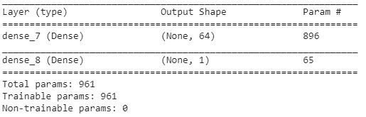

请注意，在模型构建过程中，我们执行了`L1`正则化，以防止模型在训练数据上过拟合（因为训练数据点数量较少）。

1.  编译模型以最小化平均绝对误差值：

```py
model.compile(loss='mean_absolute_error', optimizer='adam')
```

1.  拟合模型：

```py
history = model.fit(train_data2, train_targets, validation_data=(test_data2, test_targets), epochs=100, batch_size=32, verbose=1)
```

1.  计算测试数据集上的平均绝对误差：

```py
np.mean(np.abs(model.predict(test_data2) - test_targets))*50
```

我们应该注意到，平均绝对误差为*~6.7*单位。

在下一节中，我们将改变损失函数并添加自定义权重，看看是否能够改进平均绝对误差值。

# 定义自定义损失函数

在前一节中，我们使用了预定义的平均绝对误差`loss`函数进行优化。在本节中，我们将学习如何定义自定义损失函数来进行优化。

我们将构建的自定义损失函数是一个修改过的均方误差值，其中误差是实际值的平方根与预测值的平方根之间的差异。

自定义损失函数定义如下：

```py
import keras.backend as K
def loss_function(y_true, y_pred):
    return K.square(K.sqrt(y_pred)-K.sqrt(y_true))
```

现在我们已经定义了`loss`函数，我们将重新使用前面准备的输入和输出数据集，并且我们将使用我们之前定义的相同模型。

现在，让我们编译模型：

```py
model.compile(loss=loss_function, optimizer='adam')
```

在前面的代码中，请注意我们将`loss`值定义为我们之前定义的自定义损失函数—`loss_function`。

```py
history = model.fit(train_data2, train_targets, validation_data=(test_data2, test_targets), epochs=100, batch_size=32, verbose=1)
```

一旦我们拟合了模型，我们会注意到平均绝对误差约为*~6.5*单位，略低于我们在前一次迭代中使用`mean_absolute_error`损失函数时的误差。

# 将新闻文章分类为主题

在之前的案例研究中，我们分析了结构化的数据集，也就是包含变量及其对应值的数据集。在这个案例研究中，我们将处理一个以文本作为输入的数据集，预期的输出是与该文本相关的 46 个可能主题之一。

# 准备就绪

为了理解执行文本分析的直觉，我们可以考虑 Reuters 数据集，其中每篇新闻文章被分类为 46 个可能主题之一。

我们将采用以下策略来执行我们的分析：

+   由于数据集可能包含数千个独特的单词，我们将筛选出我们要考虑的单词。

+   对于这个特定的练习，我们将考虑最常见的前 10,000 个单词。

+   另一种方法是考虑那些累积起来占数据集所有单词 80%的单词。这确保了所有稀有单词被排除在外。

+   一旦选定词汇，我们将根据组成的常见词汇对文章进行独热编码。

+   类似地，我们将对输出标签进行独热编码。

+   每个输入现在是一个 10,000 维的向量，输出是一个 46 维的向量：

+   我们将数据集分为训练集和测试集。然而，在代码中，你会注意到我们将使用 Keras 中内置的`reuters`数据集，该数据集具有内置函数，可以识别最常见的`n`个词汇，并将数据集拆分为训练集和测试集。

+   在中间插入一个隐藏层，将输入和输出进行映射。

+   我们将在输出层执行 softmax 操作，以获得输入属于 46 个类别之一的概率。

+   由于我们有多个可能的输出，因此我们将使用分类交叉熵损失函数。

+   我们将编译并训练模型，以衡量其在测试数据集上的准确性。

# 如何实现...

我们将按如下方式实现之前定义的策略（实现代码时请参考 GitHub 上的`Categorizing news articles into topics.ipynb`文件）：

1.  导入数据集：

```py
from keras.datasets import reuters
(train_data, train_labels), (test_data, test_labels) = reuters.load_data(num_words=10000)
```

在上述代码片段中，我们加载了 Keras 中可用的`reuters`数据集的数据。此外，我们只考虑数据集中最常见的`10000`个词汇。

1.  检查数据集：

```py
train_data[0]
```

加载的训练数据集示例如下：

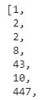

请注意，前述输出中的数字表示输出中出现的单词的索引。

1.  我们可以按如下方式提取值的索引：

```py
word_index = reuters.get_word_index()
```

1.  向量化输入。我们将以以下方式将文本转换为向量：

    +   对输入词汇进行独热编码——最终生成输入数据集中总共`10000`列。

    +   如果文本中存在某个词汇，则对应词汇索引的列将显示为 1，其他列将显示为 0。

    +   对文本中的所有唯一词汇执行上述步骤。如果一篇文本有两个唯一词汇，那么将有两列值为 1，其他所有列的值为 0：

```py
import numpy as np
def vectorize_sequences(sequences, dimension=10000):
     results = np.zeros((len(sequences), dimension))
     for i, sequence in enumerate(sequences):
         results[i, sequence] = 1.
     return results
```

在上述函数中，我们初始化了一个零矩阵，并根据输入序列中的索引值将其填充为 1。

在以下代码中，我们将单词转换为 ID。

```py
x_train = vectorize_sequences(train_data)
x_test = vectorize_sequences(test_data)
```

1.  对输出进行独热编码：

```py
from keras.utils.np_utils import to_categorical
one_hot_train_labels = to_categorical(train_labels)
one_hot_test_labels = to_categorical(test_labels)
```

上述代码将每个输出标签转换为一个长度为`46`的向量，其中`46`个值中的一个为 1，其他值为 0，具体取决于标签的索引值。

1.  定义模型并编译：

```py
from keras.models import Sequential
from keras.layers import Dense
model = Sequential()
model.add(Dense(64, activation='relu', input_shape=(10000,)))
model.add(Dense(64, activation='relu'))
model.add(Dense(46, activation='softmax'))
model.summary()
model.compile(optimizer='adam',loss='categorical_crossentropy',metrics=['accuracy'])
```

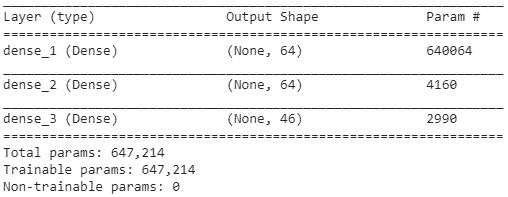

请注意，在编译时，我们将`loss`定义为`categorical_crossentropy`，因为此处的输出是分类的（输出有多个类别）。

1.  训练模型：

```py
history = model.fit(X_train, y_train,epochs=20,batch_size=512,validation_data=(X_test, y_test))
```

上述代码生成了一个模型，该模型在将输入文本分类到正确的主题时准确率为 80%，如下所示：

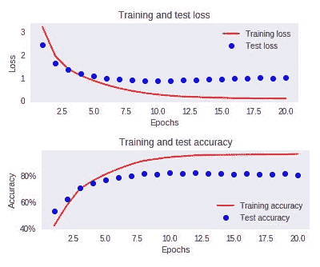

# 分类常见音频

在前面的章节中，我们已经了解了如何在结构化数据集和非结构化文本数据上执行建模策略。

在本节中，我们将学习如何进行一个分类任务，输入是原始音频。

我们将采用的策略是从输入音频中提取特征，每个音频信号都表示为一个固定数量特征的向量。

提取音频特征的方式有多种，然而在这个练习中，我们将提取与音频文件对应的**梅尔频率倒谱系数**（**MFCC**）。

一旦我们提取了特征，我们将执行分类任务，这与我们为 MNIST 数据集分类构建模型时非常相似——在那时我们有隐藏层连接输入层和输出层。

在接下来的章节中，我们将在音频数据集上执行分类任务，输出有十个可能的类别。

# 如何实现...

我们之前定义的策略的代码如下（在实现代码时，请参考 GitHub 上的`Audio classification.ipynb`文件）：

1.  导入数据集：

```py
import pandas as pd
data = pd.read_csv('/content/train.csv')
```

1.  提取每个音频输入的特征：

```py
ids = data['ID'].values
def extract_feature(file_name):
    X, sample_rate = librosa.load(file_name)
    stft = np.abs(librosa.stft(X))
    mfccs = np.mean(librosa.feature.mfcc(y=X,sr=sample_rate, n_mfcc=40).T,axis=0)
    return mfccs
```

在前面的代码中，我们定义了一个函数，该函数以`file_name`作为输入，提取与音频文件对应的`40`个 MFCC，并返回这些特征。

1.  创建输入和输出数据集：

```py
x = []
y = []
for i in range(len(ids)):     
     try:
         filename = '/content/Train/'+str(ids[i])+'.wav'
         y.append(data[data['ID']==ids[i]]['Class'].values)
         x.append(extract_feature(filename))
     except:
         continue
x = np.array(x)
```

在前面的代码中，我们逐个处理音频文件，提取其特征并将其存储在输入列表中。类似地，我们将输出类别存储在输出列表中。此外，我们还将把输出列表转换为一个独热编码的类别值：

```py
y2 = []
for i in range(len(y)):
     y2.append(y[i][0])
y3 = np.array(pd.get_dummies(y2))
```

`pd.get_dummies`方法的作用与我们之前使用的`to_categorical`方法非常相似；然而，`to_categorical`不适用于文本类别（它只适用于数值类型，将其转换为独热编码值）。

1.  构建并编译模型：

```py
model = Sequential()
model.add(Dense(1000, input_shape = (40,), activation = 'relu'))
model.add(Dense(10,activation='sigmoid'))
from keras.optimizers import Adam
adam = Adam(lr=0.0001)
model.compile(optimizer=adam, loss='categorical_crossentropy', metrics=['acc'])
```

前述模型的总结如下：

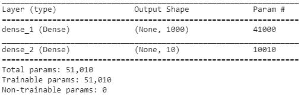

1.  创建训练和测试数据集，然后拟合模型：

```py
from sklearn.model_selection import train_test_split
X_train, X_test, y_train, y_test = train_test_split(x, y3, test_size=0.30,random_state=10)
model.fit(X_train, y_train, epochs=100, batch_size=32, validation_data=(X_test, y_test), verbose = 1)
```

一旦模型拟合完成，您会注意到模型在将音频正确分类到相应类别时的准确率为 91%。

# 股票价格预测

在前面的章节中，我们学习了如何使用神经网络进行音频、文本和结构化数据分析。在这一节中，我们将学习如何通过预测股票价格的案例研究来进行时间序列分析。

# 准备中

为了预测股票价格，我们将执行以下步骤：

1.  按照从最旧到最新的顺序排列数据集。

1.  将前五个股票价格作为输入，第六个股票价格作为输出。

1.  将窗口向前滑动，这样在下一个数据点中，第二个到第六个数据点作为输入，第七个数据点作为输出，依此类推，直到达到最后一个数据点。

1.  由于我们预测的是一个连续数值，本次的`loss`函数将是均方误差值。

此外，我们还将尝试将文本数据与历史数值数据整合，以预测第二天的股票价格。

# 如何做...

上述策略的代码如下（在实现代码并推荐数据集时，请参阅 GitHub 中的`Chapter 3 - stock price prediction.ipynb`文件）：

1.  导入相关的包和数据集：

```py
import pandas as pd
data2 = pd.read_csv('/content/stock_data.csv')
```

1.  准备数据集，其中输入是过去五天的股票价格，输出是第六天的股票价格：

```py
x= []
y = []
for i in range(data2.shape[0]-5):
 x.append(data2.loc[i:(i+4)]['Close'].values)
 y.append(data2.loc[i+5]['Close'])
import numpy as np
x = np.array(x)
y = np.array(y)
```

1.  准备训练和测试数据集，构建模型，编译并拟合它：

```py
from sklearn.model_selection import train_test_split
X_train, X_test, y_train, y_test = train_test_split(x, y, test_size=0.30,random_state=10)
```

构建模型并编译它：

```py

from keras.layers import Dense
from keras.models import Sequential, Model
model = Sequential()
model.add(Dense(100, input_dim = 5, activation = 'relu'))
model.add(Dense(1,activation='linear'))
model.compile(optimizer='adam', loss='mean_squared_error')
```

上述代码结果总结如下：

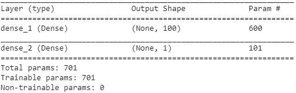

```py
model.fit(X_train, y_train, epochs=100, batch_size=64, validation_data=(X_test, y_test), verbose = 1)
```

一旦我们拟合了模型，我们应该注意到，预测股票价格的均方误差值为*~$360*，或者预测股票价格时的误差为 ~$18。

请注意，以这种方式预测股票价格存在一个陷阱。然而，这将在 RNN 应用章节中处理。

目前，我们将专注于学习神经网络在不同场景中的多种用途。

在下一部分，我们将了解如何将数值数据与新闻标题的文本数据整合到一个模型中。

# 利用功能性 API

在这一部分，我们将通过将历史价格数据与我们预测的公司最新头条数据结合，继续提高股票价格预测的准确性。

我们将采用以下策略来整合来自多个来源的数据——结构化（历史价格）数据和非结构化（头条）数据：

+   我们将以类似于将新闻文章分类为主题的方式，将非结构化文本转换为结构化格式。

+   我们将通过神经网络传递结构化文本格式，并提取隐藏层输出。

+   最后，我们将隐藏层的输出传递到输出层，输出层有一个节点。

+   以类似的方式，我们将输入的历史价格数据传递给神经网络，提取隐藏层值，然后将其传递到输出层，输出层有一个输出单元。

+   我们将每个单独神经网络操作的输出相乘，以提取最终输出。

+   最终输出的平方误差值现在将被最小化。

# 如何做...

前述策略的代码如下：

1.  让我们从《卫报》提供的 API 获取头条数据，如下所示：

```py
from bs4 import BeautifulSoup
import urllib, json

dates = []
titles = []
for i in range(100):
     try:
         url = 'https://content.guardianapis.com/search?from-date=2010-01-01&section=business&page-size=200&order-by=newest&page='+str(i+1)+'&q=amazon&api-key=207b6047-a2a6-4dd2-813b-5cd006b780d7'
         response = urllib.request.urlopen(url)
         encoding = response.info().get_content_charset('utf8')
         data = json.loads(response.read().decode(encoding))
     for j in range(len(data['response']['results'])):
         dates.append(data['response']['results'][j]['webPublicationDate'])
         titles.append(data['response']['results'][j]['webTitle']) 
     except:
         break
```

1.  一旦`titles`和`dates`被提取出来，我们将预处理数据，将`date`值转换为`date`格式，如下所示：

```py
import pandas as pd
data = pd.DataFrame(dates, titles)
data['date']=data['date'].str[:10]
data['date']=pd.to_datetime(data['date'], format = '%Y-%m-%d')
data = data.sort_values(by='date')
data_final = data.groupby('date').first().reset_index()
```

1.  既然我们已经得到了每个日期的最新头条数据，我们将整合这两个数据源，如下所示：

```py
data2['Date'] = pd.to_datetime(data2['Date'],format='%Y-%m-%d')
data3 = pd.merge(data2,data_final, left_on = 'Date', right_on = 'date', how='left')
```

1.  一旦数据集合并，我们将继续对文本数据进行归一化处理，以去除以下内容：

    +   将文本中的所有单词转换为小写，以便像`Text`和`text`这样的单词被视为相同。

    +   去除标点符号，以便像`text.`和`text`这样的单词被视为相同。

    +   去除如`a`、`and`、`the`等停用词，因为这些词对文本的上下文贡献不大：

```py
import nltk
import re
nltk.download('stopwords')
stop = nltk.corpus.stopwords.words('english')
def preprocess(text):
     text = str(text)
     text=text.lower()
     text=re.sub('[⁰-9a-zA-Z]+',' ',text)
     words = text.split()
     words2=[w for w in words if (w not in stop)]
     words4=' '.join(words2)
     return(words4)
data3['title'] = data3['title'].apply(preprocess)
```

1.  用连字符`-`替换`title`列中的所有空值：

```py
data3['title']=np.where(data3['title'].isnull(),'-','-'+data3['title'])
```

现在我们已经预处理了文本数据，接下来为每个单词分配一个 ID。一旦我们完成了这个分配，就可以进行类似于在*新闻文章分类*部分中所做的文本分析，具体如下：

```py
docs = data3['title'].values

from collections import Counter
counts = Counter()
for i,review in enumerate(docs):
     counts.update(review.split())
words = sorted(counts, key=counts.get, reverse=True)
vocab_size=len(words)
word_to_int = {word: i for i, word in enumerate(words, 1)}
```

1.  鉴于我们已经对所有单词进行了编码，接下来让我们用它们在原文中的对应文本替换：

```py
encoded_docs = []
for doc in docs:
     encoded_docs.append([word_to_int[word] for word in doc.split()])

def vectorize_sequences(sequences, dimension=vocab_size):
     results = np.zeros((len(sequences), dimension+1))
     for i, sequence in enumerate(sequences):
         results[i, sequence] = 1.
     return results
vectorized_docs = vectorize_sequences(encoded_docs)
```

现在我们已经对文本进行了编码，理解了将如何整合这两个数据源。

1.  首先，我们将准备训练集和测试集，如下所示：

```py
x1 = np.array(x)
x2 = np.array(vectorized_docs[5:])
y = np.array(y)

X1_train = x1[:2100,:]
X2_train = x2[:2100, :]
y_train = y[:2100]
X1_test = x1[2100:,:]
X2_test = x2[2100:,:]
y_test = y[2100:]
```

通常，当期望有多个输入或多个输出时，我们会使用功能性 API。在这种情况下，由于有多个输入，我们将利用功能性 API。

1.  本质上，功能性 API 去除了构建模型的顺序过程，具体操作如下。以向量化的文档作为输入，并从中提取输出：

```py
input1 = Input(shape=(2406,))
input1_hidden = (Dense(100, activation='relu'))(input1)
input1_output = (Dense(1, activation='tanh'))(input1_hidden)
```

在前面的代码中，请注意我们没有使用顺序建模过程，而是通过`Dense`层定义了各种连接。

请注意，输入的形状是`2406`，因为过滤过程后剩下了`2406`个唯一单词。

1.  以之前的`5`个股票价格作为输入，构建模型：

```py
input2 = Input(shape=(5,))
input2_hidden = (Dense(100, activation='relu'))(input2)
input2_output = (Dense(1, activation='linear'))(input2_hidden)
```

1.  我们将对两个输入的输出进行相乘：

```py
from keras.layers import multiply
out = multiply([model, model2])
```

1.  现在我们已经定义了输出，接下来将按如下方式构建模型：

```py
model = Model([input1, input2], out)
model.summary()
```

请注意，在前面的步骤中，我们使用了`Model`层来定义输入（作为列表传递）和输出：

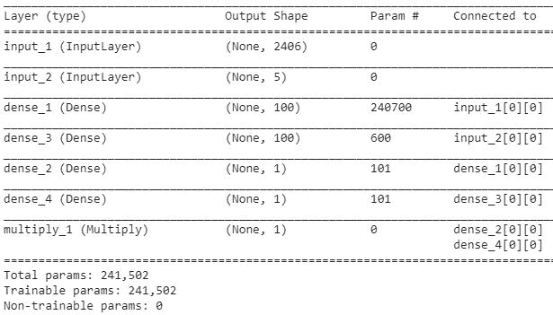

上述输出的可视化结果如下：

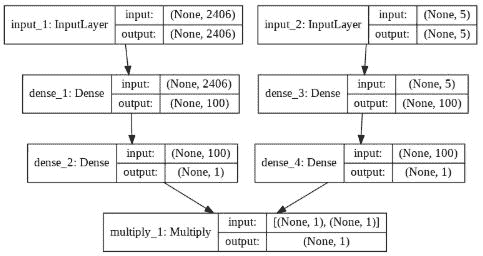

1.  编译并拟合模型：

```py
model.compile(optimizer='adam', loss='mean_squared_error')
model.fit(x=[X2_train, X1_train], y=y_train, epochs=100,batch_size = 32, validation_data = ([X2_test, X1_test], y_test))
```

上述代码的结果是平均平方误差为*~5000*，并清楚地表明模型存在过拟合现象，因为训练集的损失远低于测试集的损失。

可能，过拟合是由于向量化文本数据中维度过高所导致的。我们将在第十一章中探讨如何改进这一点，*构建递归神经网络*。

# 为行定义权重

在*预测房价*食谱中，我们了解了如何定义自定义损失函数。然而，我们目前还无法为某些行分配更高的权重。 (我们曾在一个信用违约预测案例研究中做过类似的练习，当时我们为一个类别分配了较高的权重；然而那是一个分类问题，而我们当前解决的问题是一个连续变量预测问题。)

在本节中，我们将为每一行定义权重，并将其传递给我们将要定义的`custom_loss`函数。

我们将继续使用在*股票价格预测*食谱中分析过的相同数据集。

# 如何做到……

1.  为了在行级别上指定权重，我们将修改训练和测试数据集，使得按顺序排列后的前`2100`个数据点属于训练数据集，其余的数据点属于测试数据集：

```py
X_train = x[:2100,:,:]
y_train = y[:2100]
X_test = x[2100:,:,:]
y_test = y[2100:]
```

1.  输入中的一行如果较为近期发生，则会有较高的权重，反之则权重较低：

```py
weights = np.arange(X_train.shape[0]).reshape((X_train.shape[0]),1)/2100
```

前面的代码块为初始数据点分配了较低的权重，为最近发生的数据点分配了较高的权重。

现在我们已经为每一行定义了权重，我们将在自定义损失函数中包含它们。请注意，在这种情况下，我们的自定义损失函数将包括输出的预测值和实际值，以及需要为每一行分配的权重。

1.  部分方法使我们能够传递比实际值和预测值更多的变量给自定义损失函数：

```py
import keras.backend as K
from functools import partial
```

1.  为了将`weights`传递给`custom_loss`函数，我们将使用部分函数，将`custom_loss`和`weights`作为参数传递给第 7 步。在接下来的代码中，我们定义了`custom_loss`函数：

```py
def custom_loss_4(y_true, y_pred, weights):
     return K.square(K.abs(y_true - y_pred) * weights)
```

1.  考虑到我们构建的模型有两个输入——输入变量和每一行对应的权重，我们将首先定义这两个输入的`shape`如下：

```py
input_layer = Input(shape=(5,1))
weights_tensor = Input(shape=(1,))
```

1.  现在我们已经定义了输入，让我们按以下方式初始化接受两个输入的`model`：

```py
inp1 = Dense(1000, activation='relu')(input_layer)
out = Dense(1, activation='linear')(i3)
model = Model([input_layer, weights_tensor], out)
```

1.  现在我们已经初始化了`model`，我们将按以下方式定义优化函数：

```py
cl4 = partial(custom_loss_4, weights=weights_tensor)
```

在前述场景中，我们指定需要最小化`custom_loss_4`函数，并且向自定义损失函数提供了一个额外的变量（`weights_tensor`）。

1.  最后，在拟合模型之前，我们还将为每一行提供对应测试数据集的`weights`。考虑到我们正在预测这些值，给某些行提供较低的权重是没有意义的，因为测试数据集并没有提供给模型。然而，我们只会在使用我们定义的模型进行预测时指定这一点（该模型接受两个输入）：

```py
test_weights = np.ones((156,1))
```

1.  一旦我们指定了测试数据的`weights`，我们将继续按照以下方式拟合模型：

```py
model = Model([input_layer, weights_tensor], out)
model.compile(adam, cl4)
model.fit(x=[X_train, weights], y=y_train, epochs=300,batch_size = 32, validation_data = ([X_test, test_weights], y_test))
```

上述结果导致测试数据集的损失与我们在前一节中看到的结果大不相同。我们将在第十一章，《构建循环神经网络》一章中更详细地探讨这一原因。

在实现上述模型时，必须格外小心，因为它存在一些陷阱。然而，通常建议在进行充分的尽职调查后再实现预测股价波动的模型。
