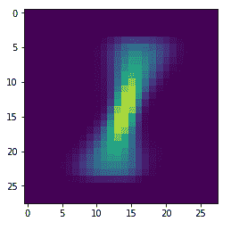
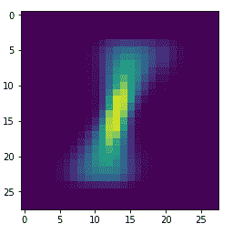
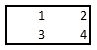
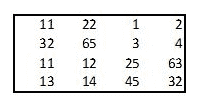

# 第四章：构建深度卷积神经网络

在本章中，我们将讨论以下内容：

+   传统神经网络在图像平移时的不准确性

+   使用 Python 从零开始构建 CNN

+   使用 CNN 改善图像平移时的准确性

+   使用 CNN 进行性别分类

+   数据增强以提高网络准确性

# 介绍

在前一章节中，我们介绍了传统的深度前馈神经网络。传统深度前馈神经网络的一个局限性是它不具有平移不变性，即图像右上角的猫图像会被认为与图像中央的猫图像不同。此外，传统神经网络受物体尺度的影响。如果物体在大多数图像中占据较大的位置，而新图像中的物体较小（占据图像的较小部分），传统神经网络很可能在分类图像时失败。

**卷积神经网络**（**CNNs**）用于解决这些问题。由于 CNN 能够处理图像中的平移以及图像的尺度问题，因此在物体分类/检测中被认为更为有效。

在本章中，你将学习以下内容：

+   传统神经网络在图像平移时的不准确性

+   使用 Python 从零开始构建 CNN

+   使用 CNN 改善 MNIST 数据集上的图像分类

+   实现数据增强以提高网络准确性

+   使用 CNN 进行性别分类

# 传统神经网络在图像平移时的不准确性

为了进一步理解 CNN 的必要性，我们将首先了解为什么当图像被平移时，前馈**神经网络**（**NN**）不起作用，然后看看 CNN 是如何改进传统前馈神经网络的。

我们来看看以下场景：

+   我们将构建一个神经网络模型来预测 MNIST 数据集中的标签

+   我们将考虑所有标签为 1 的图像，并对它们求平均（生成一张平均的 1 标签图像）

+   我们将使用传统的神经网络预测我们在上一步生成的平均 1 标签图像的标签

+   我们将把平均 1 标签图像平移 1 个像素到左边或右边

+   我们将使用传统神经网络模型对平移后的图像进行预测

# 如何做到......

上述定义的策略代码如下（请参考 GitHub 中的`Issue_with_image translation.ipynb`文件以实现代码）

1.  下载数据集并提取训练集和测试集的 MNIST 数据集：

```py
from keras.datasets import mnist
from keras.layers import Flatten, Dense
from keras.models import Sequential
import matplotlib.pyplot as plt
%matplotlib inline
(X_train, y_train), (X_test, y_test) = mnist.load_data()
```

1.  获取对应标签`1`的训练集：

```py
X_train1 = X_train[y_train==1]
```

1.  重新调整和标准化原始训练数据集：

```py
num_pixels = X_train.shape[1] * X_train.shape[2]
X_train = X_train.reshape(X_train.shape[0],num_pixels).astype('float32')
X_test = X_test.reshape(X_test.shape[0],num_pixels).astype('float32')
X_train = X_train / 255
X_test = X_test / 255
```

1.  对输出标签进行独热编码：

```py
y_train = np_utils.to_categorical(y_train)
y_test = np_utils.to_categorical(y_test)
num_classes = y_train.shape[1]
```

1.  构建模型并进行拟合：

```py
model = Sequential()
model.add(Dense(1000, input_dim=num_pixels, activation='relu'))
model.add(Dense(num_classes, activation='softmax'))
model.compile(loss='categorical_crossentropy', optimizer='adam',metrics=['accuracy'])
model.fit(X_train, y_train, validation_data=(X_test, y_test),epochs=5, batch_size=1024, verbose=1)
```

1.  让我们绘制在第二步中获得的平均 1 标签图像：

```py
pic=np.zeros((28,28))
pic2=np.copy(pic)
for i in range(X_train1.shape[0]):
    pic2=X_train1[i,:,:]
    pic=pic+pic2
pic=(pic/X_train1.shape[0])
plt.imshow(pic)
```

在前面的代码中，我们初始化了一个 28x28 大小的空图像，并通过遍历`X_train1`对象中的所有值，在标记为 1 的图像的不同像素位置取了平均像素值。

平均 1 图像的绘图如下所示：



需要注意的是，像素越黄色（越厚），人们在该像素上书写的次数越多，而像素越不黄色（更蓝/更薄），人们在该像素上书写的次数就越少。还需要注意的是，图像中央的像素是最黄/最厚的（这是因为大多数人都会在中间的像素上书写，无论整个数字是垂直书写还是向左或向右倾斜）。

# 传统神经网络的问题

**情境 1**：让我们创建一个新图像，其中原始图像向左平移了 1 个像素。在下面的代码中，我们遍历图像的列，并将下一列的像素值复制到当前列：

```py
for i in range(pic.shape[0]):
     if i<20:
         pic[:,i]=pic[:,i+1]
     plt.imshow(pic)
```

左侧翻译后的平均 1 图像如下所示：



让我们继续使用构建好的模型预测图像的标签：

```py
model.predict(pic.reshape(1,784)/255)
```

模型对翻译后的图像的预测结果如下所示：


我们可以看到预测为 1，尽管它的概率低于像素未翻译时的预测。

**情境 2**：创建一个新图像，其中原始平均 1 图像的像素向右平移了 2 个像素：

```py
pic=np.zeros((28,28))
pic2=np.copy(pic)
for i in range(X_train1.shape[0]):
    pic2=X_train1[i,:,:]
    pic=pic+pic2
pic=(pic/X_train1.shape[0])
pic2=np.copy(pic)
for i in range(pic.shape[0]):
    if ((i>6) and (i<26)):
    pic[:,i]=pic2[:,(i-1)]
plt.imshow(pic)
```

右侧翻译后的平均 1 图像如下所示：


这张图像的预测结果如下所示：

```py
model.predict(pic.reshape(1,784)/255)
```

模型对翻译后的图像的预测结果如下所示：


我们可以看到预测结果不正确，输出为 3。这正是我们通过使用 CNN 来解决的问题。

# 使用 Python 从零开始构建 CNN

在本节中，我们将通过使用 NumPy 从零开始构建一个前馈网络，学习 CNN 是如何工作的。

# 准备工作

典型的 CNN 有多个组成部分。在本节中，我们将在理解 CNN 如何改善图像翻译预测准确性之前，了解 CNN 的各个组件。

# 理解卷积

我们已经了解了典型神经网络是如何工作的。在本节中，让我们理解 CNN 中卷积过程的工作原理。

# 滤波器

卷积是两个矩阵之间的乘法——一个矩阵较大，另一个较小。为了理解卷积，考虑以下例子：

矩阵 *A* 如下所示：


矩阵 *B* 如下所示：



在执行卷积操作时，可以将其视为将较小的矩阵滑动到较大的矩阵上，即在较大的矩阵区域内滑动时，可能会出现九种这样的乘法。请注意，这不是矩阵乘法。

较大矩阵与较小矩阵之间的各种乘法如下：

1.  *{1, 2, 5, 6}* 的较大矩阵与 *{1, 2, 3, 4}* 的较小矩阵相乘：

*1*1 + 2*2 + 5*3 + 6*4 = 44*

1.  *{2, 3, 6, 7}* 的较大矩阵与 *{1, 2, 3, 4}* 的较小矩阵相乘：

*2*1 + 3*2 + 6*3 + 7*4 = 54*

1.  *{3, 4, 7, 8}* 的较大矩阵与 *{1, 2, 3, 4}* 的较小矩阵相乘：

*3*1 + 4*2 + 7*3 + 8*4 = 64*

1.  *{5, 6, 9, 10}* 的较大矩阵与 *{1, 2, 3, 4}* 的较小矩阵相乘：

*5*1 + 6*2 + 9*3 + 10*4 = 84*

1.  *{6, 7, 10, 11}* 的较大矩阵与 *{1, 2, 3, 4}* 的较小矩阵相乘：

*6*1 + 7*2 + 10*3 + 11*4 = 94*

1.  *{7, 8, 11, 12}* 的较大矩阵与 *{1, 2, 3, 4}* 的较小矩阵相乘：

*7*1 + 8*2 + 11*3 + 12*4 = 104*

1.  *{9, 10, 13, 14}* 的较大矩阵与 *{1, 2, 3, 4}* 的较小矩阵相乘：

*9*1 + 10*2 + 13*3 + 14*4 = 124*

1.  *{10, 11, 14, 15}* 的较大矩阵与 *{1, 2, 3, 4}* 的较小矩阵相乘：

*10*1 + 11*2 + 14*3 + 15*4 = 134*

1.  *{11, 12, 15, 16}* 的较大矩阵与 *{1, 2, 3, 4}* 的较小矩阵相乘：

*11*1 + 12*2 + 15*3 + 16*4 = 144*

前述步骤的结果将是以下矩阵：


通常，较小的矩阵称为滤波器或卷积核，滤波器的数值通过梯度下降统计得到。滤波器中的数值是其组成权重。

实际上，当图像输入形状为 224 x 224 x 3 时，其中有 3 个通道，一个 3 x 3 的滤波器也会有 3 个通道，这样就能进行矩阵乘法（求和积）。

一个滤波器的通道数与其乘以的矩阵的通道数相同。

# 步幅

在前述步骤中，由于滤波器每次水平和垂直移动一步，因此滤波器的步幅为 (1, 1)。步幅数值越大，跳过的矩阵乘法值就越多。

# 填充

在前述步骤中，我们遗漏了将滤波器的最左边值与原矩阵的最右边值相乘。如果我们执行这样的操作，我们需要确保在原矩阵的边缘周围进行零填充（即图像边缘填充零）。这种填充方式称为 **有效** 填充。我们在 *理解卷积* 配方的 *滤波器* 部分进行的矩阵乘法是 **相同** 填充的结果。

# 从卷积到激活

在传统的神经网络中，隐藏层不仅通过权重乘以输入值，还对数据应用非线性处理，即将值通过激活函数传递。

在典型的卷积神经网络中也会发生类似的活动，其中卷积通过激活函数处理。CNN 支持我们目前见过的传统激活函数：sigmoid、ReLU、tanh 和 leaky ReLU。

对于前面的输出，我们可以看到当通过 ReLU 激活函数时，输出保持不变，因为所有数字都是正数。

# 从卷积激活到池化

在前一部分，我们研究了卷积是如何工作的。在这一部分，我们将了解卷积之后的典型下一步：池化。

假设卷积步骤的输出如下（我们不考虑前面的例子，这是一个新的例子，仅用于说明池化是如何工作的）：


在前面的情况下，卷积步骤的输出是一个 2 x 2 矩阵。最大池化会考虑这个 2 x 2 块，并将最大值作为输出。同样，假设卷积步骤的输出是一个更大的矩阵，如下所示：



最大池化将大矩阵分成不重叠的 2 x 2 块（当步幅值为 2 时），如下所示：


从每个块中，只有具有最大值的元素被选中。所以，前面矩阵的最大池化操作输出将是以下内容：


在实践中，并不总是需要一个 2 x 2 的窗口，但它比其他类型的窗口更常用。

其他类型的池化包括求和和平均池化——在实践中，与其他类型的池化相比，我们看到最大池化的应用更多。

# 卷积和池化是如何帮助的？

在 MNIST 示例中，传统神经网络的一个缺点是每个像素都与一个独特的权重相关联。

因此，如果一个相邻的像素（而不是原始像素）被突出显示，而不是原始像素，那么输出就不会非常准确（比如*场景 1*中的例子，平均值稍微偏左于中心）。

现在这个问题得到了处理，因为像素共享在每个过滤器中构成的权重。

所有像素都与构成滤波器的所有权重相乘。在池化层中，仅选择卷积后的值较大的值。

这样，无论突出显示的像素是否位于中心，或者稍微偏离中心，输出通常都会是预期的值。

然而，当突出显示的像素远离中心时，问题依然存在。

# 如何操作...

为了更好地理解，我们将使用 Keras 构建基于 CNN 的架构，并通过从头构建 CNN 的前馈传播部分，与使用 Keras 得到的输出进行对比，来验证我们对 CNN 工作原理的理解。

让我们用一个玩具示例来实现 CNN，其中输入和期望的输出数据已定义（代码文件在 GitHub 上可用，名为 `CNN_working_details.ipynb`）：

1.  创建输入和输出数据集：

```py
import numpy as np
X_train=np.array([[[1,2,3,4],[2,3,4,5],[5,6,7,8],[1,3,4,5]],
[[-1,2,3,-4],[2,-3,4,5],[-5,6,-7,8],[-1,-3,-4,-5]]])
y_train=np.array([0,1])
```

在前面的代码中，我们创建了数据，其中正输入输出 `0`，负输入输出 `1`。

1.  缩放输入数据集：

```py
X_train = X_train / 8
```

1.  重塑输入数据集，使得每个输入图像以宽度 `x` 高度 `x` 通道数的格式表示：

```py
X_train = X_train.reshape(X_train.shape[0],X_train.shape[1],X_train.shape[1],1 ).astype('float32')
```

1.  构建模型架构：

导入相关方法后实例化模型：

```py
from keras.layers import Conv2D, MaxPooling2D, Flatten, Dense
from keras.models import Sequential
model = Sequential()
```

在下一步中，我们执行卷积操作：

```py
model.add(Conv2D(1, (3,3), input_shape=(4,4,1),activation='relu'))
```

在前一步中，我们对输入数据执行了二维卷积（在 *理解卷积* 章节中看到的矩阵乘法），其中使用了 1 个 3 × 3 大小的滤波器。

此外，鉴于这是模型实例化后的第一层，我们指定了输入形状，即 (4, 4, 1)。

最后，我们对卷积的输出执行 ReLU 激活。

在这种情况下，卷积操作的输出形状为 2 × 2 × 1，因为权重与输入的矩阵乘法会得到一个 2 × 2 的矩阵（假设默认步长为 1 × 1）。

此外，输出的大小会缩小，因为我们没有对输入进行填充（即在输入图像周围添加零）。

在下一步中，我们添加一个执行最大池化操作的层，具体如下：

```py
model.add(MaxPooling2D(pool_size=(2, 2))) 
```

我们对来自上一层的输出执行最大池化操作，池化大小为 2 × 2。这意味着计算图像中 2 × 2 部分的最大值。

请注意，在池化层中使用 2 × 2 的步长，在这种情况下不会影响输出，因为前一步的输出是 2 × 2。然而，一般来说，步长大于 1 × 1 的情况会影响输出形状。

让我们展平池化层的输出：

```py
model.add(Flatten())
```

一旦我们执行展平操作，过程就变得非常类似于我们在标准前馈神经网络中所执行的操作，在这种网络中，输入与隐藏层连接，再到输出层（我们也可以将输入连接到更多的隐藏层！）。

我们将展平层的输出直接连接到输出层，并使用 sigmoid 激活：

```py
model.add(Dense(1, activation='sigmoid'))
```

可以获得模型的总结，结果如下：

```py
model.summary()
```

输出的总结如下：


请注意，卷积层中有 10 个参数，因为一个 3 x 3 的滤波器会有 9 个权重和 1 个偏置项。池化层和展平层没有任何参数，因为它们要么在某个区域提取最大值（最大池化），要么展平上一层的输出（展平层），因此在这些层中没有需要修改权重的操作。

输出层有两个参数，因为展平层有一个输出，该输出连接到输出层，输出层有一个值——因此我们将有一个权重和一个偏置项连接展平层和输出层。

1.  编译并训练模型：

```py
model.compile(loss='binary_crossentropy', optimizer='adam',metrics=['accuracy'])
```

在前面的代码中，我们将损失函数指定为二元交叉熵，因为输出结果要么是`1`，要么是`0`。

1.  训练模型：

```py
model.fit(X_train, y_train, epochs = 500)
```

我们正在训练模型，以获得将输入层与输出层连接的最优权重。

# 验证 CNN 输出

现在我们已经训练了模型，让我们通过实现 CNN 的前向传播部分来验证我们从模型中获得的输出：

1.  让我们提取权重和偏置呈现的顺序：

```py
model.weights
```


你可以看到卷积层的权重首先被展示，然后是偏置，最后是输出层中的权重和偏置。

还请注意，卷积层中的权重形状是(3, 3, 1, 1)，因为滤波器的形状是 3 x 3 x 1（因为图像是三维的：28 x 28 x 1），最后的 1（形状中的第四个值）表示在卷积层中指定的滤波器数量。

如果我们在卷积中指定了 64 个滤波器，则权重的形状将是 3 x 3 x 1 x 64。

类似地，如果卷积操作是在具有 3 个通道的图像上执行的，则每个滤波器的形状将是 3 x 3 x 3。

1.  提取各层的权重值：

```py
model.get_weights()
```

1.  让我们提取第一个输入的输出，以便我们能够通过前向传播验证它：

```py
model.predict(X_train[0].reshape(1,4,4,1))
```


我们运行的迭代输出为 0.0428（当你运行模型时，这个值可能会不同，因为权重的随机初始化可能不同），我们将通过执行矩阵乘法来验证它。

我们在将输入传递给预测方法时正在重新调整输入的形状，因为该方法期望输入的形状为(None, 4, 4, 1)，其中 None 表示批次大小可以是任意数字。

1.  执行滤波器与输入图像的卷积操作。请注意，输入图像的形状是 4 x 4，而滤波器的形状是 3 x 3。在这里，我们将在代码中沿着行和列执行矩阵乘法（卷积）：

```py
sumprod = []
for i in range(X_train[0].shape[0]-model.get_weights()[0].shape[0]+1):
     for j in range(X_train[0].shape[0]-model.get_weights()[0].shape[0]+1):
         img_subset = np.array(X_train[0,i:(i+3),j:(j+3),0])
         filter = model.get_weights()[0].reshape(3,3)
         val = np.sum(img_subset*filter) + model.get_weights()[1]
         sumprod.append(val)
```

在前面的代码中，我们初始化了一个名为`sumprod`的空列表，用来存储每次滤波器与图像子集（图像子集的大小与滤波器一致）进行矩阵乘法的输出。

1.  重新调整 `sumprod` 的输出形状，以便将其传递给池化层：

```py
sumprod= np.array(sumprod).reshape(2,2,1)
```

1.  在将卷积输出传递到池化层之前，先对其进行激活操作：

```py
sumprod = np.where(sumprod>0,sumprod,0)
```

1.  将卷积输出传递到池化层。然而，在当前的情况下，由于卷积输出是 2 x 2，我们将简单地取出在 *第 6 步* 中获得的输出的最大值：

```py
pooling_layer_output = np.max(sumprod)
```

1.  将池化层的输出连接到输出层：

```py
intermediate_output_value = pooling_layer_output*model.get_weights()[2]+model.get_weights()[3]
```

我们将池化层的输出与输出层的权重相乘，并加上输出层的偏置。

1.  计算 sigmoid 输出：

```py
1/(1+np.exp(-intermediate_output_value))
```

前一步操作的输出如下：


你在这里看到的输出将与我们使用 `model.predict` 方法获得的输出相同，从而验证我们对 CNN 工作原理的理解。

# CNN 用于提高图像平移情况下的准确性

在前面的章节中，我们学习了图像平移问题以及 CNN 是如何工作的。在这一节中，我们将利用这些知识，学习 CNN 如何通过改进预测精度来处理图像平移。

# 准备中

我们将采用的构建 CNN 模型的策略如下：

+   由于输入形状为 28 x 28 x 1，滤波器的大小应为 3 x 3 x 1：

    +   请注意，滤波器的大小可以变化，但通道的数量不能变化

+   让我们初始化 10 个滤波器

+   我们将在前一步中对输入图像进行 10 个滤波器卷积得到的输出上执行池化操作：

    +   这将导致图像尺寸的减半

+   我们将展平池化操作后的输出

+   展平层将连接到另一个具有 1,000 个单元的隐藏层

+   最后，我们将隐藏层连接到输出层，其中有 10 个可能的类别（因为有 10 个数字，从 0 到 9）

一旦我们构建好模型，我们将对平均 1 图像 1 像素进行平移，然后测试 CNN 模型在平移图像上的预测结果。请注意，在这种情况下，前馈神经网络架构无法预测正确的类别。

# 如何实现...

让我们通过代码理解如何在 MNIST 数据上使用 CNN（代码文件可在 GitHub 上找到，文件名为 `CNN_image_translation.ipynb`）：

1.  加载并预处理数据：

```py
(X_train, y_train), (X_test, y_test) = mnist.load_data()
X_train = X_train.reshape(X_train.shape[0],X_train.shape[1],X_train.shape[1],1 ).astype('float32')
X_test = X_test.reshape(X_test.shape[0],X_test.shape[1],X_test.shape[1],1).astype('float32')

X_train = X_train / 255
X_test = X_test / 255

y_train = np_utils.to_categorical(y_train)
y_test = np_utils.to_categorical(y_test)

num_classes = y_test.shape[1]
```

请注意，我们在此步骤中执行的所有步骤与我们在 第二章 *构建深度前馈神经网络* 中所执行的相同。

1.  构建并编译模型：

```py
from keras.layers import Conv2D, MaxPooling2D, Flatten, Dense
from keras.models import Sequential
model = Sequential()
model.add(Conv2D(10, (3,3), input_shape=(28, 28,1),activation='relu'))
model.add(MaxPooling2D(pool_size=(2, 2)))
model.add(Flatten())
model.add(Dense(1000, activation='relu'))
model.add(Dense(num_classes, activation='softmax'))
```

我们在前面的代码中初始化的模型的摘要如下：

```py
model.summary()
```

模型摘要如下：


卷积层总共有 100 个参数，因为有 10 个 3 x 3 x 1 的滤波器，总共有 90 个权重参数。另外，10 个偏置项（每个滤波器一个）加起来形成卷积层的 100 个参数。

请注意，最大池化没有任何参数，因为它是从 2 × 2 大小的区域内提取最大值。

1.  训练模型：

```py
model.fit(X_train, y_train, validation_data=(X_test, y_test),epochs=5, batch_size=1024, verbose=1)
```

前述模型在 5 个训练周期中达到了 98% 的准确率：


1.  让我们识别出平均的 1 张图像，然后将其平移 `1` 个单位：

```py
X_test1 = X_test[y_test[:,1]==1]
```

在前述代码中，我们筛选出了所有标签为 `1` 的图像输入：

```py
import numpy as np
pic=np.zeros((28,28))
pic2=np.copy(pic)
for i in range(X_test1.shape[0]):
     pic2=X_test1[i,:,:,0]
     pic=pic+pic2
pic=(pic/X_test1.shape[0])
```

在前面的代码中，我们取了平均的 1 张图像：

```py
for i in range(pic.shape[0]):
     if i<20:
         pic[:,i]=pic[:,i+1]
```

在前述代码中，我们将平均的 1 张图像中的每个像素向左平移 1 个单位。

1.  对翻译后的 1 张图像进行预测：

```py
model.predict(pic.reshape(1,28,28,1))
```

前一步的输出结果如下：


请注意，当前使用 CNN 进行预测时，相较于深度前馈神经网络模型（在 *传统神经网络在图像翻译时的不准确性* 部分预测为 0.6335），其预测值（0.9541）对标签 `1` 的概率更高。

# 使用 CNN 进行性别分类

在前面的章节中，我们学习了 CNN 是如何工作的，以及 CNN 是如何解决图像翻译问题的。

在本节中，我们将通过构建一个模型，进一步了解 CNN 是如何工作的，目的是检测图像中人物的性别。

# 准备就绪

在本节中，我们将制定如何解决该问题的策略：

+   我们将收集图像数据集，并根据图像中人物的性别对每张图像进行标签

+   我们只会处理 2,000 张图像，因为数据获取过程对我们的数据集来说耗时较长（因为在这个案例中我们是手动从网站下载图像）。

+   此外，我们还将确保数据集中男性和女性图像的比例相等。

+   一旦数据集准备好，我们将把图像调整为相同的大小，以便它们可以输入到 CNN 模型中。

+   我们将构建 CNN 模型，输出层的类别数为两个标签的数量

+   鉴于这是一个从数据集中预测两个标签之一的案例，我们将最小化二元交叉熵损失。

# 如何实现...

在本节中，我们将编码之前定义的策略（代码文件已上传至 GitHub，文件名为 `Gender classification.ipynb`）：

1.  下载数据集：

```py
$ wget https://d1p17r2m4rzlbo.cloudfront.net/wp-content/uploads/2017/04/a943287.csv
```

1.  加载数据集并检查其内容：

```py
import pandas as pd, numpy as np
from skimage import io
# Location of file is /content/a943287.csv
# be sure to change to location of downloaded file on your machine
data = pd.read_csv('/content/a943287.csv')
data.head() 
```

数据集中的一些关键字段示例如下：


1.  从数据集中提供的 URL 链接获取 1,000 张男性图像和 1,000 张女性图像：

```py
data_male = data[data['please_select_the_gender_of_the_person_in_the_picture']=="male"].reset_index(drop='index')
data_female = data[data['please_select_the_gender_of_the_person_in_the_picture']=="female"].reset_index(drop='index')
final_data = pd.concat([data_male[:1000],data_female[:1000]],axis=0).reset_index(drop='index')
```

在前述代码中，`final_data` 包含了 1,000 张男性图像和 1,000 张女性图像的 URL 链接。读取这些 URL 链接并获取对应的图像。确保所有图像的尺寸为 300 × 300 × 3（因为该数据集中大多数图像都是这个尺寸），并且处理任何禁止访问的问题：

```py
x = []
y = []
for i in range(final_data.shape[0]):
     try:
         image = io.imread(final_data.loc[i]['image_url'])
         if(image.shape==(300,300,3)):
             x.append(image)
             y.append(final_data.loc[i]['please_select_the_gender_of_the_person_in_the_picture'])
     except:
         continue
```

输入样本及其对应的情感标签如下所示：


1.  创建输入和输出数组：

```py
x2 = []
y2 = []
for i in range(len(x)):
      img = cv2.cvtColor(x[i], cv2.COLOR_BGR2GRAY)
      img2 = cv2.resize(img,(50,50))
      x2.append(img2)
      img_label = np.where(y[i]=="male",1,0)
      y2.append(img_label)
```

在前面的步骤中，我们已经将彩色图像转换为灰度图像，因为图像的颜色可能会增加额外的信息（我们将在第五章，*迁移学习*中验证这个假设）。

此外，我们将图像调整为较小的尺寸（50 x 50 x 1）。结果如下所示：


最后，我们将输出转换为一热编码版本。

1.  创建训练集和测试集。首先，我们将输入和输出列表转换为数组，然后调整输入的形状，使其能够作为 CNN 的输入：

```py
x2 = np.array(x2)
x2 = x2.reshape(x2.shape[0],x2.shape[1],x2.shape[2],1)
Y = np.array(y2)
```

`x2`的第一个值的输出如下：


请注意，输入的值在`0`到`255`之间，因此我们必须对其进行缩放：

```py
X = np.array(x2)/255
Y = np.array(y2)
```

最后，我们将输入和输出数组分割成训练集和测试集：

```py
from sklearn.model_selection import train_test_split
X_train, X_test, y_train, y_test = train_test_split(X,Y, test_size=0.1, random_state=42)
print(X_train.shape, X_test.shape, y_train.shape, y_test.shape)
```

训练和测试输入、输出数组的形状如下：


1.  构建并编译模型：

```py
from keras.layers import Conv2D, MaxPooling2D, Flatten, Dense
from keras.models import Sequential
model = Sequential()
model.add(Conv2D(64, kernel_size=(3, 3), activation='relu',input_shape=(50,50,1)))
model.add(MaxPooling2D(pool_size=(5, 5)))
model.add(Conv2D(128, kernel_size=(3, 3), activation='relu',padding='same'))
model.add(MaxPooling2D(pool_size=(2, 2)))
model.add(Conv2D(256, kernel_size=(3, 3), activation='relu',padding='same'))
model.add(MaxPooling2D(pool_size=(2, 2)))
model.add(Conv2D(512, kernel_size=(3, 3), activation='relu',padding='same'))
model.add(Flatten())
model.add(Dense(100, activation='relu'))
model.add(Dense(1, activation='sigmoid'))
model.summary()
```

模型的总结如下：


请注意，卷积层输出的通道数将等于该层中指定的过滤器数量。此外，我们对第一个卷积层的输出进行了稍微更激进的池化。

现在，我们将编译模型，以最小化二元交叉熵损失（因为输出只有两个类别），如下所示：

```py
model.compile(loss='binary_crossentropy',optimizer='adam',metrics=['accuracy'])
```

1.  拟合模型：

```py
history = model.fit(X_train, y_train, batch_size=32, epochs=50,verbose=1,validation_data = (X_test, y_test))
```


一旦我们拟合模型，就可以看到之前的代码在预测图像中的性别时，准确率约为 80%。

# 还有更多内容...

可以通过以下方法进一步提高分类的准确性：

+   处理更多图像

+   处理更大的图像（而不是 50 x 50 的图像），这些图像将用于训练更大的网络

+   利用迁移学习（将在第五章中讨论，*迁移学习*）

+   通过正则化和丢弃法避免过拟合

# 数据增强以提高网络准确率

如果图像从原始位置移动，则很难准确分类图像。然而，给定一张图像，无论我们如何平移、旋转或缩放图像，图像的标签保持不变。数据增强是一种从给定图像集创建更多图像的方法，即通过旋转、平移或缩放它们，并将它们映射到原始图像的标签。

这个直觉如下：即使图像稍微旋转，或者图像中的人从图像中间移到图像的最右边，图像仍然会对应于该人。

因此，我们应该能够通过旋转和平移原始图像来创建更多的训练数据，而我们已经知道每个图像对应的标签。

# 准备工作

在这个示例中，我们将使用 CIFAR-10 数据集，该数据集包含 10 个不同类别的物体图像。

我们将使用的策略如下：

+   下载 CIFAR-10 数据集

+   预处理数据集

    +   对输入值进行缩放

    +   对输出类别进行独热编码

+   构建一个包含多个卷积和池化层的深度 CNN

+   编译并拟合模型，测试其在测试数据集上的准确性

+   生成训练数据集中原始图像的随机平移

+   对在上一步中构建的相同模型架构进行拟合，使用全部图像（生成的图像加上原始图像）

+   检查模型在测试数据集上的准确性

我们将使用`ImageDataGenerator`方法在`keras.preprocessing.image`包中实现数据增强。

# 如何操作…

为了理解数据增强的好处，让我们通过一个例子来计算 CIFAR-10 数据集在使用和不使用数据增强情况下的准确性（代码文件在 GitHub 中以`Data_augmentation_to_improve_network_accuracy.ipynb`提供）。

# 无数据增强的模型准确性

让我们在以下步骤中计算无数据增强的准确性：

1.  导入包和数据：

```py
from matplotlib import pyplot as plt
%matplotlib inline
import numpy as np
from keras.utils import np_utils
from keras.models import Sequential
from keras.layers.core import Dense, Dropout, Activation, Flatten
from keras.layers import Conv2D, MaxPooling2D
from keras.layers.normalization import BatchNormalization
from keras import regularizers

from keras.datasets import cifar10
(X_train, y_train), (X_val, y_val) = cifar10.load_data()
```

1.  预处理数据：

```py
X_train = X_train.astype('float32')/255.
X_val = X_val.astype('float32')/255.

n_classes = 10
y_train = np_utils.to_categorical(y_train, n_classes)
y_val = np_utils.to_categorical(y_val, n_classes)
```

以下是图像样本及其对应标签：


1.  构建并编译模型：

```py
input_shape = X_train[0].shape

model = Sequential()
model.add(Conv2D(32, (3,3), padding='same', kernel_regularizer=regularizers.l2(weight_decay), input_shape=X_train.shape[1:]))
model.add(Activation('relu'))
model.add(BatchNormalization())
model.add(Conv2D(32, (3,3), padding='same', kernel_regularizer=regularizers.l2(weight_decay)))
model.add(Activation('relu'))
model.add(BatchNormalization())
model.add(MaxPooling2D(pool_size=(2,2)))
model.add(Dropout(0.2)) 
model.add(Conv2D(64, (3,3), padding='same', kernel_regularizer=regularizers.l2(weight_decay)))
model.add(Activation('relu'))
model.add(BatchNormalization())
model.add(Conv2D(64, (3,3), padding='same', kernel_regularizer=regularizers.l2(weight_decay)))
model.add(Activation('relu'))
model.add(BatchNormalization())
model.add(MaxPooling2D(pool_size=(2,2)))
model.add(Dropout(0.3)) 
model.add(Conv2D(128, (3,3), padding='same', kernel_regularizer=regularizers.l2(weight_decay)))
model.add(Activation('relu'))
model.add(BatchNormalization())
model.add(Conv2D(128, (3,3), padding='same', kernel_regularizer=regularizers.l2(weight_decay)))
model.add(Activation('relu'))
model.add(BatchNormalization())
model.add(MaxPooling2D(pool_size=(2,2)))
model.add(Dropout(0.4)) 
model.add(Flatten())
model.add(Dense(10, activation='softmax'))

from keras.optimizers import Adam
adam = Adam(lr = 0.01)
model.compile(loss='categorical_crossentropy', optimizer=adam,metrics=['accuracy'])
```

我们使用较高的学习率仅仅是为了让模型在更少的轮次内更快地收敛。这使得我们能够更快速地比较数据增强场景与非数据增强场景。理想情况下，我们会使用较小的学习率让模型运行更多的轮次。

1.  拟合模型：

```py
model.fit(X_train, y_train, batch_size=32,epochs=10, verbose=1, validation_data=(X_val, y_val))
```

该网络的准确率约为 66%：


# 使用数据增强的模型准确性

在以下代码中，我们将实现数据增强：

1.  使用`ImageDataGenerator`方法在`keras.preprocessing.image`包中：

```py
from keras.preprocessing.image import ImageDataGenerator 
datagen = ImageDataGenerator(
    rotation_range=20,
    width_shift_range=0,
    height_shift_range=0,
    fill_mode = 'nearest')

datagen.fit(X_train)
```

在前面的代码中，我们正在生成新图像，这些图像会在 0 到 20 度之间随机旋转。经过数据生成器处理后的图像样本如下：


注意，与之前的图像集相比，这些图像略微倾斜。

1.  现在，我们将通过数据生成器将所有数据传递出去，如下所示：

```py
batch_size = 32
model = Sequential()
model.add(Conv2D(32, (3,3), padding='same', kernel_regularizer=regularizers.l2(weight_decay), input_shape=X_train.shape[1:]))
model.add(Activation('relu'))
model.add(BatchNormalization())
model.add(Conv2D(32, (3,3), padding='same', kernel_regularizer=regularizers.l2(weight_decay)))
model.add(Activation('relu'))
model.add(BatchNormalization())
model.add(MaxPooling2D(pool_size=(2,2)))
model.add(Dropout(0.2)) 
model.add(Conv2D(64, (3,3), padding='same', kernel_regularizer=regularizers.l2(weight_decay)))
model.add(Activation('relu'))
model.add(BatchNormalization())
model.add(Conv2D(64, (3,3), padding='same', kernel_regularizer=regularizers.l2(weight_decay)))
model.add(Activation('relu'))
model.add(BatchNormalization())
model.add(MaxPooling2D(pool_size=(2,2)))
model.add(Dropout(0.3)) 
model.add(Conv2D(128, (3,3), padding='same', kernel_regularizer=regularizers.l2(weight_decay)))
model.add(Activation('relu'))
model.add(BatchNormalization())
model.add(Conv2D(128, (3,3), padding='same', kernel_regularizer=regularizers.l2(weight_decay)))
model.add(Activation('relu'))
model.add(BatchNormalization())
model.add(MaxPooling2D(pool_size=(2,2)))
model.add(Dropout(0.4)) 
model.add(Flatten())
model.add(Dense(10, activation='softmax'))
from keras.optimizers import Adam
adam = Adam(lr = 0.01)
model.compile(loss='categorical_crossentropy', optimizer=adam, metrics=['accuracy'])
```

1.  请注意，我们正在重建模型，以便在比较数据增强和非数据增强场景时再次初始化权重：

```py
model.fit_generator(datagen.flow(X_train, y_train, batch_size=batch_size),steps_per_epoch=X_train.shape[0] // batch_size, epochs=10,validation_data=(X_val,y_val))
```

请注意，`fit_generator`方法会在生成新图像的同时拟合模型。

1.  此外，`datagen.flow`指定了根据我们在步骤*1*中初始化的数据生成策略需要生成新的训练数据点。与此同时，我们还指定了每个 epoch 的步数，作为总数据点数与批次大小的比例：


这个代码的准确率约为 80%，比仅使用给定数据集（不进行数据增强）时的 66%准确率更高。
