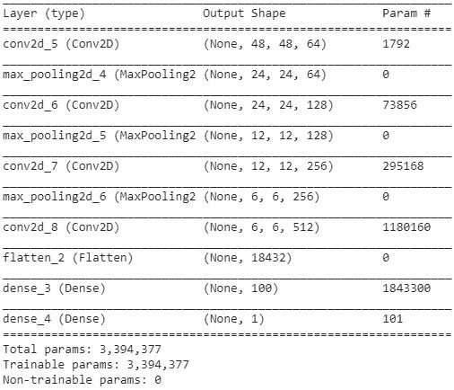

# 第五章：迁移学习

在上一章中，我们学习了如何识别图像属于哪个类别。本章将介绍 CNN 的一个缺点，以及如何通过使用某些预训练模型来克服这一问题。

本章将涵盖以下内容：

+   使用 CNN 进行图像中人物的性别分类

+   使用基于 VGG16 架构的模型进行图像中人物的性别分类

+   可视化神经网络中间层的输出

+   使用基于 VGG19 架构的模型进行图像中人物的性别分类

+   使用基于 ResNet 架构的模型进行性别分类

+   使用基于 Inception 架构的模型进行性别分类

+   检测人脸图像中的关键点

# 使用卷积神经网络（CNN）进行图像中人物的性别分类

为了了解 CNN 的一些局限性，让我们通过一个示例来识别给定图像是猫还是狗。

# 准备就绪

通过以下步骤，我们将直观地了解卷积神经网络如何预测图像中物体的类别：

+   卷积滤波器由图像的某些部分激活：

    +   例如，某些滤波器可能会在图像具有某种模式时激活——例如，图像包含一个圆形结构

+   池化层确保图像平移问题得以处理：

    +   这确保了即使图像较大，通过多次池化操作，图像的大小变小，物体也可以被检测到，因为物体现在应该出现在图像的较小部分（因为它已经多次池化）

+   最终的扁平层将所有通过不同卷积和池化操作提取的特征进行扁平化

假设训练数据集中的图像数量很少。在这种情况下，模型没有足够的数据点来对测试数据集进行泛化。

此外，考虑到卷积从头开始学习各种特征，如果训练数据集中的图像具有较大的形状（宽度和高度），则可能需要多个周期才能让模型开始适应训练数据集。

因此，在下一部分，我们将编写以下构建 CNN 的情景代码，其中包含一些图像（大约 1,700 张图像），并测试不同形状图像的准确性：

+   在 10 个周期中，当图像尺寸为 300 X 300 时的准确性

+   在 10 个周期中，当图像尺寸为 50 X 50 时的准确性

# 如何做到……

在本部分中，我们将获取一个数据集并进行分类分析，其中一个情景的图像尺寸为 300 x 300，而另一个情景的图像尺寸为 50 x 50。（在实现代码时，请参考 GitHub 上的`Transfer_learning.ipynb`文件。）

# 情景 1——大图像

1.  获取数据集。对于此分析，我们将继续使用在第四章的性别分类案例研究中下载的男性与女性分类数据集，*构建深度卷积神经网络*：

```py
$ wget https://d1p17r2m4rzlbo.cloudfront.net/wp-content/uploads/2017/04/a943287.csv 
```

```py
import pandas as pd, numpy as np
from skimage import io
# Location of file is /content/a943287.csv
# be sure to change to location of downloaded file on your machine
data = pd.read_csv('/content/a943287.csv')
```

```py
data_male = data[data['please_select_the_gender_of_the_person_in_the_picture']=="male"].reset_index(drop='index')
data_female = data[data['please_select_the_gender_of_the_person_in_the_picture']=="female"].reset_index(drop='index')
final_data = pd.concat([data_male[:1000],data_female[:1000]],axis=0).reset_index(drop='index')
```

1.  提取图像路径，然后准备输入和输出数据：

```py
x = []
y = []
for i in range(final_data.shape[0]):
     try:
         image = io.imread(final_data.loc[i]['image_url'])
         if(image.shape==(300,300,3)):
             x.append(image)
             y.append(final_data.loc[i]['please_select_the_gender_of_the_person_in_the_picture'])
     except:
         continue
```

1.  以下是图像的示例：


请注意，所有图像的大小为 300 x 300 x 3。

1.  创建输入和输出数据集数组：

```py
x2 = []
y2 = []
for i in range(len(x)):
      x2.append(x[i])
      img_label = np.where(y[i]=="male",1,0)
      y2.append(img_label)
```

在前一步中，我们遍历了所有图像（逐一进行），将图像读取到一个数组中（在这次迭代中其实可以跳过此步骤。然而，在下一个调整图像大小的场景中，我们将在此步骤调整图像大小）。此外，我们还存储了每个图像的标签。

1.  准备输入数组，以便可以传递给 CNN。此外，准备输出数组：

```py
x2 = np.array(x2)
x2 = x2.reshape(x2.shape[0],x2.shape[1],x2.shape[2],3)
```

在这里，我们将数组列表转换为 numpy 数组，以便将其传递给神经网络。

缩放输入数组并创建输入和输出数组：

```py
X = np.array(x2)/255
Y = np.array(y2)
```

1.  创建训练和测试数据集：

```py
from sklearn.model_selection import train_test_split
X_train, X_test, y_train, y_test = train_test_split(X,Y, test_size=0.1, random_state=42)
```

1.  定义模型并编译它：

```py
from keras.models import Sequential
from keras.layers.core import Dense, Dropout, Activation, Flatten
from keras.layers.convolutional import Conv2D
from keras.layers.pooling import MaxPooling2D
from keras.optimizers import SGD
from keras import backend as K

model = Sequential()
model.add(Conv2D(64, kernel_size=(3, 3), activation='relu',input_shape=(300,300,3)))
model.add(MaxPooling2D(pool_size=(2, 2)))
model.add(Conv2D(128, kernel_size=(3, 3), activation='relu',padding='same'))
model.add(MaxPooling2D(pool_size=(2, 2)))
model.add(Conv2D(256, kernel_size=(3, 3), activation='relu',padding='same'))
model.add(MaxPooling2D(pool_size=(2, 2)))
model.add(Conv2D(512, kernel_size=(3, 3), activation='relu',padding='same'))
model.add(Flatten())
model.add(Dense(100, activation='relu'))
model.add(Dense(1, activation='sigmoid'))
model.summary()
```

在前面的代码中，我们构建了一个模型，其中包含多个卷积层、池化层和 dropout 层。此外，我们将最终 dropout 层的输出传递到一个展平层，然后将展平后的输出连接到一个 512 节点的隐藏层，最后将隐藏层连接到输出层。

模型摘要如下：


在以下代码中，我们编译模型以减少二进制交叉熵损失，如下所示：

```py
model.compile(loss='binary_crossentropy',optimizer='adam',metrics=['accuracy'])
```

1.  训练模型：

```py
history = model.fit(X_train, y_train, batch_size=32,epochs=10,verbose=1,validation_data = (X_test, y_test))
```

在前一步中，你可以看到，随着训练轮次的增加，模型并没有继续训练，如下图所示（此图的代码与我们在第二章的*缩放输入数据*部分看到的代码相同，并且可以在本章的 GitHub 仓库中找到）：


在前面的图表中，你可以看到模型几乎没有学习到任何东西，因为损失几乎没有变化。而且，准确率卡在了 51% 左右（这大约是原始数据集中男性与女性图像的分布比例）。

# 场景 2 – 较小的图像

在这个场景中，我们将在模型中做如下修改：

+   输入图像大小：

    +   我们将把大小从 300 x 300 缩小到 50 x 50

+   模型架构：

    +   架构的结构与我们在**场景 1 – 大图像**中看到的相同

1.  创建一个数据集，输入为调整后图像大小（50 x 50 x 3），输出为标签。为此，我们将继续从场景 1 的*第 4 步*开始：

```py
import cv2
x2 = []
y2 = []
for i in range(len(x)):
  img = cv2.resize(x[i],(50,50))
  x2.append(img)
  img_label = np.where(y[i]=="male",1,0)
  y2.append(img_label)
```

1.  创建训练和测试数据集的输入和输出数组：

```py
x2 = np.array(x2)
x2 = x2.reshape(x2.shape[0],x2.shape[1],x2.shape[2],3)
X = np.array(x2)/255
Y = np.array(y2)
from sklearn.model_selection import train_test_split
X_train, X_test, y_train, y_test = train_test_split(X,Y, test_size=0.1, random_state=42)
```

1.  构建和编译模型：

```py
model = Sequential()
model.add(Conv2D(64, kernel_size=(3, 3), activation='relu',input_shape=(50,50,3)))
model.add(MaxPooling2D(pool_size=(2, 2)))
model.add(Conv2D(128, kernel_size=(3, 3), activation='relu',padding='same'))
model.add(MaxPooling2D(pool_size=(2, 2)))
model.add(Conv2D(256, kernel_size=(3, 3), activation='relu',padding='same'))
model.add(MaxPooling2D(pool_size=(2, 2)))
model.add(Conv2D(512, kernel_size=(3, 3), activation='relu',padding='same'))
model.add(Flatten())
model.add(Dense(100, activation='relu'))
model.add(Dense(1, activation='sigmoid'))
model.summary()

model.compile(loss='binary_crossentropy',optimizer='adam',metrics=['accuracy'])
```

模型摘要如下：



1.  训练模型：

```py
history = model.fit(X_train, y_train, batch_size=32,epochs=10,verbose=1,validation_data = (X_test, y_test))
```

模型在训练和测试数据集上随着训练轮次的增加，准确率和损失情况如下：


请注意，虽然在最初的训练和测试数据集上，准确率有所提高且损失逐渐下降，但随着训练轮次的增加，模型开始在训练数据上过拟合（专注），并且在测试数据集上的准确率为约 76%。

从中我们可以看到，当输入大小较小且卷积核必须从图像的较小部分学习时，CNN 能正常工作。然而，随着图像大小的增加，CNN 在学习上遇到了困难。

鉴于我们已经发现图像大小对模型准确率有影响，在新的场景中，我们将使用激进的池化，以确保较大的图像（300 x 300 形状）能迅速缩小。

# 场景 3 – 对大图像进行激进的池化

在下面的代码中，我们将保留在场景 1 中执行到第 6 步的分析。然而，唯一的变化将是模型架构；在接下来的模型架构中，我们使用了比场景 1 中更激进的池化方法。

在以下架构中，每一层具有更大的池化窗口，确保我们能够捕捉到比使用较小池化大小时更大的区域的激活。模型架构如下：

```py
model = Sequential()
model.add(Conv2D(64, kernel_size=(3, 3), activation='relu',input_shape=(300,300,3)))
model.add(MaxPooling2D(pool_size=(3, 3)))
model.add(Conv2D(128, kernel_size=(3, 3), activation='relu',padding='same'))
model.add(MaxPooling2D(pool_size=(3, 3)))
model.add(Conv2D(256, kernel_size=(3, 3), activation='relu',padding='same'))
model.add(MaxPooling2D(pool_size=(3, 3)))
model.add(Conv2D(512, kernel_size=(3, 3), activation='relu',padding='same'))
model.add(Flatten())
model.add(Dense(100, activation='relu'))
model.add(Dense(1, activation='sigmoid'))
model.summary()
```

请注意，在这个架构中，池化大小是 3 x 3，而不是我们在先前场景中使用的 2 x 2：


一旦我们在输入和输出数组上拟合模型，训练和测试数据集上准确率和损失的变化如下：

```py
model.compile(loss='binary_crossentropy',optimizer='adam',metrics=['accuracy'])
history = model.fit(X_train, y_train, batch_size=32,epochs=10,verbose=1,validation_data = (X_test, y_test))
```

以下是前面代码的输出结果：


我们可以看到，测试数据在正确分类图像中的性别时，准确率约为 70%。

然而，你可以看到，在训练数据集上存在相当大的过拟合现象（因为训练数据集上的损失持续下降，而测试数据集上并未出现类似下降）。

# 使用基于 VGG16 架构的模型对图像中人的性别进行分类

在前一部分的基于 CNN 的性别分类中，我们看到，当我们从头开始构建 CNN 模型时，可能会遇到以下一些情况：

+   传递的图像数量不足以让模型学习

+   当图像尺寸较大时，卷积层可能无法学习到我们图像中的所有特征

第一个问题可以通过在大数据集上执行我们的分析来解决。第二个问题可以通过在较大数据集上训练更大的网络，并进行更长时间的训练来解决。

然而，虽然我们能够执行所有这些操作，但往往缺乏进行此类分析所需的数据量。使用预训练模型进行迁移学习可以在这种情况下提供帮助。

ImageNet 是一个流行的竞赛，参与者需要预测图像的不同类别，图像的大小各异，并且包含多个类别的对象。

有多个研究团队参与了这场竞争，目标是提出一个能够预测包含数百万图像的数据集中的多类图像的模型。由于数据集中有数百万图像，数据集有限性的问题得以解决。此外，鉴于研究团队们建立了巨大的网络，卷积网络学习多种特征的问题也得到了解决。

因此，我们可以重用在不同数据集上构建的卷积层，在这些卷积层中，网络学习预测图像中的各种特征，然后将这些特征传递通过隐藏层，以便我们能够预测针对特定数据集的图像类别。不同的研究小组开发了多个预训练模型，本文将介绍 VGG16。

# 准备工作

在这一部分，我们将尝试理解如何利用 VGG16 的预训练网络来进行性别分类练习。

VGG16 模型的架构如下：


请注意，模型的架构与我们在“使用 CNN 进行性别分类”一节中训练的模型非常相似。主要的区别在于，这个模型更深（更多的隐藏层）。此外，VGG16 网络的权重是通过在数百万图像上训练得到的。

我们将确保在训练我们的模型以分类图像中的性别时，VGG16 的权重不会被更新。通过性别分类练习（形状为 300 x 300 x 3 的图像）的输出形状是 9 x 9 x 512。

我们将保留原网络中的权重，提取 9 x 9 x 512 的输出，通过另一个卷积池化操作，进行平坦化，连接到隐藏层，并通过 sigmoid 激活函数来判断图像是男性还是女性。

本质上，通过使用 VGG16 模型的卷积层和池化层，我们是在使用在更大数据集上训练得到的滤波器。最终，我们将对这些卷积层和池化层的输出进行微调，以适应我们要预测的对象。

# 如何做……

有了这个策略，让我们按照以下方式编写代码（在实现代码时，请参考 GitHub 中的`Transfer_learning.ipynb`文件）：

1.  导入预训练模型：

```py
from keras.applications import vgg16
from keras.utils.vis_utils import plot_model
from keras.applications.vgg16 import preprocess_input
vgg16_model = vgg16.VGG16(include_top=False, weights='imagenet',input_shape=(300,300,3))
```

请注意，我们在 VGG16 模型中排除了最后一层。这是为了确保我们根据我们要解决的问题对 VGG16 模型进行微调。此外，鉴于我们的输入图像尺寸为 300 X 300 X 3，我们在下载 VGG16 模型时也指定了相同的尺寸。

1.  预处理图像集。这个预处理步骤确保图像的处理方式能够被预训练的模型接受作为输入。例如，在下面的代码中，我们对其中一张名为`img`的图像进行预处理：

```py
from keras.applications.vgg16 import preprocess_input
img = preprocess_input(img.reshape(1,224,224,3))
```

我们使用`preprocess_input`方法按照 VGG16 的预处理要求来预处理图像。

1.  创建输入和输出数据集。在本练习中，我们将从“使用 CNN 进行性别分类”场景 1 的第 3 步结束继续。在这里，创建输入和输出数据集的过程与我们之前做的一样，唯一的变化是使用 VGG16 模型提取特征。

我们将通过`vgg16_model`传递每张图像，以便将`vgg16_model`的输出作为处理后的输入。此外，我们还将对输入进行如下预处理：

```py
import cv2
x2_vgg16 = []
for i in range(len(x)):
    img = x[i]
    img = preprocess_input(img.reshape(1,300,300,3))
```

现在，我们将预处理后的输入传递给 VGG16 模型以提取特征，如下所示：

```py
    img_new = vgg16_model.predict(img.reshape(1,300,300,3))
    x2_vgg16.append(img_new)
```

在前面的代码中，除了将图像传递给 VGG16 模型外，我们还将输入值存储在一个列表中。

1.  将输入和输出转换为 NumPy 数组，并创建训练和测试数据集：

```py
x2_vgg16 = np.array(x2_vgg16)
x2_vgg16= x2_vgg16.reshape(x2_vgg16.shape[0],x2_vgg16.shape[2],x2_vgg16.shape[3],x2_vgg16.shape[4])
Y = np.array(y2)
from sklearn.model_selection import train_test_split
X_train, X_test, y_train, y_test = train_test_split(x2_vgg16,Y, test_size=0.1, random_state=42)
```

1.  构建并编译模型：

```py
model_vgg16 = Sequential()
model_vgg16.add(Conv2D(512, kernel_size=(3, 3), activation='relu',input_shape=(X_train.shape[1],X_train.shape[2],X_train.shape[3])))
model_vgg16.add(MaxPooling2D(pool_size=(2, 2)))
model_vgg16.add(Flatten())
model_vgg16.add(Dense(512, activation='relu'))
model_vgg16.add(Dropout(0.5))
model_vgg16.add(Dense(1, activation='sigmoid'))
model_vgg16.summary()
```

模型摘要如下：


编译模型：

```py
model_vgg16.compile(loss='binary_crossentropy',optimizer='adam',metrics=['accuracy'])
```

1.  在缩放输入数据时训练模型：

```py
history_vgg16 = model_vgg16.fit(X_train/np.max(X_train), y_train, batch_size=16,epochs=10,verbose=1,validation_data = (X_test/np.max(X_train), y_test))
```

一旦我们训练模型，我们应该能看到，在前几轮训练中，模型能够在测试数据集上达到约 89%的准确率：


将此与我们在“使用 CNN 进行性别分类”部分中构建的模型进行对比，在那些场景中，我们无法在 10 轮训练内实现 80%的分类准确率。

以下是一些模型误分类的图像示例：


请注意，在前面的图片中，当输入图像是面部的一部分，或者图像中的物体占据了图像总面积的较小部分，或者标签可能不正确时，模型可能会误分类。

# 可视化神经网络中间层的输出

在前一部分，我们构建了一个可以从图像中学习性别分类的模型，准确率为 89%。然而，到目前为止，在滤波器学到了什么方面，它对我们来说仍然是一个黑箱。

在这一部分，我们将学习如何提取模型中各个滤波器学到了什么。此外，我们还将对比初始层中的滤波器学到的内容与最后几层中的特征学到的内容。

# 准备就绪

为了理解如何提取各个滤波器学到了什么，让我们采用以下策略：

+   我们将选择一张图像进行分析。

+   我们将选择第一个卷积层，以理解第一个卷积中的各个滤波器学到了什么。

+   计算第一层权重与输入图像卷积的输出：

    +   在此步骤中，我们将提取模型的中间输出：

        +   我们将提取模型的第一层输出。

+   为了提取第一层的输出，我们将使用功能性 API：

    +   功能性 API 的输入是输入图像，输出将是第一层的输出。

+   这将返回所有通道（滤波器）中间层的输出。

+   我们将对卷积的第一层和最后一层执行这些步骤。

+   最后，我们将可视化所有通道的卷积操作输出。

+   我们还将可视化给定通道在所有图像上的输出。

# 如何操作...

在本节中，我们将编写代码，展示初始层和最终层的卷积滤波器所学习的内容。

我们将重用在*使用 CNN 进行性别分类*食谱的情景 1 中*步骤 1*到*步骤 4*准备的数据（在实现代码时，请参考 GitHub 中的`Transfer_learning.ipynb`文件）：

1.  选择一张图像来可视化其中间输出：

```py
plt.imshow(x[3])
plt.grid('off')
```


1.  定义功能性 API，输入为图像，输出为第一卷积层的输出：

```py
from keras.applications.vgg16 import preprocess_input
model_vgg16.predict(vgg16_model.predict(preprocess_input(x[3].reshape(1,300,300,3)))/np.max(X_train))
from keras import models
activation_model = models.Model(inputs=vgg16_model.input,outputs=vgg16_model.layers[1].output)
activations = activation_model.predict(preprocess_input(x[3].reshape(1,300,300,3)))
```

我们定义了一个名为`activation_model`的中间模型，在该模型中，我们将感兴趣的图像作为输入，并提取第一层的输出作为模型的输出。

一旦我们定义了模型，我们将通过将输入图像传递给模型来提取第一层的激活。请注意，我们必须调整输入图像的形状，以便它符合模型的要求。

1.  让我们按如下方式可视化输出中的前 36 个滤波器：

```py
fig, axs = plt.subplots(6, 6, figsize=(10, 10))
fig.subplots_adjust(hspace = .5, wspace=.5)
first_layer_activation = activations[0]
for i in range(6):
  for j in range(6):
    try:
      axs[i,j].set_ylim((224, 0))
      axs[i,j].contourf(first_layer_activation[:,:,((6*i)+j)],6,cmap='viridis')
      axs[i,j].set_title('filter: '+str((6*i)+j))
      axs[i,j].axis('off')
    except:
      continue
```

1.  在上面的代码中，我们创建了一个 6x6 的框架，用于绘制 36 张图像。此外，我们正在循环遍历`first_layer_activation`中的所有通道，并绘制第一层的输出，具体如下：


在这里，我们可以看到某些滤波器提取了原始图像的轮廓（例如滤波器 0、4、7、10）。此外，某些滤波器已经学会了仅识别几个特征，例如耳朵、眼睛和鼻子（例如滤波器 30）。

1.  让我们通过检查 36 张图像中滤波器 7 的输出来验证我们对某些滤波器能够提取原始图像轮廓的理解，具体如下：

```py
activation_model = models.Model(inputs=vgg16_model.input,outputs=vgg16_model.layers[1].output)
activations = activation_model.predict(preprocess_input(np.array(x[:36]).reshape(36,300,300,3)))
fig, axs = plt.subplots(6, 6, figsize=(10, 10))
fig.subplots_adjust(hspace = .5, wspace=.5)
first_layer_activation = activations
for i in range(6):
  for j in range(6):
    try:
      axs[i,j].set_ylim((224, 0))
      axs[i,j].contourf(first_layer_activation[((6*i)+j),:,:,7],6,cmap='viridis')
      axs[i,j].set_title('filter: '+str((6*i)+j))
      axs[i,j].axis('off')
    except:
      continue
```

在上面的代码中，我们正在循环遍历前 36 张图像，并绘制所有 36 张图像的第一卷积层输出：


请注意，在所有图像中，第七个滤波器正在学习图像中的轮廓。

1.  让我们尝试理解最后一个卷积层中的滤波器学到了什么。为了理解我们模型中最后一个卷积层的位置，我们将提取模型中的各种层：

```py
for i, layer in enumerate(model.layers):
     print(i, layer.name)
```

执行上述代码后将显示以下层名称：


1.  请注意，最后一个卷积层是我们模型中的第九个输出，可以通过以下方式提取：

```py
activation_model = models.Model(inputs=vgg16_model.input,outputs=vgg16_model.layers[-1].output)
activations = activation_model.predict(preprocess_input(x[3].reshape(1,300,300,3)))
```

由于在图像上进行了多次池化操作，图像的大小现在已经大幅缩小（到 1, 9,9,512）。以下是最后一个卷积层中各种滤波器学习的可视化效果：


请注意，在此迭代中，不太容易理解最后一个卷积层的滤波器学到了什么（因为轮廓不容易归属于原图的某一部分），这些比第一个卷积层学到的轮廓更为细致。

# 使用基于 VGG19 架构的模型对图像中的人物进行性别分类

在上一节中，我们了解了 VGG16 的工作原理。VGG19 是 VGG16 的改进版本，具有更多的卷积和池化操作。

# 准备就绪

VGG19 模型的架构如下：


请注意，前述架构具有更多的层和更多的参数。

请注意，VGG16 和 VGG19 架构中的 16 和 19 分别表示这些网络中的层数。我们通过 VGG19 网络传递每个图像后提取的 9 x 9 x 512 输出将作为我们的模型的输入。

此外，创建输入和输出数据集，然后构建、编译和拟合模型的过程与我们在使用基于 VGG16 模型架构进行性别分类的食谱中看到的过程相同。

# 如何实现...

在本节中，我们将编码 VGG19 的预训练模型，代码如下（在实现代码时，请参考 GitHub 中的`Transfer_learning.ipynb`文件）：

1.  准备输入和输出数据（我们将继续从*性别分类使用 CNN*食谱中的*步骤 3*开始）：

```py
import cv2
x2 = []
for i in range(len(x)):
    img = x[i]
    img = preprocess_input(img.reshape(1,300,300,3))
    img_new = vgg19_model.predict(img.reshape(1,300,300,3))
    x2.append(img_new)
```

1.  将输入和输出转换为相应的数组，并创建训练集和测试集：

```py
x2 = np.array(x2)
x2= x2.reshape(x2.shape[0],x2.shape[2],x2.shape[3],x2.shape[4])
from sklearn.model_selection import train_test_split
X_train, X_test, y_train, y_test = train_test_split(x2,Y, test_size=0.1, random_state=42)
```

1.  构建并编译模型：

```py
model_vgg19 = Sequential()
model_vgg19.add(Conv2D(512, kernel_size=(3, 3), activation='relu',input_shape=(X_train.shape[1],X_train.shape[2],X_train.shape[3])))
model_vgg19.add(MaxPooling2D(pool_size=(2, 2)))
model_vgg19.add(Flatten())
model_vgg19.add(Dense(512, activation='relu'))
model_vgg19.add(Dropout(0.5))
model_vgg19.add(Dense(1, activation='sigmoid'))
model_vgg19.summary()
```

以下是模型的可视化：


```py
model_vgg19.compile(loss='binary_crossentropy',optimizer='adam',metrics=['accuracy'])
```

1.  在对输入数据进行缩放的同时拟合模型：

```py
history_vgg19 = model_vgg19.fit(X_train/np.max(X_train), y_train, batch_size=16,epochs=10,verbose=1,validation_data = (X_test/np.max(X_train), y_test))
```

让我们绘制训练集和测试集的损失和准确率度量：


我们应该注意，当使用 VGG19 架构时，我们能够在测试数据集上实现约 89%的准确率，这与 VGG16 架构非常相似。

以下是错误分类图像的示例：


请注意，VGG19 似乎根据图像中人物所占空间来错误分类。此外，它似乎更倾向于预测长发男性为女性。

# 使用 Inception v3 架构的性别分类模型

在之前的食谱中，我们基于 VGG16 和 VGG19 架构实现了性别分类。在本节中，我们将使用 Inception 架构来实现分类。

inception 模型如何派上用场的直观理解如下：

会有一些图像中，物体占据了图像的大部分。同样，也会有一些图像中，物体只占据了图像的一小部分。如果在这两种情况下我们使用相同大小的卷积核，那么就会使模型的学习变得困难——一些图像可能包含较小的物体，而其他图像可能包含较大的物体。

为了解决这个问题，我们将在同一层中使用多个大小的卷积核。

在这种情况下，网络本质上会变得更宽，而不是更深，如下所示：


在上述图示中，注意我们在给定层中执行多个卷积操作。inception v1 模块有九个这样的模块线性堆叠，如下所示：


来源: http://joelouismarino.github.io/images/blog_images/blog_googlenet_keras/googlenet_diagram.png

请注意，这种架构既深又宽。可能会导致梯度消失问题（正如我们在第二章中关于批量归一化的案例中所见，*构建深度前馈神经网络*）。

为了避免梯度消失的问题，inception v1 在 inception 模块中添加了两个辅助分类器。inception 基础网络的总体损失函数如下所示：

```py
total_loss = real_loss + 0.3 * aux_loss_1 + 0.3 * aux_loss_2
```

请注意，辅助损失仅在训练期间使用，在预测过程中会被忽略。

Inception v2 和 v3 是对 inception v1 架构的改进，在 v2 中，作者在卷积操作的基础上进行了优化，以加快图像处理速度，而在 v3 中，作者在现有卷积上添加了 7 x 7 的卷积，以便将它们连接起来。

# 如何实现...

我们实现 inception v3 的过程与构建基于 VGG19 模型的分类器非常相似（在实现代码时，请参考 GitHub 中的`Transfer_learning.ipynb`文件）：

1.  下载预训练的 Inception 模型：

```py
from keras.applications import inception_v3
from keras.applications.inception_v3 import preprocess_input
from keras.utils.vis_utils import plot_model
inception_model = inception_v3.InceptionV3(include_top=False, weights='imagenet',input_shape=(300,300,3))
```

请注意，我们需要一个至少为 300 x 300 大小的输入图像，才能使 inception v3 预训练模型正常工作。

1.  创建输入和输出数据集（我们将从*性别分类使用 CNNs*食谱中的场景 1 第 3 步继续）：

```py
import cv2
x2 = []
for i in range(len(x)):
    img = x[i]
    img = preprocess_input(img.reshape(1,300,300,3))
    img_new = inception_model.predict(img.reshape(1,300,300,3))
    x2.append(img_new)
```

1.  创建输入和输出数组，以及训练和测试数据集：

```py
x2 = np.array(x2)
x2= x2.reshape(x2.shape[0],x2.shape[2],x2.shape[3],x2.shape[4])
from sklearn.model_selection import train_test_split
X_train, X_test, y_train, y_test = train_test_split(x2,Y, test_size=0.1, random_state=42)
```

1.  构建并编译模型：

```py
model_inception_v3 = Sequential()
model_inception_v3.add(Conv2D(512, kernel_size=(3, 3), activation='relu',input_shape=(X_train.shape[1],X_train.shape[2],X_train.shape[3])))
model_inception_v3.add(MaxPooling2D(pool_size=(2, 2)))
model_inception_v3.add(Flatten())
model_inception_v3.add(Dense(512, activation='relu'))
model_inception_v3.add(Dropout(0.5))
model_inception_v3.add(Dense(1, activation='sigmoid'))
model_inception_v3.summary()

model.compile(loss='binary_crossentropy',optimizer='adam',metrics=['accuracy'])
```

前面的模型可以如下可视化：


1.  在缩放输入数据的同时拟合模型：

```py
history_inception_v3 = model_inception_v3.fit(X_train/np.max(X_train), y_train, batch_size=16,epochs=10,verbose=1,validation_data = (X_test/np.max(X_train), y_test)) 
```

准确度和损失值的变化如下：


你应该注意到，在这种情况下，准确度也是大约 ~90%。

# 使用基于 ResNet 50 架构的模型对图像中的人物进行性别分类

从 VGG16 到 VGG19，我们增加了层数，通常来说，神经网络越深，准确度越高。然而，如果仅仅增加层数是技巧，那么我们可以继续增加更多层（同时注意避免过拟合）来获得更准确的结果。

不幸的是，这并不完全正确，梯度消失的问题出现了。随着层数的增加，梯度在网络中传递时变得非常小，以至于很难调整权重，网络性能会下降。

ResNet 的出现是为了应对这一特定情况。

想象一种情况，如果模型没有任何需要学习的内容，卷积层仅仅将前一层的输出传递给下一层。然而，如果模型需要学习一些其他特征，卷积层会将前一层的输出作为输入，并学习需要学习的附加特征来执行分类。

残差是模型期望从一层到下一层学习的附加特征。

一个典型的 ResNet 架构如下所示：


来源：[`arxiv.org/pdf/1512.03385.pdf`](https://arxiv.org/pdf/1512.03385.pdf)

请注意，我们有跳跃连接，这些连接将前一层与后续层连接起来，并且网络中还有传统的卷积层。

此外，ResNet50 中的 50 表示该网络总共有 50 层。

# 如何执行...

ResNet50 架构的构建如下（在实现代码时，请参考 GitHub 上的`Transfer_learning.ipynb`文件）：

1.  下载预训练的 Inception 模型：

```py
from keras.applications import resnet50
from keras.applications.resnet50 import preprocess_input
resnet50_model = resnet50.ResNet50(include_top=False, weights='imagenet',input_shape=(300,300,3))
```

请注意，我们需要一个至少为 224 x 224 形状的输入图像，才能使 ResNet50 预训练模型正常工作。

1.  创建输入和输出数据集（我们将从*性别分类使用 CNNs*教程中的*步骤 3*继续）：

```py
import cv2
x2 = []
for i in range(len(x)):
    img = x[i]
    img = preprocess_input(img.reshape(1,300,300,3))
    img_new = resnet50_model.predict(img.reshape(1,300,300,3))
    x2.append(img_new)
```

1.  创建输入和输出数组，并准备训练和测试数据集：

```py
x2 = np.array(x2)
x2= x2.reshape(x2.shape[0],x2.shape[2],x2.shape[3],x2.shape[4])
from sklearn.model_selection import train_test_split
X_train, X_test, y_train, y_test = train_test_split(x2,Y, test_size=0.1, random_state=42)
```

1.  构建并编译模型：

```py
model_resnet50 = Sequential()
model_resnet50.add(Conv2D(512, kernel_size=(3, 3), activation='relu',input_shape=(X_train.shape[1],X_train.shape[2],X_train.shape[3])))
model_resnet50.add(MaxPooling2D(pool_size=(2, 2)))
model_resnet50.add(Conv2D(512, kernel_size=(3, 3), activation='relu'))
model_resnet50.add(MaxPooling2D(pool_size=(2, 2)))
model_resnet50.add(Flatten())
model_resnet50.add(Dense(512, activation='relu'))
model_resnet50.add(Dropout(0.5))
model_resnet50.add(Dense(1, activation='sigmoid'))
model_resnet50.summary()

model_resnet50.compile(loss='binary_crossentropy',optimizer='adam',metrics=['accuracy'])
```

模型的总结如下：


1.  在缩放输入数据的同时拟合模型：

```py
history_resnet50 = model_resnet50.fit(X_train/np.max(X_train), y_train, batch_size=32,epochs=10,verbose=1,validation_data = (X_test/np.max(X_train), y_test))
```

准确度和损失值的变化如下：


请注意，前面的模型给出的准确率为 92%。

在性别分类的多个预训练模型中，准确度没有显著差异，因为它们可能训练出来的是提取一般特征的模型，而不一定是用来分类性别的特征。

# 检测图像中的面部关键点

在这个教程中，我们将学习如何检测人脸的关键点，这些关键点包括左右眼的边界、鼻子以及嘴巴的四个坐标。

这里有两张带有关键点的示例图片：


请注意，我们预计要检测的关键点在这张图片中作为点绘制。图像中共检测到 68 个关键点，其中包括面部的关键点——嘴巴、右眉毛、左眉毛、右眼、左眼、鼻子、下巴。

在这个案例中，我们将利用在 *使用基于 VGG16 架构的模型进行图像性别分类* 部分中学到的 VGG16 迁移学习技术来检测面部的关键点。

# 准备就绪

对于关键点检测任务，我们将使用一个数据集，在该数据集上我们标注了要检测的点。对于这个练习，输入将是我们要检测关键点的图像，输出将是关键点的 `x` 和 `y` 坐标。数据集可以从这里下载：[`github.com/udacity/P1_Facial_Keypoints`](https://github.com/udacity/P1_Facial_Keypoints)。

我们将遵循以下步骤：

1.  下载数据集

1.  将图像调整为标准形状

    1.  在调整图像大小时，确保关键点已修改，以便它们代表修改后的（调整大小的）图像

1.  将调整大小的图像传递给 VGG16 模型

1.  创建输入和输出数组，其中输入数组是通过 VGG16 模型传递图像的输出，输出数组是修改后的面部关键点位置

1.  适配一个模型，最小化预测的面部关键点与实际面部关键点之间的绝对误差值

# 如何操作...

我们讨论的策略的代码如下（在实现代码时，请参考 GitHub 中的 `Facial_keypoints.ipynb` 文件）：

1.  下载并导入数据集：

```py
$ git clone https://github.com/udacity/P1_Facial_Keypoints.git import pandas as pddata = pd.read_csv('/content/P1_Facial_Keypoints/data/training_frames_keypoints.csv')
```

检查这个数据集。


总共有 137 列，其中第一列是图像的名称，剩余的 136 列代表对应图像中 68 个面部关键点的 `x` 和 `y` 坐标值。

1.  预处理数据集，提取图像、调整大小后的图像、VGG16 特征以及修改后的关键点位置作为输出：

初始化将被附加以创建输入和输出数组的列表：

```py
import cv2, numpy as np
from copy import deepcopy
x=[]
x_img = []
y=[]
```

循环读取图像：

```py
for i in range(data.shape[0]):
     img_path = '/content/P1_Facial_Keypoints/data/training/' + data.iloc[i,0]
     img = cv2.imread(img_path)
```

捕获关键点值并存储

```py
 kp = deepcopy(data.iloc[i,1:].tolist())
 kp_x = (np.array(kp[0::2])/img.shape[1]).tolist()
 kp_y = (np.array(kp[1::2])/img.shape[0]).tolist()
 kp2 = kp_x + kp_y
```

调整图像大小

```py
img = cv2.resize(img,(224,224))
```

预处理图像，以便可以通过 VGG16 模型传递并提取特征：

```py
preprocess_img = preprocess_input(img.reshape(1,224,224,3))
 vgg16_img = vgg16_model.predict(preprocess_img)
```

将输入和输出值附加到相应的列表中：

```py
 x_img.append(img)
 x.append(vgg16_img)
 y.append(kp2)
```

创建输入和输出数组：

```py
x = np.array(x)
x = x.reshape(x.shape[0],7,7,512)
y = np.array(y)
```

1.  构建并编译模型

```py
from keras.models import Sequential
from keras.layers import Conv2D, MaxPooling2D, Flatten, Dense, Dropout
model_vgg16 = Sequential()
model_vgg16.add(Conv2D(512, kernel_size=(3, 3), activation='relu',input_shape=(x.shape[1],x.shape[2],x.shape[3])))
model_vgg16.add(MaxPooling2D(pool_size=(2, 2)))
model_vgg16.add(Flatten())
model_vgg16.add(Dense(512, activation='relu'))
model_vgg16.add(Dropout(0.5))
model_vgg16.add(Dense(y.shape[1], activation='sigmoid'))
model_vgg16.summary()
```


编译模型：

```py
model_vgg16.compile(loss='mean_absolute_error',optimizer='adam')
```

1.  拟合模型

```py
history = model_vgg16.fit(x/np.max(x), y, epochs=10, batch_size=32, verbose=1, validation_split = 0.1)
```

请注意，我们通过输入数组的最大值来对输入数组进行除法运算，以便对输入数据集进行缩放。随着训练轮数增加，训练损失和测试损失的变化如下：


1.  对测试图像进行预测。在以下代码中，我们对输入数组中的倒数第二张图像进行预测（注意，`validation_split` 为 `0.1`，因此倒数第二张图像在训练过程中并未提供给模型）。我们确保将图像传入 `preprocess_input` 方法，然后通过 `VGG16_model`，最后将 `VGG16_model` 输出的缩放版本传递给我们构建的 `model_vgg16`：

```py
pred = model_vgg16.predict(vgg16_model.predict(preprocess_input(x_img[-2].reshape(1,224,224,3)))/np.max(x))
```

对测试图像的前述预测可以通过以下方式可视化：


我们可以看到，关键点在测试图像上被非常准确地检测出来。
