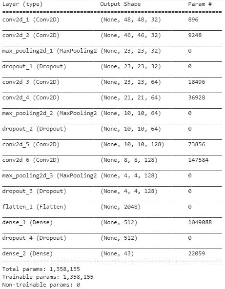

# 第七章：自动驾驶汽车中的图像分析应用

在前几章中，我们学习了物体分类以及物体定位。在本章中，我们将通过多个与自动驾驶汽车相关的案例研究。

你将学习以下内容：

+   交通标志识别

+   预测汽车需要转动的角度范围

+   使用 U-net 架构识别道路上的汽车

+   路面上物体的语义分割

# 交通标志识别

在本案例研究中，我们将了解如何将信号分类为 43 种可能的类别之一。

# 准备就绪

对于本练习，我们将采用以下策略：

1.  下载包含所有可能交通标志的数据集

1.  对输入图像执行直方图归一化处理：

    +   某些图像是在明亮的白天拍摄的，而其他一些可能是在黄昏时拍摄的

    +   不同的光照条件会导致像素值的变化，具体取决于拍摄照片时的光照条件

    +   直方图归一化对像素值进行归一化处理，使它们具有相似的分布

1.  缩放输入图像

1.  构建、编译并拟合模型以减少类别交叉熵损失值

# 如何实现...

1.  下载数据集，如下所示（代码文件可在 GitHub 中的`Traffic_signal_detection.ipynb`找到）。数据集可通过论文获得：J. Stallkamp, M. Schlipsing, J. Salmen, C. Igel, 《人与计算机：基准机器学习算法在交通标志识别中的表现》：

```py
$ wget http://benchmark.ini.rub.de/Dataset/GTSRB_Final_Training_Images.zip
$ unzip GTSRB_Final_Training_Images.zip
```

1.  将图像路径读取到列表中，如下所示：

```py
from skimage import io
import os
import glob

root_dir = '/content/GTSRB/Final_Training/Images/'
all_img_paths = glob.glob(os.path.join(root_dir, '*/*.ppm'))
```

图像的样例如下所示：


请注意，某些图像的形状较小，而某些图像的光照较强。因此，我们需要对图像进行预处理，使所有图像在光照和形状方面都进行标准化。

1.  对输入数据集执行直方图归一化处理，如下所示：

```py
import numpy as np
from skimage import color, exposure, transform

NUM_CLASSES = 43
IMG_SIZE = 48

def preprocess_img(img):
     hsv = color.rgb2hsv(img)
     hsv[:, :, 2] = exposure.equalize_hist(hsv[:, :, 2])
     img = color.hsv2rgb(hsv)
     img = transform.resize(img, (IMG_SIZE, IMG_SIZE))
     return img
```

在前面的代码中，我们首先将 RGB 格式的图像转换为**色调饱和度值（HSV）**格式。通过将图像从 RGB 格式转换为 HSV 格式，我们实质上是将 RGB 组合值转换为一个数组，然后再将其转换为单维数组。

然后，我们将使用`equalize_hist`方法对以 HSV 格式获得的值进行归一化，使它们归于相同的尺度。

一旦图像在 HSV 格式的最后一个通道中被归一化，我们将它们转换回 RGB 格式。

最后，我们将图像调整为标准尺寸。

1.  检查图像在通过直方图归一化之前的状态，并将其与归一化后的状态进行对比（即通过`preprocess_img`函数处理后的图像），如下所示：


从前面的图片中可以看出，经过直方图归一化后（右侧图像），图像的可见度发生了显著变化（左侧图像）。

1.  按如下方式准备输入和输出数组：

```py
count = 0
imgs = []
labels = []
for img_path in all_img_paths:
     img = preprocess_img(io.imread(img_path))
     label = img_path.split('/')[-2]
     imgs.append(img)
     labels.append(label)

X = np.array(imgs)
Y = to_categorical(labels, num_classes = NUM_CLASSES)
```

1.  按如下方式构建训练集和测试集：

```py
from sklearn.model_selection import train_test_split
X_train, X_test, y_train, y_test = train_test_split(X, Y, test_size = 0.2, random_state= 42)
```

1.  如下所示，构建并编译模型：

```py
model = Sequential()
model.add(Conv2D(32, (3, 3), padding='same',input_shape=(IMG_SIZE, IMG_SIZE, 3), activation='relu'))
model.add(Conv2D(32, (3, 3), activation='relu'))
model.add(MaxPooling2D(pool_size=(2, 2)))
model.add(Dropout(0.2))
model.add(Conv2D(64, (3, 3), padding='same',activation='relu'))
model.add(Conv2D(64, (3, 3), activation='relu'))
model.add(MaxPooling2D(pool_size=(2, 2)))
model.add(Dropout(0.2))
model.add(Conv2D(128, (3, 3), padding='same',activation='relu'))
model.add(Conv2D(128, (3, 3), activation='relu'))
model.add(MaxPooling2D(pool_size=(2, 2)))
model.add(Dropout(0.2))
model.add(Flatten())
model.add(Dense(512, activation='relu'))
model.add(Dropout(0.5))
model.add(Dense(NUM_CLASSES, activation='softmax'))
model.summary()

model.compile(loss='categorical_crossentropy',optimizer='adam',metrics=['accuracy']
```

模型的总结如下：



1.  如下所示，拟合模型：

```py
model.fit(X_train, y_train,batch_size=32,epochs=5,validation_data = (X_test, y_test))
```

前面的代码生成了一个模型，其准确率约为 99%：


此外，如果您执行与我们相同的分析，但没有进行直方图归一化（曝光校正），模型的准确率约为 97%。

# 预测汽车需要转动的角度

在本案例中，我们将基于提供的图像来理解需要转动汽车的角度。

# 准备就绪

我们采用的构建转向角度预测策略如下：

1.  收集一个数据集，其中包含道路的图像和需要转动方向盘的相应角度

1.  预处理图像

1.  将图像传入 VGG16 模型以提取特征

1.  构建一个神经网络，执行回归以预测转向角度，这是一个需要预测的连续值

# 如何进行……

1.  下载以下数据集。该数据集可以通过以下链接获得：[`github.com/SullyChen/driving-datasets`](https://github.com/SullyChen/driving-datasets)：（代码文件可以在 GitHub 中的`Car_steering_angle_detection.ipynb`找到）：

```py
$ pip install PyDrive 

from pydrive.auth import GoogleAuth
from pydrive.drive import GoogleDrive
from google.colab import auth
from oauth2client.client import GoogleCredentials

auth.authenticate_user()
gauth = GoogleAuth()
gauth.credentials = GoogleCredentials.get_application_default()
drive = GoogleDrive(gauth)

file_id = '0B-KJCaaF7elleG1RbzVPZWV4Tlk' # URL id. 
downloaded = drive.CreateFile({'id': file_id})
downloaded.GetContentFile('steering_angle.zip')

$ unzip steering_angle.zip
```

1.  导入相关的包，如下所示：

```py
import os
import numpy as np
import pandas as pd
import matplotlib.pyplot as plt
from scipy import pi
import cv2
import scipy.misc
import tensorflow as tf
```

1.  将图像及其对应的弧度角度分别读取到单独的列表中，如下所示：

```py
DATA_FOLDER = "/content/driving_dataset/"
DATA_FILE = os.path.join(DATA_FOLDER, "data.txt")
x = []
y = []

train_batch_pointer = 0
test_batch_pointer = 0

with open(DATA_FILE) as f:
     for line in f:
         image_name, angle = line.split() 
         image_path = os.path.join(DATA_FOLDER, image_name)
         x.append(image_path) 
         angle_radians = float(angle) * (pi / 180) #converting angle into radians
         y.append(angle_radians)
y = np.array(y)
```

1.  如下所示，创建训练集和测试集：

```py
split_ratio = int(len(x) * 0.8)
train_x = x[:split_ratio]
train_y = y[:split_ratio]
test_x = x[split_ratio:]
test_y = y[split_ratio:]
```

1.  检查训练和测试数据集中的输出标签值，如下所示：

```py
fig = plt.figure(figsize = (10, 7))
plt.hist(train_y, bins = 50, histtype = "step",color='r')
plt.hist(test_y, bins = 50, histtype = "step",color='b')
plt.title("Steering Wheel angle in train and test")
plt.xlabel("Angle")
plt.ylabel("Bin count")
plt.grid('off')
plt.show()
```


1.  删除前 100 行的像素，因为这些像素与道路图像无关，然后将处理后的图像传入 VGG16 模型。此外，在此练习中，我们仅使用数据集中的前 10,000 张图像，以便更快地构建模型。删除前 100 行的像素，如下所示：

```py
x = []
y = []
for i in range(10000):
     im = cv2.imread(train_x[i])
     im = im[100:,:,:]/255
     vgg_im = vgg16_model.predict(im.reshape(1,im.shape[0],im.shape[1],3))
     x.append(vgg_im)
     y.append(train_y[i])
x1 = np.array(x)
x1 = x1.reshape(x1.shape[0],4,14,512)
y1 = np.array(y)
```

1.  如下所示，构建并编译模型：

```py
model = Sequential()
model.add(Flatten(input_shape=(4,14,512)))
model.add(Dense(512, activation='relu'))
model.add(Dropout(.5))
model.add(Dense(100, activation='linear'))
model.add(Dropout(.2))
model.add(Dense(50, activation='linear'))
model.add(Dropout(.1))
model.add(Dense(10, activation='linear'))
model.add(Dense(1, activation='linear'))
model.summary()
```

注意，输出层采用线性激活，因为输出是一个连续值，范围从 -9 到 +9。模型的总结如下：


现在，我们将按如下方式编译已定义的模型：

```py
model.compile(loss='mean_squared_error',optimizer='adam')
```

1.  如下所示，拟合模型：

```py
model.fit(x1/11, y1,batch_size=32,epochs=10, validation_split = 0.1, verbose = 1)
```


测试损失是前面图表中损失较低的那条线。

注意，我们已经将输入数据集除以 11，以便将其缩放到 0 到 1 之间。现在，我们应该能够根据预测的角度模拟汽车的运动。

模型对样本图像的转向角度预测结果如下：


请注意，使用上述模型时需要非常小心。它应首先在多种日光条件下进行测试，然后再进入生产环境。

# 使用 U-net 架构进行实例分割

到目前为止，在前两章中，我们已经学习了如何检测物体，以及如何识别图像中物体所在的边界框。在本节中，我们将学习如何进行实例分割，在实例分割中，属于某个特定物体的所有像素都会被突出显示，而其他像素则不会（这类似于用零掩膜掉所有不属于物体的像素，并用像素值 1 掩膜属于物体的像素）。

# 准备开始

为了执行实例分割，我们将执行以下操作：

1.  在一个数据集上工作，该数据集具有输入图像及其对应的掩膜图像，掩膜图像显示对象在图像中的像素位置：

    +   图像及其掩膜图像

1.  我们将通过预训练的 VGG16 模型将图像传递，以提取每个卷积层的特征

1.  我们将逐渐上采样卷积层，以便我们获得形状为 224 x 224 x 3 的输出图像

1.  我们将冻结使用 VGG16 权重的层

1.  将上采样的卷积层与下采样的卷积层连接起来：

    +   这形成了 U 形连接

    +   U 形连接帮助模型获得类似于 ResNet 的上下文（之前下采样的层提供上下文，除了上采样的层外）

    +   如果我们取第一层的输出，重建图像会更容易，因为大部分图像在第一层中是完好的（早期层学习图像的轮廓）。如果我们尝试通过上采样最后几层来重建图像，那么很有可能大部分图像信息会丢失

1.  拟合一个将输入图像映射到掩膜图像的模型：

    +   注意，掩膜图像本质上是二进制的——黑色值对应于像素值 0，白色像素的值为 1

1.  在所有 224 x 224 x 1 像素中最小化二元交叉熵损失函数

之所以称该模型为**U-net 架构**，是因为模型的可视化如下所示——一个旋转的 U 形结构：


模型的 U 形结构是由于早期层连接到下采样层的上采样版本。

# 如何实现...

在以下代码中，我们将执行实例分割，以检测图像中的汽车：

1.  从[`github.com/divamgupta/image-segmentation-keras`](https://github.com/divamgupta/image-segmentation-keras)下载并导入文件，如下所示：

```py
$ wget https://www.dropbox.com/s/0pigmmmynbf9xwq/dataset1.zip
$ unzip dataset1.zip
dir_data = "/content/dataset1"
dir_seg = dir_data + "/annotations_prepped_train/"
dir_img = dir_data + "/images_prepped_train/"
import glob, os
all_img_paths = glob.glob(os.path.join(dir_img, '*.png'))
all_mask_paths = glob.glob(os.path.join(dir_seg, '*.png'))
```

1.  将图像及其对应的掩膜读取为数组，如下所示：

```py
import cv2
from scipy import ndimage
x = []
y = []
for i in range(len(all_img_paths)):
  img = cv2.imread(all_img_paths[i])
  img = cv2.resize(img,(224,224))
  mask_path = dir_seg+all_img_paths[i].split('/')[4]
  img_mask = ndimage.imread(mask_path)
  img_mask = cv2.resize(img_mask,(224,224))
  x.append(img)
  y.append(img_mask)

x = np.array(x)/255
y = np.array(y)/255
y2 = np.where(y==8,1,0)
```

在前面的步骤中，我们创建了输入和输出数组，并且还对输入数组进行了归一化。最后，我们从所有其他内容中分离出了汽车的掩模，因为该数据集有 12 个唯一类别，其中汽车的像素值被标记为 8。

输入和掩模图像的示例如下：


此外，我们创建了输入和输出数组，其中我们对输入数组进行缩放，并重新塑形输出数组（以便可以传递给网络），如下所示：

```py
x = np.array(x)
x = x/255
y2 = np.array(y2)
y2 = y2.reshape(y2.shape[0],y2.shape[1],y2.shape[2],1)
```

1.  构建模型，其中图像首先通过 VGG16 模型层，提取卷积特征，如下所示：

在以下代码中，我们导入了预训练的 VGG16 模型：

```py
from keras.applications.vgg16 import VGG16 as PTModel
from keras.layers import Input, Conv2D, concatenate, UpSampling2D, BatchNormalization, Activation, Cropping2D, ZeroPadding2D
from keras.layers import Input, merge, Conv2D, MaxPooling2D,UpSampling2D, Dropout, Cropping2D, merge, concatenate
from keras.optimizers import Adam
from keras.callbacks import ModelCheckpoint, LearningRateScheduler
from keras import backend as K
from keras.models import Model
```

```py
base_pretrained_model = PTModel(input_shape = (224,224,3), include_top = False, weights = 'imagenet')
base_pretrained_model.trainable = False
```

在以下代码中，当不同的卷积层通过 VGG16 模型时，我们提取了特征：

```py
conv1 = Model(inputs=base_pretrained_model.input,outputs=base_pretrained_model.get_layer('block1_conv2').output).output
conv2 = Model(inputs=base_pretrained_model.input,outputs=base_pretrained_model.get_layer('block2_conv2').output).output
conv3 = Model(inputs=base_pretrained_model.input,outputs=base_pretrained_model.get_layer('block3_conv3').output).output
conv4 = Model(inputs=base_pretrained_model.input,outputs=base_pretrained_model.get_layer('block4_conv3').output).output
drop4 = Dropout(0.5)(conv4)
conv5 = Model(inputs=base_pretrained_model.input,outputs=base_pretrained_model.get_layer('block5_conv3').output).output
drop5 = Dropout(0.5)(conv5)
```

在以下代码中，我们使用`UpSampling`方法对特征进行上采样，并在每一层将其与下采样后的 VGG16 卷积特征进行拼接：

```py
up6 = Conv2D(512, 2, activation = 'relu', padding = 'same',kernel_initializer = 'he_normal')(UpSampling2D(size =(2,2))(drop5))
merge6 = concatenate([drop4,up6], axis = 3) 

conv6 = Conv2D(512, 3, activation = 'relu', padding = 'same',kernel_initializer = 'he_normal')(merge6)
conv6 = Conv2D(512, 3, activation = 'relu', padding = 'same',kernel_initializer = 'he_normal')(conv6)
conv6 = BatchNormalization()(conv6)
up7 = Conv2D(256, 2, activation = 'relu', padding = 'same',kernel_initializer = 'he_normal')(UpSampling2D(size =(2,2))(conv6))
merge7 = concatenate([conv3,up7], axis = 3)
conv7 = Conv2D(256, 3, activation = 'relu', padding = 'same',kernel_initializer = 'he_normal')(merge7)
conv7 = Conv2D(256, 3, activation = 'relu', padding = 'same',kernel_initializer = 'he_normal')(conv7)
conv7 = BatchNormalization()(conv7)
up8 = Conv2D(128, 2, activation = 'relu', padding = 'same',kernel_initializer = 'he_normal')(UpSampling2D(size =(2,2))(conv7))
merge8 = concatenate([conv2,up8],axis = 3)
conv8 = Conv2D(128, 3, activation = 'relu', padding = 'same',kernel_initializer = 'he_normal')(merge8)
conv8 = Conv2D(128, 3, activation = 'relu', padding = 'same',kernel_initializer = 'he_normal')(conv8)
conv8 = BatchNormalization()(conv8)
up9 = Conv2D(64, 2, activation = 'relu', padding = 'same',kernel_initializer = 'he_normal')(UpSampling2D(size =(2,2))(conv8))
merge9 = concatenate([conv1,up9], axis = 3)
conv9 = Conv2D(64, 3, activation = 'relu', padding = 'same',kernel_initializer = 'he_normal')(merge9)
conv9 = Conv2D(64, 3, activation = 'relu', padding = 'same',kernel_initializer = 'he_normal')(conv9)
conv9 = Conv2D(2, 3, activation = 'relu', padding = 'same',kernel_initializer = 'he_normal')(conv9)
conv9 = BatchNormalization()(conv9)
conv10 = Conv2D(1, 1, activation = 'sigmoid')(conv9)
```

在以下代码中，我们定义了模型的输入和输出，其中输入首先传递给`base_pretrained_model`，输出是`conv10`（其形状为 224 x 224 x 1—我们输出的预期形状）：

```py
model = Model(input = base_pretrained_model.input, output = conv10)
```

1.  冻结通过训练得到的 VGG16 模型的卷积层，如下所示：

```py
for layer in model.layers[:18]:
     layer.trainable = False
```

1.  编译并拟合模型，以处理数据集中前 1,000 张图像，如下所示：

```py
from keras import optimizers
adam = optimizers.Adam(1e-3, decay = 1e-6)
model.compile(loss='binary_crossentropy',optimizer=adam,metrics=['accuracy'])
history = model.fit(x,y,validation_split = 0.1,batch_size=1,epochs=5,verbose=1)
```


1.  在数据集的最后两张测试图像上测试之前的模型（这些是具有`validation_split = 0.1`的测试图像），如下所示：

```py
y_pred = model.predict(x[-2:].reshape(2,224,224,3))
```


我们可以看到，对于给定的道路输入，生成的掩模非常真实，并且比之前的方法更好，因为预测的掩模图像中没有噪点。

# 图像中对象的语义分割

在上一节中，我们学习了如何对包含单一对象的图像进行分割。在本节分割中，我们将学习如何进行分割，以便能够区分图像中存在的多个对象，尤其是在道路图像中。

# 准备开始

我们将采用的策略是，在道路图像上执行语义分割，如下所示：

1.  收集一个数据集，其中包含标注了图像中多个对象位置的信息：

    +   语义图像的示例如下所示：


1.  将输出掩模转换为多维数组，其中列数等于所有可能的唯一对象的数量。

1.  如果有 12 个可能的唯一值（12 个唯一对象），将输出图像转换为形状为 224 x 224 x 12 的图像：

    +   一个通道的值表示该通道对应的对象在图像中的该位置存在。

1.  利用我们在前面部分看到的模型架构，训练一个具有 12 个可能输出值的模型

1.  通过将所有三个通道分配相同的输出，将预测结果重塑为三个通道：

    +   输出是 12 个可能类别的概率预测的最大值（argmax）

# 如何实现...

语义分割的代码实现如下（代码文件可以在 GitHub 上找到，名为`Semantic_segmentation.ipynb`）：

1.  下载数据集，如下所示：

```py
!wget https://www.dropbox.com/s/0pigmmmynbf9xwq/dataset1.zip
!unzip dataset1.zip
dir_data = "/content/dataset1"
dir_seg = dir_data + "/annotations_prepped_train/"
dir_img = dir_data + "/images_prepped_train/"
import glob, os
all_img_paths = glob.glob(os.path.join(dir_img, '*.png'))
all_mask_paths = glob.glob(os.path.join(dir_seg, '*.png'))
```

1.  将图像及其对应标签分别读取到不同的列表中，如下所示：

```py
import cv2
from scipy import ndimage
for i in range(len(all_img_paths)):
     img = cv2.imread(all_img_paths[i])
     img = cv2.resize(img,(224,224))
     mask_path = dir_seg+all_img_paths[i].split('/')[4]
     img_mask = ndimage.imread(mask_path)
     img_mask = cv2.resize(img_mask,(224,224))
     x.append(img)
     y.append(img_mask)
```

1.  定义一个函数，将三个通道的输出图像转换为 12 个通道，其中有 12 个唯一的输出值：

    1.  提取输出中存在的唯一值（对象）的数量，如下所示：

```py
n_classes = len(set(np.array(y).flatten()))
```

1.  1.  将掩模图像转换为一热编码版本，通道数量与数据集中对象的总数相同，如下所示：

```py
def getSegmentationArr(img):
      seg_labels = np.zeros(( 224, 224, n_classes ))
      for c in range(n_classes):
            seg_labels[: , : , c ] = (img == c ).astype(int)
      return seg_labels

y2 = []
for i in range(len(y)):
     y2.append(getSegmentationArr(y[i]))

y2 = np.array(y2)
x = x/255
```

1.  构建模型：

    1.  将图像传递给预训练的 VGG16 模型，如下所示：

```py
from keras.applications.vgg16 import VGG16 as PTModel
base_pretrained_model = PTModel(input_shape = (224,224,3), include_top = False, weights = 'imagenet')
base_pretrained_model.trainable = False
```

1.  1.  提取图像的 VGG16 特征，如下所示：

```py
conv1 = Model(inputs=base_pretrained_model.input,outputs=base_pretrained_model.get_layer('block1_conv2').output).output
conv2 = Model(inputs=base_pretrained_model.input,outputs=base_pretrained_model.get_layer('block2_conv2').output).output
conv3 = Model(inputs=base_pretrained_model.input,outputs=base_pretrained_model.get_layer('block3_conv3').output).output
conv4 = Model(inputs=base_pretrained_model.input,outputs=base_pretrained_model.get_layer('block4_conv3').output).output
drop4 = Dropout(0.5)(conv4)
conv5 = Model(inputs=base_pretrained_model.input,outputs=base_pretrained_model.get_layer('block5_conv3').output).output
drop5 = Dropout(0.5)(conv5)
```

1.  1.  将卷积特征通过上采样层传递，并将它们连接形成一个简单的 U-net 架构，如下所示：

```py
conv6 = Conv2D(512, 3, activation = 'relu', padding = 'same',kernel_initializer = 'he_normal')(merge6)
conv6 = Conv2D(512, 3, activation = 'relu', padding = 'same',kernel_initializer = 'he_normal')(conv6)
conv6 = BatchNormalization()(conv6)
up7 = Conv2D(256, 2, activation = 'relu', padding = 'same',kernel_initializer = 'he_normal')(UpSampling2D(size =(2,2))(conv6))
merge7 = concatenate([conv3,up7], axis = 3)
conv7 = Conv2D(256, 3, activation = 'relu', padding = 'same',kernel_initializer = 'he_normal')(merge7)
conv7 = Conv2D(256, 3, activation = 'relu', padding = 'same',kernel_initializer = 'he_normal')(conv7)
conv7 = BatchNormalization()(conv7)
up8 = Conv2D(128, 2, activation = 'relu', padding = 'same',kernel_initializer = 'he_normal')(UpSampling2D(size =(2,2))(conv7))
merge8 = concatenate([conv2,up8],axis = 3)
conv8 = Conv2D(128, 3, activation = 'relu', padding = 'same',kernel_initializer = 'he_normal')(merge8)
conv8 = Conv2D(128, 3, activation = 'relu', padding = 'same',kernel_initializer = 'he_normal')(conv8)
conv8 = BatchNormalization()(conv8)
up9 = Conv2D(64, 2, activation = 'relu', padding = 'same',kernel_initializer = 'he_normal')(UpSampling2D(size =(2,2))(conv8))
merge9 = concatenate([conv1,up9], axis = 3)
conv9 = Conv2D(64, 3, activation = 'relu', padding = 'same',kernel_initializer = 'he_normal')(merge9)
conv9 = Conv2D(64, 3, activation = 'relu', padding = 'same',kernel_initializer = 'he_normal')(conv9)
conv9 = Conv2D(2, 3, activation = 'relu', padding = 'same',kernel_initializer = 'he_normal')(conv9)
conv9 = BatchNormalization()(conv9)
conv10 = Conv2D(1, 1, activation = 'sigmoid')(conv9)

model = Model(input = base_pretrained_model.input, output = conv10)
```

1.  冻结 VGG16 层，如下所示：

```py
for layer in model.layers[:18]:
     layer.trainable = False
```

1.  编译并拟合模型，如下所示：

```py
model.compile(optimizer=Adam(1e-3, decay = 1e-6), 
 loss='categorical_crossentropy', metrics = ['accuracy'])

history = model.fit(x,y2,epochs=15,batch_size=1,validation_split=0.1)
```


1.  对测试图像进行预测，如下所示：

```py
y_pred = model.predict(x[-2:].reshape(2,224,224,3))
y_predi = np.argmax(y_pred, axis=3)
y_testi = np.argmax(y2[-2:].reshape(2,224,224,12), axis=3)

import matplotlib.pyplot as plt
%matplotlib inline
plt.subplot(231)
plt.imshow(x[-1])
plt.axis('off')
plt.title('Original image')
plt.grid('off')
plt.subplot(232)
plt.imshow(y[-1])
plt.axis('off')
plt.title('Masked image')
plt.grid('off')
plt.subplot(233)
plt.imshow(y_predi[-1])
plt.axis('off')
plt.title('Predicted masked image')
plt.grid('off')
plt.subplot(234)
plt.imshow(x[-2])
plt.axis('off')
plt.grid('off')
plt.subplot(235)
plt.imshow(y[-2])
plt.axis('off')
plt.grid('off')
plt.subplot(236)
plt.imshow(y_predi[-2])
plt.axis('off')
plt.grid('off')
plt.show()
```

上面的代码将生成一张图像，其中预测的语义图像与实际的语义图像如下所示：


从前面的图像中可以看出，我们能够准确地识别图像中的语义结构，且准确度非常高（我们训练的模型约为 90%）。
