# 第九章：编码输入

在本章中，我们将涵盖以下内容：

+   编码的需求

+   编码图像

+   用于推荐系统的编码

# 引言

一幅典型的图像由数千个像素组成；文本也由数千个独特单词组成，而公司的独特客户数量可能达到百万级。考虑到这一点，用户、文本和图像三者都必须表示为数千个维度平面中的向量。在这样一个高维空间中表示向量的缺点在于，我们将无法有效计算向量之间的相似性。

表示图像、文本或用户在较低维度中有助于我们将非常相似的实体分组。编码是执行无监督学习的一种方法，以最小信息损失的方式将输入表示为较低维度，同时保留与相似图像有关的信息。

在本章中，我们将学习以下内容：

+   将图像编码到更低维度

    +   香草自编码器

    +   多层自编码器

    +   卷积自编码器

+   可视化编码

+   在推荐系统中编码用户和项目

+   计算编码实体之间的相似性

# 编码的需求

编码通常用于向量维度巨大的情况。编码有助于将大向量转换为具有较少维度的向量，同时不会从原始向量中丢失太多信息。在接下来的几节中，让我们探讨编码图像、文本和推荐系统的需求。

# 文本分析中的编码需求

要了解文本分析中编码的必要性，让我们考虑以下情景。让我们看看以下两个句子：

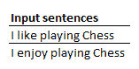

在传统的文本分析中，前两个句子被独热编码如下：

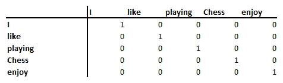

请注意，这两个句子中有五个唯一单词。

单词的独热编码版本导致句子的编码版本如下：

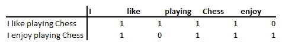

在上述情景中，我们可以看到两个句子之间的欧几里德距离大于零，因为**like**和**enjoy**的编码是不同的。然而，直观上，我们知道 like 和 enjoy 这两个词非常相似。此外，**I**和**Chess**之间的距离与**like**和**enjoy**之间的距离相同。

请注意，鉴于这两个句子中有五个唯一单词，我们将每个单词表示为五维空间中的一个单词。在编码版本中，我们以较低维度（比如三维）表示一个单词，以使相似的单词之间的距离较小，而不是相似的单词之间的距离较大。

# 图像分析中编码的需求

为了理解图像分析中对编码的需求，我们来考虑一个场景：我们对图像进行分组，但图像的标签并不存在。为了进一步澄清，我们来看一下 MNIST 数据集中相同标签的以下图像：

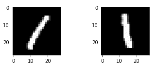

直观地，我们知道前面这两张图片对应的是相同的标签。然而，当我们计算这两张图片之间的欧几里得距离时，距离大于零，因为这两张图片中突出显示的像素不同。

你应该注意到在存储图像信息时存在以下问题：

尽管图像由总共 28 x 28 = 784 个像素组成，但大部分列是黑色的，因此这些列没有包含信息，导致它们在存储信息时占用了比实际需要更多的空间。

使用自动编码器，我们将前面的两张图片表示为较低维度，这样编码版本之间的距离会变得更小，同时确保编码版本不会丢失太多原始图像的信息。

# 推荐系统中对编码的需求

为了理解推荐系统中对编码的需求，我们来考虑顾客电影推荐的场景。类似于文本分析，如果我们对每部电影/顾客进行独热编码，我们将为每部电影（因为电影数量成千上万）得到多个千维的向量。基于顾客的观看习惯，将用户编码到更低的维度，并根据电影的相似性对电影进行分组，这样可以帮助我们推荐顾客更可能观看的电影。

类似的概念也可以应用于电子商务推荐引擎，以及在超市中向顾客推荐商品。

# 编码一张图片

图像编码可以通过多种方式进行。在接下来的章节中，我们将对比普通自动编码器、多层自动编码器和卷积自动编码器的性能。自动编码一词指的是以一种方式进行编码，使得原始输入可以在图像中用更少的维度重建。

自动编码器将图像作为输入，并将输入图像编码为较低的维度，这样我们就可以仅使用输入图像的编码版本来重建原始图像。本质上，你可以认为相似图像的编码版本具有相似的编码值。

# 准备工作

在我们定义策略之前，让我们先了解一下自动编码器是如何工作的：

1.  我们将定义一个包含 11 个值的玩具数据集

1.  我们将把这 11 个值表示为较低维度（二维）：

    +   在降低维度的同时，尽可能保留输入数据中存在的信息

    +   低维空间中的向量称为**嵌入**/**编码** **向量**、**瓶颈** **特征**/**向量**，或者是**压缩表示**

    +   通过将输入值与一个维度为 11 x 2 的随机权重矩阵进行矩阵乘法，11 个值被转换为两个值。

    +   较低维度的向量表示瓶颈特征。瓶颈特征是重建原始图像所需的特征。

1.  我们将重建较低维度的瓶颈特征向量，以获得输出向量：

    +   二维特征向量与一个形状为 2 x 11 的矩阵相乘，得到一个形状为 1 x 11 的输出。1 x 2 与 2 x 11 向量的矩阵乘法将得到一个 1 x 11 形状的输出。

1.  我们将计算输入向量和输出向量之间的平方差之和：

1.  我们通过调整随机初始化的权重向量来最小化输入和输出向量之间的平方差之和。

1.  结果编码向量将是一个低维度的向量，表示二维空间中的 11 维向量。

在利用神经网络时，您可以将编码向量视为连接输入层和输出层的隐藏层。

此外，对于神经网络，输入层和输出层的值是完全相同的，隐藏层的维度低于输入层。

在本教程中，我们将了解多种自编码器：

+   Vanilla 自编码器

+   多层自编码器

+   卷积自编码器

# 如何做到...

在接下来的部分，我们将实现多种自编码器的变种（代码文件可在 GitHub 上的`Auto_encoder.ipynb`中找到）。

# Vanilla 自编码器

一个 Vanilla 自编码器长得如下：

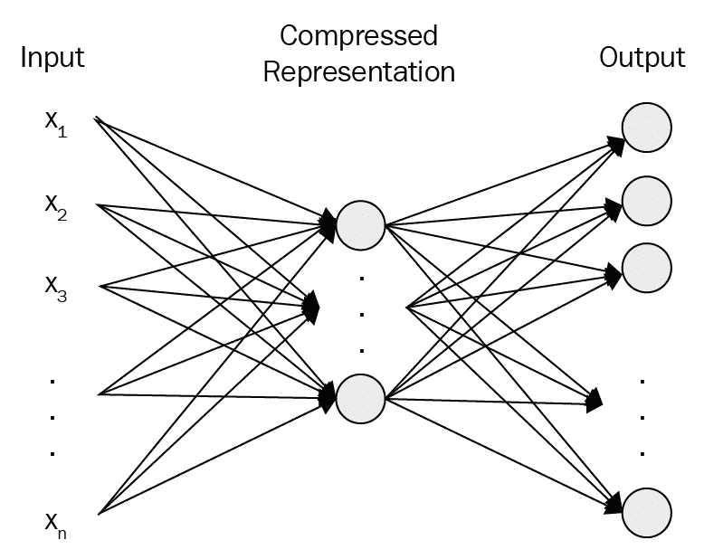

如前图所示，Vanilla 自编码器使用最少的隐藏层和隐藏单元来重建输入数据。

为了理解 Vanilla 自编码器如何工作，让我们按照以下步骤操作，其中我们使用原始图像的低维编码版本来重建 MNIST 图像（代码文件可在 GitHub 上的`Auto_encoder.ipynb`中找到）：

1.  导入相关包：

```py
import tensorflow as tf
import keras
import numpy as np
from keras.datasets import mnist
from keras.models import Sequential
from keras.layers import Dense
from keras.layers import Dropout
from keras.layers import Flatten
from keras.layers.convolutional import Conv2D
from keras.layers.convolutional import MaxPooling2D
from keras.utils import np_utils
```

1.  导入数据集：

```py
(X_train, y_train), (X_test, y_test) = keras.datasets.mnist.load_data()
```

1.  重塑并缩放数据集：

```py
X_train = X_train.reshape(X_train.shape[0],X_train.shape[1]*X_train.shape[2])
X_test = X_test.reshape(X_test.shape[0],X_test.shape[1]*X_test.shape[2])
X_train = X_train/255
X_test = X_test/255
```

1.  构建网络架构：

```py
model = Sequential()
model.add(Dense(32, input_dim=784, activation='relu'))
model.add(Dense(784, activation='relu'))
model.summary()
```

模型的摘要如下：

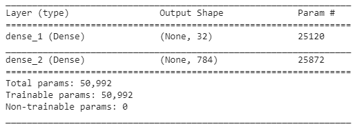

在前面的代码中，我们将一个 784 维的输入表示为一个 32 维的编码版本。

1.  编译并拟合模型：

```py
model.compile(loss='mean_squared_error', optimizer='adam',metrics=['accuracy'])
model.fit(X_train, X_train, validation_data=(X_test, X_test),epochs=10, batch_size=1024, verbose=1)
```

请注意，我们使用均方误差损失函数，因为像素值是连续的。此外，输入和输出数组是相同的——`X_train`。

1.  打印前四个输入图像的重建结果：

```py
import matplotlib.pyplot as plt
%matplotlib inline
plt.subplot(221)
plt.imshow(model.predict(X_test[0,:].reshape(1,784)).reshape(28,28), cmap=plt.get_cmap('gray'))
plt.axis('off')
plt.subplot(222)
plt.imshow(model.predict(X_test[1,:].reshape(1,784)).reshape(28,28), cmap=plt.get_cmap('gray'))
plt.axis('off')
plt.subplot(223)
plt.imshow(model.predict(X_test[2,:].reshape(1,784)).reshape(28,28), cmap=plt.get_cmap('gray'))
plt.axis('off')
plt.subplot(224)
plt.imshow(model.predict(X_test[3,:].reshape(1,784)).reshape(28,28), cmap=plt.get_cmap('gray'))
plt.axis('off')
plt.show()
```

重建后的 MNIST 数字如下：

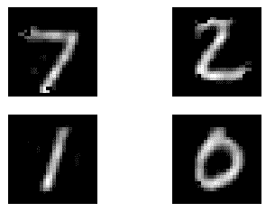

为了了解自编码器的效果如何，我们来比较一下之前的预测和原始输入图像：

原始的 MNIST 数字如下：

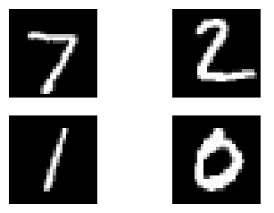

从前面的图像中，我们可以看到，重建的图像与原始输入图像相比有些模糊。

为了避免模糊问题，我们来构建更深的多层自编码器（从而产生更多的参数），这样可以更好地表示原始图像。

# 多层自编码器

多层自编码器如下所示，其中有更多的隐藏层将输入层与输出层连接起来：

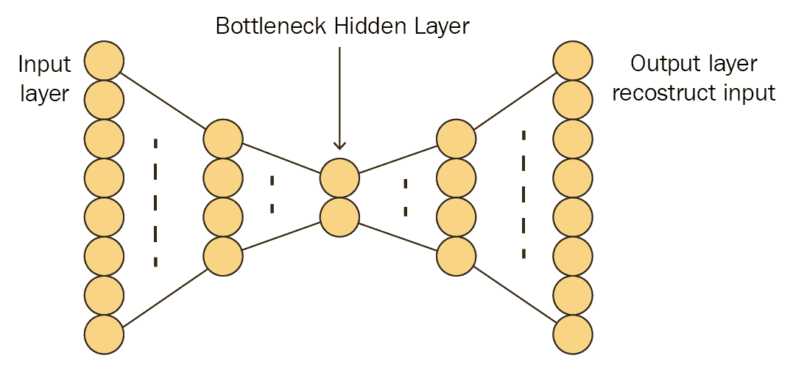

本质上，多层自编码器通过更多的隐藏层来重建输入。

为了构建多层自编码器，我们将重复前一节中的相同步骤，直到*步骤 3*。然而，*步骤 4*，即定义网络架构的部分，将被修改为包含多层，如下所示：

```py
model = Sequential()
model.add(Dense(100, input_dim=784, activation='relu'))
model.add(Dense(32,activation='relu'))
model.add(Dense(100,activation='relu'))
model.add(Dense(784, activation='relu'))
model.summary()
```

模型的摘要如下：

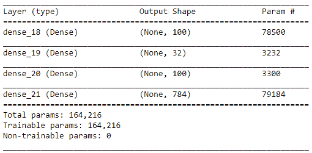

在上述网络中，我们的第一个隐藏层有 100 个单元，第二个隐藏层（即图像的嵌入版本）是 32 维的，第三个隐藏层是 100 维的。

一旦网络架构定义完成，我们就可以编译并运行它，步骤如下：

```py
model.compile(loss='mean_squared_error', optimizer='adam')
model.fit(X_train, X_train, validation_data=(X_test, X_test),epochs=25, batch_size=1024, verbose=1)
```

上述模型的预测结果如下：

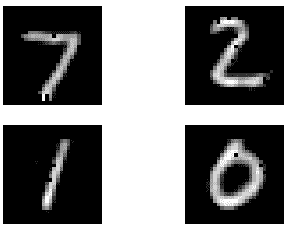

请注意，与原始图像相比，之前的预测结果仍然有些模糊。

# 卷积自编码器

到目前为止，我们已经探讨了传统和多层自编码器。在本节中，我们将看到卷积自编码器如何从低维向量中重建原始图像。

卷积自编码器如下所示：

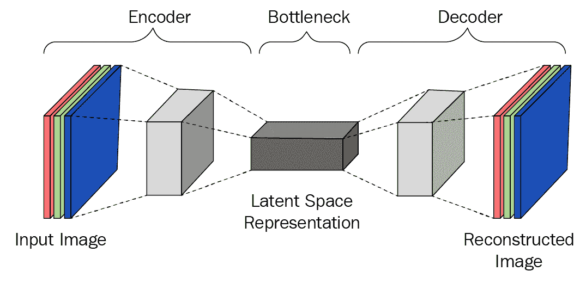

本质上，卷积自编码器通过更多的隐藏层来重建输入，其中隐藏层包括卷积、池化以及对下采样图像的上采样。

类似于多层自编码器，卷积自编码器与其他类型的自编码器在模型架构上有所不同。在以下代码中，我们将定义卷积自编码器的模型架构，而其他步骤与传统自编码器保持一致，直到*步骤 3*。

`X_train` 和 `X_test` 形状之间唯一的区别如下所示：

```py
(X_train, y_train), (X_test, y_test) = keras.datasets.mnist.load_data()

X_train = X_train.reshape(X_train.shape[0],X_train.shape[1],X_train.shape[2],1)
X_test = X_test.reshape(X_test.shape[0],X_test.shape[1],X_test.shape[2],1)
X_train = X_train/255
X_test = X_test/255
```

请注意，在前面的步骤中，我们正在重塑图像，以便将其传递给 `conv2D` 方法：

1.  定义模型架构：

```py
model = Sequential()
model.add(Conv2D(32, (3,3), input_shape=(28, 28,1), activation='relu',padding='same',name='conv1'))
model.add(MaxPooling2D(pool_size=(2, 2),name='pool1'))
model.add(Conv2D(16, (3,3), activation='relu',padding='same',name='conv2'))
model.add(MaxPooling2D(pool_size=(2, 2),name='pool2'))
model.add(Conv2D(8, (3,3), activation='relu',padding='same',name='conv3'))
model.add(MaxPooling2D(pool_size=(2, 2),name='pool3'))
model.add(Conv2D(32, (3,3), activation='relu',padding='same',name='conv4'))
model.add(MaxPooling2D(pool_size=(2, 2),name='pool4'))
model.add(Flatten(name='flatten'))
model.add(Reshape((1,1,32)))
model.add(Conv2DTranspose(8, kernel_size = (3,3), activation='relu'))
model.add(Conv2DTranspose(16, kernel_size = (5,5), activation='relu'))
model.add(Conv2DTranspose(32, kernel_size = (8,8), activation='relu'))
model.add(Conv2DTranspose(32, kernel_size = (15,15), activation='relu'))
model.add(Conv2D(1, (3, 3), activation='relu',padding='same'))
model.summary()
```

在前面的代码中，我们定义了一个卷积架构，将输入图像重塑为具有 32 维嵌入版本的图像，该嵌入版本位于架构的中间，最后进行上采样，从而使我们能够重建该图像。

模型的摘要如下：

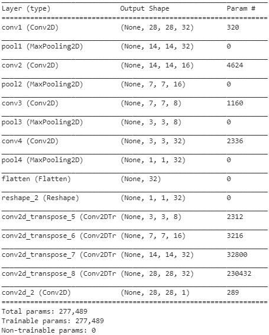

1.  编译并拟合模型

```py
from keras.optimizers import Adam
adam = Adam(lr=0.001)
model.compile(loss='mean_squared_error', optimizer='adam')
model.fit(X_train, X_train, validation_data=(X_test, X_test),epochs=10, batch_size=1024, verbose=1)
```

一旦我们对前四个测试数据点进行预测，重建后的图像如下所示：

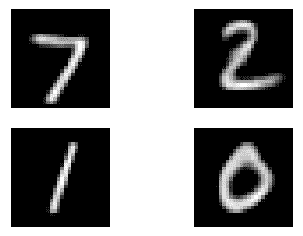

请注意，当前的重构效果略优于之前使用 Vanilla 和多层自编码器对测试图像进行的两个重构。

# 将相似的图像分组

在前面的章节中，我们将每个图像表示为较低维度的向量，直觉是相似的图像会有相似的嵌入，而不相似的图像则会有不同的嵌入。然而，我们还没有考察相似度度量，也没有详细检查嵌入。

在本节中，我们将尝试在二维空间中绘制嵌入。我们可以使用一种叫做**t-SNE**的技术，将 32 维向量降维到二维空间。（更多关于 t-SNE 的内容可以参考这里：[`www.jmlr.org/papers/v9/vandermaaten08a.html`](http://www.jmlr.org/papers/v9/vandermaaten08a.html)。）

通过这种方式，我们的直觉——相似的图像会有相似的嵌入——可以得到验证，因为相似的图像应该聚类在二维平面上。

在以下代码中，我们将所有测试图像的嵌入表示为二维平面：

1.  提取测试集中每个 10,000 张图像的 32 维向量：

```py
from keras.models import Model
layer_name = 'flatten'
intermediate_layer_model = Model(inputs=model.input,outputs=model.get_layer(layer_name).output)
intermediate_output = intermediate_layer_model.predict(X_test)
```

1.  执行 t-SNE 生成二维向量：

```py
from sklearn.manifold import TSNE
tsne_model = TSNE(n_components=2, verbose=1, random_state=0)
tsne_img_label = tsne_model.fit_transform(intermediate_output)
tsne_df = pd.DataFrame(tsne_img_label, columns=['x', 'y'])
tsne_df['image_label'] = y_test
```

1.  绘制测试图像嵌入的 t-SNE 维度可视化：

```py
from ggplot import *
chart = ggplot(tsne_df, aes(x='x', y='y', color='factor(image_label)'))+ geom_point(size=70,alpha=0.5)
chart
```

二维空间中嵌入的可视化如下所示：

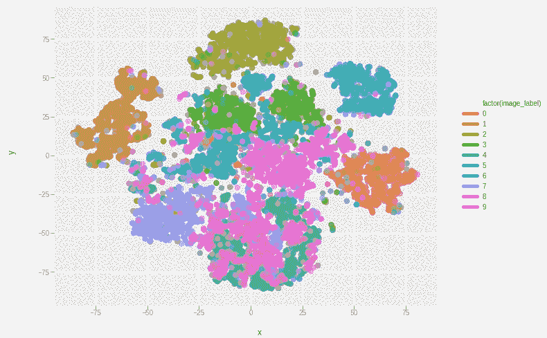

请注意，在上面的图表中，我们可以看到，相同标签的图像通常会形成簇。

# 推荐系统的编码

到目前为止，在前面的章节中，我们对图像进行了编码。在本节中，我们将对电影相关数据集中的用户和电影进行编码。原因在于，可能会有数百万个用户和成千上万部电影在目录中。因此，我们不能直接对这些数据进行独热编码。在这种情况下，编码就显得尤为重要。矩阵分解是推荐系统中常用的编码技术之一。在下一节中，我们将理解它的工作原理，并为用户和电影生成嵌入。

# 准备工作

编码用户和电影的思路如下：

如果两个用户在喜欢某些电影方面相似，那么表示这两个用户的向量应该相似。类似地，如果两部电影相似（可能属于同一类型或有相同的演员阵容），它们的向量应该相似。

我们将采用的电影编码策略，目的是根据用户观看过的历史电影推荐一组新的电影，具体如下：

1.  导入包含用户信息及他们给不同电影打分的数据集

1.  为用户和电影分配 ID

1.  将用户和电影转换为 32 维向量

1.  使用 Keras 的功能 API 执行电影和用户的 32 维向量的点积：

    +   如果有 100,000 个用户和 1,000 部电影，则电影矩阵将是 1,000 x 32 维，而用户矩阵将是 100,000 x 32 维。

    +   两者的点积将是 100,000 x 1,000 的维度。

1.  将输出展平并通过一个密集层，然后连接到输出层，输出层具有线性激活，输出值的范围从 1 到 5。

1.  训练模型

1.  提取电影的嵌入权重

1.  提取用户的嵌入权重

1.  可以通过计算目标电影与数据集中其他所有电影的成对相似度，找到与给定电影相似的电影。

# 如何实现...

在下面的代码中，我们将为一个用户和一部电影设计一个向量，这在典型的推荐系统中使用（代码文件可以在 GitHub 的`Recommender_systems.ipynb`中找到）：

1.  导入数据集。推荐的数据集可以在 GitHub 上的代码中找到。

```py
import numpy as np
import pandas as pd
from keras.layers import Input, Embedding, Dense, Dropout, merge, Flatten, dot
from keras.models import Model
from keras.optimizers import Adam
ratings = pd.read_csv('...') # Path to the user-movie-ratings file
```

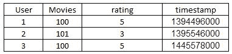

1.  将用户和电影转换为分类变量。在下面的代码中，我们创建了两个新的变量——`User2` 和 `Movies2`——它们是分类变量：

```py
ratings['User2']=ratings['User'].astype('category')
ratings['Movies2']=ratings['Movies'].astype('category')
```

1.  为每个用户和电影分配一个唯一的 ID：

```py
users = ratings.User.unique()
movies = ratings.Movies.unique()
userid2idx = {o:i for i,o in enumerate(users)}
moviesid2idx = {o:i for i,o in enumerate(movies)}
idx2userid = {i:o for i,o in enumerate(users)}
idx2moviesid = {i:o for i,o in enumerate(movies)}
```

1.  将唯一的 ID 作为新列添加到原始表中：

```py
ratings['Movies2'] = ratings.Movies.apply(lambda x: moviesid2idx[x])
ratings['User2'] = ratings.User.apply(lambda x: userid2idx[x])
```

1.  为每个用户 ID 和唯一 ID 定义嵌入：

```py
n_users = ratings.User.nunique()
n_movies = ratings.Movies.nunique()
```

在前面的代码中，我们正在提取数据集中唯一用户和唯一电影的总数：

```py
def embedding_input(name,n_in,n_out):
  inp = Input(shape=(1,),dtype='int64',name=name)
  return inp, Embedding(n_in,n_out,input_length=1)(inp)
```

在前面的代码中，我们定义了一个函数，输入一个 ID，将其转换为一个嵌入向量，该向量的维度为`n_out`，总共有`n_in`个值：

```py
n_factors = 100
user_in, u = embedding_input('user_in', n_users, n_factors)
article_in, a = embedding_input('article_in', n_movies, n_factors)
```

在前面的代码中，我们正在为每个唯一用户以及每个唯一电影提取 100 个维度。

1.  定义模型：

```py
x = dot([u,a], axes=1)
x=Flatten()(x)
x = Dense(500, activation='relu')(x)
x = Dense(1)(x)
model = Model([user_in,article_in],x)
adam = Adam(lr=0.01)
model.compile(adam,loss='mse')
model.summary()
```

模型摘要如下：

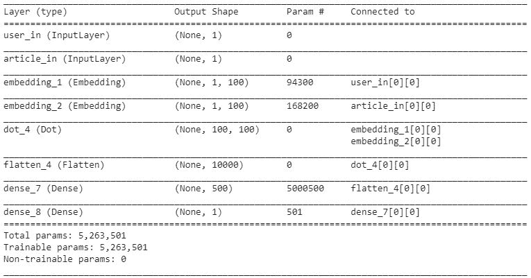

1.  训练模型：

```py
model.fit([ratings.User2,ratings.Movies2], ratings.rating, epochs=50,batch_size=128)
```

1.  提取每个用户或电影的向量：

```py
# Extracting user vectors
model.get_weights()[0]

# Extracting movie vectors
model.get_weights()[1]
```

正如我们之前所想，类似的电影应该有相似的向量。

通常，在识别嵌入之间的相似性时，我们使用一种称为余弦相似度的度量（如何计算余弦相似度的更多信息将在下一章中介绍）。

对于一个随机选中的电影，其位于第 574^(个)位置，余弦相似度计算如下：

```py
from sklearn.metrics.pairwise import cosine_similarity
np.argmax(cosine_similarity(model.get_weights()[1][574].reshape(1,-1),model.get_weights()[1][:574].reshape(574,100)))
```

从前面的代码中，我们可以计算出与位于分类电影列中第 574^(个)位置的电影最相似的 ID。

一旦我们查看电影 ID 列表，我们应该会看到与给定电影最相似的电影，直观上它们确实是相似的。
