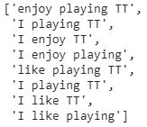
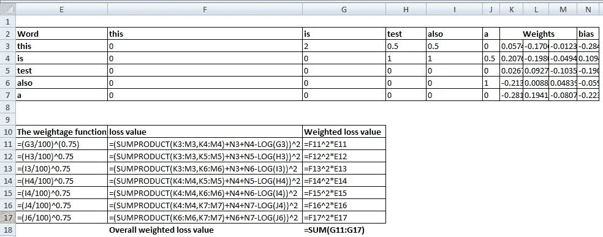
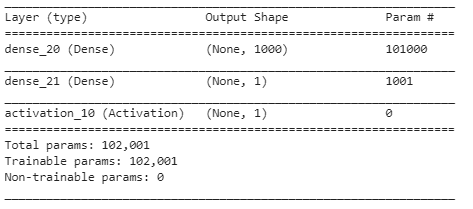

# 第十章：使用单词向量进行文本分析

在上一章中，我们学习了如何对图像、用户或电影进行编码以用于推荐系统，在这些系统中，相似的物品有相似的向量。在本章中，我们将讨论如何对文本数据进行编码。

你将学习以下主题：

+   从零开始在 Python 中构建单词向量

+   使用 skip-gram 和 CBOW 模型构建单词向量

+   使用预训练的单词向量进行向量运算

+   创建文档向量

+   使用 fastText 构建单词向量

+   使用 GloVe 构建单词向量

+   使用单词向量构建情感分类

# 介绍

在传统的解决与文本相关的问题的方法中，我们会进行一-hot 编码。然而，如果数据集包含成千上万个唯一的单词，那么得到的一-hot 编码向量将有成千上万的维度，这可能会导致计算问题。此外，在这种情况下，相似的单词并不会拥有相似的向量。Word2Vec 是一种方法，帮助我们为相似的单词获得相似的向量。

为了理解 Word2Vec 如何有用，我们来探讨以下问题。

假设我们有两个输入句子：


从直观上看，我们知道**enjoy**（享受）和**like**（喜欢）是相似的单词。然而，在传统的文本挖掘中，当我们对这些单词进行一-hot 编码时，输出如下所示：


注意到一-hot 编码会将每个单词分配到一个列中。这样的一-hot 编码的主要问题是，`I`和**enjoy**之间的欧几里得距离与**enjoy**和**like**之间的欧几里得距离是相同的。

然而，从直观上看，我们知道**enjoy**和**like**之间的距离应该比`I`和**enjoy**之间的距离要小，因为**enjoy**和**like**是彼此相似的。

# 从零开始在 Python 中构建单词向量

我们将构建单词向量的原理是*相关的单词周围会有相似的词*。

例如：*queen*（皇后）和*princess*（公主）这两个单词会更频繁地拥有与*kingdom*（王国）相关的词汇在它们周围。从某种程度上说，这些单词的上下文（周围的词汇）是相似的。

# 准备工作

当我们将周围的单词作为输入，中间的单词作为输出时，我们的数据集（包含两个句子）如下所示：


注意我们是使用中间词作为输出，其余的词作为输入。这个输入和输出的向量化形式如下所示（回想一下我们在第九章的*文本分析中编码的必要性*部分中，*输入编码*部分，如何将一个句子转换成向量）：


请注意，第一行中输入的向量化形式是*{0, 1, 1, 1, 0}*，因为输入词的索引是*{1, 2, 3}*，输出是*{1, 0, 0, 0, 0}*，因为输出词的索引是*{1}*。

在这种情况下，我们的隐藏层有三个神经元与之相关联。我们的神经网络将如下所示：


每一层的维度如下：

| **层** | **权重形状** | **备注** |
| --- | --- | --- |
| 输入层 | 1 x 5 | 每一行与五个权重相乘。 |
| 隐藏层 | 5 x 3 | 每五个输入权重分别连接到隐藏层中的三个神经元。 |
| 隐藏层输出 | 1 x 3 | 这是输入和隐藏层的矩阵乘法。 |
| 从隐藏层到输出层的权重 | 3 x 5 | 三个输出隐藏单元被映射到五个输出列（因为有五个独特的词）。 |
| 输出层 | 1 x 5 | 这是隐藏层输出与从隐藏层到输出层权重的矩阵乘法。 |

请注意，在构建词向量时，我们不会对隐藏层进行激活处理。

输出层的值没有限制在特定范围内。因此，我们通过 softmax 函数将其转换为词的概率。此外，我们最小化交叉熵损失，以便在整个网络中得到最优的权重值。现在，给定词的词向量就是当输入是该词的一热编码版本时，隐藏层单元的值（而不是输入句子）。

# 如何实现...

现在我们知道了如何生成词向量，接下来我们在 GitHub 中编写生成词向量的过程（代码文件为`Word_vector_generation.ipynb`）：

1.  定义感兴趣的句子：

```py
docs = ["I enjoy playing TT", "I like playing TT"]
```

从前面的内容可以预期，`enjoy`和`like`的词向量应该相似，因为它们周围的词是完全相同的。

1.  现在让我们创建每个句子的独热编码版本：

```py
from sklearn.feature_extraction.text import CountVectorizer
vectorizer = CountVectorizer(min_df=0, token_pattern=r"\b\w+\b")
vectorizer.fit(docs)
```

请注意，vectorizer 定义了将文档转换为向量格式的参数。此外，我们传入更多的参数，以确保像`I`这样的词不会在`CountVectorizer`中过滤掉。

此外，我们将把文档适配到定义的 vectorizer 中。

1.  将文档转换为向量格式：

```py
vector = vectorizer.transform(docs)
```

1.  验证所做的转换：

```py
print(vectorizer.vocabulary_)
print(vector.shape)
print(vector.toarray())
```


请注意，`vocabulary_`返回各种词的索引，并且转换后的`toarray`向量返回句子的独热编码版本。

1.  创建输入和输出数据集：

```py
x = []
y = []
for i in range(len(docs)):
     for j in range(len(docs[i].split())):
         t_x = []
         t_y = []
         for k in range(4):
             if(j==k):
                 t_y.append(docs[i].split()[k])
                 continue
             else:
                 t_x.append(docs[i].split()[k])
         x.append(t_x)
         y.append(t_y)

x2 = []
y2 = []
for i in range(len(x)):
     x2.append(' '.join(x[i]))
     y2.append(' '.join(y[i]))
```

从前面的代码，我们已经创建了输入和输出数据集。这里是输入数据集：



这里是输出数据集：


1.  将前述的输入和输出词转换为向量：

```py
vector_x = vectorizer.transform(x2)
vector_x.toarray()
vector_y = vectorizer.transform(y2)
vector_y.toarray()
```

这里是输入数组：


这里是输出数组：


1.  定义一个神经网络模型，该模型通过一个包含三个单元的隐藏层来映射输入和输出向量：

```py
model = Sequential()
model.add(Dense(3, activation='linear', input_shape=(5,)))
model.add(Dense(5,activation='sigmoid'))
```

1.  编译并拟合模型：

```py
model.compile(loss='binary_crossentropy',optimizer='adam')

model.fit(vector_x, vector_y, epochs=1000, batch_size=4,verbose=1)
```

1.  通过提取中间层的值来提取词向量，输入为每个单独词的向量（而不是一个句子）：

```py
from keras.models import Model
layer_name = 'dense_5'
intermediate_layer_model = Model(inputs=model.input,outputs=model.get_layer(layer_name).output)
```

在之前的代码中，我们从我们感兴趣的层提取输出：在我们初始化的模型中，名为`dense_5`的层。

在下面的代码中，我们在传递词的一次性编码版本作为输入时提取中间层的输出：

```py
for i in range(len(vectorizer.vocabulary_)):
     word = list(vectorizer.vocabulary_.keys())[i]
     word_vec = vectorizer.transform([list(vectorizer.vocabulary_.keys())[i]]).toarray()
     print(word, intermediate_layer_model.predict(word_vec))
```

单个词的词向量如下：


注意，*享受*和*喜欢*之间的相关性比其他词更强，因此它们更好地表示词向量。

由于我们在构建模型时没有指定层名称，因此您运行的模型的名称可能不同。此外，在我们没有明确指定模型名称的情况下，每次初始化模型时，层名称都会发生变化。

# 测量词向量之间的相似度

词向量之间的相似度可以通过多种度量方法来测量——以下是两种常见的度量方法：

+   余弦相似度

+   欧几里得距离

两个不同向量，`A`和`B`之间的余弦相似度计算如下：


在上一节的例子中，*享受*和*喜欢*之间的余弦相似度计算如下：

*享受 = (-1.43, -0.94, -2.49)*

*喜欢 = (-1.43, -0.94, -2.66)*

这里是*享受*和*喜欢*向量之间的相似度：

*(-1.43*-1.43 + -0.94*-0.94 +-2.49*-2.66)/ sqrt((-1.43)² + (-0.94)² + (-2.49)²)* sqrt((-1.43)² + (-0.94)² + (-2.66)²) = 0.99*

两个不同向量，`A`和`B`之间的欧几里得距离计算如下：

*distance = sqrt(A-B)²*

*= sqrt((-1.43 - (-1.43))² + (-0.94 - (-0.94))² + (-2.49 - (-2.66))²)*

*= 0.03*

# 使用 skip-gram 和 CBOW 模型构建词向量

在之前的食谱中，我们构建了一个词向量。在本食谱中，我们将使用`gensim`库构建 skip-gram 和 CBOW 模型。

# 准备工作

我们在本例中采用的方法来构建词向量称为**连续词袋模型**（**CBOW**）。之所以称为 CBOW，解释如下：

我们以这句话为例：*我享受玩 TT*。

下面是 CBOW 模型处理此句子的方式：

1.  固定一个大小为 1 的窗口。

    +   通过指定窗口大小，我们确定了给定词的左右两边将被考虑的词的数量。

1.  给定窗口大小，输入和输出向量将如下所示：

| **输入词** | **输出词** |
| --- | --- |
| *{我, 玩}* | *{享受}* |
| *{享受,TT}* | *{玩}* |

另一种构建词向量的方法是 skip-gram 模型，其中之前的步骤被反转，如下所示：

| **输入词** | **输出词** |
| --- | --- |
| *{enjoy}* | *{I, playing}* |
| *{playing}* | *{enjoy, TT}* |

无论是 skip-gram 模型还是 CBOW 模型，得到单词隐藏层值的方法都是相同的，正如我们在前面的部分讨论过的那样。

# 如何实现：

现在我们理解了单词向量的构建后台工作，让我们使用 skip-gram 和 CBOW 模型来构建单词向量。为了构建模型，我们将使用航空公司情感数据集，其中给出了推文文本以及对应的情感。为了生成词向量，我们将使用`gensim`包，如下所示（代码文件在 GitHub 上可用，文件名为`word2vec.ipynb`）：

1.  安装`gensim`包：

```py
$pip install gensim
```

1.  导入相关的包：

```py
import gensim
import pandas as pd
```

1.  读取航空公司推文情感数据集，其中包含与航空公司相关的评论（文本）及其相应的情感。数据集可以从[`d1p17r2m4rzlbo.cloudfront.net/wp-content/uploads/2016/03/Airline-Sentiment-2-w-AA.csv`](https://d1p17r2m4rzlbo.cloudfront.net/wp-content/uploads/2016/03/Airline-Sentiment-2-w-AA.csv)获取：

```py
data=pd.read_csv('https://www.dropbox.com/s/8yq0edd4q908xqw/airline_sentiment.csv')
data.head()                   
```

数据集样本如下所示：


1.  对前面的文本进行预处理，执行以下操作：

    +   将每个单词标准化为小写。

    +   移除标点符号，仅保留数字和字母。

    +   移除停用词：

```py
import re
import nltk
from nltk.corpus import stopwords
nltk.download('stopwords')
stop = set(stopwords.words('english'))
def preprocess(text):
    text=text.lower()
    text=re.sub('[⁰-9a-zA-Z]+',' ',text)
    words = text.split()
    words2 = [i for i in words if i not in stop]
    words3=' '.join(words2)
    return(words3)
data['text'] = data['text'].apply(preprocess)
```

1.  将句子拆分为一个词汇表（tokens）的列表，这样它们就可以传递给`gensim`。第一句的输出应如下所示：

```py
data['text'][0].split()
```

上面的代码通过空格分割句子，结果如下所示：


我们将遍历所有文本并将其附加到一个列表中，如下所示：

```py
list_words=[]
for i in range(len(data)):
     list_words.append(data['text'][i].split())
```

让我们查看列表中的前三个子列表：

```py
list_words[:3]
```

前三句话的词汇表如下所示：


1.  构建`Word2Vec`模型：

```py
from gensim.models import Word2Vec
```

定义词向量的维度、上下文窗口的大小以及词汇的最小计数要求，作为它有资格拥有词向量的标准，如下所示：

```py
model = Word2Vec(size=100,window=5,min_count=30, sg=0, alpha = 0.025)
```

在前面的代码中，`size`表示词向量的大小（维度），`window`表示考虑的上下文词汇的大小，`min_count`指定词汇出现的最小频率，`sg`表示是否使用 skip-gram（当`sg=1`时）或使用 CBOW（当`sg=0`时），`alpha`表示模型的学习率。

一旦模型定义完成，我们将传递我们的列表来构建词汇表，如下所示：

```py
model.build_vocab(list_words)
```

一旦构建好词汇表，过滤掉在整个语料库中出现次数少于 30 次的词语，剩余的最终词汇如下所示：

```py
model.wv.vocab.keys()
```

1.  通过指定需要考虑的示例（列表）总数以及运行的迭代次数（epochs）来训练模型，如下所示：

```py
model.train(list_words, total_examples=model.corpus_count, epochs=100)
```

在上述代码中，`list_words`（单词列表）是输入，`total_examples`表示要考虑的列表总数，`epochs`是运行的训练轮数。

或者，你也可以通过在`Word2Vec`方法中指定`iter`参数来训练模型，具体如下：

```py
model = Word2Vec(list_words,size=100,window=5,min_count=30, iter = 100)
```

1.  提取给定词（`month`）的词向量，具体如下：

```py
model['month']
```

对应"month"这个词的词向量如下：


两个词之间的相似度可以按以下方式计算：

```py
model.similarity('month','year')
0.48
```

给定词与最相似的词是通过以下方式计算的：

```py
model.most_similar('month')
```

`month`这个词最相似的词如下：


请注意，尽管这些相似度看起来较低，有些最相似的词也不直观，但一旦我们在比我们现有的 11,000 条推文数据集更大的数据集上进行训练，结果会更加真实。

在上述场景中，运行模型若干轮后，看看与"month"这个词最相似的词是什么：

```py
model = Word2Vec(size=100,window=5,min_count=30, sg=0)
model.build_vocab(list_words)
model.train(list_words, total_examples=model.corpus_count, epochs=5)
model.most_similar('month')
```

与"month"最相似的词如下：


我们可以看到，如果训练轮数较少，与`month`最相似的词不太直观，而当训练轮数较多时，结果更具直观性，特别是因为在训练轮数少的情况下，权重没有完全优化。

通过将`sg`参数的值设置为`1`，可以将相同的操作应用于 skip-gram。

# 使用预训练的词向量进行向量运算

在前一节中，我们看到的一个限制是，句子的数量太少，无法构建一个强健的模型（我们在前一节中看到，month 和 year 之间的相关性大约为 0.4，比较低，因为它们属于相同类型的词）。

为了克服这种情况，我们将使用由 Google 训练的词向量。Google 提供的预训练词向量包括一个包含 3,000,000 个单词和短语的词汇表，这些词向量是在 Google 新闻数据集上的单词上训练的。

# 如何操作……

1.  从 Google News 下载预训练的词向量（代码文件可以在 GitHub 上作为`word2vec.ipynb`获取）：

```py
$wget https://s3.amazonaws.com/dl4j-distribution/GoogleNews-vectors-negative300.bin.gz
```

解压下载的文件：

```py
$gunzip '/content/GoogleNews-vectors-negative300.bin.gz'
```

此命令解压`bin`文件，该文件是模型的保存版本。

1.  加载模型：

```py
from gensim.models import KeyedVectors
filename = '/content/GoogleNews-vectors-negative300.bin'
model = KeyedVectors.load_word2vec_format(filename, binary=True)
```

1.  加载与给定词`month`最相似的词：

```py
model.most_similar('month')
```

与`month`最相似的词如下：


1.  我们将执行向量运算；也就是说，我们将尝试回答以下类比问题：woman 与 man 的关系，什么与 king 的关系最相似？请查看以下代码：

```py
result = model.most_similar(positive=['woman', 'king'], negative=['man'], topn=1)
print(result)
```

上述算式的输出结果如下：


在这种情况下，将`woman`的词向量从`man`的词向量中减去，并将其加到`king`的词向量中，从而得到一个最接近`queen`的词向量。

# 创建文档向量

为了理解文档向量的存在原因，我们来梳理一下以下的直觉。

单词*bank*在金融和河流两个语境中都有使用。我们如何识别给定句子或文档中的*bank*是与河流主题相关，还是与金融主题相关呢？

这个问题可以通过添加文档向量来解决，这与单词向量的生成方式类似，但在此基础上加入了段落 ID 的一热编码版本，如下所示：


在前述场景中，段落 ID 包含了那些仅通过单词无法捕捉到的差异。例如，在句子*on the bank of river*中，*on the bank of*是输入，*river*是输出，单词*on, the*和*of*由于是高频词，因此不会对预测产生贡献，而单词*bank*则使得输出预测变得模糊，可能是河流或是美国。这个特定文档/句子的文档 ID 将帮助识别该文档是与河流相关，还是与金融相关。这个模型称为**段落向量的分布式记忆模型**（**PV-DM**）。

例如，如果文档数量为 100，则段落 ID 的一热编码版本将是 100 维的。同样，如果符合最小频率的唯一单词数量为 1,000，则这些单词的一热编码版本将是 1,000 维的。当隐藏层的大小（即单词向量大小）为 300 时，参数的总数将是 100 * 300 + 1,000 * 300 = 330,000。

文档向量将是当所有输入单词的一热编码版本为 0 时的隐藏层值（即，单词的影响被中和，仅考虑文档/段落 ID 的影响）。

类似于输入和输出在 skip-gram 和 CBOW 模型中相互转换的方式，即使是文档向量，输出和输入也可以按照如下方式交换：


这种模型的表示称为**段落向量与分布式词袋模型**（**PVDBOW**）。

# 准备中

我们构建文档向量的策略如下：

+   对输入句子进行预处理，去除标点符号，并将所有单词小写，同时移除停用词（如*and*和*the*等出现频率很高且不对句子提供上下文意义的词）。

+   给每个句子标记上其句子 ID。

    +   我们为每个句子分配一个 ID。

+   使用 Doc2Vec 方法提取文档 ID 以及单词的向量。

    +   在较多的训练周期中训练 Doc2Vec 方法，以便对模型进行训练。

# 如何实现……

现在我们已经理解了文档向量是如何生成的，并且制定了构建文档向量的策略，接下来让我们生成航空公司推文数据集的文档向量（代码文件在 GitHub 上可用，名为`word2vec.ipynb`）：

1.  导入相关包：

```py
from gensim.models.doc2vec import Doc2Vec, TaggedDocument
from nltk.tokenize import word_tokenize
```

1.  预处理推文文本：

```py
import re
import nltk
from nltk.corpus import stopwords
nltk.download('stopwords')
stop = set(stopwords.words('english'))
def preprocess(text):
    text=text.lower()
    text=re.sub('[⁰-9a-zA-Z]+',' ',text)
    words = text.split()
    words2 = [i for i in words if i not in stop]
    words3=' '.join(words2)
    return(words3)
data['text'] = data['text'].apply(preprocess)
```

1.  创建一个包含标记文档的字典，其中文档 ID 会与文本（推文）一起生成：

```py
import nltk
nltk.download('punkt')
tagged_data = [TaggedDocument(words=word_tokenize(_d.lower()), tags=[str(i)]) for i, _d in enumerate(data['text'])]
```

标记文档数据如下所示：


在上面的代码中，我们正在提取句子（文档）中所有组成词汇的列表。

1.  按照如下方式初始化一个带有参数的模型：

```py
max_epochs = 100
vec_size = 300
alpha = 0.025
model = Doc2Vec(size=vec_size,
                alpha=alpha,
                min_alpha=0.00025,
                min_count=30,
                dm =1)
```

在上面的代码片段中，`size` 表示文档的向量大小，`alpha` 表示学习率，`min_count` 表示单词的最小频率，`dm = 1` 表示 PV-DM

构建词汇表：

```py
model.build_vocab(tagged_data)
```

1.  在标记数据上训练模型，进行多次迭代：

```py
model.train(tagged_data,epochs=100,total_examples=model.corpus_count)
```

1.  训练过程会生成单词和文档/段落 ID 的向量。

词向量可以与上一节中提取的方式相似地获取，如下所示：

```py
model['wife']
```

可以按如下方式获取文档向量：

```py
model.docvecs[0]
```

上述代码片段生成了第一个文档的文档向量片段。

1.  提取与给定文档 ID 最相似的文档：

```py
similar_doc = model.docvecs.most_similar('457')
print(similar_doc)
```


在上面的代码片段中，我们正在提取与文档 ID 457 最相似的文档 ID，该 ID 为 827。

让我们来看一下文档 457 和 827 的文本：

```py
data['text'][457]
```


```py
data['text'][827]
```


如果我们检查模型的词汇表，我们会看到除了单词 `just`，所有其他单词都出现在两个句子之间——因此很明显，文档 ID `457` 与文档 ID `827` 最相似。

# 使用 fastText 构建词向量

fastText 是由 Facebook 研究团队创建的一个库，用于高效学习词表示和句子分类。

fastText 与 word2vec 的不同之处在于，word2vec 将每个单词视为最小的单位，其向量表示是要查找的，而 fastText 假设一个单词是由字符的 n-gram 组成的；例如，sunny 由 *[sun, sunn, sunny]*，*[sunny, unny, nny]* 等组成，其中我们看到了原始单词的一个子集，大小为 `n`，其中 `n` 可以从 `1` 到原始单词的长度。

使用 fastText 的另一个原因是，有些单词在 skip-gram 或 CBOW 模型中没有达到最小频率阈值。例如，单词 *appended* 与 *append* 可能没有太大区别。然而，如果 *append* 出现频率较高，并且在新的句子中我们遇到的是 *appended* 而不是 *append*，那么我们就无法为 *appended* 提供向量。在这种情况下，fastText 的 n-gram 考虑非常有用。

实际上，fastText 使用的是 skip-gram/CBOW 模型，但它增强了输入数据集，以便考虑到未见过的单词。

# 准备就绪

我们将采用的策略是使用 fastText 提取词向量，具体如下：

1.  使用 gensim 库中的 fastText 方法

1.  预处理输入数据

1.  将每个输入句子拆分成一个列表的列表

1.  在输入的列表列表上构建词汇表

1.  使用之前的输入数据训练模型，进行多次迭代

1.  计算单词之间的相似度

# 如何操作...

在以下代码中，让我们看看如何使用 fastText 生成词向量（代码文件在 GitHub 上的 `word2vec.ipynb` 中可用）：

1.  导入相关的包：

```py
from gensim.models.fasttext import FastText
```

1.  预处理并将数据集准备为列表的列表，就像我们为 word2vec 模型所做的那样：

```py
import re
import nltk
from nltk.corpus import stopwords
nltk.download('stopwords')
stop = set(stopwords.words('english'))
def preprocess(text):
    text=text.lower()
    text=re.sub('[⁰-9a-zA-Z]+',' ',text)
    words = text.split()
    words2 = [i for i in words if i not in stop]
    words3=' '.join(words2)
    return(words3)
data['text'] = data['text'].apply(preprocess)
```

在之前的代码中，我们正在对输入文本进行预处理。接下来，让我们将输入文本转换成一个列表的列表：

```py
list_words=[]
for i in range(len(data)):
     list_words.append(data['text'][i].split())
```

1.  定义模型（指定每个词的向量数）并构建词汇表：

```py
ft_model = FastText(size=100)
ft_model.build_vocab(list_words)
```

1.  训练模型：

```py
ft_model.train(list_words, total_examples=ft_model.corpus_count,epochs=100)
```

1.  检查模型词汇表中不存在的单词的词向量。例如，单词 `first` 存在于词汇表中；然而，单词 `firstli` 不在词汇表中。在这种情况下，检查 `first` 和 `firstli` 的词向量之间的相似度：

```py
ft_model.similarity('first','firstli')
```

之前代码片段的输出是 0.97，表示这两个单词之间有很高的相关性。

因此，我们可以看到 fastText 词向量帮助我们生成词汇表中不存在的单词的词向量。

前述方法也可以用于修正数据集中可能存在的拼写错误，因为拼写错误的单词通常出现的频率较低，而与之最相似且频率最高的单词更可能是拼写正确的版本。

拼写修正可以通过向量运算来执行，如下所示：

```py
result = ft_model.most_similar(positive=['exprience', 'prmise'], negative=['experience'], topn=1)
print(result)
```

请注意，在之前的代码中，正向词有拼写错误，而负向词没有。代码的输出是 `promise`，这意味着它可能会修正我们的拼写错误。

此外，还可以通过以下方式执行：

```py
ft_model.most_similar('exprience', topn=1)
```

*[('experience', 0.9027844071388245)]*

然而，请注意，当存在多个拼写错误时，这种方法不起作用。

# 使用 GloVe 构建词向量

类似于 word2vec 生成词向量的方式，**GloVe**（即**全局词向量表示**的缩写）也生成词向量，但采用的是不同的方法。在本节中，我们将探讨 GloVe 的工作原理，然后详细介绍 GloVe 的实现细节。

# 准备就绪

GloVe 旨在实现两个目标：

+   创建捕获意义的词向量

+   利用全局计数统计而非仅依赖局部信息

GloVe 通过查看单词的共现矩阵并优化损失函数来学习词向量。GloVe 算法的工作细节可以从以下示例中理解：

让我们考虑一个场景，其中有两个句子，如下所示：

| **Sentences** |
| --- |
| 这是测试 |
| 这也是一个 |

让我们尝试构建一个词共现矩阵。在我们的玩具数据集中有五个唯一单词，从而得到的词共现矩阵如下所示：


在上表中，单词*this*和*is*在数据集的两行中共同出现，因此共现值为 2。类似地，单词*this*和*test*仅在数据集中出现一次，因此共现值为 1。

但是，在前述矩阵中，我们没有考虑两个单词之间的距离。考虑两个单词之间距离的直觉是，共同出现的单词之间的距离越远，它们的相关性可能越低。

我们将引入一个新的度量——*偏移量*，它惩罚给定单词与共现单词之间的高距离。例如，在第一句中，*test*与*this*的距离为 2，因此我们将共现数除以 2。

转换后的共现矩阵现在如下所示：

|  | **this** | **is** | **test** | **also** | `a` |
| --- | --- | --- | --- | --- | --- |
| **this** | 0 | 2 | 0.5 | 0.5 | 0.33 |
| **is** | 0 | 0 | 1 | 1 | 0.5 |
| **test** | 0 | 0 | 0 | 0 | 0 |
| **also** | 0 | 0 | 0 | 0 | 1 |
| `a` | 0 | 0 | 0 | 0 | 0 |

现在我们已经构建了矩阵，让我们引入一个额外的参数：*单词的上下文*。例如，如果窗口大小为 2，则单词*this*和`a`之间的共现值将为 0，因为两个单词之间的距离大于 2。当上下文窗口大小为 2 时，转换后的共现矩阵如下所示：

|  | **this** | **is** | **test** | **also** | `a` |
| --- | --- | --- | --- | --- | --- |
| **this** | 0 | 2 | 0.5 | 0.5 | 0 |
| **is** | 0 | 0 | 1 | 1 | 0.5 |
| **test** | 0 | 0 | 0 | 0 | 0 |
| **also** | 0 | 0 | 0 | 0 | 1 |
| `a` | 0 | 0 | 0 | 0 | 0 |

现在我们得到了一个修改后的共现矩阵，我们随机初始化了每个单词的词向量，此示例中每个单词的维度为 2。每个单词的随机初始化权重和偏置值如下所示：

| **Word** | **Weights 1** | **Weights 2** | **Weights 3** | **Bias** |
| --- | --- | --- | --- | --- |
| **this** | -0.64 | 0.82 | -0.08 | 0.16 |
| **is** | -0.89 | -0.31 | 0.79 | -0.34 |
| **test** | -0.01 | 0.14 | 0.82 | -0.35 |
| **also** | -0.1 | -0.67 | 0.89 | 0.26 |
| `a` | -0.1 | -0.84 | 0.35 | 0.36 |

由于前面的权重和偏置是随机初始化的，我们修改权重以优化损失函数。为了做到这一点，我们定义感兴趣的损失函数如下：


在前面的公式中，*w[i]*表示第`i`个单词的词向量，*w[j]*表示第`j`个单词的词向量；*b[i]*和*b[j]*分别是与第`i`个和第`j`个单词对应的偏置；*X[ij]*表示我们之前定义的最终共现值。

例如，当`i`是单词*this*，`j`是单词*also*时，*X[ij]*的值为 0.5。

当*X[ij]*的值为 0 时，f(*x[ij]*)的值为 0；否则，计算方式如下：


在前面的公式中，alpha 通过经验发现为 0.75，*x[max]*为 100，`x`是*x[ij]*的值。

现在公式已经定义，让我们将其应用到我们的矩阵中，如下所示：



第一张表表示单词共现矩阵和随机初始化的权重和偏置。

第二张表表示损失值计算，我们在其中计算整体加权损失值。

我们优化权重和偏置，直到整体加权损失值最小。

# 如何操作...

既然我们已经知道了如何使用 GloVe 生成词向量，那么我们可以在 Python 中实现相同的功能（代码文件可以在 GitHub 上的`word2vec.ipynb`中找到）：

1.  安装 GloVe：

```py
$pip install glove_python
```

1.  导入相关包：

```py
from glove import Corpus, Glove
```

1.  按照我们在 word2vec、skip-gram 和 CBOW 算法中预处理数据集的方式进行预处理，如下所示：

```py
import re
import nltk
from nltk.corpus import stopwords
import pandas as pd
nltk.download('stopwords')
stop = set(stopwords.words('english'))
data = pd.read_csv('https://www.dropbox.com/s/8yq0edd4q908xqw/airline_sentiment.csv?dl=1')
def preprocess(text):
    text=text.lower()
    text=re.sub('[⁰-9a-zA-Z]+',' ',text)
    words = text.split()
    words2 = [i for i in words if i not in stop]
    words3=' '.join(words2)
    return(words3)
data['text'] = data['text'].apply(preprocess)
list_words=[]
for i in range(len(data)):
      list_words.append(data['text'][i].split())
```

1.  创建一个语料库并为其配备词汇表：

```py
corpus.fit(list_words, window=5)
```

语料库的字典可以通过以下方式找到：

```py
corpus.dictionary
```

得到唯一单词及其对应的单词 ID 如下：


前面的截图表示单词的关键值及其对应的索引。

以下代码片段给出了共现矩阵：

```py
corpus.matrix.todense()
```


1.  让我们定义模型参数，即向量的维度数量、学习率和要运行的 epoch 数，如下所示：

```py
glove = Glove(no_components=100, learning_rate=0.025)
glove.fit(corpus.matrix, epochs=30, no_threads=4, verbose=True)
```

1.  模型拟合完成后，可以通过以下方式找到词向量的权重和偏置：

```py
glove.word_biases.tolist()
glove.word_vectors.tolist()
```

1.  给定单词的词向量可以通过以下方式确定：

```py
glove.word_vectors[glove.dictionary['united']]
```

1.  给定单词的最相似单词可以通过以下方式确定：

```py
glove.most_similar('united')
```

最相似的单词与“united”比较，输出如下：


请注意，与`united`最相似的单词是属于其他航空公司的单词。

# 使用词向量构建情感分类

在前面的章节中，我们学习了如何使用多个模型生成词向量。在本节中，我们将学习如何构建一个情感分类器来处理给定句子。我们将继续使用航空公司情感推文数据集进行此练习。

# 如何操作...

生成词向量，方法与我们在前面的例子中提取的方式相同（代码文件可以在 GitHub 上的`word2vec.ipynb`找到）：

1.  导入包并下载数据集：

```py
import re
import nltk
from nltk.corpus import stopwords
import pandas as pd
nltk.download('stopwords')
stop = set(stopwords.words('english'))
data=pd.read_csv('https://www.dropbox.com/s/8yq0edd4q908xqw/airline_sentiment.csv?dl=1')
```

1.  对输入文本进行预处理：

```py
def preprocess(text):
 text=text.lower()
 text=re.sub('[⁰-9a-zA-Z]+',' ',text)
 words = text.split()
 words2 = [i for i in words if i not in stop]
 words3=' '.join(words2)
 return(words3)
data['text'] = data['text'].apply(preprocess)
```

1.  提取数据集中所有句子的列表列表：

```py
t=[]
for i in range(len(data)):
 t.append(data['text'][i].split())
```

1.  构建一个 CBOW 模型，其中上下文窗口`size`为`5`，向量长度为 100：

```py
from gensim.models import Word2Vec
model = Word2Vec(size=100,window=5,min_count=30, sg=0)
```

1.  指定词汇表以构建模型，然后进行训练：

```py
model.build_vocab(t)
model.train(t, total_examples=model.corpus_count, epochs=100)
```

1.  提取给定推文的平均向量：

```py
import numpy as np
features= []
for i in range(len(t)):
      t2 = t[i]
      z = np.zeros((1,100))
      k=0
      for j in range(len(t2)):
            try:
              z = z+model[t2[j]]
              k= k+1
            except KeyError:
              continue
      features.append(z/k)
```

我们正在对输入句子中所有单词的词向量取平均值。此外，会有一些不在词汇表中的单词（出现频率较低的单词），如果我们尝试提取它们的词向量，将会导致错误。我们为这个特定场景部署了`try`和`catch`错误处理机制。

1.  对特征进行预处理，将其转换为数组，分割数据集为训练集和测试集，并重塑数据集，以便可以传递给模型：

```py
features = np.array(features)

from sklearn.cross_validation import train_test_split
X_train, X_test, y_train, y_test = train_test_split(features, data['airline_sentiment'], test_size=0.30,random_state=10)
X_train = X_train.reshape(X_train.shape[0],100)
X_test = X_test.reshape(X_test.shape[0],100)
```

1.  编译并构建神经网络，以预测推文的情感：

```py
from keras.layers import Dense, Activation
from keras.models import Sequential
from keras.utils import to_categorical
from keras.layers.embeddings import Embedding
model = Sequential()
model.add(Dense(1000,input_dim = 100,activation='relu'))
model.add(Dense(1))
model.add(Activation('sigmoid'))
model.compile(loss='binary_crossentropy', optimizer='adam', metrics=['accuracy'])
model.summary()
```

上面定义的模型摘要如下：



在上述模型中，我们有一个 1000 维的隐藏层，将 100 个输入的平均词向量值连接到输出层，输出值为 1（1 或 0 表示正面或负面情感）：

```py
model.fit(X_train, y_train, batch_size=128, nb_epoch=5, validation_data=(X_test, y_test),verbose = 1)
```

我们可以看到，在预测推文情感时，我们的模型准确率约为 90%。

1.  绘制预测结果的混淆矩阵：

```py
pred = model.predict(X_test)
pred2 = np.where(pred>0.5,1,0)
from sklearn.metrics import confusion_matrix
confusion_matrix(y_test, pred2)
```

混淆矩阵的输出如下：


从上面可以看到，在 2644 个句子中，我们预测它们为正面情感，且它们确实是正面情感。125 个句子被预测为负面情感，但实际为正面。209 个句子被预测为正面情感，但实际上是负面情感，最后，485 个句子被预测为负面情感，且实际为负面情感。

# 还有更多内容...

虽然我们使用 CBOW 模型和推文中所有词向量的平均值实现了情感分类，但我们本可以采用以下其他方法：

+   使用 skip-gram 模型。

+   使用 doc2vec 模型通过文档向量构建模型。

+   使用基于 fastText 模型的词向量。

+   使用基于 GloVe 的词向量。

+   使用预训练模型的词向量值。

虽然这些方法工作原理相似，但上述模型的一个限制是它没有考虑单词的顺序。有更复杂的算法可以解决单词顺序的问题，这将在下一章讨论。
