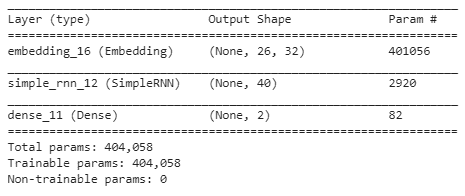

# 第十一章：构建循环神经网络

在上一章中，我们介绍了多种将文本表示为向量的方式，并在这些表示之上执行情感分类。

这种方法的一个缺点是我们没有考虑到单词的顺序——例如，句子 *A is faster than B* 和 *B is faster than A* 将有相同的表示，因为这两个句子中的单词完全相同，而单词的顺序不同。

**循环神经网络**（**RNNs**）在需要保留单词顺序的场景中非常有用。在本章中，您将学习以下主题：

+   从零开始在 Python 中构建 RNN 和 LSTM

+   实现 RNN 进行情感分类

+   实现 LSTM 进行情感分类

+   实现堆叠 LSTM 进行情感分类

# 介绍

RNN 可以通过多种方式架构。以下是一些可能的方式：


底部的框是输入，接着是隐藏层（中间的框），顶部是输出层。此一对一架构是典型的神经网络，输入层和输出层之间有一个隐藏层。不同架构的示例如下：

| **架构** | **示例** |
| --- | --- |
| 一对多 | 输入是图像，输出是图像的描述 |
| 多对一 | 输入是电影的评论（输入中包含多个单词），输出是与评论相关的情感 |
| 多对多 | 将一种语言的句子翻译成另一种语言的句子 |

# RNN 架构的直觉

当我们希望在给定一系列事件时预测下一个事件时，RNN 非常有用。

其中一个例子是预测 *This is an _____* 后面跟的单词。

假设在现实中，句子是 *This is an example*。

传统的文本挖掘技术通常通过以下方式解决问题：

1.  对每个单词进行编码，同时为潜在的新单词设置额外的索引：

```py
This: {1,0,0,0}
is: {0,1,0,0}
an: {0,0,1,0}
```

1.  编码短语 `This is an`：

```py
This is an: {1,1,1,0}
```

1.  创建训练数据集：

```py
Input --> {1,1,1,0}
Output --> {0,0,0,1}
```

1.  构建一个包含输入和输出的模型

该模型的一个主要缺点是输入表示在输入句子中没有变化；它可以是 `this is an`、`an is this` 或 `this an is`。

然而，直观上，我们知道前面每个句子的结构是不同的，不能用相同的数学结构表示。这就需要采用不同的架构，结构如下：


在前面的架构中，句子中的每个单词都会进入输入框中的独立框中。然而，句子的结构将得到保留。例如，`this` 进入第一个框，`is` 进入第二个框，`an` 进入第三个框。

顶部的输出框将是 `example` 的输出。

# 解释 RNN

你可以将 RNN 看作一种存储记忆的机制——其中记忆被保存在隐藏层内。它可以被如下方式可视化：


右侧的网络是左侧网络的展开版本。右侧的网络在每个时间步输入一个数据，并在每个时间步提取输出。然而，如果我们关注第四个时间步的输出，我们需要提供前三个时间步的输入，而第三个时间步的输出则是第四个时间步的预测值。

请注意，在预测第三个时间步的输出时，我们通过隐藏层引入了前两个时间步的值，隐藏层将跨时间步连接这些值。

让我们探索前面的图示：

+   `U` 权重表示连接输入层与隐藏层的权重

+   `W` 权重表示隐藏层之间的连接

+   `V` 权重表示隐藏层与输出层之间的连接

# 为什么要存储记忆？

需要存储记忆，就像前面的示例中，甚至在文本生成中，下一词不一定仅依赖于前一个词，而是依赖于前面词语的上下文。

由于我们关注前面的词语，应该有一种方式来将它们保存在记忆中，以便我们能够更准确地预测下一个词。

此外，我们还需要按顺序存储记忆；也就是说，通常情况下，最近的词语比距离要预测的词更远的词语更有助于预测下一个词。

# 从头开始在 Python 中构建 RNN

在这个教程中，我们将从头开始构建一个 RNN，使用一个简单的示例，以帮助你更好地理解 RNN 如何帮助解决考虑事件（单词）顺序的问题。

# 准备开始

请注意，典型的神经网络包含一个输入层，之后是隐藏层的激活，最后是输出层的 softmax 激活。

RNN 采用类似的结构，并在这种结构上进行修改，使得前一个时间步的隐藏层被考虑在当前时间步中。

在将 RNN 应用于更实际的用例之前，我们会先通过一个简单的示例构建 RNN 的工作细节。

让我们考虑一个如下的示例文本：`This is an example`。

当前任务是给定一对单词序列，预测第三个词。

因此，数据集的转换如下：

| **Input** | **Output** |
| --- | --- |
| `this, is` | `an` |
| `is, an` | `example` |

给定输入 `this is`，我们期望预测 `example` 作为输出。

我们将采用以下策略来构建一个 RNN：

1.  对单词进行独热编码

1.  确定输入的最大长度：

    +   将其余输入填充至最大长度，使得所有输入的长度相同

1.  将输入中的单词转换为一个独热编码版本

1.  将输出中的单词转换为一个独热编码版本

1.  处理输入和输出数据，然后拟合 RNN 模型

# 如何做...

上述策略的代码如下（代码文件可在 GitHub 的`Building_a_Recurrent_Neural_Network_from_scratch-in_Python.ipynb`中找到）：

1.  让我们在代码中定义输入和输出，如下所示：

```py
#define documents
docs = ['this, is','is an']
# define class labels
labels = ['an','example']
```

1.  让我们对数据集进行预处理，以便将其传递给 RNN：

```py
from collections import Counter
counts = Counter()
for i,review in enumerate(docs+labels):
      counts.update(review.split())
words = sorted(counts, key=counts.get, reverse=True)
vocab_size=len(words)
word_to_int = {word: i for i, word in enumerate(words, 1)}
```

在前面的步骤中，我们识别了数据集中所有唯一的单词及其对应的频率（计数），并为每个单词分配了一个 ID 号。在前面的代码中，`word_to_int`的输出如下所示：

```py
print(word_to_int)
# {'an': 2, 'example': 4, 'is': 1, 'this': 3}
```

1.  按照如下方式修改输入和输出单词及其对应的 ID：

```py
encoded_docs = []
for doc in docs:
      encoded_docs.append([word_to_int[word] for word in doc.split()])
encoded_labels = []
for label in labels:
      encoded_labels.append([word_to_int[word] for word in label.split()])
print('encoded_docs: ',encoded_docs)
print('encoded_labels: ',encoded_labels)
# encoded_docs: [[3, 1], [1, 2]]
# encoded_labels: [[2], [4]]
```

在前面的代码中，我们将输入句子中每个单词的 ID 附加到一个列表中，从而使输入（`encoded_docs`）成为一个包含列表的列表。

同样，我们将输出中每个单词的 ID 附加到一个列表中。

1.  在编码输入时需要考虑的另一个因素是输入的长度。在情感分析的情况下，输入文本的长度可能因评论而异。然而，神经网络要求输入的大小是固定的。为了解决这个问题，我们在输入上进行填充。填充确保所有输入被编码为相似的长度。虽然在我们的示例中两个输入的长度都是 2，但实际上我们很可能会遇到输入长度不同的情况。在代码中，我们按如下方式进行填充：

```py
# pad documents to a max length of 2 words
max_length = 2
padded_docs = pad_sequences(encoded_docs, maxlen=max_length, padding='pre')
```

在前面的代码中，我们将`encoded_docs`传递给`pad_sequences`函数，确保所有输入数据点的长度相同——即等于`maxlen`参数。此外，对于那些长度小于`maxlen`的参数，它会用 0 填充这些数据点，直到达到`maxlen`的总长度，并且零填充会在`pre`位置完成——也就是在原始编码句子的左侧。

现在输入数据集已经创建完毕，接下来让我们对输出数据集进行预处理，以便将其传递给模型训练步骤。

1.  对输出的典型处理是将其转换为虚拟值，即制作输出标签的独热编码版本，方法如下：

```py
one_hot_encoded_labels = to_categorical(encoded_labels, num_classes=5)
print(one_hot_encoded_labels)
# [[0\. 0\. 1\. 0\. 0.] [0\. 0\. 0\. 0\. 1.]]
```

请注意，给定输出值（`encoded_labels`）为`{2, 4}`，输出向量在第二和第四位置分别为 1。

1.  让我们构建模型：

    1.  RNN 期望输入的形状为（`batch_size`、`time_steps`和`features_per_timestep`）。因此，我们首先将`padded_docs`输入重塑为以下格式：

```py
padded_docs = padded_docs.reshape(2,2,1)
```

请注意，理想情况下我们会为每个单词（在这个特定情况下是 ID）创建一个词嵌入。然而，鉴于本教程的目的是了解 RNN 的工作细节，我们将不涉及 ID 的嵌入，并假设每个输入不是 ID 而是一个值。话虽如此，我们将在下一个教程中学习如何执行 ID 嵌入。

1.  1.  定义模型——在这里我们指定将使用`SimpleRNN`方法初始化 RNN：

```py
# define the model
embed_length=1
max_length=2
model = Sequential()
model.add(SimpleRNN(1,activation='tanh', return_sequences=False,recurrent_initializer='Zeros',input_shape=(max_length,embed_length),unroll=True))
```

在前一步中，我们明确指定了`recurrent_initializer`为零，这样可以更容易理解 RNN 的工作细节。实际上，我们不会将循环初始化器设置为 0。

`return_sequences`参数指定是否希望在每个时间步获得隐藏层值。若`return_sequences`为 false，表示我们只希望在最后一个时间步获得隐藏层输出。

通常，在多对一任务中，当输入很多（每个时间步一个输入）并且有输出时，`return_sequences`会设置为 false，这样输出仅会在最后一个时间步获得。例如，给定过去五天的股票价格序列，预测第二天的股票价格就是一个典型的例子。

然而，在尝试在每个时间步获取隐藏层值的情况下，`return_sequences`将被设置为`True`。例如，机器翻译就是一个例子，其中有多个输入和多个输出。

1.  1.  将 RNN 输出连接到输出层的五个节点：

```py
model.add(Dense(5, activation='softmax'))
```

我们已经执行了一个`Dense(5)`，因为有五个可能的输出类别（每个样本的输出有 5 个值，每个值对应它属于`word ID 0`到`word ID 4`的概率）。

1.  1.  编译并总结模型：

```py
# compile the model
model.compile(optimizer='adam', loss='categorical_crossentropy', metrics=['acc'])
# summarize the model
print(model.summary())
```

模型总结如下：


现在我们已经定义了模型，在拟合输入和输出之前，让我们了解每一层中参数数量的原因。

模型的简单 RNN 部分的输出形状为`(None, 1)`。输出形状中的`None`表示`batch_size`。None 是指定`batch_size`可以是任意数值的方式。由于我们指定了从简单 RNN 中输出一个单位的隐藏层，列数为 1。

现在我们理解了`simpleRNN`的输出形状，让我们理解为什么在`simpleRNN`层中参数数量是 3。注意，隐藏层值只在最后一个时间步输出。鉴于每个时间步的输入值为 1（每个时间步一个特征），而输出也为一个值，输入实际上是与一个单一的权重相乘。如果输出（隐藏层值）有 40 个隐藏层单元，输入就应该与 40 个单位相乘来获得输出（更多内容请参见*实现 RNN 进行情感分类*）。

除了连接输入和隐藏层值的一个权重外，还有一个与权重一起的偏置项。另一个参数来自于前一个时间步的隐藏层值与当前时间步隐藏层的连接，最终得到三个参数。

从隐藏层到最终输出有 10 个参数，因为有五个可能的类别，结果是五个权重和五个偏置连接到隐藏层的值（该值是一个单位）——总共 10 个参数。

1.  1.  训练模型以预测从输入到输出的结果：

```py
model.fit(padded_docs,np.array(one_hot_encoded_labels),epochs=500)
```

1.  提取第一个输入数据点的预测值：

```py
model.predict(padded_docs[0].reshape(1,2,1))
```

提取的输出如下：

```py
array([[0.3684635, 0.33566403, 0.61344165, 0.378485, 0.4069949 ]],      dtype=float32)
```

# 验证输出结果

现在模型已经训练完成，让我们通过从后向前分析来理解 RNN 的工作原理——也就是说，提取模型的权重，通过权重前馈输入以匹配预测值，使用 NumPy（代码文件可以在 GitHub 上找到，名为`Building_a_Recurrent_Neural_Network_from_scratch_in_Python.ipynb`）。

1.  检查权重：

```py
model.weights
[<tf.Variable 'simple_rnn_2/kernel:0' shape=(1, 1) dtype=float32_ref>,
 <tf.Variable 'simple_rnn_2/recurrent_kernel:0' shape=(1, 1) dtype=float32_ref>,
 <tf.Variable 'simple_rnn_2/bias:0' shape=(1,) dtype=float32_ref>,
 <tf.Variable 'dense_2/kernel:0' shape=(1, 5) dtype=float32_ref>,
 <tf.Variable 'dense_2/bias:0' shape=(5,) dtype=float32_ref>]
```

上述内容为我们提供了权重在输出中呈现的顺序的直觉。

在前面的例子中，`kernel`表示权重，`recurrent`表示隐藏层从一个时刻到另一个时刻的连接。

请注意，`simpleRNN`有连接输入层到隐藏层的权重，也有连接前一时刻隐藏层到当前时刻隐藏层的权重。

`dense_2`层中的核和偏置表示连接隐藏层值到最终输出的层：

1.  1.  提取权重：

```py
model.get_weights()
```

前面的代码行给出了每个权重的计算值。

1.  将输入通过第一时刻传递——输入值如下：

```py
padded_docs[0]
#array([3, 1], dtype=int32)
```

在前面的代码中，第一时刻的值为`3`，第二时刻的值为`1`。我们将按如下方式初始化第一时刻的值：

```py
input_t0 = 3
```

1.  1.  第一时刻的值与连接输入到隐藏层的权重相乘，然后加上偏置值：

```py
input_t0_kernel_bias = input_t0*model.get_weights()[0] + model.get_weights()[2]
```

1.  1.  此时刻的隐藏层值通过`tanh`激活函数计算得出（因为这是我们在定义模型时指定的激活函数）：

```py
hidden_layer0_value = np.tanh(input_t0_kernel_bias)
```

1.  计算时间步 2 时的隐藏层值；此时输入的值为`1`（注意`padded_docs[0]`的值为`[3, 1]`）：

```py
input_t1 = 1
```

1.  1.  当第二个时间步的输入通过权重和偏置时，输出值如下：

```py
input_t1_kernel_bias = input_t1*model.get_weights()[0] + model.get_weights()[2]
```

请注意，乘以输入的权重在任何时间步中都是相同的。

1.  1.  在不同时间步计算隐藏层的过程如下：


其中*Φ*是执行的激活（通常使用`tanh`激活）。

从输入层到隐藏层的计算包含两个部分：

+   +   输入层值与核权重的矩阵乘法

    +   前一时刻隐藏层和循环权重的矩阵乘法

给定时间步的最终隐藏层值的计算将是前两次矩阵乘法的总和。将结果通过`tanh`激活函数处理：

```py
input_t1_recurrent = hidden_layer0_value*model.get_weights()[1]
```

在经过`tan`激活之前的总值如下：

```py
total_input_t1 = input_t1_kernel_bias + input_t1_recurrent
```

隐藏层的输出值通过`tan`激活函数计算，具体如下：

```py
output_t1 = np.tanh(total_input_t1)
```

1.  将最后一个时间步的隐藏层输出通过全连接层传递，该层将隐藏层与输出层连接：

```py
final_output = output_t1*model.get_weights()[3] + model.get_weights()[4]
```

请注意，`model.get_weights()`方法的第四和第五个输出对应的是从隐藏层到输出层的连接。

1.  将前面的输出通过 softmax 激活函数（如模型中定义）传递，以获得最终输出：

```py
np.exp(final_output)/np.sum(np.exp(final_output))
# array([[0.3684635, 0.33566403, 0.61344165, 0.378485, 0.40699497]], dtype=float32)
```

你应该注意到，通过网络的前向传播得到的输出与`model.predict`函数输出的结果是相同的。

# 实现 RNN 进行情感分类

为了理解如何在 Keras 中实现 RNN，让我们实现我们在第十章，“*使用词向量进行文本分析*”章节中进行的航空公司推文情感分类练习。

# 如何做到这一点...

任务将按以下方式执行（代码文件在 GitHub 上可用，名为`RNN_and_LSTM_sentiment_classification.ipynb`）：

1.  导入相关包和数据集：

```py
from keras.layers import Dense, Activation
from keras.layers.recurrent import SimpleRNN
from keras.models import Sequential
from keras.utils import to_categorical
from keras.layers.embeddings import Embedding
from sklearn.cross_validation import train_test_split
import numpy as np
import nltk
from nltk.corpus import stopwords
import re
import pandas as pd
data=pd.read_csv('https://www.dropbox.com/s/8yq0edd4q908xqw/airline_sentiment.csv')
data.head()
```

1.  对文本进行预处理，移除标点符号，将所有单词标准化为小写，并移除停用词，如下所示：

```py
import nltk
nltk.download('stopwords')
stop = nltk.corpus.stopwords.words('english')
def preprocess(text):
    text=text.lower()
    text=re.sub('[⁰-9a-zA-Z]+',' ',text)
    words = text.split()
    words2=[w for w in words if (w not in stop)]
    #words3=[ps.stem(w) for w in words]
    words4=' '.join(words2)
    return(words4)
data['text'] = data['text'].apply(preprocess)
```

1.  提取构成数据集的所有单词到整数的映射：

```py
from collections import Counter
counts = Counter()
for i,review in enumerate(t['text']):
    counts.update(review.split())
words = sorted(counts, key=counts.get, reverse=True
```

在前一步骤中，我们提取了数据集中所有单词的频率。提取的部分单词示例如下：


```py
nb_chars = len(words)
word_to_int = {word: i for i, word in enumerate(words, 1)}
int_to_word = {i: word for i, word in enumerate(words, 1)}
```

在前面的代码中，我们遍历所有单词，并为每个单词分配一个索引。整数到单词字典的示例部分如下：


1.  将给定句子中的每个单词映射到与其相关联的单词：

```py
mapped_reviews = []
for review in data['text']:
    mapped_reviews.append([word_to_int[word] for word in review.split()])
```

在前一步骤中，我们将文本评论转换为一个包含多个列表的列表，每个列表包含一个句子中单词的 ID。原始评论和映射评论的示例如下：


1.  提取句子的最大长度，并通过填充将所有句子标准化为相同的长度。在以下代码中，我们循环遍历所有评论并存储每个评论对应的长度。此外，我们还在计算评论（推文文本）的最大长度：

```py
length_sent = []
for i in range(len(mapped_reviews)):
      length_sent.append(len(mapped_reviews[i]))
sequence_length = max(length_sent)
```

我们应该注意到，不同的推文长度不同。然而，RNN 期望每个输入的时间步数相同。在下面的代码中，如果评论的长度小于数据集中所有评论的最大长度，我们会通过值为 0 的填充对评论进行映射。这样，所有输入都会有相同的长度。

```py
from keras.preprocessing.sequence import pad_sequences
X = pad_sequences(maxlen=sequence_length, sequences=mapped_reviews, padding="post", value=0)
```

1.  准备训练集和测试集：

```py
y=data['airline_sentiment'].values
X_train, X_test, y_train, y_test = train_test_split(X, y, test_size=0.30,random_state=42)
y_train2 = to_categorical(y_train)
y_test2 = to_categorical(y_test)
```

在前一步骤中，我们将原始数据拆分为训练集和测试集，并将因变量转换为独热编码变量。

1.  构建 RNN 架构并编译模型：

```py
embedding_vecor_length=32
max_review_length=26
model = Sequential()
model.add(Embedding(input_dim=12533, output_dim=32, input_length = 26))
```

请注意，嵌入层以所有独特词汇的总数作为输入，并为每个词汇创建一个向量，其中`output_dim`表示词汇表示的维度数，`input_length`表示每个句子的词汇数：

```py
model.add(SimpleRNN(40, return_sequences=False))
```

请注意，在 RNN 层中，如果我们希望提取每个时间步的输出，我们会将`return_sequences`参数设置为`True`。然而，在我们当前要解决的用例中，我们只在读取完所有输入词汇后才提取输出，因此`return_sequences = False`：

```py
model.add(Dense(2, activation='softmax'))
model.compile(loss='categorical_crossentropy', optimizer='adam', metrics=['accuracy'])
print(model.summary())
```

模型的总结如下：



让我们理解为什么在嵌入层中有`401056`个参数需要估计。总共有 12,532 个独特的词汇，如果我们考虑到没有索引为 0 的词汇，总共有 12,533 个可能的词汇，每个词汇在 32 维度中表示，因此需要估计（12,533 x 32 = 401,056）个参数。

现在，让我们试着理解为什么在`simpleRNN`层中有 2,920 个参数。

有一组权重将输入连接到 RNN 的 40 个单元。鉴于每个时间步有 32 个输入（同一组权重在每个时间步重复），因此总共有 32 x 40 个权重用于将输入连接到隐藏层。这为每个输入提供了 1 x 40 的输出。

此外，为了使 *X * W[xh]* 和 *h[(t-1) *] W[hh]* 之间的求和发生（其中 `X` 是输入值，`W`[*xh*] 是连接输入层和隐藏层的权重，*W[hh]* 是连接前一个时间步的隐藏层与当前时间步隐藏层的权重，而 *h[(t-1)]* 是前一个时间步的隐藏层）——鉴于 *X W[xh]* 输入的输出是 1 x 40——*h[(t-1)] X W[hh]* 的输出也应该是 1 x 40。因此，*W[hh]* 矩阵的维度将是 40 x 40，因为 *h[(t-1)]* 的维度是 1 x 40。

除了权重外，我们还将为每个 40 个输出单元设置 40 个偏置项，因此总共有（32 x 40 + 40 x 40 + 40 = 2,920）个权重。

最后一层总共有 82 个权重，因为最后一个时间步的 40 个单元与两个可能的输出相连接，结果是 40 x 2 个权重和 2 个偏置项，因此总共有 82 个单元。

1.  适配模型：

```py
model.fit(X_train, y_train2, validation_data=(X_test, y_test2), epochs=10, batch_size=32)
```

训练和测试数据集中的准确率和损失值的图示如下：


上述模型的输出大约为 89%，并未比我们在*使用词向量进行文本分析*章节中构建的基于词向量的网络提供显著改进。

然而，随着数据点数量的增加，预计会有更好的准确性。

# 还有更多内容...

一个考虑多个时间步给出预测的传统 RNN 可以如下可视化：


请注意，随着时间步的增加，早期层次的输入影响会变得较小。可以在这里看到这种直觉（暂时忽略偏置项）：

*h[5] = WX[5] + Uh[4] = WX5 + UWX[4] + U²WX[3] + U³WX[2] + U⁴WX[1]*

你可以看到，随着时间步的增加，当*U>1*时，隐藏层的值高度依赖于*X[1]*；当*U<1*时，依赖性则会大大降低。

对 U 矩阵的依赖也可能导致梯度消失问题，当`U`的值非常小的时候；当`U`的值非常大时，也可能导致梯度爆炸问题。

上述现象导致在预测下一个词时，若存在长期依赖性，会出现问题。为了解决这个问题，我们将在下一个教程中使用**长短期记忆**（**LSTM**）架构。

# 从零开始在 Python 中构建 LSTM 网络

在上一节关于传统 RNN 问题的部分，我们了解到当存在长期依赖性时，RNN 并不能有效工作。例如，假设输入句子如下：

*I live in India. I speak ____.*

在前述语句中，空白处可以通过查看关键词*India*来填充，而*India*距我们要预测的词有三个时间步的距离。

以类似的方式，如果关键词离要预测的词很远，梯度消失/爆炸问题需要被解决。

# 准备工作

在本教程中，我们将学习 LSTM 如何帮助克服 RNN 架构的长期依赖性问题，并构建一个简单的示例，以便我们理解 LSTM 的各个组件。

LSTM 结构如下：


你可以看到，虽然输入`X`和隐藏层输出（`h`）保持不变，但隐藏层内会发生不同的激活（某些情况下是 sigmoid 激活，其他情况下是 tanh 激活）。

让我们仔细检查一个时间步内发生的各种激活：


在前面的图示中，`X`和`h`分别代表输入层和隐藏层。

长期记忆存储在单元状态`C`中。

需要遗忘的内容是通过遗忘门获得的：

*f[t]=σ(W[xf]x^((t))+W[hf]h^((t-1))+b[f])*

Sigmoid 激活使网络能够选择性地识别需要遗忘的内容。

在我们确定需要遗忘的内容后，更新的单元状态如下：

*c[t]=(c[t-1]  f)*

请注意，表示逐元素相乘。

例如，如果句子的输入序列是*I live in India. I speak ___*，则空白处可以根据输入词*India*来填充。在填充空白后，我们不一定需要该国家名称的具体信息。

我们根据当前时间步需要遗忘的内容来更新单元状态。

在下一步中，我们将根据当前时间步提供的输入向单元状态添加额外的信息。此外，更新的幅度（正向或负向）通过 tanh 激活函数获得。

输入可以按如下方式指定：

*i[t]=σ(W[xi]x^((t))+W[hi]h^((t-1))+bi)*

调制（输入更新的幅度）可以按如下方式指定：

*g[t]=tanh(W[xg]x^((t))+W[hg]h^((t-1))+bg)*

单元状态——在一个时间步中，我们忘记某些信息并在同一时间步中添加额外的信息——按如下方式更新：


在最后一个门中，我们需要指定输入的组合（当前时间步输入与前一时间步的隐藏层值的组合）和单元状态中需要输出到下一个隐藏层的部分：


最终的隐藏层表示如下：


通过这种方式，我们能够利用 LSTM 中的各种门来选择性地识别需要存储在记忆中的信息，从而克服 RNN 的局限性。

# 如何做...

为了获得该理论如何工作的实际直觉，让我们看看我们在理解 RNN 时做过的相同示例，但这次使用 LSTM。

请注意，数据预处理步骤在两个示例中是相同的。因此，我们将重用预处理部分（在*从零开始构建 RNN 的 Python 教程*中的*步骤 1*到*步骤 4*），并直接进入模型构建部分（代码文件在 GitHub 中的`LSTM_working_details.ipynb`可用）：

1.  定义模型：

```py
embed_length=1
max_length=2
model = Sequential()
model.add(LSTM(1,activation='tanh',return_sequences=False,
recurrent_initializer='Zeros',recurrent_activation='sigmoid',
input_shape=(max_length,embed_length),unroll=True))
```

请注意，在前面的代码中，我们将递归初始化器和递归激活函数初始化为某些值，仅为了简化此示例；其目的是帮助您理解后端发生了什么。

```py
model.add(Dense(5, activation='softmax'))
```

```py
# compile the model
model.compile(optimizer='adam', loss='binary_crossentropy', metrics=['acc'])
# summarize the model
print(model.summary())
```

模型的总结如下：


在 LSTM 层中，参数的数量是`12`，因为有四个门（遗忘门、输入门、细胞门和输出门），这导致有四个权重和四个偏置将输入与隐藏层连接。此外，递归层包含对应四个门的权重值，因此我们总共有`12`个参数。

Dense 层总共有 10 个参数，因为输出有五个可能的类别，因此有五个权重和五个偏置，分别对应从隐藏层到输出层的每个连接。

1.  让我们拟合模型：

```py
model.fit(padded_docs.reshape(2,2,1),np.array(one_hot_encoded_labels),epochs=500)
```

1.  该模型的权重顺序如下：

```py
model.weights[<tf.Variable 'lstm_19/kernel:0' shape=(1, 4) dtype=float32_ref>,
 <tf.Variable 'lstm_19/recurrent_kernel:0' shape=(1, 4) dtype=float32_ref>,
 <tf.Variable 'lstm_19/bias:0' shape=(4,) dtype=float32_ref>,
 <tf.Variable 'dense_18/kernel:0' shape=(1, 5) dtype=float32_ref>,
 <tf.Variable 'dense_18/bias:0' shape=(5,) dtype=float32_ref>]
```

可以按如下方式获取权重：

```py
model.get_weights()
```

从前面的代码（`model.weights`）中，我们可以看到 LSTM 层中权重的顺序如下：

+   +   输入的权重（核）

    +   对应于隐藏层的权重（`recurrent_kernel`）

    +   LSTM 层中的偏置

类似地，在密集层（连接隐藏层与输出的层）中，权重的顺序如下：

+   +   与隐藏层相乘的权重

    +   偏置

以下是 LSTM 层中权重和偏置的顺序（在前面的输出中没有提供，但可以在 Keras 的 GitHub 仓库中找到）：

+   +   输入门

    +   遗忘门

    +   调制门（单元门）

    +   输出门

1.  计算输入的预测。

我们使用的是未经编码的原始输入值（1、2、3），而没有将其转换为嵌入值——仅仅是为了看看计算是如何工作的。实际操作中，我们会将输入转换为嵌入值。

1.  为预测方法重塑输入，以使其符合 LSTM 所期望的数据格式（批量大小、时间步数、每个时间步的特征）：

```py
model.predict(padded_docs[0].reshape(1,2,1))
# array([[0.05610514, 0.11013522, 0.38451442, 0.0529648, 0.39628044]], dtype=float32)

```

上面代码中的注释行提供了预测方法的输出。

# 验证输出

现在我们已经从模型中获得了预测概率，让我们使用 NumPy 通过权重的前向传递来运行输入，以获得与刚才相同的输出。

这样做是为了验证我们对 LSTM 内部工作原理的理解。我们验证所构建模型输出的步骤如下：

1.  更新时间步 1 中的遗忘门。此步骤查看输入，并提供对到目前为止已知的单元状态（记忆）需要遗忘多少的估计（请注意在这方面使用了 sigmoid 函数）：

```py
input_t0 = 3
cell_state0 = 0
forget0 = input_t0*model.get_weights()[0][0][1] + model.get_weights()[2][1]
forget1 = 1/(1+np.exp(-(forget0)))
```

1.  基于更新的遗忘门更新单元状态。前一步的输出将在此处用于指导从单元状态（记忆）中忘记多少值：

```py
cell_state1 = forget1 * cell_state0
```

1.  更新时间步 1 中的输入门值。此步骤给出了根据当前输入将有多少新信息注入到单元状态中的估计：

```py
input_t0_1 = input_t0*model.get_weights()[0][0][0] + model.get_weights()[2][0]
input_t0_2 = 1/(1+np.exp(-(input_t0_1)))
```

1.  基于更新的输入值更新单元状态。这是一个步骤，其中前一步的输出被用来指示应对单元状态（记忆）进行多少信息更新：

```py
input_t0_cell1 = input_t0*model.get_weights()[0][0][2] +model.get_weights()[2][2]
input_t0_cell2 = np.tanh(input_t0_cell1)
```

之前的`tanh`激活有助于确定输入的更新是否会对单元状态（记忆）进行加法或减法操作。这提供了一个额外的杠杆，因为如果某些信息已经在当前时间步传递，并且在未来的时间步不再有用，那么我们最好将其从单元状态中删除，这样这些额外的信息（在下一步可能没有帮助）就能从记忆中擦除：

```py
input_t0_cell3 = input_t0_cell2*input_t0_2
input_t0_cell4 = input_t0_cell3 + cell_state1
```

1.  更新输出门。此步骤提供对当前时间步将传递多少信息的估计（请注意在这方面使用了 sigmoid 函数）：

```py
output_t0_1 = input_t0*model.get_weights()[0][0][3] + model.get_weights()[2][3]
output_t0_2 = 1/(1+np.exp(-output_t0_1))
```

1.  计算时间步 1 的隐藏层值。请注意，某一时间步的最终隐藏层值是当前时间步的记忆和输出用于传递单一时间步的结合：

```py
hidden_layer_1 = np.tanh(input_t0_cell4)*output_t0_2
```

我们已经完成了从第一时间步得到的隐藏层输出值的计算。在接下来的步骤中，我们将把时间步长 1 更新后的单元状态值和时间步长 1 的隐藏层输出作为输入传递给时间步长 2。

1.  传递时间步长为 2 的输入值和进入时间步长 2 的单元状态值：

```py
input_t1 = 1
cell_state1 = input_t0_cell4
```

1.  更新忘记门的值：

```py
forget21 = hidden_layer_1*model.get_weights()[1][0][1] + model.get_weights()[2][1] + input_t1*model.get_weights()[0][0][1]
forget_22 = 1/(1+np.exp(-(forget21)))
```

1.  更新时间步长 2 中的单元状态值：

```py
cell_state2 = cell_state1 * forget_22
input_t1_1 = input_t1*model.get_weights()[0][0][0] + model.get_weights()[2][0] + hidden_layer_1*model.get_weights()[1][0][0]
input_t1_2 = 1/(1+np.exp(-(input_t1_1)))
input_t1_cell1 = input_t1*model.get_weights()[0][0][2] + model.get_weights()[2][2]+ hidden_layer_1*model.get_weights()[1][0][2]
input_t1_cell2 = np.tanh(input_t1_cell1)
input_t1_cell3 = input_t1_cell2*input_t1_2
input_t1_cell4 = input_t1_cell3 + cell_state2
```

1.  根据更新后的单元状态与需要输出的量的结合更新隐藏层输出值：

```py
output_t1_1 = input_t1*model.get_weights()[0][0][3] + model.get_weights()[2][3]+ hidden_layer_1*model.get_weights()[1][0][3]
output_t1_2 = 1/(1+np.exp(-output_t1_1))
hidden_layer_2 = np.tanh(input_t1_cell4)*output_t1_2
```

1.  将隐藏层输出通过全连接层传递：

```py
final_output = hidden_layer_2 * model.get_weights()[3][0] +model.get_weights()[4]
```

1.  在我们刚刚得到的输出上运行 softmax：

```py
np.exp(final_output)/np.sum(np.exp(final_output))
```

```py
# array([0.05610514, 0.11013523, 0.3845144, 0.05296481, 0.39628044],dtype=float32)
```

你应该注意到，这里得到的输出与我们从 `model.predict` 方法中获得的输出完全相同。

通过这个练习，我们更有能力理解 LSTM 的工作细节。

# 实现 LSTM 用于情感分类

在 *实现 RNN 用于情感分类* 配方中，我们使用 RNN 实现了情感分类。在本配方中，我们将探讨如何使用 LSTM 实现它。

# 如何做...

我们将采用的步骤如下（代码文件在 GitHub 上作为 `RNN_and_LSTM_sentiment_classification.ipynb` 提供）：

1.  定义模型。与我们在 *实现 RNN 用于情感分类* 配方中看到的代码的唯一变化是将模型架构部分的 `simpleRNN` 改为 LSTM（我们将重用 *实现 RNN 用于情感分类* 配方中的 *第 1 步* 到 *第 6 步* 的代码）：

```py
embedding_vecor_length=32
max_review_length=26
model = Sequential()
model.add(Embedding(input_dim=12533, output_dim=32, input_length = 26))
```

嵌入层的输入是数据集中出现的唯一 ID 的总数，以及每个词需要转换的期望维度（`output_dim`）。

此外，我们还将指定输入的最大长度，以便下一个步骤中的 LSTM 层能获得所需的信息——批量大小、时间步长数（`input_length`）和每个时间步的特征数（`step(output_dim)`）：

```py
model.add(LSTM(40, return_sequences=False))
model.add(Dense(2, activation='softmax'))
model.compile(loss='categorical_crossentropy', optimizer='adam', metrics=['accuracy'])
print(model.summary())
```

模型的总结如下：


尽管第一层和最后一层的参数与我们在 *实现 RNN 用于情感分类* 配方中看到的一样，LSTM 层的参数数量不同。

让我们理解 LSTM 层中如何获得 11,680 个参数：

```py
W = model.layers[1].get_weights()[0]
U = model.layers[1].get_weights()[1]
b = model.layers[1].get_weights()[2]
print(W.shape,U.shape,b.shape)
```

输出将如下所示：

```py
((32, 160), (40, 160), (160,))
```

注意，前述权重的总和是 *(32*160) + (40*160) + 160 = 11,680* 个参数。

`W` 表示将输入连接到四个单元（`i`、`f`、`c`、`o`）的权重，`U` 表示隐藏层到隐藏层的连接，`b` 表示每个门中的偏置。

输入门、忘记门、单元状态门和输出门的各个权重可以按如下方式获得：

```py
units = 40
W_i = W[:, :units]
W_f = W[:, units: units * 2]
W_c = W[:, units * 2: units * 3]
W_o = W[:, units * 3:]
```

```py
U_i = U[:, :units]
U_f = U[:, units: units * 2]
U_c = U[:, units * 2: units * 3]
U_o = U[:, units * 3:]
```

```py
b_i = b[:units]
b_f = b[units: units * 2]
b_c = b[units * 2: units * 3]
b_o = b[units * 3:]
```

1.  按如下方式拟合模型：

```py
model.fit(X_train, y_train2, validation_data=(X_test, y_test2), epochs=50, batch_size=32)
```

训练和测试数据集上随着训练轮数增加，损失和准确率的变化如下：


使用 LSTM 层时，预测准确率为 91%，略优于使用 simpleRNN 层时的预测准确率。通过微调 LSTM 单元的数量，我们可能能够进一步改善结果。

# 实现堆叠 LSTM 进行情感分类

在前一个食谱中，我们使用 Keras 实现了基于 LSTM 的情感分类。在本食谱中，我们将探讨如何实现相同的功能，但堆叠多个 LSTM。堆叠多个 LSTM 可能会捕捉到更多数据的变化，因此有可能得到更好的准确率。

# 如何实现...

堆叠 LSTM 的实现方式如下（代码文件可在 GitHub 的`RNN_and_LSTM_sentiment_classification.ipynb`中找到）：

1.  我们之前看到的代码唯一的变化是将`return_sequences`参数设置为 true。这确保了第一个 LSTM 返回一个输出序列（与 LSTM 单元的数量相同），然后可以将该输出作为输入传递给模型架构部分中的另一个 LSTM（有关`return_sequences`参数的更多详细信息，请参见*Sequence to Sequence 学习*章节）：

```py
embedding_vecor_length=32
max_review_length=26
model = Sequential()
model.add(Embedding(input_dim=12533, output_dim=32, input_length = 26))
model.add(LSTM(40, return_sequences=True))
model.add(LSTM(40, return_sequences=False))
model.add(Dense(2, activation='softmax'))
model.compile(loss='categorical_crossentropy', optimizer='adam', metrics=['accuracy'])
print(model.summary())
```

模型架构的总结如下：


请注意，在前面的架构中，有一个额外的 LSTM 堆叠在另一个 LSTM 之上。第一个 LSTM 在每个时间步的输出为`40`个值，因此输出形状为（`None`，`26`，`40`），其中`None`代表`batch_size`，`26`代表时间步数，`40`代表考虑的 LSTM 单元数。

现在有`40`个输入值，第二个 LSTM 中的参数数量与之前的做法相同，如下所示：

```py
W = model.layers[2].get_weights()[0]
U = model.layers[2].get_weights()[1]
b = model.layers[2].get_weights()[2]
print(W.shape,U.shape,b.shape)
```

执行前述代码后，我们得到以下值：

```py
((40, 160), (40, 160), (160,))
```

这导致总共有 12,960 个参数，如输出所示。

W 的形状为 40 x 160，因为它有 40 个输入映射到 40 个输出，并且有 4 个不同的门需要控制，因此总共有 40 x 40 x 4 个权重。

1.  按如下方式实现模型：

```py
model.fit(X_train, y_train2, validation_data=(X_test, y_test2), epochs=50, batch_size=32)
```

在训练集和测试集上，随着 epoch 数的增加，损失和准确率的变化如下所示：


这导致了 91%的准确率，就像我们在使用单个 LSTM 层时看到的那样；然而，随着数据量的增加，堆叠的 LSTM 可能比普通的 LSTM 捕捉到更多数据的变化。

# 还有更多...

**门控循环单元**（**GRU**）是我们可以使用的另一种架构，其准确率与 LSTM 相似。有关 GRU 的更多信息，请访问[`arxiv.org/abs/1412.3555`](https://arxiv.org/abs/1412.3555)。
