# 第十二章：多对一架构 RNN 的应用

在上一章中，我们了解了 RNN 和 LSTM 的工作原理。我们还学习了情感分类，它是一个经典的多对一应用，因为输入中的许多单词对应一个输出（正面或负面情感）。

在本章中，我们将通过以下食谱进一步加深对多对一架构 RNN 的理解：

+   生成文本

+   电影推荐

+   使用嵌入进行主题建模

+   预测股票价格的价值

# 生成文本

在我们在第十一章中进行的情感分类任务中，*构建循环神经网络*，我们尝试预测一个离散事件（情感分类）。这属于多对一架构。在本食谱中，我们将学习如何实现多对多架构，其中输出将是给定 10 个单词序列之后可能的下一个 50 个单词。

# 准备工作

我们生成文本的策略如下：

1.  导入项目古腾堡的*爱丽丝梦游仙境*数据集，该数据集可以从[`www.gutenberg.org/files/11/11-0.txt`](https://www.gutenberg.org/files/11/11-0.txt)下载。

1.  对文本数据进行预处理，以便将每个单词转换为相同的大小写，并移除标点符号。

1.  为每个唯一单词分配一个 ID，然后将数据集转换为一个单词 ID 的序列。

1.  遍历整个数据集，每次处理 10 个单词。将这 10 个单词视为输入，并将随后的第 11 个单词视为输出。

1.  构建并训练一个模型，通过对输入单词 ID 进行嵌入，并将嵌入连接到 LSTM，再通过隐藏层将其连接到输出层。输出层中的值是输出的独热编码版本。

1.  通过选取一个随机位置的单词，并考虑该位置之前的历史单词来预测随后的单词。

1.  将输入单词的窗口从我们之前选择的种子单词的位置向前移动一个位置，第十个时间步的单词将是我们在上一步骤中预测的单词。

1.  继续这一过程以不断生成文本。

# 如何做到这一点……

RNN 的典型需求，我们将查看给定的 10 个单词序列，以预测下一个可能的单词。在这个练习中，我们将采用《爱丽丝梦游仙境》数据集来生成单词，如下所示（代码文件可以在 GitHub 上的`RNN_text_generation.ipynb`中找到）：

1.  导入相关的包和数据集：

```py
from keras.models import Sequential
from keras.layers import Dense,Activation
from keras.layers.recurrent import SimpleRNN
from keras.layers import LSTM
import numpy as np
fin=open('alice.txt',encoding='utf-8-sig')
lines=[]
for line in fin:
  line = line.strip().lower()
  if(len(line)==0):
    continue
  lines.append(line)
fin.close()
text = " ".join(lines)
```

输入文本的示例如下所示：

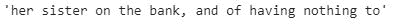

1.  标准化文本以移除标点符号并将其转换为小写：

```py
import re
text = text.lower()
text = re.sub('[⁰-9a-zA-Z]+',' ',text)
```

1.  将唯一的单词分配给一个索引，以便在构建训练和测试数据集时引用：

```py
from collections import Counter
counts = Counter()
counts.update(text.split())
words = sorted(counts, key=counts.get, reverse=True)
nb_words = len(text.split())
word2index = {word: i for i, word in enumerate(words)}
index2word = {i: word for i, word in enumerate(words)}
```

1.  构建输入单词集，从中生成输出单词。请注意，我们考虑的是`10`个单词的序列，并尝试预测*第 11*个（*th*）单词：

```py
SEQLEN = 10
STEP = 1
input_words = []
label_words = []
text2=text.split()
for i in range(0,nb_words-SEQLEN,STEP):
     x=text2[i:(i+SEQLEN)]
     y=text2[i+SEQLEN]
     input_words.append(x)
     label_words.append(y)
```

`input_words`和`label_words`列表的示例如下：

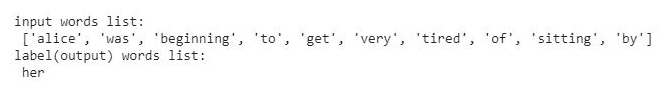

注意，`input_words`是一个包含列表的列表，而`output_words`则不是。

1.  构建输入和输出数据集的向量：

```py
total_words = len(set(words))
X = np.zeros((len(input_words), SEQLEN, total_words), dtype=np.bool)
y = np.zeros((len(input_words), total_words), dtype=np.bool)
```

在前面的步骤中，我们创建了空数组，这些数组将在接下来的代码中被填充：

```py
# Create encoded vectors for the input and output values
for i, input_word in enumerate(input_words):
     for j, word in enumerate(input_word):
         X[i, j, word2index[word]] = 1
     y[i,word2index[label_words[i]]]=1
```

在前面的代码中，第一个`for`循环用于遍历输入词序列中的所有单词（输入中有`10`个单词），第二个`for`循环用于遍历选定的输入词序列中的每个单词。此外，由于输出是一个列表，我们不需要通过第二个`for`循环来更新它（因为没有 ID 序列）。`X`和`y`的输出形状如下：

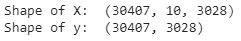

1.  定义模型的架构：

```py
HIDDEN_SIZE = 128
BATCH_SIZE = 32
NUM_ITERATIONS = 100
NUM_EPOCHS_PER_ITERATION = 1
NUM_PREDS_PER_EPOCH = 100

model = Sequential()
model.add(LSTM(HIDDEN_SIZE,return_sequences=False,input_shape=(SEQLEN,total_words)))
model.add(Dense(total_words, activation='softmax'))
model.compile(optimizer='adam', loss='categorical_crossentropy')
model.summary()
```

模型的总结如下：

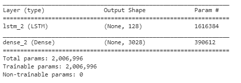

1.  拟合模型。观察输出随着轮次的增加如何变化。生成一个随机的`10`个单词的序列，并尝试预测下一个可能的单词。我们可以观察到，随着轮次的增加，我们的预测逐渐变得更好：

```py
for iteration in range(50):
     print("=" * 50)
     print("Iteration #: %d" % (iteration))
     model.fit(X, y, batch_size=BATCH_SIZE, epochs=NUM_EPOCHS_PER_ITERATION, validation_split = 0.1)
     test_idx = np.random.randint(int(len(input_words)*0.1)) * (-1)
     test_words = input_words[test_idx]
     print("Generating from seed: %s" % (test_words))
     for i in range(NUM_PREDS_PER_EPOCH): 
         Xtest = np.zeros((1, SEQLEN, total_words))
         for i, ch in enumerate(test_words):
             Xtest[0, i, word2index[ch]] = 1
         pred = model.predict(Xtest, verbose=0)[0]
         ypred = index2word[np.argmax(pred)]
         print(ypred,end=' ')
         test_words = test_words[1:] + [ypred]
```

在前面的代码中，我们正在为一个轮次（epoch）拟合我们的模型，使用输入和输出数组。此外，我们选择一个随机的种子词（`test_idx` – 这是一个随机数，位于输入数组的最后 10%中（因为`validation_split`为`0.1`），并在随机位置收集输入单词。我们将输入 ID 序列转换为 one-hot 编码版本（因此得到的数组形状为 1 x 10 x `total_words`）。

最后，我们对刚刚创建的数组进行预测，并获得概率最高的单词。我们来看一下第一轮（epoch）输出的结果，并与第*25^(th)*轮的输出进行对比：

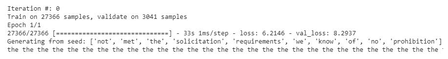

注意，第一轮的输出总是`the`。然而，在经过 50 轮训练后，输出变得更加合理，如下所示：

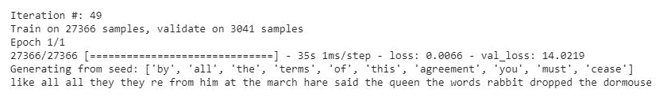

`Generating from seed`行是预测结果的集合。

注意，虽然训练损失随着轮次的增加而减少，但在 50 轮结束时，验证损失变得更糟。随着我们在更多文本上训练和/或进一步微调模型，这将得到改善。

此外，这个模型可以通过使用双向 LSTM 进一步改进，我们将在*序列到序列学习*一章中讨论。使用双向 LSTM 后的输出如下：

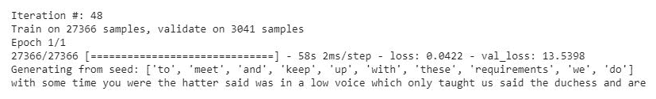

# 电影推荐

推荐系统在用户发现过程中的作用非常重要。想象一下一个电商目录，其中包含成千上万种不同的产品。此外，某个产品的不同变体也会存在。在这种情况下，向用户普及产品或事件（例如某些产品正在打折）成为增加销售的关键。

# 准备就绪

在这个案例中，我们将学习如何为一个包含用户对电影评分的数据库构建推荐系统。这个练习的目标是最大化电影与用户的相关性。在定义目标时，我们还应考虑到，虽然推荐的电影可能仍然相关，但用户可能不会立即观看。同时，我们还应确保所有推荐内容不都属于同一类型。尤其在零售环境下，我们不希望在所有推荐中都推荐同一产品的不同变体。

让我们正式定义我们的目标和约束：

+   **目标**：最大化推荐内容对用户的相关性

+   **约束**：增加推荐的多样性，并向用户提供最多 12 个推荐

相关性的定义因用例而异，通常由商业原则指导。在本例中，我们将相关性定义得比较狭窄；也就是说，如果用户购买了在给定用户的前 12 个推荐商品中的任何一项，就视为成功。

基于此，让我们定义构建模型的步骤：

1.  导入数据。

1.  推荐一部用户会高评分的电影——因此，让我们根据用户历史上喜欢的电影来训练模型。用户不喜欢某些电影的洞察将有助于进一步改善我们的推荐。然而，先保持简单。

1.  只保留观看了超过五部电影的用户。

1.  为独特的用户和电影分配 ID。

1.  鉴于用户的偏好可能随时间变化，我们需要考虑用户的历史，历史中的不同事件有不同的权重。鉴于这是一个时间序列分析问题，我们将利用 RNN 来解决该问题。

1.  对数据进行预处理，以便将其传递给 LSTM：

    +   输入将是用户观看的历史五部电影

    +   输出是用户观看的第六部电影

1.  构建一个执行以下操作的模型：

    1.  为输入的电影创建嵌入

    1.  将嵌入通过 LSTM 层

    1.  将 LSTM 的输出通过一个全连接层

    1.  在最终层应用 softmax，以生成推荐的电影列表

# 如何做...

现在我们已经了解了执行各种步骤的策略，让我们开始编写代码（代码文件在 GitHub 上的`Chapter_12_Recommender_systems.ipynb`中提供）：

1.  导入数据。我们将使用一个包含用户列表、用户对不同电影评分以及用户提供评分的时间戳的数据集：

```py
import numpy as np
import pandas as pd
ratings = pd.read_csv('..') # Path to the file containing required fields
```

数据集的一个示例如下所示：

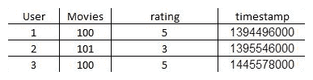

1.  过滤掉用户没有喜欢的电影或没有足够历史记录的用户。在以下代码中，我们排除了用户给出低评分的电影：

```py
ratings = ratings[ratings['rating']>3]
ratings = ratings.sort_values(by='timestamp')
ratings.reset_index(inplace=True)
ratings = ratings.drop(['index'],axis=1)
```

在以下代码中，我们仅保留那些在历史记录中提供超过`5`个评分（评分值大于`3`）的用户：

```py
user_movie_count =ratings.groupby('User').agg({'Movies':'nunique'}).reset_index()
user_movie_count.columns = ['User','Movie_count']
ratings2 = ratings.merge(user_movie_count,on='User',how='inner')
movie_count = ratings2[ratings2['Movie_count']>5]
movie_count = movie_count.sort_values('timestamp')
movie_count.reset_index(inplace=True)
movie_count = movie_count.drop(['index'],axis=1)
```

1.  为独特的`users`和`Movies`分配 ID，以便后续使用：

```py
ratings = movie_count
users = ratings.User.unique()
articles = ratings.Movies.unique()
userid2idx = {o:i for i,o in enumerate(users)}
articlesid2idx = {o:i for i,o in enumerate(articles)}
idx2userid = {i:o for i,o in enumerate(users)}
idx2articlesid = {i:o for i,o in enumerate(articles)}

ratings['Movies2'] = ratings.Movies.apply(lambda x: articlesid2idx[x])
ratings['User2'] = ratings.User.apply(lambda x: userid2idx[x])
```

1.  对数据进行预处理，使得输入是最后五部电影，输出是第六部观看的电影：

```py
user_list = movie_count['User2'].unique()
historical5_watched = []
movie_to_predict = []
for i in range(len(user_list)):
     total_user_movies = movie_count[movie_count['User2']==user_list[i]].copy()
     total_user_movies.reset_index(inplace=True)
     total_user_movies = total_user_movies.drop(['index'],axis=1)
     for j in range(total_user_movies.shape[0]-6):
         historical5_watched.append(total_user_movies.loc[j:(j+4),'Movies2'].tolist())                                                                          movie_to_predict.append(total_user_movies.loc[(j+5),'Movies2'].tolist())
```

1.  对`historical5_watched`和`movie_to_predict`变量进行预处理，以便将其传递给模型，然后创建训练集和测试集：

```py
movie_to_predict2 = to_categorical(y, num_classes = max(y)+1)
trainX = np.array(historical5_watched[:40000])
testX = np.array(historical5_watched[40000:])
trainY = np.array(movie_to_predict2[:40000])
testY = np.array(movie_to_predict2[40000:])
```

1.  构建模型：

```py
src_vocab = ratings['Movies2'].nunique()
n_units = 32
src_timesteps = 5
tar_vocab = len(set(y))

from keras.models import Sequential, Model
from keras.layers import Embedding
from keras.layers import LSTM, RepeatVector, TimeDistributed, Dense, Bidirectional

model = Sequential()
model.add(Embedding(src_vocab, n_units, input_length=src_timesteps))
model.add((LSTM(100)))
model.add(Dense(1000,activation='relu'))
model.add(Dense(max(y)+1,activation='softmax'))
model.summary()
```

请注意，在最后一层中，我们对可能的激活值加 1，因为没有 ID 为 0 的电影，如果我们仅将值设置为`max(y)`，最终的电影将被排除在外。

模型摘要如下：

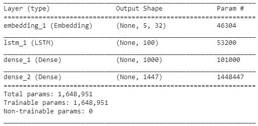

1.  拟合模型：

```py
model.fit(trainX, trainY, epochs=5, batch_size=32, validation_data=(testX, testY), verbose = 1)
```

1.  对测试数据进行预测：

```py
pred = model.predict(testX)
```

1.  了解数据点的数量（用户），其中接下来观看的电影在前五部历史电影之后位于前`12`个推荐中：

```py
count = 0
for i in range(testX.shape[0]):
    rank = np.argmax(np.argsort(pred[i])[::-1]==np.argmax(testY[i]))
    if rank<12:
        count+=1
count/testX.shape[0]
# 0.104
```

我们应该注意到，在总案例的 10.4%中，推荐给用户的电影恰好是他们接下来要观看的电影。

# 考虑用户历史

在发布前 12 个推荐电影时，我们需要考虑的一个因素是*如果用户已经观看过某部电影，他们不太可能再次观看同一部电影*（请注意，这一假设在零售环境中并不成立，因为在零售环境中会有相当数量的重复订单）。

让我们继续应用这个逻辑，进行前 12 个推荐的预测。

首先，我们将存储所有（不仅仅是最近观看的五部）用户在观看我们尝试预测的电影之前观看过的电影：

```py
historically_watched = []
for i in range(len(user_list)):
     total_user_movies = movie_count[movie_count['User2']==user_list[i]].copy()
     total_user_movies.reset_index(inplace=True)
     total_user_movies = total_user_movies.drop(['index'],axis=1)
     for j in range(total_user_movies.shape[0]-6):
         historically_watched.append(total_user_movies.loc[0:(j+4),'Movies2'].tolist())
```

在前述代码中，我们过滤出所有用户观看过的电影。

如果用户已经观看过一部电影，我们将该用户-电影组合的概率覆盖为零：

```py
for j in range(pred.shape[0]):
  for i in range(pred.shape[1]):
    pred[j][i]= np.where(i in historically_watched[j], 0 , pred[j][i])
```

在以下代码中，我们计算测试数据中用户观看的电影是否在前 12 个推荐电影中所占的百分比：

```py
count = 0
for i in range(testX.shape[0]):
  rank = np.argmax(np.argsort(pred[i])[::-1]==np.argmax(testY[i]))
  if rank<12:
    count+=1
count/testX.shape[0]
#12.6
```

通过前述方法，推荐有效的用户比例从上次迭代的 10.4%上升至 12.6%。

# 主题建模，使用嵌入

在前面的配方中，我们学习了如何为用户可能观看的电影生成预测。以前生成预测的方式的一个限制是，如果我们没有在电影预测之上进行进一步处理，那么电影推荐的多样性将受到限制。

多样化的推荐非常重要；如果没有多样性，用户只会发现某些类型的产品。

在这个配方中，我们将基于它们的相似性对电影进行分组，并识别电影的共同主题。此外，我们还将探讨如何增加向用户提供的推荐多样性。尽管如此，在电影推荐的具体案例中，这种策略的可行性可能较低，因为与在零售/电子商务设置中产品类别和替代品的数量相比，电影的类别和替代品要少得多。

# 准备工作

我们将采取的基于相似性分组电影的策略如下：

1.  从我们在电影推荐配方中构建的模型中提取每部电影的嵌入值

    +   我们还可以使用 gensim 为每部电影创建嵌入

    +   用户观看的所有电影可以被视为句子中的单词

    +   创建一个由形成句子的单词 ID 列表的列表

    +   通过 gensim 的 `Word2Vec` 方法传递列表列表，以提取单词向量（电影 ID 向量）

1.  将电影的嵌入值（向量）通过 k-means 聚类过程，提取出若干个簇

1.  确定最优簇的数量

1.  在每个簇中识别高概率购买的产品（在历史上未购买的产品中），并根据它们的概率重新排名产品

1.  推荐前 `n` 个产品

在此过程中，一个变量是要形成的簇的数量。簇的数量越多，每个簇中的产品越少，同时，同一簇内的每个产品之间的相似性越大。基本上，数据点数量与同一簇内数据点相似性之间存在权衡。

通过计算所有点相对于它们的聚类中心的平方距离之和，我们可以得出一组内部点相似性的度量。惯性度量不会显著减少的簇的数量是最优簇的数量。

# 如何做到这一点...

现在我们已经形成了在我们的推荐中获取各种产品的策略，让我们编写代码（我们将从 *电影推荐* 配方的第 3 步继续）。 代码文件在 GitHub 中可作为 `Chapter_12_Recommender_systems.ipynb` 获得。

1.  使用 `Word2Vec` 提取每部电影的嵌入值。

    1.  创建所有用户观看的各种电影列表的列表：

```py
user_list = movie_count['User2'].unique()
user_movies = []
for i in range(len(user_list)):
     total_user_movies = movie_count[movie_count['User2']==user_list[i]].copy()
     total_user_movies.reset_index(inplace=True)
     total_user_movies = total_user_movies.drop(['index'],axis=1)
     total_user_movies['Movies3'] = total_user_movies['Movies2'].astype(str)
     user_movies.append(total_user_movies['Movies3'].tolist())
```

在前述代码中，我们过滤了所有用户观看的电影，并创建了所有用户观看的电影列表。

1.  提取每部电影的词向量：

```py
from gensim.models import Word2Vec
w2v_model = Word2Vec(user_movies,size=100,window=5,min_count=5, iter = 500)
```

1.  提取电影的`TSNE`值，以便对我们在上一阶段提取的电影词嵌入进行可视化表示：

```py
from sklearn.manifold import TSNE
tsne_model = TSNE(n_components=2, verbose=1, random_state=0)
tsne_img_label = tsne_model.fit_transform(w2v_model.wv.syn0)
tsne_df = pd.DataFrame(tsne_img_label, columns=['x', 'y'])
tsne_df['image_label'] = list(w2v_model.wv.vocab.keys())

from ggplot import *
chart = ggplot(tsne_df, aes(x='x', y='y'))+geom_point(size=70,alpha=0.5)
chart
```

2D 空间中嵌入的可视化如下所示：

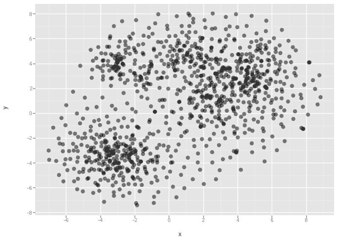

从前面的输出中，我们可以看到有些电影被分组在一起（这些区域比较密集）。

1.  将电影 ID 和电影索引值存储在数据框中：

```py
idx2movie = pd.DataFrame([idx2moviesid.keys(), idx2moviesid.values()]).T
idx2movie.columns = ['image_label','movieId']
```

1.  合并`tsne_df`和`idx2movie`数据集，这样我们就能在一个单独的数据框中得到所有的值：

```py
tsne_df['image_label'] = tsne_df['image_label'].astype(int)
tsne_df2 = pd.merge(tsne_df, idx2movie, on='image_label', how='right')
```

1.  导入`movies`数据集：

```py
movies = pd.read_csv('...') # Path to movies dataset
```

1.  将`TSNE`数据集与电影数据合并，并删除不需要的列：

```py
tsne_df3 = pd.merge(tsne_df2, movies, left_on='movieId', right_on = 0, how='inner')
tsne_df4 = tsne_df3.drop([2,3,4],axis=1)
tsne_df4.rename(columns={1:'movie_name'}, inplace=True)
```

1.  排除包含 NaN 值的行（由于某些电影出现的频率较低，导致`Word2Vec`没有为这些稀有词提供词向量（由于`min_count`参数）：

```py
tsne_df5 = tsne_df4.loc[~np.isnan(tsne_df4['x']),]
```

1.  通过了解惯性变化（所有点到各自聚类中心的总平方距离）来确定最佳聚类数量：

```py
X = tsne_df5.loc[:,['x','y']]
inertia = []
for i in range(10):
      km = KMeans((i+1)*10)
      km.fit(X)
      inertia.append(km.inertia_)

import matplotlib.pyplot as plt
%matplotlib inline
plt.plot((np.arange(10)+1)*10,inertia)
plt.title('Variation of inertia over different number of clusters')
plt.xlabel('Number of clusters')
plt.ylabel('Inertia')
```

不同数量聚类的惯性变化如下：

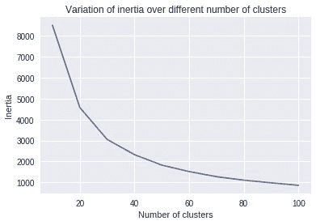

从前面的曲线来看，我们可以看到，当聚类数量超过`40`时，惯性下降的幅度没有那么大。因此，我们将`40`定为我们数据集中电影的最佳聚类数量。

1.  通过手动检查某些落入同一聚类的电影来验证聚类结果，检查这些电影是否合理地分在同一聚类：

```py
km = KMeans(40)
km.fit(X)
tsne_df5['clusterlabel'] = km.labelstsne_df5[tsne_df5['cluster_label']==0].head()
```

一旦执行代码，你会注意到位于`cluster_label`：`0`的电影主要是浪漫和喜剧类型的电影。

1.  移除用户已观看的电影：

```py
for j in range(pred.shape[0]):
     for i in range(pred.shape[1]):
         pred[j][i]= np.where(i in historically_watched[j], 0 , pred[j][i])
```

1.  对于每个用户，映射电影的概率和电影所属的聚类编号，以便我们可以为每个用户提取该聚类中概率最高的电影。然后从不同聚类中提取前 12 部电影进行推荐：

```py
movie_cluster_id = tsne_df5[['image_label','cluster_label']]
count = 0
for j in range(pred.shape[0]):
      t = movie_cluster_id.copy()
      t['pred']=pred[j,list(movie_cluster_id['image_label'])]
      t2= t.sort_values(by='pred',ascending=False).groupby('cluster_label').first().reset_index()
      t3 = t2.sort_values(by='pred',ascending=False).reset_index()
      final_top_preds = t3.loc[:11]['image_label'].values
      if (np.argmax(testY[j]) in final_top_preds):
            count+=1

```

前述结果显示，13.6%的用户观看了推荐给他们的电影。

虽然前述结果仅比没有任何推荐多样性的 12.6%结果稍好，但考虑到不仅是下一次购买，而是所有用户未来的购买，拥有多样性的推荐更可能带来更好的效果。

# 还有更多...

尽管我们已经考虑了为用户生成预测，并提高推荐多样性，但我们还可以通过以下方法进一步改进结果：

+   融入用户不喜欢的电影信息

+   融入用户的人口统计信息

+   融入有关电影的详细信息，例如上映年份和演员阵容

# 预测股票价格的价值

专家们进行的技术分析有很多种，用以提出股票的买卖建议。大多数技术分析依赖于历史模式，假设历史会重复，只要我们对某些事件进行标准化处理。

鉴于我们到目前为止所做的也是通过考虑历史来做决策的，让我们继续应用我们迄今为止学到的技巧来预测股票价格。

然而，在依赖算法分析做出买卖决策时，如股票价格预测，务必小心。与其他方法的区别在于，其他方法中的决策是可逆的（例如：如果生成的文本不合适，可以撤销），或者是有成本的（糟糕的推荐意味着客户不会再次购买该产品），而股票价格预测中的决策是不可逆的。一旦资金损失，就无法追回。

牢记这一点，让我们继续应用我们迄今为止学到的技巧来预测股票价格。

# 准备工作

为了预测股票价格，让我们应用两种策略：

+   仅根据过去五天的股票价格来预测股票价格

+   基于过去五天的股票价格和公司最新新闻的结合来预测股票价格

对于第一次分析，我们可以准备数据集，方式与为 LSTM 准备数据集非常相似；第二次分析则需要不同的数据准备方式，因为它涉及到数值和文本数据。

我们将为上述讨论的两种方法处理数据的方式如下：

+   **仅使用过去五天的股票价格**：

    1.  按照从最旧到最新的日期排序数据集

    1.  以前`5`个股票价格作为输入，第六个股票价格作为输出

    1.  将其滑动，以便在下一个数据点中，第二到第六个数据点作为输入，第七个数据点作为输出，依此类推，直到我们达到最后一个数据点：

        1.  这五个数据点作为 LSTM 中的五个时间步骤的输入

        1.  第六个数据点是输出

    1.  鉴于我们预测的是一个连续的数字，这次的损失函数将是*均方误差*值

+   **过去五天的股票价格加上新闻标题、公司数据**：对于这个分析，有两种数据预处理方式。虽然过去五天股票价格的数据预处理保持不变，但新闻标题和数据的预处理步骤是此分析中要执行的额外步骤。让我们看看如何将这两者融入到我们的模型中：

    1.  鉴于这些是两种不同的数据类型，让我们使用两个不同的模型：

        +   一个使用历史五天股票价格数据的模型。

        +   另一个模型，通过增加或减少过去五天股票价格模型的输出，来修改其结果。

        +   第二个模型来源于新闻头条数据集。假设正面新闻头条更可能提升股票价格，而负面新闻则可能降低股票价格。

    1.  为简化问题，假设在预测股票价值的当天，只有最新的新闻头条会影响股票的预测结果

    1.  鉴于我们有两个不同的模型，使用函数式 API 以便我们结合两者因素的影响

# 如何操作...

我们将解决此问题的方法分为三个部分（代码文件在 GitHub 中以 `Chapter_12_stock_price_prediction.ipynb` 呈现）：

+   仅基于过去五天的股票价格预测股票价格

    +   随机训练和测试集划分的陷阱

+   为较新的股票价格赋予更高的权重

+   将过去五天的股票价格与新闻文章头条的文本数据结合

# 仅使用过去五天的股票价格

在本菜谱中，我们仅基于过去五个数据点来预测股票价格。在下一个菜谱中，我们将基于新闻和历史数据来预测股票价格：

1.  导入相关的包和数据集：

```py
import pandas as pd
data2 = pd.read_csv('/content/stock_data.csv')
```

1.  准备数据集，其中输入为过去五天的股票价格，输出为第六天的股票价格：

```py
x= []
y = []
for i in range(data2.shape[0]-5):
     x.append(data2.loc[i:(i+4)]['Close'].values)
     y.append(data2.loc[i+5]['Close'])

import numpy as np
x = np.array(x)
y = np.array(y)
```

1.  将数据集重新整形为 `batch_size`、`time_steps`、`features_per_time_step` 形式：

```py
x = x.reshape(x.shape[0],x.shape[1],1)
```

1.  创建训练集和测试集：

```py
from sklearn.model_selection import train_test_split
X_train, X_test, y_train, y_test = train_test_split(x, y, test_size=0.30,random_state=10)
```

1.  构建模型：

```py
model = Sequential()
model.add(Dense(100, input_shape = (5,1), activation = 'relu'))
model.add((LSTM(100)))
model.add(Dense(1000,activation='relu'))
model.add(Dense(1,activation='linear'))
model.summary()
```

模型的总结如下：

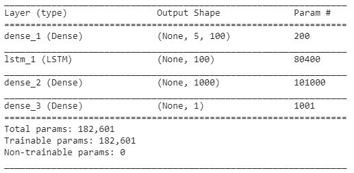

1.  编译模型以定义 `loss` 函数并调整学习率：

```py
from keras.optimizers import Adam
adam = Adam(lr=0.0001)
model.compile(optimizer=adam, loss='mean_squared_error')
```

1.  拟合模型：

```py
model.fit(X_train, y_train, epochs=400, batch_size=64, validation_data=(X_test, y_test), verbose = 1)
```

之前的结果表明，在测试数据集上的均方误差值为 $641（每次预测大约 ~$25）。预测股票价格与实际股票价格的对比图如下：

```py
pred = model.predict(X_test)

import matplotlib.pyplot as plt
%matplotlib inline
plt.figure(figsize=(20,10))
plt.plot(y_test,'r')
plt.plot(pred,'--')

plt.title('Variation of actual and predicted stock price')
plt.ylabel('Stock price')
```

预测值与实际价格的差异如下：

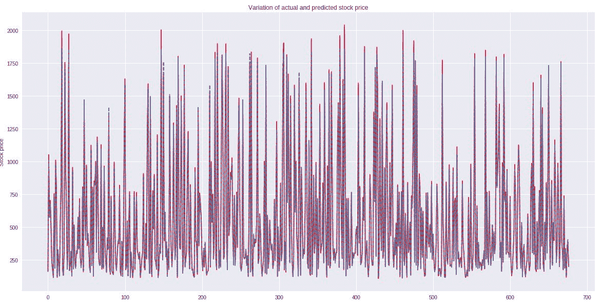

# 陷阱

现在我们有了相当准确的预测，实际上，预测效果非常好，让我们深入了解这些优秀预测的原因。

在我们的训练数据集中，既有很久以前的数据，也有非常近期的数据。这是一种数据泄漏，因为在构建模型时，我们无法获得未来的股票价格。由于我们的数据构建方式，我们的训练数据集可能包含来自 12 月 20 日的数据，而 12 月 19 日的数据则可能在测试数据集中。

让我们用训练集和测试集按照相应日期重新构建我们的模型：

```py
X_train = x[:2100,:,:]
y_train = y[:2100]
X_test = x[2100:,:,:]
y_test = y[2100:]
```

在新测试数据集上，我们在 *仅使用过去 5 天的股票价格* 部分构建的模型输出如下（测试数据集的损失大约为 57,000）：

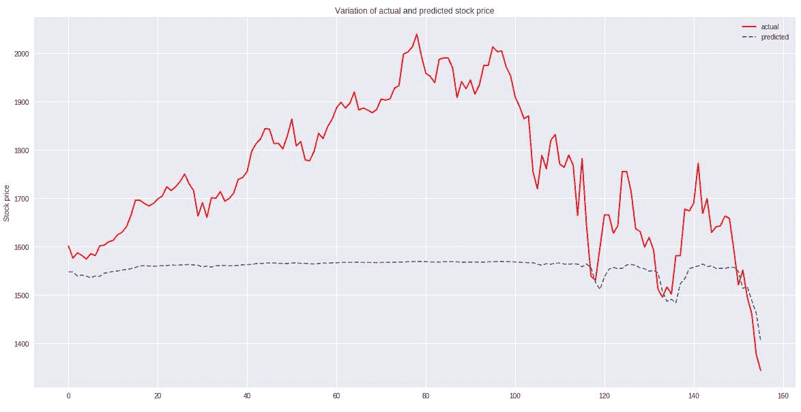

注意，与上一次迭代相比，结果实际与预测的股价图现在更糟。然而，在此部分生成的图表比*最近 5 天的股票价格*部分获得的图表更具现实情况。

现在我们已经获得了前面的图表，让我们试着理解图表看起来如此的原因，通过检查股价随时间变化的绘图，如下所示：

```py
plt.plot(data2['Close'])
```

股价随时间变化的图表如下：

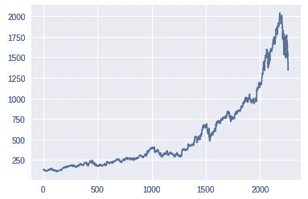

注意，股票价格在开始时缓慢上升，并在中间加速，最后减速。

模型由于以下原因表现不佳：

+   对于早期和最近的预测错误，都赋予了相等的权重。

+   我们没有考虑减速趋势。

# 分配不同的权重给不同的时间段。

我们了解到，我们将为最近的时间段分配更高的权重，而为历史时间段分配较低的权重。

我们可以如下制定训练`weights`：

```py
weights = np.arange(X_train.shape[0]).reshape((X_train.shape[0]),1)/2100
```

前面的代码将最历史数据点的权重分配为`0`，将最近数据点的权重分配为`1`。所有中间数据点的权重值将在`0`到`1`之间。

现在我们已经定义了`weights`，让我们定义我们的自定义损失函数，该函数在计算平方误差损失时应用先前初始化的损失：

```py
import numpy as np
from keras.layers import Dense, Input
from keras import Model
import keras.backend as K
from functools import partial

def custom_loss(y_true, y_pred, weights):
     return K.square(K.abs(y_true - y_pred) * weights)
cl = partial(custom_loss, weights=weights_tensor)
```

现在我们已经初始化了`weights`并定义了自定义损失函数，让我们使用功能 API 将输入层和权重值提供给模型（我们使用功能 API 因为在训练模型时传递了多个输入）：

```py
input_layer = Input(shape=(5,1))
weights_tensor = Input(shape=(1,))

i1 = Dense(100, activation='relu')(input_layer)
i2 = LSTM(100)(i1)
i3 = Dense(1000, activation='relu')(i2)
out = Dense(1, activation='linear')(i3)
model = Model([input_layer, weights_tensor], out)
```

现在我们已经定义了模型，该模型与*最近 5 天的股票价格*部分中的参数相同，但还有一个额外的输入，即权重张量。让我们编译我们的模型：

```py
from keras.optimizers import Adam
adam = Adam(lr=0.0001)
model = Model([input_layer, weights_tensor], out)
model.compile(adam, cl)
```

现在我们已经编译了我们的模型，让我们拟合它：

```py
model.fit(x=[X_train, weights], y=y_train, epochs=300,batch_size = 32, validation_data = ([X_test, test_weights], y_test))
```

模型在测试数据集上返回了 40,000 的平方误差损失，与*陷阱*部分的 57,000 损失相比。让我们在测试数据集上绘制预测股价与实际股价的值：

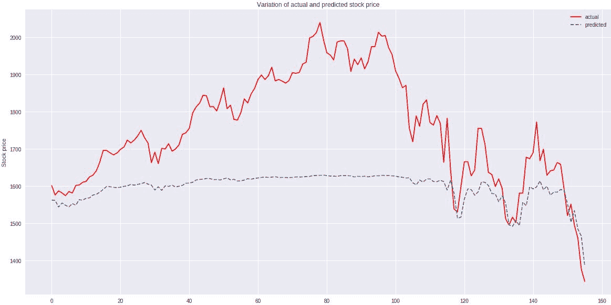

我们现在注意到，在最近的历史记录中（图表的最右侧部分），预测的股价与实际股价之间存在相关性，而图表中间的尖峰未被预测所考虑。

在下一个案例中，让我们看看新闻标题是否能包含中间的尖峰。

# 最近五天的股票价格加上新闻数据

在下面的代码中，我们将包含来自感兴趣公司的标题的文本数据（从《卫报》网站提供的开放源代码 API 获取），以及过去五天的股价数据。然后我们将结合自定义损失函数，该函数会考虑事件的时效性：

1.  从这里导入《卫报》网站的标题数据：[`open-platform.theguardian.com/`](https://open-platform.theguardian.com/)（请注意，您需要申请自己的访问密钥，才能从该网站下载数据集）。下载标题及其出现的对应日期，然后预处理日期，使其转换为日期格式：

```py
from bs4 import BeautifulSoup
from bs4 import BeautifulSoup
import urllib, json

dates = []
titles = []
for i in range(100):
 try:
        url = 'https://content.guardianapis.com/search?from-date=2010-01-01&section=business&page-          size=200&order-by=newest&page='+str(i+1)+'&q=amazon&api-key=0d7'
        response = urllib.request.urlopen(url)
        encoding = response.info().get_content_charset('utf8')
        data = json.loads(response.read().decode(encoding))
        print(i)
        for j in range(len(data['response']['results'])):
              dates.append(data['response']['results'][j]['webPublicationDate'])
              titles.append(data['response']['results'][j]['webTitle']) 
 except:
       break

import pandas as pd
data = pd.DataFrame(dates, titles)
data = data.reset_index()
data.columns = ['title','date']
data['date']=data['date'].str[:10]
data['date']=pd.to_datetime(data['date'], format = '%Y-%m-%d')
data = data.sort_values(by='date')
data_final = data.groupby('date').first().reset_index()
```

1.  通过`Date`将历史价格数据集和文章标题数据集合并：

```py
data2['Date'] = pd.to_datetime(data2['Date'],format='%Y-%m-%d')
data3 = pd.merge(data2,data_final, left_on = 'Date', right_on = 'date', how='left')
```

1.  对文本数据进行预处理，去除停用词和标点符号，然后像我们在第十一章《构建循环神经网络》中做的那样，对文本输入进行编码：

```py
import nltk
import re
nltk.download('stopwords')
stop = nltk.corpus.stopwords.words('english')
def preprocess(text):
     text = str(text)
     text=text.lower()
     text=re.sub('[⁰-9a-zA-Z]+',' ',text)
     words = text.split()
     words2=[w for w in words if (w not in stop)]
     words3=' '.join(words2)
     return(words3)
data3['title'] = data3['title'].apply(preprocess)
data3['title']=np.where(data3['title'].isnull(),'-','-'+data3['title'])
docs = data3['title'].values
from collections import Counter
counts = Counter()
for i,review in enumerate(docs):
     counts.update(review.split())
words = sorted(counts, key=counts.get, reverse=True)
vocab_size=len(words)
word_to_int = {word: i for i, word in enumerate(words, 1)}
encoded_docs = []
for doc in docs:
     encoded_docs.append([word_to_int[word] for word in doc.split()])
max_length = 20
from keras.preprocessing.sequence import pad_sequences
padded_docs = pad_sequences(encoded_docs, maxlen=max_length,padding='pre')
```

1.  以过去五天的股价和最新的标题（在股价预测日期之前的标题）为输入。让我们预处理数据，获取输入和输出值，然后准备训练集和测试集：

在以下代码中，x1 对应历史股价，x2 对应股价预测日期的文章标题：

```py
x1 = []
x2 = []
y = []
for i in range(data3.shape[0]-5):
     x1.append(data3.loc[i:(i+4)]['Close'].values)
     x2.append(padded_docs[i+5])
     y.append(data3.loc[i+5]['Close'])

x1 = np.array(x1)
x2 = np.array(x2)
y = np.array(y)
x1 = x1.reshape(x1.shape[0],x1.shape[1],1)
X1_train = x1[:2100,:,:]
X2_train = x2[:2100,:]
y_train = y[:2100]

X1_test = x1[2100:,:,:]
X2_test = x2[2100:,:]
y_test = y[2100:]
```

1.  鉴于我们将多个变量作为输入（历史股价、编码的文本数据和权重值），我们将使用函数式 API 来构建模型：

```py
input1 = Input(shape=(20,))
model = Embedding(input_dim=vocab_size+1, output_dim=32, input_length=20)(input1)
model = (LSTM(units=100))(model)
model = (Dense(1, activation='tanh'))(model)

input2 = Input(shape=(5,1))
model2 = Dense(100, activation='relu')(input2)
model2 = LSTM(units=100)(model2)
model2 = (Dense(1000, activation="relu"))(model2)
model2 = (Dense(1, activation="linear"))(model2)

from keras.layers import multiply
conc = multiply([model, model2])
conc2 = (Dense(1000, activation="relu"))(conc)
out = (Dense(1, activation="linear"))(conc2)
```

请注意，我们已经将股价模型和文本数据模型的输出值相乘，因为文本数据需要与历史股价模型的输出进行调整：

```py
model = Model([input1, input2, weights_tensor], out)
```

前述模型的架构如下：

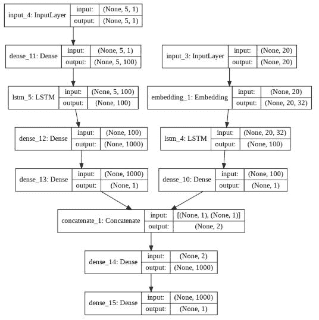

1.  定义损失函数并编译模型：

```py
def custom_loss(y_true, y_pred, weights):
 return K.square(K.abs(y_true - y_pred) * weights)
cl = partial(custom_loss, weights=weights_tensor)

model = Model([input1, input2, weights_tensor], out)
model.compile(adam, cl)
```

1.  训练模型：

```py
model.fit(x=[X2_train, X1_train, weights], y=y_train, epochs=300,batch_size = 32, validation_data = ([X2_test, X1_test, test_weights], y_test))
```

1.  绘制测试集中的实际股价与预测股价的比较图：

```py
pred = model.predict([X2_test, X1_test, test_weights])

import matplotlib.pyplot as plt
%matplotlib inline
plt.figure(figsize=(20,10))
plt.plot(y_test,'r',label='actual')
plt.plot(pred,'--', label = 'predicted')
plt.title('Variation of actual and predicted stock price')
plt.ylabel('Stock price')
plt.legend()
```

实际股价与预测股价的变化如下：

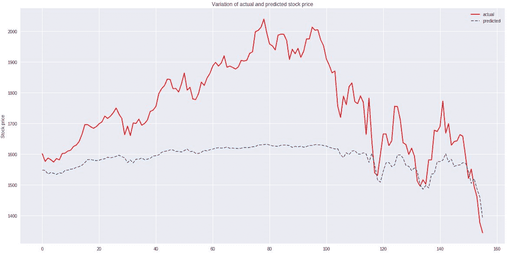

请注意，在这一轮迭代中，与没有文本数据的版本相比，中间部分的斜率稍好一些，并且平方误差稍低，为 35,000，而前一轮的平方误差为 40,000。

# 还有更多内容…

如本教程开头所提到的，预测股价时要非常小心，因为股价的波动受多种因素的影响，所有这些因素在预测时都需要考虑进去。

此外，您还应该注意，虽然实际值和预测值看起来相关，但预测值线比实际值线稍有延迟。这种延迟可能会导致从买入决策变为卖出决策的最佳策略发生显著变化。因此，在股价变动显著的前一日期，应给予更大的权重——这进一步复杂化了我们的损失函数。

我们也可以考虑整合更多信息源，如额外的新闻标题和季节性因素（例如：某些股票在假期季节通常表现良好）以及其他宏观经济因素，在进行预测时使用。

最后，我们本可以对数据集进行缩放，以便神经网络的输入不是一个巨大的数字。
