# 第十四章：端到端学习

在前几章中，我们学习了如何使用**循环神经网络**（**RNN**）分析顺序数据（文本），以及如何使用**卷积神经网络**（**CNN**）分析图像数据。

本章将介绍如何使用 CNN + RNN 组合来解决以下案例研究：

+   手写文本识别

+   从图像生成标题

此外，我们还将学习一种新的损失函数——**连接主义时间分类**（**CTC**）损失，用于解决手写文本识别问题。

最后，我们将学习如何使用束搜索（beam search）来为生成的文本提出合理的替代方案，同时解决从图像生成标题的问题。

# 介绍

假设我们正在转录手写文本的图像。在这种情况下，我们既要处理图像数据，又要处理顺序数据（因为图像中的内容需要顺序转录）。

在传统分析中，我们通常会手工设计解决方案——例如：我们可能会在图像上滑动一个窗口（该窗口的大小大致与一个字符相当），使得窗口能够检测每个字符，然后输出它所检测到的字符，并且具有较高的置信度。

然而，在这种情况下，窗口的大小或我们滑动的窗口数量是由我们手工设计的——这就成为了特征工程（特征生成）问题。

更加端到端的方法是通过将图像传递给 CNN 来提取特征，然后将这些特征作为输入传递给 RNN 的各个时间步，以便在各个时间步提取输出。

因此，我们将使用 CNN 和 RNN 的组合，通过这种方式处理问题，我们不需要构建任何手工设计的特征，而是让模型自行调整 CNN 和 RNN 的最优参数。

# 连接主义时间分类（CTC）

在手写文本识别或语音转录的监督学习中，传统方法的一大限制是，我们需要提供图像中哪些部分包含某个字符的标签（在手写识别中），或哪个音频子段包含某个音素（多个音素组合形成一个单词发音）。

然而，在构建数据集时，为每个字符在图像中的位置或每个音素在语音转录中的位置提供真实标签是非常昂贵的，因为要转录的数据集可能包含成千上万的单词或数百小时的语音。

CTC 对于解决图像的不同部分与不同字符之间的映射问题非常有用。在这一节中，我们将学习 CTC 损失函数的原理。

# 解码 CTC

假设我们正在转录一个包含**ab**文本的图像。这个例子可能看起来像以下任意一种（字符*`a`*和*`b`*之间的空格不同），而输出标签（地面真相）仍然是相同的**ab**：

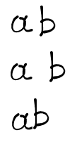

在下一步，我们将这些例子分成多个时间步，如下所示（每个框代表一个时间步）：

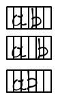

在前面的例子中，我们总共有六个时间步（每个单元格代表一个时间步）。

我们将从每个时间步预测输出，其中每个时间步的输出是整个词汇表的 softmax。

假设我们正在执行 softmax，让我们看一下**ab**的第一个图片中每个时间步的输出如下：

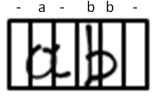

请注意，前图中的**-**表示一个空格。此外，如果图像的特征通过双向 LSTM（或 GRU）传递，则第四和第五时间步的输出可以是*`b`*——因为下一时间步中的信息也可以影响执行双向分析时的前一个时间步的输出。

在最后一步，我们将压缩所有在连续时间步中具有相同值的 softmax 输出。

上述结果导致我们最终的输出为：**-a-b-**（以此示例为准）。

如果地面真相是**abb**，我们将期望在两个*`b`*之间有一个**-**，以避免连续的*`b`*被压缩成一个。

# 计算 CTC 损失值

对于我们在上一节中解决的问题，假设我们有以下情形，其中给定时间步中某个字符出现的概率如图中圆圈所示（请注意，每个时间步从**t0**到**t5**的概率和为 1）：

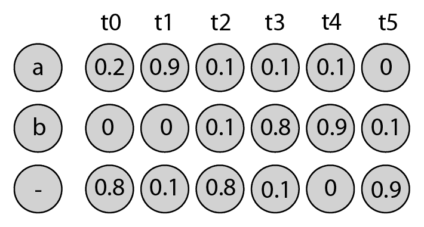

然而，为了使计算更简洁，便于我们理解，假设地面真相是*`a`*而非**ab**，并且假设输出仅有三个时间步而不是六个。修改后的三个时间步的输出如下：

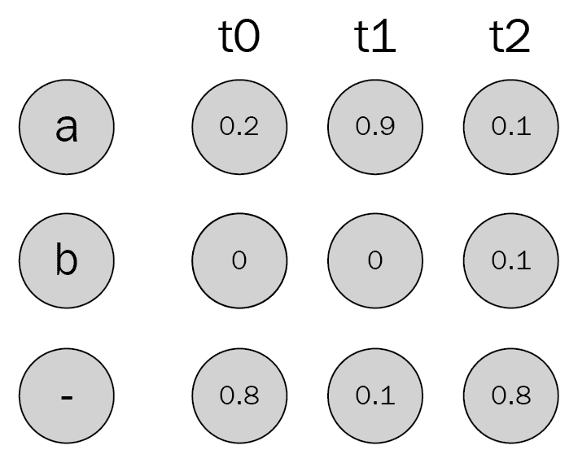

如果每个时间步的 softmax 值满足以下任一情形，我们可以得到*`a`*的地面真相：

| **每个时间步的输出** | **时间步 1 的字符概率** | **时间步 2 的字符概率** | **时间步 3 的字符概率** | **组合的概率** | **最终概率** |
| --- | --- | --- | --- | --- | --- |
| - - a | 0.8 | 0.1 | 0.1 | 0.8 x 0.1 x 0.1 |  0.008 |
| - a a | 0.8 | 0.9 | 0.1 | 0.8 x 0.9 x 0.1 | 0.072 |
| a a a | 0.2 | 0.9 | 0.1 | 0.2 x 0.9 x 0.1 | 0.018 |
| - a - | 0.8 | 0.9 | 0.8 | 0.8 x 0.9 x 0.8 | 0.576 |
| - a a | 0.8 | 0.9 | 0.1 | 0.8 x 0.9 x 0.1 | 0.072 |
| a - -  | 0.2 | 0.1 | 0.8 | 0.2 x 0.1 x 0.8 | 0.016 |
| a a - | 0.2 | 0.9 | 0.8 | 0.2 x 0.9 x 0.8 | 0.144 |
| **总体概率** | **0.906** |

从之前的结果中我们可以看到，获得地面真值 *`a`* 的总体概率为 0.906

CTC 损失是总体概率的负对数 = *-log(0.906) = 0.04*。

注意，由于每个时间步中概率最高的字符组合表示地面真值*`a`*，因此 CTC 损失接近于零

# 手写文本识别

在这个案例研究中，我们将致力于将手写图像转录成文本，从而提取出图像中的文字

一个手写样本如下所示：

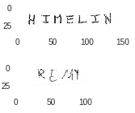

注意，在上图中，手写字符的长度各不相同，图像的尺寸不同，字符之间的间距各异，且图像的质量不同

在这一部分，我们将学习如何使用 CNN、RNN 和 CTC 损失函数结合起来进行手写示例的转录

# 准备就绪

我们将采用的手写示例转录策略如下：

+   下载包含手写文本图像的图像：

    +   在与该案例研究相关的 GitHub 代码文件中提供了多个包含手写文本图像的数据集

    +   确保在获得图像的同时，也获取了与图像对应的地面真值

+   将所有图像调整为相同的大小，比如 32 x 128 尺寸

+   在调整图像大小时，我们还应确保图像的纵横比没有被扭曲：

    +   这可以确保图像不会因为原始图像被调整为 32 x 128 尺寸而显得模糊不清

+   我们将调整图像大小，确保不扭曲纵横比，然后将每个图像叠加到不同的空白 32 x 128 图像上

+   反转图像的颜色，使背景为黑色，手写内容为白色

+   缩放图像，使其数值介于零和一之间

+   预处理输出（地面真值）：

    +   提取输出中的所有唯一字符

    +   为每个字符分配一个索引

    +   找到输出的最大长度，然后确保我们预测的时间步数超过输出的最大长度

    +   通过对地面真值进行填充，确保所有输出的长度相同

+   将处理过的图像通过 CNN 进行处理，以便我们提取出形状为 32 x 256 的特征

+   将从 CNN 中提取的特征传递到双向的 GRU 单元中，以便我们能够封装相邻时间步中的信息

+   每个时间步的 256 个特征作为该时间步的输入

+   将输出通过一个稠密层，该层的输出值与地面真值中的唯一字符总数相同（在 CTC 损失部分介绍中给出的示例中，填充值（**-**）也将是唯一字符之一——其中填充值 **-** 表示字符之间的空格，或图片空白部分的填充

+   在每个 32 个时间步中提取 softmax 及其对应的输出字符

# 如何实现...

以下代码中的前述算法如下执行（代码文件在 GitHub 上作为`Handwritten_text_recognition.ipynb`可用）：

1.  下载并导入数据集。该数据集包含手写文本的图像及其对应的地面真值（转录）。

1.  构建一个函数，调整图片大小而不扭曲其宽高比，并填充其余图片，使它们都具有相同的形状：

```py
def extract_img(img):
     target = np.ones((32,128))*255
     new_shape1 = 32/img.shape[0]
     new_shape2 = 128/img.shape[1]
     final_shape = min(new_shape1, new_shape2)
     new_x = int(img.shape[0]*final_shape)
     new_y = int(img.shape[1]*final_shape)
     img2 = cv2.resize(img, (new_y,new_x ))
     target[:new_x,:new_y] = img2[:,:,0]
     target[new_x:,new_y:]=255
     return 255-target
```

在前述代码中，我们创建了一个空白图片（名为 `target`）。在下一步中，我们已经重塑了图片以保持其宽高比。

最后，我们覆盖了我们创建的空白图片的重新缩放图片，并返回了背景为黑色的图片（255-target）。

1.  读取图片并将其存储在列表中，如下所示的代码中所示：

```py
filepath = '/content/words.txt'
f = open(filepath)
import cv2
count = 0
x = []
y = []
x_new = []
chars = set()
for line in f:
     if not line or line[0]=='#':
         continue
     try:
         lineSplit = line.strip().split(' ')
         fileNameSplit = lineSplit[0].split('-')
         img_path = '/content/'+fileNameSplit[0]+'/'+fileNameSplit[0] + '-' +              fileNameSplit[1]+'/'+lineSplit[0]+'.png'
         img_word = lineSplit[-1]
         img = cv2.imread(img_path)
         img2 = extract_img(img)
         x_new.append(img2)
         x.append(img)
         y.append(img_word)
         count+=1
     except:
         continue
```

在前述代码中，我们提取了每个图片，并根据我们定义的函数进行了修改。输入和不同场景的修改示例：

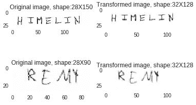

1.  提取输出中的唯一字符，如下所示：

```py
import itertools
list2d = y
charList = list(set(list(itertools.chain(*list2d))))
```

1.  创建输出地面真值，如下所示的代码中所示：

```py
num_images = 50000

import numpy as np
y2 = []
input_lengths = np.ones((num_images,1))*32
label_lengths = np.zeros((num_images,1))
for i in range(num_images):
     val = list(map(lambda x: charList.index(x), y[i]))
     while len(val)<32:
         val.append(79)
     y2.append(val)
     label_lengths[i] = len(y[i])
     input_lengths[i] = 32
```

在前述代码中，我们将每个字符的索引存储到一个列表中。此外，如果输出的大小少于 32 个字符，我们会用 79 进行填充，79 表示空白值。

最后，我们还存储标签长度（在地面真值中）和输入长度（始终为 32）。

1.  将输入和输出转换为 NumPy 数组，如下所示：

```py
x = np.asarray(x_new[:num_images])
y2 = np.asarray(y2)
x= x.reshape(x.shape[0], x.shape[1], x.shape[2],1)
```

1.  定义目标，如下所示：

```py
outputs = {'ctc': np.zeros([32])}
```

我们初始化 32 个零，因为批量大小将为 32。对于批量大小中的每个值，我们期望损失值为零。

1.  定义 CTC 损失函数如下：

```py
def ctc_loss(args):
     y_pred, labels, input_length, label_length = args
     return K.ctc_batch_cost(labels, y_pred, input_length, label_length)
```

前述功能将预测值、地面真值（标签）和输入、标签长度作为输入，并计算 CTC 损失值。

1.  定义模型，如下所示：

```py
input_data = Input(name='the_input', shape = (32, 128,1), dtype='float32')

inner = Conv2D(32, (3,3), padding='same')(input_data)
inner = Activation('relu')(inner)
inner = MaxPooling2D(pool_size=(2,2),name='max1')(inner)
inner = Conv2D(64, (3,3), padding='same')(inner)
inner = Activation('relu')(inner)
inner = MaxPooling2D(pool_size=(2,2),name='max2')(inner)
inner = Conv2D(128, (3,3), padding='same')(input_data)
inner = Activation('relu')(inner)
inner = MaxPooling2D(pool_size=(2,2),name='max3')(inner)
inner = Conv2D(128, (3,3), padding='same')(inner)
inner = Activation('relu')(inner)
inner = MaxPooling2D(pool_size=(2,2),name='max4')(inner)
inner = Conv2D(256, (3,3), padding='same')(inner)
inner = Activation('relu')(inner)
inner = MaxPooling2D(pool_size=(4,2),name='max5')(inner)
inner = Reshape(target_shape = ((32,256)), name='reshape')(inner)
```

在前述代码中，我们正在构建 CNN，将具有 32 x 128 形状的图片转换为具有 32 x 256 形状的图片：

```py
gru_1 = GRU(256, return_sequences = True, name = 'gru_1')(inner)
gru_2 = GRU(256, return_sequences = True, go_backwards = True, name = 'gru_2')(inner)
mix_1 = add([gru_1, gru_2])
gru_3 = GRU(256, return_sequences = True, name = 'gru_3')(inner)
gru_4 = GRU(256, return_sequences = True, go_backwards = True, name = 'gru_4')(inner)
```

到目前为止定义的模型的体系结构如下所示：

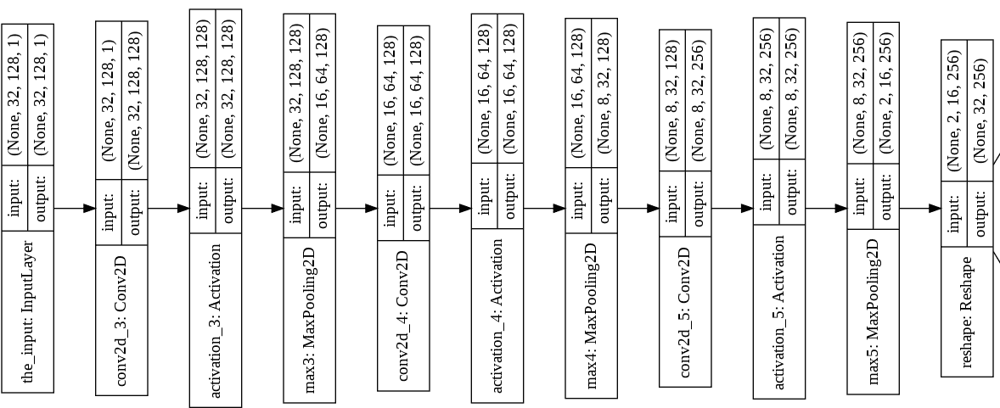

在前述代码中，我们将从 CNN 获取的特征传递到 GRU。如前面所示的定义的体系结构继续从所示的图形开始如下：

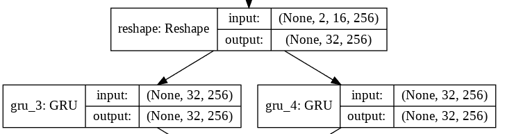

在下面的代码中，我们将两个 GRU 的输出进行拼接，从而同时考虑双向 GRU 和普通 GRU 生成的特征：

```py
merged = concatenate([gru_3, gru_4])
```

添加前面一层后的架构如下：

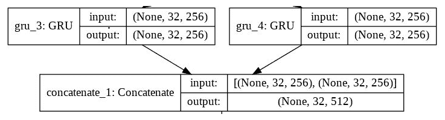

在下面的代码中，我们通过一个全连接层传递 GRU 输出的特征，并应用 softmax 得到 80 个可能值中的一个作为输出：

```py
dense = TimeDistributed(Dense(80))(merged)
y_pred = TimeDistributed(Activation('softmax', name='softmax'))(dense)
```

模型的架构继续如下：

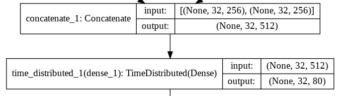

1.  初始化 CTC 损失所需的变量：

```py
from keras.optimizers import Adam
Optimizer = Adam()
labels = Input(name = 'the_labels', shape=[32], dtype='float32')
input_length = Input(name='input_length', shape=[1],dtype='int64')
label_length = Input(name='label_length',shape=[1],dtype='int64')
output = Lambda(ctc_loss, output_shape=(1,),name='ctc')([y_pred, labels, input_length, label_length])
```

在前面的代码中，我们提到 `y_pred`（预测的字符值）、实际标签、输入长度和标签长度是 CTC 损失函数的输入。

1.  按如下方式构建并编译模型：

```py
model = Model(inputs = [input_data, labels, input_length, label_length], outputs= output)
model.compile(loss={'ctc': lambda y_true, y_pred: y_pred}, optimizer = Optimizer)
```

请注意，我们传递给模型的输入有多个。CTC 计算如下：

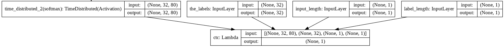

1.  创建以下输入和输出向量：

```py
x2 = 1-np.array(x_new[:num_images])/255
x2 = x2.reshape(x2.shape[0],x2.shape[1],x2.shape[2],1)
y2 = np.array(y2[:num_images])
input_lengths = input_lengths[:num_images]
label_lengths = label_lengths[:num_images]
```

1.  在多个批次的图片上拟合模型，代码如下所示：

```py
import random

for i in range(100):
     samp=random.sample(range(x2.shape[0]-100),32)
     x3=[x2[i] for i in samp]
     x3 = np.array(x3)
     y3 = [y2[i] for i in samp]
     y3 = np.array(y3)
     input_lengths2 = [input_lengths[i] for i in samp]
     label_lengths2 = [label_lengths[i] for i in samp]
     input_lengths2 = np.array(input_lengths2)
     label_lengths2 = np.array(label_lengths2)
     inputs = {
     'the_input': x3,
     'the_labels': y3,
     'input_length': input_lengths2,
     'label_length': label_lengths2,
     }
     outputs = {'ctc': np.zeros([32])}
     model.fit(inputs, outputs,batch_size = 32, epochs=1, verbose =2)
```

在前面的代码中，我们一次抽取 32 张图片，将它们转换为数组，并拟合模型以确保 CTC 损失为零。

请注意，我们排除了最后 100 张图片（在 `x2` 中），不将其作为输入传递给模型，以便测试模型在该数据上的准确性。

此外，我们多次遍历整个数据集，因为将所有图片加载到 RAM 并转换为数组很可能会导致系统崩溃，因为需要大量内存。

随着训练轮数的增加，训练损失如下所示：

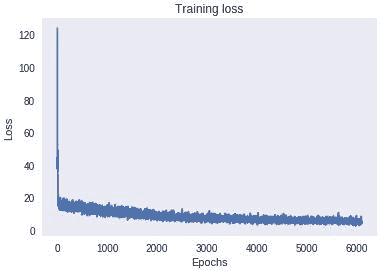

1.  使用以下代码预测测试图片在每个时间步的输出：

```py
model2 = Model(inputs = input_data, outputs = y_pred)
pred = model2.predict(x2[-5].reshape(1,32,128,1))

pred2 = np.argmax(pred[0,:],axis=1)
out = ""
for i in pred2:
  if(i==79):
    continue
  else:
    out += charList[i]
plt.imshow(x2[k].reshape(32,128))
plt.title('Predicted word: '+out)
plt.grid('off')
```

在前面的代码中，如果在某个时间步预测的字符是 79 号字符，我们将丢弃该输出：

测试示例及其对应的预测（标题中）如下：

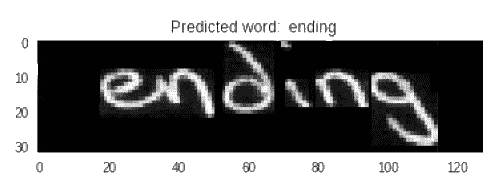

# 图像字幕生成

在之前的案例研究中，我们学习了如何将 CNN、RNN 和 CTC 损失一起使用，以转录手写数字。

在本案例研究中，我们将学习如何将 CNN 和 RNN 架构结合起来，以为给定图片生成字幕。

这里是图片的一个样本：

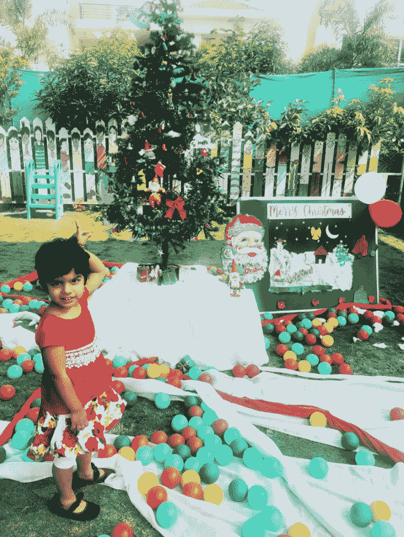

+   一位穿红色裙子的女孩，背景是圣诞树

+   一位女孩正在展示圣诞树

+   一位女孩正在公园里玩耍

+   一位女孩正在庆祝圣诞节

# 准备就绪

在本节中，让我们列出转录图片的策略：

+   我们将致力于通过处理一个包含图片和与之相关的描述的数据集，生成图片的字幕。包含图片及其对应字幕的数据集链接会在 GitHub 上的相关笔记本中提供。

+   我们将提取每张图片的 VGG16 特征。

+   我们还将对字幕文本进行预处理：

    +   将所有单词转换为小写

    +   移除标点符号

    +   为每个字幕添加开始和结束标记

+   只保留狗或女孩的图片（我们执行此分析仅仅是为了加速模型训练，因为即使使用 GPU，运行此模型也需要大约 5 小时）。

+   为字幕词汇表中的每个唯一单词分配索引。

+   填充所有字幕（每个单词由索引值表示），以确保所有字幕现在都是相同的大小。

+   为了预测第一个词，模型应将 VGG16 特征与开始标记的嵌入组合起来作为输入。

+   类似地，为了预测第二个词，模型将采用 VGG16 特征和开始标记及第一个词的嵌入组合。

+   以类似方式，我们继续获取所有预测的词。

+   我们继续执行前面的步骤，直到预测到结束标记。

# 如何实现...

我们将编写之前定义的策略，如下所示（代码文件可在 GitHub 上找到 `Image_captioning.ipynb`）：

1.  下载并导入一个包含图像及其相应字幕的数据集。推荐的数据集可在 GitHub 上找到。

1.  导入相关包，如下所示：

```py
import glob
from PIL import Image
import numpy as np
import matplotlib.pyplot as plt
%matplotlib inline
import pickle
from tqdm import tqdm
import pandas as pd
from keras.preprocessing import sequence
from keras.models import Sequential
from keras.layers import LSTM, Embedding, TimeDistributed, Dense, RepeatVector, merge, Activation, Flatten
from keras.optimizers import Adam, RMSprop
from keras.layers.wrappers import Bidirectional
from keras.applications.inception_v3 import InceptionV3
from keras.preprocessing import image
import nltk
```

1.  加载字幕数据集，如以下代码所示：

```py
caption_file = '...'
captions = open(caption_file, 'r').read().strip().split('\n')
d = {}
for i, row in enumerate(captions):
     row = row.split('\t')
     row[0] = row[0][:len(row[0])-2]
     if row[0] in d:
         d[row[0]].append(row[1])
     else:
         d[row[0]] = [row[1]]
total_images = list(d.keys())
```

1.  加载图片并存储 VGG16 特征：

```py
image_path = '...'
from keras.applications.vgg16 import VGG16
vgg16=VGG16(include_top=False, weights='imagenet', input_shape=(224,224,3))

import cv2
x = []
y = []
x2 = []
tot_images = ''
for i in range(len(d.keys())):
     for j in range(len(d[total_images[i]])):
         img_path = image_path+total_images[i]
         img = cv2.imread(img_path)
         try:
             img2 = cv2.resize(img, (224, 224))/255
             img3 = vgg16.predict(img2.reshape(1,224,224,3))
             x.append(img3)
             y.append(d[total_images[i]][j])
             tot_images = tot_images + ' '+total_images[i]
         except:
             continue
```

1.  将 VGG16 特征转换为 NumPy 数组：

```py
x = np.array(x)
x = x.reshape(x.shape[0],7,7,512)
```

1.  创建一个函数，移除字幕中的标点符号，并将所有单词转换为小写：

```py
def preprocess(text):
     text=text.lower()
     text=re.sub('[⁰-9a-zA-Z]+',' ',text)
     words = text.split()
     words2 = words
     words4=' '.join(words2)
     return(words4)
```

在以下代码中，我们预处理所有字幕并附加开始和结束标记：

```py
caps = []
for key, val in d.items():
     if(key in img_path2):
         for i in val:
             i = preprocess(i)
             caps.append('<start> ' + i + ' <end>')
```

1.  只附加属于儿童或狗的图片：

```py
caps2 = []
x2 = []
img_path3 = []
for i in range(len(caps)):
     if (('girl') in caps[i]):
         caps2.append(caps[i])
         x2.append(x[i])
         img_path2.append(img_path[i])
     elif 'dog' in caps[i]:
         caps2.append(caps[i])
         x2.append(x[i])
         img_path2.append(img_path[i])
     else:
         continue
```

1.  提取字幕中的所有唯一单词，如下所示：

```py
words = [i.split() for i in caps2]
unique = []
for i in words:
     unique.extend(i)
unique = list(set(unique))
vocab_size = len(unique)
```

1.  为词汇表中的单词分配索引，如以下代码所示：

```py
word2idx = {val:(index+1) for index, val in enumerate(unique)}
idx2word = {(index+1):val for index, val in enumerate(unique)}
```

1.  确定字幕的最大长度，以便我们将所有字幕填充到相同的长度：

```py
max_len = 0
for c in caps:
     c = c.split()
     if len(c) > max_len:
         max_len = len(c)
```

1.  将所有字幕填充到相同的长度，如下所示：

```py
n = np.zeros(vocab_size+1)
y = []
y2 = []
for k in range(len(caps2)):
     t= [word2idx[i] for i in caps2[k].split()]
     y.append(len(t))
     while(len(t)<max_len):
         t.append(word2idx['<end>'])
     y2.append(t)
```

1.  构建一个模型，该模型以图片为输入并从中创建特征：

```py
from keras.layers import Input
embedding_size = 300
inp = Input(shape=(7,7,512))
inp1 = Conv2D(512, (3,3), activation='relu')(inp)
inp11 = MaxPooling2D(pool_size=(2, 2))(inp1)
inp2 = Flatten()(inp11)
img_emb = Dense(embedding_size, activation='relu') (inp2)
img_emb2 = RepeatVector(max_len)(img_emb)
```

1.  构建一个模型，该模型以字幕为输入并从中创建特征：

```py
inp2 = Input(shape=(max_len,))
cap_emb = Embedding((vocab_size+1), embedding_size, input_length=max_len) (inp2)
cap_emb2 = LSTM(256, return_sequences=True)(cap_emb)
cap_emb3 = TimeDistributed(Dense(300)) (cap_emb2)
```

1.  将两个模型连接起来，并对所有可能的输出词进行 softmax 概率计算：

```py
final1 = concatenate([img_emb2, cap_emb3])
final2 = Bidirectional(LSTM(256, return_sequences=False))(final1)
final3 = Dense(vocab_size+1)(final2)
final4 = Activation('softmax')(final3)

final_model = Model([inp, inp2], final4)
```

1.  编译模型，如下所示：

```py
from keras.optimizers import Adam
adam = Adam(lr = 0.0001)
final_model.compile(loss='categorical_crossentropy', optimizer = adam, metrics=['accuracy'])
```

1.  拟合模型，如以下代码所示：

```py
for i in range(500):
     x3 = []
     x3_sent = []
     y3 = []
     shortlist_y = random.sample(range(len(y)-100),32)
     for j in range(len(shortlist_y)):
         for k in range(y[shortlist_y[j]]-1):
             n = np.zeros(vocab_size+1) 
             x3.append(x2[shortlist_y[j]])
             pad_sent = pad_sequences([y2[shortlist_y[j]][:(k+1)]], maxlen=max_len, padding='post')
             x3_sent.append(pad_sent)
             n[y2[shortlist_y[j]][(k+1)]] = 1
             y3.append(n)
             x3 = np.array(x3)
             x3_sent =np.array(x3_sent)
             x3_sent = x3_sent.reshape(x3_sent.shape[0], x3_sent.shape[2])
             y3 = np.array(y3) 
             final_model.fit([x3/12, x3_sent], y3, batch_size = 32, epochs = 3, verbose = 1)
```

在前面的代码中，我们以每次 32 张图片的速度遍历所有图片。此外，我们正在创建输入数据集，方式是将字幕中的前 `n` 个输出词与图片的 VGG16 特征一起作为输入，而相应的输出则是字幕中的第 *n+1^(th)* 个词。

此外，我们将 VGG16 特征（`x3`）除以 12，因为我们需要将输入值缩放到 0 到 1 之间。

1.  可以通过如下方式获取示例图片的输出字幕：

```py
l=-25
im_path = image_path+ img_path3[l]
img1 = cv2.imread(im_path)
plt.imshow(img1)
```

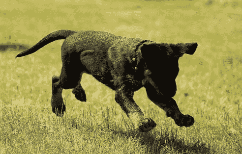

输出解码如下：

```py
p = np.zeros(max_len)
p[0] = word2idx['<start>']
for i in range(max_len-1):
     pred= final_model.predict([x33[l].reshape(1,7,7,512)/12, p.reshape(1,max_len)])
     pred2 = np.argmax(pred)
     print(idx2word[pred2])
     p[i+1] = pred2
     if(idx2word[pred2]=='<end>'):
         break
```

上述代码的输出如下：

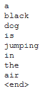

请注意，生成的字幕正确地检测到了狗是黑色的，并且正在跳跃。

# 生成字幕，使用束搜索

在前面关于字幕生成的部分，我们根据给定时间步中概率最高的单词进行了解码。在本节中，我们将通过使用束搜索来改进预测的字幕。

# 准备就绪

束搜索的工作原理如下：

+   提取第一时间步中各种单词的概率（其中 VGG16 特征和开始标记是输入）

+   我们不会仅提供最可能的单词作为输出，而是会考虑前三个最可能的单词。

+   我们将进入下一个时间步，在该时间步提取前三个字符

+   我们将循环遍历第一时间步的前三个预测，将其作为第二时间步预测的输入，并为每个可能的前三个输入预测提取前三个预测：

    +   假设`a`、`b`和`c`是第一时间步的前三个预测

    +   我们将使用`a`作为输入，并结合 VGG16 特征来预测第二时间步中最可能的三个字符，同样地，对于`b`和`c`也是如此。

    +   我们在第一时间步和第二时间步之间有九个输出组合。

    +   除了组合外，我们还将存储每个预测在所有九个组合中的置信度：

        +   例如：如果`a`在第一时间步的概率是 0.4，而`x`在第二时间步的概率是 0.5，那么组合的概率是 0.4 x 0.5 = 0.2

    +   我们将保留前三个组合，丢弃其他组合

+   我们将重复前一步骤，筛选出前三个组合，直到达到句子的结尾。

三的值是我们在搜索组合时所用的束长度。

# 如何做到...

在本节中，我们将编写之前讨论过的束搜索策略的代码（代码文件可在 GitHub 中的`Image_captioning.ipynb`找到）：

1.  定义一个函数，接受图片的 VGG16 特征作为输入，连同来自前一步时间步的单词序列及其相应的置信度，并返回当前时间步的前三个预测：

```py
beamsize = 3
def get_top3(img, string_with_conf):
     tokens, confidence = string_with_conf
     p = np.zeros((1, max_len))
     p[0, :len(tokens)] = np.array(tokens)
     pred = final_model.predict([img.reshape(1,7,7,512)/12, p])
     best_pred = list(np.argsort(pred)[0][-beamsize:])
     best_confs = list(pred[0,best_pred])
     top_best = [(tokens + list([best_pred[i]]), confidence*best_confs[i]) for i in range(beamsize)]
     return top_best
```

在前面的步骤中，我们将单词 ID 及其对应的置信度从`string_with_conf`参数中分离出来。此外，我们将令牌序列存储在数组中，并用它来进行预测。

在下一步中，我们提取下一个时间步的前三个预测，并将其存储在`best_pred`中。

此外，除了最好的单词 ID 预测，我们还会存储当前时间步内每个前三名预测的置信度。

最后，我们返回第二时间步的三个预测。

1.  在句子的最大可能长度范围内循环，并提取所有时间步中的前三个可能的单词组合：

```py
start_token = word2idx['<start>']
best_strings = [([start_token], 1)]
for i in range(max_len):
     new_best_strings = []
     for string in best_strings:
         strings = get_top3(x33[l], string)
         new_best_strings.extend(strings) 
         best_strings = sorted(new_best_strings, key=lambda x: x[1], reverse=True)[:beamsize]
```

1.  遍历之前获得的`best_strings`并打印输出：

```py
for i in range(3):
     string = best_strings[i][0]
     print('============')
     for j in string:
         print(idx2word[j])
         if(idx2word[j]=='<end>'):
             break
```

我们在上一节测试的相同图片的输出句子如下：

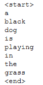  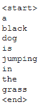  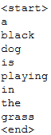

注意，在这个特定的案例中，第一句和第二句在“`jumping`”和“`playing`”这两个词上有所不同，而第三句恰好和第一句相同，因为组合的概率要高得多。
