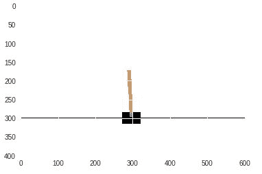
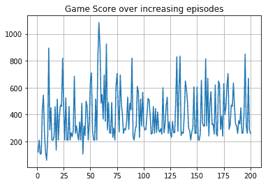

# 第十六章：强化学习

在前几章中，我们学习了将输入映射到目标—其中输入和输出值是已知的。在本章中，我们将学习强化学习，其中目标和操作环境是已知的，但没有输入或输出的映射。强化学习的工作原理是，我们通过开始时随机采取行动，逐步从生成的输入数据（状态中的行动）和输出数据（通过采取某些行动所获得的奖励）中学习，生成输入值（智能体的状态）和相应的输出值（智能体在状态中采取某些行动所获得的奖励）。

本章我们将覆盖以下内容：

+   在一个模拟游戏中采取的最佳行动，且奖励为非负值

+   在模拟游戏中的状态下采取的最佳行动

+   Q-learning 在玩《Frozen Lake》时最大化奖励

+   深度 Q 学习来平衡一个推车杆

+   深度 Q 学习来玩《Space Invaders》游戏

# 在一个模拟游戏中采取的最佳行动，且奖励为非负值

在本节中，我们将理解如何在模拟游戏中采取正确的行动。请注意，这个练习将主要帮助你掌握强化学习的工作原理。

# 准备工作

让我们定义一下我们在这个模拟环境中操作的环境。

你有三个盒子，两个玩家正在玩游戏。玩家 1 标记一个盒子为 1，玩家 2 标记一个盒子为 2。能够标记两个连续盒子的玩家获胜。

该游戏的空白棋盘如下所示：


对于我们刚刚定义的问题，只有玩家 1 有机会赢得游戏。玩家 1 赢得游戏的可能情境如下：


从问题设置中来看，玩家 1 获胜的直观方式是选择中间的盒子。这样，无论玩家 2 选择哪个盒子，玩家 1 都会在下一步获胜。

虽然对于玩家 1 来说，第一步是直观的，但在接下来的章节中，我们将学习一个智能体如何自动找出最佳的第一步行动。

我们将采取的策略来解决这个问题如下：

+   我们初始化一个空白棋盘

+   玩家 1 随机选择一个盒子

+   玩家 2 从剩下的两个盒子中随机选择一个

+   根据玩家 1 剩下的盒子，我们更新玩家 1 的奖励：

    +   如果玩家 1 能够在两个连续盒子中放置 1，他将成为赢家，并获得 1 的奖励

    +   否则，玩家 1 将获得 0 的奖励

+   重复前面的练习 100 次，每次进行游戏并为给定的动作序列存储奖励

+   现在，我们将继续计算各种第一步行动的平均奖励

+   在第一次移动中选择的框，经过 100 次迭代后，具有最高平均奖励的是玩家 1 的最佳首次行动。

# 如何操作...

上述策略的代码如下（代码文件可在 GitHub 上的`Finding_optimal_policy.ipynb`找到）：

1.  定义游戏环境和执行游戏的函数：

```py
def play_game():
     empty_board = [0,0,0]
     move = []
     for step in range(3):
         index_to_choose = [i for i,j in enumerate(empty_board) if j==0]
         samp = random.sample(range(len(index_to_choose)), 1)[0] 
         if(step%2==0):
             empty_board[index_to_choose[samp]]=1
             move.append(index_to_choose[samp])
         else:
             empty_board[index_to_choose[samp]]=2 
     return(reward(empty_board), move[0])
```

在前面的代码中，我们初始化了一个空的棋盘，所有单元格值为零，并进行了一次名为`samp`的随机移动。玩家 1 先行，然后是玩家 2，接着是玩家 1。我们以这种方式填充空棋盘。

1.  定义一个函数来计算游戏结束时的奖励：

```py
def reward(empty_board):
     reward = 0
     if((empty_board[0]==1 & empty_board[1]==1) | (empty_board[1]==1 & empty_board[2]==1)):
         reward = 1
     else:
         reward = 0
     return reward
```

1.  玩游戏`100`次：

```py
rew = []
step = []
for i in range(100):
     r, move = play_game()
     rew.append(r)
     step.append(move) 
```

1.  计算选择某一首次行动的奖励：

```py
sub_list = [i for i,j in enumerate(step) if j==1]
final_reward = 0
count = 0
for i in sub_list:
     final_reward += rew[i]
     count+=1
final_reward/count
```

当你对多种首次行动选项重复运行前面的代码时，你会注意到当占据第二个方格时，平均奖励最高。

# 在模拟游戏中，状态下采取的最佳行动

在前面的场景中，我们考虑了一个简化的情况，即当目标达成时会获得奖励。在此场景中，我们将通过引入负奖励来使游戏更加复杂。然而，目标仍然不变：在给定环境中最大化奖励，该环境同时包含正奖励和负奖励。

# 准备就绪

我们正在处理的环境如下：


我们从包含`S`的单元格开始，目标是到达奖励为**+1**的单元格。为了最大化获得奖励的机会，我们将使用贝尔曼方程来计算前面网格中每个单元格的值，如下所示：

*当前单元格的值 = 从当前单元格移动到下一个单元格的奖励 + 折扣因子 * 下一个单元格的值*

此外，在当前问题中，除了奖励为**+1**的单元格外，移动到任何其他单元格的奖励都是`0`。

折扣因子可以被视为从一个单元格移动到另一个单元格时所消耗的能量。因此，在当前问题设置中，远离奖励单元格的单元格值较低。

一旦我们计算出每个单元格的值，我们就会移动到具有所有可能移动的单元格中最高值的单元格。

我们将采用的计算每个单元格值的策略如下：

+   初始化一个空棋盘。

+   定义代理在一个单元格内可能采取的行动。

+   定义代理在当前单元格内采取行动时所处的状态。

+   计算当前状态的值，该值依赖于移到下一个状态的奖励以及下一个状态的值。

+   基于之前的计算，更新当前状态的单元格值。

+   此外，存储当前状态下采取的行动，以便移动到下一个状态。

+   请注意，在初期迭代中，距离终点较远的格子的值保持为零，而与终点相邻的格子的值则上升。

+   随着我们多次迭代前面的步骤，我们将能够更新格子的值，从而决定代理应该遵循的最优路径。

# 如何做到这一点...

在本节中，我们将编写在前一节中规划的策略（代码文件在 GitHub 上的`Finding_optimal_policy.ipynb`中可以找到）：

1.  初始化一个空的棋盘：

```py
empty_board = [[0,0,0]
             ,[0,0,1]]
```

1.  定义在不同状态下可以采取的行动——其中`D`代表向下移动，`R`代表向右，`L`代表向左，`U`代表向上：

```py
state_actions = {(0,0):('D','R')
                 ,(0,1):('D','R','L')
                 ,(0,2):('D','L')
                 ,(1,0):('U','R')
                 ,(1,1):('L','U','R') 
                 }
```

1.  定义一个函数，根据当前状态和在当前状态下采取的行动来提取下一个状态：

```py
def get_next_state(curr_state, action):
     i,j = curr_state
     if action=='D':
         i = i+1
     elif action=='U':
         i = i-1
     elif action=='R':
         j = j+1
     elif action=='L':
         j = j-1
     else:
         print('unk')
     return((i,j))
```

1.  初始化列表，用于附加状态、行动和奖励：

```py
curr_state = (0,0)
state_action_reward = []
state = []
state_action = []
```

1.  在一个回合中最多执行 100 次行动（一个回合是游戏的一次实例），在每个格子（状态）中随机采取行动，并根据移动到下一个状态的奖励以及下一个状态的值来计算当前状态的值。

重复以上练习`100`次迭代（回合/游戏），并计算每个格子的值：

```py
for m in range(100):
     curr_state = (0,0)
     for k in range(100):
         reward = 0
         action = state_actions[curr_state][random.sample(range(len(state_actions[curr_state])),1)[0]]
         next_state = get_next_state(curr_state, action)
```

在前面的代码中，我们在一个状态中采取随机行动，然后计算该行动对应的下一个状态：

```py
        state.append(curr_state)
        empty_board[curr_state[0]][curr_state[1]] = reward + empty_board[next_state[0]][next_state[1]]*0.9 
        empty_board[curr_state[0]][curr_state[1]])
```

在前面的代码中，我们正在更新一个状态的值：

```py
        curr_state = next_state
        state_action.append(action)

        if(next_state==(1,2)):
             reward+=1
             break
```

前面的结果在所有格子中的最终状态值如下：


根据前面的输出，代理可以在游戏开始时采取右侧的行动或向下的行动（代理从左上角开始）。然而，如果代理在第一步采取向下的行动，那么在下一步它更适合采取*向右*的行动，因为右侧的状态值高于当前状态上方的状态值。

# 还有更多...

假设环境（各个格子及其对应的奖励）如下所示：


在不同状态下可以采取的行动如下：

```py
state_actions = {(0,0):('D','R')
                 ,(0,1):('D','R')
                 ,(1,0):('R')
                 ,(1,1):('R') 
                 }
```

在多次游戏迭代后，各个格子的状态值如下所示：


从前面的结果来看，我们可以看到，代理在左上角采取向下的行动要比向右移动更好，因为下方格子的状态值高于起始格子上方的状态值。

# 使用 Q 学习最大化 Frozen Lake 游戏中的奖励

到目前为止，在前面的章节中，我们一直在给定的状态下采取随机行动。此外，我们还通过代码定义了环境，并计算了每一步的下一个状态、行动和奖励。在本节中，我们将利用 OpenAI 的 Gym 包来在 Frozen Lake 环境中进行导航。

# 准备就绪

冻结湖环境如下所示：


代理从`S`状态开始，目标是通过尽量避开`H`状态，最终到达`G`状态。

在前面的环境中，代理可以处于 16 个可能的状态中。此外，代理可以采取四个可能的动作（向上、向下、向右或向左）。

我们将定义一个 q 表格，其中有 16 行对应 16 种状态，4 列对应每种状态下可以采取的四个动作。

在上一节中，我们学习到：

*在一个状态下采取的动作的价值 = 奖励 + 折扣因子 * 下一个状态中采取的最佳可能动作的价值*

我们将修改前面的公式如下：

*在一个状态下采取的动作的价值 = 在该状态下采取的动作的价值 + 1 * (奖励 + 折扣因子 * 下一个状态中采取的最佳可能动作的价值 - 在该状态下采取的动作的价值)*

最后，我们将把 1 替换为学习率，这样状态中动作的值更新就不会发生剧烈变化。这类似于神经网络中使用学习率的效果。

*在一个状态下采取的动作的价值 = 在该状态下采取的动作的价值 + 学习率 * (奖励 + 折扣因子 * 下一个状态中采取的最佳可能动作的价值 - 在该状态下采取的动作的价值)*

根据前面的内容，我们现在可以更新 q 表格，以便能够识别在不同状态下可以采取的最佳动作。

我们将采用以下策略来解决这个案例研究：

+   在 OpenAI 的 Gym 中注册环境

+   初始化一个零数组 q 表格，形状为 16 x 4

+   在选择给定状态下的动作时，采用探索与利用的平衡方法：

    +   到目前为止，我们仅仅是探索了可能的整体动作，因为我们在给定状态下随机选择了一个动作。

    +   在本节中，我们将探索初始的几次迭代，因为我们在游戏的前几个回合中并不确定应该采取的最佳动作。

    +   然而，随着我们对游戏了解的深入，我们将利用已经学到的关于可能采取的动作的知识，同时仍然会随机采取一些动作（随着回合数的增加，随机动作的频率会逐渐减少）。

+   在每一回合中：

    +   根据我们是尝试探索还是利用，选择一个动作

    +   确定新的状态和奖励，并检查通过采取上一步选择的动作，游戏是否结束

    +   初始化学习率参数和折扣因子

    +   使用前面讨论的公式，通过更新 q 表格中在某一状态下采取的前一个动作的价值

    +   重复前面的步骤，直到游戏结束

+   此外，重复前面的步骤，进行 1,000 场不同的游戏

+   查看 q 表格，找出在给定状态下应采取的最佳动作

+   根据 q 表格绘制代理在状态中采取动作的路径

# 如何实现……

在这一部分，我们将编写我们之前讨论的策略（代码文件在 GitHub 上作为`Frozen_Lake_with_Q_Learning.ipynb`提供）：

1.  导入相关包：

```py
import gym
from gym import envs
from gym.envs.registration import register
```

Gym 是一个开发和比较强化学习算法的工具包。它支持教智能体从行走到玩游戏（如 Pong 和 Pinball）等所有任务。

更多关于 Gym 的信息可以在这里找到：[`gym.openai.com/`](https://gym.openai.com/)。

1.  注册环境：

```py
register(
 id = 'FrozenLakeNotSlippery-v1',
 entry_point = 'gym.envs.toy_text:FrozenLakeEnv',
 kwargs = {'map_name': '4x4', 'is_slippery':False},
 max_episode_steps = 100,
 reward_threshold = 0.8196)
```

1.  创建环境：

```py
env = gym.make('FrozenLakeNotSlippery-v1')
```

1.  检查创建的环境：

```py
env.render()
```


上述步骤呈现（打印）环境：

```py
env.observation_space
```

上述代码提供了环境中的状态-动作对的数量。在我们的例子中，考虑到它是一个 4x4 的网格，我们总共有 16 个状态。因此，我们有 16 个观察。

```py
env.action_space.n
```

上述代码定义了在环境中可以在某个状态下执行的动作数量：

```py
env.action_space.sample()
```

上述代码从可能的动作集合中采样一个动作：

```py
env.step(action)
```

上述代码执行动作并生成新的状态和该动作的奖励，标记游戏是否结束，并为步骤提供附加信息：

```py
env.reset()
```

上述代码重置了环境，使得智能体回到起始状态。

1.  初始化 q 表：

```py
import numpy as np
qtable = np.zeros((16,4))
```

我们将其初始化为(16, 4)的形状，因为有 16 个状态，每个状态有 4 个可能的动作。

1.  运行多个游戏回合：

初始化超参数：

```py
total_episodes=15000
learning_rate=0.8
max_steps=99
gamma=0.95
epsilon=1
max_epsilon=1
min_epsilon=0.01
decay_rate=0.005
```

玩多个游戏回合：

```py
rewards=[]
for episode in range(total_episodes):
    state=env.reset()
    step=0
    done=False
    total_rewards=0
```

在下面的代码中，我们定义了要采取的动作。如果`eps`（它是一个在 0 到 1 之间生成的随机数）小于 0.5，我们进行探索；否则，我们进行利用（即考虑 q 表中的最佳动作）

```py
    for step in range(max_steps):
        exp_exp_tradeoff=random.uniform(0,1)        
        ## Exploitation:
        if exp_exp_tradeoff>epsilon:
            action=np.argmax(qtable[state,:])
        else:
            ## Exploration
            action=env.action_space.sample()
```

在下面的代码中，我们获取新的状态和奖励，并通过在给定步骤中采取动作来标记游戏是否结束：

```py
        new_state, reward, done, _ = env.step(action)
```

在下面的代码中，我们根据在某个状态下采取的动作更新 q 表。此外，我们还在当前状态下采取动作后，使用新状态更新状态：

```py
        qtable[state,action]=qtable[state,action]+learning_rate*(reward+gamma*np.max(qtable[new_state,:])-qtable[state,action])
        total_rewards+=reward
        state=new_state
```

在以下代码中，由于游戏已结束，我们将继续进行新的游戏回合。然而，我们确保更新随机性因子（`eps`），该因子用于决定我们是进行探索还是利用。

```py
        if(done):
             break
        epsilon=min_epsilon+(max_epsilon-min_epsilon)*np.exp(decay_rate*episode)
        rewards.append(total_rewards)
```

1.  一旦我们构建了 q 表，我们现在就可以部署智能体，让其根据 q 表建议的最优动作来操作：

```py
env.reset()

for episode in range(1):
    state=env.reset()
    step=0
    done=False
    print("-----------------------")
    print("Episode",episode)
    for step in range(max_steps):
        env.render()
        action=np.argmax(qtable[state,:])
        print(action)
        new_state,reward,done,info=env.step(action)

        if done:
            #env.render()
            print("Number of Steps",step+1)
            break
        state=new_state
```

上述代码给出了智能体必须经过的最优路径，以到达最终目标。

# 深度 Q 学习平衡推车杆

在之前的部分，我们学习了如何基于 q 表的值采取行动。然而，得到最优值是一个耗时的过程，因为智能体需要多次游戏才能得到最优的 q 表。

在这一部分，我们将学习如何使用神经网络，这样我们就能比使用 Q 学习时更快地得到最优值。

# 准备工作

对于这个练习，我们将注册一个推车-杆环境，可能的行动是向右或向左移动，以保持杆的平衡。此外，推车的位置、推车速度、杆的角度和杆尖端的速度是我们关于状态的信息。

游戏的规则可以在此找到：[`gym.openai.com/envs/CartPole-v1/`](https://gym.openai.com/envs/CartPole-v1/)。

杆通过一个不带驱动的关节连接到推车上，推车沿着一个无摩擦的轨道移动。该系统通过对推车施加+1 或-1 的力量来控制。摆杆从直立开始，目标是防止其倒下。每当杆保持直立时，都会提供+1 的奖励。当杆与竖直方向的夹角超过 15 度，或者推车离中心超过 2.4 个单位时，回合结束。

为了平衡推车-杆，我们将采用与上一部分相同的策略。然而，深度 Q 学习的不同之处在于，我们将使用神经网络来帮助我们预测代理需要采取的最佳行动。

我们训练神经网络的方式如下：

+   我们将存储状态值、所采取的行动和获得的奖励的信息：

    +   如果游戏没有结束（未结束），奖励为 1，否则为 0。

+   初始时，模型基于随机初始化的权重进行预测，其中模型的输出层有两个节点，分别对应两个可能行动的新状态值。

+   新状态值将基于最大化新状态值的行动。

+   如果游戏未结束，我们将通过当前状态的奖励与新状态的最大状态值和折扣因子的乘积之和来更新当前状态的值。

+   我们现在将覆盖先前获得的更新后的当前状态值来更新行动的值：

    +   如果当前步骤采取的行动是错误的（即游戏结束），那么当前状态下该行动的值为 0。

    +   否则，当前步骤中目标的值为正数。

    +   这样，我们让模型自己找出该采取的正确行动。

    +   此外，我们可以认为当奖励为零时，行动是错误的。然而，由于我们无法确定当奖励为 1 时它是否为正确行动，因此我们只更新我们采取的行动，并保持新状态的值（如果我们采取另一个行动）不变。

+   我们将状态值附加到输入数组，并且将采取某个行动时在当前状态下的值作为输出数组。

+   我们拟合模型，最小化前述数据点的均方误差。

+   最后，我们在逐渐增加的回合数中不断减少探索。

# 如何做到这一点...

我们将按如下方式编码我们之前讨论的策略（代码文件可在 GitHub 的`Deep_Q_learning_to_balance_a_cart_pole.ipynb`中找到）：

1.  创建环境并将动作大小和状态大小存储在变量中：

```py
import gym 
env = gym.make('CartPole-v0') 
state_size = env.observation_space.shape[0] 
action_size = env.action_space.n
```

一个倒立摆环境如下所示：



1.  导入相关的包：

```py
import numpy as np
import random
from keras.models import Sequential
from keras.layers import Dense
from keras.optimizers import Adam
from collections import deque
```

1.  定义模型：

```py
model=Sequential()
model.add(Dense(24,input_dim=state_size,activation='relu'))
model.add(Dense(24,activation='relu'))
model.add(Dense(2,activation='linear'))
model.compile(loss='mse',optimizer=Adam(lr=0.01))
```

1.  定义需要附加的列表：

```py
memory = deque(maxlen=2000)
gamma = 0.95 # discount rate
epsilon = 1.0 # exploration rate
epsilon_min = 0.01
epsilon_decay = 0.995
done = False
batch_size=32
```

1.  定义一个函数来重玩游戏：

```py
def replay(model, batch_size,epsilon):
    epsilon_min = 0.01
    epsilon_decay = 0.995
    minibatch = random.sample(memory, batch_size)
    for state, action, reward, next_state, done in minibatch:
        target = reward
        if not done:
            target = (reward + gamma *np.amax(model.predict(next_state)[0]))
        new_action_value = model.predict(state)
        new_action_value[0][action] = target
        model.fit(state,new_action_value, epochs=1, verbose=0)
    if epsilon > epsilon_min:
        epsilon *= epsilon_decay
    return model,epsilon
```

在前面的代码中，我们定义了一个函数，该函数接收神经网络模型、批次大小和 epsilon（表示我们是探索还是开发的参数）。我们获取一个大小为`batch_size`的随机样本。请注意，你将在下一步了解记忆结构（包括状态、动作、奖励和`next_state`）。如果游戏未结束，我们将更新采取的动作的奖励；否则，目标奖励将为 0（因为游戏结束时奖励为 0）。

此外，模型预测采取某个动作的价值（因为模型在输出层有 2 个节点，每个节点分别输出采取其中一个动作的结果）。该函数返回更新后的模型和探索/开发系数（epsilon）。

1.  在多个回合中玩游戏，并附加代理获得的得分。此外，确保代理采取的行动是根据 epsilon 值由模型决定的：

```py
episodes=200
maxsteps=200
score_list = []
for e in range(episodes):
    state = env.reset()
    state = np.reshape(state, [1, state_size])
```

在前面的代码中，我们总共进行了 200 个回合的游戏，并且在每回合开始时重置环境。此外，我们将状态重塑，以便可以传递给神经网络模型：

```py
    for step in range(maxsteps):
        if np.random.rand()<=epsilon:
            action=env.action_space.sample()
        else:
            action = np.argmax(model.predict(state)[0])
```

在前面的步骤中，我们根据探索参数（epsilon）采取行动，在某些情况下我们采取随机行动（`env.actionspace.sample()`），而在其他情况下，我们利用模型的预测：

```py
        next_state, reward, done, _ = env.step(action)
        reward = reward if not done else -10
        next_state = np.reshape(next_state, [1, state_size])
        memory.append((state, action, reward, next_state, done))
```

在前面的步骤中，我们执行了一个动作并提取了下一个状态、奖励以及游戏是否结束的信息。此外，如果游戏结束，我们将奖励值重置为-10（这意味着代理做出了错误的动作）。进一步地，我们提取下一个状态并将其附加到记忆中。这样，我们为模型创建了一个数据集，模型利用当前状态和奖励计算两个可能动作之一的奖励：

```py
        state = next_state
        if done:
          print("episode: {}/{}, score: {}, exp prob: {:.2}".format(e, episodes, step, epsilon))
          score_list.append(step)
          break
        if len(memory) > batch_size:
          model,epsilon=replay(model, batch_size,epsilon)
```

在前面的代码中，如果游戏结束，我们将得分（游戏过程中采取的步数）附加到列表中；否则，我们更新模型。此外，只有当内存中的数据点数量达到预定义的批次大小时，我们才会更新模型。

随着训练轮数增加，得分的变化如下所示：


# 使用深度 Q 学习来玩 Space Invaders 游戏

在上一节中，我们使用深度 Q 学习来玩倒立摆游戏。在本节中，我们将利用深度 Q 学习来玩 Space Invaders，这是一个比倒立摆更复杂的环境。

Space Invaders 游戏的截图如下所示：


来源： [`gym.openai.com/envs/SpaceInvaders-v0/`](https://gym.openai.com/envs/SpaceInvaders-v0/)

这个练习的目标是最大化单场游戏中获得的分数。

# 准备开始

我们将采用的策略是构建一个能够最大化分数的智能体，具体如下：

+   初始化*Space Invaders-Atari2600*游戏环境。

+   对图像帧进行预处理：

    +   移除那些不一定会影响动作预测的像素。

        +   例如，玩家位置下方的像素

    +   规范化输入图像。

    +   在将图像传递给神经网络模型之前调整图像大小

+   按照 Gym 环境的要求堆叠帧

+   让智能体在多个回合中玩游戏：

    +   在初期回合中，我们会有较高的探索度，而随着回合的增加，探索度逐渐衰减。

    +   在某一状态下需要采取的动作取决于探索系数的值。

    +   将游戏状态和对应的奖励（基于在该状态下采取的动作）存储在记忆中。

    +   根据前几个回合获得的奖励来更新模型。

# 如何实现...

我们之前讨论的策略编码如下：

1.  下载包含《太空入侵者》游戏的 ROM，并安装`retro`包：

```py
$ wget http://www.atarimania.com/roms/Roms.rar && unrar x Roms.rar && unzip Roms/ROMS.zip
$ pip3 install gym-retro
$ python3 -m retro.import ROMS/
```

1.  创建环境并提取观察空间：

```py
env=retro.make(game='SpaceInvaders-Atari2600')
env.observation_space
# Box(210,160,3)
```

1.  构建一个处理帧（图像/《太空入侵者》游戏的截图）预处理的函数：

```py
def preprocess_frame(frame):
     # Greyscale frame 
     gray = rgb2gray(frame)
     # Crop the screen (remove the part below the player)
     # [Up: Down, Left: right]
     cropped_frame = gray[8:-12,4:-12]
     # Normalize Pixel Values
     normalized_frame = cropped_frame/255.0
     # Resize
     preprocessed_frame = transform.resize(normalized_frame, [110,84])
     return preprocessed_frame 
```

1.  构建一个根据状态堆叠帧的函数：

```py
stack_size = 4 # We stack 4 frames
# Initialize deque with zero-images one array for each image
stacked_frames = deque([np.zeros((110,84), dtype=np.int) for i in range(stack_size)], maxlen=4)
def stack_frames(stacked_frames, state, is_new_episode):
     # Preprocess frame
     frame = preprocess_frame(state) 
     if is_new_episode:
         # Clear our stacked_frames
         stacked_frames = deque([np.zeros((110,84), dtype=np.int) for i in range(stack_size)], maxlen=4) 
         # Because we're in a new episode, copy the same frame 4x
         stacked_frames.append(frame)
         stacked_frames.append(frame)
         stacked_frames.append(frame)
         stacked_frames.append(frame) 
         # Stack the frames
         stacked_state = np.stack(stacked_frames, axis=2) 
     else:
         # Append frame to deque, automatically removes the oldest frame
         stacked_frames.append(frame)
         # Build the stacked state (first dimension specifies different frames)
         stacked_state = np.stack(stacked_frames, axis=2) 
     return stacked_state, stacked_frames
```

1.  初始化模型的超参数：

```py
### MODEL HYPERPARAMETERS
state_size = [110, 84, 4] # Our input is a stack of 4 frames hence 110x84x4 (Width, height, channels) 
action_size = env.action_space.n # 8 possible actions
learning_rate = 0.00025 # Alpha (aka learning rate)
```

```py
### TRAINING HYPERPARAMETERS
total_episodes = 50 # Total episodes for training
max_steps = 50000 # Max possible steps in an episode
batch_size = 32 # Batch size
```

```py
# Exploration parameters for epsilon greedy strategy
explore_start = 1.0 # exploration probability at start
explore_stop = 0.01 # minimum exploration probability 
decay_rate = 0.00001 # exponential decay rate for exploration prob
```

```py
# Q learning hyperparameters
gamma = 0.9 # Discounting rate
```

```py
### MEMORY HYPERPARAMETERS
pretrain_length = batch_size # Number of experiences stored in the Memory when initialized for the first time
memory_size = 1000000 # Number of experiences the Memory can keep
```

```py
### PREPROCESSING HYPERPARAMETERS
stack_size = 4 # Number of frames stacked
```

```py
### MODIFY THIS TO FALSE IF YOU JUST WANT TO SEE THE TRAINED AGENT
training = False
```

```py
## TURN THIS TO TRUE IF YOU WANT TO RENDER THE ENVIRONMENT
episode_render = False
```

1.  构建一个从总记忆中采样数据的函数：

```py
memory = deque(maxlen=100000)
```

```py
def sample(memory, batch_size):
     buffer_size = len(memory)
     index = np.random.choice(np.arange(buffer_size),
     size = batch_size,
     replace = False) 
     return [memory[i] for i in index]
```

1.  构建一个返回智能体需要采取的动作的函数：

```py
def predict_action(model,explore_start, explore_stop, decay_rate, decay_step, state, actions):
     exp_exp_tradeoff = np.random.rand()
     explore_probability = explore_stop + (explore_start - explore_stop) * np.exp(-decay_rate * decay_step)
     if (explore_probability > exp_exp_tradeoff):
         choice = random.randint(1,len(possible_actions))-1
         action = possible_actions[choice]
     else:
         Qs = model.predict(state.reshape((1, *state.shape)))
         choice = np.argmax(Qs)
         action = possible_actions[choice]
     return action, explore_probability
```

1.  构建一个微调模型的函数：

```py
def replay(agent,batch_size,memory):
     minibatch = sample(memory,batch_size)
     for state, action, reward, next_state, done in minibatch:
     target = reward
     if not done:
         target = reward + gamma*np.max(agent.predict(next_state.reshape((1,*next_state.shape)))[0])
     target_f = agent.predict(state.reshape((1,*state.shape)))
     target_f[0][action] = target
     agent.fit(state.reshape((1,*state.shape)), target_f, epochs=1, verbose=0)
 return agent
```

1.  定义神经网络模型：

```py
def DQNetwork():
     model=Sequential()
     model.add(Convolution2D(32,input_shape=(110,84,4),kernel_size=8, strides=4, padding='valid',activation='elu'))
     model.add(Convolution2D(64, kernel_size=4, strides=2, padding='valid',activation='elu'))
     model.add(Convolution2D(128, kernel_size=3, strides=2, padding='valid',activation='elu'))
     model.add(Flatten())
     model.add(Dense(units=512))
     model.add(Dense(units=3,activation='softmax'))
     model.compile(optimizer=Adam(0.01),loss='mse')
     return model
```

模型的总结如下：


1.  循环多个回合并持续玩游戏，同时更新模型：

```py
agent = DQNetwork()
agent.summary()
rewards_list=[]
Episodes=200
# Iterate the game
for episode in range(Episodes):
     # reset state in the beginning of each game
     step = 0
     decay_step = 0
     episode_rewards = []
     state = env.reset()
     state, stacked_frames = stack_frames(stacked_frames, state, True)
     while step < max_steps:
         step += 1
         decay_step +=1
         # Predict the action to take and take it
         action, explore_probability = predict_action(agent,explore_start, explore_stop, decay_rate, decay_step, state, possible_actions)
 #Perform the action and get the next_state, reward, and done information
         next_state, reward, done, _ = env.step(action)
         # Add the reward to total reward
         episode_rewards.append(reward)
     if done:
 # The episode ends so no next state
         next_state = np.zeros((110,84), dtype=np.int)
         next_state, stacked_frames = stack_frames(stacked_frames, next_state, False)
 # Set step = max_steps to end the episode
         step = max_steps
 # Get the total reward of the episode
         total_reward = np.sum(episode_rewards)
         print('Episode:{}/{} Score:{} Explore Prob:{}'.format(episode,Episodes,total_reward,explore_probability))
         rewards_list.append((episode, total_reward))
 # Store transition <st,at,rt+1,st+1> in memory D
         memory.append((state, action, reward, next_state, done))
     else:
 # Stack the frame of the next_state
         next_state, stacked_frames = stack_frames(stacked_frames, next_state, False)
 # Add experience to memory
         memory.append((state, action, reward, next_state, done))
 # st+1 is now our current state
         state = next_state
     env.render() 
 # train the agent with the experience of the episode
 agent=replay(agent,batch_size,memory)
```

1.  绘制随着回合增加获得的奖励：

```py
score=[]
episode=[]
for e,r in rewards_list:
     episode.append(e)
     score.append(r)
import matplotlib.pyplot as plt
plt.plot(episode,score)
```



从中可以看出，模型已经学会在某些回合中得分超过 800 分。
