# 第二章：让神经网络学习

现在你已经了解了神经网络，是时候学习它们的 学习过程了。在本章中，我们将探讨神经网络学习所涉及的概念，以及它们在Java中的实现。我们将回顾神经网络学习过程的基础和灵感，这将指导我们在Java中实现学习算法，并将其应用于我们的神经网络代码。总的来说，本章涉及以下概念：

+   学习能力

+   学习如何帮助

+   学习范式

+   监督学习

+   无监督学习

+   学习过程

+   优化基础

+   成本函数

+   错误度量

+   学习算法

+   Δ规则

+   赫布规则

+   Adaline/感知器

+   训练、测试和验证

+   数据集拆分

+   过拟合和过训练

+   泛化

# 神经网络的学习能力

神经网络中真正令人惊叹的是它们从环境中学习的能力，就像天赋异禀的生物能够做到的那样。作为人类，我们通过观察和重复来体验学习过程，直到某个任务或概念完全掌握。从生理学的角度来看，人脑中的学习过程是节点（神经元）之间神经连接的重新配置，这导致了一种新的思维结构。

虽然神经网络连接的本质将学习过程分布在整个结构中，但这一特性使得该结构足够灵活，可以学习各种知识。与只能执行它们被编程执行的任务的普通数字计算机不同，神经网络能够根据某些满意标准改进和执行新的活动。换句话说，神经网络不需要被编程；它们通过自己学习程序。 

## 学习如何帮助解决问题

考虑到每个要解决的问题可能有大量的理论上的可能解决方案，学习过程旨在找到一种最优解，以产生令人满意的结果。由于它们能够通过接收输入刺激（即与任务/问题相关的数据）严格地获取任何类型的知识，因此鼓励使用诸如**人工神经网络**（**ANN**）之类的结构。最初，ANN将产生一个随机结果和一个错误，然后基于这个错误，ANN参数进行调整。

### 小贴士

我们可以将ANN参数（权重）视为解决方案的组成部分。让我们想象每个权重对应一个维度，一个单一的解决方案代表了解决超空间中的一个点。对于每个单一的解决方案，都有一个误差度量，它告知该解决方案距离满意标准的距离。学习算法随后迭代地寻找一个更接近满意标准的解决方案。

# 学习范式

神经网络基本上有两种学习类型，即监督学习和无监督学习。例如，人类大脑中的学习也是这样进行的。我们能够从观察中构建知识，而不需要目标（无监督）或者我们可以有一个老师向我们展示正确的模式来遵循（监督）。这两种范式之间的区别主要在于目标模式的相关性，并且因问题而异。

## 监督学习

这种学习类型处理的是*xs*（独立值）和*ys*（依赖值）的成对，目标是将它们映射到一个函数中。在这里，Y数据是*监督者*，即期望的输出目标，而X是生成Y数据的源独立数据。这类似于一个正在教授某人执行特定任务的老师：

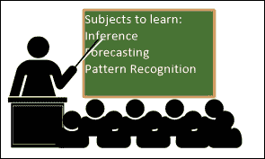

这种学习范式的一个特定特征是存在一个直接的错误参考，即目标与当前实际结果之间的比较。网络参数被输入到一个成本函数中，该函数量化了期望输出和实际输出之间的不匹配。

### 提示

成本函数只是优化问题中要最小化的一个度量。这意味着一个人寻求找到驱动成本函数达到最低可能值的参数。

成本函数将在本章后面详细介绍

监督学习适用于具有定义模式要重现的任务。一些例子包括图像分类、语音识别、函数逼近和预测。请注意，神经网络应该提供输入独立值（X）和输出依赖值（Y）的先验知识。存在依赖输出值是学习成为监督的必要条件。

## 无监督学习

在无监督学习中，我们只处理没有标签或分类的数据。相反，一个人试图通过只考虑独立数据X来做出推断和提取知识：

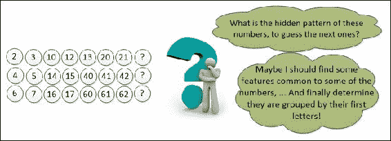

这类似于自我学习，当某人考虑自己的经验和一组支持标准时。在无监督学习中，我们没有定义的期望模式；相反，我们使用提供的数据来推断依赖输出Y，而不需要任何监督。

### 提示

在无监督学习中，独立数据越接近，生成的输出应该越相似，这应该在成本函数中考虑，与监督范式相反。

无监督学习可以应用于的任务示例包括聚类、数据压缩、统计建模和语言建模。这种学习范式将在[第4章](ch04.xhtml "第4章. 自组织映射")*自组织映射*中更详细地介绍。

# 学习过程

到目前为止，我们已经在理论上定义了学习过程及其执行方式。但在实践中，我们必须对数学逻辑进行更深入的探讨，以便实现学习算法本身。为了简化，在本章中，我们基本上涵盖了监督学习的情况；然而，我们在这里将介绍一个无监督学习更新权重的规则。学习算法是驱动神经网络学习过程的程序，它强烈依赖于神经网络架构。从数学的角度来看，人们希望找到最优权重 W，以驱动成本函数 C(X, Y) 达到尽可能低的值。然而，有时学习过程可能找不到一组能够满足接受标准的良好权重，但必须设置一个停止条件，以防止神经网络永远学习，从而造成 Java 程序冻结。

通常，这个过程按照以下流程图所示的方式进行：

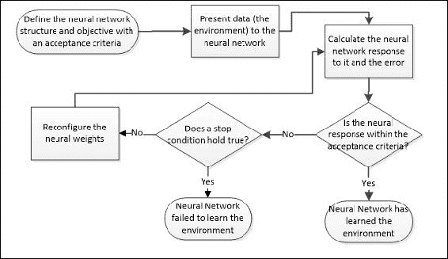

## 寻找成本函数下降到最优路径

现在，让我们详细探讨成本函数所起的作用。让我们将成本函数想象成一个由超曲面表示的双变量函数的形状。为了简化，我们目前只考虑两个权重（二维空间加上表示成本函数的高度）。假设我们的成本函数具有以下形状：

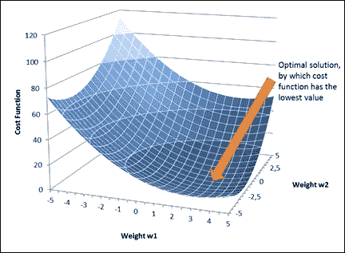

从视觉上看，我们可以看到存在一个最优解，通过这个最优解，成本函数大致接近零。但我们如何程序化地实现这一点呢？答案在于数学优化，其中成本函数被定义为优化问题：

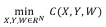

通过回忆费马优化定理，最优解位于所有维度上表面斜率应为零的位置，即偏导数应为零，并且应该是凸的（对于最小值情况）。考虑到从一个任意解 W 开始，寻找最优解应考虑表面高度下降的方向。这就是所谓的梯度法。

## 学习进行中 - 权重更新

根据使用的成本函数，更新规则将决定权重、神经网络可变参数应该如何改变，以便在新的权重下成本函数的值更低：

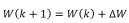

这里，k 表示第 k 次迭代，*W(k)* 表示第 k 次迭代的神经网络权重，随后 *k+1* 表示下一次迭代。

权重更新操作可以在在线或批量模式下执行。这里的“在线”意味着在数据集的每一条记录之后更新权重。批量更新意味着首先将数据集中的所有记录呈现给神经网络，然后它开始更新其权重。这将在本章末尾的代码中详细探讨。

## 计算成本函数

当神经网络学习时，它从环境中接收数据并根据目标调整其权重。这些数据被称为训练数据集，包含多个样本。单词“训练”背后的理念在于调整神经网络权重的过程，就像它们在“训练”一样，以便在神经网络中给出期望的响应。当神经网络仍在学习时，在监督情况下，目标输出（Y）和神经网络输出（）之间存在误差：

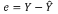

### 小贴士

一些关于神经网络文献中用字母T表示目标变量，将神经网络输出表示为Y，而在这本书中，我们将用Y来表示它，为了避免读者混淆，因为它最初被表示为Y。

好吧，鉴于训练数据集具有多个值，对于每一条记录都会有N个误差值。那么，如何得到总体误差呢？一个直观的方法是取所有误差的平均值，但这可能会误导。误差向量可以取正值和负值，因此所有误差值的平均值很可能接近零，无论误差测量值有多大。使用绝对值来生成平均值似乎是一个更明智的方法，但这个函数在原点处有一个不连续性，这在计算其导数时是尴尬的：

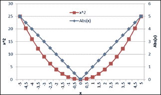

因此，我们合理的选项是使用误差的二次和的平均值，也称为**均方误差（MSE）**：

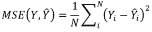

## 一般误差和总体误差

在进一步讨论之前，我们需要明确一点。由于神经网络是一个多输出结构，我们必须处理多输出情况，即当我们有一个误差矩阵而不是误差向量时：

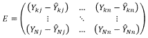

好吧，在这种情况下，可能需要处理大量的错误，无论是关于一个特定的输出、特定的记录还是整个数据集。为了便于理解，让我们将特定到记录的误差称为一般误差，通过它为所有输出误差提供一个标量值，用于一般输出误差；而指整个数据的误差称为总体误差。

对于单输出网络，一般误差仅仅是目标值和输出值之间的差异，但在多输出情况下，它需要由每个输出误差组成。正如我们所见，平方误差是总结误差测量的合适方法，因此一般误差可以通过每个输出误差的平方来计算：

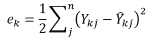

至于整体误差，它实际上考虑的是一般误差，但针对数据集中的所有记录。由于数据集可能非常大，因此最好使用二次一般误差的均方误差（MSE）来计算整体误差。

## 神经网络能否永远学习？何时停止学习是合适的？

随着学习过程的进行，神经网络必须给出越来越接近预期的结果，直到最终达到接受标准或学习迭代中的一个限制，我们称之为迭代次数。当满足以下条件之一时，学习过程被认为是完成的：

+   **满意标准**：根据学习范式，最小整体误差或最小权重距离

+   **最大迭代次数**

# 学习算法的示例

现在让我们将到目前为止所提出的理论内容合并到学习算法的简单示例中。在本章中，我们将探讨单层神经网络中的几个学习算法；多层将在下一章中介绍。

在Java代码中，我们将在新的包`edu.packt.neural.learn`中创建一个新的超类`LearningAlgorithm`。另一个有用的包名为`edu.packt.neural.data`，它将被创建来处理神经网络将处理的数据集，即`NeuralInputData`和`NeuralOutputData`这两个类，它们都由`NeuralDataSet`类引用。我们建议读者浏览一下代码文档，以了解这些类的组织结构，以节省这里的文本空间。

`LearningAlgorithm`类具有以下属性和方法：

```py
public abstract class LearningAlgorithm {
    protected NeuralNet neuralNet;
    public enum LearningMode {ONLINE,BATCH};
    protected enum LearningParadigm {SUPERVISED,UNSUPERVISED};
//…
    protected int MaxEpochs=100;
    protected int epoch=0;
    protected double MinOverallError=0.001;
    protected double LearningRate=0.1;
    protected NeuralDataSet trainingDataSet;
    protected NeuralDataSet testingDataSet;
    protected NeuralDataSet validatingDataSet;
    public boolean printTraining=false;
    public abstract void train() throws NeuralException;
    public abstract void forward() throws NeuralException;
    public abstract void forward(int i) throws NeuralException;
    public abstract Double calcNewWeight(int layer,int input,int neuron) throws NeuralException;
    public abstract Double calcNewWeight(int layer,int input,int neuron,double error) throws NeuralException;
//…
}
```

`neuralNet`对象是这个学习算法将要训练的神经网络的引用。`enums`定义了学习模式和学习的范式。学习执行参数被定义（MaxEpochs，MinOverallError，LearningRate），以及在学习过程中将考虑的数据集。

方法`train( )`应该由每个学习算法实现重写。所有的训练过程都将在这个方法中发生。方法`forward( )`和`forward(int k)`分别处理包含所有输入数据的神经网络和第k个输入数据记录。最后，方法`calcNewWeight( )`将对连接输入到特定层中神经元的权重进行更新。`calcNewWeight( )`方法的变化允许在更新操作中提供一个特定的误差。

## delta规则

此算法根据成本函数更新权重。遵循梯度方法，人们想知道哪些权重可以驱动成本函数达到更低的值。请注意，我们可以通过计算成本函数对每个权重的偏导数来找到方向。为了帮助理解，让我们考虑一个只有一个神经元、一个权重和一个偏差、因此只有一个输入的简单方法。输出将如下所示：

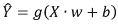

在这里，g是激活函数，X是包含x值的向量，Y是由神经网络生成的输出向量。第k个样本的一般误差相当简单：

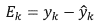

然而，可以将这个误差定义为平方误差、N次方误差或均方误差。但为了简单起见，让我们考虑一般误差的简单误差差。现在，整体误差，也就是成本函数，应该按照以下方式计算：

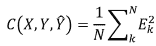

权重和偏差根据delta规则进行更新，该规则考虑了权重和偏差的偏导数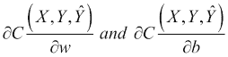。对于批量训练模式，X和E是向量：

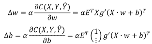

如果训练模式是在线的，我们不需要执行点积：

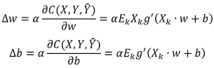

## 学习率

注意在先前的方程中存在表示学习率的项α。它在权重更新中起着重要作用，因为它可以更快或更慢地达到最小成本值。让我们看看与两个权重相关的成本误差表面：


## 实现delta规则

我们将在名为`DeltaRule`的类中实现delta规则，该类将扩展`LearningAlgorithm`类：

```py
public class DeltaRule extends LearningAlgorithm {
    public ArrayList<ArrayList<Double>> error;
    public ArrayList<Double> generalError;
    public ArrayList<Double> overallError;
    public double overallGeneralError;
    public double degreeGeneralError=2.0;
    public double degreeOverallError=0.0;
    public enum ErrorMeasurement {SimpleError, SquareError,NDegreeError,MSE}

    public ErrorMeasurement generalErrorMeasurement=ErrorMeasurement.SquareError;
    public ErrorMeasurement overallErrorMeasurement=ErrorMeasurement.MSE;
    private int currentRecord=0;
    private ArrayList<ArrayList<ArrayList<Double>>> newWeights;
//…
}
```

在误差测量部分（一般误差和整体误差）中讨论的误差在`DeltaRule`类中实现，因为delta规则学习算法在训练期间考虑了这些误差。它们是数组，因为每个数据集记录都会有一般误差，每个输出也会有整体误差。一个名为`overallGeneralError`的属性承担成本函数的结果，即所有输出和记录的整体误差。一个名为error的矩阵存储每个输出记录组合的误差。

此类还允许以多种方式计算整体和一般误差。`generalErrorMeasurement`和`overallErrorMeasurement`属性可以接受简单误差、平方误差计算、N次方误差（立方、四次方等）或均方误差的输入值之一。默认情况下，一般误差将使用简单误差，整体误差将使用均方误差。

在此代码中，有两个重要的属性值得注意：`currentRecord`指的是在训练过程中被输入到神经网络的记录的索引，而`newWeights`立方矩阵是所有将要更新的神经网络新权重的集合。`currentRecord`属性在在线训练中很有用，而`newWeights`矩阵帮助神经网络在其所有原始权重计算完成之前保持所有原始权重，防止在正向处理阶段更新新权重，这可能会严重影响训练质量。

## 梯度规则学习的核心 - 训练和calcNewWeight方法

为了节省空间，我们在此不详细说明前向方法的实现。如前所述，前向意味着应该将神经网络数据集记录输入到神经网络中，然后计算误差值：

```py
@Override
public void train() throws NeuralException{
//…
  switch(learningMode){
    case BATCH: //this is the batch training mode
      epoch=0;
      forward(); //all data are presented to the neural network
      while(epoch<MaxEpochs && overallGeneralError>MinOverallError){ //continue condition
        epoch++; //new epoch                       
        for(int j=0;j<neuralNet.getNumberOfOutputs();j++){
          for(int i=0;i<=neuralNet.getNumberOfInputs();i++){
            //here the new weights are calculated
            newWeights.get(0).get(j).set(i,calcNewWeight(0,i,j));
          }
        }
//only after all weights are calculated, they are applied
        applyNewWeights();
// the errors are updated with the new weights
        forward();
      }
      break;
    case ONLINE://this is the online training
      epoch=0;
      int k=0;
      currentRecord=0; //this attribute is used in weight update
      forward(k); //only the k-th record is presented
      while(epoch<MaxEpochs && overallGeneralError>MinOverallError){
        for(int j=0;j<neuralNet.getNumberOfOutputs();j++){
          for(int i=0;i<=neuralNet.getNumberOfInputs();i++){
            newWeights.get(0).get(j).set(i,calcNewWeight(0,i,j));
          }
        }
//the new weights will be considered for the next record
        applyNewWeights();
        currentRecord=++k;
        if(k>=trainingDataSet.numberOfRecords){
          k=0; //if it was the last record, again the first
          currentRecord=0;
          epoch++; //epoch completes after presenting all records
        }
        forward(k); //presenting the next record
      }
    break;
    }
  }
```

我们注意到在`train( )`方法中，有一个带有继续训练条件的循环。这意味着当这个条件不再成立时，训练将停止。该条件检查`epoch`数量和总体误差。当`epoch`数量达到最大值或误差达到最小值时，训练完成。然而，在某些情况下，总体误差未能达到最小要求，神经网络需要停止训练。

新的权重是通过`calcNewWeight( )`方法计算的：

```py
@Override
public Double calcNewWeight(int layer,int input,int neuron)
            throws NeuralException{
//…
  Double deltaWeight=LearningRate;
  Neuron currNeuron=neuralNet.getOutputLayer().getNeuron(neuron);
  switch(learningMode){
    case BATCH: //Batch mode
      ArrayList<Double> derivativeResult=currNeuron.derivativeBatch(trainingDataSet.getArrayInputData());
      ArrayList<Double> _ithInput;
      if(input<currNeuron.getNumberOfInputs()){ // weights
        _ithInput=trainingDataSet.getIthInputArrayList(input);
      }
      else{ // bias
        _ithInput=new ArrayList<>();
        for(int i=0;i<trainingDataSet.numberOfRecords;i++){
          _ithInput.add(1.0);
        }
      }
      Double multDerivResultIthInput=0.0; // dot product
      for(int i=0;i<trainingDataSet.numberOfRecords;i++){
        multDerivResultIthInput+=error.get(i).get(neuron)*derivativeResult.get(i)*_ithInput.get(i);
      }
      deltaWeight*=multDerivResultIthInput;
    break;
    case ONLINE:
      deltaWeight*=error.get(currentRecord).get(neuron);
      deltaWeight*=currNeuron.derivative(neuralNet.getInputs());
      if(input<currNeuron.getNumberOfInputs()){
        deltaWeight*=neuralNet.getInput(input);
      }
      break;
  }
return currNeuron.getWeight(input)+deltaWeight;
//…
}
```

注意，在权重更新中，有一个调用给定神经元的激活函数的导数。这是满足梯度规则所需的。在激活函数接口中，我们添加了此`derivative( )`方法，以便在每个实现类中重写。

### 注意

注意：对于批量模式，调用`derivativeBatch( )`时，接收并返回一个值数组，而不是单个标量。

在`train( )`方法中，我们看到了新权重被存储在`newWeights`属性中，以避免影响当前的学习过程，并且仅在训练迭代完成后才应用。

## 另一种学习算法 - 海布学习算法

在20世纪40年代，神经心理学家唐纳德·海布提出了这样的假设：同时激活或放电的神经元之间的连接，或者用他的话说，反复或持续地，应该被增强。这是无监督学习的一种方法，因为海布学习没有指定目标输出：


总结来说，海布学习算法的权重更新规则只考虑神经元的输入和输出。给定一个要更新的神经元j，其与神经元i（权重ij）的连接，更新由以下方程给出：

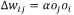

在这里，α是学习率，oj是神经元j的输出，oi是神经元i的输出，也是神经元j的输入i。对于批量训练案例，oi和oj将是向量，我们需要执行点积。

由于我们没有在Hebbian学习中包含错误测量，可以通过最大epoch数或神经网络输出的整体平均值的增加来确定停止条件。给定N条记录，我们计算神经网络产生的所有输出的期望值或平均值。当这个平均值超过一定水平时，就是停止训练的时候了，以防止神经输出的爆炸。

我们将开发一个新的类用于Hebbian学习，它也继承自`LearningAlgorithm`：

```py
public class Hebbian extends LearningAlgorithm {
//…
    private ArrayList<ArrayList<ArrayList<Double>>> newWeights;
    private ArrayList<Double> currentOutputMean;
    private ArrayList<Double> lastOutputMean;
}
```

除了缺失的错误测量和新的平均测量之外，所有参数都与`DeltaRule`类相同。方法相当相似，除了`calcNewWeight( )`：

```py
@Override
public Double calcNewWeight(int layer,int input,int neuron)
         throws NeuralException{
//…
  Double deltaWeight=LearningRate;
  Neuron currNeuron=neuralNet.getOutputLayer().getNeuron(neuron);
  switch(learningMode){
    case BATCH:
//…
//the batch case is analogous to the implementation in Delta Rule
//but with the neuron's output instead of the error
//we're suppressing here to save space
      break;
    case ONLINE:
      deltaWeight*=currNeuron.getOutput();
      if(input<currNeuron.getNumberOfInputs()){
        deltaWeight*=neuralNet.getInput(input);
      }
      break;
    }
    return currNeuron.getWeight(input)+deltaWeight;
  }
```

## Adaline

Adaline是一种代表自适应线性神经元的架构，由Bernard Widrow和Ted Hoff开发，基于McCulloch和Pitts神经元。它只有一层神经元，可以类似于delta规则进行训练。主要区别在于更新规则是由输入加权和偏差与目标输出的误差给出，而不是基于激活函数后的神经元输出进行更新。当想要对分类问题进行连续学习时，这可能是所希望的，因为分类问题倾向于使用离散值而不是连续值。

下图说明了Adaline是如何学习的：

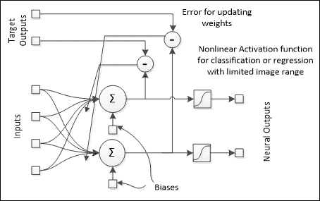

因此，权重是通过以下方程更新的：

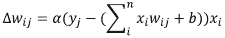

为了实现Adaline，我们创建了一个名为**Adaline**的类，其中包含以下重写的`calcNewWeight`方法。为了节省空间，我们只展示在线案例：

```py
@Override
public Double calcNewWeight(int layer,int input,int neuron)
            throws NeuralException{
//…
  Double deltaWeight=LearningRate;
  Neuron currNeuron=neuralNet.getOutputLayer().getNeuron(neuron);
  switch(learningMode){
    case BATCH:
//…
    break;
    case ONLINE:
      deltaWeight*=error.get(currentRecord).get(neuron)
        *currNeuron.getOutputBeforeActivation();
      if(input<currNeuron.getNumberOfInputs()){
        deltaWeight*=neuralNet.getInput(input);
      }
    break;
  }
  return currNeuron.getWeight(input)+deltaWeight;
}
```

注意我们在上一章中提到的`getOutputBeforeActivation( )`方法；这个属性在将来会很有用。

# 现在是时候看到学习在实际中的应用了！

让我们处理一个非常简单但具有说明性的例子。假设你想要一个单神经元神经网络学习如何拟合以下简单的线性函数：

| 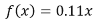 | 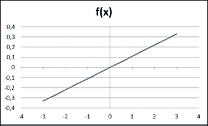 |
| --- | --- |

即使对数学背景薄弱的人来说也很简单，所以猜猜看？这是我们最简单的神经网络证明其学习能力的一个好起点！

## 教授神经网络 – 训练数据集

我们将使用以下代码来结构化神经网络的学习数据集，你可以在文件`NeuralNetDeltaRuleTest`的主方法中找到它：

```py
Double[][] _neuralDataSet = {
  {1.2 , fncTest(1.2)}
 ,   {0.3 , fncTest(0.3)}
 ,   {-0.5 , fncTest(-0.5)}
 ,   {-2.3 , fncTest(-2.3)}
 ,   {1.7 , fncTest(1.7)}
 ,   {-0.1 , fncTest(-0.1)}
 ,   {-2.7 , fncTest(-2.7)}  };
int[] inputColumns = {0};
int[] outputColumns = {1};
NeuralDataSet neuralDataSet = newNeuralDataSet(_neuralDataSet,inputColumns,outputColumns);
```

`funcTest`函数定义为我们在上一章中提到的函数：

```py
    public static double fncTest(double x){
        return 0.11*x;
    }
```

注意，我们正在使用`NeuralDataSet`类来以正确的方式组织所有这些数据。现在让我们将这个数据集链接到神经网络。记住，这个网络在输出端只有一个神经元。让我们使用一个非线性激活函数，比如输出端的双曲正切函数，系数为`0.85`：

```py
int numberOfInputs=1;
int numberOfOutputs=1;
HyperTan htAcFnc = new HyperTan(0.85);
NeuralNet nn = new NeuralNet(numberOfInputs,numberOfOutputs,
                 htAcFnc);
```

现在我们实例化`DeltaRule`对象并将其链接到创建的神经网络。然后我们将设置学习参数，如学习率、最小总体误差和最大迭代次数：

```py
DeltaRule deltaRule=new DeltaRule(nn,neuralDataSet.LearningAlgorithm.LearningMode.ONLINE);
deltaRule.printTraining=true;
deltaRule.setLearningRate(0.3);
deltaRule.setMaxEpochs(1000);
deltaRule.setMinOverallError(0.00001);
```

现在我们来看看未训练的神经网络的第一批神经输出，这是在调用`deltaRule`对象的`forward()`方法之后：

```py
deltaRule.forward();
neuralDataSet.printNeuralOutput();
```

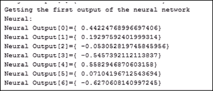

绘制图表，我们发现神经网络生成的输出略有不同：

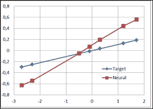

我们将开始以在线模式训练神经网络。我们已经将`printTraining`属性设置为true，因此我们将在屏幕上收到更新。以下代码将生成后续的截图：

```py
System.out.println("Beginning training");
  deltaRule.train();
System.out.println("End of training");
  if(deltaRule.getMinOverallError()>=deltaRule.getOverallGeneralError()){
  System.out.println("Training succesful!");
}
else{
  System.out.println("Training was unsuccesful");
}
```

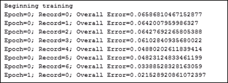

训练开始，并在每次权重更新后更新总体错误信息。注意错误正在减少：

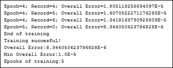

经过五个迭代周期后，错误达到最小值；现在让我们看看神经输出和图表：

| 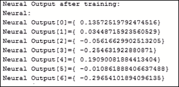 | 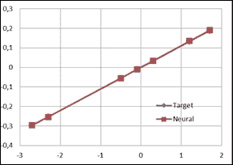 |
| --- | --- |

非常令人惊讶，不是吗？目标和神经输出几乎相同。现在让我们看看最终的`权重`和`偏差`：

```py
weight = nn.getOutputLayer().getWeight(0, 0);
bias = nn.getOutputLayer().getWeight(1, 0);
System.out.println("Weight found:"+String.valueOf(weight));
System.out.println("Bias found:"+String.valueOf(bias));
//Weight found:0.2668421011698528
//Bias found:0.0011258204676042108
```

# 惊人的是，它已经学习到了！或者，它真的学习到了吗？下一步——测试

好吧，我们现在可能会问：那么神经网络已经从数据中学习到了；我们如何证明它已经有效地学习了呢？就像学生在考试中会遇到的，我们需要检查训练后的网络响应。但是等等！你认为老师会在考试中出与课堂上所讲相同的问题吗？用已知例子来评估某人的学习是没有意义的，或者怀疑老师可能会得出学生可能只是记住了内容而没有真正学习的结论。

好的，现在让我们解释这部分。我们在这里讨论的是测试。我们之前介绍的学习过程被称为训练。训练神经网络后，我们应该测试它是否真的学到了东西。为了测试，我们必须向神经网络展示来自它学习过的相同环境的另一部分数据。这是必要的，因为，就像学生一样，神经网络只能正确响应它接触过的数据点；这被称为过训练。为了检查神经网络是否没有过度训练，我们必须检查它对其他数据点的响应。

下图说明了过训练问题。想象一下，我们的网络被设计用来逼近某个函数 f(x)，其定义是未知的。神经网络被喂食了该函数的一些数据，并在下图的左侧产生了结果。但当扩展到更广泛的领域时，例如，添加测试数据集，我们注意到神经网络的响应没有遵循数据（在图的右侧）：

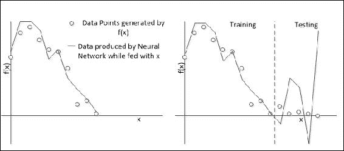

在这种情况下，我们看到神经网络未能学习整个环境（函数 *f(x)*）。这发生是因为以下多个原因：

+   神经网络没有从环境中获得足够的信息

+   来自环境的数据是非确定性的

+   训练和测试数据集定义得不好

+   神经网络在训练数据上学习得太多，以至于它已经“忘记”了测试数据

在整本书中，我们将介绍防止这种情况以及其他在训练过程中可能出现的问题的过程。

## 过拟合和过训练

在我们之前的例子中，神经网络似乎学得非常好。然而，存在过拟合和过训练的风险。这两个概念之间的区别非常微妙。过拟合发生在神经网络记住问题的行为，因此它只能在训练点上提供良好的值，从而失去了泛化能力。过训练，这可能是过拟合的原因之一，发生在训练误差远小于测试误差的情况下，或者实际上，随着神经网络继续（过度）训练，测试误差开始增加：

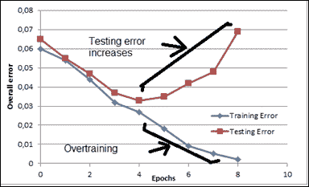

防止过训练和过拟合的一种方法是在训练过程中检查测试误差。当测试误差开始增加时，就是停止的时候了。这将在下一章中更详细地介绍。

现在，让我们看看在我们的例子中是否存在这种情况。现在让我们添加一些更多数据并对其进行测试：

```py
Double[][] _testDataSet ={
  {-1.7 , fncTest(-1.7) }
, {-1.0 , fncTest(-1.0) }
, {0.0 , fncTest(0.0) }
, {0.8 , fncTest(0.8) }
, {2.0 , fncTest(2.0) }
};
NeuralDataSet testDataSet = new NeuralDataSet(_testDataSet, ....inputColumns, outputColumns);
deltaRule.setTestingDataSet(testDataSet);
deltaRule.test();
testDataSet.printNeuralOutput();
```

| 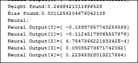 | 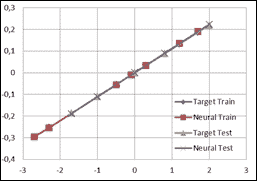 |
| --- | --- |

如所见，在这种情况下，神经网络表现出了一般化能力。尽管这个例子很简单，我们仍然可以看到神经网络的学习能力。

# 摘要

本章向读者展示了神经网络能够实现的整体学习过程。我们介绍了学习的基础知识，这些知识灵感来源于人类自身的学习。为了在实践中说明这一过程，我们已经在Java中实现了两种学习算法，并在两个示例中应用了它们。通过这种方式，读者可以对神经网络的学习方式有一个基本但有用的理解，甚至可以系统地描述学习过程。这将是下一章的基础，下一章将展示更复杂的示例。
