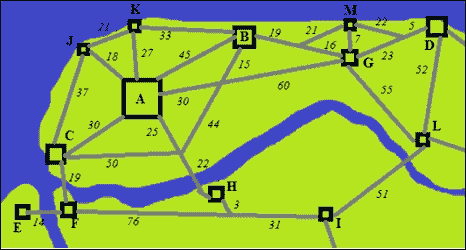

# 第三章：第3章：感知器和监督学习

在本章中，我们将更详细地探讨监督学习，这在寻找两个数据集之间的关系时非常有用。此外，我们介绍了感知器，这是一种非常流行的神经网络架构，它实现了监督学习。本章还介绍了它们的扩展广义版本，即所谓的多层感知器，以及它们的特性、学习算法和参数。读者还将学习如何在Java中实现它们以及如何使用它们解决一些基本问题。本章将涵盖以下主题：

+   监督学习

+   回归任务

+   分类任务

+   感知器

+   线性分离

+   局限性：XOR问题

+   多层感知器

+   广义delta规则 – 反向传播算法

+   Levenberg–Marquardt算法

+   单隐藏层神经网络

+   极端学习机

# 监督学习 – 教导神经网络

在上一章中，我们介绍了适用于神经网络的认知模式，其中监督学习意味着有一个目标或一个定义的目标要达到。在实践中，我们提供一组输入数据X和一个期望的输出数据YT，然后评估一个成本函数，其目的是减少神经网络输出Y与目标输出YT之间的误差。

在监督学习中，涉及两个主要类别的任务，具体如下：分类和回归。

## 分类 – 寻找合适的类别

神经网络也处理分类数据。给定一个类别列表和一个数据集，人们希望根据包含记录及其相应类别的历史数据集对它们进行分类。以下表格显示了该数据集的一个示例，考虑了主题的平均成绩在*`0`*到**10**之间：

| 学生ID | 主题 | 职业 |
| --- | --- | --- |
| 英语 | 数学 | 物理 | 化学 | 地理 | 历史 | 文学 | 生物学 |
| --- | --- | --- | --- | --- | --- | --- | --- | --- | --- |
| 89543 | 7.82 | 8.82 | 8.35 | 7.45 | 6.55 | 6.39 | 5.90 | 7.03 | **电气工程师** |
| 93201 | 8.33 | 6.75 | 8.01 | 6.98 | 7.95 | 7.76 | 6.98 | 6.84 | **市场营销人员** |
| 95481 | 7.76 | 7.17 | 8.39 | 8.64 | 8.22 | 7.86 | 7.07 | 9.06 | **医生** |
| 94105 | 8.25 | 7.54 | 7.34 | 7.65 | 8.65 | 8.10 | 8.40 | 7.44 | **律师** |
| 96305 | 8.05 | 6.75 | 6.54 | 7.20 | 7.96 | 7.54 | 8.01 | 7.86 | **学校校长** |
| 92904 | 6.95 | 8.85 | 9.10 | 7.54 | 7.50 | 6.65 | 5.86 | 6.76 | **程序员** |

一个例子是根据学术成绩预测职业。让我们考虑一组现在工作的前学生的数据集。我们编制了一个包含每个学生在每门课程上的平均成绩以及他/她的当前职业的数据集。请注意，输出将是职业名称，神经网络无法直接给出。相反，我们需要为每个已知职业创建一列（一个输出）。如果该学生选择了一个特定的职业，则对应该职业的列将具有值一，否则为零：


现在我们想要找到一个基于神经网络来预测学生将可能选择哪个职业的模型，基于他/她的成绩。为此，我们构建了一个神经网络，其中包含学术科目的数量作为输入，已知职业的数量作为输出，以及隐藏层中的任意数量的隐藏神经元：


对于分类问题，通常每个数据点只有一个类别。因此，在输出层，神经元被激活以产生零或一，最好使用输出值介于这两个值之间的激活函数。然而，我们必须考虑这种情况，即多个神经元被激活，给一个记录分配两个类别。有许多机制可以防止这种情况，例如 softmax 函数或全胜算法，例如。这些机制将在第 6 章[分类疾病诊断]的实践应用中详细说明，*分类疾病诊断*。

经过训练后，神经网络已经学会了给定学生的成绩，最有可能的职业是什么。

## 回归 – 将实际输入映射到输出

回归包括找到一些函数，这些函数将一组输入映射到一组输出。以下表格显示了包含 k 条记录的 m 个独立输入 X 的数据集如何与 n 个相关输出绑定：

| 输入独立数据 | 输出相关数据 |
| --- | --- |
| X1 | X2 | … | XM | T1 | T2 | … | TN |
| x1[0] | x2[0] | … | xm[0] | t1[0] | t2[0] | … | tn[0] |
| x1[1] | x2[1] | … | xm[1] | t1[1] | t2[1] | … | tn[1] |
| … | … | … | … | … | … | … | … |
| x1[k] | x2[k] | … | xm[k] | t1[k] | t2[k] | … | tn[k] |

前面的表格可以编译成矩阵格式：


与分类不同，输出值是数值而不是标签或类别。还有一个包含我们希望神经网络学习的某些行为记录的历史数据库。一个例子是预测两个城市之间的公交车票价。在这个例子中，我们从一系列城市和从一地出发到达另一地的公交车当前票价中收集信息。我们将城市特征以及它们之间的距离和/或时间作为输入，将公交车票价作为输出：



| 出发城市特征 | 目的地城市特征 | 路线特征 | 票价 |
| --- | --- | --- | --- |
| **人口** | **GDP** | **路线** | **人口** | **GDP** | **路线** | **距离** | **时间** | **停靠站** |   |
| 500,000 | 4.5 | 6 | 45,000 | 1.5 | 5 | 90 | 1.5 | 0 | 15 |
| 120,000 | 2.6 | 4 | 500,000 | 4.5 | 6 | 30 | 0.8 | 0 | 10 |
| 30,000 | 0.8 | 3 | 65,000 | 3.0 | 3 | 103 | 1.6 | 1 | 20 |
| 35,000 | 1.4 | 3 | 45,000 | 1.5 | 5 | 7 | 0.4 | 0 | 5 |
| … |   |   |   |   |   |   |   |   |
| 120,000 | 2.6 | 4 | 12,000 | 0.3 | 3 | 37 | 0.6 | 0 | 7 |

在结构化数据集后，我们定义了一个包含确切数量的特征（由于两个城市而乘以二）加上路线特征的输入，一个输出，以及隐藏层中的任意数量的神经元。在前面表格中展示的案例中，将有九个输入。由于输出是数值的，因此不需要转换输出数据。

这个神经网络将给出两个城市之间路线的估计价格，目前还没有任何公交运输公司提供服务。

# 一个基本的神经网络架构 – 感知器

感知器是最简单的神经网络架构。由 *Frank Rosenblatt* 在 1957 年提出，它只有一个神经元层，接收一组输入并产生另一组输出。这是神经网络首次获得关注的代表之一，尤其是由于它们的简单性：


在我们的 Java 实现中，这通过一个神经网络层（输出层）来展示。以下代码创建了一个具有三个输入和两个输出，输出层具有线性函数的感知器：

```py
int numberOfInputs=3;
int numberOfOutputs=2;

Linear outputAcFnc = new Linear(1.0);
NeuralNet perceptron = new NeuralNet(numberOfInputs,numberOfOutputs,
                outputAcFnc);
```

## 应用和限制

然而，科学家们并没有花很长时间就得出结论，感知器神经网络只能应用于简单任务，根据这种简单性。当时，神经网络被用于简单的分类问题，但感知器通常在面对更复杂的数据集时失败。让我们用一个非常基本的例子（一个 `AND` 函数）来更好地说明这个问题。

## 线性分离

该示例由一个接受两个输入，**x1** 和 **x2** 的 AND 函数组成。该函数可以绘制在以下二维图表中：


现在让我们考察神经网络如何使用感知器规则进行训练，考虑一对权重，**w1** 和 **w2**，初始值为 **0.5**，以及偏置值为 **0.5**。假设学习率 η 等于 **0.2**：

| 周期 | x1 | x2 | w1 | w2 | b | y | t | E | Δw1 | Δw2 | Δb |
| --- | --- | --- | --- | --- | --- | --- | --- | --- | --- | --- | --- |
| 1 | 0 | 0 | 0.5 | 0.5 | 0.5 | 0.5 | 0 | -0.5 | 0 | 0 | -0.1 |
| 1 | 0 | 1 | 0.5 | 0.5 | 0.4 | 0.9 | 0 | -0.9 | 0 | -0.18 | -0.18 |
| 1 | 1 | 0 | 0.5 | 0.32 | 0.22 | 0.72 | 0 | -0.72 | -0.144 | 0 | -0.144 |
| 1 | 1 | 1 | 0.356 | 0.32 | 0.076 | 0.752 | 1 | 0.248 | 0.0496 | 0.0496 | 0.0496 |
| 2 | 0 | 0 | 0.406 | 0.370 | 0.126 | 0.126 | 0 | -0.126 | 0.000 | 0.000 | -0.025 |
| 2 | 0 | 1 | 0.406 | 0.370 | 0.100 | 0.470 | 0 | -0.470 | 0.000 | -0.094 | -0.094 |
| 2 | 1 | 0 | 0.406 | 0.276 | 0.006 | 0.412 | 0 | -0.412 | -0.082 | 0.000 | -0.082 |
| 2 | 1 | 1 | 0.323 | 0.276 | -0.076 | 0.523 | 1 | 0.477 | 0.095 | 0.095 | 0.095 |
| … | … |   |   |   |   |   |   |   |   |   |   |
| 89 | 0 | 0 | 0.625 | 0.562 | -0.312 | -0.312 | 0 | 0.312 | 0 | 0 | 0.062 |
| 89 | 0 | 1 | 0.625 | 0.562 | -0.25 | 0.313 | 0 | -0.313 | 0 | -0.063 | -0.063 |
| 89 | 1 | 0 | 0.625 | 0.500 | -0.312 | 0.313 | 0 | -0.313 | -0.063 | 0 | -0.063 |
| 89 | 1 | 1 | 0.562 | 0.500 | -0.375 | 0.687 | 1 | 0.313 | 0.063 | 0.063 | 0.063 |

经过 **89** 个周期后，我们发现网络产生的值接近期望的输出。由于在这个例子中，输出是二进制的（零或一），我们可以假设网络产生的任何低于 **0.5** 的值被认为是 *`0`*，任何高于 **0.5** 的值被认为是 *`1`*。因此，我们可以绘制一个函数 ，其中包含学习算法找到的最终权重和偏置 *w1=0.562*，*w2=0.5* 和 *b=-0.375*，定义图表中的线性边界：


这个边界是网络给出的所有分类的定义。你可以看到，由于函数也是线性的，边界是线性的。因此，感知器网络非常适合那些模式线性可分的问题。

## XOR 情况

现在我们来分析 `XOR` 情况：


我们看到，在二维空间中，不可能画出一条线来分离这两种模式。如果我们尝试训练一个单层感知器来学习这个函数，会发生什么？假设我们尝试了，让我们看看以下表格中的结果：

| 周期 | x1 | x2 | w1 | w2 | b | y | t | E | Δw1 | Δw2 | Δb |
| --- | --- | --- | --- | --- | --- | --- | --- | --- | --- | --- | --- |
| 1 | 0 | 0 | 0.5 | 0.5 | 0.5 | 0.5 | 0 | -0.5 | 0 | 0 | -0.1 |
| 1 | 0 | 1 | 0.5 | 0.5 | 0.4 | 0.9 | 1 | 0.1 | 0 | 0.02 | 0.02 |
| 1 | 1 | 0 | 0.5 | 0.52 | 0.42 | 0.92 | 1 | 0.08 | 0.016 | 0 | 0.016 |
| 1 | 1 | 1 | 0.516 | 0.52 | 0.436 | 1.472 | 0 | -1.472 | -0.294 | -0.294 | -0.294 |
| 2 | 0 | 0 | 0.222 | 0.226 | 0.142 | 0.142 | 0 | -0.142 | 0.000 | 0.000 | -0.028 |
| 2 | 0 | 1 | 0.222 | 0.226 | 0.113 | 0.339 | 1 | 0.661 | 0.000 | 0.132 | 0.132 |
| 2 | 1 | 0 | 0.222 | 0.358 | 0.246 | 0.467 | 1 | 0.533 | 0.107 | 0.000 | 0.107 |
| 2 | 1 | 1 | 0.328 | 0.358 | 0.352 | 1.038 | 0 | -1.038 | -0.208 | -0.208 | -0.208 |
| … | … |   |   |   |   |   |   |   |   |   |   |
| 127 | 0 | 0 | -0.250 | -0.125 | 0.625 | 0.625 | 0 | -0.625 | 0.000 | 0.000 | -0.125 |
| 127 | 0 | 1 | -0.250 | -0.125 | 0.500 | 0.375 | 1 | 0.625 | 0.000 | 0.125 | 0.125 |
| 127 | 1 | 0 | -0.250 | 0.000 | 0.625 | 0.375 | 1 | 0.625 | 0.125 | 0.000 | 0.125 |
| 127 | 1 | 1 | -0.125 | 0.000 | 0.750 | 0.625 | 0 | -0.625 | -0.125 | -0.125 | -0.125 |

感知机无法找到任何一对权重来驱动以下误差 0.625。这可以从我们已从图表中感知到的数学上解释，即这个函数在二维空间中无法线性可分。那么如果我们增加另一个维度会怎样呢？让我们看看三维空间的图表：


在三维空间中，如果这个额外的维度能够正确地转换输入数据，就有可能画出一个平面来分离模式。好吧，但现在有一个额外的问题：我们只有两个输入变量，我们如何推导出这个额外的维度呢？一个明显但也是权宜之计的答案是从两个原始变量中添加一个第三个变量作为导数。而这个第三个变量是一个（导数），我们的神经网络可能具有以下形状：


好吧，现在感知机有三个输入，其中一个是其他输入的组合。这也引出了一个新的问题：这个组合应该如何处理？我们可以看到这个组件可以作为一个神经元，因此给神经网络一个嵌套架构。如果是这样，那么就会有另一个新的问题：由于错误在输出神经元上，我们如何训练这个新神经元的权重？

# 多层感知机

正如我们所见，一个简单的例子，其中模式无法线性可分，这导致我们使用感知机架构时遇到了越来越多的问题。这种需求导致了多层感知机的应用。在[第 1 章](ch01.xhtml "第 1 章. 开始使用神经网络") *开始使用神经网络* 中，我们处理了这样一个事实，即自然神经网络的结构也是分层的，每一层都从特定的环境中捕获信息片段。在人工神经网络中，神经元层以这种方式行动，通过从数据中提取和抽象信息，将它们转换成另一个维度或形状。

在XOR示例中，我们找到了解决方案是添加一个第三组件，使其能够进行线性分离。但关于如何计算这个第三组件仍有一些疑问。现在让我们将相同的解决方案视为一个双层感知器：


现在我们有三个神经元而不是只有一个，但在输出层，前一层的传递信息被转换成另一个维度或形状，理论上可以在这些数据点上建立线性边界。然而，关于如何找到第一层的权重的疑问仍未得到解答，或者我们是否可以将相同的训练规则应用于输出层以外的神经元？我们将在广义delta规则部分处理这个问题。

## MLP属性

多层感知器可以具有任意数量的层，以及每一层任意数量的神经元。激活函数可以在任何层上不同。一个MLP网络通常由至少两层组成，一层用于输出，一层为隐藏层。

### 小贴士

也有一些参考资料将输入层视为收集输入数据的节点；因此，对于这些情况，MLP被认为至少有三级。为了本书的目的，让我们将输入层视为一种特殊的层，它没有权重，并且作为有效层，即那些能够被训练的层，我们将考虑隐藏层和输出层。

一个隐藏层之所以被称为隐藏层，是因为它实际上`隐藏`了其输出对外部世界。隐藏层可以以任意数量串联连接，从而形成一个深度神经网络。然而，神经网络层数越多，训练和运行的速度就越慢，根据数学基础，一个最多只有一两个隐藏层的神经网络可能学习效果与拥有数十个隐藏层的深度神经网络相当。但这取决于几个因素。

### 小贴士

真的强烈建议在隐藏层中使用非线性激活函数，尤其是在输出层激活函数是线性的情况下。根据线性代数，如果所有层的激活函数都是线性的，那么这相当于只有一个输出层，前提是层引入的额外变量将是前一层或输入的线性组合。通常，使用如双曲正切或Sigmoid这样的激活函数，因为它们是可导的。

## MLP权重

在MLP前馈网络中，一个特定的神经元`i`从前一层的神经元j接收数据，并将其输出转发到下一层的神经元k：


神经网络的数学描述是递归的：


在这里，*yo* 是网络输出（如果我们有多个输出，我们可以用 Y 代替 *yo*，表示一个向量）；*fo* 是输出层的激活函数；`l` 是隐藏层的数量；*nhi* 是隐藏层 `i` 中的神经元数量；*wi* 是连接最后一个隐藏层第 `i` 个神经元到输出的权重；*fi* 是神经元 `i` 的激活函数；*bi* 是神经元 `i` 的偏置。可以看出，随着层数的增加，这个方程会变得更大。在最后的求和操作中，会有输入 *xi*。

## 循环MLP

MLP中的神经元不仅可以向下一层的神经元（前馈网络）发送信号，还可以向同一层或上一层的神经元（反馈或循环）发送信号。这种行为允许神经网络在某个数据序列上维持状态，当处理时间序列或手写识别时，这个特性尤其被利用。循环网络通常更难训练，并且在执行时计算机可能会耗尽内存。此外，还有一些比MLP更好的循环网络架构，如Elman、Hopfield、Echo state、双向RNN（循环神经网络）。但我们不会深入探讨这些架构，因为这本书专注于对编程经验最少的人的最简单应用。然而，我们推荐那些对循环网络感兴趣的人阅读有关循环网络的良好文献。

## 编码MLP

将这些概念引入面向对象的观点，我们可以回顾到目前为止已经设计的类：


可以看到，神经网络结构是分层的。神经网络由层组成，而层由神经元组成。在MLP架构中，有三种类型的层：输入、隐藏和输出。所以假设在Java中，我们想要定义一个由三个输入、一个输出（线性激活函数）和一个包含五个神经元的隐藏层（`sigmoid`函数）组成的神经网络。生成的代码如下：

```py
int numberOfInputs=3;
int numberOfOutputs=1;
int[] numberOfHiddenNeurons={5};

Linear outputAcFnc = new Linear(1.0);
Sigmoid hiddenAcFnc = new Sigmoid(1.0);
NeuralNet neuralnet = new NeuralNet(numberOfInputs, numberOfOutputs, numberOfHiddenNeurons, hiddenAcFnc, outputAcFnc);
```

# MLP中的学习

多层感知器网络基于Delta规则进行学习，该规则也受到梯度下降优化方法的启发。梯度方法广泛应用于寻找给定函数的最小值或最大值：


此方法应用于*行走*函数输出更高或更低的方向，具体取决于标准。这个概念在Delta规则中得到了探索：


Delta 规则想要最小化的函数是神经网络输出和目标输出之间的误差，要找到的参数是神经权重。与感知器规则相比，这是一个增强的学习算法，因为它考虑了激活函数导数 *g'(h)*，这在数学上表示函数减少最快的方向。

## 反向传播算法

虽然 Delta 规则对于只有输出层和输入层的神经网络效果很好，但对于 MLP 网络，由于隐藏层神经元的存在，纯 Delta 规则不能应用。为了克服这个问题，在 20 世纪 80 年代，*Rummelhart* 和其他人提出了一种新的算法，该算法也受到梯度方法的启发，称为反向传播。

这个算法实际上是 Delta 规则对于 MLP 的一般化。拥有额外的层来从环境中抽象更多数据的优势激励了开发一个能够正确调整隐藏层权重的训练算法。基于梯度方法，输出层的误差会（反向）传播到前面的层，因此可以使用与 Delta 规则相同的方程进行权重更新。

算法运行如下：


第二步是反向传播本身。它所做的就是根据梯度找到权重变化，这是 Delta 规则的基础：


这里，E 是误差，*wji* 是神经元 `i` 和 `j` 之间的权重，*oi* 是第 `i` 个神经元的输出，而 *hi* 是该神经元输入在传递到激活函数之前的加权和。记住，*oi=f(hi)*，其中 `f` 是激活函数。

对于隐藏层的更新，由于我们将误差视为要更新的权重和输出之间所有神经元的函数，因此它稍微复杂一些。为了便于这个过程，我们应该计算敏感性或反向传播误差：


权重更新如下：


反向传播误差的计算对于输出层和隐藏层是不同的：

+   输出层的反向传播：

    +   在这里，oi 是第 `i` 个输出，ti 是期望的第 `i` 个输出，*f'(hi)* 是输出激活函数的导数，而 *hi* 是第 `i` 个神经元输入的加权和

+   隐藏层的反向传播：

    +   这里，`l` 是前一个层的神经元，*wil* 是连接当前神经元到前一个层第 `l` 个神经元的权重。

为了简化起见，我们没有完全展示如何发展反向传播方程。无论如何，如果你对细节感兴趣，你可以查阅Simon Haykin的《神经网络——全面基础》这本书。

## 动量

如同任何基于梯度的方法一样，存在陷入局部最小值的风险。为了减轻这种风险，我们可以在权重更新规则中添加另一个称为动量的项，它考虑了权重的最后一个变化：


在这里，μ是动量率，是最后一个delta权重。这为更新提供了一个额外的步骤，因此减弱了误差超空间中的振荡。

## 编码反向传播

让我们在`edu.packt.neural.learn`包中定义`backpropagation`类。由于这个学习算法是`DeltaRule`的泛化，这个类可能继承并覆盖Delta规则中已经定义的特性。这个类包含的三个附加属性是动量率、delta神经元和最后一个delta权重数组：

```py
public class Backpropagation extends DeltaRule {
    private double MomentumRate=0.7;
    public ArrayList<ArrayList<Double>> deltaNeuron;
    public ArrayList<ArrayList<ArrayList<Double>>> lastDeltaWeights;
  …
}
```

构造函数将具有与`DeltaRule`类相同的参数，并添加对`deltaNeuron`和`lastDeltaWeights`数组初始化方法的调用：

```py
public Backpropagation(NeuralNet _neuralNet, NeuralDataSet _trainDataSet, DeltaRule.LearningMode _learningMode){
    super(_neuralNet,_trainDataSet,_learningMode);
    initializeDeltaNeuron();
    initializeLastDeltaWeights();
}
```

`train()`方法将以与`DeltaRule`类类似的方式工作；额外的组件是反向步骤，其中错误在整个神经网络层中`反向传播`到输入：

```py
@Override
public void train() throws NeuralException{
    neuralNet.setNeuralNetMode(NeuralNet.NeuralNetMode.TRAINING);
    epoch=0; // initialization of epoch
    int k=0; // first training record
    currentRecord=0; // this attribute keeps track of which record
                     // is currently under processing in the training
    forward();  // initial forward step to determine the error
    forward(k); // forward for backpropagation of first record error
    while(epoch<MaxEpochs && overallGeneralError>MinOverallError){
        backward(); // backward step
        switch(learningMode){
            case BATCH:
                if(k==trainingDataSet.numberOfRecords-1)
                    applyNewWeights(); // batch update
                break;
            case ONLINE:
                applyNewWeights(); //online update
        }
        currentRecord=++k; // moving on to the next record
        if(k>=trainingDataSet.numberOfRecords){ //if it was the last
            k=0;  
            currentRecord=0; // reset to the first
            epoch++;         // and increase the epoch
        }
        forward(k); // forward the next record
    }
    neuralNet.setNeuralNetMode(NeuralNet.NeuralNetMode.RUN);
}
```

向后步骤的作用是通过误差反向传播来确定delta权重，从输出层到第一隐藏层：

```py
public void backward(){
  int numberOfLayers=neuralNet.getNumberOfHiddenLayers();
  for(int l=numberOfLayers;l>=0;l--){
    int numberOfNeuronsInLayer=deltaNeuron.get(l).size();
    for(int j=0;j<numberOfNeuronsInLayer;j++){
      for(int i=0;i<newWeights.get(l).get(j).size();i++){

 // get the current weight of the neuron
        double currNewWeight = this.newWeights.get(l).get(j).get(i);
       //if it is the first epoch, get directly from the neuron
        if(currNewWeight==0.0 && epoch==0.0)
          if(l==numberOfLayers)
            currNewWeight=neuralNet.getOutputLayer().getWeight(i, j);
          else
            currNewWeight=neuralNet.getHiddenLayer(l).
                               getWeight(i, j);
       // calculate the delta weight
        double deltaWeight=calcDeltaWeight(l, i, j);
       // store the new calculated weight for subsequent update
        newWeights.get(l).get(j).set(i,currNewWeight+deltaWeight);
      }
    }
  }
}
```

反向传播步骤是在`calcDeltaWeight()`方法中执行的。动量只会在更新权重之前添加，因为它应该调用确定的最后一个delta权重：

```py
public Double calcDeltaWeight(int layer,int input,int neuron) {
  Double deltaWeight=1.0;
  NeuralLayer currLayer;
  Neuron currNeuron;
  double _deltaNeuron;
  if(layer==neuralNet.getNumberOfHiddenLayers()){ //output layer
    currLayer=neuralNet.getOutputLayer();
    currNeuron=currLayer.getNeuron(neuron);
    _deltaNeuron=error.get(currentRecord).get(neuron)
                   *currNeuron.derivative(currLayer.getInputs());
  }
  else{ //hidden layer
    currLayer=neuralNet.getHiddenLayer(layer);
    currNeuron=currLayer.getNeuron(neuron);
    double sumDeltaNextLayer=0;
    NeuralLayer nextLayer=currLayer.getNextLayer();
    for(int k=0;k<nextLayer.getNumberOfNeuronsInLayer();k++){
      sumDeltaNextLayer+=nextLayer.getWeight(neuron, k)
                           *deltaNeuron.get(layer+1).get(k);
    }
    _deltaNeuron=sumDeltaNextLayer*
                      currNeuron.derivative(currLayer.getInputs());

  }

  deltaNeuron.get(layer).set(neuron, _deltaNeuron);
  deltaWeight*=_deltaNeuron;
  if(input<currNeuron.getNumberOfInputs()){
            deltaWeight*=currNeuron.getInput(input);
  }

  return deltaWeight;
}
```

注意到对于输出层和隐藏层，`_deltaNeuron`的计算是不同的，但它们都使用了导数。为了便于这项任务，我们在`Neuron`类中添加了`derivative()`方法。详细信息可以在*附录III*文档中找到。最后，将对应于权重的输入乘以计算出的delta权重。

权重更新是通过`applyNewWeights()`方法执行的。为了节省空间，我们不会在这里写出整个方法体，而只写出执行权重更新的核心部分：

```py
HiddenLayer hl = this.neuralNet.getHiddenLayer(l);
  Double lastDeltaWeight=lastDeltaWeights.get(l).get(j).get(i);
  // determine the momentum
  double momentum=MomentumRate*lastDeltaWeight;
  //the momentum is then added to the new weight
  double newWeight=this.newWeights.get(l).get(j).get(i)
                              -momentum;
  this.newWeights.get(l).get(j).set(i,newWeight);
  Neuron n=hl.getNeuron(j);
  // save the current delta weight for the next step
  double deltaWeight=(newWeight-n.getWeight(i));
  lastDeltaWeights.get(l).get(j).set(i,(double)deltaWeight);
  // finally the weight is updated
  hl.getNeuron(j).updateWeight(i, newWeight);
```

在代码列表中，`l`代表层，`j`代表神经元，`i`代表输入到权重的输入。对于输出层，`l`将等于隐藏层的数量（超出Java数组限制），因此调用的`NeuralLayer`如下：

```py
OutputLayer ol = this.neuralNet.getOutputLayer();
  Neuron n=ol.getNeuron(j);
  ol.getNeuron(j).updateWeight(i, newWeight);
```

这个类可以像`DeltaRule`一样使用：

```py
int numberOfInputs=2;
int numberOfOutputs=1;

int[] numberOfHiddenNeurons={2};

Linear outputAcFnc = new Linear(1.0);
Sigmoid hdAcFnc = new Sigmoid(1.0);
IActivationFunction[] hiddenAcFnc={hdAcFnc };

NeuralNet mlp = new NeuralNet(numberOfInputs,numberOfOutputs
                ,numberOfHiddenNeurons,hiddenAcFnc,outputAcFnc);

Backpropagation backprop = new Backpropagation(mlp,neuralDataSet
                ,LearningAlgorithm.LearningMode.ONLINE);
```

在本章结束时，我们将对感知器的Delta规则与多层感知器的反向传播进行比较，尝试解决XOR问题。

## Levenberg-Marquardt算法

反向传播算法，像所有基于梯度的方法一样，通常收敛速度较慢，尤其是在它陷入曲折情况时，当权重每两次迭代都改变到几乎相同的值时。这种缺点在1944年由Kenneth Levenberg在曲线拟合插值问题中进行了研究，后来在1963年由Donald Marquart进行了研究，他开发了一种基于高斯-牛顿算法和梯度下降法寻找系数的方法，因此算法得名。

LM 算法处理一些超出本书范围的优化项，但在参考文献部分，读者将找到学习这些概念的好资源，因此我们将以更简单的方式介绍这种方法。假设我们有一个输入 x 和输出 `t` 的列表：


我们已经看到，神经网络具有将输入映射到输出的特性，就像具有系数 `W`（权重和偏置）的非线性函数 f 一样：


非线性函数将产生与输出 T 不同的值；这是因为我们在方程中标记了变量 Y。Levenberg-Marquardt 算法在一个雅可比矩阵上工作，这是一个关于每个数据行中每个权重和偏置的所有偏导数的矩阵。因此，雅可比矩阵具有以下格式：


这里，`k` 是数据点的总数，p 是权重和偏置的总数。在雅可比矩阵中，所有权重和偏置都按顺序存储在单行中。雅可比矩阵的元素是从梯度计算出来的：


在反向传播算法中，计算了误差 E 对每个权重的偏导数，因此这个算法将运行反向传播步骤。

在每一个优化问题中，人们都希望最小化总误差：


在这里，`W`（在神经网络情况下为权重和偏置）是需要优化的变量。优化算法通过添加 ΔW 来更新 W。通过应用一些代数运算，最后一个方程可以扩展为以下形式：


转换为向量和符号：


最后，通过将误差 E 设置为零，经过一些操作后，我们得到 Levenberg-Marquardt 方程：


这是权重更新规则。如所见，它涉及到矩阵运算，如转置和求逆。希腊字母 λ 是阻尼因子，是学习率的等效物。

## 使用矩阵代数编码 Levenberg-Marquardt

为了有效地实现LM算法，与矩阵代数一起工作非常有用。为了解决这个问题，我们在`edu.packt.neuralnet.math`包中定义了一个名为`Matrix`的类，包括所有矩阵运算，如乘法、逆运算和LU分解等。读者可以参考文档以了解更多关于这个类的信息。

Levenberg-Marquardt算法使用了反向传播算法的许多特性；这就是为什么我们从这个类继承。包含了一些新的属性：

+   **雅可比矩阵**：这是一个包含所有训练记录对每个权重的偏导数的矩阵

+   **阻尼因子**

+   **误差反向传播**：这个数组与`deltaNeuron`具有相同的功能，但它的计算对每个神经网络输出略有不同；这就是为什么我们将其定义为单独的属性

+   **误差LMA**：矩阵形式的误差：

    ```py
    public class LevenbergMarquardt extends Backpropagation {

        private Matrix jacobian = null;
        private double damping=0.1;

        private ArrayList<ArrayList<ArrayList<Double>>> errorBackpropagation;
        private Matrix errorLMA;

        public ArrayList<ArrayList<ArrayList<Double>>> lastWeights;
    }
    ```

基本上，训练函数与反向传播相同，除了以下雅可比矩阵和误差矩阵的计算以及阻尼更新：

```py
@Override
public void train() throws NeuralException{
  neuralNet.setNeuralNetMode(NeuralNet.NeuralNetMode.TRAINING);
  forward();
  double currentOverallError=overallGeneralError;
  buildErrorVector(); // copy the error values to the error matrix
  while(epoch<MaxEpochs && overallGeneralError>MinOverallError
           && damping<=10000000000.0){ // to prevent the damping from growing up to infinity
    backward(); // to determine the error backpropgation
    calculateJacobian(); // copies the derivatives to the jacobian matrix
      applyNewWeights(); //update the weights
      forward(); //forward all records to evaluate new overall error
      if(overallGeneralError<currentOverallError){
        if the new error is less than current
        damping/=10.0; // the damping factor reduces
        currentOverallError=overallGeneralError;
      }
      else{ // otherwise, the damping factor grows
        damping*=10.0;
        restoreLastWeights(); // the last weights are recovered
        forward();
      }
      buildErrorVector(); reevaluate the error matrix
  }
  neuralNet.setNeuralNetMode(NeuralNet.NeuralNetMode.RUN);

}
```

遍历训练数据集的循环调用`calculateJacobian`方法。该方法在`backward`方法中评估误差反向传播：

```py
double input;
if(p==numberOfInputs)
  input=1.0;
else
  input = n.getInput(p);
double deltaBackprop = errorBackpropagation.get(m).get(l).get(k);
jacobian.setValue(i, j++, deltaBackprop*input);
```

在代码列表中，`p`是连接到神经元的输入（当它等于神经元输入的数量时，它代表偏置），`k`是神经元，`l`是层，`m`是神经网络输出，`i`是记录的顺序索引，`j`是权重或偏置的顺序索引，根据其在层和神经元中的位置。请注意，在雅可比矩阵中设置值后，`j`会增加。

权重更新是通过确定`deltaWeight`矩阵来完成的：

```py
Matrix jacob=jacobian.subMatrix(rowi, rowe, 0, numberOfWeights-1);
Matrix errorVec = errorLMA.subMatrix(rowi, rowe, 0, 0);
Matrix pseudoHessian=jacob.transpose().multiply(jacob);
Matrix miIdent = new IdentityMatrix(numberOfWeights)
.multiply(damping);
Matrix inverseHessianMi = pseudoHessian.add(miIdent).inverse();
Matrix deltaWeight = inverseHessianMi.multiply(jacob.transpose())
   .multiply(errorVec);
```

之前的代码引用了算法展示部分中所示的矩阵代数。`deltaWeight`矩阵包含神经网络中每个权重的步骤。在以下代码中，`k`是神经元，`j`是输入，`l`是层：

```py
Neuron n=nl.getNeuron(k);
double currWeight=n.getWeight(j);
double newWeight=currWeight+deltaWeight.getValue(i++,0);
newWeights.get(l).get(k).set(j,newWeight);
lastWeights.get(l).get(k).set(j,currWeight);
n.updateWeight(j, newWeight);
```

注意，权重保存在`lastWeights`数组中，因此如果误差变差，可以恢复它们。

## 极端学习机

利用矩阵代数，**极端学习机**（**ELMs**）能够非常快地收敛学习。这个学习算法有一个限制，因为它只应用于包含单个隐藏层的神经网络。在实践中，一个隐藏层对大多数应用来说都相当不错。

用矩阵代数表示神经网络，对于以下神经网络：


我们有相应的方程：


这里，`H`是隐藏层的输出，*g()*是隐藏层的激活函数，*Xi*是第`i`个输入记录，*Wj*是第`j`个隐藏神经元的权重向量，*bj*是第`j`个隐藏神经元的偏置，βp是输出`p`的权重向量，`Y`是神经网络生成的输出。

在ELM算法中，隐藏层权重是随机生成的，而输出权重则根据最小二乘法进行调整：


这里，T是目标输出训练数据集。

此算法在名为`ELM`的类中实现，该类与其他训练算法位于同一包中。这个类将继承自`DeltaRule`，它具有所有监督学习算法的基本属性：

```py
public class ELM extends DeltaRule {

  private Matrix H;
  private Matrix T;

  public ELM(NeuralNet _neuralNet,NeuralDataSet _trainDataSet){
    super(_neuralNet,_trainDataSet);
    learningMode=LearningMode.BATCH;
    initializeMatrices();
  }
}
```

在这个类中，我们定义了`H`和`T`矩阵，这些矩阵将用于后续的输出权重计算。构造函数与其他训练算法类似，只是这个算法只工作在批处理模式下。

由于这个训练算法只需要一个迭代周期，train方法将所有训练记录转发以构建`H`矩阵。然后，它计算输出权重：

```py
@Override
public void train() throws NeuralException{
  if(neuralNet.getNumberOfHiddenLayers()!=1)
    throw new NeuralException("The ELM learning algorithm can be performed only on Single Hidden Layer Neural Network");
  neuralNet.setNeuralNetMode(NeuralNet.NeuralNetMode.TRAINING);
  int k=0;
  int N=trainingDataSet.numberOfRecords;
  currentRecord=0;
  forward();
  double currentOverallError=overallGeneralError;
  while(k<N){
    forward(k);
    buildMatrices();
    currentRecord=++k;
  }
  applyNewWeights();
  forward();
  currentOverallError=overallGeneralError;
  neuralNet.setNeuralNetMode(NeuralNet.NeuralNetMode.RUN);
}
```

`buildMatrices`方法只将隐藏层的输出放置在`H`矩阵的对应行中。输出权重在`applyNewWeights`方法中调整：

```py
@Override
public void applyNewWeights(){
  Matrix Ht = H.transpose();
  Matrix HtH = Ht.multiply(H);
  Matrix invH = HtH.inverse();
  Matrix invHt = invH.multiply(Ht);
  Matrix beta = invHt.multiply(T);

  OutputLayer ol = this.neuralNet.getOutputLayer();
  HiddenLayer hl = (HiddenLayer)ol.getPreviousLayer();
  int h = hl.getNumberOfNeuronsInLayer();
  int n = ol.getNumberOfNeuronsInLayer();
  for(int i=0;i<=h;i++){
    for(int j=0;j<n;j++){
      if(i<h || outputBiasActive)
        ol.getNeuron(j).updateWeight(i, beta.getValue(i, j));
      }
    }
  }
```

# 实际示例 1 – 使用delta规则和反向传播的XOR情况

现在让我们看看多层感知器的作用。我们编写了示例`XORTest.java`，它基本上创建了两个具有以下特征的神经网络：

| 神经网络 | 感知器 | 多层感知器 |
| --- | --- | --- |
| 输入 | 2 | 2 |
| 输出 | 1 | 1 |
| 隐藏层 | 0 | 1 |
| 每层的隐藏神经元 | 0 | 2 |
| 隐藏层激活函数 | 非 | Sigmoid |
| 输出层激活函数 | 线性 | 线性 |
| 训练算法 | Delta规则 | 反向传播 |
| 学习率 | 0.1 | 0.3 动量 0.6 |
| 最大迭代次数 | 4000 | 4000 |
| 总体最小误差 | 0.1 | 0.01 |

在Java中，这可以这样编码：

```py
public class XORTest {
  public static void main(String[] args){
    RandomNumberGenerator.seed=0;

    int numberOfInputs=2;
    int numberOfOutputs=1;

    int[] numberOfHiddenNeurons={2};

    Linear outputAcFnc = new Linear(1.0);
    Sigmoid hdAcFnc = new Sigmoid(1.0);
    IActivationFunction[] hiddenAcFnc={hdAcFnc};

    NeuralNet perceptron = new NeuralNet(numberOfInputs,
         numberOfOutputs,outputAcFnc);

    NeuralNet mlp = new NeuralNet(numberOfInputs,numberOfOutputs
                ,numberOfHiddenNeurons,hiddenAcFnc,outputAcFnc);
  }
}
```

然后，我们定义数据集和学习算法：

```py
Double[][] _neuralDataSet = {
            {0.0 , 0.0 , 1.0 }
        ,   {0.0 , 1.0 , 0.0 }
        ,   {1.0 , 0.0 , 0.0 }
        ,   {1.0 , 1.0 , 1.0 }
        };

int[] inputColumns = {0,1};
int[] outputColumns = {2};

NeuralDataSet neuralDataSet = new NeuralDataSet(_neuralDataSet,inputColumns,outputColumns);

DeltaRule deltaRule=new DeltaRule(perceptron,neuralDataSet
                ,LearningAlgorithm.LearningMode.ONLINE);

deltaRule.printTraining=true;
deltaRule.setLearningRate(0.1);
deltaRule.setMaxEpochs(4000);
deltaRule.setMinOverallError(0.1);

Backpropagation backprop = new Backpropagation(mlp,neuralDataSet
                ,LearningAlgorithm.LearningMode.ONLINE);
        backprop.printTraining=true;
        backprop.setLearningRate(0.3);
        backprop.setMaxEpochs(4000);
        backprop.setMinOverallError(0.01);
        backprop.setMomentumRate(0.6);
```

然后对两种算法进行了训练。正如预期的那样，XOR情况不能由单个感知器层线性分离。神经网络运行了训练但未能成功：

```py
deltaRule.train();
```


但多层感知器的反向传播算法在39个迭代周期后成功学习了XOR函数：

```py
backprop.train();
```


# 实际示例 2 – 预测注册状态

在巴西，一个人进入大学的一种方式是通过参加考试，如果他/她达到了所申请课程的最低分数，那么他/她就可以注册入学。为了演示反向传播算法，让我们考虑这个场景。表中显示的数据是从大学数据库中收集的。第二列代表个人的性别（1表示女性，0表示男性）；第三列是按100分缩放的分数，最后一列由两个神经元组成（1,0表示完成注册，0,1表示放弃注册）：

| 样本 | 性别 | 分数 | 注册状态 |
| --- | --- | --- | --- |
| 1 | 1 | 0.73 | 1 0 |
| 2 | 1 | 0.81 | 1 0 |
| 3 | 1 | 0.86 | 1 0 |
| 4 | 0 | 0.65 | 1 0 |
| 5 | 0 | 0.45 | 1 0 |
| 6 | 1 | 0.70 | 0 1 |
| 7 | 0 | 0.51 | 0 1 |
| 8 | 1 | 0.89 | 0 1 |
| 9 | 1 | 0.79 | 0 1 |
| 10 | 0 | 0.54 | 0 1 |

```py
Double[][] _neuralDataSet = {
            {1.0,   0.73,   1.0,    -1.0}
        ,   {1.0,   0.81,   1.0,    -1.0}
        ,   {1.0,   0.86,   1.0,    -1.0}
        ,   {0.0,   0.65,   1.0,    -1.0}
        ,   {0.0,   0.45,   1.0,    -1.0}
        ,   {1.0,   0.70,   -1.0,    1.0}
        ,   {0.0,   0.51,   -1.0,    1.0}
        ,   {1.0,   0.89,   -1.0,    1.0}
        ,   {1.0,   0.79,   -1.0,    1.0}
        ,   {0.0,   0.54,   -1.0,    1.0}

        };

int[] inputColumns = {0,1};
int[] outputColumns = {2,3};

NeuralDataSet neuralDataSet = new NeuralDataSet(_neuralDataSet,inputColumns,outputColumns);
```

我们创建了一个包含三个隐藏层神经元的神经网络，如图所示：


```py
int numberOfInputs = 2;
int numberOfOutputs = 2;
int[] numberOfHiddenNeurons={5};

Linear outputAcFnc = new Linear(1.0);
Sigmoid hdAcFnc = new Sigmoid(1.0);
IActivationFunction[] hiddenAcFnc={hdAcFnc  };

NeuralNet nnlm = new NeuralNet(numberOfInputs,numberOfOutputs
                ,numberOfHiddenNeurons,hiddenAcFnc,outputAcFnc);

NeuralNet nnelm = new NeuralNet(numberOfInputs,numberOfOutputs
                ,numberOfHiddenNeurons,hiddenAcFnc,outputAcFnc);
```

我们还设置了学习算法Levenberg-Marquardt和极端学习机：

```py
LevenbergMarquardt lma = new LevenbergMarquardt(nnlm,
neuralDataSet,
LearningAlgorithm.LearningMode.BATCH);
lma.setDamping(0.001);
lma.setMaxEpochs(100);
lma.setMinOverallError(0.0001);

ELM elm = new ELM(nnelm,neuralDataSet);
elm.setMinOverallError(0.0001);
elm.printTraining=true;
```

运行训练后，我们发现训练成功。对于Levenberg-Marquardt算法，在九个epoch后找到了满足最小误差：


极端学习机发现了一个接近零的错误：


# 摘要

在本章中，我们看到了感知器如何应用于解决线性分离问题，但也看到了它们在分类非线性数据时的局限性。为了抑制这些局限性，我们介绍了**多层感知器**（**MLPs**）和新的训练算法：反向传播、Levenberg-Marquardt和极端学习机。我们还看到了一些问题类别，MLPs可以应用于，例如分类和回归。Java实现探讨了反向传播算法在更新输出层和隐藏层权重方面的能力。展示了两个实际应用，以演示使用三种学习算法解决问题的MLPs。
